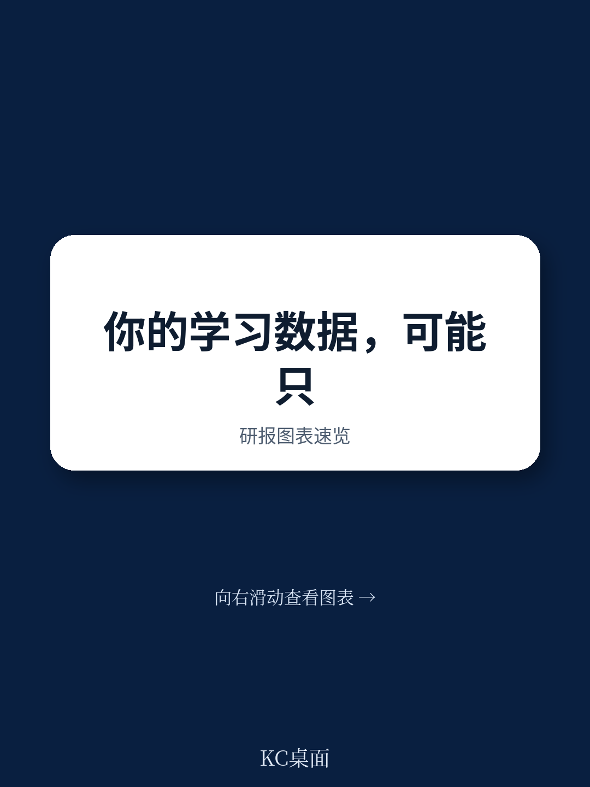
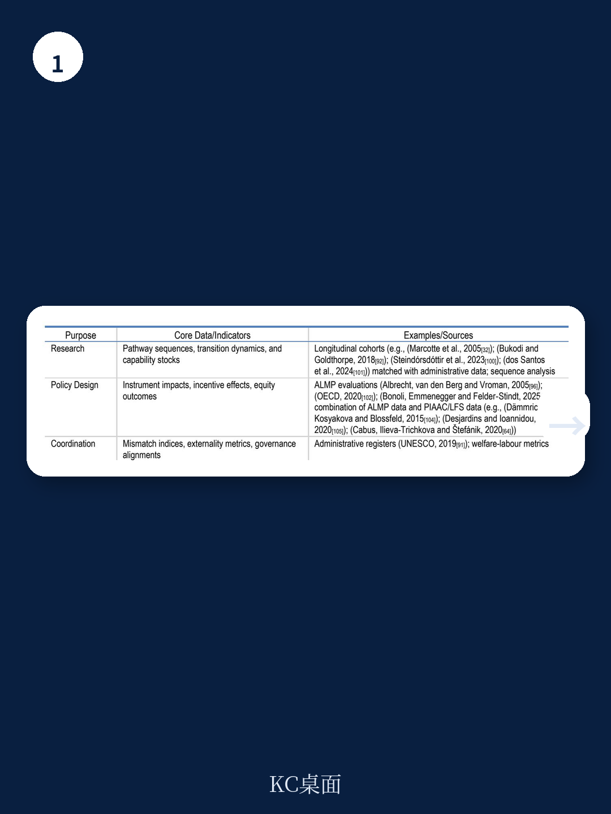
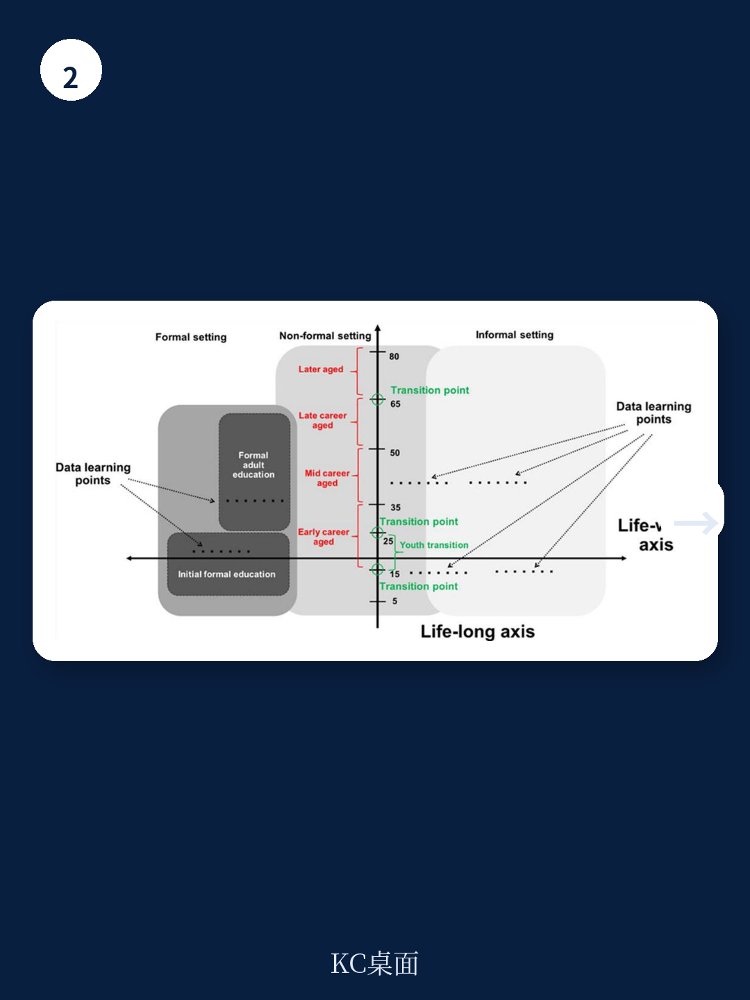

# 经合组织：终身学习测量框架的概念基础

终身学习已成为应对人口老龄化、技术变革和技能需求演化的核心政策工具。但经合组织在一份新发布的报告中指出，当前国际数据系统对终身学习的测量仍停留在碎片化阶段。报告提出的核心判断是：现有测量体系主要围绕正式教育和特定年龄段的培训参与设计，无法捕捉学习在整个人生历程和多元场景中的真实分布。这一缺陷限制了政策制定者评估干预效果的能力。

报告识别出四个系统性局限。年龄覆盖过窄，多数国际调查聚焦25至64岁成年人，儿童期的非正式学习、65岁以上人群的技能维持几乎不可见。测量以横截面为主，无法追踪技能在关键生命转折点——如进入劳动力市场、职业转换、组建家庭或退休——的演变轨迹。结果指标过度偏向劳动力市场，学习带来的公民参与、健康素养、社会凝聚力和个人能动性等更广泛收益被排除在统计框架之外。非正式学习——发生在工作场所、家庭、社区和数字环境中的日常技能发展——恰恰是扩张最快的学习形态，却最缺乏测量工具。

> **KC评论：** 报告没有停留在“数据不够好”的批评上。它试图回答一个更根本的问题：如果从零设计一套终身学习测量体系，应该以什么为逻辑起点。答案不是“增加更多调查”，而是先重新定义“学习”本身。

报告提出的框架围绕三个相互关联的支柱组织：需求、供给和协调。需求捕捉个体、组织和社区三个层面的学习需要；供给将学习机会映射到四个制度集群——正式教育系统、雇主和工作场所学习、福利政策系统、以及公民社会；协调则聚焦于将需求与供给对接的机制。这一结构将分析重心从“教育参与率”转移到“社会如何使人们在整个生命历程中持续学习”。

在概念层面，报告引入了一个基于形式化和数字化两个维度的学习活动分类模型。传统上，学习被划分为正式教育、非正式教育和非正规学习，但这种分类在数字时代已显不足。在线教程、开放教育资源、工作嵌入式学习等混合形态既不完全属于传统类别，也难以被现有调查工具捕捉。报告建议用连续谱系替代离散分类，以更好反映学习活动在结构化和技术嵌入程度上的渐变。

对于数据系统建设，报告提出了五条具体路径：扩展调查覆盖至完整生命历程；建立纵向数据链接，使PISA与PIAAC等调查之间形成可追踪的队列；整合行政记录，如社保、就业和培训注册数据；开发可携带的学习记录或技能护照；以及利用高级分析技术处理非结构化数据。报告承认这些路径没有一条是容易的，但强调可行性不应限制对“社会需要知道什么”的愿景设定。

> **KC评论：** 报告最值得注意的并非具体建议，而是它选择不做什么。它没有要求立即建立一套全球统一的终身学习指标，而是先搭建概念地基。这种“先定义再测量”的策略，在国际统计史上曾多次塑造了后来可测量的对象——从国民账户体系到PISA的素养测评，都遵循了类似路径。

对于政策制定者和统计机构而言，这份报告提供了一个可复用的观察框架：任何终身学习系统的健康状况，都可以通过需求识别是否充分、供给分布是否多元、协调机制是否有效三个维度来诊断。报告在附录中列出了每个维度的核心指标、研究问题和政策问题清单，为后续数据开发提供了具体起点。
