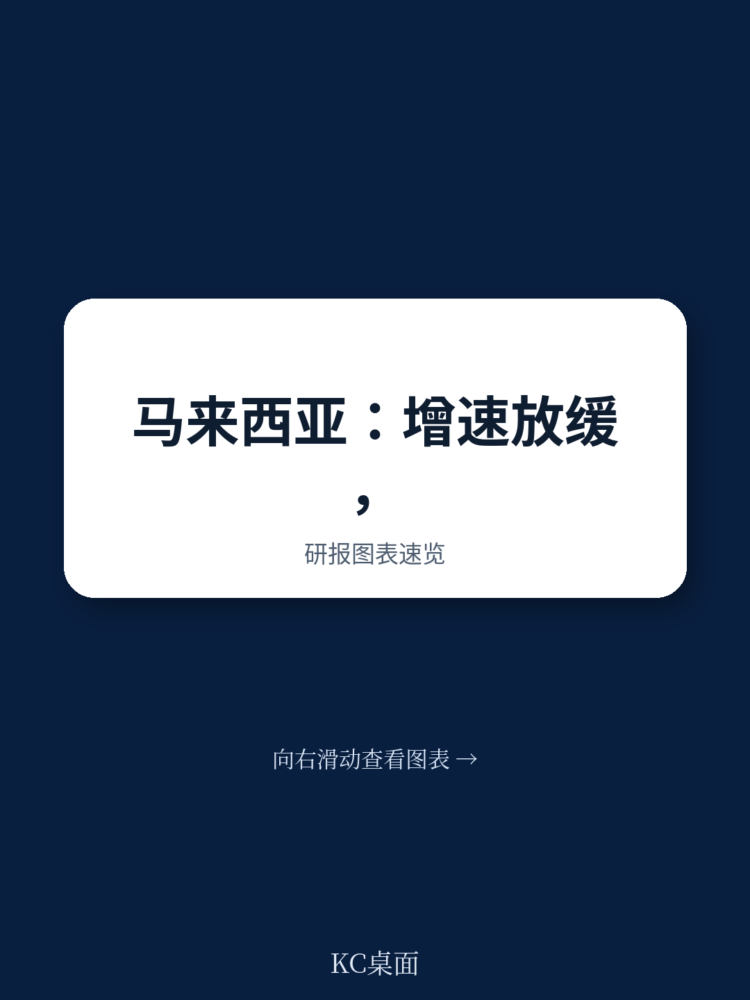
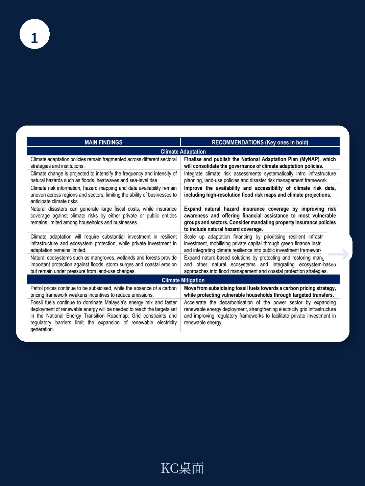
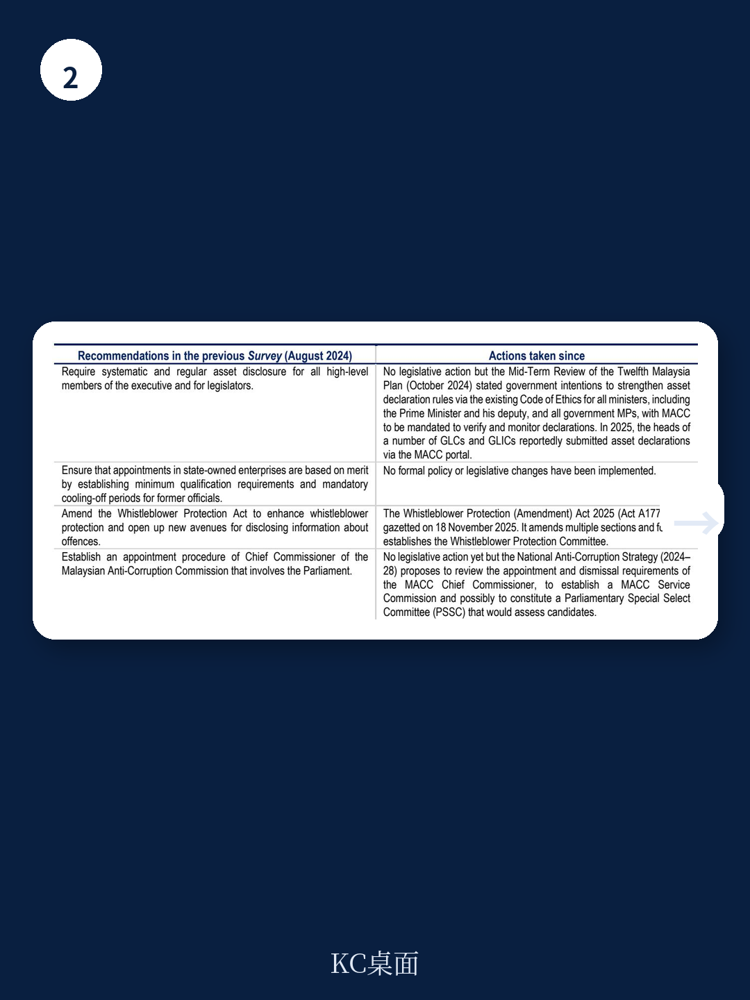

# 经合组织：马来西亚2026年宏观环境调查

马来西亚在过去几年展现出超出同侪的宏观环境韧性，但这份2026年7月发布的经合组织宏观环境调查指出，进一步改善生活水平的关键已从宏观稳定转向结构性改革。报告的核心判断是：马来西亚需要同时推进财政整固、生产力提升和教育体系改革，而这三者之间存在相互制约的关系——不解决教育质量下滑的问题，生产力目标就难以实现；不削减化石燃料补贴并重建增值税体系，财政空间就不足以支撑教育和气候适应支出。

报告选取的数据截止至2026年7月17日，覆盖了马来西亚2025年的基本宏观环境状况：人口3560万，GDP总量4732亿美元，人均购买力平价GDP约3.88万美元。过去五年平均实际增长5.2%，高于经合组织均值。但这份成绩单背后，有几个结构性信号值得关注。

## 1. 宏观环境增长开始节奏变化，财政整固不确定性上升

报告显示，马来西亚的增长在经历2022年后的冲击后已开始减速。通胀从2022年峰值回落，货币政策保持中性，政策利率近三年维持在3%左右。但公共债务占GDP比重已达70.1%，财政空间有限。报告特别指出，化石燃料补贴规模较大，与碳定价努力形成矛盾——马来西亚汽油价格处于全球极低水平，而碳排放尚未被有效定价。

> **KC评论：** 报告用“高化石燃料补贴与碳定价努力相矛盾”这一判断，点出了马来西亚财政改革的核心困境。补贴削减在政治上敏感，但若不推进，财政整固和气候目标都难以落地。读者可以留意报告建议中关于“重新引入广泛增值税并配合定向转移支付”的框架，这是许多新兴市场正在尝试的路径。

## 2. 生产力增长未达目标，监管与开放度仍有提升空间

报告第三章专门讨论生产力问题。尽管马来西亚的生产力水平高于多数同侪国家，但增速已趋势性下降。经合组织的产品市场监管指标显示，马来西亚在竞争友好型监管方面仍有较大改进空间。外商直接研究制度相对严格，主要体现在外资股权限制上。计算机服务贸易也存在壁垒。报告还指出，国有企业带来的市场扭曲程度较高，反腐败和反洗钱措施需要进一步加强。

这些发现指向一个核心矛盾：马来西亚在吸引全球数据中心研究和半导体产业链转移方面表现活跃，但国内监管环境并未同步优化到足以支撑长期生产率提升。

## 3. 教育成果持续下滑，成为长期增长的最大制约

报告第四章用大量篇幅分析了教育问题，这是整份调查中数据最密集、判断最尖锐的部分。马来西亚15岁学生在2022年PISA测试中的阅读、数学和科学成绩分别为388分、409分和416分，均显著低于经合组织平均水平（476分、472分、485分）。更值得关注的是，马来西亚低表现学生比例高，高表现学生比例低，且私立与公立学校之间的PISA成绩差距在扩大。

报告指出，政府教育支出占GNI比重为3.9%，低于经合组织均值4.4%，生均支出也相对较低。学前教育阶段生均支出远低于中小学阶段，而早期教育恰恰是决定后续学习成果的关键。学前教育注册率虽自2010年以来显著上升，但注册托儿中心在部分地区正在关闭。5岁以下儿童营养状况也在出现变化。

报告引用了波兰、巴西塞阿拉州等案例，说明系统性改革可以在较短时间内提升PISA成绩。马来西亚第十三个五年计划（2026-2030）已将教育列为重点，但报告认为需要更根本的改革，包括增加并优化学前教育到中学阶段的支出、建立教师专业发展框架、给予学校更多自主权和问责机制。

> **KC评论：** 报告对教育问题的分析值得仔细阅读。PISA成绩下滑并非马来西亚独有，但该国同时面临高技能岗位需求增长和毕业生技能错配的双重不确定性。报告提到“工人平均受教育年限快速上升”与“学习成果下降”并存，说明数量扩张并未带来质量提升。对于关注东南亚人力资本发展的读者，报告提供的国际比较和改革案例有参考价值。

## 4. 气候适应与减排需要更协调的政策框架

报告第二章评估了马来西亚的气候不确定性。洪水频繁且损失巨大，但自然灾害保险渗透率在亚太地区处于极低水平。温室气体排放主要由能源部门驱动，化石燃料依赖度高于同侪国家，电力结构以化石燃料为主。报告通过经合组织ENV-Linkages模型测算，实现净零排放需要更高的碳价格。

报告建议加强适应措施的协调性，同时继续推进减排。但财政约束意味着，碳定价改革必须与补贴削减和转移支付体系升级同步进行。

这份经合组织调查为马来西亚提供了一个全面的政策诊断框架。其核心信息是：过去五年的高增长部分受益于全球科技周期和资源禀赋，但下一阶段的增长将取决于国内改革的质量——尤其是在教育、财政和监管三个领域。报告没有给出简单的乐观或悲观结论，而是用数据和比较说明了改革的紧迫性和复杂性。

For informational purposes only. Portions may be generated,translated,summarized,or edited with AI assistance based on source materials and may contain omissions or errors. Please verify independently. This is not investment,legal,tax,accounting,or other professional advice.

