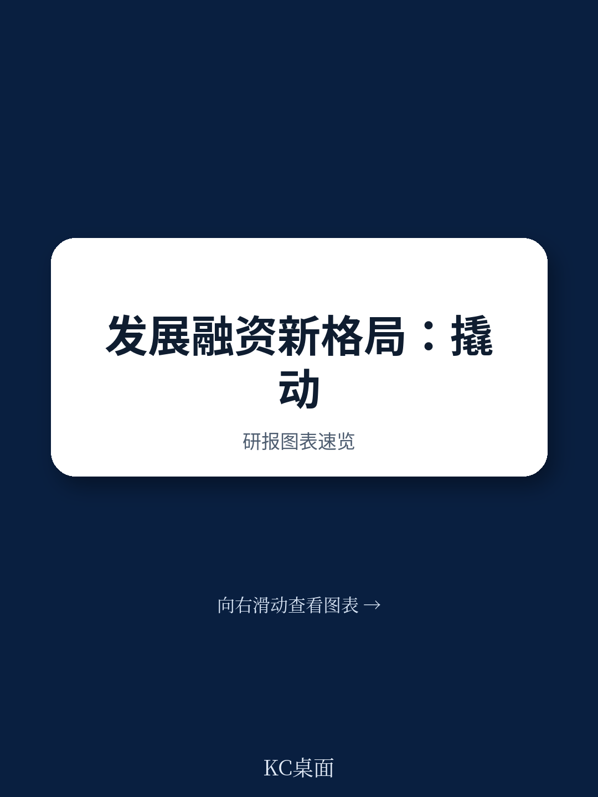
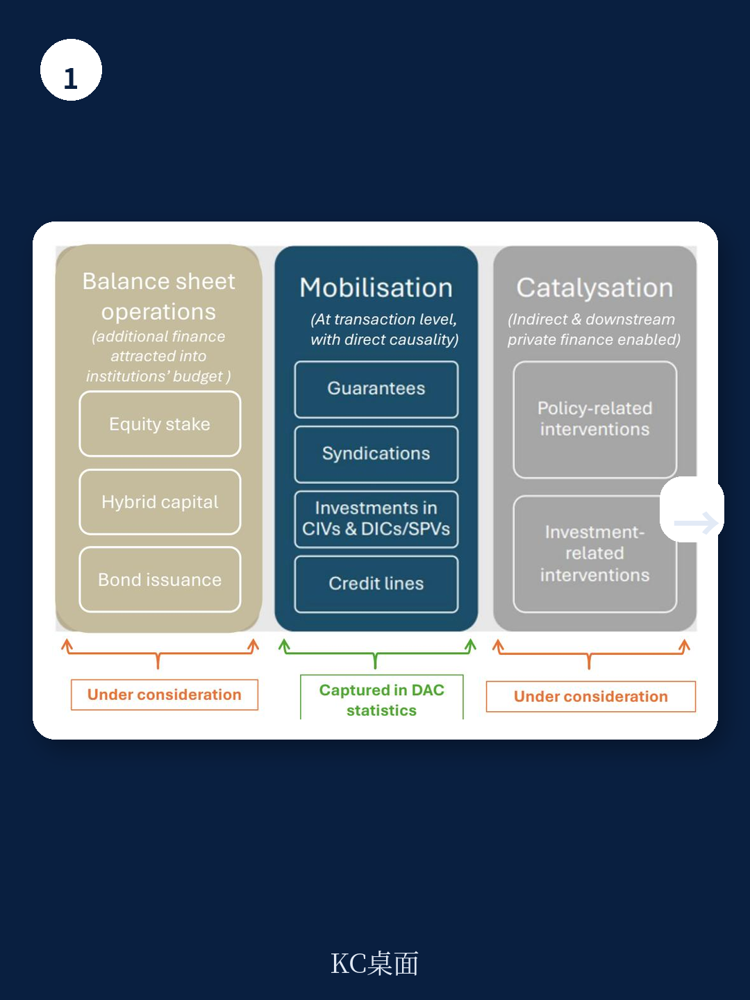
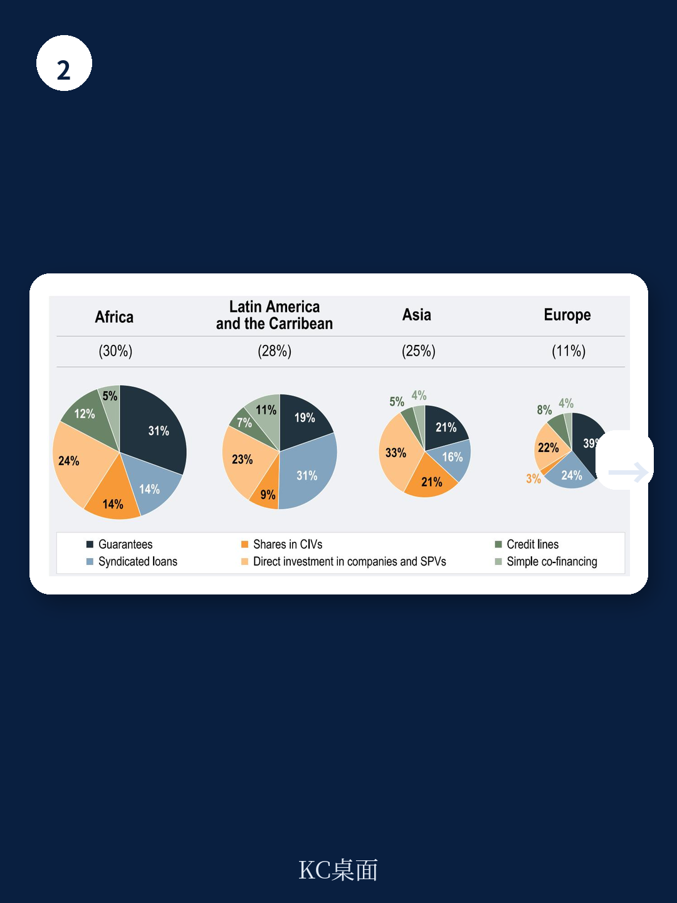

# 经合组织：私人融资动员报告2026

2024年，官方发展融资干预撬动的私人资本达到770亿美元，创下2012年有统计以来的最高水平。但这份经合组织2026年发布的报告同时指出，这一规模仍远低于实现可持续发展目标所需的资金缺口。更值得关注的是，动员成果高度集中在少数工具、机构和市场——非洲和拉美合计吸收了近六成资金，而低收入国家仅获得8%。

报告的核心判断是：私人融资动员在总量上取得了进展，但结构性瓶颈并未突破。不确定性感知、工具适配性和数据透明度，才是制约规模化的根本因素。

## 1. 担保与直接研究构成主要杠杆，但工具集中度偏高

2012年至2024年间，官方发展融资干预累计撬动超过6000亿美元私人资本。其中，担保工具贡献了30%，直接研究于公司（DIC）占25%，银团贷款占16%。这三种工具合计占比超过七成，反映出当前动员体系高度依赖不确定性分担和市场参与型工具。

报告特别指出，2021-2024年间，动员规模呈现逐步上升趋势，2024年达到770亿美元的峰值。但这一增长主要来自少数大型项目和成熟市场的重复操作，而非新工具或新市场的突破。工具集中度偏高意味着，一旦担保或银团贷款市场出现波动，动员能力将直接承压。

> **KC评论：** 担保和直接研究是当前最有效的杠杆，但它们的成功依赖于成熟的法律和资金基础设施。对于低收入国家和脆弱地区，这些条件往往不成立，因此工具本身无法自动解决“不确定性溢价过高”的问题。

## 2. 非洲与拉美是最大受益区域，但资金流向与不确定性偏好高度相关

从区域分布看，非洲在2021-2024年间年均获得197亿美元，占总量的30%，成为最大受益区域。拉丁美洲和加勒比地区以年均180亿美元紧随其后，占28%。国家层面，巴西和印度是最大单一接收国，年均分别获得约65亿和57亿美元。

然而，资金流向与不确定性偏好高度相关。报告数据显示，中等收入国家（非最不发达国家）吸收了近70%的动员资金，而低收入国家仅占8%。在脆弱国家和小岛屿发展中国家，动员规模更小，且主要依赖担保和银团贷款等传统工具。报告认为，这反映出私人资本对高不确定性市场的结构性回避，而非需求不足。

> **KC评论：** 巴西和印度之所以成为最大接收国，不是因为它们的资金缺口最大，而是因为它们的市场不确定性被评估为“可接受”。这提示我们，动员规模的增长并不自动等于发展效果的提升，资金是否流向最需要的地方才是关键。

## 3. 气候行动占四成，但适应领域严重不足

气候相关领域是动员资金的重要去向。2021-2024年间，约40%的动员私人资本（年均262亿美元）支持了气候行动。其中，近70%用于减缓气候变化，22%同时覆盖减缓和适应，仅有8%专门用于适应领域。

报告特别指出，尽管脆弱国家对气候适应的需求持续上升，但适应类项目因回报周期长、收益难以量化，对私人资本的吸引力有限。在钢铁、水泥和化工等高排放行业，动员资金主要流向减排技术，而非适应型基础设施。这种结构性失衡意味着，最需要适应资金的国家和行业，反而最难以获得动员支持。

## 4. 多边开发银行主导，双边机构扮演补充角色

从机构角度看，多边开发银行（MDBs）是最大的动员主体，贡献了总量的71%。双边机构中，美国以年均65亿美元领先，法国和英国各约21亿美元，主要通过各自的发展机构（DFIs）运作。

报告同时指出，近年来政策讨论中出现了更多创新动员机制，如联合担保计划、混合融资设施和主题债券发行。这些方法试图超越单一工具模式，实现更大规模和更高效率。但报告也承认，这些创新仍处于早期阶段，缺乏系统的数据追踪和效果评估。

## 5. 数据透明度与测量框架仍是规模化前提

报告反复强调，当前动员数据的全面性、一致性和透明度仍有提升空间。虽然OECD DAC统计框架提供了国际可比的数据基础，但许多创新工具（如催化干预、资产负债表优化、生成式动员）尚未被纳入正式统计。报告建议，扩大测量框架可以更完整地反映公共发展融资如何支持私人资本规模化。

此外，报告指出，改善数据质量有助于缩小“真实不确定性”与“感知不确定性”之间的差距，尤其是在高不确定性市场。信息不对称是私人资本回避发展中国家的核心原因之一，而更透明的数据披露可以部分缓解这一问题。

---

For informational purposes only. Portions may be generated,translated,summarized,or edited with AI assistance based on source materials and may contain omissions or errors. Please verify independently. This is not investment,legal,tax,accounting,or other professional advice.

