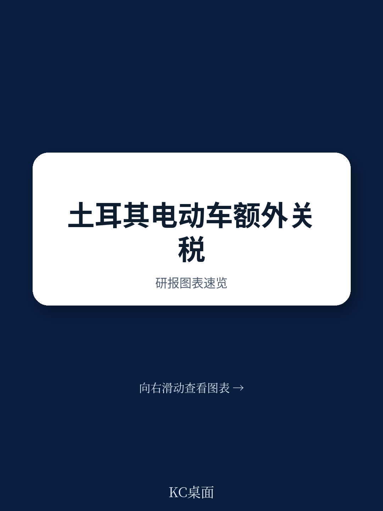

# 世界贸易组织：土耳其电动汽车措施被裁定违反GATT

世界贸易组织争端解决专家组在一份近期报告中，就中国针对土耳其提出的多项贸易措施申诉作出裁定。报告的核心结论是，土耳其对进口电动汽车及部分混合动力汽车征收的附加关税，以及其推行的进口许可本地化要求，均违反了GATT 1994的相关条款。这一裁定不仅涉及具体产品的市场准入，也触及区域贸易协定与最惠国待遇原则之间的边界问题。

专家组认定，土耳其通过总统令第10436号对电动汽车及特定混合动力汽车加征的额外关税，超出了其在GATT 1994下承诺的约束税率，违反了第II:1(b)条。同时，该措施因给予来自区域贸易协定伙伴的同类产品更优惠待遇，而未给予中国产品同等优惠，也违反了第I:1条的最惠国待遇原则。土耳其曾以保护人类及动植物生命健康（第XX(b)条）和保护可用竭自然资源（第XX(g)条）为由进行抗辩，但专家组认为土耳其未能充分证明其附加关税与这些目标之间的必要关联。

## 1. 区域贸易协定例外不适用于委内瑞拉

在关于最惠国待遇违反的裁定中，专家组认可了土耳其援引GATT第XXIV条（区域贸易协定例外）的正当性，但有一个关键例外。土耳其对来自其区域贸易协定伙伴的车辆免除了附加关税，这一做法整体上被裁定为符合区域贸易协定的要求。然而，对于来自委内瑞拉的车辆，专家组认为土耳其未能证明该豁免符合第XXIV条、《授权条款》或第XX(b)条与第XX(g)条的要求。这意味着，土耳其对委内瑞拉车辆的关税豁免，构成了对中国产品的歧视性待遇，且缺乏合法依据。

> **KC评论：** 这一判断揭示了区域贸易协定例外的边界：协定伙伴的名单并非自动获得豁免权。如果某个伙伴国与土耳其的贸易安排未能满足GATT第XXIV条关于“实质上所有贸易”自由化的标准，那么对该伙伴的优惠待遇就可能被认定为对其他WTO成员（如中国）的歧视。这为未来类似争端中审查区域贸易协定覆盖范围提供了具体判例。

## 2. 进口许可本地化要求构成国民待遇违反

除了关税措施，中国还针对土耳其的“进口许可本地化要求”提出了申诉。该要求涉及电动汽车和可充电混合动力汽车在进口时，必须满足在服务站点、能力证书、呼叫中心、授权代表及电池承诺等方面的本地化条件。专家组裁定，这些要求及其执行机制，使得来自中国的产品在土耳其国内市场获得了低于土耳其同类产品的待遇，违反了GATT 1994第III:4条的国民待遇原则。土耳其试图以第XX(d)条（确保遵守国内法规所必需）进行抗辩，但专家组认为土耳其未能证明每一项要求及其执行机制都是为了“确保遵守”其消费者保护法和型式批准法规所必需的。

## 3. 专家组对部分主张行使司法节制

值得注意的是，专家组在裁定附加关税违反第II:1条、本地化要求违反第III:4条后，决定对中国提出的其他主张行使司法节制。具体而言，专家组认为，在已经认定土耳其的进口许可本地化要求违反国民待遇原则后，再对其是否同时违反最惠国待遇（第I:1条）、行政管理的统一公正合理（第X:3(a)条）以及普遍取消数量限制（第XI:1条）进行额外裁定，对于解决争端已无必要。这一做法体现了WTO争端解决机制中避免重复裁定的司法宏观环境原则，也意味着报告的核心结论聚焦于关税约束和国民待遇这两个最根本的贸易规则违反。

**观察框架：** 在评估一国贸易措施是否合规时，可以依次审视三个层面：措施是否违反了具体的市场准入承诺（如关税约束）；措施是否在进口产品与国内产品之间造成了歧视（国民待遇）；以及措施是否在来自不同国家的进口产品之间造成了歧视（最惠国待遇）。本报告显示，即使一项措施在某一层面被认定为违反规则，其援引的例外条款（如健康、环境或区域贸易协定）也需要提供严格且具体的证据支持。

For informational purposes only. Portions may be generated,translated,summarized,or edited with AI assistance based on source materials and may contain omissions or errors. Please verify independently. This is not investment,legal,tax,accounting,or other professional advice.

