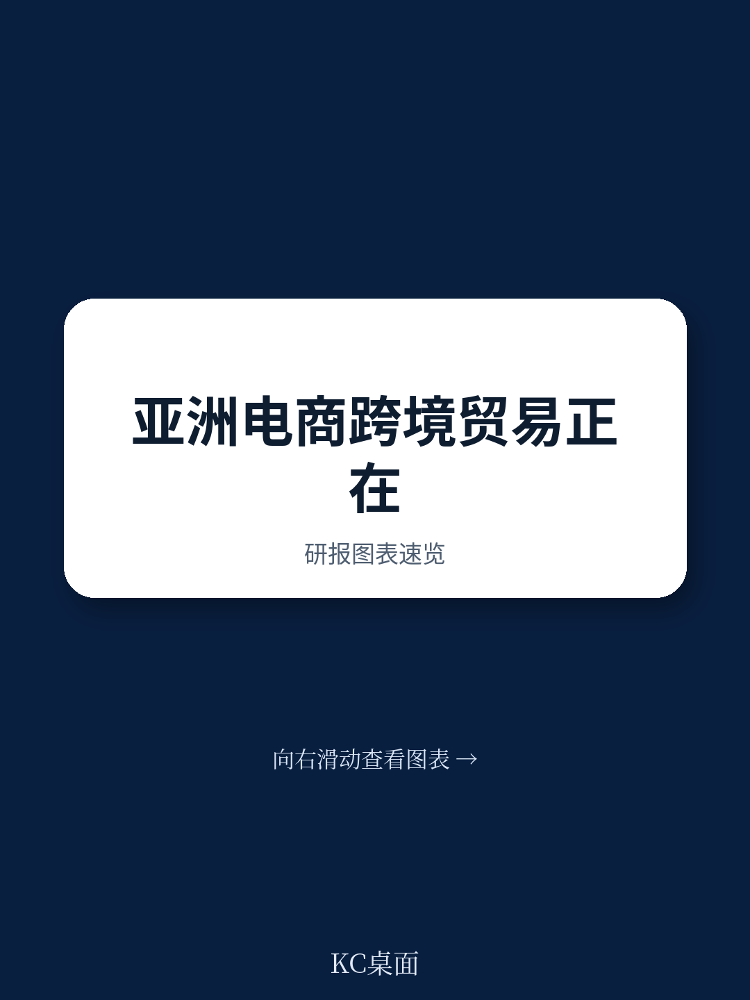
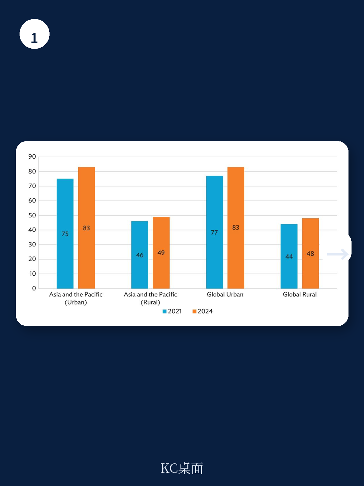
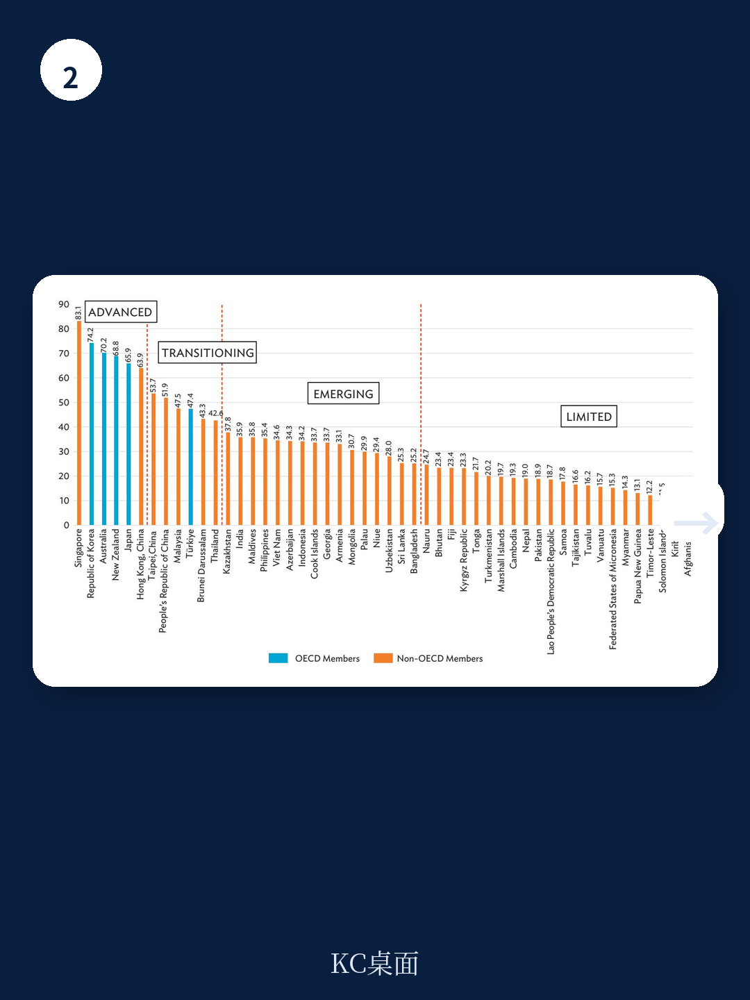

# 亚洲开发银行：推进亚太数字贸易与跨境电子商务

亚太地区正经历一场由数字技术驱动的贸易转型。亚洲开发银行最新政策简报指出，全球电子商务销售额在2016年至2022年间增长了近60%，达到27万亿美元，而全球增长最快的10个电子商务地区中，有7个位于亚太地区。这一区域贡献了全球近三分之二的电子商务销售额，移动支付覆盖约70%的交易。然而，该机构同时强调，这些增长红利在各国、各行业和企业之间的分布极不均衡。

报告的核心判断是：亚太地区跨境电子商务的增长潜力巨大，但结构性障碍——尤其是监管碎片化、合规成本上升和信任缺失——正在限制其普惠性发展。政策制定者需要构建适应性更强、可互操作的监管框架，而非简单复制现有规则。

## 1. 数字服务出口在过去十五年间增长近四倍

亚洲开发银行数据显示，自2005年以来，亚太地区的数字服务出口规模几乎翻了两番。电子商务销售额自2016年以来也实现翻倍。这一增长背后是快速演变的数字生态系统，包括在线市场、数字支付、物流网络和数字化供应链的协同作用。社交电商、直播购物、游戏化营销和基于应用程序的零售等新业态正在年轻消费者中快速普及。

报告特别指出，这些发展通过更高效地匹配买卖双方、简化海关和合规流程、降低交易成本，正在改变生产和消费模式。但不同地区的受益程度差异显著。在中国台北、韩国和新加坡，数字宏观环境对GDP的贡献率分别为6.1%、5.8%和5.4%，而在菲律宾仅为2.5%，在老挝和柬埔寨则只有1.8%。

> **KC评论：** 这一差距并非简单的“数字鸿沟”，而是基础设施、数字素养和制度能力三者叠加的结果。报告认为，新兴地区在电子商务领域仍有显著增长空间——例如印尼电子商务已占其数字宏观环境的72%，预计到2025年将达到1460亿美元，占GDP的9%至10%。

## 2. 中小企业参与度偏低，但已有可复制的成功案例

亚太地区的中小微企业占企业总数的97%，贡献了69%的就业和41%的GDP。然而，它们在跨境电子商务中的参与度仍然偏低。报告指出，大型企业因拥有更好的融资渠道、技术能力和熟练劳动力而占据优势，而中小微企业——尤其是位于农村、偏远或欠发达地区的企业——在连接性、能力和规模方面面临持续障碍。

但报告同时提供了可借鉴的案例。中国的“淘宝村”模式展示了如何通过平台赋能实现普惠增长。这些村庄拥有29600家活跃网店，分布在5425个村庄，累计交易额超过1万亿元人民币。阿里巴巴提供平台和物流网络，帮助小型农村生产者对接全国乃至全球市场，同时降低了交易成本。这一模式不仅推动了农村发展，还促进了宏观环境结构从农业向高附加值制造业和服务业的转型。

阿塞拜疆的出口促进门户网站则是另一个案例。该平台帮助3500家企业进入122个地区的市场，提升了本地企业在国际平台上的参与度。

## 3. 贸易协定推动数字服务增长，但执行层面仍存挑战

区域贸易协定正在为跨境电子商务提供制度框架。世界贸易组织的电子商务联合声明倡议、区域全面宏观环境伙伴关系协定和全面与进步跨太平洋伙伴关系协定都已纳入电子商务章节，涉及跨境数据流动、数字贸易便利化和监管合作等条款。

实证研究表明，这些协定显著促进了数字服务贸易，尤其是在资金、信息技术和文化服务领域。新加坡采取了多轨策略，在参与东盟、RCEP和CPTPP的同时，还签署了六项双边数字宏观环境协定。

但报告也指出，现有协定仍存在不足。RCEP覆盖范围广，但数字贸易承诺的深度有待加强；CPTPP规则更为先进，但成员国在实施层面面临挑战。监管碎片化、法律重叠以及现有规则多为“软性”约束，仍是制约跨境电子商务扩张的主要障碍。

## 4. 资金科技是重要推动力，但城乡差距依然显著

资金科技正在成为跨境电子商务的关键支撑，尤其是在跨境支付和扩大资金包容性方面。报告数据显示，菲律宾和越南等新兴地区的资金科技采用率甚至超过了一些成熟市场。吉尔吉斯共和国的MBANK平台是一个典型案例——该平台已覆盖该国约80%的成年人口，通过数字资金拓宽了支付系统接入渠道，促进了跨境交易。

然而，资金科技的快速扩张也带来了网络安全威胁、欺诈和过度负债等不确定性。更关键的是，城乡之间的资金科技使用差距仍然显著，反映出数字素养和基础设施方面的不平等。

报告认为，要释放跨境电子商务的全部潜力，需要综合性的政策框架：研究基础设施、推动支付系统互操作性、协调监管规则、培养数字技能，并建立强有力的数据、网络安全和消费者保护体系。这些措施并非可选项，而是实现包容性增长的先决条件。

For informational purposes only. Portions may be generated,translated,summarized,or edited with AI assistance based on source materials and may contain omissions or errors. Please verify independently. This is not investment,legal,tax,accounting,or other professional advice.

