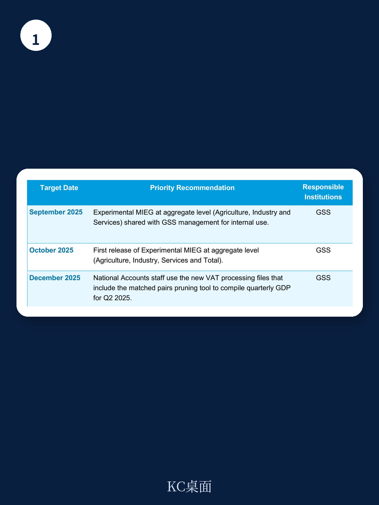

# IMF：研究主题与行业变化观察

2025年11月，IMF发布技术援助报告，总结了为加纳统计服务局（GSS）开发月度宏观环境增长指标（MIEG）的成果。这项由Data for Decisions产品资助的能力建设项目，核心目标是建立一套与《IMF季度国民账户手册（2017）》对齐的月度宏观环境监测框架。报告显示，项目已成功构建增值税数据库，并开发数据清洗工具，为加纳宏观环境统计的时效性和质量带来实质性提升。

项目通过三次实地任务推进。2023年7月的首次任务引入了MIEG编制框架，并识别出制造业、批发零售、运输仓储、房地产等多个行业对增值税记录的依赖——但当时增值税数据格式不可用。2024年7月的第二次任务重点解决了数据格式问题，团队与GSS工作人员共同创建了支持时间序列分析的增值税数据库。最近一次任务则聚焦于分析增值税数据并将其整合进MIEG编制流程。

## 1. 增值税数据库成为月度与季度GDP编制的共同基础

报告指出，新开发的增值税数据库是项目最关键的成果之一。它不仅服务于MIEG的月度编制，也直接用于季度GDP核算。这意味着加纳宏观环境统计体系首次拥有了一个跨行业、可追溯时间序列的增值税数据源，覆盖了此前依赖手工调整的多个行业。

> **KC评论：** 增值税数据的结构化处理，本质上解决了“月度高频指标”与“季度核算体系”之间的数据口径统一问题。此前两者因数据来源不同而出现偏差，现在有了共同的底层数据基础。

项目还引入了“匹配对修剪工具”用于清洗增值税销售数据。这一工具能有效降低原始数据中的噪音和不一致性，提升MIEG估算的准确性。报告显示，该工具已针对所有依赖增值税销售数据的行业完成开发。

## 2. MIEG与季度GDP存在差异，根源在于季度系统的临时调整

尽管MIEG编制结果与已发布的季度GDP数据总体趋势一致，但报告明确指出了两者之间的差异。这些差异主要源于季度GDP系统中的临时性调整——即为了满足特定发布要求而对数据进行的非标准化处理。IMF团队建议加纳统计服务局逐步过渡到使用MIEG项目开发的新增值税文件，以确保月度与季度宏观环境指标的一致性。

报告认为，正在进行的GDP基期调整项目是完成这一迁移的最佳窗口期。将新数据处理文件整合进基期调整流程，可以进一步巩固数据质量的改善成果。

## 3. 实验性MIEG数据已启动月度发布，发布节奏有明确安排

加纳统计服务局计划每月发布实验性MIEG数据。报告建议，第三个月的MIEG数据应与季度GDP同步发布，以强调两者的一致性。初始发布延迟超过60天被认为是合理的——这为GSS工作人员和数据提供者适应新的数据收集和编制节奏留出了空间。

首个实验性MIEG已于2025年10月发布，覆盖2024年1月至2025年7月的月度数据。报告还列出了具体的优先建议时间表：2025年9月向GSS管理层内部共享按农业、工业、服务业分组的实验性MIEG；2025年10月首次公开发布包含农业、工业、服务业和总计的MIEG；2025年12月，国民账户团队应使用包含匹配对修剪工具的新增值税处理文件编制2025年第二季度的季度GDP。

这份报告展示了一个典型的技术援助项目如何通过数据基础设施的改造，提升一个国家的宏观环境统计能力。增值税数据库的建立和清洗工具的开发，为加纳提供了更可靠的宏观环境监测手段。而MIEG与季度GDP之间的差异及其协调路径，也揭示了发展中国家在统计体系现代化过程中面临的普遍挑战：数据来源的统一与编制流程的标准化，往往比技术工具的引入更需要制度层面的协调。

For informational purposes only. Portions may be generated,translated,summarized,or edited with AI assistance based on source materials and may contain omissions or errors. Please verify independently. This is not investment,legal,tax,accounting,or other professional advice.

