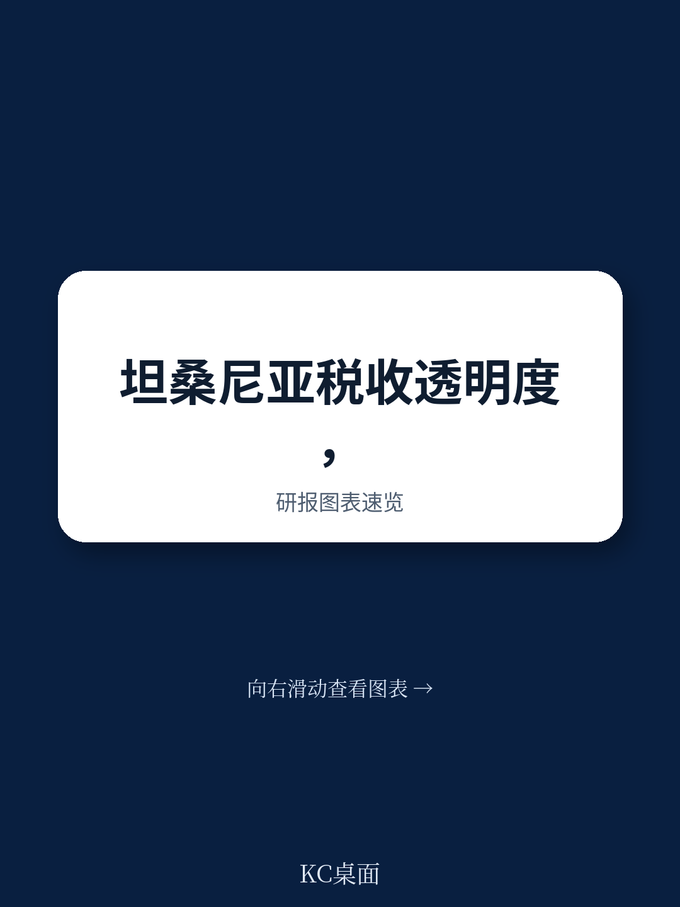
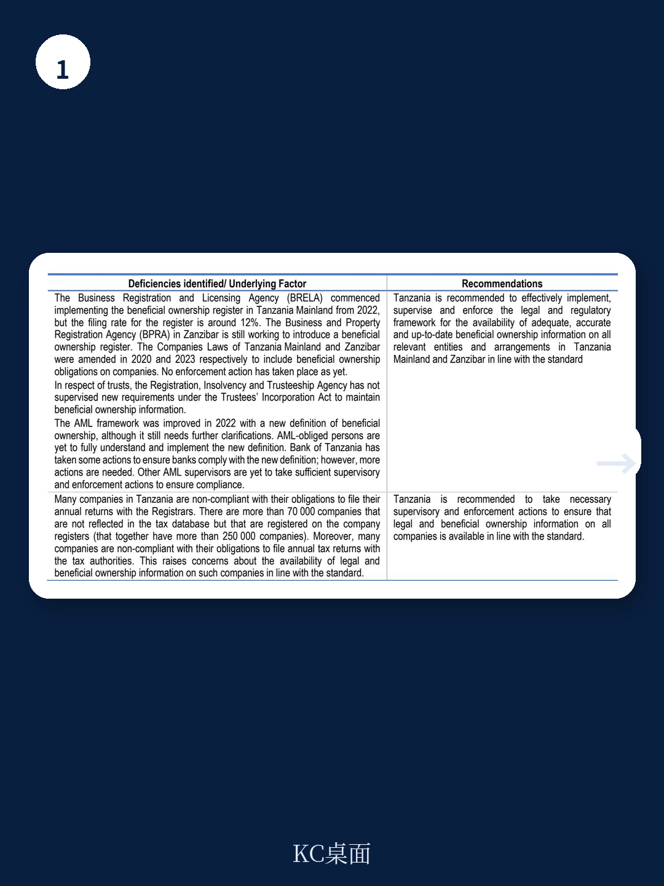
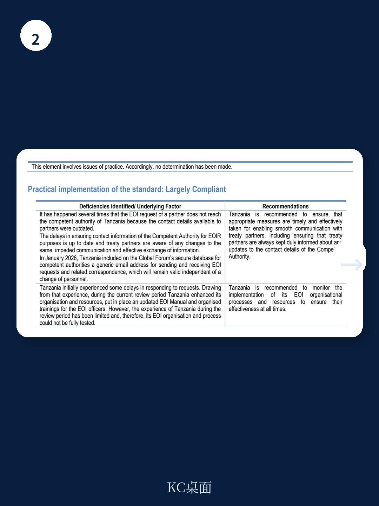

# 经合组织：坦桑尼亚税务信息交换同行评审

坦桑尼亚在2026年7月获得全球税务信息交换论坛（Global Forum）的“大体合规”总体评级。这是该国自2015年加入该论坛以来首次获得完整合规评级。报告基于2022年4月至2025年3月的评审期，评估了坦桑尼亚在应请求信息交换（EOIR）标准下的法律框架与实际执行情况。

在十个评估要素中，坦桑尼亚在五个要素上获得“合规”评级，四个要素获得“大体合规”，但所有权与身份信息可用性（要素A.1）仅获“部分合规”。这一短板直接影响了总体评级，也揭示了坦桑尼亚在透明度框架中最需要修补的环节。

## 1. 所有权信息可用性存在结构性缺口

坦桑尼亚大陆与桑给巴尔的公司法均要求公司保存并提交法律所有权信息。2021年后，两地相继引入受益所有权登记制度，大陆已建立中央受益所有权登记册并开始运行，桑给巴尔的登记系统仍在建设中。

但报告指出两个关键缺口。其一，坦桑尼亚法律允许名义持股，却未要求名义持有人向公司或任何公共机构披露其名义身份。这意味着实际出资人的信息可能无法被税务机关获取。其二，桑给巴尔法律允许上市公司发行不记名公司权证，虽然2022年修法赋予注册机关一定监督权，但权证持有人的身份信息仍无法保证可用。

> **KC评论：** 名义持股与不记名权证是国际税务透明度审查中的经典“漏洞”。坦桑尼亚在这两个问题上尚未达到标准，意味着即使其国内法要求保存受益所有权信息，实际控制人仍可能通过这两类安排隐藏身份。

## 2. 受益所有权定义与更新频率仍需完善

2022年，坦桑尼亚更新了反洗钱法律，对受益所有人给出了大体符合国际标准的定义。该定义也适用于公司法、合伙法和信托法下的实体义务。但报告认为，对于公司而言，“通过所有权以外的方式控制”这一概念缺乏指引；对于合伙或信托中的法律实体或安排，也未明确“穿透识别”的方法。

另一个实操问题是受益所有权信息的更新频率没有法定要求。报告指出，这可能导致部分实体的受益所有权信息过时，影响要素A.1（所有权信息）和要素A.3（银行信息）的可用性。反洗钱监管机构的监督力度也不均衡，需要加强。

## 3. 信息交换网络规模有限且部分条约不合规

坦桑尼亚目前仅有13项避免双重征税协定，其中11项已生效。报告认为这一网络规模偏小。更关键的是，其中5项协定不符合现行标准，可能限制坦桑尼亚能够交换的信息范围。

坦桑尼亚于2012年签署了南部非洲发展共同体税务互助协议，但至今未完成批准和通知程序。报告指出，其他缔约方早已完成各自步骤，坦桑尼亚的延迟已超出合理范围。评审期内，坦桑尼亚仅收到2项信息请求、发出4项请求。由于主管官员变更，其联系方式在评审期最后六个月出现错误，导致条约伙伴不得不重新发送请求。

> **KC评论：** 信息交换网络的大小和条约质量直接影响坦桑尼亚作为信息交换伙伴的可信度。5项不合规条约意味着即使对方提出合法请求，坦桑尼亚也可能无法提供所需信息。而联系方式错误这类基础问题，在实操层面会直接导致请求延误或丢失。

## 4. 会计记录保存要求存在地域差异

坦桑尼亚大陆已修订法律，明确了公司终止后会计记录的保存义务和责任人。但桑给巴尔的法律框架仍存在这一空白。报告建议坦桑尼亚统一两地要求，确保所有实体在解散后仍能提供必要的会计记录。

此外，存在大量未按规定注册或提交文件的“不合规公司”，这些公司对法律所有权、受益所有权和会计信息的可用性均构成不确定性。报告建议坦桑尼亚采取适当的监督措施，减少这类公司的数量及其带来的不确定性。

坦桑尼亚在评审期内增加了信息交换的资源投入，并更新了操作手册，但这些改进的实际效果尚无法充分评估。报告建议坦桑尼亚持续监测信息交换职能的运行效率，并确保条约伙伴始终掌握主管机构的正确联系方式。

For informational purposes only. Portions may be generated,translated,summarized,or edited with AI assistance based on source materials and may contain omissions or errors. Please verify independently. This is not investment,legal,tax,accounting,or other professional advice.

