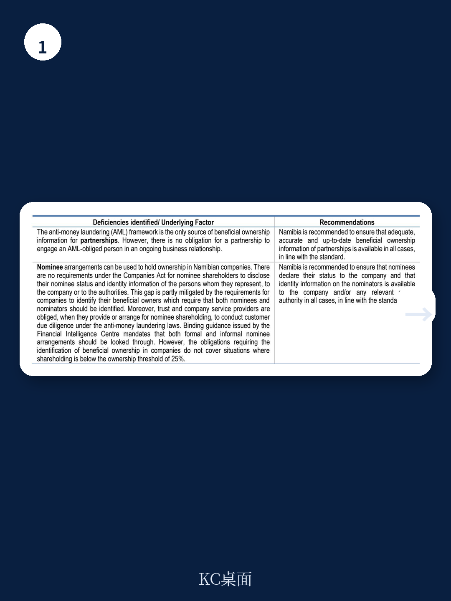
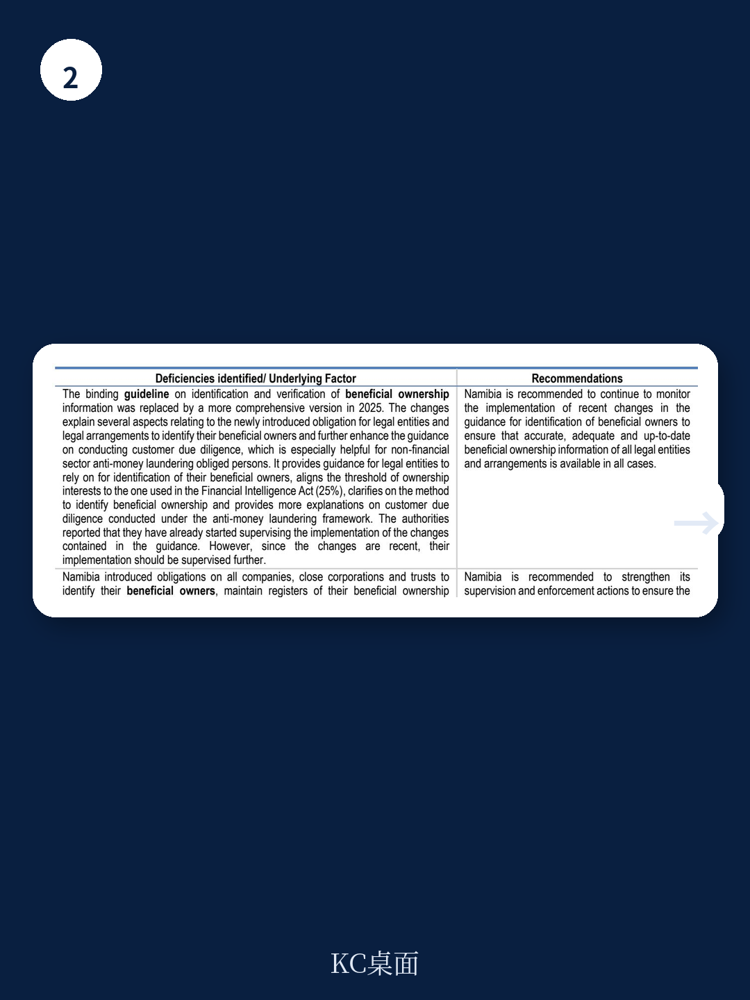

# 经合组织：行业规则与相关数据观察

2026年7月，全球税收透明度和信息交换论坛发布了对纳米比亚的第二轮同行评审报告。这份报告的核心结论是：纳米比亚在应请求税收信息交换标准上的整体评级为“大致合规”。这一评级并非简单的好坏二分，而是反映了该国在2022年至2025年评审期内，法律框架与实践执行之间存在的结构性张力。

纳米比亚2019年才加入全球论坛，这是其首次接受完整的法律框架与实践执行评估。报告覆盖了从2022年4月1日到2025年3月31日的评审期，法律框架评估基准日为2026年5月6日。值得注意的一个时间节点是：2026年6月19日，纳米比亚成功从资金行动特别工作组（FATF）的“加强监控”灰名单中退出，这一进展与其税收透明框架的完善直接相关。

## 1. 受益所有权信息制度已建立但执行尚未成熟

2023年，纳米比亚引入了要求所有公司、封闭公司和信托识别受益所有人、维护受益所有人登记册并向相关注册机构提交信息的义务。到评审期末，54%的公司、44%的封闭公司和63%的信托已提交受益所有人信息。其余未提交的实体目前被归类为“不活跃”。这一数据本身说明制度已启动，但覆盖面和执行深度仍处于早期阶段。

报告指出，当局已开始对提交数据进行质量和完整性检查，并计划引入进一步的验证措施和额外制裁。但关键问题在于：改革时间太短，监督和执法仍处于萌芽状态。这是整体评级无法达到“合规”的主要原因之一。

> **KC评论：** 受益所有权信息的可用性是全球税收透明标准的核心。纳米比亚的案例说明，立法通过只是第一步，真正决定评级的是后续的监督执行和数据质量验证能力。54%的提交率在改革初期不算低，但“不活跃”实体的定义和后续处理方式，才是检验制度有效性的关键。

## 2. 名义持股安排存在法律空白

纳米比亚公司法不要求名义股东披露其名义身份或所代表人员的身份。这一漏洞部分被公司识别受益所有人的义务所弥补，但该义务存在一个25%的持股门槛——当个人持股低于25%时，受益所有人识别义务不适用。

这意味着，通过分散持股或名义安排，仍有可能隐匿实际控制人。报告明确建议纳米比亚解决这一问题。对于跨国税务调查而言，这一漏洞可能成为信息获取的障碍。

## 3. 会计信息与银行记录的监督短板

在会计信息方面，实体需通过定期纳税申报提交会计信息。纳米比亚税务局已开展一系列监控、监督和执法活动，但部分实体，特别是中小纳税人，仍存在税务申报不合规问题。报告建议纳米比亚加强监督。

在银行信息方面，存在一个制度性缺口：当银行停止在纳米比亚运营或解散时，法律未要求其保留记录至少五年。这一缺口可能影响历史交易信息的可追溯性。

## 4. 信息交换实践中的能力建设过程

评审期内，纳米比亚收到22个信息交换请求，除2个批量请求仅得到部分回复外，其余均提供了完整回复。但报告揭示了一个值得关注的过程：评审初期，主管当局对收集所请求信息的程序理解有限，这严重影响了及时回复能力。通过员工培训和流程正规化，到评审期末，信息交换处理效率出现实质性改善。

这一过程表明，信息交换能力不是静态的，而是可以通过制度建设逐步提升的。纳米比亚在评审期后半段的表现改善，为其后续评级提升提供了基础。

## 5. 保密机制的潜在不确定性

报告指出，虽然纳米比亚的法律框架总体上确保了交换信息的保密性，但存在信息可能被披露给标准未设想的人员的情况。这一缺陷导致保密性要素被评定为“大致合规”。对于依赖信息交换进行税务调查的伙伴国家而言，保密机制的任何漏洞都可能影响信息共享的意愿。

纳米比亚的案例提供了一个观察窗口：一个新兴参与者在加入全球税收透明体系后，如何在短时间内构建合规框架，以及哪些环节最容易出现执行落差。对于其他正在构建税收透明制度的司法管辖区，这份报告中的经验与建议具有直接参考价值。

For informational purposes only. Portions may be generated,translated,summarized,or edited with AI assistance based on source materials and may contain omissions or errors. Please verify independently. This is not investment,legal,tax,accounting,or other professional advice.

