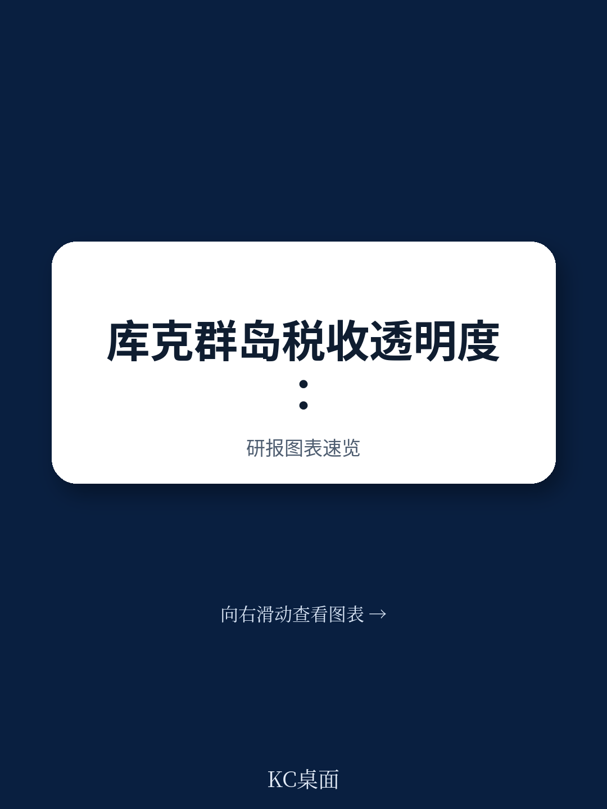
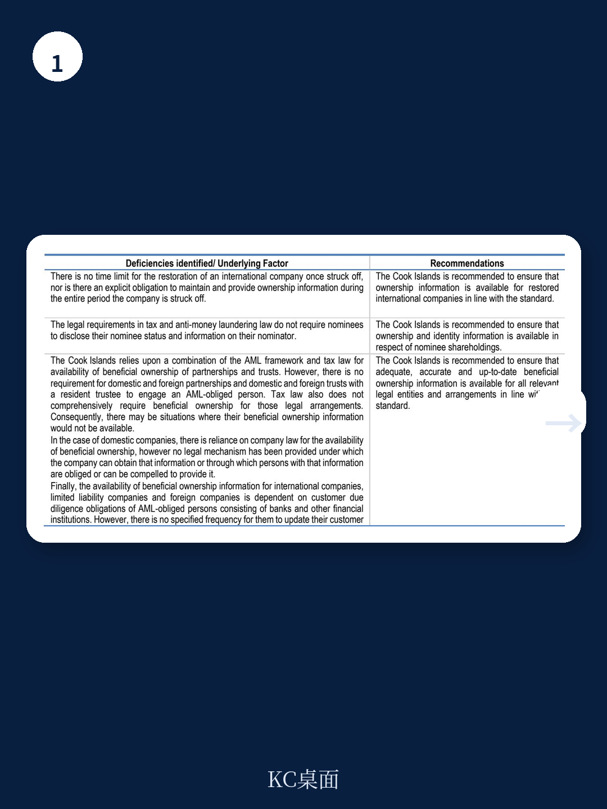
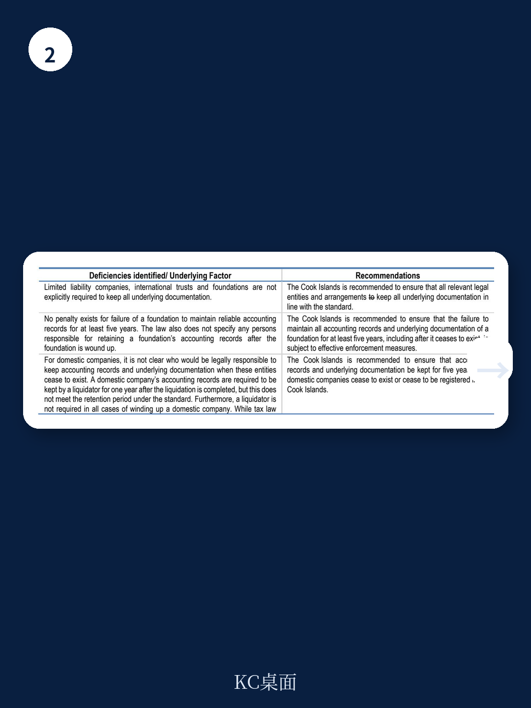

# 经合组织：行业规则与相关数据观察

全球税收透明度论坛于2026年7月发布的这份第二轮同行评审报告，对库克群岛在应请求税收信息交换（EOIR）标准下的合规情况做出了整体“大体合规”的评级。这一结论与2015年首轮评审结果一致，但报告同时指出，库克群岛在信息可用性三个核心要素上的评级均从“合规”下调至“大体合规”，反映出其法律框架与实践执行之间存在持续且未完全修复的差距。

评审覆盖2022年4月至2025年3月的审查期，库克群岛在此期间仅收到来自四个合作伙伴的七项信息交换请求，并全部完成回复，合作伙伴对信息质量表示满意。库克群岛自身也发出了六项请求。然而，信息交换量小并不意味着合规不确定性小——报告重点关注的并非请求处理效率，而是信息是否在法律上被要求留存、在实践中可被获取。

## 1. 受益所有权信息仍存在结构性缺口

库克群岛在2019年引入了国内公司受益所有人登记义务，2024年进一步修订了公司法与反洗钱法，强化了受益所有权信息的可用性要求。但报告指出，某些类型的合伙企业和信托——特别是国内合伙与信托，而非国际信托——并不必然与反洗钱义务主体建立关系。当这些法律安排没有银行账户或未聘请受监管的服务提供商时，受益所有权信息便无法通过反洗钱框架获取，而税法也未对此做出全面要求。

此外，名义持股在库克群岛是允许的，但公司法未对名义股东和被代持人设定披露义务，税法与反洗钱法同样未覆盖这一场景。这意味着，当一家公司存在名义持股安排时，监管机构可能无法获知真正的所有权人。

> **KC评论：** 名义持股与反洗钱覆盖盲区是国际税收透明度评估中常见的扣分项。库克群岛的问题不在于法律完全空白，而在于依赖“组合式”框架——公司法和反洗钱法各自覆盖一部分实体，但中间地带无人负责。对于在库克群岛设立实体但未与当地机构建立关系的读者而言，其所有权信息实际上处于不可获取状态。

## 2. 会计记录保存义务的延续性存在法律模糊地带

2015年首轮评审已就有限责任公司、国际信托和产品会未能保存所有底层原始凭证提出建议，本轮评审确认这些建议仍未得到完全落实。产品会若未能保存至少五年的可靠会计记录，目前没有对应的处罚措施。

更值得关注的是公司终止后的记录保存问题。一家公司完成清算后，清算人需保存记录至少一年，但一年至五年之间的记录由谁负责、存放在何处，法律未做明确规定。未经过清算程序直接注销的公司，其记录保存责任人更是完全缺失。这一模糊地带可能在实际信息交换请求中造成障碍——当合作伙伴在五年内提出请求时，库克群岛主管机关可能无法提供完整的会计记录。

## 3. 监管与执法力度不足影响信息可用性的实际保障

报告对国内公司的监管执行提出了明确建议。公司注册处和税务机关对国内公司的监督与执法存在显著不足，可能影响这些实体的法律所有权和受益所有权信息的可用性。税务机关对信托申报义务的监督同样不足以确保这些安排的身份与所有权信息可被获取。

在会计信息方面，税务机关对记录保存义务的监控与执法力度同样被判定为不足。这意味着，即使法律条文上要求保存记录，实践中若缺乏有效的抽查、处罚和追责机制，信息的实际可用性仍无法得到保障。

## 4. 国际公司注销后恢复机制缺乏时间限制

库克群岛允许国际公司在被除名后无限期恢复注册，且在整个除名期间没有明确的所有权信息保存与提供义务。报告指出，实践中被除名后又恢复的国际公司，几乎都在除名后一年内完成恢复，这一时间窗口仍在受托公司保存客户记录的义务期限内，因此该问题的实际影响目前较低。但法律框架上的缺口本身构成了合规不确定性——一旦出现超出一年窗口的恢复案例，信息可用性便无法保证。

## 5. 整体评级与后续监督安排

库克群岛在信息获取（B.1）、通知与权利保障（B.2）、信息交换机制（C.1、C.2）、保密性（C.3）、纳税人权利（C.4）以及回复质量与及时性（C.5）七个要素上均获得“合规”评级。但在信息可用性的三个要素——所有权与身份信息（A.1）、会计记录（A.2）、银行信息（A.3）——上均为“大体合规”。整体评级维持“大体合规”。

报告要求库克群岛按照强化监督方法提交自我评估报告，说明为落实建议所采取的措施。这意味着，库克群岛需要在下一轮评审前，在法律修订和执法实践两个层面同时推进整改，尤其是在名义持股、反洗钱覆盖盲区、记录保存延续性和监管执行力度等关键缺口上做出实质性改变。

For informational purposes only. Portions may be generated,translated,summarized,or edited with AI assistance based on source materials and may contain omissions or errors. Please verify independently. This is not investment,legal,tax,accounting,or other professional advice.

