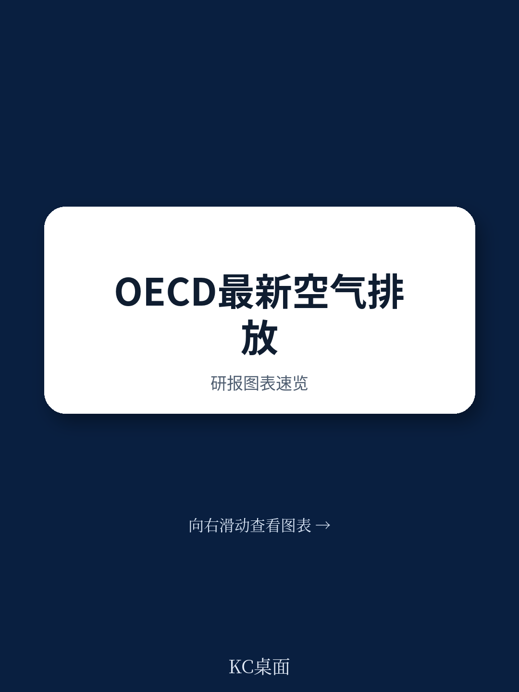
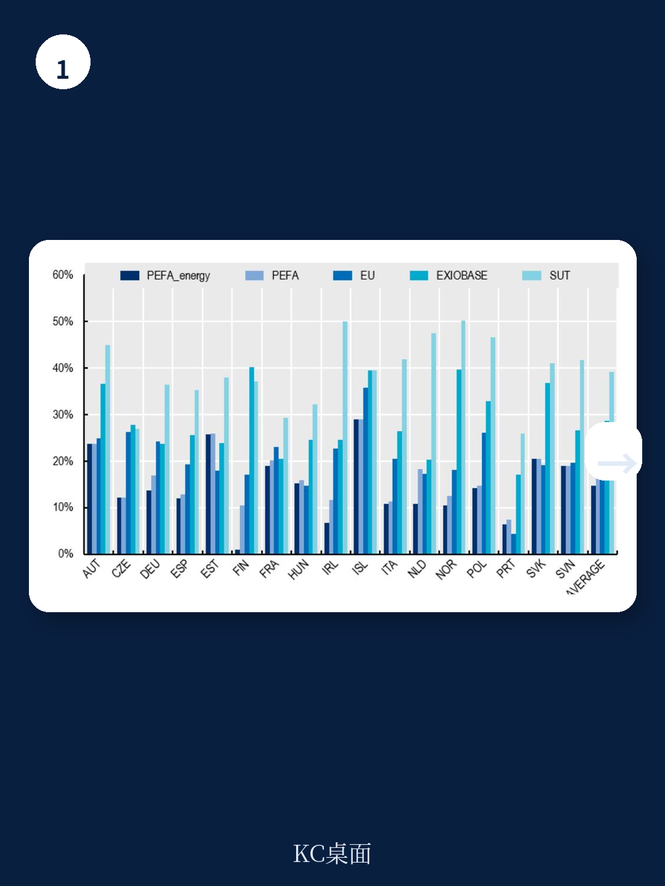
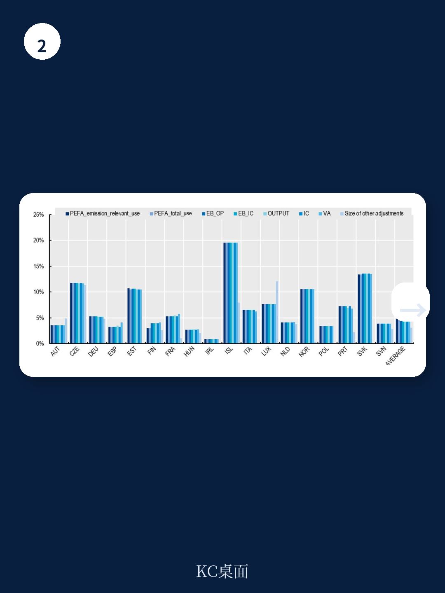

# 经合组织：1990年起空气排放账户估算方法更新

经合组织统计与数据局近期发布了一份方法论更新工作论文，重新设计了空气排放账户的估算框架。这份报告的核心判断是：现有国际排放数据在行业归属、地理覆盖和统计口径上存在系统性偏差，而经合组织提出的新方法通过引入更细化的行业分类、扩展时间序列至1990年，并首次将国际航空与海运纳入核算边界，有望显著改善排放数据的政策可用性。

报告指出，目前全球仅有53个国家在过去五年内编制过官方空气排放账户，且各国在气体范围、时间序列长度和行业细分程度上差异巨大。这种碎片化状态直接限制了排放强度分析、脱钩评估以及碳足迹计算等政策工具的可比性。经合组织的新方法正是针对这一缺口设计的。

## 1. 核算边界从领土原则转向居民原则

传统排放清单遵循领土原则，即统计一国领土范围内产生的所有排放。但经合组织的新方法引入了居民原则调整：扣除非居民在本国领土产生的排放（例如外国航空公司在国内机场的加油排放），同时加入本国居民在境外产生的排放。这一调整使排放账户与国民宏观环境核算体系中的生产边界保持一致。

报告特别处理了国际航空和海运排放——这两类排放此前在多数国际统计中被排除在外。经合组织利用其实验性排放估算数据，将国际运输排放按居民归属重新分配。报告承认，这一调整在数据质量上仍存在不确定性，尤其是工业渔船排放可能被系统性低估，因为公开的自动识别系统数据无法覆盖大量远洋作业渔船。

> **KC评论：** 居民原则调整的实际影响可能比表面看起来更大。对于拥有大型国际航运或航空公司的国家，其排放责任将显著上升；而对于国际运输主要依赖外国承运人的国家，排放责任则会下降。这种调整会改变国家间排放比较的基准线。

## 2. 行业分配精度提升至A*64细分层级

新方法将排放从清单分类映射到国际标准行业分类的64个行业层级，远高于此前的方法。分配过程依赖三类数据：国家温室气体清单、物理能源流量账户，以及经合组织的行业产出数据。当物理能源流量账户数据缺失时，方法允许使用产出数据作为替代分配依据。

道路运输排放的分配是这一环节中最复杂的部分。报告指出，此前方法仅基于少数欧洲国家的样本推导分配比例，而新方法引入了燃料类型拆分——将柴油和汽油排放分开处理，并利用行业产出和能源使用数据分别分配。报告估计，摩托车排放仅占道路运输总排放的0.7%左右，因此将其统一归入汽油类别的假设对整体结果影响有限。

## 3. 新方法在可比性上优于旧版，但仍有误差

经合组织对更新后的估算结果进行了多维度可信度检验。检验对象分为两组：第一组是已编制官方空气排放账户的欧盟国家，用于验证估算精度；第二组是非欧盟经合组织国家，即新方法的主要应用对象。

检验结果显示，对于第一组国家，排除航空、海运和道路运输后的二氧化碳排放估算，其平均绝对百分比误差在多数年份低于5%。道路运输排放的误差相对较高，部分国家超过10%。报告认为，这主要是因为不同国家的车辆构成、燃料结构和行驶模式差异较大，而当前方法仍依赖通用参数。

对于第二组国家，由于缺乏官方账户作为基准，检验只能通过交叉对比不同数据源进行。报告发现，新方法估算的总排放量与联合国气候变化框架公约清单及国际能源署数据在总量上高度一致，但在行业分布上存在系统性差异——尤其是制造业和电力行业的排放归属，因各国能源统计分类不同而出现错配。

## 4. 数据可用性仍是主要约束

报告坦率地指出了数据层面的限制。物理能源流量账户目前仅在少数经合组织国家有完整时间序列，多数国家只能依赖产出数据作为替代。当产出数据也缺失时，方法不得不使用更粗略的分配系数，这会降低行业层面的估算精度。

此外，当前方法仅覆盖二氧化碳排放，尚未扩展至其他温室气体。报告表示，方法论框架已为未来扩展预留了接口，但实际推进取决于各国清单数据的细化和国际统计标准的协调进展。经合组织计划在后续工作中优先处理甲烷和一氧化二氮的行业分配问题。

> **KC评论：** 这份报告的价值不在于提供全新的排放数据，而在于建立了一个可复用的估算框架。对于尚未编制官方空气排放账户的国家，这套方法提供了一条低成本、高可比性的路径。但对于已经拥有详细官方账户的欧盟国家，新方法的主要贡献在于验证和补充，而非替代。

经合组织预计，更新后的空气排放账户将首先覆盖所有经合组织国家，时间序列从1990年延伸至数据可获取的最新年份。报告还提到，正在与联合国统计司合作推动全球数据收集，但这一进程的节奏取决于各国统计能力的提升速度。

For informational purposes only. Portions may be generated,translated,summarized,or edited with AI assistance based on source materials and may contain omissions or errors. Please verify independently. This is not investment,legal,tax,accounting,or other professional advice.

