## Promoting the Development of the Semiconductor Ecosystem in Panama

# Promoting the Development of the Semiconductor Ecosystem in Panama

This work is issued under the responsibility of the Secretary-General of the OECD, and does not necessarily reflect the official views of OECD Member countries.

This document, as well as any data and map included herein, are without prejudice to the status of or sovereignty over any territory, to the delimitation of international frontiers and boundaries and to the name of any territory, city or area.

The statistical data for Israel are supplied by and under the responsibility of the relevant Israeli authorities. The use of such data by the OECD is without prejudice to the status of the Golan Heights, East Jerusalem and Israeli settlements in the West Bank under the terms of international law.

Please cite this publication as:

OECD (2026), Promoting the Development of the Semiconductor Ecosystem in Panama, OECD Publishing, Paris, https://doi.org/10.1787/50f1e10d-en.

ISBN 978-92-64-60622-7 (print)
ISBN 978-92-64-92186-3 (PDF)
ISBN 978-92-64-45654-9 (HTML)

Photo credits: Cover © BLACKDAY/Shutterstock.com.

Corrigenda to OECD publications may be found at: https://www.oecd.org/en/publications/support/corrigenda.html.
© OECD 2026

## Attribution 4.0 International (CC BY 4.0)

This work is made available under the Creative Commons Attribution 4.0 International licence. By using this work, you accept to be bound by the terms of this licence (https://creativecommons.org/licenses/by/4.0/).

Attribution – you must cite the work.

Translations – you must cite the original work, identify changes to the original and add the following text: In the event of any discrepancy between the original work and the translation, only the text of the original work should be considered valid.

Adaptations – you must cite the original work and add the following text: This is an adaptation of an original work by the OECD. The opinions expressed and arguments employed in this adaptation should not be reported as representing the official views of the OECD or of its Member countries.

Third-party material – the licence does not apply to third-party material in the work. If using such material, you are responsible for obtaining permission from the third party and for any claims of infringement.

You must not use the OECD logo, visual identity or cover image without express permission or suggest the OECD endorses your use of the work.

Any dispute arising under this licence shall be settled by arbitration in accordance with the Permanent Court of Arbitration (PCA) Arbitration Rules 2012. The seat of arbitration shall be Paris (France). The number of arbitrators shall be one.

## Foreword

Strengthening the resilience of the global semiconductor value chain is a key priority for policymakers worldwide. The high concentration of critical segments of this value chain in a limited number of regions increases vulnerability to disruptions. The OECD, through the Committee on Industry Innovation and Entrepreneurship and the Digital Policy Committee, is helping design policies to enhance semiconductor value chain resilience, including efforts to develop local semiconductor ecosystems.

This report, Promoting the Development of the Semiconductor Ecosystem in Panama, is part of a series of OECD reports that analyses challenges and explores opportunities in the domestic semiconductor ecosystems of selected economies. OECD semiconductor ecosystem studies, prepared in close collaboration with key interlocutors in these economies, offer actionable policy recommendations to support the development or expansion of the semiconductor ecosystem.

This report examines the Panamanian local market and economy, identifying strengths and areas for improvement, and highlights trends, key policy priorities and the institutional landscape relevant to semiconductor firms and the broader ecosystem. The report combines analysis of aggregate economic data with insights gathered from interviews with governmental and non-governmental stakeholders.

This project began in November 2023 and benefitted from an on-the-ground fact-finding mission in March 2024. This work was made possible with the financial support of the United States Department of State.

# Acknowledgments

This report was prepared by two divisions in the OECD Directorate for Science, Technology and Innovation (STI), led by Director Jerry Sheehan: the Productivity, Innovation and Entrepreneurship (PIE) division, supporting the Committee on Industry, Innovation and Entrepreneurship, and the Digital Connectivity, Economics and Society (DCES) division, supporting the Digital Policy Committee (DPC).

This report was prepared by Tom McGee, Sara Romaniega Sancho, Lea Samek and Filipe Silva, with invaluable contributions from David Hoffman and Aden Klein, under the supervision and guidance of Guy Lalanne, Acting Head of the PIE Division. Chiara Criscuolo, Verena Weber and Molly Lesher, Head of the DCES Division, provided useful input and oversight. The leadership of STI Deputy Director, Audrey Plonk, on semiconductor policy is gratefully acknowledged.

The OECD Secretariat is grateful for the support of interlocutors from Panama's Ministry of Commerce and Industries (MICI) and the National Secretariat of Science, Technology and Innovation (SENACYT), particularly Carlos Hoyos, Ángel Martínez, Ramón Martínez, Juan Mercado, Franklin Morales, Eduardo Ortega and Carlos Salinas. The Secretariat is grateful for the support from Tayra Barsallo, Zoila Castillo, Emerson Córdoba, Zuleima Dagher, Nicole Montúfar, Samuel Moreno, Dario Sandoval and Patricia Saucedo. Valuable input was also provided by Astrid Abrego, Marcelo Alvarez, Jeannette Granados and Galileo Solís.

The support of the team in MICI was invaluable in co-ordinating and enabling discussions in a fact-finding mission which took place on 12-15 March 2024 and included exchanges with the General Directorate of Revenue (DGI), the Government Innovation Authority (AIG), the Ministry of Commerce and Industries (MICI), the Ministry of Economy and Finance, the Ministry of Education, the Ministry of Environment, the Ministry of Foreign Affairs, the Ministry of Labour and Workforce Development, the National Customs Authority, the National Energy Secretariat, the National Institute of Statistics and Census (INEC), the National Metrology Center of Panama (CENAMEP AIP), PROPANAMA, SENACYT, and the Transit and Land Transportation Authority. The insights from a range of non-governmental stakeholders, including research institutes and universities, industry stakeholders and business associations and chambers of commerce were also very helpful. The discussions with the Government Innovation Authority and the Panama Canal Authority on 12 December 2024 are also gratefully acknowledged.

Additional statistical, analytical and empirical support from Mario Alejandro Nieves, Damiano Morando, and Hélène Dernis was warmly appreciated. Administrative, editorial and technical support from Anaísa Gonçalves, Shai Somek, Andreia Furtado and Eleonore Morena was invaluable.

This project benefitted from financial support from the United States Department of State. Input from key interlocutors including Virginia Kent, Mark Simeone, Richard Román and their teams was received at various stages of the project.

## Table of contents

Foreword 3
Acknowledgments 4
Abbreviations and acronyms 8
Executive summary 9
1 Assessment and recommendations 11
1.1. Co-ordinate and align incentives for the development of a semiconductor ecosystem 13
1.2. Invest in skills and attract talent to develop a semiconductor workforce 16
1.3. Foster the development of local semiconductor-related firms 20
1.4. Ensure reliable and sustainable utilities infrastructure 22
References 23
Notes 23
2 Examining the domestic ecosystem for semiconductors 24
2.1. Market structure 25
2.2. Infrastructure 46
2.3. Skills 57
References 71
Notes 77
3 Understanding the policy and regulatory landscape 79
3.1. Institutional framework and policies supporting the domestic ecosystem for semiconductors 80
3.2. Science, technology, innovation and business support 86
3.3. Human capital 105
References 118
Notes 126
Annex A. Understanding the semiconductor value chain 128
References 130
Annex B. Trade analysis methodology 131
References 132
Annex C. List of ICT products and inputs in the semiconductor value chain 133
References 135
PROMOTING THE DEVELOPMENT OF THE SEMICONDUCTOR ECOSYSTEM IN PANAMA © OECD 2026

Annex D. List of most sought-after generic skills 136  
References 137  

Annex E. List of most sought-after specific skills 138  

Annex F. Econometric estimation 139  
References 140

## FIGURES

Figure 2.1. Gini index in selected countries 26
Figure 2.2. Geographical distribution of high-tech firms in Panama, 2022 28
Figure 2.3. Sectoral distribution of high-tech firms in Panama, 2022 29
Figure 2.4. Distribution of firms according to their size, 2022 29
Figure 2.5. Revenues and employment evolution, 2015-2022, 2015 = 100 30
Figure 2.6. Net profit margin, 2015-2022 31
Figure 2.7. Real compensation per employee 31
Figure 2.8. Value of fixed assets, 2021 and 2022 32
Figure 2.9. Merchandise trade and trade in services, 2016 and 2022 33
Figure 2.10. Exports of ICT products by main trading partner, 2023 34
Figure 2.11. Imports of ICT products by main trading partner, 2023 34
Figure 2.12. The semiconductor supply chain 35
Figure 2.13. Trade balance for chips, 2012-2023 35
Figure 2.14. Semiconductor trade balance 36
Figure 2.15. RCA for selected economies, 2012 and 2023 37
Figure 2.16. Bilateral dependencies at the country-product level 38
Figure 2.17. Trends in patents related to semiconductors, 1980-2024 40
Figure 2.18. PCT patents related to semiconductors and other technologies in Panama, 2000-2024 41
Figure 2.19. R&D expenditure, 2014-2022 41
Figure 2.20. Inward and outward cross-border investment for selected groups, 2019 42
Figure 2.21. FDI, net inflows, 1990-2024 43
Figure 2.22. Value of deals involving at least one Panamanian high-tech firm, by origin, 2005-2022 44
Figure 2.23. Greenfield investment, net inflows by sector, January 2003-February 2026 44
Figure 2.24. Greenfield investment, employment creation, January 2003-February 2026 45
Figure 2.25. Greenfield investment in the ICT and electronics cluster by country, January 2003-February 2026, USD millions 45
Figure 2.26. Renewable internal freshwater resources per capita in selected countries, 2000-2021 47
Figure 2.27. Share of households with access to drinking water every day of the week, by seasons and provinces, April 2022 47
Figure 2.28. Access to electricity in selected economies, 2005-2023 48
Figure 2.29. Electricity costs for households and businesses in selected economies, 2023-2025 average 49
Figure 2.30. Electricity generation sources in selected countries, 2024 50
Figure 2.31. Fixed broadband subscriptions in selected economies, 2004-2023 51
Figure 2.32. Share of households with internet access, by provinces, March 2022 52
Figure 2.33. Logistics score in selected economies, 2023 52
Figure 2.34. Public investment in transport infrastructure, 2008-2023 53
Figure 2.35. Container traffic, 2000-2022 54
Figure 2.36. Export volume in the main ports of Panama, 2019 Q1 - 2024 Q2 54
Figure 2.37. Daily transit trade volume in the Panama Canal, January 2022-October 2025 55
Figure 2.38. Road infrastructure quality in selected countries, 2019 56
Figure 2.39. Air transport infrastructure quality in selected countries, 2019 57
Figure 2.40. Government expenditure on education, 2014-2022 59
Figure 2.41. Pupil to teacher ratio by levels of education 59
Figure 2.42. PISA results in selected countries, 2018 and 2022 60
Figure 2.43. Enrolment rates at upper secondary education against GDP per capita, 2017 61
Figure 2.44. Educational attainment for upper secondary level, 2017 and 2023 61
Figure 2.45. Upper-secondary graduates by modality of education, institution type and sex, 2020 62

Figure 2.46. Main fields of study for upper secondary students, 2020 62  
Figure 2.47. Percentage of graduates from STEM tertiary education programmes 63  
Figure 2.48. Most sought-after skills in the semiconductor sector 64  
Figure 2.49. Comparison with most sought-after skills in semiconductors and other manufacturing sectors 65  
Figure 2.50. Manufacturing sectors closest to semiconductors in terms of skills demand 66  
Figure 2.51. Number of workers by semiconductor-related occupations, August 2023 67  
Figure 2.52. Distribution of workers by occupations in the high-tech sector, August 2023 67  
Figure 2.53. Informality rate by sector, August 2023 68  
Figure 2.54. Distribution of workers by contract type, August 2023 69  
Figure 2.55. Median monthly salary by contract type, August 2023 69  
Figure 3.1. Overview of Panama's institutional framework for semiconductor policy 83  
Figure 3.2. Co-ordination across Panama's semiconductor stakeholders 94

Figure A F.1. Residuals plot 139

## TABLES

Table 2.1. Medium-high- and high-tech industries 28  
Table 2.2. Keywords used to identify trends in patents related to semiconductors 39  
Table 3.1. Membership of the Commission for Innovation in Microelectronics and Semiconductors (CIMS) 81  
Table 3.2. Comparison of SEM and EMMA 101  
Table 3.3. Comparison of Panama's special economic zones and free trade zones 103  
Table 3.4. Panama's foreign labour regulations 117

Table A C.1. Semiconductor-related products 133  
Table A D.1. List of most sought-after generic skills 136  
Table A E.1. List of most sought-after specific skills 138  
Table A F.1. VIF results 139

## BOXES

Box 2.1. National data sources used in this report 27  
Box 2.2. Patents as a measure of innovation in semiconductors 39  
Box 2.3. Analysing the demand for skills in the semiconductor sector using Lightcast data 64  
Box 2.4. Econometric specification 70  
Box 3.1. Sub-committees supporting the CIMS 82  
Box 3.2. Public investment to support semiconductor design and ATP 85  
Box 3.3. The National Secretariat of Science, Technology and Innovation (SENACYT) 88  
Box 3.4. SENACYT's resources to support for research, technology and innovation in 2025 89  
Box 3.5. Public interest associations in Panama 91  
Box 3.6. The City of Knowledge 96  
Box 3.7. The CAF Method for the Accelerated Development of Technological Patents 97  
Box 3.8. Curricula updates at the Technological University of Panama (UTP) 109  
Box 3.9. SENACYT's scholarship programme for relevant academic fields 111

Box A B.1. Methodological framework 131

# Abbreviations and acronyms

AIG National Authority for Government Innovation, Autoridad Nacional para la Innovación Gubernamental

AIP Public Interest Association, Asociación de Interés Público

AMPYME Authority for Micro, Small and Medium-Sized Enterprises, Autoridad de la Micro, Pequeña y Mediana Empresa

ASU Arizona State University

ATP Assembly, Testing and Packaging

CAF Development Bank of Latin America and the Caribbean, Banco de Desarrollo de América Latina y el Caribe

CIMS Commission for Innovation in Microelectronics and Semiconductors, Comisión para la Innovación en Microelectrónica y Semiconductores

C-TASC Center for Advanced Semiconductor Technologies, Centro de Tecnologías Avanzadas de Semiconductores

CONEAUPA National Council for University Evaluation and Accreditation, Consejo Nacional de Evaluación y Acreditación Universitaria de Panamá

EMMA Special Regime for Manufacturing Services for Multinational Companies

FDI Foreign Direct Investment

GDP Gross Domestic Product

IDB Inter-American Development Bank

INADEH National Institute of Vocational Training and Training for Human Development, Instituto Nacional de Formación Profesional y Capacitación para el Desarrollo Humano

INDICASAT Institute for Scientific Research and High Technology Services of Panama, Instituto de Investigaciones Científicas y Servicios de Alta Tecnología de Panamá

INEC National Institute of Statistics and Census, Instituto Nacional de Estadística y Censo

ITSE Specialised Higher Technical Institute, Instituto Técnico Superior Especializado

MEF Ministry of Economy and Finance, Ministerio de Economía y Finanzas

MICI Ministry of Commerce and Industry, Ministerio de Comercio e Industrias

MITRADEL Ministry of Labour and Workforce Development, Ministerio de Trabajo y Desarrollo Laboral

PENCYT National Strategic Plan for Science, Technology and Innovation

PROPANAMA Investment Attraction and Export Promotion Authority of Panama, Autoridad para la Atracción de Inversiones y la Promoción de Exportaciones de Panamá

SEM Special Regime for Multinational Headquarters

SENACYT National Secretariat of Science, Technology and Innovation, Secretaría Nacional de Ciencia, Tecnología e Innovación

SEZ Special Economic Zone

UTP Technological University of Panama, Universidad Tecnológica de Panamá

# Executive summary

The semiconductor industry, the backbone of modern digital and electronic technologies, is witnessing significant shifts in its global landscape. The high concentration of critical segments of the semiconductor value chain in a limited number of regions increases vulnerability to disruptions. In this changing landscape, economies are seeking to enhance the resilience of the semiconductor value chain through the development of local ecosystems and by strengthening their role in this strategically important sector.

Panama is seeking to capitalise on the opportunity provided by this changing landscape. This report analyses the ecosystem for semiconductors in Panama and offers policy recommendations to help its development. The report contributes to a better understanding of policy tools that can help enhance the resilience of the global semiconductor value chain.

The report examines both quantitative and qualitative evidence. Quantitative analysis focuses on the evolution and performance of the high-tech manufacturing sector in Panama, as well as key enabling factors such as market structure, integration into global value chains, enabling infrastructure and skills and workforce development. Qualitative analysis draws on interviews with governmental and non-governmental stakeholders to map the institutional and policy landscape affecting Panama's ecosystem for semiconductors, with in-depth analyses of the policies to support science, technology and innovation; entrepreneurship and the business environment; and education and workforce development.

Panama is an open and services-oriented economy and a cornerstone of international trade, reflecting its privileged geographic position, excellence in transportation logistics and strong air and seaborne transportation infrastructure. Although Panama is yet to engage in and integrate into the global semiconductor value chain, its regulatory framework provides important incentives for prospective foreign investors, and it has been actively investing in initiatives to promote semiconductor-related talent, research and innovation.

The OECD analysis suggests that continued investment in talent, reliable utilities infrastructure and in developing a local ecosystem of semiconductor suppliers and customers could help Panama capitalise on emerging opportunities to develop its ecosystem for semiconductors. To unlock this development, this report offers policy recommendations structured into four main areas:

1. Co-ordinating and aligning incentives, leveraging the recently established Commission for Innovation in Microelectronics and Semiconductors and supporting the implementation of the National Semiconductor Strategy to ensure good coordination with stakeholders and across policy instruments, including incentives offered to potential investors. Panama should focus efforts on select segments of the semiconductor value chain, while continuing with the modernisation and digitalisation of government services and leveraging granular data relevant for the semiconductor ecosystem that are available from different Panamanian institutions to inform policies for the semiconductor industry and other sectors.

2. Investing in skills and attracting talent to develop a semiconductor workforce by expanding science, technology, engineering and mathematics (STEM) and English education at the primary and secondary levels and by targeting semiconductor skills as part of its university and vocational education and training strategies. Panama should further enhance international collaboration in this area and attract foreign talent to help accelerate the development of a local semiconductor workforce. Panama should also tap into the existing labour workforce by facilitating transitions to formal employment through learning programmes and measures that support self-employment and entrepreneurship.

3. Developing an ecosystem of local suppliers and customers for semiconductor firms, by supporting entrepreneurial activity. This requires a two-pronged approach focused on demand through expanding on entrepreneurship training programmes and incubators, and supply through better access to early-stage financing. Panama should also enhance its support for semiconductor-related innovation, including by leveraging private funding for targeted semiconductor research.

4. Ensuring reliable and sustainable utilities infrastructure by further investing in a diversified, low-carbon energy mix and incentivising firms to adopt best available technologies for water and wastewater management. Panama should also continue efforts to enhance connectivity infrastructure.

With the right policy mix, Panama is well positioned to engage and integrate into the global semiconductor value chain. This would not only benefit Panama but would also contribute to diversifying semiconductor supply chains at a time when strengthening their resilience has become a priority.

# Assessment and recommendations

This chapter summarises the report's major findings and provides policy recommendations to promote the development of Panama's semiconductor ecosystem. It examines Panama's main strengths and focuses on four key areas for improvement: co-ordinating and aligning incentives for private investment; investing in talent to develop a semiconductor workforce; fostering the development of local semiconductor-related firms; and ensuring reliable and sustainable utilities infrastructure.

## Policy recommendations

## Co-ordinate and align incentives for the development of a semiconductor ecosystem

\- Engage all relevant stakeholders in the development of the National Semiconductor Strategy

\- Focus policy efforts on selected segments of the semiconductor value chain.

\- Further enhance investment promotion activities to highlight the comparative advantages of Panama.

\- Build on the National Semiconductor Strategy to co-ordinate and harmonise incentives offered to potential investors.

\- Enhance the modernisation and digitalisation of government services and integrate all investment, international trade, business creation and migration procedures into a one-stop shop.

\- Leverage Panama's granular data available from different institutions to inform policies for the semiconductor industry and other sectors.

## Invest in skills and attract talent to develop a semiconductor workforce

\- Strengthen science, technology, engineering and mathematics (STEM) in primary and secondary education to create a pipeline of STEM talent, and monitor progress.

\- Continue efforts to improve English language skills at all levels of education, and monitor progress in the improvement of English language skills.

\- Implement plans to create a semiconductor track in university education.

• Further strengthen international collaboration to develop semiconductor talent.

\- Develop vocational education and training (VET) programmes to train people with the skills needed for a semiconductor ecosystem, building on existing domestic and foreign capabilities.

• Facilitate transitions to formal employment by addressing labour market skill imbalances.

## Foster the development of local semiconductor-related firms

\- Improve access to capital to finance entrepreneurial activity in the semiconductor industry and other sectors, including through an early-stage financing vehicle.

\- Expand programmes to support the entrepreneurial ecosystem, including for semiconductors, through incubators and entrepreneurship training.

\- Support semiconductor-related innovation, including by leveraging private funding for targeted semiconductor research.

## Ensure reliable and sustainable utilities infrastructure

\- Ensure a reliable and stable supply of energy by further investing in a diversified, low-carbon energy mix.

\- Incentivise firms to adopt best available technologies for water and wastewater management.

Panama is an open and services-oriented economy where total trade (the sum of exports and imports) represented as much as 60% of its gross domestic product (GDP) and the manufacturing sector represented only about 5% of GDP in 2022. While Panama is a cornerstone of international trade, reflecting its privileged geographic position, excellence in transportation logistics and strong air and seaborne transportation infrastructure, it is yet to engage in and integrate into the global semiconductor value chain.

Panama can capitalise on global shifts in semiconductor value chains by complementing its existing strengths in transportation and logistics with its ongoing initiatives to promote semiconductor-related talent, research and innovation. The existing regulatory framework, notably Panama's special economic zones (SEZs), can provide important incentives for prospective foreign investors. Ensuring reliable utilities infrastructure and developing a local ecosystem of semiconductor suppliers and customers would create the necessary environment for the development of Panama's semiconductor industry.

Panama could draw on its competitive advantages, outlined above, to seek semiconductor partnerships with other economies in Central America, which would allow it to share its expertise and leverage the semiconductor experience of other countries in the region. By focusing on select semiconductor activities, Panama could help develop a cohesive regional semiconductor value chain that benefits all partners.

This report contains concrete recommendations to support the development of a semiconductor ecosystem in Panama. In a tightening fiscal environment, governments should assess all spending decisions carefully, with a view to retaining budget neutrality while identifying crucial investment areas to foster the semiconductor industry. The following sections provide recommendations to prioritise expenditures in key areas for the development of Panama's semiconductor ecosystem.

## 1.1. Co-ordinate and align incentives for the development of a semiconductor ecosystem

On 30 April 2024, Panama introduced a dedicated institutional framework for semiconductors through Executive Decree No. 7 (hereafter the Decree). This institutional framework, described in detail in Section 3.1, helps support the development of the Panamanian semiconductor ecosystem. The Decree also sets out strategic guidelines for the development and promotion of the semiconductor industry and proposes incentives for attracting semiconductor investments and promoting semiconductor-related research, innovation, entrepreneurship and talent development. Importantly, the Decree signalled Panama's long-term commitment to joining the global semiconductor supply chain.

## 1.1.1. Engage all relevant stakeholders in the development of the National Semiconductor Strategy

The Decree highlights the need to co-ordinate and align the forthcoming National Strategy for the Development of the Semiconductor and Microelectronics Industry (henceforth, the National Semiconductor Strategy) with existing strategies in related areas, notably the Strategic Plan for Government, the National Strategic Plan for Science, Technology and Innovation (Plan Estratégico Nacional de Ciencia, Tecnología e Innovación, PENCYT), the National Logistics Strategy of Panama, the National Energy Plan and the National Strategic Plan for the Development of Metrology Infrastructure. This is an important acknowledgement of key policy areas for the development of a semiconductor ecosystem in Panama.

Moreover, the Decree establishes the Commission for Innovation in Microelectronics and Semiconductors (CIMS) as an inter-institutional co-ordinating body for Panama's National Semiconductor Strategy (see Section 3.1.1 for further details on the mandate and membership of the CIMS). The CIMS will be supported by the new Technical Advisory Council on Microelectronics and Semiconductors composed of seven experts proposed by the CIMS and appointed by Panama's president.

For the development of the National Semiconductor Strategy and the subsequent action plan to implement the strategy, it is important to take a holistic approach that benefits from the perspective of the relevant government institutions, as well as stakeholders from academia, business associations, labour unions and civil society. For example, the Ministry of Education (MEDUCA) should have a major role to play in view of the recommendations on skills discussed in Section 1.2 below; however, MEDUCA is not currently represented on the CIMS, although it is expected to form part of one of the CIMS sub-committees. Labour unions and civil society are also omitted from the CIMS's current membership.

Such broad perspectives could be provided through representation on the CIMS, the Technical Advisory Council or an informal consultative group. Engaging with this range of perspectives would inform the implementation of the National Semiconductor Strategy through the action plan and assess its impact on both the development of the semiconductor ecosystem and broader socio-economic goals.

## 1.1.2. Focus policy efforts on selected segments of the semiconductor value chain

The semiconductor industry does not currently operate in Panama and the Panamanian economy is predominantly driven by the services sector, with the manufacturing sector contributing roughly 5% to the value added in 2022 (see Section 2.1.1 for details).

While Panama is undertaking considerable efforts to develop an enabling environment for a semiconductor ecosystem, prioritising and delineating a ‘first investment’ target as an entry point into the global semiconductor value chain is important. Panama would benefit from focusing resources and efforts on a selected segment of the value chain. For example, some countries that have integrated into the semiconductor value chain in the past have done so by focusing on either semiconductor design or ATP, in view of the respectively lower physical and human capital requirements, relative to semiconductor fabrication. See Annex A for an overview of the semiconductor value chain.

An identifiable entry point would help policymakers, industry and investors, academia and other stakeholders in the semiconductor ecosystem understand how best they could support the co-ordinated efforts of the CIMS. The forthcoming National Semiconductor Strategy and Action Plan should help identify short-, medium- and long-term goals, including a timeline containing targeted areas of the semiconductor value chain that should be prioritised at each stage.

## 1.1.3. Further enhance investment promotion activities to highlight the comparative advantages of Panama

Over the last two decades, Panama attracted important amounts of inward greenfield investment $^{1}$ in the renewable energy sector (USD 8.2 billion), the metals and minerals sector (USD 7.5 billion) and the transportation and warehousing sector (USD 4.7 billion). In the information and communications technology (ICT) sector (including telecommunications) – a proxy for the semiconductor industry, which does not currently exist in Panama – total inward greenfield investment was USD 3.6 billion over the 2003-2024 period (see Section 2.1.4).

Despite presenting comparative advantages that could motivate investments in semiconductors and advanced manufacturing more broadly, Panama's manufacturing sector represents less than $5\%$ of GDP and investments in the semiconductor industry are yet to materialise.

Panama should consider further strengthening investment promotion efforts to highlight its comparative advantages, in particular its transport infrastructure and logistics. The PROPANAMA investment agency could emphasise the existing incentives regimes and forthcoming investments into semiconductor talent and innovation and provide guidance to prospective semiconductor investors.

Efforts to continue tackling inequality, combating crime and fighting corruption would also help with investment promotion efforts, as well as with attracting foreign talent to work and live in Panama.

## 1.1.4. Build on the National Semiconductor Strategy to co-ordinate and harmonise incentives offered to potential investors

Currently, Panama has many special investment regimes that confer specific benefits for firms and investors meeting certain requirements. However, some of these regimes are challenging to identify, unclear and may overlap. For example, a firm can access tax, labour and migration incentives by operating within one of Panama's SEZs, an activity-specific regime (e.g. SEM or EMMA), $^{2}$ or both. See Section 3.2.3 for analysis of these incentive regimes.

Panama should therefore look to harmonise these incentives and associated requirements for potential investors and communicate them more clearly, to highlight the attractive business environment for semiconductor firms. One way of achieving this could be through a one-stop shop, which brings together all relevant information on a single digital platform to compare the benefits and requirements of each special regime. See also the following Recommendation 1.1.5 on the digitalisation of government services.

## 1.1.5. Enhance the modernisation and digitalisation of government services and integrate all investment, international trade, business creation and migration procedures into a one-stop shop

In recent years, Panama has made considerable efforts towards the modernisation and digitalisation of government services, led by the National Authority for Government Innovation (AIG) and supported through initiatives including Panama's Digital Hub Strategy (Panamá Hub Digital), launched in 2018. Furthermore, Executive Decree No. 7 of 2024 has tasked the Ministry of Commerce and Industries (MICI) with creating a one-stop shop for all semiconductor-related procedures and guidance.

This new one-stop shop would allow Panama to combine and digitalise onto a single platform the government services and guidance related to international trade (including customs), SEZs as well as all other entities that might need to be consulted for imports and exports (e.g. registration with the Ministry of Health for imports of hazardous chemicals). Import and export procedures may differ for firms depending on whether they operate within an SEZ regime, while these procedures can also vary across different SEZ regimes. Therefore, establishing a one-stop shop to simplify and centralise all these procedures would help expedite trade.

It is also important to finalise the digitalisation of all business creation and licensing processes, and work towards including special investment incentives (such as incentives under SEM and EMMA, which already operate digitally) and all other business licensing requirements in the one-stop shop mentioned above. This would reinforce the previous Recommendation 1.1.4. To create this type of one-stop shop, co-ordination between different ministries and agencies, including MICI, the AIG, the National Customs Authority and PROPANAMA would be particularly important.

## 1.1.6. Leverage Panama's granular data available from different institutions to inform policies for the semiconductor industry and other sectors

Leveraging the existing data infrastructure would help inform the National Semiconductor Strategy and related policy actions. Developing the evidence base through the analysis of firm-level and other types of highly disaggregated data is key to better understand the high-tech sector and semiconductor ecosystem, alongside other parts of the economy.

Disaggregated data help identify patterns, correlations and infer causal relationships that are otherwise difficult to ascertain with aggregated data. Disaggregated data would also help evaluate the impact of existing (and forthcoming) policies. Panama should build on these data to monitor changes in the dynamics of the high-tech ecosystem and inform the implementation of the National Semiconductor Strategy outlined above. Facilitating access to anonymised, comprehensive and granular data would support analysis and contribute to a broader understanding of the semiconductor ecosystem, as well as other ecosystems.

Panama could take advantage of the extensive disaggregated data available from various institutions and agencies. For example, balance sheet data can be used to monitor firm performance and value added tax data can help map the local network of firms within the high-tech ecosystem (including suppliers and customers). More granular, comparable and up-to-date linked employer-employee data, as outlined in Section 2.3.3, would also be important to inform policy actions in support of the development of the semiconductor workforce.

## 1.2. Invest in skills and attract talent to develop a semiconductor workforce

A limited talent pool is a major hurdle for the development of semiconductor ecosystems around the world, including in Panama. The assembly, testing and packaging (ATP) segment of the semiconductor value chain – which could be a logical entry point into the semiconductor value chain for Panama (see Recommendation 1.1.2) – requires a blend of generic skills, such as communication, management and operations, and specific technical skills associated with manufacturing processes, such as molding, dicing and swaging. As technological complexity increases and linkages across the value chain deepen, ATP skill requirements are evolving, offering a foundation for gradual upgrading into more sophisticated activities over time. See Section 2.3.2 for more details on semiconductor skills.

Panama should enhance its ongoing efforts to develop a semiconductor workforce by expanding STEM and English education at the primary and secondary levels and targeting semiconductor skills as part of its university and VET strategies. International collaboration and openness to foreign talent could help accelerate this process.

## 1.2.1. Strengthen STEM in primary and secondary education to create a pipeline of STEM talent, and monitor progress

The technical expertise needed for semiconductor design, fabrication or ATP, as well as for a wide range of other manufacturing and high value-added service sectors, builds on early STEM education. Data from the OECD Programme for International Student Assessment (PISA) show that Panama is catching up with other countries on both mathematics and science scores, but there is scope for further improvement (see Section 2.3.1).

Overall, government expenditure for education in Panama remains significantly below the OECD average and other Latin American countries. However, Law 362 of 2023, which mandates that Panama must spend at least 7% of GDP on education annually (see Section 3.3.1), appears to be a step to address this important gap. Continued efforts to reduce the pupil-to-teacher ratio and enhance the quality of education through better teacher training and development are important to improve education outcomes (see Section 2.3.1).

Specific measures to strengthen STEM in primary and secondary education could include promoting the use of technology-based teaching methods (including digital tools), encouraging hands-on learning, introducing STEM role models, providing students with real-world applications of STEM, devoting more hours to STEM in the curriculum and engaging girls in STEM. In 2020, only 294 students graduated in electronics from upper secondary level, of which 90% were men. This indicates considerable potential to develop the pool of talent for semiconductors by incentivising students, notably women, to enrol in relevant fields such as electronics (see Section 2.3.1 for details).

Panama should also consider expanding the STEM programmes for primary and secondary education managed by the National Secretariat of Science, Technology and Innovation (Secretaría Nacional de Ciencia, Tecnología e Innovación, SENACYT), such as the Let's Do Science (Hagamos Ciencia) programme aimed at training teachers and school leaders in scientific research projects and best teaching practices (see Section 3.3.1 for further details). Strengthening STEM education at the primary and secondary levels creates a pipeline of STEM talent that can be trained in semiconductor skills during tertiary education. See Recommendations 1.2.3 and 1.2.5 below.

Panama should consider setting national objectives for the number of STEM graduates by education level. It would be important to monitor and evaluate progress towards these objectives, producing information and statistics on outcomes that are published on a regular basis and at a detailed level. Such data could help inform the assessment of Panama's progress towards its STEM objectives.

## 1.2.2. Continue efforts to improve English language skills at all levels of education, and monitor progress in the improvement of English language skills

English language skills are important for operating specialised equipment and engaging with suppliers and customers in global value chains, particularly for semiconductors. Panama should therefore continue its efforts towards further developing a workforce equipped with English language skills.

Until relatively recently, the Bilingual Panama (Panamá Bilingüe) programme sent Panamanian teachers to overseas universities for a two-month course in English language instruction. According to one estimate, Bilingual Panama trained more than 9 500 teachers in English, a significant proportion of Panama's teaching workforce. $^{3}$ However, some stakeholders consulted for this report stated that the impact of the programme in terms of improvements in teachers' levels of English was uncertain. Nonetheless, Panama should evaluate the programme and, depending on the evaluation's outcomes, consider continuing to invest in a dedicated English programme for teachers, including in partnership with foreign institutions.

Beyond primary and secondary education, Panama should also continue efforts to provide English language skills as part of VET programmes. For example, the Specialised Higher Education Technical Institute (Instituto Técnico Superior Especializado, ITSE in Spanish), which co-ordinates technical and highly specialised tertiary vocational education, requires English proficiency for part of its vocational programmes and offers “English laboratories” that promote an interactive and participatory approach to language learning (see Section 3.3.3 for further details). As Panama introduces new vocational programmes in semiconductor-related skills (see Recommendation 1.2.5 below), it must ensure that the courses also enhance the students’ English language skills.

For university-level education, the Technological University of Panama (UTP) Foreign Language Centre and its recent agreement with Arizona State University (ASU), United States, for the design and implementation of a semiconductors programme in English are important steps towards better English language skills (see Section 3.3.2 for further details). As Panama continues to sign memoranda of understanding (MoUs) with other international educational institutions, it should view these international partnerships not just as opportunities to develop technical, semiconductor-related skills but also improve their students' English skills.

As with the efforts to develop Panama's STEM skills, it is also important to monitor and evaluate Panama's progress towards its English language objectives. Data on the country's English outcomes could also allow Panama to adjust curricula or create specific new courses, as required.

## 1.2.3. Implement plans to create a semiconductor track in university education

In 2023, 1671 students were enrolled in university-level electrical engineering courses, of which only $18\%$ were women. Panama's efforts to develop engineering and semiconductor-related academic programmes are challenged by relatively lower domestic demand for manufacturing industry jobs when compared to services. Panama faces a “chicken and egg” dilemma: it is challenging to create academic programmes which provide semiconductor skills when the absence of the semiconductor industry in Panama means that there is no domestic demand for these skills; however, the absence of semiconductor skills can also act as a barrier to investment from the semiconductor industry.

Given that talent takes time to develop and the similarities between some of the skills required by the semiconductor industry and the skills required by other sectors (e.g. manufacturing of motor vehicle parts, beverages, pharmaceuticals, medical equipment or navigational, measuring and electromedical equipment – see Section 2.3.2), Panama could prioritise developing semiconductor-specific skills in anticipation of the development of a domestic semiconductor industry.

Panama offers considerable autonomy to both public and private universities, which are regulated by the National Council for University Evaluation and Accreditation of Panama (Consejo Nacional de Evaluación y Acreditación Universitaria de Panamá, CONEAUPA). Changes in curricula are initiated by universities and subject to review by the government. The structure of CONEAUPA and the process for curriculum review mean that efforts to tailor university education to the needs of the semiconductor industry would be pursued through government-academia partnerships or co-operation amongst universities and between universities and industry (see Section 3.3.2 for further details).

One flagship initiative to develop semiconductor skills in Panama is the new Center for Advanced Semiconductor Technologies (Centro de Tecnología Avanzada de Semiconductores, C-TASC in Spanish). UTP leads the development of C-TASC, with co-ordination and strategic support from SENACYT and international expertise from ASU. The establishment of C-TASC, which will provide equipment and infrastructure to offer applied training programmes and semiconductor research, is a particularly important step to start developing semiconductor-specific skills. In parallel, SENACYT should continue its efforts to co-ordinate universities, government and industry to develop the semiconductor workforce (see Section 3.3.2 for further details).

In looking to develop semiconductor skills, Panama faces the risk of “brain drain” to other economies with more established semiconductor ecosystems. To mitigate this risk, it would be important to combine higher education efforts with investment in semiconductor innovation and entrepreneurship (see Section 1.3) to nurture new domestic semiconductor-related firms and provide opportunities for highly qualified individuals to remain in – or come back to – Panama.

## 1.2.4. Further strengthen international collaboration to develop semiconductor talent

In 2022, the manufacturing sector represented only about 5% of Panama's GDP and only 918 manufacturing and services firms (representing 1.2% of all firms in Panama) were classified as medium-high- or high-technology (high-tech) firms (see Section 2.1). As mentioned in Section 1.2.3 above, it can be particularly challenging to tailor the curricula of education programmes for semiconductors in the absence of local semiconductor and other related industries. Tapping into the semiconductor knowledge available abroad through enhanced international collaboration could help ensure that education programmes for semiconductor talent are – and remain – relevant, meeting the needs of a prospective domestic semiconductor industry.

Panama should strengthen its international collaboration efforts to help train the semiconductor workforce. The MoUs between ASU and SENACYT, UTP and ITSE are a significant step in this direction. A further MoU between Panama and Purdue University (United States) and a trial academic exchange programme between UTP and Chiba University (Japan) are also encouraging. The institutional partnerships pursued by UTP with three Costa Rican universities to offer Panamanian students training from Costa Rican professors and the opportunity to visit semiconductor facilities in Costa Rica are examples of the cross-border collaboration that should be scaled up.

Panama should consider enhancing its collaboration with other countries, notably those in the region, to achieve long-term benefits from sending students and teachers for training in semiconductor knowledge and skills. The system of scholarships provided by SENACYT for students and teacher training abroad could be used to help support such initiatives (see Section 3.3.2 for further details).

Targets for the numbers of professors, instructors and teachers in key semiconductor-related fields should be established. When this teaching capacity cannot be developed organically in Panama, it should consider attracting, for example, university professors from other countries. However, there are obstacles to the hiring of foreign professionals in Panama because of limits on the share of foreign workers, challenges with visas and work permits, university requirements that professors have knowledge of Spanish and the need to obtain approval from the Ministry of Labour and Workforce Development (MITRADEL).

While these are important barriers to hiring professors from other countries, the City of Knowledge (Ciudad del Saber) provides a streamlined process for hiring international instructors. The hiring of foreign professionals, including professors and researchers is a more straightforward for public interest associations (AIPs), such as the new C-TASC, when compared with public research centres, universities and other public sector organisations. Panama should also consider alternatives, such as online courses, that can provide semiconductor-specific training at scale while universities in Panama develop educational programmes with sufficient capacity.

## 1.2.5. Develop vocational education and training programmes to train people with the skills needed for a semiconductor ecosystem, building on existing domestic and foreign capabilities

In 2020, about 40% of all students graduating from upper secondary education had followed the professional and technical path, a form of VET. Panama could enhance technical semiconductor skills by strengthening VET programmes, building on the existing institutions and academic and industrial clusters. For example, the National Institute of Vocational Training and Training for Human Development (Instituto Nacional de Formación Profesional y Capacitación para el Desarrollo Humano, INADEH), and in particular ITSE, could work with Panamá Pacífico SEZ and the City of Knowledge to reskill and certify employees of firms located in these two areas in semiconductor-related technical skills. In parallel, INADEH and ITSE could also look to arrange placements with firms located in Panamá Pacífico and the City of Knowledge for some of their students who are developing certified technical proficiencies.

Certification, re-certification and job placement programmes should be co-ordinated, easily identifiable and accessible to all workers, ideally via a centralised job platform. Reskilling programmes tied to apprenticeships could also help firms secure skilled workers and enable Panama's VET programmes to become more responsive to skills demand. Institutions such as ITSE already offer their students industry placements (for example, in the form of a “práctica profesional” or “proyecto final”), but these typically take place at the end of the course and only last a few months. Therefore, Panama should also consider formal dual education programmes, in which students combine classroom-based instruction with professional training in a firm throughout the programme.

Establishing VET programmes focused on semiconductor skills in the absence of a local semiconductor or adjacent industry might be particularly challenging during the initial phase of developing a semiconductor ecosystem. While focusing on similar skills in other sectors could be one avenue to pursue (see the discussion on similarities in skills across sectors in Section 2.3.2), engaging in international collaboration with education institutions and industry abroad (as discussed in the previous recommendation) would likely be the most impactful strategy in the shorter term.

## 1.2.6. Facilitate transitions to formal employment by addressing labour market skills imbalances

Labour informality – where employed workers are not affiliated to social security systems or lack a written work contract – is high in Panama, affecting nearly half of Panamanian workers in 2024. Average wages in the informal sector are roughly half of those in the formal sector and economies with high informal employment, such as Panama, often experience significant mismatches between skills supply and demand.

Therefore, investing in the reskilling and upskilling of workers through lifelong learning programmes, such as those offered by ITSE and INADEH (outlined in Section 3.3.3) and raising awareness of the wage premium associated with continued education, notably in STEM areas (see Section 2.3.3), could help both facilitate transitions into formal employment and contribute to developing semiconductor talent. Measures that support self-employment and entrepreneurship (see Section 3.2.2) also help to address labour informality, as can measures to streamline and modernise bureaucratic processes by making it more straightforward to establish a business and register its workers with the social security system (see Recommendation 1.1.5 above).

## 1.3. Foster the development of local semiconductor-related firms

An important objective of developing a semiconductor industry is the positive spillovers throughout the country's economy. To amplify the benefits of semiconductor investment and distribute them throughout the economy, Panama could look to develop an ecosystem of local suppliers and customers.

Panama could tap into its strength as a logistics hub in global value chains to provide the necessary inputs and services to the semiconductor industry, even before the establishment of semiconductor facilities in the country. Panama's supply chain centrality means that it can become a hub for supplying and servicing semiconductor firms in the region.

## 1.3.1. Improve access to capital to finance entrepreneurial activity in the semiconductor industry and other sectors, including through an early-stage financing vehicle

Enhanced efforts to promote entrepreneurial activity, including in semiconductor-related areas, would help strengthen the dynamism of the Panamanian economy and contribute to the development of a local ecosystem of semiconductor suppliers and customers. Moreover, measures to increase entrepreneurial activity could also help transitions to formal employment discussed in Recommendation 1.2.6.

Panama would benefit from a dedicated early-stage financing vehicle to support the development of local innovative firms including, but not limited to, firms providing material inputs and services to semiconductor firms, as well as start-ups in semiconductor design. The financing instrument could take the form of a public-private seed co-investment fund with the appropriate design to leverage private capital (see Section 3.2.2). The forthcoming National Fund for the Semiconductor and Microelectronics Industry (hereafter the National Fund for Semiconductors), announced in Executive Decree No. 7 of 2024 and described in Section 3.1.2, could provide part of the public financing, in collaboration with the Authority for Micro, Small and Medium-Sized Enterprises (Autoridad de la Micro, Pequeña y Mediana Empresa, AMPYME).

Panama could also consider a formal initiative to attract seed and early-stage capital from the private sector. There seem to be limited sources of seed funding for small and new ventures, despite the availability of both foreign and domestic capital (see Section 2.1.4). A programme to attract capital for semiconductor ecosystem start-ups and small and medium-sized enterprises (SMEs) could build on the establishment and activities of the National Fund for Semiconductors, in co-ordination with PROPANAMA.

Promoting the development of a network of business angels and early-stage investors focused on the high-tech sector, including the semiconductor industry, could complement the abovementioned financing instrument for semiconductor ecosystem start-ups.

A regional capital fund of funds, in collaboration with international financial institutions and partner economies, could also be considered. The European Investment Fund is one example of a regional fund helping to develop risk capital markets and support entrepreneurship and firm growth in the European Union. A regional fund in Central America would provide opportunities to foster collaboration and harness synergies between the strengths and capabilities of different countries and help to unlock capital for investment in promising semiconductor-related projects in the region (see Section 3.2.2). Following the regional collaboration on semiconductor skills and talent described above (see Section 1.2.4), such a fund of funds would represent another form of collaboration between Panama and other countries in Central America.

## 1.3.2. Expand programmes to support the entrepreneurial ecosystem, including for semiconductors, through incubators and entrepreneurship training

Expanding the capacity of existing start-up incubators and accelerators, and strengthening technical support for start-ups, could benefit the Panamanian economy in general and the development of the local ecosystem of semiconductor suppliers and customers in particular. Panama should consider expanding programmes like the City of Knowledge start-up incubator, which offers resources for entrepreneurs and entrepreneurship training. Moreover, implementing the plans for three additional business incubators and technology transfer offices supported by a loan from the Inter-American Development Bank would be an additional important step to increasing entrepreneurship support.

Panama could consider leveraging the National Fund for Semiconductors to support capacity building for semiconductor-related start-ups. One possible way of building capacity amongst start-ups is through a dedicated platform with centralised information on government programmes designed to support the commercialisation of innovation, business creation procedures and existing resources for start-ups and SMEs. More broadly, Panama could also look to create a culture conducive to entrepreneurship through information programmes on starting a business for students (including in secondary education) and researchers, raising their awareness about the available entrepreneurial resources and tools.

## 1.3.3. Support semiconductor-related innovation, including by leveraging private funding for targeted semiconductor research and development

As of 2021, the government accounted for more than half of research and development (R&D) expenditure in Panama, a share which had increased over the preceding years. Foreign investment also accounted for a large share of Panama's R&D expenditure. In contrast, private investment from domestic Panamanian firms remained largely non-existent and investment from higher education and non-profit institutions was also very limited (see Section 2.1.4 for further details). Fostering domestic private R&D investment in innovation activities as well as incentivising investment by higher education institutions could unlock Panama's potential to boost innovation and engage in high value-added activities.

In its role as Panama's innovation co-ordinating authority, SENACYT has prioritised increasing investment in R&D and technology transfer. For example, the PENCYT 2019-24 aimed to double investment in R&D as a share of GDP. Increasing R&D investment would help develop the research and innovation ecosystem in Panama and contribute to a stronger enabling environment for the semiconductor and related high-tech industries.

Additionally, SENACYT has actively pursued public-private partnerships that have helped enrich the innovation ecosystem. AIPs support research activities through public funds, while also leveraging private capital (see Section 3.2.1). A high-profile, recent example of an AIP is C-TASC, headquartered at UTP, which is expected to serve as a semiconductor R&D centre with laboratory space and project funding for seven areas that are key to the semiconductor ecosystem (see also Section 1.2.3). Once C-TASC is fully operational, this will be an important milestone towards strengthening semiconductor research and innovation (see Section 3.2.1 for further details).

Given the very low share of domestic private investment in R&D, Panama could also consider enhanced efforts to leverage private capital for semiconductor-related R&D and innovation through, for example, R&D tax credits or incentives for the hiring of researchers by the private sector.

## 1.4. Ensure reliable and sustainable utilities infrastructure

Infrastructure plays a crucial role in supporting the semiconductor industry. The provision of electricity and water is critical for running semiconductor facilities, both for wafer fabrication and ATP. The provision of stable broadband connectivity also plays a relevant role. Data on fixed broadband subscriptions indicate Panama's lagging performance compared to other Latin American countries, with internet coverage at the household level revealing significant disparities across provinces of the country. Therefore, continued efforts to enhance connectivity infrastructure are also important.

Furthermore, the availability of well-maintained transportation infrastructure (e.g. roads, airports, ports) helps ensure smooth and timely access to critical inputs and the shipment of outputs. Despite a significant decline in infrastructure investment over the past decade (see Section 2.2), Panama remains one of the top countries in the Latin American region for infrastructure quality and port traffic volume. Although there is room for improvement in the efficiency of its major ports, Panama is able to leverage its strategic position to add value to the products transported. Moreover, Panama benefits from a combination of strong road and air transport infrastructure, further enhancing its potential (see Section 2.2.2 for further details).

## 1.4.1. Ensure a reliable and stable supply of energy by further investing in a diversified, low-carbon energy mix

The semiconductor sector is energy-intensive and requires a stable energy supply. Panama benefits from low energy costs for firms and renewable resources account for a considerable share of electricity production. However further efforts to ensure power reliability are critical (see the discussion in Section 2.2.1 for additional details).

The reliability of Panama's electricity network remains challenging as it depends heavily on hydropower, which is vulnerable to climate-related fluctuations. Efforts should be made to diversify into other renewable energy sources, such as wind and solar energy, to mitigate volatility. Supporting and incentivising self-generation and clean energy R&D efforts are important.

Panama should identify specific regions capable of providing the required volume and reliability of electricity to semiconductor facilities or areas where investments should be prioritised. For example, the Panamá Pacífico SEZ provides a strategic location and high-quality transport infrastructure but could benefit from more reliable energy provision.

## 1.4.2. Incentivise firms to adopt best available technologies for water and wastewater management

Panama benefits from abundant freshwater resources, although access to potable water varies significantly by region (see the discussion in Section 2.2.1 for additional details). Semiconductor manufacturing requires large volumes of pure water; this is especially the case for the fabrication stage of the value chain, but semiconductor ATP also depends on access to water.

Although additional capacity is being built, Panama would benefit from incentivising all firms, including prospective semiconductor firms, to adopt best practices and technologies for water purification, treatment and recycling. Panama could also consider allowing firms to connect water treatment facilities to local and national water infrastructure. This would help incentivise the development of the infrastructure and capacity necessary for the transition to a manufacturing economy and help with water conservation efforts more broadly.

## References

UIS (2024), Primary education, teachers - Panama (indicator), United Nations Educational, Scientific and Cultural Organization Institute for Statistics, https://data.worldbank.org/indicator/SE.PRM.TCHR?locations=PA (accessed on 7 October 2025).

UIS (2024), Secondary education, teachers - Panama (indicator), United Nations Educational, Scientific and Cultural Organization Institute for Statistics, https://data.worldbank.org/indicator/SE.SEC.TCHR?locations=PA (accessed on 7 October 2025).

UNESCWA (n.d.), Archive - Greenfield investment, United Nations Economic and Social Commission for Western Asia, https://archive.unescwa.org/greenfield-investment#:\~:text=Title%20English%3A-,greenfield%20investment,facilities%20from%20the%20ground%20up (accessed on 19 March 2026).

## Notes

$^{1}$ Greenfield investment is a form of foreign direct investment where a parent company starts a new venture in a foreign country by constructing new operational facilities from the ground up (UNESCWA, n.d. $^{[3]}$ ).

$^{2}$ Panama's Multinational Headquarters Regime (Régimen Especial de Sedes de Empresas Multinacionales, SEM), was established in 2007 to incentivise multinational firms to establish their (regional) headquarters in Panama. The Manufacturing Services for Multinational Companies (Régimen Especial de Empresas Multinacionales, EMMA), was established in 2020 to incentivise multinational firms to conduct manufacturing-related activities in Panama.

$^{3}$ According to the most recently available data, Panama had 22 000 primary education teachers in 2021 and 24 000 secondary education teachers in 2017 (UIS, 2024 $^{[1]}$ ; 2024 $^{[2]}$ ).

# 2 Examining the domestic ecosystem for semiconductors

This chapter provides an assessment of the Panamanian high-technology (high-tech) sector, with a focus on the semiconductor segment where possible. It is organised into three main sections, each addressing a distinct area: Panama's industrial landscape and high-tech market structure; an assessment of the infrastructure critical to the semiconductor industry; and an evaluation of the skills required for the semiconductor ecosystem, together with recent labour market developments in Panama. The analysis builds on a combination of publicly available aggregate data, commercial data accessible to the OECD Secretariat and granular data provided by Panama's National Statistics and Census Institute (INEC).

## 2.1. Market structure

The semiconductor industry does not currently operate in Panama. For statistical purposes and to assess the environment in which semiconductor firms would operate, the following analysis focuses on the information and communications technology (ICT) sector and, more broadly, on the high-technology (high-tech) sector. $^{1}$

Over the last decade, gross domestic product (GDP) growth in Panama has been robust and, in contrast to other countries in the region, inflation was contained in the aftermath of the coronavirus disease 2019 (COVID-19) pandemic. However, Panama presents a rather unequal economy, as indicated by Gini index statistics, reflecting economic disparities between different provinces of the country.

The Panamanian economy is predominantly driven by the services sector, with the manufacturing sector representing roughly 5% of value added in 2022 (INEC, 2024 $^{[1]}$ ). The high-tech sector has outperformed the non-high-tech sector in terms of revenue, employment and profit growth, especially in recent years.

In terms of position in global value chains (GVCs), Panama presents a deficit in the trade of ICT products and is not specialised in the semiconductor supply chain. Services exports create most of the domestic value added from trade, primarily through transport and tourism. Panama could leverage its privileged logistics position and expertise to diversify into sectors beyond transportation, adding value to products transported through Panama and benefitting from economies of scale and reduced costs.

Patent activity, commonly used as a proxy for measuring technological innovation, indicates that innovation in the semiconductor industry in Panama has been nearly non-existent over the last two decades. Similarly, patent activity has also been limited for other technologies, except for two peaks in 2016 and 2018. Research and development (R&D) expenditure in Panama remains significantly below the regional average and the average for OECD Member countries, with R&D expenditure by Panama's private sector almost non-existent.

Attracting foreign investment can lead to positive productivity spillovers and foster economic growth. In particular, attracting foreign investment in high-tech activities and semiconductors in particular, could drive the economy towards higher value-added sectors and attract highly specialised talent, which would benefit the development of a semiconductor ecosystem. By 2019, around $12\%$ of high-tech firms in Panama had received foreign capital. However, from 2017 to 2022, the capital invested in mergers and acquisitions of high-tech Panamanian firms from abroad decreased significantly compared to previous periods. In terms of greenfield investment, the renewable energy and metals sectors received the most investment over the last two decades, with the metals sector heavily influenced by investment in the creation of one of the world's largest copper mines. Nonetheless, efforts to attract foreign investment need to be accompanied by a strategy to develop a domestic ecosystem of suppliers and customers in support of a nascent semiconductor industry.

## 2.1.1. Macroeconomic environment

Panama is one of the wealthiest countries in Latin America. In 2022, Panama's GDP per capita surpassed that of neighbouring countries, Colombia and Costa Rica, and also that of larger economies such as Argentina, Brazil, Chile or Mexico (IMF, $2024_{[2]}$ ). The rapid expansion of Panama in the decade-and-a-half preceding the COVID-19 pandemic was mainly driven by the construction and investment booms. Tocumen International Airport and the Panama Canal were expanded, numerous buildings were constructed in Panama City and one of the world's largest copper mines was inaugurated (IMF, $2023_{[3]}$ ). In 2023, real GDP grew by $7.3\%$ , although this growth slowed to $2.9\%$ in 2024 due in large part to the closure of the Cobre Panamá copper mine (IMF, $2025_{[4]}$ ).

During the post-pandemic inflation period, price rises were contained in Panama compared to other Latin American countries. In 2022, the annual growth rate of the Harmonised Index of Consumer Prices stood at 2.9% in Panama, significantly lower than in Chile (11.6%), Uruguay (9.1%), Costa Rica (8.3%) and Mexico (7.9%). $^{2}$ The food and fuel subsidies introduced in July 2022, after social protests sparked by the rising cost of living, partially contributed to keeping inflation low compared to other countries in the region (IMF, 2024 $^{[2]}$ ). In 2023, inflation further decreased to 1.5% (Ha, Kose and Ohnsorge, 2023 $^{[5]}$ ).

Despite the favourable macroeconomic conditions, Panama remains a highly unequal country. The Gini index, which measures the degree of inequality in the distribution of income, indicates that Panama exhibits a high level of inequality when compared to other Latin American economies (Figure 2.1), although it has been decreasing in the past few years. Inequality is exacerbated by limited access to quality services, economic opportunities and regional differences, as poverty rates in indigenous regions (comarcas) have reached $70\%$ (UNDCO, 2024[6]).

## Figure 2.1. Gini index in selected countries

Index: 0-100

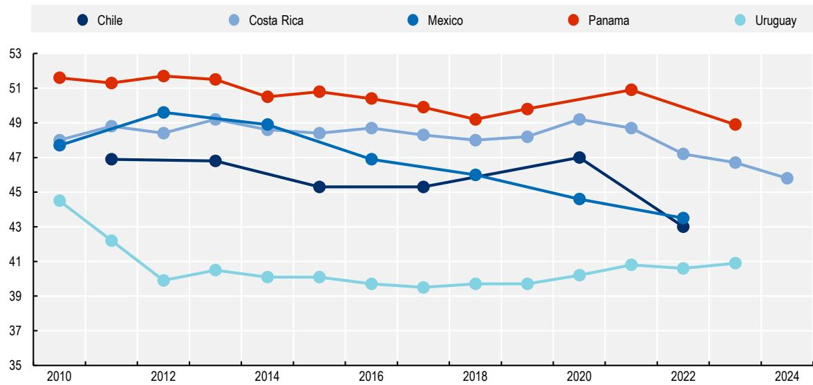  
Note: The Gini index measures the extent to which the distribution of income among individuals or households within an economy deviates from a perfectly equal distribution. A Lorenz curve plots the cumulative percentages of total income received against the cumulative number of recipients, starting with the poorest individual or household. The Gini index measures the area between the Lorenz curve and a hypothetical line of absolute equality, expressed as a percentage of the maximum area under the line. Thus, a Gini index of 0 represents perfect equality, while an index of 100 implies that one individual concentrates all of the country's income.  
Source: World Bank (n.d.[7]), Gini index, https://data.worldbank.org/indicator/SI.POV.GINI (accessed on 15 September 2025).

Panama is a heavily services-oriented economy, with the services sector accounting for 70.4% of the gross value added in 2023. The role of the manufacturing sector is limited, with only 4.9% of the gross value added in 2022 (INEC, 2024[8]). By province, the province of Panamá contributed to 56.5% of GDP in 2022. Colón, Panamá Oeste and Chiriquí followed with contributions of 17.6%, 10.0% and 6.1%, respectively (INEC, 2024[9]).

Historically, Panama has enjoyed a strong sovereign credit rating, which can increase investor confidence and facilitate foreign direct investment (FDI). However, between 2023 and 2024, all three major credit ratings agencies downgraded Panama's credit rating due to fiscal pressures and a rising interest burden. As of 2025, Fitch considers that Panama has lost its investment grade status. Nonetheless, Moody's and S&P consider that Panama has maintained its investment grade.

## 2.1.2. The high-tech ecosystem in Panama

Granular data provide a better understanding of the market structure and firm dynamics and shed light on important differences in performance across different categories of firms, thereby helping policymakers better design and target policy actions. This report partially builds on data made available by Panama's National Statistics and Census Institute (INEC). For more details, see Box 2.1.

## Box 2.1. National data sources used in this report

This report employs data made available by INEC $^{1}$ and includes the following datasets.

\- Register of Enterprises and Establishments (Directorio de Empresas y Establecimientos): The business registry dataset offers identification information, geographical location, size category, economic activity and contact information for the universe of firms in the country. Available to the OECD Secretariat for the years 2018 and 2022.

\- Survey of Non-Financial Enterprises (Encuesta Entre Empresas No Financieras): This survey contains information on the general characteristics of the firm as well as balance sheet data for a sample of non-financial firms, thereby facilitating the analysis of performance trends for different sub-sectors. Available to the OECD Secretariat on an annual basis from 2012 to 2022.

\- Labour Market Survey (Encuesta del Mercado Laboral): This survey provides statistical information on workers, including their occupation, education level and economic activity of their employer, facilitating the analysis of employment trends and sociodemographic changes. Available to the OECD Secretariat on an annual basis from 2012 to 2023. $^{2}$

\- Multiple Purposes Survey (Encuesta de Propósitos Múltiples): This survey provides statistical information on workers as well as on households. This dataset is useful to complement the previous dataset and obtain information about the infrastructure characteristics of households such as access to internet or drinking water. Available to the OECD Secretariat on an annual basis from 2012 to 2022.

## Notes:

1. For more information on the different datasets, see https://www.inec.gob.pa/Publicaciones.

2. The detail of the economic activity was only made available at the 4-digit level for 2023.

This section analyses Panama's medium-high- and high-tech sectors to help understand the broader setting in which semiconductor firms may operate. This analysis sheds light on the correlation between firms' performance and their characteristics, thereby pointing to possible policies to unleash the potential of the Panamanian ecosystem for semiconductors.

The classification of medium-high- and high-tech industries in this report adheres to the industry taxonomy established by Galindo-Rueda and Verger (2016[10]) based on R&D intensity. The sectors of interest for this report are outlined in Table 2.1.

In 2022, there were 918 manufacturing and services firms identified as medium-high- or high-tech firms (hereafter high-tech firms) corresponding to 1.2% of all registered firms in Panama. Most of these firms (79.4%) were in the province of Panamá, followed by Chiriquí (7.2%) and Panamá Oeste (6.8%) (Figure 2.2). Within high-tech services, $^{3}$ the dominance of the province of Panamá was even stronger, with 89.4% of the firms located there. By contrast, high-tech manufacturing firms were more geographically distributed, with 57.6% in the province of Panamá, 15.3% in Chiriquí and 13.2% in Panamá Oeste.

Table 2.1. Medium-high- and high-tech industries

<table><tr><td>Label</td><td>International Standard Industrial Classification (ISIC) Rev.4 (2-digit level)</td></tr><tr><td>Manufacture of chemicals and chemical products</td><td>20</td></tr><tr><td>Manufacture of pharmaceuticals, medicinal chemical and botanical products</td><td>21</td></tr><tr><td>Manufacture of computer, electronic and optical products</td><td>26</td></tr><tr><td>Manufacture of electrical equipment</td><td>27</td></tr><tr><td>Manufacture of machinery and equipment n.e.c.</td><td>28</td></tr><tr><td>Manufacture of motor vehicles, trailers and semi-trailers</td><td>29</td></tr><tr><td>Manufacturing of other transport equipment</td><td>30</td></tr><tr><td>Publishing activities</td><td>58</td></tr><tr><td>Computer programming, consultancy and related activities</td><td>62</td></tr><tr><td>Information service activities</td><td>63</td></tr><tr><td>Scientific research and development</td><td>72</td></tr></table>

Source: Galindo-Rueda, F. and F. Verger (2016[10]), “OECD Taxonomy of Economic Activities Based on R&D Intensity”, https://doi.org/10.1787/5jlv73sqqp8r-en.

Figure 2.2. Geographical distribution of high-tech firms in Panama, 2022  
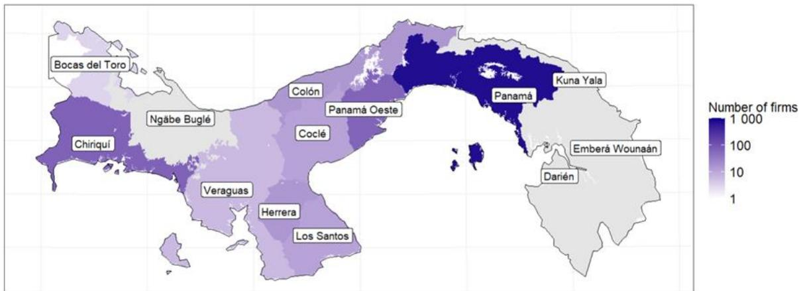  
Source: OECD calculations based on the 2022 Directorio de Empresas y Establecimientos from INEC (n.d. $^{[11]}$ ), “Publicaciones”, https://www.inec.gob.pa/publicaciones/.

In terms of sectors of economic activity, the majority of high-tech firms were engaged in computer programming, consultancy and related activities (56% of high-tech firms), followed by the manufacture of chemicals (12%). The manufacture of computer, electronic and optical products, with 17 firms, only represented 1.9% of high-tech firms in 2023 (Figure 2.3), suggesting that while incipient it could potentially grow alongside the development of an ecosystem for semiconductors.

The high-tech ecosystem of Panama is characterised by a large share of micro firms, with around 74% of the firms having fewer than 10 employees and just 2.0% of the firms more than 100 employees. This reflects the early-stage nature of this ecosystem and the scope for potential development. This pattern is in line with the non-high-tech sector where 70% of the firms have fewer than 10 employees and just 0.8% of the firms employ more than 100 workers (Figure 2.4, Panel A).

Figure 2.3. Sectoral distribution of high-tech firms in Panama, 2022  
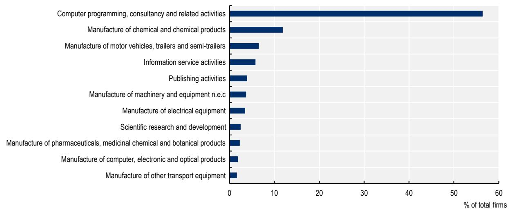  
Source: OECD calculations based on the 2022 Directorio de Empresas y Establecimientos from INEC (n.d.[11]), “Publicaciones”, https://www.inec.gob.pa/publicaciones/.

Figure 2.4. Distribution of firms according to their size, 2022  
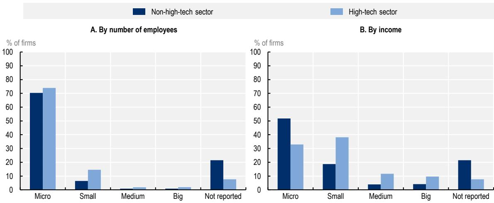  
Note: In Panel A, micro firms have fewer than 10 employees, small firms have between 10 and 50 employees, medium firms have between 50 and 100 employees and big firms have more than 100 employees. In Panel B, micro firms have revenues of less than PAB 150 000 (Panamanian balboa), small firms have revenues of between PAB 150 000 and PAB 1 million, medium firms have revenues of between PAB 1 million and PAB 2.5 million and big firms have revenues of more than PAB 2.5 million.  
Source: OECD calculations based on the 2022 Directorio de Empresas y Establecimientos from INEC (n.d. $^{[11]}$ ), “Publicaciones”, https://www.inec.gob.pa/publicaciones/.

Based on income ranges, 35.6% of high-tech firms are micro, 41.2% are small, 12.6% are medium-sized and 10.5% are large. Compared with non-high-tech firms, which are predominantly micro, high-tech firms are more frequently medium-sized or large. When comparing revenue distribution (Figure 2.4, Panel B) with firm size by employment (Figure 2.4, Panel A), revenue per worker appears to be higher within the high-tech sector. Although high-tech firms represent only 0.95% of all registered businesses in Panama, their higher concentration among medium-sized and large establishments indicates a comparatively greater contribution to national economic activity.

In 2019 and especially in 2020, revenues and employment in both the high-tech and non-high-tech sectors experienced a significant decline, before rebounding in 2021 and 2022. Despite this recovery, revenues in the non-high-tech sector remained notably below pre-COVID-19 levels, while the high-tech sector stayed close to the 2015 levels. In terms of employment, both sectors stayed below 2015 levels in 2022, although the rebound was stronger in the high-tech sector (Figure 2.5). From 2015 to 2024, the unemployment rate in Panama across all sectors of the economy rose from 5.1% to 9.5% (MINERPA, n.d.[12]).

Figure 2.5. Revenues and employment evolution, 2015-2022, 2015 = 100  
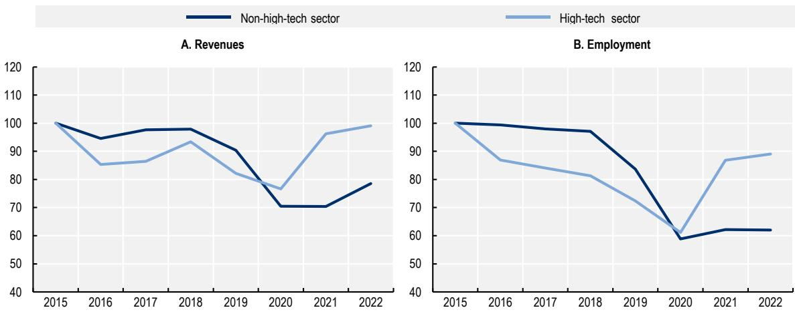  
Note: Employment is measured as the number of employees. Data for 2021 and 2022 are preliminary. Nominal revenues are deflated using the GDP deflator linked series produced by the World Bank and are expressed in 2018 prices.
Sources: OECD calculations based on Encuesta Entre Empresas No Financieras from INEC (n.d.[11]), “Publicaciones”, https://www.inec.gob.pa/publicaciones/; World Bank (n.d.[13]), GDP deflator: linked series (base year varies by country) (indicator), https://data.worldbank.org/indicator/NY.GDP.DEFL.ZS.AD (accessed on 15 September 2025) (for deflators).

As shown in Figure 2.6, the high-tech sector was incurring net losses in 2015 and 2016 but has been exhibiting net profits since 2017. The net profit margin in the high-tech sector eventually surpassed that of the non-high-tech sector in 2021 and 2022. Preliminary data for these years suggest that the high-tech sector achieved a net profit margin of over 7%. Conversely, the non-high-tech sector faced a notable decline in net profit margins in 2020; although it has since rebounded, it has not yet reached its 2016 peak of above 5%.

Figure 2.7 shows that compensation per employee is significantly higher in the high-tech sector compared to other sectors. Moreover, compensation per employee in the high-tech sector has increased since 2019. This increase likely reflects several underlying factors that characterise the high-tech industry such as the demand for highly specialised skills and advanced technical expertise, typically associated with higher wages. This result could also reflect the pace of expansion of the digital economy during and after the COVID-19 pandemic, which increased the demand for talent in the high-tech sector.

Figure 2.6. Net profit margin, 2015-2022  
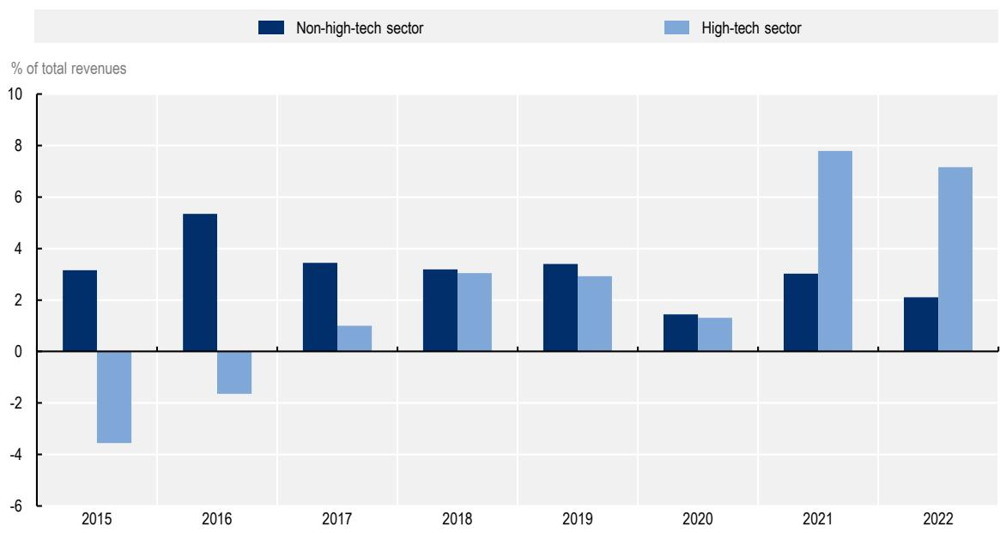  
Note: Net profit margin is calculated as the ratio of net profits to total revenues. Net profits are calculated as total revenues minus total costs. Data for 2021 and 2022 are preliminary.  
Source: OECD calculations based on Encuesta Entre Empresas No Financieras from INEC (n.d.[11]), "Publicaciones", https://www.inec.gob.pa/publicaciones/.

Figure 2.7. Real compensation per employee  
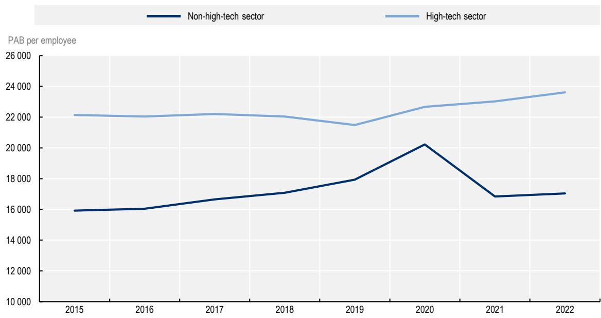  
Note: Compensation per employee is calculated as the total remunerations paid by each sector in a year divided by the sector's number of employees. Nominal compensation per employee is deflated using the GDP deflator linked series produced by the World Bank and are expressed in 2018 prices. Data for 2021 and 2022 are preliminary.  
Sources: OECD calculations based on Encuesta Entre Empresas No Financieras from INEC (n.d.[11]), “Publicaciones”, https://www.inec.gob.p.a/publicaciones/; World Bank (n.d.[13]), GDP deflator: linked series (base year varies by country) (indicator), https://data.worldbank.org/indicator/NY.GDP.DEFL.ZS.AD (accessed on 15 September 2025) (for deflators).

Figure 2.8 shows that, as expected, the high-tech sector employs more intangible fixed assets than the non-high-tech sector. Intangible fixed assets include, but are not limited to, patents, software, databases, distribution networks and other forms of intellectual capital. The predominance of intangible assets within the high-tech sector is also highlighted by Figure 2.3, which indicates that nearly 60% of the firms operate in computer programming and related activities. These industries often rely more on intellectual capital rather than on tangible assets, such as buildings, machinery, equipment and other forms of physical capital. However, it is important to note that wafer fabrication and semiconductor assembly, testing and packaging (ATP) rely heavily on physical capital. $^{4}$

Figure 2.8. Value of fixed assets, 2021 and 2022  
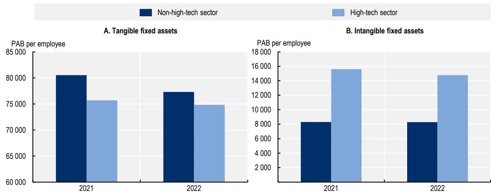  
Note: Data for 2021 and 2022 are preliminary.  
Source: OECD calculations based on Encuesta Entre Empresas No Financieras from INEC (n.d.[11]), “Publicaciones”, https://www.inec.gob.pa/publicaciones/.

## 2.1.3. Integration in global value chains

Panama is an open and services-oriented economy where trade significantly contributes to its GDP. In 2022, the total value of merchandise exports and imports accounted for nearly $60\%$ of GDP, above the OECD average but below levels observed in Latin American OECD Members such as Chile and Mexico. In contrast, trade in services accounted for over $25\%$ of Panama's GDP in 2022, exceeding the OECD average and that of other selected Latin American economies (Figure 2.9).

In Panama, most of the domestic value added embodied in trade is created through services exports, primarily through the transport and tourism industries (Orozco and Padilla Pérez, 2023[14]). The transport sector mainly exports its value added directly, unlike other economic sectors, which pass their value added through various stages and different industries in the economy before reaching the final export stage (OECD, 2017[15]).

Figure 2.9. Merchandise trade and trade in services, 2016 and 2022  
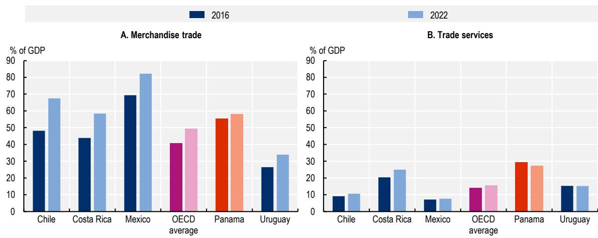  
Note: Merchandise trade as a share of GDP is the sum of merchandise exports and imports divided by the value of GDP, all in current USD. Trade in services is the sum of service exports and imports divided by the value of GDP, all in current USD.
Sources: World Bank (n.d.[16]), Merchandise trade (% of GDP) (indicator), https://data.worldbank.org/indicator/TG.VAL.TOTL.GD.ZS (accessed on 15 June 2024); World Bank (n.d.[17]), Trade in services (% of GDP) (indicator), https://data.worldbank.org/indicator/BG.GSR.NFSV.GD.ZS (accessed on 15 June 2024).

## Trade balance for ICT products

This section first describes the trade balance for ICT products and then focuses specifically on the GVC of products that are essential to the semiconductor ecosystem. The primary data source used in the analysis is the BACI database, $^{5}$ which allows for the monitoring of global trade statistics by product and trading partner at the six-digit Harmonised System (HS) code level. For more detailed information on the methodology and the list of products, refer to Annex B.

In 2023, Panama's exports of ICT products amounted to approximately USD 96 million, and main trading partners included Costa Rica, Guatemala and the United States (Figure 2.10). The two most exported products, representing together $29\%$ of the exports, were telephones for cellular networks (HS code 851712) and machines for the reception and transmission of voice, images or other data (HS code 851752). $^{6}$

In contrast, Panama's imports of ICT products amounted to approximately USD 845 million in 2023. The main trade partners were the People's Republic of China (hereafter “China”), Mexico and the United States (Figure 2.11). Imports of machines for the reception and transmission of voice, images or other data (HS code 851762) accounted for 19% of the imports, followed by portable automatic data processing machines (HS code 847130) with 12% of the imports. The prevalence of the same products in both imports and exports and the absence of a domestic industry suggests that re-exports are extremely important for Panama's manufacturing sector.

Overall, Panama exhibited a trade deficit in ICT products, which was especially significant with China, Mexico and the United States. Conversely, Panama recorded a surplus with several Latin American countries including Chile, Costa Rica and Guatemala.

Figure 2.10. Exports of ICT products by main trading partner, 2023 USD thousands  
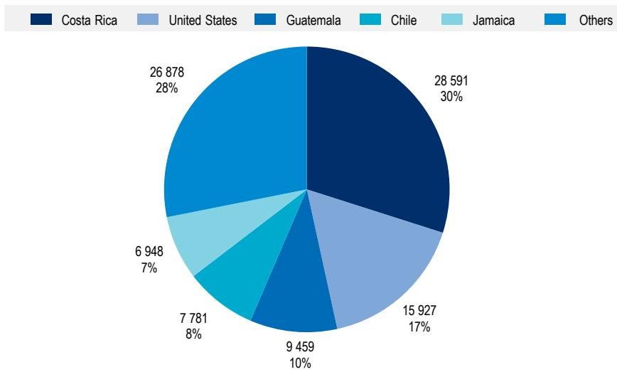  
Note: “Others” refers to exports to other partners not included in the figure.  
Source: OECD calculations based on the BACI database (2026[18]), The CEPII-BACI dataset, https://www.cepii.fr/DATA\_DOWNLOAD/baci/doc/baci\_webpage.html.

Figure 2.11. Imports of ICT products by main trading partner, 2023  
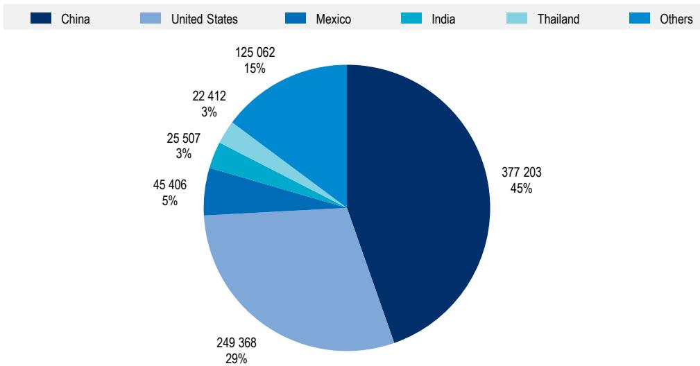  
Note: “Others” refers to imports from other partners not included in the figure.  
Source: OECD calculations based on the BACI database (2026[18]), The CEPII-BACI dataset, https://www.cepii.fr/DATA\_DOWNLOAD/baci/doc/baci\_webpage.html.

## Trade in the semiconductor value chain

The semiconductor supply chain encompasses a series of stages and production processes, starting from the extraction and refinement of raw materials to semiconductor ATP. The inputs needed for each of these stages are illustrated in Figure 2.12. The products involved in each of these steps can be categorised using the international trade data classification, with a comprehensive list provided in Table A B.1. The subsequent analysis involves studying the evolution of exports and imports and examining Panama's market specialisation and trade dependencies.

Figure 2.12. The semiconductor supply chain  
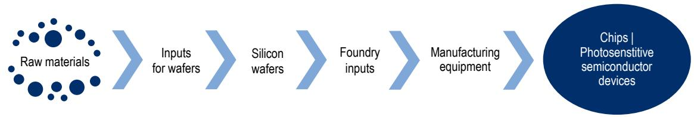

Note: For more details on the list of products, see Table A B.1.

Sources: OECD compilation based Bonnet, P. and A. Ciani (2023[19]), Applying the SCAN methodology to the Semiconductor Supply Chain, https://publications.jrc.ec.europa.eu/repository/handle/JRC133736; Haramboure, A. (2023[20]), “Vulnerabilities in the semiconductor supply chain”, https://doi.org/10.1787/6bed616f-en; OECD (2019[21]), “Measuring distortions in international markets: the semiconductor value chain”, https://doi.org/10.1787/8fe4491d-en.

From 2013 to 2022, imports of chips remained considerably higher than exports. This deficit was particularly pronounced in 2022 (Figure 2.13). The countries from which Panama imported the most in 2023 were Colombia, Mexico and the United States. It is important to note that all exports of chips likely reflect re-exports because Panama does not currently produce chips domestically.

Figure 2.13. Trade balance for chips, 2012-2023  
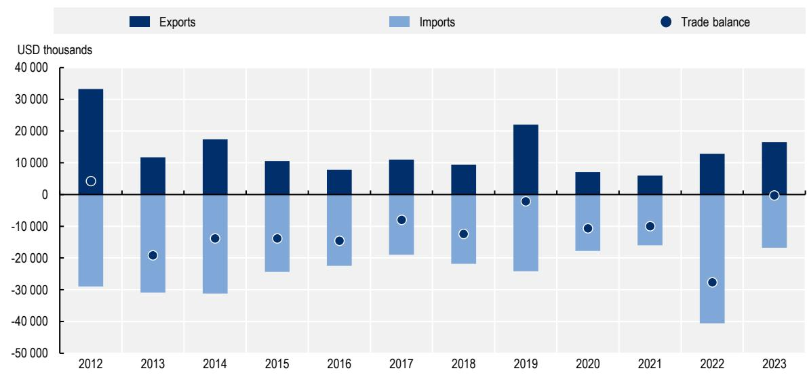  
Note: Exports and imports were deflated using the merchandise trade values annual dataset from the World Trade Organization (WTO), using the annual merchandise export (import) unit value chained indices for exports (imports) (WTO, 2025[22]). Source: OECD calculations based on the BACI database (2026[18]), The CEPII-BACI dataset, https://www.cepii.fr/DATA\_DOWNLOAD/baci/doc/baci\_webpage.html.

Semiconductor-related trade has shown widening deficits between 2012-2014 and 2021-2023. Figure 2.14 shows that chip exports declined from USD 20.9 million to USD 12 million, while imports remained high, decreasing only slightly from USD 30.2 million to USD 26.8 million. This resulted in an expanding trade deficit of USD 14.8 million. Exports of foundry inputs, raw materials and wafer inputs also fell over the period, further deepening their respective trade balance deficits. The largest increases in deficits were recorded for manufacturing equipment (USD 61.3 million) and photosensitive semiconductor devices (USD 55.7 million). Trade in silicon wafers remained negligible, with minimal exports and imports. Across all segments, the ratio of imports to total trade (exports plus imports) has increased over time, and for most segments now approaches 1, indicating that imports account for nearly all trade flows in these products.

Figure 2.14. Semiconductor trade balance  
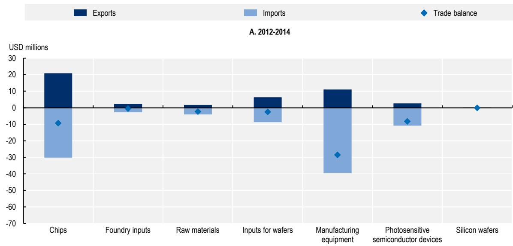

B. 2021-2023  
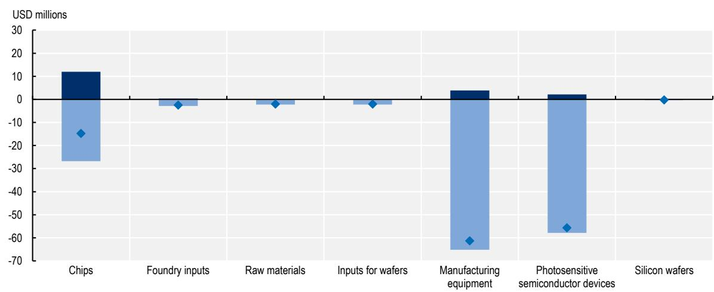  
Source: OECD calculations based on the BACI database (2026[18]), The CEPII-BACI dataset, https://www.cepii.fr/DATA\_DOWNLOAD/baci/doc/baci\_webpage.html.

To complement the analysis, the revealed comparative advantage (RCA) indicator can help assess Panama's relative standing within the different segments of the supply chain. The RCA indicator compares a country's share of exports in a particular segment to the global share of those exports, thereby providing evidence of countries' specialisation in certain segments and products. An RCA value above 1 indicates a revealed comparative advantage (see Annex B for more details).

Figure 2.15 shows that Panama does not exhibit a high level of specialisation in any of the segments under analysis. Among the selected countries, only Costa Rica shows a specialisation in the export of chips.

Figure 2.15. RCA for selected economies, 2012 and 2023  
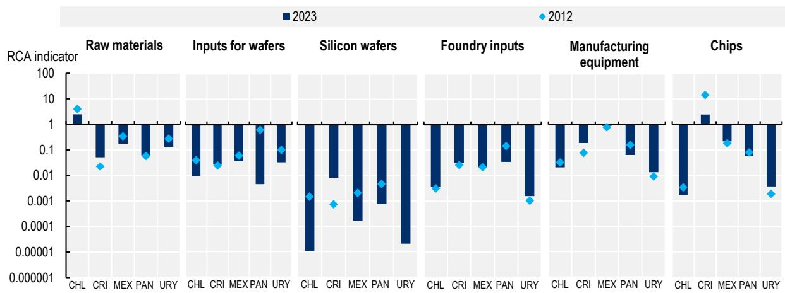  
Source: OECD calculations based on the BACI database (2026[18]), The CEPII-BACI dataset, https://www.cepii.fr/DATA\_DOWNLOAD/baci/doc/baci\_webpage.html.

The existence of few countries supplying certain goods can induce trade dependencies that may ultimately result in supply bottlenecks, shortages and higher prices. To identify dependencies, the Herfindahl-Hirschman Index can be calculated for each commodity imported by Panama. This analysis determines whether Panama's imports of a specific product are concentrated in a limited number of economies. Further to the analysis of concentration in the import market, additional criteria are used to determine if Panama is trade-dependent on a specific product (see Annex B for more details).

During the first period under analysis (2012-2014), Panama registered six trade dependencies for semiconductor-related products, with two related to products imported from the United States $^{7}$ and the remaining four from Canada, China, Mexico and Peru. However, by the latest period (2021-2023), these dependencies increased to seven: two from the United States, two from China and the remaining three from Brazil, Japan and Thailand (Figure 2.16). In the first period, four dependencies were associated with the import of raw materials and two with the import of chips. In the latest period, two dependencies were associated with the import of chips, two with the import of inputs for wafers, and the remaining three with the imports of manufacturing equipment, photosensitive semiconductor devices and foundry inputs.

Figure 2.16. Bilateral dependencies at the country-product level  
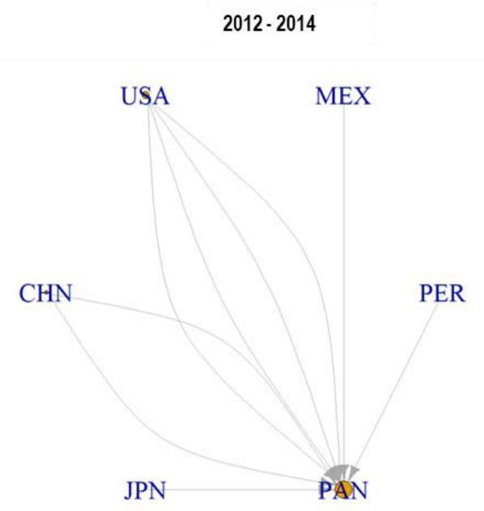

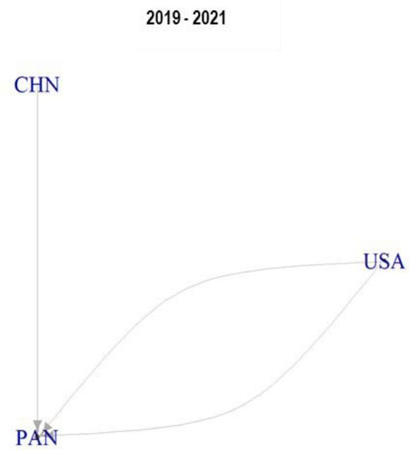  
Note: Each arrow denotes one dependency at the country-product level.  
Source: OECD calculations based on the BACI database (2026[18]), The CEPII-BACI dataset, https://www.cepii.fr/DATA\_DOWNLOAD/baci/doc/baci\_webpage.html.

Openness to trade, facilitating trade with a broader range of countries, and enhancing trade agreements can reduce reliance on a small number of suppliers and create more balanced trade relationships, ensuring secure access to essential semiconductor products.

## 2.1.4. Innovation and investment

## Patent activity and investment in R&D

Patent statistics provide insights on the general state-of-the-art in the concerned technology area and can help identify the maturity of certain technologies or technological trends (EPO, n.d.[23]; WIPO, 2023[24]). While patent data may not tell the whole story regarding the innovative nature of an industry in a country, they are often considered as the best proxy for measuring technological innovation. In evaluating technological progress, this patent information can be complemented with other indicators such as investments in R&D and digital technologies. See Box 2.2 for details on the use of patents as a measure of innovation activity.

## Box 2.2. Patents as a measure of innovation in semiconductors

Patents provide a detailed source of information on the inventive activity of a country, and are frequently used as a proxy for innovation measures, following a long tradition in the literature (Griliches, 1990[25]). Patents are used by firms, by research institutions or by individuals to protect inventions in a given market. Indicators on patents convey information on the output and on the processes of inventive activities, as described in the OECD Patent Statistics Manual (OECD, 2009[26]).

The patent data derive from the intellectual property (IP) data of the OECD Science, Technology and Innovation (STI) Micro-data Lab, which mostly relies on the Worldwide Patent Statistical Database maintained by the European Patent Office (EPO), also known as PATSTAT Global, in its Autumn 2025 edition. The PATSTAT database includes information on patents filed worldwide, including their administrative steps, the origin of the invention (with the name and location of inventors or applicants), the technologies that are covered by the invention (e.g. patent classes, title, abstract and claims describing the invention), the countries in which the inventions are protected, the citations made to or by other patents, as well as references to the scientific literature.

Semiconductor patents are identified as those allocated to International Patent Classification (IPC) codes H01N or H10 and complemented with patents featuring the keywords related to semiconductors in their abstract that are not classified in the IPC codes (Table 2.2).

Table 2.2. Keywords used to identify trends in patents related to semiconductors

<table><tr><td>Semiconductor</td></tr><tr><td>Transistor</td></tr><tr><td>Integrated circuit</td></tr><tr><td>Silicon wafer</td></tr><tr><td>Logic chip</td></tr><tr><td>Memory chip</td></tr></table>

The latest trends in semiconductor patents worldwide are shown using patent applications filed under the Patent Co-operation Treaty (PCT). Notably, PCT patent applications aim to protect patents across multiple jurisdictions and therefore typically include patents of higher economic value than patents protected in a single jurisdiction.

Patents are assigned to the country where the applicant filing the patent is located, using fractional counts (if two firms located in two different countries jointly file a patent, each country gets assigned one-half of a patent). Owing to the scarcity of patent citation records in PATSTAT, citation-based measures only rely on EPO or United States Patent and Trademark Office (USPTO) patents.

Sources: Griliches, Z. (1990[25]), “Patent Statistics as Economic Indicators: A Survey”, https://www.jstor.org/stable/2727442; OECD (2009[26]), OECD Patent Statistics Manual, https://doi.org/10.1787/9789264056442-en.

At the global level, patent filings in semiconductor technologies have increased since the early 1980s. As shown in Figure 2.17 (Panel A), the number of patents filed for semiconductor inventions saw a significant increase between 1995 and 2005, with an annual growth rate of 19.1% for PCT applications. $^{8}$ Since then, PCT applications related to semiconductors have slowed down: from 2015 to 2020, PCT applications grew at an annualised growth rate of 4.7%. Additionally, as illustrated in Figure 2.17 (Panel B), the share of semiconductor patents in total PCT applications has remained broadly stable since 2002.

B. Share of patents related to semiconductors

Figure 2.17. Trends in patents related to semiconductors, 1980-2024  
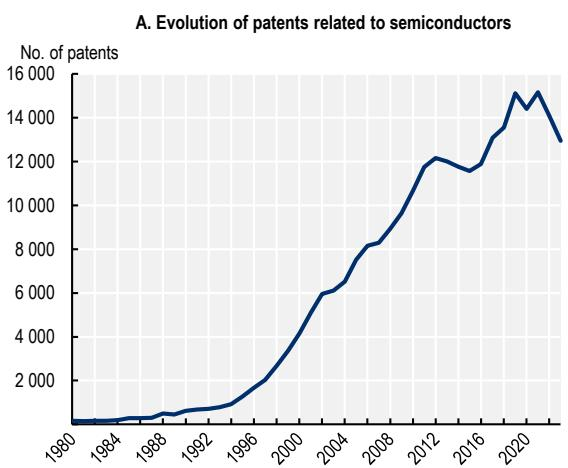

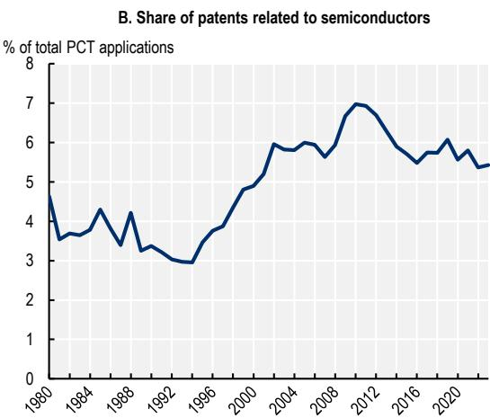  
Note: Data refer to patent applications filed under the PCT, by earliest filing date. Patent applications follow fractional counting. The latest observations are for 2024.  
Source: OECD (n.d.[27]), STI Micro-data Lab: Intellectual Property Database, http://oe.cd/ipstats (accessed on 20 March 2026).

In Panama, patenting activity across all technologies has remained limited in the last two decades, with an average number of 19 patents per year, except for notable peaks in 2016 and 2018. In 2016, transport was the category with the largest number of patents, with 19% of total patents. In 2018, furniture and games was the main category, with 16% of patents. $^{9}$

For patents related to semiconductors, activity has been almost non-existent, with only a single patent registered in 2018 during the period 2000-2024 (Figure 2.18).

R&D expenditure, an often-used input measure of innovation, can shed further light on Panamanian patenting performance. Figure 2.19 shows that Panama allocated less than 0.2% of its GDP to R&D in 2022, a figure significantly below the OECD average (3%) and below the regional average for Latin America and the Caribbean (0.56%).

Figure 2.19 also shows that while the government share of R&D expenditure in Panama increased in recent years, business investment remained practically non-existent as of 2021. In Panama, a large part of R&D expenditure is driven by foreign investment, with the contribution of domestic higher education and non-profit private institutions being very limited. Fostering domestic private R&D investment in innovation activities as well as incentivising investment by higher education institutions could unlock Panama's potential to boost innovation and engage in high value-added activities.

Figure 2.18. PCT patents related to semiconductors and other technologies in Panama, 2000-2024  
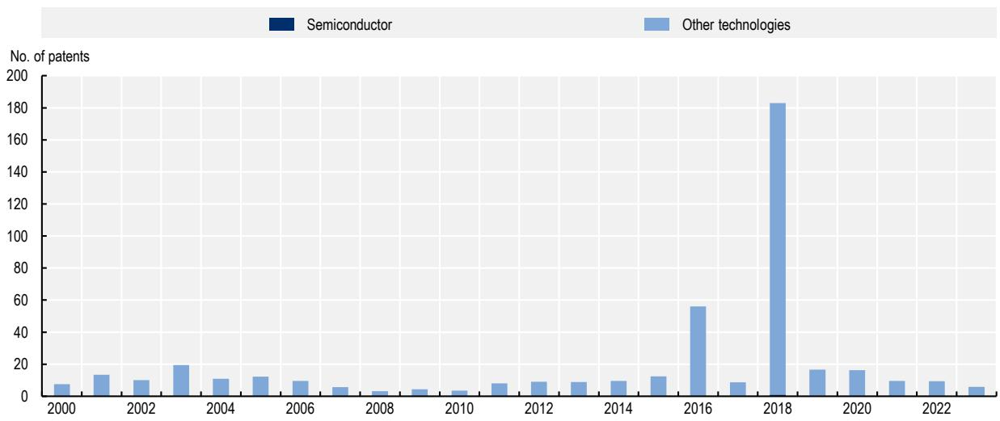  
Note: Data refer to patent applications filed under the PCT by earliest filing date. Patent application follows fractional counting. The latest observations are for 2024.  
Source: OECD (n.d.[27]), STI Micro-data Lab: Intellectual Property Database, http://oe.cd/ipstats (accessed on 20 March 2026).  
A. R&D expenditure in selected countries

Figure 2.19. R&D expenditure, 2014-2022

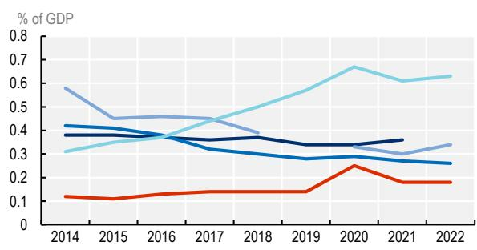  
B. R&D expenditure by source of funds in Panama

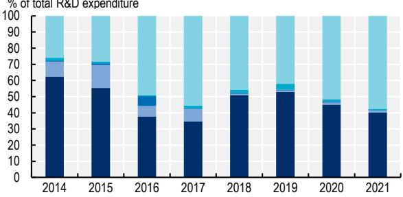  
Note: The latest observations are for 2022 for Costa Rica, Mexico, Panama and Uruguay; and 2021 for Chile.
Sources: OECD calculations based on: Panel A: RICYT (n.d. $^{[28]}$ ), “Indicators”, https://www.ricyt.org/en/category/indicators/ (accessed on 15 September 2025); Panel B: SENACYT (n.d. $^{[29]}$ ), “Homepage”, https://observatorio.senacyt.gob.pa/ (accessed on 15 July 2024).

## Foreign direct investment

FDI can produce positive productivity spillovers as multinationals integrate domestic firms into their productive process and foster the development of a local ecosystem. Moreover, multinationals may bring new technology and provide access to new markets, thereby improving the training and qualifications of the local workforce and improving employment and wages (Carril-Caccia and Pavlova, 2020[30]; Alfaro Urena, Manelici and Vasquez, 2021[31]). The positive spillovers of investment by multinationals can be further leveraged if co-ordinated with the development of a local ecosystem of suppliers and customers to help ensure long-term benefits to the local economy.

Multinational corporations engage in FDI activities for various strategic purposes. Market potential, asset seeking, efficiency seeking, institutional quality and macroeconomic stability are among the primary determinants for firms to engage in FDI activities (Carril-Caccia and Pavlova, 2020[30]).

Figure 2.20 shows that the share of Panamanian firms investing abroad is small in both the high-tech and non-high-tech sectors, constituting less than 2% of all firms in each category. In contrast, the proportion of non-high-tech firms in Panama with foreign capital surpasses 10%, while more than 12% of the high-tech firms have capital from an entity residing abroad.

Figure 2.20. Inward and outward cross-border investment for selected groups, 2019  
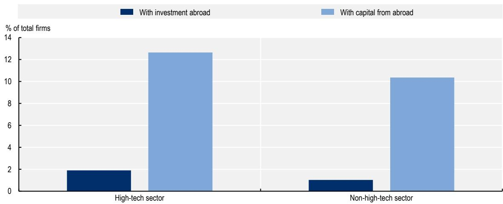  
Note: Investment abroad corresponds to Question 4 of the Encuesta Entre Empresas No Financieras (EEENF) questionnaire, whereas capital from abroad corresponds to Question 5 of the EEENF questionnaire.  
Source: OECD calculations based on the Encuesta Entre Empresas No Financieras from INEC (n.d.[32]), “Instituto Nacional de Estadística y Censo”, www.inec.gob.pa.

FDI net inflows in the form of acquisitions in Panama have been historically high, reaching their peak in 2006, representing around 16% of GDP, significantly above other Latin American countries and the OECD average. Nonetheless, after this peak, inward FDI declined and, in 2020, outward investments surpassed inward investments, influenced by the halt in investment during the COVID-19 pandemic. Post-pandemic, there was a resurgence in FDI net inflows, reaching approximately 4% of GDP by 2024. Nonetheless, this figure falls below that of Chile and Costa Rica (Figure 2.21).

Figure 2.21. FDI, net inflows, 1990-2024  
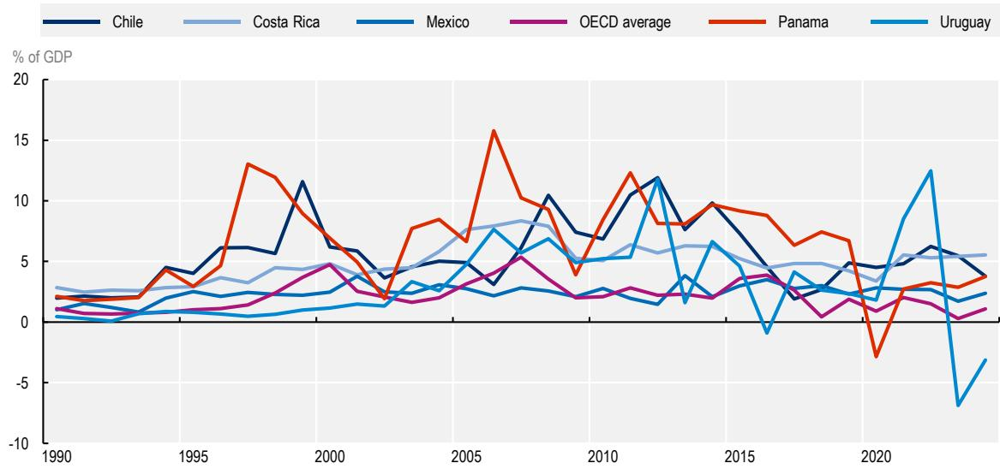  
Note: FDI is the net inflow of investment to acquire a lasting management interest (10% or more of voting stock) in an enterprise operating in an economy other than that of the investor. It is the sum of equity capital, reinvestment of earnings, other long-term capital and short-term capital as shown in the balance of payments. This series shows net inflows (new investment inflows less disinvestment) in the reporting economy from foreign investors, and is divided by GDP.  
Source: World Bank (n.d. $^{[33]}$ ), Foreign direct investment, net inflows (% of GDP) (indicator), https://data.worldbank.org/indicator/BX.KLT.DINV.WD.GD.ZS (accessed on 15 September 2025).

The overall decline in net investment inflows in recent years was also reflected in mergers and acquisitions (M&A) activity involving high-tech firms. In Panama, inward investment accounted for most of the value of this M&A activity during the periods from 2005 to 2016. However, in the most recent period (2017-2022), the share of outward investment has notably increased whereas inward investment has decreased (Figure 2.22). Throughout the entire 2005-2022 period, Israel had the highest share of inward investment, accounting for 20% of the total value of acquisitions. Following Israel were Mexico with 18%, the United Kingdom with 17% and the United States with 10%. For outward investment, the United States was the main partner with 52% of the value of the deals.

Deals involving at least one firm outside the high-tech sector (either on the target or the acquiror side) played a significant role in this growth, accounting for more than 80% of the total deals' value, pointing to important inter-sectoral spillovers and low intra-sectoral spillover.

The effects of greenfield investment on the economy tend to materialise more rapidly since these investments directly include new elements, such as jobs, facilities and production capacity in the economy. This immediate impact can lead to increased competition and enhanced productivity (World Bank, 2020[34]). To date, there have been no greenfield investments in the semiconductor sector in Panama.

As illustrated in Figure 2.23, among the sectors receiving high levels of greenfield investment between January 2003 and February 2026 was the renewable energy sector, which attracted USD 8.4 billion of investments. There were 32 projects in this sector, with the largest being a project announced by the US firm SGP BioEnergy to develop the world's largest biofuels production and distribution hub, located in Balboa and Colón. The metals sector, which includes minerals, received USD 7.5 billion, with $89\%$ of this amount attributable to two investments made by the Canadian firm First Quantum Minerals, managing the Cobre Panamá mine, which was closed in December 2023. The transportation and warehousing sector was the third largest, attracting USD 5.1 billion from 17 countries, featuring a Swiss investment of USD 1.4 billion in 2022, to build a new terminal on the Panama Canal.

Figure 2.22. Value of deals involving at least one Panamanian high-tech firm, by origin, 2005-2022  
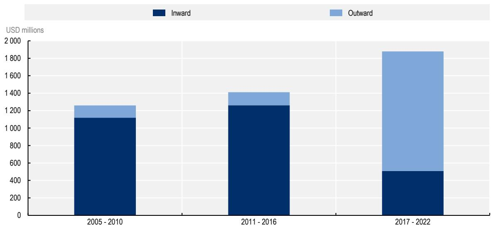  
Note: This figure covers the deals in the following categories: "Genuine acquisition", "Further acquisition", "Minority stakes" and "Joint venture". The sectors considered are the sectors outlined in Table 2.1. Inward deals are the deals with a Panamanian firm as target. Outward deals are the deals with a Panamanian firm as acquiror. Only cross-border investments are considered; domestic deals are not included.

Source: OECD calculations based on Zephyr (v.2022), currently Orbis M&A (2026[35]), "Welcome to Orbis M&A", https://login.bvdinfo.com/R1/OrbisMA.

Figure 2.23. Greenfield investment, net inflows by sector, January 2003-February 2026  
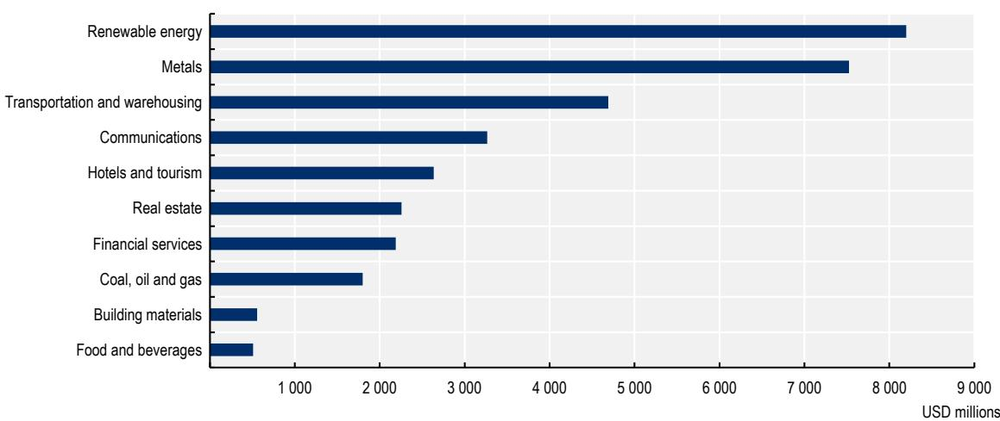  
Note: The sectors selected are the top ten sectors by net inflows of greenfield investment. Based on 519 projects recorded for Panama. Source: OECD calculations based on fDi Markets (2024[36]), "Homepage", https://www.fdimarkets.com/ (accessed on 14 January 2025).

Nonetheless, investments with the highest job creation were in the real estate as well as hotel and tourism sectors. The real estate sector generated almost 17 000 jobs, while the hotel and tourism sector created nearly 14 000 jobs, followed by the transportation and warehousing sector with more than 12 000 jobs (Figure 2.24). Real estate activities were mainly in construction, with accounted for nearly all jobs created. There were also projects in the sales, marketing and support, and business services segments, each generating fewer than 100 jobs.

Figure 2.24. Greenfield investment, employment creation, January 2003-February 2026  
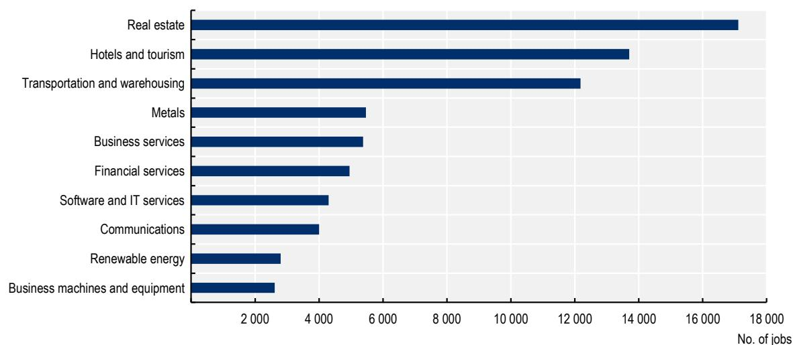  
Note: The sectors selected are the top ten sectors by number of jobs created by greenfield investment. Based on 519 projects recorded for Panama.  
Source: OECD calculations based on fDi Markets (2024[36]), "Homepage", https://www.fdimarkets.com/ (accessed on 14 January 2025).

In the ICT and electronics cluster, which according to the fDi Markets database includes the communications, electronic components, information technology (IT) and software and business machines and equipment sectors, total inward greenfield investment in Panama amounted to USD 3.8 billion and 10 195 jobs were created over the entire 2003-2026 period. Investment originated mainly from Spain, Luxembourg and Jamaica, all with a focus on the communications sector (Figure 2.25).

Figure 2.25. Greenfield investment in the ICT and electronics cluster by country, January 2003-February 2026, USD millions  
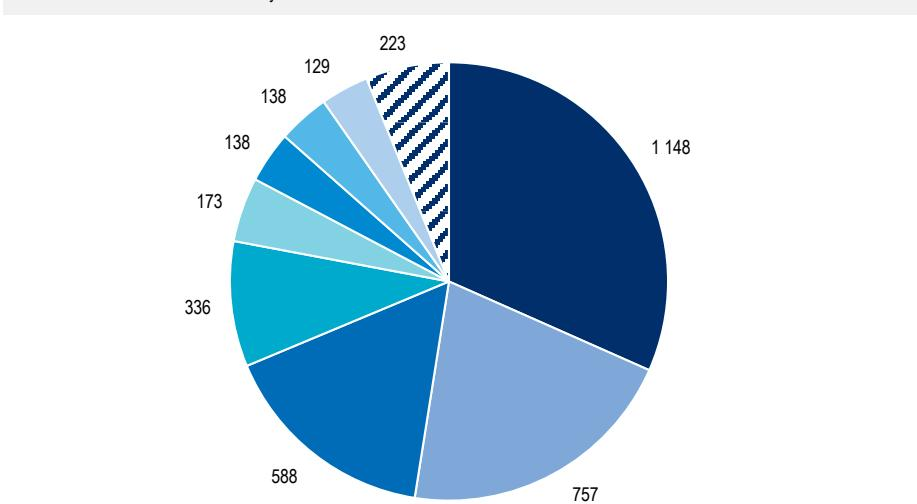  
Note: The figure shows inward investment in Panama. Based on 80 projects recorded for Panama in the ICT and electronics cluster. “Others” refers to exports to other partners not included in the figure.  
Source: OECD calculations based on fDi Markets (2024[36]), "Homepage", https://www.fdimarkets.com/ (accessed on 14 January 2025).

## 2.2. Infrastructure

Several types of infrastructure play a crucial role in supporting the semiconductor industry. The provision of water and power is critical for running semiconductor facilities, both in wafer fabrication and semiconductor ATP, with the provision of stable broadband connectivity playing also a relevant role. Furthermore, the availability of well-maintained transportation infrastructure (e.g. roads, airports, ports) is necessary to ensure smooth and timely access to critical inputs and shipment of outputs.

Panama benefits from abundant freshwater resources, although access to potable water varies significantly by region. Panama benefits from low energy costs for businesses and a considerable share of renewable resources in electricity production. However, further efforts to ensure power reliability would be important.

Connectivity also contributes to the development of high-tech and semiconductor firms. Data on fixed broadband subscriptions indicate Panama's lagging performance compared to other Latin American countries. Additionally, internet coverage at the household level reveals significant disparities across regions.

Despite a significant decline in infrastructure investment over the past decade, Panama remains one of the top countries in the Latin American region for infrastructure quality and port traffic volume. Even if there is room for improvement in the efficiency of its major ports, Panama can leverage its strategic position to diversify into other sectors beyond transportation, adding value to the products transported. The country also benefits from strong road and air transport infrastructure, further enhancing its potential.

Part of the analyses in this section draw on the OECD's Principles for Private Sector Participation in Infrastructure (OECD, 2024[37]), which brings together 24 principles on how government can mobilise private investment in infrastructure projects. Key principles relate to the allocation of risk and responsibilities between the public and private sectors, fiscal discipline, transparency and governance, effective competition, access to capital markets, consultation with end users and the importance of competent, well-resourced regulatory authorities (OECD, 2024[37]).

## 2.2.1. Key utilities

## Water

Semiconductor fabrication is a water-intensive process and, in recent years, the industry has faced challenges due to the increasing scarcity of water resources and disruptions caused by climate change. Many regions of the world are already reaching the limits of a sustainable supply of freshwater for nature and human needs. In response, the semiconductor industry has been actively developing and implementing water-saving technologies to enhance water recycling and minimise waste (Frost and Hua, 2019[38]).

Figure 2.26 shows Panama's favourable standing in freshwater resources. With around 31 000 cubic metres (m $^{3}$ ) per capita in 2021, Panama surpassed the OECD average (approximately 9 300 m $^{3}$ per capita) and only remained behind Chile (approximately 45 000 m $^{3}$ per capita) among select Latin American countries. However, there has been a steady decline from the level observed in 2000 across all economies, including Panama.

Recent droughts in Panama have resulted in reduced freshwater resources, leading to transit restrictions in the Panama Canal (see Section 2.2.2 on maritime transport). These droughts have also created a trade-off between allocating water for Panama City, hydroelectric power generation and attending to the needs of the Panama Canal (IMF, 2024[2]).

In only four provinces of Panama, more than 90% of households have access to potable water every day of the week, regardless of the season (Figure 2.27). Ensuring access to clean and sanitised water is a fundamental requirement for the future development of a semiconductor ecosystem in Panama, particularly in the areas with the highest degree of industrial development.

Figure 2.26. Renewable internal freshwater resources per capita in selected countries, 2000-2021  
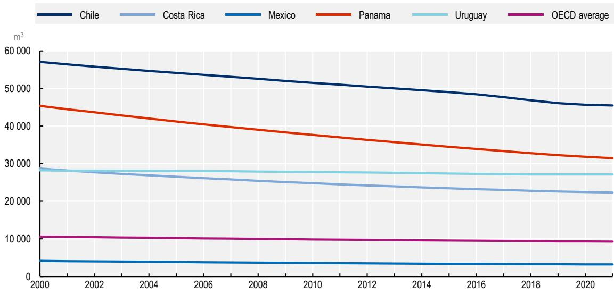  
Note: The graph shows the internal renewable resources (internal river flows and groundwater from rainfall) in a given country.
Source: OECD calculation based on World Bank (2024[39]), Renewable internal freshwater resources per capita (cubic meters) (indicator), https://data.worldbank.org/indicator/ER.H2O.INTR.PC (accessed on 15 September 2025).

Figure 2.27. Share of households with access to drinking water every day of the week, by seasons and provinces, April 2022  
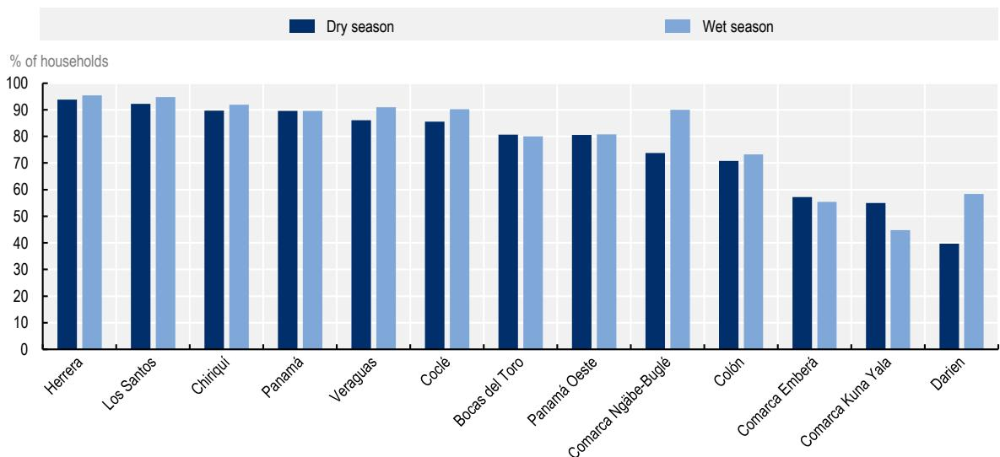  
Notes: The share is calculated by taking the sum of the households that responded as having drinking water seven days per week according to Question 1J1 of the Multiple Purposes Survey (Encuesta de Propósitos Múltiples) of April 2022, corresponding to “How often do you receive drinking water?”, and dividing by the total number of households  
Source: OECD calculations based on Encuesta de Propósitos Múltiples from INEC (n.d.[11]), “Publicaciones”, https://www.inec.gob.pa/publicaciones/.

## Energy

Together with water, energy is a key input for the development of semiconductor production in Panama. Beyond the wafer fabrication process – including photolithography, etching, deposition or ion implantation – energy is needed to power the overall infrastructure of the semiconductor facilities, including maintaining the required environment in cleanrooms. The ATP segment of the semiconductor value chain is, on average, less energy-intensive than fabrication but still depends on a strong and reliable supply of energy.

As of 2023, Panama had not yet achieved universal access to electricity (Figure 2.28). In response, the government implemented a programme with the goal of achieving universal access to electricity by 2030 and supporting the development of rural areas without access to basic services. $^{10}$

Figure 2.28. Access to electricity in selected economies, 2005-2023  
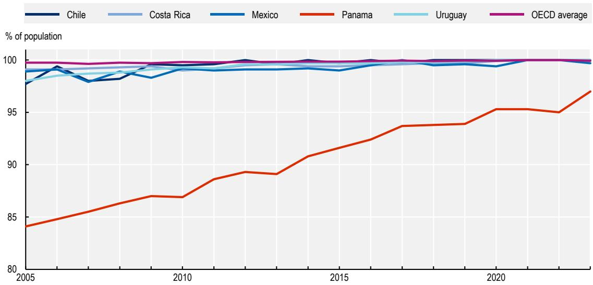  
Source: World Bank (2023[40]), Access to electricity (% of population) (indicator), https://data.worldbank.org/indicator/EG.ELC.ACCS.ZS (accessed on 15 September 2025).

Figure 2.28 provides valuable context relating to electricity access throughout Panama as a whole and expanding the population's access to electricity is a necessary objective for the country's broader economic development. However, it is particularly important to analyse electricity supply and reliability in Panama's special economic zones (SEZs), as this is where the semiconductor industry would be expected to operate.

There are limited sources of data on electricity in SEZs. Nevertheless, it appears that strong electricity infrastructure is one of the major advantages of Panama's SEZs. Panamá Pacífico – an SEZ located close to the Panama Canal and home to over 300 firms – has electric power capacity that exceeds the demand from firms in its industrial park (Panamá Pacífico, 2022[41]). Three electrical substations operate within Panamá Pacífico, which represent dedicated electricity infrastructure for the industrial park and its firms. Panamá Pacífico also offers redundant power systems (LatAm FDI, 2025[42]). The City of Knowledge – an SEZ that hosts 81 high-tech firms and 27 academic and research organisations – advertises its constant electricity supply and redundant power from the Panama Canal's thermal plant, located just 300 metres away at Miraflores Locks (AmCham Panama, 2024[43]).

The redundancy in power supplies in Panamá Pacífico, the City of Knowledge and other Panamanian SEZs is in response to the country's challenges relating to power outages. Consultations with stakeholders carried out in the context of this report suggest that frequent power outages in Panama are an important challenge that needs to be addressed. This is reinforced by data relating to the frequency and duration of power outages experienced by firms. In 2019, the most recent year available, firms in Panama experienced on average 5.2 power outages per year according to the World Bank's system average interruption frequency index. This was higher than other countries in the region such as Costa Rica (0.2), Mexico (0.9) or Uruguay (4.0) (World Bank, $2020_{[44]}$ ). Also in 2019, the average total duration of outages experienced by a firm in Panama per year was 7.8 hours according to the World Bank's system average interruption duration index (World Bank, $2020_{[45]}$ ). This was higher than in Costa Rica (0.5 hours) or Mexico (0.6 hours) but lower than Uruguay (10.0 hours).

These data are not disaggregated by firms inside or outside Panama's SEZs, so it is not possible to establish whether firms within the SEZs have more reliable supplies of electricity than their counterparts outside the SEZs. However, given the SEZs' electricity infrastructure, it would be reasonable to assume that their firms do benefit, on average, from more reliable electricity.

In addition to electricity access and reliability, electricity costs are another key consideration in attracting semiconductor firms to Panama and developing a domestic semiconductor ecosystem. Figure 2.29 shows the average cost of electricity for households and businesses in selected economies between 2023 and 2025. The figure includes all components of the electricity bill, such as power costs, distribution fees and taxes. Differences in regional or federal subsidies and varying tariff structures can significantly impact these costs and affect the comparability between countries. As with the above data on the frequency and duration of power outages, these data do not distinguish between firms inside or outside Panama's SEZs.

Taking these caveats into account, Figure 2.29 shows that Panama benefits from lower electricity costs compared to other Latin American countries. The price of electricity for businesses in Panama stays below USD 0.2 per kilowatt-hour (kWh), which is significantly less than in Costa Rica and Mexico, although still higher than in Chile and Uruguay. Low electricity costs are essential for developing the semiconductor ecosystem, as they lower production expenses, attract foreign investment and stimulate industrial growth.

Figure 2.29. Electricity costs for households and businesses in selected economies, 2023-2025 average  
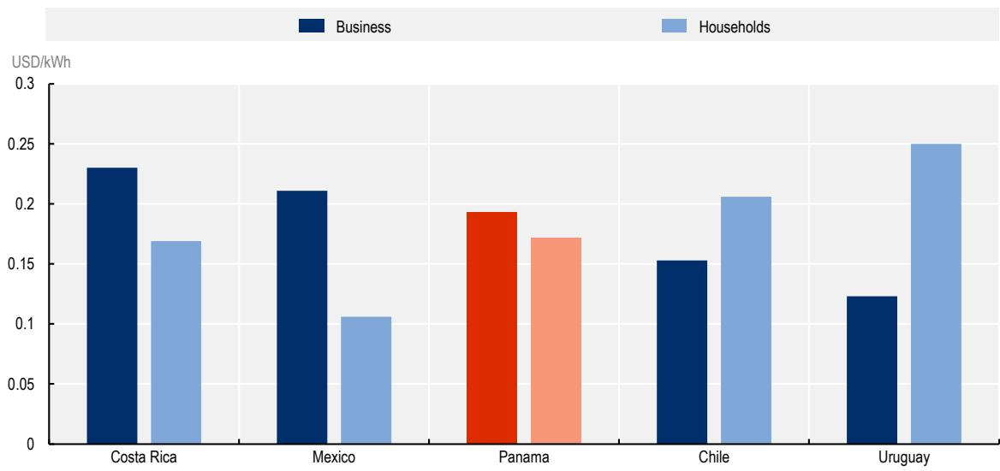  
Note: The graph shows average electricity rates for households and businesses between 2023 and 2025. Using average prices helps mitigate electricity price volatility between quarters. The price includes all components of the electricity bill such as the cost of power, distribution and taxes. In terms of electricity consumption, for households, the displayed number is calculated at the average annual level of household electricity consumption. For businesses, the displayed data point uses 1 000 000 kWh of annual consumption.
Source: OECD calculation based on GlobalPetrolPrices.com (2025[46]), Electricity prices (dataset), https://www.globalpetrolprices.com/electricity\_prices/ (accessed on 15 September 2025).

Panama is one of the very few “carbon-negative” countries in the world, as its forests capture more carbon than Panama’s total greenhouse gas emissions (EC, 2024[47]). Relatedly, Panama benefits from natural endowments that enable the production of renewable electricity. Figure 2.30 shows that, in 2023, solar photovoltaic (PV), wind and notably hydropower accounted for 60% of the electricity production. While solar PV has a higher share in Panama, hydropower and wind have a higher share in Costa Rica, where these three sources together account for 77% of electricity generation. Panama’s electricity generation from these three renewable sources is higher than in Mexico (17% of total generation) but slightly lower than in Chile (64%) and Uruguay (67%). Panama has a diversified energy matrix as more than 21% of its electricity is generated from natural gas, which the country sometimes relies on in times of drought when hydropower becomes limited.

Figure 2.30. Electricity generation sources in selected countries, 2024  
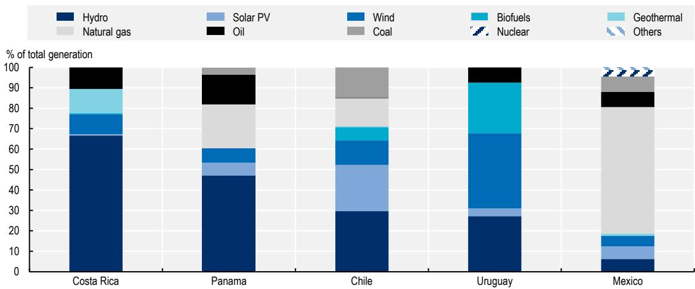  
Note: Latest data for Chile, Costa Rica and Mexico are from 2024. Latest data for Panama and Uruguay are from 2023. Accessed in September 2025.  
Source: OECD calculations based on IEA (n.d. $^{[48]}$ ), Country and regions (database), https://www.iea.org/countries.

## Broadband connectivity

Stable broadband connectivity is important for the development of firms in the semiconductor industry, in the high-tech sector and in the rest of the economy. As with electricity (see above), some of Panama's SEZs support their firms by providing stable and fast internet connectivity. For example, Panamá Pacífico SEZ offers firms high-speed fibre optic internet due to its proximity to a digital interconnection of at least six submarine cables (IMF, 2020[49]; LatAm FDI, 2025[42]). Firms in Panamá Pacífico can choose from one of nine telecommunications carriers that have established nodes within the SEZ and are connected to each building via pre-installed fibres (Panamá Pacífico, 2015[50]). Similarly, the City of Knowledge highlights that organisations located within the SEZ can access high-speed internet connections and a variety of information technology (IT) and telecommunications services (AmCham Panama, 2024[43]).

Beyond firms' internet connectivity, Panama is developing several flagship initiatives to enhance its digital infrastructure. For example, Panama Digital Gateway plans to facilitate the convergence of current and future submarine cables and establish a data centre (TI Sparkle, 2023[51]). In 2023, Panama Digital Gateway reached an agreement for the installation of an internet exchange point (IXP) in the data centre to manage intellectual property (IP) traffic exchange nodes in Panama (Gruppo Tim, 2023[52]). This could enhance local firms' connectivity and lead to faster internet traffic.

Panama also hosts the CopernicusLAC Panama Centre, under the auspices of the European Union-Latin America and Caribbean Digital Alliance. The CopernicusLAC Panama Centre serves as a regional hub for spatial data management and strategic use, and it is anticipated that a Copernicus Data Centre will eventually be established in Panama. The project brings together the European Commission and the European Space Agency with the National Secretariat of Science, Technology and Innovation (SENACYT), Panama's Ministry of Foreign Affairs and the National Authority for Government Innovation (AIG) (EU Global Gateway, 2024[53]).

Despite Panama's investment in its digital infrastructure, internet access for Panama's population is relatively weaker. As shown in Figure 2.31, Panama is in line with the general expansion of fixed broadband subscriptions in Latin America. However, as of 2023, Panama lagged behind other countries such as Costa Rica, Mexico and Uruguay, despite having had similar levels of fixed broadband subscriptions as these countries in 2004.

Figure 2.31. Fixed broadband subscriptions in selected economies, 2004-2023  
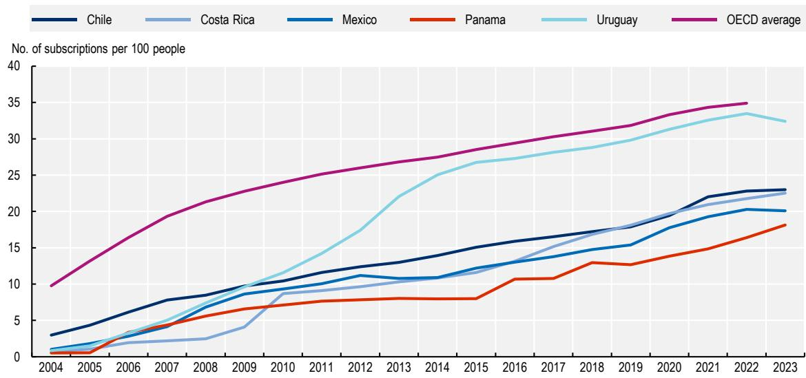  
Note: The graph shows fixed subscriptions (from both individuals and organisations) at downstream speeds equal to, or greater than, 256 kilobits per second (kbit/s), including cable modem, digital subscriber line (DSL), fibre-to-the-home/building, other fixed (wired) broadband subscriptions, satellite broadband and terrestrial fixed wireless broadband. The latest data for the OECD average are from 2022.
Source: OECD calculation based on World Bank (n.d.[54]), Fixed broadband subscriptions (per 100 people) (indicator), https://data.worldbank.org/indicator/IT.NET.BBND.P2 (accessed on 15 September 2025).

According to data from the 2022 household survey, only four provinces reported more than $80\%$ of households with access to internet. In the case of Emberá and Ngäbe-Buglé, this figure remains below $40\%$ (Figure 2.32). These results highlight the ongoing need to enhance connectivity and extend coverage nationwide. Although improving household connectivity may not have a direct impact on Panama's ability to attract semiconductor firms and grow its ecosystem for semiconductors, it is an important step in the country's economic development.

Figure 2.32. Share of households with internet access, by provinces, March 2022  
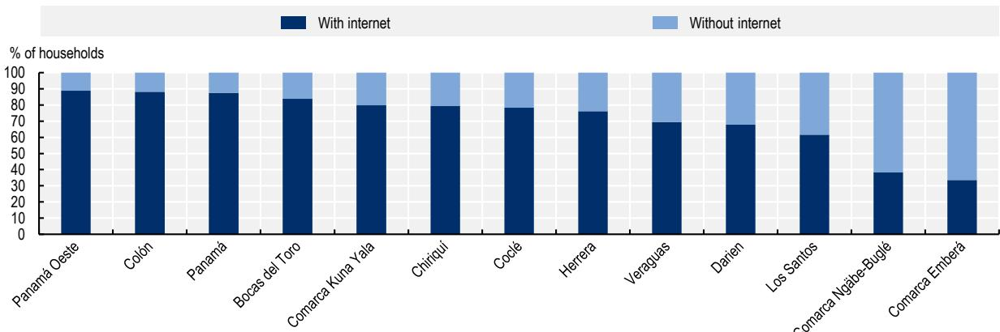  
Note: The share is calculated by summing households that reply “no” to both Questions 5a and 5b of the Multiple Purposes Survey (Encuesta de Propósitos Múltiples) of April 2022, corresponding to “Does this household have internet access via mobile network?” and “Does this household have internet access via fixed network?”, and dividing by the total number of households.  
Source: OECD calculations based on Encuesta de Propósitos Múltiples from INEC (n.d.[11]), “Publicaciones”, https://www.inec.gob.pa/publicaciones/.

## 2.2.2. Transport infrastructure

Logistics is one of Panama's strengths and major competitive advantages. According to the Logistics Performance Index (LPI), Panama excels particularly in the “Infrastructure” and “International shipments” dimensions, with the “Tracking and tracing” dimension a potential area for improvement (Figure 2.33). Panama already leverages its logistics and transport infrastructure to support the regional semiconductor ATP. Enhanced co-operation between Panama and Costa Rica could help enhance transportation and customs capacities in the two countries and support the region’s development into a resilient hub in the global semiconductor value chain.

Figure 2.33. Logistics score in selected economies, 2023  
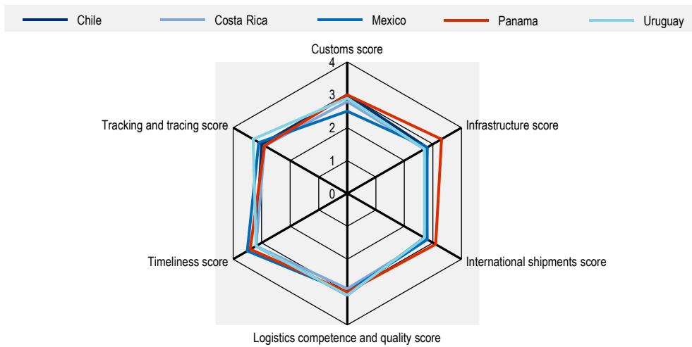  
Note: The LPI is based on logistics professionals' replies to a survey that takes into account six different dimensions – “Customs”, “Infrastructure”, “International shipments”, “Logistics competence and quality”, “Timeliness”, “Tracking and tracing” – of a country’s overall logistics performance. The score within each category goes from 1 (very low quality) to 5 (very high quality).  
Source: OECD calculation based on World Bank (2024[55]), “Logistics Performance Index (LPI)”, https://lpi.worldbank.org/international/scorecard/radar/C/PAN/2023.

Between 2008 and 2013, public investment in transport infrastructure in Panama remained very high. During these years, the country saw significant developments in various infrastructure projects, which supported its economic expansion. These developments included the expansion of the Panama Canal and Tocumen International Airport. However, investment in transport infrastructure declined after the peak in 2013, when it represented $5.3\%$ of GDP, to $1.2\%$ of GDP by 2020. Transport infrastructure investment has since increased to $2.7\%$ of GDP in 2023, higher than in comparator economies in the region (Figure 2.34). Panama's investment in transport infrastructure is expected to increase further with the 475-kilometre (km) railway line between Panamá Pacífico and David on the border with Costa Rica, set to begin construction in 2026 (Presidencia de la República, 2025[56]).

Figure 2.34. Public investment in transport infrastructure, 2008-2023  
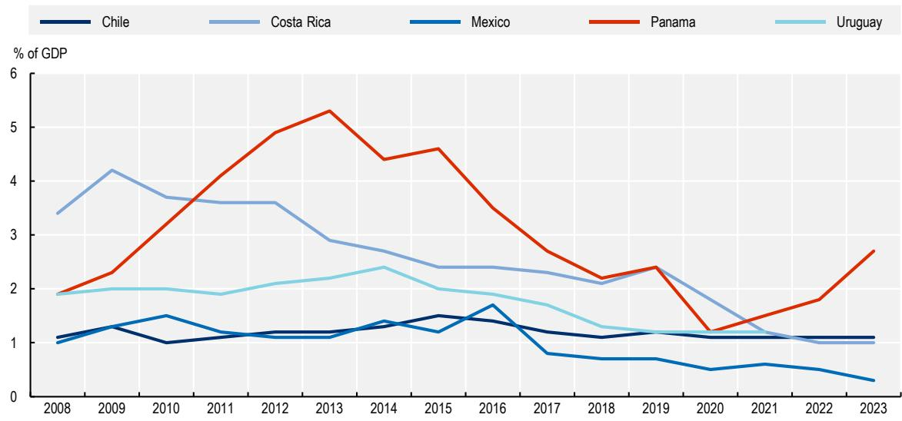  
Note: The investment in infrastructure includes roads, urban transport, rail transport, air transport and maritime transport. Most recent data for Uruguay are from 2021.  
Source: OECD calculations based on Infralatam (n.d. $^{[57]}$ ), Data on public investment in economic infrastructure in Latin America and the Caribbean (database), https://www.infralatam.info/ (accessed on 15 September 2025).

## Maritime transport

Figure 2.35 shows that Panama has a high volume of container port traffic, surpassing larger countries such as Chile or Mexico. This result, which does not take into account containers that are crossing the Panama Canal and are not offloaded, underscores Panama's crucial role in international trade, highlighting its strategic position and its importance in connecting various markets around the world.

Figure 2.36 shows that the export volume at Panama's main ports remained broadly stable from the first quarter of 2019 to the first quarter of 2023. Since then, it has followed an upward trend, reaching about 45 million metric tonnes in the second quarter of 2024 (preliminary data). In the first quarter of 2024, Balboa (located on the Pacific coast) was the port with the highest export volume, accounting for $32\%$ of the total. It was followed by three ports located on Panama's Atlantic coast: Manzanillo with $28\%$ of total exports, Colón with $24\%$ and Cristóbal with $13\%$ .

The Container Port Performance Index (CPPI) ranks 405 global container ports by efficiency, defined as the duration of port stay for container vessels. Although time is not the only metric for assessing port efficiency, it serves as a valuable quantitative indicator to analyse the efficiency of port operations. According to the CPPI, the port of Colón is the highest-ranking Panamanian port for efficiency, ranked 102nd worldwide (World Bank, 2024[58]). However, several ports in the region obtain a better performance such as Lázaro Cárdenas in Mexico (ranked 50th worldwide) or Puerto Limón in Costa Rica (ranked 79th worldwide). In Panama, the ports of Cristóbal and Balboa rank in the 236th and 314th positions respectively.

Figure 2.35. Container traffic, 2000-2022  
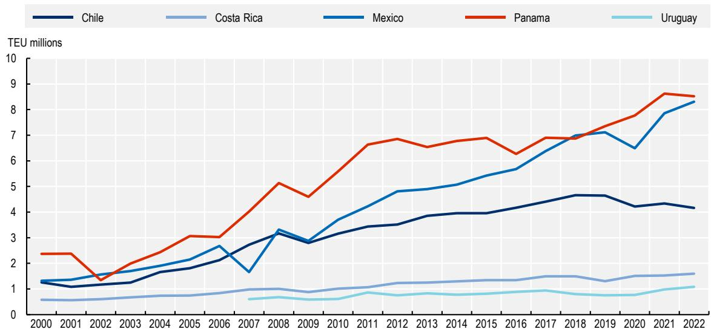  
Note: Port container traffic measures the flow of containers from land to sea transport modes, and vice versa, in 20-foot equivalent units (TEUs), a standard-size container benchmark used for measuring cargo capacity. Data refer to coastal shipping as well as international journeys. Transshipment traffic is counted as two lifts at the intermediate port (once to offload and again as an outbound lift) and includes empty units. Source: OECD calculations based on World Bank (n.d.,[59]), Container port traffic (TEU: 20 foot equivalent units) (indicator), https://data.worldbank.org/indicator/IS.SHP.GOOD.TU (accessed on 15 September 2025).

Figure 2.36. Export volume in the main ports of Panama, 2019 Q1 - 2024 Q2  
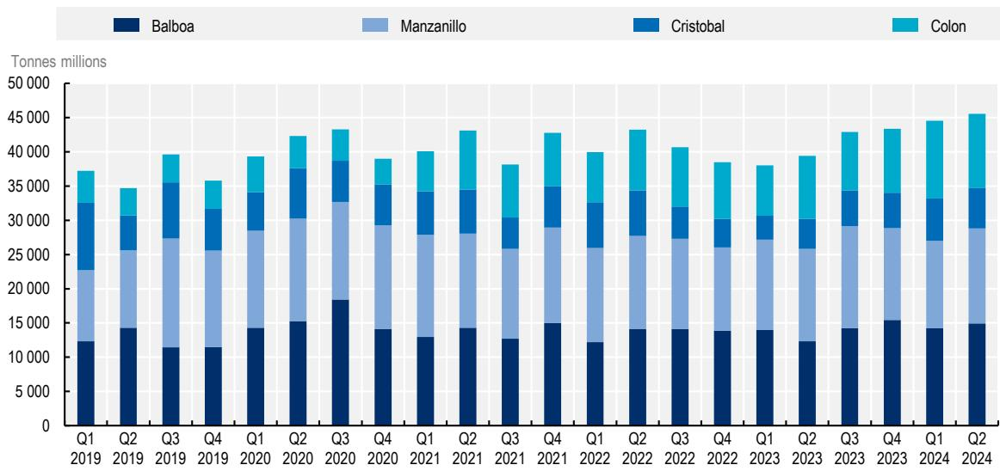  
Note: The figure shows the quarterly average of the daily transit.  
Source: OECD calculations from IMF (n.d. $^{[60]}$ ), IMF PortWatch, https://portwatch.imf.org/ (accessed 12 October 2025). The latest observations correspond to 31 May 2024, so the data for 2024 Q2 are still partial and preliminary.

The Panama Canal was inaugurated in 1914 and since then more than one million cargo ships from all over the world have transited through the canal. The Panama Canal expansion project started in 2007 with the objective of doubling the waterway's capacity. $^{11}$ The Panama Canal is a crucial point for maritime trade: each month around 1 000 ships pass through the Panama Canal, amounting to about $5\%$ of global maritime trade (Arslanalp et al., 2023[61]).

However, in October 2023, the country experienced its worst drought in the canal's history. Significant restrictions on ship transits were imposed amid insufficient rainfall at Gatun Lake, which supplies water to the canal. As shown in Figure 2.37, daily transit trade reached the lowest levels by January 2024 and have, since then, begun to recover.

By December 2023, the number of ships transiting through the canal was limited to 22 per day. However, the Panama Canal Authority (ACP) has implemented water-saving measures and has gradually lifted these restrictions in response to new weather forecasts. In June 2024, the ACP announced that by 22 July 2024, the number of ships would increase to 34 per day. By the final quarter of 2024, the ACP had allowed 36 ships per day to transit, as the canal returned to normal levels of activity. $^{12}$

Figure 2.37. Daily transit trade volume in the Panama Canal, January 2022-October 2025  
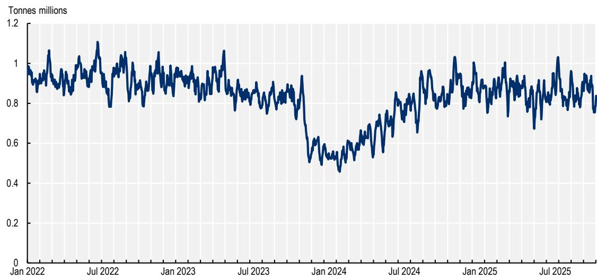  
Note: The figure shows a seven-day moving average from the daily transit, measured in million metric tonnes of cargo. For more information on how trade flows are calculated, see https://portwatch.imf.org/pages/data-and-methodology.
Source: IMF PortWatch, IMF (n.d.[60]), IMF PortWatch, https://portwatch.imf.org/ (accessed 12 October 2025).

## Road transport

Road quality is a crucial factor to consider when developing the semiconductor ecosystem. High-quality roads ensure the safe and efficient transport of inputs essential for semiconductor production as well as outputs, reducing the risk of quality losses. This is especially important for delicate inputs like specialised manufacturing equipment and for finished products, which can be damaged if transported on roads in poor conditions.

Figure 2.38 suggests that Panama is well positioned in terms of road quality amongst select Latin American economies, ranking just behind Chile, on par with Mexico and ahead of Costa Rica and Uruguay, according to data from the World Economic Forum (WEF) Global Competitiveness Index.

Through the Pan-American Highway, Panama is well connected with Costa Rica. This highway is part of a broader network that extends from the southern tip of South America to the northern reaches of North America, making it a crucial conduit for regional trade and travel. However, the highway is interrupted in the Panamanian province of Darién, at the border with Colombia, where natural conditions complicate the development of infrastructure.

Figure 2.38. Road infrastructure quality in selected countries, 2019  
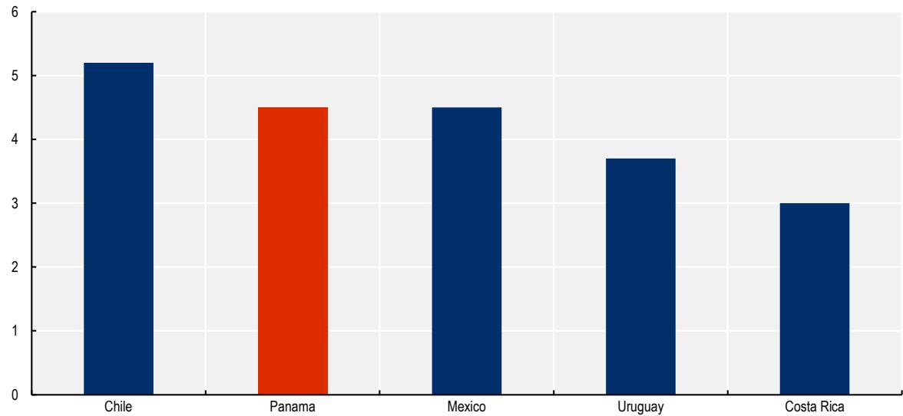  
Note: The graph shows the quality of roads based on answers to the WEF Executive Opinion Survey. The scale ranges from 1 (“underdeveloped”) to 7 (“extensive and efficient by international standards”).  
Source: OECD calculation based on WEF (2019[62]), Roads quality - Country rankings (dataset), https://www.theglobaleconomy.com/rankings/roads\_quality/ (accessed on 15 February 2025).

Panama also has other important roads that connect the main cities. For example, Colón Highway connects Panama City with Colón, providing an alternative to the Panama Canal in linking the Pacific and Atlantic coasts. $^{13}$ Additionally, the public infrastructure section of the Strategic Government Plan (2019-2024) (Plan Estratégico de Gobierno 2019-2024 de Panamá) included a series of recovery and rehabilitation projects for 2 000 km of priority roads in the national road network. Among these projects is the improvement of the western Pan-American Road (Carretera Panamericana Oeste), which connects the province of Panamá Oeste with the province of Veraguas. $^{14}$ Nonetheless, road quality is poorer in the provinces populated by Indigenous communities and the connections with the rest of the country can be improved.

## Air transport

According to data from the WEF Global Competitiveness Index, Panama has very high air transport quality and holds the eighth position globally (Figure 2.39). From 2006 to 2019, Panama expanded Tocumen International Airport in three main phases. The first phase, conducted in 2006, focused on renovating and expanding the existing facilities. The second phase, from 2009 to 2012, involved the construction of the northern terminal. In the third phase, between 2012 and 2019, a new terminal was built (IMF, 2023[3]). Tocumen is also the base for Copa Airlines, which has become one of the leading aviation firms in the region (EI Economista, 2024[63]), helping transform the airport into one of the main regional hubs.

In addition to Tocumen International Airport, the smaller scale Balboa Panamá Pacífico International Airport, was developed in the context of the Panamá Pacífico SEZ (see Section 3.2.3), after the United States handed over Howard Air Force Base to Panama in 1999. The airport has a cargo terminal as well as a passenger terminal with domestic and regional flights. Balboa Panamá Pacífico International Airport benefits from a strategic location, as it is situated within the SEZ, near to Panama Pacífico's industrial areas and with close connections to the Panama Canal. This creates a multi-modal hub for air and maritime transport.

Figure 2.39. Air transport infrastructure quality in selected countries, 2019  
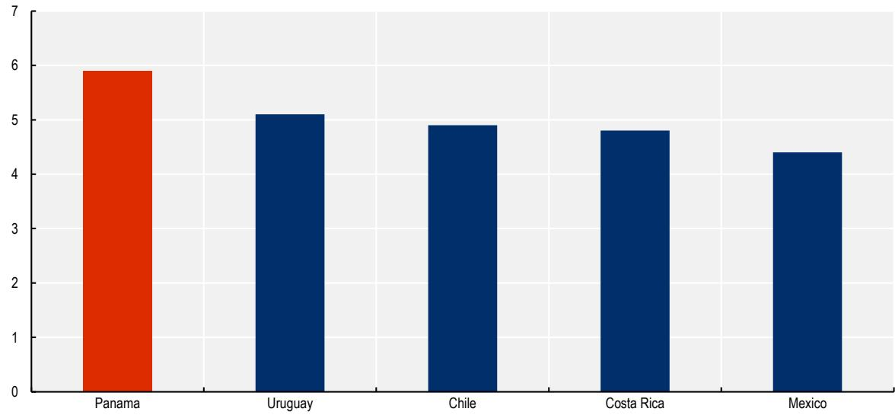  
Note: The graph shows the quality of air transport based on answers to the WEF Executive Opinion Survey. The scale ranges from 1 (“underdeveloped”) to 7 (“extensive and efficient by international standards”).  
Source: OECD calculation based on WEF (2019[64]), Air transport infrastructure quality - Country rankings (dataset), https://www.theglobaleconomy.com/rankings/air\_transport\_infrastructure/ (accessed on 15 February 2024).

## 2.3. Skills

Semiconductor industry stakeholders across the world cite lack of talent as a critical barrier in the development of semiconductor ecosystems. Developing the required skills is crucial for countries aiming to expand their role within the semiconductor GVC. A recent study on semiconductor workforce development (Younkin, 2024[65]) highlights several core components, namely fostering the growth of required talent, refining curricula, aligning knowledge, skills and abilities with critical job functions, ensuring access to state-of-the-art educational and training facilities, facilitating experiential learning and providing recruitment support. Addressing these challenges will help narrow the gap between skills demand and supply to ensure a successful semiconductor ecosystem development in individual economies and globally.

Quality education is critical to generate a sufficiently large and diverse talent pool for a semiconductor ecosystem, particularly in technical fields. However, government expenditure on education in Panama remains significantly below the OECD average and other Latin American countries. Additionally, the pupil-to-teacher ratio, a key indicator for education quality, has decreased significantly for secondary education although it has increased recently for primary and tertiary education.

The technical expertise needed for the semiconductor ecosystem builds on the education given at early ages, especially in science, technology, engineering and mathematics (STEM) fields. The efficacy of education systems in preparing students can be evaluated, for instance, through the OECD Programme for International Student Assessment (PISA), which assesses the knowledge and skills of 15-year-old students in mathematics, science and reading and serves as a benchmark for international comparison. $^{15}$ PISA scores for both mathematics and science increased in Panama from 2018 to 2022, in contrast to the OECD trend. Nevertheless, Panama should continue its efforts to catch up with other economies.

Despite low enrolment rates for upper secondary education in 2017 compared to other countries with similar GDP levels, Panama is well positioned in upper secondary education attainment compared to other Latin American countries. Of the upper secondary education students who opt for the academic track, a large share specialises in sciences. The percentage of upper secondary education students taking the vocational path with a specialisation in electronics, which is particularly relevant for the semiconductor sector, is very low.

Additionally, the share of university students in Panama graduating from STEM-related subjects is lower than in other Latin American countries.

Semiconductor manufacturing, and in particular ATP, requires considerable technical skills, such as molding, dicing, wave soldering, swaging, and lamination and technical occupations, which are also in high demand by other sectors, particularly in countries where manufacturing accounts for a large share of value added. The share of workers with these occupations in Panama is particularly low. Enhancing the provision and quality of vocational training (and retraining) with a focus on these skills and occupations, would help alleviate pressures in what would otherwise be a tight labour market for technical skills.

Empirical analysis reveals that wages are positively associated with university education and employment in STEM-related occupations. Additionally, residence in the province of Panama, having a permanent contract and being male are also positively associated with wages. Implementing policies that promote STEM careers, enhance access to university education, ensure job formality and security, and address regional and demographic disparities could attract students to the relevant fields and lead to wage growth and reduced inequality.

## 2.3.1. Supply of semiconductor skills in Panama

During the last decade, government expenditure on education in Panama fell short of other Latin American countries (Figure 2.40). The share of population under 15 years of age is slightly higher in Panama than in the same group of countries (UN, 2024[66]), meaning a larger proportion of young people relies on education spending. The gap to other economies underscores ongoing challenges in allocating sufficient resources to education, likely impacting the quality and accessibility of educational services in the country. Efforts to increase investment in education could play a crucial role in fostering long-term economic growth and development, ensuring that Panama's education system meets the needs of the semiconductor and high-tech ecosystems.

The number of teachers per pupil is a key indicator of education quality. The quantity and distribution of teachers are critical in shaping the learning environment and impacting educational outcomes across all levels, from primary to tertiary education. Furthermore, to maintain high educational standards, it is essential for teachers to receive proper training and access to professional development opportunities (for more details, see Section 3.3).

Figure 2.41 shows that, in Panama, the pupil-to-teacher ratio is lowest in secondary education and has decreased significantly since 2016. However, in primary and tertiary education, the growth in the number of teachers has not matched the increase in the student population, leading to a higher pupil-to-teacher ratio. This trend is more pronounced in university education, where the growth has been higher, from 12 students per teacher in 2018 to 15.8 in 2022.

Note: The pupil to teacher ratio is calculated as the number of enrolled students per teacher at each level of education. In this graph, tertiary education includes university education only; it does not include tertiary-level vocational education.
Source: OECD calculations based on INEC (n.d.[11]), “Publicaciones”, https://www.inec.gob.pa/publicaciones/ (accessed on 15 May 2024).

Smaller class sizes can enhance individualised instruction and boost student engagement. Nonetheless, the pupil-to-ratio in Panama is higher for primary education (Figure 2.41), limiting opportunities for more individualised instruction. The impact of individualised education on student achievement is particularly high in first and second grades (French Government, 2017[67]), where larger class sizes are likely to constrain the level of attention each student receives.

Figure 2.40. Government expenditure on education, 2014-2022  
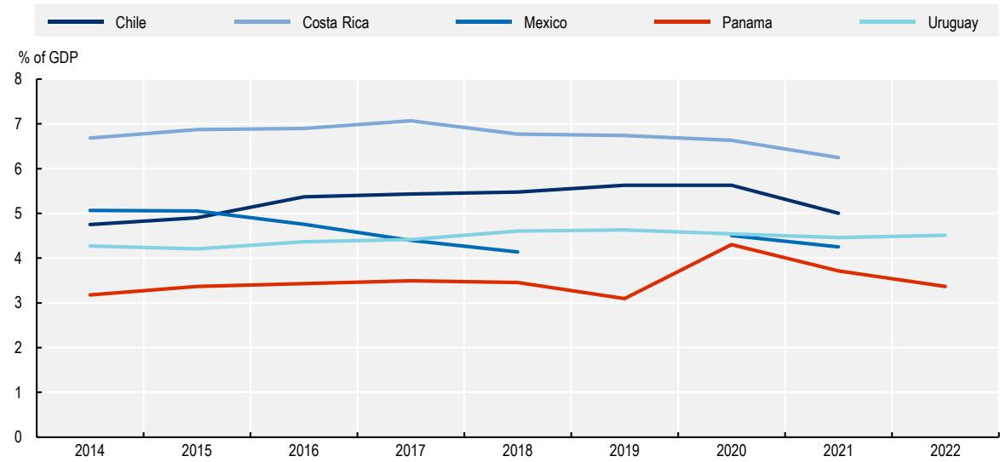  
Note: The data refer to government expenditure without specifying the level of education. Government expenditure on education includes expenditure funded by transfers from international sources to government. Government usually refers to local, regional and central governments. 2014 was selected as the starting year since it is the first year with complete information for all of the countries in the sample. Data for 2019 and 2022 for Mexico are missing. For Chile, data for 2022 are missing. For Costa Rica, data for 2022 are missing.
Source: World Bank based on UIS (2025[68]), Government expenditure on education, total (% of GDP) (dataset), https://data.worldbank.org/indicator/SE.XPD.TOTL.GD.ZS (accessed 15 September 2025).

Figure 2.41. Pupil to teacher ratio by levels of education  
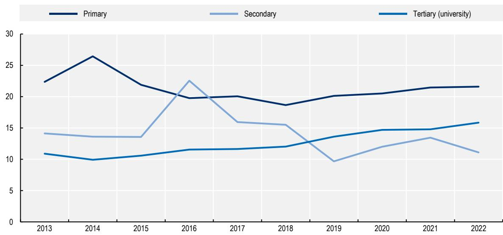

## Secondary education and vocational training

Technical aptitude (i.e. understanding and applying technical concepts), is particularly relevant to engineering and technician profiles required for the semiconductor industry. The efficacy of education systems in preparing students for these kinds of tertiary education tracks can be evaluated, for instance, through PISA. PISA scores for both mathematics and science increased in Panama from 2018 to 2022, although Panama is still behind other Latin American economies such as Chile, Costa Rica, Mexico and Uruguay. The gap is particularly pronounced in mathematics scores (Figure 2.42): only 16% of Panamanian students achieved Level 2 proficiency, compared with the OECD average of 69%. $^{16}$ In science, 38% of Panamanian students achieved Level 2 proficiency, compared with the OECD average of 76% (OECD, 2023 $^{[69]}$ ).

The latest PISA assessment also placed Panama below the OECD average in reading. It is important to highlight that Panama is one of the countries in the PISA programme with the highest share of students belonging to a disadvantaged socio-economic background, measured by the lowest quintile across all students in the PISA programme (OECD, 2023[69]).

These results are in line with the challenges pointed out by stakeholders consulted in the context of this report. Stakeholders agreed on the need to enhance public education, particularly focusing on STEM and English language skills. Panama recorded a low index score ranking 71st out of 113 countries in the most recent EF English Proficiency Index assessment. $^{17}$ Compared to other Latin American countries like Costa Rica and Uruguay, Panama's results underscore the need for increased efforts in English language education. There is nevertheless considerable heterogeneity across different Panamanian provinces, with cities like Colón, David and Panama City and the best-performing cities in the country. $^{18}$

Figure 2.42. PISA results in selected countries, 2018 and 2022  
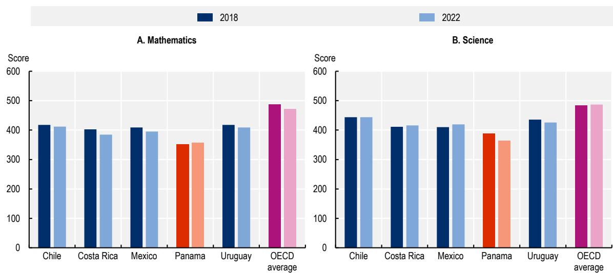  
Note: The results are scaled to fit approximately normal distributions, with means around 500 score points and standard deviations around 100 score points. The country scores are averages of all of the national 15-year-old students taking the test.  
Source: OECD calculations based on OECD (2023[70]), PISA 2022 Database, https://www.oecd.org/pisa/data/2022database/ (accessed on 16 April 2024).

According to these stakeholders, one of Panama's priorities should be enhancing education at the secondary level. In 2017, enrolment rates for upper secondary education remained below other countries with similar GDP levels (Figure 2.43). However, Panama's upper secondary education attainment seems to be higher than in other Latin American countries. By 2023, $51\%$ of the population aged 25 or more had obtained upper secondary education, below Chile (68%) but above Mexico (41%), Costa Rica (40%) and Uruguay (34%) (Figure 2.44).

Figure 2.43. Enrolment rates at upper secondary education against GDP per capita, 2017  
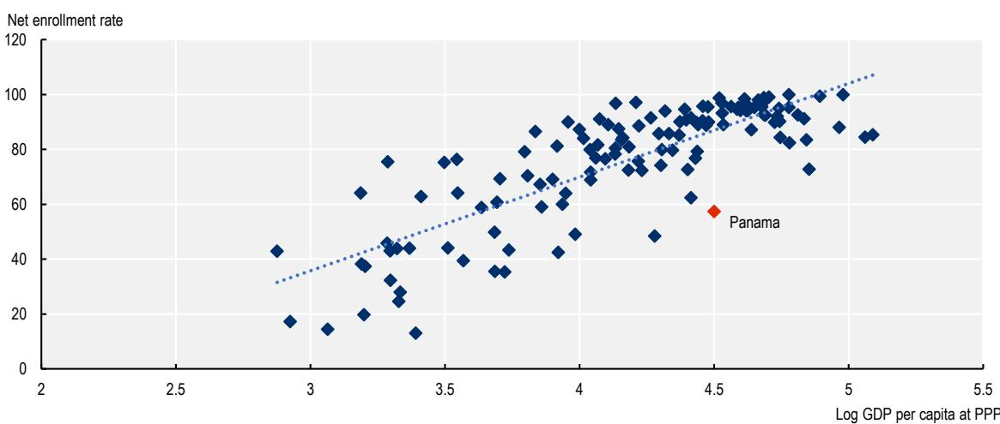  
Note: The sample includes 127 economies with available data on GDP per capita adjusted by purchasing power parity and net enrolment rates for 2017, the most recent year for which data from Panama are available.  
Source: OECD calculations based on UIS (2025[71]), "Homepage", https://data.uis.unesco.org/ (accessed on 15 October 2025).

Figure 2.44. Educational attainment for upper secondary level, 2017 and 2023  
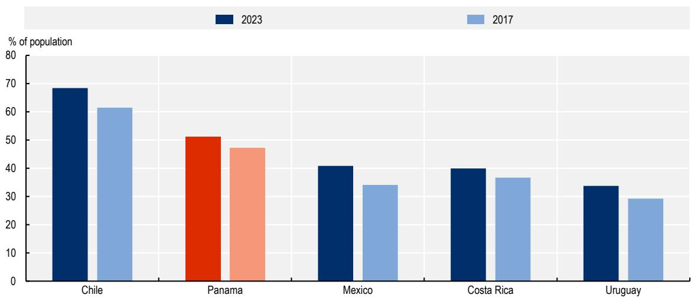  
Note: The chart shows the percentage of the population aged 25 and over that attained or completed upper secondary education. This indicator only measures educational attainment in terms of level of education attained, i.e. years of schooling, and does not necessarily reveal the quality of the education (learning achievement and other impacts).  
Source: World Bank based on UIS (2025[72]), Educational attainment, at least completed upper secondary, population $25+$ , total $(\%)$ (cumulative) (indicator), https://data.worldbank.org/indicator/SE.SEC.CUAT.UP.ZS (accessed on 15 September 2025).

In 2020, Panama saw 38 500 students graduate from upper secondary education. From these, 22 500 (59%) had followed the academic path while 15 900 (41%) followed the professional and technical path. About 33% of the students following the academic path studied in private institutions, compared to only 9% of technical and professional students. The majority (57%) of academic education students were women, while technical and professional students were mostly men (53%) (Figure 2.45).

By province, Colón had the highest percentage of upper secondary graduates following the professional and technical path, with 58%. This was followed by Darién with 54% and Emberá-Wounaan with 52%. Chiriquí and Herrera were the provinces with the highest share of academic graduates, with 67% each.

Figure 2.45. Upper-secondary graduates by modality of education, institution type and sex, 2020  
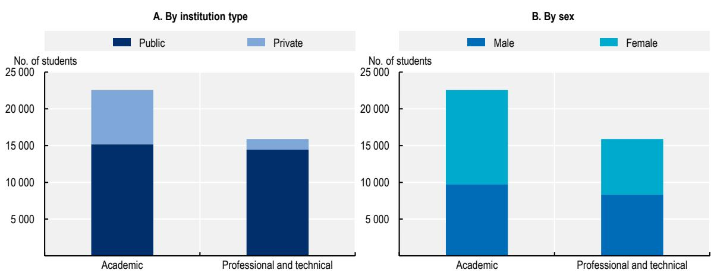  
Source: OECD calculations based on data from MEDUCA (2020[73]), MEDUCA - Estadísticas Educativas 2020 (database), https://www.datosa-biertos.gob.pa/dataset/meduca-estadisticas-educativas-2020 (accessed on 15 June 2024).

Within the academic track, sciences dominated, accounting for about 88% of all graduates from upper secondary education (Figure 2.46). In the professional and technical track, a large share of graduates (32%) specialised in commerce, with young women representing 67% of this group. Tourism (15%) and technology and informatics (13%) were the next most common fields. By contrast, only 294 students graduated in electronics in 2020, which is particularly important for the semiconductor sector, corresponding to just 1.9% of all technical students. This field of study was pursued almost exclusively by men, who accounted for 90% of graduates in electronics. These statistics suggest a considerable potential to develop the pool of talent for semiconductors by incentivising students, notably women, to enrol in and graduate from relevant fields such as electronics.

Figure 2.46. Main fields of study for upper secondary students, 2020  
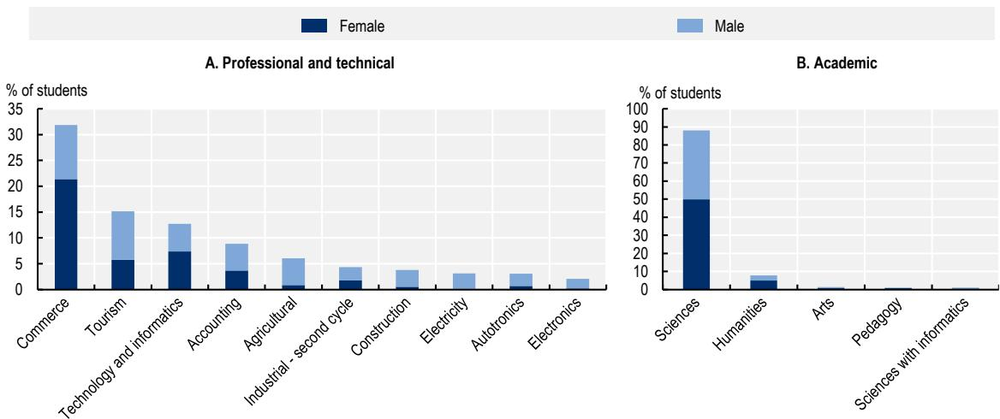  
Source: OECD calculations based on data from MEDUCA (2020[73]), MEDUCA - Estadísticas Educativas 2020 (database), https://www.datosabiertos.gob.pa/dataset/meduca-estadisticas-educativas-2020 (accessed on 15 June 2024).

For more details on the different vocational educational programmes at the tertiary level, please refer to Section 3.3.3 on vocational education and training.

## Tertiary education

While secondary education lays a crucial foundation, tertiary education is key to prepare future engineering and STEM-related professionals, as was also emphasised by industry stakeholders consulted in the context of this report. According to the August 2023 labour market survey, 51% of the workers in the high-tech sector had a university degree, compared to only 20% of workers in the non-high-tech sector.

Figure 2.47. Percentage of graduates from STEM tertiary education programmes  
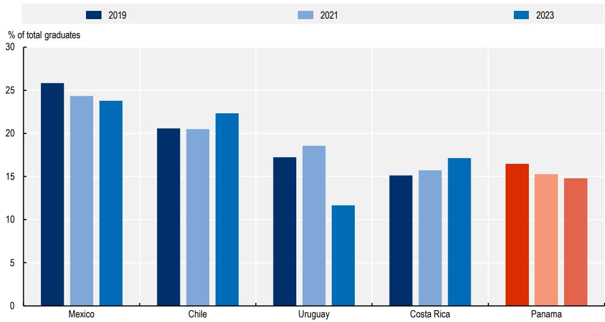  
Source: OECD based on UIS (2025[74]), UIS Data Browser - September 2025 Update (database), https://data.uis.unesco.org/en (accessed on 15 September 2025).

Panama is undertaking significant efforts to improve and expand STEM education at the tertiary level to adapt to semiconductor sector needs. However, recent data and comparisons with other Latin American economies show that important efforts are still required. The percentage of tertiary education graduates in STEM fields in Panama decreased from 16.5% in 2019 to 14.8% in 2023. This figure is still approximately 9 percentage points (p.p.) lower than in Mexico, 8 p.p. lower than in Chile and 3 p.p. lower than Costa Rica (see Figure 2.47).

For more information on the different university programmes currently available in Panama and the number of graduates, see Section 3.3.2.

## 2.3.2. Demand for semiconductor skills, based on data from other countries

This section provides information on the demand for semiconductor skills. Given that the semiconductor industry is not currently operating in Panama, the analyses are based on data from other countries, namely Indonesia, Mexico and Viet Nam (Box 2.3).

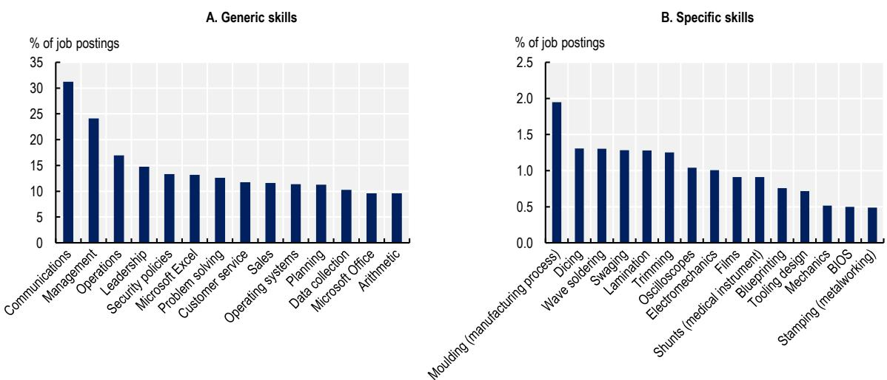  
Figure 2.48. Most sought-after skills in the semiconductor sector

## Box 2.3. Analysing the demand for skills in the semiconductor sector using Lightcast data

Analysing online job postings from Lightcast provides an indication of the skills and qualifications most frequently sought by employers in the semiconductor sector. This approach provides valuable insights into the evolving demand of the labour market and identifies core competencies needed by firms in the semiconductor sector (North American Industry Classification System [NAICS] code 3344), which may not always be known by policymakers. The job postings analysed in this report are from Indonesia, Mexico and Viet Nam. Out of the 28 999 total semiconductor-related job postings, 26 491 were from Mexico, 1 384 from Viet Nam and 1 124 from Indonesia. The study period is 2020-2022.

The findings come with a few important caveats. One limitation of this analysis is the limited sample of countries. Nonetheless, this allows for a focused study of the semiconductor industry, particularly ATP, which is the main segment present in these countries. Nonetheless, the sample is focused on studying the semiconductor sector since these countries are focused on ATP. In addition, the coverage of online job postings might be affected by several biases, including a bias towards more skilled jobs and the inclusion of jobs only available online. Furthermore, these job postings represent flows rather than stocks. As a result, jobs with high turnover might be overrepresented in the data. Job postings are comprised of traits the employer would like the ideal candidate to possess but may not necessarily be required to be successful in the role.

## Most common skills in the semiconductor and other electronics sector

The semiconductor sector requires a blend of generic and specific skills. Generic competencies, such as communication, management and operations skills are the most in demand (Figure 2.48, Panel A). Complementing these generic skills are specific technical proficiencies like manufacturing processes (such as molding, dicing and swaging) (Figure 2.48, Panel B). These specific skills form the technical toolkit necessary to work in the semiconductor sector. The complete list of generic skills is listed in Annex C and the specific skills are listed in Annex D.

Note: Panel A shows generic and Panel B specific skills, where the y-axis corresponds to the number of online job postings by skill in the semiconductor sector (NAICS code 3344). The complete list of generic skills is listed in Annex B and the specific skills are listed in Annex C. Source: OECD calculations based on Lightcast (2023[75]), "Lightcast Data", https://lightcast.io/products/data/overview.

Specific skills are generally in high demand in manufacturing but are even more prominently required within the semiconductor sector. Figure 2.49 compares the most sought-after skills in the semiconductor and other electronics sector to those in other manufacturing activities. This comparison highlights that communication skills are found in 31% of job postings within the semiconductor sector, compared to 25% in other manufacturing sectors. Additionally, security policies emerge as the most relatively demanded skill, with a 13-p.p. higher prevalence in job postings within the semiconductor sector. This is followed by operating systems (10 p.p.), data collection (10), arithmetic (10), and memos (9).

Figure 2.49. Comparison with most sought-after skills in semiconductors and other manufacturing sectors  
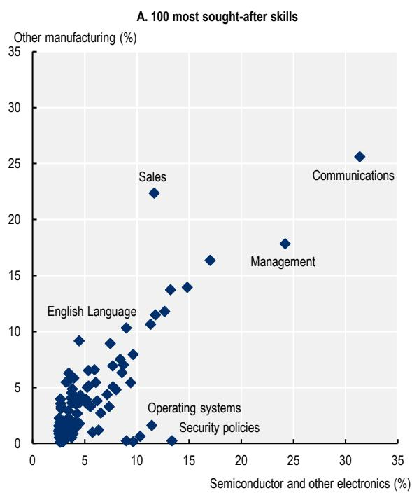

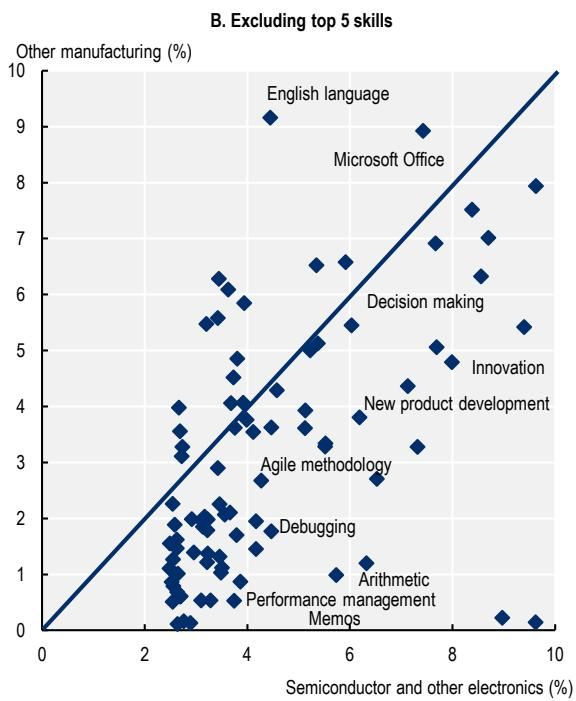  
Note: Panel A shows the frequency share of the 100 most sought-after skills in the semiconductor and other electronics sector (x-axis) and all the other manufacturing sectors (y-axis). Panel B omits the top five skills.  
Source: OECD calculations based on Lightcast (2023[75]), "Lightcast Data", https://lightcast.io/products/data/overview.

In addition, certain skills needs are common across sectors. By computing the distances between sectors based on the most common 1 000 skills associated with the semiconductor sector, it is possible to evaluate similarities in skills demand between the semiconductor sector and other economic sectors. $^{19}$ Consequently, sectors with which the semiconductor sector competes for talent can be identified. Policy initiatives aimed at fostering human capital development that help enhance such skills, can therefore earn double dividends.

Figure 2.50 shows that motor vehicle parts manufacturing is by far the closest to the semiconductor sector in terms of skill demand. This sector involves the production of components vital for automotive assembly, which tend to require precision engineering and adherence to stringent safety regulations.

Other similar sectors, albeit to a lesser extent, include the manufacturing of beverages and pharmaceuticals, which require competencies related to ingredient sourcing, production processes and packaging, along with cutting-edge R&D. Manufacturing of medical equipment and supplies, as well as the manufacturing of navigational, measuring and electromedical equipment also share similarities with semiconductors and require proficiency in software, precision machinery and electronics assembly.

Figure 2.50. Manufacturing sectors closest to semiconductors in terms of skills demand  
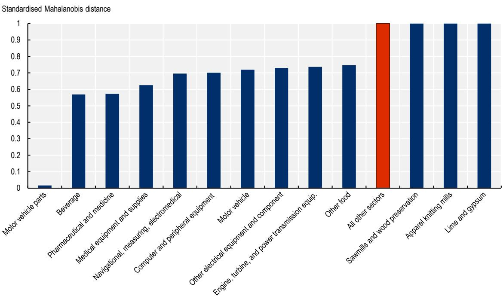  
Note: The Mahalanobis distance serves as a metric for evaluating the similarity between economic sectors. It provides a distance between industries in the skills space, weighting the different skills by the number of job postings in which they appear. The last three sectors of the graph correspond to the furthest to semiconductors. Distances were standardised, with a maximum distance of 1 (between semiconductors and lime and gypsum sectors) and the remaining distances ranging between 0 and 1 relative to the furthest distance.
Source: OECD calculations based on Lightcast (2023[75]), “Lightcast Data”, https://lightcast.io/products/data/overview.

## 2.3.3. Panama's labour market developments

The latest labour market survey, conducted in August 2023, pointed to around 18 000 workers in the high-tech sector. This represents a small share of the overall workforce, with less than 1% of workers. Women constituted 32% of high-tech-sector workers in contrast to 41% in non-high-tech sector. This highlights the potential for women to further contribute to high-tech industries, given their current under-representation and the ongoing growth in these sectors.

As outlined in Section 2.3.2 on skills demand, the semiconductor sector requires technical expertise and skills. This sector particularly needs technical occupations related to STEM professionals, mid-level professionals in science and engineering, as well as machine operators and assemblers. $^{20}$ As of August 2023, there were 56 500 workers in these roles in Panama, accounting for approximately 2.9% of the total workforce. The presence of assemblers, which is important in semiconductor ATP, was particularly constrained with only 208 workers in Panama as of August 2023 (Figure 2.51).

The limited presence of assemblers is attributed to the insufficient development of the semiconductor industry, and vice versa. This impedes both the expansion of the semiconductor industry and the development of an adequate skilled workforce. To address this issue, it is essential to implement strategic measures that attract industry investment while simultaneously developing a trained workforce through targeted educational and infrastructural initiatives.

Figure 2.51. Number of workers by semiconductor-related occupations, August 2023  
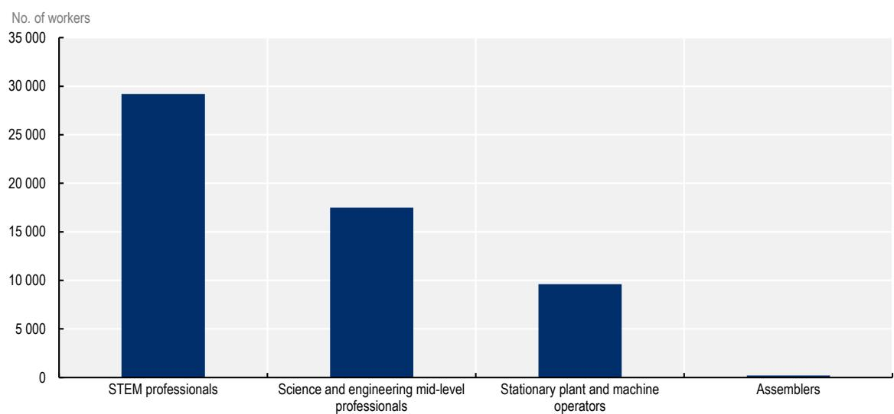  
Note: The sample is restricted to those workers considered employed according to Question 30 of INEC's labour market survey. STEM professionals, science and engineering mid-level professionals, stationary plant and machine operators and assemblers correspond to Categories 21, 31, 81 and 82 respectively, of the National Classification of Occupations of 2010 (CNO). Figures are based on survey data weighted using survey weights. The total number of workers has been extrapolated to align with the size of the total labour force, ensuring comparability across estimates.  
Source: OECD calculations based on Encuesta del Mercado Laboral from INEC (n.d.[11]), “Publicaciones”, https://www.inec.gob.pa/publicaciones/.

Within the high-tech sector, ICT professionals and ICT technicians were some of the most common occupations, together accounting for 21% of high-tech occupations (Figure 2.52). This is explained by the predominance of the computer programming and consultancy sector (see Figure 2.3).

Figure 2.52. Distribution of workers by occupations in the high-tech sector, August 2023  
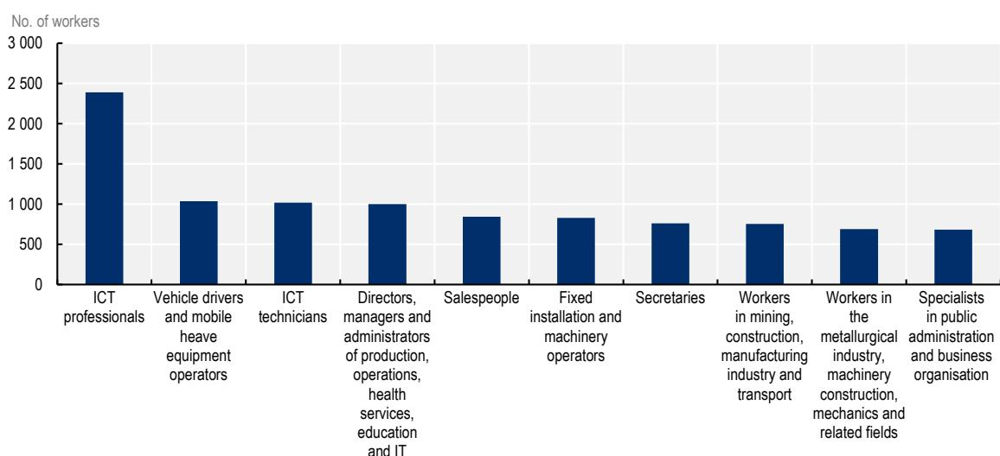  
Note: The sample is restricted to those workers considered employed according to Question 30 of INEC's labour market survey. Only the top ten most common occupations are shown. Figures are based on survey data weighted using survey weights. The total number of workers has been extrapolated to align with the size of the total labour force, ensuring comparability across estimates.  
Source: OECD calculations based on Encuesta del Mercado Laboral from INEC (n.d.[11]), “Publicaciones”, https://www.inec.gob.pa/publicaciones/ (accessed on 15 May 2024).

Panama's labour market is characterised by a high incidence of informality, affecting $49\%$ of Panamanian workers in 2024. This is slightly higher than the regional average for Latin America and the Caribbean $(47.6\%)$ and significantly higher than countries such as Costa Rica $(37\%)$ (ILO, 2025[76]). Additionally, the incidence of informality is higher for workers from poor households, amongst the young and the less educated, thereby exacerbating the inequality gap (OECD, 2024[77]; 2017[15]).

Supporting the transition to formal work could help tap into an important pool of talent. Improving access to and quality of education is one of the most powerful instruments to address informality. Simplifying labour market regulations to ensure greater flexibility can also help transition informal workers into formal employment (Deléchat and Medina, 2020[78]).

The incidence of informality varies across sectors. Figure 2.53 shows that, in the non-high-tech sector, 48% of workers are informal. In contrast, 14% of workers in the high-tech sector are informal. This suggests that a significant portion of workers in the non-high-tech sector face less job security and potentially fewer labour protections. Indeed, Figure 2.54 shows that 18% of workers in the non-high-tech sector lack a written contract; this rate is much lower for the high-tech sector, where 2% of workers are without a written contract. The high-tech sector has a higher incidence of workers with permanent contracts, implying greater job stability and formal employment status among its workforce.

The incidence of informality is also evident in salary levels. According to the August 2023 labour market survey, the median salary for informal workers in the non-high-tech sector was PAB 400 (Panamanian balboa) per month, while the median salary for formal workers in the same sector was double that amount. In the high-tech sector, informal workers earned a median salary of PAB 800 per month, compared to PAB 950 for formal workers (Figure 2.55).

Figure 2.53. Informality rate by sector, August 2023  
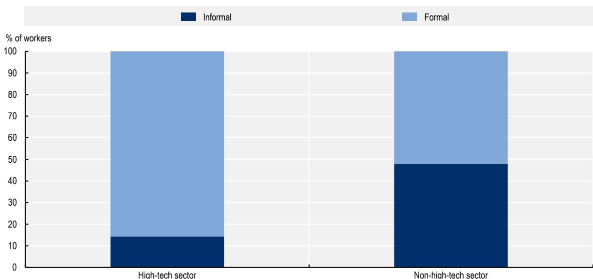  
Note: Informality is defined as employed non-agricultural workers aged 15 and older without access to social security or without a formal contract, including: private company employees without social security or work contracts; self-employed workers without social security; employers without social security whose businesses have fewer than 5 employees; domestic workers without social security; and family workers. Managers, administrators and professionals who are self-employed or employers are excluded from this definition. The sample is restricted to workers not declared to be owners, and for whom information about the contract type and salary is available. Figures are based on survey data weighted using survey weights. The total number of workers has been extrapolated to align with the size of the total labour force, ensuring comparability across estimates.  
Source: OECD calculations based on Encuesta del Mercado Laboral from INEC (n.d.[11]), “Publicaciones”, https://www.inec.gob.pa/publicaciones/.

Figure 2.54. Distribution of workers by contract type, August 2023  
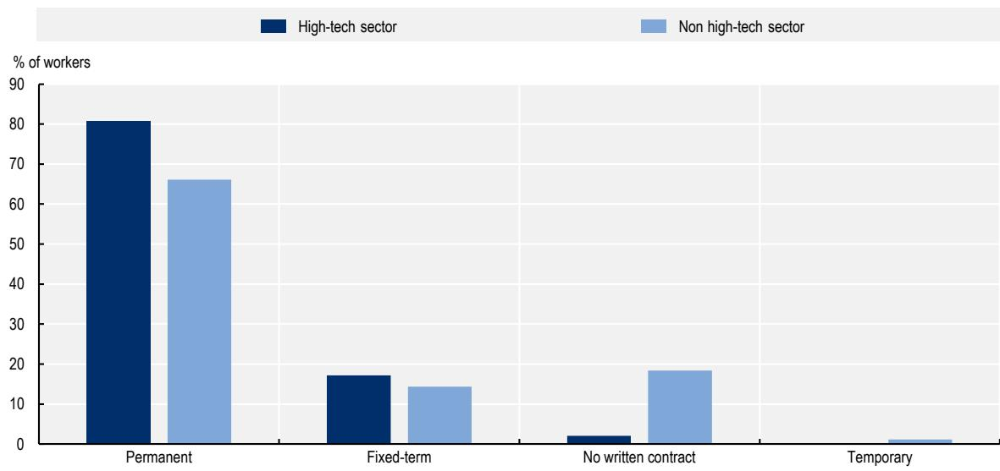  
Note: The sample is restricted to workers not declared to be owners, and for whom information about the contract type and salary is available. Workers with an open-ended contract according to Question 34 of the Encuesta del Mercado Laboral survey are classified as permanent. Figures are based on survey data weighted using survey weights. The total number of workers has been extrapolated to align with the size of the total labour force, ensuring comparability across estimates. Workers are classified as informal if they are either not affiliated with social security or do not have a written contract. As a result, the share of informal workers is not equivalent to the share of workers without a written contract.  
Source: OECD calculations based on Encuesta del Mercado Laboral from INEC (n.d.[11]), “Publicaciones”, https://www.inec.gob.pa/publicaciones/.

Figure 2.55. Median monthly salary by contract type, August 2023  
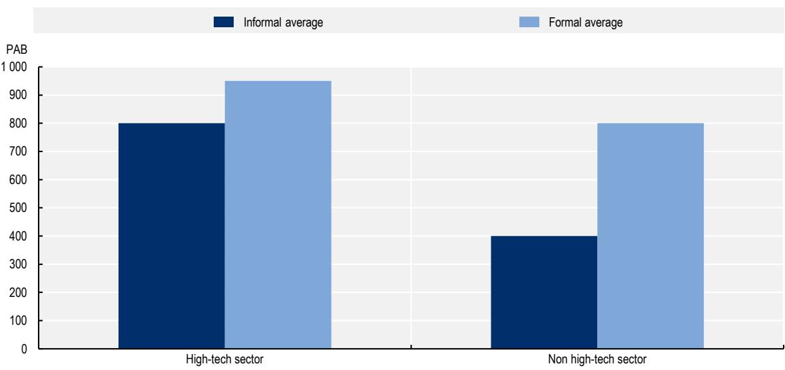  
Note: The sample is restricted to workers not declared to be owners and for whom information about the contract type and salary is available. Workers with an open-ended contract according to Question 34 of the Encuesta del Mercado Laboral survey are classified as permanent. The salary corresponds to the median monthly salary. Figures are based on survey data weighted using survey weights. The total number of workers has been extrapolated to align with the size of the total labour force, ensuring comparability across estimates. Workers are classified as informal if they are either not affiliated with social security or do not have a written contract. As a result, the share of informal workers is not equivalent to the share of workers without a written contract.

Source: OECD calculations based on Encuesta del Mercado Laboral from INEC (n.d.[11]), “Publicaciones”, https://www.inec.gob.pa/publicaciones/.

Understanding the determinants of wage evolution and quantifying their impact can inform policy decisions, target interventions to reduce inequality and foster economic growth. Building on the data from the August 2023 labour market survey, it is possible to develop a cross-sectional regression model aimed at estimating wages based on individual characteristics. This model explores the link between wages and fundamental variables such as sex, education level, contract type or age. The model aims to provide a detailed understanding of how different attributes influence wage levels, thereby shedding light on the underlying dynamics of the Panamanian labour market (for more details, see Box 2.4).

## Box 2.4. Econometric specification

The model takes the functional form expressed in the following equation:

$$
\begin{array}{r l} & {\ln (W _ {i}) = \beta_ {0} + \beta_ {1} U n i v e r s i t y _ {i} + \beta_ {2} S e c o n d a r y _ {i} + \beta_ {3} M a l e _ {i} + \beta_ {4} A g e _ {i} + \beta_ {5} A g e ^ {2} _ {i} + \beta_ {6} C o n t r a c t _ {i}} \\ & {\qquad + \beta_ {7} S T E M _ {i} + \beta_ {8} P a n a m a _ {i} + \sum_ {j = 1} ^ {J - 1} I n d u s t r y _ {i j} + \varepsilon_ {i}} \end{array}
$$

where:

\- $\ln(W_{i})$ is the natural logarithm of hourly wages of individual $i$

\- $\beta_0$ is the intercept term

\- University $_{i}$ and Secondary $_{i}$ take the value 1 if the individual has university or secondary education respectively, 0 otherwise

• $Male_{i}$ takes the value 1 if the individual is a male, 0 if female

\- $Age_{i}$ and $Age^{2}_{j}$ represent the age and age squared respectively, of individual $i$

\- $Contract_{i}$ is a categorical variable for type of employment contracts, with permanent contract as the base category

\- $STEM_{i}$ takes the value 1 if the individual is a STEM professional or a science and engineering mid-level professional, $^{1}$ 0 otherwise

\- $Panama_{i}$ takes the value 1 if the individual is based in the province of Panamá, 0 otherwise

\- $Industry_{ij}$ represents industry fixed effects

\- $\varepsilon_{i}$ is the error term.

The first two explanatory variables capture differences in education attainment, measured by whether a worker has completed tertiary university or secondary education. Positive coefficients on these variables would indicate wage premia associated with higher educational qualifications. Sex is included to account for any disparities between men and women, whereas age serves as a proxy for work experience in the absence of direct experience data. The model also controls for the type of employment contract, as reported in the labour market survey. A STEM indicator is included to assess the wage effects of holding a STEM-related occupation. Finally, a regional dummy variable differentiates between workers in the province of Panamá and those in other provinces and industry fixed effects to account for systematic wage differences across sectors, isolating the contribution of individual and job characteristics. Together, these variables allow the model to quantify how human capital, demographics, job characteristics and regional factors influences wage levels, thereby identifying significant factors contributing to income disparities in the labour market.

This estimation approach relies on ordinary least squares, under the standard assumptions of linearity, homoscedasticity and no multicollinearity (for more details, see Annex E). The data are drawn from the August 2023 labour market survey.

Note:

1. STEM professionals and science and engineering mid-level professionals correspond to categories 21 and 31 respectively of the National Classification of Occupations of 2010. This list is not exhaustive and only contains the STEM-related occupations shown in Figure 2.51.

Holding a STEM-related occupation correlates positively with higher wages compared to non-STEM-related occupations, even after controlling for other factors. Residing in the province of Panamá also emerges as significant. Similarly, male workers tend to receive higher wages on average.

Furthermore, university education proves notably advantageous, as degree holders earn substantially more than those without a university qualification. In contrast, non-permanent contracts (fixed-term, temporary or without a written contract) are generally associated with substantially lower wages than permanent contracts. Finally, age is positively correlated with wages.

These results highlight the importance of investing in education and in addressing informality. Regulators could strengthen labour laws to protect workers with non-permanent contracts, ensuring they receive fair compensation and benefits, and labour reforms could also focus on transitioning temporary workers to permanent positions.

The positive correlation between STEM-related occupations and higher earnings underscores the need to promote STEM education. Policies could include scholarships and targeted educational programmes to encourage more students to pursue STEM fields. Additionally, policies should provide specific support for women pursuing STEM careers, such as mentorship programmes, to retain women in the workforce.

The results of the analysis are promising, but they are limited by their static nature. Acquiring more detailed information across multiple years would facilitate the assessment of the evolution and labour dynamics underlying these results, enabling the provision of more tailored policy recommendations. Furthermore, establishing a stable panel dataset would allow for control of time-invariant individual characteristics (such as having a STEM background) but also time-varying factors (like experience proxied by age), thereby permitting the application of more sophisticated econometric methods.

## References

Alfaro Urena, A., I. Manelici and J. Vasquez (2021), “The effects of multinationals on workers: Evidence from Costa Rican microdata”, Center for Economic Policy Studies, Department of Economics, Princeton University.

AmCham Panama (2024), Doing Business in Panama, 2024-2025, https://panamcham.com/es/doing-business-panama-report-nueva-edicion.

Arslanalp, S. et al. (2023), “Climate change is disrupting global trade”, IMF Blog, International Monetary Fund, https://www.imf.org/en/blogs/articles/2023/11/15/climate-change-is-disrupting-global-trade.

Bonnet, P. and A. Ciani (2023), Applying the SCAN methodology to the Semiconductor Supply Chain, European Commission, https://publications.jrc.ec.europa.eu/repository/handle/JRC133736. [19]

Carril-Caccia, F. and E. Pavlova (2020), “Mergers and acquisitions and trade: A global value chain analysis”, The World Economy, Vol. 43/3, pp. 586-614, https://doi.org/10.1111/twec.12882. [30]

CBA (2023), Panama Trade Promotion Agreement (PATPA), United States Customs and Border Protection, https://www.cbp.gov/trade/free-trade-agreements/panama. [80]

CEPII (2026), The CEPII-BACI dataset, Centre d'études prospectives et d'informations internationales, https://www.cepii.fr/DATA\_DOWNLOAD/baci/doc/baci\_webpage.html (accessed on 16 January 2026). [18]

Deléchat, C. and L. Medina (2020), “What is the Informal Economy?”, International Monetary Fund, https://www.imf.org/en/Publications/fandd/issues/2020/12/what-is-the-informal-economy-basics (accessed on 8 July 2024).

EC (2024), “International Partnerships - Panama”, European Commission, https://international-partnerships.ec.europa.eu/countries/panama\_en#:\~:text=Panama%20is%20one%20of%20only,its%20marine%20areas%20under%20protection. (accessed on 29 August 2025).

El Economista (2024), “Latam Airlines se posiciona como la mejor aerolínea de Sudamérica en el ranking 2024 de Skytrax”, https://www.eleconomista.com.mx/empresas/Latam-Airlines-se-posiciona-como-la-mejor-aerolinea-de-Sudamerica-en-el-ranking-2024-de-Skytrax-20240627-0043.html.

EPO (n.d.), Why Are Patent Statistics Important?, European Patent Office, https://www.epo.org/en/service-support/faq/searching-patents/patent-statistics/why-are-patent-statistics-important.

EU Global Gateway (2024), “About the CopernicusLAC Panama Centre”, https://www.copernicuslac-panama.eu/about/ (accessed on 29 August 2025).

fDi Markets (2024), “Homepage”, https://www.fdimarkets.com/ (accessed on 14 January 2025). [36]

French Government (2017), “Overcoming student difficulties at school\*”, Trésor-Economics, No. 191, https://www.tresor.economie.gouv.fr/Articles/a56e5d47-b29e-48eb-9f49-b95bd02701fb/files/0b01454d-9753-4381-9b96-8c58c6aab5be (accessed on 17 October 2025).

Frost, K. and I. Hua (2019), “Quantifying spatiotemporal impacts of the interaction of water scarcity and water use by the global semiconductor manufacturing industry”, Water Resources and Industry, Vol. 22, p. 100115, https://doi.org/10.1016/j.wri.2019.100115. [38]

Galindo-Rueda, F. and F. Verger (2016), “OECD Taxonomy of Economic Activities Based on R&D Intensity”, OECD Science, Technology and Industry Working Papers, No. 2016/4, OECD Publishing, Paris, https://doi.org/10.1787/5jlv73sqqp8r-en.

Gaulier, G. and S. Zignago (2010), BACI: International Trade Database at the Product-level The 1994-2007 Version, http://www.cepii.fr/anglaisgraph/bdd/baci.htm. [79]

GlobalPetrolPrices.com (2025), Electricity prices (dataset), [46] https://www.globalpetrolprices.com/electricity\_prices/ (accessed on 15 September 2025).

Griliches, Z. (1990), “Patent Statistics as Economic Indicators: A Survey”, Journal of Economic Literature, Vol. 28/4, pp. 1661-1707, https://www.jstor.org/stable/2727442. [25]

Gruppo Tim (2023), “Sparkle: InteRed Installs an Internet Exchange Point at Panama Digital Gateway”, https://www.gruppotim.it/en/press-archive/sparkle/2023/PR-Sparkle-InteRed-installs-an-Internet-Exchange-Point-at-Panama-Digital-Gateway.html (accessed on 16 October 2025).

Ha, J., M. Kose and F. Ohnsorge (2023), “One-stop source: A global database of inflation”, Journal of International Money and Finance, Vol. 137, https://doi.org/10.1016/j.jimonfin.2023.102896.

Haramboure, A. et al. (2023), “Vulnerabilities in the semiconductor supply chain”, OECD Science, Technology and Industry Working Papers, No. 2023/05, OECD Publishing, Paris, https://doi.org/10.1787/6bed616f-en.

IEA (n.d.), Country and regions (database), International Energy Agency, https://www.iea.org/countries.

ILO (2025), Panorama laboral 2024: América Latina y el Caribe, International Labour Organization, https://www.ilo.org/sites/default/files/2025-03/OIT-PANORAMA-LABORAL-2024.pdf (accessed on 22 August 2025).

IMF (2025), “Panama 2025 Article IV consultation - press release”, International Monetary Fund, https://www.imf.org/-/media/Files/Publications/CR/2025/English/1panea2025001-source-pdf.ashx (accessed on 26 September 2025).

IMF (2024), “Panama: 2024 Article IV Consultation - Press Release; and Staff Report”, IMF Staff Country Reports, Vol. 2024/188, p. 1, https://doi.org/10.5089/9798400279867.002.

IMF (2023), “Panama: 2022 Article IV Consultation - Press Release; Staff Report; and Statement by the Executive Director for Panama”, IMF Staff Country Reports, Vol. 2023/122, p. 1, https://doi.org/10.5089/9798400237942.002.

IMF (2020), “Structural Policies in Panama: Background and policy recommendations”, International Monetary Fund, https://www.elibrary.imf.org/downloadpdf/view/journals/002/2020/125/article-A005-en.pdf (accessed on 16 October 2025).

IMF (n.d.), IMF PortWatch (database), International Monetary Fund, https://portwatch.imf.org/ (accessed on 12 October 2025).

INEC (2024), Informe completo: Avance del PIB anual, https://www.inec.gob.pa/archivos/P0705547520250916114908INFORME%20COMPLETO%20Avance%20del%20PIB%20Anual%202024.pdf (accessed on 25 March 2026).

INEC (2024), “PIB Trimestral por el Enfoque del Gasto años 2018-2022, Primer, Segundo y Tercer Trimestre 2023”, National Institute of Statistics and Census of Panama, https://www.inec.gob.pa/publicaciones/Default3.aspx?ID\_PUBLICACION=1242&ID\_CATEGORIA=4&ID\_SUBCATEGORIA=26 (accessed on 6 May 2024).

INEC (2024), “Producto Interior Bruto Provincial, a Precios Corrientes y en Medidas de Volumen Encadenadas con Año de Referencia 2018”, National Institute of Statistics and Census of Panama,
https://www.inec.gob.pa/publicaciones/Default3.aspx?ID\_PUBLICACION=1250&ID\_CATEGORIA=4&ID\_SUBCATEGORIA=26 (accessed on 6 May 2024).

INEC (n.d.), Instituto Nacional de Estadística y Censo, https://www.inec.gob.pa (accessed on 18 March 2026).

INEC (n.d.), “Publicaciones”, National Institute of Statistics and Census of Panama, https://www.inec.gob.pa/publicaciones/ (accessed on 15 May 2024).

Infralatam (n.d.), Data on public investment in economic infrastructure in Latin America and the Caribbean (database), https://www.infralatam.info/ (accessed on 15 September 2025).

LatAm FDI (2025), “Overview of the Most Prominent Industrial Parks in Panama”, https://latamfdi.com/industrial-parks-in-panama/.

Lightcast (2023), “Lightcast Data”, https://lightcast.io/products/data/overview (accessed on 14 January 2025).

MEDUCA (2020), MEDUCA - Estadísticas Educativas 2020 (database), Ministry of Education, https://www.datosabiertos.gob.pa/dataset/meduca-estadisticas-educativas-2020 (accessed on 15 June 2024).

MINERPA (n.d.), Tasa de desempleo total, Mapa de Información Económica de la República de Panamá, https://minerpa.com.pa/tasa-de-desempleo-total/ (accessed on 15 July 2024).

OECD (2024), Informality and Households' Vulnerabilities in Latin America: Data, Insights and Implications for Labour Formalisation Policies, OECD, Paris, https://www.oecd.org/content/dam/oecd/en/publications/reports/2024/10/informality-and-households-vulnerabilities-in-latin-america\_fdbca190/e29d9f34-en.pdf (accessed on 24 September 2025).

OECD (2024), Recommendation of the Council on Principles for Private Sector Participation in Infrastructure, OECD/LEGAL/0349, https://legalinstruments.oecd.org/en/instruments/OECD-LEGAL-0349 (accessed on 6 December 2024).

OECD (2023), PISA 2022 Database, https://www.oecd.org/pisa/data/2022database/ (accessed on 16 April 2024). [70]

OECD (2023), PISA 2022 Results (Volume I and II) - Country Notes: Panama, OECD Publishing, [69] Paris, https://www.oecd.org/publication/pisa-2022-results/country-notes/panama-85fcce46/.

OECD (2019), Measuring distortions in international markets, https://doi.org/10.1787/8fe4491d-en. [21]

OECD (2017), Multi-Dimensional Review of Panama: Volume 1: Initial Assessment, OECD Development Pathways, OECD Publishing, Paris, https://doi.org/10.1787/9789264278547-en. [15]

OECD (2009), OECD Patent Statistics Manual, OECD Publishing, Paris, https://doi.org/10.1787/9789264056442-en.

OECD (n.d.), STI Micro-data Lab: Intellectual Property Database, OECD, Paris, http://oe.cd/ipstats (accessed on 15 October 2025).

Orbis M&A (2026), “Welcome to Orbis M&A”, https://login.bvdinfo.com/R1/OrbisMA (accessed on 16 January 2026). [35]

Orozco, R. and R. Padilla Pérez (2023), “Analysis of Central American trade integration from the perspective of intraregional value added”, CEPAL Review, Vol. 2023-04, https://hdl.handle.net/11362/48969 (accessed on 24 June 2024).

Panamá Pacífico (2022), “Frequently Asked Questions”, https://www.panamapacifico.com/en/faq/ (accessed on 16 October 2025).

Panamá Pacífico (2015), “Panamá Pacífico - Join the Hub of Global Competitiveness”.

Presidencia de la República (2025), “Presidente anuncia trazado de ruta del ferrocarril y la ubicación de las futuras estaciones”, https://www.presidencia.gob.pa/publicacion/presidente-anuncia-trazado-de-ruta-del-ferrocarril-y-la-ubicacion-de-las-futuras-estaciones- (accessed on 29 August 2025).

RICYT (n.d.), “Indicators”, Network of Science and Technology Indicators, https://www.ricyt.org/en/category/indicators/ (accessed on 15 September 2025).

SENACYT (n.d.), “Homepage”, National Secretariat of Science, Technology and Innovation, https://observatorio.senacyt.gob.pa/ (accessed on 15 July 2024).

TI Sparkle (2023), Panama Digital Gateway, https://www.tisparkle.com/sites/en/files/2023-07/Sparkle-Panama-Digital-Gateway-Leaflet\_1.pdf (accessed on 17 September 2025).

UIS (2025), Educational attainment, at least completed upper secondary, population 25+, total (%) (cumulative) (indicator), United Nations Educational, Scientific and Cultural Organization Institute for Statistics, https://data.worldbank.org/indicator/SE.SEC.CUAT.UP.ZS (accessed on 15 September 2025).

UIS (2025), Government expenditure on education, total (% of GDP) (dataset), United Nations Educational, Scientific and Cultural Organization Institute for Statistics, https://data.worldbank.org/indicator/SE.XPD.TOTL.GD.ZS (accessed on 15 September 2025).

UIS (2025), “Homepage”, United Nations Educational, Scientific and Cultural Organization Institute for Statistics, https://data.uis.unesco.org/ (accessed on 15 October 2025). [71]

UIS (2025), UIS Data Browser - September 2025 Update (database), United Nations Educational, Scientific and Cultural Organization Institute for Statistics, https://data.uis.unesco.org/en (accessed on 15 September 2025).

UN (2024), World Population Prospects 2024 (database), United Nations, [66] https://population.un.org/wpp/ (accessed on 14 January 2025).

UNDCO (2024), “Panama’s path to equity: How the UN is driving change”, United Nations Development Coordination Office, https://un-dco.org/stories/panamas-path-equity-how-un-driving-change#:\~:text=Inequality%20remains%20high%2C%20exacerbated%20by,a%20staggering%2070%20per%20cent.

WEF (2019), Air transport infrastructure quality - Country rankings (dataset), Global Competitiveness Index, World Economic Forum, https://www.theglobaleconomy.com/rankings/air\_transport\_infrastructure/ (accessed on 15 February 2024).

WEF (2019), Roads quality - Country rankings (dataset), Global Competitiveness Index, World Economic Forum, https://www.theglobaleconomy.com/rankings/roads\_quality/ (accessed on 15 February 2025).

WIPO (2023), “How patent information can help spot technology gaps and catalyze economic development”, World Intellectual Property Organization, https://www.wipo.int/wipo\_magazine\_digital/en/2023/article\_0034.html.

World Bank (2024), “Logistics Performance Index (LPI)”, World Bank, Washington, DC, https://lpi.worldbank.org/international/scorecard/radar/C/CRI/2023 (accessed on 13 January 2025).

World Bank (2024), Renewable internal freshwater resources per capita (cubic meters) (indicator), Original data from Food and Agriculture Organization AQUASTAT, World Bank, Washington, DC, https://data.worldbank.org/indicator/ER.H2O.INTR.PC (accessed on 15 September 2025).

World Bank (2024), The Container Port Performance Index 2023: A Comparable Assessment of Performance based on Vessel Time in Port, World Bank, Washington, DC, http://documents.worldbank.org/curated/en/099060324114539683/P17583313892300871be641a5ea7b90e0e6 (accessed on 14 June 2024).

World Bank (2023), Access to electricity (% of population) (indicator), World Bank, Washington, DC, https://data.worldbank.org/indicator/EG.ELC.ACCS.ZS (accessed on 15 September 2025).

World Bank (2020), “Getting electricity: System average interruption frequency index (SAIFI)”, World Bank, Washington, DC.

World Bank (2020), Global Investment Competitiveness Report 2019/2020: Rebuilding Investor Confidence in Times of Uncertainty, World Bank, Washington, DC.

World Bank (2020), System Average Interruption Duration Index (SAIDI), World Bank, Washington, DC, https://databank.worldbank.org/id/dd1d6036?Report\_Name=SAIDI-Index-WB# (accessed on 16 October 2025).

World Bank (n.d.), Container port traffic (TEU: 20 foot equivalent units) (indicator), Original data from the United Nations Conference on Trade and Development, World Bank, Washington, DC, https://data.worldbank.org/indicator/IS.SHP.GOOD.TU (accessed on 15 September 2025).

World Bank (n.d.), Fixed broadband subscriptions (per 100 people) (indicator), Original data from International Telecommunication Union World Telecommunication/ICT Indicators Database, World Bank, Washington, DC, https://data.worldbank.org/indicator/IT.NET.BBND.P2 (accessed on 15 September 2025).

World Bank (n.d.), Foreign direct investment, net inflows (% of GDP) (indicator), World Bank, Washington, DC, https://data.worldbank.org/indicator/BX.KLT.DINV.WD.GD.ZS (accessed on 15 September 2025).

World Bank (n.d.), GDP deflator: linked series (base year varies by country) (indicator), World Bank, Washington, DC, https://data.worldbank.org/indicator/NY.GDP.DEFL.ZS.AD (accessed on 15 September 2025).

World Bank (n.d.), Gini index, World Bank, Washington, DC, https://data.worldbank.org/indicator/SI.POV.GINI (accessed on 15 September 2025).

World Bank (n.d.), Merchandise trade (% of GDP) (indicator), World Bank, Washington, DC, https://data.worldbank.org/indicator/TG.VAL.TOTL.GD.ZS (accessed on 15 June 2024).

World Bank (n.d.), Trade in services (% of GDP) (indicator), World Bank, Washington, DC, https://data.worldbank.org/indicator/BG.GSR.NFSV.GD.ZS (accessed on 15 June 2024).

WTO (2025), Bulk Download of Trade Datasets, World Trade Organization, https://www.wto.org/english/res\_e/statis\_e/trade\_datasets\_e.htm (accessed on 17 October 2025).

Younkin, T. (2024), “SRC’s Microelectronics and Advanced Packaging Technologies (MAPT) roadmap: an era of innovation driven by energy, workforce, and environmental sustainability”, Proc. SPIE PC12953, Optical and EUV Nanolithography XXXVII, PC1295301, https://doi.org/10.1117/12.3027041.

[65]

## Notes

$^{1}$ See Table 2.1 for the list of industries included in the high-tech sector.

$^{2}$ The economies selected in this report are those with the smallest absolute difference in GDP per capita compared to Panama within the Latin American region in 2022, based on data from the World Bank (https://data.worldbank.org/indicator/NY.GDP.PCAP.CD (accessed in April 2024).

$^{3}$ Classified under sectors 58, 62, 63 and 72 according to Table 2.1.

$^{4}$ Wafer fabrication is sometimes also referred to as front-end manufacturing; ATP is sometimes also referred to as back-end manufacturing – see Annex A for more details on the semiconductor value chain.

$^{5}$ French acronym for Database for International Trade Analysis (Base pour l'Analyse du Commerce International). The BACI database can present several advantages over the raw UN COMTRADE database, which is the most comprehensive database on world trade, building on data on bilateral trade flows reported by countries to the United Nations Statistical Division (for more information see https://comtradeplus.un.org/). However, while countries report both their imports and their exports through the UN COMTRADE database, mirror flows (which should be identical for the reporting and partner country) between partners may differ. BACI employs a procedure to reconcile flows reported by importers and exporters to provide consistent trade flow estimates (Gaulier and Zignago, 2010 $^{[79]}$ ).

$^{6}$ Several leading ICT firms, such as Ericsson, Huawei and ZTE, have established operations in Panama under SEM. These companies can benefit from the regime by setting up back-office services in Panama and take advantage of the country's strategic logistics position to establish distribution centres for product supply in the region. However, these firms do not manufacture any ICT products under SEM regime.

$^{7}$ As a result of the United States-Panama Trade Promotion Agreement, barriers to trade are significantly lessened between the United States and Panama, including the elimination of some tariffs. The agreement is therefore beneficial for semiconductor component imports and exports. The agreement also provides strong protections and enforcement mechanisms for United States trademarks, alleviating potential intellectual property concerns for semiconductor designs (CBA, 2023 $^{[80]}$ ). However, the long-term impact of the 10% tariff imposed by the United States on imports from Panama in April 2025 remains to be seen.

$^{8}$ The Patent Cooperation Treaty (PCT) makes it possible to seek patent rights for an invention in multiple countries simultaneously by filing a single international patent application (PCT application) with a single patent office. The PCT is administered by the World Intellectual Property Organization (WIPO).

$^{9}$ According to WIPO domains, furniture, games, are part of the same group. For more information on the different patent technologies, see https://data-explorer.oecd.org/s/325.

$^{10}$ This project was financed by the Inter-American Development Bank (with a contribution of PAB 35 million), the Instituto de Crédito Oficial represented by the Spanish Agency for International Development Cooperation (PAB 15 million) and the government of Panama (PAB 6 million). For more information, see https://ensegundos.com.pa/2020/10/27/gabinete-aprueba-financiamiento-para-el-programa-de-acceso-universal-a-la-energia/

$^{11}$ For more information, see https://www.embassyofpanama.org/panama-canal.

$^{12}$ For more information, see https://pancanal.com/.

$^{13}$ The Panama Canal Railway also connects Panama City with Colón alongside the Panama Canal.

$^{14}$ For more information, see https://enterector.gob.pa/proyecto-carretera-panamericana-oeste/.

15 https://www.oecd.org/en/about/programmes/pisa.html. Data refer to the 2022 PISA assessment, published by the OECD in December 2023.

$^{16}$ Level 2 is the minimum level of proficiency that all students should reach by the end of secondary education. It is the baseline level of proficiency that students require to participate fully in society. At Level 2, students begin to demonstrate the ability and initiative to use skills in simple real-life situations, for example by using basic mathematical formulae, employing simple scientific knowledge and interpreting simple texts.

$^{17}$ The EF English Proficiency Index is based on the EF Standard English Test (SET). SET is free and online, so anyone with an internet connection can participate. Almost all the test takers are working or young adults finishing their studies and are self-selected, which suggests that the test takers are disproportionately individuals who want to learn English or curious about their English skills. Therefore, the test-taking population is not guaranteed to be representative, and the results need to be interpreted with a lot of caution.

$^{18}$ For more information, see https://www.ef.com.pa/epi/regions/latin-america/panama/.

# Understanding the policy and regulatory landscape

Following the previous chapter's analysis of the market structure of the high-technology (high-tech) ecosystem in Panama, this chapter focuses on the policies and regulations shaping a potential semiconductor ecosystem in Panama. It starts with a review of the institutional framework and recent policy actions aimed at developing the semiconductor industry. This chapter then focuses on policies relating to science, technology, innovation and entrepreneurship, as well as business support measures and reforms to improve the business environment. This chapter concludes by analysing policies for developing the human capital required for the semiconductor ecosystem.

## 3.1. Institutional framework and policies supporting the domestic ecosystem for semiconductors

On 30 April 2024, Panama published Executive Decree No. 7 (hereafter the Decree) which introduced a dedicated institutional framework for the development of the semiconductor and microelectronics industries. $^{1}$ At the core of the institutional framework is the newly created Commission for Innovation in Microelectronics and Semiconductors (CIMS), which brings together key governmental and non-governmental stakeholders to direct Panama's semiconductor policy. The Decree also commits to launching a National Strategy for the Development of the Semiconductor and Microelectronics Industry (hereafter the National Semiconductor Strategy). Importantly, the Decree signalled Panama's long-term commitment to joining the global semiconductor supply chain. This section provides a brief overview of relevant Panamanian institutions and strategies, explaining how each can contribute to the country's ongoing efforts to develop a semiconductor ecosystem.

## 3.1.1. Institutional framework

As set out in the Decree, the primary purpose of the CIMS is to co-ordinate across the wide range of institutions responsible for developing and growing Panama's semiconductor industry. Composed of 17 representatives from government, academia and the private sector, the CIMS has many functions which include: drafting the National Semiconductor Strategy (see also Section 3.1.2); producing the Strategic Action Plan for the National Semiconductor Strategy's implementation; proposing policies, legislation and other governmental initiatives to promote the semiconductor ecosystem, while ensuring alignment with industry needs; stimulating collaboration amongst Panamanian stakeholders on human capital development and research and development (R&D); collaborating with international partners in the field of semiconductors (MICI, 2024[1]).

The importance of co-ordination across government stakeholders and engagement with non-government stakeholders is clear from the wide-ranging membership of the CIMS, listed in Table 3.1.

The Decree also establishes two new institutions to support the work of the CIMS. The first is the position of National Commissioner for Panama's Semiconductor and Microelectronics Industry (hereafter the Commissioner), who is distinct from the 17 members of the CIMS listed above. The Commissioner serves as the secretary of the CIMS and their responsibilities entail, amongst others: designing, publishing, implementing and monitoring the National Semiconductor Strategy and Strategic Action Plan; co-ordinating the actions of organisations involved in Panama's semiconductor industry; promoting Panama's participation in regional and international semiconductor initiatives; advocating for Panama's government to domestic and international semiconductor stakeholders; and working with Panama's National Council for University Evaluation and Accreditation (Consejo Nacional de Evaluación y Acreditación Universitaria de Panamá, CONEAUPA) to streamline the processes for issuing accreditation certificates to universities and university programmes that meet the semiconductor industry's quality standards (see also Section 3.3.2 on CONEAUPA's role). A dedicated technical team will be supporting the Commissioner in coordinating and implementing the National Semiconductor Strategy and Strategic Action Plan, and in engaging more actively with national and international stakeholders in the ecosystem for semiconductors. $^{2}$

The National Commissioner must hold a doctorate degree (PhD) and is appointed by Panama's president, selected from a shortlist of candidates drawn up by the CIMS. The National Commissioner must also be affiliated with the National Secretariat of Science, Technology and Innovation (SENACYT). In August 2025, Decree No. 192 appointed Darío Solís Caballero as Panama's first National Commissioner for the Semiconductor and Microelectronics Industry (Government of Panama, 2025[2]).

Table 3.1. Membership of the Commission for Innovation in Microelectronics and Semiconductors (CIMS)

<table><tr><td>A representative of the Ministry of Commerce and Industries (MICI), who chairs the CIMS</td></tr><tr><td>The National Secretary of Science, Technology and Innovation (i.e. the National Secretary of SENACYT)</td></tr><tr><td>A representative of the Ministry of Foreign Affairs (Ministerio de Asuntos Exteriores, MIRE)</td></tr><tr><td>A representative of the Ministry of Economy and Finance (Ministerio de Economía y Finanzas, MEF)</td></tr><tr><td>A representative of the Ministry of the Presidency (Ministerio de la Presidencia)</td></tr><tr><td>A representative of the Ministry of Labor and Workforce Development (Ministerio de Trabajo y Desarrollo Laboral de Panamá, MITRADEL)</td></tr><tr><td>A representative of the Technological University of Panama (Universidad Tecnológica de Panamá, UTP)</td></tr><tr><td>A representative of the University of Panama</td></tr><tr><td>A representative of the Specialised Higher Technical Institute (ITSE) of Panama</td></tr><tr><td>A representative of the National Authority for Government Innovation (Autoridad Nacional para la Innovación Gubernamental, AIG)</td></tr><tr><td>A representative of the Chamber of Commerce, Industry and Agriculture of Panama (Cámara de Comercio Industrias y Agricultura)</td></tr><tr><td>A representative of the National Competitiveness Council (Centro Nacional de Competitividad, CNC)</td></tr><tr><td>A representative of the Panamanian Chamber of Information Technology, Innovation and Telecommunications (Camara Panameña de Tecnología, CAPATEC)</td></tr><tr><td>A representative of the American Chamber of Commerce and Industry of Panama (Cámara Americana de Comercio e Industria de Panamá, AmCham Panama)</td></tr><tr><td>The director of the Georgia Tech Panama Logistics Innovation and Research Center</td></tr><tr><td>The director of the National Metrology Center of Panama - Public Interest Association (Centro Nacional de Metrología de Panamá, CENAMEP AIP)</td></tr><tr><td>A representative of Panama’s special economic zones (SEZs)</td></tr></table>

Source: MICI (2024[1]), “Decreto Ejecutivo No. 7 que establece lineamientos para el desarrollo e impulso de la actividad de microelectrónica y semiconductores”, https://www.gacetaoficial.gob.pa/pdfTemp/30021\_C/104538.pdf (accessed on 22 July 2024).

The second new institution is the Technical Advisory Council on Microelectronics and Semiconductors (CTAMS), which provides technical-scientific advice to the CIMS. The CTAMS plays a strategic and advisory role in supporting both the Commissioner and Panama's president, by providing technical and scientific guidance on national decisions related to semiconductors and microelectronics. While the CTAMS operates independently in terms of composition and appointment from the CIMS, it supports and strengthens the institutional framework led by the Commissioner. This structure was designed with the aim to ensure that Panama's policy decisions affecting the ecosystem for semiconductors are grounded in international best practices and expert knowledge.

The CTAMS is composed of seven experts, either Panamanian nationals or non-Panamanians, who have backgrounds in science, industry or academia related to microelectronics and semiconductors. These seven experts are put forward by the CIMS and appointed by Panama's president. The presidential involvement increases the CIMS's political authority and strengthens its ability to co-ordinate across multiple institutions. Also in August 2025, Decree No. 193 appointed the first seven members of the Technical Advisory Council (Government of Panama, 2025[3]).

In addition, the CIMS created three sub-committees aimed at providing technical input and coordination in their respective areas: Executive, Human capital development and Secure transport and trade (Box 3.1).

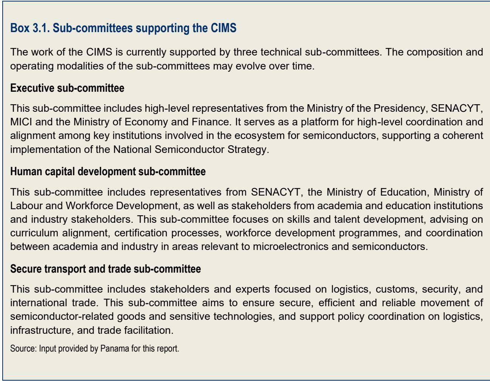  
Figure 3.1 summarises the primary institutions responsible for shaping Panama's emerging ecosystem for semiconductors. The rest of this section describes the roles of the institutions represented on the CIMS, in the order that they are listed in Article 5 of the Decree. The section then turns to other institutions relevant to Panama's ecosystem for semiconductors that are not represented on the CIMS.

The CIMS is chaired by the Ministry of Commerce and Industries (Ministerio de Comercio e Industrias, MICI). MICI is responsible for international trade, promoting industrial development and regulating industry. It oversees business and commercial activities in Panama, including business registration, the special economic zones (SEZs) and special investment incentives programmes for multinational corporate headquarters and manufacturing firms (see Section 3.2.3 for additional details on Panama's SEZs and special incentives programmes). In addition, MICI is responsible for a range of agencies that also deal with other areas relevant to the semiconductor industry, including intellectual property (IP) rights and technical standardisation.

SENACYT is the lead government agency for science, technology and innovation (STI) policy. It has a crucial role to play in Panama's ecosystem for semiconductors by providing grants and other funding for R&D, supporting entrepreneurial projects and developing human capital for a future semiconductor workforce. SENACYT also co-ordinates between academic and industry partners in Panama's STI ecosystem. It is represented on the CIMS by the National Secretary of Science, Technology and Innovation. SENACYT's role is analysed in greater depth in Section 3.2.1.

The Ministry of Foreign Affairs (Ministerio de Relaciones Exteriores) is responsible for Panama's international relations and co-operation, instrumental for positioning Panama in the global context of semiconductors. Its network of embassies has signed memoranda of understanding (MoUs) with overseas institutions with expertise in semiconductors and microelectronics (see Sections 3.2.1 and 3.3.2).

The Ministry of Economy and Finance (Ministerio de Economía y Finanzas) oversees economic policy and manages public finances, including fiscal policy and resource allocation. In particular, the ministry will assess recommendations by the CIMS regarding funding needs for semiconductor policy and consider incorporating these recommendations into the annual budgets of the relevant institutions (MICI, 2024[1]).

Figure 3.1. Overview of Panama's institutional framework for semiconductor policy  
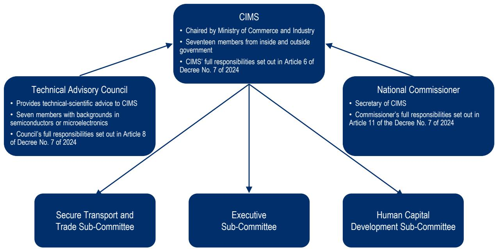  
Source: OECD analysis of MICI (2024[1]), “Decreto Ejecutivo No. 7 que establece lineamientos para el desarrollo e impulso de la actividad de microelectrónica y semiconductors”, https://www.gacetaoficial.gob.pa/pdfTemp/30021\_C/104538.pdf.

The Ministry of the Presidency (Ministerio de la Presidencia) houses the Presidency, Vice-Presidency and Cabinet and is the co-ordinating ministry for the executive. As Panama pursues its forthcoming National Semiconductor Strategy, the Ministry of the Presidency's ability to drive executive priorities will be important in steering semiconductor policies. The ministry and the CIMS will need to be well aligned with one another to ensure good co-ordination.

The Ministry of Labour and Workforce Development (Ministerio de Trabajo y Desarrollo Laboral) monitors the labour market, oversees vocational training, sets skills standards, certifies workers and authorises special work permits for foreign workers, amongst other functions. One of the CIMS's proposed responsibilities, as outlined in the Decree, is to shape Panama's migratory and labour regimes to ensure that semiconductor firms can meet their employment needs (see Section 3.3.5). The Ministry of Labour and Workforce Development will likely have a significant role in pursuing these objectives.

The National Authority for Government Innovation (Autoridad para la Innovación Gubernamental, AIG) is responsible for the digitalisation of government services, the modernisation of the public sector (including the streamlining of administrative processes) and other initiatives to improve Panama's business environment (see Section 3.2.3).

In addition to the government representatives outlined in the preceding paragraphs, the CIMS also includes representatives from outside government. Representatives from scientific and academic organisations include universities (the Technological University of Panama [UTP] and the University of Panama), the country's leading institution for vocational education and training (Specialised Higher Technical Institute, Instituto Técnico Superior Especializado, ITSE) and specialised institutions (National Metrology Centre of Panama [Centro Nacional de Metrología de Panamá, CENAMEP] and the Georgia Tech Panama Logistics Innovation and Research Center). The CIMS also includes representation from public-private organisations and the private sector, such as the Chamber of Commerce, Industry and Agriculture of Panama, the National Competitiveness Council, the Panamanian Chamber of Information Technology, Innovation and Telecommunications, the American Chamber of Commerce and Industry of Panama (AmCham Panama), as well as a representative from Panama's SEZs.

It is worth noting which institutions are not represented on the CIMS. Perhaps most notably, the Ministry of Education (Ministerio de Educación, MEDUCA) is absent from the CIMS, even though it is expected to play a vital role in developing semiconductor skills and talent. MEDUCA's responsibilities include primary and secondary education, encompassing both academic and technical programmes, curriculum design and standards, teacher training and management of the school network. Although MEDUCA is currently not represented on the CIMS, ITSE – which co-ordinates technical and highly specialised tertiary vocational education and ultimately falls under the responsibility of MEDUCA – is a member of the CIMS. Moreover, MEDUCA is represented on the CIMS sub-committee on human capital development, through which its expertise can inform discussions and shape policy.

Other ministries and agencies that are important for the ecosystem for semiconductors but are not represented on the CIMS include the:

\- Investment Attraction and Export Promotion Authority of Panama (Autoridad para la Atracción de Inversiones y Promoción de Exportaciones, PROPANAMA), an independent public agency created in 2021 to attract foreign direct investment and promote exports.

\- Panama Canal Authority (Autoridad del Canal de Panamá), responsible for managing the Panama Canal, including its operations, maintenance and development.

\- National Customs Authority (Autoridad Nacional de Aduanas), responsible for customs and trade facilitation, including modernisation and digitalisation of customs.

\- Ministry of Environment (Ministerio de Ambiente), responsible for environmental policy, including planning and managing water resources, critical for semiconductor manufacturing (see Section 2.2.1).

\- The National Secretariat for Energy (Secretaría Nacional de Energía), responsible for electricity policy. Electricity is another critical input for semiconductor manufacturing.

\- National Authority for Public Services (Autoridad Nacional de los Servicios Públicos) that regulates public utilities such as water supply, energy and telecommunications, including tariffs for utilities and the issuing of permits.

\- Ministry of Public Works (Ministerio de Obras Públicas), responsible for managing public infrastructure projects, for example constructing and maintaining the national road network.

\- Panama's National Council for University Evaluation and Accreditation (Consejo Nacional de Evaluación y Acreditación Universitaria de Panama, CONEAUPA), responsible for ensuring the quality and standards of higher education institutions in the country.

In general, the membership of the CIMS appears to strike an appropriate balance between, on the one hand, seeking the input from a wide range of institutions and, on the other, remaining coherent and focused. Nonetheless, the CIMS should still seek out the perspectives of some of the government agencies listed above, in addition to labour unions (e.g. in relation to semiconductor workforce and training) and civil society (e.g. on the socio-economic and environmental impacts of the semiconductor industry). This engagement could take place through the CIMS sub-committees, the Technical Advisory Council or more informal fora. Panama should also set out the procedure by which an institution can be added to the CIMS, in case the CIMS membership needs to adapt to changing policy or industry trends. It is important to take a holistic approach in developing the forthcoming National Semiconductor Strategy and Action Plan.

## 3.1.2. The National Semiconductor Strategy

Executive Decree No. 7 of 2024 sets out the objectives of the National Semiconductor Strategy (Box 3.2). These include: developing national capacity for R&D and semiconductor design, manufacturing and distribution; training the domestic semiconductor workforce and attracting international talent; supporting technological entrepreneurship; promoting research collaborations and technology transfer, both domestically and internationally; establishing mechanisms for ensuring semiconductor standards and metrology; and facilitating investment in the semiconductor sector. In July 2025, Panama announced that the National Semiconductor Strategy would prioritise the semiconductor design and ATP segments of the value chain and would be supported by USD 104.9 million in public investment over the five year period 2025-2029 (Presidencia de la República, 2025[4]). The details for implementing the National Semiconductor Strategy will be set out in a subsequent Strategic Action Plan (MICI, 2024[1]).

## Box 3.2. Public investment to support semiconductor design and ATP

Panama is planning to support its National Semiconductor Strategy with USD 104.9 million of public money over the five-year period 2025–2029. These funds will be implemented directly by public entities such as SENACYT, MICI, MEF, and academic institutions involved in the Strategy, as well as through the National Fund for the Semiconductor and Microelectronics Industry of Panama (see below), which can also leverage private capital.

Annual disbursements are planned to peak in 2026 and 2027, during the main implementation phase. The final years (2028–29) will be dedicated to consolidation, strategic evaluation, and ensuring long-term sustainability. The public investment is structured around four strategic components, aligned with the objectives of the National Semiconductor Strategy:

\- Human capital development: This is the main area of public investment, with a total allocation of approximately USD 75.2 million, covering programmes such as technical and professional training, curriculum reform and certification schemes, and scholarships and faculty development. These funds also support the creation and operation of C-TASC, a national training centre focused on semiconductor design and ATP (see Section 3.2.1 for details).

\- Infrastructure and legal framework development: Approximately USD 13.1 million will be allocated to support regulatory improvements and institutional capacity building, as well as to invest in infrastructure required for the semiconductor design and ATP segments.

\- Business ecosystem development: Business development is expected to benefit from approximately USD 11.2 million to support initiatives to attract foreign direct investment, promote high-tech entrepreneurship and startups, foster industry-academia collaboration and technology transfer; and help integrate local firms into global value chains.

\- Security: An investment of approximately USD 7 million is planned for cybersecurity measures and protection of critical infrastructure, data integrity and supply chain risk management, as well as support the technological resilience of the national ecosystem for semiconductors.

Source: Input provided by Panama for this report.

The Decree highlights the need to align the National Semiconductor Strategy with existing government strategies, notably the National Strategic Plan for Science, Technology and Innovation (PENCYT), the

Strategic Plan for Government (PEG), the National Logistics Strategy, the National Energy Plan and the National Strategic Plan for the Development of Metrology Infrastructure. $^{3}$ This is an important acknowledgement of key policy areas for the development of a semiconductor ecosystem in Panama. PENCYT's objectives and incentives are particularly relevant to the semiconductor industry, so it is analysed in Section 3.1.2.

The Decree also describes some of the forthcoming legislation which will support the development of Panama's semiconductor ecosystem. The CIMS is required to propose a bill to the National Assembly, which would contain the following incentives:

• a 30% R&D tax credit for semiconductor and microelectronics firms.

\- a tax deduction for specialised training and science, technology, engineering and mathematics (STEM) education for Panamanian citizens.

\- programmes for supporting Panamanian technology entrepreneurs for semiconductor-related projects.

\- special migration and hiring regimes for semiconductor workers and simplified procedures for hiring of qualified foreign personnel.

\- the creation of a National Fund for the Semiconductor and Microelectronics Industry to finance initiatives that help develop the semiconductor ecosystem. The national fund would be managed by SENACYT and can be funded by the public sector as well as through donations from private entities and international organisations. The fund should be sufficiently flexible to foresee investments across a range of industries (for example, high-tech industries) to mitigate possible demand-side challenges which could arise from a narrow focus on semiconductors. $^{4}$ According to the Decree, the fund is expected to allocate its funds as follows:

\- 25% to promote technology entrepreneurship related to semiconductors and microelectronics.

\- 25% to promote R&D in the field of semiconductors and microelectronics.

\- 25% to promote the training of semiconductor and microelectronics talent.

\- 25% for activities defined by the fund manager (SENACYT).

According to the Decree, international semiconductor and microelectronics firms will also be eligible for existing incentives, such as those under the Special Regime for Multinational Headquarters (Régimen Especial de Sedes de Empresas Multinacionales, SEM), the Special Regime for Manufacturing Services for Multinational Companies (Régimen Especial de Empresas Multinacionales para la Prestación de Servicios Relacionados con la Manufactura, EMMA) and the benefits granted to firms under the free zone and SEZ regimes. SEM, EMMA and other special regimes are analysed in Section 3.2.3.

The Decree requires SENACYT and UTP to create a Center for Advanced Semiconductor Technologies (C-TASC) to specialise in semiconductor R&D (see Section 3.2.1 for a detailed discussion of C-TASC). Finally, the Decree tasks MICI with creating a one-stop shop with information to simplify the process of investing in the semiconductor and microelectronics industries.

In this way, the Decree provides the institutional and policy framework for Panama's semiconductor ecosystem, with the expectation that it will be developed further by the forthcoming National Semiconductor Strategy. There are several policy instruments, managed by the agencies described in Section 3.1.1 above, that could contribute to the National Semiconductor Strategy. Some of these policy instruments are discussed in greater detail in Section 3.3.

## 3.2. Science, technology, innovation and business support

Although Panama does not currently have a domestic semiconductor industry, several actors across government, academia and the private sector have been actively working on the foundations necessary for attracting high-tech industry, as part of Panama's plans for the development of a robust industrial and manufacturing sector, set out in Panama's previous (2019-2024) and current (2025-2029) Strategic Plans for Government (Government of Panama, 2019[5]; 2024[6]).

A resilient semiconductor ecosystem requires a science and technology system, composed of higher education and research institutions in collaboration with governmental actors and industry, which can foster innovation and high-tech development in support of the potential semiconductor industry and relevant upstream and downstream industries. This section analyses Panama's technology and R&D landscape, policies to stimulate innovation and entrepreneurship, and measures to support business and improve the business environment.

## 3.2.1. Technology and R&D

In seeking to develop a domestic semiconductor ecosystem, Panama faces the dual challenge of low investment in R&D and low volumes of technology and manufacturing activity in the economy. Despite recent efforts, outlined below, Panama's support for R&D and investment in technology could be strengthened further and patenting activity is weak. This can partially be attributed to the relatively small scale of Panama's manufacturing sector, particularly in the high-tech sector. See Section 2.1.4 for a detailed discussion on R&D investment and patenting activity.

## Existing policies and programmes

As Panama's lead agency for STI, the mandate of The National Secretariat of Science, Technology and Innovation (SENACYT) allows it to create, fund and run public programmes designed to further Panama's science and technology efforts. The head of SENACYT, is appointed by Panama's president and ratified by the National Assembly, as set out in Law 55 of 2007 (Asamblea Nacional, 2007[7]). Nonetheless, the national secretary is largely insulated from politics as they are required by Law 50 of 2005 to be drawn from the scientific community and possess a PhD (Asamblea Nacional, 2005[8]). Moreover, SENACYT's autonomous governance structure and long-term planning (see also Box 3.3) helps ensure that actions on science and technology policy are relatively independent of the political cycle and build on consistent priorities across government administrations. As Panama works to develop its semiconductor ecosystem, it should continue this long-term approach to science and technology policy and its consensus-based approach to setting policy priorities.

## Box 3.3. The National Secretariat of Science, Technology and Innovation (SENACYT)

SENACYT is an autonomous government institution whose mission is to transform science and technology into tools for Panama's sustainable development. SENACYT aims to achieve this by strengthening, supporting and promoting STI in Panama to increase productivity, competitiveness and modernisation in the private sector, government, academic and research sectors, and amongst the general population (SENACYT, 2019[9]).

SENACYT takes many actions to fulfil its mission, for example: strengthening Panama's research capacity by funding a wide range of scientific fields; supporting human capital development and programmes related to STEM education; working towards increasing the number of scientists and their scientific production; and promoting innovation as a vehicle to achieve competitiveness. SENACYT's actions are directly guided by the National Strategic Plan for Science, Technology and Innovation (PENCYT) which is published every five years.

SENACYT was created by Law 13 of 1997, although it was not until subsequent reforms in 2005 (Law 50) and 2007 (Law 55) that SENACYT assumed its current mandate as an autonomous co-ordinator for STI (SENACYT, 2019[9]). In particular, Law 50 of 2005 expanded SENACYT's authority, giving the autonomous institution responsibility for policymaking and implementation over a broad portfolio that included R&D policy and funding (Asamblea Nacional, 2005[8]).

Sources: Information provided by Panama in the policy questionnaire used for this report. SENACYT (2019[9]), "Sobre Nosotros", Secretaría Nacional de Ciencia, Tecnología e Innovación, https://www.senacyt.gob.pa/sobre-nosotros/ (accessed on 19 August 2025); Asamblea Nacional (2005[8]), Ley No. 50 de 2005, https://docs.panama.justia.com/federales/leyes/50-de-2005-dec-23-2005.pdf (accessed on 7 October 2025).

Every five years, SENACYT drafts the PENCYT, which is recommended for approval by the Interministerial Council for Science, Technology and Innovation, and then approved by the Cabinet Council. The previous 2019-2024 PENCYT focused on key sectors including agriculture, energy, water and the environment, health and industry. While the previous PENCYT contained no specific provisions regarding semiconductors, it did place particular emphasis on areas adjacent to semiconductors, such as the fourth industrial revolution, information and communication technology (ICT) and manufacturing (SENACYT, 2020[10]). In contrast, it is encouraging that the new 2025-2029 PENCYT does make explicit commitments related to semiconductors (see the next section on planned policies and programmes).

In recent years, Panama has taken measures to boost R&D activities in the economy. SENACYT has an important role to play and has prioritised increasing investment in R&D and technology transfer. For example, the previous 2019-2024 PENCYT aimed to double the amount of R&D investment from 0.16% of gross domestic product (GDP) in 2018 to 0.33% in 2024 (SENACYT, 2020[11]). The new 2025-2029 PENCYT acknowledges that Panama did not reach this target – PENCYT estimates that R&D investment is approximately 0.20% of GDP in 2024 – but aims to go even further and increase R&D investment to 1% of GDP by 2029 (SENACYT, 2025[12]). As of 2022 – the latest year for which the Network of Science and Technology Indicators (RICYT) has data for cross-country comparisons – Panama’s R&D was 0.18% of GDP, below countries such as Costa Rica (0.34%), Mexico (0.26%) and the regional average for Latin America and the Caribbean (0.56%) (RICYT, 2022[13]).

According to its 2024 annual report, SENACYT had a budget of USD 65.2 million for 2024, up from USD 55.7 in 2023 (SENACYT, 2025[14]; SENACYT, 2024[15]). Within SENACYT's overall 2024 budget, USD 55.8 million was available for investment in SENACYT projects and the remaining USD 9.4 million covered SENACYT's running costs (SENACYT, 2025[14]). However, of the USD 55.8 million allocated to

SENACYT projects in 2024, only USD 35.7 million was actually disbursed: approximately USD 16 million was spent on scientific research, approximately USD 8 million on innovation and competitiveness, just under USD 5 million on technological development and just under USD 5 million on metrology and standards (SENACYT, 2025[14]). SENACYT also allocated parts of its budget to education programmes, professional programmes, scholarships and conferences. The composition of SENACYT's 2025 investment budget illustrates how these priorities translate into concrete spending, as detailed in Box 3.4.

## Box 3.4. SENACYT's resources to support for research, technology and innovation in 2025

SENACYT's total investment budget of USD 73.6 million in 2025 covers several areas of intervention with main categories of programmed expenditures as follows:

\- Scientific research (USD 34.1 million): Scientific research is carried out by SENACYT's 11 public interest associations (AIPs, see Box 3.2) in different scientific areas, including metrology and standards development.

\- Technological development (USD 8.2 million): This area of investment includes applied research projects and university–industry collaboration, prototyping, validation, and technology scaling, supporting scientific events and enabling platforms for emerging technologies (e.g. AI, robotics, IoT), and research projects aligned with sustainable development goals.

\- Innovation and competitiveness (USD 4.3 million): Investments foreseen in this area include seed capital, innovation vouchers and other financial support for innovation projects in SMEs, support for tech-based startups and knowledge transfer mechanisms, as well as partnerships with business chambers, non-profit organisations and other organisations to promote innovation and entrepreneurship.

\- Human capital development (USD 7.7 million): These resources, managed by SENACYT's Capacity Development Directorate, support scholarships for national and international studies, postgraduate studies, short-term research stays, and specialised STEM training, as well as talent return programmes to attract talent from the diaspora.

\- Critical and emerging technologies (USD 2.5 million): Resources for critical and emerging technologies include targeted investment in priority areas such as artificial intelligence, quantum computing, cybersecurity, and other high-impact emerging sectors.

\- National Research System (SNI) (USD 3.4 million): These resources fund salary supplements to researchers affiliated with accredited institutions to support Panama's research capacity.

\- STEM education and science outreach (USD 2.4 million): Resources managed by SENACYT's Learning Directorate to support initiatives to promote science, student fairs, teacher training, educational materials in science and technology, and similar activities.

\- Externally financed resources (USD 10.2 million): these are loans from IDB and CAF to implement international co-operation programmes focused on strengthening infrastructure, talent and innovation.

\- Other transversal actions (USD 1.1 million): Includes institutional and programmatic support activities that facilitate implementation and monitoring of SENACYT's strategic priorities.

Source: Input provided by Panama for this report.

Since 2004, SENACYT has funded 857 R&D projects with a total of USD 73.85 million. SENACYT's funding for R&D projects has increased gradually over time, albeit from a very low base. Between 2004 and 2009, SENACYT funded 189 R&D projects with USD 9.1 million (an average of USD 1.8 million per year). Between 2019 and 2024, SENACYT funding increased to USD 34.8 million for 292 R&D projects (an average of USD 7.0 million per year) (SENACYT, 2025[12]).

A very small amount of SENACYT funding has aimed to support semiconductor R&D specifically. Since 2017, SENACYT has invited proposals for semiconductor-related projects. For example, it has granted 14 awards in areas relating to the study of nanostructures of metal oxide ceramics with potential technological use, the development of versatile electronic cards for sensors, and devices for digital telecommunications. Since 2021, SENACYT has been funding six projects with a combined investment of USD 725 thousand. $^{5}$ While this experience of funding semiconductor R&D suggests that SENACYT will be a valuable member of the CIMS, the amount of funding disbursed is relatively low. The 14 semiconductor-related R&D projects only received a combined USD 1.45 million from SENACYT; $91\%$ of the funding awarded went to academic institutions, mainly UTP and the National University of Panama. The low levels of R&D funding awarded to industry is due, in large part, to the lack of demand for R&D support from Panama's industry, given that its economy is primarily services-based and manufacturing makes up a relatively small share. Nonetheless, to incentivise greater private investment in R&D, SENACYT could look to direct a larger share of its R&D funding to joint academia-industry initiatives.

In addition to directly supporting R&D projects, SENACYT has pursued public-private partnerships to leverage private R&D investment. In particular, SENACYT has been highly active in creating and supporting a range of public interest associations (Asociaciones de Interés Público, AIP). AIPs are a class of public-private enterprises receiving government and private funding to carry out activities – such as R&D – on a not-for-profit basis in sectors which are of national interest but are deemed by Panama’s government to be insufficiently developed (see Box 3.5).

SENACYT helps manage ten AIPs involved in a wide range of research (SENACYT, 2025[16]). Four of these AIPs are analysed below, and their research focuses on ICT (INDICATIC), metrology (CENAMEP), digital connectivity (INFOPLAZAS) and biomedicine (INDICASAT). $^{6}$ These AIPs aim to stimulate R&D by establishing dedicated research institutes and facilitating dialogue and co-ordination between the public sector, academia and industry. This can reconcile the R&D interests of the government with the interests of the market. In theory, AIPs' dual funding model – from both public and private sources – is also an advantage, as it can partly insulate the AIPs from public funding constraints or changes in funding priorities. In practice, however, it is unclear what share of AIPs' funding come from private entities. Figure 2.19 shows that almost 60% of R&D funding in Panama comes from the government; the domestic private sector's contribution is virtually non-existent. Therefore, Panama should evaluate the impact and success of the AIP model to consider how best it could be applied to semiconductors and advanced manufacturing.

SENACYT, in collaboration with UTP, created the National Institute for Advanced Scientific Research in Information and Communication Technologies (INDICATIC) in 2019 as an AIP. The general objective of INDICATIC is to strengthen national capabilities in ICT and recruit researchers and technologists to perform R&D in the field of ICT. INDICATIC's initial lines of research focus on artificial intelligence and management of large scientific databases. INDICATIC works in close contact with Panama's local industry to provide services that address their most important needs (INDICATIC AIP, 2024[17]).

The National Metrology Centre of Panama (Centro Nacional de Metrología de Panamá, CENAMEP) is responsible for establishing and maintaining national standards of measurement and is a member of the CIMS (see Section 3.1.1). CENAMEP became an AIP in 2007 and offers advanced laboratory services for mechanical and electromagnetic calibration, as well as training and capacity-building services for quality control and metrology. CENAMEP can support the emergence of Panama's semiconductor ecosystem by developing and adapting standards, reference materials and advanced analysis.

INFOPLAZAS is an AIP that operates more than 400 ICT centres around Panama, including in remote or poorly connected regions (INFOPLAZAS AIP, 2024[18]). The entity aims to improve digital connectivity and reduce the digital divide by providing community members with access to internet-connected technology and opportunities to participate in the digital economy. INFOPLAZAS also offers short training courses on ICT skills.

## Box 3.5. Public interest associations in Panama

AIPs in Panama date back to 2006, when their regulatory framework was first set out by Executive Decree No. 440. This framework was modified in 2010 by Executive Decree No. 1099, before AIPs' status was enshrined in 2018 by Law 39.

According to their legal framework, AIPs belong to a special classification of not-for-profit entities. To be recognised as an AIP, an entity must submit an application to Panama's Ministry of Government containing a signed charter, approved organisational statutes, minutes from the approval of organisational statutes, a list of members on the Board of Directors from both the public and private sectors, and a five-year plan. Through this application, the applicant must prove that its activities are not-for-profit, in the national interest and target an area that is currently insufficiently addressed by other entities in Panama.

Recognised AIPs are authorised to use public and private financing, including from international organisations, to carry out their objectives, representing a partnership model between government and the private sector. They can also enjoy greater flexibility in managing their budgets and using their funds, when compared to public sector organisations. AIPs are also characterised by the following key features:

\- Incentives: Although there is no inherent tax incentive associated with AIP status, AIPs may request recognition as non-profit organisations of public interest, which can make them eligible for certain tax benefits, subject to MEF's review and approval. Moreover, all AIPs linked to the national science and innovation system receive direct public subsidies to support their operations and activities. These subsidies are specifically aimed at advancing national priorities in sectors such as health, education, environment, technology, and scientific research.

\- Autonomy: AIPs operate under a private legal regime and enjoy significant autonomy in their operations. They are governed by a Board of Directors composed of both public and private sector members. While the institution that provides public funding (e.g. SENACYT) often holds the presidency of the board, it does not directly control the day-to-day management of the AIP. Strategic decisions are made collectively by the board, and operational decisions are carried out independently by each AIP's executive team, based on the mandates approved by the board.

\- Foreign talent: AIPs also benefit from additional flexibility in hiring international talent compared to public institutions. Since AIPs operate under private law, they are not bound by the same civil service hiring restrictions. Given that AIPs can hire following the general labour and immigration laws applicable to private organisations in Panama, they can respond more quickly to talent needs, especially in highly specialised fields such as science, technology and engineering, where domestic supply may be limited and international recruitment is essential.

While individual AIPs are assessed on their impact, it would be important to carry out a comprehensive evaluation of the AIP model and its effectiveness and efficiency.

Sources: Government of Panama (2006[19]), “Decreto Ejecutivo No. 440”, https://docs.panama.justia.com/federales/decretos-ejecutivos/440-de-2006-sep-21-2006.pdf; Government of Panama (2010[20]), “Decreto Ejecutivo No. 1099”, https://www.senacyt.gob.pa/wp-content/uploads/2017/03/Gaceta-Oficial-26698-c.pdf; Government of Panama (2018[21]), Ley 39 de 2018, Gaceta Oficial. Additional information provided by Panama in the policy questionnaire used for this report.

The Institute for Scientific Research and High Technology Services of Panama (Instituto de Investigaciones Científicas y Servicios de Alta Tecnología, INDICASAT) is an AIP with the dual purpose of providing biomedical research and R&D services to industry (INDICASAT, 2024[22]). SENACYT founded INDICASAT in 2002 as a research centre to increase Panama's STI capacity. In 2007, INDICASAT became an AIP under the new legal model, retaining its research capacity in the natural sciences and its existing academic partnerships, while extending its capabilities to provide clinical trials and technological services to industrial partners. The AIP structure has allowed INDICASAT to provide STI infrastructure and training, while building capacity and demand for commercial R&D in Panama.

Although none of these four AIPs directly support semiconductor R&D, they can contribute to developing the enabling environment required to attract semiconductor investment and establish a domestic semiconductor industry. Moreover, Panama has also confirmed that its new Center for Advanced Semiconductor Technologies (Centro de Tecnologías Avanzadas en Semiconductores, C-TASC) will follow the AIP model (see next section for a more detailed discussion of the C-TASC).

## Planned policies and programmes

While not every goal set out in the previous 2019-2024 PENCYT was achieved, Panama continues to make steady progress towards establishing a network of entities capable of producing and incentivising R&D and technological innovation. Moreover, the new 2025-2029 PENCYT will introduce a Program for the Development of Microelectronics and Semiconductors (PROMISE), which has two workstreams on semiconductor R&D and the development of semiconductor skills. The PENCYT outlines plans to invest USD 36.5 million over five years to establish C-TASC (SENACYT, 2025[12]). $^{7}$ Given their shared interest in semiconductors, it is critical that the new PENCYT and the National Semiconductor Strategy are well aligned (see Section 3.1.2 above), to avoid duplication, ensure synergies and the efficient use of public resources.

At the core of Panama's planned programmes for semiconductor R&D is the new C-TASC, an AIP established by UTP and SENACYT and benefitting from private sector engagement from the Panamanian Association of Business Executives (Asociación Panameña de Ejecutivos de Empresa, APEDE) and the Chamber of Commerce, Industry and Agriculture, which sit on C-TASC's board of directors (UTP, 2024[23]). As outlined in Section 3.1.2, Decree No. 7 of 2024 sets out the objectives of C-TASC, including: advanced semiconductor and microelectronics research; collaborative R&D with academic institutions and firms; training programmes in the field of semiconductors and microelectronics; the provision of infrastructure and resources for semiconductor and microelectronics start-ups; the commercialisation of technologies developed at C-TASC; and strategic alliances with other research centres and firms, both domestic and international (MICI, 2024[24]).

C-TASC facilities will be located on part of the UTP campus. Its R&D and training programmes will focus on seven main areas: semiconductor supply chain and business intelligence; integrated circuit design; advanced data techniques; pilot plant and manufacturing; cybersecurity and IP; semiconductor materials; and engineering applications for semiconductors. C-TASC will co-invest in R&D and technological innovation to help create a market for the abovementioned areas and related services that Panama would develop. As an AIP, C-TASC can also benefit from funding from the private sector (see Box 3.5). C-TASC's board of directors held its inaugural meeting in June 2024 (UTP, 2024[23]).

In addition to the C-TASC initiative, SENACYT has taken the lead in co-ordinating efforts within academia and between academia and the private sector to develop R&D and innovation capabilities as key components of a semiconductor ecosystem. Figure 3.2 summarises SENACYT's role in co-ordinating Panama's institutions with a possible stake in the development of a semiconductor industry.

To this end, SENACYT has established a working group composed of SENACYT, UTP and ITSE. Between 2023 and 2025, each member of the working group signed an MoU with Arizona State University (ASU), a leading United States institution in the fields of semiconductors and microelectronics (UTP, 2024[25]; ASU, 2024[26]; ITSE, 2025[27]). Although the MoUs foresee the possibility of joint research projects, the partnerships with ASU are expected to focus primarily on semiconductor training and workforce development and are discussed in greater detail in Section 3.3.2.

## Recommendations

As explained above, Panama plans to leverage its AIP public-private partnership model to expand capacity for R&D and innovation and enhance public-private-academia collaboration. The creation of the C-TASC AIP at UTP to serve as an R&D centre with laboratory space and project funding for seven areas that are key to the semiconductor ecosystem is an important milestone towards strengthening semiconductor research and innovation. In establishing C-TASC, Panama may wish to draw on best practices for publicly funded innovation infrastructure. Programmes involving publicly funded shared facilities typically exhibit several key traits. For example, they respond to demand from local stakeholders; address a bottleneck that inhibited research or innovative activity; reduce or remove prohibitive fixed costs associated with developing and maintaining key equipment or services; feature a sustainable business model, such as a fee-for-service; and enable positive spillovers, as innovative applications developed by the technical community become available for local commercial adoption (OECD, 2020[28]; 2023[29]; 2024[30]).

Given the very low share of domestic private investment in R&D, Panama could also consider enhanced efforts toward leveraging private capital for semiconductor-related R&D and innovation through, for example, the introduction of an R&D tax credit or incentives for the private sector to hire researchers. However, the low share of STEM graduates from tertiary education in Panama contributes to a relatively limited pool of potential researchers, which could act as a further bottleneck to increasing private R&D. In the short term, to mitigate the effects of this bottleneck, Panama could consider facilitating the process of hiring international researchers (see also Section 3.3.5).

Leveraging private sector funding for semiconductor R&D is key, but Panama's biggest challenge currently relates to building a semiconductor innovation ecosystem without a substantial domestic industry for semiconductors or high-tech manufacturing. While Panama should continue efforts towards developing local capabilities for R&D and innovation in semiconductor fields, these should occur in parallel to actions to stimulate entrepreneurship and contribute to the development of domestic firms that could support the semiconductor industry. This is analysed in the next section.

Figure 3.2. Co-ordination across Panama's semiconductor stakeholders
Overview of selected education, research and innovation stakeholders in Panama  
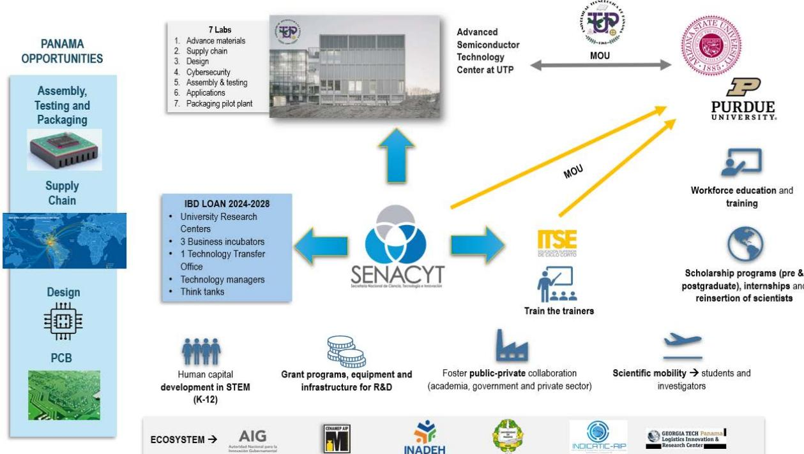  
Source: SENACYT (2024[31]), “Panama: Building a semiconductor ecosystem”, Presentation by SENACYT at the fourth meeting of the OECD semiconductor informal exchange, Secretaría Nacional de Ciencia, Tecnología e Innovación network, Mexico City, 12-13 February 2024.

## 3.2.2. Innovation and entrepreneurship

Panama would benefit from further developing its entrepreneurial ecosystem to facilitate the creation of new and innovative firms aimed at providing services and other inputs to semiconductor manufacturing firms. For example, the creation of local semiconductor design ventures or suppliers of specific material inputs and services would play a vital role in supporting the development of an ecosystem for semiconductors in Panama and the region.

Semiconductor manufacturing requires a significant number of different material inputs and services (see Annex A) and, given the vulnerabilities in certain semiconductor supply chains, the location from which these inputs and services are sourced is important. The existence of local suppliers in Panama could be particularly appealing for semiconductor firms that are considering investments in semiconductor manufacturing capacity. Therefore, supporting the development of a vibrant high-tech entrepreneurial ecosystem is critical: in the near term, the creation of local suppliers could enhance Panama's ability to attract investment from semiconductor firms; in the longer term, these investments could generate positive spillovers.

Data can provide some context to Panama's entrepreneurial environment. Over the past decade, Panama has demonstrated negative growth in the creation of new firms. However, during that same period, it has surpassed regional and OECD averages for new firm creation. The number of new registered limited liability firms created per year in Panama has dropped from over 30 000 in 2013 (12.25 new businesses per 1 000 working-age individuals) to only 13 000 (4.55 per 1 000 working-age individuals) in 2022 (World Bank, $2024_{[32]}$ ). In the high-tech sector specifically, the number of firms rose from 812 in 2018 to 912 in 2022, according to the National Statistics and Census Institute (INEC) business registry. The provinces of

Panamá and Chiriquí recorded the highest net entry of high-tech firms, with 46 and 36 new firms respectively. In contrast, Herrera and Los Santos registered the lowest net firm entry, with decreases of four and three firms respectively.

While Panama is producing fewer new firms each year, the number of annual new firms per working-age population is still high relative to other countries in the region. In 2022, Panama registered 4.55 new businesses per 1 000 working-age individuals, above the Latin America and Caribbean average of 3.7 and higher than Mexico (0.88) and Uruguay (3.13), yet lower than Chile (10.82) and Costa Rica (5.80) (World Bank, 2024[32]). Panama also performs better than the Latin American average for ease of starting a business, assessed by procedural burden and total cost (World Bank, 2020[33]).

While it is relatively straightforward to create a firm in Panama, new enterprises face a challenging path to success. Having high firm entry and exit rates can help introduce dynamism, foster innovation and support productivity gains, as they often indicate low entry barriers and suggest efficient resource allocation. However, the firm exit rate in Panama is relatively low. Between 2015 and 2022, the closed business density averaged 3.2 closures per year per 1 000 working-age individuals, never falling below 1.7 closures (World Bank, 2024[32]). During that same period, the global average was 5.6 closures. Panama's relatively low rate of firm exits could limit the reallocation of resources to more productive activities. Therefore, to strengthen business dynamism, policies should focus not only on facilitating firm entry but also on creating the conditions that enable surviving firms to expand and thrive (Calvino, Criscuolo and Menon, 2016[34]).

## Existing policies and programmes

To support the creation and growth of new firms, both the private sector and Panamanian government have pursued programmes aimed at nurturing entrepreneurship.

Through the Authority for Micro, Small and Medium-Sized Enterprises (Autoridad de la Micro, Pequeña y Mediana Empresa, AMPYME), Panama's government offers technical support, training and some capital for entrepreneurs, although the budget for these schemes is limited. AMPYME is responsible for the National Business Development System (Sistema Nacional de Fomento Empresarial, SNFE), a technical unit that firms can join via a free registration process. After registering, new firms can access funds, including a technical assistance and training fund, a seed capital fund and a microfinancing fund (AMPYME, 2024[35]). The seed fund offers entrepreneurs who successfully complete a competitive evaluation process up to USD 2 000 in grants for fixed assets, raw materials and inputs (AMPYME, 2024[36]). Although the relatively small value of this seed funding is not necessarily suitable to support high-tech entrepreneurship, it can nonetheless make an important contribution to self-employment initiatives and micro or small enterprises.

To access capital from SNFE funds, entrepreneurs are required to participate in AMPYME training programmes (AMPYME, 2024[36]). These programmes include technical training to promote business creation, management and business growth, as well as specifically targeting young, female and student entrepreneurs (AMPYME, 2024[37]). AMPYME has also partnered with Visa to support micro, small and medium-sized businesses with their digital transformation and online payments (El Capital Financiero, 2022[38]).

In addition to AMPYME's resources, SENACYT has annual calls for grants for new, innovative and scalable businesses. For example, in August 2025, SENACYT launched the Panama Innovates (Panamá Innova) scheme to invite grant applications from innovative ventures. For the first time, the call for grants explicitly mentioned semiconductors as one of the eligible sectors. SENACYT offers a maximum grant of USD 150 000 per project (SENACYT, 2025[39]). SENACYT also provides capacity-building programmes for entrepreneurs (SENACYT, 2024[40]). Through these mechanisms, it funds entrepreneurial activity in high-tech areas. Section 3.2.1 contains information on additional SENACYT funding programmes, with a focus on R&D.

The City of Knowledge (Ciudad del Saber) defines itself as an “innovative community” and brings together a cluster of research and education organisations, firms and non-governmental organisations (NGOs) in Panama City (Box 3.6). The City of Knowledge provides a range of services, including its Innovation Center for start-ups. The centre in its current form dates to 2014, although the City of Knowledge has provided start-up incubation support since 2000. It currently offers four programmes for entrepreneurs: the incubation programme for early-stage start-ups; the acceleration programme for more mature start-ups; a programme for female-led ventures; and a programme for social entrepreneurship, often with a focus on humanitarian or cultural causes (Ciudad del Saber, 2023[41]).

## Box 3.6. The City of Knowledge

The City of Knowledge is a complex of more than 200 buildings across 141 hectares located on the site of the former Fort Clayton United States military base in Panama City, close to the Panama Canal. The City of Knowledge was established under Decree Law No. 6 of 1998 and today hosts 81 high-tech firms, 27 academic institutions offering 150 programmes, 18 United Nations agencies and programmes and 39 international organisations and NGOs. SENACYT is also headquartered in the City of Knowledge. The City of Knowledge is managed by the private, non-profit City of Knowledge Foundation (Fundación Ciudad del Saber).

The City of Knowledge provides its members with office space, laboratories, internet access, reliable power and other infrastructure and utilities. In addition, it offers a generous range of tax exemptions and a flexible immigration regime, analysed in greater detail in Sections 3.2.3 and 3.3.5 respectively.

Source: Ciudad de Saber (2023[41]), “25 años: Hacia la utopía posible”, https://issuu.com/ciudadaddelsaber/docs/libro-25-cds-issuu.

The incubation programme provides four months of training to start-ups at the minimum viable product stage. The City of Knowledge Innovation Center offers the training in partnership with Bridge for Billions, an international programme that provides an online incubation platform for early-stage ventures. To date, more than 200 entrepreneurs and over 58 start-ups have completed the incubation programme (Ciudad del Saber, 2025[42]). The acceleration programme is a three-month programme for start-ups that have already developed a proof of concept and a clearly defined roadmap for growth. The acceleration programme makes available seed funding for selected start-ups. As of 2022, the City of Knowledge had invested USD 520 000 in 18 start-ups (Ciudad del Saber, 2023[41]). According to stakeholders interviewed for this report, some start-ups that have received seed capital from the City of Knowledge go on to receive matching funds from SENACYT.

AMPYME, SENACYT and the City of Knowledge Innovation Center all support entrepreneurship and nurture start-ups in Panama through slightly different mechanisms. In theory, these support mechanisms could also be adapted to support entrepreneurship in the ecosystem for semiconductors.

Panama has also worked to promote innovation and entrepreneurship through policies related to IP. The generation of IP and its protection through patents serves as a common proxy for measuring an economy's level of innovation. Applications filed under the Patent Cooperation Treaty (PCT) – a proxy for high-potential patents – spiked in Panama in 2016 and 2018 (see Section 2.1.4 in Chapter 2) and SENACYT credits this major upwards trend in PCT applications to an initiative at UTP financed by the Development Bank of Latin America and the Caribbean (CAF). CAF and SENACYT partnered to offer capacity-building workshops at UTP to generate technological patents using the CAF Method for the Accelerated Development of Technological Patents (Box 3.7), which then expanded to a programme offered to researchers and private sector professionals (CAF, 2016[43]; UTP, 2017[44]). Given the initial surge in PCT applications in 2016 and

2018 that can be attributed, at least in part, to this programme, Panama could consider pursuing similar capacity-building workshops again in the future.

## Box 3.7. The CAF Method for the Accelerated Development of Technological Patents

CAF collaborated with SENACYT to generate an increase in the number of technological patents in Panama. Week-long capacity-building workshops were offered at UTP beginning in 2016 and were available to participants from the university and business communities.

The CAF-led training emphasised the identification of patentable ideas, the transformation of concepts into patentable formats and, finally, the filing of inventions through the PCT. SENACYT committed USD 800 000 to finance the patenting process for ideas that emerged from these workshops (CAF, 2016[45]).

Ultimately, the first two editions of the workshop in 2016 and 2017 generated 220 patentable concepts, enough to merit a third iteration in 2018 (CAF, 2018[46]).

Sources: Information provided by Panama in the policy questionnaire used for this report; CAF (2016[45]), “Panama aspires to become one of the countries with the largest number of technological patents in the world”, https://www.caf.com/en/currently/news/panama-aspires-to-become-one-of-the-countries-with-the-largest-number-of-technological-patents-in-the-world/; CAF (2018[46]), “CAF and SENACYT promote generation of innovative technology with a global approach”, https://www.caf.com/en/currently/news/caf-y-senacyt-promueven-la-generacion-de-tecnologia-innovadora-con-enfoque-mundial/ (accessed on 9 October 2025).

## Planned policies and programmes

Developing an entrepreneurial ecosystem also requires fostering an entrepreneurial culture, strengthening technical support for start-ups, and efforts to promote technology transfer and the commercialisation of innovation. In Panama, researchers, universities and research centres struggle to take advantage of knowledge creation and transfer, including through IP, as illustrated by the patent data shown in Section 2.1.4 in Chapter 2.

To address these IP challenges, Panama is undertaking several initiatives. The General Directorate of Registration of Industrial Property (Dirección General del Registro de la Propiedad Industrial, DIGERPI), which is affiliated with the Ministry of Commerce and Industries (MICI), is developing a draft law that seeks to harmonise IP policies and technology transfer regulations across different institutions. If approved, this draft law is expected to strengthen Panama's IP and technology transfer capacities with the aim of fostering technological entrepreneurship.

In addition, in 2023, Panama received approval from the Inter-American Development Bank (IDB) for a USD 25 million investment loan, with Panama providing additional financing of USD 12.5 million, to foster research and innovation for productivity (IDB, 2023[47]). More specifically, “Component 2: Business innovation and entrepreneurship” of this IDB loan aimed to fund the creation or expansion of at least three technology transfer offices to support researchers at research centres and higher education institutions to take full advantage of the IP generated (IDB, 2023[48]). Furthermore, the loan will support the training of at least 15 technology and entrepreneurship managers.

The IDB loan will also finance three incubators to support start-ups in the fields of ICT and biotechnology. Two of these incubators will be based in the City of Knowledge and on UTP's central campus. $^{8}$ These investments are expected to improve further Panama's IP management, facilitate the commercialisation of research and technology and link Panama's knowledge-generating institutions with the productive sector.

The IDB loan will build on an ongoing project to develop Panama's start-up incubation and acceleration ecosystem. Since 2021, SENACYT has been working with the City of Knowledge to support the expansion of high-impact incubation. The two organisations signed a co-operation agreement to collaborate on their Programme for Strengthening Incubators' Methodology and Training. As part of this programme, the City of Knowledge Foundation and the University of Texas at Austin selected five high-potential Panamanian start-ups to visit and learn from Austin's innovation ecosystem. As a result of a trip to Austin, two of the start-ups, Fitwave (sports technology) and PROM Counselors (education technology), received recognition from start-up accelerator Sputnik ATX. PROM ranked in the top 60 out of 1 200 applications and Fitwave was 1 of only 5 start-ups selected to receive investment of USD 100 000 and join the Sputnik ATX acceleration programme (SENACYT, 2023[49]).

The next phase of this incubation programme would be funded by the IDB loan. Resources from the loan and part of SENACYT's budget would finance further projects selected for incubation and acceleration. The growth of a vibrant incubation and acceleration ecosystem could also benefit entrepreneurs or researchers who might wish to start a semiconductor-related start-up, for example in the fields of semiconductor design or semiconductor materials and services.

## Recommendations

Panama faces important challenges as it seeks to develop an entrepreneurial ecosystem adjacent to the semiconductor value chain. Currently, the opportunities for start-ups in Panama exist primarily in the areas of tourism or logistics (SENACYT/AU Austin, 2022[50]). Panama's lack of a sizeable manufacturing sector and the dominance of the services sector (see Section 2.1.2) may constrain the development of innovative and high-tech manufacturing start-ups.

In addition to the lack of an established manufacturing sector or domestic semiconductor industry, new enterprises that could contribute to the semiconductor value chain may struggle to secure the necessary funding to scale up. Both government and private sector programmes exist to connect entrepreneurs with resources, provide training and invest (limited) seed capital. However, Panama would benefit from a more co-ordinated investor network to help scale up small and medium-sized enterprises (SMEs).

Furthermore, some of the government grant programmes for entrepreneurs change annually, based on evolving priorities and funding availability. As a result of this policy uncertainty and the shifting government programmes, only a limited number of Panama's new enterprises are able to access early-stage funding and the support necessary to scale up, even though many new enterprises are created in Panama each year (SENACYT/AU Austin, 2022[50]).

Panama could use several tools to facilitate access to finance for its start-ups and SMEs, including those in the semiconductor industry and adjacent industries. For example, Panama could consider establishing a dedicated early-stage financing vehicle to support the development of local innovative firms, including those providing material inputs and services to semiconductor businesses, as well as start-ups in semiconductor design. $^{9}$ The financing instrument could take the form of a public-private seed co-investment fund with the appropriate design to leverage private capital (Wilson and Silva, 2013 $^{[51]}$ ). The specific design of such an instrument would benefit from a detailed analysis of the entrepreneurial and seed capital ecosystems in Panama to identify amongst other aspects:

\- whether public-private investment should be made pari-passu (i.e. on the same terms) or whether there should be asymmetric funding between the public and private sector to upside leverage or downside protection to the private investors.

\- whether the fund should have stringent constraints on sectoral investments or allow fund managers to optimise allocation within predetermined boundaries.

\- whether any tax incentives to encourage the private sector to invest would be warranted, including tax incentives for investments in start-ups and incentives on capital gains tax provisions, rollover and carry-forward of gains or losses: for example, Panama already offers reduced capital gains tax rates to firms operating in certain special tax regimes (see Section 3.2.3) so the proposed early-stage financing vehicle must ensure that it leverages existing tax incentives to avoid duplication.

\- considerations about the legal structure of the fund, including whether it would be a limited liability partnership and whether it would have tax flow-through (taxes levied on the investors instead of the fund/partnership).

In addition to this early-stage financing vehicle, Panama could also consider a formal initiative to attract seed and early-stage capital from the private sector. There seems to be a limited number of sources of seed funding for small and new ventures, despite the availability of both foreign and domestic capital (see Section 2.1.4). A programme to attract capital for semiconductor ecosystem start-ups and SMEs could build on the establishment and activity of the National Fund for Semiconductors, in co-ordination with PROPANAMA, the investment promotion agency.

Promoting the development of formal networks of entrepreneurs, business angels and early-stage investors focused on semiconductors and other high-tech sectors could complement the abovementioned financing instrument for semiconductor ecosystem start-ups. The development of such an investor network would benefit from the forthcoming database, managed by UTP, that actively tracks Panamanians studying semiconductor-related fields both within the country and abroad (see Section 3.3.4).

Another possible option available to Panama and its regional partners would be to establish a regional capital fund of funds, in collaboration with international financial institutions. The European Investment Fund is one example of a regional fund helping develop risk capital markets and support entrepreneurship and firm growth in the European Union. A regional fund in Central America would provide opportunities to foster collaboration and harness synergies between the strengths and capabilities of different countries in the region and help unlock capital for investment in promising regional semiconductor-related projects. A regional fund would also require a pre-determined exit strategy so that, in the long term, private investors take the lead in developing the region's risk capital market.

To complement these financial mechanisms, Panama could also look to strengthen the technical support for start-ups and expand the capacity of existing start-up incubators and accelerators. Implementing SENACYT's plans for additional business incubators and technology transfer offices, supported by a loan from the IDB, would be an important step in this direction. Panama could also consider leveraging funding from the National Fund for Semiconductors to support capacity building for start-ups within the semiconductor ecosystem.

Panama could also look to develop a dedicated platform with centralised information on government resources and programmes designed to support the commercialisation of innovation, business creation procedures and existing support for start-ups and SMEs. Panama should also encourage entrepreneurship more broadly, to promote an entrepreneurial culture through information programmes for students (including in secondary education), researchers and the broader population, expanding on existing initiatives by SENACYT.

This type of dedicated platform and information programmes could be integrated into the one-stop shop for semiconductors and microelectronics that MICI is responsible for establishing, in line with Executive Decree No. 7 of 2024 (MICI, 2024[24]).

## 3.2.3. Business support and business environment

Panama offers a comprehensive, albeit slightly overlapping, system of tax incentives to support firms operating in Panama and attract multinational firms. Many of Panama's business support policies and programmes are the result of initiatives to develop specific sectors of Panama's economy, including manufacturing and attract the headquarters of multinational corporations.

In addition to this direct fiscal support to businesses, Panama also provides indirect support through the streamlining and digitisation of government services to increase the ease of doing business. Both the direct fiscal support and the improvements to the country's business environment could also benefit firms in the semiconductor value chain.

## Existing policies and programmes

Executive Decree No. 7 of 2024 explicitly states that semiconductor and microelectronics firms should seek to access the tax incentives available under the Special Regime for Multinational Headquarters (SEM) and the Special Regime for Manufacturing Services for Multinational Companies (Normativa de las Empresas Multinacionales para la prestación de servicios Relacionados a la Manufactura, EMMA) (MICI, 2024[24]).

SEM is intended for multinationals looking to establish their regional headquarters or administrative offices in Panama. To be eligible for the regime, the multinational must have assets of at least USD 200 million or provide services to at least seven of its subsidiaries. It must also receive the SEM licence from MICI (MICI, 2024[52]). Since SEM was established by Law 41 of 2007, $^{10}$ 186 firms have obtained a licence to operate under the regime – including Ericsson, Huawei, LG, Philips, Samsung, Sony and other high-tech firms – representing USD 1.24 billion in investment (MICI, 2025[53]; 2024[54]). It is important to note that SEM does not require these firms to carry out their manufacturing activities in Panama. Instead, multinationals under the regime are permitted to provide services to their international subsidiaries or business group, such as the management of firm operations, logistics and storage services, accounting, the development of blueprints for designs or construction, technical, financial and administrative assistance, and some forms of R&D of products and services (MICI, 2024[55]).

The second regime, EMMA, has a greater focus on manufacturing, as it aims to attract investment from manufacturing firms looking to establish new manufacturing or distribution facilities in the region. Multinational corporations are eligible for EMMA on the condition that their total assets are at least USD 75 million or that they provide services to at least three affiliates or subsidiaries. Corporations must also receive their EMMA licence from MICI. The licence entitles firms to provide their affiliates in the same business group with services including, but not limited to: product manufacturing; assembly, packaging, maintenance and repair; analysis and testing; product development; research or innovation; logistics, storage and distribution (MICI, 2024[56]). This suggests that firms involved in semiconductor ATP – a part of the value chain that Panama is expected to target – would be eligible to operate under EMMA. The regime was established in 2020 by Law 159. As of 2024, only two firms had obtained their licences to operate under EMMA (MICI, 2024[57]). Several factors might contribute to the low demand from firms for the regime, including the dominance of services over manufacturing in the Panamanian economy, and the fact that EMMA is a newer regime that is less well established than other SEZs (see below), both in Panama and elsewhere in the region.

Table 3.2 summarises selected tax incentives under SEM and EMMA. Other tax incentives for some of Panama's SEZs are analysed later in this section. It should also be noted that investments under both regimes are eligible for protection under Law 54 of 1998 on the Legal Stability of Investments, which "freezes" the legal and regulatory conditions at the time the investment is registered so that the investment is not affected by subsequent changes to, for example, tax or labour laws for a period of ten years (MICI, 1998[58]).

While the regimes can apply to firms operating in any geographic location within Panama, other tax incentives depend on a firm's location. For example, Panama's three leading SEZs – the City of Knowledge (see also Section 3.2.2), Colón Free Zone and Panamá Pacífico – require firms to be physically located within them.

Table 3.2. Comparison of SEM and EMMA

<table><tr><td></td><td>SEM</td><td>EMMA</td></tr><tr><td>Legislation</td><td>Law 41, 2007; Law 45, 2012; Law 57, 2018</td><td>Law 159, 2020</td></tr><tr><td>Eligibility</td><td>Multinational corporations with:USD 200 m or more in total group assets or 7 or more subsidiaries or associated entities; andSEM licence, granted by MICI.</td><td>Multinational corporations with:USD 75 m or more in total group assets or 3 or more subsidiaries or associated entitiesEMMA licence, granted by MICI.</td></tr><tr><td>Activities</td><td>Primarily “back office”, administrative activities:Operations managementLogisticsStorageAccountingTechnical, financial or administrative assistanceAdvertisingR&amp;D of products and services.</td><td>Primarily manufacturing-related activities:Product manufacturingAssembly and packagingMaintenance and repairAnalysis and testingProduct developmentResearch and innovationStorage and distribution.</td></tr><tr><td>Number of firms</td><td>186</td><td>2</td></tr><tr><td>Corporate income tax (%)</td><td>5</td><td>5</td></tr><tr><td>ITBMS (equivalent to value added tax, VAT) (%)</td><td>0 (for services provided to firms overseas)</td><td>0 (for services provided to firms overseas)</td></tr><tr><td>Capital gains tax (%)</td><td>2</td><td>2</td></tr><tr><td>Import tax (%)</td><td>0</td><td>0</td></tr><tr><td>Dividend, complementary and branch profit taxes (%)</td><td>0</td><td>0</td></tr></table>

Notes: By way of comparison, the standard tax rates for firms in Panama (i.e. those that do not benefit from special tax incentives) are as follows: corporate income tax: 25%; ITBMS: 7%; capital gains tax: up to 10%. In general, income derived from local Panamanian operations is subject to income tax; foreign sources of income are not taxable. This table includes only selected tax incentives. For the full list of tax incentives, please consult the relevant legislation. SEM and EMMA also offer labour incentives, which are analysed in Section 3.3.5.
Sources: OECD analysis of AmCham Panama (2024[59]), Doing Business in Panama, 2024-2025, https://panamcham.com/es/doing-business-panama-report-nueva-edicion; MICI (2024[60]), “EMMA-Beneficios”, Ministerio de Comercio e Industrias.

Colón Free Zone was established in 1948, and its legal framework is set out in Law 8 of 2016. More than 2 600 firms operate within Colón Free Zone, which is situated over more than 1 000 hectares on the Caribbean side of the Panama Canal. Recently, Law 412 of 2023 expanded the list of authorised activities for firms in Colón Free Zone to include the manufacture of high-technology products and components, services related to the establishment and development of centres for scientific research and innovation, and services related to supply chain management (Asamblea Nacional, 2023[61]). Firms with an operating permit for Colón Free Zone are exempt from a wide range of taxes including, but not limited to, corporate income tax, import and re-export taxes, sales tax and production tax, property transfer tax and property tax on land.

As outlined in the previous section, the City of Knowledge hosts more than 200 firms, research, education and academic institutions, intergovernmental and non-governmental organisations, with an emphasis on science and technology. To operate in the City of Knowledge, organisations must submit a detailed proposal to the City of Knowledge Foundation explaining their objectives, the nature of their activities and how these align with the goals of the City of Knowledge. Organisations registered with the City of Knowledge benefit from exemptions on import tax and ITBMS (equivalent to VAT) on machinery, goods and supplies necessary for project development. They are also exempt from taxes on the transfer of funds abroad, when carried out for the purposes of the project. Organisations active in high-technology projects also benefit from exemption on corporate income tax and other direct, indirect and national taxes, and taxes on capital, including patent or license taxes (AmCham Panama, 2024[59]). These incentives last for 25 years and can be renewed. Organisations operating within the City of Knowledge also benefit from strong connectivity provided by fibre optic technology and a reliable electricity supply (Business Panama Group, 2025[62]).

Panamá Pacífico SEZ has attracted over 300 firms, focused primarily on logistics and distribution, maritime and aviation, the film industry and high-tech manufacturing. Located close to Balboa Panamá Pacífico International Airport, the SEZ's main tax incentives are set out in Law 41 of 2004, which exempts firms from ITBMS (VAT), import taxes or duties, export and re-export tax and stamp duty. Additionally, firms operating in the sectors listed in Article 60 of the law – which includes the manufacture of high-tech products or components – benefit from additional exemptions on corporate income tax and dividend and complementary taxes (Asamblea Legislativa, 2004[63]). Panamá Pacífico also offers reliable utilities infrastructure to its firms and high-speed connectivity (Panamá Pacífico, 2023[64]).

In addition to these three specific SEZs which tailor their incentives to support certain sectors, Panama also offers a more generic, one-size-fits-all regime of free trade zones (zonas francas, FTZ) to promote export-oriented manufacturing and services. These FTZs are exempt from corporate income tax on some goods and services sold internationally – including high-tech products – but corporate income tax is levied on income from goods and services sold domestically, within Panama. Firms in the free zones are also exempt from customs duty on inputs and products required for the firms' operations and face a dividend tax rate of 5% (AmCham Panama, 2024[59]). As of May 2025, Panama had 16 active free zones and 5 under development (GA Tech Panama, 2025[65]). Table 3.3 compares the main tax incentives of the SEZs and the FTZs. Their labour incentives are analysed in Section 3.3.5 below.

As with SEM and EMMA, Article 16 of Executive Decree No. 7 of 2024 also encourages semiconductor firms to make use of Panama's SEZ and FTZ incentives (MICI, $2024_{[24]}$ ). However, this is an indication of the potential complications arising from Panama's overlapping incentives regimes: a firm can be eligible for both SEM and EMMA as well as the SEZ regimes. Despite the generosity of Panama's special regimes, there is a risk of administrative complexities or confusion for prospective investors.

In addition to the special tax regimes analysed in Tables 3.2 and 3.3, Panama also offers tax incentives for certain types of firms. For example, in order to incentivise the creation of new domestic businesses and the formalisation of informal entrepreneurial activity, Executive Decree No. 145 of 2020 offers a two-year tax exemption for SMEs (as defined in Figure 2.4 in Section 2.1.2) that register with the AMPYME business registry (Government of Panama, 2020[66]). Furthermore, Law 189 of 2020 modified the Panamanian tax code, allowing businesses classified as SMEs and earning under USD 500 000 per year to qualify for a progressive corporate income tax rate ranging from $7.5\%$ to $22.5\%$ (Government of Panama, 2020[67]). For context, the standard corporate income tax rate in Panama is $25\%$ on income earned from Panamanian operations.

Beyond direct business support through tax incentives, Panama also looks to support firms by improving and streamlining the country's business environment. For example, Panama received a loan of USD 60 million from the IDB in 2022 and a USD 350 million commitment from CAF in 2021 for digital transformation of the public and private sectors, including the digitalisation of government services such as business and tax administration (IDB, 2022[68]; CAF, 2021[69]).

In addition to this funding, the 2019-2024 Strategic Plan for Government included a list of priorities for digital government, many of which centred around business support (Government of Panama, 2019[70]). Among these priorities were a full digitalisation of tax payments, a reduction of excess procedures in government processes and building a digital portal specifically for SMEs (Government of Panama, 2019[70]). The National Authority for Government Innovation (AIG) has co-ordinated many of Panama's modernisation and digitalisation initiatives. As set out in Table 3.1 above, the AIG is also a member of the new Commission for Innovation in Microelectronics and Semiconductors (CIMS).

Table 3.3. Comparison of Panama's special economic zones and free trade zones

<table><tr><td></td><td>Colón Free Zone</td><td>City of Knowledge</td><td>Panamá Pacífico</td><td>Free trade zones</td></tr><tr><td>Legislation</td><td>Law 8, 2016Law 412, 2023</td><td>Decree Law No. 6, 1998</td><td>Law 41, 2004Law 31, 2009Law 3, 2015Law 66, 2018</td><td>Law 32, 2011</td></tr><tr><td>Number of firms</td><td>2 649</td><td>248</td><td>365</td><td>148</td></tr><tr><td>Corporate income tax (%)</td><td>(25 on income earned inside Panama)</td><td>0 on income from authorised activities (including R&amp;D)</td><td>0 on income from authorised activities (including high-tech manufacturing)</td><td>(25 on income earned inside Panama)</td></tr><tr><td>ITBMS (equivalent to VAT) (%)</td><td>0 on exports or imports intended for re-export</td><td>0 on goods required for project development</td><td>0 on goods required for project development</td><td>0 for goods and services required for operations within the free zones, or intended for re-export</td></tr><tr><td>Import tax (%)</td><td>0</td><td>0 on goods required for project development</td><td>0</td><td>0</td></tr></table>

Notes: By way of comparison, the standard tax rates for firms in Panama (i.e. those that do not benefit from special tax incentives) are as follows: corporate income tax: 25%; ITBMS: 7%; capital gains tax: up to 10%. In general, income derived from local Panamanian operations is subject to income tax; foreign sources of income are not taxable. This table only compares incentives relating to three main taxes. Please note that firms in Panama are exempt of corporate tax on income earned from activities outside of Panama, whether derived from the sale of goods or the provision of services performed abroad.

The tax exemptions shown in the table (including in the Colón Free Zone, Panamá Pacífico, Free Trade Zones and the City of Knowledge) apply only to authorised activities expressly listed in the legislation governing each regime. Activities outside the authorised scope remain subject to the standard corporate income tax. Access to and maintenance of benefits may additionally require compliance with economic-substance requirements (e.g. adequate personnel, assets and decision-making functions). ITBMS and import-duty exemptions apply only to goods and services required for authorised operations or for re-export activities, depending on each regime's framework.

For the full list of tax incentives, please consult the relevant legislation. Labour incentives are analysed in Section 3.3. The number of organisations operating in the City of Knowledge includes firms, government agencies, NGOs, intergovernmental agencies and universities.

Sources: OECD analysis of Panamanian legislation and AmCham Panama (2024[59]), Doing Business in Panama, 2024-2025, https://panamcham.com/es/doing-business-panama-report-nueva-edicion; GA Tech Panama (2025[65]), “Vistazo General”, Portal https://logistics.gatech.pa/plataforma-logistica/activos-logisticos/regimenes-especiales-de-inversion/regimenes-especiales/zonas-

As of 2023, AMPYME has digitalised its processes for SMEs. Registration for the business registry is now digital, and additional information and applications for financial support programmes can be accessed via the Panamá Digital portal (AMPYME, 2024[71]).

The General Directorate of Revenue (Dirección General de Ingresos, DGI), part of the Ministry of Economy and Finance, has also digitalised much of Panama's tax collection and payment through the ETAX 2.0 system, which firms and individuals can use to register and pay taxes online (DGI, 2024[72]). This is complemented by an active social media outreach campaign to inform taxpayers of digital procedures for tax payment.

The Georgia Tech Panama Logistics Innovation and Research Center (GTP) is another important entity working to improve Panama's logistics and trade systems and broader business environment. Overseen by SENACYT, the GTP is a non-profit private interest foundation dedicated to developing Panama's logistics and trade capabilities, which could become key for semiconductor supply chain resilience. The GTP provides models of Panama's existing logistics network, develops tools to support logistics decisions and trade analytics and creates data repositories.

Despite Panama's sophisticated digital customs system, consultations with stakeholders carried out for this report indicated that the existence of separate customs regimes for each of the different SEZs may make tracking shipments across regimes challenging. One stakeholder suggested that different digital customs systems and dashboards would pose a challenge for the semiconductor industry, as it would be challenging to track individual components across separate customs workflows.

Additionally, gaps remain in the approvals and permitting process for certain materials that may be important to the semiconductor industry. These gaps are partly a result of the fact that permitting processes still run through individual ministries, rather than through a centralised customs authority, and are not yet fully digitalised. One example is that the registration for imports of hazardous chemicals is processed through the Ministry of Health and not through the National Customs Authority (ANA). If Panama does decide to make ANA responsible for the centralisation of this permitting process, it would need to ensure that either ANA's personnel is suitably equipped with the right expertise to assess hazardous chemicals and other types of imports, or that ANA is capable of close co-ordination with the Ministry of Health and other relevant government agencies.

Finally, also in relation to customs, Panama is developing a revised legal framework to provide increased confidence and certainty to firms handling dual-use materials. Some semiconductors and their inputs can be classified as dual use, since they can have both civilian and military applications. Panama is aiming to harmonise its regulations with international frameworks and best practices – working with the United States Department of State Export Control and Related Border Security (EXBS) programme – to promote both operational agility for firms and guarantees for national security.

## Recommendations

Panama has digitalised many – but not all – of the critical business support procedures, including tax collection and SME resources, and the previous 2019-2024 Strategic Plan for Government indicated that completing the digitalisation process and reducing procedural burdens were high priorities (Government of Panama, 2019[70]). However, semiconductor firms may find gaps in certain registration or administrative processes with the Government of Panama.

Ongoing efforts towards the modernisation and digitalisation of government services could provide an opportunity to combine and digitalise all platforms used for international trade, including customs, those used by SEZs and FTZs, as well as all other entities that might need to be consulted for imports and exports (e.g. registration with the Ministry of Health for imports of hazardous chemicals). It would also be important to enhance efforts to digitalise all business creation and licensing processes, including the application and approval for special business incentives.

Currently, there are several regulations and special regimes that confer specific benefits for firms and investors meeting certain requirements. However, some of these regimes are challenging to identify, unclear and may overlap. For example, tax and labour incentives can be based on participation in an SEZ programme, EMMA or SEM, or both. Furthermore, customised incentives or SEZs could be considered for potential investors under different conditions, as described above.

Panama should consider simplifying the framework of incentives and work towards harmonisation and clearer communication to highlight the attractive business environment for semiconductor firms. A one-stop shop with information comparing the benefits and requirements of each regime would be helpful. Executive Decree No. 7, which has tasked MICI with creating a one-stop shop to provide information on procedures and requirements, technical support and inter-agency co-ordination for semiconductor sector investors, is a crucial step in this direction (see Section 3.1.2 for further details).

## 3.3. Human capital

Human capital development has been a longstanding priority of Panama's broader strategic push towards the manufacturing and high-tech sectors. Panama has a small manufacturing base, representing only $17\%$ of total employment in the industrial sector in 2022 (ILO, 2024[73]). Panama's education and skills systems and labour market face steep challenges to meet the human capital needs of the semiconductor industry. The country does not currently have a domestic semiconductor industry, so there is no existing job market for specialists pursuing advanced training in semiconductor-specific fields. With limited demand for semiconductor skills, or advanced industrial degrees in general, Panama faces the challenge of developing human capital in a sector with little to no current workforce demand.

As a result, Panama faces a “chicken-and-egg” problem: on the one hand, it is necessary to develop the semiconductor industry to create semiconductor-related jobs and demand for relevant talent; on the other, a pre-existing supply of semiconductor talent is a key consideration in the semiconductor industry’s investment decisions, particularly given the tight global labour market. Without a large pool of semiconductor talent, it could be a significant challenge for Panama to attract a major multinational semiconductor facility or develop a domestic semiconductor services industry capable of participating in the global value chain.

Talent can take considerable time to develop, so Panama could prioritise developing semiconductor-specific skills in anticipation of a domestic semiconductor industry. There are nevertheless important risks associated with developing semiconductor-specific talent without an existing semiconductor industry, including the opportunity costs associated with the focus on semiconductor skills, the potential for labour market imbalances and for brain drain. To mitigate the opportunity costs of focusing on the skills needs of the semiconductor industry, it would also be important to develop transferable skills that can be used in other industries, such as those outlined in Section 2.3.2.

To mitigate the risks of brain drain to other economies with more established semiconductor ecosystems, it would be important to combine higher education efforts with investment in semiconductor research, innovation and entrepreneurship (see Section 3.2.2) to stimulate the emergence of domestic semiconductor or semiconductor-related firms, thus providing opportunities for highly qualified individuals to remain in (or come back to) Panama. If implemented successfully, these types of actions could also start to overcome the chicken-and-egg problem outlined above.

Panama currently faces several systemic obstacles to human capital development, particularly for the highly and moderately skilled technical workforce necessary to support semiconductor ATP facilities. These obstacles include insufficient STEM and English language skills, a lack of university courses and vocational or technical certification programmes that train individuals to participate in the semiconductor industry, and a high degree of informality in the Panamanian labour market.

To build human capital, Panama must enhance its education pipeline, establish short-term certifications to help align the labour market towards semiconductor industry needs, develop specialised training programmes in partnership with the semiconductor industry and foreign institutions specialised in semiconductors, and simplify the process for multinational firms to hire talent from abroad. Panama could also focus beyond skills development with policies to enforce compliance with labour laws and encourage employment formalisation and workers' transition to the formal economy.

## 3.3.1. Primary and secondary education

Panama faces two significant challenges in primary and secondary education: fostering a high level of educational attainment nationwide – particularly in STEM subjects and English, which are foundational for semiconductor skills – and supporting the transition to skilled formal employment.

Educational attainment in Panama is relatively low, as the country struggles with high drop-out rates and faces challenges with students completing secondary education. In 2023, the mean level of schooling in Panama was only 10.68 years, equivalent to completing lower secondary education (UNESCO, 2023[74]). Meanwhile, according to the August 2023 labour market survey from INEC (n.d.[75]), $18.3\%$ of the workers had only attained primary education. Moreover, just $58\%$ of Panamanians aged 25 to 64 had completed secondary education in 2021, far below the OECD average of $82\%$ (World Bank, 2023[76]; OECD, 2023[77]).

To develop a more skilled workforce for semiconductors, Panama must enhance education in both STEM and English, starting from childhood. This requires both an increase in education investment and curriculum reform. Panama appears to be taking some positive steps in this direction. In 2023, Law 362 stipulated that, starting in 2024, Panama's annual investment in education should be at least $7\%$ of GDP. According to this law, $5.5\%$ of GDP would be allocated to the Ministry of Education (MEDUCA), public universities, the Panamanian Institute of Special Qualification (Instituto Panameño de Habilitación Especial, IPHE, for children with disabilities) and SENACYT (Government of Panama, 2023[78]). The remaining $1.5\%$ of GDP would go towards other programmes in the education sector.

In terms of curriculum reform, MEDUCA oversees Panama's curricula for primary and secondary public education and has been pursuing reforms to better align the curricula with the needs of Panama's evolving economy. Law 378 of 2023 established the framework for the implementation of Panama's Policy on Education for Sustainable Development, which sought to realign Panama's primary and secondary education with the skills and competencies necessary for Panama's future (Government of Panama, 2023[79]). Law 378 placed particular emphasis on curriculum reform, external partnerships and the training of teachers to better deliver STEM education and digital transformation (Government of Panama, 2023[79]). In addition, Law 380 of 2023 highlighted the key role of teachers in improving education quality and created the Institute for the Improvement and Wellbeing of the Educator (IPEBI), which is an AIP dedicated to the training and working conditions of teachers (Government of Panama, 2023[80]). The successful implementation of these reforms has the potential to better prepare teachers in primary and secondary education and ultimately support students to pursue technical and STEM education at the tertiary level.

While MEDUCA's mandate covers Panama's education system as a whole, SENACYT focuses on education and research related to science, technology and innovation (STI), including for primary and secondary schools. As indicated by the OECD Programme for International Student Assessment (PISA) test results in Figure 2.42, the performance of 15-year-old Panamanian students in mathematics and science is lower than their counterparts in Chile, Costa Rica, Mexico or Uruguay and well below the OECD average. Low achievement in mathematics and science in secondary education prevents from pursuing STEM in higher education. SENACYT manages several ongoing initiatives to address this challenge.

SENACYT's Department of Innovation in Science and Technology Learning pursues programmes and grants to increase interest and achievement in STEM. The We Build Mathematics programme, for instance, has trained teachers from different regions of Panama in the instruction of different fields of mathematics education, both in-person and virtually. By 2020, the programme had supported the training of more than 2500 teachers in both primary and secondary education (SENACYT, 2019[81]).

The same SENACYT department has also promoted the ongoing training of teachers in science and technology, and led to the creation of science clubs in primary and secondary schools to offer students an extracurricular space to study science through hands-on activities (SENACYT, 2024[82]). SENACYT has also promoted other extracurricular opportunities to develop technology-based learning in topics such as robotics and digital education. For example, the RoboCup Junior competition has allowed 1 621 students to improve their technical and teamwork skills over the past 5 years.

Furthermore, according to information provided by Panama for this report, SENACYT's Let's Do Science (Hagamos Ciencia) programme aims to improve science education for fourth- to sixth-grade pupils by training teachers and school leaders in science projects and best teaching practices, reaching 23 schools, 120 teachers and 3400 pupils over a 2-year cycle. SENACYT also promotes STEM skills development amongst even younger learners, by introducing children in kindergarten to the basics of mathematics, reaching 2 500 pupils and 120 teachers.

English language skills are also critical for managing specialised semiconductor equipment and engaging with suppliers and customers in the global semiconductor value chain. However, there is still significant room for improvement in English language attainment, as Panama ranked just 71st out of 113 countries in the most recent EF English Proficiency Index assessment (see Section 2.3.1). Moreover, consultations with stakeholders stressed the importance of continuing to invest in language skills, notably by increasing the number of English teachers.

One means of achieving this was the Bilingual Panama (Panamá Bilingüe) programme. Established by Law 18 of 2017, Bilingual Panama aimed to develop teacher capacity in English language instruction and increase the number of hours of English courses taught at the primary and secondary education levels (Government of Panama, 2017[83]). Bilingual Panama provided teachers with both English-language training in Panama and then sent them overseas to English-speaking countries for English immersion programmes at universities, with the aim of improving the teachers' levels of English and providing them with new teaching methods. According to one estimate, Bilingual Panama trained more than 9 500 teachers in English and received funding from CAF (CAF, 2019[84]).

Ensuring that students in primary and secondary education learn the fundamentals of the English language would also allow them to take advantage of the opportunities for English instruction offered at later stages of their education. For example, ITSE runs “English laboratories” for students and UTP grants them access to its Foreign Language Centre (see Sections 3.3.2 and 3.3.3 for further details).

## Recommendations

In 2020, only 294 students graduated in electronics from upper secondary level, of which 90% were men. This indicates considerable potential to develop the pool of talent for semiconductors by incentivising students, notably women, to enrol in relevant fields such as electronics (see Section 2.3.1 for details). To avoid expanding electronics education and skills at the expense of other fields important for Panama's development, Panama should focus on enhancing STEM education more broadly through, for example: teaching STEM skills from a very young age; engaging girls in STEM; promoting the use of technology-based teaching methods (including digital tools); promoting hands-on learning; introducing STEM role models; and providing students with real-world STEM applications. Panama should consider expanding the STEM programmes managed by SENACYT – subject to a successful evaluation of their impact – such as the Let's Do Science programme aimed at training teachers and school leaders in scientific research projects and best teaching practices.

Panama should invest in a dedicated English programme for teachers, including in partnership with foreign institutions. The country should consider setting national objectives for the number of STEM graduates by education level, their proficiency in English language and the competencies of teachers. It would be important to monitor and evaluate progress towards these goals, producing information and statistics on progress and outcomes that is published on a regular basis and with sufficient detail. Such data could help inform the assessment of progress towards STEM and English goals, and support the adjustment and improvement of curricula or create specific courses, as needed.

## 3.3.2. Tertiary education and relevant university programmes

At every stage of the semiconductor value chain, particularly design and fabrication, firms require workers with specific technical skills, typically acquired from advanced engineering university degrees. For ATP facilities, the demand for human capital can partially be met by specialised short-term training programmes, but there is still a need for highly skilled workers with advanced degrees to fill some roles. According to the August 2023 labour survey from INEC, only 29.4% of Panamanian workers completed university education, with just 17.5% of workers in the manufacturing sector reaching this level (INEC, 2023[85]). In terms of relevant semiconductor courses, in 2023, 1671 students were enrolled in electrical engineering courses, of which only 18% were women. Given Panama's lack of a domestic semiconductor ecosystem, the number of existing programmes to train a highly skilled semiconductor workforce is limited.

Panama's higher education system gives universities full autonomy over curriculum development and course offerings (RecoLATIN, 2019[86]). In Panama, there are both public universities, which are created by laws that grant them autonomy over academic activities, and private universities, which are created by “decree laws” as non-profit organisations to manage their own operations (RecoLATIN, 2019[86]). In response to challenges relating to the quality of higher education, Law 30 of 2006 created Panama’s National Council for University Evaluation and Accreditation CONEAUPA, presided over by the Minister of Education (Government of Panama, 2006[87]). This law was later replaced by Law 52 of 2015, which updated the responsibilities of CONEAUPA, as well as the processes for universities to achieve and retain higher education accreditation (Government of Panama, 2015[88]). CONEAUPA’s responsibilities are nevertheless restricted to evaluation and accreditation, and do not include curriculum development and course offerings.

Currently, the structure of CONEAUPA, the process for curriculum review and the emphasis on university autonomy do not give the Ministry of Education the ability to guide national programmes at the higher education level (RecoLATIN, 2019[86]). Although Law 52 of 2015 requires universities to update their courses every six years to reflect the latest scientific and technical developments, this may not be sufficient for universities to keep pace with the rapidly evolving field of semiconductors (Government of Panama, 2015[88]). Therefore, efforts to develop a workforce capable of supporting the semiconductor industry would need to be pursued through government-academia partnerships or institution-to-institution co-operation.

Currently, there are two main universities that are well positioned to provide training in areas of relevance to the semiconductor industry. UTP is a public university responsible for scientific-technological higher education. As of 2023, it had almost 27 000 students enrolled, with approximately 12 000 pursuing degrees related to the high-tech industry, such as electronic engineering, physical sciences and computer systems. Box 3.8 summarises UTP's process for updating its curricula. The University of Panama is the largest university in Panama with about 70 000 students in 2023. It offers courses and research in several different areas and includes a Faculty of Computing, Electronics and Communication. As explained in Section 3.1.1, both universities are represented on the new CIMS and contribute to the design and delivery of the forthcoming National Semiconductor Strategy.

Given that the semiconductor industry does not currently operate in Panama, educational partnerships with international universities are critical for Panama and its university sector to gain the experience and skills required to develop a semiconductor workforce. The government of Panama signed an MoU with ASU to promote co-operation in advanced technologies. The MoU identified six broad areas of co-operation, including but not limited to: developing technical and professional education programmes with Panamanian institutions; the joint development of programmes related to semiconductor and emerging technologies; the exploration of funding sources for developing the Panamanian workforce in these key sectors; and a feasibility study on establishing a Global Centre for Workforce Development in Advanced Technology in Panama (EOP, 2023[89]).

## Box 3.8. Curricula updates at the Technological University of Panama (UTP)

UTP conducts comprehensive reviews of its degree programmes and majors every five years. The reviews serve the dual purpose of accreditation for individual degrees and accreditation for the entire university.

During these reviews, UTP creates a database that captures the needs expressed by firms operating in the local ecosystem. The data are then compared with the range of academic programmes offered by UTP to identify any gaps or mismatches between the skills demanded by industry and the skills provided through UTP's educational offerings.

To address immediate skill gaps, UTP also provides flexible learning opportunities, including:

\- Short courses and diplomas: UTP offers courses ranging from a few weeks to two years. These short-term programmes meet areas of interest and needs of the industry.

\- Certifications and postgraduate degrees: Specialised programmes taught by subject matter experts, who may or may not be affiliated with UTP.

UTP's MoU with Panama's Chamber of Commerce of Multinational Companies also allows the university to understand these firms' skills needs and challenges, which further informs its curricula updates.

UTP's system for updating its curricula and filling immediate skills gaps could also allow the university to support the development of a domestic semiconductor workforce.

Source: Information provided by Panama in the policy questionnaire used for this report.

The MoU also encouraged ASU to identify opportunities to partner with specific government and academic institutions in Panama through additional agreements. Consequently, ASU signed a further MoU with UTP in 2024 to promote academic co-operation, the development of semiconductor training and research programmes, student mobility and exchanges of professors and faculty members (UTP, 2024[25]). As part of the ASU-UTP partnership, some of ASU's microelectronics programmes are now available to UTP for implementation, initially with ASU support but with the intention that these programmes can be delivered in the future by newly trained Panamanian talent. For example, ASU is offering semiconductor bootcamps and online micro-credential courses to some UTP students. Furthermore, ASU and UTP are working on the design and implementation of an English language programme specifically relating to the field of semiconductors. These efforts would build on UTP's existing Foreign Language Centre, which teaches English, French, German, Japanese, Korean, Mandarin and Portuguese.

A key part of the ASU-UTP partnership is the development of the Center for Advanced Semiconductor Technologies (C-TASC) on the UTP campus. C-TASC is Panama's flagship semiconductor R&D initiative, but it is also expected to have a significant impact on the development of semiconductor skills. It is anticipated that C-TASC will contain seven laboratories for activities across the semiconductor value chain, with equipment and infrastructure to offer applied training programmes. These facilities include plans for a clean room facility and pilot plant, offering professionals and students in Panama the opportunity to develop semiconductor-specific skills even without a domestic semiconductor industry (SENACYT, 2024[31]).

ASU also signed an agreement with SENACYT and Panama's Institute for Training and Use of Human Resources in 2024. The agreement makes Panamanian students – particularly those at UTP and ITSE – eligible to apply to ASU's bachelor's, master's and doctoral degrees and graduate and professional certificates in semiconductor-related disciplines. Their studies will be supported by a scholarship programme administered by UTP and SENACYT. The partnership aims to train 500 engineers and technicians over 5 years. In May 2025, SENACYT awarded 20 scholarships to Panamanian students to study master's or doctoral degrees in semiconductor-related fields at ASU (SENACYT, 2025[90]; ASU, 2024[26]). See also Box 3.9 for information on a range of SENACYT's scholarships.

Beyond the country's partnership with ASU, Panama also has agreements with the Chip Integration Technology Center in the Netherlands and Japan's Kyoto University (SENACYT, 2024[31]). UTP and Chiba University in Japan have trialled an academic exchange programme: in 2024, UTP professors provided online courses to Chiba University students which covered subject such as the Panama Canal and logistics; in return, three UTP students and one professor visited Chiba to learn about semiconductors, artificial intelligence and data science (UTP, 2024[91]). UTP is exploring institutional partnerships with three Costa Rican universities – Costa Rica Institute of Technology, the University of Costa Rica and Fidélitas University – to offer UTP students training from Costa Rican professors. SENACYT also supports programmes for stays and academic mobility, with 168 students and teachers in research stay activities in 2022. More recently in June 2024, the Ministry of Foreign Affairs signed an MoU with Purdue University in the United States, which covered semiconductor workforce development (MIRE, 2024[92]). These partnerships are central to Panama's strategy to increase the number of highly skilled graduates with semiconductor-specific skills.

# Box 3.9. SENACYT's scholarship programme for relevant academic fields

SENACYT has an annual budget of USD 29 million to support undergraduate and postgraduate scholarship programmes at national and international universities. In the past 20 years, SENACYT has provided 700 postgraduate scholarships (including at least 250 at PhD level) in fields related to STI. SENACYT's funding supports students to carry out studies in high-tech fields and seeks to identify and promote Panamanian talent in highly specialised fields, including semiconductors. The scholarship funds are complemented with additional resources to support research, including grants, equipment and infrastructure.

According to Law 475 of 2025, recipients of scholarships to study at international universities must return to Panama within 90 days of completing their studies. These students are then required to reside in Panama for the same length of time that they had been studying overseas with the SENACYT scholarship. If they do not return to and reside in Panama, they may be obliged to pay back, in full or in part, the value of their scholarship. This incentivises Panamanian students with SENACYT scholarships to return to Panama, bringing with them their skills and experience.

Once they have returned to Panama, the Programme for the Incorporation of Scholars (Programa de Inserción de Becarios) is designed to support students with SENACYT scholarships to integrate the Panamanian labour market. This programme helps SENACYT alumni enter the industry, as SENACYT funds 100% of their salary for the first year and 75% of their salary for the second. In 2022, 34 alumni were recruited to the programme. It might be important to consider whether the salary subsidy could lead to a moral hazard (for example, incentivising firms to hire SENACYT alumni even if they do not strictly need to carry out this recruitment and/or the alumni may not be the appropriate fit for the role). Nonetheless, this programme helps retain this talent in Panama by providing former students with employment opportunities in the high-tech industry, supporting knowledge transfer and providing the industry with highly specialised and up-to-date knowledge.

SENACYT also awards semiconductor-specific scholarships. As explained above, in May 2025, it awarded 20 scholarships to study advanced degrees in semiconductor-related fields at ASU.

SENACYT also supports teacher training with scholarships for training abroad. For example, four professors from UTP were recently trained in semiconductor ATP at the Chip Integration Technology Center in the Netherlands.

Source: Information provided by Panama in the policy questionnaire used for this report and Asamblea Nacional (2025[93]), Ley No. 475, https://www.gacetaoficial.gob.pa/pdfTemp/30308\_A/GacetaNo\_30308a\_20250625.pdf (accessed on 16 September 2025).

The ability to hire and recruit foreign professors can be a further factor limiting the development of Panama's high-tech workforce. This is the result of challenges relating to work permits, quotas on foreign workers which can require the approval of the Ministry of Labour and Workforce Development, accreditation and qualification requirements in Panama, universities' language requirements and other administrative procedures. However, the City of Knowledge (analysed in Box 3.6) is one exception to this, as it provides a streamlined process for hiring international professors and teachers, thereby facilitating a more diverse and international academic environment. The AIP model (see Box 3.5) also provides solutions for the hiring of foreign professors. Section 3.3.5 below provides a more detailed discussion on Panama's limits on foreign workers. Online courses provide an alternative option for tapping into foreign knowledge of semiconductor skills.

## Recommendations

It can be particularly challenging to tailor the university and tertiary education curricula to the needs of the semiconductor industry in the absence of such an industry. Panama should continue to include more higher education institutions – both domestic and international – in its partnerships for developing the semiconductor workforce, building on the strategy developed by SENACYT. The new C-TASC, with equipment and infrastructure to offer advanced training programmes, is a particularly important step to start developing semiconductor-specific skills in anticipation of a domestic semiconductor industry.

Tapping into the semiconductor knowledge available abroad through enhanced international collaboration is key to bringing in the necessary semiconductor-specific knowledge and helps tailor courses to the latest technological developments and industry needs. It is important to strengthen the engagement with ASU, Purdue University, Chiba University and Kyoto University, amongst others. Panama could also consider collaboration with higher education institutions with semiconductor-specific curricula in the region, such as the Costa Rica Institute of Technology or the National Technological Institute of Mexico. This collaboration could take the form of dual degrees for students to spend part of their education in these institutions, thus expanding the pool of semiconductor talent in the region. The system of scholarships provided by SENACYT for students and teacher training abroad (see Box 3.9) could support such initiatives. Panama could also consider supporting internships or work placements in the semiconductor industry overseas so that students and professionals can gain practical, first-hand experience. Just as SENACYT requires its scholars studying at international institutions to return to Panama, it would be critical to ensure that Panamanian interns overseas also return or support the emerging Panamanian ecosystem for semiconductors in some other way.

Panama should establish targets for the numbers of teachers and instructors in key semiconductor fields. Panama should also consider attracting university professors from other countries, by streamlining immigration procedures, to meet capacity that cannot be developed organically by training Panamanian professors in semiconductor-adjacent industries. Given institutional barriers to hiring professors from other countries – except under some SEZs and regimes such as the City of Knowledge – Panama should also consider alternatives, such as online courses, which can provide semiconductor-specific training at scale while universities in Panama develop semiconductor educational programmes with the requisite capacity.

## 3.3.3. Vocational education and training

Vocational education and training (VET) and short-term certifications can help address skills mismatches or underemployment in the labour market, as well as train individuals in the specific skills necessary to support the semiconductor industry. Although the share of graduates from non-university vocational education declined from 19.2% in 2012 to 16.7% in 2021 (INEC, 2023[85]), Panama has the basic institutional infrastructure to support a robust vocational training and reskilling programme. Panama has two entities responsible for co-ordinating technical and vocational education and continuing workforce education: ITSE, which focuses on advanced and specialised technical education, and the National Institute of Vocational Training and Training for Human Development (INADEH), which focuses on a broader set of vocational training programmes and workforce development.

ITSE offers two- or two-and-a-half-year courses belonging to one of four schools, including the School of Digital Innovation and School of Industrial Technology (ITSE, 2024[94]). Within the digital innovation school, students can choose one of the following courses: Big data and data science; Cybersecurity; Software development; or Artificial intelligence. Within the industrial technology school, available courses include Industrial electricity and Industrial maintenance. Courses are intended for students who have completed secondary education but choose to pursue a technical track over a university degree (ITSE, 2024[94]). Some of ITSE's two- to two-and-a-half-year courses could be adapted to help meet semiconductor industry labour demand. Courses are subject to an academic and technical evaluation every two years with the participation of industry and with the aim of adapting the curriculum to industry needs. In the absence of a domestic semiconductor industry, ITSE could initially seek the input and participation of the semiconductor industry elsewhere in the region, so that the curriculum reflects their needs. Panama could also benefit from its ongoing engagement with international fora working on semiconductors skills, such as the OECD Semiconductor Informal Exchange Network.

At the end of the 2024, ITSE had 3 094 students enrolled in its programmes; 63% were men and 37% were women. The School of Industrial Technology had 839 enrolled students (27% of the total) and the School of Digital Innovation had 523 students (17%), with 46% of students aged between 21 and 30 years old and 45% aged between 15 and 20 years old (ITSE, 2025[95]).

ITSE's training strategy combines a theoretical phase with practical, hands-on experience. ITSE collaborates with various industries such as ICT, logistics or aviation to provide students with internships or apprenticeship opportunities, which typically take the form of final projects or work experience with industry towards the end of their ITSE course. Currently, it appears as if ITSE only offers professional experience to its students towards the end of the course. Subject to the requirements of the local industry, there could be scope for ITSE to go further and offer dual education programmes, which combine academic studies in a classroom with professional experience in a firm throughout the duration of the programme. Although Panama does not currently have a semiconductor industry, ITSE could encourage the first cohorts of students to initially seek placements with firms in sectors with similar skills demand to semiconductors (see Section 2.3.2 and Figure 2.50).

ITSE, which is a member of CIMS (Section 3.1.1) and also part of SENACYT's semiconductors working group with UTP (Section 3.2.1), can support VET programmes for semiconductors and is expected to play an important role in the development of a technical programme for semiconductor ATP in Panama. As part of Panama's plans for semiconductor skills development, SENACYT launched an specialised short-cycle training in advanced electronic design, including a PCB design course delivered at UTP, covering industry standards (IPC), advanced PCB design for high-complexity environments, and signal integrity and electromagnetic interference (EMI) management, to strengthen technical capabilities and support integration into global value chains (SENACYT, 2026[96]). A “train the trainers” programme for ITSE instructors is currently being planned, focusing on a one-to-two-year technical training programme to be established in anticipation of the establishment of semiconductor manufacturing in Panama.

As part of its vocational training courses, ITSE requires the mastery of English language. Students must complete a minimum of five English courses to reach the equivalent of B2 level in the Common European Framework of Reference for Languages. ITSE's “English laboratories” provide students with the tools necessary to achieve this level of language proficiency and promote an interactive and participatory approach to language learning.

In addition to specialised technical training programmes provided by ITSE, Panama also offers short-term certifications through INADEH. INADEH targets a wider range of individuals compared to ITSE, including the unemployed, workers seeking to improve their skills and workers considering changing professions. INADEH has 25 centres located across Panama, offering more than 800 courses across 25 industries, including electromechanics, English language, ICT, mechanics for automobiles and mechatronics. This demonstrates INADEH's potential to deliver training that could address some of the semiconductor industry's workforce needs. INADEH courses take tens or hundreds of hours to complete, either in person or online (INADEH, 2024[97]). In 2024, INADEH trained 181 024 individuals (66% women and 34% men) and issued more than 125 000 certificates (INADEH, 2023[98]). Due to the short nature of most of its courses, INADEH can complement ITSE with more targeted training and certifications, as well as contribute to reskilling programmes.

## Recommendations

Without a domestic semiconductor industry, VET programmes with a focus on semiconductor skills might be particularly challenging during initial efforts to develop the semiconductor ecosystem. While focusing on similar skills in other sectors could be one avenue to pursue (see the discussion in Section 2.3.2), engaging in international collaboration with education institutions and industry abroad would likely be the most impactful strategy in the shorter term. Nonetheless, in such a scenario, it would be important for these Panamanian VET students on placements in education institutions or industry abroad to contribute to the development of Panama's semiconductor ecosystem. For example, in situations where these overseas VET placements are supported by public funding, Panama could consider imposing a similar set of conditions as the SENACYT scholarships to require VET students either to return to Panama to work or repay their funding (see Box 3.9).

Panama could enhance technical semiconductor skills by further strengthening VET programmes, building on the existing institutions and academic and industrial clusters. For example, ITSE and INADEH could work with Panamá Pacífico and the City of Knowledge to certify their employees for certain technical proficiencies and organise student placements with firms.

Reskilling programmes tied to apprenticeships could also help firms fill the need for workers and be more responsive to skills demand. Panama should consider dual education programmes – in which students combine classroom instruction with on-the-job training in a firm – to develop semiconductor-specific dual education tracks in the future.

## 3.3.4. Labour markets and skills

Beyond the need to develop a labour market for a nascent industry, Panama currently faces several structural labour challenges. Informal labour is relatively widespread in Panama. Informality – which refers to employed workers not affiliated to social security systems or without a written work contract – affected 49% of Panamanian workers in 2024. This is slightly higher than the regional average for Latin America and the Caribbean (47.6%) and significantly higher than countries such as Costa Rica (37%) (ILO, 2025[99]). Informal labour is associated with low-skilled, low-productivity jobs, which helps to explain why, as of 2019, the average wages for Panama’s informal sector were approximately half those in the formal sector (World Bank, 2023[76]). The results in Section 2.3.3 point in the same direction, showing that individuals without a written contract earn considerably less than those with a permanent formal contract.

The relatively high rate of labour informality in Panama reduces the available pool of skilled talent for the semiconductor industry. According to the August 2023 labour market survey from INEC, workers without written contracts have lower levels of education, with 38.6% having completed upper secondary education and only 11.9% holding university degrees. In contrast, workers with permanent contracts are more likely to have higher education, with 47.2% having university degrees.

Due to inadequate public or employer-driven training programmes, informal workers tend to face limited opportunities to upskill or reskill, leading to persistent informality, low-wage jobs and ongoing gaps in skills supply from informal workers and skills demand from formal jobs (OECD, 2024[100]). The 2018 OECD review of Panama's labour market concluded that there was a significant gap between the workforce's skills supply and employers' skill demand, with $46\%$ of Panamanian firms reporting difficulties in finding the necessary skills to operate (OECD, 2018[101]). A more recent analysis of global talent shortage found that, in 2024, $63\%$ of firms in Panama reported difficulties in finding skilled employees (ManpowerGroup, 2024[102]). While the OECD analysis found some movement towards higher paying, underfilled industries among workers with tertiary education, the share of workers that had majored in STEM fields changed little between 2015 and 2022.

The semiconductor industry requires, as a baseline, professionals trained in engineering, computer science or, at a minimum, general STEM education. However, in addition to a relatively small industrial sector, only $14.8\%$ of tertiary education graduates in Panama earned a degree in a STEM field in 2023 (UIS, 2025[103]). This is approximately 9 percentage points lower than in Mexico and 3 points lower than in Costa Rica. Economies with high informal employment, such as Panama, often experience significant skill mismatches that hinder technological adoption and productivity gains. This could act as a barrier to the creation of high-tech firms in Panama or an international semiconductor firm's decision to invest in Panama.

## Recommendations

To develop a semiconductor labour market, Panama must enhance its education pipeline, establish short-term certifications to align the supply of semiconductor skills with industry needs and develop specialised training programmes in partnership with the semiconductor industry and foreign institutions.

Increased information and transparency about semiconductor skills demand and supply in Panama would help ensure an efficient market for semiconductor labour. Panama can take two complementary approaches to enhance transparency in the semiconductor labour market. First, it should consider leveraging and optimising existing initiatives to develop a centralised and integrated jobs platform. This could build on the Panama Jobs (Empleos Panamá) platform, managed by the Ministry of Labour and Workforce Development, and the Panama Explorer platform, managed by investment promotion agency PROPANAMA, to integrate a broader range of jobseekers and employers across all sectors of the economy and all special regimes. For this type of centralised and integrated jobs platform to be genuinely useful, it would depend on the voluntary and active participation of Panama's high-tech sector, including any future semiconductor industry. If done well, such a platform could bring together employer networks, labour market information and reskilling opportunities in a single place.

Second, in parallel, UTP intends to create a centralised database of Panamanians who are studying, or have previously studied, semiconductor-related fields both at domestic Panamanian institutions and overseas. UTP's database will be complemented with information on recipients of scholarship awarded by SENACYT, the Institute for Training and Use of Human Resources and the United States Embassy, as well as surveys of graduates in semiconductor-related disciplines. An anonymised version of this UTP database could be linked to the centralised labour market platform (described in the previous paragraph) and made publicly available.

Linking the UTP database – which provides insights into the supply of semiconductor skills – with the centralised labour market platform – which provides insights into the demand for these skills – could help Panama identify and begin to address skills mismatches. These insights could also inform UTP's updates to its curriculum (see Section 3.3.2 and Box 3.8) and updates to VET curricula too. Strong anonymisation and safeguards are particularly important in a country such as Panama with relatively small university and VET systems, which could theoretically make it easier for individuals to be identified. It is therefore essential that the appropriate data protection and privacy measures are in place, for example as described in the OECD Privacy Guidelines (OECD, 2023[104]).

Furthermore, addressing informality requires a broad suite of policies to ease transitions into formal jobs. Informal employment tends to consist of a two-tier system. For lower-tier workers – defined as those earning below 50% of the median earnings of their country – skills development, education and social protection are particularly important policy interventions. Upper-tier informal workers – who tend to be more skilled and have relatively higher wages – could be supported through stricter compliance with labour laws, and enforcement of social security and tax regulations to encourage formalisation (OECD, 2026[105]). More generally, awareness-raising campaigns can be effective in highlighting to workers and firms the benefits of formalisation and encouraging them to comply with their labour and tax obligations. Prioritising policy interventions in the sectors and regions with highest rates of informality should also be considered (OECD, 2026[105]).

## 3.3.5. International workers

Currently there is no demand for semiconductor-specific skills in Panama because there is no domestic semiconductor industry. However, if local skills demand increases rapidly, the human capital available in Panama would not immediately be able to meet such workforce needs because efforts to train domestic semiconductor talent, described above, will require time. Therefore, in the meantime, Panama should facilitate the movement of skilled international workers, professors and trainers to grow and develop Panama's semiconductor workforce. Panama should look to leverage the migration and labour incentives of the special economic regimes analysed in Section 3.2.3. In parallel, further enhancing collaboration with other countries, notably those in the region, could help achieve long-term benefits from sending students and teachers for training in semiconductor knowledge and skills.

Executive Decree No. 7 of 2024, which announced Panama's intention to develop a National Semiconductor Strategy, implicitly acknowledged some of the barriers to hiring foreign talent. Article 13 called for a “framework of migration incentives to attract specialised human talent to Panama, which includes specialised work permits for highly qualified professionals in areas related to semiconductors and microelectronics and residence programmes for investors and entrepreneurs who wish to establish firms related to semiconductors in Panama” (MICl, 2024[24]). As Panama contemplates the design of semiconductor migration and labour incentives, it is important to consider how these incentives might interact with existing regulations on the hiring of foreign talent (Table 3.4).

Panama's Labour Code states that, in general, foreign workers cannot make up more than 10% of the workforce of firms in Panama. This limit on hiring foreign workers is increased to 15% of the workforce for specialised or technical workers, defined as workers who can prove their specific and deep knowledge in a scientific, technical or other field that benefits the firm's activities (MITRADEL, 2023[106]). Panama's Ministry of Labour and Workforce Development (MITRADEL) has the authority to raise the 15% cap on hiring specialised or technical talent from overseas if the conditions of the labour market so require and according to the economic activity and size of the firm. Panama has substantial discretion to decide whether to raise this cap: Article 17 of the Labour Code sets very broad conditions for raising this cap, which simply requires “a recommendation from the relevant Ministry and approval by MITRADEL”. Although the ministry is capable of raising the cap on foreign workers, the existence of a cap nonetheless acts as a barrier to the recruitment of foreign talent by firms in Panama. Despite these limits on hiring foreign talent, Panama has facilitated this process for some of its special regimes. In addition to the tax incentives summarised above in Table 3.3, firms operating under the City of Knowledge regime also enjoy favourable terms for hiring foreign workers. There is no limit on the number of foreign workers these firms can hire to work as researchers, technical staff or instructors (MITRADEL, 2023[106]). The relative ease with which organisations in the City of Knowledge can hire foreign workers would create opportunities for foreign experts and highly qualified professionals to teach and train local Panamanian talent, which would be key to the development of the semiconductor ecosystem as described in the preceding sections.

Table 3.4. Panama's foreign labour regulations

<table><tr><td>Regime</td><td>Legislation</td><td>Foreign worker allowance</td></tr><tr><td rowspan="2">Default</td><td rowspan="2">Panama&#x27;s Labour Code</td><td>10% of a firm&#x27;s total workforce</td></tr><tr><td>15% of a firm&#x27;s total workforce for specialised or technical workers</td></tr><tr><td>City of Knowledge</td><td>Decree Law No. 6 of 1998</td><td>No limits</td></tr><tr><td rowspan="2">Colón Free Zone</td><td rowspan="2">Law 8 of 2016</td><td>No limits for executives and other senior appointments</td></tr><tr><td>For all other roles:10% (for ordinary workers)15% (for specialised or technical workers)</td></tr><tr><td>Panamá Pacífico</td><td>Law 41 of 2004</td><td>Default</td></tr><tr><td rowspan="2">SEM</td><td rowspan="2">Law 41 of 2007</td><td>No limits for executives and other senior appointments</td></tr><tr><td>For all other roles:10% (for ordinary workers)15% (for specialised or technical workers) for executives, other senior appointments or “trusted staff”</td></tr><tr><td rowspan="2">EMMA</td><td rowspan="2">Law 159 of 2020</td><td>No limits for executives, other senior appointments or ‘trusted staff’</td></tr><tr><td>For all other roles:10% (for ordinary workers)15% (for specialised or technical workers)</td></tr></table>

Source: OECD analysis of legislation listed in the table.

Firms in the Colón Free Zone are exempt from foreign labour limits for hiring executives and other senior appointments, but remain bound by the standard 10% and 15% cap on foreign labour for other types of employees. Panamá Pacífico faces the standard 10% and 15% cap for all of its foreign hiring.

Firms under SEM and EMMA are exempt from foreign labour limits for hiring executives or other “trusted staff” (personal de confianza) (MICI, 2024[107]; 2024[60]). Under both regimes, firms’ foreign executives are granted “permanent” visas that are valid for five years and can be extended for an additional five years. Five years after the approval of their initial visa, foreign employees gain the opportunity to apply for permanent resident status in Panama, which can facilitate the integration of foreign professionals into the local community over time. Under SEM and EMMA, foreign staff providing operational, technical or training services are granted “temporary” visas for two years, renewable. This is designed to facilitate the transfer of knowledge from foreign staff to the local workforce.

## Recommendations

As Panama continues to develop its migration and labour regimes for semiconductor and microelectronics talent, in line with Article 13 of Executive Decree No. 7 of 2024, it could leverage some of the existing special regimes. For instance, the model of the City of Knowledge – which facilitates the hiring of foreign research, scientific and technical talent – is probably more directly beneficial to the development of a domestic semiconductor workforce than the model of SEM or EMMA – which facilitates the hiring of foreign executives. Foreign experts and highly qualified professionals hired through the City of Knowledge could then teach and train local Panamanian talent, which would be key to the development of a domestic semiconductor ecosystem.

Given that EMMA and SEM are not location-specific, they can be combined with the logistical advantages and other benefits of an SEZ such as Panamá Pacífico. Although firms in Panamá Pacífico must comply with the Labour Code's default limits on foreign workers, the SEZ offers some other migratory benefits such as a one-stop shop for visa procedures and work permits, and special visas for workers.

## References

AmCham Panama (2024), Doing Business in Panama, 2024-2025, https://panamcham.com/es/doing-business-panama-report-nueva-edicion.

AMPYME (2024), “Capacitaciones”, Autoridad de la Micro, Pequeña y Mediana Empresa, https://ampyme.gob.pa/?page\_id=26545 (accessed on 9 August 2024).

AMPYME (2024), “Fondo Concursable Capital Semilla”, Autoridad de la Micro, Pequeña y Mediana Empresa, https://ampyme.gob.pa/?page\_id=208 (accessed on 9 August 2024).

AMPYME (2024), “Registro Empresarial”, Autoridad de la Micro, Pequeña y Mediana Empresa, [71] https://ampyme.gob.pa/?page\_id=144 (accessed on 9 August 2024).

AMPYME (2024), “Sistema Nacional de Fomento Empresarial (SNFE)”, Autoridad de la Micro, [35] Pequeña y Mediana Empresa, https://ampyme.gob.pa/?page\_id=26069# (accessed on 9 August 2024).

Asamblea Legislativa (2004), Ley No. 41 de 2004, https://logistics.gatech.pa/wp-content/uploads/2023/04/LEY-41-DE-2004-PANAMA-PACIFICO.pdf (accessed on 21 August 2025).

Asamblea Nacional (2025), Ley No. 475, Gaceta Oficial, https://www.gacetaoficial.gob.pa/pdfTemp/30308\_A/GacetaNo\_30308a\_20250625.pdf (accessed on 16 September 2025).

Asamblea Nacional (2023), Ley No. 412 de 2023, https://dgi.mef.gob.pa/LDRd/Leyes/Ley-412-21-noviembre-2023-Zona-Libre.pdf (accessed on 21 August 2025). [61]

Asamblea Nacional (2007), Ley No. 55 de 2007, [7] https://www.gacetaoficial.gob.pa/pdfTemp/25943/8096.pdf (accessed on 7 October 2025).

Asamblea Nacional (2005), Ley No. 50 de 2005, https://docs.panama.justia.com/federales/leyes/50-de-2005-dec-23-2005.pdf (accessed on 7 October 2025).

ASU (2024), “ASU assists Panamanian microelectronics development efforts”, Arizona State University, https://news.asu.edu/20240515-science-and-technology-asu-assists-panamanian-microelectronics-development-efforts (accessed on 2 September 2025).

Business Panama Group (2025), “Ciudad del Saber Panamá”, [62] https://businesspanama.com/es/invest-in-panama/panama-special-economic-zones/city-of-knowledge-panama/ (accessed on 10 October 2025).

CAF (2021), “CAF commits USD 350 million to aid Panama digital transformation and inclusion strategy”, Development Bank of Latin America and the Caribbean, https://www.caf.com/en/currently/news/2021/03/caf-commits-usd-350-million-to-aid-panama-digital-transformation-and-inclusion-strategy/ (accessed on 9 August 2024).

CAF (2019), “Programa Panamá Bilingüe”, Development Bank of Latin America and the Caribbean, https://www.caf.com/es/proyectos/cfa010713-programa-panama-bilingue/ (accessed on 9 August 2024).

CAF (2018), “CAF and SENACYT promote generation of innovative technology with a global approach”, Development Bank of Latin America and the Caribbean, https://www.caf.com/en/currently/news/caf-y-senacyt-promueven-la-generacion-de-tecnologia-innovadora-con-enfoque-mundial/ (accessed on 9 October 2025).

CAF (2016), “Panama aspires to become one of the countries with the largest number of technological patents in the world”, Development Bank of Latin America and the Caribbean, https://www.caf.com/en/currently/news/panama-aspires-to-become-one-of-the-countries-with-the-largest-number-of-technological-patents-in-the-world/.

CAF (2016), “Promoting the development of technological patents in Panama”, Development Bank of Latin America and the Caribbean, https://www.caf.com/en/currently/news/2016/08/promoting-the-development-of-technological-patents-in-panama/ (accessed on 9 August 2024).

Calvino, F., C. Criscuolo and C. Menon (2016), “No Country for Young Firms?: Start-up Dynamics and National Policies”, OECD Science, Technology and Industry Policy Papers, No. 29, OECD Publishing, Paris, https://doi.org/10.1787/5jm22p40c8mw-en.

Ciudad del Saber (2025), “Startup incubation program”, https://ciudaddelsaber.org/en/incubation-and-development (accessed on 20 August 2025).

Ciudad del Saber (2023), “25 años: Hacia la utopía posible”, https://issuu.com/ciudadaddelsaber/docs/libro-25-cds-issuu (accessed on 20 August 2025).

DGI (2024), “Listado de Trámites en línea a través del e-Tax 2.0”, Ministerio de Economía y Finanzas, Dirección General de Ingressos, https://dgi.mef.gob.pa/Listado/LTL.php (accessed on 9 August 2024).

El Capital Financiero (2022), “Visa y Ampyme acuerdan impulsar los pagos digitales de Mipymes panameñas”, https://elcapitalfinanciero.com/visa-y-ampyme-acuerdan-impulsar-los-pagos-digitales-de-mipymes-panamenas/ (accessed on 19 August 2025).

EOP (2023), “Strategic Alliance: Panama and Arizona State University sign historic agreement to strengthen scientific and educational cooperation in advanced technologies”, Embassy of Panama in the United States, https://www.embassyofpanama.org/news/2023/10/6/strategic-alliance-panama-and-arizona-state-university-sign-historic-agreement-to-strengthen-scientific-and-educational-cooperation-in-advanced-technologies (accessed on 9 August 2024).

GA Tech Panama (2025), “Free Zones - Overview”, https://logistics.gatech.pa/en/logistics-platform/logistics-assets/investment-regimes/investment-regimes/free-zones/overview/ (accessed on 21 August 2025).

GA Tech Panama (2025), “Vistazo General”, Portal Logístico de Panamá, Georgia Tech Panama Logistics, https://logistics.gatech.pa/plataforma-logistica/activos-logisticos/regimenes-especiales-de-inversion/regimenes-especiales/zonas-francas/vistazo-general/ (accessed on 10 October 2025).

Government of Panama (2025), “Decreto Ejecutivo No. 192”, Gaceta Oficial, https://www.gacetaoficial.gob.pa/pdfTemp/30340\_D/GacetaNo\_30340d\_20250808.pdf (accessed on 18 August 2025).

Government of Panama (2025), Decreto No. 193, Gaceta Oficial, https://www.gacetaoficial.gob.pa/pdfTemp/30340\_D/GacetaNo\_30340d\_20250808.pdf (accessed on 18 August 2025).

Government of Panama (2024), Plan Estratégico de Gobierno 2025-2029, Gaceta Oficial, https://www.concertacion.org.pa/tmp/file/484/PEG2025-2029.pdf (accessed on 18 August 2025).

Government of Panama (2023), “Gaceta Oficial Digital”, Ley no. 378, No. 29773\_B, Gaceta Oficial, https://www.gacetaoficial.gob.pa/pdfTemp/29773\_B/GacetaNo\_29773b\_20230503.pdf (accessed on 2 August 2024).

Government of Panama (2023), Ley 362 de 2023, Gaceta Oficial Digital, https://www.gacetaoficial.gob.pa/pdfTemp/29714\_B/96579.pdf (accessed on 2 August 2024).

Government of Panama (2023), “Ley 380 de 2023”, Gaceta Oficial, [80] https://www.gacetaoficial.gob.pa/pdfTemp/29794/GacetaNo\_29794\_20230601.pdf (accessed on 2 August 2024).

Government of Panama (2020), “Decreto Ejecutivo No. 145”, Ley APYME, Gaceta Official, https://ampyme.gob.pa/wp-content/uploads/2020/07/leyampyme.pdf (accessed on 9 August 2024).

Government of Panama (2020), “Ley 189 de 2020”, Régimen especial de impuesto sobre la renta aplicable a las micro, pequeñas y medianas empresas, a los empresarios y a los emprendedores, Gaceta Official, https://dgi.mef.gob.pa/LDRd/Leyes/Ley-189-del-17-de-diciembre-de-2020.pdf (accessed on 9 August 2024).

Government of Panama (2019), “Plan Estratégico de Gobierno 2019-2024”, Gaceta Oficial, https://www.mef.gob.pa/wp-content/uploads/2020/12/PLAN-ESTRATEGICO-DE-GOBIERNO-2020-2024-web.pdf (accessed on 18 August 2025).

Government of Panama (2019), “Plan Estratégico de Gobierno 2019-2024 - Resulución de Gabinete no. 149”, Gaceta Official, https://observatorioplanificacion.cepal.org/sites/default/files/plan/files/PEG%202020-2024%20Panam%C3%A1.pdf (accessed on 9 August 2024).

Government of Panama (2018), “Ley 39 de 2018”, Gaceta Oficial.

Government of Panama (2017), “Ley 18 de 2017”, Gaceta Official, https://siteal.iiep.unesco.org/sites/default/files/sit\_accion\_files/11232.pdf (accessed on 9 August 2024).

Government of Panama (2015), “Ley 52 de 2015”, No. 27813-B, Gaceta Oficial, [88] https://www.gacetaoficial.gob.pa/pdfTemp/27813\_B/51278.pdf (accessed on 2 August 2024).

Government of Panama (2010), “Decreto Ejecutivo No. 1099”, Gaceta Oficial, https://www.senacyt.gob.pa/wp-content/uploads/2017/03/Gaceta-Oficial-26698-c.pdf (accessed on 19 August 2025).

Government of Panama (2006), “Decreto Ejecutivo No. 440”, Gaceta Oficial, https://docs.panama.justia.com/federales/decretos-ejecutivos/440-de-2006-sep-21-2006.pdf (accessed on 19 August 2025).

Government of Panama (2006), “Ley 29 de 2006”, No. 25595, Gaceta Oficial, https://www.gacetaoficial.gob.pa/gacetas/25595\_2006.pdf (accessed on 6 August 2024).

IDB (2023), “Program for Fostering Research and Innovation for Productivity”, Inter-American Development Bank, https://www.iadb.org/en/project/PN-L1183 (accessed on 9 August 2024). [47]

IDB (2023), Programa de Fomento a la Investigación y la Innovación para la Productividad (PN-L1183), Inter-American Development Bank, https://www.iadb.org/es/proyecto/PN-L1183. [48]

IDB (2022), “Panama will advance in its digital transformation with IDB support”, Inter-American Development Bank, https://www.iadb.org/en/news/panama-will-advance-its-digital-transformation-idb-support (accessed on 9 August 2024).

ILO (2025), Panorama laboral 2024: América Latina y el Caribe, International Labour Organization, https://www.ilo.org/sites/default/files/2025-03/OIT-PANORAMA-LABORAL-2024.pdf (accessed on 22 August 2025). [99]

ILO (2024), ILO Modelled Estimates (database), International Labour Organization, http://ilostat.ilo.org/data (accessed on 7 February 2024). [73]

INADEH (2024), INADEH - Oferta Formativa 2024, Instituto Nacional de Formación Profesional y Capacitación para el Desarrollo Humano, https://www.inadeh.edu.pa/wp-content/uploads/2024/09/OfertaAcademica2024.pdf (accessed on 22 August 2025).

INADEH (2023), Memoria Institucional 2022, Instituto Nacional de Formación Profesional y Capacitación para el Desarrollo Humano, https://www.inadeh.edu.pa/wp-content/uploads/2023/03/memoria2022REDUC22fnal\_compressed.pdf (accessed on 9 August 2024).

INDICASAT (2024), “INDICASAT-AIP - Our History”, Institute of Scientific Research and High Technology Services of Panama, https://indicasat.org.pa/history-and-objectives/?lang=en (accessed on 9 August 2024).

INDICATIC AIP (2024), “About us”, National Institute for Advanced Scientific Research in Information and Communication Technologies, https://indicatic.org.pa/en/about-us/ (accessed on 19 August 2025).

INEC (2023), “Graduados en la República, por nivel de educación: años académicos 2012-2021”, National Institute of Statistics and Census of Panama. [85]

INEC (n.d.), Instituto Nacional de Estadística y Censo, [75] https://www.inec.gob.pa/publicaciones/Default2.aspx?ID\_CATEGORIA=10&ID\_SUBCATEGORIA=54 (accessed on 18 March 2026).

INFOPLAZAS AIP (2024), “Nosotros”, https://www.infoplazas.org.pa/nosotros/ (accessed on 9 August 2024). [18]

ITSE (2025), ITSE Memoria Anual 2024, Instituto Técnico Superior Especializado, https://www.itse.ac.pa/content/transparencia/MEMORIA-2024-ITSE.pdf (accessed on 22 August 2025).

MICI (2024), “EMMA-Actividades”, Ministerio de Comercio e Industrias, [56] https://mici.gob.pa/emma-actividades/ (accessed on 20 August 2025).

ITSE (2025), “ITSE y Arizona State University firman convenio para fortalecer la estrategia nacional para el desarrollo de la industria de semiconductores y microelectrónica”, Instituto Técnico Superior Especializado, https://www.itse.ac.pa/ITSE-y-Arizona-State-University-firman-convenio-para-fortalecer-la-estrategia-nacional-para-el-desarrollo-de-la-industria-de-semiconductores-y-microelectronica- (accessed on 2 September 2025).

ITSE (2024), “Escuelas: Nuestra oferta académica”, Instituto Técnico Superior Especializado, https://www.itse.ac.pa/Escuelas (accessed on 9 August 2024).

ManpowerGroup (2024), 2025 Global Talent Shortage, https://go.manpowergroup.com/talent-shortage. [102]

MICI (2025), “Licencias SEM y Grupo Empresarial 2007-2025”, Ministerio de Comercio e Industrias, https://mici.gob.pa/wp-content/uploads/2025/05/Licencias-SEM-y-Grupo-empresarial-2007-MAY.2025.pdf (accessed on 20 August 2025).

MICI (2024), Decreto Ejecutivo No. 7 de 2024, Ministerio de Comercio e Industrias, https://www.gacetaoficial.gob.pa/pdfTemp/30021\_C/104538.pdf (accessed on 19 August 2025).

MICI (2024), “Decreto Ejecutivo No. 7 que establece lineamientos para el desarrollo e impulso de la actividad de microelectrónica y semiconductores”, Ministerio de Comercio e Industrias, Gaceta Oficial Digital, https://www.gacetaoficial.gob.pa/pdfTemp/30021\_C/104538.pdf (accessed on 22 July 2024).

MICI (2024), “EMMA-Beneficios”, Ministerio de Comercio e Industrias. [60]

MICI (2024), “Listado Empresas EMMA por Grupo Empresarial, País e Industria”, Ministerio de Comercio e Industrias, https://mici.gob.pa/wp-content/uploads/2024/04/9.1-LS-RG-013-Grupos\_Empresariales-EMMA-Abril24.pdf (accessed on 20 August 2025).

MICI (2024), Panama's Multinational Regimes, Ministerio de Comercio e Industrias. [54]

MICI (2024), “SEM-Actividades”, Ministerio de Comercio e Industrias, https://mici.gob.pa/sem-actividades/ (accessed on 20 August 2025).

MICI (2024), “SEM-Beneficios”, Ministerio de Comercio e Industrias, https://mici.gob.pa/sem-beneficios/ (accessed on 22 August 2025). [107]

MICI (2024), “SEM-Licencias”, Ministerio de Comercio e Industrias, https://mici.gob.pa/sem-licencias/ (accessed on 20 August 2025). [52]

MICI (1998), Law No. 54 of 1998, Ministerio de Comercio e Industrias, https://mici.gob.pa/wp-content/uploads/2021/09/02-ley-54-ingles.pdf (accessed on 20 August 2025).

MIRE (2024), “Panamá y Purdue University firman memorando de entendimiento”, Ministerio de Relaciones Exteriores, https://mire.gob.pa/panama-y-purdue-university-firman-memorando-de-entendimiento/ (accessed on 9 August 2024).

MITRADEL (2023), Decreto Ejecutivo No. 6 de 2023, Ministerio de Trabajo y Desarrollo Laboral, https://www.gacetaoficial.gob.pa/pdfTemp/29760\_C/GacetaNo\_29760c\_20230413.pdf (accessed on 22 August 2025).

OECD (2026), Business Dynamics Review of Egypt, OECD Publishing, Paris, https://doi.org/10.1787/adf24f43-en.

OECD (2024), Breaking the Vicious Circles of Informal Employment and Low-Paying Work, OECD Publishing, Paris, https://doi.org/10.1787/f95c5a74-en.

OECD (2024), Chips, nodes and wafers: A taxonomy for semiconductor data collection, OECD Publishing, Paris, https://doi.org/10.1787/f68de895-en. [110]

OECD (2024), Promoting the Growth of the Semiconductor Ecosystem in the Philippines, OECD Publishing, Paris, https://doi.org/10.1787/01497fea-en. [30]

OECD (2023), Education at a Glance 2023: OECD Indicators, OECD Publishing, Paris, [77] https://doi.org/10.1787/e13bef63-en (accessed on 21 August 2025).

OECD (2023), “Explanatory memoranda of the OECD Privacy Guidelines”, OECD Digital Economy Papers, No. 360, OECD Publishing, Paris, https://doi.org/10.1787/ea4e9759-en. [104]

OECD (2023), “Very Large Research Infrastructures: Policy issues and options”, OECD Science, Technology and Industry Policy Papers, No. 153, OECD Publishing, Paris, https://doi.org/10.1787/2b93187f-en.

OECD (2020), “Optimising the operation and use of national research infrastructures”, OECD Science, Technology and Industry Policy Papers, No. 91, OECD Publishing, Paris, https://doi.org/10.1787/7cc876f7-en.

OECD (2018), “Building better skills and creating formal jobs for all Panamanians”, in Multi-dimensional Review of Panama: Volume 2: In-depth Analysis and Recommendations, OECD Publishing, Paris, https://doi.org/10.1787/9789264302549-5-en. [101]

Panamá Pacífico (2023), “Panamá Pacífico - International Business Park”, https://helloediteam.com/panamapacífico2023/en/commercial/offices/ (accessed on 10 October 2025).

Presidencia de la República (2025), “Panamá alinea estrategia logística y marítima, e invertirá B/.105 millones para integrarse a cadena global de semiconductores”, https://www.presidencia.gob.pa/publicacion/panama-alinea-estrategia-logistica-y-maritima-e-invertira-b-105-millones-para-integrarse-a-cadena-global-de-semiconductores (accessed on 18 August 2025).

RecoLATIN (2019), Panamanian Higher Education System, Credential Evaluation Centres and Recognition Procedures in Latin American Countries, https://www.recolatin.eu/wp-content/uploads/2017/06/Panama\_National\_Report\_EN.pdf (accessed on 6 August 2024).

RICYT (2022), Expenditure on R&D as a percentage of GDP 2013-2022 (indicator), Network for Science and Technology Indicators – Ibero-American and Inter-American, https://app.ricyt.org/ui/v3/comparative.html?indicator=GASTOxPBI&start\_year=2013&end\_year=2022 (accessed on 14 February 2025).

SENACYT (2026), La Senacyt impulsa la microelectrónica con curso internacional que acelera la inserción de Panamá en cadenas de valor, https://www.senacyt.gob.pa/en/la-senacyt-impulsa-la-microelectronica-con-curso-internacional-que-acelera-la-insercion-de-panama-en-cadenas-de-valor/ (accessed on 27 March 2026).

SENACYT (2025), “Anuncio de Resultados de Convocatoria Pública de Maestria o Doctorado para el Área de Semiconductores 2024”, Secretaría Nacional de Ciencia, Tecnología e Innovación, https://www.senacyt.gob.pa/wp-content/uploads/2025/05/AnuncioResultados\_MDASU-2025.pdf (accessed on 27 August 2025).

SENACYT (2025), “Fomento a la Innovación Empresarial - Panamá Innova 2025”, Secretaría Nacional de Ciencia, Tecnología e Innovación, https://www.senacyt.gob.pa/wp-content/uploads/2025/08/2.Anuncio.pdf (accessed on 19 August 2025).

SENACYT (2025), “La Senacyt y la ANREH establecen convenio para fortalecer el talento humano de las asociaciones de interés público”, Secretaría Nacional de Ciencia, Tecnología e Innovación, https://www.senacyt.gob.pa/la-senacyt-y-la-anreh-establecen-convenio-para-fortalecer-el-talento-humano-de-las-asociaciones-de-interes-publico/ (accessed on 19 August 2025).

SENACYT (2025), Memoria SENACYT 2024, Secretaría Nacional de Ciencia, Tecnología e Innovación, https://www.senacyt.gob.pa/publicaciones/wp-content/uploads/2025/02/MEMORIA-2024SENACYT-14-de-enero-2025.pdf (accessed on 18 August 2025).

SENACYT (2025), PENCYT 2025-29, Secretaría Nacional de Ciencia, Tecnología e Innovación, [12] https://www.senacyt.gob.pa/wp-content/uploads/2025/05/PENCYT-2025-2029.pdf (accessed on 18 August 2025).

SENACYT (2024), Clubes de Ciencia, Secretaría Nacional de Ciencia, Tecnología e Innovación. [82]

SENACYT (2024), “Dirección de Innovación Empresarial”, Secretaría Nacional de Ciencia, Tecnología e Innovación, https://www.senacyt.gob.pa/en/department-of-business-innovation/ (accessed on 9 August 2024).

SENACYT (2024), Memoria SENACYT 2023, Secretaría Nacional de Ciencia, Tecnología e Innovación, https://www.senacyt.gob.pa/publicaciones/wp-content/uploads/2024/01/Memoria2023.pdf (accessed on 18 August 2025).

SENACYT (2024), “Panama: Building a semiconductor ecosystem”, Presentation by SENACYT at the fourth meeting of the OECD semiconductor informal exchange, Secretaría Nacional de Ciencia, Tecnología e Innovación network, Mexico City, 12-13 February 2024.

SENACYT (2023), “Startups panameñas se destacaron en encuentro para aceleración de emprendimientos en Estados Unidos”, Secretaría Nacional de Ciencia, Tecnología e Innovación, https://www.senacyt.gob.pa/startups-panamenas-se-destacaron-en-encuentro-para-aceleracion-de-emprendimientos-en-estados-unidos/ (accessed on 20 August 2025).

SENACYT (2020), Plan Nacional Estratégico de Ciencia, Tecnología e Innovación (PENCYT) 2019-2024, Secretaría Nacional de Ciencia, Tecnología e Innovación, https://www.senacyt.gob.pa/wp-content/uploads/2021/06/PENCYT\_2019-2024.pdf (accessed on 24 January 2025).

SENACYT (2020), Plan Nacional Estratégico de Ciencia, Tecnología e Innovación (PENCYT) 2019-2024, Secretaría Nacional de Ciencia, Tecnología e Innovación, https://www.senacyt.gob.pa/wp-content/uploads/2021/06/PENCYT\_2019-2024.pdf (accessed on 24 January 2025).

SENACYT (2019), “Department of Innovation in Science and Technology Learning”, Secretaría Nacional de Ciencia, Tecnología e Innovación, https://www.senacyt.gob.pa/en/department-of-innovation-in-science-and-technology-learning/.

SENACYT (2019), “Sobre Nosotros”, Secretaría Nacional de Ciencia, Tecnología e Innovación, https://www.senacyt.gob.pa/sobre-nosotros/ (accessed on 19 August 2025).

SENACYT/AU Austin (2022), “Assessment of the innovation and entrepreneurial ecosystem in Panama”, Secretaría Nacional de Ciencia, Tecnología e Innovación and Texas Global, University of Texas at Austin, https://www.senacyt.gob.pa/publicaciones/wp-content/uploads/2023/02/UT-Austin\_PAN-Entrepreneurial-Ecosystem\_EN.pdf (accessed on 9 August 2024).

UIS (2025), Homepage, United Nations Educational, Scientific and Cultural Organization Institute for Statistics, https://databrowser.uis.unesco.org/ (accessed on 15 October 2025).

UNESCO (2023), Mean years of schooling (ICSE 1 or higher), population 25+ years, both sexes (indicator), United Nations Educational, Scientific and Cultural Organization, https://databrowser.uis.unesco.org/view#indicatorPaths=UIS-EducationOPRI%3A0%3AMYS.1T8.AG25T99&geoMode=countries&geoUnits=&browsePath=EDUCATION%2FUIS-EducationOPRI%2Fmys&timeMode=range&view=table&chartMode=multiple&tableIndicatorId=MYS.1T8.AG25T99&chartIndicatorId=MYS.1T8.AG25T99&chartHighlightSeries=&chartHighlightEnabled=true (accessed on 21 August 2025).

UTP (2024), “Instalan junta directiva del Centro de Tecnologías Avanzadas en Semiconductores”, Universidad Tecnológica de Panamá, https://utp.ac.pa/instalan-junta-directiva-del-centro-de-tecnologias-avanzadas-en-semiconductores (accessed on 19 August 2025).

UTP (2024), “MoU con ASU”, Universidad Tecnológica de Panamá, https://convenios.utp.ac.pa/sites/default/files/u382/resultados\_con\_asu.pdf (accessed on 21 August 2025).

UTP (2024), “Promueven intercambios académicos entre la UTP y la Universidad de Chiba”, Universidad Tecnológica de Panamá, https://utp.ac.pa/promueven-intercambios-academicos-entre-la-utp-y-la-universidad-de-chiba (accessed on 22 August 2025).

UTP (2017), “UTP en Maratón de Patentes Tecnológicas”, Universidad Tecnológica de Panamá, [44] https://utp.ac.pa/utp-en-maraton-de-patentes-tecnologicas (accessed on 9 August 2024).

Wilson, K. and F. Silva (2013), “Policies for Seed and Early Stage Finance: Findings from the 2012 OECD Financing Questionnaire”, OECD Science, Technology and Industry Policy Papers, No. 9, OECD Publishing, Paris, https://doi.org/10.1787/5k3xqsf00j33-en.

World Bank (2024), Entrepreneurship Database, World Bank, Washington, DC, https://www.worldbank.org/en/programs/entrepreneurship (accessed on 9 August 2024).

World Bank (2023), Panama - Systematic Country Diagnostics Update 2023 (English), World Bank, Washington, DC,
http://documents.worldbank.org/curated/en/099092023102017335/BOSIB0764ca91c0bc087f700f00315dd88e.

World Bank (2023), Panama: Systematic Country Diagnostic Update 2023, World Bank, Washington, DC,
https://documents1.worldbank.org/curated/en/099092023102017335/pdf/BOSIB0764ca91c0bc087f700f00315dd88e.pdf (accessed on 21 August 2025).

World Bank (2020), Doing Business 2020: Panama, World Bank, Washington, DC, https://www.doingbusiness.org/content/dam/doingBusiness/country/p/panama/PAN.pdf (accessed on 9 August 2024).

## Notes

$^{1}$ The terms “semiconductors” and “microelectronics are closely related but distinct. Semiconductors – including, but not limited to, integrated circuits, transistors or light-emitting diodes – are a type of microelectronic component. However, microelectronics is a broader category that does not only encompass semiconductors and also includes other components such as resistors, capacitors or inductors. For more information, please see OECD (2024 $^{[110]}$ ).

$^{2}$ At the time of writing, SENACYT was providing institutional and operational support to help fulfill the National Semiconductor Commissioner's responsibilities.

$^{3}$ For further details, please consult: National Strategic Plan for Science, Technology and Innovation (PENCYT) 2025-2029 (https://www.senacyt.gob.pa/wp-content/uploads/2025/05/PENCYT-2025-2029.pdf), the Strategic Plan for Government (PEG) 2025-2029 (https://www.mef.gob.pa/wp-content/uploads/2024/12/GacetaNo\_30186b\_20241227.pdf), the National Logistics Strategy (https://www.senacyt.gob.pa/wp-content/uploads/2020/12/12-Estrategia-Logistica-Nacional-2030-Documento-Final2017.pdf), the National Energy Plan (https://www.senacyt.gob.pa/wp-content/uploads/2018/12/3.-Plan-Energetico-Nacional-2015-2050-1.pdf) and the National Strategic Plan for the Development of Metrology Infrastructure (https://cnamep.org.pa/wp-content/uploads/2023/07/LIBRO%20-%20CENAMEP%20-%20PARA%20PLATAFORMA%20DIGITAL.pdf).

$^{4}$ This fund serves as one of the instruments through which public investment outlined in Box 3.1 may be channelled to support the semiconductor ecosystem.

$^{5}$ Since 2021, SENACYT has funded six semiconductor-related R&D projects with a total investment of USD 724 649. These projects focus on: i) metal oxide nanostructured materials for solar cells and sensors (USD 194 659); ii) magnetic and structural properties of lanthanide and transition-metal compounds (USD 60 000); iii) development of energy-storage devices using sustainable materials (USD 200 000); iv) investigation of heat plumes and flames as conductors of electric current (USD 70 000); v) electrical, optical, magnetic and structural properties of metal-oxide nanostructures for technological applications (USD 100 000); and vi) a project selected under the 2025 call (focused on new development stages of metal-oxide semiconductors for solar cells and sensors) which has been approved for USD 99 990 but is not yet contracted.

$^{6}$ The remaining six AIPs managed by SENACYT cover marine conservation (COIBA), political and social sciences (CIEPS), agriculture (CIPAC), education (CIEUDA), vaccines (CRIVB) and infrastructure and co-ordination for the national research system (SNI).

$^{7}$ The USD 36.5 million referenced in the 2025–2029 National Strategic Plan for Science, Technology and Innovation (PENCYT) is part of the USD 105 million allocated for the implementation of Panama’s National Semiconductor and Microelectronics Strategy. Specifically, this amount falls within the USD 75.2 million earmarked for human capital development, which includes specialised training programmes, scholarships, curriculum alignment, faculty development, and the creation of the Centro de Tecnología Avanzada en Semiconductores de Panamá (C-TASC).

$^{8}$ UTP is one of the institutions in Panama that already has clearly defined internal regulations and experience in the process of technology transfer to industry.

$^{9}$ One possible source of capital for this early-stage financing vehicle is the National Fund for the Semiconductors and Microelectronics Industry, analysed in Section 3.1.2. According to Executive Decree No. 7 of 2024, the National Fund is expected to allocate 25% of its funds to promote entrepreneurship related to semiconductors and microelectronics. Panama could consider putting a subset of this 25% towards the early-stage financing vehicle, described here.

$^{10}$ SEM was subsequently amended by Law 45 of 2012 and Law 57 of 2018.

# Annex A. Understanding the semiconductor value chain

The semiconductor value chain involves a complex system of processes and inputs undergoing substantial change due to technology, geopolitical and business developments. To help policymakers read this report, this annex provides a simplified overview of the semiconductor supply chain, key inputs and common business models. For more detailed OECD analysis on this topic, please refer to the paper “Mapping the semiconductor value chain” (OECD, 2025[1]).

## The semiconductor value chain

Semiconductors vary in their complexity, function and size, and some semiconductors require unique manufacturing processes (Haramboure et al., 2023[2]; BCG, 2021[3]). At a high level, semiconductors are produced through three simplified steps: design; wafer fabrication; and assembly, testing and packaging (ATP). Inputs for the manufacture of semiconductor chips can differ based on their type but can be broadly categorised into three categories: i) intangible inputs, including software and intellectual property; ii) materials, including gases, chemicals and substrate materials; and iii) capital equipment, which is required for both front-end and back-end manufacturing.

Design involves determining the requirements of the chip, planning the architecture of the chip, and using a test bench to validate the final design. Design requires relatively little physical capital expenditure compared to the other segments but accounts for approximately half of the total value-added in the semiconductor supply chain (BCG, 2021[3]). Chip designers make important decisions that determine processes undertaken in the fabrication and ATP process.

\- Inputs to the design process: Design is reliant on specialised software inputs, especially electronic design automation tools, which are crucial to managing the billions of transistors, circuit elements and other components found on semiconductors (OECD, 2025[1]). Semiconductor designs rely on many different intellectual property (IP) blocks, often sourced from third-party suppliers, to shorten development time. These IP blocks provide a variety of functionality, such as compute cores, memory and communication interfaces (e.g. high-definition multimedia interface [HDMI], Universal Serial Bus [USB]) that can be reused in semiconductor design. They are often proprietary to one company or organisation and are licensed to other companies (OECD, 2025[1]). Together, this input accounts for approximately $4\%$ of value-added in the semiconductor supply chain (BCG, 2021[3]; OECD, 2025[1]).

Wafer fabrication (also known as “front-end manufacturing”) is the process of etching an integrated circuit design onto a wafer of semiconducting material (often silicon). It is the most capital-intensive stage, encompassing nearly two-thirds of the industry’s capital expenditures (BCG, 2021[3]). Fabrication is an advanced and delicate process involving “a cycle of polishing, deposition, resist application, lithography, etching, ion implantation, and resist removal”, for each chip layer (OECD, 2025[1]).

\- Inputs to wafer fabrication: A key input for fabrication includes unprocessed wafers of semiconducting material, like silicon or other substrate materials, such as gallium and germanium. Along with the wafer inputs, fabrication requires several other advanced material inputs like chemicals, which are important for etching, the wafer cleaning process and ensuring wafers are uniform, and specialised gases, used in dry etching and for the protection of atmospheric exposure; chemical mechanical planarisation slurries also prepare the surface of wafers, ensuring their uniformity. Important types of wafer fabrication equipment include photolithography, resist processing, deposition, etching and cleaning equipment. The global semiconductor manufacturing equipment market was around USD 139 billion in 2024 (SEMI, 2024[4]). The main types of semiconductor equipment are: i) wafer fabrication equipment; ii) assembly and packaging equipment; and iii) testing equipment. Typically, semiconductor equipment suppliers specialise in one of those equipment categories.

Assembly, testing and packaging (ATP, also known as back-end manufacturing) involves cutting the processed silicon wafers outputted from fabrication into individual chips (called dies), packaging the dies into protective frames and resin shells, which allows them to be connected to a larger system through wires or soldering, and testing them for defects and performance (OECD, 2025[1]). ATP accounts for between $10\%$ and $15\%$ of physical capital expenditure and comprises approximately $5\%$ of value-added in the semiconductor supply chain (BCG, 2021[3]).

\- Inputs to ATP: Material inputs into the ATP process include lead frames, packaging substrates, bonding wires and die-attach materials such as epoxy resin, metal alloys and ceramics (OECD, 2025[1]). Raw materials account for approximately $5\%$ of value-added in the semiconductor supply chain (BCG, 2021[3]). Dicing tools, temporary and permanent bonding tools and die placement are examples of assembly and packaging tools (OECD, 2025[1]).

After design, fabrication and ATP, the packaged chips are passed downstream for the assembly on printed circuit boards and final electronic products.

## Key business models in the semiconductor ecosystem

The term foundry refers to firms that operate production facilities (also known as fabs) to produce semiconductors for other firms on a contract basis.

"Fabless firms" create semiconductor designs but outsource their manufacturing to foundries. As new electronic and digital applications drive demand for highly specialised and complex chips, a wide variety of firms carry out semiconductor design without either front-end or back-end manufacturing processes.

Outsourced semiconductor assembly and testing (OSAT) firms are typically third-party service providers that offer ATP services to fabless design firms, integrated device manufacturers (see below) and system firms (see below).

Integrated device manufacturers (IDMs) are vertically integrated manufacturers that can perform all processes of the value chain, from design to final packaging (OECD, 2025[1]). IDMs may also offer front-end or back-end contract manufacturing services to fabless or system firms, or outsource some manufacturing processes to OSAT firms or foundries.

“System firms” design semiconductors for use in their own products, like cars, smartphones or services, typically relying on OSAT firms and foundries for semiconductor production. In contrast, fabless firms typically design and sell chips.

Semiconductor IP vendors design and sell pre-designed, reusable functional blocks (IP cores) used in chip designs.

## References

BCG (2021), “Strengthening the global semiconductor supply chain in an uncertain era”, Boston Consulting Group, https://www.bcg.com/publications/2021/strengthening-the-global-semiconductor-supply-chain.

Haramboure, A. et al. (2023), “Vulnerabilities in the semiconductor supply chain”, OECD Science, Technology and Industry Working Papers, No. 2023/05, OECD Publishing, Paris, https://doi.org/10.1787/6bed616f-en.

OECD (2025), “Mapping the semiconductor value chain: Working towards identifying dependencies and vulnerabilities”, OECD Science, Technology and Industry Policy Papers, No. 182, OECD Publishing, Paris, https://doi.org/10.1787/4154cdbf-en.

SEMI (2024), “Global Total Semiconductor Equipment Sales Forecast to Reach a Record of \$139 Billion in 2026, SEMI Reports”, https://www.semi.org/en/semi-press-release/global-total-semiconductor-equipment-sales-forecast-to-reach-a-record-of-dollar-139-billion-in-2026-semi-reports (accessed on 2 May 2025).

# Annex B. Trade analysis methodology

Understanding a country's relative standing within the different steps of the supply chain is crucial to determine trade dependencies and detect possible supply disruptions. This analysis uses two complementary metrics to assess specialisation and market concentration for Panama's imports: the revealed comparative advantage (RCA) and the Herfindahl-Hirschman Index (HHI). Box A B.1 presents the detailed definitions and criteria used in this report.

## Box A B.1. Methodological framework

The RCA is a metric that compares a country's share of exports in a particular segment to the global share of those exports. Therefore, the metric is useful for assessing and understanding a country's relative position in each segment within the global market. The expression of the RCA is as follows:

$$
R C A _ {A i} = \frac {\frac {X _ {A i}}{\sum_ {j \in P} X _ {A j}}}{\frac {X _ {w i}}{\sum_ {j \in P} X _ {w j}}}
$$

Where $X_{Ai}$ represents the exports of country $A$ in segment $i$ , $\sum_{j \in P} X_{Aj}$ represents the total exports of country $A$ . $^{1}X_{wi}$ is the world's exports of segment $i$ , while $\sum_{j \in P} X_{wj}$ accounts for the world's total exports of all goods. Therefore, a value of the RCA above 1 indicates a comparative advantage.

The Herfindahl-Hirschman Index (HHI), which is calculated as the sum of the squared market shares of each country for a certain good, is used to measure the level of concentration in each market. To mitigate the impact of noise and outliers, a three-year average of trade flows is used throughout the analysis. The index would equal 1 in the case of a monopoly and converge to 0 with a large number of atomistic suppliers. Thus, the closer to 0, the lower the concentration.

The interpretation of the HHI level varies depending on the context. $^{2}$ Vicard and Wibaux (2023 $^{[1]}$ ) and Bonnet and Ciani (2023 $^{[2]}$ ) deem a product to be concentrated when the index is above 0.4. Following Kowalski and Legendre (2023 $^{[3]}$ ), this paper considers that markets with an HHI between 0.15 and 0.25 are moderately concentrated, while markets with an HHI greater than 0.25 are highly concentrated.

Notes: 1. The set $\{P\}$ contains all of the goods available in the UN Comtrade database.

2. This report establishes three criteria to assess Panama's dependence on its imports. First, gross imports of good $k$ by Panama need to be overall highly concentrated (HHI > 0.4). Additionally, the ratio of exports to imports of the good $k$ in Panama must be lower than the $90^{\text{th}}$ percentile of the distribution and the imports from Panama of good $k$ need to amount to USD 1 million or more. In the absence of production data, these criteria help identify trade dependencies while avoiding misclassification of countries with significant domestic production of good $k$ .

Sources: Vicard, V. and P. Wibaux (2023[1]), “EU Strategic Dependencies: A Long View”, http://www.cepii.fr/PDF\_PUB/pb/2023/pb2023-41.pdf; Bonnet, P. and A. Ciani (2023[2]), “Applying the SCAN methodology to the Semiconductor Value Chain”,

https://publications.jrc.ec.europa.eu/repository/handle/JRC133736; Kowalski, P. and C. Legendre (2023[3]), “Raw materials critical for the green transition: Production, international trade and export restrictions”, https://doi.org/10.1787/c6bb598b-en.

## References

Bonnet, P. and A. Ciani (2023), “Applying the SCAN methodology to the Semiconductor Supply Chain”, European Commission, https://publications.jrc.ec.europa.eu/repository/handle/JRC133736.

Kowalski, P. and C. Legendre (2023), “Raw materials critical for the green transition: Production, international trade and export restrictions”, OECD Trade Policy Papers, No. 269, OECD Publishing, Paris, https://doi.org/10.1787/c6bb598b-en.

Vicard, V. and P. Wibaux (2023), “EU Strategic Dependencies: A Long View”, CEPII Policy Brief, http://www.cepii.fr/PDF\_PUB/pb/2023/pb2023-41.pdf.

# Annex C. List of ICT products and inputs in the semiconductor value chain

Table A C.1. Semiconductor-related products

<table><tr><td>HS code</td><td>Label</td><td>Category</td></tr><tr><td>854110</td><td>Electrical apparatus; diodes other than photosensitive or light-emitting diodes</td><td rowspan="16">Chips</td></tr><tr><td>854121</td><td>Electrical apparatus; transistors (other than photosensitive), with a dissipation rate of less than 1 watt (W)</td></tr><tr><td>854129</td><td>Electrical apparatus; transistors (other than photosensitive), with a dissipation rate of 1 W or more</td></tr><tr><td>854130</td><td>Electrical apparatus; thyristors, diacs and triacs, other than photosensitive devices</td></tr><tr><td>854160</td><td>Crystals; mounted piezo-electric</td></tr><tr><td>854190</td><td>Electrical apparatus; parts for diodes, transistors and similar semiconductor devices and photosensitive semiconductor devices</td></tr><tr><td>854231</td><td>Electronic integrated circuits; processors and controllers, whether or not combined with memories, converters, logic circuits, amplifiers, clock and timing circuits or other circuits</td></tr><tr><td>854232</td><td>Electronic integrated circuits; memories</td></tr><tr><td>854233</td><td>Electronic integrated circuits; amplifiers</td></tr><tr><td>854239</td><td>Electronic integrated circuits; n.e.c. in heading no. 8542</td></tr><tr><td>854290</td><td>Parts of electronic integrated circuits</td></tr><tr><td>852351</td><td>Solid-state, non-volatile data storage devices for recording data from an external source (flash memory cards or flash electronic storage cards)</td></tr><tr><td>852352</td><td>Cards incorporating one or more electronic integrated circuits “smart cards”</td></tr><tr><td>852359</td><td>Semiconductor media, unrecorded, for the recording of sound or other phenomena</td></tr><tr><td>853290</td><td>Parts of electrical "pre-set" capacitors, fixed, variable or adjustable, n.e.s.</td></tr><tr><td>853390</td><td>Parts of electrical resistors</td></tr><tr><td>854140 (2017 version)</td><td>Electrical apparatus; photosensitive, including photovoltaic cells, whether or not assembled in modules or made up into panels, light-emitting diodes</td><td rowspan="8">Photosensitive semiconductor devices</td></tr><tr><td>854150 (2017 version)</td><td>Electrical apparatus; photosensitive semiconductor devices n.e.s. in heading no. 8541, including photovoltaic cells, whether or not assembled in modules or made up into panels</td></tr><tr><td>854141 (2022 version)</td><td>Light-emitting diodes (LED)</td></tr><tr><td>854142 (2022 version)</td><td>Photovoltaic cells not assembled in modules or made up into panels</td></tr><tr><td>854143 (2022 version)</td><td>Photovoltaic cells assembled in modules or made up into panels</td></tr><tr><td>854149 (2022 version)</td><td>Other photosensitive</td></tr><tr><td>854151 (2022 version)</td><td>Semiconductor-based transducers</td></tr><tr><td>854159 (2022 version)</td><td>Other semiconductor devices</td></tr><tr><td>252800</td><td>Natural borates and concentrates thereof (whether or not calcined), but not including borates separated from natural brine; natural boric acid containing not more than 85% of  $H_3BO_3$  calculated on the dry weight</td><td rowspan="2">Raw materials</td></tr><tr><td>280421</td><td>Argon</td></tr><tr><td>280429</td><td>Rare gases (excluding argon)</td><td rowspan="16"></td></tr><tr><td>280461</td><td>Silicon; containing by weight no less than 99.99% of silicon</td></tr><tr><td>280480</td><td>Arsenic</td></tr><tr><td>281000</td><td>Oxides of boron; boric acids</td></tr><tr><td>281212</td><td>Phosphorus oxychloride</td></tr><tr><td>282560</td><td>Germanium oxides and zirconium dioxide</td></tr><tr><td>283325</td><td>Sulphates, copper</td></tr><tr><td>284011</td><td>Borates; disodium tetraborate (refined borax), anhydrous</td></tr><tr><td>284019</td><td>Borates; disodium tetraborate (refined borax), other than anhydrous</td></tr><tr><td>284920</td><td>Silicon carbide</td></tr><tr><td>285000</td><td>Hydrides, nitrides, azides, silicides and borides, whether or not chemically defined (excluding compounds which are also carbides of heading no. 2849, and inorganic or organic compounds of mercury whether or not chemically defined)</td></tr><tr><td>811292</td><td>Gallium, germanium, hafnium, indium, niobium (columbium), rhenium and vanadium; articles thereof, unwrought, including waste and scrap, powders</td></tr><tr><td>811299</td><td>Articles of niobium "columbium", gallium, indium, vanadium and germanium, n.e.s.</td></tr><tr><td>811231 (2022 version)</td><td>Unwrought; waste and scrap; powders</td></tr><tr><td>811239 (2022 version)</td><td>Other – Hafnium</td></tr><tr><td>811259 (2022 version)</td><td>Other – Thallium</td></tr><tr><td>841459</td><td>Air or vacuum pumps (excluding gas compound elevators and pneumatic elevators and conveyors); air or other gas compressors and fans; ventilating or recycling hoods incorporating a fan, whether or not fitted with filters; gas-tight biological safety cabinets, whether or not fitted with filters; parts thereof</td><td rowspan="15">Manufacturing equipment</td></tr><tr><td>841950</td><td>Heat-exchange units (excluding those used with boilers)</td></tr><tr><td>842129</td><td>Machinery and apparatus for filtering or purifying liquids (excluding such machinery and apparatus for water and other beverages, oil or petrol filters for internal combustion engines and artificial kidneys)</td></tr><tr><td>842139</td><td>Machinery and apparatus for filtering or purifying gases (excluding isotope separators and intake air filters for internal combustion engines, and catalytic converters and particulate filters for purifying or filtering exhaust gases from internal combustion engines)</td></tr><tr><td>841470 (2022 version)</td><td>Gas-tight biological safety cabinets</td></tr><tr><td>842199</td><td>Parts of machinery and apparatus for filtering or purifying liquids or gases, n.e.s.</td></tr><tr><td>841490 (2022 version)</td><td>Parts (Air or vacuum pumps)</td></tr><tr><td>842132 (2022 version)</td><td>-- Catalytic converters or particulate filters, whether or not combined, for purifying or filtering exhaust gases from internal combustion engines</td></tr><tr><td>903082</td><td>Instruments and apparatus for measuring or checking semiconductor wafers or devices, including integrated circuits</td></tr><tr><td>903084</td><td>Instruments and apparatus for measuring or checking electrical quantities, with a recording device (excluding appliances specially designed for telecommunications, multimeters, oscilloscopes and oscillographs, and apparatus for measuring or checking semiconductor wafers or devices)</td></tr><tr><td>903300</td><td>Regulating or controlling instruments</td></tr><tr><td>900699</td><td>Photographic flashlight apparatus</td></tr><tr><td>848610</td><td>Machines and apparatus of a kind used solely or principally for the manufacture of semiconductor boules or wafers</td></tr><tr><td>848620</td><td>Machines and apparatus of a kind used solely or principally for the manufacture of semiconductor devices or electronic integrated circuits</td></tr><tr><td>848630</td><td>Machines and apparatus of a kind used solely or principally for the manufacture of flat panel displays</td></tr><tr><td>848640</td><td>Machines and apparatus of a kind used solely or principally for the manufacture or repair of masks and reticles, assembling semiconductor devices or electronic integrated circuits, or for lifting, handling, loading or unloading items of heading no. 8486</td><td rowspan="2"></td></tr><tr><td>848690</td><td>Machines and apparatus of heading no. 8486; parts and accessories</td></tr><tr><td>900120</td><td>Sheets and plates of polarising material/sheets of semiconductor</td><td rowspan="8">Foundry inputs</td></tr><tr><td>900190</td><td>Lenses, prisms, mirrors and other optical elements, unmounted</td></tr><tr><td>900219</td><td>Objective lenses</td></tr><tr><td>900220</td><td>Optical filters</td></tr><tr><td>900290</td><td>Lenses, prisms, mirrors and other optical elements, mounted</td></tr><tr><td>901210</td><td>Electron microscopes, proton microscopes and diffraction apparatus</td></tr><tr><td>901290</td><td>Parts and accessories for electron microscopes, proton microscopes and diffraction apparatus</td></tr><tr><td>903141</td><td>Optical instruments inspecting semiconductor devices</td></tr><tr><td>370130</td><td>Photographic plates and film in the flat, sensitised, unexposed, with any side &gt;255 millimetres</td><td rowspan="3">Wafer inputs</td></tr><tr><td>370199</td><td>Photographic plates and film in the flat for monochrome photography, sensitised, unexposed, of</td></tr><tr><td>370790</td><td>Photographic goods</td></tr><tr><td>381800</td><td>Silicon wafers</td><td>Silicon wafers</td></tr></table>

Note: HS product codes refer to the HS 2017 classification. New product codes introduced in HS 2022 are included and marked accordingly; HS 2017 codes that were split or discontinued in HS 2022 are retained to reflect countries' historical reporting.

Sources: OECD compilation based on Bonnet, P. and A. Ciani (2023[1]), "Applying the SCAN methodology to the Semiconductor Value Chain", https://publications.jrc.ec.europa.eu/repository/handle/JRC133736; Haramboure, A. et al. (2023[2]), "Vulnerabilities in the semiconductor supply chain", https://doi.org/10.1787/6bed616f-en; and OECD (2019[3]), "Measuring distortions in international markets: The semiconductor value chain", http://dx.doi.org/10.1787/8fe4491d-en.

## References

Bonnet, P. and A. Ciani (2023), “Applying the SCAN methodology to the Semiconductor Value Chain”, JRC Working Papers in Economics and Finance, European Commission Joint Research Centre, https://publications.jrc.ec.europa.eu/repository/handle/JRC133736.

Haramboure, A. et al. (2023), “Vulnerabilities in the semiconductor supply chain”, OECD Science, Technology and Industry Working Papers, No. 2023/05, OECD Publishing, Paris, https://doi.org/10.1787/6bed616f-en.

OECD (2019), “Measuring distortions in international markets: The semiconductor value chain”, OECD Trade Policy Papers, No. 234, OECD Publishing, Paris, https://doi.org/10.1787/8fe4491d-en.

## Annex D. List of most sought-after generic skills

Table A D.1. List of most sought-after generic skills

<table><tr><td>#</td><td>Skill</td><td>AF</td><td>RF</td><td>#</td><td>Skill</td><td>AF</td><td>RF</td></tr><tr><td>1</td><td>Communications</td><td>9 058</td><td>31.2</td><td>51</td><td>Linux</td><td>1 117</td><td>3.9</td></tr><tr><td>2</td><td>Management</td><td>6 996</td><td>24.1</td><td>52</td><td>Presentations</td><td>1 100</td><td>3.8</td></tr><tr><td>3</td><td>Operations</td><td>4 914</td><td>17.0</td><td>53</td><td>Cost reduction</td><td>1 095</td><td>3.8</td></tr><tr><td>4</td><td>Leadership</td><td>4 280</td><td>14.8</td><td>54</td><td>Procurement</td><td>1 085</td><td>3.7</td></tr><tr><td>5</td><td>Security policies</td><td>3 861</td><td>13.3</td><td>55</td><td>Test engineering</td><td>1 081</td><td>3.7</td></tr><tr><td>6</td><td>Microsoft Excel</td><td>3 816</td><td>13.2</td><td>56</td><td>Interpersonal communications</td><td>1 077</td><td>3.7</td></tr><tr><td>7</td><td>Problem solving</td><td>3 658</td><td>12.6</td><td>57</td><td>Project management</td><td>1 065</td><td>3.7</td></tr><tr><td>8</td><td>Customer service</td><td>3 403</td><td>11.7</td><td>58</td><td>SQL (programming language)</td><td>1 059</td><td>3.7</td></tr><tr><td>9</td><td>Sales</td><td>3 369</td><td>11.6</td><td>59</td><td>Key performance indicators</td><td>1 049</td><td>3.6</td></tr><tr><td>10</td><td>Operating systems</td><td>3 300</td><td>11.4</td><td>60</td><td>Instructing</td><td>1 028</td><td>3.5</td></tr><tr><td>11</td><td>Planning</td><td>3 266</td><td>11.3</td><td>61</td><td>Manufacturing engineering</td><td>1 014</td><td>3.5</td></tr><tr><td>12</td><td>Data collection</td><td>2 976</td><td>10.3</td><td>62</td><td>Mathematics</td><td>1 008</td><td>3.5</td></tr><tr><td>13</td><td>Microsoft Office</td><td>2 783</td><td>9.6</td><td>63</td><td>Change management</td><td>999</td><td>3.4</td></tr><tr><td>14</td><td>Arithmetic</td><td>2 781</td><td>9.6</td><td>64</td><td>Soldering</td><td>999</td><td>3.4</td></tr><tr><td>15</td><td>Decision making</td><td>2 715</td><td>9.4</td><td>65</td><td>Accounting</td><td>996</td><td>3.4</td></tr><tr><td>16</td><td>Teamwork</td><td>2 594</td><td>9.0</td><td>66</td><td>Industrial engineering</td><td>989</td><td>3.4</td></tr><tr><td>17</td><td>Memos</td><td>2 593</td><td>8.9</td><td>67</td><td>Influencing skills</td><td>989</td><td>3.4</td></tr><tr><td>18</td><td>Auditing</td><td>2 514</td><td>8.7</td><td>68</td><td>Production schedule</td><td>948</td><td>3.3</td></tr><tr><td>19</td><td>Microsoft PowerPoint</td><td>2 474</td><td>8.5</td><td>69</td><td>Quality control</td><td>934</td><td>3.2</td></tr><tr><td>20</td><td>Purchasing</td><td>2 423</td><td>8.4</td><td>70</td><td>Software development</td><td>933</td><td>3.2</td></tr><tr><td>21</td><td>New product development</td><td>2 308</td><td>8.0</td><td>71</td><td>Material requirements planning</td><td>932</td><td>3.2</td></tr><tr><td>22</td><td>Troubleshooting/problem solving</td><td>2 222</td><td>7.7</td><td>72</td><td>Java (programming language)</td><td>930</td><td>3.2</td></tr><tr><td>23</td><td>Supply chain</td><td>2 217</td><td>7.7</td><td>73</td><td>Marketing</td><td>926</td><td>3.2</td></tr><tr><td>24</td><td>Innovation</td><td>2 146</td><td>7.4</td><td>74</td><td>Accountability</td><td>915</td><td>3.2</td></tr><tr><td>25</td><td>Agile methodology</td><td>2 115</td><td>7.3</td><td>75</td><td>Electronics</td><td>905</td><td>3.1</td></tr><tr><td>26</td><td>Automation</td><td>2 061</td><td>7.1</td><td>76</td><td>Reliability</td><td>905</td><td>3.1</td></tr><tr><td>27</td><td>Manufacturing processes</td><td>1 886</td><td>6.5</td><td>77</td><td>Test equipment</td><td>895</td><td>3.1</td></tr><tr><td>28</td><td>Debugging</td><td>1 828</td><td>6.3</td><td>78</td><td>Program management</td><td>855</td><td>3.0</td></tr><tr><td>29</td><td>Continuous improvement process</td><td>1 788</td><td>6.2</td><td>79</td><td>Business strategies</td><td>844</td><td>2.9</td></tr><tr><td>30</td><td>Co-ordinating</td><td>1 744</td><td>6.0</td><td>80</td><td>Reengineering</td><td>836</td><td>2.9</td></tr><tr><td>31</td><td>SAP applications</td><td>1 710</td><td>5.9</td><td>81</td><td>Enterprise application software</td><td>798</td><td>2.8</td></tr><tr><td>32</td><td>Performance management</td><td>1 658</td><td>5.7</td><td>82</td><td>Timelines</td><td>790</td><td>2.7</td></tr><tr><td>33</td><td>Research</td><td>1 597</td><td>5.5</td><td>83</td><td>Verbal communication skills</td><td>787</td><td>2.7</td></tr><tr><td>34</td><td>Computer science</td><td>1 594</td><td>5.5</td><td>84</td><td>Consolidation</td><td>780</td><td>2.7</td></tr><tr><td>35</td><td>Lean manufacturing</td><td>1 553</td><td>5.4</td><td>85</td><td>Computer engineering</td><td>779</td><td>2.7</td></tr><tr><td>36</td><td>Finance</td><td>1 546</td><td>5.3</td><td>86</td><td>Packaging and labeling</td><td>777</td><td>2.7</td></tr><tr><td>37</td><td>Writing</td><td>1 510</td><td>5.2</td><td>87</td><td>Bilingual (Spanish/English)</td><td>770</td><td>2.7</td></tr><tr><td>38</td><td>Process improvement</td><td>1 483</td><td>5.1</td><td>88</td><td>Inventory control</td><td>764</td><td>2.6</td></tr><tr><td>39</td><td>Analytical skills</td><td>1 482</td><td>5.1</td><td>89</td><td>Geometry</td><td>763</td><td>2.6</td></tr><tr><td>40</td><td>Forecasting</td><td>1 323</td><td>4.6</td><td>90</td><td>Calibration</td><td>761</td><td>2.6</td></tr><tr><td>41</td><td>Python (programming language)</td><td>1 291</td><td>4.5</td><td>91</td><td>Business requirements</td><td>759</td><td>2.6</td></tr><tr><td>42</td><td>Data analysis</td><td>1 291</td><td>4.5</td><td>92</td><td>Supply chain management</td><td>758</td><td>2.6</td></tr><tr><td>43</td><td>English language</td><td>1 286</td><td>4.4</td><td>93</td><td>Scheduling</td><td>748</td><td>2.6</td></tr><tr><td>44</td><td>Coaching</td><td>1 235</td><td>4.3</td><td>94</td><td>Team building</td><td>739</td><td>2.6</td></tr><tr><td>45</td><td>Electrical engineering</td><td>1 206</td><td>4.2</td><td>95</td><td>Software engineering</td><td>737</td><td>2.5</td></tr><tr><td>46</td><td>Tooling</td><td>1 205</td><td>4.2</td><td>96</td><td>Business process</td><td>736</td><td>2.5</td></tr><tr><td>47</td><td>Self-motivation</td><td>1 189</td><td>4.1</td><td>97</td><td>Report writing</td><td>735</td><td>2.5</td></tr><tr><td>48</td><td>Environment health and safety</td><td>1 152</td><td>4.0</td><td>98</td><td>Manufacturing operations</td><td>729</td><td>2.5</td></tr><tr><td>49</td><td>Negotiation</td><td>1 138</td><td>3.9</td><td>99</td><td>Statistical process controls</td><td>719</td><td>2.5</td></tr><tr><td>50</td><td>Detail oriented</td><td>1 132</td><td>3.9</td><td>100</td><td>Product management</td><td>718</td><td>2.5</td></tr></table>

Notes: Job postings belonging to the semiconductor and other electronics industries. Total job postings: 28 999. #: ranking; AF: absolute frequency; RF: relative frequency (in %). More information on Lightcast skills is available at: https://kb.lightcast.io/en/articles/7216059-lightcast-skills.  
Source: OECD calculations based on Lightcast (2023[1]), Lightcast Data - Data for the Next Move Forward, https://lightcast.io/products/data/overview.

## References

Lightcast (2023), Lightcast Data - Data for the Next Move Forward, https://lightcast.io/products/data/overview.

## Annex E. List of most sought-after specific skills

Table A E.1. List of most sought-after specific skills

<table><tr><td>#</td><td>Skill</td><td>AF</td><td>RF</td><td>#</td><td>Skill</td><td>AF</td><td>RF</td></tr><tr><td>1</td><td>Moulding (manufacturing process)</td><td>565</td><td>1.95</td><td>22</td><td>Solder paste</td><td>100</td><td>0.34</td></tr><tr><td>2</td><td>Dicing</td><td>379</td><td>1.31</td><td>23</td><td>Gap analysis</td><td>95</td><td>0.33</td></tr><tr><td>3</td><td>Wave soldering</td><td>378</td><td>1.30</td><td>24</td><td>Gaskets</td><td>88</td><td>0.30</td></tr><tr><td>4</td><td>Swaging</td><td>372</td><td>1.28</td><td>25</td><td>Compilers</td><td>83</td><td>0.29</td></tr><tr><td>5</td><td>Lamination</td><td>371</td><td>1.28</td><td>26</td><td>Register-transfer level</td><td>82</td><td>0.28</td></tr><tr><td>6</td><td>Trimming</td><td>363</td><td>1.25</td><td>27</td><td>Micrometre</td><td>77</td><td>0.27</td></tr><tr><td>7</td><td>Oscilloscope</td><td>302</td><td>1.04</td><td>28</td><td>Optics</td><td>71</td><td>0.24</td></tr><tr><td>8</td><td>Electromechanics</td><td>292</td><td>1.01</td><td>29</td><td>Screen printing</td><td>67</td><td>0.23</td></tr><tr><td>9</td><td>Films</td><td>264</td><td>0.91</td><td>30</td><td>Boundary scan</td><td>64</td><td>0.22</td></tr><tr><td>10</td><td>Shunt (medical instrument)</td><td>264</td><td>0.91</td><td>31</td><td>In-circuit tests</td><td>59</td><td>0.20</td></tr><tr><td>11</td><td>Blueprinting</td><td>220</td><td>0.76</td><td>32</td><td>USB flash drives</td><td>57</td><td>0.20</td></tr><tr><td>12</td><td>Tooling design</td><td>208</td><td>0.72</td><td>33</td><td>Microarchitecture</td><td>56</td><td>0.19</td></tr><tr><td>13</td><td>Mechanics</td><td>149</td><td>0.51</td><td>34</td><td>Arm architecture</td><td>52</td><td>0.18</td></tr><tr><td>14</td><td>BIOS</td><td>145</td><td>0.50</td><td>35</td><td>Palletising</td><td>42</td><td>0.14</td></tr><tr><td>15</td><td>Stamping (metalworking)</td><td>142</td><td>0.49</td><td>36</td><td>Closed-circuit television systems (CCTV)</td><td>40</td><td>0.14</td></tr><tr><td>16</td><td>Metrology</td><td>135</td><td>0.47</td><td>37</td><td>Random-access memory</td><td>37</td><td>0.13</td></tr><tr><td>17</td><td>Solid-state drives</td><td>135</td><td>0.47</td><td>38</td><td>Mould flow analysis</td><td>37</td><td>0.13</td></tr><tr><td>18</td><td>Grinding</td><td>116</td><td>0.40</td><td>39</td><td>Parsing</td><td>34</td><td>0.12</td></tr><tr><td>19</td><td>Sensors</td><td>114</td><td>0.39</td><td>40</td><td>Reamer</td><td>34</td><td>0.12</td></tr><tr><td>20</td><td>Polishing</td><td>108</td><td>0.37</td><td>41</td><td>Trenching</td><td>34</td><td>0.12</td></tr><tr><td>21</td><td>Composite materials</td><td>101</td><td>0.35</td><td>42</td><td>Bandsaws</td><td>33</td><td>0.11</td></tr></table>

Notes: Total job postings: 28 999. #: ranking; AF: absolute frequency; RF: relative frequency (in %). Source: OECD calculations based on Lightcast (2023[1]), Lightcast Data - Data for the Next Move Forward, https://lightcast.io/products/data/overview.

## References

Lightcast (2023), Lightcast Data - Data for the Next Move Forward, https://lightcast.io/products/data/overview.

## Annex F. Econometric estimation

The estimation relies on ordinary least squares (OLS), which build on several assumptions, including linearity, homoscedasticity and no multicollinearity (Wooldridge, 2010[1]). The plot of residuals (Figure A F.1) does not show any clear patterns or systematic deviations from the horizontal line at 0, suggesting that the linearity assumption is met. However, the residuals exhibit wider dispersion as the fitted values increase, indicating that the variance of the residuals is not constant. This pattern suggests the presence of heteroskedasticity. To address the issue of heteroskedasticity and ensure reliable hypothesis tests for variable significance and confidence intervals, robust standard errors are employed.

Figure A F.1. Residuals plot  
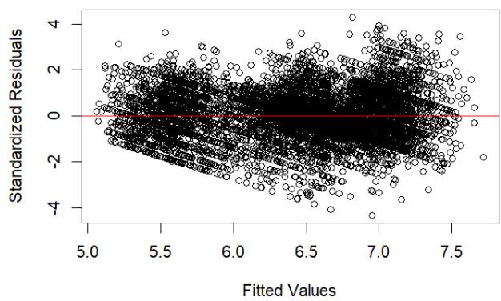  
Another key assumption of OLS estimation is the independence of the regressors, or no multicollinearity. The presence of multicollinearity can complicate the interpretation of the model, as it becomes difficult to isolate the effect of each predictor. The variance inflation factor (VIF) is a useful metric for detecting multicollinearity. In this analysis (Table A F.1), VIF values are close to 1, indicating low correlation among the variables. The estimates obtained may be biased due to potential endogeneity arising from simultaneity or reverse causality. For example, wages and hours may be jointly determined. Additionally, the model may suffer from omitted variable bias which could impact the reliability of the findings. Future research, conditional on the availability of data, should explore methods to address endogeneity, such as using instrumental variables or dynamic panel data models in order to improve the robustness of the findings.

Table A F.1. VIF results

<table><tr><td>Predictor</td><td>VIF value</td></tr><tr><td>STEM</td><td>1.027</td></tr><tr><td>Male</td><td>1.101</td></tr><tr><td>University</td><td>1.195</td></tr><tr><td>Contract</td><td>1.310</td></tr><tr><td>Hours</td><td>1.139</td></tr><tr><td>Age</td><td>1.046</td></tr><tr><td>Panama</td><td>1.021</td></tr></table>

## References

Wooldridge, J. (2010), Introductory Econometrics: A Modern Approach, South-Western Cengage Learning, https://www.cengage.com/c/introductory-econometrics-a-modern-approach-7e-wooldridge/9781337558860PF/?app=cmp (accessed on 6 May 2026).

## Promoting the Development of the Semiconductor Ecosystem in Panama

Panama is an open and services-oriented economy and a cornerstone of international trade, reflecting its privileged geographic position, excellence in transportation logistics and strong air and seaborne transportation infrastructure. As Panama seeks to position itself within the global semiconductor value chain, its regulatory framework provides important incentives for prospective foreign investors and it has been actively investing in initiatives to promote semiconductor-related talent, research and innovation. Continued investment in talent, reliable utilities infrastructure and the development of a local ecosystem of semiconductor suppliers and customers could help Panama capitalise on emerging opportunities to develop its ecosystem for semiconductors. This report examines opportunities and challenges for Panama's ecosystem for semiconductors and provides recommendations to foster its development. Using both quantitative and qualitative analysis, as well as insights from a diverse group of stakeholders, the report offers policy recommendations across four key themes: co-ordinating and aligning incentives through the recently established Commission for Innovation in Microelectronics and Semiconductors, investing in skills and attracting talent to develop a semiconductor workforce, developing an ecosystem of local suppliers and customers for semiconductor firms, and ensuring reliable and sustainable utilities infrastructure.