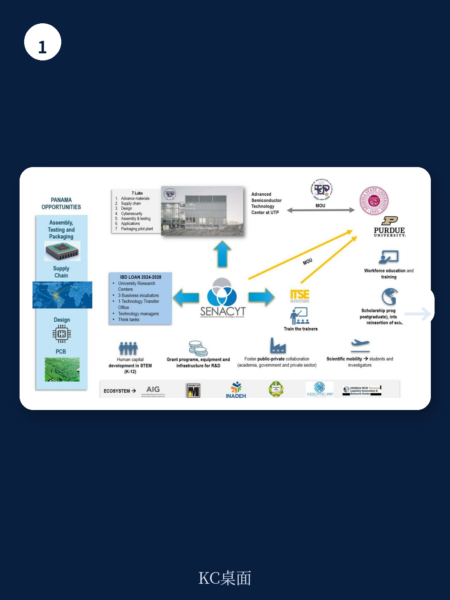
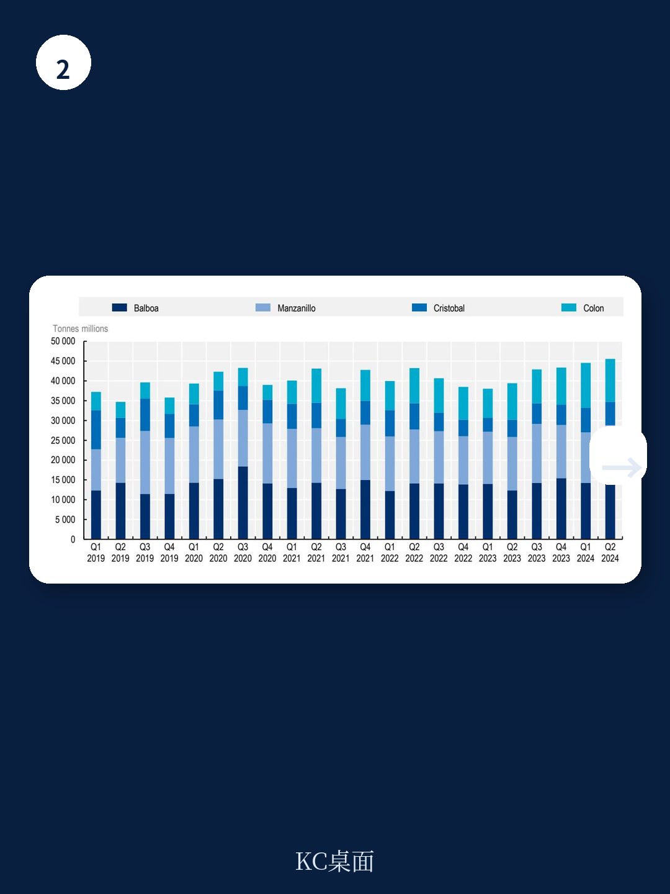

# 经合组织：巴拿马半导体生态系统发展路径

巴拿马正试图在全球半导体价值链中找到一个位置。经合组织（OECD）在一份2026年发布的报告中，系统评估了这个以服务业和物流枢纽闻名的地区在半导体领域的真实起点。报告的核心判断是：巴拿马的优势不在制造，而在区位、物流和已有的制度框架——但要将这些转化为半导体生态系统的竞争力，需要在人才、基础设施和本地企业生态三个方向同时推进，缺一不可。

报告基于2024年3月的实地调研和大量定量数据，覆盖了从市场结构、基础设施到技能供给和政策环境的全链条分析。它不是一份蓝图，而是一份诊断书。

## 1. 高技术企业体量小，利润与资产结构分化明显

巴拿马的高技术制造业规模有限。报告数据显示，2022年全国高技术企业仅占制造业企业总数的不到5%，且高度集中在首都巴拿马省。这些企业的营收和就业在2015至2022年间整体呈增长趋势，但净利率波动较大，2022年出现明显回落。

更值得关注的是资产结构。2021至2022年间，企业固定资产总值出现下降，而同期营收仍在增长。报告认为，这可能意味着企业更倾向于轻资产运营，而非研究于设备或厂房——这对需要重资产投入的半导体制造环节来说，是一个结构性制约。

> **KC评论：** 高技术企业的资产轻型化，反映的不仅是商业模式选择，也可能是融资环境、土地成本或政策不确定性导致的研究意愿不足。报告没有直接下结论，但这一数据点值得政策制定者留意。

## 2. 半导体贸易逆差持续，研发投入长期偏低

巴拿马在半导体领域的贸易表现并不乐观。2012至2023年间，芯片贸易逆差持续扩大，且显性比较优势指数（RCA）始终低于1，说明该国在半导体产品上不具备出口竞争力。进口来源高度集中，主要依赖少数几个贸易伙伴。

研发投入是另一个短板。报告数据显示，巴拿马的研发支出占GDP比重长期低于0.2%，远低于经合组织平均水平。半导体相关专利数量极少，2000年以来的PCT专利申请中，半导体类几乎可以忽略不计。报告通过专利关键词分析发现，巴拿马在半导体领域的创新活动极为有限。

## 3. 基础设施有亮点，但水电和数字连接存在区域不均

巴拿马的物流基础设施是其传统强项。报告指出，该国在港口吞吐量、航空运输质量和物流绩效指数上均表现突出。巴拿马运河的日通行量在2022至2025年间虽有波动，但整体维持在较高水平。

然而，半导体生产对水电和数字基础设施的要求更高。报告数据显示，巴拿马的人均可再生淡水资源在拉美处于中等水平，且部分省份的供水稳定性不足。电力成本高于部分竞争对手，且发电结构中水电占比偏高，面临气候波动不确定性。固定宽带订阅率虽然增长，但各省份之间的互联网接入率差距明显。

## 4. 技能供给与劳动力市场存在结构性错配

半导体行业对技能的需求高度专业化。报告基于Lightcast数据分析了全球半导体行业的技能需求，发现最常被提及的技能包括电子设计自动化、验证、硬件描述语言和晶圆制造等。而巴拿马的高技术劳动力市场中，STEM专业毕业生占比偏低，且集中在少数几所大学。

劳动力市场的另一个特征是高度非正规化。报告数据显示，2023年8月，高技术行业的非正规就业率仍接近20%，远低于经合组织平均水平。合同类型和薪资水平的分化也较为明显，正式合同工的月薪中位数显著高于非正式合同工。

报告通过计量回归发现，STEM背景、正式合同和大学学历对薪资有显著正向影响，但巴拿马本地的劳动力市场特征——包括较高的非正规率和较低的STEM毕业生比例——可能制约半导体企业的人才获取。

## 5. 政策框架已初步搭建，但协调和执行仍是关键

巴拿马在政策层面已有所行动。2023年成立的微电子与半导体创新委员会（CIMS）是核心协调机构，由多个政府部门和学术机构组成。报告详细梳理了CIMS的架构和职能，并指出其下设的多个分委员会覆盖了人才、基础设施、融资和监管等议题。

此外，巴拿马还设有多个特殊宏观环境区和自由区，如跨国企业总部特别制度（SEM）和制造业服务特别制度（EMMA），为外资企业提供税收和运营便利。报告对这些制度的条款进行了横向比较，认为它们在吸引外资方面有一定竞争力，但能否有效服务于半导体企业，仍有待验证。

> **KC评论：** 制度设计只是第一步。报告在访谈中发现的机构间协调不足、政策执行碎片化等问题，可能比制度本身更值得关注。CIMS能否真正成为“指挥中枢”，取决于其是否有足够的资源和授权。

## 6. 报告建议的四个方向：协调、人才、本地生态、基础设施

报告在评估和建议部分提出了四个优先领域：一是通过CIMS加强跨部门协调和政策一致性；二是加大对STEM教育和职业培训的投入，同时吸引海外人才；三是扶持本地半导体相关企业，形成供应商和客户网络；四是确保水电和数字基础设施的可靠性与可持续性。

这些建议并不出人意料，但报告的价值在于用数据证明了“为什么这些是优先项”。例如，人才短缺不是直觉判断，而是通过技能需求分析、毕业生数据和劳动力市场结构共同支撑的结论。

对于有意进入或研究拉美半导体布局的读者来说，这份报告提供了一个清晰的参照系：巴拿马的优势和短板都很具体，政策路径也已初步明确。接下来的问题不是“要不要做”，而是“能不能做到”。

For informational purposes only. Portions may be generated,translated,summarized,or edited with AI assistance based on source materials and may contain omissions or errors. Please verify independently. This is not investment,legal,tax,accounting,or other professional advice.

