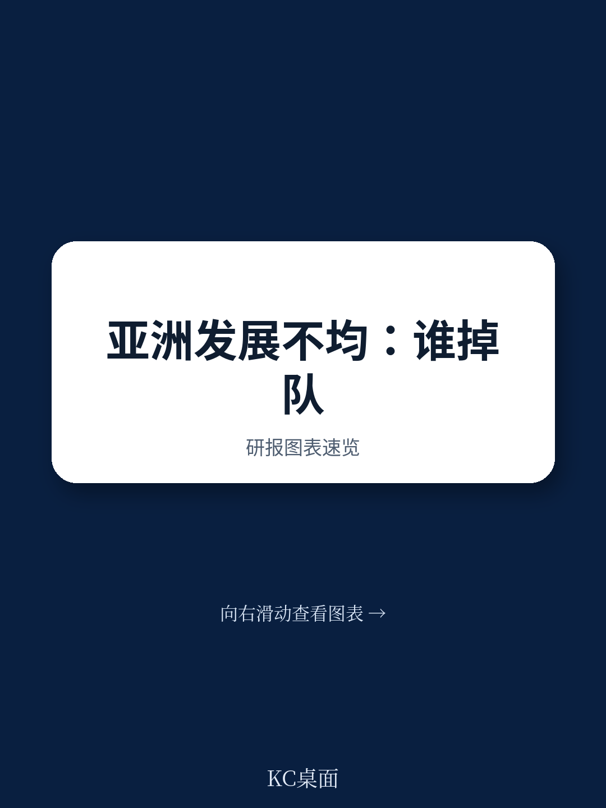
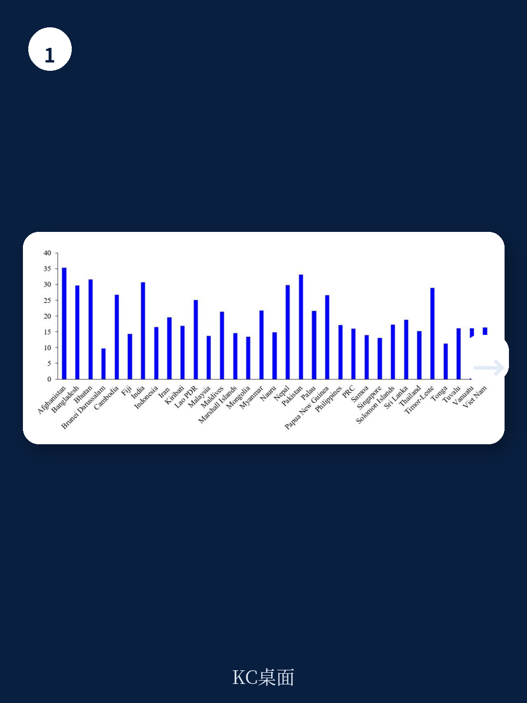
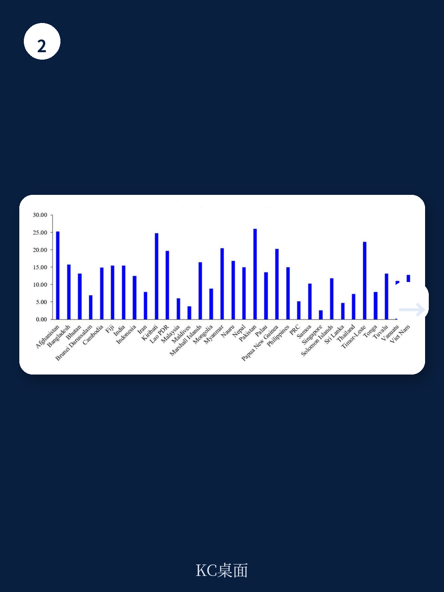

# 亚洲开发银行：亚洲人力发展不平等成因分析

亚洲开发银行研究所一份基于2025年人类发展报告数据的政策简报显示，亚洲地区因不平等导致的人力发展指数损失在9.7%至35.3%之间。文莱达鲁萨兰国损失最低，阿富汗损失最高，意味着后者超过三分之一的人力发展潜力因健康、教育和收入方面的不平等而未能实现。报告将教育不平等和收入不平等列为主要驱动因素，并指出性别平等程度和政府效能与不平等损失呈现系统性关联。

## 1. 教育和收入不平等是人力发展损失的主要来源

报告将人力发展不平等分解为三个维度：预期寿命、教育和收入。数据显示，教育不平等是多个地区中最为严重的维度。阿富汗的教育不平等达到48.8%，不丹为48.2%，东帝汶为44.9%，巴基斯坦为43.5%。收入不平等同样突出，帕劳为40.9%，印度为37.4%，斯里兰卡为36.6%，孟加拉国为35.9%，柬埔寨为35.8%。相比之下，预期寿命不平等普遍较低，但巴基斯坦、阿富汗、基里巴斯和东帝汶仍超过20%。

> **KC评论：** 教育不平等在多个南亚和东南亚地区中的数值接近或超过收入不平等，这一发现提示政策制定者，单纯关注收入分配可能不足以解决人力资本积累的结构性障碍。报告中的维度分解图表（Figure 2）展示了各国在这三个维度上的具体分布，值得细看。

## 2. 性别不平等与人力发展损失呈现正相关

报告将性别不平等指数与人力发展指数损失进行交叉分析，发现两者之间存在明显的正相关关系。阿富汗、巴基斯坦、孟加拉国、柬埔寨和巴布亚新几内亚位于“高脆弱性”象限，同时面临较高的性别不平等和较大的人力发展损失。新加坡、中国、马来西亚、文莱、泰国和越南则位于“强表现者”象限，性别不平等较低，人力发展损失也相对较小。

报告特别指出，不丹和马尔代夫处于“不均衡发展”象限——性别不平等相对较低，但人力发展损失仍然较高。这一模式表明，改善性别平等本身并不足以解决更广泛的社会宏观环境不平等问题。

## 3. 政府效能与人力发展不平等呈负相关

报告使用全球治理指标中的政府效能得分衡量制度质量，发现政府效能与人力发展损失之间存在普遍的负相关关系。新加坡政府效能得分最高（2.26），人力发展损失较低（13.0%）。阿富汗政府效能得分最低（-2.09），人力发展损失最高（35.3%）。

印度和不丹处于“过渡治理”象限，政府效能相对较强但人力发展损失仍然较高。报告认为，这意味着制度改善本身可能不足以克服根深蒂固的社会宏观环境差距。蒙古、汤加、马绍尔群岛和图瓦卢则处于“不均衡制度发展”象限，政府效能较弱但人力发展损失相对温和，提示人口结构、社会政策和宏观环境结构等因素也在发挥作用。

## 4. 南亚面临比东亚和太平洋地区更严峻的不平等挑战

区域比较显示，南亚因不平等导致的人力发展指数平均损失为30.2%，东亚和太平洋地区为16.3%，全球平均为22.0%。教育不平等在南亚达到36.9%，是东亚和太平洋地区（11.8%）的三倍以上。收入不平等方面，南亚为35.4%，东亚和太平洋地区为27.9%。预期寿命不平等方面，南亚为16.5%，东亚和太平洋地区为7.8%。

南亚的性别不平等指数（0.458）也高于东亚和太平洋地区（0.315），在生殖健康、女性教育程度、政治代表性和劳动参与率方面均表现较弱。政府效能方面，东亚和太平洋地区平均得分为0.3，南亚为-0.5。

报告认为，缩小教育和收入差距、促进性别包容性发展以及加强治理能力应成为区域政策的核心优先事项。这些发现基于2023年数据的截面分析，未涉及时间趋势或次国家级差异，报告作者也指出未来研究可沿这些方向进一步展开。

For informational purposes only. Portions may be generated,translated,summarized,or edited with AI assistance based on source materials and may contain omissions or errors. Please verify independently. This is not investment,legal,tax,accounting,or other professional advice.

