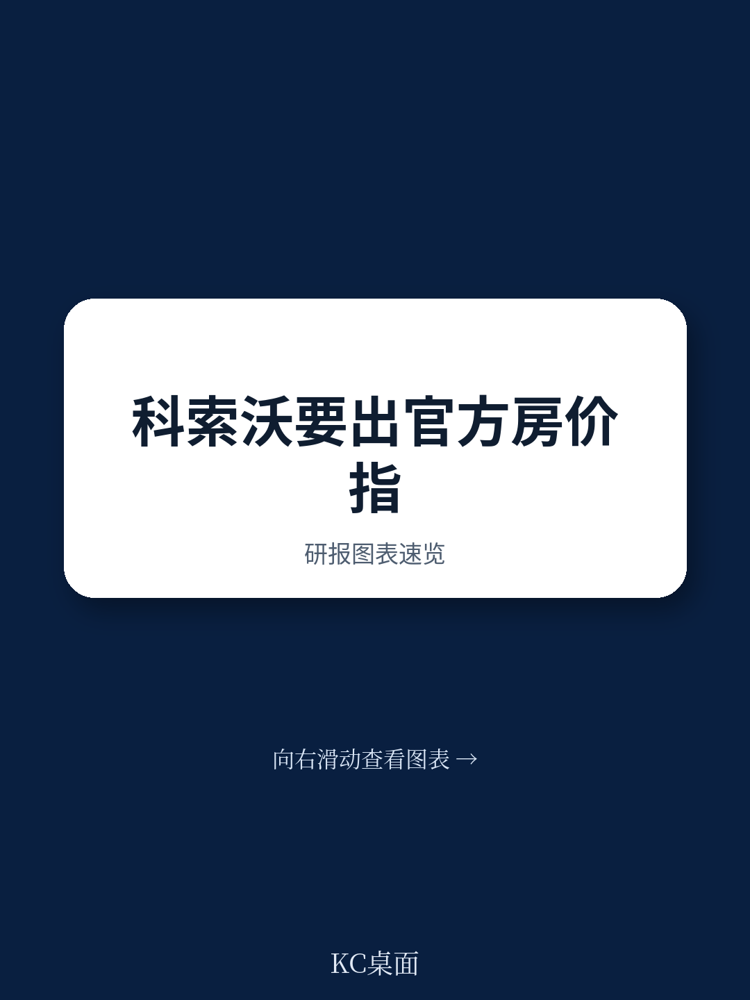
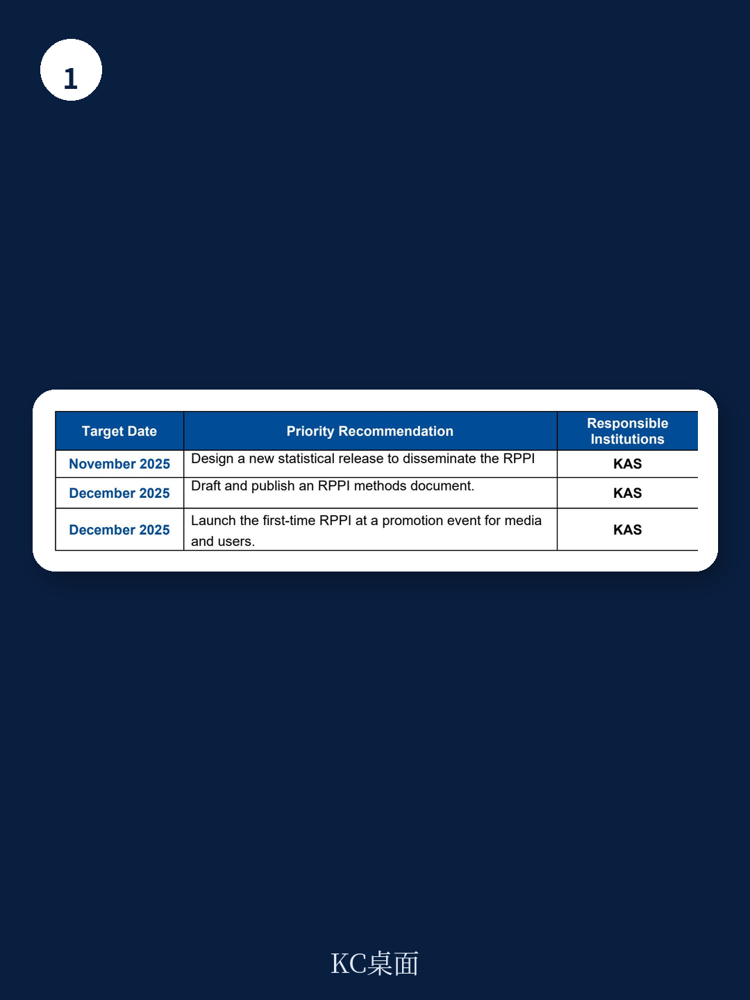

# IMF：科索沃住宅价格指数-2025年底前发布

2025年10月，国际货币产品组织（IMF）向科索沃统计局提供了一轮技术援助，核心任务是帮助该国完成首个官方住宅价格指数的开发。这份报告显示，科索沃的住宅价格指数编制已从方法论设计进入实际发布前的最后冲刺阶段，计划在2025年底前正式推出。

对于关注新兴市场房地产数据基础设施的读者而言，这不仅仅是一个国家的统计项目。它提供了一个观察窗口：当一个地区从缺乏价格监测工具到建立系统化指数时，需要解决哪些数据质量、方法论选择和机构能力问题。

## 1. 行政数据是基础，但2018年前记录不可靠

报告明确指出，科索沃地籍局提供的行政数据覆盖2015年至2025年中，是编制指数最合适的数据源。但一个关键限定条件被提出：只有2018年之后的记录被认为可靠，早期数据因质量问题被排除在外。

这意味着指数的时间序列起点被设定在2018年，而非更早。对于希望回溯更长期价格趋势的研究者来说，这是一个需要接受的现实。同时，报告承认交易价格可能存在低报现象，并建议与房地产公司记录等替代数据源进行交叉验证。

> **KC评论：** 行政数据中的交易价格低报是许多新兴市场面临的共同问题。科索沃的做法——明确划定可靠数据的时间窗口，并主动寻求交叉验证——比直接使用未经清洗的原始数据更可取。读者在评估该指数时，应关注其后续是否公布了与替代数据源的比对结果。

## 2. 特征价格模型加滚动窗口，控制属性变化的影响

在方法论层面，报告选择了特征价格回归方法，通过控制房产的楼层面积、位置、楼层数等属性，来分离出纯粹的房价变动。模型采用四季度滚动窗口，使系数能够随市场偏好的变化而调整。

这一选择并非最复杂的方法，但可能是当前数据条件下最务实的选择。特征价格模型在房地产指数编制中应用广泛，其优势在于能够处理异质性较强的房产交易数据。滚动窗口的设计则避免了系数长期不变导致的估计偏差，同时保持了模型的稳定性。

指数在地区层面分为普里什蒂纳和全国其他地区两个层级，最终汇总为全国指数。权重基于年度更新的支出数据，这有助于反映市场结构的真实变化。

## 3. 人员能力是可持续性的最大不确定性

报告在建议部分反复强调一个现实问题：负责指数编制的工作人员同时承担其他职责，且需要持续接受回归方法和R统计软件的培训。这被明确列为指数生产系统可持续性的关键不确定性。

对于任何依赖专业技能的统计项目，人员流动和技能断层都是常见挑战。科索沃统计局的应对措施包括：制定内部程序文件以制度化最佳实践，确保在人员变动时仍能维持工作连续性；定期对地籍局提供的季度数据进行质量检查，并及时反馈问题。

报告的提到时间表相当紧凑：2025年11月设计新的统计发布格式，12月发布方法论文件并举办推广活动。这意味着从技术援助结束到指数正式发布，只有大约两个月的时间窗口。

## 4. 指数用途与宏观审慎框架挂钩

这份报告的一个值得注意之处在于，它明确将住宅价格指数与中央银行的资金稳定监测和不确定性测试框架联系起来。科索沃中央银行将把该指数用于宏观审慎分析，这超出了单纯的房地产市场监测范畴。

对于观察者而言，这意味着该指数的设计不仅要反映市场价格变化，还需要满足资金不确定性识别的需求。特征价格模型的诊断测试、模型更新的同步安排、以及清晰的修订政策，都是确保指数能够服务于这一目的的必要配套措施。

报告没有详细说明指数将如何具体嵌入央行的不确定性测试模型，但这一方向本身已经表明，科索沃正在将房地产数据基础设施与资金监管工具进行对接。

For informational purposes only. Portions may be generated,translated,summarized,or edited with AI assistance based on source materials and may contain omissions or errors. Please verify independently. This is not investment,legal,tax,accounting,or other professional advice.

