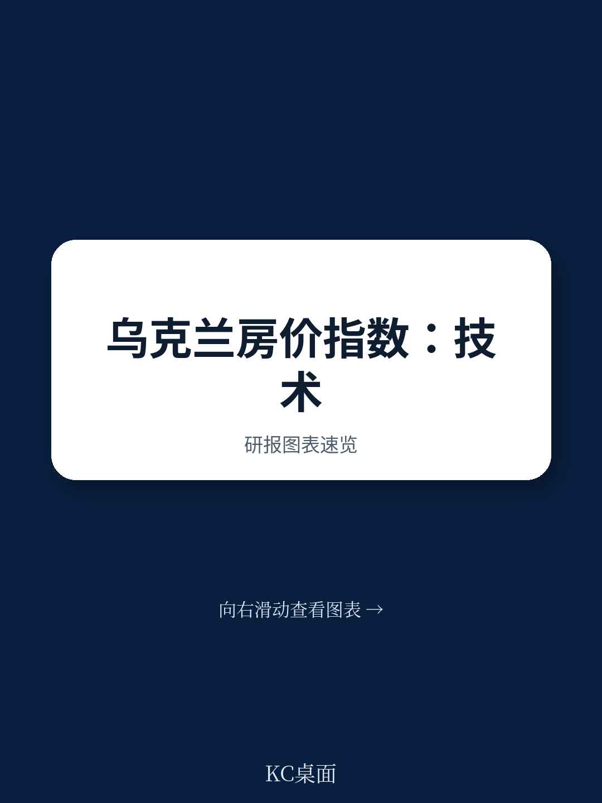

# IMF：乌克兰住宅价格指数技术援助-2025年9月

2025年9月，国际货币产品组织（IMF）向乌克兰国家统计局（SSSU）派出第四次技术援助团，核心任务是推动住宅价格指数（HPI）的编制与发布。报告显示，乌克兰住宅价格持续上涨，但涨幅主要由公寓价格驱动。这一判断基于SSSU利用挂牌数据编制的实验性质量调整特征价格指数，该指数已覆盖八个季度的公寓数据和七个季度的房屋数据。报告同时指出，行政数据目前尚不具备用于官方HPI编制的条件。

乌克兰正在经历战后重建，可靠的房地产价格指标对于评估市场不确定性、吸引私人研究、增强资金基础设施透明度至关重要。HPI的改进与土地登记、产权登记、估值标准及信贷登记等领域的改革相互配合，这些改革均得到IMF扩展产品安排（EFF）等国际机构的支持。此次技术援助的成果，将直接服务于乌克兰宏观宏观环境监测与政策制定。

## 1. 挂牌数据支撑的指数已具备统计稳健性

SSSU目前基于挂牌数据编制的特征价格指数，其回归模型的R平方值大多超过0.5，表明模型对价格变动的解释力较强。报告认为，这一统计表现足以支撑官方HPI的编制。该指数采用时间虚拟变量特征价格模型，并按分层进行指数编制与汇总，方法上已接近国际标准。

> **KC评论：** 挂牌数据并非实际成交价，但报告认为在当前条件下，挂牌数据比行政数据更可靠。关键在于模型诊断需持续进行，以确保指数稳定性。对于关注乌克兰房地产市场的读者，这一指数将是未来观察价格趋势的核心工具。

## 2. 行政数据质量不足，暂无法用于官方编制

SSSU与国家银行（NBU）合作，获取了来自国家不动产权利登记处和统一估值数据库的行政数据。这些数据包含物业特征和交易细节，但存在三个突出问题：申报价格显著低于挂牌数据中的要价，尤其是房屋类别；数据库之间匹配不完整，存在大量缺失值；缺乏区分新建与存量物业的标识，不符合欧盟统计法规要求。

报告明确建议，在行政数据质量改善之前，继续以挂牌数据作为官方HPI的主要数据源。SSSU需与相关机构合作，提升数据质量、完整性和匹配流程，为未来将行政数据纳入官方框架创造条件。

## 3. 方法论审批与发布计划已设定明确时间表

报告提出了三项优先建议，均设定了具体完成时间。第一，SSSU需在2026年3月前获得跨机构方法论委员会对更新后HPI方法的审批。第二，SSSU应在2026年5月前设计并实施季度HPI发布报告框架，参照现有消费者价格指数（CPI）的发布实践。第三，SSSU计划在2026年5月发布更新后的HPI，覆盖参考季度2026年第一季度。

值得注意的是，报告建议在正式发布2026年第一季度数据的同时，一并发布2024年和2025年的回顾性实验HPI数据。这一安排旨在为用户提供更长时间序列用于分析，平衡了数据时效性与官方统计的完整性。

## 4. 重建背景下的价格监测体系正在成型

乌克兰房地产市场的透明度提升，依赖于一套完整的价格监测基础设施。HPI是其中的关键组成部分，但并非孤立存在。报告所描述的工作，与土地和地籍记录改革、财产价格登记、估值标准以及信贷登记等领域的进展相互关联。这些改革共同构成了乌克兰吸引私人研究、支持宏观环境复苏的制度基础。

对于关注乌克兰宏观宏观环境与重建进程的观察者而言，HPI的编制进展提供了一个可追踪的指标：数据质量、方法论审批、发布节奏，每一个环节的推进都意味着市场透明度的实质性提升。报告没有回避行政数据当前的局限性，但给出了清晰的改进路径和时间节点。

For informational purposes only. Portions may be generated,translated,summarized,or edited with AI assistance based on source materials and may contain omissions or errors. Please verify independently. This is not investment,legal,tax,accounting,or other professional advice.

