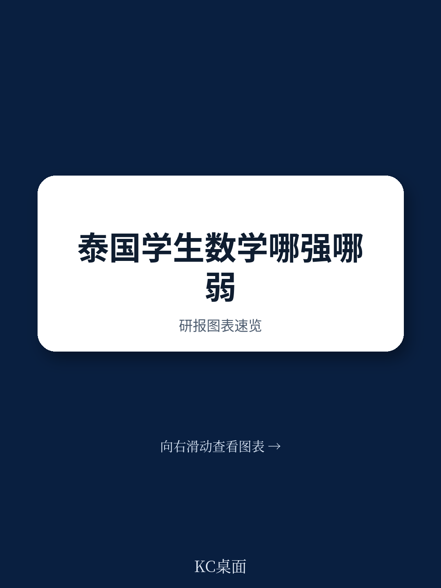
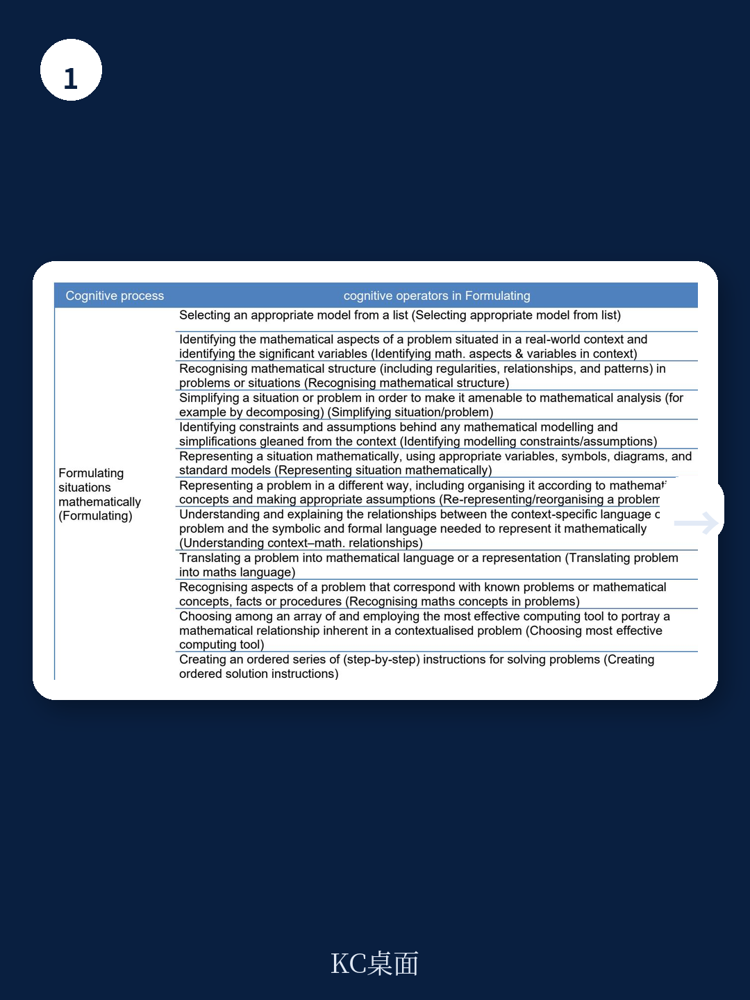
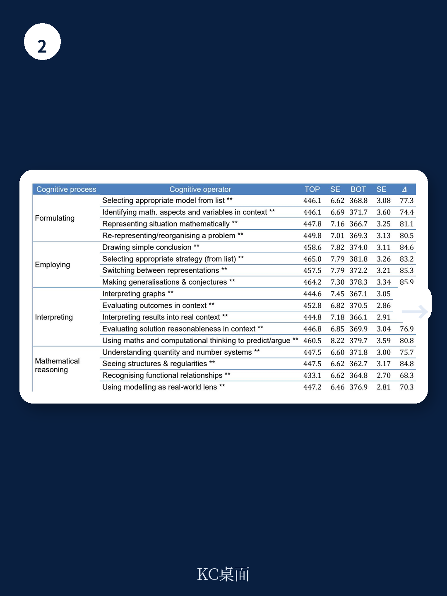

# 经合组织：AI辅助细粒度分析泰国数学能力

泰国15岁学生在PISA 2022数学测试中的整体得分为393.9分，低于OECD平均的472.4分。但更值得关注的不是这个总分差距，而是经合组织最新工作论文通过AI辅助的细粒度分析揭示出的内部结构：泰国学生在几何内容、测量、估算、概率与程序性任务上表现相对较好，而在数学化情境、结果解释、函数关系识别以及代数与数据表征内容上存在明显短板。这份编号为No. 348的工作论文，首次将集体智能教育模型应用于泰语评估材料，生成了12个内容主题和17个认知操作维度的能力剖面。

## 1. 认知操作层面：程序执行优于数学化与推理

报告将数学认知过程分解为四个主类别下的17个具体操作。数据显示，泰国学生在“运用数学概念、事实与程序”这一类别中的得分与整体数学得分基本持平，而在“数学化情境”和“解释、应用与评估数学结果”两个类别上分别低于整体得分3.6分和2.4分。具体到操作层面，学生在“执行常规程序”和“使用公式与算法”上表现相对稳定，但在“识别问题中的数学结构”和“在情境中验证结果的有效性”上得分偏低。

> **KC评论：** 这一差异意味着泰国学生的数学能力更多集中在“会算”而非“会用”。PISA测试的设计逻辑恰恰强调后者——学生能否将现实问题转化为数学问题，以及能否判断数学答案在原始情境中是否合理。这两个环节的薄弱，可能指向课堂教学中情境化训练和数学建模活动的不足。

## 2. 内容主题层面：几何与测量是相对优势区

在12个内容主题中，泰国学生在“几何对象间关系（二维与三维）”“测量”“估算”和“概率”四个主题上的得分显著高于整体数学得分。其中几何相关内容的优势最为明显，得分高出整体约8-10分。相比之下，“函数”“代数表达式”“数据收集、表征与解释”以及“方程与不等式”是得分最低的四个主题，均低于整体数学得分5分以上。报告特别指出，“不确定性与数据”作为PISA官方内容分类中的一个子领域，在泰国学生中得分最低（385.5分），但细粒度分析显示，这一大类内部存在显著分化：概率相关题目表现尚可，而数据表征与变异性理解则明显偏弱。

## 3. 性别差异有限，社会宏观环境地位差异显著

报告对性别和社会宏观环境文化地位两个维度进行了分组分析。在大多数认知操作和内容主题上，性别差异幅度很小，且未呈现系统性方向。但在“数学推理”类别中的“识别函数关系”操作上，男生得分略高于女生；而在“解释结果有效性”操作上，女生略占优势。这些差异的幅度均在统计上有限。

社会宏观环境地位的影响则大得多。将学生按ESCS指数分为四组后，最高组与最低组之间的得分差距在大多数认知操作上超过60分，在部分内容主题上接近80分。差距最大的主题是“函数”和“代数表达式”，差距最小的则是“估算”和“几何近似”。报告认为，这一模式提示社会宏观环境背景对抽象符号操作类内容的影响大于对直观几何和估算类内容的影响。

## 4. 分析框架本身提供了一种可复用的诊断工具

这项研究的方法论意义不亚于其发现本身。CIME框架的核心做法是将每道PISA试题分解为多个“项目-侧面”评分细则，每个细则对应一个具体的内容主题或认知操作。一道试题的作答可以同时为多个能力维度提供证据。在泰国案例中，研究团队以泰语作为操作评分语言，结合AI辅助评分、专家审核和心理测量标定，生成了双语评分细则。这种“从总分到剖面”的转换，使得大规模评估数据能够以更贴近课程设计和课堂教学的语言呈现。

对于正在推进课程改革和 competency-based education 的泰国教育系统而言，这类细粒度证据的价值在于：它不再只是告诉政策制定者“数学成绩在下降”，而是具体指出“函数概念教学可能需要更多情境化引入”“数据变异性理解需要更系统的课程安排”。报告也坦承，这种分析无法直接归因于课程或教学因素，但它为后续的课程审计、教师培训和形成性评估设计提供了一个更精确的起点。

For informational purposes only. Portions may be generated,translated,summarized,or edited with AI assistance based on source materials and may contain omissions or errors. Please verify independently. This is not investment,legal,tax,accounting,or other professional advice.

