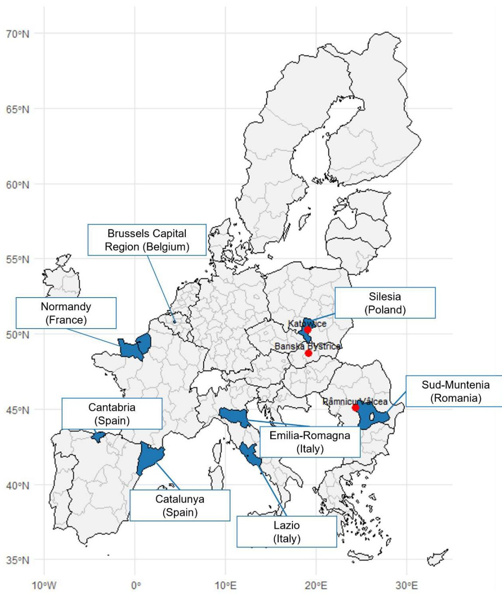

OECD Public Governance Reviews

# Citizen Participation for Better Cohesion Policy

Insights from 11 Pilot Initiatives

OECD Public Governance Reviews

# Citizen Participation for Better Cohesion Policy

INSIGHTS FROM 11 PILOT INITIATIVES

This work was approved and declassified by the Public Governance Committee on 21 July 2026.

This document was produced with the financial assistance of the European Union. The views expressed herein can in no way be taken to reflect the official opinion of the European Union.

This document, as well as any data and map included herein, are without prejudice to the status of or sovereignty over any territory, to the delimitation of international frontiers and boundaries and to the name of any territory, city or area.

Please cite this publication as:
OECD (2026), Citizen Participation for Better Cohesion Policy: Insights from 11 Pilot Initiatives, OECD Public Governance Reviews, OECD Publishing, Paris, https://doi.org/10.1787/6b66cff6-en.

ISBN 978-92-64-36839-2 (print)
ISBN 978-92-64-99689-2 (PDF)
ISBN 978-92-64-71242-3 (HTML)

OECD Public Governance Reviews
ISSN 2219-0406 (print)
ISSN 2219-0414 (online)

Photo credits: Cover © Drazen Zigic/Shutterstock.com.

Corrigenda to OECD publications may be found at: https://www.oecd.org/en/publications/support/corrigenda.html.
© OECD 2026

## Attribution 4.0 International (CC BY 4.0)

This work is made available under the Creative Commons Attribution 4.0 International licence. By using this work, you accept to be bound by the terms of this licence (https://creativecommons.org/licenses/by/4.0/).

Attribution – you must cite the work.

Translations – you must cite the original work, identify changes to the original and add the following text: In the event of any discrepancy between the original work and the translation, only the text of the original work should be considered valid.

Adaptations – you must cite the original work and add the following text: This is an adaptation of an original work by the OECD. The opinions expressed and arguments employed in this adaptation should not be reported as representing the official views of the OECD or of its Member countries.

Third-party material – the licence does not apply to third-party material in the work. If using such material, you are responsible for obtaining permission from the third party and for any claims of infringement.

You must not use the OECD logo, visual identity or cover image without express permission or suggest the OECD endorses your use of the work.

Any dispute arising under this licence shall be settled by arbitration in accordance with the Permanent Court of Arbitration (PCA) Arbitration Rules 2012. The seat of arbitration shall be Paris (France). The number of arbitrators shall be one.

## Foreword

Citizen participation is a strategic asset for governments to design and implement better and more effective and responsive policies while strengthening public trust. Findings from the 2023 OECD Survey on the Drivers of Trust in Public Institutions underscore the importance of political agency, which combines the confidence of being able to participate in politics and the confidence of one's voice being heard, as the strongest driver of citizens' trust in government, namely at the local level. Moreover, government currently operate in a context of wide-ranging and rapid chances that require effective and responsive actions. In this context, putting citizens at the centre of policy and decision-making allows governments to better target policies to address citizens' needs and act more efficiently, while enhancing the legitimacy and acceptability of policy decisions.

EU Cohesion Policy is the largest investment strategy of the European Union to promote the development of its Member States and regions. Its nature is rooted in the principles of effective multilevel governance and partnership with local stakeholders to ensure that investments are targeted and in line with citizens' needs and priorities. Since 2020, the OECD and the European Commission – Directorate General for Urban and Regional Policy (DG REGIO) have partnered to support EU regions and cities in improving their capacity to involve citizens and stakeholders in shaping, prioritising, and implementing EU Cohesion Policy funding instruments. A first cohort of five territories and related pilot initiatives assessed the opportunities and challenges of leveraging citizen participation processes to shape Cohesion Policy at the subnational level. Findings from the first cohort can be found in the OECD report Engaging Citizens in Cohesion Policy (2022). Since 2022, the OECD-DG REGIO collaboration has focused on designing and implementing tailored citizen participation processes in 11 territories across 7 EU Countries. The present report takes stock of this experience and showcases evidence from three deliberative processes implemented in France, Romania and Poland; one multistakeholder forum in Spain; a Student Assembly in Italy; an ‘ideathon’ in the Slovak Republic; a hybrid consultation in Romania; budget consultations in Spain, a civic monitoring exercise in Italy, and the development of tailored participatory methodologies and related capacities in Belgium and Poland.

The conclusions of this report align with the ongoing debate on the future of Cohesion Policy within EU institutions, which highlights the key role of meaningful stakeholder engagement as part of good governance and administrative capacity to enhance policy effectiveness.

# Acknowledgements

The OECD Secretariat wishes to express its gratitude to all those who contributed substantively to the preparation of this report.

This Report was prepared by the OECD Public Governance Directorate (GOV), under the leadership of Elsa Pilichowski, Director for Public Governance. It was developed under the strategic direction of Nejla Saula, Head of Division, and David Goessmann, Head of the Open Governance Unit within the Anti-Corruption, Integrity and Open Government (ACIOG) Division.

This report was drafted by Charlotte Denise-Adam, Policy Analyst, Manon Epherre-Iriart, Policy Analyst, and Giulia Cibrario, Policy Analyst. David Goessmann, Head of Unit and Raphaël Pouyé, Policy Analyst, provided strategic comments throughout the document.

This report was developed in close collaboration with the European Commission – Directorate General for Regional and Urban Policy (DG REGIO) – Unit E1: Administrative Capacity Building & Solidarity Instruments. Francesco Amodeo participated in the conceptualisation of the report. Dominika Chroszcz and Klaudia Dywel provided strategic comments on all chapters.

Project teams from the 11 EU regions and cities involved provided feedback to this report. The OECD would like to thank Magdalena Jochemczyk, Agnieszka Stroińska (GZM Metropolis, Poland), Ewa Paderewska (Centre for European Transport Projects in Poland – CEUTP), Daniela Ferrara, Anna Maria Linsalata, Raffaella Gentile (Emilia-Romagna Region, Italy), Ilaria Dallasta (Union of Municipalities of Appennino Reggiano, Italy), Massimiliano Pacifico (Lazio Region, Italy), Fabrice Saint, Mathilde Adriassens (Normandy Region, France), Barbara Szafir, Dominika Stan, Agata Woźniak (Marshal’s Office of the Silesian Voivodeship, Poland), Marta García Hospital (Cantabria Region, Spain), Xavier Mestre Rosanes (Government of Catalunya, Spain), Simona Iliescu (City of Râmnicu Vâlcea, Romania), Gilda Niculescu (South Muntania Regional Development Agency – SMRDA, Romania), Ruxandra Pavel (Dambovita County Council, Romania), Sona Karikova, Milan Hagovski (City of Banská Bystrica, Slovak Republic), Frédérique Van Nyen, and Quentin Richard (Brussels Region, Belgium).

The report also benefitted from strategic comments by Gillian Dorner, Deputy Director of the OECD Public Governance Directorate.

This report benefitted from consultation with Delegates to the Working Party on Open Government.

Neringa Gudziunaite and Valentin Py provided editorial assistance.

This report is a deliverable of the project “Innovative Implementation of the Partnership Principle in Cohesion Policy”, a collaboration between the OECD and the European Commission – DG REGIO. The OECD extends its sincere thanks to the European Commission for its financial support for this project.

## Table of contents

Foreword 3   
Acknowledgements 4   
Executive summary 7 Key findings 8   
1 Introduction: Citizen participation in Cohesion Policy 11 Setting the scene: Cohesion Policy is the main investment policy in the European Union 12 Citizen participation in Cohesion Policy 13 Cohesion Policy and the OECD-DG REGIO collaboration 15 References 18   
2 The experience of 11 pilots across seven EU countries 19 Selection of participating territories 20 The 11 OECD-DG REGIO pilots 20 Beyond individual pilots: Citizen participation as a versatile toolbox to improve Cohesion Policy at the subnational level 30 References 37   
3 Lessons learned: Well-designed participation improves policies while strengthening trust and legitimacy 39 Designing and implementing meaningful participatory processes 41 Achieving policy impact: participation can increase policy effectiveness 48 Building democratic skills and increasing public trust 50 Challenges identified through the OECD-DG REGIO pilots 52 References 55   
4 Beyond experimentation: Transforming local governance to embed meaningful participation in Cohesion Policy 57 Strengthening the preconditions that enable meaningful participation 58 Conclusion 64 Next steps: Key actions for Cohesion Policy to increase the value and impact of participation 65 References 68   
Glossary 71 Key terms on EU Cohesion Policy 71 Key terms on participation 72

References 74

## FIGURES

Figure 1.1. Pilot territories participating in the project "Innovative Implementation of the Partnership Principle in Cohesion Policy" 17

## TABLES

Table 2.1. Summary of the selected pilots for the OECD-DG REGIO project 21
Table 2.2. Participants per pilot of the OECD-DG REGIO project “Innovative Implementation of the Partnership Principle in Cohesion Policy” 31

## BOXES

Box 1.1. European Union's Cohesion Policy 12  
Box 1.2. OECD and European Commission work on Citizen Participation and Deliberation 14  
Box 2.1. Multilevel coordination and support to increase impact of participatory processes in Romania 32  
Box 2.2. Multi-staged processes can involve citizens at different stages of the policy cycle 34  
Box 3.1. OECD's Guiding Principles for Citizen Participation Processes 42  
Box 3.2. Involving people with disabilities in Poland 43  
Box 3.3. Closing the feedback loop: good practices 45  
Box 3.4. Using different media supports to increase the reach and impact of participation in Romania 47  
Box 3.5. Banská Bystrica digital democracy platform 52  
Box 4.1. A sound environment for participatory processes in Catalonia 59  
Box 4.2. Banská Bystrica digital democracy platform 61  
Box 4.3. Local resolutions to enable deliberative democracy in Romania 63

# Executive summary

This report shares insights from the 11 pilots of the project “Innovative Implementation of the Partnership Principle in EU Cohesion Policy”, a partnership between the OECD and the European Commission – Directorate General for Regional and Urban Policy (DG REGIO) which aimed at experimenting and embedding meaningful citizen participation in the management of Cohesion Policy instruments at the subnational level. Citizen participation in policymaking is identified as a key enabler to reinforce citizens’ trust in public institutions, especially at the local level, as well as a crucial government process to ensure responsive and effective policy delivery. The pilots involved local authorities and civil society organisations (CSOs) from 11 regions and cities across 7 EU countries: Belgium, France, Italy, Poland, Romania, Slovak Republic, and Spain. The OECD - DG REGIO collaboration tested tailored participatory methods in real settings to understand what works in different governance and policy contexts and identify the conditions needed to embed meaningful participation in the Cohesion Policy cycle. The pilots covered a broad range of participatory approaches and policy issues, including:

\- Three representative deliberative processes in France, Poland, and Romania. These processes brought together groups of citizens selected through stratified sortition to learn about a public issue, deliberate, and produce recommendations.

\- One multistakeholder forum in Spain, designed to involve citizens, stakeholders, experts and civil society in the design and implementation of a policy that directly affects them.

• A student assembly in Italy, adapting deliberative elements to a school environment.

\- An ‘ideathon’ in the Slovak Republic, using open innovation methods to identify and prioritise local development projects and initiatives.

\- A multistage hybrid consultation in Romania, designed to involve a wide range of citizens and stakeholders in local development programmes.

\- Budget consultations in Spain, where citizens, experts and stakeholders contributed to define the orientation of investments.

\- A civic monitoring process in Italy, enabling citizens to oversee EU Cohesion Policy-funded projects.

\- Capacity building activities in Belgium and Poland to identify meaningful opportunities for participation in the management of EU Cohesion Policy instruments while strengthening internal capacities to design and implement participatory processes tailored to their respective contexts.

## Key findings

## The pilots demonstrate that citizen participation is a versatile toolbox for Cohesion Policy

The pilots tested a wide range of participatory methodologies applied at various stages of the policy cycle, to inform a variety of policy instruments and documents related to Cohesion Policy, involving both citizens and stakeholders – including by targeting specific groups. Moreover, the pilots covered several policy areas, including transport, access to culture, territorial development and intergenerational fairness. With the support of the OECD and local CSOs, the 11 local authorities designed and implemented tailored participatory processes and ensured policy impact by establishing mechanisms to ‘close the loop’ and by leveraging public communication to provide feedback to participants and to all citizens.

## The pilots show that participation can improve policy decisions while strengthening trust and legitimacy

Citizen participation can improve Cohesion Policy by helping local authorities to better identify problems, surface bottlenecks and inefficiencies, and reveal blind spots. It does so by providing authorities with structured channels to tap into citizens' everyday life experiences as users of infrastructure and services and as participants in public life. Ultimately, policymakers can use these insights to inform decisions that better reflect territorial needs. The 11 pilots demonstrated that, when adequately designed and implemented, citizen participation processes can increase the accuracy and pertinence of policies and services. These experiences also highlighted the potential of involving citizens to increase public acceptability and legitimacy of policy decisions, all while improving public understanding of the role of the EU in fostering territorial development. Finally, participants of various pilots reported an increased sense of agency and confidence that their voice was heard by the government on decisions that mattered to them.

## The pilots also demonstrated that challenges to implementing meaningful participation persist

Throughout the implementation of the pilots, public authorities and CSOs faced several concrete challenges, including the lack of political and institutional support, which reduced the likelihood that citizen input would influence decisions, as well as limited or insufficient availability of human and financial resources. Moreover, the experience of the pilots highlighted the difficulties in coordinating participation across the multiple levels of governance that implement Cohesion Policy at the subnational level. Furthermore, citizens face barriers to engagement and might not see the value of participating. Finally, and most importantly, participation is not well integrated into the Cohesion Policy cycle; existing procedures and timelines left little space for meaningful participation, meaning that citizen contributions sometimes arrived too late to shape key choices.

## Moving forward, governments should act to embed meaningful participation in Cohesion Policy

Citizen participation is not a “nice-to-have” but a strategic imperative for the legitimacy and success of Cohesion Policy. As the EU discusses the next Multiannual Financial Framework in a context of geopolitical tensions and major transitions, facing increasing expectations for effective public spending, failing to involve citizens meaningfully in setting priorities and shaping policies carries significant political risk. The EU acknowledged meaningful citizen participation as a strategic asset to achieve better policies and strengthen democracy by making it a crucial piece of various initiatives and policy documents, including the European Democracy Shield, the Strategy for Civil Society, and the Recommendation on promoting the engagement and effective participation of citizens and civil society organisations. To embed meaningful participation in Cohesion Policy, governments at all levels should act to: (1) strengthen the preconditions to meaningful participation, including legal, policy frameworks and institutional arrangements, (2) enhance institutional capacity to build a culture of participation, (3) strengthen vertical and horizontal coordination, and (4) institutionalise and mainstream participation throughout the Cohesion Policy cycle.

Regarding the immediate next steps, the experience of the 11 pilots suggests two complementary areas of action: (1) moving from experimentation to building and embedding capacities within Managing Authorities so that participation becomes an integral part of the governance of Cohesion Policy; and (2) continuing to expand experimentation at the municipal level as laboratory for democratic innovation to ensure that EU priorities remain rooted in citizens' priorities.

## 1 Introduction: Citizen participation in Cohesion Policy

This chapter frames the collaboration between the European Commission – Directorate General for Regional and Urban Policy (DG REGIO) and the OECD as part of the broader efforts of the two organisations to foster citizen participation in policymaking, specifically in EU Cohesion Policy, at all levels of governance.

## Setting the scene: Cohesion Policy is the main investment policy in the European Union

For more than three decades since the 1989 reform of structural funds, Cohesion Policy has driven social and economic progress across the European Union (EU) through investments tailored to the unique local conditions and structural issues of each region (see Box 1.1). According to a recent report, from the reform of Structural Funds in 1989 until 2023, the EU invested EUR 1,040 billion for this purpose with an additional EUR 392 billion being invested during the 2021-2027 programming period (European Commission, 2024[1]). This budget targets all regions and cities in Europe to deliver on five policy objectives: (1) a more competitive and smarter Europe, (2) a greener, low carbon transitioning towards a net zero carbon economy, (3) a more connected Europe by enhancing mobility, (4) a more social and inclusive Europe, (5) a Europe closer to citizens by fostering the sustainable and integrated development of all types of territories (European Commission, 2024[1]). The policy instruments adopted to achieve these objectives are the European Regional Development Fund (ERDF), the European Social Fund+ (ESF+), the Cohesion Fund and the Just Transition Fund (JTF). Cohesion Policy is coordinated by the Directorate General for Regional and Urban Policy (DG REGIO).

## Box 1.1. European Union's Cohesion Policy

Cohesion Policy is the European Union's main investment policy to promote economic, social and territorial cohesion across Member States and regions. Its overarching objective is to reduce disparities in development, strengthen the resilience of regions and ensure that all Europeans can benefit from the opportunities of the single market. The legal foundations of Cohesion Policy are set out in Articles 174 to 178 of the Treaty on the Functioning of the European Union, which mandate the EU to support balanced development, address structural challenges and pay particular attention to rural areas, regions affected by industrial transition and areas with geographic disadvantages.

Implemented through multiannual programmes and shared management between the European Commission and Member States, Cohesion Policy supports long-term investments in innovation, skills, infrastructure, environmental sustainability and social inclusion. It targets all regions and cities in the European Union to support:

1. job creation

2. business competitiveness

3. economic growth

4. sustainable development

5. improvements to citizens' quality of life

In order to reach these goals and address the diverse development needs in all EU regions, EUR 392 billion (almost a third of the total EU budget) has been set aside for Cohesion Policy for the period 2021-2027.

Source: https://ec.europa.eu/regional\_policy/policy/what\_en; (European Commission, 2024[1]).

Since 2020, the OECD and DG REGIO have been working together to provide technical assistance to regional and local authorities to experiment with and institutionalise participatory approaches throughout the Cohesion Policy cycle. This report takes stock of 11 pilots across the European Union to build the case to embed and increase support for participatory Cohesion Policy making.

## Citizen participation in Cohesion Policy

The OECD and the European Union pursue a shared objective: to promote citizen participation not only to reinforce trust and strengthen democracy, but also to improve the quality and effectiveness of policies and services. In doing so, both institutions support their member countries in ensuring that participatory and deliberative processes are designed to be meaningful and impactful.

Evidence shows that citizens generally have a low awareness of Cohesion Policy and its contribution to local development. According to the 2023 Eurobarometer on awareness and perception of EU regional policy, only a minority of Europeans feel well informed about the investments made in their region. However, when citizens are aware of Cohesion Policy, perceptions are overwhelmingly positive, and support for EU action increases. This signals an important opportunity: participation can act as a bridge between Cohesion Policy and the public, improving understanding of its goals, activities, and tangible results (European Union, 2023[2]).

Cohesion Policy's multi-level governance structure, administrative complexity, and existing trade-offs among investment choices can lead to slow implementation. Data from the Cohesion Open Data Portal shows persistent gaps between planned and implemented funding across programming periods. Citizen participation can help address these constraints by strengthening collective ownership of decisions, clarifying priorities, and reducing public resistance (European Commission, 2025[3]). Given the financial and political importance of Cohesion Policy, the cost of not engaging citizens meaningfully is high.

Citizens in OECD and EU countries are not simply looking for ‘more’ opportunities to participate in policy making, they want more meaningful participation. They want their voice to be treated as a valuable asset for policymaking and for governments to be accountable for how they use it (OECD, 2023[4]; OECD, 2024[5]). Box 1.2 provides details on OECD and European Commission work on citizen participation.

The OECD definition of citizen and stakeholder participation includes “all the ways in which stakeholders (including citizens) can be involved in the policy cycle and in service design and delivery”. Participation refers to the efforts by public institutions to hear the views, perspectives, and inputs from citizens and stakeholders. Participation allows citizens and stakeholders to influence the activities and decisions of public authorities at different stages of the policy cycle (2022[6]) (OECD, 2017[7]) (OECD, 2024[8]). The OECD distinguishes among three levels of citizen and stakeholder participation, which differ according to the level of involvement from information, consultation to engagement.

## Box 1.2. OECD and European Commission work on Citizen Participation and Deliberation

## Citizen Participation at the core of OECD work on open governance

The OECD has played a longstanding role in fostering dialogue among Member countries to reach a shared understanding of what citizen participation in policy making is and can do. The OECD work on citizen participation is anchored in the Recommendation of the Council on Open Government (2017), the first and only internationally recognised legal instrument in open government. The Recommendation defines open government as a culture of governance that promotes the principles of transparency, integrity, accountability and stakeholder participation in support of democracy and growth for all.

As part of its work on open government and citizen participation, the OECD has built a toolbox to explore, promote and guide innovative and meaningful ways to involve the public in decision making. For instance:

• OECD Deliberative Democracy Toolbox

• OECD Guidelines

• Country analysis such as Basque country, Brazil, Ukraine

• OECD work on digital democracy includes Emerging Tech Report, Civic Tech and AI.

## EU's Democracy Agenda

Citizen participation is a strategic priority for the European Union. European institutions including the Commission, Parliament and Council have experimented with innovative and more engaging participatory approaches to involve citizens in shaping EU priorities. Between 2021 and 2022, the Commission, together with the European Parliament and the Council of the European Union, launched the Conference on the Future of Europe a multi-stage, hybrid process including live sessions and the digital platform for participation future.europa, to gather citizens' inputs and views on ten topics, ranging from European democracy, to digital transformation. In total, the initiative involved more than 770,000 participants and resulted nearly 19,000 Ideas. The ideas were then condensed into 49 proposals presented to the three mandating institutions on Europe's day, May $9^{\text{th}}$ , 2022 (European Union, 2022[9]). In addition, the Conference inaugurated the series of European Citizens Panels, EU-wide multilingual deliberative processes involving representative groups of EU citizens to discuss and provide recommendations on the topics surfaced during the online consultation phase. Since 2022, the European Commission organised seven Panels. Each Panel involved around 150 EU citizens over three weekends of deliberative sessions.

The Commission developed legal and regulatory frameworks to support citizen participation and democratic engagement.

In 2023, the European Commission published a Recommendation on the participation of citizens and civil society organisations in public policy-making which calls for structured and transparent frameworks that involve all groups in society and that go beyond electoral cycles and make use of innovative methods such as citizens' assemblies, panels, and co-creation processes. The Recommendation emphasises the importance of representation—particularly for young people, marginalised groups, and persons with disabilities—while ensuring that civic space remains safe and enabling for civil society organisations and human rights defenders. It also underlines the need for adequate resources, training, and capacity-building for both public administrations and participants to make engagement meaningful and effective. Finally, the Commission commits to supporting Member States through EU-level expertise, tools, and guidance, building on experiences such as the Conference on the Future of Europe.

In 2025, the European Commission published a proposal for a European Democracy Shield, building on the previous European Democracy Action Plan (2020) and the Defence of Democracy Package (2023). The European Democracy Shield outlines a series of actions and initiatives aiming at protecting and reinforcing EU democracy by: (1) reinforcing situational awareness and support response capacity to safeguard the integrity of the information space, (2) strengthening democratic institutions, free and fair elections and free and independent media, (3) boosting societal resilience and citizens' engagement. The third pillar includes actions to strengthen civic skills and media literacy, organise new Citizen Panels, reinforce institutional capacities for participation at the national level, and improve the digital infrastructure for participation at the EU level.

Source: (European Commission, 2023[10]; OECD, 2025[11]; European Commission, 2025[12]; European Commission, 2025[13]).

Engaging citizens is also a concrete pathway to strengthen trust in government. According to the OECD (2024[5]), one of the top three drivers of trust in national government for decision making on complex, long-term, and global policy issues is “political voice” – just after “balancing intergenerational interests” and “evidence-based decision making”. Results of the OECD Trust Survey have demonstrated that providing meaningful opportunities for citizens to voice their opinions is the government action with the highest potential to strengthen citizens’ trust, especially at the local level. In 2024, results show that 69% of those who believe they have a say in government action report high or moderately high levels of trust in the national government, in contrast to only 22% among those who feel they do not have a say. This represents a staggering 47-percentage point gap in trust in national government between those who feel they have a say in government action, and those who do not (OECD, 2024[14]).

This Report aims to showcase the process, results and learnings of the OECD-DG REGIO pilots where participatory approaches were tested in different contexts and for different objectives. Using the pilots as case studies, it will show the versatility of participatory approaches and the observed benefits when applied to Cohesion Policy at the regional and local levels. The pilots generate valuable insights and illustrative practices that can inform, inspire, and support the Cohesion Policy community and public authorities across the EU in advancing their own participatory initiatives. The findings of this report can inform the ongoing reflection on Cohesion Policy beyond 2027 and serve as inspiration for other public authorities across the OECD.

## Cohesion Policy and the OECD-DG REGIO collaboration

As part of the shared priority to promote participatory approaches and to showcase concrete pathways to improve policies and services, the OECD and the European Commission's Directorate General for Regional and Urban Policy (DG REGIO) established a collaboration to improve the implementation of the Partnership Principle by experimenting with new ways of involving the public in the management of cohesion funds. The project “Innovative Implementation of the Partnership Principle in Cohesion Policy” was implemented between 2021 and 2025. A special emphasis was put on the need to strengthen the partnerships between public authorities managing EU funds (i.e., managing authorities, intermediate bodies, and beneficiaries) and civil society organisations (CSOs) in deploying participatory efforts for the implementation of EU Cohesion Policy.

## This collaboration had multiple objectives:

\- Experiment with innovative participatory practices with the aim of scaling and mainstreaming them across authorities responsible for implementation of EU Cohesion Policy instruments.

\- Equip public administrations with practical knowledge and skills to better involve civil society and citizens when implementing Cohesion Policy and other policies.

\- Increase awareness among citizens on the role played by the European Union in the development of their territory, as only about 4 in 10 people report having heard about EU co-financed projects to improve the area where they live (European Commission, 2024[1]).

\- Improve the quality and efficiency of Cohesion Policy at the local level by better understanding citizens' needs and priorities.

\- Contribute to the ongoing reform of Cohesion Policy by showing the benefits of the Partnership Principle and extending the involvement of citizens and civil society as partners of Cohesion Policy.

A first phase of this collaboration implemented in 2020 and 2021, consisted in supporting five public authorities in Cantabria (Spain), Emilia-Romagna (Italy), Interreg V-A Flanders (Netherlands-Belgium), the Centre for EU Transport Projects (Poland), and Interreg V-A Romania-Bulgaria. The process, outcomes and lessons learned from this first phase were captured in the OECD report “Engaging citizens in the Cohesion Policy: DG REGIO and OECD pilot project final report”, published in March 2022 (OECD, 2022[15]).

Building on the results of these pilots, the OECD and DG REGIO launched a second phase of this collaboration implemented from 2022 to 2025 providing assistance to 11 pilots: Cantabria (Spain), Emilia Romagna (Italy), City of Banská Bystrica (Slovak Republic), CEUTP and GZM Metropolis (Poland), Brussels region (Belgium), Lazio Region (Italy), Normandy Region (France), Municipality of Râmnicu Vâlcea (Romania), Silesia Region (Poland), Catalonia's Ministry of Finance (Spain), and South-Muntenia Development Agency (Romania). The objective of these pilots was to involve citizens and civil society in designing, implementing, and evaluating Cohesion Policy at the local level. The OECD provided technical and methodological support, encouraging knowledge-sharing among all territories involved. Local project team often included representative of local CSOs specialised in community engagement or in lowering barriers to access public life for underheard or marginalised publics. Figure 1.1 provides an overview of all pilot territories involved in the project.

Figure 1.1. Pilot territories participating in the project "Innovative Implementation of the Partnership Principle in Cohesion Policy"  
  
Source: OECD elaboration.

## References

European Commission (2024), Forging A Sustainable Future Together: Cohesion for A Competitive and Inclusive Europe: Report of the High-Level Group on the Future of Cohesion Policy, https://doi.org/10.2776/974536.

European Commission (2025), Cohesion Policy Open Data Portal, https://cohesiondata.ec.europa.eu/cohesion\_overview/21-27/#finance-implementation.

European Commission (2025), European Citizen Panels, https://citizens.ec.europa.eu/european-citizens-panels\_en.

European Commission (2025), European Democracy Shield: Empowering Strong and Resilient Democracies, https://commission.europa.eu/document/download/2539eb53-9485-4199-bfdc-97166893ff45\_en.

European Commission (2023), Recommendation on the participation of citizens and civil society organisations in public policy-making, https://commission.europa.eu/document/fcb629fe-ca20-4019-b1f6-392c286fdedf\_en.

European Union (2023), Citizens' awareness and perception of EU Regional policy, https://europa.eu/eurobarometer/surveys/detail/2970.

European Union (2022), Report on the final outcome - Conference on the Future of Europe, https://wayback.archive-it.org/12090/20220915192132/https://futureu.europa.eu/pages/reporting.

OECD (2025), OECD work on Citizen Participation, https://www.oecd.org/en/topics/sub-issues/open-government-and-citizen-participation.html.

OECD (2024), Exploring New Frontiers in Citizen Participation in the Policy Cycle, OECD Publishing, https://doi.org/10.1787/77f5098c-en.

OECD (2024), OECD Survey on Drivers of Trust in Public Institutions – 2024 Results: Building Trust in a Complex Policy Environment, OECD Publishing, https://doi.org/10.1787/9a20554b-en.

OECD (2024), Promoting Deliberative Democracy in the Basque Country in Spain: Lessons from the Tolosa Citizens' Assembly, OECD Publishing, https://doi.org/10.1787/544f7514-en.

OECD (2023), Open Government for Stronger Democracies: A Global Assessment, OECD Publishing, https://doi.org/10.1787/5478db5b-en.

OECD (2022), Engaging citizens in cohesion policy: DG REGIO and OECD pilot project final report, OECD Publishing, https://doi.org/10.1787/486e5a88-en.

OECD (2022), OECD Guidelines for Citizen Participation Processes, OECD Public Governance Reviews, OECD Publishing, https://doi.org/10.1787/f765caf6-en.

OECD (2017), Recommendation of the Council on Open Government, https://legalinstruments.oecd.org/en/instruments/OECD-LEGAL-0438.

## 2 The experience of 11 pilots across seven EU countries

This chapter provides an overview of all pilot initiatives implemented in the 11 participating regions and cities across seven EU countries (Belgium, France, Italy, Poland, Romania, the Slovak Republic, and Spain) as part of the project “Innovative Implementation of the Partnership Principle in Cohesion Policy”. For each pilot, the chapter describes the policy issues at stake, the participatory process adopted to involve citizens in addressing them, and the resulting outcomes. Finally, this chapter performs a cross-pilot analysis to highlight the versatility of citizen participation in Cohesion Policy across policy contexts, policy areas, and stages of the policy cycle.

## Selection of participating territories

The European Commission launched two Calls for Expressions of Interest in 2022 and 2024 targeting public authorities responsible for managing or implementing the ERDF, CF or JTF programmes either as managing authorities, intermediate bodies or beneficiaries. Applicants were asked to respond to the Calls jointly with a CSO operating in the field of citizen participation, in respect of the Partnership Principles. A joint panel of DG REGIO officers and OECD experts assessed eligible applications based on the following criteria:

\- Clarity in ambitions and expected long-term impact from involving citizens

\- Relevance of operational objectives to reach through innovative citizen participation mechanisms

• Quality of envisaged cooperation between public authority and civil society organisation

Relevance and adequacy of the team from public authority and civil society organisation. This process resulted in a total 11 selected public authorities responsible for implementing a pilot initiative with the technical support of the OECD. The selected authorities covered a wide variety of Cohesion Policy programmes: regional programmes, municipal implementation of regional programmes, and a national sectorial programme.

All the pilots were implemented at the subnational level, whether at the regional or municipal levels. Traditionally, participation at the subnational level offer participants and policymakers the greatest “return on investment” due to its proximity and more immediate and tangible impact (OECD, 2024[1]). The subnational context provided the right conditions to experiment and observe results throughout the duration of the project (2022-2025). CSOs contributed to the design, organisation, in some cases evaluation of the processes, and played a central role in reaching out to participants, in particular those who are usually underrepresented or underheard (people with disabilities, young people, etc.).

## The 11 OECD-DG REGIO pilots

Table 2.1 provides an overview of all pilots by detailing, for each public authority and CSO involved, the policy area, the stage of the policy cycle, and the Cohesion Policy instrument concerned by the participatory process designed and implemented for this project.

Table 2.1. Summary of the selected pilots for the OECD-DG REGIO project

<table><tr><td>Public authority</td><td>CSO</td><td>Country</td><td>Policy instrument</td><td>Policy area</td><td>Participatory approach</td><td>Stage of the policy cycle</td></tr><tr><td>Open Government and Cohesion Policy units of the Municipality of Banská Bystrica</td><td>Dialogue Centre</td><td>Slovak Republic</td><td>Integrated Territorial Strategy</td><td>Urban planningEnvironmental policies</td><td>Multi-stage participatory process including:IdeathonDigital consultation</td><td>Policy formulation</td></tr><tr><td>Centre for EU Transport ProjectsGórnośląsko-Zagłębiowska Metropolis (GZM Metropolis)Transport Department</td><td>FADO Social Cooperative(Spółdzielnia Socjalną FADO)</td><td>Poland</td><td>Sustainable Urban Mobility PlanERDF</td><td>InfrastructureMobilityAccessibility policies</td><td>Multi-stage participatory process including:Digital pollResearch walksStakeholder consultationsDeliberative processes</td><td>Agenda settingPolicy formulationPolicy implementation</td></tr><tr><td>European and Cohesion Policy Unit of the Regional Government of Cantabria</td><td>Santander International Entrepreneurship Centre (CISE)</td><td>Spain</td><td>ERDFESF+</td><td>EmploymentSocial policiesEnvironmental transition</td><td>Multi-stage participatory process including:Deliberative processConsultative forum</td><td>Agenda settingPolicy formulation</td></tr><tr><td>Regional Government of Emilia-Romagna</td><td>Bangherang CooperativeUnion of Municipalities of the Appennino Emiliano Mountain Area</td><td>Italy</td><td>Strategies for Inner and Mountain Area (STAMI)ERDF</td><td>YouthLocal development</td><td>Student assembly</td><td>Policy implementation</td></tr><tr><td>International Cooperation at the Municipality of Râmnicu Vâlcea</td><td>Vâlcea Community FoundationHappy Cities Association</td><td>Romania</td><td>Sustainable Urban Mobility PlanIntegrated Urban Development Strategy</td><td>MobilityEnvironmental transition</td><td>Deliberative process</td><td>Agenda settingPolicy formulation</td></tr><tr><td>Managing Authority of the South-Muntenia Regional Development AgencyDambovita County Council</td><td>National Union of County Councils</td><td>Romania</td><td>Integrated Territorial StrategiesERDF</td><td>Local development</td><td>Local dialogues (hybrid)</td><td>Policy implementation</td></tr><tr><td>Managing Authority of the European Regional Development Fund of the Lazio Region</td><td>National Association of Italian Municipalities</td><td>Italy</td><td>Territorial Strategies 2021-2027</td><td>Policy evaluation</td><td>Civic monitoring</td><td>Evaluation</td></tr><tr><td>ERDF Department of the Brussels Capital Region</td><td>Metrolab</td><td>Belgium</td><td>ERDF Operational Programme 2021-2027</td><td>Urban planningLocal development</td><td>Collaborative designSocial mapping tools</td><td>Policy formulation</td></tr><tr><td>Normandy Region</td><td>Relais Culture Europe</td><td>France</td><td>ERDF-ESFOperational Programme 2021-2027</td><td>Culture</td><td>Deliberative process</td><td>Agenda setting</td></tr><tr><td>Department of Economy and Finance of the Government of Catalonia</td><td>University of CataloniaCollective of Political Science and Sociology Professionals in Catalonia (COLPIS)</td><td>Spain</td><td>ERDF</td><td>Public finance</td><td>Consultations and co-creation workshops</td><td>Policy formulation</td></tr><tr><td>Regional Development and Transition Department of the Marshal's Office of the Silesian Voivodeship</td><td></td><td>Poland</td><td>ERDF</td><td>Capacities and skills for participation in the Voivodeship</td><td>Quantitative and qualitative assessmentPeer exchanges with international best practicesRoadmap to improve participation capacities and practices</td><td>Throughout</td></tr></table>

Source: OECD elaboration.

## Banská Bystrica and the Dialogue Centre implemented an ideathon for urban planning (Slovak Republic)

This pilot was implemented by the Open Government and Cohesion Policy units of the Municipality of Banská Bystrica in the Slovak Republic and the Dialogue Centre, a CSO whose mission is to promote the culture of dialogue and cooperation across society (Dialogue Centre, 2019[2]).

The Municipality of Banská Bystrica requested technical assistance to involve citizens in the implementation phase of the Integrated Territorial Strategies funded through the ERDF instrument of Cohesion Policy. With the support of the OECD, the Municipality and Dialogue Centre designed a process for collective ideation, a form of participation designed to come up with ideas, and collective solutions to framed problems and involve the public in developing solutions or prototypes (Gabadou, 2023[3]).

The process was held from April to June 2023, following three phases: (1) an in-person co-creation event where 24 participants formulated ideas to improve the Integrated Territorial Strategies (ITS), (2) an online consultation gathered 25 additional ideas, and (3) an online voting platform (Consider.it) to allow the broader public to prioritise among the ideas proposed. The public could suggest ideas around two main topics: a Green and Sustainable City and a Well Managed City. 107 citizens expressed their preferences, for a total of 156 citizens involved (Municipality of Banská Bystrica, 2023[4]). The ideas with more votes included projects to support active ageing, urban cycling infrastructure, and transforming watercourses as recreational areas (City of Banská Bystrica, 2024[5]).

The ideathon provided a space for citizens and public authorities to co-create local policies funded through Cohesion Policy instruments. According to the Municipality's response: "All proposed ideas, including those that cannot be financed within Integrated Territorial Strategy, will be implemented in Banská Bystrica

2030 City Development Programme or used in the preparation of the City's Action Plans". The implementation of the projects is expected to be co-financed "to a large extent within the EU Cohesion Policy resources, primarily through the European Structural and Investment Funds and other sources and programmes for the support of intercity, interregional and European territorial cooperation managed by the European Commission and its specialised directorates" (Municipality of Banská Bystrica, 2024[6])

## The Centre for European Transport in Poland (CEUTP), Górnoslasko-Zaglebiowskiej Metropolis and FADO organised a deliberative process to promote in transport policies that include all (Poland)

This pilot was implemented by the Centre for European Transport Projects in Poland (CEUTP) (a national authority) in cooperation with the Transportation Department-team of the Metropolitan Authority of Górnośląsko-Zagłębiowska Metropolis (GZM Metropolis) in Poland, and FADO, a social cooperative specialised in improving the accessibility of people with disabilities in urban design.

CEUPT, as an Intermediate Body responsible for managing EU funds in the transport sector in Poland for nearly 20 years, places strong emphasis on advancing citizen participation and fostering a culture of meaningful public engagement. It actively promotes dialogue between public authorities and investors, recognising that transparent communication and inclusive decision-making are essential for sustainable and socially accepted transport projects.

CEUTP in partnership with GZM Metropolis and FADO, requested technical assistance to design and implement a multi-stage participatory methodology that combined stakeholder consultations, research methods, and a deliberative process.

GZM Metropolis is investing significant resources in improving its transport system, largely supported by Cohesion Policy instruments such as ERDF. GZM faced important challenges in modernising its transport system so that it could both promote the uptake of low-emission mobility, enable intermodality between different modes of transport, whilst ensuring access for all users. To address such challenges, public authorities decided to consult and involve residents, with particular attention to people with reduced mobility or other disabilities such as blindness.

The participatory process included four phases (GZM Metropolis, 2024[7]):

\- An online survey collected 421 responses on commuting behaviours of GZM residents, mains issues, and the environment around railway stations.

\- 12 research walks around future stations of the Metropolitan railway network open to residents of the affected areas and professionals working in public transportation. Groups of around 10 participants from different age groups formulated statements and observations that collected a wide range of perspectives and needs. The statements and observations supported the following stages, and particularly the deliberative process.

\- Workshops with experts from the Silesian University of Technology and the Technical University of Ostrava, architects and urban designers to review the findings of the research walks and the online survey. This stage also allowed to involve and give a voice to the community of experts to increase legitimacy of the process and its results.

\- A deliberative process with 42 randomly selected citizens was held in October 2024. Members were asked to respond to the question “How to design a railway for good transfers in the GZM Metropolis?”. Seven cities located in north-west transportation corridor of the Metropolis committed politically to the outcomes of the Citizens’ Forum (Bytom, Chorzów, Radzionków, Świerklaniec, Tarnowskie Góry, Zabrze, and Piekary Śląskie). The final recommendations highlight the need for a safer and faster public transportation system, more reliable routes and timetables and better access to live data on buses, railways, and other means of public transportation.

The results of the Citizen's Forum (a representative deliberative process) were presented to local authorities on October 29th in a public meeting (GZM Metropolis, 2024[8]) in the presence of the mayors of partner cities, members of the Citizens' Forum, observers, the monitoring committee, partner organisations and the OECD. The final report which includes the results of the research walks and the deliberative panel is available online (CEUTP, 2024[9]).

This project was already the second CEUTP pilot project carried out under the auspices of DG REGIO and OECD, and it has significantly contributed to the organisation's further strategic steps. In particular, it led to the establishment of a permanent, interdisciplinary internal expert team within CEUTP, which on a daily basis promotes the values of participation.

The team actively advances participatory approaches not only among beneficiaries of cohesion policy in the transport sector in Poland, but also more broadly, for instance by reaching out to the NGO and academic communities, as well as public authorities at various levels across Poland. It engages in numerous initiatives that promote participatory approaches both nationwide and beyond the country's borders.

## The Regional Government of Cantabria and Santander International Entrepreneurship Centre organised a citizen jury and stakeholder consultations to plan the transition to a low-carbon economy and preserve employment

This pilot was implemented by the Department of Economy and Finance of the Regional Government of Cantabria in Spain, Torrelavega's Chamber of Commerce and Santander International Entrepreneurship Centre (CISE).

In 2021, the OECD supported the Regional Government of Cantabria in designing and implementing a deliberative process “Besaya’s Citizens’ Jury on Fair and Inclusive Ecological Transition”. A broadly representative group of 35 everyday citizens selected by civic lottery from ten municipalities in the Besaya region elaborated recommendations for the Regional Operational Programme 2021-2027 and the Besaya’s Integrated Territorial Strategy (Deliberativa, 2023[10]). The assembly delivered policy recommendations and orientations identifying two main priorities: the transition to a low-carbon economy and the issue of upskilling and reskilling to preserve employment while transitioning towards an economy producing lower levels of emissions.

In 2022, the Government of Cantabria requested technical assistance to implement a second participatory process. The purpose of this process was to support the Government in better tailoring and implementing the recommendations elaborated by the Citizen Jury, with a special attention for unemployment policies. The OECD provided technical support to design and implement a multi-stakeholder forum bringing together 40 participants representing workers and job seekers in the Besaya region (Besaya's Citizens Commission). The objective was to support Cantabria authorities in implementing the recommendations of the Besaya Citizens' Jury by setting clear priorities and identifying concrete actions, with a specific focus on expanding upskilling and reskilling opportunities.

The Citizens Commission held three sessions between May and June 2024. The members of the Commission presented their results to the Regional Government and the Chamber of Commerce. Following the success of the two processes, the Region is now considering launching a third participatory process to involve citizens in the implementation of their proposals. Overall, this project contributed to build capacity for citizen participation processes, leveraging different mechanisms and engagement tools and mobilising participation at different stages of the policy cycle. Moreover, the project strengthened the culture of participation in the Region as a mean to reinforce social cohesion and encouraged local authorities to pursue their efforts in this matter, calling for further institutionalisation of citizen participation at regional level.

## The Regional Government of Emilia Romagna and Bangherang organised student assemblies to include young people in local development (Italy)

This pilot was implemented by the Regional Government of Emilia Romagna in Italy, the Union of Municipalities of the Appennino Emiliano Mountain Area, and Bangherang, a CSO specialised in youth engagement. The Appennino Emiliano Mountain and Inner area has been struggling with depopulation and its consequences (Regione Emilia-Romagna, 2021[11]). To combat this, regional authorities developed the Appennino Emiliano Territorial Development Strategy (STAMI) for 2021–2027, which is funded by the European Regional Development Fund (ERDF) and the European Social Fund (ESF+).

The Regional Government of Emilia Romagna requested support to design a participatory process to involve young people living in the Appennino Emiliano Mountain Area in the implementation phase of the Territorial Strategies for Inner and Mountain Areas. The Student Assemblies involved high school students (14-19 years-old) in the definition of implementation criteria for the projects included in the STAMI funded by ERDF and ESF+. Students from two local high schools were selected, ensuring balance between men and women, socio-economic representation across academic specialisations. While the selected approach did not reflect entirely the methodology of a representative deliberative process as defined by the OECD, the initiative drew on deliberative principles and methods (such as structured discussion and consensus-base decisions), adapted to the pedagogical and practical context of working with school classes. Throughout the process, facilitators from Bangherang employed non-formal education methodologies, including physical polling and World Café to engage students. This approach not only encouraged participation in policymaking but also helped students develop life skills essential for active citizenship. Between October and November 2023, the Student Assembly convened in Castelnovo ne' Monti for three sessions. Students presented their recommendations to the Managing Authority in April 2024 which was followed by a public response (Emilia-Romagna Region, 2023[12]).

The students identified the needs and priorities of young people that could be addressed through the implementation of Cohesion Policy. This process generated actionable proposals and criteria for the establishment of the Hubs of Territorial Innovation, one of the flagship projects included in the Territorial Strategies for Inner and Mountain Areas funded by Cohesion Policy. For instance, proposals emphasized the importance of creating well-equipped spaces for group study and venues dedicated to art exhibitions showcasing young emerging artists. Students also highlighted the need for spaces and activities that foster a deeper connection with the territory, alongside concrete actions for environmental preservation, such as recycling and upcycling initiatives. In addition to enriching policymaking, students benefited from the learning experience, increasing their awareness of Cohesion Policy, and increased their sense of agency regarding the future of their local environment (Cibrario, 2025[13]). The fact that the project was conducted during school time increases its value as a meaningful civic learning experience. Teachers allocated class time to the project and headmasters endorsed the approach, an important commitment particularly in a rural context.

## The Municipality of Râmnicu Vâlcea, the Vâlcea Community Foundation and Happy Cities Association implemented a deliberative process to involve residents in mobility services (Romania)

This pilot was implemented by the Municipality of Râmnicu Vâlcea in Romania, the Vâlcea Community Foundation and Happy Cities Association, two CSOs with expertise in collective dialogue and community building. The city of Râmnicu Vâlcea was looking for new mechanisms to better inform and involve citizens in the decision-making process around policies regarding public transportation with a broader objective of transition to low carbon mobility system. Together with the civil society organisation Vâlcea Community Foundation and the Happy Cities association, the City of Râmnicu Vâlcea organised Romania's first representative deliberative process (a citizens' jury) on how to increase the attractiveness of public transport and other sustainable forms of mobility. Recommendations will feed the next Sustainable Urban

Mobility Plan and Integrated Urban Development Strategy funded though Cohesion Policy (European Commission, 2024[14]).

Early 2024, 2,000 invitation letters signed by the mayor of Râmnicu Vâlcea were distributed citywide, and from the respondents, participants were randomly selected through a stratified process to ensure adequate representation in the Jury, including balance between men and women, participants from all age groups above 16, and different transportation habits. Between March and April 2024, the Citizens' Jury, facilitated by the Vâlcea Community Foundation and Happy Cities, convened six times to examine urban mobility challenges through a structured process of learning, discussion, and deliberation. During the learning phase, jurors engaged with municipal officials, transport experts, and community representatives to understand mobility policies and explore practices from other cities. Building on this knowledge, they formulated guiding principles across five thematic areas: nature, behavioural change, public transport, alternative transport, and infrastructure. In the deliberation phase, the Jury translated these principles into 24 concrete recommendations (Iliescu, 2024[15]), ranging from protecting green areas and expanding bike lanes to improving communication on mobility options. These recommendations were formally presented to the public authority on 8 May 2024, providing a citizen-driven roadmap for advancing sustainable urban mobility. On 29 January 2025, the Local Council of Ramnicu Vâlcea adopted the Resolution no.25/2025, which included formal feedback to each of the recommendations presented by the jurors. The Local Council committed to support and to implement 20 of the 24 recommendations. The remaining four, which exceeded the scope of the City government, were communicated to the national government.

## South-Muntenia Regional Development Agency and the National Union of County Councils put in place local dialogues to improve the effectiveness of the Integrated Territorial Strategies (Romania)

This pilot was implemented by South-Muntenia Regional Development Agency (SMRDA) and the National Union of County Councils (UNCJR). As Regions do not constitute administrative entities in Romania, SMRDA partnered with Dambovita County Council to implement the pilot project.

SMRDA sought to improve the effectiveness of the Integrated Territorial Strategies (ITS) by fostering partnerships with citizens and civil society in the region. At the time of the implementation, the Integrated Territorial Strategies had already been drafted. Citizens and stakeholders were asked to support local authorities to better align existing projects with the needs and the preferences of the affected communities. The objective of this pilot was twofold: to test a participatory methodology in Dambovita, learn and replicate in all Counties in the Region. In addition, SMRDA expressed its interest in building a digital infrastructure for citizen participation that could be re-used for future projects. SMRDA is currently developing in-house an online platform for all its participatory activities (public consultation, working groups, etc) in relation to current and future programming period, based on the open-source software Decidim.

In March 2025, after conducting workshops with SMRDA, Dâmbovița County Council, and UNCJR, defining local needs, and integrating feedback from counterparts, the OECD finalised and translated into Romanian a tailored Methodology for Local Dialogues. In the SMRDA context, Local Dialogues take the form of a hybrid participatory process combining citizen and stakeholder input through digital and in-person stages. SMRDA included references related to the OECD Methodology in the Framework Agreement that will be signed between the Managing Authority of South-Muntenia Regional Programme 2021 - 2027 and the Territorial Authorities (TA) and later to be introduced into their operating procedures. In October 2025, Dambovita County tested the methodology for Local Dialogues. Two meetings with 30 participants each from local authorities at the County and municipal levels, as a testing phase before opening the meetings to citizens. Public meetings took place in Dambovita between November and December 2025. Dambovita is also adapting to Romanian language and context and deploying a digital platform for participation based on the open-source software Decidim to expand the consultation process to a hybrid format.

## The Regional Government of Lazio, ANCI and Monithon implemented civic monitoring activities to involve citizens in the evaluation of Cohesion Policy (Italy)

This pilot was implemented by the Managing Authority of European Regional Development Fund of the Lazio Region in Italy together with the National Association of Italian Municipalities (ANCI) and Monithon Europe, a civil society organisation specialised in civic monitoring. The Territorial Strategies 2021-2027 of Lazio Region have a total budget of 140 million euros and cover five territories (Frosinone, Latina, Rieti, and Viterbo, and Rome Metropolitan Area) within the framework of Policy Objective 5 of the ERDF, “a Europe closer to its citizens”.

The OECD supported the Managing Authority of Lazio, in involving citizens and stakeholders in actively monitoring the implementation of Territorial Strategies across four municipalities: Latina, Viterbo, Frosinone, and Rieti. The civic monitoring process was based on the Monithon Europe methodology (Regione Lazio, 2024[16]) which includes a learning phase on strategy implementation, desk and field research conducted by participants, and the presentation of findings in dedicated laboratory sessions with public authorities.

In 2024, Lazio Region and Monithon organized public meetings in the four municipalities involved, primarily engaging existing local partners from the 2022 Territorial Strategies and, in some cases, expanding outreach with the support of the Fondazione Giacomo Brodolini and its OpenHub Lazio initiative. With Monithon's guidance, stakeholders then carried out a full civic monitoring cycle which culminated in 17 high-quality reports. The results were presented at a series of events in each participating municipality between February and March 2025. A final event at the regional level was held on March 25, 2025, providing participants from the four municipalities to share their experience and consolidate the findings of the pilot. In at least five projects of the Integrated Territorial Strategies, the insights from the civic monitoring report were included in executive planning (the last stage of project development before implementation).

## Brussels Region and Metrolab tested and researched participatory approaches to streamline participation at the local level (Belgium)

This pilot was implemented by the ERDF Department of the Brussels Region (Bruxelles Région Capitale) in Belgium and Metrolab, an academic research lab specialising in urban studies and participatory methodologies. The ERDF Department of the Brussels Region coordinates the 2021-2027 operational program of the Brussels Capital Region.

The Brussels Region sought support to strengthen participatory practices in ERDF urban projects by helping project leads integrate co-design and social mapping tools, ensuring interventions in public spaces reflect local needs and foster decision-making that involve all groups in society. In addition, the public authority aimed at streamlining participation across the ERDF department and create an internal culture for participation through onboarding and training other relevant teams in the design and implementation of participatory processes, mapping resources, developing partnerships with local actors, and creating platforms of discussion around participation. MetroLab tested and developed research-based participatory tools which were further explored and assessed within 2021-2027 ERDF urban projects at a hyperlocal level (neighbourhood level).

With OECD support, the pilot improved existing participatory methods developed by MetroLab including co-design and social mapping through surveys, workshops, and design interviews with ERDF funded projects. The objective is to embed participation in the ERDF project cycle, as part of the administrative procedure to be followed by beneficiaries. Although most projects were already at advanced stages, which limited experimentation, the process did generate key lessons for future Cohesion Policy cycles. These were consolidated at a workshop in March 2025.

## The Normandy Region and Relais Culture Europe designed a deliberative process to involve the public in the region's cultural policies (France)

This pilot was implemented by the Normandy Region in France and Relais Culture Europe, a transnational network of experts in cultural policy with a strong expertise in co-designing cultural strategies. The pilot designed and implemented Normandy's first representative deliberative process conducted at the regional level. To involve residents, the Region requested the support from OECD to design a deliberative process to collectively decide on guidelines or orientations to increase attractiveness of cultural venues in Normandy.

In 2025, a group of 32 randomly selected participants from Caen and the surrounding areas was convened to deliberate on the remit: How can the Normandy Region act to make cultural venues more attractive and encourage everyone to visit them? The process unfolded over four days between September and October 2025: three full days of learning, discussion, and deliberation, and a final half-day dedicated to voting and a closing event. This process allowed participants to progressively deepen their understanding of the challenges, exchange perspectives, and co-develop proposals for how the Normandy Region. In total five cultural institutions in the region were involved in the process as organising partners of the Citizen Forum's and recipients of participants' recommendations: Le Cargö (music hall), FRAC Normandie (regional contemporary art collection), Le Sablier (puppet theatre), Le Café des Images (cinema), and L'Institut Mémoires de l'Édition Contemporaine & Normandie Livre et Lecture (a museum-literary institution). Together, these institutions represented a wide spectrum of cultural experiences across performance, visual arts, cinema, literature, and heritage.

Recommendations include suggestions to improve communication and visibility of cultural agendas, to strengthen collaboration among cultural venues, to improve accessibility of cultural spaces, and to integrate the user experience across cultural venues in the Region. The activities of the Citizen Forum were designed and facilitated by the Modernisation Department of the Region, which leveraged service design and collective intelligence methods to structure the activities of the four days. Participants submitted 13 recommendations grouped in 5 categories relating to cultural communication, cultural networks, accessibility and livelihood of cultural spaces, tailored user experiences, and co-creation of culture. The recommendations were presented to the President of the Regional Commission on Culture, Tourism, and Heritage. The Region discussed the implementation of all recommendations with partner cultural institutions and include them in the criteria for future funding of cultural projects.

The Normandy region enforces a “citizen’s right to accountability”, which encourages public authorities to provide, proactively or reactively, timely information on the implementation of the results of participatory processes. The Region committed to updating the participants on the status of implementation of the recommendations one year after the end of the Citizens’ Forum. Two scholars conducted an independent evaluation of experience of the Citizens’ Forum. The evaluation highlighted the quality of the design and implementation of the process while suggesting areas and concrete actions to improve future initiatives (Chassy and Pauils, 2026 (forthcoming) $^{[17]}$ ).

The Regional Government of Catalonia, RAONS, and the University of Barcelona piloted a series of consultations for citizens to improve budget formulation and increase the awareness of citizens regarding public finance (Spain)

This pilot was implemented by the Department of Economics and Finance of the Government of Catalonia in Spain together with the University of Catalonia and COLPIS, a Consortium of Professors of Political Science and Sociology.

The initiative “Parlem de pressupostos” (Let’s talk about budgeting), inspired by the “Pre-Budget Consultations” in Canada, aimed at opening the budget cycle to the public. The Catalan government organised workshops for citizens and stakeholders to discuss key elements with public authorities regarding debt management, revenue generation, expenditure priorities, and the strategic use of European cohesion funds. The initiative sought to improve the budget preparation process by involving a wider public through a combination of in-person deliberative sessions, online participation tools, and targeted outreach to underrepresented groups. It also aimed to enhance citizens' and stakeholders' knowledge and understanding of fiscal and budget policy.

Over the course of summer 2024, the Government of Catalonia and its academic partners conducted 13 in-person events involving over 300 participants from diverse demographic and territorial backgrounds and targeted publics (university students, think tanks, experts). An online survey was also made available on the participatory platform Participa GenCat for citizens who could not attend the in-person events. The process yielded several concrete recommendations such as prioritising gradual debt reduction, increasing progressive and environmental taxation, and investing in health, education, and housing. The Generalitat has committed to integrating the findings of Parlem de Pressupostos into the 2026 budget cycle, including accompanying the draft budget with a synthesis report detailing how citizen input was reflected in fiscal decisions (Pérez-Raynaud, 2025[18]).

The process culminated in a high-level event held in July 2025 in Barcelona, which marked the official launch of the pilot's final report. Organised by the Generalitat de Catalonia in collaboration with the OECD and DG REGIO, the event brought together public officials, international peers, and civil society actors to reflect on the outcomes of the participatory budgeting process. The event concluded with reflections on how to sustain and institutionalise citizen participation in budgetary governance in Catalonia. Representatives from the city of Paris (France) participated in the high level as peers and shared insights and lessons learned from the experience of the participatory budgeting process, which takes place every year since 2014 (City of Paris, 2024[19]), The Managing Authority of the Silesian Voivodeship is building a roadmap to better integrate participation in infrastructure projects (Poland)

This pilot was implemented by the Managing Authority of the Silesian Voivodeship, one of the 16 provinces of Poland, with Katowice as capital city. The Managing Authority is responsible for the overall monitoring of the European Funds for Silesia 2021-2027 programme. The nature of this pilot was different to the previously described, as it aimed at undertaking a reflection and mapping exercise to better integrate participatory approaches in the monitoring of infrastructure projects funded by ERDF and JTF, rather than implementing a specific methodology. In this sense, the project served as an internal laboratory for institutional learning and capacity building within the Managing Authority, while also generating insights with potential relevance for programme beneficiaries and project implementers.

In 2024, the OECD supported the Silesian Voivodeship in developing capacities and skills as well as mapping challenges and opportunities through a civil servant survey targeting municipalities and an in-person workshop with representatives of the Marshal's Office of the Silesian Voivodeship. The quantitative and qualitative insights of this analysis highlighted a strong willingness of going beyond minimum legal requirements for participation (e.g. mandatory consultations), especially at the municipal level, but also the challenges of low endorsement by senior leadership, limited financial resources and limited skills among civil servants across the region.

This work forms the foundation for a series of activities that will help regional authorities and municipalities under the 2021–2027 programme integrate citizen participation more effectively into infrastructure project planning and implementation. To advance this objective, the OECD and the Silesian Marshal's Office agreed on three key activities. First, two peer exchange sessions in May 2025 presented international best practices, focusing on the Cross London Rail Links project and the “Our Region, Our Voice” initiative from New South Wales, Australia. Second, the OECD drafted a Roadmap based on survey and workshop findings. The Roadmap analyses in depth a case of participation process conducted by the Marshal's Office between December 2024 and February 2025, in which citizens and stakeholders were asked to provide feedback on the draft Landscape Audit (a programming document for long-term special planning) and provides step-by-step actionable guidance on how to improve participatory practices in the context of the Silesian Voivodeship. Finally, the process culminated in a high-level event in June 2025 where the roadmap was presented to Silesian authorities, consolidating a path forward for more transparent infrastructure governance that involves all groups in society in the region. The Roadmap has been translated into Polish, making it accessible and reusable across all departments of the Marshal's Office. Given the role of the Managing Authority in shaping regional development priorities, the pilot project promoted a participatory approach among the programme's beneficiaries and disseminated best practices at various stages of project implementation.

## Beyond individual pilots: Citizen participation as a versatile toolbox to improve Cohesion Policy at the subnational level

The pilots tested a range of participatory approaches applied at different stages of the policy cycle and in different policy domains within the framework of EU Cohesion Policy. Together, these experiences highlight the versatility of citizen participation as a toolbox to improve policies and services by involving citizens and stakeholders in the management of EU Cohesion Policy instruments. Taken together, the pilots showed that there is no single model of participation, it can be flexibly applied across governance levels, policy domains, and instruments, and at different moments of the policy cycle. Whether through consultations, deliberative panels, or participatory budgeting, these approaches generated diverse results from policy recommendations to project ideas and spending priorities that enriched Cohesion Policy decisions.

## The pilots involved both citizens and stakeholders

From the public authorities' perspective, involving citizens and involving stakeholders in policymaking are often understood as similar actions. However, stakeholders and individual citizens require different conditions to participate and produce different inputs (OECD, 2022[20]). The two are not mutually exclusive and can often complement each other through adapted participatory methods and rules of engagement.

For example, stakeholders can provide expertise and more specific input than citizens through mechanisms such as advisory bodies or experts' panels, whereas citizen participation requires providing the public with time, information, and resources to produce quality inputs. Both citizen and stakeholder participation, if well designed, can result in significant benefits on the quality of policy decisions and on their legitimacy. However, they require different approaches and modalities of engagement to ensure fair and meaningful opportunities for both categories to have a say in government decisions.

The pilots involved mainly individual citizens, through open call recruitment (Banská Bystrica), civic lottery (Normandy) or targeted invitations (GZM). Some pilots involved stakeholders to act as representatives of certain sectors (e.g., unemployed groups in Cantabria), as experts on a specific topic (research institutions in Catalonia), or as members of the community with a say on local governance (CSOs suggested proposals in Banská Bystrica). Some pilots were open to both citizens and stakeholders and encouraged groups of citizens to join forces towards a common objective (civic committees submitted civic monitoring reports in Lazio). Table 2.2 provides an overview of the participants to all pilots. Figures vary across pilots depending on the selected participation method and target audience.

Table 2.2. Participants per pilot of the OECD-DG REGIO project “Innovative Implementation of the Partnership Principle in Cohesion Policy”

<table><tr><td>Territory involved</td><td>Number of participants</td></tr><tr><td>Banská Bystrica</td><td>131 participants:24 in person during the ideathon107 online for the voting phase</td></tr><tr><td>GZM Metropolis</td><td>561 participants:419 survey respondents100 estimated participants in research walks42 members of Citizen Forum</td></tr><tr><td>Cantabria</td><td>69 participants:40 participants of Citizen Commission29 members of Citizen Jury</td></tr><tr><td>Emilia-Romagna</td><td>84 participants (four high-school classes)</td></tr><tr><td>Râmnicu Vâlcea</td><td>20 participants (members of Citizen Jury)</td></tr><tr><td>South-Muntenia</td><td>60 participants (internal pilot phase)</td></tr><tr><td>Lazio Region</td><td>11 groups of participants (local associations and civic committees)</td></tr><tr><td>Brussels Capital Region</td><td>17 groups of participants (project teams of ERDF-funded projects)</td></tr><tr><td>Normandy Region</td><td>32 participants (members of Citizen Panel)</td></tr><tr><td>Catalonia</td><td>300 estimated participants in consultations</td></tr></table>

Note: No comparative value is given to the number of participants as pilots opted for different recruitment methods. In the pilots where participants were selected through a civic lottery it is normal to have a lower number as those recruitment methods aim at representative samples rather than quantitative samples.  
Note: The Silesia pilot is not included in this table as the project did not involve non-public stakeholders nor individual citizens but instead focused on building capacities and methodologies within the Silesian administration for future projects.
Source: OECD elaboration.

## The pilots were implemented in a variety of policy contexts

The pilots showed that participatory tools can be tailored to different contexts. They were implemented by a variety of authorities operating at different levels of governance and in different countries, i.e., Slovak Republic, Poland, Spain, Italy, Romania, Belgium, and France. The pilots showed that participatory approaches can be adapted to diverse administrative traditions, political cultures, and governance arrangements. In some cases, participation was introduced in contexts with limited prior experience, while in others it built on a long-standing culture of citizen participation. Despite these differences, the pilots confirmed that participation can generate value regardless of the institutional setting, provided that processes are carefully designed and implemented to reflect local context and specific needs.

Most were led by regional authorities, with the exception of two pilots carried out at the municipal level in Romania and Slovak Republic. In the majority of cases, implementation was enabled by a cooperation between different levels of government. In Emilia-Romagna, the regional authority supported the organisation of a Student Assembly at the territorial level. In Râmnicu Vâlcea, the Municipality benefited from the guidance of the National Open Government Unit. In GZM, metropolitan authorities worked closely with CEUTP, the national agency for EU funded public transport, to align participation with sectoral priorities. In South-Muntenia Region, the Managing Authority for the Regional Programme 2021-2027 introduced guidelines to strengthen citizen participation in the implementation of local territorial strategies, formally embedding these requirements in its agreements with territorial authorities (see Box 2.1). Together, these experiences demonstrate that collaboration across levels of government not only broadens the reach of participatory processes but also enhances their legitimacy and long-term sustainability.

## Box 2.1. Multilevel coordination and support to increase impact of participatory processes in Romania

Multilevel collaboration, between municipalities, county councils, regional development agencies, and national institutions, can amplify the visibility, legitimacy, and impact of participatory practices while ensuring that lessons learned are shared and scaled.

In order to receive support and to increase visibility of the process in Râmnicu Vâlcea and in the whole Romania, the Municipality was backed by the General Secretariat of the Government. The National Open Government Coordinator participated at the opening and closing events of the Citizen Jury, showing support and commitment from the national government. In addition, the Municipality received regional funding and media coverage as part of this partnership. Following the Citizen Jury, the Government of Romania included the use of deliberative processes as part of a commitment in the 2025-2027 Open Government National Action Plan.

In South-Muntenia Region, the Managing Authority for the Regional Programme 2021-2027 introduced citizen participation as a requirement in its agreements with territorial authorities such as County Councils and municipalities. Following the pilot supported by the OECD, the South-Muntenia Regional Development Agency included the Local Dialogues methodology in the procedures of the Territorial Authorities to support the implementation of local territorial strategies.

Source: https://ogp.gov.ro/nou/wp-content/uploads/2025/07/PNA-2025-2027\_FINAL.pdf

## Participatory approaches were implemented at different stages of the policy cycle.

Citizen participation can be mobilised at various stages of the policy cycle, delivering distinct types of results depending on the policy needs at hand. Pilots had to respond to two distinct policy cycles: on one hand the Cohesion Policy cycle, which is defined at the European level and follows a specific programming period and on the other hand, pilots respond to the context where cohesion funds are applied, for example, municipal or regional agendas. Cohesion Policy cycle was at the implementation stage as decisions regarding priorities and allocations were taken by the European Commission and Member States in 2020. Each pilot had a specific policy cycle depending on the project or initiative.

Although the policymaking process is often complex and non-linear, five main stages compose the policy cycle: agenda setting; policy formulation; decision making; implementation; and evaluation. It is indispensable, throughout all stages, to provide citizens with clear and relevant information. Beyond this, citizens can be actively involved in any of the following stages or, preferably, throughout the cycle (OECD, 2022[20]) (OECD, 2024[1]):

1. Agenda setting is the initial stage of the policy cycle where issues are identified as requiring governmental action, and to establish priorities. Citizen and stakeholders can be associated at this stage to help identify the most pressing problems to solve and map the needs of the public. Participatory approaches can ensure that public concerns and priorities are reflected in the policy agenda, reducing discrepancies between public expectations and government actions.

2. Policy formulation is the stage when policymakers consider the political, social, or economic impacts of the policy at hand, and consider a range of options to address the issue identified during the agenda setting stage. Citizens and stakeholders can be involved to gather inputs or ideas to tackle the problem, enrich a proposed solution, identify risks, prototype or test solutions, or collaboratively draft a policy, project plan, or legislation. Participatory approaches can help policymakers find the most adequate solution by tapping into the collective intelligence.

3. Decision making involves selecting the most appropriate policy option from those formulated. Citizens and stakeholders can be involved to collectively decide on the solution to be implemented, the budget to be allocated, or the projects that will be selected. Participation can enhance the legitimacy and public acceptance of the chosen policy, as well as make sure that the selected solution reflects citizens' priorities.

4. Policy implementation is the stage when decisions taken by policymakers are translated into concrete actions, programs, or services. It involves mobilising resources, coordinating across institutions, and ensuring that the measures adopted during the formulation stage are carried out effectively. Citizens and stakeholders can be involved to co-design the delivery of services, monitor the progress of implementation, provide feedback on accessibility and quality, and identify barriers to consider. Participatory approaches at this stage help ensure that policies are not only well designed, but also effectively executed and adapted to citizens' real needs, increasing both legitimacy and impact.

5. Evaluation refers to all activities that aim to assess the process, impact, and outcomes of implementation. Citizens and stakeholders can be engaged to provide feedback on the measures implemented, share lived experiences of how policies have affected them and contribute to identifying improvements. Participatory approaches at this stage help ensure that evaluation goes beyond technical or administrative indicators through civic monitoring or citizen science. This not only strengthens accountability and transparency but also generates valuable insights for improving future policymaking and building a cycle of continuous learning.

Pilots were implemented at different stages of the policy cycle (OECD, 2025[21]). In Normandy, a deliberative process engaged randomly selected citizens in the early stage of agenda setting, helping to define priorities for regional cultural policies. In Banská Bystrica, an Ideathon brought together citizens and stakeholders to formulate projects and solutions to be integrated into Cohesion Policy instruments. In Emilia Romagna, students were actively involved in the implementation phase, ensuring that youth perspectives were reflected in the development of the Innovation Hubs. Finally, in Lazio, public authorities invited citizens and stakeholders to monitor and evaluate local territorial strategies, strengthening accountability and learning.

Even if participation is not a one-size-fits-all model nor a prescriptive methodology, some participatory methods respond better to specific stages of the policy cycle. For example, deliberative processes might respond better at the agenda-setting or policy formulation stages, as this methodology requires time and produces informed opinions and recommendations. Civic monitoring is more adequate for evaluation purposes just as citizen science can be more beneficial at early stages to inform policy and decision makers. Nevertheless, public institutions should envision a model of participation that gives citizens the opportunity to participate throughout the policy cycle.

In some pilots, citizens were involved at multiple stages of the policy cycle. In Cantabria, a deliberative process first defined priorities and needs, followed by a public consultation to formulate concrete policy solutions building on those inputs. In GZM Metropolis, the wider public was initially engaged to map needs and challenges in public transport, after which a deliberative jury developed recommendations to improve the implementation of train stations.

## Box 2.2. Multi-staged processes can involve citizens at different stages of the policy cycle

A multi-stage process is one that includes more than one moment or stage for participants to provide inputs. For example, the famous Citizen Assembly example in Ireland that changed the Constitution to legalise abortion and divorce, included a deliberative process followed by a referendum, providing two moments for citizens to participate and two distinct forms to express their opinion.

In GZM Metropolis in Poland, public authorities convened citizens and experts at different moments of the policy cycle, through diverse methodologies to gather different inputs. In the agenda setting stage, public authorities deployed a digital consultation to provide the public a space to share needs and priorities. In the policy formulation and implementation stages, GZM Metropolis organised a series of research walks (citizen science) gathering experts and residents to enrich the evidence available for the construction of future train stations and a citizen jury was organised to help the government define a roadmap to improve public transport.

In 2022, the regional government of Cantabria in Spain organised a citizen jury to set the agenda and come up with priorities and orientations for the Regional Operational Programme 2021-2027 and the Besaya's Integrated Territorial Strategy. Building on this process, in 2024, the government organised a series of consultations to formulate concrete actions to implement the Jury's recommendations.

Source: https://medium.com/participo/shaping-the-future-of-transportation-polands-first-metropolitan-deliberative-process-79693246c243; https://ec.europa.eu/regional\_policy/en/newsroom/news/2022/06/16-06-2022-stories-from-the-regions-besaya-delibera-en-europa-citizens-decide-eu-fund-allocations-cantabria

## Participatory approaches were tested across a wide range of policy areas

Citizen participation can be embedded across a wide range of policy areas, reflecting the diversity of government action and the many issues that affect people's lives. Policy areas can be classified in different ways. They may be grouped by thematic domain (or ministerial agendas), such as environmental policies, transport, education, or health. Alternatively, they can be distinguished by the nature of the policies themselves, ranging from every day public services that affect citizens' daily lives, to fundamental long-term strategies that shape the future direction of society (OECD, 2024[1]).

Pilots covered very diverse policy domains covering the priorities of the European Commission (European Commission, 2024[22]) and showing that participation is a flexible tool for policy makers across government. In Normandy, a deliberative process was used to shape regional priorities in the field of culture. In Emilia Romagna, students brought youth perspectives into innovation and regional development. In Catalonia, participation helped shape questions of public finance, ensuring citizen input on fiscal priorities. Long term issues require solutions that go beyond electoral or policy cycles. Participatory approaches like Citizen Assemblies, can support long-term planning and build consensus for difficult decisions. In Cantabria, citizens contributed to defining needs and solutions for the environmental transition and labour related policies. In GZM Metropolis and Râmnicu Vâlcea, participatory approaches focused on improving transport and mobility, from mapping challenges to enhancing infrastructure.

## Participatory approaches were implemented to support different Cohesion Policy instruments.

Policy instruments are the concrete tools and mechanisms that governments use to put public policies into practice and achieve their objectives, including regulatory tools such as laws, regulations, and standards; economic and financial measures like public spending and fiscal policies; and strategic or programming instruments such as action plans, roadmaps, and strategies (OECD, 2014[23]). Citizen participation provides opportunities to meaningfully involve the public in all these aspects. For example, public consultations and townhall meetings can inform laws and regulations; open innovation and co-creation practices can help public authorities shape strategies and action plans in line with citizens' needs; while participatory budgeting can orient investments and spending priorities.

In the context of Cohesion Policy, policy instruments usually refer to the concrete tools, mechanisms, and frameworks through which EU funds are translated into action at national, regional, and local levels. They include both financial instruments and strategic/programming instruments. Such as:

• Financial instruments: ERDF, ESF+, Just Transition Fund

\- Programming instruments: Operational programmes and territorial strategies

Citizen participation can respond and adapt to Cohesion Policy's policy instruments. Most of the pilots applied participatory approaches to strengthen programming instruments, particularly Integrated Territorial Investments (ITI) and Integrated Local Territorial Strategies. For example, in Banská Bystrica and South-Muntenia, citizens contributed to shaping the Integrated Territorial Strategy. In GZM, engagement was used to enrich the Sustainable Urban Mobility Plan, and in Emilia Romagna students' voices were integrated into strategies for inner and mountain areas. Finally, in Normandy, citizens were involved citizens were involved to improve the accessibility of cultural institutions as well as to orient the region's funding criteria for culture.

## The pilots experimented with a wide variety of participatory methodologies, from consultations to deliberative processes.

Public authorities can involve citizens in policy and decision-making through a wide variety of methods, depending on their context and specific needs. Participation is not a one-size-fits-all methodology, and new practices are emerging to respond to new challenges, including by leveraging innovative tools, such as digital technologies and artificial intelligence (OECD, 2025[24]; OECD, 2025[25]). The OECD Guidelines for Citizen Participation Processes (2022[20]) provide guidance to design and implement eight different methodologies including consultations, participatory budgeting, civic monitoring, and deliberative processes.

The OECD supported the pilots in selecting the adequate methodology, taking into account the policy problem to be addressed, the stage of the policy cycle, the target participants, and the expected outcomes. The pilots tested a diverse set of methodologies, including civic monitoring in Lazio, citizens and stakeholder consultations in Cantabria, Catalonia, and South-Muntenia, deliberative processes in Normandy and Râmnicu Vâlcea, assemblies in Emilia-Romagna, open innovation in Banská Bystrica.

An illustrative example comes from GZM, where several methodologies were combined to generate complementary inputs and create synergies across approaches. The multi-stage process included online consultations, citizen science (research walks), public consultations, and a deliberative process. This design made it possible to engage a wide range of stakeholders, broaden the scope and impact of participation, and enhance the legitimacy of the deliberative process's recommendations. The case offers valuable inspiration for other municipalities, regions, and metropolitan areas across Europe seeking to create spaces for public deliberation in infrastructure projects.

Another noteworthy example is Brussels, where the objective was not to directly implement projects, but to research and experiment with various participatory methodologies already used at local level. This approach allowed local authorities and researchers to test, compare, and refine existing tools, generating insights on their effectiveness and complementarity. By prioritising learning and innovation, Brussels showed that participation can be a laboratory for democratic experimentation, helping to identify which methodologies are most suitable for different contexts and policy challenges. Similarly, Silesia used its pilot to assess its internal capacity for participation and drew from international best practices and OECD support to plan targeted actions and build tools to improve participation in the Voivodeship. Through this process, Silesia became a laboratory for testing and strengthening institutional capacity for participation.

## The processes led to a variety of outputs that supported policy decisions.

The outputs generated through participatory processes can take many forms, from broad ideas on a policy question, to expert opinions on the feasibility of a project, feedback on an existing proposal, or informed recommendations to address a defined problem. The objectives of such processes also vary, ranging from information-sharing and consultation to deeper engagement, sometimes with binding outcomes.

The pilots demonstrated this diversity and flexibility in practice. In Catalonia, citizens delivered orientations for the regional budget. In Banská Bystrica, an ideathon generated ideas and concrete solutions to be included in the Integrated Territorial Strategy, and in GZM participants provided evidence and technical advice on transport and infrastructure planning, with particular emphasis on including the voices of people with disabilities. In Lazio, citizens gave feedback to improve local territorial strategies, while in Brussels, citizens offered evidence to strengthen existing participatory practices.

Policy recommendations are among the most concrete outputs of participatory processes, providing decision-makers with informed proposals that can directly shape public action. In Râmnicu Vâlcea, a deliberative panel on mobility generated recommendations to promote the use of public transport and advance the transition to sustainable mobility. These outputs were presented to policymakers and used by the Municipality both to define a roadmap of action and to better understand citizens' priorities.

In Cantabria and Emilia Romagna, participatory processes were designed to generate criteria and orientations for government action. In Cantabria, a deliberative process identified priorities for the region's local development strategy, while in Emilia Romagna students developed proposals of possible uses for the Hubs of Territorial Innovation, a flagship project within the EU-funded Territorial Strategies for Inner and Mountain Areas.

Defining budget priorities through participation allows governments to align spending decisions with citizens' needs and expectations. In Catalonia, the "Parlem de pressupostos" ("Let's talk about budgeting") initiative invited citizens, social actors, and territorial stakeholders to share their preferences on key aspects of budgetary policy, with the aim of integrating these priorities directly into the regional budget cycle.

## References

CEUTP (2024), Citizens' forum on Transport - Report, https://forumobywatelskie.transportgzm.pl/index.php/rekomendacje-i-raport/.

Chassy, A. and E. Pauils (2026 (forthcoming)), Rapport d'évaluation du Forum Citoyen sur la Culture en Normandie.

Cibrario, G. (2025), Students have a say on territorial innovation hubs in inner areas, https://medium.com/participo/students-have-a-say-on-territorial-innovation-hubs-in-inner-areas-89c16cdc4e39.

City of Banská Bystrica (2024), Ideathon, https://ideathonbb.eu.consider.it.

City of Paris (2024), 10 ans de budget participatif : vous avez voté, on l'a fait !,
https://www.paris.fr/dossiers/10-ans-de-budget-participatif-178.

Deliberativa (2023), Respuesta pública al Jurado Ciudadano de Besaya, [10] https://deliberativa.org/wp-content/uploads/2023/05/Besaya-Europa-2023-Informe-Final.pdf.

Dialogue Centre (2019), (R)evolution?, https://dialoguecentre.eu/events/revolution/.

Emilia-Romagna Region (2023), Involvement of young people in territorial development strategies, https://fesr.regione.emilia-romagna.it/comunicazione/attivita-realizzate/partecipazione-di-stakeholder-e-cittadini/progetti-commissione-europea-e-ocse/coinvolgimento-dei-giovani-nelle-strategie-di-sviluppo-territoriale. [12]

European Commission (2024), Commission's Priorities 2024-2029, https://commission.europa.eu/priorities-2024-2029\_en.

European Commission (2024), Ramnicu Valcea involves citizens in EU cohesion policy, https://ec.europa.eu/regional\_policy/whats-new/newsroom/28-06-2024-ramnicu-valcea-involves-citizens-in-eu-cohesion-policy\_en. [14]

Gabadou, E. (2023), Banská Bystriça: from ideathon to digital democracy, https://medium.com/participo/bansk%C3%A1-bystri%C3%A7a-from-ideathon-to-digital-democracy-5f8eddf55b50. [3]

GZM Metropolis (2024), How to open the railroad to residents?, [7] https://www.cupt.gov.pl/aktualnosc/rozne/raport-jak-otworzyc-kolej-na-mieszkancow-klucz-do-lepszego-transportu-publicznego-w-gornoslasko-zaglebiowskiej-metropolii/?doing\_wp\_cron=1728913543.4907090663909912109375.

GZM Metropolis (2024), Public Meeting on the Results of the Transport Forum, https://www.facebook.com/TransportGZM/posts/pfbid0kcLCatnHALr2RUGiyDxwo1FdBsWsVf fPhXYT5HVgwqKc5dgAkfxJSVyj1uNv9qkwl. [8]

Iliescu, M. (2024), Un proiect de succes în Râmnicu Vâlcea: primul „Juriu al cetățenilor” din România, https://curierulderamnic.ro/2024/06/29/un-proiect-de-succes-in-ramnicu-valcea-primul-juriu-al-cetatenilor-din-romania/.

Municipality of Banská Bystrica (2023), Ideathon BB, [4] https://ideathonbb.eu.consider.it/?tab=Domov.

Municipality of Banská Bystrica (2024), Final report of the Ideathon on the Integrated Territorial Strategy of the Functional Urban Area Banská Bystrica 2022 – 2027, https://www.banskabystrica.sk/samosprava/otvorena-samosprava-ogp-local/participativne-planovanie/integrovana-uzemna-strategia-udrzatelneho-mestskeho-rozvoja-banska-bystrica/planovane-podujatia/.

OECD (2025), Implementing citizen participation at all stages of the EU Cohesion Policy cycle, OECD Publishing, https://www.oecd.org/en/publications/public-governance-case-studies\_575651e4-en/implementing-citizen-participation-at-all-stages-of-the-eu-cohesion-policy-cycle\_bf709900-en.html.

OECD (2025), Open Government for the Green Transition: Panorama of Good Practices Towards Meaningful Citizen Participation, OECD Publishing, https://doi.org/10.1787/bfa02935-en. [24]

OECD (2025), Tackling Civic Participation Challenges with Emerging Technologies, OECD Publishing, https://doi.org/10.1787/ec2ca9a2-en. [25]

OECD (2024), Exploring New Frontiers in Citizen Participation in the Policy Cycle, OECD Publishing, https://doi.org/10.1787/77f5098c-en. [1]

OECD (2022), OECD Guidelines for Citizen Participation Processes, OECD Publishing, [20] https://doi.org/10.1787/f765caf6-en.

OECD (2014), The Governance of Regulators, OECD Publishing, https://doi.org/10.1787/9789264209015-en.

Pérez-Raynaud, O. (2025), Putting citizens at the heart of budget decisions: Catalunya's lessons on participatory budgeting, https://medium.com/participo/putting-citizens-at-the-heart-of-budget-decisions-catalunyas-lessons-on-participatory-budgeting-4000f3de8e37. [18]

Regione Emilia-Romagna (2021), Documento strategico regionale per la programmazione unitaria delle politiche di sviluppo Europeo (DSR 2021-2027), https://areeinterne.unioneappennino.re.it/wp-content/uploads/DOCUMENTO-STRATEGICO-REGIONE-EMILIA-ROMAGNA-Delib.Assem\_-n.44-2021.pdf. [11]

Regione Lazio (2024), Guida al Monitoraggio Civico, [16] https://strategieteritoriali.regione.lazio.it/monitoraggio-civico/guida-al-monitoraggio-civico/.

## Lessons learned: Well-designed participation improves policies while strengthening trust and legitimacy

This chapter shares lessons learned from the experience of the 11 pilots by highlighting the benefits of well-designed citizen participation on three dimensions: quality of citizen participation processes, policy impact, and societal benefits. It also describes the common challenges encountered by the regions and cities involved when designing and implementing the pilot initiatives in the context of Cohesion Policy.

Citizen participation carries both instrumental and intrinsic benefits. The instrumental benefits refer to the value of participation in improving policies and services thanks to citizens' lived experiences, insights, and knowledge that participatory processes allow to surface. Engaging with citizens can also enhance the public acceptability and legitimacy of policy decisions (OECD, 2025[1]; OECD, 2025[2]; OECD, 2020[3]) The intrinsic benefits, which underline the democratic and societal value of participation, include the potential of participatory processes to build democratic skills in society and increase public trust in governments by impacting positively the sense of individual agency and by providing citizens with meaningful opportunities to have their voice heard (OECD, 2024[4]). Participatory processes should be valued both as a democratic right and as a means to achieve better and more effective policies and services add value in policymaking. Focusing on only one of these two dimensions risks either reducing participation to a box-ticking exercise or ignoring whether processes actually solve problems or deliver impact (OECD, 2024[5]). The OECD Government Unstuck Initiative acknowledges citizen participation as a core governance process, needed to harness the “human drivers of change” that governments should activate to be effective and responsive in their action.

The objectives of the 11 OECD-DG REGIO pilots were to generate practical evidence, including successes and challenges, to showcase the benefits of participatory practices in Cohesion Policy. The lessons learned from the pilots aim to inform and inspire other public authorities, build capacities for both public authorities and CSOs, foster a community of practice across the European Union, and provide insights valuable for all OECD member countries.

This chapter shares the lessons learned from the 11 pilots. It does so not by assessing each pilot in isolation, as the regions and cities that took part in the project were starting from different levels of readiness, capacities, and prior experiences of citizen participation, but rather by drawing on the evidence gathered transversally from these experimental approaches to identify good practices, surface success factors, and highlight common challenges. More specifically, this chapter looks into: (1) the good practices adopted during the design and implementation of the pilots, (2) the positive impact of these participatory processes on policies, (3) the broader societal benefits of participatory governance and (4) the common challenges encountered.

All in all, the pilots provided evidence that citizen participation can help policymakers deliver better and more responsive policies. Whilst the intrinsic benefits of participation are anchored in the long-term, the pilots provided a glimpse of the democratic and societal value that participation can yield. In particular, several pilots broke new ground in their local contexts, offering valuable learning opportunities. In addition, the OECD and DG REGIO sought to lay the groundwork for embedding participation in the Cohesion Policy cycle, to promote a more systematic use of participatory approaches in the allocation of European funds.

As the analysis presented in this chapter covers the experience of the 11 pilots, it does not look in detail at the preconditions and other important factors, for example, rule of law, information integrity, and a protected and promoted civic space. The findings are primarily qualitative, as they are derived from observation and case analysis rather than quantitative measurement. To fill these gaps, the OECD is currently developing a set of indicators and criteria to collect and analyse quantitative evidence. The forthcoming OECD Citizen Participation Barometer (CPB) is a measurement tool designed to assess the de facto implementation of citizen participation practices across OECD countries, structured around three pillars (Inform, Engage, and Enable) to capture how governments share information, involve citizens in decision-making, and protect civic space.

## Designing and implementing meaningful participatory processes

Meaningful citizen participation relies on the quality of the design and implementation choices. For example, how clearly the mandate of the participatory process is defined, how different groups and publics are included, and how results are communicated and acted upon. In order to improve existing participation practices and experiment purposefully with new methods, public authorities can act on multiple fronts. First, they can design processes to be fit-for-purpose, selecting methods and tools that align with the policy context and create the right space for citizens to inform decisions through structured outputs (e.g. policy recommendations, feedback on policy documents, selection of projects, budget orientations) (OECD, 2024[6]). Second, they can improve the accessibility of existing practices and methods to ensure the representation of a broad audience, including distant and underheard groups. Third, they can establish clear accountability mechanisms to “close the feedback loop” and ensure the impact of participants’ efforts on policy outcomes, also by leveraging public communication strategically.

There is no standard evaluation framework to assess the quality of citizen participation processes. Many governments, research institutions, think tanks, and practitioners have developed their own principles and frameworks. For example, the OECD's Guiding Principles for Citizen Participation Processes (2022[7]) promotes nine elements to consider when designing and implementing a participatory process (see Box 3.1).

## Box 3.1. OECD's Guiding Principles for Citizen Participation Processes

1) Clarity and impact: The objective of a citizen participation process should be defined from the outset and linked to a defined public problem or challenge. It should aim for a genuine outcome – and whenever possible, a clear link to decision making.

2) Commitment and accountability: Public authorities should be clear about the expected results of the process to manage participants' expectations. There should be a public commitment to respond to or act on participants' recommendations.

3) Transparency: There should be full transparency on any applicable decision-making process which will follow the participation process. The response to the inputs received from participants and should be publicised. Public authorities can make use of public communication mechanisms to increase awareness beyond participants.

4) Accessibility: the methods chosen must be appropriate for the intended audience, efforts are made to reduce barriers to participation and to consider how to involve underrepresented groups. Participation can also be encouraged and supported through remuneration, covered expenses, and/or providing or paying for childcare and eldercare.

5) Integrity: Depending on the scale of the process, there can be oversight by an advisory or monitoring board, and the participation process can be run by an arms' length co-ordinating team that is different from the commissioning authority. Efforts should be made to protect the process from private interests or policy capture by specific interest groups.

6) Privacy: There should be respect for participants' privacy. Any data collected and published should have participants' consent. All participants' personal information and data should be treated in compliance with international good practices.

7) Information: Participants should have access to a wide and diverse range of accurate, relevant, and accessible evidence and expertise.

8) Resources: Public authorities should secure the necessary resources to properly implement participatory processes. Such resources can be human, financial, and technical. Public authorities might need to call on external expertise, but, when possible, should build capacities internally to foster a culture of participation.

9) Evaluation: Participation processes should be evaluated to create an opportunity to learn and improve. Evaluation strengthens the trust of policy makers, the public, and stakeholders in any recommendations or other outcomes of participation processes.

Source: (OECD, OECD Guidelines for Citizen Participation Processes, OECD Public Governance Reviews, 2022).

The European Commission (2023[8]) also proposes key principles to consider when planning participatory processes: 1) Anticipation; 2) Clear expectations; 3) Clear mandate and scope; 4) Multilingualism; 5) Inclusiveness; 6) Representation of Diversity; 7) Transparency; 8) Integrity; 9) Facilitation for respectful dialogue and knowledge management; 10) Accountability; and 11) Follow-up, feedback and evaluation.

Both the OECD and the European Commission underline that successful participatory processes share a set of common principles. In practice, this means ensuring clarity of purpose, accessibility and representation, transparency, integrity, accountability, and systematic follow-up and evaluation. These elements provide a practical checklist for policymakers to design processes that are not only credible but also impactful.

## Lowering the barriers to participation to include all groups in society

The OECD and DG REGIO supported the pilots in ensuring accessible processes (in terms of disabilities as well as other barriers such as complex language) and promoting the participation of usually underrepresented groups and minorities. All pilots were encouraged to reach out beyond the “usual suspects” (for example younger audiences, women, rural populations, minorities) and to design processes that are welcoming and accessible to all, by for example, providing information in simple and accessible language. For the pilots using digital technologies, the OECD encouraged organisers to think about those that do not have access to the internet or to digital devices, and if possible, to always provide an offline alternative to participate.

In GZM Metropolis, the pilot made remarkable efforts to involve residents with disabilities to reflect their needs in the outcomes of the participatory process. Their active involvement allowed organisers to capture their voices and ensure future train stations meet accessibility standards (see Box 3.2).

## Box 3.2. Involving people with disabilities in Poland

GZM Metropolis in Poland decided to consult and involve residents, with particular attention to people with reduced mobility or other disabilities such as blindness. GZM, with technical support from the OECD, designed and implemented a multi-stage participatory methodology that combined stakeholder consultations, research methods, and a deliberative process. The participatory process included four phases (GZM Metropolis, 2024):

Public authorities (CEUTP and GZM) partnered with the social cooperative FADO to reach out and involve people with different forms of disabilities throughout the participatory process. Dedicated spaces and specific actions were put in place to promote and encourage the involvement of people with disabilities. For example, it is necessary to provide access to sign language interpreters during public meetings, to create versions of documents in the format available for people with visual impairments (e.g. in the Braille alphabet, audio description), and to organize meetings in places accessible to wheelchair users.

About 4–5% of total respondents of the initial survey reported some form of disability or accessibility need. During the research walks, people with visual and hearing disabilities participated and contributed with observations to include audible and tactile information at stations and put in place actions to increase the independence of blind passengers. Members of the Citizen Jury reflected on the accessibility question and recommended strict compliance with the law on design regulations oriented in terms of people with disabilities.

Source: https://forumobywatelskie.transportgzm.pl/

Some pilots actively promoted the participation of usually underrepresented groups in policymaking. In Emilia-Romagna, authorities targeted young people by collaborating with Bangherang, a civil society organisation specialised in youth involvement and by going towards the targeted group. The project team decided to organise the participatory process in schools and in partnership with the authorities responsible for education to pursue a two-fold objective: on one hand, meeting the target audience in a familiar space, on the other hand, to underscore the importance of participating in public life by scheduling it as part of school activities. As a result, the Students' Assembly enabled young people to co-design the Innovation Hubs, ensuring those spaces would reflect their needs and aspirations. In Cantabria, the process sought to capture the voices of unemployed people to tailor the region's upskilling and reskilling policies to the needs of those most affected by deindustrialisation. They did so by including both individual people in a phase of unemployment and by engaging with trade unions. Beyond the intentional targeting of specific groups, some pilots decided to focus on the representativeness of the whole society at the regional or municipal level. The three pilots that implemented a representative deliberative process – GZM, Râmnicu Vâlcea, and Normandy - where participants were selected through a civic lottery (random selection), opened the door to everyday citizens to join the policymaking process.

## Closing the feedback loop and ensuring accountable processes

Getting back to participants and the broader public about the results of the participatory process is extremely important, as it ensures accountability and shows respect and consideration for participant's time and effort (OECD, 2024[6]; OECD, 2022[7]). Unaccountable processes risk discouraging people from participating another time and potentially diminishing the benefits of participation, such as increased sense of trust, efficacy, and agency, and leading on the contrary to consultation fatigue (OECD, 2024[6]). The OECD and DG REGIO insisted on getting back to participants with the immediate results of their participation and communicating the results to the broader public.

The pilots introduced various feedback mechanisms for participants and the broader public, ranging from public meetings and written responses to dedicated communication campaigns. For example, in Râmnicu Vâlcea, participants were invited to the Municipality to a symbolic meeting with local and national authorities where they were given a diploma for their participation. In addition, the Municipality communicated the Citizen Jury's recommendations in the local media and committed to regularly share updates and implementation status. In Catalonia, public authorities organised a public event to communicate the results of the consultations to both participants and the broader public and in Cantabria, the results of the processes were widely communicated online, through a dedicated website, a public event, local media, and a final report (Government of Cantabria, 2023[9]). Both GZM Metropolis and Banská Bystrica went beyond the usual activities by ensuring participants and the broader public have a clear understanding of the results of the participatory processes as well as the commitment from public authorities to implement its outcomes (see Box 3.3). Normandy adopted a “citizen’s right to accountability” (droit de suite citoyen), which makes it compulsory to provide citizens with timely information on the implementation of the outputs of citizen participation processes.

## Box 3.3. Closing the feedback loop: good practices

Closing the feedback loop refers to the efforts taken by the conveners of a participatory process to get back to participants about the status of their inputs and the ultimate outcome of their participation. This step is considered by the OECD as an essential step in the design and implementation of a participatory process.

After the deliberative process, GZM Metropolis in Poland organized a workshop with local transportation operators and authorities responsible for managing transportation and transportation infrastructure at the local and metropolitan government levels to review the recommendations, assign them to relevant units, and plan a public response to citizens. The results of the Citizen's Forum (a representative deliberative process) were presented to local authorities on October 29th in a public meeting in the presence of the mayors of partner cities, members of the Citizens' Forum, observers, the monitoring committee, partner organisations, and the OECD. The final report which includes the results of the research walks and the deliberative panel is available online and the results of the process has been shared by local media.

In Banská Bystrica in the Slovak Republic, all projects submitted as part of the ideathon and later reviewed by the Municipality were publicly available online. The Municipality published a detailed review of the projects received with scores from the selecting committee as well as notes regarding their feasibility and the administrative services in charge of their implementation. This level of transparency enables participants and the broader public to understand the response from the Municipality and monitor the implementation of the participatory process' outcomes.

Source: https://www.Banskábystrica.sk/ideathonbb/; https://ideathonbb.eu.consider.it/?tab=Domov, https://docs.google.com/document/d/1qyWJ6yHKDqlxo46xNPdEMn5ztftWc4SL/edit, https://www.rynek-kolejowy.pl/wiadomosci/gzm-z-wnioskami-po-transportowym-forum-obywatelskim--129086.html, https://www.cupt.gov.pl/aktualnosc/partycypacja/wspolnie-projektujemy-transport-dla-kazdego/; (CEUTP, 2024[10]).

## Integrating citizens' inputs into concrete government actions

According to the OECD Trust Survey, only 30% of people on average believe the political system in their country allows citizens to have a say in government actions (OECD, 2024[4]). Even when feedback is solicited, people do not always feel that opinions are considered in decision-making. Slightly below one third think that the government would adopt the opinions expressed in a public consultation. Involving the public through different forms of participation is one thing, making those processes impactful is the challenge that many OECD countries face. To move towards meaningful participation, public authorities need to get back to participants and the broader public on the results of their participation, explain the impact of inputs receive, and provide clear expectations about the role of participatory practices within the representative democracy system (OECD, 2024[4]).

The recommendations of the deliberative process organised by Cantabria's regional government in 2022 were partially included in the Besaya Integrated Territorial Strategy (ITS), in particular those related to the issue of upskilling and reskilling to preserve employment while transitioning towards a low carbon economy. For example, three recommendations suggested to increase support to the circular economy to support the environmental and employment transitions in Besaya, which were integrated in the ITS. Another recommendation suggested to develop new economic activities by investing in sustainable agriculture – an activity that was not initially present in the ITS and has been included as financial support to aquaculture (Deliberativa, 2023[11]).

In Râmnicu Vâlcea, recommendations from the Citizen Jury were adopted as part of a City Resolution to translate them into policy action (City of Ramnicu Valcea, 2025[12]). Some recommendations will be integrated into future policies, and some refer to already budgeted or existing projects providing a space for the Municipality to better communicate its action whilst increasing awareness of how EU funds are used in the city.

In Catalonia, the Regional Government committed to integrate the findings of Parlem de Pressupostos into the 2026 budget cycle, including accompanying the draft budget with a synthesis report detailing how citizen input was reflected in fiscal decisions (Pérez-Raynaud, 2025[13]).

In Emilia Romagna, ideas coming from the students' assemblies are leading the implementation of Innovation Hubs, a concrete project funded through Cohesion Policy and that will have direct impact on the territories of Appennino Emiliano (Emilia-Romagna Region, 2023[14]).

In GZM, the research walks and deliberative panel handed evidence and recommendations that are being implemented to ensure future train stations are accessible to all residents, in particular to those with disabilities (GZM Metropolis, 2024[15]).

In Banská Bystrica, some projects coming from the ideathon are being funded with Cohesion Policy funds, and other are being translated into commitments to be included in municipal policies like Banská Bystrica's 2030 City Development Programme (Municipality of Banská Bystrica, 2024[16]).

In Lazio, several projects included in the Integrated Territorial Strategies benefitted from the insights of civic monitoring reports while entering the last stages of planning before the beginning of the implementation phase.

## Leveraging public communication to reinforce processes' accountability within and outside of government

Effective public communication (see Box 3.4), both internally within government and externally with the public, can expand the reach and impact of participatory practices beyond participants, contributing to building a participatory culture in society (OECD, 2022[7]). Public communication constitutes a strategic asset before, during and after a citizen participation process. Before, it provides the public with relevant and accessible information on the policy issue at stake and the modalities and channels of participation. It also contributes to the understanding and the legitimacy of the process within the administration. Throughout the implementation of the participatory process, public communication gives visibility to the effort of participants and builds bridges between participants and the broader society. Once the process is over, public communication is key to ensure accountability and to “close the loop”, both within and outside of government. The OECD supported all pilots in building a communication strategy combining different supports including dedicated websites to communicate throughout the process in Cantabria and Banská Bystrica, in-person events to communicate after the process in Catalonia and GZM and print media articles to communicate during before and after the process as done in Râmnicu Vâlcea.

## Box 3.4. Using different media supports to increase the reach and impact of participation in Romania

In 2024, the Municipality of Râmnicu Vâlcea in Romania organised a representative deliberative process (a citizens' jury) on how to increase the attractiveness of public transport and other sustainable forms of mobility in the city to contribute to the next Sustainable Urban Mobility Plan and Integrated Urban Development Strategy funded though Cohesion Policy. With the support of OECD and DG REGIO, Romanian public authorities, and partner CSOs (Vâlcea Community Foundation and Happy Cities Association) communicated throughout the process using different supports and tools:

Before the process, the Municipality published press articles and official statements on their website and social media accounts, announcing the process and inviting residents to participate.

During the process, public authorities, and partner CSOs used traditional media (written press and TV) to explain the civic lottery and communicate about the invitation sent to randomly selected citizens. In addition to traditional media, the Municipality innovated in its communication approach to increase the reach beyond the usual suspects. For example, the civic lottery was live streamed on YouTube to increase transparency and awareness, public billboards in bus stations were used to share information about the process, and the mayor used his TikTok account to communicate about the process and incite citizens to respond to the invitation sent by the Municipality.

After the process: In 2024, the Municipality hosted a public event to close the Citizen Jury in the presence of the jurors, local and national authorities, the OECD, and DG REGIO. Members of the Jury received a diploma for their participation and their commitment to the process, and some participants highlighted the positive benefits of the opportunity to participate, shape their city, and be taken seriously. One member stated, “I never thought I would be here, in the City Council Room one day. I feel very honoured to be part of this process.” The recommendations of the Jury were made available online and shared by the local media.

Source: https://primariavl.ro/acasa/actualitate/9567-primaria-%C8%99i-societatea-civila-vor-organiza-primul-juriu-al-ceta%C8%9Benilor-din-Râmnicu-valcea-cei-20-de-jura%C8%9Bi-vor-fi-ale%C8%99i-printr-o-loterie-civica-la-care-vor-participa-2000-de-locuitori-aimunicipiului; https://evenimentvalcean.ro/primaria-Râmnicului-parteneriat-pentru-politica-de-coeziune/; https://curierulderamnic.ro/2024/06/29/un-proiect-de-succes-in-Râmnicu-valcea-primul-juriu-al-cetatenilor-din-romania/; https://www.facebook.com/primariavl/posts/762693429287793; https://www.tiktok.com/@mircia.gutau/video/7350763950549634336; https://www.facebook.com/watch/?v=1023911085788496; https://curierulderamnic.ro/2024/06/29/un-proiect-de-succes-in-Râmnicu-valcea-primul-juriu-al-cetatenilor-din-romania/.

## Partnering with civil society to enhance government's capabilities in designing and implementing meaningful participation

The Partnership principle is core to Cohesion Policy and implies close cooperation between public authorities, economic and social partners and bodies representing civil society at national, regional, and local levels throughout the whole programme cycle consisting of preparation, implementation, monitoring, and evaluation (European Commission, 2024[17]).

The OECD and DG REGIO pilots followed the Partnership Principle by paring one public authority and one civil society organisation as main implementors of each pilot.

A positive lesson from the pilots is the value of building alliances with civil society organisations (CSOs) throughout the design, implementation, and follow-up of participatory processes. CSOs can play multiple roles: they may act as initiators of participation, serve as implementing partners or practitioners for public authorities, contribute expertise on specific policy issues, or act as watchdogs to strengthen accountability.

In all pilots, CSOs acted as implementing partners with equal voice in the design of the process. In Râmnicu Vâlcea, a city resolution was adopted to act as Memorandum of Understanding between the Municipality and the Vâlcea Community Foundation to remove the administrative barriers for a CSOs to be on equal footing with a public authority.

In some pilots, public authorities delegated responsibilities to CSOs to deliver a specific aspect of the process. In Banská Bystrica, Râmnicu Vâlcea, and Emilia Romagna, the respective CSOs acted as facilitators of the processes.

In some pilots, CSOs supported public authorities in their efforts to reach out to target groups or people that do not usually interact with the government. In GZM, FADO played a pivotal role in involving people with disabilities and residents. In Cantabria, the Torrelavega Chamber of Commerce helped the regional government reach out unemployed people. In Emilia Romagna, Bangherang played a key role in connecting the Regional Government with students from the mountain areas.

In some pilots, CSOs acted as participation experts providing public authorities with a methodology or with previous expertise designing and implementing participatory processes. In Lazio, Monithon offered an award-winning civic monitoring methodology and trained both participants and public authorities involved on how to use blueprints and tools for the civic monitoring reports (European Commission, 2017[18]). In Brussels, MetroLab supported the Regional Government with research and expertise in their efforts to mainstream participation in ERDF projects.

In some pilots CSOs also joined the processes as experts on the policy topic at hand. In Normandy, Relais Culture Europe contributed as expert in cultural policies and citizens' engagement in cultural projects, in GZM FADO advised the Metropolitan Government on public transport accessibility, and in Banská Bystrica, CSOs joined the ideathon to propose ideas.

In all pilots, CSOs also played a watchdog role, ensuring the accountability of processes after they ended. This diversity of roles not only enriches participatory processes but also reflects the partnership principle at the core of Cohesion Policy, which should be further reinforced to ensure effective governance that involves all groups in society.

## Achieving policy impact: participation can increase policy effectiveness

Policy efficiency refers to the ability to transform input into output with optimal use of resources (Mergoni and De Witte, 2022[19]). Policy effectiveness analyses the performance of a policy in respect to its goals or expected results. This becomes even more relevant as governments across the OECD are increasingly constrained by limited fiscal space, making it essential to ensure that resources are managed and allocated efficiently and effectively (OECD, 2025[20]).

The instrumental benefits of participatory processes refer to the positive impact of involving citizens and stakeholders on policy efficiency and effectiveness. (OECD, 2024[6]) (OECD, 2005[21]). Concretely, these benefits relate to (1) the accuracy and pertinence of policies and services and (2) the public acceptability and legitimacy of policy decisions:

1. Accuracy and pertinence: participation can increase policy effectiveness by unveiling blind spots and practical realities that may escape institutional perspectives, thereby improving the accuracy of identified problems and the proposed solutions. Through structured citizen participation processes, policymakers can tap into citizens' lived experience and expertise, namely of those who will be affected by the policy or service at hand and of those who are often underheard or underrepresented. This is particularly relevant in local development policies, which aim to make territories more attractive, economically dynamic, and better equipped with quality services for residents. Designing and delivering policies and services whose accuracy and pertinence benefit from citizens' insights can lead to effectiveness and efficiency gains.

2. Acceptability and legitimacy: involving the public throughout the policymaking process (from agenda setting to evaluation) can reduce potential social tensions as it allows public authorities to raise awareness about the proposed solutions, and creates a space for dialogue and improvement, increasing social acceptability and legitimacy of policies and services.

The OECD – DG REGIO pilots provided evidence that when properly designed and implemented, citizen participation can improve both the process and the result of policymaking.

## Increasing accuracy and pertinence by tapping into citizens' lived experiences

According to the OECD Trust Survey, only 41% of citizens believe their government uses the best available evidence when taking a decision (OECD, 2024[4]). An important function of citizen participation is to build the evidence-base needed to develop policy options. Citizens act as valuable “experts by experience” and may even be direct “stakeholders” in the specific policy outcome. Gathering insights from people who have lived through the policy being addressed can be equally valuable (OECD, 2024[6]). When designing policies and services with informed evidence, in particular coming from the expected users or target populations, policymakers increase the ability of a policy to respond to given goals or expected results. Participation can then increase policy effectiveness by helping policymakers build pertinent policies.

Research walks in GZM provided on-the-ground evidence to build accessible train stations by tapping into the needs of residents and collecting the perspective of people with disabilities.

In Cantabria, public authorities gathered workers and unemployed people to share their lived experience as inputs to improve the region's upskilling and reskilling opportunities.

In Normandy, cultural associations and organisations are supporting a group of randomly selected citizens to inform the region's cultural policy.

In Râmnicu Vâlcea, the Municipality received informed recommendations on mobility from a representative sample of the city's residents, which ultimately will be users of public transportation services.

## Involving citizens to design future-looking and long-term policies and services

Efficient and effective policies should be sustainable, both in terms of resources as well as its pertinence over time. Involving the public and in particular those groups of citizens that will be directly affected by the policy or service in question is key for public authorities to deliver pertinent solutions. Moreover, governments are increasingly facing long-term challenges which require future-looking solutions, in particular to respond to demographic, environmental and digital transitions (OECD, 2025[20]). The OECD (2025[20]) recognises citizen participation as a pillar to address the environmental transition as it increases the public's voice in the policymaking process, and ensures complexities and trade-offs are identified and resolved.

Recommendations from the Citizen Jury in Râmnicu Vâlcea seek to improve mobility services in the city for the years to come. Participants insisted on the need to plan a more sustainable and long-term vision for the city, highlighting the need for bike lanes or multi-modality. This process provided the city with a future-looking blueprint for its mobility services.

Emilia Romagna's involvement of young people in shaping the Innovation Hubs is a way to design spaces for future generations and to ensure those spaces will be used by its expected public.

Civic monitoring of Cohesion Policy instruments in Lazio shows a path for public authorities to involve the public in ensuring policies and services are relevant over time and to measure if government action is producing the expected benefits and results.

In Normandy, the experience of the Citizen Forum shed lights on what is missing to make cultural institutions and the regional heritage accessible and enjoyable by all citizens.

## Increasing public awareness of government action and building social acceptability.

Involving the public can shed light on how government works and support understanding on decisions taken by public authorities. Strengthening public understanding and knowledge around the evidence underlying policy decisions – and clarifying their impact on citizens’ lives – could improve public perceptions and significantly increase institutional trustworthiness (OECD, 2025[20]).

Across all pilots, information about Cohesion Policy and its benefits for their territories was given to all participants and shared with the wider public through public communications campaigns. In most cases, participants were initially not aware of Cohesion Policy, nor the impact EU funds have directly in their communities. By participating directly in decisions about how Cohesion Policy funds should be allocated in their specific context, participants learned about the instruments and mechanisms of Cohesion Policy and the tangible impact of these funds on their daily lives. These processes also created a spillover effect, encouraging authorities to communicate complex policy issues in clearer, more accessible language and formats. In Catalonia, the Parlem de Pressupostos initiative had two objectives: (1) to improve the budget preparation process by involving a wider public, and (2) to enhance citizens' and stakeholders' knowledge and understanding of fiscal and budget policy. Concretely, participants were trained on the budgetary process focusing on understanding debt reduction paths, measures to create fiscal space, political priorities of expenditures and the use of Cohesion Funds.

In GZM, the participatory process helped public authorities avoid social conflict around the future train stations. By involving residents of the neighbouring areas, the research walks helped map possible oppositions or challenges to the stations, which were then considered by the deliberative panel in the recommendations made to the Metropolitan authorities. Involving the public in early stages of infrastructure projects can help reduce resistance and avoid delays, which can help reduce both social and economic costs (OECD, 2021[22]).

## Building democratic skills and increasing public trust

Meaningful citizen participation beyond elections, whether through participatory, deliberative, or direct mechanisms, can yield positive impact beyond participants and the process itself. Building on the intrinsic benefits of citizen participation (OECD, 2024[6]) (OECD, 2005[21]), three dimensions can help understand the societal and democratic value of participatory processes.

1. Democratic skills: Regular and meaningful opportunities for citizens to take part in policymaking strengthen democratic literacy and the ability to engage in public life. Over time, this contributes to increased civic culture, awareness, and a deeper understanding of policy issues, ultimately improving the quality of public debate and decision-making.

2. Social cohesion and agency: Citizen participation fosters interpersonal trust and a sense of belonging, helping communities work together to address shared challenges. In doing so, participation nurtures a shared sense of purpose and reinforces citizens' belief in their own capacity to act individually and collectively for the public good.

3. Trust in democracy and in public institutions: Providing citizens with meaningful and impactful opportunities to shape decision-making enhances institutional credibility and reinforces the legitimacy of democratic governance. When people see their input taken seriously, it strengthens confidence in institutions and political processes. People who feel they have a say in what the government does are, on average, more than three times as likely to say that they trust the government than those who do not. This highlights the significance of political agency and participation in fostering trust, suggesting a need for policies that promote political involvement and engagement (OECD, 2024[4]).

## Building trust and changes in attitude and behaviours

Meaningful participation can strengthen citizens' sense of political voice and agency, which the OECD Trust Survey links directly to higher levels of trust in public institutions (OECD, 2024[4]). People who feel heard are significantly more likely to trust government decisions, creating a “triple dividend” of policy effectiveness, civic empowerment, and democratic trust. Deliberative processes can reduce polarisation, improve the social acceptability of public decisions, and build stronger networks of solidarity and shared understanding.

The use of civic lottery (random selection) in Râmnicu Vâlcea, Normandy and GZM enabled, for the first time, direct interaction between citizens that do not usually participate and decision-makers in a structured setting. This created a positive feedback loop to improve the interaction between citizens and their administration. In Râmnicu Vâlcea, interviews with public authorities and participants highlighted enhanced mutual trust. One member stated, “I never thought I would be here, in the City Council Room one day. I feel very honoured to be part of this process.”

In Banská Bystrica, the use the Decidim platform, following up the ideathon and as result of the pilot, for the city's participatory budget yield on a significant growth in participants from 400 in 2022 to 1,400 voters (Municipality of Banská Bystrica, 2024[16]). This sharp increase shows that opening up meaningful spaces for participation can increase the public willingness to engage.

During the final events, participants of deliberative processes in Cantabria, Râmnicu Vâlcea, and GZM expressed positive views about both the process and the authorities leading it, and in particular they were enthusiasts to remain active in their community and work together to find solutions to shared problems.

As the pilots concluded in 2025, this report cannot yet assess their long-term impact. Nevertheless, the pilots already provide valuable insights into the immediate effects and potential long-term impact of participatory approaches.

## Box 3.5. Banská Bystrica digital democracy platform

In 2022, the Functional Urban Area (FUA) of Banská Bystrica in the Slovak Republic, which includes the city and 18 surrounding municipalities, aimed to develop a new Integrated Territorial Strategy (ITS), an instrument of European Cohesion Policy. With support from the OECD and DG REGIO, Banská Bystrika's open government unit and the Dialogue Centre (a civil society organisation) decided to innovate by organising an Ideathon, a participatory process involving citizens, local actors, and stakeholders to generate ideas for the ITS 2021-2027.

For the first time, the city experimented with digital tools for participation, as the process included online surveys on Google Forms and an online voting phase hosted on the Consider.it platform. The Municipality expressed interest in going beyond this experimentation to build a digital infrastructure for participation. The OECD supported Banská Bystrika's open government unit and the Dialogue Centre in developing internal support from the elected officials and other staff members, allocating some budget to the maintenance and installation costs, and building the skills necessary.

Banská Bystrica decided to build this platform using the open-source software Decidim which allows for different forms of participation from consultations, participatory budgeting, online voting, etc. The city's digital platform was used in 2023 to run the city's participatory budgeting, which saw an increase of voters from 400 to 1400 voters compared to its previous edition.

Source: (Gabadou, 2023[23]).

## Challenges identified through the OECD-DG REGIO pilots

Throughout the implementation of the pilots, the OECD and DG REGIO organised in-person and online activities, where public authorities and civil society organisations involved in the pilots, shared lessons learned, good practices as well as barriers encountered. Participants were also invited to reflect collectively on the main challenges they faced or are likely to face when moving from experimentation to establishing a systemic culture of participation.

Pilots joined two in-person seminars in Paris (2023) and Bologna (2024) where the OECD ran workshops to map the challenges and barriers observed, which can be summarised as follows:

Political and institutional support for participation is limited at the national level and within the Cohesion Policy ecosystem

Securing political buy-in for citizen participation processes is one of the main challenges generally encountered by public authorities at all levels of government. It is also one of the main elements of success when implementing citizen participation and is key to ensure impact.

Some project teams of pilots expressed difficulties to convince or secure commitment from elected representatives or high-level civil servants in their national context as well as receiving institutional support from the European Commission.

## Coordination across levels of government and between Cohesion Policy authorities is limited, especially when it comes to participation.

Effective citizen participation requires clear and well-aligned roles across all levels of government. Yet, coordination between regional Managing Authorities and municipal actors remains a significant challenge within Cohesion Policy. While Managing Authorities typically lead cohesion programming and implementation, participatory expertise, skills, and operational capacity are often concentrated at the municipal level. This mismatch can complicate planning, slow down implementation, and reduce the overall quality of participatory processes.

Participation requires human and financial resources which are often difficult to unlock as part of projects' implementation.

Every participatory process requires dedicated resources to be successfully implemented and result in useful outputs for decision makers. Resources can refer to human, financial or technical support needed to design and implement a participatory process. The necessary resources vary depending on the method, as an online consultation will not need the same resources than a representative deliberative process.

Securing adequate resources is a shared challenge among all pilots. Covering essential costs related to participation, such as trained facilitators, translation services, and other support functions, often proved difficult at the pilot level. All pilots agreed that a specific budget allocation for participation could be considered by DG REGIO in the next programming cycle. This could incentivise managing authorities and beneficiaries to implement ambitious participatory processes.

## Participation is not fully integrated in the Cohesion Policy cycle

Pilots highlighted the difficulty to connect their participatory processes with existing decision-making cycles, including the Cohesion Policy programming cycle. In most cases, key decisions had already been had already been taken, in other cases, the majority of funds were already allocated, or the projects were already defined by national authorities.

This isolation makes it more difficult for public authorities working on participatory practices to secure political commitment from decision makers and thus to ensure impact in terms of tangible results on policies and services. Citizen participation should ideally be embedded into the political or administrative processes of Cohesion Policy to overcome its current isolated status and ensure influence for citizens. Pilots raised the possibility to make participation mandatory in the Cohesion Policy cycle, part of the feasibility studies phase, before a decision is reached.

Pilots addressed this challenge by embedding participation in the administrative procedure like South-Muntenia and Brussels or by adopting local regulations to create a legal background for deliberative processes in Râmnicu Vâlcea and GZM.

## Participatory capacities are uneven across countries and inside each public institution

For almost all pilots, this marked their first participatory experience, facing the challenge of capacities and skills to implement a robust participatory process. A strong participation culture should be developed inside and outside government, supported by regulation, toolkits, capacity-building, and digital tools. Pilots suggested to continue and expand DG REGIO learning and capacity building activities or build mentorship programs within the Cohesion Policy community.

Pilots expressed their willingness to continue building the existing networks for mutual learning as these spaces are crucial to demystify participation, breaking the initial barriers and resistances stemming from fear or ignorance, to be able to scale good practices and serve as support groups. The DG REGIO Peer2Peer Community of Practice on Citizen Participation is a positive development in this area.

## Citizens might not see the value to participate

Citizens do not always perceive a clear value in participating. Beyond incentives, whether financial or symbolic, such as public recognition or the feeling of contributing to a meaningful collective outcome, participants need to understand the direct benefits their involvement may bring to their lives or communities. Many citizens doubt that their input will lead to tangible change. Data from the OECD Trust Survey shows that slightly fewer than one in three people in OECD countries believe that government would adopt the opinions expressed in a public consultation (OECD, 2024[4]). This perception contributes to participation fatigue and lowers overall engagement.

From the citizen's perspective, participation can also be genuinely difficult. In many territories, people struggle to identify and distinguish the respective roles of different levels of government, for example, what falls under national, regional, metropolitan, or municipal mandate. When responsibilities are unclear, it becomes harder for citizens to know where their input is most relevant or impactful.

Pilots also noted challenges in motivating citizens beyond the “usual suspects”, partly due to a general mistrust about whether their contribution would influence decisions. When citizens feel that there is limited space for them to shape outcomes, their sense of agency diminishes, and so does their willingness to participate. At the same time, pilots that used civic lotteries reported that this recruitment method successfully brought in participants who had never engaged before, demonstrating the value of sortition mechanisms to increase the involvement of all groups in society.

These challenges resonate with those previously identified by the OECD in the 2022 report “Engaging Citizens in Cohesion Policy”, in particular the need to allocate sufficient resources, to embed participation in the programming cycle, and ensure political buy-in from national and European authorities.

## References

CEUTP (2024), Citizens' forum on Transport - Report, https://forumobywatelskie.transportgzm.pl/index.php/rekomendacje-i-raport/. [10]
City of Ramnicu Valcea (2025), City Council Resolution 25/2025, https://hcl.usr.ro/ramnicu\_valcea/2025/h25. [12]
Deliberativa (2023), Respuesta pública al Jurado Ciudadano de Besaya, https://deliberativa.org/wp-content/uploads/2023/05/Besaya-Europa-2023-Informe-Final.pdf. [11]
Emilia-Romagna Region (2023), Involvement of young people in territorial development strategies, https://fesr.regione.emilia-romagna.it/comunicazione/attivita-realizzate/partecipazione-di-stakeholder-e-cittadini/progetti-commissione-europea-e-ocse/coinvolgimento-dei-giovani-nelle-strategie-di-sviluppo-territoriale. [14]
European Commission (2024), Forging A Sustainable Future Together: Cohesion for A Competitive and Inclusive Europe: Report of the High-Level Group on the Future of Cohesion Policy, https://doi.org/10.2776/974536. [17]
European Commission (2023), Recommendation on the participation of citizens and civil society organisations in public policy-making, https://commission.europa.eu/document/fcb629fe-ca20-4019-b1f6-392c286fdedf\_en. [8]
European Commission (2017), Quality of Public Administration - A Toolbox for Practitioners, https://www.monithon.eu/wp-content/uploads/2025/02/Quality-of-Public-Administration-A-Toolbox-for-Practitioners.pdf. [18]
Gabadou, E. (2023), Banská Bystriça: from ideathon to digital democracy, https://medium.com/participo/bansk%C3%A1-bystri%C3%A7a-from-ideathon-to-digital-democracy-5f8eddf55b50. [23]
Government of Cantabria (2023), Final Report of the Besaya Citizen Jury, https://deliberativa.org/wp-content/uploads/2023/05/Besaya-Europa-2023-Informe-Final.pdf. [9]
GZM Metropolis (2024), How to open the railroad to residents?, https://www.cupt.gov.pl/aktualnosc/rozne/raport-jak-otworzyc-kolej-na-mieszkancow-klucz-do-lepszego-transportu-publicznego-w-gornoslasko-zaglebiowskiej-metropolii/?doing\_wp\_cron=1728913543.4907090663909912109375. [15]
Mergoni, A. and K. De Witte (2022), Policy evaluation and efficiency: a systematic literature review, https://doi.org/10.1111/itor.13012. [19]
Municipality of Banská Bystrica (2024), Final report of the Ideathon on the Integrated Territorial Strategy of the Functional Urban Area Banská Bystrica 2022 – 2027, https://www.banskabystrica.sk/samosprava/otvorena-samosprava-ogp-local/participativne-planovanie/integrovana-uzemna-strategia-udrzatelneho-mestskeho-rozvoja-banska-bystrica/planovane-podujatia/. [16]
OECD (2025), Government at a Glance, OECD Publishing, https://doi.org/10.1787/0efd0bcd-en. [20]
OECD (2025), OECD work on Citizen Participation, https://www.oecd.org/en/topics/sub-issues/open-government-and-citizen-participation.html. [2]

OECD (2025), Open Government for the Green Transition, OECD Publishing, https://doi.org/10.1787/bfa02935-en.

OECD (2024), Exploring New Frontiers in Citizen Participation in the Policy Cycle, https://doi.org/10.1787/77f5098c-en.

OECD (2024), OECD Survey on Drivers of Trust in Public Institutions – 2024 Results: Building Trust in a Complex Policy Environment, OECD Publishing, https://doi.org/10.1787/9a20554b-en.

OECD (2024), Promoting Deliberative Democracy in the Basque Country in Spain: Lessons from the Tolosa Citizens' Assembly, OECD Publishing, https://doi.org/10.1787/544f7514-en. [5]

OECD (2022), OECD Guidelines for Citizen Participation Processes, OECD Public Governance Reviews, OECD Publishing, https://doi.org/10.1787/f765caf6-en. [7]

OECD (2021), Building resilience: New strategies for strengthening infrastructure resilience and maintenance, OECD Publishing, https://doi.org/10.1787/354aa2aa-en. [22]

OECD (2020), Innovative Citizen Participation and New Democratic Institutions: Catching the Deliberative Wave, OECD Publishing, https://doi.org/10.1787/339306da-en. [3]

OECD (2005), Evaluating Public Participation in Policy Making, OECD Publishing, https://doi.org/10.1787/9789264008960-en.

Pérez-Raynaud, O. (2025), Putting citizens at the heart of budget decisions: Catalunya's lessons on participatory budgeting, https://medium.com/participo/putting-citizens-at-the-heart-of-budget-decisions-catalunyas-lessons-on-participatory-budgeting-4000f3de8e37. [13]

## 4 Beyond experimentation: Transforming local governance to embed meaningful participation in Cohesion Policy

This chapter looks at the impact of citizen participation on public administrations, namely at the regional and local levels. It builds on the experience of the pilots to discuss policy and governance actions governments can undertake to design and implement meaningful and impactful participation. Finally, it outlines a set of key actions to embed and mainstream citizen participation in Cohesion Policy.

Beyond their direct benefits for public policies and societal outcomes, the experience of the pilots acted as a catalyser for important shifts in the administrative and governance cultures of the local authorities involved. By experimenting with participatory and deliberative approaches in real policy contexts, public administrations not only improved the quality of the process and results of policymaking but also developed new ways of working that emphasise openness, collaboration, and responsiveness to citizens' needs. However, sustaining and scaling these effects requires going beyond one-off initiatives and addressing participation as a core governance process. To this end, governments need to act on multiple fronts: (1) setting the right preconditions that enable participation, (2) reinforcing institutional capacities, (3) strengthening vertical and horizontal coordination across levels of government and policy areas (4) moving from ad hoc initiatives towards the institutionalisation of citizen participation. All these elements are needed to embed meaningful participatory practices throughout the Cohesion Policy cycle.

This chapter assesses how these dimensions were advanced through the pilot initiatives and identifies concrete pathways to consolidate and mainstream these positive changes in local governance. Drawing on the experience of participating regions and cities, it highlights the enabling conditions, tools and governance arrangements needed to equip managing authorities and local governments across the European Union with the capabilities to transform public governance for participation in a sustainable and scalable way.

## Strengthening the preconditions that enable meaningful participation

Prior to the design and implementation of participatory processes, citizen participation requires adequate institutional scaffolding. The following preconditions are key to enable a favourable environment for meaningful processes to take place:

\- Legal framework: A clear legal basis is essential to guarantee participation. This includes legislation that establishes requirements for public institutions at all levels to involve citizens, as well as laws on access to information that ensure transparency and accountability. For example, in Emilia Romagna, in 2010 the region adopted a law that encourages citizen participation in public policy making particularly for strategic choices and enables regional grants to support such processes. In 2018, the region adopted Regional Law No. 15/2018, which entirely replaced and updated the 2010 act. This updated legislation broadened the types of private entities entitled to participate and allowed for citizen engagement directly at all stages of policymaking, from deign to evaluation (Emilia-Romagna Region, 2018[1]). Box 4.1 provides further information on the legal and policy framework of Catalonia, which presents a long-standing tradition of participation in policymaking.

\- Policy framework: Participation should ideally be integrated into policy frameworks. The existence of policies that promote and mainstream participatory practices throughout the policy cycle, at all levels of government, help ensure continuity and coherence. This can be done through the adoption of a specific policy on participation providing a whole-of-government blueprint or by ensuring participatory approaches are integrated in all sectoral policies. For example, the Banská Bystrica Open Government Roadmap 2030 establishes a strategic vision for citizen participation as part of the open government policy and lists specific processes like the city's participatory budget and the use of the digital platform DECIDIM for consultations (Open Government Partnership, 2024[2]). The Roadmap document drafted by the OECD to support Silesia in removing obstacles and foster innovative citizen participation includes recommendations on building a more favourable policy environment for participation.

\- Institutional arrangements: Effective participation also requires clear responsibilities and adequate human, financial, and technical capacities within public institutions. These conditions enable authorities to design, implement, and follow up on participatory processes in a professional and sustainable way. For example, the Department of Communications and Transportation of the Metropolitan Office of GZM allocated both human, technical and financial resources including internal and external experts, facilitators, and evaluators for the deliberative process to be designed and implemented. The partner institution of the GZM pilot, the Centre for European Transport Projects of Poland, created a team dedicated to citizen participation as a result of the GZM pilot experience. The Lazio Region introduced a clause in the Guidelines to the implementation of the Integrated Territorial Strategies that allows municipalities to request dedicated support and resources when designing and implementing a civic monitoring process.

## Box 4.1. A sound environment for participatory processes in Catalonia

An example of a robust enabling environment for meaningful participation can be found in Catalonia in Spain. The region benefits from a long-standing culture and tradition of participatory practices, supported by legal frameworks, dedicated offices and institutions, sustained political will, and broad interest in participation in and out of government. In addition, capacities and skills are well developed among civil servants, civil society organisations, and citizens alike, creating the conditions for participation to be both effective and sustainable.

Legal framework: Law 10/2014 of 26 September, on non-referendum popular consultations and other forms of citizen participation. This law establishes the legal framework, modalities, and procedures for popular consultations and other institutional participation mechanisms within the scope of the Generalitat and local entities.

Institutional arrangements: The Government of Catalonia set up dedicated teams (under the open government unit) to design and implement participatory processes in the Region. To facilitate coordination, the Interministerial Commission on Open Government and its Technical Commission on Citizen Participation gathers public authorities from across the Region to support coordination and exchanges. Civil servants have guidelines and toolkits at their disposal, as well as trainings and capacity building activities.

Digital democracy: Catalonia's portal for citizen participation "Participa.gencat.cat" is a one-stop-shop for institutional participation including consultations, citizen assemblies, participatory budgeting and community events. The open-source digital platform Decidim was developed in Barcelona and Catalonia context and has since been used internationally.

Innovative participation: The region is at the forefront of democratic innovations, including the use of deliberative processes such as Catalonia's Climate Citizen Assembly organised in 2023 which gathered 100 randomly selected citizens to deliberate on the deployment of renewable energies and the model for future food consumption.

Source: https://governobert.gencat.cat/ca/participacio-ciutadana/; https://presidencia.bibliotecadigital.gencat.cat/handle/20.500.14623/491.

## Enhancing institutional capacities to build a culture of participation

Institutional capacities for participation encompass the skills, practices and learning opportunities required by governments, civil society and citizens to design, implement and engage in participatory public decision making. Strengthening these capacities involves raising awareness of the benefits of participation, building the skills of public officials and civil society organisations, and creating regular opportunities for citizen participation (OECD, 2024[3]).

Across all pilots, with support from the OECD and DG REGIO, public officials and civil society organisations received targeted training on participatory and deliberative methods, complemented by peer-to-peer exchanges in online and in-person formats. Close to 60 participants were trained, with implementation led by the pilots themselves, fostering hands-on learning and practical experience. In several cases - including Râmnicu Vâlcea, GZM, Cantabria and Banská Bystrica - pilot implementers became reference points on participation within their administrations and for the wider DG REGIO community.

Citizen participation processes also contribute to developing “democratic skills” such as critical thinking, dialogue, deliberation and collaboration among both citizens and civil servants, strengthening civic culture and democratic resilience over time. At the same time, they offer opportunities for public authorities to establish lasting “democratic infrastructures” that support future engagement and generate economies of scale (OECD, 2024[3]). These can include digital platforms for participation, dedicated teams or units, and partnerships with civil society and experts. All these elements help embed a culture of participation within and beyond government.

Individual pilots illustrate how these capacities and administrative foundations were developed in practice:

In Normandy, the Region's Modernisation Department expanded its expertise beyond public service design by applying its knowledge of collective intelligence to citizen participation processes, increasing both internal capacity and awareness of existing capabilities.

Emilia Romagna and South-Muntenia developed toolkits, methodological guidelines and requirements for civil servants within Cohesion Policy processes, helping to embed participatory practices in administrative routines and culture.

In Silesia, peer exchanges and the development of a roadmap provided practical and actionable guidance for strengthening and expanding citizen participation practices.

Banská Bystrica, with OECD support, adopted a digital participation platform based on the open-source software Decidim as a one-stop shop for citizen engagement in the city (see Box 4.2). The pilot also strengthened the national Open Government initiative - its main implementer - and led to the creation of a municipal unit for participation and innovation (2024[4]). Similarly, South-Muntenia assessed the need for a digital platform for participation, which is currently being adapted to the Regions' needs.

## Box 4.2. Banská Bystrica digital democracy platform

In 2022, the Functional Urban Area (FUA) of Banská Bystrica in the Slovak Republic, which includes the city and 18 surrounding municipalities, aimed to develop a new Integrated Territorial Strategy (ITS), an instrument of European Cohesion Policy. With support from the OECD and DG REGIO, Banská Bystrica's open government unit and the Dialogue Centre (a civil society organisation) decided to innovate by organising an Ideathon, a participatory process involving citizens, local actors, and stakeholders to generate ideas for the ITS 2021-2027.

For the first time, the city experimented with digital tools for participation, as the process included online surveys on Google Forms and an online voting phase hosted on the Consider.it platform. The Municipality expressed interest in going beyond this experimentation to build a digital infrastructure for participation. The OECD supported Banská Bystrica's open government unit and the Dialogue Centre in developing internal support from the elected officials and other staff members, allocating some budget to the maintenance and installation costs, and building the skills necessary.

Banská Bystrica decided to build this platform using the open-source software Decidim which allows for different forms of participation from consultations, participatory budgeting, online voting, etc. The city's digital platform was used in 2023 to run the city's participatory budgeting, which saw an increase of voters from 400 to 1400 voters compared to its previous edition.

Source: (Gabadou, 2023[5]).

Overall, these efforts strengthened participatory capacities among public authorities, civil society and citizens, while establishing the administrative structures and tools needed to sustain participation over time.

## Strengthening vertical and horizontal coordination

Ensuring alignment and coordination between the front and back-offices of participation is a current challenge in all OECD countries (OECD, 2024[6]). Participation gains impact when initiatives are coordinated across institutions, levels of government, and sectors, avoiding fragmentation, duplication, and participation fatigue. The OECD supported vertical coordination between the national (or regional) and local levels, as well as horizontal, across public institutions at the same level of government. In some cases, the pilots benefitted from existing coordination mechanisms set up by Cohesion Policy authorities and in other cases, dedicated efforts were deployed to ensure coordination and alignment. In Banská Bystrica, the process was coordinated by the Monitoring Committee which guides regional development and EU fund allocation in the Functional Urban Area of Banská Bystrica, which also includes 18 surrounding municipalities that together implement an Integrated Territorial Strategy (ITS) (RIS3, 2023[7]). In other cases, ad-hoc coordination was set up to ensure alignment and avoid the process to be isolated from broader participatory efforts. In Râmnicu Vâlcea, the OECD facilitated coordination between the Municipal authorities and the national government with regular online meetings. In GZM, public authorities ensured coordination among local (cities), Metropolitan (GZM) and national (CEUTP) levels which was an important condition for the process' success. In Lazio, the Region and the CSO partner Monithon steered the project implemented by four municipalities. In Silesia, the analysis of existing capacities, opportunities and challenges of participation involved both the local and the regional level with the aim of strengthening coordination and better allocating resources in the future.

## Moving beyond ad hoc towards institutionalised citizen participation

Moving from ad-hoc processes to a participatory culture requires that citizens' involvement become a systematic and routine practice for public authorities. To support the use of participatory practices and make sure they extend beyond one-off initiatives that are too often dependent on political will, efforts should focus on institutionalising them structurally, by building legal frameworks, establishing dedicated units or structures, or embedding participation in administrative requirements (OECD, 2022[8]).

To move towards institutionalisation, some pilots triggered the adoption of local legislation to formalise participation and enable future processes. In Râmnicu Vâlcea and GZM, local councils adopted regulations establishing the conditions for organising deliberative processes: granting access to data for random selection, defining selection criteria, clarifying the role of deliberation, and setting expectations for outcomes (see Box 4.3). These resolutions not only provided a framework for the pilots themselves but also created the foundation for future initiatives, embedding participatory experimentation into local decision-making. In addition, the use of deliberative processes was later promoted in Romania's open government National Action Plan as part of the country's commitment to better involve citizens in policymaking (Open Government Partnership, 2024[9]). In South-Muntenia, the Managing Authority included participatory requirements and suggested methodologies in all the agreements signed with territorial authorities as part of the administrative procedure to distribute EU funds. In Brussels, the public authorities leveraged the pilot with the OECD and DG REGIO to review the Cohesion Policy project cycle and identify the optimal stages for citizen involvement, with a view to embedding participation within the administrative procedures of EU-funded projects. In Silesia, the pilot enabled an assessment of the quality of existing participation practices and paved the way for improvements and the adoption of innovative practices that went beyond minimal legal requirements.

## Box 4.3. Local resolutions to enable deliberative democracy in Romania

The Citizen Jury of Râmnicu Vâlcea (Juriul Cetățenilor) was convened in 2024 with support from the OECD and the European Commission. It focused on urban mobility — how to make public transport and sustainable mobility more attractive and accessible. The jury produced a set of “Principles and Measures” which were submitted to the local authorities.

In 2023, the City Council issued Resolution 349/2023 to define the scope and methodology for the Citizen Jury, including detailed description and legal background for the civic lottery, and allocating public budget for its implementation. The Resolution defines key elements of a representative deliberative process including civic lottery, random sampling, representativeness criteria and embeds this mechanism into existing local governance (Council, County, etc.).

In 2025, the Council formally acknowledged the jury's work and issued Resolution 25/2025 stating its official response. The Resolution recognises the Citizens' Jury as a legitimate advisory body and its proposals as input to ongoing policy. The Council responded to all the recommendations and integrated those inputs into official planning instruments (Urban Mobility Plan, Urban Development Strategy, Green Plan) and committed to reporting back on progress.

Art. 1: The Council officially took note of the jury's principles and recommendations.

\- Art. 2: The Council responded with a resolution presenting its point of view on each principle and measure.

\- Art. 3: Implementation responsibility was assigned to the Local Development Directorate, the Chief Architect of the Municipality together with the Urban Planning Department, as well as to the public transportation operator with the Local Development Department in charge of coordinating the whole process.

Overall, these local resolutions provide a template for other municipal authorities and builds a legal basis for future deliberative processes in Râmnicu Vâlcea and in Romania.

Source: (City of Râmnicu Vâlcea, 2023[10]).

Other factors also support the shift away from ad-hoc participation, notably sustained political commitment, sufficient resources, and a culture of participation within and beyond government institutions.

Political will, combined with the allocation of sufficient financial, human, and technical resources, remains critical to ensure that participatory processes move beyond symbolic exercises and deliver meaningful results (OECD, 2022[8]). In all the pilots, there was a clear commitment from civil servants and Cohesion Policy authorities as it was a prerequisite to be selected as a pilot. Some pilots secured commitment from elected representatives to take into account the inputs received from citizens. For example, in GZM, Râmnicu Vâlcea, Normandie, Cantabria and Banská Bystrica, pilots organised public meetings with elected representatives including mayors, local councillors and national parliamentarians to present the project, build awareness and build the conditions for political support for both the process and its outcomes. In some cases, elected representatives joined the closing events to formally receive the results of the process and to acknowledge citizens' effort.

## Mainstreaming participation in Cohesion Policy

The findings of the DG REGIO report Forging a sustainable future together - Cohesion for a competitive and inclusive Europe: report of the High-Level Group on the Future of Cohesion Policy highlight the importance of improving the governance of Cohesion Policy by increasingly involving the public and the beneficiaries of EU funds (European Commission, 2024[11]). Similarly, the findings of the Mid-Term Evaluation of the 2021-2027 Programming Period affirm that “the policy’s effectiveness is conditional on the quality of governance and administrative capacity. Partnership and multi-level governance have a clearly positive effect on programme design and implementation when they are applied effectively, but there is still room for improvement in the areas of stakeholder engagement and decision-making” (European Commission, 2025[12]). In this regard, the objectives of the OECD-DG REGIO project included to showcase the benefits of participatory processes for Cohesion Policy and to mainstream these practices by showing results.

The OECD – DG REGIO pilots enabled civil servants to become emerging champions of participation in their own country and within the Cohesion Policy community. In Râmnicu Vâlcea, GZM, Cantabria, and Normandy, the pilots marked the first implementation of deliberative processes in their respective contexts, and in Cohesion Policy. These cases now serve as references that can inspire other public authorities within their countries and across the European Union.

All pilots participated in peer-to-peer sessions sharing their experience and lessons learned from designing and implementing a participatory process. The pilots are contributing to a snowball effect, with other managing authorities and beneficiaries sharing their interest in having their participatory mechanism, alongside growing engagement from DG REGIO and the European Commission on how to embed participation in the Cohesion Policy cycle.

## Conclusion

The 11 pilots implemented with the technical support of the OECD and DG REGIO provide compelling evidence of different ‘pathways’ through which citizens can shape Cohesion Policy. This report builds on the empirical results of three deliberative processes in France, Romania and Poland; one multistakeholder forum in Spain; a Student Assembly in Italy; an Ideathon in the Slovak Republic; a hybrid consultation in Romania; budget consultations in Spain, a civic monitoring exercise in Italy, and the development of tailored participatory methodologies and related capacities in Belgium and Poland.

The pilots demonstrate that citizen participation can take many forms and can be adapted to diverse institutional settings, policy issues, and territorial contexts. Across the pilots, a wide range of methods were tested, from deliberative processes to civic monitoring, digital consultations, and participatory budgeting, showing how citizen participation can enrich Cohesion Policy and make EU funds more relevant, effective, and legitimate. Several pilots were pioneering in their local contexts, offering practical demonstrations of what meaningful participation can look like in practice.

Citizen participation is not an ethical or political imperative, for either the public administration or for citizens (OECD, 2005[13]). Rather, it is a matter of better policy making and stronger democracies. Citizen participation adds value to policy making, both in the process and results, and to society at large. The EU acknowledged meaningful citizen participation as a strategic asset to achieve better policies and strengthen democracy by making it a crucial piece of its European Democracy Shield, which includes a pillar on Boosting Societal Resilience and civic engagement. Moreover, the European Commission's Strategy for Civil Society published in 2025 sets out concrete actions at the EU and national level to "strengthen effective and meaningful engagement with civil society as a partner in governance". The European Commission's Recommendation on promoting the engagement and effective participation of citizens and civil society organisations in public policy-making processes further indicates the growing recognition of the importance of citizen participation (European Commission, 2023[14]; European Commission, 2025[12]; European Commission, 2025[15]).

The pilots provided evidence that when citizens are invited into the policy process, public authorities gain access to lived experience, identify blind spots that institutions may overlook, and design interventions that better reflect territorial needs. Participation also contributes to longer-term benefits, including stronger democratic skills, and greater trust in public institutions. Furthermore, the experience of the pilots triggered positive changes in the local administrations involved, which developed new capacities and adapted their processes towards greater openness and responsiveness.

This report also analysed the challenges encountered by the pilots and that resonate with broader barriers identified previously by the OECD (OECD, 2022[8]; OECD, 2024[6]). Namely, some of the pilots faced low level of political buy-in, isolation from policymaking cycle, limited resources, and uneven capacities and skills in and out of government. Many of these barriers could be addressed at the Cohesion Policy level. In the forthcoming programming cycles, DG REGIO could embed – or make mandatory – the use of participatory process as part of Cohesion Policy, in the programming or administrative cycle, and allocate dedicated funds for managing authorities to support the implementation. To increase capacities and mainstream participation in Cohesion Policy, DG REGIO could also continue the pilot approach to build additional evidence and practical knowledge on how to involve citizens in a meaningful way.

Beyond the pilot approach, as the European Commission begins work on the design the next Cohesion Policy cycle (2028-2034), there is an opportunity to further embed citizen participation, namely by: (1) working with Managing Authorities in shaping the next cycle in line with citizens' needs; and (2) working with Beneficiaries when deciding, implementing, and monitoring the allocation of EU Cohesion Policy funds.

## Next steps: Key actions for Cohesion Policy to increase the value and impact of participation

According to the High-Level Group on the Future of Cohesion Policy (2024[11]), Cohesion Policy needs to reject ‘one-size-fits-all’ approaches and become more place and people-based, by enhancing stakeholder involvement, including civil society and citizens. This calls for increasing participatory approach to programme planning, implementation, and evaluation. According to the final report on the future of Cohesion Policy, “the objective is not just about building and simplifying administrative capacity. It is also about strengthening democracy and addressing political discontent with European integration through enhanced institutions with better local and regional participation” (European Commission, 2024[11]). It recommends to (1) enhance participatory approaches to promote a policy dialogue that involves all groups in society, (2) promote stakeholder engagement to ensure varied perspectives in policymaking, and (3) foster the involvement all groups in society, especially those in vulnerable situations (European Commission, 2024[11]). Citizen participation is therefore not a “nice-to-have” but a strategic imperative for the legitimacy and success of Cohesion Policy (European Commission, 2024[11]). Cohesion Policy must evolve to effectively address the structural challenges confronting the EU and continue to improve the well-being of all Europeans (European Commission, 2024[11]). In the context of both important budget restrictions and rising demands for effective socio-economic policies and outcomes across the EU, there is a significant political risk in failing to involve citizens more meaningfully in defining priorities and shaping policies.

As the Future of Cohesion Policy report makes clear, the next programming period of Cohesion Policy must be more people-centred and responsive to territorial realities. The eleven pilots offer evidence and insights, showing what is possible, revealing the existing barriers and generating practical lessons that align with broader OECD evidence on citizen participation. Taken together, these learnings point to a series of actions that can help embed participation more meaningfully across Cohesion Policy.

\- Promoting stronger political and institutional commitment to participation: To make participation a credible and sustained element of Cohesion Policy, the European Commission, national authorities, managing authorities and beneficiaries should signal clear political commitment, integrate participation into key guidance documents and create enabling conditions that encourage its systematic use.

\- Strengthening multi-level coordination for participation: Managing authorities could establish coordination mechanisms with other levels of government (in particular municipal and regional actors) to align participation efforts, share expertise and avoid fragmentation. Formalised cooperation through joint actions, shared guidance or learning networks could help deliver more coherent and context-appropriate citizen participation across the Cohesion Policy cycle.

\- Helping citizens and stakeholders navigate participatory processes: Public authorities could design and communicate participatory processes in ways that make it easy for citizens to understand the purpose of the process, what is expected of them and what they can expect in return. Clear information not only supports meaningful participation but also helps citizens navigate public institutions more broadly, strengthening their understanding of how government works across different levels.

\- Securing adequate and sustainable resources for participation: Public authorities require dedicated human, financial and technical resources to plan and implement participatory processes. DG REGIO and national managing authorities could consider setting aside specific budget lines for participation within programmes to support activities such as human resources, facilitation, translation, outreach and digital tools. Foreseeable resources could enable authorities to design more ambitious and meaningful processes.

\- Embedding participation throughout the Cohesion Policy cycle: Citizen participation should be integrated at key stages of Cohesion Policy from programming and project selection to implementation, monitoring and evaluation. Developing clear guidance on when and how participation can inform cohesion decisions would support systematic use, ensure relevance at different stages, and strengthen the link between citizen input and final outcomes.

\- Building and mobilising participatory capacities across institutions and territories: Managing authorities could deepen their understanding of citizen participation and, where possible, develop the internal capacities and resources needed to design and implement participatory processes. They could also map the existing ecosystem of actors involved in EU-funded projects, including regional and municipal authorities, as well as non-governmental stakeholders (CSOs or participation-oriented stakeholders), to identify and mobilise existing skills and experience. Levelling up these capacities would support more coherent, effective, and context-appropriate participation across the Cohesion Policy cycle.

Concerning immediate next steps, there is a clear opportunity for DG REGIO to support a new phase of work focusing on two complementary directions:

\- From experimentation to capacity-building at the Managing Authority level: Sustained progress will require dedicated capacities, skills, and resources within Managing Authorities to embed participation throughout the Cohesion Policy cycle. Strengthened administrative capacity is essential to make participation routine rather than exceptional.

\- Continuing and expanding experimentation at the city and local levels: a key lesson from the OECD-DG REGIO pilots is that the city and municipal levels can serve as laboratories for democratic innovation. In line with the Agenda for Cities championed by Commissioner Fitto, further experimentation in urban areas could “empower cities to tackle local challenges such as housing, energy costs and the green transition, while contributing to wider EU objectives” (European Commission, 2025[16]). Additional pilots at the city level would generate practical insights, strengthen peer learning, and help local authorities demonstrate the value of citizen participation in designing and implementing more responsive territorial policies.

## References

City of Râmnicu Vâlcea (2023), City Council Resolution 349/2023, https://hcl.usr.ro/ramnicu\_valcea/2023/h349; https://hcl.usr.ro/ramnicu\_valcea/2025/h25.

Emilia-Romagna Region (2018), LEGGE SULLA PARTECIPAZIONE ALL'ELABORAZIONE DELLE POLITICHE PUBBLICHE. ABROGAZIONE DELLA LEGGE REGIONALE 9 FEBBRAIO 2010, N. 3, https://demetra.regione.emilia-romagna.it/al/articolo?urn=er:assemblealegislativa:legge:2018;15.

European Commission (2024), Forging A Sustainable Future Together: Cohesion for A Competitive and Inclusive Europe: Report of the High-Level Group on the Future of Cohesion Policy, https://doi.org/10.2776/974536. [11]

European Commission (2025), Commission proposes EU agenda for cities to shape Europe's urban future, https://ec.europa.eu/regional\_policy/whats-new/newsroom/12-03-2025-commission-proposes-eu-agenda-for-cities-to-shape-europe-s-urban-future\_en. [16]

European Commission (2025), European Democracy Shield: Empowering Strong and Resilient Democracies, https://commission.europa.eu/document/download/2539eb53-9485-4199-bfdc-97166893ff45\_en. [15]

European Commission (2025), Mid-Term Evaluation of the European Regional Development Fund, the Cohesion Fund and the Just Transition Fund - Executive Summary, https://ec.europa.eu/regional\_policy/sources/reports/2025/SWD\_2025\_327\_F1\_SWD\_EVALUATION\_EXECUTIVE\_SUMMARY\_EN\_V6\_P1\_4373706.pdf. [12]

European Commission (2023), Recommendation on the participation of citizens and civil society organisations in public policy-making, https://commission.europa.eu/document/fcb629fe-ca20-4019-b1f6-392c286fdedf\_en. [14]

Gabadou, E. (2023), Banská Bystriça: from ideathon to digital democracy, https://medium.com/participo/bansk%C3%A1-bystri%C3%A7a-from-ideathon-to-digital-democracy-5f8eddf55b50. [5]

Municipality of Banská Bystrica (2024), Final report of the Ideathon on the Integrated Territorial Strategy of the Functional Urban Area Banská Bystrica 2022 – 2027, https://www.banskabystrica.sk/samosprava/otvorena-samosprava-ogp-local/participativne-planovanie/integrovana-uzemna-strategia-udrzatelneho-mestskeho-rozvoja-banska-bystrica/planovane-podujatia/.

OECD (2024), Exploring New Frontiers in Citizen Participation in the Policy Cycle, OECD Publishing, https://doi.org/10.1787/77f5098c-en. [6]

OECD (2024), Promoting Deliberative Democracy in the Basque Country in Spain: Lessons from the Tolosa Citizens' Assembly, OECD Publishing, https://doi.org/10.1787/544f7514-en. [3]

OECD (2022), OECD Guidelines for Citizen Participation Processes, OECD Public Governance Reviews, OECD Publishing, https://doi.org/10.1787/f765caf6-en. [8]

OECD (2005), Evaluating Public Participation in Policy Making, OECD Publishing, https://doi.org/10.1787/9789264008960-en.

Open Government Partnership (2024), Action plan – Banská Bystrica, Slovak Republic, 2024 – 2026, https://www.opengovpartnership.org/documents/action-plan-banska-bystrica-slovak-republic-2024-2026/.

Open Government Partnership (2024), Romania Action Plan 2025-2027, https://www.opengovpartnership.org/wp-content/uploads/2025/10/Romania\_Action-Plan\_2025-2027\_EN.pdf.

RIS3 (2023), Ideathon Funkční městské oblasti Banská Bystrica, https://ris3.gov.cz/ideathon-funkcni-mestske-oblasti-banska-bystrica. [7]

# Glossary

This glossary is intended to help readers understand key terms and concepts of the EU Cohesion Policy and citizen participation.

## Key terms on EU Cohesion Policy

Beneficiaries: Organisations or individuals that receive EU Cohesion Policy funding to implement projects. Beneficiaries may include public institutions, businesses (particularly SMEs), associations, and in some cases individuals. They are responsible for delivering the outputs and results defined in their projects and must comply with all regulatory and reporting requirements linked to EU funding (European Commission, 2025[1]).

Cohesion Policy: Cohesion Policy is the European Union's investment strategy to promote the development of its Member States and regions, as mandated by Article 174 of the Treaty on the Functioning of the European Union. Its objective is to strengthen economic, social, and territorial cohesion by reducing disparities in development across regions and supporting long-term competitiveness (European Commission, 2025[1]). For the 2021–2027 period, Cohesion Policy accounts for nearly one-third of the EU budget (around EUR 392 billion). These resources are managed in partnership with Member States, regional and local authorities, and stakeholders. Cohesion Policy targets all EU regions and cities and supports job creation, business competitiveness, economic growth, sustainable development, and improvements in quality of life (European Commission, 2024[2]). Cohesion Policy is implemented through dedicated funds:

\- European Regional Development Fund (ERDF): supports economic and social development across regions and cities.

\- Cohesion Fund (CF): finances environmental and transport investments in Member States with lower income levels.

• European Social Fund Plus (ESF+): promotes employment, skills, and social inclusion.

\- Just Transition Fund (JTF): assists regions most affected by the transition towards climate neutrality.

Cohesion Policy programmes and instruments: Programming refers to the administrative mechanism used to pursue the objectives of the Cohesion Policy funds. Multi-annual programmes ensure consistency and continuity over a seven-year period. Programmes relate to specific geographical areas at international, national or sub-national level, depending on the governance arrangements in place. Programme aims include identifying strategic priorities and indicative actions, outlining financial allocations, and summarising management and control systems. The current programming period runs from 2021 until 2027. The mechanisms and tools through which Cohesion Policy is implemented include:

\- Operational Programmes: detailed plans that define how funds will be allocated to achieve policy objectives over the programming period.

• Interreg Programmes supporting cross-border, transnational, and interregional cooperation.

Integrated Territorial Strategies: Strategic frameworks for the sustainable development of specific territories (e.g. urban, rural, or cross-border areas). These strategies are developed through close collaboration between Cohesion Policy authorities, local actors, stakeholders, and citizens. They aim to address territorial challenges holistically by integrating economic, social, environmental, and spatial considerations and include projects and initiatives which are funded through EU Cohesion Policy instruments (European Commission, 2025[1]).

Intermediate bodies (IBs): Entities to which a Managing Authority delegates specific tasks. Their responsibilities are defined in formal agreements and may include preparing and launching calls for proposals, selecting projects, concluding contracts, and supporting beneficiaries. Intermediate Bodies often specialise in a particular policy area or sector (European Commission, 2025[1]).

Managing authorities (MAs): Under the auspices of the EU's Cohesion Policy for 2021-2027, a Managing Authority (MA) is responsible for the efficient management and implementation of a programme. A Managing Authority may be a national ministry, a regional authority, a local council, or another public or private body that has been nominated and approved by a Member State. Managing authorities are expected to conduct their work in line with the principles of sound financial management. They design and implement programmes, select and monitor projects, order payments, and ensure compliance with EU regulations. They may also develop guidelines or handbooks and conduct information and promotional activities to support programme implementation (European Commission, 2025[1]).

Partnership Principle: A core principle of Cohesion Policy requiring close cooperation between public authorities, economic and social partners, and civil society organisations at national, regional, and local levels. Partnerships must be applied throughout the entire programme cycle, from preparation to implementation, monitoring, and evaluation, to ensure transparency, shared ownership, and more effective outcomes (European Commission, 2025[1]).

## Key terms on participation

Citizen participation: Citizen and stakeholder participation includes “all the ways in which stakeholders (including citizens) can be involved in the policy cycle and in service design and delivery”. It refers to the efforts by public institutions to hear the views, perspectives, and inputs from citizens and stakeholders. Participation allows citizens and stakeholders to influence the activities and decisions of public authorities at different stages of the policy cycle (OECD, 2022[3]). The OECD Recommendation of the Council on Open Government (OECD, 2017[4]) distinguishes among three levels of citizen and stakeholder participation, which differ according to the level of involvement:

\- Information: an initial level of participation characterised by a one-way relationship in which the government produces and delivers information to citizens and stakeholders. It covers both on-demand provision of information and “proactive” measures by the government to disseminate information.

\- Consultation: a more advanced level of participation that entails a two-way relationship in which citizens and stakeholders provide feedback to the government and vice-versa. It is based on the prior definition of the issue for which views are being sought and requires the provision of relevant information, in addition to feedback on the outcomes of the process.

\- Engagement: when citizens and stakeholders are given the opportunity and the necessary resources (e.g., information, data, and digital tools) to collaborate during all phases of the policy-cycle and in the service design and delivery. It acknowledges equal standing for citizens in setting the agenda, proposing project or policy options and shaping the dialogue – although the responsibility for the final decision or policy formulation in many cases rests with public authorities.

Citizens: Refers to the ‘inhabitants of a particular place’, which can be in reference to a village, town, city, region, state, or country depending on the context. It is not meant in the more restrictive sense of ‘legally recognised nationals of a state’. In this larger sense, it is equivalent of people/individuals.

Civic monitoring: Refers to the process of involving the public in the monitoring and evaluation of public decisions, policies, and services. This participatory method can also be considered as a vertical or social accountability tool, as it allows citizens and stakeholders to directly participate in making public authorities accountable for their decisions or actions (OECD, 2022[3]).

Consultation: A consultation is a two-way relationship in which citizens provide feedback to a public institution (such as comments, perceptions, information, advice, experiences, and ideas). Usually, governments define the issues for consultation, set the questions, and manage the process, while citizens are invited to contribute their views and opinions (OECD, 2022[3]).

Open innovation: Open innovation practices, such as crowdsourcing, hackathons, or public challenges, are a way for public authorities to tap into collective intelligence to co-create solutions for specific public issues. Open innovation is regularly inspired from business development strategies or technological development, and can be defined as “the cooperative creation of ideas and applications outside of the boundaries of any single organisation” (Seltzer and Mahmoudi, 2012[5]; OECD, 2022[3]).

Representative deliberative processes: Structured participation processes in which a broadly representative group of citizens, selected through a civic lottery, learns about a public issue, deliberates with the support of facilitators, and develops collective recommendations for decision makers. Examples include citizens' assemblies, citizens' juries, and panels. These processes allow citizens to grapple with complexity, weigh trade-offs, and find common ground. They are particularly well-suited to Cohesion Policy issues that require informed public judgment (OECD, 2022[3]).

Stakeholders: Includes any interested and/or affected party, including institutions and organisations, whether governmental or non-governmental, from civil society, academia, the media, or the private sector (OECD, 2022[3]).

## References

European Commission (2024), Forging A Sustainable Future Together: Cohesion for A Competitive and Inclusive Europe: Report of the High-Level Group on the Future of Cohesion Policy, https://doi.org/10.2776/974536.

European Commission (2025), Glossary, https://ec.europa.eu/regional\_policy/policy/what/glossary\_en.

OECD (2022), OECD Guidelines for Citizen Participation Processes, OECD Publishing, https://doi.org/10.1787/f765caf6-en.

OECD (2017), Recommendation of the Council on Open Government, https://legalinstruments.oecd.org/en/instruments/OECD-LEGAL-0438.

Seltzer, E. and D. Mahmoudi (2012), “Citizen Participation, Open Innovation, and Crowdsourcing: Challenges and Opportunities for Planning”, Journal of Planning Literature, Vol. 28/1, https://doi.org/10.1177/0885412212469112.

# Citizen Participation for Better Cohesion Policy

## Insights from 11 Pilot Initiatives

This report shares insights from the 11 pilot initiatives of the project “Innovative Implementation of the Partnership Principle in EU Cohesion Policy”, a partnership between the OECD and the European Commission’s Directorate General for Regional and Urban Policy (DG REGIO). The pilots involved local authorities and civil society organisations from regions and cities across seven European Union countries: Belgium, France, Italy, Poland, Romania, the Slovak Republic, and Spain. The project tested participatory methods in real settings to understand what works in different governance and policy contexts, and identify the conditions needed to embed meaningful participation in the Cohesion Policy cycle.