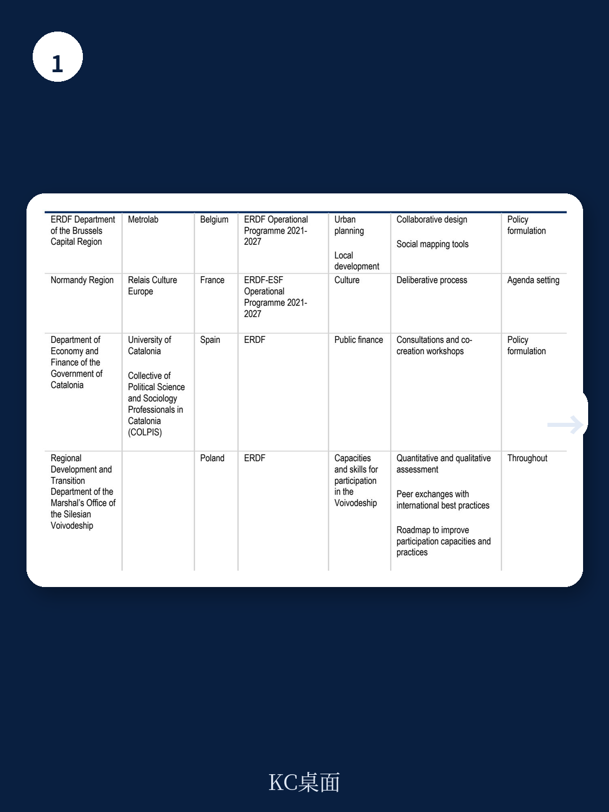
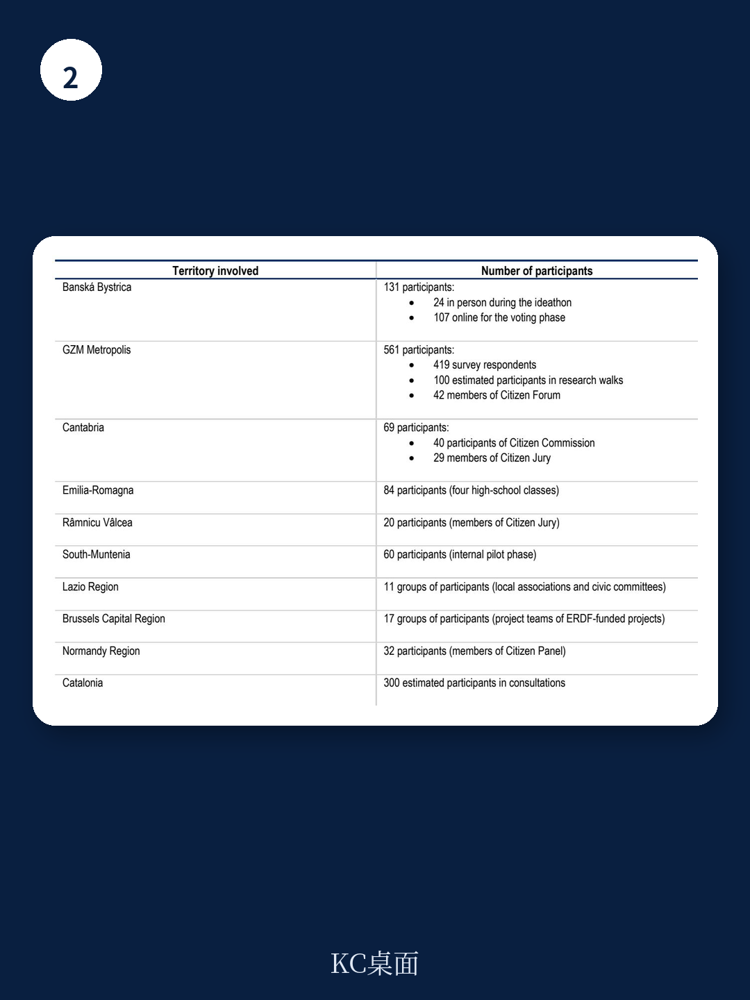

# 经合组织：行业规则与主题变化观察

欧盟凝聚政策是其最大的研究战略，每年投入数百亿欧元用于缩小区域发展差距。但一个长期存在的问题是：这些资金是否真正反映了当地居民的需求？经合组织与欧盟委员会区域与城市政策总司合作，在7个欧盟国家的11个地区设计了不同类型的公民参与试点，试图回答这个问题。这份报告的核心判断是：当参与机制被精心设计并嵌入政策周期时，它不仅能提升政策精准度，还能增强公众对机构的信任感——但前提是，参与不能停留在实验阶段。

## 1. 试点覆盖多种参与形式，从审议到预算咨询均有实证

11个试点分布在比利时、法国、意大利、波兰、罗马尼亚、斯洛伐克和西班牙，测试了七种不同的参与方法。法国、波兰和罗马尼亚采用了代表性审议过程——通过分层抽签选出公民小组，学习议题、讨论并形成建议。西班牙的坎塔布里亚地区则设计了多利益相关方论坛，让公民、专家和民间组织共同参与政策设计。意大利的艾米利亚-罗马涅大区尝试了学生议会，将审议元素引入学校环境。斯洛伐克的班斯卡-比斯特里察市举办了“创意马拉松”，用开放创新方法识别和优先排序地方发展项目。

这些试点覆盖了交通、文化获取、区域发展和代际公平等多个政策领域。报告显示，参与方法不是一刀切的工具，而是一个可以根据政策阶段、议题复杂度和目标群体灵活组合的“工具箱”。

> **KC评论：** 许多地方政府对“公民参与”的理解仍停留在公开听证会或在线问卷。这11个试点的价值在于展示了更精细化的选择：当需要处理复杂权衡时用审议，当需要收集广泛意见时用混合咨询，当需要监督执行时用公民监测。方法选择本身就是一个关键决策。

## 2. 参与提升了政策精准度，也改变了参与者对政府的认知

报告指出，公民参与帮助地方政府更准确地识别问题、发现瓶颈和盲点。居民作为基础设施和服务的日常使用者，能提供专业评估难以捕捉的细节。试点中，政策制定者利用这些信息调整了研究优先级，使决策更贴合地方实际需求。

更值得关注的是参与对信任的影响。经合组织2023年公共机构信任调查已经表明，“政治能动性”——即公民相信自己能够参与政治并且声音被听到的信心——是影响地方政府信任度的最强驱动因素。多个试点的参与者报告称，参与后他们感到自己的声音被听到了，对政府决策的理解和接受度也有所提升。报告特别提到，参与过程还提高了公众对欧盟在区域发展中作用的认识——这对一个常被批评“远离民众”的机构而言，是一个意外但重要的副产品。

## 3. 实施层面的挑战：政治支持、资源与制度周期的错配

试点过程中暴露的挑战同样值得关注。报告明确列出了几个关键障碍：政治和制度支持不足会降低公民意见影响决策的可能性；人力和财力资源有限；多层级治理结构下的协调困难；以及公民自身参与意愿的参差不齐。

最核心的问题是参与尚未被真正整合进凝聚政策的周期。现有的程序和时限几乎没有为有意义的参与留出空间，公民的贡献有时来得太晚，无法影响关键选择。这意味着，即使地方政府有意愿，制度惯性也可能让参与沦为形式。罗马尼亚的试点试图通过多层级协调来解决这个问题，但报告坦承，这需要持续的制度投入，而非一次性实验能完成。

## 4. 从实验到制度化：参与不应是“锦上添花”

报告的核心主张落在最后一章：公民参与不是“锦上添花”，而是凝聚政策合法性和成功的战略需要。在欧盟讨论下一个多年期财政框架的背景下，面对地缘政治紧张和重大转型，公众对公共支出有效性的期望越来越高。不把公民纳入优先事项设定和政策设计，将带来显著的政治不确定性。

报告提出了四个行动方向：加强参与的前提条件，包括法律、政策框架和制度安排；提升机构能力以建立参与文化；强化纵向和横向协调；将参与制度化并融入凝聚政策的全周期。具体到近期步骤，报告建议两条路径并行：一是从实验转向能力建设，让管理机构将参与内化为治理常规；二是在市镇层面继续扩大实验，将其作为民主创新的实验室。

这份报告的价值不在于提出全新概念，而在于用11个真实案例验证了一个常识：如果想让公共研究真正回应民众需求，就不能只在投票箱前听取民意。但报告也诚实指出，从实验到制度化，中间还有很长的路——需要政治意愿、资源投入和制度设计的同步推进。

For informational purposes only. Portions may be generated,translated,summarized,or edited with AI assistance based on source materials and may contain omissions or errors. Please verify independently. This is not investment,legal,tax,accounting,or other professional advice.

