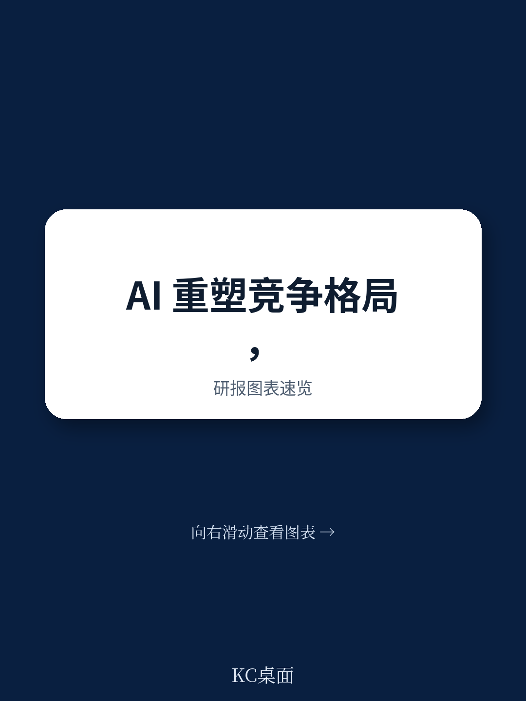
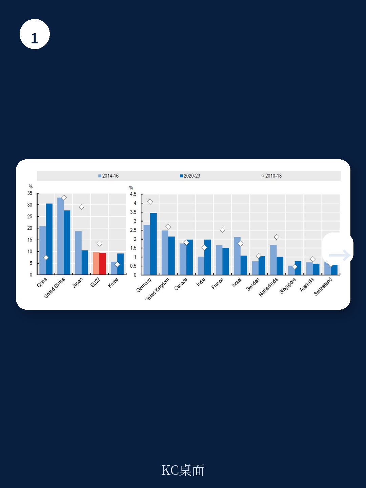
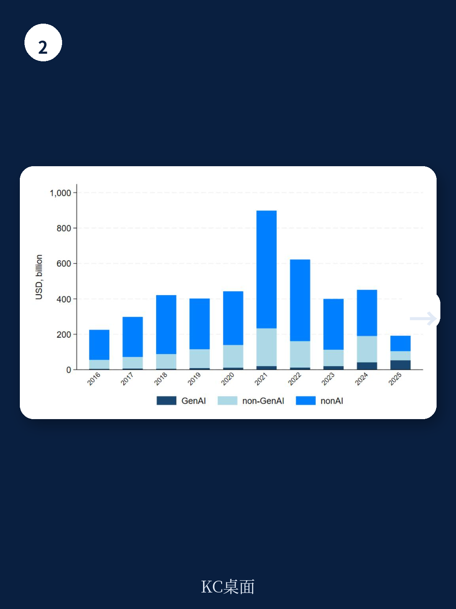

# 经合组织：AI时代的竞争格局

人工智能对市场竞争的影响，目前仍是一个缺乏系统实证的领域。经合组织最新发布的工作论文《Competition in the age of AI:initial evidence from microdata》试图填补这一空白。该报告构建了一个区分AI使用者与开发者、生成式AI与非生成式AI的分析框架，并基于法国、葡萄牙的企业级ICT调查数据、全球AI专利数据以及创业公司数据，给出了几项值得关注的初步发现。

报告的核心判断是：AI对竞争的影响目前呈现“动态但不均衡”的特征。非生成式AI的采用并未显著推高企业的市场势力，但生成式AI的扩散可能同时为小企业创造机会，并强化已有优势企业的地位。AI创新领域的集中度与销售集中度之间存在正相关，而AI专利活动则与更高的利润率增长相关——尤其是在ICT行业。

**KC评论：** 这份报告的价值不在于给出确定结论，而在于建立了一个可检验的分析框架。它提醒读者，AI对竞争的影响不能一概而论，必须区分技术类型、企业角色和行业特征。报告中的“尚未完全显现”这一表述，本身就是重要的政策信号。

## 1. 非生成式AI的采用与市场势力无明显关联

报告利用法国和葡萄牙2011至2022年的企业数据，比较了采用非生成式AI的企业与未采用企业在市场份额和利润率上的差异。结果显示，AI采用者通常规模更大、生产率更高，但其利润率并未显著高于非采用者。报告进一步分析了企业在市场份额分布中的位置变化，发现采用AI并未系统性地推动企业向上移动。

这一发现挑战了“AI必然导致市场集中度上升”的简单叙事。报告认为，非生成式AI作为一种通用技术，其竞争效应可能更多体现在生产率提升而非市场势力积累上。但报告也谨慎指出，当前AI采用率仍较低（2025年OECD企业平均仅20.2%），竞争动态可能需要更长时间才能充分显现。

## 2. 生成式AI的暴露度揭示机会与门槛并存

报告通过将企业层面的职业数据与职业层面的AI暴露度指标相结合，构建了一个企业特定的生成式AI暴露度指标。这一指标被解读为AI潜在采用率的代理变量。分析显示，生成式AI暴露度较高的企业往往规模更小、成立时间更短，这暗示生成式AI可能为市场新进入者提供机会。

然而，报告同时发现，生成式AI的优势更容易被那些已具备较强人力资本和互补资产的企业所利用。这意味着，生成式AI的扩散可能加剧而非缩小企业间的生产率差距。报告特别指出，这一发现与“AI民主化”的乐观预期之间存在张力。

**KC评论：** 生成式AI的“低门槛”与“高能力门槛”并存，是理解其竞争效应的关键。技术本身的可获得性并不等于有效利用的能力。报告中的这一区分，对于政策制定者设计AI支持政策具有直接参考意义。

## 3. AI专利集中度与市场集中度正相关

报告利用全球专利数据，分析了AI创新领域的集中度及其与市场集中度的关系。结果显示，AI专利活动高度集中：前4大专利持有者占全部AI专利的份额（CR4）在2001至2021年间持续上升。更重要的是，在行业-地理区域层面，AI专利集中度与销售集中度之间存在统计上显著的正相关。

报告进一步发现，在ICT行业（即AI作为产出的行业），拥有AI专利的企业其利润率增长显著快于其他企业。而在非ICT行业（AI作为投入的行业），这一效应并不明显。报告认为，这一差异表明，AI技术本身的所有权可能成为市场势力的来源，但仅限于那些AI本身就是核心产品的领域。

## 4. AI创业生态系统活跃但面临收购不确定性

报告分析了全球AI创业公司的融资与退出情况。数据显示，AI创业公司数量自2010年代以来持续增长，尤其是生成式AI创业公司在2022至2023年间吸引了大量不确定性研究。然而，这些创业公司被大型现有企业收购的频率也显著上升。

报告指出，收购行为本身具有双重效应：一方面，它可以为创业公司提供退出渠道和技术扩散途径；另一方面，它也可能导致“扼杀性收购”——即大型企业通过收购消除潜在竞争对手，从而抑制未来的创新和竞争。报告认为，这一领域需要更细致的监管关注。

## 5. 持续的监测是必要的政策回应

报告在结论部分强调，当前AI扩散仍处于早期阶段，竞争动态尚未完全展开。现有证据呈现的是一幅“动态但不均衡”的图景：既有新企业进入和市场活力的迹象，也存在创新集中和收购加剧的潜在不确定性。报告建议，政策制定者应建立持续的监测机制，确保AI技术促进创新和市场可竞争性，而非巩固现有主导地位。

报告同时指出，当前数据收集仍存在显著缺口，尤其是在AI使用和开发的全面覆盖方面。更系统、更及时的数据是有效监测AI与竞争关系的前提。

> **KC评论：** 这份报告的真正贡献在于它提供了一个可操作的分析框架，而非给出最终答案。对于关注AI产业政策的读者，报告中的“机会与门槛并存”“创新集中与收购不确定性”这两组张力，是未来观察AI竞争格局的核心坐标。报告没有给出政策建议，但它为政策讨论提供了必要的实证基础。

For informational purposes only. Portions may be generated,translated,summarized,or edited with AI assistance based on source materials and may contain omissions or errors. Please verify independently. This is not investment,legal,tax,accounting,or other professional advice.

