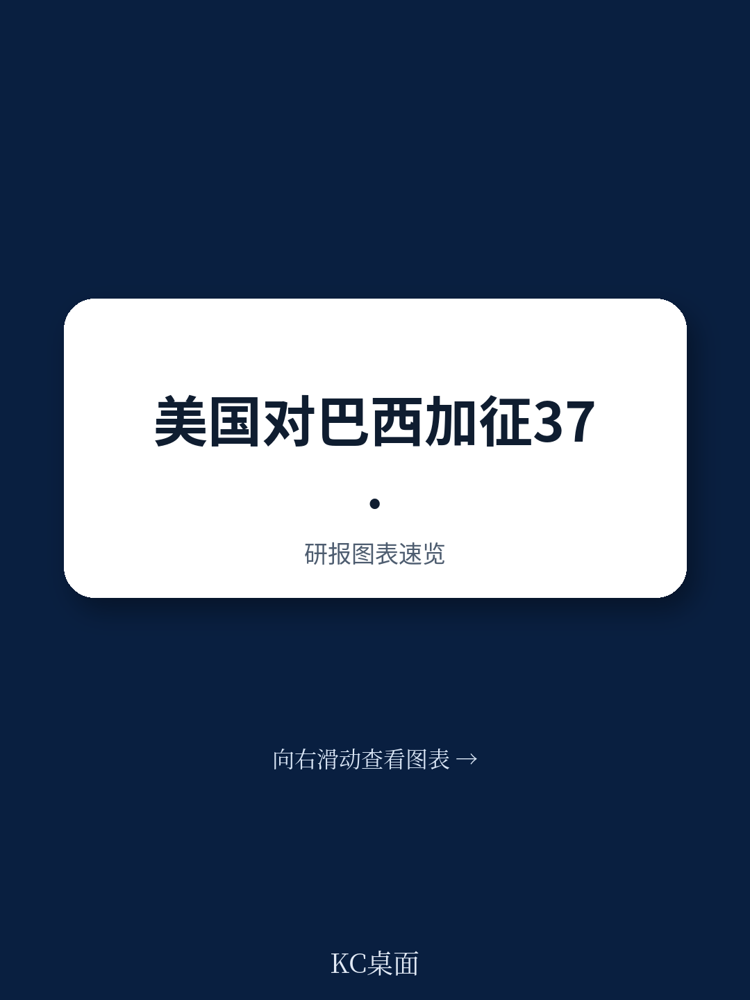

# 世界贸易组织：跨境贸易与行业变化观察

2026年7月27日，巴西向美国提交磋商请求，正式将美国依据《1974年贸易法》第301条款对巴西产品加征的两项额外关税诉诸WTO争端解决机制。这是自2025年2月以来美国对贸易伙伴实施一系列单边关税措施后，首个就301调查结果直接提起WTO诉讼的案例。巴西在请求中主张，美国对巴西产品加征的25%和12.5%额外关税违反了GATT 1994最惠国待遇原则和约束关税承诺，同时构成对DSU第23条关于禁止单边报复规则的违反。

## 1. 美国对巴西的两项301调查分别指向数字贸易与强迫劳动议题

美国贸易代表办公室于2025年7月15日启动针对巴西的第一项301调查，涵盖数字贸易与电子支付服务、所谓不公平优惠关税、反腐败执法、知识产权保护、乙醇市场准入以及非法毁林等六大领域。2026年6月1日，USTR认定巴西的相关行为、政策或做法不合理或具有歧视性，并提议对所有巴西产品加征25%从价附加关税。该措施自2026年7月22日起生效。

第二项调查于2026年3月12日启动，涉及巴西及其他59个地区未能有效禁止进口强迫劳动产品。USTR在2026年6月2日认定巴西未能建立并有效执行此类禁令，提议对巴西产品加征12.5%从价附加关税。该措施自2026年7月24日起生效。

两项关税叠加后，巴西原产产品进入美国市场需额外缴纳总计37.5%的从价关税，且不包含此前已存在的其他关税负担。

> **KC评论：** 巴西选择的诉讼切入点非常精准。它没有挑战美国301调查的事实认定，而是直接攻击程序合法性——美国通过单边调查和关税行动寻求贸易救济，而非诉诸WTO争端解决机制。这恰好触及DSU第23条的核心：WTO成员不得自行认定违规并采取报复措施。

## 2. 巴西的诉讼策略聚焦于最惠国待遇与约束关税两个GATT核心条款

巴西在磋商请求中提出了五项具体法律主张。第一，美国对巴西产品加征25%关税，而未对来自其他WTO成员的同类产品施加相同税率，违反GATT第I:1条最惠国待遇义务。第二，在强迫劳动调查中，美国对不同地区适用不同税率（对部分地区仅加征10%，对巴西则适用12.5%），同样构成最惠国待遇违反。

第三，两项附加关税均导致巴西产品在美国海关的实际税负超过美国在GATT下的约束税率，违反第II:1(b)条。第四和第五项主张则指向DSU第23条——美国通过单边认定和关税行动寻求贸易救济，而非遵守WTO争端解决规则。

值得注意的是，巴西在请求中明确保留在磋商及后续专家组程序中提出进一步事实和法律主张的权利。这意味着巴西可能在未来阶段补充更多证据或援引其他WTO协定条款。

## 3. 美国关税法律依据的变动为本案增加了程序复杂性

本案一个独特背景是美国关税法律依据的多次变更。2025年4月，美国最初依据《国际紧急宏观环境权力法》对巴西加征10%关税。2026年2月20日，美国最高法院裁定IEEPA不授权总统征收关税，迫使美国终止该措施，转而依据《贸易法》第122条加征10%临时关税。该临时关税于2026年7月24日到期。

正是在这一法律依据变动的窗口期，美国完成了两项301调查并实施了新的附加关税。巴西在请求中明确将这些301关税措施列为争议对象，但未直接挑战此前已失效的IEEPA或第122条关税。这种选择性的诉讼范围表明，巴西试图将争议焦点锁定在程序合法性最薄弱的环节——301调查的单边性质，而非关税本身的法律依据是否充分。

## 4. 本案可能成为WTO争端解决机制应对单边贸易措施的重要测试案例

自2025年2月美国启动“对等贸易与关税”政策以来，多个贸易伙伴面临类似的301调查和附加关税。巴西此次率先启动WTO诉讼，其法律论证框架可能被其他受影响地区借鉴。如果专家组或上诉机构认定美国301关税违反DSU第23条，将直接动摇美国以单边调查为基础实施贸易制裁的合法性基础。

但本案面临的实际挑战同样显著。WTO上诉机构自2019年底停摆至今仍未恢复，这意味着即便专家组作出裁决，美国仍可能通过上诉将案件拖入“法律真空”状态。巴西在请求中援引DSU第23条，本质上是在要求WTO确认其争端解决机制对成员行为的排他性管辖权——这一主张的法律价值可能远超本案的具体关税金额。

> **KC评论：** 巴西选择在两项301关税生效后立即启动磋商，时间点值得关注。2026年7月22日和24日关税生效，7月27日即提交磋商请求。这种节奏表明巴西政府对此案的法律准备已相当充分，而非临时应对。对于关注WTO争端解决机制走向的观察者，本案的专家组组成和程序推进速度将是重要信号。

For informational purposes only. Portions may be generated,translated,summarized,or edited with AI assistance based on source materials and may contain omissions or errors. Please verify independently. This is not investment,legal,tax,accounting,or other professional advice.

