# How to Build a Reader

# Evidence from a Scalable Literacy Intervention in Ghana

Erik T. J. Andersen

Simon Graffy

Jason T. Kerwin

Monica Lambon-Quayefio

Development Economics
Development Research Group
July 2026

Policy Research Working Paper 11433

## Abstract

Addressing the massive test score gaps between rich and poor countries will require programs that are both high-impact and scalable. This study uses the results of a randomized controlled trial in low-fee private schools in Ghana to study a program that meets both needs. The Tools for Foundational Learning Improvement program increased test scores by 0.5 standard deviation after just nine months of intervention. A machine learning method decomposes the effects by predicted test scores if the students did not receive the treatment, and the findings show that the gains were larger for weaker students. Moreover, the program's impacts scale roughly linearly with time compared to a shorter-term, smaller-scale pilot randomized controlled trial. The program's developers used generative artificial intelligence to accelerate lesson plan development and adaptation to new settings. An observational pilot test of this adaptation in Uganda yielded comparable results to those of this study's randomized controlled trial. The study developed a model in which basic skills constrain the development of advanced skills, which predicts the pattern of effects observed across early reading capabilities, and it makes forecasts about the future impacts of the program as it continues into second grade.

# How to Build a Reader: Evidence from a Scalable Literacy Intervention in Ghana

Erik T. J. Andersen, Simon Graffy, Jason T. Kerwin, and Monica Lambon-Quayefio\*

Authorized for distribution by Sergio Schmukler, Lead Economist, Development Research Group, World Bank Group

JEL Codes: I21, I25, O15

Keywords: Economics of Education, The Learning Crisis, Structured Pedagogy, Differentiated Instruction, Human Capital, Generative AI, Development Economics

The learning gaps between the world's poorest and richest countries are staggering. In 2021, South African fourth-graders scored 2.99 standard deviations (SDs) lower on reading than their counterparts in Singapore (PIRLS 2021). This gap is almost four times as large as the black-white test score gap for fourth graders in the United States (NAEP 2022). Indeed, these gaps are so massive that it is rare to even measure the richest and poorest countries using the same exam: South Africa is the only country in Sub-Saharan Africa that participated in the PIRLS, and it is one of the richest countries on the continent. A 3-SD gap between the poorest and richest countries is therefore likely to be a lower bound.

Addressing these gaps will require changes that are far more ambitious than the ones that governments have typically tried in the past. The average education program raises reading test scores by just 0.20 SD (Evans and Yuan 2022); we would have to repeat such a program more than 15 times to bring African reading scores up to rich-country levels. Whether these gains are cost-effective in dollar terms matters very little, as it is logistically impossible to actually run one of these programs over a dozen times.

We present the initial results from a promising approach to this challenge. Our data comes from a randomized trial we conducted with the education non-profit Inspiring Teachers, in which we evaluated their program, Tools for Foundational Learning Improvement (TFLI). TFLI is a smartphone-enhanced structured pedagogy program where teachers are given upfront training on the science of reading, and equipped with high-quality, semi-scripted lesson plans linked with student workbooks, to run daily literacy lessons and given coaching. The program incorporates a digital layer; teachers and coaches assess children's literacy skills and are provided with integrated student tracking, coaching management tools, and training videos through a mobile app called SmartCoach. We study the effects of the program's literacy model, Inspiring Reading, on first-grade students in low-fee private schools in the Central Region of Ghana. We randomly assigned 80 schools to either the Inspiring Reading program or a control group during the 2024-25 school year, and measured outcomes using end-of-year Early Grade Reading Assessments (EGRAs). We complement the data from the assessments with the survey data. The Inspiring Reading program will continue for the same cohort of students for two additional years, until the end of grade 3.

The program causes large increases in student learning: our pre-specified primary outcome, overall EGRA reading scores, increases by 0.504 SDs ( $p = 0.011$ ) which is the equivalent of more than two years of progress under the status quo. This puts TFLI at the $91^{\text{st}}$ percentile of all reading interventions within the first of what will be three years of the program. The effects on individual components of the reading score are consistent with the program's theory of change. The largest effects are on mapping letters to sounds ( $d = 0.764$ , $p < 0.001$ ) and phonemic awareness ( $d = 0.712$ , $p < 0.001$ ), which are the key skills targeted by the program in grade 1. The impacts on oral reading fluency and reading comprehension are smaller and do not reach conventional levels of statistical significance, although they are quite large relative to typical impacts in the literature ( $d > 0.2$ ). These are downstream skills that the program is building toward, and where effects are more likely as students progress through the program in grades 2-3.

We present extensive evidence that these impacts are real and not artifacts of our research design. We pre-specified a single primary outcome and the exact data analysis that we would run, so the p-value for that main test can be interpreted literally. Our findings are also robust to a wide range of robustness checks that vary the controls and address the small level of school-level non-compliance with treatment assignments, with point estimates ranging from 0.44 to 0.52 SDs. $^{1}$ The attrition rate was just 20%, nearly identical across study arms, and not differentially correlated with covariates by treatment status; we nevertheless compute Lee bounds and find a treatment effect range of 0.40 to 0.54 SDs, with both ends being statistically significant. Our exam scores come from an internationally standardized test (the Early Grade Reading Assessment); the NGO was blinded to the content of the test until the exams began, and the tests were administered by external contractors. We ran a separate experiment to estimate potential demand effects, randomizing whether each student was tested by an enumerator who was from the teaching profession. Assessor type matters for average scores but has no differential effects by study arm.

To understand how TFLI achieved such large effects so quickly, we develop a model of skill formation in which basic skills constrain the development of advanced skills. The model predicts that it is optimal to differentiate instruction: we should teach the basics to children with lower skills and advanced materials to children who are higher-skilled. It also predicts that high teaching quality and targeted instruction are complements, so that programs that combine the two approaches (structured pedagogy and targeted instruction) will have particularly large impact. TFLI operationalizes this approach, providing scripted lesson plans and workbooks (to improve teaching quality) along with regularly-scheduled targeted instruction (for differentiation of instruction). Moreover, the SmartCoach app helps to enhance both components, easing the management of program adherence for coaches and also the process of assessment and differentiation for teachers.

Consistent with the model, we see the largest impacts on the most basic skills: letter sound knowledge and initial sound identification. More advanced skills progress by less. We also see stark variation in the effects of the program across the distribution of test scores. In particular, there are large and statistically significant reductions in the fraction of students who cannot recognize words or read any words in a passage, both of which fall by over 40%. Impacts at the higher end are smaller, which is consistent with the program building basic skills more at this grade level. The effects also appear to be larger for male students; control-group girls are ahead by 0.26 SDs, and the treatment closes two-thirds of this gender gap. More broadly, the program appears to be most beneficial for weaker students, consistent with its design focus on supporting teachers in using assessment-informed instruction and in-classroom remediation.

We cannot decompose our treatment effects by students' initial test scores because there were no baseline exams. Instead, we use machine learning methods to predict the endline test scores for the control group, and then generate these predictions for the treatment group as well. We test for treatment effect heterogeneity by these counterfactual untreated outcomes. We see consistent increases across the ability distribution for most skills, with stronger treatment effects for initial sound identification among students we predict would perform worse without treatment. There are also distinctly lower treatment effects for the strongest students on the reading speed tasks, as well as for our overall reading score index. This and our other analyses are consistent with the prediction that weaker students and weaker skills are targeted more by the intervention.

We see evidence for a number of potential mechanisms for the treatment effects. A pre-specified index of teaching quality improves by nearly 2 SDs, with notable gains in key phonics activities such as having learners say the same correct sounds as the teacher and blending sounds to make words. Classroom observations also reveal increases in the teacher moving around the room and in student engagement with the workbooks. Student self-perceptions appear to improve, with statistically significant reductions in students thinking they are at the bottom of the class. Students are also more likely to practice reading at home, in line with previous evidence on shifting beliefs about relative performance (Dizon Ross 2020).

To further test these mechanisms we run an A/B test to examine how further enhancements to teaching quality affect test scores. A/B tests are rapid randomized experiments that allow organizations to improve their operations (Angrist, Cullen, and Magat 2025). We tested an intervention in which school leaders (principals) were trained to provide additional coaching to teachers on their implementation of the program, with the goal of improving teaching quality. Using a lower bar for statistical significance (which is standard in A/B testing (Azevedo et al., 2020)), we see evidence of gains in quality from this intervention. The effects on learning are not yet distinguishable from zero, but based on these findings Inspiring Teachers is continuing the intervention in the 2025-26 school year. Moreover, the impacts on learning are quantitatively consistent with our model: we see larger relative effects on more-advanced skills, with the impact on reading speed being $70\%$ of the main treatment effect, while the impact on letter sound recognition is just $10\%$ of the main effect.

Our model makes specific predictions about the program impacts we expect to see in second grade, which we will test in future data collection for the project. Specifically, we expect to see larger gains in more advanced skills now that students have developed the basic reading skills that constrain them. We also expect to see higher gains in advanced skills for students who are further up the skill distribution at the end of grade one, and lower gains for those who are at lower levels.

The impressive gains achieved by TFLI have important policy implications because the intervention is scalable both over time and across space. We conducted a previous small-scale pilot RCT during the 2023-24 school year; the intervention ran in four randomly-assigned treatment schools that year for just four months. Comparing those treatment schools to four randomized control schools, we see gains of 0.25 SDs, with the impacts distinguishable from zero despite the small sample size. Moreover, the actual RCT results in 2024-25 are very close to what we would have extrapolated from this pilot based on the additional time spent in the program: the program ran for 2.25 times as long and had effects that were nearly 2.25 times larger. This suggests that continued exposure to the program may raise test scores almost linearly, so we can expect gains of over 1 SD by the time the program finishes at the end of grade three.

The intervention is also designed to be scaled across space, not just within Ghana but also across Africa. Within Ghana, Inspiring Teachers is already scaling up the program to more of the country and to different kinds of school. It is currently running in 139 schools in the 2025-26 academic year, including in 80 government schools. The organization has been invited to expand to 400 government schools and 100 low-fee private schools in 2026-27, and is collaborating with the national and regional offices of the Ghana Education Service to roll out TFLI in all 1,638 government schools in the Central Region by 2029-30. This expansion is slated to be highly cost-effective: the current marginal cost of the program is \$48 per student, and so the cost per 1-SD gain is \$96, which already makes the program competitive with existing interventions. By 2029, Inspiring Teachers' budget model predicts the cost will drop to \$6 per student, which would make it extremely cost-effective if its current effectiveness can be sustained.

Scaling TFLI across Africa more broadly will require adapting the materials to other local contexts, education systems, and languages of instruction. It has two key advantages on that front. First, TFLI is currently English-language-first, which means that it can in principle be used across all of Anglophone Africa. It works even though English is not the native language of our study sample: TFLI has achieved significant gains in learning despite just 15% of our sample speaking English at home. This means it can serve as a complement to existing mother-tongue-first instruction programs. Second, TFLI's lesson plan developers use a component-based design system (where lessons are assembled from a common pool of adaptable components) and generative AI tools to accelerate lesson guide and workbook development. This allows Inspiring Teachers to efficiently leverage a highly scarce talent pool—highly-skilled instructional designers, which are rare not just in Africa but around the

world.

The organization is already using this tool to adapt the program to Uganda. They ran a preliminary pilot test of the program in Kanungu District during the 2025 school year, covering grade 1 classrooms. The pilot was not randomized, but they did post-intervention tests in both the program schools and in similar nearby schools. A regression-adjusted comparison of the mean test scores, following our specification for the main RCT, yields a difference of 0.514 SDs. These results suggest that the genAI-assisted curriculum adaptation approach can help the program scale to other countries with different early-grade reading curricula. Inspiring Teachers is in talks to do this in Zambia. TFLI has the potential to substantially narrow the learning gap between schools in Africa and those in the developed world.

Our results make contributions to four strands of the economics literature. First, we provide additional evidence that it is possible to drastically improve test-scores in learning-impoverished contexts. Previous work has shown that two types of intervention are capable of achieving impacts larger than half a standard deviation. The first is targeted instruction, which has proven benefits in a number of contexts (Duflo, Dupas, and Kremer 2011, Banerjee et al. 2007, Muralidharan, Singh, and Ganimian 2019) including in Ghana (Beg, Fitzpatrick, and Lucas 2023) and has been successfully scaled up (Banerjee et al. 2017). Angrist and Meager (2023) argue that targeted instruction has impacts of 0.9 SDs when implemented with high fidelity; fidelity (and, concomitantly, impacts) vary substantially across studies. The second is structured pedagogy, which has achieved large impacts in both local-level randomized trials (Piper et al. 2018c, Eble et al. 2021, Buhl-Wiggers et al. 2024) and at national scale (Piper et al. 2018a). It is also a key component of the extremely high-impact programs studied in Gray-Lobe et al. (2022) and Fazzio et al. 2021. We contribute to these existing findings by showing that large gains are achievable after just one grade of exposure, and using English-first instruction, despite most students speaking a different language at home.

Second, we show that targeted instruction and structured pedagogy can be combined successfully. While these two types of intervention are proven to have large impacts on their own, they have rarely been combined. Existing work on combining the two approaches uses observational data to show large impacts that are plausibly causal (Ibrahim et al. 2024). We build on this earlier work by randomizing the roll-out of an intervention that combines structured pedagogy and differentiated instruction, and we show that this combination works in a totally different context. These findings are part of a literature that studies complementarities between educational interventions (Mbiti et al. 2019, Kerwin and Thornton 2021, List, Livingston, and Neckermann 2011). We do not explicitly randomize the two aspects of the program, but our results, complemented by our theoretical framework, suggest that the two aspects of the intervention are complementary rather than substitutes.

Third, we contribute to the theory of how differentiated instruction works. This is part of a broader literature about dynamic complementarities (Cunha and Heckman 2007, Heckman et al. 2026). That literature has the feature that skills beget skills, sometimes called the “Matthew Effect”. We build on this idea to develop a model in which basic skills constrain the development of more-advanced skills, which is a key assumption underlying the literature on “teaching at the right level”, or TaRL (see e.g. Banerjee et al. (2017)). We build on this literature in two ways. First, we link it to work on differentiated instruction & TaRL, showing when it is optimal to teach to the bottom of the distribution versus the top. Previous theoretical work on differentiated instruction has assumed that targeting instruction to a student’s learning level is beneficial (Duflo, Dupas, and Kremer 2011); we derive that result from an underlying model of skill formation.

Fourth, we contribute to the existing body of research for dynamic complementarities from randomized experiments (Bettinger et al. 2023, Shaikh 2025, Carneiro et al. 2025). $^{2}$ We complement these studies by showing that our framework makes specific, testable predictions about the pattern of treatment effects that match what we observe in the data so far, as well as what we should see in future rounds of data collection.

The remainder of the paper proceeds as follows. In Section 1 we describe the setting of the study and the TFLI intervention. We describe the data that we rely on in Section 2 and the empirical strategy we use to analyze it in Section 3. Section 4 presents the results, and Section 5 discusses evidence of the scalability of the intervention both over time and across space. In Section 6 we interpret the results through a model of skill formation. Section 7 concludes.

## 1 Context and Intervention

## 1.1 Primary Education in Ghana

In Ghana, primary education (known as basic education in the country) starts with two years of compulsory kindergarten, beginning at age four. These are followed by Basic 1 (B1), which typically starts at 6 years of age. B6 is the last year of primary school and is followed by three years of junior high school (JHS1-3). Students take the Basic Education Certificate Examination (BECE) at the end of JHS3; passing the BECE is required to enter senior high school (SHS), which runs from SHS1 to SHS3. $^{3}$ Primary schooling is delivered through both private and public schools. Public schools are free, while private schools include low-fee schools that are accessible to the poor as well as high-end schools that are much more expensive. According to Ministry of Education (Ghana) and UNICEF and Ministry of Education (Ghana) (2023), teachers in public schools are typically highly trained compared to teachers in private schools, especially at the basic level.

Ghana, like many low-and-middle income countries, has a high prevalence of low-fee private schools that offer primary education (Brion 2020). These schools are often concentrated in urban areas; some also exist in rural areas where the reach of public schools is limited. Low-fee private schools became more common in the wake of the inception of the Millennium Development Goals (MDGs), and aimed to fill the gap between the supply of public schools and the demand created by MDG 2, which called for free primary education for all. They also served to provide a choice to parents who were dissatisfied with government schools (Day Ashley et al. 2014). Typically, low-fee private schools in Ghana are independently-owned and run on a for-profit basis.

Although teachers in public primary schools have better formal training than those at low-fee private schools, urban households often opt for the latter. This is mainly driven by perceived quality, closer supervision of teachers, better learning environments, and historically better learning and schooling outcomes (Day Ashley et al. 2014; Akaguri 2014). Another attraction of low-fee private schools is that they often use English, which is Ghana's official language, and the lingua franca of the country (Brion 2020). This is potentially a selling point for parents because of its perceived economic returns and social status.

Government policy has attempted to promote the use of mother-tongue instruction (teaching students in the language they grew up speaking) from kindergarten through B3. However, the lack of clarity on language policy in the country as well as issues around teacher deployment, the large number of languages, parental demand for English, and shortages of materials have rendered the implementation of this policy weak and uneven. These factors, together with others, have contributed to poor learning outcomes in early grade levels (Curto and Keane 2025). In practice, schools employ a mix of local languages and English in early grade instruction depending on the teacher's capacity and the availability of teaching and learning materials.

Enrollment has increased substantially in Ghanaian primary schools over the past few decades, primarily because of the Free Compulsory Basic Education (FCUBE) policy introduced in 1995 and the Complementary Basic Education (CBE) program implemented from 2012 to 2018 among others. In contrast, learning outcomes, especially at the basic level, have not improved by much. An Early Grade Reading Assessment implemented by the USAID across 168 districts in Ghana showed that at the end of second grade, pupils could read an average of 2.5 words per minute, with about 77 per cent of the students unable to read a single word (Social Impact, Inc. 2018, UNESCO 2023). This pattern of increasing enrollment but low progress on learning is common across much of the developing world (World Bank Group 2018).

A series of ambitious reforms have been implemented since 2017 to improve primary-school learning outcomes in Ghana. These include the development of teacher standards, a new curriculum, and new assessments, all with the aim of improving accountability and learning outcomes at the basic level of schooling. The standards-based curriculum introduced in 2019 emphasized foundational knowledge, including literacy and numeracy. Alongside this new curriculum are standardized tests at B2, B4, B6, JHS2, and SHS1 that are used to progressively test core competencies in literacy and numeracy (Ministry of Education Ghana). These tests are not used to determine student advancement, only to measure outcomes.

## 1.2 The TFLI Intervention

Tools for Foundational Learning Improvement (TFLI) is a smartphone-enhanced, structured pedagogy program designed to support teachers to deliver consistently high-quality early-grade instruction. We focus on the Inspiring Reading Program, which is the initial version of TFLI aimed at literacy skills. This program was approved by Ghana's National Council for Curriculum and Assessment and is aligned with the Ghanaian national curriculum and the Ghana National Teaching Council's continuing professional development points framework.

Each term, teachers receive a teacher guide containing daily lesson plans and a set of aligned student workbooks. Lessons follow a consistent pedagogical routine and are semi-scripted to enable them to be used in real time during classes. The student workbooks are designed to make learning visible, allowing teachers to monitor pupil responses during lessons, make in-the-moment instructional adjustments, and identify learners requiring additional support. See Appendix I for examples of pages from the teacher guide and student workbooks. The program features a digital layer, which teachers and coaches interact with through a smartphone app called SmartCoach.

The teacher guide, workbooks, and SmartCoach app support four integrated components: (i) upfront training in evidence-based literacy instruction; (ii) daily structured lessons supported by teacher guides and student workbooks; (iii) smartphone-based reading assessments and student progress tracking; and (iv) data-driven coaching and program management.

## (i) Upfront Training in Evidence-Based Teaching

Teachers participating in the study received two days of upfront training prior to program implementation, followed by a one-day refresher training before each subsequent term (four days of training in total). Training introduced teachers to the 12 core pedagogical routines that underpin the program, as well as the “science of reading” principles that inform their use. $^{4}$

The training model is designed to help teachers understand how each routine targets specific foundational reading skills. Teachers practice these routines in small groups to prepare for classroom implementation. Training is reinforced through short instructional videos embedded within the SmartCoach app, which teachers can access during the school term.

## (ii) Daily Lessons Aligned with the Science of Reading

Instruction follows a consistent five-day instructional cycle. On Days 1–4, teachers deliver a one-hour structured literacy lesson grounded in the science of reading. Instruction integrates systematic phonics within a broader instructional sequence that progresses from oral language development to phonics, and subsequently to reading and writing.

Day 5 of each cycle is dedicated to assessment and remediation. Teachers administer a brief whole-class assessment aligned to the week's instructional content and provide targeted reteaching or additional practice based on pupil performance. These 5-day cycles are designed to match a school week, but they also can be used on any day of the week in the case of school holidays.

## (iii) App-Based Reading Assessments and Student Tracking

Each term, teachers conduct one-on-one oral reading fluency assessments with every pupil in their class using SmartCoach. During the assessment, pupils read a short passage aloud for one minute while the teacher records errors. The application automatically times the assessment and calculates reading speed and accuracy. SmartCoach aggregates these data to generate a class-level summary that is organized by reading proficiency, enabling teachers to monitor pupil progress over time and identify learners who are falling behind and may require targeted support.

## (iv) Data-Driven Coaching and Program Management

Once the up-front training has occurred, school leaders and field staff use SmartCoach to conduct structured lesson observations and provide teachers with instructional coaching. The app includes observation checklists and decision-support tools that guide observers and generate targeted feedback for teachers, with the aim of making coaching more specific and actionable.

At the program management level, data captured through SmartCoach (including assessment completion, coaching activity, and lesson delivery) enables monitoring of implementation fidelity. This data is used to identify classrooms where program components are not being implemented as intended and to plan targeted follow-up support. During the 2024-25 school year that is the focus of this paper, this process was managed through a combination of spreadsheets and a database; subsequent iterations of the program have consolidated these functions within a web-based management dashboard.

## 2 Experiment and Data

Our data comes from a randomized trial in Ghana's Central Region, centered around Cape Coast. Treatment ran in B1 (first grade) classrooms for the 2024-25 academic year. We collected data at the end of the intervention in June 2025 over a two-week period. We did not collect any data at baseline beyond basic information about the schools.

Our sample was 80 low-fee private schools spread throughout the Central Region (Figure 1) selected by Inspiring Teachers based on interest in the program. The schools are independently owned; Inspiring Teachers does not own any schools. To be eligible, schools had to charge fees of 400 Ghanaian cedis per term (1200 cedis/year), which is about 5 percent of median household income (Ghana Statistical Service 2019). Of these, we randomly assigned 40 schools to receive the treatment in September of 2024. Because of challenges recruiting schools to participate in the intervention, and the necessity of beginning the program as close to the beginning of the school year as possible, we randomized batches of approximately 20 schools at a time over the course of a few weeks. Each batch was the 20 schools Inspiring Teachers was most easily able to contact and convince to join the program since the last batch. The randomization was stratified by batch and, within batch, by school size. We targeted a stratification cell size of 4 schools, following the best practice recommended by McKenzie (2025). Due to ties in the school size variable some cells had either 3 or 5 schools. $^{5}$ The randomization produced study arms that are balanced on baseline covariates $^{6}$ ; randomization inference F-tests of overall balance following Kerwin, Rostom, and Sterck (2025) yield p-values of 0.60 for student-level characteristics and 0.55 for school-level characteristics (Table 1).

Four of the schools in the sample received the opposite of their assigned treatment status due to administrative errors. These arose due to a combination of the batched design of the randomization and the fact that many schools have extremely similar names. As a result, two of the control schools actually received the intervention and two of the treatment schools did not receive it. Our estimates use an intention-to-treat approach, analyzing the effect of the randomly assigned treatment rather than the actually-received treatment. We also show that this does not make a substantive difference for our results.

In addition to the main experiment, we also conducted an A/B test among the 40 treatment schools, changing part of the program implementation to try to improve it. $^{7}$ This A/B test gave additional training to school leaders (principals) to enable them to provide coaching to the teachers in their schools, supplementing the coaching provided by Inspiring Teachers staff. 20 of the schools were assigned to receive the school leader coaching, and the other 20 were not.

Over the year the intervention ran, four schools closed down—two treatment and two control—so we had 76 total schools for our endline data collection. The 80 schools in our initial sample had 1,642 first-graders on their rosters at the beginning of the year. Not all schools provided age or gender information on their students on baseline lists. We were successfully able to find 1,322 students at endline, which is a 20% attrition rate. Attrition rates were not differential between treatment and control schools, and the patterns of attrition by baseline covariates do not differ substantially by study arm (Table A1). $^{8}$ We test for balance in this post-attrition sample using an expanded set of exogenous variables that we collected at endline. The post-attrition sample is balanced on student characteristics (overall balance p-value = 0.20), teachers (p = 0.92), school leaders (p = 0.52), and schools (p = 0.26) (Appendix Tables A2, A3, A4, and A5).

<table><tr><td rowspan="2"></td><td colspan="4">Table 1Balance Table</td></tr><tr><td>(1)Control Mean (SD)</td><td>(2)Treatment Mean (SD)</td><td>(3)Reg. Adj. Diff (T-C)(p-value)</td><td>(4)Obs.</td></tr><tr><td colspan="5">Panel A: Student-Level Variables</td></tr><tr><td>Male</td><td>0.537(0.018)</td><td>0.535(0.019)</td><td>-0.005(0.842)</td><td>1,439</td></tr><tr><td>Student Age (Years)</td><td>6.605(0.035)</td><td>6.486(0.036)</td><td>-0.111(0.256)</td><td>1,376</td></tr><tr><td>Joint F-stat (omnibus, unadjusted)</td><td></td><td></td><td>0.64</td><td></td></tr><tr><td>RI p-value (permutation)</td><td></td><td></td><td>0.60</td><td></td></tr><tr><td colspan="5">Panel B: School-Level Variables</td></tr><tr><td>Total Number of Students</td><td>190.154(21.407)</td><td>196.447(29.964)</td><td>20.613(0.189)</td><td>77</td></tr><tr><td>Number of Teachers</td><td>11.105(0.997)</td><td>11.794(1.346)</td><td>0.767(0.517)</td><td>72</td></tr><tr><td>Number of Grade 1 Students</td><td>22.757(2.117)</td><td>19.514(2.342)</td><td>-4.400(0.101)</td><td>74</td></tr><tr><td>Proportion Male</td><td>0.544(0.022)</td><td>0.548(0.026)</td><td>0.017(0.638)</td><td>74</td></tr><tr><td>School Fee (GHS)</td><td>174.207(18.720)</td><td>201.000(18.167)</td><td>27.547(0.317)</td><td>59</td></tr><tr><td>Joint F-stat</td><td></td><td></td><td>0.82</td><td></td></tr><tr><td>RI p-value</td><td></td><td></td><td>0.54</td><td></td></tr></table>

Notes: Sample is all students who were enrolled in one of the 80 study schools at the beginning of the 2024-25 academic year. Some rows have fewer than 80 schools because of missing data. Joint F-statistic based on (Kerwin, Rostom, and Sterck 2025). Differences in column 3 are estimated using a linear regression that controls for stratification cell indicators. Heteroskedasticity-robust standard errors, clustered by stratification cell, in parentheses (). \*: p < 0.1; \*\*: p < 0.05; \*\*\*: p < 0.01.

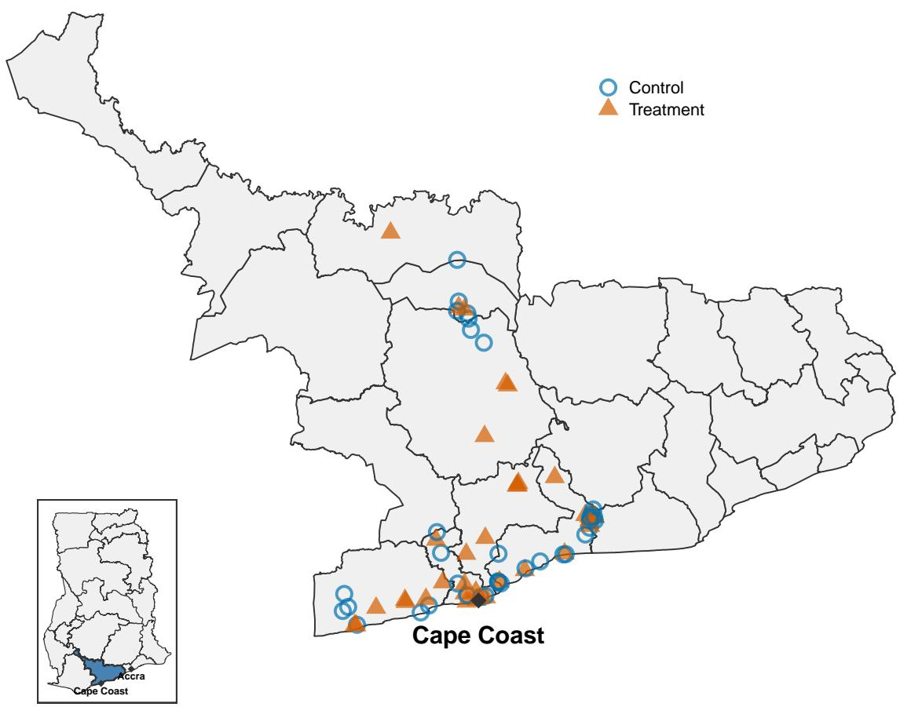  
In each first-grade class, enumerators ran early grade reading assessments (EGRAs), surveyed the students, teachers, and school leaders, and filmed one literacy lesson. We hired the 23 enumerators specifically for the endline data collection; they had no previous connection to Inspiring Teachers. Three of the enumerators were school improvement support officers (SISOs)—Ghana Ministry of Education staff hired with the intent of working with Inspiring Teachers in future years to support implementation of the intervention in government schools. 12 of the enumerators had experience as teachers or had worked in the education sector, including all three of the SISOs. To mitigate potential concerns about different enumerator backgrounds (external evaluator vs. stakeholder, education experience

vs. no experience) impacting EGRA evaluations, we randomized enumerators to schools and students to enumerators within a school, finding no evidence that this matters for our results.

To further ensure validity of the EGRA tool and prevent teaching-to-the-test, we imposed strict controls on the contents of the examination. The only member of the Inspiring Teachers staff that saw the EGRA contents before endline data collection were the SmartCoach development team who had to program the assessment into the app. We required these development team members to sign a nondisclosure agreement to maintain confidentiality of the questions. In particular, co-PI Simon Graffy, who directs the NGO, did not have access to the test questions.

## 2.1 Measure of Reading Ability - EGRA

We used an English language EGRA version to match the language of instruction. We included eight standard subtests to capture different reading skills, including listening comprehension, letter names, letter sounds, initial sound identification, familiar word reading, non-word reading, oral reading fluency, and reading comprehension. Our pre-specified, primary outcome is a combined index of all eight subtests. We constructed the index by taking the first principal component of the control-group data and applying those weights to the treatment group as well. $^{9}$ We specified the exact data-driven procedure for constructing the weights in the analysis plan we posted in advance of the beginning of data collection. We also report results for each of the subtests individually.

We arranged the subtests in order of increasing complexity. Listening comprehension does not require any ability to read, so it was first. In this subtest, the enumerator read a short passage to the student then asked them three questions about what happened in the story. Letter names and letter sounds are the next step in the complexity ladder: students do not have to be able to understand full words, but need to be able to recognize various properties of letters. For these subtests, enumerators showed students a grid of 100 letters and then asked the student to tell them the name of the letter or what sound it makes respectively. Slightly more complex is “phonemic awareness” (initial sound identification) which asked students to identify the first letter sound in a series of 10 words. $^{10}$ This is more challenging than looking at letters alone because students can be confused by the extra sounds in the word.

The next rung is for students to be able to combine letters and read words, so we tested familiar-word and non-word reading. Similarly to the letter subtests, students had a minute to read off words from a 50-word grid. Familiar-word reading included a mix of words students could sound out (or decode) using known phonics sounds $^{11}$ and also sight words that do not follow standard phonics rules. $^{12}$ Non-word reading tests only phonics skills. Non-words are collections of letters that do not form actual words, but can be sounded out using basic phonics rules. $^{13}$ Nearing the top of the complexity ladder was oral reading fluency. In this subtest, students were given a simple, short story of 56 words to read. This is more complex than familiar- and non-word reading because words are now strung together in a cogent order. This means errors can be serially correlated—if a student cannot read a word early on in a sentence, it may make it more challenging to read the rest of that sentence. Finally, the top of the complexity ladder is understanding what you read. In this final subtest, after reading the oral reading passage, students were asked five simple questions about what happened in the story, which the enumerator marked correct or not. These eight subtests give us a complete picture of a student's reading ability.

The specific EGRA we used was an adaptation of a previous exam run by the Ghana Education Service and RTI International in 2015. We supplemented this with modules used by Kerwin and Thornton (2021) in a large literacy intervention in Uganda in 2013. We used existing, vetted EGRA materials for several reasons. First, this boosted our efforts to avoid teaching-to-the-test. Since the materials were fully external and developed prior to our intervention there was no chance the materials could be contaminated by the program.

Second, because these materials had been used successfully in other research, this helped us avoid floor or ceiling effects that could limit our ability to detect the effects of the program.

The EGRAs were administered in-person, in a one-on-one setting by external enumerators between June 16 to 30 2025. The enumerators scored the EGRAs using SmartCoach, but used laminated sheets with the letter/word grids and story on them for the students to read from. The schools were aware that they were part of a study of the Inspiring Reading program, but the enumerator teams did not identify themselves as working for Inspiring Teachers. If asked, they were trained to explain that they do not work for the organization and that they were collecting data for a study being conducted by the University of Washington and the University of Ghana.

We employed an EGRA trainer with extensive experience training enumerators in Sub-Saharan African settings to run the EGRA-focused part of our endline data collection training. We required enumerators to achieve a minimum standard of inter-rater reliability with known correct test answers before they were hired.

## 2.2 Measure of Teaching Quality

To gain an understanding of how the intervention directly affected teaching quality in grade one literacy classes, we had enumerators observe and film a literacy lesson during the school visits. We do not currently use the filmed lessons for constructing our teaching quality measures, only the data collected during the live observation. The enumerators filled out the observation tool that Inspiring Teachers uses to track the progress of teachers in the program. The tool is similar to the World Bank's Teach Primary tool (Molina et al. 2018). Enumerators successfully observed a literacy lesson at 65 of our 76 schools; the 11 schools without observations were due to absent teachers, time constraints, and battery issues with the smartphones they used to do the recordings.

The tool measures both the quality of instruction, and adherence to the program. The key metrics for quality center around the learning climate, the nature of instruction (e.g., does the teacher use active learning techniques?), and whether the teacher regularly checks students' understanding the material. More specifically, the tool grades teachers on their actual instructional practices. For example, did the teacher actively model the phonics sound of the day? (and did they do so correctly?). The enumerators also observed student behavior, measuring if the students appear to be engaged, involved, and actually learning material during the class.

To measure adherence, the tool checks if teachers included all of the components during the lesson. These components are oral language, phonics, reading, and writing, which is the order and structure of a class period as prescribed by the intervention. Thus, the tool is opinionated toward what it considers “good” teaching. Beyond this, we also measured what proportion of the suggested number of lessons were actually run, what proportion of suggested assessments were run, whether the class used workbooks, whether the teacher used a teaching guide, and if the teacher sent home report cards. Some of these components can only be calculated for the treatment group because e.g. the control group does not have a suggested number of lessons. Through this we collect data not just on how well the treatment group complies with the intervention program, but also how different this is in the control curriculum.

## 2.3 Survey Measures

In the student survey, participants provided information on the demographic and socio-economic status of their households. Other sections of the survey cover learning behavior and study habits, academic self-perception, motivation, and academic and career aspirations. We also elicited information on perceptions of the classroom environment, the clarity of instruction, and the safety of the school environment.

The school leader survey measured demographics and professional experience for school leaders as well as their access to and use of digital tools, including smartphone ownership and use of the internet. We also asked about confidence levels in leading the coaching of teachers, and had the school leader report information about school enrollment and student performance and learning outcomes.

The teacher survey covered similar topics to the school leader survey. It also asked questions about teachers' participation in and implementation of the TFLI program and their assessment and instructional practices. The survey was administered to first-grade teachers whose students took the EGRA tests.

## 3 Empirical Strategy

Our empirical strategies rely on the random assignment of schools to the treatment or control group. Our primary outcome, regression equation, and inference method were all fully pre-specified in our analysis plan. $^{14}$ We run the following regression to analyze the data from our main experiment:

$$
Y _ {i j} = \beta_ {0} + \beta_ {1} T F L I _ {j} + Z _ {j} ^ {\prime} \tau + X _ {i} ^ {\prime} \gamma + \epsilon_ {i j}\tag{1}
$$

In this equation, $Y_{ij}$ is the outcome of interest and i indexes students, which are nested within their original schools indexed by j. $TFLI_{j}$ is the indicator for a school being randomly assigned to receive the TFLI program. $Z_{j}$ is a vector of indicators for the stratification cells used in the lottery that assigned schools to study arms. $X_{i}$ is a vector of control variables. We include the following pre-specified variables as controls: an indicator for being male, indicators for each value of age in years (at the beginning of the academic year), and the interactions between the two. We winzorize age at the $5^{th}$ and $95^{th}$ percentiles. We replace missing values of age or gender with separate categorical values and include those when building the categorical indicators and interactions, so that these missing values are dummed out in a fully nonparametric way.

de Chaisemartin and Ramirez-Cuellar (2024) note that in stratified experiments with small strata, the power and size of hypothesis tests are optimized by clustering inference at the level of a stratification cell rather than a school. We follow their guidance in constructing our standard errors, since we have an average cell size of four schools. All p-values for our main analyses are based on randomization inference with 1,000 permutations. We show via a set of ex ante simulations that randomization inference gives the same p-values as clustering standard errors at the level of the stratification cell; these simulations informed our analysis plan.

Our primary outcome is an index of all the subtests from the EGRA assessment constructed using the first principal component of the control-group data and applying those weights to the treatment group as well. Because this is our only primary outcome, we do not correct for multiple hypothesis tests. We report results from each subtest individually, but in line with our analysis plan we do not correct for multiple testing for these secondary outcomes. For the EGRA index, and each subtest, we report results in each test's natural unit (SDs for the index, the number correct per minute for every subtest besides listening and reading comprehension, and the number of correct answers for the comprehension questions), and also in Equivalent Years of Schooling (EYS). Typically EYS are calculated by rescaling the treatment effect by the progress from baseline to endline in the control group, but we did not run a baseline survey. We use the conversion factor from Evans and Yuan (2019) for Ghana to calculate EYS from our estimates.

We also use Equation 1 to estimate effects from the student and teacher surveys including students' perceived class rank, and career and academic aspirations.

In Appendix A, we show additional estimates without baseline controls, without stratification cells, and using the received treatment status rather than assigned treatment status $^{15}$ (Table A6). Although we do not have evidence of differential attrition (Table A1), we show Lee (2005) bounds in Table A7.

## 3.1 Enumerator Demand Effects

To test for and partial out any potential enumerator demand effects, we estimate the following regression. Because we randomized each enumerator-student assessment pairing, $\beta_{1}$ identifies the causal effect of being assessed by a particular type of enumerator.

$$
Y _ {i j e} = \beta_ {0} + \beta_ {1} E T _ {e} + Z _ {j} ^ {\prime} \tau + X _ {i} ^ {\prime} \gamma + \epsilon_ {i j e}\tag{2}
$$

where everything is the same as in Equation 1 except the following changes. e indexes the enumerator, and $ET_{e}$ is an indicator for an enumerator being of a particular type. We separately consider two indicators for enumerator type: 1) if an enumerator has teaching experience or not, and 2) if they are a SISO or not. We consider these two types in two separate regressions, and not together, because 100% of SISOs have teaching experience.

We report multi-way clustered standard errors using the following clustering scheme.

Each enumerator who visits a school defines a separate cluster; if two enumerators visit the same school, they form two distinct clusters. While each student is assessed by only one enumerator, the randomization design creates dependencies across all enumerators within a school that affect the test score variance structure. This clustering approach accounts for these dependencies and the dependencies for students within the same school. We validated this inference strategy via ex ante simulations and pre-specified it in the analysis plan.

We do not use randomization inference for Equation 2. This is because randomization inference tests the sharp null that the treatment effect of having an enumerator of a given type is zero for everyone, which is unlikely to hold in this context. It may be true that the average effect of being assigned an enumerator with teaching experience is 0, but since each enumerator is a different person, it is likely that within enumerator types, each enumerator has varying effects on test scores based on skill or experience running EGRAs, which would mean randomization inference would always reject the null even if the true average effect of being assigned a given type of enumerator is zero. Indeed, we can test this in our data and can easily reject the joint null hypothesis that all enumerator effects are zero for enumerators with teaching experience (p=0.01), and with no teaching experience (p=0.00). We cannot reject this null for SISOs (p=0.49) since only three enumerators are SISOs.

We also estimate treatment effect heterogeneity by enumerator type using the following regression.

$$
Y _ {i j e} = \beta_ {0} + \beta_ {1} T F L I _ {j} + \beta_ {2} E T _ {e} + \beta_ {3} T F L I _ {j} \cdot E T _ {e} + Z _ {j} ^ {\prime} \tau + X _ {i} ^ {\prime} \gamma + \epsilon_ {i j e}\tag{3}
$$

where the coefficient of interest is $\beta_{3}$ , which identifies the differential effect of the TFLI treatment depending on the type of enumerator who ran the assessment.

We report multi-way clustered standard errors with the following clustering scheme: at the stratification cell and at the treated-enumerator-school-level. Each treated enumerator (either experienced teachers or SISOs, depending on the specification) who visits a school defines a separate cluster. Because treatment was randomized at the enumerator level but multiple treated enumerators may visit the same school, outcomes for students in the same school are correlated both through shared school-level shocks and through exposure to the same enumerator. Multi-way clustering at these two levels accounts for both sources of dependence. We validated this inference strategy via ex ante simulations and pre-specified it in our analysis plan.

## 3.2 Quality and Compliance Effects

To test for teaching quality and compliance with the TFLI program, we construct the pre-specified indices described in Section 2. We analyze these in several ways. First, we use them as the outcome variable $Y_{ij}$ in Equation 1. We also estimate the following regression using two stage least squares using $TFLI_{j}$ as an instrument for $Compliance_{j}$ .

$$
Y _ {i j} = \beta_ {0} + \beta_ {1} C o m p l i a n c e _ {j} + Z _ {j} ^ {\prime} \tau + X _ {i} ^ {\prime} \gamma + \epsilon_ {i j}
$$

This lets us estimate how well the program would have worked with full quality/compliance, under the assumption that the effects of the randomized intervention operate only through compliance with the program.

The measures we use for teaching quality and compliance are generally measures of teacher behavior, but we collect test scores for each student. This gives us two different levels of aggregation at which to estimate treatment effects: student-level scores and teacher-level means. Aggregating to the teacher level discards much of the variation in test scores (and student-level covariates that can explain some of it), but leaving the data at student level implicitly weights treatment effects by class size. To reconcile this, we report results at both levels of aggregation for these variables.

## 4 Results

Our pre-specified primary outcome is the overall EGRA reading score. TFLI improves this measure by 0.504 SDs (p=0.011), equivalent to 2.2 years of status-quo instruction using the conversion factor from Evans and Yuan (2019). $^{16}$ Panel A of Table 2 presents effects on all EGRA components.

The treatment effects align with our theoretical framework and the program's emphasis on foundational phonics. Letter sound knowledge and initial sound identification increase by 0.76 and 0.71 SDs, respectively (both $p < 0.001$ ). Non-word reading increases by 0.55 SDs ( $p < 0.001$ ). These three core phonics skills drive the overall effect. More advanced skills show smaller gains. Familiar word reading and oral reading fluency increase by 0.31 and 0.20 SDs respectively, neither significant at conventional levels, although the former is quite close to the cutoff of 0.10. Reading comprehension increases by 0.25 SDs ( $p = 0.27$ ). This gradient from basic to advanced skills matches both our model's predictions and the program's first-grade focus on foundational literacy.

Listening comprehension and letter names are not skills emphasized by TFLI and show the smallest treatment effects (0.175 and 0.145 SDs). Letter name knowledge is also a skill emphasized in the status-quo curriculum. These skills, while important, stand farther from the phonics ladder of skills so it is unsurprising that students show smaller gains here.

These learning gains are very large even relative to those of other successful education programs, so we present a wide range of robustness tests to show they are real. Table A6 shows various different specifications where we vary using controls for age, sex, and stratification cell fixed effects. Because of an administrative error, the treatment statuses of four schools were reversed. In the even columns, we define treatment as actually receiving TFLI (as opposed to being randomly assigned to treatment) while the odd columns define treatment in the standard way. Finally, during the course of the academic year, four schools closed in one stratification cell, including both treatment schools. With no variation in treatment status, that cell is dropped from our regressions. $^{17}$ In columns 7 and 8, we pool the remaining school from that stratification cell into the cell with the next lowest number of students, so the school's data is retained by OLS. None of these specifications change our conclusions. The overall treatment effect estimates vary between 0.44 and 0.52 SDs, and all are significant at at least the 0.05 level.

Similarly, although we find no differential attrition across treatment arms (Table A1), Table A7 presents Lee bound estimates for the overall reading score and all EGRA subtests.

The upper and lower bounds for the overall index are both positive and significant at the 0.05 level, and are 0.554 and 0.400 respectively. This is also true for the subtests that showed the largest gains in our main analysis (letter sounds, initial sound identification, and non-word reading). For all other subtests besides familiar word reading (which did not have significant point estimates in our main specification), neither the upper nor lower bounds are significant. The upper bound for familiar word reading becomes significant at the 0.1 level.

SISOs do give systematically higher EGRA scores (Table D1), while teachers do not Table D2); neither pattern is systematically higher in the treatment group, and adjusting for enumerator type leaves our treatment effect estimates almost unchanged.

Table 2  
Causal Effects of the Intervention on Reading Scores

<table><tr><td rowspan="2"></td><td colspan="2">(1) (2)Overall ReadingPCA Index</td><td colspan="2">(3) (4)Listening Comprehension</td><td colspan="2">(5) (6)Letter Names</td><td colspan="2">(7) (8)Letter Sounds</td><td colspan="2">(9) (10)Initial Sound Identification</td><td colspan="2">(11) (12)Familiar Word Reading</td><td colspan="2">(13) (14)Non-word Reading</td><td colspan="2">(15) (16)Oral Reading Fluency</td><td colspan="2">(17) (18)Reading Comprehension</td></tr><tr><td>Equiv. Yrs. of Schooling</td><td>SDs</td><td>Score [0-5]</td><td>SDs</td><td>CLPM</td><td>SDs</td><td>CLPM</td><td>SDs</td><td>Score [0-10]</td><td>SDs</td><td>CWPM</td><td>SDs</td><td>CWPM</td><td>SDs</td><td>CWPM</td><td>SDs</td><td>Score [0-5]</td><td>SDs</td></tr><tr><td colspan="19">Panel A: Overall Scores</td></tr><tr><td>Treatment Effect</td><td>2.219</td><td>0.504</td><td>0.161</td><td>0.175</td><td>2.892</td><td>0.145</td><td>13.371</td><td>0.764</td><td>2.677</td><td>0.712</td><td>4.265</td><td>0.312</td><td>4.073</td><td>0.547</td><td>4.553</td><td>0.213</td><td>0.233</td><td>0.251</td></tr><tr><td>S.E.</td><td>(0.945)</td><td>(0.215)</td><td>(0.146)</td><td>(0.159)</td><td>(3.065)</td><td>(0.153)</td><td>(3.048)</td><td>(0.174)</td><td>(0.566)</td><td>(0.151)</td><td>(2.768)</td><td>(0.203)</td><td>(1.325)</td><td>(0.178)</td><td>(4.107)</td><td>(0.192)</td><td>(0.183)</td><td>(0.198)</td></tr><tr><td>R.I. p-value</td><td colspan="2">[0.011]**</td><td colspan="2">[0.252]</td><td colspan="2">[0.270]</td><td colspan="2">[0.000]***</td><td colspan="2">[0.000]***</td><td colspan="2">[0.134]</td><td colspan="2">[0.001]***</td><td colspan="2">[0.270]</td><td colspan="2">[0.269]</td></tr><tr><td colspan="19">Control-group values</td></tr><tr><td>Mean</td><td colspan="2">-0.000</td><td colspan="2">0.540</td><td colspan="2">32.660</td><td colspan="2">17.459</td><td colspan="2">3.870</td><td colspan="2">8.331</td><td colspan="2">2.974</td><td colspan="2">13.169</td><td colspan="2">0.381</td></tr><tr><td>SD</td><td colspan="2">4.400</td><td colspan="2">0.920</td><td colspan="2">19.980</td><td colspan="2">17.496</td><td colspan="2">3.760</td><td colspan="2">13.668</td><td colspan="2">7.441</td><td colspan="2">21.426</td><td colspan="2">0.926</td></tr><tr><td>Adjusted R2</td><td colspan="2">0.175</td><td colspan="2">0.143</td><td colspan="2">0.105</td><td colspan="2">0.220</td><td colspan="2">0.219</td><td colspan="2">0.094</td><td colspan="2">0.114</td><td colspan="2">0.080</td><td colspan="2">0.064</td></tr><tr><td colspan="19">Panel B: Zero Score Students</td></tr><tr><td>Treatment Effect (Percentage-Point Change)</td><td colspan="2">-0.007</td><td colspan="2">-0.068</td><td colspan="2">-0.005</td><td colspan="2">-0.180</td><td colspan="2">-0.200</td><td colspan="2">-0.164</td><td colspan="2">-0.316</td><td colspan="2">-0.153</td><td colspan="2">-0.114</td></tr><tr><td>S.E.</td><td colspan="2">(0.010)</td><td colspan="2">(0.066)</td><td colspan="2">(0.013)</td><td colspan="2">(0.063)</td><td colspan="2">(0.060)</td><td colspan="2">(0.090)</td><td colspan="2">(0.073)</td><td colspan="2">(0.097)</td><td colspan="2">(0.072)</td></tr><tr><td>R.I. p-value</td><td colspan="2">[0.490]</td><td colspan="2">[0.259]</td><td colspan="2">[0.645]</td><td colspan="2">[0.001]***</td><td colspan="2">[0.000]***</td><td colspan="2">[0.033]**</td><td colspan="2">[0.000]***</td><td colspan="2">[0.038]**</td><td colspan="2">[0.123]</td></tr><tr><td colspan="19">Control-group values</td></tr><tr><td>Mean</td><td colspan="2">0.020</td><td colspan="2">0.683</td><td colspan="2">0.049</td><td colspan="2">0.309</td><td colspan="2">0.363</td><td colspan="2">0.396</td><td colspan="2">0.726</td><td colspan="2">0.349</td><td colspan="2">0.816</td></tr><tr><td>SD</td><td colspan="2">0.139</td><td colspan="2">0.466</td><td colspan="2">0.215</td><td colspan="2">0.462</td><td colspan="2">0.481</td><td colspan="2">0.489</td><td colspan="2">0.446</td><td colspan="2">0.477</td><td colspan="2">0.388</td></tr><tr><td>N (# students)</td><td colspan="2">1,298</td><td colspan="2">1,298</td><td colspan="2">1,298</td><td colspan="2">1,298</td><td colspan="2">1,298</td><td colspan="2">1,298</td><td colspan="2">1,298</td><td colspan="2">1,298</td><td colspan="2">1,298</td></tr><tr><td>C (# stratification cells)</td><td colspan="2">21</td><td colspan="2">21</td><td colspan="2">21</td><td colspan="2">21</td><td colspan="2">21</td><td colspan="2">21</td><td colspan="2">21</td><td colspan="2">21</td><td colspan="2">21</td></tr><tr><td>Adjusted R2</td><td colspan="2">0.064</td><td colspan="2">0.137</td><td colspan="2">0.025</td><td colspan="2">0.117</td><td colspan="2">0.144</td><td colspan="2">0.105</td><td colspan="2">0.152</td><td colspan="2">0.118</td><td colspan="2">0.082</td></tr></table>

Notes: Sample is all students who were enrolled in one of the 80 study schools at the beginning of the 2024-25 academic year and were found for endline exams in June 2025. Four schools closed during the school year (two per study arm), leaving a final sample of 76 schools. Panel A shows the overall scores. Panel B shows the change in the proportion of zero scores which are defined as a binary variable that equals 1 if a student scores 0 on that EGRA component. Overall Reading PCA index is a weighted average of all the other components, where the weights correspond to the first principal component of control-group test scores. EYS stands for Equivalent Years of Schooling and is equal to the treatment effect in SDs divided by 0.22 (Evans and Yuan 2022). CLPM is correct letters per minute and CWPM is correct words per minute; both are calculated as the score on the respective subtest divided by the time taken. SDs are measured in control-group standard deviations. Treatment effects are estimated using a linear regression of the outcome on the treatment indicator, a complete set of age-category-by-sex interactions, and a vector of stratification cell indicators. Heteroskedasticity-robust standard errors, clustered by stratification cell, in parentheses (). Randomization-inference p-values, clustered by school and stratified by stratification cell and using 1,000 permutations, in square brackets [ ]: \*: p < 0.1; \*\*: p < 0.05; \*\*\*: p < 0.01.

## 4.1 Distributional Effects

There is broad concern that successful education programs only benefit strong students while providing no benefit for weaker ones (Rudalevige 2003). In this section, we present evidence that TFLI does not exhibit this behavior.

Panel B of Table 2 shows the reduction in the number of students who scored zero on each of the subtests. We see large improvements for students at the bottom of the distribution across almost all the subtests including those that did not have significant average effects. The exception is the overall reading index, where nearly no students score zero. A zero score on the overall reading score (i.e., the lowest value on the PCA index) reflects a zero score on every subtest in the EGRA. This is only true for 19 students out of the 1,298 members of our sample. The number of students who could read none of the words during the oral reading fluency task decreased by 44%. Other phonics skills show similarly large decreases in the proportion of zero scores, which are all significant at the 0.01 or 0.05 levels. Reading comprehension does not have a statistically significant change, but the magnitude of the change in non-readers is still economically significant with a 14% increase. Similar to our main results, listening comprehension and letter names are largely unaffected. Overall, there are large improvements at the bottom of the distribution across most skills.

Table 3 shows further evidence that TFLI benefits weaker students more broadly. In the control group, girls are about 0.26 SDs ahead of boys on aggregate reading skills. Panel A shows that treatment increases test scores by 0.205 SDs (p = 0.049) more than for male than female students, closing two-thirds of the gender gap. Panels B and C show that this is not driven by other gender-specific effects of the program. Students with female teachers benefit more from treatment by $\sim$ 2 SDs, but this is not significant at conventional levels. The difference is also likely driven by gendered selection into becoming a teacher; only 10.5% of the teachers in our sample are men. There are no significant differences by school leader gender or by gender match between students and their teachers or school leaders. This is consistent with TFLI benefiting male students more because they have weaker reading skills rather than because of other gender dynamics in the program.

A different way to consider distributional effects is through quantile regressions (Koenker and Xiao 2003), and distribution regressions (Chernozhukov, Fernández-Val, and Melly 2013). We briefly give an intuitive explanation of the difference between these two methods then apply them to this study. $^{18}$

In Figure 2, we plot the survival functions (1-CDF) of letter sound knowledge separately for the treatment and control groups. These two survival functions visually summarize all differences in the treatment and control distributions (without controls). For example, because the treatment survival function is above the control survival function at every point, TFLI had a positive treatment effect at every level of letter sound knowledge. $^{19}$ Similarly, since the treatment is always to the right of the control survival function, TFLI has a positive treatment effect at every quantile. Quantile and distribution regressions allow us to statistically analyze these differences.

Quantile regression estimates the difference in letter sound knowledge for students at a particular quantile. For example, it can estimate how much more letter sound knowledge the median treated student has than the median control student. In Figure 2, this is the green horizontal line connecting the treatment and control distributions. Quantile treatment effects (QTEs) are the horizontal difference between survival functions (or CDFs). Distribution regression, on the other hand, fixes a threshold of letter sound knowledge and estimates the difference in the proportion of treatment versus control students who have at least that much letter sound knowledge. In Figure 2, this is the purple vertical line. The distribution regression estimate is the vertical difference between survival functions. $^{20}$

So far, this discussion has only considered unconditional estimates of QTEs and distributional effects, but both methods allow for controls. When control variables are included in quantile regression, the estimated treatment coefficient represents a weighted average of conditional quantile treatment effects across the distribution of covariates. $^{21}$ The weight assigned to each covariate value is proportional to both the marginal probability of that covariate value and the conditional density of the outcome variable at the $\tau^{th}$ quantile given that covariate value. This weighting scheme implies that covariate values where observations cluster more densely around the quantile of interest receive greater weight in the estimated average effect. The same is true for distributional regressions, but the conditional density is at the threshold of interest rather than the quantile (Angrist, Chernozhukov, and Fernández-Val 2006).

Figure 3 shows QTEs and distribution regression effects for basic phonics skills, letter sound knowledge, and initial sound knowledge. In panels A and B, both of these basic skills show large treatment effects throughout their distributions. This is consistent with our model which predicts that basic skills should improve for all students because basic skills are unconstrained by any pre-requisite skills. Panels C and D show QTEs for the same skills. For letter sound knowledge, QTEs increase monotonically across quantiles. This is not inconsistent with TFLI benefiting students throughout the skill distribution. Combined with the distribution regression results in Panel A, this pattern indicates that while TFLI improved outcomes throughout the distribution, treatment helped a larger proportion of students cross low thresholds (distribution effects) even as higher-performing students experienced larger absolute score gains (QTEs).

There are similar patterns for more advanced skills. Figure 4 shows distribution regressions and QTEs for familiar- and non-word reading. Panels A and B show that most of the improvement happens at the bottom of the distribution with slightly more improvement higher up in the distribution for non-word reading. This is also true for the most advanced skills (oral reading fluency, and reading comprehension) in panels A and B of Figure 5. For all of these advanced skills, the QTEs show that higher performing students experience larger gains. $^{22}$ Overall, TFLI benefits a higher fraction of weaker students as compared to more-advanced ones, which is consistent with our model of skill formation.

While quantile and distribution regressions characterize how TFLI shifts the distribution of reading outcomes, they do not generally offer individual-level interpretations (Chernozhukov and Hansen, 2005). For example, unless rank invariance is satisfied, a median regression cannot be interpreted as the treatment effect on the median student, but rather as the difference between the median outcomes in the treatment and control groups, which may reflect changes in both individual outcomes and individuals' relative positions in the outcome distribution.

An alternative approach to quantile and distribution regressions for quantifying treatment effect heterogeneity is endogenous stratification (Abadie, Chingos, and West, 2018). This method uses regression forests to predict counterfactual untreated outcomes for students using baseline covariates, $^{23}$ groups students by these predicted values, then estimates treatment effects in these groups using observed reading scores. $^{24}$ This approach is similar to the one used in Angelucci, Heath, and Noble (2023). The resulting estimates can be interpreted as average treatment effects for students with similar predicted untreated reading ability. In particular, the estimate for students in the highest predicted group is the treatment effect for students who would have had high reading ability in the absence of the program. $^{25}$

Figure 6 presents treatment effects by predicted counterfactual untreated achievement across subtests. $^{26}$ For all subtests except initial sound knowledge, we cannot reject the null of homogeneous treatment effects across predicted baseline groups (p-values between 0.63 and 0.75).

In contrast, Panel B shows substantial heterogeneity for initial sound knowledge. Treatment effects are significantly larger for students with lower predicted baseline scores (p = 0.0003). Students predicted to score two letters without treatment improved by approximately five letters, whereas those predicted to score six improved by roughly one letter. As a result, TFLI closes approximately 50% of the baseline achievement gap in this skill.

These findings are broadly consistent with our quantile regression results. Although Figures 3, 4, and 5 display upward-sloping QTEs, this pattern partly reflects features of the outcome distributions rather than purely treatment effect heterogeneity. Because quantile regressions estimate horizontal distances between CDFs, QTEs will mechanically be close to zero at very low quantiles when both treatment and control distributions share the same lower bound. For most skills, QTEs stabilize once the quantile exceeds this region, indicating broadly similar treatment effects across much of the distribution.

A final approach we consider is predicting individual average treatment effects (IATE) using baseline covariates in a causal forest (Wager and Athey, 2018). This approach differs from endogenous stratification because instead of treating counterfactual reading ability as the only important source of heterogeneity, we let the data identify which characteristics are most predictive of treatment effect heterogeneity.

Figure 7 shows the predicted IATEs for the overall reading index. There is a large range of predictions with some students predicted to benefit by as much as 1.25 SDs and a few to be hurt by almost 1 SD. This is consistent with previous work showing that the impacts of the Northern Uganda Literacy Project (NULP) intervention in Uganda were highly variable across students (Buhl-Wiggers et al. 2024). Reassuringly, TFLI has predicted positive effects for most students with 92% predicted to be helped by the program.

To learn more about the predictors of treatment effect heterogeneity, we put students into four groups by predicted treatment effects, and examine differences in group composition between students with high and low predicted treatment effects. Figure 8 shows the estimated group average treatment effects (GATEs).

Table 4 compares the composition of student characteristics between the highest and lowest predicted GATE quartiles. Differences in language use emerge as the most important correlate of predicted treatment effects. Students in the lowest predicted GATE quartile are 21 percentage points more likely to speak Fante with their friends than those in the highest quartile (p = 0.01), and 13 percentage points more likely to speak Fante with their teachers (p = 0.01). An even larger difference appears for speaking Fante at home (28 percentage points), although this estimate is less precisely measured (p = 0.11). Wealth as measured by asset ownership is not an important driver.

Table 5 and Table 6 compare teacher and school leader characteristics across GATE quartiles. Younger and less experienced teachers and school leaders appear to benefit more from the program. Teachers in the highest quartile are 11 years younger on average than those in the lowest quartile ( $p = 0.02$ ) while school leaders are 10 years younger ( $p = 0.19$ ). Teachers in the highest quartile have 9 years less experience teaching and 6 years less experience at their current school than those in the bottom quartile. These patterns are consistent with the theory of change of the program. Younger, less experienced teachers have had less time to learn how to develop teaching skills and adapt existing textbook lessons to their skill set. TFLI's structured lesson plans take away this overhead work from less experienced teachers. School leaders do not directly teach classes, so experience teaching does not seem to matter as much for them.

Taken together, this section paints a consistent picture. TFLI generates broadly positive effects across the reading distribution, with particularly large gains among students with weaker counterfactual skill levels and among classrooms led by younger, less experienced teachers. While heterogeneity exists, especially along language and teacher experience dimensions, the program appears to benefit the vast majority of students rather than leaving substantial groups behind.

Table 3
Treatment Effect Heterogeneity by Gender

<table><tr><td></td><td>(1) Equiv. Yrs. of Schooling</td><td>(2) SDs</td><td>(3) Equiv. Yrs. of Schooling</td><td>(4) SDs</td></tr><tr><td colspan="5">Panel A: Student Gender</td></tr><tr><td>Treatment Effect</td><td>1.735</td><td>0.394</td><td></td><td></td></tr><tr><td>SE</td><td>(0.925)</td><td>(0.210)</td><td></td><td></td></tr><tr><td>RI p-value</td><td>[0.068]*</td><td></td><td></td><td></td></tr><tr><td>Treat × Male Student</td><td>0.902</td><td>0.205</td><td></td><td></td></tr><tr><td>SE</td><td>(0.456)</td><td>(0.104)</td><td></td><td></td></tr><tr><td>RI p-value</td><td>[0.049]**</td><td></td><td></td><td></td></tr><tr><td>N (# students)</td><td>1,298</td><td></td><td></td><td></td></tr><tr><td>C (# stratification cells)</td><td>21</td><td></td><td></td><td></td></tr><tr><td>Proportion Male Students</td><td>0.550</td><td></td><td></td><td></td></tr><tr><td colspan="5">Panel B: Teacher Gender</td></tr><tr><td>Treatment Effect</td><td>3.528</td><td>0.802</td><td>3.636</td><td>0.826</td></tr><tr><td>SE</td><td>(0.721)</td><td>(0.164)</td><td>(0.723)</td><td>(0.164)</td></tr><tr><td>RI p-value</td><td>[0.021]**</td><td></td><td>[0.013]**</td><td></td></tr><tr><td>Treat × Male Teacher</td><td>-9.092</td><td>-2.066</td><td>-8.899</td><td>-2.023</td></tr><tr><td>SE</td><td>(2.486)</td><td>(0.565)</td><td>(2.487)</td><td>(0.565)</td></tr><tr><td>RI p-value</td><td>[0.206]</td><td></td><td>[0.230]</td><td></td></tr><tr><td>Treat × Teacher-Student Match</td><td></td><td></td><td>-0.415</td><td>-0.094</td></tr><tr><td>SE</td><td></td><td></td><td>(0.397)</td><td>(0.090)</td></tr><tr><td>RI p-value</td><td></td><td></td><td>[0.394]</td><td></td></tr><tr><td>N (# students)</td><td>1,227</td><td></td><td>1,204</td><td></td></tr><tr><td>C (# stratification cells)</td><td>21</td><td></td><td>21</td><td></td></tr><tr><td>Proportion Male Teachers</td><td>0.105</td><td></td><td>0.105</td><td></td></tr><tr><td colspan="5">Panel C: School Leader Gender</td></tr><tr><td>Treatment Effect</td><td>3.137</td><td>0.713</td><td>3.131</td><td>0.712</td></tr><tr><td>SE</td><td>(1.933)</td><td>(0.439)</td><td>(1.983)</td><td>(0.451)</td></tr><tr><td>RI p-value</td><td>[0.390]</td><td></td><td>[0.435]</td><td></td></tr><tr><td>Treat × Male School Leader</td><td>-0.230</td><td>-0.052</td><td>-0.431</td><td>-0.098</td></tr><tr><td>SE</td><td>(2.203)</td><td>(0.501)</td><td>(2.181)</td><td>(0.496)</td></tr><tr><td>RI p-value</td><td>[0.956]</td><td></td><td>[0.947]</td><td></td></tr><tr><td>Treat × Student-Leader Match</td><td></td><td></td><td>0.365</td><td>0.083</td></tr><tr><td>SE</td><td></td><td></td><td>(0.530)</td><td>(0.121)</td></tr><tr><td>RI p-value</td><td></td><td></td><td>[0.543]</td><td></td></tr><tr><td>N (# students)</td><td>1,247</td><td></td><td>1,220</td><td></td></tr><tr><td>C (# stratification cells)</td><td>21</td><td></td><td>21</td><td></td></tr><tr><td>Proportion Male School Leaders</td><td>0.776</td><td></td><td>0.776</td><td></td></tr></table>

Notes: Sample is all students who were enrolled in one of the 80 study schools at the beginning of the 2024-25 academic year and were found for endline exams in June 2025. Four schools closed during the school year (two per study arm), leaving a final sample of 76 schools. Treatment effects in are estimated using a linear regression of the outcome on the treatment indicator, a complete set of age-category-by-sex interactions, and a vector of stratification cell indicators. Heteroskedasticity-robust standard errors, clustered by stratification cell, in parentheses (). \*: p < 0.1; \*\*: p < 0.05; \*\*\*: p < 0.01.

Figure 2  
Quantile vs Distribution Regression for Letter Sound Knowledge  
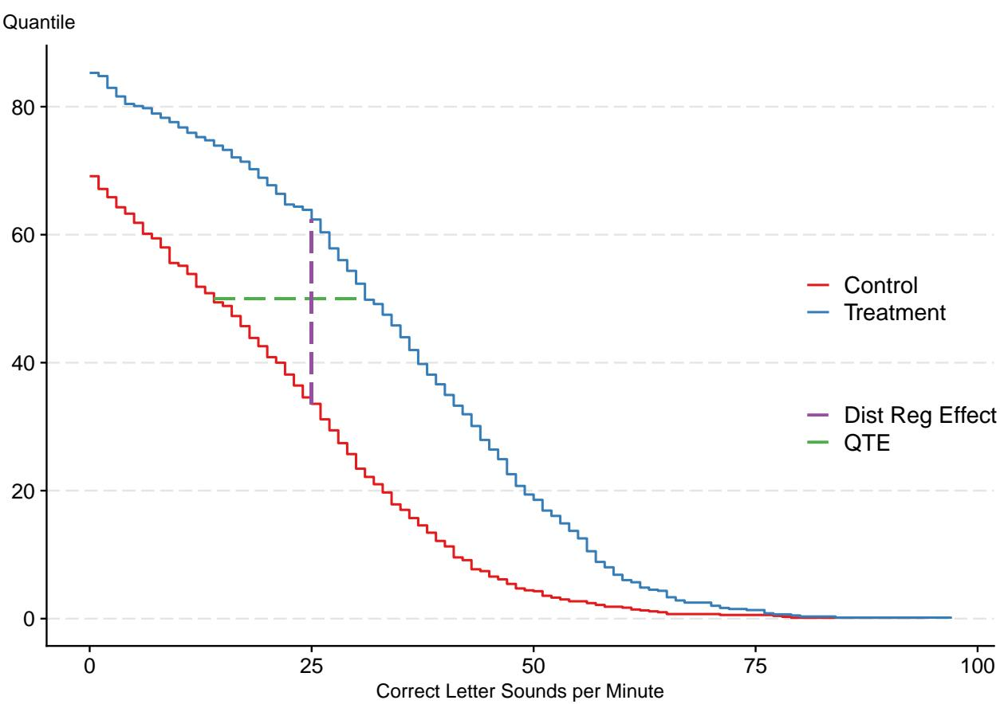

Distribution Regression Estimates for Basic Skills  
Figure 3  
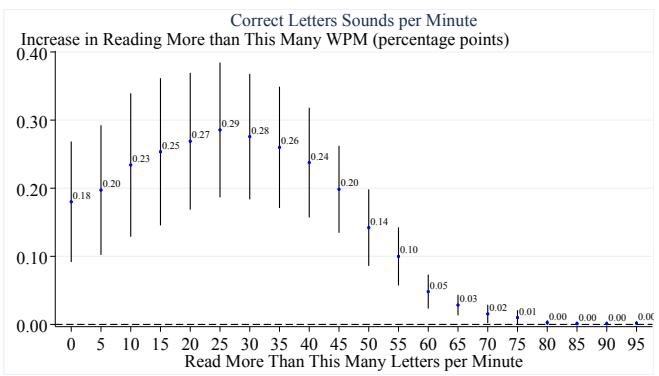

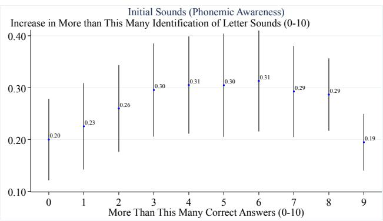  
Panel A: Distribution Regression Effects for Panel B: Distribution Regression Effects for Letter Sound Knowledge Initial Sound Knowledge

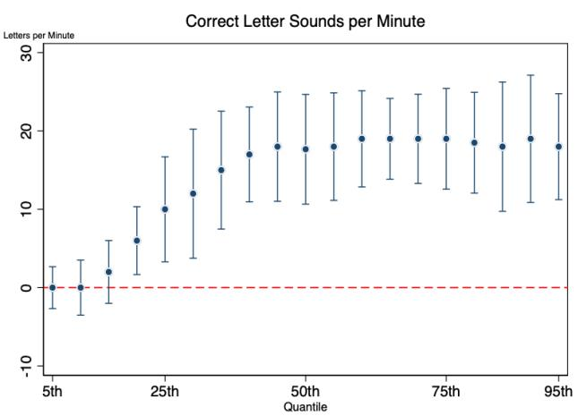  
Panel C: QTEs Effects for Letter Sound Knowledge

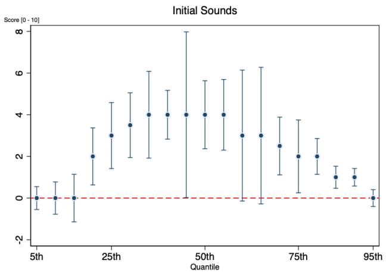  
Panel D: QTEs Effects for Initial Sound Knowledge

Notes: Sample is all students who were enrolled in one of the 80 study schools at the beginning of the 2024-25 academic year and were found for endline exams in June 2025. Four schools closed during the school year (two per study arm), leaving a final sample of 76 schools. Treatment effects are estimated using a student-level linear regression of the outcome on the treatment indicator, a complete set of age-category-by-sex interactions, and a vector of stratification cell indicators. \*: p < 0.1; \*\*: p < 0.05; \*\*\*: p < 0.01.

Figure 4  
Distribution Regression Estimates for Word Reading  
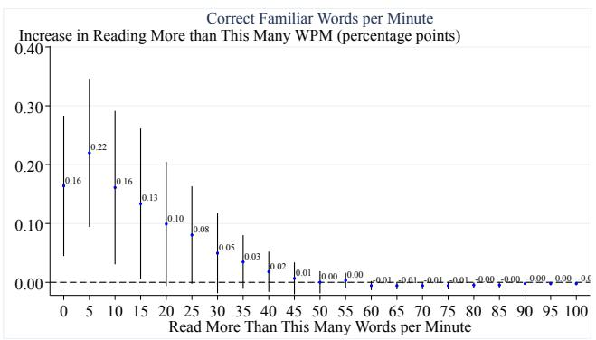  
Panel A: Distribution Regression Effects for Familiar Word Reading

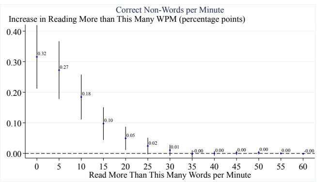  
Panel B: Distribution Regression Effects for Non-Word Reading

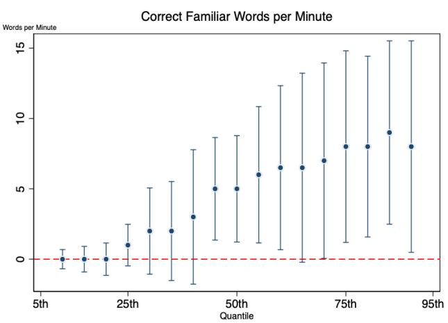  
Panel C: QTEs Effects for Familiar Word Reading

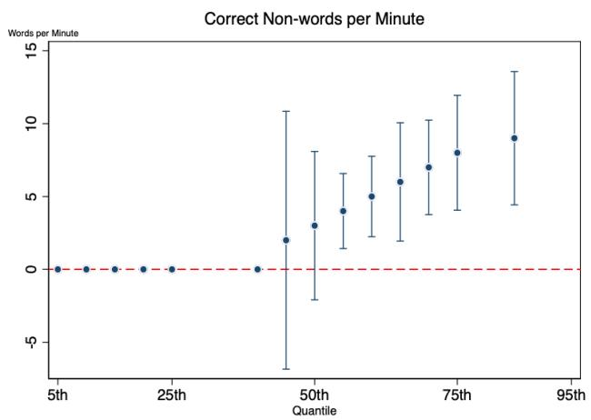  
Panel D: QTEs Effects for Non-Word Reading

Notes: Sample is all students who were enrolled in one of the 80 study schools at the beginning of the 2024-25 academic year and were found for endline exams in June 2025. Four schools closed during the school year (two per study arm), leaving a final sample of 76 schools. Treatment effects are estimated using a student-level linear regression of the outcome on the treatment indicator, a complete set of age-category-by-sex interactions, and a vector of stratification cell indicators. \*: $p < 0.1$ ; \*\*: $p < 0.05$ ; \*\*\*: $p < 0.01$ .

Figure 5  
Distribution Regression Estimates for Advanced Skills  
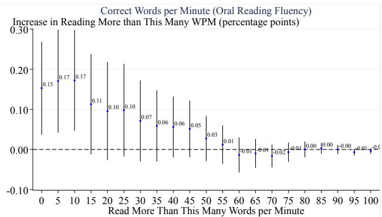

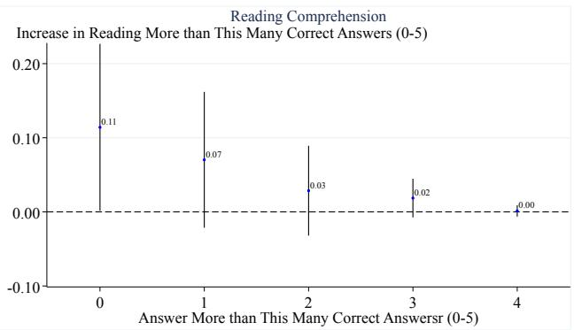  
Panel A: Distribution Regression Effects for Panel B: Distribution Regression Effects for Oral Reading Fluency Reading Comprehension

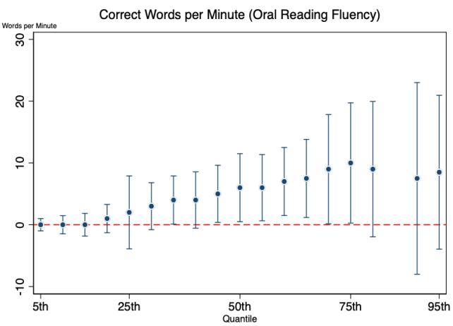  
Panel C: QTEs Effects for Oral Reading

Fluency

Notes: Sample is all students who were enrolled in one of the 80 study schools at the beginning of the 2024-25 academic year and were found for endline exams in June 2025. Four schools closed during the school year (two per study arm), leaving a final sample of 76 schools. Treatment effects are estimated using a student-level linear regression of the outcome on the treatment indicator, a complete set of age-category-by-sex interactions, and a vector of stratification cell indicators. \*: p < 0.1; \*\*: p < 0.05; \*\*\*: p < 0.01.

Group Composition Student Characteristics  
Table 4

<table><tr><td></td><td>(1)Group 1 Mean (SE)</td><td>(2)Group 4 Mean (SE)</td><td>(3)Diff (G1-G4)(p-value)</td></tr><tr><td>Male</td><td>0.555(0.498)</td><td>0.547(0.499)</td><td>0.007(0.879)</td></tr><tr><td>Student Age (Years)</td><td>6.539(0.808)</td><td>6.427(0.716)</td><td>0.112(0.351)</td></tr><tr><td>Answered Mother&#x27;s Age</td><td>28.856(18.957)</td><td>31.781(19.128)</td><td>-2.925(0.285)</td></tr><tr><td>Answered Father Age</td><td>33.320(22.468)</td><td>37.785(25.037)</td><td>-4.465(0.345)</td></tr><tr><td>Sibling at School</td><td>0.735(0.442)</td><td>0.744(0.437)</td><td>-0.008(0.851)</td></tr><tr><td>English Spoken with Teacher</td><td>0.838(0.369)</td><td>0.799(0.401)</td><td>0.039(0.523)</td></tr><tr><td>English Spoken with Friends</td><td>0.711(0.454)</td><td>0.668(0.472)</td><td>0.043(0.521)</td></tr><tr><td>English Spoken at Home</td><td>0.141(0.349)</td><td>0.155(0.363)</td><td>-0.014(0.692)</td></tr><tr><td>Fante Spoken with Teacher</td><td>0.069(0.253)</td><td>0.201(0.401)</td><td>-0.132**(0.015)</td></tr><tr><td>Fante Spoken with Friends</td><td>0.121(0.327)</td><td>0.332(0.472)</td><td>-0.211***(0.010)</td></tr><tr><td>Fante Spoken at Home</td><td>0.486(0.501)</td><td>0.767(0.423)</td><td>-0.281(0.115)</td></tr><tr><td>Twi Spoken with Teacher</td><td>0.093(0.292)</td><td>0.000(0.000)</td><td>0.093(0.102)</td></tr><tr><td>Twi Spoken with Friends</td><td>0.165(0.371)</td><td>0.000(0.000)</td><td>0.165**(0.045)</td></tr><tr><td>Twi Spoken at Home</td><td>0.370(0.484)</td><td>0.062(0.242)</td><td>0.308*(0.063)</td></tr><tr><td>Family Owns a TV</td><td>0.920(0.272)</td><td>0.886(0.319)</td><td>0.034(0.252)</td></tr><tr><td>Family Owns a Refridgerator</td><td>0.760(0.428)</td><td>0.735(0.442)</td><td>0.025(0.668)</td></tr><tr><td>Family Owns a Car</td><td>0.363(0.482)</td><td>0.361(0.481)</td><td>0.002(0.971)</td></tr><tr><td>Family Owns an Oven</td><td>0.620(0.486)</td><td>0.664(0.473)</td><td>-0.043(0.572)</td></tr><tr><td>Family Owns a Bicycle</td><td>0.418(0.494)</td><td>0.349(0.477)</td><td>0.070*(0.086)</td></tr><tr><td>Family Owns a SmartPhone</td><td>0.880(0.326)</td><td>0.866(0.341)</td><td>0.013(0.604)</td></tr></table>

Notes: Group 1 is composed of students with predicted IATEs in the top quartile. Group 4 is the bottom quartile. Sample is all students who were enrolled in one of the 80 study schools at the beginning of the 2024-25 academic year and were found for endline exams in June 2025. Four schools closed during the school year (two per study arm), leaving a final sample of 76 schools. We predict these using a random forest using honest trees with all covariates from Tables A2, A3, and A4 as predictors. Clustered bootstrap standard errors are calculated with 1000 repetitions in parenthesis(). \*: $p < 0.1$ ; \*\*: $p < 0.05$ ; \*\*\*: $p < 0.01$ .

Treatment Effect Heterogeneity by Counterfactual Untreated Basic Skills

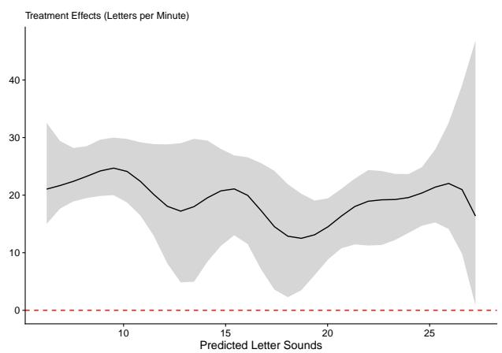  
Panel A: Letter Sounds

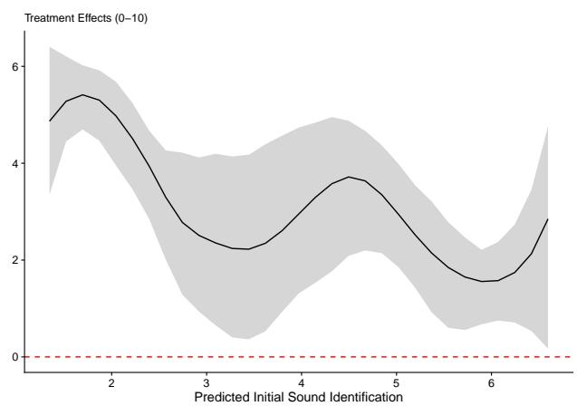  
Panel B: Initial Sound Identification

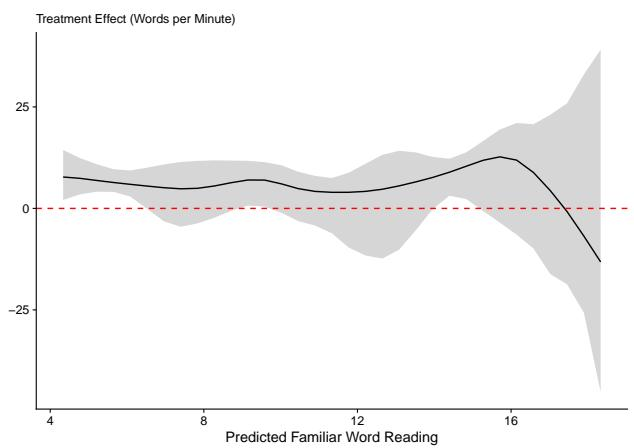  
Panel C: Familiar Word Reading

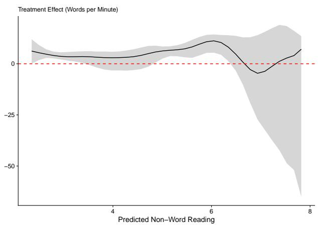

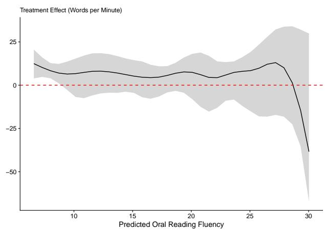  
Panel E: Oral Reading Fluency

Panel D: Non-Word Reading  
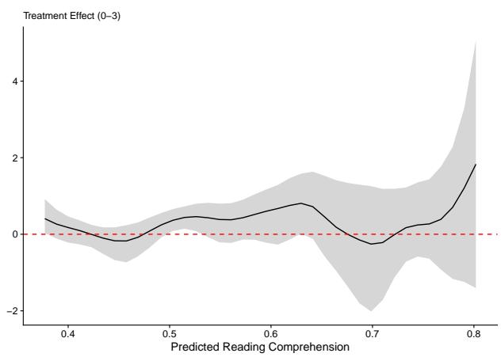  
Panel F: Reading Comprehension

Notes: Sample is all students who were enrolled in one of the 80 study schools at the beginning of the 2024-25 academic year and were found for endline exams in June 2025. Four schools closed during the school year (two per study arm), leaving a final sample of 76 schools. Counterfactual untreated test scores are predicted using a regression forest with honest trees and repeated subsampling (Wager and Athey, 2018). We then estimate treatment effects using observed outcomes, then non-parametrically estimate heterogeneity by baseline value using a local linear regression with a rule-of-thumb bandwidth. Clustered standard errors are bootstrapped with 500 iterations. 39

Table 5  
Group Composition Teacher Characteristics

<table><tr><td></td><td>(1)Group 1 Mean (SD)</td><td>(2)Group 4 Mean (SD)</td><td>(3)Diff (G1-G4)(p-value)</td></tr><tr><td>Male</td><td>0.091(0.288)</td><td>0.177(0.382)</td><td>-0.086(0.514)</td></tr><tr><td>Teacher Age (Years)</td><td>24.232(5.925)</td><td>35.737(14.024)</td><td>-11.505**(0.017)</td></tr><tr><td>Qualification: Bachelor&#x27;s Degree</td><td>0.197(0.398)</td><td>0.047(0.212)</td><td>0.150(0.176)</td></tr><tr><td>Qualification: Certificate</td><td>0.000(0.000)</td><td>0.202(0.402)</td><td>-0.202*(0.083)</td></tr><tr><td>Qualification: Senior High School</td><td>0.803(0.398)</td><td>0.715(0.452)</td><td>0.088(0.569)</td></tr><tr><td>Qualification: No Senior High School</td><td>0.000(0.000)</td><td>0.036(0.187)</td><td>-0.036(0.344)</td></tr><tr><td>Years Teaching Experience</td><td>3.964(4.049)</td><td>12.814(11.902)</td><td>-8.850**(0.035)</td></tr><tr><td>Years at This School</td><td>1.998(3.187)</td><td>8.138(9.172)</td><td>-6.139**(0.044)</td></tr><tr><td>Has Functional Phone</td><td>0.465(0.500)</td><td>0.902(0.298)</td><td>-0.437***(0.004)</td></tr></table>

Notes: Group 1 is composed of students with predicted IATEs in the top quartile. Group 4 is the bottom quartile. Sample is all students who were enrolled in one of the 80 study schools at the beginning of the 2024-25 academic year and were found for endline exams in June 2025. Four schools closed during the school year (two per study arm), leaving a final sample of 76 schools. We predict these using a random forest using honest trees with all covariates from Tables A2, A3, and A4 as predictors. Clustered bootstrap standard errors are calculated with 1000 repetitions in parenthesis(). \*: $p < 0.1$ ; \*\*: $p < 0.05$ ; \*\*\*: $p < 0.01$ .

## 4.2 Mechanisms

To measure how TFLI achieved these large gains, we measured changes in teaching quality using a pre-specified index of teaching practices during live lessons, as well as how well schools adhered to TFLI's program. Table 7 presents these results. Column 2 in Panel A shows that overall teaching quality increased by 1.6 SDs relative to the control group and is highly significant. Figure 9 shows the detailed breakdown of specific lesson elements in the index and Figure 10 shows specific teaching practices and student engagement metrics. $^{27}$ There are large gains across board for lesson elements. The measurement tool we used for these lesson elements is “opinionated” and looks for specific lesson elements TFLI includes in its scripted lessons, which helps to explain why these effects are as large and consistent as they are. There are large gains for teaching behavior, but they are less precisely estimated than the lesson elements. The largest gains are for moving around the room, supporting struggling learners, and teaching at an appropriate pace. Students show the largest gains in engaging with their workbooks, staying on task, and being familiar with class routines. These gains are consistent with TFLI successfully scripting lessons which reduces time wasted during lessons. Columns 3 and 4 similarly show that compliance with the program increased by 1.3 SDs over the control group. Table B4 shows the detailed breakdown of all the compliance components. The largest increases are in teachers' use of workbooks and teacher guides. $^{28}$

Table 6  
Group Composition School Leader Characteristics

<table><tr><td></td><td>(1) Group 1 Mean (SE)</td><td>(2) Group 4 Mean (SE)</td><td>(3) Diff (G1-G4) (p-value)</td></tr><tr><td>Male</td><td>0.939(0.240)</td><td>0.723(0.448)</td><td>0.216(0.172)</td></tr><tr><td>Leader Age (Years)</td><td>35.033(18.093)</td><td>45.429(24.484)</td><td>-10.396(0.190)</td></tr><tr><td>Qualification: Master&#x27;s Degree</td><td>0.000(0.000)</td><td>0.000(0.000)</td><td>0.000***(0.000)</td></tr><tr><td>Qualification: Bachelor&#x27;s Degree</td><td>0.399(0.491)</td><td>0.475(0.500)</td><td>-0.076(0.615)</td></tr><tr><td>Qualification: Certificate</td><td>0.450(0.498)</td><td>0.204(0.404)</td><td>0.245(0.310)</td></tr><tr><td>Qualification: Senior High School</td><td>0.151(0.359)</td><td>0.285(0.452)</td><td>-0.134(0.484)</td></tr><tr><td>Qualification: No Senior High School</td><td>0.000(0.000)</td><td>0.035(0.185)</td><td>-0.035(0.355)</td></tr><tr><td>Years Teaching Experience</td><td>16.588(7.702)</td><td>16.913(16.797)</td><td>-0.325(0.953)</td></tr><tr><td>Years as School Leader</td><td>9.898(8.572)</td><td>10.451(10.764)</td><td>-0.553(0.895)</td></tr><tr><td>Years as Leader at This School</td><td>7.530(8.376)</td><td>6.079(5.583)</td><td>1.451(0.511)</td></tr><tr><td>Has Functional Phone</td><td>0.000(0.000)</td><td>0.064(0.246)</td><td>-0.064(0.198)</td></tr></table>

Notes: Group 1 is composed of students with predicted IATEs in the top quartile. Group 4 is the bottom quartile. Sample is all students who were enrolled in one of the 80 study schools at the beginning of the 2024-25 academic year and were found for endline exams in June 2025. Four schools closed during the school year (two per study arm), leaving a final sample of 76 schools. We predict these using a random forest using honest trees with all covariates from Tables A2, A3, and A4 as predictors. Clustered bootstrap standard errors are calculated with 1000 repetitions in parenthesis(). \*: $p < 0.1$ ; \*\*: $p < 0.05$ ; \*\*\*: $p < 0.01$ .

Panels B and C of Table 7 link these large gains in quality to improvements in reading. Panel B shows the raw correlation between teaching quality and overall reading scores within the treatment group. Since our quality measure is opinionated, we would expect to see a significant effect here if e.g. more effective teachers deviated from the scripted lessons more than less effective teachers(or vice versa). There is no correlation, which is supportive evidence that there is not differential deviation from the scripts based on teacher skill.

The same holds for compliance with the program. Panel C shows estimates of the effect of quality of reading scores using assignment to treatment as an instrument for teaching quality. This estimates how much a 1-SD in quality or compliance increases test scores, under the assumption that TFLI affects test scores only through each channel. Since both channels move, we know that this exclusion restriction is violated. The point estimates suggest that a 1-SD gain in quality increases test scores by 0.32 SDs, significant at the 0.1 level.

Another avenue through which TFLI may improve test scores is by changing students' at-home behavior. The most notable change with at-home practices is a 9.7% (7.5 pp) increase in students practicing reading at home, although there is no change in how often they do schoolwork at home with their parents/guardians or siblings (Table E3). We also see some changes in student confidence. There is a 27% (3.6 pp) decrease in students who believe they are in the bottom third of their class and a similar 27% (4 pp) reduction for math. The average effect on aspirations is null. There is no change in students' belief they will pass the high school exit exam or get their dream jobs Table E1. Interestingly, Table E4 shows there are also null effects for students' beliefs about the quality of their schooling, although this is likely subject to social desirability bias distorting students' answers.

Table 7  
Treatment Effects on Compliance with Program

<table><tr><td rowspan="3"></td><td colspan="2">Quality</td><td colspan="2">Compliance</td></tr><tr><td>(1)</td><td>(2)</td><td>(3)</td><td>(4)</td></tr><tr><td>Equiv. Yrs. of Schooling</td><td>SDs</td><td>Equiv. Yrs. of Schooling</td><td>SDs</td></tr><tr><td colspan="5">Panel A: Treatment Effects on School Quality/Compliance</td></tr><tr><td>Treatment Assignment S.E.</td><td></td><td>1.617***(0.508)</td><td></td><td>1.296***(0.285)</td></tr><tr><td>Effective F (Olea–Pflueger)</td><td></td><td>10.66</td><td></td><td>21.21</td></tr><tr><td>Adjusted R2</td><td></td><td>0.537</td><td></td><td>0.624</td></tr><tr><td colspan="5">Panel B: Effect on EGRA Scores (OLS)</td></tr><tr><td>Quality/Compliance Index S.E.</td><td>-0.428(0.643)</td><td>-0.097(0.146)</td><td>0.326(0.625)</td><td>0.074(0.142)</td></tr><tr><td>N (# students)</td><td>579</td><td></td><td>552</td><td></td></tr><tr><td>C (# stratification cells)</td><td>20</td><td></td><td>19</td><td></td></tr><tr><td>Adjusted R2</td><td>0.296</td><td></td><td>0.240</td><td></td></tr><tr><td colspan="5">Panel C: Effect on EGRA Scores (2SLS)</td></tr><tr><td>Quality/Compliance Index S.E.</td><td>1.389*(0.750)</td><td>0.316*(0.170)</td><td>1.739*(0.968)</td><td>0.395*(0.220)</td></tr><tr><td>N (# students)</td><td>1,191</td><td></td><td>1,119</td><td></td></tr><tr><td>C (# schools)</td><td>21</td><td></td><td>20</td><td></td></tr><tr><td>Adjusted R2</td><td>0.064</td><td></td><td>0.142</td><td></td></tr></table>

Notes: Sample is all students who were enrolled in one of the 80 study schools at the beginning of the 2024-25 academic year and were found for endline exams in June 2025. Four schools closed during the school year (two per study arm), leaving a final sample of 76 schools. Treatment effects are estimated using a student-level linear regression of the outcome on the treatment indicator, a complete set of age-category-by-sex interactions, and a vector of stratification cell indicators. Panel B is run only on treated schools. Heteroskedasticity-robust standard errors, clustered by stratification cell, in parentheses (). \*: p < 0.1; \*\*: p < 0.05; \*\*\*: p < 0.01. 43

Figure 7
Predicted Individual Average Treatment Effects  
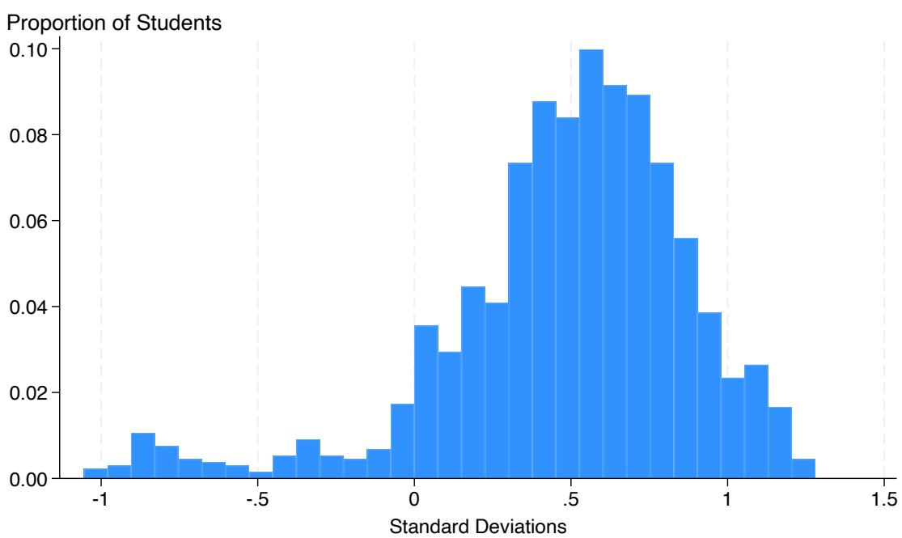  
Notes: The treatment effect is on the overall reading index. Sample is all students who were enrolled in one of the 80 study schools at the beginning of the 2024-25 academic year and were found for endline exams in June 2025. Four schools closed during the school year (two per study arm), leaving a final sample of 76 schools. We predict these using a random forest using honest trees with all covariates from Tables A2, A3, and A4 as predictors.

Figure 8
Predicted Group Average Treatment Effects  
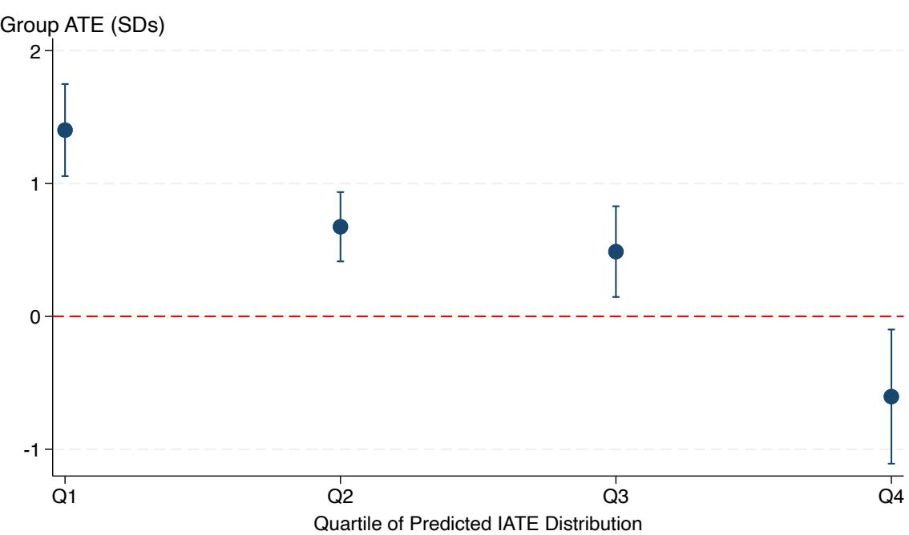  
Notes: The treatment effect is on the overall reading index. Sample is all students who were enrolled in one of the 80 study schools at the beginning of the 2024-25 academic year and were found for endline exams in June 2025. Four schools closed during the school year (two per study arm), leaving a final sample of 76 schools. We predict these using a random forest using honest trees with all covariates from Tables A2, A3, and A4 as predictors. Clustered bootstrap standard errors are calculated with 1000 repetitions.

Figure 9
Lesson Quality Elements  
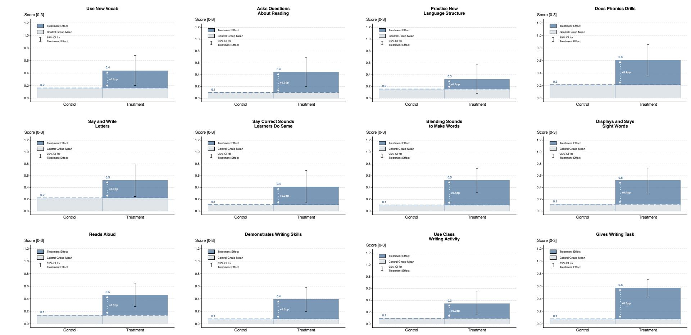

Figure 10
Teacher and Student Quality Elements  
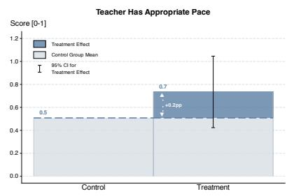

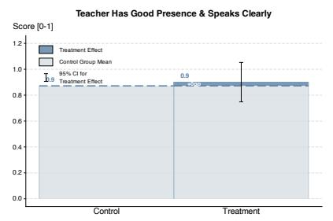

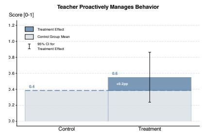

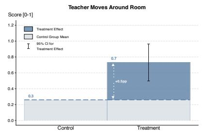

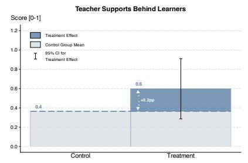

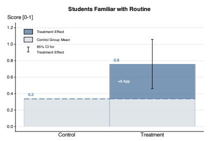

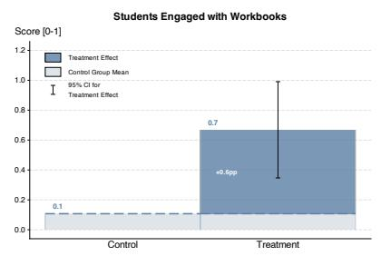

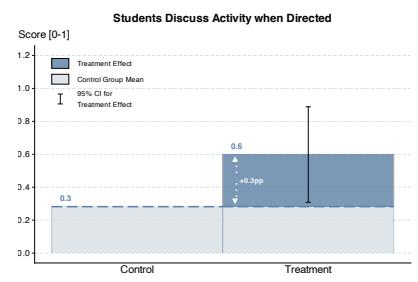

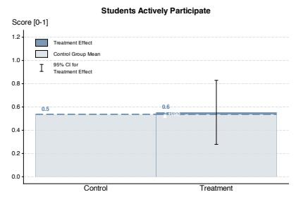

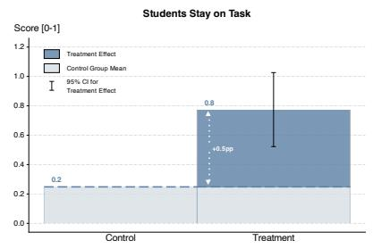

## 4.3 School Leader Training A/B Test

We test these mechanisms further by running an A/B test to see if training school leaders to be better able to coach their teachers can improve teaching quality even more. Since this was an A/B test iterating aspects of the TFLI program, we only randomized this within the treatment schools. Twenty schools received the school leader training, and twentyretained the status-quo TFLI program. Throughout this section, we use a 70% threshold for statistical significance. Lower significance thresholds like this one are standard in A/B testing because the goal is to rapidly iterate on successful improvements, not to collect enough data to cross standard significance thresholds (Azevedo et al., 2020). In accordance with that spirit of rapid testing and iteration, this intervention ran for just two months from the beginning of May through the end of the school year at the end of June 2025.

Table 8 shows the main results of this A/B test. Teaching quality increased by 1.1 SDs relative to the control group, while compliance did not show a significant change. Table C3 shows the detailed breakdown of the lesson components part of the quality index. Unlike the main intervention, there are no across-the-board improvements in all lesson components. The largest impacts are increases in doing phonics drills, practicing the new language components introduced in a lesson, and doing the writing activity given in the scripted lesson. Although no other components are significant, all are large in magnitude, and about half the size of the quality increase from TFLI overall. Table C4 shows the detailed breakdown of teaching behavior and student engagement. Mostly, these are large but noisily estimated effects. Proactive management of classroom behavior by teachers and participation in-class discussions by students show the largest increases. Table C5 shows no increases in compliance with the program, which was not a main goal of this intervention.

Panel C of Table 8 shows that the learning effects of this intervention are not yet statistically different from zero, but are large in magnitude. Table C1 breaks down the reading index by the individual subtests. These are imprecisely estimated, but larger for more advanced skills. In particular, the effect sizes for oral reading fluency and reading comprehension are 70% and 58% of the main effect size respectively, while the effect size for letter sounds is just 10% of the main treatment effect. This is consistent with school leaders increasing the quality of lessons, which, as we discuss in Section 6, should have larger benefits for more-advanced skills once basic skills have increased enough to relax the constraint function $h(B)$ . Since the school leader intervention is layered on top of the main TFLI program, this assumption is plausible.

Table C2 shows the “long model” (Muralidharan, Romero, and Wüthrich 2025) where we estimate the effect on reading scores with a fully saturated model with dummies for the main treatment and the A/B test treatment. The main pattern of our results is unchanged. There are slightly smaller point estimates for the overall reading index and subtests, but the significance and pattern of skill formation remain unchanged.

Table 8  
Quality and Compliance in A/B Test

<table><tr><td rowspan="3"></td><td colspan="2">Quality</td><td colspan="2">Compliance</td></tr><tr><td>(1)</td><td>(2)</td><td>(3)</td><td>(4)</td></tr><tr><td>Equiv. Yrs. of Schooling</td><td>SDs</td><td>Equiv. Yrs. of Schooling</td><td>SDs</td></tr><tr><td colspan="5">Panel A: Treatment Effects on School Quality/Compliance</td></tr><tr><td>Treatment Assignment S.E.</td><td></td><td>1.153* (0.601)</td><td></td><td>0.317 (0.498)</td></tr><tr><td>Effective F (Olea-Pflueger)</td><td></td><td>3.92</td><td></td><td>0.43</td></tr><tr><td>Adjusted R2</td><td></td><td>0.224</td><td></td><td>0.172</td></tr><tr><td colspan="5">Panel B: Effect on EGRA Scores (OLS)</td></tr><tr><td>Quality/Compliance Index S.E.</td><td>1.274* (0.688)</td><td>0.290* (0.156)</td><td>-0.739 (1.869)</td><td>-0.168 (0.425)</td></tr><tr><td>N (# students)</td><td>237</td><td></td><td>222</td><td></td></tr><tr><td>C (# schools)</td><td>15</td><td></td><td>13</td><td></td></tr><tr><td>Adjusted R2</td><td>0.181</td><td></td><td>0.036</td><td></td></tr><tr><td colspan="5">Panel C: Effect on EGRA Scores (2SLS)</td></tr><tr><td>Quality/Compliance Index S.E.</td><td>0.590 (0.955)</td><td>0.134 (0.217)</td><td>1.041 (4.684)</td><td>0.237 (1.065)</td></tr><tr><td>N (# students)</td><td>562</td><td></td><td>527</td><td></td></tr><tr><td>C (# schools)</td><td>35</td><td></td><td>30</td><td></td></tr><tr><td>Adjusted R2</td><td>0.027</td><td></td><td>-0.033</td><td></td></tr></table>

Notes: Sample is all students who were enrolled in one of the 80 study schools at the beginning of the 2024-25 academic year and were found for endline exams in June 2025. Four schools closed during the school year (two per study arm), leaving a final sample of 76 schools. Treatment effects are estimated using a student-level linear regression of the outcome on the treatment indicator, a complete set of age-category-by-sex interactions, and a vector of stratification cell indicators. Panel B is estimated using only the treatment group. Heteroskedasticity-robust standard errors, clustered by school, in parentheses (). \*: $p < 0.1$ ; \*\*: $p < 0.05$ ; \*\*\*: $p < 0.01$ .

## 5 Scalability

Addressing the learning crisis in Africa will require not just high-impact interventions, but also ones that can be implemented by the existing teaching workforce and rapidly scaled up over school years across time and over education systems across the continent. The former is necessary so that promising annual gains can be capitalized on, by repeating the intervention until the learning gap with rich countries is closed. To fix concepts, assume that the PIRLS (2021) test score gap between South Africa and Singapore (2.99 SDs) is representative of the gap for the entire continent. In that case, TFLI's impacts would need to be repeated nearly six times in order to achieve parity between Africa and rich countries. This is, in principle, possible: our estimates are for a single academic year, and the PIRLS scores are for the end of fourth grade. Since there are two years of kindergarten before B1 in Ghana, a literacy intervention like TFLI could be run six times during primary school in that country.

For this to work, however, the program's impacts would have to scale up over time: doubling the amount of time in the program would need to double treatment effects, or close to it. We show evidence that this may be the case in Figure 11. The dark blue dot in the figure shows our results from the RCT described in this paper on the $y$ -axis and the number of months in the school year on the $x$ -axis. The light blue dot shows the same figures but from a previous pilot RCT that we conducted during the 2023-24 school year, with a sample of just 8 schools (4 treatment and 4 control). $^{29}$ The test scores from this pilot RCT were internal Inspiring Teachers exams rather than EGRAs. We apply the exact same analyses to that earlier data as we do in the data from the current study, using as our main outcome a PCA index of all the available subtests from the control-group data. We find a treatment effect of 0.25 SDs. This pilot ran for just over four months, rather than the full nine-month school year. The dashed line extrapolates the gain per month from the pilot RCT to our main study and finds that we are very close to fitting the linearly-extrapolated trend. This suggests that the program's per month gains do scale linearly.

Scaling the program across space is needed so that the intervention can help children not only in the Central Region of Ghana but also across the rest of the country and the rest of the continent. The intervention was designed from the ground up with that in mind, with three pillars supporting its scalability. The first pillar is English-language-first instruction. This is a practical issue, rather than a matter of pedagogical principle or even effectiveness. Mother-tongue-first literacy instruction, wherein students learn to read first in the language they grew up speaking before transitioning to other languages, appears to have benefits (Piper, Zuilkowski, and Ong'ele (2016)) and some highly-effective interventions use this approach (e.g., Kerwin and Thornton 2021). $^{30}$ However, there are over 2,000 languages in Africa, and adapting effective teaching materials to all of them would be a massive logistical undertaking. English is an official language or de facto lingua franca in 21 of the 58 countries in Sub-Saharan Africa, covering 47 percent of the population of the region. $^{31}$ . A structured pedagogy approach that begins in English thus has high potential. Moreover, the TFLI intervention achieves large gains in reading in English despite it being the native language of just 15% of our study sample.

Figure 11
Learning Gains vs. Months of Treatment  
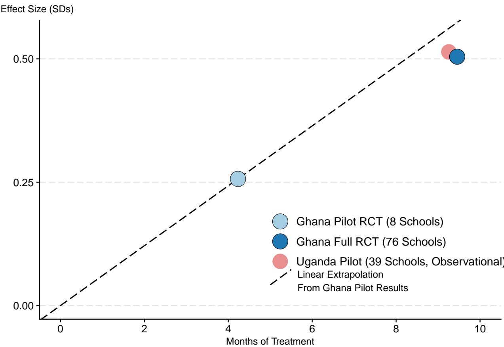

Even with an effective English-first literacy intervention, substantial changes will need to be made in order to adapt it to the rest of Africa: countries have major differences in local culture, initial student ability levels, school calendars, national curricula, and more. The TFLI's second and third pillars of scalability make this possible by efficiently leveraging the scarce pool of available teaching experts who can design high-quality literacy lessons. Pillar two is a component-based design approach: lesson plan designers draw on a set of shared building blocks for lessons, and assemble those building blocks in consistent patterns.

Pillar three is the use of generative AI and component-based design to speed up the process of designing new high-quality lesson plans and adapting them across settings. Lesson plan designers use genAI in two key ways. First, they create controlled texts, which help students practice sounds and words they already know and mix in new ones they need to learn. These require following a set of rules. For example, a story might have to draw from the following list of words students already know, add this new one we are practicing today, match the theme of the lesson, and use existing characters from previous stories. Large language models excel at this task. Guide designers prompt them with the rules, and can focus on evaluating the quality of the texts and on bigger-picture lesson design issues rather than rule-following. The second is illustrating the stories, which can be done far quicker via genAI than by hiring human illustrators (which can take weeks due to multiple rounds of comments and revisions). The use of these tools is also conducive to adapting the lessons across settings: LLMs can quickly draft new versions of lessons that alter key cultural cues and adjust themes and topics to match national curricula, with the lesson designers providing expert supervision rather than focusing on the rote tasks of making these edits.

As a result of this inherent scalability, TFLI is being scaled up both within Ghana and across Africa. The program is operating in 139 schools in Ghana in the 2025-26 school year, including 80 government schools, and Inspiring Teachers has an agreement in place to expand it to 500 schools (400 of them government-run) by 2026-27. They are collaborating with the national and regional offices of the Ghana Education Service to expand the program to every government school in the Central Region by 2029-30 (1,638 in total). This scale-up appears as though it will be highly cost-effective. The 2024-25 version of the intervention had an incremental cost of \$48 per student, and so the cost per 1-SD gain is \$96, which already makes the program competitive with existing interventions. By 2029, Inspiring Teachers' budget model predicts the cost will drop to \$6 per student. If the large impacts of the intervention can be sustained then it will become extremely cost-effective.

This ongoing scale-up also provides evidence that TFLI scales across geography. Inspiring Teachers conducted a pilot of the adaptation of the program to Uganda in the 2025 school year, which ran from February 3 to December 5 in 20 schools in Kanungu District. $^{32}$ They selected 19 similar nearby schools being as a comparison group. The treatment assignment was not randomized, and we have a limited set of exogenous covariates to use in our analysis. However, if we construct our outcome in the same way as we specify in Section 3 and condition flexibly on all available control variables, we see an overall test score difference of 0.514 SDs. The detailed results are presented in Table F1; the estimated impacts on individual components differ somewhat from the actual RCT in Ghana. Taken literally, this result has two implications. First, the program scales across space: we see almost the exact same impacts in Uganda as in Ghana. Second, it reinforces our findings on scaling up the program over time: the red dot in Figure 11 shows the test score gain and length of intervention for Uganda, and is also quite close to the linear extrapolation from the 2023-24 Ghana pilot. The prospects for the future scale-up of the program across Africa are quite promising as well. Inspiring Teachers is already in talks to expand the program to Zambia.

## 6 Theory

In this section, we first review the Cunha and Heckman (2007) model of skill formation, then develop a specific functional form with strong cross-skill complementarities. We impose a functional form on the model to study two separate but related skills, which the original setup accommodates, but which is not a focus of their analysis. We use this to explain the broadly-documented pattern in which education interventions have larger impacts on basic skills than on advanced ones. Then we consider a slight modification to the technology that allows teachers to split their time between teaching basic and advanced skills and show that the optimal time allocation decision rule mimics targeted instruction in the vein of TaRL. Finally, we consider the interaction between structured pedagogy and targeted instruction, and provide intuition for why they could be complementary inputs to education.

Our framework builds on models of instruction targeting (Duflo, Dupas, and Kremer 2011) and cumulative learning (Shaikh 2025). Duflo, Dupas, and Kremer show that teachers facing convex payoffs target instruction toward higher-achieving students, and demonstrate empirically that this improves outcomes, but do not model the learning technology that makes targeting beneficial. Shaikh estimates a structural model with cumulative technology where earlier learning increases later productivity, demonstrating dynamic complementarities empirically. We contribute to the theoretical mechanism underlying both findings: basic skills act as prerequisites that constrain advanced learning. This explains why targeted instruction improves outcomes and what creates dynamic complementarities, while generating novel predictions about treatment effect timing and intervention complementarity.

Consider a child who is born with a vector $\theta_{0}$ of skills. This vector, in principle, contains everything from reading to time management to basketball skills, but here we focus only on literacy skills. In each period t, $\theta_{t}$ denotes the vector of skill stocks. These skills evolve according to the following technology:

$$
\theta_ {t + 1} = f _ {t} (\theta_ {t}, I _ {t}, S _ {t})\tag{4}
$$

Here $I_{t}$ is a vector of investments in different components of the skills vector $\theta_{t}$ , and $S_{t}$ is the productivity of time in schools. $^{33}$ We can think of targeted instruction as operating through $I_{t}$ by differentially allocating effort to different skills depending on skill level, and structured pedagogy as operating through $S_{t}$ which is a general, broad increase in the marginal productivity of time in school. A key feature of the model is that it allows for both dynamic complementarity when $\frac{\partial^{2}f_{t}(\theta_{t},I_{t},S_{t})}{\partial\theta_{t}\partial I_{t}}>0$ (i.e. when the stock of skills accumulated by period t-1 makes investment in skills more productive), and self-productivity when $\frac{\partial f_{t}(\theta_{t},I_{t},S_{t})}{\partial\theta_{t}}>0$ (i.e. when the existing stock of a given skill raises that skill's future level). We will focus on a case where these features interact: dynamic complementarity across skill dimensions implies that the productivity of investment in advanced skills is constrained by the level of more basic skills.

## 6.1 Differential Timing of Treatment

Phonemic awareness and decoding skills are the building blocks of reading comprehension. This motivates a natural decomposition of literacy into two skill types. For expositional simplicity, consider a student for whom $\theta$ has only two skills: basic literacy skills (e.g., letter sound knowledge or phonemic awareness) denoted $B_{t}$ , and advanced literacy skills (e.g., reading a passage or reading comprehension) denoted $A_{t}$ . For the moment, we suppress investment in skills, $I_{t}$ , but will add it back in in the next section for our discussion of targeted instruction. We impose the following functional form on Equation 4:

$$
B _ {t + 1} = B _ {t} + \alpha \cdot S\tag{5}
$$

$$
A _ {t + 1} = A _ {t} + \beta \cdot S \cdot h (B _ {t})\tag{6}
$$

$h(\cdot)$ is the “constraint function” which moderates how quickly advanced skills can build up as basic skills hold them back. It has the following properties: 1) $h(0)=0$ i.e. basic skills are a prerequisite to advanced skills and students cannot develop any advanced skills if they have no basic skills 2) $h'(B_{t})>0$ i.e. the constraint monotonically weakens as students build basic skills 3) $h''(B_{t})<0$ i.e. diminishing marginal returns to basic skills in relaxing the constraint function, 4) $h(\cdot)\in[0,1]^{34}$ .

Consider now a treatment such as structured pedagogy that increases $S_{t}$ to $S_{t} + \tau$ in

perpetuity. At time t, treatment effects are given by:

$$
\begin{array}{r l} & {\Delta B _ {t} = B _ {t} ^ {T} - B _ {t} ^ {C} = \alpha \tau t} \\ & {\Delta A _ {t} = A _ {t} ^ {T} - A _ {t} ^ {C} = \underbrace {\beta \tau \sum_ {s = 0} ^ {t - 1} h (B _ {s} ^ {T})} _ {\mathrm{Directeffect}} + \underbrace {\beta S \sum_ {s = 0} ^ {t - 1} \left(h (B _ {s} ^ {T}) - h (B _ {s} ^ {C})\right)} _ {\mathrm{IndirecteffectviaB}}} \end{array}
$$

While basic skills are affected directly by the treatment, the treatment effect on advanced skills has two distinct components. First, there is the direct effect where $\tau$ feeds directly into the stock of advanced skills, moderated by the levels of $B_{t}$ at each period. The second component is the indirect effect of the treatment. The indirect effect is to increase the stock of basic skills which relaxes the constraint function. The treatment thus “unlocks” existing school productivity that students cannot harness before they build up a sufficient level of basic skills.

This technology leads us to two predictions for how skills develop.

Prediction 1: In settings where students have low starting levels of basic skills, treatment effects on basic skills dominate.

$$
\frac {\Delta A _ {1}}{\Delta B _ {1}} = \frac {\beta}{\alpha} \cdot h (B _ {0}) \approx 0
$$

Prediction 2: As treatment continues (or students begin with a large stock of basic skills) treatment effects on advanced skills catch up.

$$
\lim _ {t \to \infty} \frac {\Delta A _ {t}}{\Delta B _ {t}} = \frac {\beta}{\alpha}
$$

In summary, in the first year of a structured pedagogy-esque education intervention, we predict the largest treatment effects will be for basic phonics skills while advanced passage reading and reading comprehension have smaller effects. As students stay in the program in further years, treatment effects on passage reading and reading comprehension should grow and catch up to the basic skills effects.

This differential treatment effect phenomenon is widely documented in foundational literacy (Piper et al. 2018d, Kerwin and Thornton 2021, Fazzio et al. 2021, McManus et al.

2025) and numeracy (Albornoz et al. 2025, McManus et al. 2025), but to our knowledge we provide the first explanation for why skills behave in this way based on human capital theory.

Prediction 1 is borne out in our data. Figure 12 shows that basic phonics skills (letter sounds and initial sound identification) have the largest treatment effects. The most advanced skills are reading a passage and comprehending it; Figure 13 shows that these effects are much smaller than those on basic skills and less precisely estimated. We currently only have one year of data, but in future phases of this study, we will test Prediction 2 to see if advanced skill treatment effects catch up as the intervention continues.

This framework also makes predictions about treatment effect heterogeneity for advanced skills.

Prediction 3: Treatment effects for advanced skills in the first period are larger for students with higher baseline stocks of basic skills.

$$
\frac {\partial \Delta A _ {1}}{\partial B _ {0}} = \beta \tau \cdot h ^ {\prime} (B _ {0}) > 0
$$

Since any period can serve as the initial period, this holds for all consecutive periods t and $t + 1$ when there is an exogenous treatment after period t. We do not directly test Prediction 3 in the current study since we did not run a baseline survey, but we will have baseline scores for future phases of the study and will test for this then.

## 6.2 Endogenous Targeted Instruction

Now we add back in time investment by teachers. We will suppress S in this section to focus on the investment dimension. Teachers are endowed with one unit of time and choose what proportion of the time to invest in teaching advanced skills $I_{t}^{A}$ , while basic skills get $1 - I_{t}^{A}$ units of time. Equations 5 and 6 become the following.

$$
B _ {t + 1} = B _ {t} + \alpha \cdot (1 - I _ {t} ^ {A})
$$

$$
A _ {t + 1} = A _ {t} + \beta \cdot I _ {t} ^ {A} \cdot h (B _ {t})
$$

For tractability, consider a two-period model. The social planner chooses the optimal allocation of time spent teaching advanced skills in periods 1 and 2 to maximize the stock of advanced skills in period 2. Only advanced skills are socially valuable; basic skills' only value is in service of generating advanced skills.

The solution to the social planner's problem mimics the decision rule for targeted instruction. For students with a sufficiently low stock of basic skills, the social planner allocates all instruction time to basic skills. For students with sufficiently high stock of basic skills, they allocate all instruction time to advanced skills. For students between, they split time between basic and advanced skills, and the optimal amount of advanced skill instruction is monotonically increasing in the stock of basic skills. This is summarized in Proposition 1.

Proposition 1 (Optimal Instruction Time Allocation) Let $I_{1}^{A} \in [0,1]$ denote the optimal allocation of instruction time to advanced skills in period 1. Define threshold values B and $\overline{B}$ as solutions to:

$$
\begin{array}{l} h (\underline {{B}}) = \alpha \cdot h ^ {\prime} (\underline {{B}} + \alpha) \\ h (\overline {{B}}) = \alpha \cdot h ^ {\prime} (\overline {{B}}) \end{array}
$$

Then the optimal instruction policy is:

$$
I _ {1} ^ {A} (B _ {0}) = \left\{ \begin{array}{l l} 0 & \text { if } B _ {0} <   \underline {{B}} \quad (\text { specialize   in   basics }) \\ \text { interior   solution } & \text { if } \underline {{B}} \leq B _ {0} \leq \overline {{B}} \quad (\text { balanced   instruction }) \\ 1 & \text { if } B _ {0} > \overline {{B}} \quad (\text { specialize   in   advanced }) \end{array} \right.
$$

For $B_0 \in [\underline{B}, \overline{B}]$ , the interior solution satisfies:

$$
h (B _ {0}) = \alpha \cdot h ^ {\prime} (B _ {0} + \alpha (1 - I _ {1} ^ {A}))
$$

and is strictly increasing in $B_0$ : $\frac{dI_1^A}{dB_0} > 0$ .

Proof: see Appendix H

In this framework, targeted instruction is more beneficial for certain sets of skills. For skills where the $h'(\cdot)$ function is very steep, advanced skills are heavily constrained by the stock of basic skills. This is the case for highly interrelated skills like letter sound knowledge and non-word reading. For less directly related skills (e.g., general literacy and general math), $h'(\cdot)$ is shallower, so targeted instruction becomes less useful as the skills constrain each other less. This is exactly how targeted instruction is typically deployed: within-subject rather than across subjects.

## 6.3 Complementarity between Targeted Instruction and Structured Pedagogy

Finally, we will add both productivity of time in school and instructional time allocation to the model simultaneously and show that with this functional form, they are complements. Although the complementarity is driven by the multiplicative functional form assumption, the model provides useful intuition for why this relationship may hold. We plan to test explicitly for targeted instruction and structured pedagogy complementarity by randomly varying the intensity of the targeted instruction components of TFLI in future phases of this study.

The full technology we use in this section is given by

$$
\begin{array}{l} B _ {t + 1} = B _ {t} + \alpha \cdot S \cdot (1 - I _ {t} ^ {A}) \\ A _ {t + 1} = A _ {t} + \beta \cdot S \cdot I _ {t} ^ {A} \cdot h (B _ {t}) \end{array}
$$

Proposition 2 shows that under this functional form assumption for the skill production technology, targeted instruction and structured pedagogy are complementary. Note this is not saying investment in advanced skills and structured pedagogy are complementary, but rather that optimally choosing investment levels is complementary with structured pedagogy.

The intuition for Proposition 2 is as follows. When the productivity of time at school is low, it makes no difference how well time is allocated: any time spent on anything will not be used well. If a school is poor quality and students learn nothing, a student who cannot read can equally learn nothing about complex reading comprehension or simple letter sounds. If productivity at school is high, the converse is true. The higher productivity school time is, the more wasteful it is to assign a remedial student to advanced topics; the student misses out on more valuable time they could be using to build their stock of basic skills.

Proposition 2 (Complementarity of targeted instruction and structured pedagogy)
Define:

$$
\bullet \quad V ^ {T I} (B _ {0}, S) = \max _ {I _ {1} ^ {A} \in [ 0, 1 ]} \left\{\beta S I _ {1} ^ {A} h (B _ {0}) + \beta S h (B _ {0} + \alpha S (1 - I _ {1} ^ {A})) \right\}
$$

(value under targeted instruction policy with optimal targeting)

\- $V^{uniform}(B_0, S, \bar{I}) = \beta S \bar{I} h(B_0) + \beta Sh(B_0 + \alpha S(1 - \bar{I}))$

(value under uniform policy with fixed $\bar{I}$ )

Let $I^{*}(B_{0}, S)$ denote the optimal allocation under targeted instruction. Then for any $S > 0$ and any $\bar{I} \neq I^{*}(B_{0}, S)$ :

$$
V ^ {T I} (B _ {0}, S) > V ^ {\text { uniform }} (B _ {0}, S, \bar {I})
$$

That is, whenever school quality is positive, the gain from optimally targeting instruction is strictly positive. When S = 0 both policies yield zero value, so targeting has no benefit absent school quality; when S > 0, misallocating instructional time is costly and the cost is scaled by S. This establishes a form of complementarity: positive school quality is a necessary condition for optimal targeting to generate value.

Proof: See Appendix H.

Figure 12
Basic Skills Treatment Effects  
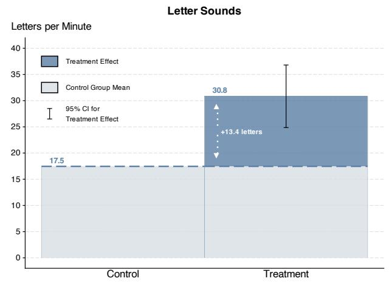

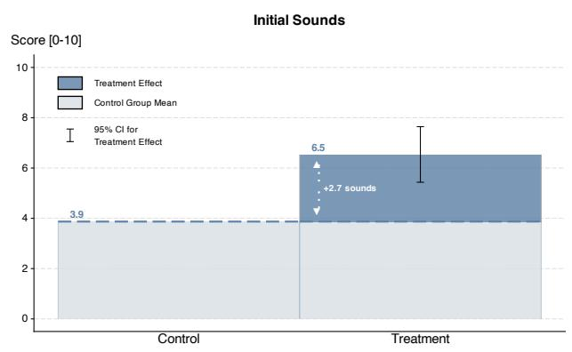  
Panel A: Treatment Effects of Letter Sound Knowledge
Panel B: Treatment Effect of Initial Sound Knowledge  
Notes: Sample is all students who were enrolled in one of the 80 study schools at the beginning of the 2024-25 academic year and were found for endline exams in June 2025. Four schools closed during the school year (two per study arm), leaving a final sample of 76 schools. Treatment effects are estimated using a student-level linear regression of the outcome on the treatment indicator, a complete set of age-category-by-sex interactions, and a vector of stratification cell indicators. \*: p < 0.1; \*\*: p < 0.05; \*\*\*: p < 0.01.

Figure 13
Advanced Skills Treatment Effects  
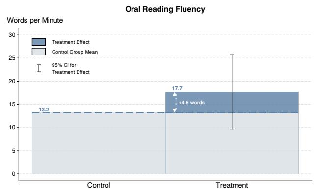

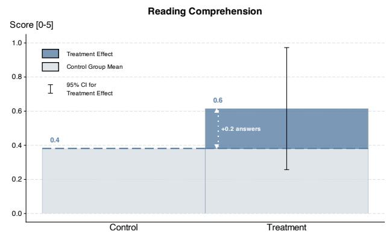  
Panel A: Treatment Effects of Letter Sound Knowledge
Panel B: Treatment Effect of Initial Sound Knowledge

Notes: Sample is all students who were enrolled in one of the 80 study schools at the beginning of the 2024-25 academic year and were found for endline exams in June 2025. Four schools closed during the school year (two per study arm), leaving a final sample of 76 schools. Treatment effects are estimated using a student-level linear regression of the outcome on the treatment indicator, a complete set of age-category-by-sex interactions, and a vector of stratification cell indicators. \*: p < 0.1; \*\*: p < 0.05; \*\*\*: p < 0.01.

## 7 Conclusion

Can the learning crisis in Africa be solved? Recent trends have been disheartening. Most efforts to improve education have no hope of closing the colossal gaps between Africa and the world's richest countries. The median education intervention has a causal effect of just 0.1 SDs (Evans and Yuan 2022) while most of Africa is over 3 SDs behind the rich-world educational frontier (PIRLS 2021). There is no realistic prospect of running one of these interventions 30 times, and nobody has tried. This matters not just for the sake of learning itself but for the future of Africa's economy: Engbom et al. (2025) argue that low learning levels in the developing world limit firm size and thus hamstring structural transformation.

We study a program that does make substantial progress toward this goal, accelerating learning by over two years of status quo gains in just one year of intervention: Tools for Foundational Learning Improvement, or TFLI. The program thus joins a handful of programs that have boosted learning by more than 0.5 SDs (e.g., Piper et al. 2018c Eble et al. 2021, Fazzio et al. 2021, Gray-Lobe et al. 2022, Buhl-Wiggers et al. 2024). It does so in just a single year of intervention, and in English in a context where fewer than a sixth of students grew up speaking the language, both of which are rare among existing interventions. TFLI achieves this massive progress by capitalizing on strong positive complementarities between structured pedagogy and differentiated instruction. We develop a model of skill formation that shows that these two promising approaches are complementary to one another, and show that it makes predictions that match our results. It also makes qualitative predictions about the patterns that we will observe as we continue to follow the same cohort of children (who will continue to be treated) and as we run additional RCTs to study the program (and can collect data that we currently do not have access to).

A crucial feature of the program is that it can also be scaled. The NGO that created it, Inspiring Teachers, designed it to be adaptable to a wide range of settings, most crucially via the use of generative AI. Lesson plan designers use genAI to rapidly create texts for children to use for reading practice that fit the needs of the lesson in question, and illustrations to accompany the stories in the lessons. This approach allows for faster curriculum alignment and has already paid dividends, with a successful pilot-test in Uganda. The future scale-up prospects of the program look bright: the organization has laid the groundwork to expand to all government schools in Ghana's Central Region and also into Zambia. And the intervention's impacts appear to scale almost linearly with time in the program. Our results thus suggest that with the right programs, the staggering learning gaps between Africa and developed countries can, in fact, be remedied.

## References

Abadie, Alberto, Matthew M. Chingos, and Martin R. West. 2018. “Endogenous Stratification in Randomized Experiments.” The Review of Economics and Statistics, 100(4): 567–580.

Aizer, Anna, and Flávio Cunha. 2012. “The Production of Human Capital: Endowments, Investments and Fertility.” National Bureau of Economic Research NBER Working Paper 18429.

Akaguri, Luke. 2014. “Fee-Free Public or Low-Fee Private Basic Education in Rural Ghana: How Does the Cost Influence the Choice of the Poor?” Compare: A Journal of Comparative and International Education, 44(2): 140–161.

Albornoz, Facundo, Gonzalo Almeyda Torres, María Lombardi, Victoria Oubiña, and Pablo Zoido Lobaton. 2025. “Remote Tutoring in Latin America.” Journal of Development Economics, 103687.

Alvarez Marinelli, Horacio, Izzy Boggild-Jones, Michael Crawford, Margaret Mary Dubeck, Dhir Jhingran, Christopher Joseph Lack, Nompumelelo Mohohlwane, Maria Eugenia Oviedo Buitrago, Benjamin Piper, and Jaime Saavedra. 2025. “Effective Reading Instruction in Low- and Middle-Income Countries: What the Evidence Shows.” GEEAP. Publisher: World Bank Group.

Angelucci, Manuela, Rachel Heath, and Eva Noble. 2023. “Multifaceted Programs Targeting Women in Fragile Settings: Evidence from the Democratic Republic of Congo.” Journal of Development Economics, 164: 103146.

Angrist, Joshua, Victor Chernozhukov, and Iván Fernández-Val. 2006. “Quantile Regression under Misspecification, with an Application to the U.S. Wage Structure.” Econometrica, 74(2): 539–563.

Angrist, Noam, and Rachael Meager. 2023. “Implementation Matters: Generalizing Treatment Effects in Education.” SSRN Electronic Journal.

Angrist, Noam, Claire Cullen, and Janica Magat. 2025. “Cheaper (and more effective) by the dozen: Evidence from 12 randomised A/B tests optimising tutoring for scale.” Working Paper. Publisher: What Works Hub for Global Education.

Azevedo, Eduardo M., Alex Deng, José Luis Montiel Olea, Justin Rao, and E. Glen Weyl. 2020. “A/B Testing with Fat Tails.” Journal of Political Economy. Publisher: The University of Chicago PressChicago, IL.

Banerjee, Abhijit, Rukmini Banerji, James Berry, Esther Duflo, Harini Kannan, Shobhini Mukerji, Marc Shotland, and Michael Walton. 2017. “From Proof of Concept to Scalable Policies: Challenges and Solutions, with an Application.” Journal of Economic Perspectives, 31(4): 73–102.

Banerjee, Abhijit V, Shawn Cole, Esther Duflo, and Leigh Linden. 2007. “Remedying Education: Evidence from Two Randomized Experiments in India.” Quarterly Journal of Economics.

Beg, Sabrin A., Anne E. Fitzpatrick, and Adrienne Lucas. 2023. “Managing to Learn.”

Bettinger, Eric, Robert Fairlie, Anastasia Kapuza, Elena Kardanova, Prashant Loyalka, and Andrey Zakharov. 2023. “Diminishing Marginal Returns to Computer-Assisted Learning.” Journal of Policy Analysis and Management, 42(2): 552–570. \_eprint: https://onlinelibrary.wiley.com/doi/pdf/10.1002/pam.22442.

Brion, Casey. 2020. “Low-Fee Private Schools in Ghana: A Mixed-Methods Study of English as a Marketable Asset.” ERIC full-text PDF.

Buhl-Wiggers, Julie, Jason Kerwin, Juan Sebastián Muñoz, Jeffrey A. Smith, and Rebecca L. Thornton. 2024. “Some Children Left Behind: Variation in the Effects of an Educational Intervention.” Journal of Econometrics, forthcoming.

Carneiro, Pedro, Yyannú Cruz-Aguayo, Rafael Hernández-Pachón, and Norbert Schady. 2025. “Dynamic Complementarity in Elementary Schools: Experimental Estimates from Ecuador.” Working Paper.

Chernozhukov, Victor, and Christian Hansen. 2005. “An IV Model of Quantile Treatment Effects.” Econometrica, 73(1): 245–261. \_eprint: https://onlinelibrary.wiley.com/doi/pdf/10.1111/j.1468-0262.2005.00570.x.

Chernozhukov, Victor, Iván Fernández-Val, and Blaise Melly. 2013. “Inference on Counterfactual Distributions - Chernozhukov - 2013 - Econometrica - Wiley Online Library.”

Correia, Sergio. 2016. “Estimating Multi-Way Fixed Effect Models with reghdfe.”

Cunha, Flavio, and James Heckman. 2007. “The Technology of Skill Formation.” American Economic Review, 97(2): 31–47.

Curto, Stefano, and Michelle C. Keane. 2025. “Transforming Ghana in a Generation: 2025 Policy Notes.” World Bank, Washington, DC.

Day Ashley, Laura, Claire Mcloughlin, Monazza Aslam, Jakob Engel, Jenny Wales, Shailen Rawal, Richard Batley, Geeta Kingdon, Susan Nicolai, and Pauline Rose. 2014. “The Role and Impact of Private Schools in Developing Countries: A Rigorous Review of the Evidence.” Department for International Development (DFID), London, UK.

de Chaisemartin, Clément, and Jaime Ramirez-Cuellar. 2024. “At What Level Should One Cluster Standard Errors in Paired and Small-Strata Experiments?” American Economic Journal: Applied Economics, 16(1): 193–212.

Duflo, Esther, Pascaline Dupas, and Michael Kremer. 2011. “Peer Effects, Teacher Incentives, and the Impact of Tracking: Evidence from a Randomized Evaluation in Kenya.” American Economic Review, 101(5): 1739–1774.

Eble, Alex, Chris Frost, Alpha Camara, Baboucarr Bouy, Momodou Bah, Maitri Sivaraman, Pei-Tseng Jenny Hsieh, Chitra Jayanty, Tony Brady, Piotr Gawron, Stijn Vansteelandt, Peter Boone, and Diana Elbourne. 2021. “How much can we remedy very low learning levels in rural parts of low-income countries? Impact and

generalizability of a multi-pronged para-teacher intervention from a cluster-randomized trial in the Gambia." Journal of Development Economics, 148: 102539.

Engbom, Niklas, Hannes Malmberg, Tommaso Porzio, Federico Rossi, and Todd Schoellman. 2025. “Economic Development According to Chandler.”

Evans, David, and Fei Yuan. 2022. “How Big Are Effect Sizes in International Education Studies?” Educational Evaluation and Policy Analysis, forthcoming.

Evans, David K, and Fei Yuan. 2019. “Equivalent Years of Schooling: A Metric to Communicate Learning Gains in Concrete Terms.” World Bank Working Paper 8752.

Fazzio, Ila, Alex Eble, Robin L. Lumsdaine, Peter Boone, Baboucarr Bouy, Pei-Tseng Jenny Hsieh, Chitra Jayanty, Simon Johnson, and Ana Filipa Silva. 2021. "Large learning gains in pockets of extreme poverty: Experimental evidence from Guinea Bissau." Journal of Public Economics, 199: 104385.

Ghana Statistical Service. 2019. “Ghana Living Standards Survey (GLSS 7): Main Report.” Ghana Statistical Service, Accra, Ghana. Often cited as 2017–2018/“GLSS7”.

Gilraine, Michael. 2017. “School Accountability and the Dynamics of Human Capital Formation.” Working paper, University of Toronto (often cited as 2018 working paper).

Gray-Lobe, Guthrie, Anthony Keats, Michael Kremer, Isaac Mbiti, and Owen W. Ozier. 2022. “Can Education be Standardized? Evidence from Kenya.” SSRN Scholarly Paper 4129184, Rochester, NY.

Heckman, James J., Haihan Tian, Zijian Zhang, and Jin Zhou. 2026. “Dynamic Complementarity.” National Bureau of Economic Research Working Paper 34833.

Ibrahim, Hosam, Andreas de Barros, Sarah Deschênes, and Paul Glewwe. 2024. "Prospective Evidence on Successful Remediation in Morocco's Public Primary Schools." Working Paper.

Kerwin, Jason, Nada Rostom, and Olivier Sterck. 2025. “Striking the Right Balance: Why Standard Balance Tests Over-Reject the Null, and How to Fix It.”

Kerwin, Jason T., and Rebecca L. Thornton. 2021. “Making the Grade: The Sensitivity of Education Program Effectiveness to Input Choices and Outcome Measures.” The Review of Economics and Statistics, 103(2): 251–264.

Koenker, Roger, and Zhijie Xiao. 2003. “Inference on the Quantile Regression Process - Koenker - 2002 - Econometrica - Wiley Online Library.”

Kook, Lucas, and Niklas Pfister. 2025. “Instrumental variable estimation of distributional causal effects.” Electronic Journal of Statistics, 19(2): 5249–5288. Publisher: Institute of Mathematical Statistics and Bernoulli Society.

Lee, David S. 2005. “Training, Wages, and Sample Selection: Estimating Sharp Bounds on Treatment Effects.”

List, John A., Jeffrey A. Livingston, and Susanne Neckermann. 2011. “Harnessing Complementarities in the Educational Production Function.” Working Paper.

Mbiti, Isaac, Karthik Muralidharan, Mauricio Romero, Youdi Schipper, Constantine Manda, and Rakesh Rajani. 2019. “Inputs, Incentives, and Complementarities in Education: Experimental Evidence from Tanzania\*.” The Quarterly Journal of Economics, 134(3): 1627–1673.

McKenzie, David. 2025. “Designing and Analysing Powerful Experiments: Practical Tips for Applied Researchers.” Fiscal Studies, 46(3): 305–322.

McManus, Jeffery, Mico Rudasingwa, Ewoud Nijhof, Kenna Mokobi, Serigne Fallou Deme, James Kiawoin, Felipe Acero Garay, Leah Mwai, and Cassandre Pignon. 2025. “Improving learning outcomes for out-of-school children: evidence from a randomized evaluation of an accelerated learning program in Liberia.” Education Economics, 33(1): 19–38.

Ministry of Education (Ghana). 2018. “Education Strategic Plan 2018–2030.” Ministry of Education, Republic of Ghana, Accra, Ghana.

Molina, Ezequiel, Adelle Pushparatnam, Rimm-Kaufman Sara Elisabeth, and Keri Ka-Yee Wong. 2018. “Evidence-Based Teaching: Effective Teaching Practices in Primary School Classrooms.”

Muralidharan, Karthik, Abhijeet Singh, and Alejandro J. Ganimian. 2019. “Disrupting Education? Experimental Evidence on Technology-Aided Instruction in India.” American Economic Review, 109(4): 1426–1460.

Muralidharan, Karthik, Mauricio Romero, and Kaspar Wüthrich. 2025. “Factorial Designs, Model Selection, and (Incorrect) Inference in Randomized Experiments.” The Review of Economics and Statistics, 107(3): 589–604.

Piper, Benjamin, Joseph Destefano, Esther M. Kinyanjui, and Salome Ong'ele. 2018a. “Scaling up Successfully: Lessons from Kenya’s Tusome National Literacy Program.” Journal of Educational Change, 19(3): 293–321.

Piper, Benjamin, Stephanie Simmons Zuilkowski, Dunston Kwayumba, and Arbogast Oyanga. 2018b. “Examining the Secondary Effects of Mother-Tongue Literacy Instruction in Kenya: Impacts on Student Learning in English, Kiswahili, and Mathematics.” International Journal of Educational Development, 59: 110–127.

Piper, Benjamin, Stephanie Simmons Zuilkowski, Margaret Dubeck, Evelyn Jepkemei, and Simon J. King. 2018c. “Identifying the Essential Ingredients to Literacy and Numeracy Improvement: Teacher Professional Development and Coaching, Student Textbooks, and Structured Teachers’ Guides.” World Development, 106: 324–336.

Piper, Benjamin, Stephanie Simmons Zuilkowski, Margaret Dubeck, Evelyn Jepkemei, and Simon J. King. 2018d. “Identifying the essential ingredients to literacy and numeracy improvement: Teacher professional development and coaching, student textbooks, and structured teachers’ guides.” World Development, 106: 324–336.

Piper, Benjamin, Stephanie S. Zuilkowski, and Salome Ong'ele. 2016. “Implementing Mother Tongue Instruction in the Real World: Results from a Medium-Scale Randomized Controlled Trial in Kenya.” Comparative Education Review, 60(4): 776–807.

PIRLS. 2021. “Results – Countries’ Reading Achievement – PIRLS 2021 – PIRLS 2021.”

Rudalevige. 2003. “The Politics of No Child Left Behind.” Education Next, 3(4).

Shaikh, Hammad. 2025. “Identifying a Cumulative Learning Technology: Evidence from Online Learning.” Working Paper.

Social Impact, Inc. 2018. “Ghana Early Grade Reading Program Impact Evaluation: 2017 Baseline Report.” United States Agency for International Development (USAID), Washington, DC. Prepared independently by Social Impact, Inc.

Todd, Petra E., and Kenneth I. Wolpin. 2007. “The Production of Cognitive Achievement in Children: Home, School, and Racial Test Score Gaps.” Journal of Human Capital, 1(1): 91–136.

UNESCO. 2023. “Ghana: Spotlight on SDG 4 (Advocacy Brief).” UNESCO Global Education Monitoring Report.

UNICEF, and Ministry of Education (Ghana). 2023. “Data Must Speak: How Teacher and Headteacher Characteristics and Behaviors Relate to Student Learning in Ghana.” UNICEF Office of Research – Innocenti Policy Brief.

Wager, Stefan, and Susan Athey. 2018. “Estimation and Inference of Heterogeneous Treatment Effects using Random Forests.” Journal of the American Statistical Association, 113(523): 1228–1242. \_eprint: https://doi.org/10.1080/01621459.2017.1319839.

World Bank Group. 2018. “World Development Report 2018: Learning to Realize Education’s Promise.”

A Appendix Tables and Figures

Table A1
Attrition Patterns by Demographics

<table><tr><td></td><td>(1)</td><td>(2)</td><td>(3)</td><td>(4)</td></tr><tr><td>Treat</td><td>0.027</td><td>0.005</td><td>-0.013</td><td>-0.034</td></tr><tr><td>S.E.</td><td>(0.035)</td><td>(0.029)</td><td>(0.009)</td><td>(0.033)</td></tr><tr><td>Male × Treat</td><td></td><td></td><td></td><td>0.037</td></tr><tr><td>S.E.</td><td></td><td></td><td></td><td>(0.032)</td></tr><tr><td>Age 5 × Treat</td><td></td><td></td><td></td><td>-0.015</td></tr><tr><td>S.E.</td><td></td><td></td><td></td><td>(0.011)</td></tr><tr><td>Age 6 × Treat</td><td></td><td></td><td></td><td>-0.011</td></tr><tr><td>S.E.</td><td></td><td></td><td></td><td>(0.010)</td></tr><tr><td>Age 7 × Treat</td><td></td><td></td><td></td><td>-0.010</td></tr><tr><td>S.E.</td><td></td><td></td><td></td><td>(0.010)</td></tr><tr><td>Age 8 × Treat</td><td></td><td></td><td></td><td>-0.013</td></tr><tr><td>S.E.</td><td></td><td></td><td></td><td>(0.010)</td></tr><tr><td>Age 9 × Treat</td><td></td><td></td><td></td><td>-0.040*</td></tr><tr><td>S.E.</td><td></td><td></td><td></td><td>(0.020)</td></tr><tr><td>Age 10 × Treat</td><td></td><td></td><td></td><td>-0.008</td></tr><tr><td>S.E.</td><td></td><td></td><td></td><td>(0.013)</td></tr><tr><td>Male × Age 5 × Treat</td><td></td><td></td><td></td><td>0.006</td></tr><tr><td>S.E.</td><td></td><td></td><td></td><td>(0.013)</td></tr><tr><td>Male × Age 6 × Treat</td><td></td><td></td><td></td><td>0.006</td></tr><tr><td>S.E.</td><td></td><td></td><td></td><td>(0.008)</td></tr><tr><td>Male × Age 7 × Treat</td><td></td><td></td><td></td><td>0.009</td></tr><tr><td>S.E.</td><td></td><td></td><td></td><td>(0.009)</td></tr><tr><td>Male × Age 8 × Treat</td><td></td><td></td><td></td><td>0.011</td></tr><tr><td>S.E.</td><td></td><td></td><td></td><td>(0.011)</td></tr><tr><td>Male × Age 9 × Treat</td><td></td><td></td><td></td><td>0.043***</td></tr><tr><td>S.E.</td><td></td><td></td><td></td><td>(0.016)</td></tr><tr><td>Missing Gender × Age 6 × Treat</td><td></td><td></td><td></td><td>-0.497***</td></tr><tr><td>S.E.</td><td></td><td></td><td></td><td>(0.169)</td></tr><tr><td>Missing Gender × Age 8 × Treat</td><td></td><td></td><td></td><td>-0.713***</td></tr><tr><td>S.E.</td><td></td><td></td><td></td><td>(0.242)</td></tr><tr><td>Joint F-test</td><td></td><td></td><td></td><td>5693.90</td></tr><tr><td>RI p-value</td><td></td><td></td><td></td><td>0.210</td></tr><tr><td>Stratification FE</td><td>No</td><td>Yes</td><td>Yes</td><td>Yes</td></tr><tr><td>Baseline controls</td><td>No</td><td>No</td><td>Yes</td><td>Yes</td></tr><tr><td>Observations</td><td>1,642</td><td>1,642</td><td>1,642</td><td>1,642</td></tr><tr><td>Clusters</td><td>21</td><td>21</td><td>21</td><td>21</td></tr></table>

Notes: Sample is all students who were enrolled in one of the 80 study schools at the beginning of the 2024-25 academic year. Heteroskedasticity-robust standard errors, clustered by stratification cell, in parentheses (). \*: $p < 0.1$ ; \*\*: $p < 0.05$ ; \*\*\*: $p < 0.01$ .

Post Attrition Balance Table – Students  
Table A2

<table><tr><td></td><td>(1) Control Mean (SD)</td><td>(2) Treatment Mean (SD)</td><td>(3) Reg. Adj. Diff (T-C) (p-value)</td><td>(4) Obs.</td></tr><tr><td>Male</td><td>0.550(0.498)</td><td>0.536(0.499)</td><td>-0.009(0.763)</td><td>1,293</td></tr><tr><td>Student Age (Years)</td><td>6.558(0.833)</td><td>6.448(0.757)</td><td>-0.104(0.348)</td><td>1,280</td></tr><tr><td>Student&#x27;s Perception of Mother&#x27;s Age</td><td>0.358(0.480)</td><td>0.389(0.488)</td><td>0.023(0.622)</td><td>1,322</td></tr><tr><td>Answered Mother&#x27;s Age</td><td>37.796(126.115)</td><td>30.972(20.938)</td><td>-4.855(0.404)</td><td>492</td></tr><tr><td>Student&#x27;s Perception of Father&#x27;s Age</td><td>0.330(0.470)</td><td>0.360(0.480)</td><td>0.024(0.395)</td><td>1,322</td></tr><tr><td>Answered Father Age</td><td>33.481(23.289)</td><td>37.406(26.622)</td><td>3.671(0.385)</td><td>454</td></tr><tr><td>Sibling at School</td><td>0.691(0.462)</td><td>0.737(0.440)</td><td>0.051(0.233)</td><td>1,298</td></tr><tr><td>English Spoken with Teacher</td><td>0.779(0.415)</td><td>0.801(0.400)</td><td>0.025(0.696)</td><td>1,274</td></tr><tr><td>English Spoken with Friends</td><td>0.642(0.480)</td><td>0.620(0.486)</td><td>-0.020(0.768)</td><td>1,274</td></tr><tr><td>English Spoken at Home</td><td>0.139(0.347)</td><td>0.153(0.360)</td><td>0.021(0.386)</td><td>1,279</td></tr><tr><td>Fante Spoken with Teacher</td><td>0.180(0.385)</td><td>0.152(0.359)</td><td>-0.054(0.187)</td><td>1,274</td></tr><tr><td>Fante Spoken with Friends</td><td>0.273(0.446)</td><td>0.295(0.456)</td><td>-0.020(0.696)</td><td>1,274</td></tr><tr><td>Fante Spoken at Home</td><td>0.614(0.487)</td><td>0.685(0.465)</td><td>-0.023(0.531)</td><td>1,279</td></tr><tr><td>Twi Spoken with Teacher</td><td>0.043(0.202)</td><td>0.047(0.212)</td><td>0.027(0.500)</td><td>1,274</td></tr><tr><td>Twi Spoken with Friends</td><td>0.001(0.038)</td><td>0.000(0.000)</td><td>-0.001(0.348)</td><td>1,274</td></tr><tr><td>Twi Spoken at Home</td><td>0.237(0.425)</td><td>0.153(0.360)</td><td>0.002(0.947)</td><td>1,279</td></tr><tr><td>Family Owns a TV</td><td>0.879(0.327)</td><td>0.891(0.312)</td><td>0.007(0.760)</td><td>1,298</td></tr><tr><td>Family Owns a Refridgerator</td><td>0.694(0.461)</td><td>0.761(0.427)</td><td>0.061(0.233)</td><td>1,298</td></tr><tr><td>Family Owns a Car</td><td>0.380(0.486)</td><td>0.374(0.484)</td><td>-0.015(0.743)</td><td>1,296</td></tr><tr><td>Family Owns an Oven</td><td>0.612(0.488)</td><td>0.679(0.467)</td><td>0.073(0.349)</td><td>1,291</td></tr><tr><td>Family Owns a Bicycle</td><td>0.374(0.484)</td><td>0.411(0.492)</td><td>0.040(0.114)</td><td>1,296</td></tr><tr><td>Family Owns a SmartPhone</td><td>0.833(0.374)</td><td>0.838(0.368)</td><td>0.013(0.636)</td><td>1,293</td></tr><tr><td>Joint F-stat</td><td></td><td></td><td>2.50</td><td></td></tr><tr><td>RI p-value</td><td></td><td></td><td>0.22</td><td></td></tr></table>

Notes: Sample is all students who were enrolled in one of the 80 study schools at the beginning of the 2024-25 academic year. Joint F-stat based on Kerwin, Rostom, and Sterck (2025). Estimated only on students surveyed at endline. Differences in column 3 are estimated using a linear regression that controls for stratification cell indicators. Heteroskedasticity-robust p-values, clustered by stratification cell. $*$ : p < 0.1; $**$ : p < 0.05; $***$ : p < 0.01.

Post Attrition Balance Table – Teachers  
Table A3

<table><tr><td></td><td>(1) Control Mean (SD)</td><td>(2) Treatment Mean (SD)</td><td>(3) Reg. Adj. Diff (T-C) (p-value)</td><td>(4) Obs.</td></tr><tr><td>Male</td><td>0.171(0.382)</td><td>0.206(0.410)</td><td>0.021(0.848)</td><td>69</td></tr><tr><td>Teacher Age (Years)</td><td>25.562(9.259)</td><td>27.429(11.173)</td><td>2.098(0.510)</td><td>67</td></tr><tr><td>Highest Qualification: Bachelor&#x27;s Degree</td><td>0.121(0.331)</td><td>0.114(0.323)</td><td>0.011(0.911)</td><td>68</td></tr><tr><td>Highest Qualification: Certificate</td><td>0.121(0.331)</td><td>0.086(0.284)</td><td>-0.042(0.657)</td><td>68</td></tr><tr><td>Highest Qualification: SHS</td><td>0.697(0.467)</td><td>0.800(0.406)</td><td>0.084(0.470)</td><td>68</td></tr><tr><td>Highest Qualification: No SHS</td><td>0.061(0.242)</td><td>0.000(0.000)</td><td>-0.053(0.251)</td><td>68</td></tr><tr><td>Years of Teaching Experience</td><td>5.914(6.693)</td><td>7.026(7.812)</td><td>0.606(0.727)</td><td>69</td></tr><tr><td>Years at Current School</td><td>4.282(6.103)</td><td>5.864(7.400)</td><td>1.907(0.365)</td><td>71</td></tr><tr><td>Has Functional Phone</td><td>0.706(0.462)</td><td>0.694(0.467)</td><td>0.000(1.000)</td><td>70</td></tr><tr><td>Joint F-stat</td><td></td><td></td><td>0.40</td><td></td></tr><tr><td>RI p-value</td><td></td><td></td><td>0.92</td><td></td></tr></table>

Notes: Sample is all students who were enrolled in one of the 80 study schools at the beginning of the 2024-25 academic year. Joint F-stat based on Kerwin, Rostom, and Sterck (2025). Estimated only on students surveyed at endline. Differences in column 3 are estimated using a linear regression that controls for stratification cell indicators. Heteroskedasticity-robust p-values, clustered by stratification cell. $*$ : p < 0.1; $**$ : p < 0.05; $***$ : p < 0.01.

Post Attrition Balance Table – School Leaders  
Table A4

<table><tr><td></td><td>(1) Control Mean (SD)</td><td>(2) Treatment Mean (SD)</td><td>(3) Reg. Adj. Diff (T-C) (p-value)</td><td>(4) Obs.</td></tr><tr><td>Male</td><td>0.706(0.462)</td><td>0.788(0.415)</td><td>0.128(0.268)</td><td>67</td></tr><tr><td>School Leader Age (Years)</td><td>35.818(13.873)</td><td>40.125(24.005)</td><td>6.580(0.273)</td><td>65</td></tr><tr><td>Highest Qualification: Master&#x27;s Degree</td><td>0.000(0.000)</td><td>0.031(0.177)</td><td>0.037(0.433)</td><td>64</td></tr><tr><td>Highest Qualification: Bachelor&#x27;s Degree</td><td>0.375(0.492)</td><td>0.469(0.507)</td><td>0.134(0.341)</td><td>64</td></tr><tr><td>Highest Qualification: Certificate</td><td>0.250(0.440)</td><td>0.219(0.420)</td><td>-0.024(0.865)</td><td>64</td></tr><tr><td>Highest Qualification: SHS</td><td>0.344(0.483)</td><td>0.281(0.457)</td><td>-0.122(0.365)</td><td>64</td></tr><tr><td>Highest Qualification: No SHS</td><td>0.031(0.177)</td><td>0.000(0.000)</td><td>-0.024(0.427)</td><td>64</td></tr><tr><td>Years of Teaching Experience</td><td>14.348(9.374)</td><td>16.107(13.321)</td><td>2.605(0.600)</td><td>66</td></tr><tr><td>Years as School Leader</td><td>9.591(7.307)</td><td>10.811(10.339)</td><td>1.285(0.676)</td><td>67</td></tr><tr><td>Years as Leader at Current School</td><td>6.946(6.990)</td><td>6.710(8.093)</td><td>-1.570(0.519)</td><td>67</td></tr><tr><td>Has Functional Phone</td><td>0.121(0.331)</td><td>0.061(0.242)</td><td>0.012(0.890)</td><td>66</td></tr><tr><td>Joint F-stat</td><td></td><td></td><td>0.69</td><td></td></tr><tr><td>RI p-value</td><td></td><td></td><td>0.79</td><td></td></tr></table>

Notes: Sample is all students who were enrolled in one of the 80 study schools at the beginning of the 2024-25 academic year. Joint F-stat based on Kerwin, Rostom, and Sterck (2025). Estimated only on students surveyed at endline. Differences in column 3 are estimated using a linear regression that controls for stratification cell indicators. Heteroskedasticity-robust p-values, clustered by stratification cell. $*$ : p < 0.1; $**$ : p < 0.05; $***$ : p < 0.01.

Table A5
Post Attrition Balance Table – Schools

<table><tr><td></td><td>(1) Control Mean (SD)</td><td>(2) Treatment Mean (SD)</td><td>(3) Reg. Adj. Diff (T-C) (p-value)</td><td>(4) Obs.</td></tr><tr><td>Proportion Male</td><td>0.560(0.138)</td><td>0.536(0.202)</td><td>-0.015(0.714)</td><td>76</td></tr><tr><td>Number of Students in Sample</td><td>18.289(11.943)</td><td>15.395(13.312)</td><td>-3.255(0.170)</td><td>76</td></tr><tr><td>School Fee (GHS)</td><td>184.222(94.612)</td><td>195.946(95.908)</td><td>11.625(0.616)</td><td>73</td></tr><tr><td>KG1 Boys</td><td>10.763(7.995)</td><td>8.737(7.989)</td><td>-2.558*(0.093)</td><td>67</td></tr><tr><td>KG1 Girls</td><td>10.711(7.832)</td><td>8.053(7.559)</td><td>-2.977*(0.079)</td><td>67</td></tr><tr><td>KG2 Boys</td><td>10.474(7.982)</td><td>8.105(7.435)</td><td>-2.535(0.113)</td><td>67</td></tr><tr><td>KG2 Girls</td><td>9.447(7.493)</td><td>7.842(7.250)</td><td>-1.686(0.278)</td><td>67</td></tr><tr><td>Basic 1 Boys</td><td>11.342(9.151)</td><td>9.474(9.369)</td><td>-1.267(0.510)</td><td>67</td></tr><tr><td>Basic 1 Girls</td><td>9.711(7.819)</td><td>9.184(8.791)</td><td>-0.140(0.931)</td><td>67</td></tr><tr><td>Basic 2 Boys</td><td>10.132(7.864)</td><td>8.895(7.468)</td><td>-0.523(0.730)</td><td>67</td></tr><tr><td>Basic 2 Girls</td><td>10.842(8.251)</td><td>8.474(7.849)</td><td>-2.209(0.202)</td><td>67</td></tr><tr><td>Basic 3 Boys</td><td>9.342(8.218)</td><td>9.500(11.640)</td><td>1.070(0.622)</td><td>67</td></tr><tr><td>Basic 3 Girls</td><td>8.947(7.669)</td><td>8.711(9.918)</td><td>-0.151(0.931)</td><td>67</td></tr><tr><td>Basic 4 Boys</td><td>7.711(6.932)</td><td>8.211(9.743)</td><td>1.221(0.535)</td><td>67</td></tr><tr><td>Basic 4 Girls</td><td>8.974(8.707)</td><td>8.342(9.490)</td><td>-0.174(0.931)</td><td>67</td></tr><tr><td>Basic 5 Boys</td><td>6.447(6.246)</td><td>7.868(10.044)</td><td>3.081*(0.094)</td><td>67</td></tr><tr><td>Basic 5 Girls</td><td>7.447(6.717)</td><td>8.184(10.379)</td><td>1.523(0.449)</td><td>67</td></tr><tr><td>Basic 6 Boys</td><td>5.974(5.819)</td><td>7.289(10.449)</td><td>2.849(0.174)</td><td>67</td></tr><tr><td>Basic 6 Girls</td><td>6.184(6.120)</td><td>7.658(10.103)</td><td>2.570(0.183)</td><td>67</td></tr><tr><td>JHS 1 Boys</td><td>7.658(19.495)</td><td>6.132(8.537)</td><td>-1.233(0.778)</td><td>67</td></tr><tr><td>JHS 1 Girls</td><td>4.421(4.694)</td><td>5.132(7.936)</td><td>1.560(0.316)</td><td>66</td></tr><tr><td>JHS 2 Boys</td><td>3.816(4.398)</td><td>5.605(8.156)</td><td>2.837*(0.095)</td><td>67</td></tr><tr><td>JHS 2 Girls</td><td>3.868(3.807)</td><td>4.447(6.833)</td><td>1.337(0.316)</td><td>67</td></tr><tr><td>JHS 3 Boys</td><td>2.342(3.843)</td><td>3.605(5.475)</td><td>2.035*(0.070)</td><td>67</td></tr><tr><td>JHS 3 Girls</td><td>2.500(4.285)</td><td>3.737(6.079)</td><td>1.767(0.154)</td><td>67</td></tr><tr><td>Joint F-stat</td><td></td><td></td><td>1.33</td><td></td></tr><tr><td>RI p-value</td><td></td><td></td><td>0.26</td><td></td></tr></table>

Notes: Sample is all students who were enrolled in one of the 80 study schools at the beginning of the 2024-25 academic year. Joint F-stat based on Kerwin, Rostom, and Sterck (2025). Estimated only on students surveyed at endline. Differences in column 3 are estimated using a linear regression that controls for stratification cell indicators. Heteroskedasticity-robust $p$ -values, clustered by stratification cell. \*: $p < 0.1$ ; \*\*: $p < 0.05$ ; \*\*\*: $p < 0.01$ .

Table A6  
Treatment Robustness

<table><tr><td rowspan="2"></td><td>(1)</td><td>(2)</td><td>(3)</td><td>(4)</td><td>(5)</td><td>(6)</td><td>(7)</td><td>(8)</td></tr><tr><td colspan="8">Overall Reading PCA Index (SDs)</td></tr><tr><td>Treatment Effect</td><td>0.510</td><td>0.503</td><td>0.516</td><td>0.515</td><td>0.504</td><td>0.436</td><td>0.505</td><td>0.437</td></tr><tr><td>S.E.</td><td>(0.205)</td><td>(0.208)</td><td>(0.203)</td><td>(0.207)</td><td>(0.215)</td><td>(0.217)</td><td>(0.212)</td><td>(0.214)</td></tr><tr><td>R.I. p-value</td><td>[0.010]**</td><td>[0.011]**</td><td>[0.006]***</td><td>[0.011]**</td><td>[0.014]**</td><td>[0.033]**</td><td>[0.006]***</td><td>[0.033]**</td></tr><tr><td>N (# students)</td><td>1,298</td><td>1,298</td><td>1,298</td><td>1,298</td><td>1,298</td><td>1,298</td><td>1,298</td><td>1,298</td></tr><tr><td>C (# stratification cells)</td><td>21</td><td>21</td><td>21</td><td>21</td><td>21</td><td>21</td><td>20</td><td>20</td></tr><tr><td>Adjusted R2</td><td>0.054</td><td>0.052</td><td>0.072</td><td>0.070</td><td>0.175</td><td>0.161</td><td>0.176</td><td>0.162</td></tr><tr><td>Control mean</td><td>-0.000</td><td>-0.000</td><td>-0.000</td><td>-0.000</td><td>-0.000</td><td>-0.000</td><td>-0.000</td><td>-0.000</td></tr><tr><td>Control SD</td><td>1.000</td><td>1.000</td><td>1.000</td><td>1.000</td><td>1.000</td><td>1.000</td><td>1.000</td><td>1.000</td></tr><tr><td>Treatment Variable</td><td>Assigned</td><td>Received</td><td>Assigned</td><td>Received</td><td>Assigned</td><td>Received</td><td>Assigned</td><td>Received</td></tr><tr><td>Age-Sex Controls</td><td>No</td><td>No</td><td>Yes</td><td>Yes</td><td>Yes</td><td>Yes</td><td>Yes</td><td>Yes</td></tr><tr><td>Strat. Cell FE</td><td>None</td><td>None</td><td>None</td><td>None</td><td>Original</td><td>Original</td><td>Pooled†</td><td>Pooled†</td></tr></table>

Notes: Sample is all students who were enrolled in one of the 80 study schools at the beginning of the 2024-25 academic year and were found for endline exams in June 2025. Four schools closed during the school year (two per study arm), leaving a final sample of 76 schools. In odd columns overall reading PCA index is normalized with respect to assigned control group. In even columns overall reading PCA index is normalized with respect to received control group. $\dagger$ indicates singleton cells combined (cell 14 merged into cell 7). Heteroskedasticity-robust standard errors, clustered by stratification cell, in parentheses (). Randomization inference p-values, clustered by school and stratified by stratification cell, in brackets: $*$ : p < 0.1; $**$ : p < 0.05; $***$ : p < 0.01.

Table A7  
Lee Bounds for Reading Outcomes

<table><tr><td rowspan="2"></td><td>(1)Overall ReadingPCA Index</td><td>(2)ListeningComprehension</td><td>(3)LetterNames</td><td>(4)LetterSounds</td><td>(5)Initial SoundIdentification</td><td>(6)Familiar WordReading</td><td>(7)Non-wordReading</td><td>(8)Oral ReadingFluency</td><td>(9)ReadingComprehension</td></tr><tr><td>Equiv. Yrs. ofSchooling</td><td>Score [0-5]</td><td>CLPM</td><td>CLPM</td><td>Score [0-10]</td><td>CWPM</td><td>CWPM</td><td>CWPM</td><td>Score [0-5]</td></tr><tr><td>Upper BoundS.E.</td><td>0.552**(0.221)</td><td>0.177(0.149)</td><td>4.029(3.537)</td><td>14.268***(3.303)</td><td>2.892***(0.641)</td><td>4.800*(2.707)</td><td>4.301***(1.326)</td><td>5.362(3.991)</td><td>0.248(0.185)</td></tr><tr><td>Lower BoundS.E.</td><td>0.405**(0.198)</td><td>0.115(0.136)</td><td>1.642(2.816)</td><td>12.054***(2.924)</td><td>2.593***(0.513)</td><td>2.810(2.596)</td><td>3.138**(1.224)</td><td>2.381(3.791)</td><td>0.109(0.182)</td></tr><tr><td colspan="10">Control-group values</td></tr><tr><td>Mean</td><td>-0.000</td><td>0.540</td><td>32.660</td><td>17.459</td><td>3.870</td><td>8.331</td><td>2.974</td><td>13.169</td><td>0.381</td></tr><tr><td>SD</td><td>1.000</td><td>0.920</td><td>19.980</td><td>17.496</td><td>3.760</td><td>13.668</td><td>7.441</td><td>21.426</td><td>0.926</td></tr></table>

Notes: Sample is all students who were enrolled in one of the 80 study schools at the beginning of the 2024-25 academic year and were found for endline exams in June 2025. Four schools closed during the school year (two per study arm), leaving a final sample of 76 schools. Treatment effects are estimated using a linear regression of the outcome on the treatment indicator, indicator for gender, continuous age, and their interactions, and a vector of stratification cell indicators. Heteroskedasticity-robust standard errors, clustered by stratification cell, in parentheses (). \*: $p < 0.1$ ; \*\*: $p < 0.05$ ; \*\*\*: $p < 0.01$ .

Table A8
PCA Weights

<table><tr><td>Variable</td><td>(1) Absolute Weight</td><td>(2) Relative Weight</td></tr><tr><td>Correct Answers Listening</td><td>0.093</td><td>0.745</td></tr><tr><td>Correct Letters Names Per Minute</td><td>0.095</td><td>0.763</td></tr><tr><td>Correct Letter Sounds Per Minute</td><td>0.129</td><td>1.035</td></tr><tr><td>Initial Sounds</td><td>0.115</td><td>0.923</td></tr><tr><td>Correct Familiar Words Per Minute</td><td>0.149</td><td>1.189</td></tr><tr><td>Correct Non-Words Per Minute</td><td>0.132</td><td>1.058</td></tr><tr><td>Correct Words Per Minute</td><td>0.150</td><td>1.203</td></tr><tr><td>Correct Answers Reading</td><td>0.136</td><td>1.085</td></tr></table>

Notes: Score is the weighted average of the subtest scores, where the weights are the first principal component of the control-group data across all English EGRA components we tested in this wave of data collection, for every student in the sample. We standardize each subtest score by the control-group mean and SD before running PCA. Column 1 shows the raw weights given to each component. Column 2 shows the weights rescaled to have a mean of 1, or the relative weight given to each component.

## B Detailed Quality & Compliance

Table B1  
Treatment Effects on Compliance with Program (Control Schools Mechanically set to 0)

<table><tr><td rowspan="3"></td><td colspan="2">Quality</td><td colspan="2">Compliance</td><td colspan="2">Compliance (Mech. 0s)</td></tr><tr><td>(1)</td><td>(2)</td><td>(3)</td><td>(4)</td><td>(5)</td><td>(6)</td></tr><tr><td>Equiv. Yrs. of Schooling</td><td>SDs</td><td>Equiv. Yrs. of Schooling</td><td>SDs</td><td>Equiv. Yrs. of Schooling</td><td>SDs</td></tr><tr><td colspan="7">Panel A: Treatment Effects on School Quality/Compliance</td></tr><tr><td>Treatment Assignment S.E.</td><td></td><td>1.617***(0.508)</td><td></td><td>1.296***(0.285)</td><td></td><td>2.851***(0.397)</td></tr><tr><td>Effective F (Olea-Pflueger)</td><td></td><td>10.66</td><td></td><td>21.21</td><td></td><td>126.33</td></tr><tr><td>Adjusted R2</td><td></td><td>0.537</td><td></td><td>0.624</td><td></td><td>0.989</td></tr><tr><td colspan="7">Panel B: Effect on EGRA Scores (OLS)</td></tr><tr><td>Quality/Compliance Index S.E.</td><td>-0.428(0.643)</td><td>-0.097(0.146)</td><td>0.326(0.625)</td><td>0.074(0.142)</td><td>1.561(0.000)</td><td>0.355(0.000)</td></tr><tr><td>N (# students)</td><td>579</td><td></td><td>552</td><td></td><td>421</td><td></td></tr><tr><td>C (# stratification cells)</td><td>20</td><td></td><td>19</td><td></td><td>19</td><td></td></tr><tr><td>Adjusted R2</td><td>0.296</td><td></td><td>0.240</td><td></td><td>0.279</td><td></td></tr><tr><td colspan="7">Panel C: Effect on EGRA Scores (2SLS)</td></tr><tr><td>Quality/Compliance Index S.E.</td><td>1.389*(0.750)</td><td>0.316*(0.170)</td><td>1.739*(0.968)</td><td>0.395*(0.220)</td><td>0.647*(0.383)</td><td>0.147*(0.087)</td></tr><tr><td>N (# students)</td><td>1,191</td><td></td><td>1,119</td><td></td><td>988</td><td></td></tr><tr><td>C (# stratification cells)</td><td>21</td><td></td><td>20</td><td></td><td>20</td><td></td></tr><tr><td>Adjusted R2</td><td>0.064</td><td></td><td>0.142</td><td></td><td>0.188</td><td></td></tr></table>

Notes: All regressions are aggregated at the student level. Sample is all students who were enrolled in one of the 80 study schools at the beginning of the 2024-25 academic year and were found for endline exams in June 2025. Four schools closed during the school year (two per study arm), leaving a final sample of 76 schools. In columns (5) and (6) components of the compliance index are mechanically set to 0 for treatment schools since they are part of the intervention. Panel B is estimated using only treatment schools. Treatment effects in are estimated using a linear regression of the outcome on the treatment indicator, a complete set of age-category-by-sex interactions, and a vector of stratification cell indicators. Heteroskedasticity-robust standard errors, clustered by stratification cell, in parentheses (). \*: p < 0.1; \*\*: p < 0.05; \*\*\*: p < 0.01.

Table B2  
Treatment Effects on Lesson Quality

<table><tr><td rowspan="2"></td><td rowspan="2">(1)QualityIndex</td><td colspan="3">Oral Language</td><td colspan="3">Phonics</td><td colspan="3">Reading</td><td colspan="3">Writing</td></tr><tr><td>(2)Use NewVocab</td><td>(3)Asks QuestionsAbout Reading</td><td>(4)Practice NewLanguage Structure</td><td>(5)Does PhonicsDrills</td><td>(6)Say and WriteLetters</td><td>(7)Say Correct SoundsLearners do Same</td><td>(8)Blending Soundsto Make Words</td><td>(9)Displays and SaySight Words</td><td>(10)ReadAloud</td><td>(11)Use WritingExamples</td><td>(12)Use ClassWriting Activity</td><td>(13)Gives WritingTask</td></tr><tr><td colspan="14">Panel A: Treatment Effects on School Quality</td></tr><tr><td>Treatment AssignmentS.E.</td><td>1.891***(0.475)</td><td>0.331**(0.140)</td><td>0.307**(0.120)</td><td>0.232(0.137)</td><td>0.455***(0.129)</td><td>0.379***(0.121)</td><td>0.382**(0.147)</td><td>0.359**(0.130)</td><td>0.339**(0.127)</td><td>0.298**(0.129)</td><td>0.362***(0.099)</td><td>0.322***(0.099)</td><td>0.560***(0.089)</td></tr><tr><td>Adjusted R2</td><td>0.393</td><td>0.211</td><td>0.164</td><td>0.284</td><td>0.346</td><td>0.369</td><td>0.298</td><td>0.278</td><td>0.207</td><td>0.130</td><td>0.189</td><td>0.063</td><td>0.429</td></tr><tr><td colspan="14">Panel B: Effect on EGRA Scores (OLS)</td></tr><tr><td>Quality IndexS.E.</td><td>-0.249(0.291)</td><td>-0.776(0.464)</td><td>-0.413(0.860)</td><td>-0.604(0.681)</td><td>0.104(1.157)</td><td>0.013(1.138)</td><td>-0.000(1.055)</td><td>-0.119(0.714)</td><td>-0.498(0.602)</td><td>0.685(0.440)</td><td>-0.175(0.823)</td><td>-0.852(0.637)</td><td>-0.677(0.545)</td></tr><tr><td>N (# of teachers)C (# of stratification cells)</td><td>3420</td><td>3420</td><td>3420</td><td>3420</td><td>3420</td><td>3420</td><td>3420</td><td>3420</td><td>3420</td><td>3420</td><td>3420</td><td>3420</td><td>3420</td></tr><tr><td>Adjusted R2</td><td>0.945</td><td>0.954</td><td>0.934</td><td>0.943</td><td>0.928</td><td>0.928</td><td>0.928</td><td>0.928</td><td>0.942</td><td>0.950</td><td>0.929</td><td>0.955</td><td>0.953</td></tr></table>

Notes: In columns 2-13, units are a 0-3 rating scale. All analyses are aggregated at the teacher level. Sample is all students who were enrolled in one of the 80 study schools at the beginning of the 2024-25 academic year and were found for endline exams in June 2025. Four schools closed during the school year (two per study arm), leaving a final sample of 76 schools. Treatment effects are estimated using a linear regression of the outcome on the treatment indicator, indicator for gender, continuous age, and their interactions, and a vector of stratification cell indicators. Heteroskedasticity-robust standard errors, clustered by school, in parentheses (). \*: p < 0.1; \*\*: p < 0.05; \*\*\*: p < 0.01.

Table B3  
Treatment Effects on Lesson Quality (Cont'd)

<table><tr><td rowspan="2"></td><td rowspan="2">(1)QualityIndex</td><td colspan="5">Teacher</td><td colspan="5">Student</td></tr><tr><td>(2)Appropriate Pace</td><td>(3)Good Presence &amp; Speaks Clearly</td><td>(4)Proactively Manages Behavior</td><td>(5)Move Around Room</td><td>(6)Support Behind Learners</td><td>(7)Familiar with Routines</td><td>(8)Engaged with Workbooks</td><td>(9)Discuss After Teacher Direction</td><td>(10)Actively Involved in Activities</td><td>(11)Stay on Task</td></tr><tr><td colspan="12">Panel A: Treatment Effects on School Quality</td></tr><tr><td>Treatment AssignmentS.E.</td><td>1.891***(0.475)</td><td>0.243(0.167)</td><td>0.037(0.104)</td><td>0.208(0.164)</td><td>0.576***(0.120)</td><td>0.281(0.192)</td><td>0.470**(0.171)</td><td>0.706***(0.123)</td><td>0.246(0.168)</td><td>-0.002(0.159)</td><td>0.406**(0.164)</td></tr><tr><td>Adjusted  $R^2$ </td><td>0.393</td><td>0.167</td><td>0.285</td><td>-0.075</td><td>0.468</td><td>0.084</td><td>0.159</td><td>0.439</td><td>0.072</td><td>0.184</td><td>0.270</td></tr><tr><td colspan="12">Panel B: Effect on EGRA Scores (OLS)</td></tr><tr><td>Quality IndexS.E.</td><td>-0.249(0.291)</td><td>0.401(0.568)</td><td>-0.136(0.383)</td><td>-0.147(0.519)</td><td>-0.444(0.474)</td><td>-0.523(0.375)</td><td>0.560(0.500)</td><td>0.416(0.435)</td><td>-0.752***(0.114)</td><td>-0.363(0.464)</td><td>-0.036(0.822)</td></tr><tr><td>N (# of teachers)C (# of stratification cells)</td><td>3420</td><td>3420</td><td>3420</td><td>3420</td><td>3420</td><td>3420</td><td>3420</td><td>3420</td><td>3420</td><td>3420</td><td>3420</td></tr><tr><td>Adjusted  $R^2$ </td><td>0.945</td><td>0.935</td><td>0.928</td><td>0.930</td><td>0.939</td><td>0.949</td><td>0.944</td><td>0.939</td><td>0.964</td><td>0.940</td><td>0.928</td></tr></table>

Notes: In columns 2-13, units are a 0-3 rating scale. All analyses aggregated at the teacher level. Sample is all students who were enrolled in one of the 80 study schools at the beginning of the 2024-25 academic year and were found for endline exams in June 2025. Four schools closed during the school year (two per study arm), leaving a final sample of 76 schools. Treatment effects are estimated using a linear regression of the outcome on the treatment indicator, indicator for gender, continuous age, and their interactions, and a vector of stratification cell indicators. Heteroskedasticity-robust standard errors, clustered by school, in parentheses (). \*: p < 0.1; \*\*: p < 0.05; \*\*\*: p < 0.01.

Table B4  
Treatment Effects on Program Compliance

<table><tr><td rowspan="2"></td><td rowspan="2">(1) Compliance Index</td><td colspan="2">Teacher</td><td colspan="2">Student</td></tr><tr><td>(2) Used Workbooks (%)</td><td>(3) Used Teacher Guide (%)</td><td>(4) Prop One - One Assessments</td><td>(5) Used Report Cards (%)</td></tr><tr><td colspan="6">Panel A: Treatment Effects on Compliance</td></tr><tr><td>Treatment Assignment S.E.</td><td>1.520***(0.470)</td><td>0.727***(0.105)</td><td>0.712***(0.105)</td><td>0.256(0.395)</td><td>0.043(0.065)</td></tr><tr><td>Effective F (Olea-Pflueger)</td><td>21.21</td><td>68.25</td><td>24.41</td><td>0.46</td><td>0.11</td></tr><tr><td>Adjusted R2</td><td>0.314</td><td>0.631</td><td>0.565</td><td>-0.005</td><td>-0.025</td></tr><tr><td colspan="6">Panel B: Effect on EGRA Scores (OLS)</td></tr><tr><td>Compliance Index S.E.</td><td>0.166(0.224)</td><td>0.551(0.386)</td><td>0.182(0.521)</td><td>0.146(0.213)</td><td>-0.059(1.167)</td></tr><tr><td>N (# of teachers) C (# of stratification cells)</td><td>3019</td><td>3420</td><td>3420</td><td>3320</td><td>3521</td></tr><tr><td>Adjusted R2</td><td>0.944</td><td>0.935</td><td>0.929</td><td>0.946</td><td>0.934</td></tr><tr><td colspan="6">Panel C: Effect on EGRA Scores (2SLS)</td></tr><tr><td>Compliance Index S.E.</td><td>0.395*(0.220)</td><td>0.732**(0.329)</td><td>0.863**(0.435)</td><td>3.355(5.352)</td><td>29.935(86.681)</td></tr><tr><td>N (# students) C (# stratification cells)</td><td>1,11920</td><td>1,19121</td><td>1,19121</td><td>1,22121</td><td>1,23821</td></tr><tr><td>Adjusted R2</td><td>0.142</td><td>0.155</td><td>0.148</td><td>-4.599</td><td>-23.168</td></tr><tr><td colspan="6">Control-group values</td></tr><tr><td>Mean</td><td>-0.000</td><td>0.129</td><td>0.097</td><td>3.062</td><td>1.909</td></tr><tr><td>SD</td><td>1.000</td><td>0.341</td><td>0.301</td><td>0.878</td><td>0.292</td></tr></table>

Notes: Panels A and B are aggregated at the teacher level, while panel C is aggregated at the student level. Sample is all students who were enrolled in one of the 80 study schools at the beginning of the 2024-25 academic year and were found for endline exams in June 2025. Four schools closed during the school year (two per study arm), leaving a final sample of 76 schools. Treatment effects are estimated using a linear regression of the outcome on the treatment indicator, indicator for gender, continuous age, and their interactions, and a vector of stratification cell indicators. Heteroskedasticity-robust standard errors, clustered by school, in parentheses (). \*: $p < 0.1$ ; \*\*: $p < 0.05$ ; \*\*\*: $p < 0.01$ .

Table B5  
Treatment Effects on Program Compliance

<table><tr><td rowspan="2"></td><td rowspan="2">(1) Compliance Index</td><td colspan="5">Teacher</td><td colspan="2">Student</td></tr><tr><td>(2) Prop. ORF Assessments Run (%)</td><td>(3) Prop. of Lessons Delivered (%)</td><td>(4) Prop. of PLC Meetings Held (%)</td><td>(5) Used Workbooks (%)</td><td>(6) Used Teacher Guide (%)</td><td>(7) Prop One - One Assessments</td><td>(8) Used Report Cards (%)</td></tr><tr><td colspan="9">Panel A: Treatment Effects on Compliance</td></tr><tr><td>Treatment Assignment S.E.</td><td>2.851***(0.397)</td><td>0.337***(0.056)</td><td>0.850***(0.036)</td><td>0.336***(0.077)</td><td>0.735***(0.121)</td><td>0.531***(0.084)</td><td>-0.749***(0.204)</td><td>-0.107(0.072)</td></tr><tr><td>Effective F (Olea-Pflueger)</td><td>126.33</td><td>346.01</td><td>1046.14</td><td>19.28</td><td>68.25</td><td>24.41</td><td>0.46</td><td>0.11</td></tr><tr><td>Adjusted R2</td><td>0.989</td><td>0.876</td><td>0.990</td><td>0.839</td><td>0.971</td><td>0.943</td><td>0.893</td><td>0.766</td></tr><tr><td colspan="9">Panel B: Effect on EGRA Scores (OLS)</td></tr><tr><td>Compliance Index S.E.</td><td>0.355(0.000)</td><td>1.009(0.000)</td><td>1.294(0.000)</td><td>1.096(0.000)</td><td>0.109(0.360)</td><td>0.859***(0.268)</td><td>-0.023(0.175)</td><td>0.589(0.638)</td></tr><tr><td>N (# of teachers) C (# of stratification cells)</td><td>42119</td><td>55521</td><td>53520</td><td>46121</td><td>57920</td><td>57920</td><td>56920</td><td>58821</td></tr><tr><td>Adjusted R2</td><td>0.279</td><td>0.261</td><td>0.274</td><td>0.288</td><td>0.244</td><td>0.264</td><td>0.245</td><td>0.269</td></tr><tr><td colspan="9">Panel C: Effect on EGRA Scores (2SLS)</td></tr><tr><td>Compliance Index S.E.</td><td>0.147*(0.087)</td><td>1.224**(0.479)</td><td>0.633***(0.236)</td><td>1.356(0.911)</td><td>0.732**(0.329)</td><td>0.863**(0.435)</td><td>3.355(5.352)</td><td>29.935(86.681)</td></tr><tr><td>N (# students) C (# of stratification cells)</td><td>98820</td><td>1,25521</td><td>1,23521</td><td>1,16121</td><td>1,19121</td><td>1,19121</td><td>1,22121</td><td>1,23821</td></tr><tr><td>Adjusted R2</td><td>0.188</td><td>0.195</td><td>0.190</td><td>0.130</td><td>0.155</td><td>0.148</td><td>-4.599</td><td>-23.168</td></tr><tr><td colspan="9">Control-group values</td></tr><tr><td>Mean</td><td>-0.216</td><td>0.015</td><td>0.000</td><td>0.000</td><td>0.101</td><td>0.064</td><td>2.883</td><td>1.940</td></tr><tr><td>SD</td><td>0.914</td><td>0.088</td><td>0.000</td><td>0.000</td><td>0.302</td><td>0.245</td><td>0.853</td><td>0.238</td></tr></table>

Notes: Panels A and B are aggregated at the teacher level, while panel C is aggregated at the student level. Columns 2, 3, and 4 have values mechanically set to 0 for the control group. Sample is all students who were enrolled in one of the 80 study schools at the beginning of the 2024-25 academic year and were found for endline exams in June 2025. Four schools closed during the school year (two per study arm), leaving a final sample of 76 schools. Columns (2)-(4) are mechanically set to 0 for control schools. Treatment effects are estimated using a linear regression of the outcome on the treatment indicator, indicator for gender, continuous age, and their interactions, and a vector of stratification cell indicators. Heteroskedasticity-robust standard errors, clustered by school, in parentheses (). \*: $p < 0.1$ ; \*\*: $p < 0.05$ ; \*\*\*: $p < 0.01$ .

## C A/B Test

Table C1
A/B Test Reading Results

<table><tr><td rowspan="2"></td><td colspan="2">(1) Overall PCA Index</td><td colspan="2">(2) Overall PCA Index</td><td colspan="2">(3) Listening Comprehension</td><td colspan="2">(4) Listening Comprehension</td><td colspan="2">(5) Letter Names</td><td colspan="2">(6) Letter Sounds</td><td colspan="2">(7) Letter Sounds</td><td colspan="2">(8) Initial Sound Identification</td><td colspan="2">(9) Initial Sound Identification</td><td colspan="2">(10) Familiar Word Reading</td><td colspan="2">(11) Familiar Word Reading</td><td colspan="2">(12) Non-word Reading</td><td colspan="2">(13) Non-word Reading</td><td colspan="2">(14) Oral Reading Fluency</td><td colspan="2">(15) Oral Reading Fluency</td><td colspan="2">(16) Oral Reading Fluency</td><td colspan="2">(17) Oral Reading Fluency</td><td colspan="2">(18) Oral Reading Fluency</td><td></td><td></td><td></td><td></td><td></td><td></td><td></td><td></td><td></td></tr><tr><td>Equiv. Yrs. of Schooling</td><td>SDs</td><td>Score [0-5]</td><td>SDs</td><td>CLPM</td><td>SDs</td><td>CLPM</td><td>SDs</td><td>Score [0-10]</td><td>SDs</td><td>CWPM</td><td>SDs</td><td>CWPM</td><td>SDs</td><td>CWPM</td><td>SDs</td><td>CWPM</td><td>SDs</td><td>CWPM</td><td>SDs</td><td>CWPM</td><td>SDs</td><td>CWPM</td><td>SDs</td><td>CWPM</td><td>SDs</td><td>CWPM</td><td>SDs</td><td>CWPM</td><td>SDs</td><td>CWPM</td><td>SDs</td><td>CWPM</td><td>SDs</td><td>CWPM</td><td>SDs</td><td>CWPM</td><td>SDs</td><td>CWPM</td><td>SDs</td><td>CWPM</td><td>SDs</td><td>CWPM</td><td>SDs</td><td></td></tr><tr><td>Treatment Effect</td><td>0.621</td><td>0.132</td><td>0.043</td><td>0.041</td><td>1.824</td><td>0.090</td><td>1.486</td><td>0.074</td><td>-0.123</td><td>-0.034</td><td>2.106</td><td>0.158</td><td>1.398</td><td>0.157</td><td>2.932</td><td>0.150</td><td>0.152</td><td>0.146</td><td></td><td></td><td></td><td></td><td></td><td></td><td></td><td></td><td></td><td></td><td></td><td></td><td></td><td></td><td></td><td></td><td></td><td></td><td></td><td></td><td></td><td></td><td></td><td></td><td></td><td></td><td></td></tr><tr><td>S.E.</td><td>(1.321)</td><td>(0.281)</td><td>(0.293)</td><td>(0.279)</td><td>(4.295)</td><td>(0.213)</td><td>(4.054)</td><td>(0.203)</td><td>(0.732)</td><td>(0.200)</td><td>(3.626)</td><td>(0.272)</td><td>(1.728)</td><td>(0.194)</td><td>(4.923)</td><td>(0.252)</td><td>(0.281)</td><td>(0.270)</td><td></td><td></td><td></td><td></td><td></td><td></td><td></td><td></td><td></td><td></td><td></td><td></td><td></td><td></td><td></td><td></td><td></td><td></td><td></td><td></td><td></td><td></td><td></td><td></td><td></td><td></td><td></td></tr><tr><td>R.I. p-value</td><td colspan="2">[0.695]</td><td colspan="2">[0.899]</td><td colspan="2">[0.721]</td><td colspan="2">[0.712]</td><td colspan="2">[0.854]</td><td colspan="2">[0.627]</td><td colspan="2">[0.481]</td><td colspan="2">[0.619]</td><td colspan="2">[0.681]</td><td></td><td></td><td></td><td></td><td></td><td></td><td></td><td></td><td></td><td></td><td></td><td></td><td></td><td></td><td></td><td></td><td></td><td></td><td></td><td></td><td></td><td></td><td></td><td></td><td></td><td></td><td></td></tr><tr><td>N (# students)</td><td colspan="2">569</td><td colspan="2">569</td><td colspan="2">569</td><td colspan="2">569</td><td colspan="2">569</td><td colspan="2">569</td><td colspan="2">569</td><td colspan="2">569</td><td colspan="2">569</td><td colspan="2">569</td><td colspan="2">569</td><td colspan="2">569</td><td colspan="2">569</td><td colspan="2">569</td><td colspan="2">569</td><td colspan="2">569</td><td colspan="2">569</td><td colspan="2">569</td><td colspan="2">569</td><td colspan="2">569</td><td>569</td><td></td><td></td><td></td><td></td></tr><tr><td>C (# stratification cells)</td><td colspan="2">38</td><td colspan="2">38</td><td colspan="2">38</td><td colspan="2">38</td><td colspan="2">38</td><td colspan="2">38</td><td colspan="2">38</td><td colspan="2">38</td><td colspan="2">38</td><td colspan="2">38</td><td colspan="2">38</td><td colspan="2">38</td><td colspan="2">38</td><td colspan="2">38</td><td colspan="2">38</td><td colspan="2">38</td><td colspan="2">38</td><td colspan="2">38</td><td colspan="2">38</td><td colspan="2">38</td><td colspan="2">38</td><td></td><td></td><td></td></tr><tr><td>Adjusted  $R^2$ </td><td colspan="2">0.014</td><td colspan="2">0.004</td><td colspan="2">0.020</td><td colspan="2">0.020</td><td colspan="2">0.025</td><td colspan="2">0.019</td><td colspan="2">-0.000</td><td colspan="2">0.009</td><td colspan="2">0.000</td><td></td><td></td><td></td><td></td><td></td><td></td><td></td><td></td><td></td><td></td><td></td><td></td><td></td><td></td><td></td><td></td><td></td><td></td><td></td><td></td><td></td><td></td><td></td><td></td><td></td><td></td><td></td></tr><tr><td colspan="44">Control-group values</td><td></td><td></td></tr><tr><td>Mean</td><td colspan="2">2.084</td><td colspan="2">0.785</td><td colspan="2">35.295</td><td colspan="2">31.095</td><td colspan="2">6.594</td><td colspan="2">11.828</td><td colspan="2">6.849</td><td colspan="2">16.314</td><td colspan="2">0.526</td><td></td><td></td><td></td><td></td><td></td><td></td><td></td><td></td><td></td><td></td><td></td><td></td><td></td><td></td><td></td><td></td><td></td><td></td><td></td><td></td><td></td><td></td><td></td><td></td><td></td><td></td><td></td></tr><tr><td>SD</td><td colspan="2">4.704</td><td colspan="2">1.053</td><td colspan="2">20.203</td><td colspan="2">19.954</td><td colspan="2">3.652</td><td colspan="2">13.338</td><td colspan="2">8.913</td><td colspan="2">19.564</td><td colspan="2">1.038</td><td></td><td></td><td></td><td></td><td></td><td></td><td></td><td></td><td></td><td></td><td></td><td></td><td></td><td></td><td></td><td></td><td></td><td></td><td></td><td></td><td></td><td></td><td></td><td></td><td></td><td></td><td></td></tr></table>

Notes: Sample is all students who were enrolled in one of the 80 study schools at the beginning of the 2024-25 academic year and were found for endline exams in June 2025. Four schools closed during the school year (two per study arm), leaving a final sample of 76 schools. Treatment effects are estimated using a linear regression of the outcome on the treatment indicator, indicator for gender, continuous age, and their interactions, and a vector of stratification cell indicators. Heteroskedasticity-robust standard errors, clustered by school, in parentheses (). \*: p < 0.1; \*\*: p < 0.05; \*\*\*: p < 0.01.

Table C2
A/B Test Reading Results

<table><tr><td rowspan="2"></td><td colspan="2">(1) Overall PCA Index</td><td colspan="2">(3) Listening Comprehension</td><td colspan="2">(5) Letter Names</td><td colspan="2">(7) Letter Sounds</td><td colspan="2">(9) Initial Sound Identification</td><td colspan="2">(11) Familiar Word Reading</td><td colspan="2">(13) Non-word Reading</td><td colspan="2">(15) Oral Reading Fluency</td><td colspan="2">(17) Reading Comprehension</td></tr><tr><td>Equiv. Yrs. of Schooling</td><td>SDs</td><td>Score [0-5]</td><td>SDs</td><td>CLPM</td><td>SDs</td><td>CLPM</td><td>SDs</td><td>Score [0-10]</td><td>SDs</td><td>CWPM</td><td>SDs</td><td>CWPM</td><td>SDs</td><td>CWPM</td><td>SDs</td><td>Score [0-5]</td><td>SDs</td></tr><tr><td>Treatment Effect</td><td rowspan="2">1.908(0.784)</td><td rowspan="2">0.418**(0.172)</td><td rowspan="2">0.233(0.169)</td><td rowspan="2">0.239(0.174)</td><td rowspan="2">2.644(3.059)</td><td rowspan="2">0.132(0.153)</td><td rowspan="2">11.592(2.816)</td><td rowspan="2">0.610***(0.148)</td><td rowspan="2">2.520(0.521)</td><td rowspan="2">0.643***(0.133)</td><td rowspan="2">3.335(2.237)</td><td rowspan="2">0.246(0.165)</td><td rowspan="2">3.244(1.113)</td><td rowspan="2">0.408***(0.140)</td><td rowspan="2">3.415(3.411)</td><td rowspan="2">0.164(0.164)</td><td rowspan="2">0.159(0.159)</td><td rowspan="2">0.164(0.164)</td></tr><tr><td>S.E.</td></tr><tr><td>Treatment Leadership Effect</td><td rowspan="2">0.957(1.207)</td><td rowspan="2">0.210(0.264)</td><td rowspan="2">0.037(0.258)</td><td rowspan="2">0.038(0.265)</td><td rowspan="2">2.308(3.955)</td><td rowspan="2">0.116(0.198)</td><td rowspan="2">4.414(3.962)</td><td rowspan="2">0.232(0.208)</td><td rowspan="2">0.281(0.700)</td><td rowspan="2">0.072(0.179)</td><td rowspan="2">2.707(3.397)</td><td rowspan="2">0.199(0.250)</td><td rowspan="2">2.268(1.634)</td><td rowspan="2">0.285(0.205)</td><td rowspan="2">3.233(4.574)</td><td rowspan="2">0.155(0.220)</td><td rowspan="2">0.152(0.258)</td><td rowspan="2">0.157(0.267)</td></tr><tr><td>S.E.</td></tr><tr><td>N (# students)</td><td>1,298</td><td></td><td>1,298</td><td></td><td>1,298</td><td></td><td>1,298</td><td></td><td>1,298</td><td></td><td>1,298</td><td></td><td>1,298</td><td></td><td>1,298</td><td></td><td>1,298</td><td></td></tr><tr><td>C (# schools)</td><td>76</td><td></td><td>76</td><td></td><td>76</td><td></td><td>76</td><td></td><td>76</td><td></td><td>76</td><td></td><td>76</td><td></td><td>76</td><td></td><td>76</td><td></td></tr><tr><td>Adjusted  $R^2$ </td><td>0.058</td><td></td><td>0.014</td><td></td><td>0.007</td><td></td><td>0.110</td><td></td><td>0.108</td><td></td><td>0.026</td><td></td><td>0.064</td><td></td><td>0.013</td><td></td><td>0.012</td><td></td></tr><tr><td colspan="19">Control-group values</td></tr><tr><td>Mean</td><td>0.649</td><td></td><td>0.621</td><td></td><td>33.533</td><td></td><td>21.441</td><td></td><td>4.754</td><td></td><td>9.438</td><td></td><td>4.061</td><td></td><td>14.289</td><td></td><td>0.434</td><td></td></tr><tr><td>SD</td><td>4.566</td><td></td><td>0.974</td><td></td><td>19.984</td><td></td><td>19.015</td><td></td><td>3.920</td><td></td><td>13.580</td><td></td><td>7.960</td><td></td><td>20.817</td><td></td><td>0.967</td><td></td></tr></table>

Notes: Sample is all students who were enrolled in one of the 80 study schools at the beginning of the 2024-25 academic year and were found for endline exams in June 2025. Four schools closed during the school year (two per study arm), leaving a final sample of 76 schools. Treatment effects are estimated using a linear regression with no controls. Heteroskedasticity-robust standard errors, clustered by school, in parentheses (). \*: $p < 0.1$ ; \*\*: $p < 0.05$ ; \*\*\*: $p < 0.01$ .

Table C3  
AB Treatment Effects on Quality

<table><tr><td rowspan="2"></td><td rowspan="2">(1)QualityIndex</td><td colspan="3">Oral Language</td><td colspan="3">Phonics</td><td colspan="3">Reading</td><td colspan="3">Writing</td></tr><tr><td>(2)Use NewVocab</td><td>(3)Asks QuestionsAbout Reading</td><td>(4)Practice NewLanguage Structure</td><td>(5)Does PhonicsDrills</td><td>(6)Say and WriteLetters</td><td>(7)Say Correct SoundsLearners do Same</td><td>(8)Blending Soundsto Make Words</td><td>(9)Displays and SaySight Words</td><td>(10)ReadAloud</td><td>(11)Use WritingExamples</td><td>(12)Use ClassWriting Activity</td><td>(13)Gives WritingTask</td></tr><tr><td colspan="14">Panel A: Treatment Effects on School Quality</td></tr><tr><td>Treatment AssignmentS.E.</td><td>0.540(0.455)</td><td>0.179(0.126)</td><td>0.114(0.106)</td><td>0.326**(0.131)</td><td>0.234***(0.069)</td><td>0.058(0.117)</td><td>0.046(0.114)</td><td>0.305***(0.094)</td><td>0.164(0.135)</td><td>0.168(0.121)</td><td>0.169(0.106)</td><td>0.300**(0.129)</td><td>0.060(0.147)</td></tr><tr><td colspan="14">Panel B: Effect on EGRA Scores (OLS)</td></tr><tr><td>Quality IndexS.E.</td><td>0.139(0.240)</td><td>0.200(0.853)</td><td>0.544(0.638)</td><td>0.911(0.514)</td><td>0.037(0.745)</td><td>0.463(0.929)</td><td>-0.028(0.933)</td><td>0.218(0.699)</td><td>0.759(0.726)</td><td>0.479(0.944)</td><td>0.924(0.887)</td><td>0.720(0.764)</td><td>0.132(0.588)</td></tr><tr><td>N (# of teachers)C (# of schools)</td><td>1515</td><td>1515</td><td>1515</td><td>1515</td><td>1515</td><td>1515</td><td>1515</td><td>1515</td><td>1515</td><td>1515</td><td>1515</td><td>1515</td><td>1515</td></tr><tr><td>Adjusted  $R^2$ </td><td>0.449</td><td>0.426</td><td>0.448</td><td>0.540</td><td>0.421</td><td>0.440</td><td>0.421</td><td>0.424</td><td>0.468</td><td>0.436</td><td>0.499</td><td>0.471</td><td>0.423</td></tr></table>

Notes: All analyses are aggregated at the teacher level. Sample is all students who were enrolled in one of the 80 study schools at the beginning of the 2024-25 academic year and were found for endline exams in June 2025. Four schools closed during the school year (two per study arm), leaving a final sample of 76 schools. Data aggregated to the teacher level. Controls picked using double-post lasso. Heteroskedasticity-robust standard errors, clustered by school, in parentheses (). \*: p < 0.1; \*\*: p < 0.05; \*\*\*: p < 0.01.

Table C4  
AB Treatment Effects on Quality (Cont'd)

<table><tr><td rowspan="2"></td><td rowspan="2">(1)QualityIndex</td><td colspan="5">Teacher</td><td colspan="5">Student</td></tr><tr><td>(2)Appropriate Pace</td><td>(3)Good Presence &amp; Speaks Clearly</td><td>(4)Proactively Manages Behavior</td><td>(5)Move Around Room</td><td>(6)Support Behind Learners</td><td>(7)Familiar with Routines</td><td>(8)Engaged with Workbooks</td><td>(9)Discuss After Teacher Direction</td><td>(10)Actively Involved in Activities</td><td>(11)Stay on Task</td></tr><tr><td colspan="12">Panel A: Treatment Effects on School Quality</td></tr><tr><td>Treatment AssignmentS.E.</td><td>0.540(0.455)</td><td>0.017(0.148)</td><td>-0.073(0.065)</td><td>0.336**(0.137)</td><td>0.025(0.139)</td><td>-0.195(0.168)</td><td>0.071(0.127)</td><td>-0.055(0.129)</td><td>0.255*(0.134)</td><td>0.080(0.135)</td><td>-0.160(0.133)</td></tr><tr><td colspan="12">Panel B: Effect on EGRA Scores (OLS)</td></tr><tr><td>Quality IndexS.E.</td><td>0.139(0.240)</td><td>0.368(0.507)</td><td>0.376(0.533)</td><td>-0.492(0.845)</td><td>0.039(1.225)</td><td>-0.274(1.043)</td><td>0.067(0.525)</td><td>-0.533(0.835)</td><td>1.833**(0.573)</td><td>1.151(0.695)</td><td>1.570***(0.356)</td></tr><tr><td>N (# of teachers)C (# of schools)</td><td>1515</td><td>1515</td><td>1515</td><td>1515</td><td>1515</td><td>1515</td><td>1515</td><td>1515</td><td>1515</td><td>1515</td><td>1515</td></tr><tr><td>Adjusted  $R^2$ </td><td>0.449</td><td>0.434</td><td>0.427</td><td>0.444</td><td>0.421</td><td>0.428</td><td>0.421</td><td>0.445</td><td>0.544</td><td>0.519</td><td>0.660</td></tr></table>

Notes: All analyses are aggregated at the teacher level. Sample is all students who were enrolled in one of the 80 study schools at the beginning of the 2024-25 academic year and were found for endline exams in June 2025. Four schools closed during the school year (two per study arm), leaving a final sample of 76 schools. Data aggregated to the teacher level. Controls picked using double-post lasso. Heteroskedasticity-robust standard errors, clustered by school, in parentheses (). \*: p < 0.1; \*\*: p < 0.05; \*\*\*: p < 0.01.

AB Treatment Effects on Compliance  
Table C5

<table><tr><td rowspan="2"></td><td rowspan="2">(1) Compliance Index</td><td colspan="2">Teacher</td><td colspan="2">Student</td></tr><tr><td>(2) Used Workbooks (%)</td><td>(3) Used Teacher Guide (%)</td><td>(4) Prop One - One Assessments</td><td>(5) Used Report Cards (%)</td></tr><tr><td colspan="6">Panel A: Treatment Effects on Compliance</td></tr><tr><td>Treatment Assignment S.E.</td><td>0.278 (0.400)</td><td>-0.053 (0.111)</td><td>-0.135 (0.138)</td><td>0.259 (0.344)</td><td>0.036 (0.049)</td></tr><tr><td>Effective F (Olea-Pflueger)</td><td>0.43</td><td>0.08</td><td>0.24</td><td>0.16</td><td>0.32</td></tr><tr><td colspan="6">Panel B: Effect on EGRA Scores (OLS)</td></tr><tr><td>Compliance Index S.E.</td><td>0.355 (0.400)</td><td>0.376 (0.533)</td><td>0.410 (0.720)</td><td>0.023 (0.310)</td><td>1.141 (0.680)</td></tr><tr><td>N (# of teachers) C (# of schools)</td><td>13 13</td><td>15 15</td><td>15 15</td><td>14 14</td><td>16 16</td></tr><tr><td>Adjusted R2</td><td>0.524</td><td>0.427</td><td>0.433</td><td>0.550</td><td>0.554</td></tr><tr><td colspan="6">Panel C: Effect on EGRA Scores (2SLS)</td></tr><tr><td>Compliance Index S.E.</td><td>0.237 (1.065)</td><td>3.864 (12.405)</td><td>1.937 (3.669)</td><td>0.436 (2.473)</td><td>-4.577 (12.087)</td></tr><tr><td>N (# students) C (# of schools)</td><td>527 30</td><td>562 35</td><td>562 35</td><td>532 32</td><td>559 35</td></tr><tr><td>Adjusted R2</td><td>-0.033</td><td>-1.032</td><td>-0.220</td><td>-0.203</td><td>-0.603</td></tr><tr><td colspan="6">Control-group values</td></tr><tr><td>Mean</td><td>1.312</td><td>0.900</td><td>0.800</td><td>3.000</td><td>1.947</td></tr><tr><td>SD</td><td>1.490</td><td>0.308</td><td>0.410</td><td>1.138</td><td>0.229</td></tr></table>

Notes: Panels A and B are aggregated at the teacher level, while panel C is aggregated at the student level. The F-stats in panel A show the instrument is too weak for informative IV inference, so the 2SLS coefficients reported in panel C should be interpreted cautiously. Sample is all students who were enrolled in one of the 80 study schools at the beginning of the 2024-25 academic year and were found for endline exams in June 2025. Four schools closed during the school year (two per study arm), leaving a final sample of 76 schools. Data aggregated to the teacher level. Controls picked using double-post lasso. Heteroskedasticity-robust standard errors, clustered by school, in parentheses (). \*: p < 0.1; \*\*: p < 0.05; \*\*\*: p < 0.01.

## D Enumerator Randomization

## Table D1

Heterogeneity in Treatment Effects by Enumerator Status (SISO vs Not)

<table><tr><td rowspan="2"></td><td colspan="2">(1) (2)Overall ReadingPCA Index</td><td colspan="2">(3) (4)ListeningComprehension</td><td colspan="2">(5) (6)LetterNames</td><td colspan="2">(7) (8)LetterSounds</td><td colspan="2">(9) (10)Initial SoundIdentification</td><td colspan="2">(11) (12)Familiar WordReading</td><td colspan="2">(13) (14)Non-wordReading</td><td colspan="2">(15) (16)Oral ReadingFluency</td><td colspan="2">(17) (18)ReadingComprehension</td></tr><tr><td>Equiv. Yrs. ofSchooling</td><td>SDs</td><td>Score [0-5]</td><td>SDs</td><td>CLPM</td><td>SDs</td><td>CLPM</td><td>SDs</td><td>Score [0-10]</td><td>SDs</td><td>CWPM</td><td>SDs</td><td>CWPM</td><td>SDs</td><td>CWPM</td><td>SDs</td><td>Score [0-5]</td><td>SDs</td></tr><tr><td>SISO Effect</td><td>0.954*(0.276)</td><td>0.217*(0.063)</td><td>0.048(0.035)</td><td>0.048(0.035)</td><td>3.556*(0.779)</td><td>0.176*(0.039)</td><td>2.009(1.082)</td><td>0.100(0.054)</td><td>0.827**(0.126)</td><td>0.209**(0.032)</td><td>2.716*(0.712)</td><td>0.200*(0.052)</td><td>2.588*(0.713)</td><td>0.332*(0.092)</td><td>3.097(1.544)</td><td>0.151(0.075)</td><td>0.074(0.084)</td><td>0.075(0.084)</td></tr><tr><td>Treat Effect</td><td>2.202*(0.667)</td><td>0.501*(0.152)</td><td>0.151(0.129)</td><td>0.151(0.129)</td><td>3.338(2.373)</td><td>0.165(0.117)</td><td>13.621***(1.842)</td><td>0.678***(0.092)</td><td>2.631**(0.420)</td><td>0.665**(0.106)</td><td>4.380(1.959)</td><td>0.323(0.144)</td><td>4.028**(0.922)</td><td>0.517**(0.118)</td><td>4.424(2.950)</td><td>0.215(0.144)</td><td>0.205(0.158)</td><td>0.207(0.159)</td></tr><tr><td>SISO × Treat</td><td>0.116(0.824)</td><td>0.026(0.187)</td><td>0.087(0.164)</td><td>0.087(0.164)</td><td>-4.003(4.590)</td><td>-0.198(0.227)</td><td>-2.238(5.449)</td><td>-0.111(0.271)</td><td>0.378(0.407)</td><td>0.095(0.103)</td><td>-1.088(2.408)</td><td>-0.080(0.178)</td><td>0.316(1.624)</td><td>0.041(0.209)</td><td>1.038(2.719)</td><td>0.051(0.132)</td><td>0.238(0.111)</td><td>0.239(0.111)</td></tr><tr><td>N (# students)</td><td colspan="2">1,298</td><td colspan="2">1,298</td><td colspan="2">1,298</td><td colspan="2">1,298</td><td colspan="2">1,298</td><td colspan="2">1,298</td><td colspan="2">1,298</td><td colspan="2">1,298</td><td colspan="2">1,298</td></tr><tr><td>Adjusted R2</td><td colspan="2">0.131</td><td colspan="2">0.137</td><td colspan="2">0.104</td><td colspan="2">0.123</td><td colspan="2">0.121</td><td colspan="2">0.078</td><td colspan="2">0.072</td><td colspan="2">0.072</td><td colspan="2">0.052</td></tr><tr><td colspan="19">Control-group values</td></tr><tr><td>Mean</td><td colspan="2">0.855</td><td colspan="2">0.642</td><td colspan="2">33.620</td><td colspan="2">22.956</td><td colspan="2">4.925</td><td colspan="2">9.801</td><td colspan="2">4.414</td><td colspan="2">14.709</td><td colspan="2">0.465</td></tr><tr><td>SD</td><td colspan="2">4.630</td><td colspan="2">0.997</td><td colspan="2">20.217</td><td colspan="2">20.103</td><td colspan="2">3.958</td><td colspan="2">13.565</td><td colspan="2">7.785</td><td colspan="2">20.535</td><td colspan="2">0.994</td></tr></table>

Notes: Sample is all students who were enrolled in one of the 80 study schools at the beginning of the 2024-25 academic year and were found for endline exams in June 2025. Four schools closed during the school year (two per study arm), leaving a final sample of 76 schools. Treatment effects are estimated using a linear regression of the outcome on the treatment indicator, indicator for gender, continuous age, and their interactions, and a vector of stratification cell indicators. Heteroskedasticity-robust standard errors, clustered by each enumerator at a school, in parentheses (). \*: p < 0.1; \*\*: p < 0.05; \*\*\*: p < 0.01.

Table D2  
Heterogeneity in Treatment Effects by Enumerator Status (Teacher vs Not)

<table><tr><td rowspan="2"></td><td colspan="2">(1) Overall PCA Index</td><td colspan="2">(3) Listening Comprehension</td><td colspan="2">(5) Letter Names</td><td colspan="2">(7) Letter Sounds</td><td colspan="2">(9) Initial Sound Identification</td><td colspan="2">(11) Familiar Word Reading</td><td colspan="2">(13) Non-word Reading</td><td colspan="2">(15) Oral Reading Fluency</td><td colspan="2">(17) Reading Comprehension</td></tr><tr><td>Equiv. Yrs. of Schooling</td><td>SDs</td><td>Score [0-5]</td><td>SDs</td><td>CLPM</td><td>SDs</td><td>CLPM</td><td>SDs</td><td>Score [0-10]</td><td>SDs</td><td>CWPM</td><td>SDs</td><td>CWPM</td><td>SDs</td><td>CWPM</td><td>SDs</td><td>Score [0-5]</td><td>SDs</td></tr><tr><td>Teacher Effect</td><td>0.190</td><td>0.043</td><td>0.144</td><td>0.149</td><td>1.651</td><td>0.081</td><td>0.574</td><td>0.029</td><td>0.128</td><td>0.032</td><td>0.280</td><td>0.022</td><td>0.183</td><td>0.023</td><td>-0.123</td><td>-0.006</td><td>-0.015</td><td>-0.014</td></tr><tr><td>S.E.</td><td>(0.081)</td><td>(0.018)</td><td>(0.050)</td><td>(0.051)</td><td>(0.542)</td><td>(0.027)</td><td>(0.458)</td><td>(0.023)</td><td>(0.100)</td><td>(0.025)</td><td>(0.308)</td><td>(0.024)</td><td>(0.316)</td><td>(0.040)</td><td>(0.541)</td><td>(0.027)</td><td>(0.014)</td><td>(0.014)</td></tr><tr><td>Treat Effect</td><td>1.975*</td><td>0.449*</td><td>0.155</td><td>0.160</td><td>3.360</td><td>0.166</td><td>10.725**</td><td>0.539**</td><td>2.555**</td><td>0.643**</td><td>4.012</td><td>0.310</td><td>3.773**</td><td>0.474**</td><td>3.201</td><td>0.160</td><td>0.204</td><td>0.200</td></tr><tr><td>S.E.</td><td>(0.697)</td><td>(0.158)</td><td>(0.163)</td><td>(0.169)</td><td>(2.466)</td><td>(0.122)</td><td>(2.202)</td><td>(0.111)</td><td>(0.577)</td><td>(0.145)</td><td>(1.883)</td><td>(0.145)</td><td>(0.918)</td><td>(0.115)</td><td>(2.797)</td><td>(0.140)</td><td>(0.164)</td><td>(0.161)</td></tr><tr><td>Teacher × Treat</td><td>0.459</td><td>0.104</td><td>0.004</td><td>0.004</td><td>-0.986</td><td>-0.049</td><td>5.057</td><td>0.254</td><td>0.231</td><td>0.058</td><td>0.475</td><td>0.037</td><td>0.571</td><td>0.072</td><td>2.605</td><td>0.131</td><td>0.055</td><td>0.054</td></tr><tr><td>S.E.</td><td>(0.268)</td><td>(0.061)</td><td>(0.097)</td><td>(0.100)</td><td>(1.017)</td><td>(0.050)</td><td>(2.526)</td><td>(0.127)</td><td>(0.606)</td><td>(0.153)</td><td>(0.860)</td><td>(0.066)</td><td>(0.866)</td><td>(0.109)</td><td>(1.227)</td><td>(0.062)</td><td>(0.068)</td><td>(0.067)</td></tr><tr><td>N (# students)</td><td>1,298</td><td></td><td>1,298</td><td></td><td>1,298</td><td></td><td>1,298</td><td></td><td>1,298</td><td></td><td>1,298</td><td></td><td>1,298</td><td></td><td>1,298</td><td></td><td>1,298</td><td></td></tr><tr><td>Adjusted R2</td><td>0.127</td><td></td><td>0.142</td><td></td><td>0.102</td><td></td><td>0.122</td><td></td><td>0.117</td><td></td><td>0.074</td><td></td><td>0.062</td><td></td><td>0.069</td><td></td><td>0.052</td><td></td></tr><tr><td colspan="19">Control-group values</td></tr><tr><td>Mean</td><td>0.979</td><td></td><td>0.587</td><td></td><td>33.612</td><td></td><td>23.349</td><td></td><td>5.030</td><td></td><td>10.267</td><td></td><td>4.752</td><td></td><td>15.573</td><td></td><td>0.495</td><td></td></tr><tr><td>SD</td><td>4.596</td><td></td><td>0.965</td><td></td><td>20.298</td><td></td><td>19.915</td><td></td><td>3.973</td><td></td><td>12.958</td><td></td><td>7.961</td><td></td><td>19.944</td><td></td><td>1.020</td><td></td></tr></table>

Notes: Sample is all students who were enrolled in one of the 80 study schools at the beginning of the 2024-25 academic year and were found for endline exams in June 2025. Four schools closed during the school year (two per study arm), leaving a final sample of 76 schools. Treatment effects are estimated using a linear regression of the outcome on the treatment indicator, indicator for gender, continuous age, and their interactions, and a vector of stratification cell indicators. Heteroskedasticity-robust standard errors, clustered by each enumerator at a school, in parentheses (). \*: p < 0.1; \*\*: p < 0.05; \*\*\*: p < 0.01.

## E Survey Results

Table E1
Treatment Effects on Student Aspirations

<table><tr><td></td><td>(1)Perceived at Bottom of Class Reading Level (%)</td><td>(2)Perceived at Bottom of Class Math Level (%)</td><td>(3)Believe will Pass HS Entry Exam (%)</td><td>(4)Believe will have Desired Job (%)</td><td>(5)Ambition Rating (1-5 Scale)</td><td>(6)Desired Job Matches Gender (%)</td></tr><tr><td>Treatment Effect</td><td>-0.036*</td><td>-0.040*</td><td>-0.017</td><td>0.004</td><td>-0.096</td><td>-0.012</td></tr><tr><td>S.E.</td><td>(0.015)</td><td>(0.020)</td><td>(0.039)</td><td>(0.005)</td><td>(0.135)</td><td>(0.028)</td></tr><tr><td>R.I. p-value</td><td>[0.099]</td><td>[0.055]</td><td>[0.544]</td><td>[0.422]</td><td>[0.493]</td><td>[0.730]</td></tr><tr><td>N (# students)</td><td>1,253</td><td>1,264</td><td>1,153</td><td>1,207</td><td>1,298</td><td>1,270</td></tr><tr><td>C (# stratification cells)</td><td>21</td><td>21</td><td>21</td><td>21</td><td>21</td><td>21</td></tr><tr><td>Adjusted R2</td><td>0.032</td><td>0.014</td><td>0.024</td><td>0.032</td><td>0.129</td><td>0.122</td></tr><tr><td colspan="7">Control-group values</td></tr><tr><td>Mean</td><td>0.133</td><td>0.147</td><td>0.911</td><td>0.989</td><td>3.379</td><td>0.602</td></tr><tr><td>SD</td><td>0.340</td><td>0.354</td><td>0.285</td><td>0.103</td><td>1.144</td><td>0.490</td></tr></table>

Notes: Sample is all students who were enrolled in one of the 80 study schools at the beginning of the 2024-25 academic year and were found for endline exams in June 2025. Four schools closed during the school year (two per study arm), leaving a final sample of 76 schools. Treatment effects in are estimated using a linear regression of the outcome on the treatment indicator, a complete set of age-category-by-sex interactions, and a vector of stratification cell indicators. Heteroskedasticity-robust standard errors, clustered by stratification cell, in parentheses (). \*: p < 0.1; \*\*: p < 0.05; \*\*\*: p < 0.01.

Table E2  
Treatment Effects on Teacher Practices

<table><tr><td></td><td>(1)Enjoy Teaching English Literacy</td><td>(2)Confident Teaching English Literacy</td><td>(3)Freedom to Adjust Lessons</td><td>(4)Hours Preparing Class</td></tr><tr><td>Treatment Effect</td><td>0.161</td><td>0.223*</td><td>-0.077</td><td>-1.405</td></tr><tr><td>S.E.</td><td>(0.133)</td><td>(0.149)</td><td>(0.210)</td><td>(1.808)</td></tr><tr><td>R.I. p-value</td><td>[0.209]</td><td>[0.082]</td><td>[0.615]</td><td>[0.220]</td></tr><tr><td>N (# teachers)</td><td>70</td><td>70</td><td>67</td><td>59</td></tr><tr><td>C (# stratification cells)</td><td>21</td><td>21</td><td>21</td><td>21</td></tr><tr><td>Adjusted R2</td><td>0.140</td><td>0.126</td><td>0.119</td><td>-0.135</td></tr><tr><td colspan="5">Control-group values</td></tr><tr><td>Mean</td><td>3.314</td><td>3.265</td><td>3.121</td><td>2.931</td></tr><tr><td>SD</td><td>0.471</td><td>0.448</td><td>0.600</td><td>4.303</td></tr></table>

Notes: Sample is all students who were enrolled in one of the 80 study schools at the beginning of the 2024-25 academic year and were found for endline exams in June 2025. Four schools closed during the school year (two per study arm), leaving a final sample of 76 schools. Treatment effects in are estimated using a linear regression of the outcome on the treatment indicator, fixed effects for gender, continuous age, and interactions between the two, and a vector of stratification cell indicators. Heteroskedasticity-robust standard errors, clustered by school, in parentheses (). \*: p < 0.1; \*\*: p < 0.05; \*\*\*: p < 0.01.

Table E3  
Treatment Effects on Student Home-Based Schooling Practices

<table><tr><td></td><td>(1)Practice Writingat Home (%)</td><td>(2)Practice Readingat Home (%)</td><td>(3)Practice Mathat Home (%)</td><td>(4)Mother Helpswith Homework (%)</td><td>(5)Father Helpswith Homework (%)</td><td>(6)Siblings Helpwith Homework (%)</td><td>(7)Believe do Betterwith Help (%)</td><td>(8)How often doParents Read with Pupil</td></tr><tr><td>Treatment Effect</td><td>0.024</td><td>0.075**</td><td>0.020</td><td>-0.001</td><td>0.004</td><td>0.028</td><td>-0.037*</td><td>0.003</td></tr><tr><td>S.E.</td><td>(0.022)</td><td>(0.040)</td><td>(0.057)</td><td>(0.027)</td><td>(0.051)</td><td>(0.028)</td><td>(0.019)</td><td>(0.136)</td></tr><tr><td>R.I. p-value</td><td>[0.216]</td><td>[0.027]</td><td>[0.672]</td><td>[0.989]</td><td>[0.920]</td><td>[0.399]</td><td>[0.050]</td><td>[0.982]</td></tr><tr><td>N (# students)</td><td>1,291</td><td>1,288</td><td>1,294</td><td>1,298</td><td>1,293</td><td>1,271</td><td>1,240</td><td>1,259</td></tr><tr><td>C (# stratification cells)</td><td>21</td><td>21</td><td>21</td><td>21</td><td>21</td><td>21</td><td>21</td><td>21</td></tr><tr><td>Adjusted R2</td><td>0.014</td><td>0.031</td><td>0.015</td><td>0.010</td><td>0.000</td><td>0.024</td><td>0.026</td><td>0.022</td></tr><tr><td colspan="9">Control-group values</td></tr><tr><td>Mean</td><td>0.903</td><td>0.774</td><td>0.687</td><td>0.693</td><td>0.576</td><td>0.764</td><td>0.910</td><td>1.476</td></tr><tr><td>SD</td><td>0.297</td><td>0.418</td><td>0.464</td><td>0.462</td><td>0.495</td><td>0.425</td><td>0.286</td><td>1.171</td></tr></table>

Notes: Sample is all students who were enrolled in one of the 80 study schools at the beginning of the 2024-25 academic year and were found for endline exams in June 2025. Four schools closed during the school year (two per study arm), leaving a final sample of 76 schools. Treatment effects in are estimated using a linear regression of the outcome on the treatment indicator, a complete set of age-category-by-sex interactions, and a vector of stratification cell indicators. Heteroskedasticity-robust standard errors, clustered by stratification cell, in parentheses (). \*: p < 0.1; \*\*: p < 0.05; \*\*\*: p < 0.01.

Table E4  
Treatment Effects on Student Beliefs on School Quality

<table><tr><td></td><td>(1)Pupil Belief Index</td><td>(2)How Often Understand Teacher</td><td>(3)Everyone Knows What to Do (%)</td><td>(4)Classmates Obey Teacher (%)</td><td>(5)Learn a lot Everyday (%)</td><td>(6)Teacher Encourages Students (%)</td><td>(7)Teacher Explains Clearly (%)</td><td>(8)Pupil Enjoys School (%)</td></tr><tr><td>Treatment Effect</td><td>-0.045</td><td>-0.057</td><td>-0.036</td><td>-0.018</td><td>0.011</td><td>0.020</td><td>-0.011</td><td>-0.010</td></tr><tr><td>S.E.</td><td>(0.084)</td><td>(0.093)</td><td>(0.042)</td><td>(0.037)</td><td>(0.022)</td><td>(0.016)</td><td>(0.013)</td><td>(0.007)</td></tr><tr><td>R.I. p-value</td><td>[0.628]</td><td>[0.640]</td><td>[0.363]</td><td>[0.688]</td><td>[0.564]</td><td>[0.286]</td><td>[0.457]</td><td>[0.345]</td></tr><tr><td>N (# students)</td><td>1,230</td><td>1,277</td><td>1,264</td><td>1,281</td><td>1,279</td><td>1,285</td><td>1,287</td><td>1,296</td></tr><tr><td>C (# stratification cells)</td><td>21</td><td>21</td><td>21</td><td>21</td><td>21</td><td>21</td><td>21</td><td>21</td></tr><tr><td>Adjusted R2</td><td>0.000</td><td>0.032</td><td>0.009</td><td>0.009</td><td>0.004</td><td>-0.005</td><td>0.005</td><td>0.011</td></tr><tr><td colspan="9">Control-group values</td></tr><tr><td>Mean</td><td>-0.000</td><td>1.681</td><td>0.812</td><td>0.740</td><td>0.928</td><td>0.892</td><td>0.950</td><td>0.980</td></tr><tr><td>SD</td><td>1.000</td><td>0.920</td><td>0.391</td><td>0.439</td><td>0.259</td><td>0.310</td><td>0.219</td><td>0.140</td></tr></table>

Notes: Sample is all students who were enrolled in one of the 80 study schools at the beginning of the 2024-25 academic year and were found for endline exams in June 2025. Four schools closed during the school year (two per study arm), leaving a final sample of 76 schools. Treatment effects in are estimated using a linear regression of the outcome on the treatment indicator, a complete set of age-category-by-sex interactions, and a vector of stratification cell indicators. Heteroskedasticity-robust standard errors, clustered by stratification cell, in parentheses (). \*: p < 0.1; \*\*: p < 0.05; \*\*\*: p < 0.01.

## F Uganda Scale-up

Table F1  
Observational Estimates of the Effects of the Intervention on Reading Scores in Uganda

<table><tr><td rowspan="2"></td><td colspan="2">(1) (2) Overall Reading PCA Index</td><td colspan="2">(3) (4) Listening Comprehension</td><td colspan="2">(5) (6) Letter Names</td><td colspan="2">(7) (8) Letter Sounds</td><td colspan="2">(9) (10) Initial Sound Identification</td><td colspan="2">(11) (12) Familiar Word Reading</td><td colspan="2">(13) (14) Non-word Reading</td><td colspan="2">(15) (16) Oral Reading Fluency</td><td colspan="2">(17) (18) Reading Comprehension</td></tr><tr><td>Equiv. Yrs. of Schooling</td><td>SDs</td><td>Score [0-5]</td><td>SDs</td><td>CLPM</td><td>SDs</td><td>CLPM</td><td>SDs</td><td>Score [0-10]</td><td>SDs</td><td>CWPM</td><td>SDs</td><td>CWPM</td><td>SDs</td><td>CWPM</td><td>SDs</td><td>Score [0-5]</td><td>SDs</td></tr><tr><td colspan="19">Panel A: Overall Scores</td></tr><tr><td>Treatment Effect</td><td>3.338</td><td>0.514</td><td>0.124</td><td>0.617</td><td>-3.804</td><td>-0.238</td><td>6.327</td><td>1.132</td><td>1.493</td><td>0.526</td><td>1.818</td><td>0.326</td><td>0.731</td><td>0.171</td><td>1.589</td><td>0.157</td><td>0.157</td><td>0.343</td></tr><tr><td>S.E.</td><td>(1.860)</td><td>(0.286)</td><td>(0.067)</td><td>(0.336)</td><td>(2.199)</td><td>(0.138)</td><td>(1.683)</td><td>(0.301)</td><td>(0.558)</td><td>(0.197)</td><td>(1.332)</td><td>(0.239)</td><td>(0.796)</td><td>(0.186)</td><td>(2.010)</td><td>(0.199)</td><td>(0.124)</td><td>(0.271)</td></tr><tr><td>R.I. p-value</td><td>[0.143]</td><td></td><td>[0.110]</td><td></td><td>[0.166]</td><td></td><td>[0.004]***</td><td></td><td>[0.033]**</td><td></td><td>[0.254]</td><td></td><td>[0.410]</td><td></td><td>[0.531]</td><td></td><td>[0.269]</td><td></td></tr><tr><td colspan="19">Control-group values</td></tr><tr><td>Mean</td><td>-0.000</td><td></td><td>0.042</td><td></td><td>23.204</td><td></td><td>4.346</td><td></td><td>1.738</td><td></td><td>2.885</td><td></td><td>1.649</td><td></td><td>5.157</td><td></td><td>0.162</td><td></td></tr><tr><td>SD</td><td>6.500</td><td></td><td>0.201</td><td></td><td>15.964</td><td></td><td>5.589</td><td></td><td>2.837</td><td></td><td>5.574</td><td></td><td>4.271</td><td></td><td>10.098</td><td></td><td>0.459</td><td></td></tr><tr><td>Adjusted R2</td><td>0.154</td><td></td><td>0.148</td><td></td><td>0.051</td><td></td><td>0.177</td><td></td><td>0.134</td><td></td><td>0.124</td><td></td><td>0.067</td><td></td><td>0.124</td><td></td><td>0.063</td><td></td></tr><tr><td colspan="19">Panel B: Zero Score Students</td></tr><tr><td>Treatment Effect (% Change)</td><td>0.006</td><td></td><td>-0.079</td><td></td><td>-0.005</td><td></td><td>-0.225</td><td></td><td>-0.173</td><td></td><td>-0.053</td><td></td><td>-0.093</td><td></td><td>-0.156</td><td></td><td>-0.080</td><td></td></tr><tr><td>S.E.</td><td>(0.006)</td><td></td><td>(0.045)</td><td></td><td>(0.028)</td><td></td><td>(0.064)</td><td></td><td>(0.074)</td><td></td><td>(0.065)</td><td></td><td>(0.062)</td><td></td><td>(0.092)</td><td></td><td>(0.070)</td><td></td></tr><tr><td>R.I. p-value</td><td>[0.484]</td><td></td><td>[0.137]</td><td></td><td>[0.880]</td><td></td><td>[0.004]***</td><td></td><td>[0.050]*</td><td></td><td>[0.522]</td><td></td><td>[0.208]</td><td></td><td>[0.143]</td><td></td><td>[0.251]</td><td></td></tr><tr><td colspan="19">Control-group values</td></tr><tr><td>Mean</td><td>0.000</td><td></td><td>0.958</td><td></td><td>0.099</td><td></td><td>0.419</td><td></td><td>0.597</td><td></td><td>0.634</td><td></td><td>0.812</td><td></td><td>0.607</td><td></td><td>0.869</td><td></td></tr><tr><td>SD</td><td>0.000</td><td></td><td>0.201</td><td></td><td>0.300</td><td></td><td>0.495</td><td></td><td>0.492</td><td></td><td>0.483</td><td></td><td>0.392</td><td></td><td>0.490</td><td></td><td>0.338</td><td></td></tr><tr><td>N (# students)</td><td>371</td><td></td><td>371</td><td></td><td>371</td><td></td><td>371</td><td></td><td>371</td><td></td><td>371</td><td></td><td>371</td><td></td><td>371</td><td></td><td>371</td><td></td></tr><tr><td>C (# stratification cells)</td><td>39</td><td></td><td>39</td><td></td><td>39</td><td></td><td>39</td><td></td><td>39</td><td></td><td>39</td><td></td><td>39</td><td></td><td>39</td><td></td><td>39</td><td></td></tr><tr><td>Adjusted R2</td><td>-0.009</td><td></td><td>0.106</td><td></td><td>0.003</td><td></td><td>0.100</td><td></td><td>0.067</td><td></td><td>0.104</td><td></td><td>0.056</td><td></td><td>0.191</td><td></td><td>0.067</td><td></td></tr></table>

Notes: Sample is students enrolled in of the 39 study schools during the 2025 academic year. Panel A shows the overall scores. Panel B shows the change in the proportion of zero scores which are defined as a binary variables that equals 1 if a student scores 0 on that EGRA component. Overall Reading PCA index is a weighted average of all the other components, where the weights correspond to the first principal component of control-group test scores. EYS stands for Equivariant Years of Schooling and is equal to the treatment effect in SDs divided by 0.22 (Evans and Yuan 2022). CLPM is correct letters per minute and CWPM is correct words per minute; both are calculated as the score on the respective subtest divided by the time taken. SDs are measured in control-group standard deviations. Treatment effects are estimated using a linear regression of the outcome on the treatment indicator, a complete set of gender-enumerator interactions. Heteroskedasticity-robust standard errors, clustered by stratification cell, in parentheses (). Randomization-inference $p$ -values, clustered by school and using 1,000 permutations, in square brackets [ ]: \*: $p < 0.1$ ; \*\*: $p < 0.05$ ; \*\*\*: $p < 0.01$ .

## G Distribution Effects

Figure G1  
Treatment Effects Predicted by Counterfactual Untreated Basic Skill  
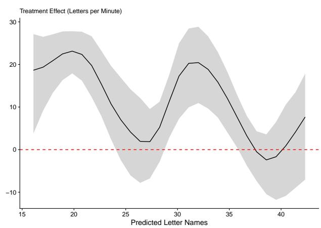  
Panel A: Letter Names

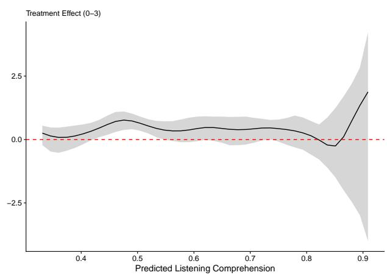  
Panel B: Listening Comprehension

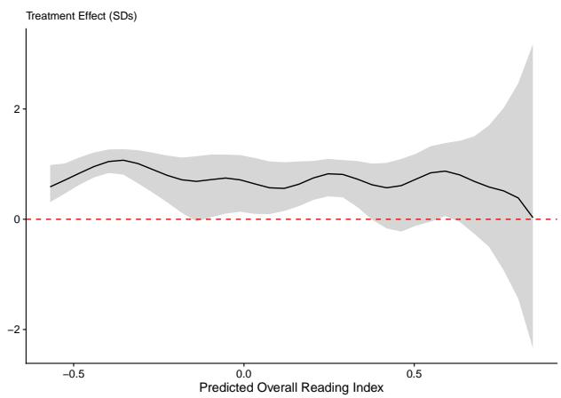  
Panel C: Overall Reading Index

Notes: Sample is all students who were enrolled in one of the 80 study schools at the beginning of the 2024-25 academic year and were found for endline exams in June 2025. Four schools closed during the school year (two per study arm), leaving a final sample of 76 schools. Treatment effects are predicted using endogenous stratification. We predict counterfactual untreated outcomes using a regression forest with honest trees and repeated subsampling (Wager and Athey, 2018), estimate treatment effects using observed outcomes, then non-parametrically estimate heterogeneity by baseline value. We use a rule of thumb bandwidth. Standard errors bootstrapped with 500 iterations.

## H Proofs

Proof of Proposition 1 The teacher chooses $I_{1}^{A} \in [0,1]$ to maximize period-2 advanced skills:

$$
A _ {2} = A _ {0} + \beta \cdot I _ {1} ^ {A} \cdot h (B _ {0}) + \beta \cdot I _ {2} ^ {A} \cdot h (B _ {1})\tag{7}
$$

where $B_{1} = B_{0} + \alpha(1 - I_{1}^{A})$ . By backwards induction, $I_{2}^{A} = 1$ because basic skills are worthless in period 2.

Substituting in the constraint on $B_{1}$ :

$$
A _ {2} = A _ {0} + \beta \cdot I _ {1} ^ {A} \cdot h (B _ {0}) + \beta \cdot h (B _ {0} + \alpha (1 - I _ {1} ^ {A}))\tag{8}
$$

Taking the derivative with respect to $I_{1}^{A}$ :

$$
\frac {\partial A _ {2}}{\partial I _ {1} ^ {A}} = \beta \cdot h (B _ {0}) + \beta \cdot h ^ {\prime} (B _ {0} + \alpha (1 - I _ {1} ^ {A})) \cdot (- \alpha)\tag{9}
$$

Simplifying:

$$
\frac {\partial A _ {2}}{\partial I _ {1} ^ {A}} = \beta \left[ h (B _ {0}) - \alpha \cdot h ^ {\prime} (B _ {0} + \alpha (1 - I _ {1} ^ {A})) \right]\tag{10}
$$

The second-order condition is:

$$
\frac {\partial^ {2} A _ {2}}{\partial (I _ {1} ^ {A}) ^ {2}} = \beta \cdot \alpha^ {2} \cdot h ^ {\prime \prime} (B _ {0} + \alpha (1 - I _ {1} ^ {A})) <   0\tag{11}
$$

which holds since $h''(B) < 0$ by assumption. Thus, the objective function is strictly concave in $I_{1}^{A}$ , and any stationary point is a global maximum.

Case 1: Corner solution at $I_1^A = 0$ .

Since the objective is concave, $I_1^A = 0$ is optimal if and only if:

$$
\left. \frac {\partial A _ {2}}{\partial I _ {1} ^ {A}} \right| _ {I _ {1} ^ {A} = 0} \leq 0\tag{12}
$$

Evaluating at $I_{1}^{A}=0$ :

$$
\left. \frac {\partial A _ {2}}{\partial I _ {1} ^ {A}} \right| _ {I _ {1} ^ {A} = 0} = \beta \left[ h (B _ {0}) - \alpha \cdot h ^ {\prime} (B _ {0} + \alpha) \right]\tag{13}
$$

Therefore, $I_{1}^{A}=0$ is optimal if and only if:

$$
h (B _ {0}) \leq \alpha \cdot h ^ {\prime} (B _ {0} + \alpha)\tag{14}
$$

Case 2: Interior solution $I_{1}^{A} \in (0,1)$ .

An interior solution exists if and only if:

$$
\left. \frac {\partial A _ {2}}{\partial I _ {1} ^ {A}} \right| _ {I _ {1} ^ {A} = 0} > 0 \quad \text { and } \quad \left. \frac {\partial A _ {2}}{\partial I _ {1} ^ {A}} \right| _ {I _ {1} ^ {A} = 1} <   0\tag{15}
$$

The first condition gives:

$$
h (B _ {0}) - \alpha \cdot h ^ {\prime} (B _ {0} + \alpha) > 0 \quad \Longleftrightarrow \quad h (B _ {0}) > \alpha \cdot h ^ {\prime} (B _ {0} + \alpha)\tag{16}
$$

The second condition gives:

$$
h (B _ {0}) - \alpha \cdot h ^ {\prime} (B _ {0}) <   0 \quad \Longleftrightarrow \quad h (B _ {0}) <   \alpha \cdot h ^ {\prime} (B _ {0})\tag{17}
$$

Thus, an interior solution exists if and only if:

$$
\alpha \cdot h ^ {\prime} (B _ {0} + \alpha) <   h (B _ {0}) <   \alpha \cdot h ^ {\prime} (B _ {0})\tag{18}
$$

The optimal interior value $I_{1}^{A}$ is characterized by the first-order condition:

$$
\frac {\partial A _ {2}}{\partial I _ {1} ^ {A}} = 0 \quad \Longleftrightarrow \quad h (B _ {0}) = \alpha \cdot h ^ {\prime} (B _ {0} + \alpha (1 - I _ {1} ^ {A}))\tag{19}
$$

Monotonicity of interior solution:

For $B_{0} \in [\underline{B}, \overline{B}]$ , the interior solution $I_{1}^{A}(B_{0})$ is implicitly defined by:

$$
\Psi (B _ {0}, I _ {1} ^ {A}) \equiv h (B _ {0}) - \alpha \cdot h ^ {\prime} (B _ {0} + \alpha (1 - I _ {1} ^ {A})) = 0\tag{20}
$$

By the implicit function theorem:

$$
\frac {d I _ {1} ^ {A}}{d B _ {0}} = - \frac {\partial \Psi / \partial B _ {0}}{\partial \Psi / \partial I _ {1} ^ {A}}\tag{21}
$$

Computing the partial derivatives:

$$
\frac {\partial \Psi}{\partial B _ {0}} = h ^ {\prime} (B _ {0}) - \alpha \cdot h ^ {\prime \prime} (B _ {0} + \alpha (1 - I _ {1} ^ {A}))\tag{22}
$$

$$
\frac {\partial \Psi}{\partial I _ {1} ^ {A}} = - \alpha \cdot h ^ {\prime \prime} (B _ {0} + \alpha (1 - I _ {1} ^ {A})) \cdot (- \alpha) = \alpha^ {2} \cdot h ^ {\prime \prime} (B _ {0} + \alpha (1 - I _ {1} ^ {A}))\tag{23}
$$

Since $h'(B) > 0$ and $h''(B) < 0$ for all $B$ :

\- $\frac{\partial\Psi}{\partial B_0} = h'(B_0) - \alpha \cdot h''(B_0 + \alpha (1 - I_1^A)) > 0$ (positive minus negative)

• $\frac{\partial\Psi}{\partial I_{1}^{A}}=\alpha^{2}\cdot h^{\prime\prime}(B_{0}+\alpha(1-I_{1}^{A}))<0$ (positive times negative)

Therefore:

$$
\frac {d I _ {1} ^ {A}}{d B _ {0}} = - \frac {\partial \Psi / \partial B _ {0}}{\partial \Psi / \partial I _ {1} ^ {A}} = - \frac {(+)}{(-)} > 0\tag{24}
$$

This establishes that $I_1^A(B_0)$ is strictly increasing in $B_0$ over the interior region $[\underline{B}, \overline{B}]$ .

## Case 3: Corner solution at $I_1^A = 1$ .

By strict concavity, $I_{1}^{A}=1$ is optimal if and only if:

$$
\left. \frac {\partial A _ {2}}{\partial I _ {1} ^ {A}} \right| _ {I _ {1} ^ {A} = 1} \geq 0\tag{25}
$$

Evaluating at $I_{1}^{A}=1$ :

$$
\left. \frac {\partial A _ {2}}{\partial I _ {1} ^ {A}} \right| _ {I _ {1} ^ {A} = 1} = \beta \left[ h (B _ {0}) - \alpha \cdot h ^ {\prime} (B _ {0}) \right]\tag{26}
$$

Therefore, $I_{1}^{A}=1$ is optimal if and only if:

$$
h (B _ {0}) \geq \alpha \cdot h ^ {\prime} (B _ {0})\tag{27}
$$

Characterization via threshold values.

Define $\underline{B}$ and $\overline{B}$ as the unique solutions to:

$$
h (\underline {{B}}) = \alpha \cdot h ^ {\prime} (\underline {{B}} + \alpha)\tag{28}
$$

$$
h (\overline {{B}}) = \alpha \cdot h ^ {\prime} (\overline {{B}})\tag{29}
$$

Existence and uniqueness of $\underline{B}$ :

Define $G_{L}(B) = h(B) - \alpha \cdot h'(B + \alpha)$ . Then:

$$
G _ {L} (0) = h (0) - \alpha \cdot h ^ {\prime} (\alpha) = 0 - \alpha \cdot h ^ {\prime} (\alpha) <   0 (\text { since } h (0) = 0 \text { and } h ^ {\prime} (\alpha) > 0)
$$

\- $G_{L}(B) \to 1 - \alpha \cdot 0 = 1 > 0$ as $B \to \infty$ (since $h(B) \to 1$ and $h'(B) \to 0$ )

\- $G_{L}^{\prime}(B) = h^{\prime}(B) - \alpha \cdot h^{\prime \prime}(B + \alpha) > 0$ for all $B$ (since $h^{\prime}(B) > 0$ and $h^{\prime \prime}(B) < 0$ )

By the intermediate value theorem and monotonicity of $G_{L}$ , there exists a unique $\underline{B} > 0$ such that $G_{L}(\underline{B}) = 0$ .

Existence and uniqueness of $\overline{B}$ :

Define $G_U(B) = h(B) - \alpha \cdot h'(B)$ . Then:

\- $G_U(0) = h(0) - \alpha \cdot h'(0) = 0 - \alpha \cdot h'(0) < 0$

\- $G_{U}(B) \to 1 - \alpha \cdot 0 = 1 > 0$ as $B \to \infty$

\- $G_U'(B) = h'(B) - \alpha \cdot h''(B) > 0$ for all $B$

Similarly, there exists a unique $\overline{B} > 0$ such that $G_U(\overline{B}) = 0$ .

Ordering of thresholds:

Note that for any $B \geq 0$ :

$$
h ^ {\prime} (B + \alpha) <   h ^ {\prime} (B)\tag{30}
$$

since $h'$ is strictly decreasing (as $h'' < 0$ ). Therefore:

$$
\alpha \cdot h ^ {\prime} (B + \alpha) <   \alpha \cdot h ^ {\prime} (B)\tag{31}
$$

This implies $G_{L}(B) > G_{U}(B)$ for all $B > 0$ . Since both functions are strictly increasing and cross zero exactly once, we have $\underline{B} < \overline{B}$ .

Combining the three cases with the threshold characterization:

\- If $B_0 < \underline{B}$ : then $G_L(B_0) < 0$ , so $h(B_0) < \alpha \cdot h'(B_0 + \alpha)$ , hence $I_1^A = 0$

\- If $\underline{B} \leq B_0 \leq \overline{B}$ : then $G_L(B_0) \geq 0$ and $G_U(B_0) \leq 0$ , so $\alpha \cdot h'(B_0 + \alpha) \leq h(B_0) \leq \alpha \cdot h'(B_0)$ , hence interior solution with $I_1^A(B_0)$ strictly increasing in $B_0$

\- If $B_0 > \overline{B}$ : then $G_U(B_0) > 0$ , so $h(B_0) > \alpha \cdot h'(B_0)$ , hence $I_1^A = 1$

This completes the proof.

Proof of Proposition 2 [Proof of Proposition 2]

Define

$$
g (I, B _ {0}, S) = \beta S \left(I h \left(B _ {0}\right) + h \left(B _ {0} + \alpha S (1 - I)\right)\right).
$$

For S > 0, g is strictly concave in I: $\frac{\partial^{2}g}{\partial I^{2}} = \beta\alpha^{2}S^{3}h''(B_{1}) < 0$ since $h'' < 0$ . Therefore the maximizer $I^{*}(B_{0}, S)$ is unique. For any $\bar{I} \neq I^{*}$ , strict concavity implies $g(I^{*}, B_{0}, S) > g(\bar{I}, B_{0}, S)$ , i.e., $V^{TI}(B_{0}, S) > V^{uniform}(B_{0}, S, \bar{I})$ .

## I TFLI Materials Examples

## Week 7 | Day 2

## Things you'll cover today...

New Vocab

Review Sound

Sight Words

Writing Skill

building
trading
teaching

e she of

Full Stops

## Oral Language

10 min

For today's oral language we are going to learn and practise using vocabulary relating to our theme, 'Activities in Our Community'.

## ♪ Warm up with a Song

2 min

I will sing each line of the song, and you're going to sing each line back to me.

Cast, Cast, Cast

To the tune of 'Row, Row, Row Your Boat'

Cast, cast, cast your net,

Gently on the sea,

Happily, happily, happily, happily, Catch some fish for me.

## Teach New Vocabulary

$\textcircled{1}$ 4 min

Turn to page 99 of your workbook. Let's say today's new words and learn what they mean.

## New Vocabulary

building Verb

The action or trade of constructing something, like a house.

trading Verb

The action or activity of buying and selling goods and services.

teaching Verb

The action of helping someone learn new things.

I want you to think of a sentence using one of our new words. For example, “The builder was building a new house.”

I want you to talk in pairs and each share two sentences using the new words. I will be moving round the room to listen...

Circulate to check learners are using the new words correctly in sentences.

I would like two pairs to share their sentences with the whole class...

## Interactive Read Aloud

4 min

I am going to read out a story and I want you all to look at the big picture on page 99 in your workbook. The title is, 'The Big Feast'.

1. What do you think is taking place in the picture?

## > Read the text aloud with feeling and expression

## The Big Feast

In a busy village, everyone was getting ready for the big cultural festival. Kwame the fisherman, Kojo the cattle keeper, and Esi the farmer decided to work together to provide food for the community. Kwame went to the sea to catch fish, Kojo cared for his cattle, and Esi harvested fruits and vegetables from her farm. On the festival day, the village was full of people and music. The three shared their food, and there was singing, dancing, and eating. The festival brought the village together, showing that when people work together, they can make something special.

I have some questions to ask about the story.

2. What did Esi, Kojo and Kwame provide for the community?

3. Why were the people dancing and singing?

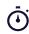

## Phonics

Next, we are going to practise our phonics and review our recently learnt sound, /e/.

## 2.1 Which Word Starts With /e/

$\textcircled{+}$ 2 min

I am going to say two words.

Shout the word that starts with an /e/ sound.

## Say each word pair

red

engine

empty

table

end

hand

bus

echo

## 2.2 Odd One Out

$\text{2 min}$

I'm going to say 3 words. I want you to tell me which word does not rhyme.

Listen carefully and tell me which one is the odd one out...

## Say each set of 3 words...

<table><tr><td>1.</td><td>net</td><td>mat</td><td>sat</td></tr><tr><td>2.</td><td>run</td><td>sun</td><td>sand</td></tr><tr><td>3.</td><td>log</td><td>book</td><td>dog</td></tr></table>

## 2.3 Oral Segmenting Drill

2 min

Next, we are going to say the word and then break it up into the sounds.

As I say a word, I want you to repeat the word, then say the sounds that are in it, like this, "top, /t/ /o/ /p/, top".

<table><tr><td>set</td><td>met</td><td>den</td><td>test</td></tr></table>

Do not segment the sounds for the learners.

## Auditory Drill

3 min

Open your workbooks to page 100. When I say the sound, you write the letter.

## Say each sound once

/d/

|e|

/t/

|a|

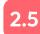

## Review the sound /e/

8 min

Yesterday we learnt the sound /e/.

My turn, /e/. Your turn...

Say each word once

The letter ‘e’ makes the sound /e/. My turn, /e/, your turn... Again, /e/.

Stand up and put your hands together in the air. Let's air-write 'e'.

As we do it, say it with me, “across, up, around.”

OK, open your workbook to page 100. It is your turn to practise writing 'e'.

Learners practise writing it

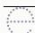

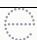

Check learners are writing correctly and support learners with their tripod grip.

Turn to page 100 in your workbooks.

As a whole class, let's read the words and a sentence that use the sound /e/.

## Practise reading with it

<table><tr><td>bet</td><td>ten</td><td>sent</td><td>bed</td></tr><tr><td colspan="4">He gets ten pens.</td></tr></table>

Now, read the words and sentence again quietly in your pairs.

Move around the room listening to pairs reading.

## 3 Reading

## 15 min

For our reading today, we are going to practise blending and review our sight words.

## Blending Drill

8 min

Turn to page 100 in your workbook. Put your finger on the first word chain. Let's read together...

## Word Chains

den > hen > ten > pen

fin > fig > fog > frog

Ted > bed > bend > send

Next, I would like you to read them through again quietly in your pairs...

## Review Sight Words

7 min

Let's practise reading the new sight words we learnt yesterday and remind ourselves of how they sound, and what they mean...

Recent Sight Words

she

of

❤️

Turn to page 100 in your workbook.

We are going to read through some sight words we've learnt recently together.

## Sight Word Practice

<table><tr><td>so</td><td>of</td><td>by</td><td>on</td></tr><tr><td>for</td><td>can</td><td>not</td><td>she</td></tr></table>

Now I want you to read them again, quietly with your partner.

## Writing

15 min

For our writing session today we are going to learn about full stops.

## Teach Full Stops

5 min

We have learnt that sentences start with a capital letter.

Today we will learn what sentences end with.

Show & explain a full stop

I pat the mat.

I have circled the full stop. It is at the end of my sentence.

Full stops are very important. They tell us when a sentence has ended.

This helps to separate our sentences so that we can understand them.

## Shared Writing Practice

5 min

> Write out the sentences without full stops.

Example (without full stops)

Sam is a man Pat is an ant

Let's read these sentences together.

It is hard to understand the sentences because the full stop is missing.

I know we start a sentence with a capital letter so my full stop must go before it.

Example (with full stops)

Sam is a man. Pat is an ant.

Let's read the sentences again and add the full stops together. "Sam is a man, Pat is an ant"
Where do the full stops need to go?

Yes, that's right. One after man. And another at the end, after ant. Why is that?

<table><tr><td colspan="2">Lesson Recap 2 min</td></tr><tr><td colspan="2">&gt; Ask the class these questions to recap the lesson.</td></tr><tr><td colspan="2">Let&#x27;s review what we&#x27;ve learnt today...</td></tr><tr><td>Oral</td><td>Have you seen someone building a house? What did you see?</td></tr><tr><td>Phonics</td><td>Is there an /e/ sound in the word &#x27;net&#x27;?</td></tr><tr><td>Reading</td><td>We read a story. What happened in the village?</td></tr><tr><td>Writing</td><td>How do you know a sentence is finished?</td></tr></table>

## 4.3 Independent Writing

Now, turn to page 101 in your workbook.

I want you to read the text and circle all the full stops you can see.

Check all learners are circling the full stops.

Now, look at the next text in your workbook.

What do you think is missing?

That's right, full stops.

I want you to spend 3 minutes adding in all the missing full stops.

Use the capital letters to help you.

√ End of lesson

## Sam and the Dog

Sam is on a mat

A dog is on a log Dad pats the dog

The dog did a spin Sam pats dog

Dad and Sam sit on the mat

Check all learners are circling the full stops.

What do you notice comes after a full stop?

# Week 7 | Day 2 Our Community

# Activities in our Community

## Oral Language

1. Talk about the new vocabulary:

  
building

  
trading

  
teaching  
2. Read Aloud - Talk about the picture:

# Figure I6 Workbook Example Page 2

## Phonics

1. Write the letter sound you hear:

2. Write e:

3. Read words with e:

<table><tr><td>bet</td><td>ten</td><td>sent</td><td>bed</td></tr></table>

He gets ten pens.

## Reading

1. Read the word chains:

den > hen > ten > pen

fin > fig > fog > frog

Ted > bed > bend > send

2. Read recent Sight Words:

<table><tr><td>so</td><td>of</td><td>by</td><td>on</td></tr><tr><td>for</td><td>can</td><td>not</td><td>she</td></tr></table>

## Writing

1. Circle the full stops:

Sam is a man. Pat is an ant.

"It is my pan. It is a tin pan."

Pat is in the pan . "Spin me," said Pat .

Sam spins Pat in the pan .

2. Add the missing full stops:

Sam is on a mat

A dog is on a log Dad pats the dog

The dog did a spin Sam pats dog

Dad and Sam sit on the mat