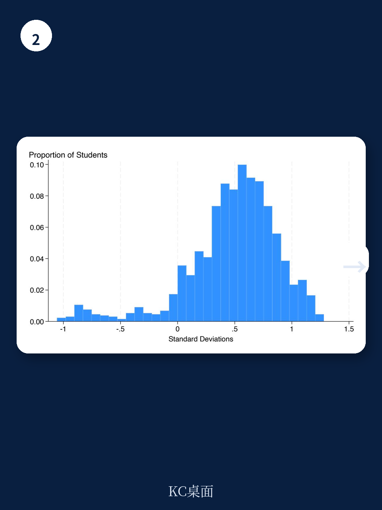

# 世界银行：加纳阅读干预项目九个月提升成绩0.5个标准差

全球最富裕与最贫穷国家之间的学业差距，已达到接近3个标准差的水平。一份来自世界银行发展研究组的最新政策研究工作论文，提供了一种可能大幅缩小这一差距的实证路径。该研究基于加纳低收费私立学校的一项随机对照试验，评估了“基础学习提升工具”项目。结果显示，经过仅九个月的干预，一年级学生的整体阅读测试成绩提升了0.504个标准差，相当于在原有教学模式下超过两年的学习进步。这一效果使该项目在所有阅读干预措施中排入前9%的水平。

该研究的核心贡献在于，它同时证明了干预措施在效果和可扩展性两个维度上的可行性。项目由非营利组织Inspiring Teachers运营，采用智能手机增强的结构化教学法：教师接受阅读科学的前期培训，配备半脚本化的教案和学生练习册，并通过名为SmartCoach的移动应用进行学生追踪、教练管理和培训视频推送。研究将80所学校随机分为干预组和对照组，使用国际标准化的早期年级阅读评估作为测量工具。

## 1. 基础技能对高阶能力形成明显约束效应

研究团队构建了一个技能形成模型，其核心假设是基础技能制约着高阶技能的发展。这一模型预测，差异化教学是最优策略：对低水平学生教授基础内容，对高水平学生提供进阶材料。同时，高质量教学与针对性指导之间存在互补关系，将两者结合的项目将产生特别大的影响。

TFLI项目正是这一思路的操作化体现。它通过脚本化教案和练习册提升教学质量，同时通过定期安排的针对性指导实现差异化教学。SmartCoach应用则同时增强这两个组件：帮助教练管理项目执行情况，协助教师完成评估和差异化教学。

实证结果与模型预测高度一致。干预效果最大的领域是最基础的技能：字母与发音对应关系的效应量为0.764个标准差，音素意识为0.712个标准差。而口语阅读流畅度和阅读理解的效果较小，未达到常规统计显著水平，但效应量仍超过0.2个标准差。报告指出，这些是项目正在培养的下游技能，随着学生在二、三年级继续参与项目，效果更有可能显现。

## 2. 弱势学生受益更大，性别差距缩小三分之二

由于没有基线测试数据，研究团队使用机器学习方法预测对照组学生的期末成绩，并据此分析干预效果的异质性。结果显示，项目对较弱学生的提升更为明显。在整体阅读得分指数上，最弱学生的受益程度显著高于最强学生。具体而言，无法识别单词或无法阅读任何段落的学生比例下降了超过40%。

性别维度上的发现同样值得关注。对照组中女生的成绩领先男生0.26个标准差，而干预措施填补了这一差距的三分之二。这一结果与项目设计理念一致：通过评估驱动的教学和课堂内的补救措施，支持教师更好地帮助学习困难的学生。

> **KC评论：** 这里的关键不是“项目对谁更有效”，而是“项目设计逻辑与效果分布一致”。TFLI并非偶然地让弱势学生受益更多，而是通过差异化教学和基础技能优先的策略，主动瞄准了最需要帮助的学生群体。这种设计逻辑对于其他教育干预项目的复制和调整具有直接参考价值。

## 3. 干预效果随时间近似线性增长，具备跨区域扩展潜力

研究团队此前在2023-24学年进行了一项小规模试点随机对照试验，干预仅运行四个月，效果量为0.25个标准差。2024-25学年的正式随机对照试验运行时间是试点期的2.25倍，效果量也接近2.25倍。这一线性关系表明，持续参与项目可能使成绩提升近乎线性增长。报告据此预测，到三年级结束时，累计效果可能超过1个标准差。

项目的可扩展性还体现在成本结构上。当前边际成本为每名学生48美元，每1个标准差提升的成本为96美元，已具备竞争力。Inspiring Teachers的预算模型预测，到2029年成本将降至每名学生6美元。该组织已在加纳国内从139所学校扩展至计划中的1,638所政府学校，并正在与加纳教育服务部门合作推进。

跨区域扩展方面，项目有两个关键优势。其一，TFLI目前以英语为第一教学语言，可在整个英语非洲地区使用。尽管研究样本中仅有15%的学生在家使用英语，项目仍取得了显著成效。其二，教案开发采用基于组件的设计系统，并利用生成式人工智能加速教案和练习册的开发。该组织已在乌干达进行了初步试点测试，回归调整后的平均成绩差异为0.514个标准差，与加纳随机对照试验的结果相当。

## 4. 结构化教学法与差异化指导的互补组合提供可复用的观察框架

该研究为教育干预领域提供了一个值得关注的观察框架：当结构化教学法与差异化指导被系统性地组合时，其效果可能远超单独实施任一策略。研究团队明确指出，虽然他们没有随机分配项目的两个组成部分，但理论框架和实证结果都表明，这两个方面是互补而非替代关系。

这一框架对于政策制定者和教育项目设计者的启示是直接的。在资源有限的环境中，与其在“提高教学标准”和“因材施教”之间做选择，不如寻找两者结合的具体操作路径。TFLI通过SmartCoach应用同时管理教学质量和差异化教学，提供了一个技术赋能的可行范例。

报告也坦诚地指出了研究的边界。当前数据仅覆盖一年级结束时的效果，项目将继续追踪同一批学生直至三年级结束。模型预测二年级将在高阶技能上出现更大提升，这一预测有待未来数据验证。此外，生成式AI辅助的课程改编在乌干达的初步结果来自观察性试点测试，而非随机对照试验，其因果推断强度有限。

For informational purposes only. Portions may be generated,translated,summarized,or edited with AI assistance based on source materials and may contain omissions or errors. Please verify independently. This is not investment,legal,tax,accounting,or other professional advice.

