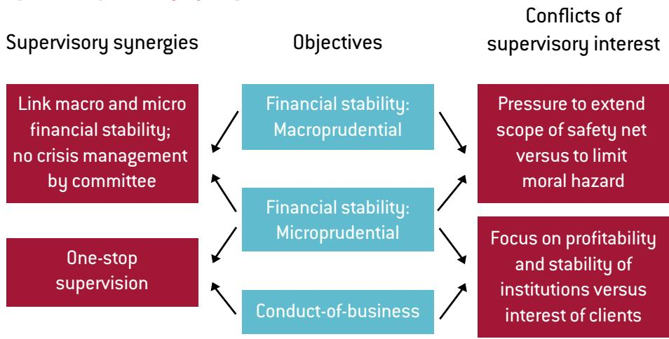
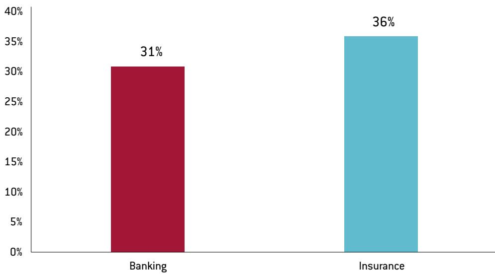

# A ‘twin peaks’ vision for Europe

Dirk Schoenmaker and Nicolas Véron

## DIRK SCHOENMAKER (dirk.schoenmaker@bruegel.org) is a Senior Fellow at Bruegel

NICOLAS VÉRON (n.veron@bruegel.org) is a Senior Fellow at Bruegel and at the Peterson Institute for International Economics.

The authors would like to thank Andre Sapir for useful comments and Inês Goncalves Raposo for excellent research assistance. The text of this Policy Contribution will be published as a chapter in Godwin, A. and A. Schmulow (eds) (2018) The Cambridge Handbook of twin peaks financial regulation, Cambridge University Press.

## Executive summary

THE EUROPEAN UNION'S FINANCIAL SUPERVISORY ARCHITECTURE is based on a sectoral model with separate authorities for banking, insurance and securities and markets. New developments in the EU financial sector make this sectoral structure increasingly out of date:

\- BREXIT CREATES A NEED FOR STRONG EU-LEVEL WHOLESALE MARKET and conduct-of-business supervision to build an integrated capital market for the EU27;

\- MIS-SELLING OF BANK BONDS – that can be bailed in – to retail consumers has highlighted the need for a strong conduct-of-business supervisor for banking and other retail financial services, separate from prudential supervision to ensure a strong focus on the interests of consumers;

\- FINANCIAL CONGLOMERATES, COMBINING BANKING AND INSURANCE, make up about a third of Europe's banking and insurance sector. Joined-up supervision would strengthen the prudential supervision of these conglomerates.

TO DEAL WITH THESE CHALLENGES, the EU should commit to a twin peaks model as a long-term vision for supervision. The first peak would be prudential supervision focusing on the health and soundness of financial firms. As these financial firms have become increasingly interwoven, the vision of integrated cross-sector prudential supervision is increasingly compelling, even though legal obstacles imply it cannot be implemented at the European level in the near term.

THE SECOND PEAK would be a strong markets and conduct of business supervisor. This supervisor would solely focus on the proper functioning of markets and fair treatment of consumers. This twin peaks model should guide Europe's efforts to deal with current challenges.

## Introduction

Some countries, such as the Netherlands, France and the United Kingdom, have moved to a supervisory model known as ‘twin peaks’, with one supervisor for prudential supervision and another for markets and conduct-of-business supervision.

The organisation of the European Supervisory Authorities (ESAs) is based on a sectoral approach with one ESA for each sector: the European Banking Authority for banking, the European Insurance and Occupational Pensions Authority for insurance and pension funds and the European Securities and Markets Authority (ESMA) for the securities markets. But is this sectoral approach still valid $^{1}$ ? Some countries, such as the Netherlands, France and the United Kingdom, have moved to a supervisory model known as ‘twin peaks’ (Taylor, 1995 and 2009), with one supervisor for prudential supervision and another for markets and conduct-of-business supervision. Other countries, such as Germany, Sweden and Poland, have adopted the single supervisory model.

This Policy Contribution outlines a long-term vision for the supervisory architecture in the European Union. In the aftermath of the global financial crisis, the euro-area crisis, and the Brexit vote, it is time to work on this long-term agenda. There is global trend towards the twin peaks model based on positive experiences (see Huang and Schoenmaker, 2015, for a review). Examples are found in Australia, the Netherlands and more recently the United Kingdom and South Africa.

There are several arguments in favour of a twin peaks structure for the European Union. Brexit creates a need for a strong market and conduct-of-business supervisor to build an integrated capital market for the EU27 and the European Economic Area (EEA) $^{2}$ . With the move towards bail-in of bank bonds, cases of mis-selling of these bonds to retail consumers who were not fully aware of the bonds' risk profile have come to widespread public attention. That requires a strong and proactive conduct-of-business supervisor, which is separate from the prudential supervisor. Finally, there are interlinkages between banks and insurers within financial conglomerates. Integrated prudential supervision would make it possible to supervise these conglomerates on a joined-up basis.

## Supervisory models

The organisational structure of financial supervision has been changed in most EU countries over the last 20 years (see Table 1). All countries used to have a sectoral model of financial supervision with separate supervisors for banking, insurance and securities, reflecting the traditional dividing lines between financial sectors. But the sectors are converging. The universal banking model allows banks to combine banking activities, such as lending and deposit-taking, with securities activities, such as offering investment funds and underwriting securities offerings. Meanwhile, banks and insurers are allowed to operate as part of financial conglomerates. Financial products are converging. Banking and life-insurance products, for example, both serve the market for long-term savings. Mortgages are no longer the sole province of banks, but are also offered by insurers and pension funds. Because of the blurring of the dividing lines between financial sectors, cross-sector models of supervision have emerged. There are two main cross-sector models of supervision: a functional (or twin peaks) model and an integrated model.

In the twin peaks model, there are separate supervisors for each of the supervisory objectives: prudential supervision and conduct of business. In some countries, especially in the euro area where central banks have transferred their responsibility for monetary policy to the European Central Bank, the central bank is responsible for prudential supervision. In other countries – Australia is one example – a separate agency is responsible for prudential supervision.

In the integrated model, there is a single supervisor for banking, insurance and securities combined (or, put differently, one supervisor who oversees both prudential supervision and conduct-of-business). There are two versions of the integrated model. Denmark and Sweden have adopted a fully integrated model without central bank involvement in financial supervision. In Germany and Austria, the central bank still has a role in banking supervision, alongside the integrated supervisor (respectively, BaFin in Germany and FMA in Austria). The twin peaks model combines the objectives of systemic supervision and prudential supervision, leaving conduct-of-business supervision as a separate function. The integrated model combines the objectives of prudential supervision and conduct-of-business supervision, leaving systemic supervision (financial stability) as a separate function that is usually performed by the central bank.

Table 1: Organisational structure of financial supervision (as of mid-2017)

<table><tr><td colspan="5">Basic models</td></tr><tr><td>Countries</td><td>(1) Sectoral</td><td>(2) Cross-sector: functional (twin peaks)</td><td>(3a) Cross-sector: integrated without central bank role in banking supervision</td><td>(3b) Cross-sector: integrated with central bank role in banking supervision</td></tr><tr><td rowspan="9">European Union</td><td>Bulgaria</td><td>Belgium (2011)</td><td>Denmark (1988)</td><td>Austria (2002)</td></tr><tr><td>Cyprus</td><td>Croatia (2005)</td><td>Estonia (2002)</td><td>Czech Republic (2006)</td></tr><tr><td>Greece</td><td>France (2003)</td><td>Hungary (2000)</td><td>Finland (2009)</td></tr><tr><td>Lithuania</td><td>Italy (1999)</td><td>Latvia (2001)</td><td>Germany (2002)</td></tr><tr><td>Luxembourg</td><td>Netherlands (2002)</td><td>Malta (2002)</td><td>Ireland (2003)</td></tr><tr><td>Portugal</td><td>United Kingdom (2011)</td><td>Poland (2008)</td><td>Slovakia (2006)</td></tr><tr><td>Romania</td><td></td><td>Sweden (1991)</td><td></td></tr><tr><td>Slovenia</td><td></td><td></td><td></td></tr><tr><td>Spain</td><td></td><td></td><td></td></tr><tr><td rowspan="3">Outside EU</td><td></td><td>Australia (1998)</td><td></td><td>Japan (2000)</td></tr><tr><td></td><td>Canada (1987)</td><td></td><td></td></tr><tr><td></td><td>United States (2011)</td><td></td><td></td></tr></table>

Source: Updated from De Haan, Schoenmaker and Oosterloo (2012). Note: The United States is categorised as a functional model, because the Dodd-Frank Act of 2010 gave strong cross-sectoral powers to the Federal Reserve as the main systemic supervisor, while conduct-of-business supervision is mostly entrusted to the SEC, CFTC and CFPB. Underlying this, there are still multiple sectoral supervisory agencies in the United States at the federal and state levels. France has twin peaks features, but with some retail conduct of business supervision for banks and insurance at ACPR (prudential supervisor) instead of AMF (markets supervisor). Italy has also twin peak features, with conduct-of-business supervision of banks at CONSOB. Portugal is currently reviewing its supervisory model.

Kremers et al (2003) developed a framework to analyse the trade-offs by listing the synergies and conflicts of supervisory interests for both models. Figure 1 summarises these potential synergies and conflicts. The first synergy in the left panel of Figure 1 results from combining systemic supervision with the prudential supervision of financial institutions. The synergy between stability issues on the micro level (at the level of the financial institution) and the macro level (economy-wide) refers to the ability to act decisively and swiftly in the event of a crisis. Crisis management usually requires key decisions to be taken within hours rather than days. Combining both micro- and macro-prudential supervision within a single institution ensures that relevant information is available at short notice and that a speedy decision to act can be taken if necessary. The Northern Rock crisis in the UK in 2007 indicated that crisis management by two institutions might not be very effective. According to Buiter (2007), coordination between the Bank of England and the UK Financial Services Authority was shown to be insufficient. Goodhart (2017) also argues that the working of what was then called the tripartite regulatory system – comprising the Treasury, the Bank of England and the Financial Services Authority – failed in the United Kingdom during the great financial crisis.

The second synergy in Figure 1 is ‘one-stop supervision,’ ie the synergy between prudential supervision and conduct-of-business supervision. Furthermore, synergies in the execution of supervision are exploited by combining different supervisory activities within one institution.

Figure 1: Supervisory synergies and conflicts  

The first potential conflict of interest between systemic supervision and prudential supervision relates to the possibility of lender-of-last-resort operations (LoLR) by the central bank. How can the pressure to extend the benefits of LoLR operations (avoiding systemic risk, such as a financial panic or bank runs) to all financial institutions be balanced against its costs (moral hazard)? The answer adopted by many central banks is to limit the possibility of LoLR operations to banks, which are subject to systemic risk. Thus LoLR operations are not available to insurance companies. However, when financial groups integrate, it might become more difficult to isolate only the banking part of financial institutions for potential LoLR operations. The financial panic of September-October 2008 in the United States provided an illustration of this. Hitherto non-bank financial groups such as Morgan Stanley and Goldman Sachs hastily converted to bank holding company status in order to access the federal banking safety net.

The second potential conflict of interest between prudential supervision and conduct-of-business supervision relates to the different nature of their objectives. The two types of supervision generally require different mindsets and skills, and occasionally conflict with each other (Véron, 2017). Especially in times of financial crisis, or to avert a crisis, the imperative of financial stability can be so overwhelming that authorities might neglect some conduct duties in order to help firms satisfy prudential requirements – for example, authorities might close their eyes to questionable commercial practices if these help a bank to increase its profitability and capital. Conversely, in non-crisis times, conduct mandates might be so all-consuming that prudential considerations are neglected, as arguably happened in the run-up to 2007 at the UK Financial Services Authority in its supervision of several British banks (including Northern Rock and Royal Bank of Scotland), or at the US Securities and Exchange Commission in its supervision of large broker-dealers (including Bear Stearns and Lehman Brothers). Various cases of mis-selling of securities in several European countries (including most prominently Italy in recent years, but also Finland, Slovenia, Spain and others in the past), when banks sold their own risky shares, subordinated debt and/or senior debt instruments to retail clients, including some with low levels of financial literacy, can be considered in a similar light. These experiences suggest that the enforcement of consumer protection regulation in the financial sector should not be entrusted to prudential supervisors.

The prudential supervisor will be interested in the soundness of financial firms including profitability, while the conduct-of-business supervisor will focus on the interests of those firms' clients. Mixing up the responsibilities of financial stability and conduct-of-business could create incentives for the supervisor to prioritise one objective over the other. By separating the supervisory functions, the conduct-of-business supervisor is ideally situated to supervise possible conflicts of interest between a financial institution and its clients because it will focus only on the interests of the clients. Furthermore, the stability objective is consistent with preserving public confidence and may require discretion and confidentiality, which could be counter-productive to the transparency objective.

## Twin peaks for Europe

We argue that the European supervisory architecture should eventually move to a twin peaks model for three main reasons. First, banks and insurers are often part of a financial conglomerate, which warrants integrated banking-insurance supervision. Second, the EU27 will need to upgrade the supervision of its capital markets after Brexit. A dedicated markets supervisor can adapt quickly to this new reality. Third, prudential supervision and markets and conduct-of-business supervision require different skills and approaches. While the first deals more with technical capital adequacy issues and requires staff trained in economics, finance and/or accountancy, the second is more behavioural and legalistic (Goodhart et al, 2002). This behavioural and legalistic approach concerns policing the conduct of financial institutions in the markets (eg insider trading, market abuse, disclosure) and towards clients (eg adequate information provision, duty of care, know your customer).

We frame our recommendation for twin peaks supervision in the EU as a long-term aspirational goal. Defining a long-term goal is important for taking decisions on short-term issues, such as the relocation of the European Banking Authority from London to the EU27 and the upgrading of ESMA.

## Prudential supervision

Close interaction between banking and insurance supervision is needed for the effective supervision of financial conglomerates that combine banking and insurance. Figure 2 shows that 31 percent of banks and 36 percent of insurers belong to a financial conglomerate. These percentages are for 2015 and measured in assets (ie bank conglomerate assets as a share of total banking assets and total insurance assets).

Why is such close interaction necessary? During the financial crisis, several financial institutions experienced solvency problems. These could emerge in any part of the financial institution (eg sub-prime mortgages in the bank or on the insurance balance sheet). It appeared that several financial conglomerates made use of double counting and thus had insufficient capital. Double counting (also known as double gearing) is the practice whereby the same capital base at the holding level of a financial conglomerate is counted as regulatory capital for both the banking activities and the insurance activities.

Figure 2: Share of financial conglomerates in banking and insurance at EU level (2015)  
  
Source: Bruegel based on Joint Committee (2016). Note: The graph shows the share of EU banks and insurance groups that are part of a financial conglomerate.

Such double counting was, and still is, allowed because of the fragmented financial architecture, both on the rule-making and supervisory sides. On the regulatory front, the so-called Danish compromise, agreed in the process of EU transposition of the Basel III capital accord and enshrined in the EU Capital Requirements Regulation, allows double counting of capital (Financial Times, 2012). On the supervisory front, the absence of an integrated focus (the supervisory focus is on the banking and insurance parts but not on the aggregate) leaves no-one responsible for the overall capitalisation of financial conglomerates. The current weak form of supplementary supervision of financial conglomerates, in which either the banking or insurance supervisor has some responsibilities for the supervision of conglomerates, cannot replace proper integrated supervision.

Nevertheless, the industry and the supervisory authorities are keen to preserve the current sectoral structure and unwilling to adopt a twin peaks model (European Commission, 2017b). From a political economy point of view, this position is understandable. Financial institutions and their supervisors are keen to preserve the status quo, including any cosy relationships between the main players. In particular, the insurance sector is afraid that a merged banking/insurance prudential authority would be dominated by banking regulatory approaches. By contrast, some stakeholders, mainly from academia, are critical of the sectoral supervision model on the basis that it is outdated and ignores the reality of the retail financial markets in Europe (Huang and Schoenmaker, 2015; European Commission, 2017b). Finally, consumer and public-interest advocacy organisations also support a twin peak model of supervision that would separate market conduct from prudential supervision for reasons mentioned above (eg Lenz, 2017).

On the political front, Table 2 shows that financial conglomerates have a substantial presence in the largest EU27 countries. In Germany, France and Italy, conglomerates make up 20 to 90 percent of the respective banking and insurance sectors. So, these large countries have an interest in appropriate supervisory arrangements for financial conglomerates.

Table 2: Share of financial conglomerates in banking and insurance at country level (2015)

<table><tr><td></td><td>Banking</td><td>Insurance</td></tr><tr><td></td><td>2015</td><td>2015</td></tr><tr><td>Austria</td><td>24%</td><td>37%</td></tr><tr><td>Belgium</td><td>40%</td><td>22%</td></tr><tr><td>Denmark</td><td>43%</td><td>17%</td></tr><tr><td>Finland</td><td>19%</td><td>82%</td></tr><tr><td>France</td><td>88%</td><td>22%</td></tr><tr><td>Germany</td><td>27%</td><td>28%</td></tr><tr><td>Italy</td><td>19%</td><td>47%</td></tr><tr><td>Malta</td><td>15%</td><td>0%</td></tr><tr><td>Netherlands</td><td>17%</td><td>59%</td></tr><tr><td>Spain</td><td>14%</td><td>3%</td></tr><tr><td>Sweden</td><td>45%</td><td>27%</td></tr><tr><td>United Kingdom</td><td>10%</td><td>17%</td></tr><tr><td>EU</td><td>31%</td><td>36%</td></tr></table>

Source: Bruegel based on Joint Committee (2016). Note: The table shows the share of EU banks and insurance groups that are part of a financial conglomerate. At the country level, only countries are shown where the head or parent company of a financial conglomerate is located. At the EU level, all financial conglomerates with the headquarters located in the EU are shown.

How can close cooperation between banking and insurance supervision be implemented in order to enable a joined-up view of the capital adequacy of financial conglomerates? On the banking side, the Single Supervisory Mechanism (SSM) is responsible for the supervision of the banks in the euro area. The non-euro area member states can join the EU banking union through the mechanism of close cooperation set out in the SSM Regulation. Given the cross-border banking links between EU member states, it is plausible that most, if not all, non-euro area countries might join the banking union at some future stage (Hüttl and Schoenmaker, 2016). In early July 2017, both Denmark and Sweden indicated they would consider such close cooperation by 2019.

The European insurance sector is highly integrated with a large and rising share of cross-border business. On average, insurance groups conduct 29 percent of their business in other EU countries. For the large insurers, this percentage even increases to about 50 percent (Schoenmaker, 2016). While the global financial crisis led to a reversal in banking integration, there is no evidence for that in insurance. These large insurers run the asset management and risk management functions from the head office in an integrated way. The Solvency II directive was implemented in 2016, allowing insurers to use their internal models for capital purposes. Given the strong cross-border nature of the large European insurers, the European Insurance and Occupational Pensions Authority (EIOPA) should become responsible for the approval and monitoring of these internal models (Schoenmaker, 2016; European Commission, 2017d). EIOPA might thus be given responsibility for direct supervisory tasks in relation to the large insurers in the European Union.

A full merger of EIOPA and the ECB (as the SSM's central supervisor) is not possible without treaty change. Article 127(6) of the Treaty on the Functioning of the European Union allows the ECB to conduct “prudential supervision of credit institutions and other financial institutions with the exception of insurance undertakings”. This means the ECB is not allowed to supervise insurance companies and only allowed to do prudential supervision (ie no conduct-of-business supervision) of banks. Nevertheless, close interaction between EIOPA and the ECB in the prudential supervision of financial conglomerates is possible. It is already facilitated by both institutions being located in Frankfurt and could be further improved by physical co-location.

A final question on the prudential side is the future of the European Banking Authority after Brexit. The European Banking Authority is needed for technical rule-making and supervisory convergence, as long as the SSM does not cover all EU countries. The European Banking Authority is able to balance the interests between the ‘ins’ and ‘outs’ of the banking union. In the long term, EIOPA could be responsible for the technical rules on insurance supervision as well as the direct supervision of the large insurers. If all ‘outs’ eventually join the banking union, the ECB could take over the European Banking Authority’s current responsibilities, including the preparation of binding technical standards for the prudential supervision of banks.

## Markets and conduct-of-business

On the second peak, it is useful to make a distinction between supervising financial firms' conduct in wholesale markets and financial firms' conduct in relation to their retail clients. London is currently the wholesale markets hub of Europe, providing corporate and investment banking services to the EU's 28 countries and well beyond. Assuming the UK leaves the EEA and its single market for financial services, UK-based financial firms would consequently lose their passports to do direct business with EU27 clients, and Brexit would thus lead to a partial migration of wholesale market activities from London to the EU27.

A possible fragmentation of trading activity across several EU27 countries might result in increased costs and reduced access to capital for companies. A related risk is that of a regulatory race to the bottom among the EU27, leading to misconduct, loss of market integrity and possibly financial instability. On the upside, Brexit is also an opportunity to build more integrated and vibrant capital markets in the EU27 that would better serve all member economies, to improve risk sharing to withstand local shocks and to make the EU27 an attractive place to do global financial business. This would speed up the rebalancing from a primarily bank-based to a relatively more market-based financial system, an objective inherent to the EU's Capital Markets Union (CMU) policy, which was launched in 2014.

To prevent intra-EU27 financial market fragmentation with higher financing costs, Sapir et al (2017) argue that a single set of rules (or single rulebook) is necessary but not sufficient. To achieve cross-border integration, consistent oversight of wholesale markets and enforcement of relevant regulation are critical. This requires integration of the institutional architecture, for which the tried-and-tested model in the EU is a hub-and-spoke design, which has long been used for competition policy and, more recently, for banking supervision. The straightforward way of implementing this approach, without the need for changes to the EU treaties, would be through the build-up of ESMA, which has already a direct EU-wide supervisory role but only for limited market segments. The European Commission has recently proposed moving in that direction (European Commission, 2017c and 2017d).

A broadening of ESMA's scope would require reform of its governance and funding, which currently limit its independence and capacity. Such reform should not disrupt ESMA's operations, but should align them with better designed institutions, including the ECB's Supervisory Board and the Single Resolution Board. ESMA should be managed by an executive board of five or six full-time members vetted by the European Parliament, in place of the current supervisory board of national representatives (in which the chair cannot even cast a vote). This would help to overcome distortions arising from influential local interests and reduce regulatory capture. In line with international practice, ESMA's funding should rely on a small levy on capital markets activity, under the scrutiny of the European Parliament, instead of the current political bargaining through the general EU budget.

The new areas of responsibility for the reformed ESMA should be focused on those market segments where EU activity is currently most concentrated in London:

1. Supervision of markets and infrastructure;

2. Wholesale market activities of investment banks;

3. Corporate accounting and auditing;

4. Non-EU firms.

While financial infrastructure (eg clearing houses), accounting and auditing and non-EU (third-country) firms have already been mentioned in a March 2017 consultation document published by the European Commission (2017a), Sapir, Schoenmaker and Véron (2017) argue that market oversight and specifically the conduct supervision of investment banks are also important tasks for ESMA to ensure effective and efficient supervision of the newly emerging wholesale markets in the EU27 in the context of Brexit. It should be noted that both the infrastructure and the markets are integrating in the EU27. An early example is Euronext, covering the stock exchanges of France, the Netherlands, Belgium and Portugal. Another example is Nasdaq Nordic (formerly known as OMX), covering the exchanges of the Nordic countries (Helsinki, Copenhagen, Stockholm, Iceland) and Baltic countries (Riga, Tallinn and Vilnius). It would be far more effective and efficient to make ESMA responsible for the direct supervision of these platforms (in a hub-and-spoke model, with relevant operational tasks duly delegated to national market supervisors) instead of four (in the case of Euronext) or seven (in the case of Nasdaq Nordic) separate local national market authorities. ESMA would thus become responsible for safeguarding the integrity of markets and avoiding insider trading and market abuse.

The wholesale market activities of the large players, comprising the large European universal banks and the US, UK, Swiss and Japanese investment banks, which will partly relocate to the EU27, also need to be supervised. This supervision covers the wholesale banking aspects of the Markets in Financial instruments Directive (MiFID). $^{3}$

For other aspects, such as authorisations of initial public offerings and fund management registrations, ESMA's policy-setting role should be strengthened but individual decisions could continue to be taken by national authorities for the foreseeable future. Similarly, the conduct-of-business supervision of smaller investment and insurance intermediaries to protect retail investors can stay at the national level. These activities – IPOs, fund management and intermediaries – comprise the bulk of the current workload of the national markets authorities. This would remain at the national level, in line with the subsidiarity principle, with ESMA given greater authority to ensure supervisory consistency in line with the European Commission's recent proposals (European Commission, 2017d).

## Policy conclusions

There are too many policy constraints for the European Union to adopt a twin peaks financial supervisory architecture in the short term, including uncertainties about Brexit, treaty provisions and possible changes to the geographical coverage of the banking union (currently the 19-country euro area, possibly expanding in the future through the close cooperation procedure). With this in mind, we suggest twin peaks as a long-term guiding vision for the EU, not a rapidly achievable target.

Even so, the vision could have practical consequences in the near term, in multiple areas such as the reform of ESMA's governance and funding, the supervision of emerging (fintech) financial market segments, the future of the European Banking Authority and the EU approach to consumer financial protection. Twin peaks holds the promise of a financial system that is both safer, thanks to joined-up prudential oversight, and fairer, thanks to the better protection of savers, investors, and more generally of users of financial services. It is desirable that the European Union should commit itself explicitly to that vision, even if the time needed for its fulfilment is likely to be measured in decades rather than years.

## References

De Haan, J., D. Schoenmaker and S. Oosterloo (2012) Financial Markets and Institutions: A European Perspective, Second Edition, Cambridge University Press, Cambridge, UK

European Commission (2017a) 'Public Consultation on the Operation of the European Supervisory Authorities (ESAs)', DG FISMA, Brussels

European Commission (2017b) 'Feedback statement on the public consultation on the operations of the European Supervisory Authorities having taken place from 21 March to 16 May 2017', DG FISMA, Brussels

European Commission (2017c) ‘Communication on the Mid-Term Review of the Capital Markets Union Action Plan,’ COM(2017) 292, 8 June, Brussels

European Commission (2017d) 'Communication on Reinforcing integrated supervision to strengthen Capital Markets Union and financial integration in a changing environment,' COM(2017) 542, 20 September, Brussels

Financial Times (2012) 'Basel III - the case for the defence', 23 January

Goodhart, C. (2017) The Bank of England, 1694-2017, forthcoming.

Goodhart, C., D. Schoenmaker and P. Dasgupta (2002) 'The Skill Profile of Central Bankers and Supervisors', European Finance Review 6: 397-427

Huang, R. and D. Schoenmaker (eds) (2015) Institutional Structure of Financial Regulation: Theories and International Experiences, Routledge, London

Hüttl, P. and D. Schoenmaker (2016) 'Should the 'outs' join the Banking Union?', Policy Contribution 2016/03, Bruegel

Joint Committee of the European Supervisory Authorities (2016) List of Financial Conglomerates 2016

Kremers, J., D. Schoenmaker and P. Wierts (2003) 'Cross-Sector Supervision: Which Model?' in R. Herring and R. Litan (eds) Brookings-Wharton Papers on Financial Services: 2003, Brookings Institution, Washington DC

Lenz, R. (2017) 'Europäisches System der Finanzaufsicht effizient weiterentwickeln', written statement to the German Bundestag Finance Committee hearing, 31 May, available at https://www.bundestag.de/blob/508694/9d745061e6587ef0e86c7aa42891d2c9/13-data.pdf

Sapir, A., D. Schoenmaker and N. Véron (2017) 'Making the Best of Brexit in Finance: The EU27 Side', Policy Brief 2017/01, Bruegel

Schoenmaker, D. (2016) 'European Insurance Union and How to Get There?' Policy Brief 2016/04, Bruegel

Schoenmaker, D. and N. Véron (2017) 'EBA relocation should support a long-term 'Twin Peaks' vision', Bruegel Blog, 5 April

Taylor, M. (1995) Twin Peaks: A Regulatory Structure for the New Century, Centre for the Study of Financial Innovation, London

Taylor, M. (2009) Twin Peaks Revisited, Centre for Study of Financial Innovation, London

Véron, N. (2017) 'Charting the next steps for the EU financial supervisory architecture', Policy Contribution 2017/16, Bruegel