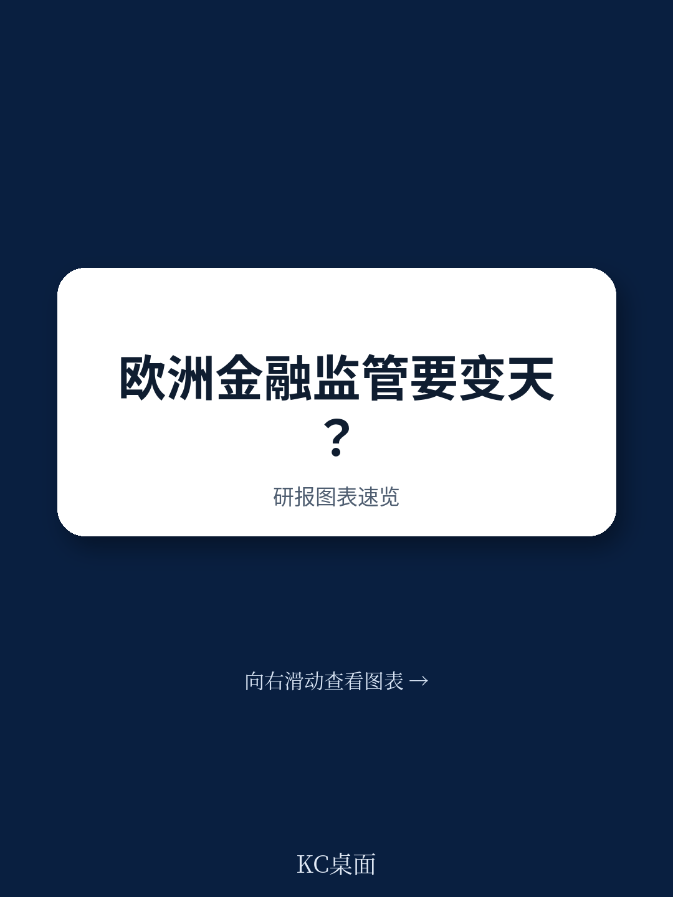
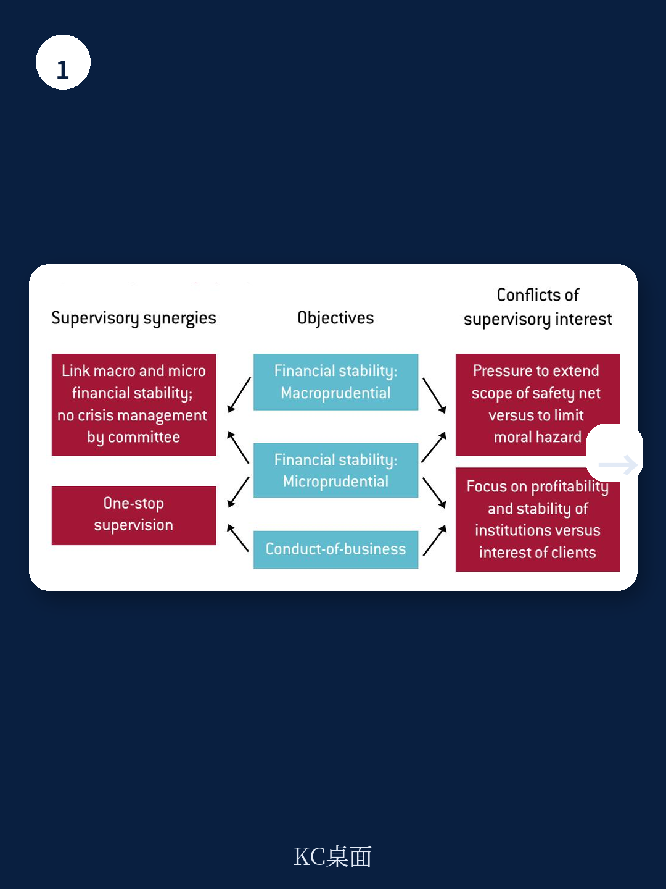
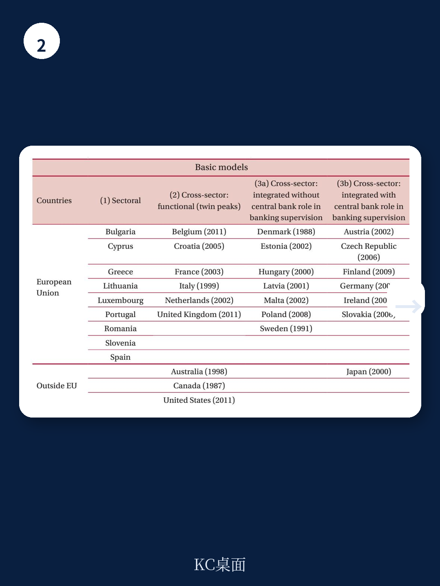

# 布鲁盖尔研究所：行业规则与主题变化观察

欧盟资金监管架构正处在一个微妙的窗口期。布鲁盖尔研究所高级研究员 Dirk Schoenmaker 与 Nicolas Véron 在最新政策报告中提出，欧盟应当将“双峰”监管作为长期愿景：一个监管机构专注审慎监管，另一个专注市场行为与消费者保护。这一判断的直接背景是，欧盟现行按行业划分的监管体系——银行、保险、标的各自为政——已经难以应对资金混业经营、英国脱欧后资本市场重构以及零售读者保护不足这三重变化。

报告给出的数据支撑了这一判断。截至 2015 年，欧盟 31% 的银行资产和 36% 的保险资产归属于资金集团，银行与保险业务在同一集团内交叉持股、共享资本已是常态。与此同时，欧盟层面的三大监管机构（欧洲银行管理局、欧洲保险与职业养老金管理局、欧洲标的与市场管理局）依然按行业边界运作，对资金集团的总体资本充足情况缺乏统一视角。报告特别指出，所谓“丹麦妥协”——欧盟在转化巴塞尔 III 资本协议时允许同一资本基础在银行和保险两个监管口径下重复计算——正是这种碎片化架构的直接产物。

## 1. 审慎监管与行为监管的职能分离具有内在逻辑

报告的核心论证建立在两类监管目标的根本差异之上。审慎监管关注机构的健康与稳健，需要宏观环境学、资金学和会计学训练，处理的是资本充足率等技术问题；行为监管关注市场运行秩序和消费者公平待遇，更偏向行为与法律路径，涉及内幕交易、市场滥用、信息披露、适当性义务等议题。两种监管所需技能不同，在扰动时期还可能相互挤压：为帮助银行满足审慎要求，监管者可能对可疑的商业行为睁一只眼闭一只眼；而在非扰动时期，行为监管的繁重任务又可能挤占审慎监管的注意力。

报告援引了 2007 年英国北岩银行扰动和 2008 年美国大型经纪商监管失效作为例证。在这些案例中，审慎监管与行为监管职能混合在同一机构内，最终两个目标都没有得到充分实现。报告由此提出一个更具体的判断：资金消费者保护规则的执行不应交给审慎监管者。

> **KC评论：** 这里的关键不是“双峰”这个名词，而是职能分离背后的激励逻辑。当同一个监管者同时负责银行稳健和消费者保护时，扰动时刻几乎必然优先保银行。分离的意义在于让行为监管者只对消费者负责，避免目标冲突被内部消化。

## 2. 资金集团的双重资本计算暴露跨行业监管空白

报告用“双重计算”（double gearing）一词描述了资金集团监管的核心漏洞：同一笔资本在集团控股层面同时被银行子公司和保险子公司计入监管资本。这一做法在规则制定端因“丹麦妥协”而合法化，在监管执行端则因缺乏整合视角而无人对集团整体资本充足负责。

报告认为，现有的资金集团补充监管只是“弱形式”——由银行或保险监管者中的一方承担部分责任，无法替代真正的整合监管。这一判断的政策含义在于，如果欧盟要有效监管占银行业资产近三分之一的资金集团，银行与保险的审慎监管必须走向联合。报告也坦承，行业和监管当局都倾向于维持现状，保险业尤其担心合并后的审慎监管机构会被银行监管思路主导。

## 3. 英国脱欧后欧盟27国需要升级批发市场行为监管

英国脱欧为欧盟提供了一个重新设计资本市场监管架构的契机。报告指出，欧盟27国需要建设一体化的资本市场，而这要求一个强有力的欧盟层面市场与行为监管者。目前泛欧交易平台如 Euronext（覆盖巴黎、阿姆斯特丹、布鲁塞尔、里斯本等交易所）和 Nasdaq Nordic（覆盖北欧与波罗的海国家）分别由多个国家监管当局分别监管，报告认为由 ESMA 直接监管这些平台、采取“中心—辐射”模式将更有效。

报告同时划定了边界：首次公开发行审批、产品管理注册以及对零售读者的中介行为监管，在可预见的未来仍应留在国家层面。这些活动占国家市场监管机构工作量的主体，符合辅助性原则。ESMA 的角色应集中在批发市场行为监管和跨市场一致性协调上。

## 4. 长期愿景与近期决策的衔接路径

报告明确表示，由于英国脱欧不确定性、条约限制以及银行联盟地理覆盖可能变化等因素，欧盟在短期内无法全面转向双峰模式。但作者主张，将双峰作为长期指导愿景仍有近期政策价值：欧洲银行管理局从伦敦迁址、ESMA 治理与融资改革、资金科技新兴市场领域的监管归属、欧盟消费者资金保护路径，这些正在进行的决策都需要一个长期坐标来校准方向。

这一框架为观察欧盟资金监管演变提供了一个可复用的分析工具：任何一项监管改革提案，都可以先问它服务于审慎目标还是行为目标，再判断现有机构配置是否与目标匹配。报告给出的判断是，欧盟的监管架构最终需要走向按目标而非按行业划分，但实现这一转变的时间尺度可能是数十年而非数年。

> **KC评论：** 报告最有价值的观察框架是“按目标划分监管”而非“按行业划分监管”。读者在跟踪欧盟监管动态时，可以用这个坐标判断每一项改革是在强化审慎监管、强化行为监管，还是在维持行业边界。多数争议都可以归入这三类。

For informational purposes only. Portions may be generated,translated,summarized,or edited with AI assistance based on source materials and may contain omissions or errors. Please verify independently. This is not investment,legal,tax,accounting,or other professional advice.

