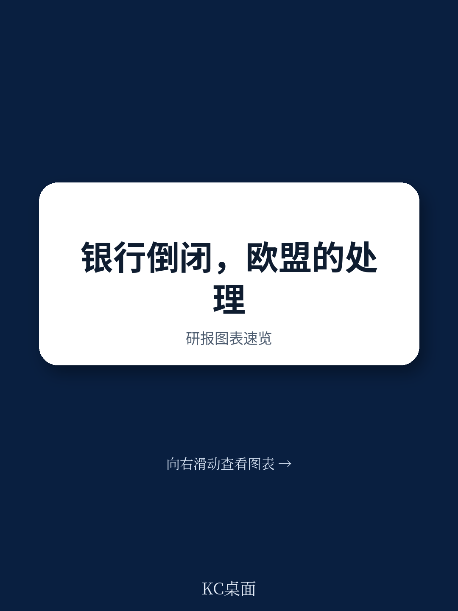
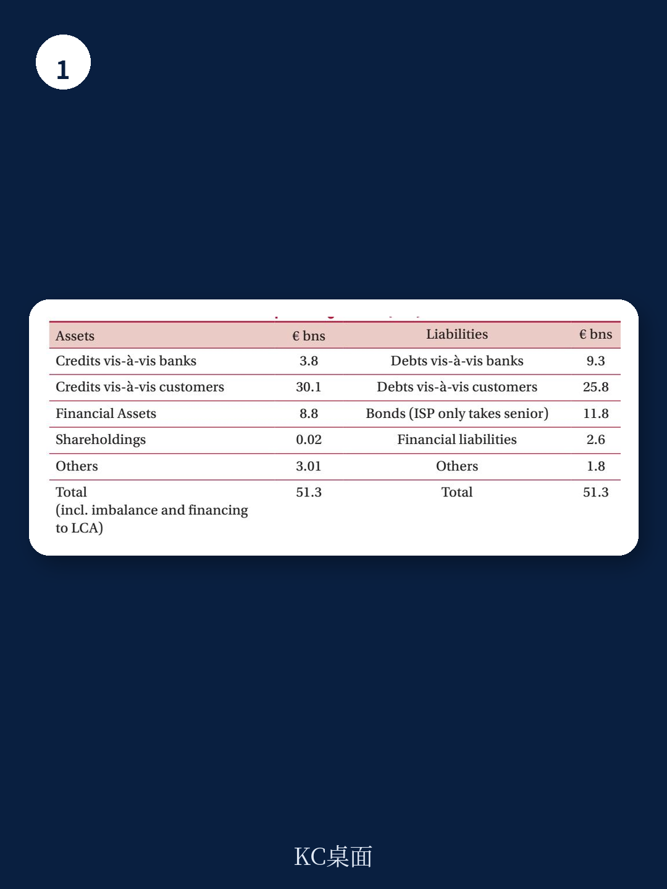

# 布鲁盖尔研究所：研究主题与行业变化观察

2017年6月，意大利威尼托银行和维琴察人民银行被欧洲央行判定为“濒临倒闭”。单一处置委员会随后认定，这两家银行不构成系统性不确定性，也不提供关键功能，因此不进入处置程序，而是交由意大利国内破产法清算。同一时期，西班牙大众银行因公共利益考量进入处置程序，由桑坦德以1欧元收购。两起案例操作结构相似，适用的法律框架却完全不同，最终对债权人、收购方和纳税人的影响也截然不同。

布鲁盖尔研究所研究员西尔维娅·默勒在这份政策贡献中提出一个核心判断：欧盟银行联盟的处置框架已经相对清晰，但清算环节仍由各国国内破产法管辖，这种双层结构正在成为不确定性的主要来源。报告认为，如果不对清算中的“关键功能”和“公共利益”定义加以澄清，不对各国破产法差异进行协调，银行联盟的规则预期就难以真正落地。

## 1. 处置与清算在公共资金使用规则上存在明显差异

欧盟《银行复苏与处置指令》管辖处置程序，清算则适用各国国内破产法。两者在公共资金使用上的约束截然不同。处置程序要求银行在动用单一处置产品前，必须先完成至少相当于总负债8%的内部纾困，这意味着在特定资产负债表结构下，高级债券持有人也可能被纳入损失分担。清算程序则只需满足欧盟委员会2013年银行业通讯中“轻量”的负担分担要求，即股权和次级债承担损失，高级债权人不一定被触及。

报告对比了意大利两银行与西班牙大众银行的案例。大众银行进入处置程序，桑坦德收购时伴随70亿欧元增资和33亿欧元的股权与债务内部纾困。意大利两银行在清算框架下，股权和次级债被清零，但收购方联合圣保罗银行获得了48亿欧元国家注资和最高120亿欧元的国家担保。操作结构相似，公共资金介入的规则门槛却完全不同。

> **KC评论：** 这里的关键不是“处置”和“清算”哪个更严格，而是同一类银行扰动可能因为走不同程序，导致高级债权人和纳税人承担完全不同的结果。报告提醒读者注意，8%内部纾困门槛在实际操作中可能触及高级债，而清算框架下的轻量分担则可能让高级债完全豁免。

## 2. 意大利案例显示清算援助的公共利益判断存在模糊地带

单一处置委员会在评估是否进入处置程序时，会考察银行是否提供关键功能、清算是否威胁资金稳定。在威尼托银行和维琴察人民银行案例中，该委员会认定公共利益不存在，理由是两家银行不提供关键功能，且其倒闭不会对资金稳定产生显著谨慎影响。

但报告指出，2013年银行业通讯对清算援助的规定并未明确“地方宏观环境影响”的评估标准。成员国可以自行判断清算是否损害地方宏观环境，并决定是否动用国家资金缓解损害。这意味着，单一处置委员会在全国层面否定的公共利益，成员国可能通过清算援助在地方层面重新引入。报告认为，解决这一问题的可能路径是让单一处置委员会对清算的地方影响提供明确评估，以保证判断的一致性。

## 3. 各国破产法差异使清算结果难以预期

报告强调，破产法仍属国内法范畴，各国程序差异显著。西班牙采用法院主导的破产程序，意大利对银行则实行行政性的强制清算。这种差异不仅影响程序本身，还使政府有空间在普通破产框架之外进行特别立法调整。

意大利案例中，政府通过特别法令为两银行清算提供支持，高级债权人在清算中的待遇优于其在处置程序中的可能结果，而纳税人承担了更大成本。报告认为，这种结果与银行联盟追求的可预期性和公平对待原则存在张力。要解决这一问题，最直接的办法是进一步协调各国破产法，甚至引入欧盟层面的统一破产制度。

## 4. 银行联盟需要为清算提供与处置同等的确定性

报告的核心主张是，银行联盟要有效运作，清算环节需要获得与处置环节同等的规则确定性。当前框架下，处置有明确的欧盟法律依据和损失分担顺序，清算则依赖各国国内法，结果因国别而异。银行、债权人和纳税人难以在扰动发生前准确预判自身处境。

报告没有试图全面比较各国破产制度，而是通过意大利案例展示这种差异的实际后果。作者认为，单一欧盟破产制度是补充现有处置框架的最优选项，至少需要明确成员国在清算援助中判断地方公共利益的裁量边界。否则，相似的银行扰动在不同国家可能走向截然不同的结局，银行联盟的规则一致性将始终存在缺口。

For informational purposes only. Portions may be generated,translated,summarized,or edited with AI assistance based on source materials and may contain omissions or errors. Please verify independently. This is not investment,legal,tax,accounting,or other professional advice.

