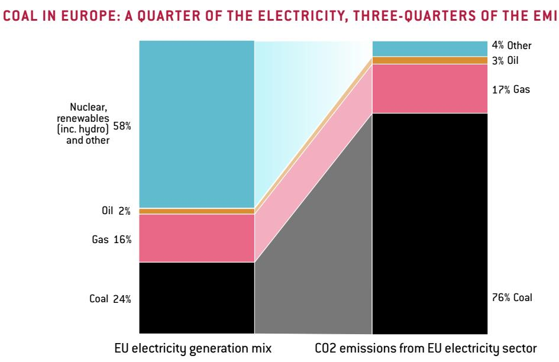
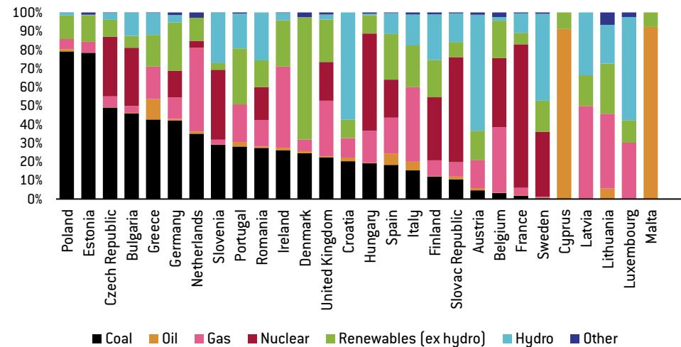
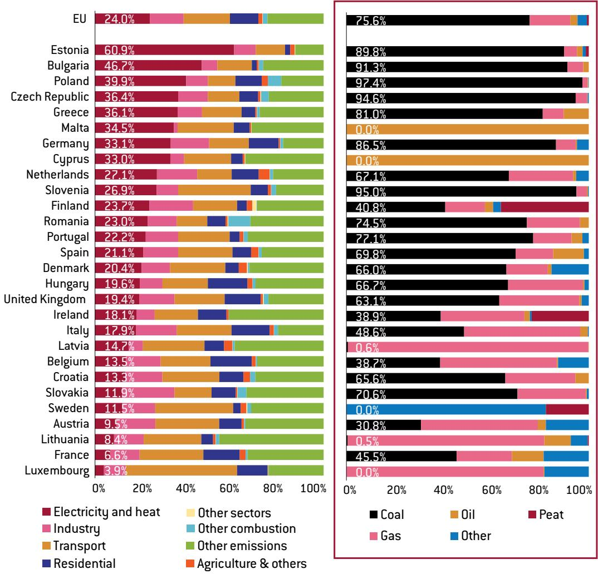
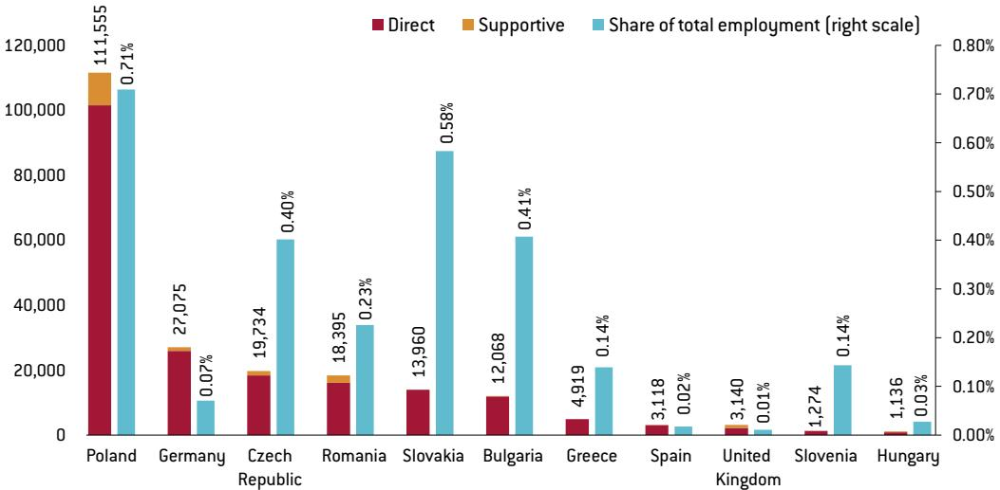
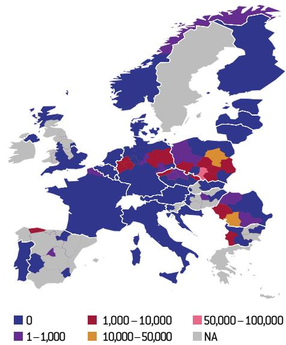
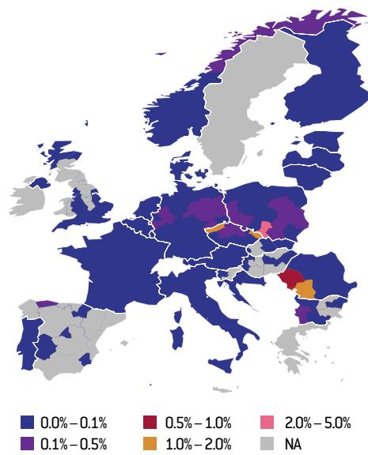

# BEYOND COAL: FACILITATING THE TRANSITION IN EUROPE

Simone Tagliapietra
Research Fellow, Bruegel

  
Source: Bruegel.

## THE ISSUE

The European Union energy system is becoming greener and more efficient, but its most polluting component – coal – continues to provide a quarter of its electricity. This is bad for the climate, the environment and human health. A number of EU countries continue to support coal politically for energy security and socio-economic reasons. The energy security argument is understandable, but the feasibility of the energy transition away from coal should not be doubted. Several countries have already successfully phased out coal without compromising energy security or competitiveness. The socio-economic argument is illusory. Coal mining employment in Europe does not represent a sizable issue either at national or regional level.

The author is grateful to Alexander Roth for excellent research assistance and to Grégory Claeys and Georg Zachmann for useful comments.

## POLICY CHALLENGE

The EU should propose that its member countries speedily phase out coal. At the same time, it should put in place a scheme to guarantee the social welfare of coal miners who stand to lose their jobs. The EU does not need to establish a new fund for this; it only needs to make better use of the European Globalisation Adjustment Fund (EGF). For the post-2020 period, the EGF should be transformed into a ‘European Globalisation and Climate Adjustment Fund’ with a higher budget overall, of which €150 million per year should be used to support coal mining regions. By mobilising 0.1 percent of its total budget, the EU could provide a significant incentive to coal-reliant member states to phase out coal, generating substantial benefits for the climate, the environment and human health.

## EUROPE'S DIRTY ENERGY SECRET

Since 2000, Europe's energy system has gone through a profound transformation, underpinned by rapid advances in renewable energy technologies, the costs of which have dropped $^{1}$ , and strong decarbonisation policies, such as the EU 2020 climate and energy package (Tagliapietra and Zachmann, 2015).

But although the EU electricity system has modernised and become greener, it has also maintained its oldest and most polluting component: coal. The share of this fossil fuel in the EU electricity generation mix stands at 25 percent, having declined by only 5 percentage points between 2000 and 2015.

Coal remains predominant in electricity generation in several EU countries: 80 percent in Poland, 77 percent in Estonia $^{2}$ and 49 percent in the Czech Republic, for example (Figure 1). Only a few EU countries have taken decisions to close their coal-fired power plants. The United Kingdom was the first country to set a date for ending the use of coal; its last coal-fired power plant is due to close by 2025. France followed this example, by setting a phase-out date of 2022. The Netherlands and Italy have also proposed plans to close their coal-fired power plants by 2030 and 2025 respectively.

The persistent role of coal in the EU electricity system represents a problem for the climate, for the environment and for human health. From a climate perspective, coal is the worst way to generate electricity. Carbon dioxide $\left(\mathrm{CO}_{2}\right)$ emissions from coal are higher than those of oil and gas. To generate the same amount of electricity, a coal-fired power plant emits 40 percent more $CO_{2}$ than a gas-fired power plant and 20 percent more than an oil-fired power plant (UNFCCC, 2017). To produce enough electricity for an average European household for one year, five tonnes of $CO_{2}$ would be emitted if the electricity was generated from coal, three tonnes if generated from gas and zero tonnes if generated from wind and solar.

There are very limited ways to improve the efficiency of coal and to make it cleaner. New more efficient, or ‘ultra-supercritical’, coal power stations still produce substantially more $CO_{2}$ than gas power stations. Meanwhile, carbon capture and storage technology remains unproven as a fully integrated process. Effective capture technology has not been developed and safe long-term storage at the scale necessary has not been demonstrated. Therefore, it is hard to see how carbon capture and storage for coal would ever be able to compete on price with renewables, the costs of which are rapidly falling.

Coal is broadly bad for the environment, beyond being bad for the climate. Coal-fired power plants across Europe are responsible for the largest volumes of sulphur dioxide, nitrogen oxides and particulate matter released into the air (European Environment Agency, 2017a).

1. In particular, wind and solar have rapidly entered the European Union electricity system, increasing their share in the generation mix from 0.7 percent in 2000 to 13 percent in 2015.

2. Estonia generates electricity with oil shale, a solid fuel similar to coal.

Figure 1: EU countries' electricity generation mixes (2015)  
  
Source: Bruegel based on Eurostat (2017). Note: Estonia generates electricity with oil shale, a solid fuel similar to coal.

3. Consolidated Version of the Treaty on European Union art. 194, 2010 O.J. C 83/01.

4. Directive 2009/28/EC and Directive 2012/27/EU; they established a set of binding measures to help the EU reach its 20 percent renewable energy and 20 percent energy efficiency targets by 2020.

5. Directive 2003/87/EC; intended as the cornerstone of the EU's policy to combat global warming and to be its key tool for reducing emissions cost effectively. However, it has not so far delivered a high enough carbon price.

6. Directive 2010/75/EU; the IED aims to reduce harmful industrial emissions by setting limits on certain pollutants emitted by large combustion plants, including coal-fired power plants. The IED might lead to the retirement of the oldest coal-fired power plants, but all others will continue running.

7. The European Commission proposed in November 2016 to set a 550 grammes CO2/kWh limit for new power plants eligible to take part in national capacity remuneration mechanisms (with a transition period of five years). This proposal is part of ‘Clean Energy for All Europeans,’ a draft package of clean energy legislation that is expected to be approved and adopted around late 2018 or early 2019. See European Commission (2016b).

These pollutants have a range of health effects, causing, in particular, breathing problems such as asthma and bronchitis, which can even prove fatal. Up to 400,000 premature deaths annually in the EU are attributed to air pollution (European Commission, 2017a). Heavy metals such as mercury are also released into the air by coal-fired power plants. These can impact the immune system, with children most at risk. According to the World Health Organisation (2017), 33 out of the 50 most-polluted cities and towns in Europe are located in Poland, notably in the coal mining region of Upper Silesia.

## COAL: AN OBSTACLE TO EU DECARBONISATION

The EU's energy and climate policy architecture has at its core an aim to deliver decarbonisation. On the basis of a long-term vision of reducing greenhouse-gas emissions by 80-95 percent by 2050 compared to 1990, the EU adopted a binding 40 percent emissions reduction target to be achieved by 2030 compared to 1990. This target is also the basis of the EU's international commitment to the United Nations Framework Convention on Climate Change (UNFCCC) Paris Agreement (European Commission, 2016a).

Turning these targets into reality is challenging. It requires radical changes to Europe's power, heating and cooling, industry and transport sectors. This task will become even more challenging if the global effort against global warming is reinforced. The current EU 2050 decarbonisation trajectory is calibrated against the target of keeping the global temperature rise this century below 2 degrees Celsius compared to pre-industrial levels. This is also the central aim of the Paris Agreement. In addition, the Paris Agreement pledges to pursue efforts to limit the temperature increase to 1.5 degrees Celsius (a significantly safer defence line against the worst impacts of a changing climate) (United Nations, 2015).

In 2018, the European Commission will update its 2050 low carbon economy roadmap (European Commission, 2011), to align it with the Paris Agreement's 1.5 degrees pledge. In that context, the EU is set to raise its level of ambition, pledging full decarbonisation of the economy by 2050 (Euractiv, 2017). That could also entail the full decarbonisation of electricity generation well before 2050. To make this possible, a complete phase-out of coal will be necessary. Currently, coal generates 75 percent of the $\mathrm{CO}_{2}$ emissions from the EU's electricity and heat sector, which in turn represents a quarter of the EU's total $\mathrm{CO}_{2}$ emissions (Figure 2).

It should be underlined that the role of electricity and heat in total $CO_{2}$ emissions greatly varies from country to country. The share ranges from 61 percent in Estonia to 40 percent in Poland; from 33 percent in Germany to 18 percent in Italy; down to 7 percent in France (Figure 2, left panel). However, coal is the predominant source of $CO_{2}$ emissions in the sector in almost all countries (Figure 2, right panel).

## IS THE EU READY AND EQUIPPED TO TACKLE ITS COAL PROBLEM?

Given its strong decarbonisation policy, why has the EU not acted so far to solve this coal problem? The answer can be found in the EU Treaties, and in particular in Article 194 of the Treaty on the Functioning of the EU (TFEU), which defines energy policy as a shared competence between the EU and its member countries, but which provides the right for each member country to “determine the conditions for exploiting its energy resources, its choice between different energy sources and the general structure of its energy supply” $^{3}$ .

The EU has tried circumnavigate the Treaty's energy limitations and reshape the EU energy mix on the basis of its competence for environmental policy. In particular, the EU has adopted over time four major initiatives with the aim of promoting an electricity sector based more on renewables and less on coal: i) the Renewable Energy and Energy Efficiency Directives $^{4}$ ; ii) the emissions trading system (ETS) $^{5}$ ; iii) the Industrial Emissions Directive (IED); $^{6}$ iv) the Environmental Performance Standard (EPS) $^{7}$ .

Coal remains persistently present in the EU energy system, reflecting its political sensitivity for several coal-reliant EU countries

Figure 2: CO2 emissions, electricity and heat sectors of EU countries
Europe's CO2 emissions by sector (2015): CO2 emissions from electricity and heat (2015)  
  
Source: Bruegel based on European Environment Agency (2017b).

As coal remains persistently present in the EU energy system, it is clear that these initiatives have not yet delivered the coal phase-out the EU needs to unleash decarbonisation. This reflects coal's political sensitivity for several coal-reliant EU countries.

For instance, supporting ‘coal jobs’ is a key priority of Poland’s ruling Law and Justice party. It was the key element behind the trade unions’ backing for the party in the October 2015 elections (Bloomberg, 2017). In 2017, Poland and Greece refused to sign Eurelectric’s pledge not to build new coal power plants after 2020 (Platts, 2017). In Germany the threat of job losses and wider economic repercussions have also so far deterred politicians from committing to a deadline to ditch coal. Despite growing public pressure, the German government has continued to tacitly support the country's coal industry (DW, 2017).

In general, two arguments are used by governments to support coal – or at least to procrastinate over its phase-out:

1. Energy security and competitiveness;

2. Job losses and wider economic repercussions for coal-mining regions.

The first argument – energy – is reasonable. A country that is highly reliant on coal for its electricity cannot switch overnight to other cleaner sources of electricity. However, many EU countries have already successfully phased out coal without compromising energy security

8. See Article 56 of the ECSC Treaty: "If the introduction of technical processes or new equipment within the framework of the general programs of the High Authority, should lead to an exceptional reduction in labor requirements in the coal or steel industries, creating special difficulties in one or more areas for the re-employment of the workers released, the High Authority, on the request of the interested governments (...) may facilitate the financing of programs for the creation of new and economically sound activities capable of assuring productive employment to the workers thus released."

9. European Parliament (2017a), Amendment 11, Proposal for a directive, Recital 6.

and competitiveness, showing that a transition away from coal is feasible.

The second argument – socio-economic – is illusory and should not be accepted. Coal mining employment in Europe no longer represents a sizable issue either at national or regional levels. Production of hard coal in the EU has been decreasing since 1990. In 2016, only 36 percent of EU hard coal consumption was covered by domestic production, with the remainder imported from Russia, Colombia, Australia, the United States and other minor suppliers. Only the lignite consumed in the EU is almost entirely supplied by domestic production.

Phasing-out coal would therefore not have substantial implications in terms of job losses. Given the relatively small scale of the challenge, the EU could well provide a solution for the (limited) ‘coal jobs’ that will be lost in the transition. Providing such a solution would be beneficial to:

1. Re-focus the coal transition debate on the only area it should belong to, energy economics;

2. Provide an incentive to coal-reliant countries to start or accelerate coal phase-out plans. That is, the EU should openly propose to member states a speedy phase out of coal, and should concurrently put in place a scheme to guarantee social support for coal industry workers who would face losing their jobs.

The EU country with the highest number of coal mining jobs is Poland, with around 115,500 people employed in coal mines and related businesses.

This represents a mere 0.71 percent of Poland's total employment. In all other countries coal mining employment stands below 30,000, always representing less than 0.6 percent of total employment (Figure 3).

Even at regional level, loss of coal-mining jobs would no longer represent a sizeable hit. In coal-mining regions across Poland, the Czech Republic, Bulgaria, Greece and Germany, coal-mining employment generally stands below 10,000 jobs – and below 1 percent of total regional employment.

Only in Poland's Silesia do coal mining jobs exceed 50,000, representing 5 percent of regional employment (Figure 4).

Europe can manage the transition in coal-mining regions. To ensure their social and economic cohesion during the phase-out, the EU should put in place a mechanism to provide assistance – as is already the case in the United States and Canada, and as was the case in Europe during the coal-mining transformation of the 1950s.

Europe's 1950s transition mechanism for coal-mining regions was the European Coal and Steel Community (ECSC) Fund for the Retraining and Resettlement of Workers. It was created on the basis of Article 56 of the ECSC Treaty, to facilitate re-employment opportunities for those coal and steel workers who lost their jobs as a result of the introduction of new technical processes or new equipment $^{8}$ .

The fund represented the first attempt at a European social and regional policy. With the 1957 Treaty of Rome, this fund was transformed into the European Social Fund (ESF), which in its early stages was indeed used to support workers who lost their jobs in sectors that were modernising, such as coal mining (European Commission, 2007).

## USING THE EUROPEAN GLOBALISATION ADJUSTMENT FUND TO ENSURE A 'JUST TRANSITION' IN COAL REGIONS

The concept of ‘just transition’ has recently entered the EU energy and climate policy debate. In the framework of the broader revision of the ETS Directive, the European Parliament proposed in February 2017 the creation of a ‘Just Transition Fund’, pooling 2 percent of revenues from the auctioning of emission allowances to support regions with a high share of workers in carbon-dependent sectors and a GDP per capita well below the EU average $^{9}$ . This proposal was rapidly dismissed during the negotiations between the European Parliament, the European Commission and the Council of the EU on the ETS Directive revision.

Figure 3: Coal mining employment in EU countries  
  
Source: Bruegel based on Eurostat (2017) and Euracoal (2017).

Figure 4: Coal mining employment in EU countries and regions  
  
Source: Bruegel based on Eurostat (2017).

That proposal did not survive was a result of both a lack of concreteness and the opposition of the European Commission (according to which such an initiative would not fit into the ETS area of competence).

But the EU does not need to establish a new fund to support the transition of coal mining regions. It only needs to make a better use of the already existing European Globalisation Adjustment Fund (EGF), which was established in 2006 and has a maximum annual budget of €150 million for the 2014-20 period – a budget ceiling that has so far not been fully employed, with on average €40 million disbursed from the EGF each year.

The EGF supports workers who lose their jobs as a result of major structural changes in world trade patterns resulting from globalisation. It can be triggered only when more than 500 workers are made redundant by a single company, or if a large number of workers are laid off in a particular sector in one or more neighbouring regions. The EGF provides up to 60 percent of the funding for projects, lasting up to two years, to help workers who have been made redundant find another job or set up their own business. EU countries apply for finance from the EGF and national or regional authorities oversee the deployment of project funds.

The EGF has been transformed over time. In 2009, its scope was broadened

10. In 2017, a first coal-related project was financed by the EGF, to support the Spanish coal mining region of Castilla y León. Spain applied for a €1 million to help redundant coal miners and young NEETs in the region to find new jobs, following the dismissal of 339 coal workers in five coal mines. In order to be eligible, Spain had to establish a link between the redundancies and major structural changes in world trade patterns resulting from globalisation. Spain successfully argued that the European coal industry is increasingly suffering from competition from cheaper coal from non-European countries (European Commission, 2017c; European Parliament, 2017b).

## 11. Regulation (EU) No 1309/2013.

12. That amendment not only broadened the scope of the EGF, but it also: i) Increased the EGF contribution from 50 percent to 65 percent of total costs; ii) Reduced the threshold from 1000 to 500 redundancies; iii) Extended the implementation period from 12 to 24 months from the date of application. See: Regulation (EC) No 546/2009 of 18 June 2009.

13. This is in line with the broader estimates in Claeys and Sapir (2017) on the EGF's future financial requirements, according to which in the post-2020 budget the EGF should be endowed with €1 billion per year to be able to provide a structural response to globalisation-related job losses.

to also support people losing their jobs as a result of the global financial and economic crisis. In 2014, the categories of workers eligible for support were broadened to also include young people not in employment, education or training (NEETs). In short, the EGF has been adapted to provide a response to the new economic and social challenges emerging in Europe. This flexibility should now be used to further broaden the scope of the EGF to support people losing their jobs in coal mining regions as a result of the decarbonisation process $^{10}$ .

This can be immediately done by amending the current regulation $^{11}$ governing the EGF for the period 2014-20, as was done in 2009 to respond to the negative impact on employment of the global financial and economic crisis $^{12}$ . The amendment could increase the use of the currently under-utilised EGF (Claeys and Sapir, 2017).

The amendment could:

1. Broaden the scope of the EGF, to also include support for coal-mining regions in EU countries that commit to a timely coal phase-out;

2. Modify the redundancies requirements, to allow the EGF not only to be used once the workers are already phased out, but also before this happens. This would allow the planning of an orderly transition, limiting the socio-economic effects of the coal phase-out in these regions;

3. Extend the implementation period from 24 to 36 months, to allow a proper implementation of the action in complex cases, such as the closure of coal mines.

In the framework of the post-2020 EU budget, the focus of the EGF on coal mining regions could be further strengthened, transforming it to a ‘European Globalisation and Climate Adjustment Fund’ (EGCF).

In order to facilitate a full-scale EU coal phase-out by the end of the next EU budget cycle (ie 2027), the EGCF would need to be endowed with adequate financial resources. As Box 1 suggests, the ‘coal-item’ of the EGCF budget for the 2020-27 should be €154 million per year $^{13}$ . By mobilising only 0.1 percent of its total budget, the EU could thus provide a strong incentive to coal-reliant member states to complete the coal phase-out, generating substantial benefits in terms of climate, environment and human health.

## CONCLUSIONS

The EU energy and climate policy architecture has at its core an aim to deliver decarbonisation. However, coal still represents a major component of the European energy system, with several countries continuing to support it politically for energy security and socio-economic reasons.

The EU should de-politicise coal by providing a solution to the related socio-economic issues, such as the difficulties of transition in coal mining regions. To do so, the EU should broaden the scope and change the functioning of the European Globalisation Adjustment Fund, to make it into a flagship EU initiative that will support European coal miners who will inevitably be affected by EU decarbonisation. By devoting 0.1 percent of its post-2020 budget to this item, the EU could facilitate the elimination of a major stumbling block on its decarbonisation pathway.

## Box 1: A back-of-the-envelope calculation of the EGCF budget requirements to support the coal phase-out

Europeans employed in coal mining = 216,000 (0.07 percent of total)
Assuming a 50 percent phase-out between 2020-27 = 108,000 jobs to be phased out (Fair to assume that part of the remaining 50 percent will naturally retire over the period)
108,000 / 7 years = 15,430 jobs to be phased out yearly between 2020-2027
Assuming financial support of €10,000 per worker = €154 million per year
Total financial requirement for the coal-item of the EGCF between 2020-27 = €1 billion

## REFERENCES

Bloomberg (2017) 'Poland Faces Harsh EU Reality in Push for Coal Exemptions', 17 May, available at https://www.bloomberg.com/news/articles/2017-05-16/poland-faces-harsh-eu-reality-in-its-push-for-coal-exemptions

Claeys, G and A. Sapir (2017) 'Easing Pain from Trade: the European Globalisation Adjustment Fund', forthcoming, Bruegel

DW(2017) 'Pressure on Germany to ditch coal intensifies', 2 October, available at http://www.dw.com/en/pressure-on-germany-to-ditch-coal-intensifies/a-40778356

EDA (2017) 'U.S. Department of Commerce Invests \$30 Million to Assist America's Coal Communities,' press release, 11 October, available at: https://www.eda.gov/news/press-releases/2017/10/11/2017-acc.htm

Euracoal (2017) Coal industry across Europe, available at http://euracoal2.org/download/Public-Archive/Library/Coal-industry-across-Europe/EURACOAL-Coal-industry-across-Europe-6th.pdf

Euractiv (2017) 'EU to aim for 100% emission cuts in new ‘mid-century roadmap’, 21 September, available at https://www.euractiv.com/section/climate-environment/news/eu-to-aim-for-100-emission-cuts-in-new-mid-century-roadmap/

European Commission (2007) European Social Fund. 50 years investing in people, available at http://ec.europa.eu/employment\_social/esf/docs/50th\_anniversary\_book\_en.pdf

European Commission (2011) 'Communication from the Commission to the European Parliament, the Council, the European Economic and Social Committee and the Committee of the Regions – A Roadmap for moving to a competitive low carbon economy in 2050', COM(2011) 112 final

European Commission (2016a) ‘Paris Agreement to enter into force as EU agrees ratification,’ 5 October, available at https://ec.europa.eu/energy/en/news/paris-agreement-enter-force-eu-agrees-ratification

European Commission (2016b) 'Proposal for a Regulation of the European Parliament and of the Council on the Internal Market for Electricity', COM(2016) 861 final/2, available at http://eur-lex.europa.eu/legal-content/EN/TXT/?uri=COM:2016:861:FIN

European Commission (2017a) 'Commission warns Germany, France, Spain, Italy and the United Kingdom of continued air pollution breaches,' press release 15 February, available at http://europa.eu/rapid/press-release\_IP-17-238\_en.htm

European Commission (2017b) 'Country Datasheets – August 2017 update,' available at https://ec.europa.eu/energy/sites/ener/files/documents/countrydatasheets\_august2017.xlsx

European Commission (2017c) 'Proposal for a Decision of the European Parliament and of the Council on the mobilisation of the European Globalisation Adjustment Fund following an application from Spain - EGF/2017/001 ES/Castilla y León mining,' available at http://eur-lex.europa.eu/legal-content/EN/TXT/PDF/?uri=CELEX:52017PC0266&from=EN

European Environment Agency (2017a) Releases of pollutants to the environment from Europe's industrial sector – 2015, available at https://www.eea.europa.eu/themes/industry/releases-of-pollutants-from-industrial-sector

European Environment Agency (2017b) 'National emissions reported to the UNFCCC and to the EU Greenhouse Gas Monitoring Mechanism', available at https://www.eea.europa.eu/data-and-maps/data/national-emissions-reported-to-the-unfccc-and-to-the-eu-greenhouse-gas-monitoring-mechanism-13#tab-figures-produced

European Parliament (2017a) 'Amendments adopted by the European Parliament on 15 February 2017 on the proposal for a directive of the European Parliament and of the Council amending Directive 2003/87/EC to enhance cost-effective emission reductions and low-carbon investments,' available at http://www.europarl.europa.eu/sides/getDoc.do?pubRef=--//EP//TEXT+TA+P8-TA-2017-0035+0+DOC+XML+V0//EN

European Parliament (2017b) 'Mobilisation of the European Globalisation Adjustment Fund: application EGF/2017/001 ES/Castilla y León mining', available at http://www.europarl.europa.eu/sides/getDoc.do?type=TA&reference=P8-TA-2017-0277&format=XML&language=EN

Bruegel, Rue de la Charité
33, B-1210 Brussels
(+32) 2 227 4210
info@bruegel.org
www.bruegel.org

Bruegel 2017. All rights reserved. Short sections, not to exceed two paragraphs, may be quoted in the original language without explicit permission provided that the source is acknowledged. Opinions expressed in this publication are those of the author[s] alone.

Eurostat (2017) 'SBS data by NUTS 2 regions and NACE Rev. 2 (from 2008 onwards)', [sbs\_r\_nuts06\_r2]
Government of Albert (2017) 'Coal Community Transition Fund', available at https://www.alberta.ca/coal-community-transition-fund.aspx

Government of Canada (2016) 'News Release - The Government of Canada Accelerates Investments in Clean Energy', 21 November, available at https://www.canada.ca/en/environment-climate-change/news/2016/11/government-canada-accelerates-investments-clean-electricity.html

Platts (2017) 'Poland, Greece reject Eurelectric's no new coal plant after 2020 plan,' 5 April, available at: https://www.platts.com/latest-news/coal/brussels/poland-greece-reject-eurelectrics-no-new-coal-26704436

Tagliapietra, S. and G. Zachmann (2015) 'The EU 2030 Climate and Energy Framework: Keeping up pressure on governance structures,' Bruegel Blog, 17 September, available at http://bruegel.org/2015/09/the-eu-2030-climate-and-energy-framework-keeping-up-pressure-on-governance-structures/

UNFCCC (2017) 'National Inventory Submissions 2017 – European Union', available at http://unfccc.int/national\_reports/annex\_i\_ghg\_inventories/national\_inventories\_submissions/items/10116.php

United Nations (2015) Paris Agreement, available at http://unfccc.int/files/essential\_background/convention/application/pdf/english\_paris\_agreement.pdf

World Health Organisation (2017) 'WHO Global Urban Ambient Air Pollution Database (update 2016)', available at http://www.who.int/phe/health\_topics/outdoorair/databases/cities/en/