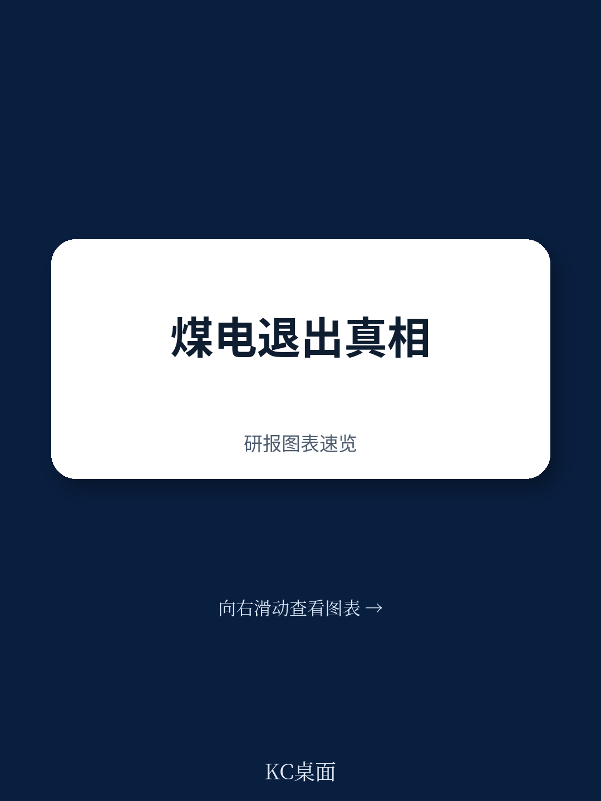
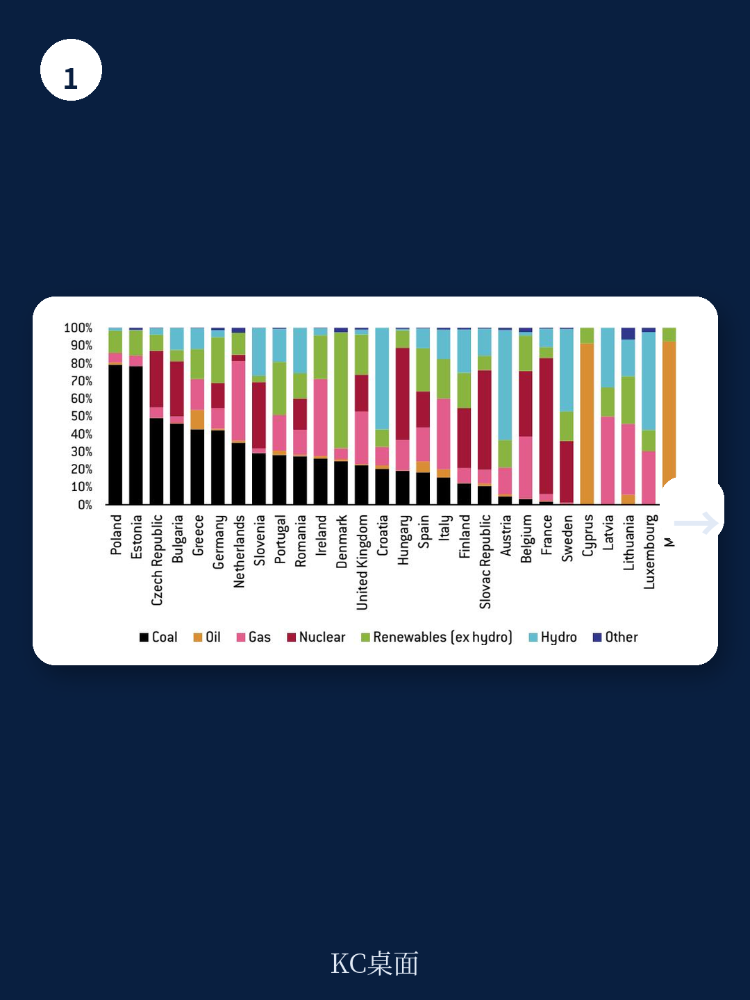
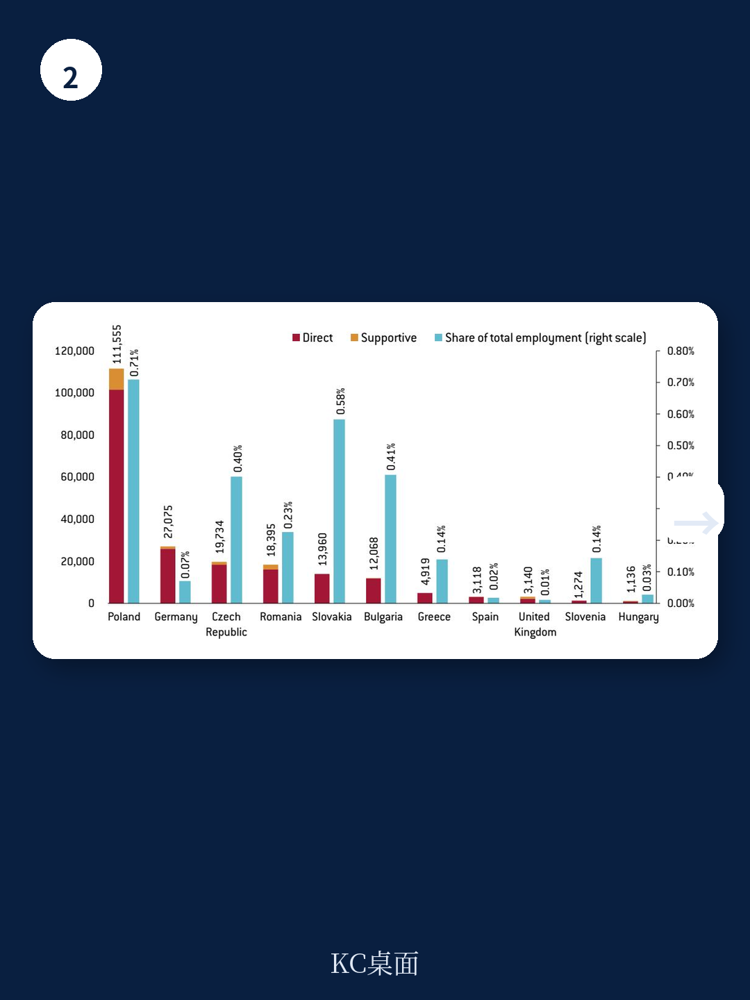

# 布鲁盖尔研究所：研究主题与行业变化观察

欧盟电力系统正在变得更清洁，但煤炭仍贡献约四分之一的发电量。这份布鲁盖尔研究所的政策报告指出，欧盟不需要新建产品来推动煤电退出，只需改造现有的欧洲全球化调整产品，每年动用其中1.5亿欧元支持产煤地区转型，即可为气候、环境和公共健康带来可观收益。

报告的核心判断是：煤炭在欧盟电力结构中的占比从2000年到2015年仅下降5个百分点，仍维持在25%左右。波兰、爱沙尼亚和捷克三国煤电占比分别高达80%、77%和49%。与此同时，英国已设定2025年关闭最后一座燃煤电厂，法国、荷兰和意大利也分别提出了2022年、2030年和2025年的退出时间表。这种成员国之间的政策落差，构成了欧盟整体脱碳路径上的主要张力。

## 1. 煤电在欧盟碳排放中的比重远高于其在发电量中的份额

煤电占欧盟发电量四分之一，却贡献了电力与供热部门75%的二氧化碳排放，而该部门本身又占欧盟总排放的四分之一。报告用一组对比说明问题的严重性：为一个普通欧洲家庭供电一年，煤电排放五吨二氧化碳，天然气发电排放三吨，风电和光伏为零。即便采用更高效的超超临界燃煤技术，其碳排放仍显著高于燃气电厂，而碳捕集与封存技术尚未在规模化层面得到验证。

> **KC评论：** 煤电在发电量中的占比会让人低估它的气候影响。真正需要盯住的是排放份额——四分之一对四分之三，这个错位才是政策紧迫性的来源。

## 2. 欧盟条约限制使煤电退出缺乏直接政策工具

欧盟并非没有尝试推动能源转型。可再生能源与能效指令、碳排放交易体系、工业排放指令以及环境绩效标准四项政策工具先后落地，但煤炭仍在成员国能源体系中持续存在。报告将原因归结于《欧盟运行条约》第194条：能源结构选择权属于成员国主权范围，欧盟只能借道环境政策间接影响电力结构。

这种制度约束在政治层面表现得尤为明显。波兰执政党将煤炭就业视为核心政治资产，2017年波兰和希腊拒绝签署欧洲电力工业联盟不再新建煤电厂的承诺。德国政府尽管面临公众不确定性，仍未承诺煤电退出时间表。报告认为，成员国政府支持煤炭的两大理由中，能源安全与竞争力论点可以理解，但社会宏观环境论点缺乏事实支撑。

## 3. 煤炭就业规模远低于政治话语所暗示的水平

报告用就业数据拆解了“煤炭就业不可放弃”这一叙事。波兰是欧盟煤炭就业最多的国家，约11.55万人从事煤炭开采及相关业务，但也仅占全国总就业的0.71%。其他所有成员国的煤炭开采就业均低于3万人，占比不足0.6%。即便在区域层面，除波兰西里西亚地区煤炭就业超过5万人、占区域就业5%外，其余产煤区的煤炭就业普遍低于1万人，占比不到1%。

基于这一数据，报告提出一个具体的政策方案：将欧洲全球化调整产品改造为“欧洲全球化与气候调整产品”，每年拨出1.5亿欧元支持产煤地区转型。该产品现有年度预算上限为1.5亿欧元，但实际年均支出仅约4000万欧元，存在大量未使用的空间。报告测算，这相当于动用欧盟总预算的0.1%。

> **KC评论：** 报告的真正贡献是把“公正转型”从一个口号变成了可操作的预算科目。1.5亿欧元在欧盟预算盘子里的占比极小，但它为产煤国提供了一个可以写入谈判文本的退出条件。

## 4. 历史先例与区域就业结构构成退出可行性的参照

报告援引两个历史参照。其一是欧洲煤钢共同体依据《巴黎条约》第56条设立的工人再培训与安置产品，这是欧洲社会政策的早期雏形，后来演变为欧洲社会产品。其二是当前美国和加拿大针对煤炭社区的专项援助安排。报告认为，既然欧洲在1950年代煤炭行业转型时已经建立过类似的工人支持机制，今天没有理由认为这一过程无法复制。

报告也承认，欧盟层面推动煤电退出存在条约层面的限制，欧洲议会此前提出的“公正转型产品”方案因缺乏具体性和欧盟委员会的反对而未获通过。但报告认为，通过改造现有产品而非新建机构，可以绕开部分制度障碍。这一方案能否在成员国层面获得政治接受，仍取决于产煤国对就业保障的具体评估。
