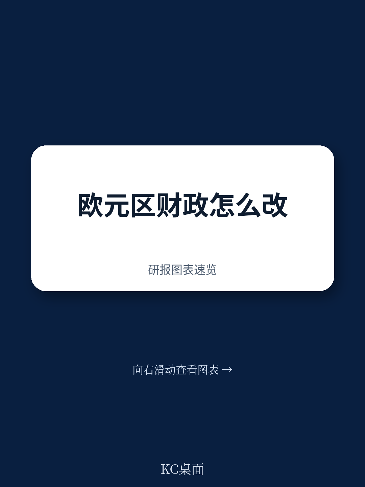
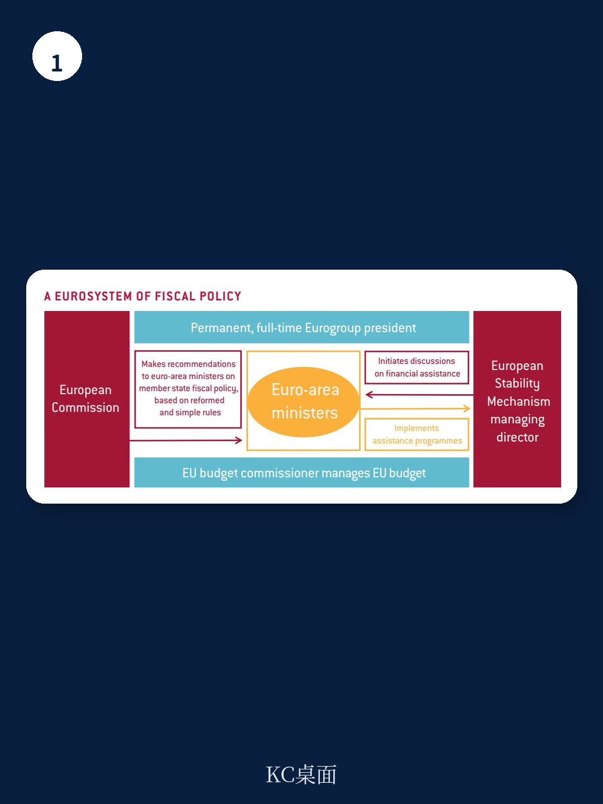

# 布鲁盖尔研究所：区域环境与行业变化观察

2017年秋季，欧盟委员会主席容克与德国前财长朔伊布勒先后抛出两套欧元区治理蓝图，方向截然相反。容克主张强化欧盟委员会在财政政策决策中的核心角色，朔伊布勒则要求将财政监督权逐步移交改造后的欧洲稳定机制。布鲁盖尔研究所所长Guntram Wolff在同期发布的政策简报中判断，两套方案各有结构性缺陷，均不足以支撑欧元区的长期稳定。他提出一个中间方案：将欧元集团改造为“财政政策欧元体系”，以常设主席制强化欧元区整体利益的代表性，同时保留成员国对本国财政的最终责任。

这份报告的价值不在调和两派，而在重新划定讨论的边界。它同时否定了超国家集权与政府间监督两个方向，指出财政政策在欧元区既是国内政治问题，也是货币联盟的公共问题。报告认为，现行框架过度聚焦债务可持续性，忽视了财政政策对通胀、增长和跨境溢出效应的影响，而这两者恰恰是货币联盟运转的核心变量。

## 1. 容克方案混淆了建议权与决策权的制度边界

容克在2017年9月13日的盟情咨文中提出，由欧盟委员会副主席兼任欧元区财政部长，主持欧元集团，并基于对《稳定与增长公约》的“政治性”解释向成员国提出财政政策建议。Wolff指出，这一设计在制度上混淆了两个角色：委员会负责发起立法和提出建议，理事会和成员国负责最终决策。若由同一人兼任委员会职务与欧元集团主席，相当于让检察官同时担任首席法官。

报告还指出，委员会在解释财政规则时已面临信任问题。小国代表私下抱怨，委员会对大成员国和小成员国的规则解读并不一致。若再将欧元集团主席职位交给委员会，国家层面的政治合法性将进一步流失，因为成员国财长的合法性来自本国议会，而非欧洲层面的选举程序。

## 2. 朔伊布勒方案低估了财政政策的联盟维度

朔伊布勒的非正式文件主张将欧洲稳定机制升级为常设欧洲货币产品，赋予其超越IMF第四条款的扰动预防权限，并逐步接管欧元区财政规则监督。Wolff认为，这一方案在制度上同样危险。欧洲稳定机制的决策基于理事会全体一致，本质上是一个高度政治化的机构，不可能扮演“中立监督者”角色。若由其发布财政建议，政治解释与规则执行之间的分离将彻底消失。

更关键的问题在于，朔伊布勒方案只关注债务可持续性，忽略了财政政策的联盟维度。国家财政政策对欧元区的影响不仅限于偿债能力，还包括整体财政姿态对通胀的传导、跨境溢出效应以及公共品供给。报告明确写道，欧洲稳定机制作为债权人机构，天然倾向于不确定性规避，可能过度压缩财政空间，牺牲合理的稳定化政策空间。

> **KC评论：** 朔伊布勒方案的核心矛盾在于，它把“监督者”和“放贷者”两个角色塞进同一个机构。欧洲稳定机制的利益并不总是等于欧元区整体利益，它更关心自己的贷款能否收回，而不是成员国是否需要逆周期支出。

## 3. 常设欧元集团主席与双重任命程序构成改革起点

Wolff提出的替代方案从最具体的制度改动开始：将欧元集团主席改为常设全职职位。现任主席由各国财长轮值兼任，实际投入有限。报告引用内部观察指出，欧元集团会议不再拖到深夜，部分原因正是现任主席在会前做了更多双边协调工作。全职主席可以定期访问各国议会，在成员国语境中解释欧元集团决策，让欧洲层面的声音进入国内决策程序。

任命程序上，报告建议采用双重机制：欧元集团以特定多数投票选出主席，再由欧洲议会以欧元区组成形式进行非约束性确认投票。主席需定期向欧洲议会报告，但欧洲议会无权罢免，最终决定权仍留在欧元集团。这一设计试图在联盟利益与国家主权之间保持平衡，避免任何一方完全主导。

## 4. 简化财政规则并建立可计算的赤字指引

报告对现行财政规则体系的批评相当直接：规则过于复杂、不透明，实时判断经常出错，债务削减条款在实际执行中并未达成目标。Wolff建议用一条简化的“泰勒规则”替代现有框架：产出缺口越大，赤字上限越高；债务水平相对GDP的60%基准越高，赤字上限越低。权重由成员国事先协商确定。当名义利率接近零下限时，所有国家都应运行比规则建议更高的赤字，以避免流动性陷阱。

这一设计的要点在于可计算性和透明性。委员会负责计算规则建议的赤字水平，向欧元集团提出建议；欧元集团基于委员会的中性数字做政治评估，决定成员国应承担的财政调整幅度。若成员国不遵守建议，政治不确定性将逐步累积，常设主席的职责之一就是在成员国国内解释决策依据。

> **KC评论：** 泰勒规则的真正意义不在数字本身，而在把财政建议从“政治谈判结果”变成“可复核的计算结果”。委员会的角色从解释模糊规则转为计算明确公式，成员国偏离建议时，需要面对公开的、可量化的差距。

## 5. 欧盟预算应转向公共品供给与有限稳定化功能

报告对欧盟预算的定位同样克制。Wolff建议将欧盟预算重新聚焦于欧洲公共品和稳定化功能，但明确承认其规模有限——即使设立一个约占欧盟预算10%至15%的专项产品，也无法承担欧元区层面的宏观稳定化任务。该产品的作用是保险，而非再分配：在特定国家遭受严重冲击时提供支持。

报告讨论了三种触发机制：灾难性失业再保险、结构性改革条件挂钩、客观指标触发（如GDP大幅下降）。每一种都有政治障碍。失业保险再保险方案的问题在于，最需要支持的国家往往是劳动力市场改革滞后的国家，容易引发道德不确定性争议。报告承认，这种保险对弱国比强国更重要，而恰恰是这种不对称性，使欧元区引入保险机制变得困难。

## 6. 财政政策欧元体系的制度轮廓与边界

报告最终勾勒的“财政政策欧元体系”是一个经过改造的欧元集团：常设全职主席拥有投票权，代表欧元区整体利益；宏观环境与资金事务专员和欧洲稳定机制总裁作为无投票权参与者列席；委员会保留财政建议的发起权；欧洲稳定机制总裁获得启动项目讨论的权限。若未来建立额外财政能力，欧盟预算专员可加入欧元集团，长期来看，预算专员与欧洲稳定机制总裁职位可以合并。

这一方案没有消除国家利益与联盟利益之间的张力，也不打算消除。报告明确表示，只要欧洲不走向联邦制，财政政策协调就始终是政治平衡行为。方案的目标只是让天平不再过度偏向任何一侧：通过常设职位强化联盟声音，通过简化规则提高透明度，通过有限预算工具补充稳定化功能，同时把债务的最终责任留在成员国层面。

这份报告的判断力来自它对两种主流方案的对称批评。容克方案高估了委员会的政治合法性，朔伊布勒方案低估了财政政策的联盟维度。第三条路径没有宏大叙事，只有一系列具体的制度改动，但正是这些改动，构成了欧元区财政治理讨论中少有的、可操作的中间选项。

For informational purposes only. Portions may be generated,translated,summarized,or edited with AI assistance based on source materials and may contain omissions or errors. Please verify independently. This is not investment,legal,tax,accounting,or other professional advice.

