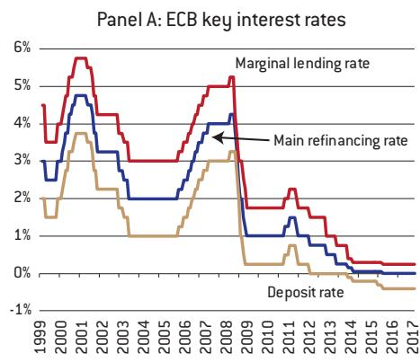
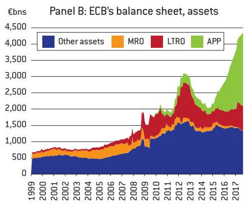
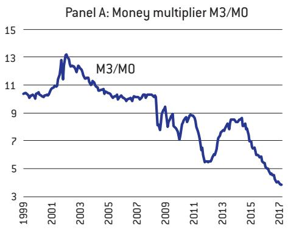
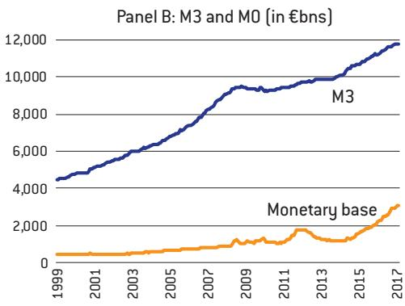
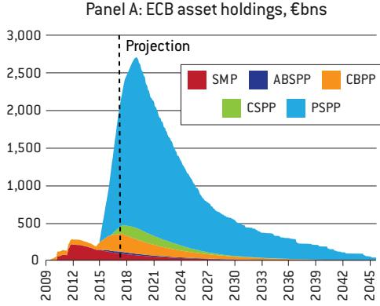
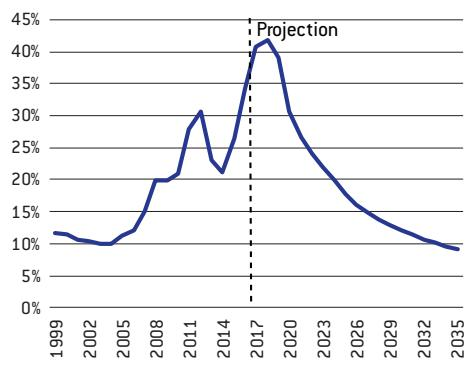
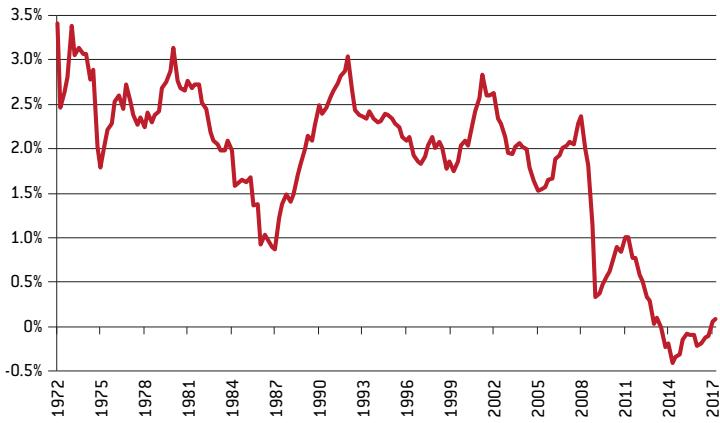
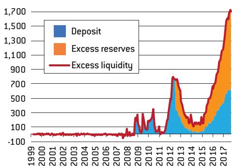
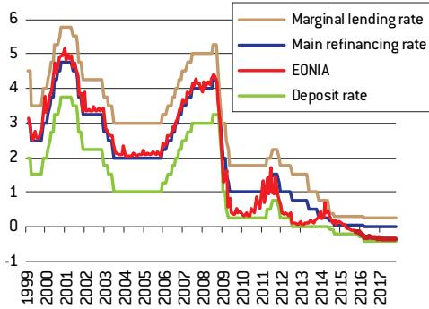
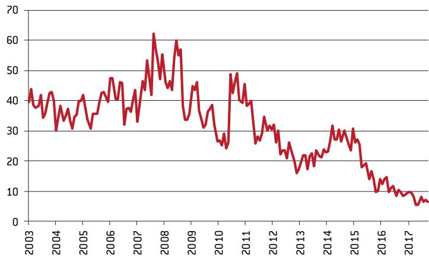

# How should the European Central Bank ‘normalise’ its monetary policy?

Grégory Claeys and Maria Demertzis

## GRÉGORY CLAEYS (gregory. claeys@bruegel.org) is a Research Fellow at Bruegel

MARIA DEMERTZIS (maria. demertzis@bruegel.org) is Deputy Director of Bruegel

This policy contribution was prepared for the European Parliament's Committee on Economic and Monetary Affairs (ECON) as an input to the Monetary Dialogue of 20 November 2017 between ECON and the President of the European Central Bank (http://www.europarl.europa.eu/committees/en/econ/monetary-dialogue.html). Copyright remains with the European Parliament at all times. The authors are grateful to Justine Feliu and David Pichler for excellent research assistance.

## Executive summary

AS THE GLOBAL financial crisis unfolded, the European Central Bank (ECB) and other central banks greatly extended their monetary policy toolboxes and adjusted their operational frameworks. These unconventional monetary policies have left central banks with large balance sheets.

AS GROWTH PICKS up in the euro area, there are discussions about how to normalise monetary policy, but it is unclear if normalisation means returning to monetary policy as it was prior to the crisis, or whether there is a ‘new normal’ that would justify different monetary policies.

THE DEBATE ON the optimal size of the central bank's balance sheet has not yet been settled. We discuss the benefits and drawbacks of central banks having permanently large balance sheets. It might be difficult to reduce them quickly without negatively affecting financial markets. In order to avoid market volatility, this process needs to be done gradually and preferably passively, by holding to maturity assets purchased during the crisis.

THE INTEREST RATE – the central banks' main conventional tool – might stay at a much lower level than historical standards and closer to the zero-lower bound because of a fall in the neutral rate, implying that in the future monetary policy would have to rely more on balance sheet policies and less on interest rate cuts to provide accommodation during recessions.

THE COMBINATION OF these two issues implies that the normalisation of monetary policy will be very slow and entail a long period with a large balance sheet. In the meantime, the ECB will not be able to go back to its pre-crisis operational framework.

IN TERMS OF the sequencing of the normalisation process, the experience of the US Federal Reserve, which was one of the first central banks to use unconventional tools during the crisis, could provide useful pointers to the ECB. Following the Fed's example would involve tapering (ie gradually reducing asset purchases), then increasing key policy rates slowly before reducing passively the size of the balance sheet.

THE FED'S EXPERIENCE shows that the normalisation process needs to be communicated early in order to reduce uncertainty for market participants and avoid any disruption of financial markets. So far, the ECB has been quite successful in smoothly scaling back its asset purchases, but it has not yet provided a clear vision of what its monetary policy or operational framework will look like at the end of the normalisation process.

## 1 Introduction

Since the start of the global financial crisis in 2008, the European Central Bank (ECB) has increased the means through which it provides monetary stimulus. These unconventional monetary policies have de facto increased the scope of its actions and have direct implications for aggregate demand management and for financial stability. The main characteristic of monetary policy in recent years is that the main instrument, the interest rate, has been at the zero lower bound (ZLB) and has de facto become inactive, leading the ECB to follow in the footsteps of the US Fed and use other ways to implement monetary policy.

While necessary and important, applying unconventional tools might not be without risks. When these tools were introduced there was general consent that while they were a useful addition to central banks' toolkits, they ought to be of a temporary nature. There needs to be therefore a clear and transparent plan to discontinue them in order to start the process of 'normalisation'. In this paper, we discuss the parameters of this normalisation process. While when this process should take place is an important question, it is not our focus here. We discuss how the ECB should implement 'normalisation' and what the 'new normal' might look like.

We begin our discussion by describing the ECB's toolbox and operational framework since its establishment and how they have changed since the start of the financial crisis.

Section 3 describes normalisation experiences so far. We draw primarily from the experience of the Fed, which was much quicker to introduce unconventional monetary policies, in particular large-scale asset purchases, and has now already started to reverse them.

We then discuss in section 4 what the destination of this normalisation process could or indeed should be. We argue that unconventional monetary policy has led to large central bank balance sheets, which will be very difficult to reduce over a short period. At the same time, central banks might not be able to rely on the interest rate itself to manage the economy as they could before the crisis. This is because the neutral interest rate appears to have fallen closer to zero, leaving less scope to reduce rates in future recessions to boost aggregate demand. By implication, monetary policy will take place with large balance sheets and the use of balance sheet measures might need to be frequently relied on. The new normal for monetary policy is therefore more likely to be characterised by a combination of interest rate moves and balance sheet measures, negating the temporary nature of unconventional monetary policies. In that case then the ECB will have to learn how to conduct monetary policy with a large quantity of reserves in the system.

Finally, section 5 discusses the sequencing of the normalisation process in which the application of unconventional tools will be reduced. As the Fed is much more advanced in this process, its experience is again very instructive. The Fed began with tapering (ie gradually reducing its asset purchases) before moving on to interest rate increases and lastly an actual reduction in the size of its balance sheet by limiting the reinvestment of maturing assets. We discuss how this might be the safest way of managing a very unfamiliar process while providing maximum predictability. While announcing the timing in advance might be the ideal way of reducing uncertainty, it will be difficult to get this right. A better alternative would be to describe the conditions needed for this normalisation process to begin, to explain how it will take place and what the goal of the process will be. The job of central bank communication will be to describe these elements carefully and provide them early in the process.

## 2 The European Central Bank's conventional and unconventional toolkits

## 2.1 Strategy and operational framework before the crisis

From its creation in 1999 to the beginning of the crisis in 2007, the ECB put in place a simple strategy combined with a fairly efficient operational framework. The ECB focused on price stability, its main objective mandated by the EU Treaties. The ECB's Governing Council defined price stability as a year-on-year increase in the Harmonised Index of Consumer Prices (HICP) for the euro area of below, but close to, 2 percent over the medium term. The main instrument to achieve this objective was the short-term interest rates in order to influence the rest of the yield curve. The operational target of the ECB was the Euro Overnight Index Average (EONIA) rate –the weighted average of all overnight unsecured lending transactions in the euro-area interbank market – given its role as a benchmark for other medium and long-term market rates relevant for the real economy.

In that period, the ECB used three main instruments to control the EONIA rate: 1) weekly main refinancing operations (MROs) and monthly long-term refinancing operations (LTROs) of three months, which took the form of variable-rate fixed-volume tenders; 2) marginal lending and deposit facilities, whose rates formed a corridor of +/- 100 basis points (bp) around the MRO rate; and 3) reserve requirements for banks at 2 percent of certain bank liabilities, mainly customers' deposits and debt securities with a maturity below two years $^{1}$ . As a result of this operational framework and strategy, the ECB's balance sheet size was relatively low $^{2}$ , and overall from 1999 to 2007, the execution of monetary policy of the ECB consisted mainly of varying its three key interest rates in line with the business cycle and the inflation outlook in order to fulfil its price-stability mandate.

## 2.2 Changes to the operational framework and new tools since 2007

Since 2007, the ECB has been challenged by an unprecedented financial and economic crisis. The euro area faced two recessions in the space of five years, persistent low inflation and material deflation risks that have led to inflation being well below target for almost a decade. This has led the ECB to adjust its main instruments and to introduce new tools in order to pursue price stability and to safeguard financial stability.

Following the US sub-prime crisis, the ECB sought to support bank liquidity when short-term funding was hardly available and the interbank market ceased to function. During the market freeze that followed the failure of Lehman Brothers in September 2008, generating a risk of European banking sector meltdown, the ECB quickly played its role of lender of last resort (LoLR) for illiquid but solvent banks.

The ECB increased massively its liquidity provision to the banking sector from 2007-2012 and introduced a number of measures to prevent a credit crunch through ‘enhanced credit support’. Liquidity started to be allocated, through its main refinancing operations (MROs) and long-term refinancing operations (LTROs), on a fixed-rate and full-allotment basis. This meant that banks had unlimited access to central bank liquidity as long as they could provide adequate collateral.

Collateral requirements were also eased a number of times. In addition, the maturity of LTROs – originally of three months only – was lengthened, introducing operations with maturities of, first, six months, then one year and eventually, by conducting two massive long-term refinancing operations, with a maturity of three years (in December 2011 and February 2012). The cumulative take-up of these two operations exceeded €1 trillion (although part of it replaced the borrowing through other maturities, see Figure 1, panel B). Later, from 2014 to

2017, an additional series of four-year Targeted Long-Term Refinancing Operations (TLTROs) was launched to refinance European banks at very low interest rates and to encourage them to extend credit to the real economy. The operations are targeted because the amount counterparties can borrow from the ECB is linked to their loans to non-financial corporations and households. Therefore, these measures are directly aimed at facilitating lending to the real economy, rather than solely improving the liquidity condition of credit institutions.

Figure 1: ECB monetary policy since 1999  
  
Source: ECB via Bloomberg.

Additionally, the ECB engaged in its first asset purchase programme in June 2009. The €60 billion covered bond purchase programme (CBPP1) was aimed at reviving the covered bond market, which is a primary funding source for banks.

Furthermore, the required reserve ratio was reduced from 2 percent to 1 percent and eligibility of assets used as collateral for monetary operations was further extended to lower rated ABSs and other performing credit claims. To further improve conditions in the covered bond lending market, the ECB launched in November 2011 a second CBPP with a total volume of €40 billion. The ECB nevertheless decided to interrupt the programme in October 2012, after covered bonds totalling only €16.4 billion had been purchased.

In terms of rate cuts, the ECB cut its MRO rate from 4.25 percent to 1 percent between October 2008 and May 2009 (see Figure 1, panel A). After mistakenly hiking rates twice in 2011, the ECB reversed them and lowered further its policy rates. As a result, the deposit facility rate reached zero in July 2012 and entered negative territory in June 2014. The MRO rate finally reached 0 percent in July 2016. Constrained by the zero-lower bound (ZLB) and the resulting difficulty of making an impact and lowering the whole yield curve, the ECB decided in July 2013 to introduce ‘forward guidance’ as an additional monetary policy tool. During the introductory statement of the press conference, President Draghi announced that “the Governing Council expects the key ECB interest rates to remain at present or lower levels for an extended period of time”. The idea was to better anchor expectations about the future path of interest rates and weigh on the long-end part of the yield curve.

Finally, the ECB decided to complement its existing instruments with additional measures in order to reduce deflationary dynamics in the economy and ultimately to reach its inflation target. Therefore, to further provide monetary policy accommodation, the ECB introduced asset-backed securities (ABS) purchases and its third covered bond purchase programme. Given that inflation and inflation expectations were still slowly drifting downwards away from the ECB's target, the ECB decided in January 2015 to significantly step up its quantitative easing programme through its ‘expanded asset purchase programme’ (APP). The programme, built on the two existing asset purchase programmes, additionally encompasses the ‘public sector purchase programme’ (PSPP) and the ‘corporate sector purchase programme’ (CSPP)

introduced in March 2015 and June 2016 respectively. With an initial average monthly pace of asset purchases of €60 billion in March 2015, the ECB raised its target to €80 billion in April 2016.

Overall these measures resulted in the quadrupling of the size the European System of Central Banks (ESCB)'s balance sheet (Figure 1, panel B).

Table 1: Summary of the changes in the ECB's toolbox during the crisis

<table><tr><td></td><td>Instrument</td><td>Pre-crisis</td><td>In 2017</td></tr><tr><td rowspan="3">Open market operations</td><td>Main refinancing operations</td><td>Variable-rate, limited quantity tenders, minimum bid rate</td><td>Fixed-rate full-allotment tenders</td></tr><tr><td>Long term refinancing operations</td><td>Max 3-month maturity</td><td>Increased length up to 3 years + Targeted LTROs with 4-year maturity Fixed-rate full-allotment tenders</td></tr><tr><td>Collateral</td><td></td><td>Extension of eligibility</td></tr><tr><td rowspan="2">Standing facilities</td><td>Deposit Facility</td><td rowspan="2">Corridor: MRO rate +/-1%; EONIA close to MRO rate</td><td rowspan="2">Corridor: compressed and asymmetric, EONIA close to deposit rate</td></tr><tr><td>Marginal Lending Facility</td></tr><tr><td>Reserve requirements</td><td>Minimum reserves</td><td>2% of deposits, debt securities &lt;2 years</td><td>1% of deposits, debt securities &lt;2 years</td></tr><tr><td rowspan="5">Asset purchase programmes</td><td>Securities Market Programme</td><td>-</td><td>SMP</td></tr><tr><td>Covered Bond Purchase Programme</td><td>-</td><td>CBPP1, CBPP2, CBPP3</td></tr><tr><td>Corporate Sector Purchase Programme</td><td>-</td><td>CSPP</td></tr><tr><td>Public Sector Purchase Programme</td><td>-</td><td>PSPP</td></tr><tr><td>Asset-Backed Securities Purchase Programme</td><td>-</td><td>ABSPP</td></tr></table>

Source: Bruegel based on ECB.

## 3 The normalisation of monetary policy so far

## 3.1 The Fed's experience

The Fed started its large-scale asset purchase programme soon after the crisis hit the US economy. Shortly before the federal funds target rate got close to the zero-lower bound (in December 2008), the Fed announced its first quantitative easing (QE) programme aimed at purchasing mortgage-backed securities worth \$600 billion. The second round followed in November 2010, with purchases of \$600 billion of US treasury securities. QE3 came at the end of 2012, with initial monthly bond purchases of \$40 billion. QE3 was an open-ended programme that signalled further possible accommodation if necessary. Soon after the launch the monthly target was raised to \$85 billion.

The normalisation of US monetary policy started on the wrong foot when the market reacted violently to Ben Bernanke's unexpected announcement in spring 2013 that the Fed would likely start tapering (ie slowing the pace of its bond purchases) later in the year, conditional on continuing good economic news. As a result, long-term US yields and the value of the dollar relative to other currencies rose quickly and significantly, as market participants had not expected the reduction of monetary stimulus to start early. This episode became known as the ‘taper tantrum’. Finally, after more than one year of QE3, the Fed effectively decide to start tapering in December 2013. It ultimately stopped its asset purchases in October 2014 after reducing them by \$10 billion per month.

However, the Fed's normalisation strategy was first discussed extensively at a very early stage in the process, at the 22 June 2011 Federal Open Market Committee (FOMC) meeting. Shortly before the large-scale asset purchases were phased out, the Fed (2014) provided more details in its ‘Policy Normalisation Principles and Plans,’ in which it explained that in the long run it wished to conduct monetary policy similarly to before the financial crisis. Without pre-determining the timing, the road map included three main actions: a) lifting the interest rate range target $^{3}$ ; b) ending the reinvestment of asset purchases; and c) shrinking the balance sheet to a level at which the Fed would “hold no more securities than necessary to implement monetary policy efficiently and effectively”. On 16 December 2015, given improved economic activity and an inflation outlook in line with the 2 percent inflation target, the Fed decided to lift its policy rate targets by 25 bp for the first time since the financial crisis. Since then the Fed has increased its policy rates three times. Its interest target range reached 1-1.25 percent in June 2017.

Since then, the FOMC has twice provided further details about its future plans, in March 2015 about its ‘interest rate normalisation’ (Fed, 2015), and then in June 2017 about the implementation its future ‘balance sheet normalisation’ (Fed, 2017). It explained that it anticipated “reducing the quantity of reserve balances, over time, to a level appreciably below that seen in recent years but larger than before the financial crisis”.

During its September 2017 meeting, the Fed finally decided to start one month later the implementation of the second phase of monetary policy normalisation: to stop progressively reinvesting the principal repayments coming from assets acquired during the three QE programmes. In order to gradually reduce its asset holdings, the Fed decided to implement a ‘cap approach’ which sets an upper limit on the amount of principal repayments not reinvested in a given month. Initially, this cap was set at \$10 billion (\$6 billion in treasuries and \$4 billion in ABS) and will be increased by \$10 billion every quarter until it reaches \$50 billion (ie in October 2018).

## 3.2 The ECB experience: early days

Given the late start of its QE programme and the late recovery of the euro area (in contrast to the US), the ECB only started reducing the pace of its asset purchases in March 2017, from €80 to €60 billion per month until December 2017. Further to that, it said on 26 October 2017 that it will scale back further its net purchases to €30 billion per month from January until at least September 2018 $^{4}$ . At the same time, President Draghi said key ECB rates were expected to remain “at their present levels for an extended period of time, and well past the horizon of our net asset purchases” and “the Eurosystem will reinvest the principal payments from maturing securities purchased under the APP for an extended period of time after the end of its net asset purchases, and in any case for as long as necessary”.

The ECB has thus already provided some details of its normalisation plan and how it will be sequenced, by announcing that it would first reduce gradually its net purchases until they reach zero, before raising rates and ceasing the reinvestment of the principal of its maturing assets. For the moment, the ECB has managed to scale back its asset purchases without creating major hurdles in financial markets. However, unlike the Fed, the ECB has yet to

provide any indication of what its monetary policy will look like at the end of the normalisation process. Given that the ECB has started scaling back its asset purchase programme, it is important to examine this issue.

It is essential to know what normalising the ECB's monetary policy means. If it means going back to previous practices, it would imply four things:

\- Increasing its key interest rate to the average pre-crisis level, ie around 3 percent;

\- Reducing the size of its balance sheet to its pre-crisis level, ie around 10 percent of euro-area gross domestic product (GDP);

\- Going back to the balance sheet pre-crisis composition, ie mainly short-term refinancing operations with banks on the asset side, and currency in circulation and minimum reserves on the liability side; and

\- Going back to its pre-crisis operational framework to conduct monetary policy, ie with a central role for MRO and corridor rates, an aggregate deficit of liquidity of the banking sector relative to the ECB and variable-rate fixed-quantity liquidity tenders.

However, it is important to consider the desirability of monetary policy returning to this ‘old normal’, and whether it is possible to do so. In an attempt to distinguish the ‘old normal’ described in section 2.1 to a possible ‘new normal’ we discuss the following:

1. What should the size of the ECB's balance sheet be in the long run to be considered adequate?

2. What could be the level of its key interest rates in steady state in the years to come?

3. Taking these elements into account, what would be the suitable operational framework within which the ECB would conduct monetary policy and fulfil its mandate?

## 4 Defining the 'new normal'

## 4.1 Central banks' balance sheets

## 4.1.1 Potential risks from large balance sheets and excess liquidity

The debate on the optimal size of the central bank's balance sheet that was re-opened by the crisis is not yet settled. There are a number of arguments favouring a lean balance sheet for the central bank or pointing out the potential risks of a large balance sheet.

The first argument against a large balance sheet is the classical monetarist argument. A high level of liquidity could result in rapid credit creation and ultimately in an acceleration of inflation above target that would endanger the price stability mandate of the central banks (see for instance Asness et al, 2010 in the US).

In theory, according to the money multiplier principle, the relationship between the central bank's monetary base (M0) and the broad monetary aggregate (M3) should be relatively stable because holding more reserves should allow banks to provide more loans to firms and households. However, empirically, the money multiplier is not a mechanical relationship and has not been stable over time. In particular, since 2007 and the significant injections of liquidity into the system by the ECB, first through its refinancing operations and later through its asset purchases, the multiplier has fallen considerably as the two variables clearly decoupled (Figure 2). The increase in M0 during the crisis has not led to a proportional increase in M3, nor has the ECB's 2012 decision to divide by two the reserve requirements led to a doubling of broad money through a quick expansion of credit in the euro area.

Figure 2: Monetary aggregates and money multiplier in the euro area since 1999  

  
Source: ECB via Bloomberg. Notes: M0: currency in circulation and reserves at the ECB [current account holdings and deposit facility], M3: currency in circulation, deposits with an agreed maturity of up to two years and deposits redeemable at notice of up to three months, and repurchase agreements, money market fund shares/units and debt securities with a maturity of up to two years.

The causal relationship between the monetary base and broad monetary aggregates is often misunderstood. As explained by the ECB (2017), the increased provision of central bank reserves before the crisis was in fact demand-driven and mirrored the increase in broad money because of the rise in the supply of credit to the non-financial sector that was taking place at the time. The increase in M0 after 2007 was of a different nature. From 2007 to 2012 it was related to an increase in the banks' demand for reserves in refinancing operations, not because they were increasing credit (quite the opposite), but because they were seeking to insure themselves against liquidity shortfalls when short-term money markets were dysfunctional. After asset purchases began and expanded greatly in 2015 with the inclusion of sovereign assets, the increase in base money was entirely supply-driven and induced mechanically by the creation of reserves by the ECB to pay for its asset purchases. In that case, minimum requirements are just not binding and increasing the reserves does not steer credit automatically. In the end, trying to increase credit by increasing M0 could be seen as 'pushing on a string' because the money multiplier is a mathematical inequality – ie a limit on money creation – not a mathematical equality. In fact, QE does not work through the money multiplier channel but through other indirect channels (such as portfolio rebalancing, wealth effects, signalling effects or the easing of financing conditions through a flattening of the yield curve). In the case of a strong upturn, even though they have not been used to this end in recent decades $^{5}$ , reserve requirements could be used to avoid a quick expansion of credit if they become binding (rationing reserves could be seen as 'pulling on a string'). The ECB could thus increase reserve requirements to drain excess reserves and provide a disincentive for money creation $^{6}$ .

However, in practice, in modern economies credit creation by banks is mainly determined by the level of interest rates and the corresponding demand for loans from firms and households, the credit risk assessment of banks, their financial health and the prudential regulation affecting them. Overall, reserves play a marginal, if any, role. Therefore, a high level of liquidity should not prevent the ECB from influencing credit creation and from tightening its policy if required by the inflation outlook, as long as it retains control over short-term interest rates and is able to influence the yield curve.

A second, more relevant, argument is that a large balance sheet and a large quantity of excess reserves in the banking sector could reduce incentives for private banks to manage their liquidity carefully and could allow them to rely too much on the central bank (Bindseil, 2016). If liquidity is abundant, banks do not have much incentive to trade between themselves in the interbank market. Low utilisation of the interbank market might be a problem per se because this market reduces the exposure of the central bank to the banks, and also because it should in theory lead banks to monitor each other when they provide unsecured lending to each other. Avoiding excessive risk-taking, promoting market discipline and good liquidity management by the banking sector are essential elements to support a safe financial sector, but there are other tools – prudential regulation and sound supervision – that might be more appropriate to fulfil these objectives than the operational framework of the central bank. Section 4.3 discusses further the potential impact on the interbank market.

Finally, another potential side effect of having a large balance sheet and a lot of excess liquidity could be to reduce seigniorage profits and increase the risk of financial losses for central banks. This can indeed happen when the central bank holds a large portfolio of long-term low-yielding assets, while its liabilities are short-term and remunerated (which is the case of reserves) and the interest rate paid on these liabilities is increasing. It is likely that we will observe this during the ECB's normalisation process $^{7}$ . Even though central banks are not profit-maximising institutions, positive seigniorage profits ensure the financial independence of central banks and facilitate their operational independence (Sims, 2016) from a political perspective $^{8}$ . However, central bank losses should only be a transitional problem during the interest rate normalisation because in the long run if the central bank were to decide to maintain permanently a large balance sheet by reinvesting the principal from maturing assets in new bonds, these would benefit from higher yields so there should be a positive spread between medium to long-term bonds on its asset side and the short-term reserves on its liability side. One simple solution to avoid central bank losses during the transition could be to increase the banks' reserve requirements and stop remunerating these required reserves, although the opportunity cost for banks could be significant $^{9}$ .

## 4.1.2 Potential benefits of maintaining large balance sheets

Central banks could aim for larger balance sheets than before the crisis for financial stability reasons, as suggested by Greenwood et al (2016). Their argument is that by maintaining a large balance sheet, the central bank would provide much needed short-term safe assets to the financial sector and the economy in the form of reserves. There appears to be very high demand for money-like instruments and not enough supply. This excess demand for short-term safe assets was apparent in the steepness of the very short-term part of the yield curve: between 1983 and 2009, one-week US Treasury bills yielded, on average, 72 bps less than six-month bills, while the difference between a five-year Treasury bond and a ten-year one was below 50 bps. Greenwood et al (2016) argue that by providing more reserves than before the crisis, central banks would be able to crowd out private providers of money-like debt securities, in particular from the shadow banking sector, and more generally reduce incentives for excessive maturity transformation in the financial sector (which prevailed in the period before the crisis).

This is a very relevant argument, but, again, it has to be weighed against the fact that there are other tools to achieve this worthwhile objective. In our view, ensuring financial stability is not the main role of the central bank's market operation division, which is to control as precisely as possible a short-term interest rate that has some influence on the rest of the yield curve, in order to transmit the monetary policy stance decided by the Governing Council to the real economy. If necessary, the task of reducing excessive maturity transformation should be taken care of mainly through prudential regulation and supervision. It is true that shadow banking is not covered by banking regulation and supervision, but in that case the best solution would be to regulate further shadow banking activities.

All in all, to identify the optimal size of its balance sheet in the long run, the ECB should not be bound by an appeal to return to the pre-crisis situation and should really weigh carefully the benefits and drawbacks of having a lean or a large balance sheet in the future. However, the ECB will also need to factor in the current situation to see what is really feasible in the medium to long run. We discuss this next.

## 4.1.3 Feasibility of reducing the size of the ECB's balance sheet

An important question is how long it will take to reduce the balance sheet to its original level. If the ECB ceased its reinvestments of principal repayments and passively let its asset holdings mature, it would take 30 years to clear all the assets from its balance sheet after the purchases end. However, according to our estimates (Figure 3, panel A), it could take approximately five years to reduce asset holdings by one half and 10 years to reduce them by 80 percent. More importantly (given that the size of central banks' balance sheets have a tendency to grow with nominal GDP), as a share of euro-area GDP, it would take approximately 14 years for the balance sheet to go back to the pre-crisis situation.

Figure 3: Projection of ECB's balance sheet and asset holdings  
Panel A: ECB asset holdings, €bns  

Panel B: ECB total balance sheet size, % euro-area GDP  
  
Source: Bruegel based on Bloomberg, ECB, Ameco. Note: Panel A: Monthly asset purchases are simulated on the basis of data provided by ECB at country/corporate bond level and outstanding bonds in September 2017. Redemption schedule according maturity date of invested bonds. Projections start in October 2017, for simplicity we assume that asset purchases stop in March 2019 after a gradual tapering starting in October 2018. We also assume that supranational bonds mature at the same rate as sovereign bonds; Securities Market Programme (SMP), ABSPP, CBPP3 mature at annual rate of 15 percent. Panel B: we use the Commission's forecasts for growth and inflation for 2017 and 2018 and after that its long-term potential GDP forecasts and 2 percent inflation. We also assume MRO and LTRO levels to return to pre-crisis level, and other assets are constant at the September 2017 level.

## 4.2 The future role of the interest rate tool

A related issue is interest rate normalisation: what does normalising the interest rate mean? It might not be possible for the ECB to bring back its key interest rate to the average pre-crisis level. Estimates of the neutral interest rate $^{10}$ for the euro area in Holston, Laubach and Williams (2016) suggest a collapse after 2008 and point towards a negative value in recent years (Figure 4).

Figure 4: Neutral interest rate in the euro area, in %  
  
Source: Holston, Laubach and Williams (2017).

In that case, as explained in detail in Claeys (2016), if the neutral real rate were to stay around that level, even if inflation comes back to around the 2 percent target, the ECB main policy rate should be around 2 percent in steady state (ie when the output gap is 0), which would not give enough leeway to the ECB to cut rates in the next recession. For comparison, in the US the average reduction of the Fed policy rate during the last nine recessions was equal to about 5.5 percentage points. This implies that episodes in which monetary policy is constrained by the zero-lower bound (ZLB) are likely to be more frequent and longer lasting, and that the ECB will need to rely much more on unconventional policies.

In this environment, would it feasible to come back to the pre-crisis lean balance sheet? If the ECB does not want to change its inflation target, with low neutral rates, asset purchase will become increasingly one of the main ways to provide monetary policy accommodation. In that case, going back to the previous size of the balance sheet might not even be possible. As shown above, it would take 10 years to allow the balance sheet to shrink passively by half. But the probability of a recession in the euro area in the next decade is very high (on average since the 1950s, a recession has affected countries of the euro area approximately every seven years). In the meantime, it might therefore be better for the ECB to learn to live with large balance sheet and organise the conduct of its monetary policy accordingly.

## 4.3 The operational framework of the ECB with a larger balance sheet

The most important question in that case will be whether the ECB can control market short-term rates (in order ultimately to fulfil its price mandate) with a large balance sheet?

As explained in section 2.1, before 2007 the ECB controlled the EONIA rate through its variable-rate fixed-volume refinancing operations (weekly MRO and monthly 3-month LTRO), the corridor rates of its deposit and marginal lending facilities, a relatively small balance sheet and reserve requirements for banks at 2 percent. This was a very simple and efficient operational framework in which the interbank rate fluctuated very close to the MRO rate, the ECB's main instrument at the time.

However, a large balance sheet prevents the ECB from conducting monetary policy in the same way. The existence of excess liquidity reduces the influence of MROs on the EONIA rate.

For banks to bid for a rate near the MRO rate it is necessary to have a banking system with a liquidity deficit relative to the central bank. Otherwise banks can just use their own reserves to fulfil their reserve requirements and the interbank market rate will clear at a level close to the deposit facility rate.

If excess liquidity becomes a permanent or at least a frequent feature of the system, the ECB would need to continue with its current operational framework to ensure that the monetary policy stance is correctly transmitted to the economy through short-term interest rates. What really matters is that the ECB controls the short-term interbank EONIA rate (or any other short-term money market rate that is a benchmark and that ensures the transmission of the monetary policy stance to other market rates), not the way that it does it. As noted by Borio (2001), ultimately the operational framework is largely irrelevant as long as it allows the central bank to fulfil its price stability mandate.

In that regard, despite very high excess liquidity in the system (Figure 5, panel A), the ECB has succeeded in controlling the level of the EONIA in recent years, given that the most important rate today is not the MRO rate but the deposit rate. The EONIA has been very near the deposit facility rate and extremely stable in the last couple of years. It has been even less volatile than when the MRO rate was the central rate of the system (Figure 5, panel B).

Maintaining the current system of excess liquidity and having the deposit rate as the central rate to control the EONIA rate would also have the advantage of decoupling the interest rate from liquidity provision decisions.

Figure 5: Excess liquidity in euro area (€bns) and the EONIA rate (%)  

  
Source: ECB via Bloomberg. Note: Excess Liquidity is defined as deposits at the deposit facility net of the recourse to the marginal lending facility plus current account holdings in excess of those contributing to the minimum reserve requirements.

Again, one of the potential drawbacks of the current system is that volumes exchanged on the euro interbank market have decreased steadily (Figure 6) with the rise of excess liquidity, because there is no incentive for banks to trade on the interbank market. However, we question whether this is the relevant issue and whether we really need a more active interbank market. As explained earlier, the provision of liquidity in the system before the crisis was demand-driven. The ECB was injecting the quantity of liquidity in its tenders so that the interbank market would clear at an interest rate close the MRO rate. This market, when it was working, was thus quite artificial $^{11}$ and was not leading to any real price discovery. And as far as monitoring and market discipline supposedly provided by the interbank market are concerned, there is no evidence that banks were monitoring each other before interacting on the interbank market. On the contrary, when some doubts appeared during the global financial crisis, the market completely froze and the decision not to exchange liquidity with other banks on this market was totally indiscriminate.

11 In normal times, demand for reserves in the interbank markets characterised by a reserve scarcity engineered by the central bank says little about the health of banks because the demand mainly arises because of random shocks related to payment requests from banks' customers.

Similarly, there might be no need to go back to variable-rate fixed-volume tenders. The main argument for this type of tender is that they give an incentive to banks to compete for liquidity and to not rely too much on the central bank for liquidity (which would not be the case with significant excess reserves in the system). In addition, full-allotment tenders might be preferable if the demand for reserves is higher because of higher liquidity requirements related to post-crisis changes in banking regulation, as argued by Bindseil (2016).

Figure 6: Monthly average of daily volume exchanged in the interbank market, in €bns  
  
Source: Bloomberg.

## 5 The road to normalisation

## 5.1 Designing the sequencing

Once the ECB has defined the end-goal of its normalisation process, it will have to answer another important question about how it plans to get there. Should the ECB follow the same normalisation sequencing as the Fed? This would involve tapering first, then increasing its main rates ('interest rate level normalisation') and finally reducing the size of its balance sheet by stopping the reinvestment of principal repayments and letting the assets purchased during its QE programme mature gradually ('balance sheet normalisation').

Given that no central bank has much if any experience of how to reduce asset holdings, it is important to carefully calibrate the removal of accommodation through asset purchases. The advantage of following the US normalisation sequencing is that it offers a tested template. The Fed has so far managed four rate increases since December 2015 without major issues in financial markets or in the real economy. While it might be too early to draw any conclusion, the Fed has also recently started shrinking its balance sheet without any visible negative effects on financial markets. In addition, one advantage of the Fed's approach to scaling back accommodation is that the central bank and the markets have a lot of experience with adjustments to short-term interest rates and their impact on economic conditions. As suggested by Bernanke (2017), given the uncertainty about the effects of shrinking the balance sheet, it might be better to wait until rates are normalised because it would give scope to cut rates if shrinking the balance sheet results in too much tightening $^{12}$ .

We also believe that the ECB should follow the Fed and hold the assets it has purchased to maturity, which would be much more predictable and less disruptive than outright asset sales. In addition, holding assets to maturity is what market participants have anticipated and that might explain partly the effect of QE on yields $^{13}$ . This is crucial to ensure predictability if QE is to be used often in the future (as argued above). Also, if asset purchases transmit through stock effects (De Santis and Holm-Hadula, 2017) they require long holding periods. In addition, even though reducing the balance sheet to its previous level will take a long time, it is important to realise that current excess liquidity will gradually be absorbed by the growth of currency in circulation and reserve requirements that increase mechanically with the size of economy, which makes (potentially destabilising) asset sales even less necessary.

However, the US experience might have limitations in terms of guiding QE exit in the euro area. There are significant differences to consider, both structural and cyclical, when trying to anticipate future monetary policy. We discuss these next.

First, the euro-area financial sector is primarily bank-based, and the state of the banking sector is very different to that in the US (and there are also differences between euro-area countries). Ensuring credit creation is crucial to financing growth in Europe and any action that might limit it risks endangering the euro-area recovery.

Second, there are 19 countries in the euro area and QE is bound to have different effects on different countries. As QE is wound down and ECB interest rates increase, the effects on public finances will vary in each country, in particular if long-term rates increase quickly. This is an additional reason why the ECB should be very cautious about its normalisation process and should do it very gradually.

Third, there is no experience of negative rates in the US. It has been argued that the ECB should start its normalisation process by first bringing back the deposit rate to 0 percent to alleviate the concern about this policy weighing on the profitability of banks (as suggested for instance by Moghadam, 2017). This is a valid concern because lower profitability could encourage banks to reduce the supply of credit to the real economy. It would be counterproductive to carry on with negative rates if they were hurting bank profits. However, there is scant evidence that this is the case so far (Demertzis and Wolff 2016; Altavilla et al, 2017). Nevertheless, if the ECB is really worried about this, an alternative solution would be to put in place a multiple-tier negative rate system (such as the one used by the Bank of Japan $^{14}$ ), which would be less costly for banks but would continue to weigh marginally on a small part of the reserves. This would keep the EONIA rate close to the deposit rate floor and should have no impact on other market interest rates and would therefore avoid the tightening effect of raising rates. In addition, a too-early increase in the deposit rate could result in an appreciation of the euro. Given that European growth and inflation are more sensitive to the exchange rate than in the US (Haincourt, 2017), this is another good reason for not increasing rates first, but to start with tapering.

Last, there are important structural differences between the US and the euro area relating to the labour market structure, price formation mechanisms and the speed of the response of inflation to QE. The ECB needs to take these into account when planning the normalisation of its monetary policy.

All in all, given the untested nature of the exit from unconventional monetary policies, the ECB should remain flexible and act very gradually. Since the normalisation will be by construction a trial-and-error process, it will crucial to avoid any mistakes, such as the rate hikes of 2011. Unlike 2011, the ECB should not rush the start of its normalisation process and should avoid a potential U-turn. Before starting normalisation, the ECB should be confident that inflation is self-sustaining, ie that it is able to come back towards the 2 percent target without a significant monetary stimulus. This might not yet be the case, as suggested by the current level of headline inflation (1.4 percent year-on-year in October 2017), core inflation (0.9 percent), inflation expectations (1.31 percent for the 5Y5Y inflation swaps) and remaining slack in the euro-area economy.

## 5.2 ECB communication on the normalisation process

We also believe it is essential that the normalisation process is complemented by effective communication from the ECB. Here, again, the Fed experience has shown the importance of being predictable and concrete – both in a negative sense with the ‘taper tantrum’ of 2013, and in a positive sense when, early in the process, the Fed started to discuss elements of what the conditions of normalisation would be. Also, the Fed provided a comprehensive but flexible plan and details on the process and an end-goal of normalisation before it stopped buying in 2014 $^{15}$ .

Communication around normalisation should not use a calendar but a state contingent schedule (ie conditional on the outlook for inflation and growth in the euro area) to be predictable and transparent. The objective is to avoid introducing unnecessary volatility into sovereign debt markets, which, given the differences in debt levels in the euro area, could be damaging to some countries.

For the moment, the ECB has already managed to scale back its purchases significantly without creating major hurdles in financial markets, but the ECB should start explaining as soon as possible what its strategy is and what its operational framework will look like in the long run. It should provide this information to market participants well in advance.

## 6 Conclusions

The ECB has put in place many new policies to tackle the crisis. These have led to a quadrupling of the size of its balance sheet and significant changes in its operational framework and the way it conducts monetary policy. Even though the euro-area recovery appears to be gaining momentum, there is still a lot of slack in the economy (as well as significant differences between countries) and the inflation outlook is still well below the ECB's target. While the ECB continues to be accommodative, the US experience shows that is crucial to prepare carefully for the eventual normalisation and to ensure that the conditions for its start are well communicated to markets. We therefore recommend the following to the ECB:

\- Ensure predictability by presenting a normalisation sequencing roadmap and end-goal before stopping asset purchases. This does not need to be too precise (for instance, on the size of the Fed's balance sheet, Chair Yellen mentioned “levels appreciably below those seen in recent years but larger than before the financial crisis”), but it needs to alleviate uncertainty among market participants and to avoid being disruptive.

\- Be flexible over timing and sequencing to avoid any mistake. There is no need to rush to exit from unconventional monetary policies and to reduce the size of ECB's balance sheet as there are other (conventional) tools to use if tightening is deemed necessary. These include: raising interest rates even with a large balance sheet, increasing reserve requirements, using reverse repo operations or issuing ECB securities to drain excess liquidity if credit were to accelerate as a result of excess liquidity $^{16}$ .

\- Allow the balance sheet to shrink passively by holding the assets purchased to maturity. In particular, if the ECB publishes a roadmap, it should make it clear that this is indeed its intention.

In the long run, having a lean balance sheet would allow the ECB to return to its pre-2007 operational framework with a well-functioning interbank market. But this might not be desirable in the short run because a quick reduction of its balance sheet could be disruptive. In the long run it might not be easily feasible, if neutral rates in particular stay at the current low level. Low neutral rates reduce the scope for rate cuts in the future and increase the need to use QE as a monetary policy tool more frequently.

Even if the ECB wants to reduce the size of its balance sheet, it needs to reckon with a long period: excess liquidity will be absorbed gradually by the increase in currency in circulation and reserve requirements that grow mechanically with the economy. But letting the balance sheet shrink passively will still take approximately 14 years to before the pre-crisis level in terms of GDP (thanks to both real growth and inflation).

If the ECB accepts that its balance sheet might not be as lean in the future as it was before the crisis, it will have to deal with the consequences for its operational framework and revise how it conducts monetary policy and how its policy stance is transmitted to the real economy.

## References

Altavilla, C., M. Boucinha and J.L. Peydró (2017) 'Monetary policy and bank profitability in a low interest rate environment', Working Paper No. 2105, European Central Bank

Asness, C., M.J. Boskin, R.X. Bove, C. Calomiris, J. Chanos, J. Cogan, N. Ferguson, N. Gelinas, J. Grant, K. Hassett, R. Hertog, G. Hess, D. Holtz-Eakin, S. Klarman, W. Kristol, D. Malpass, R. McKinnon, D. Senor, A. Shlaes, P. Singer, J.B. Taylor, P. Wallison and G. Wood (2010) 'Open Letter to Ben Bernanke', Hoover Institution, 15 November, available at https://www.hoover.org/research/open-letter-ben-bernanke

Bernanke, B. (2017) 'Shrinking the Fed's balance sheet', Brookings Blog, 26 January, available at https://www.brookings.edu/blog/ben-bernanke/2017/01/26/shrinking-the-feds-balance-sheet/

Bindseil, U. (2016) 'Evaluating monetary policy operational frameworks', speech to the symposium on 'Designing resilient monetary policy frameworks for the future,' Jackson Hole, Wyoming, 26 August

Bank of Japan (2016) 'Key Points of Today's Policy Decisions', 29 January, available at https://www.boj.or.jp/en/announcements/release\_2016/k160129b.pdf

Bonis, B., J. Ihrig and M. Wei (2017) 'Projected Evolution of the SOMA Portfolio and the 10-year Treasury Term Premium Effect', FEDS Notes, Washington: Board of Governors of the Federal Reserve System, available at https://www.federalreserve.gov/econres/notes/feds-notes/projected-evolution-of-the-soma-portfolio-and-the-10-year-treasury-term-premium-effect-20170922.htm

Borio, C. (2001) 'A hundred ways to skin a cat: comparing monetary policy operating procedures in the United States, Japan and the euro area,' BIS Papers No. 9

16 The latter will probably not even be necessary because credit creation is mainly limited by prudential regulation, risk management of bank, level of interest and demand for credit from firms and households.

Claeys, G. (2016) 'The decline of long-term rates: bond bubble or secular stagnation symptom?' Policy Contribution 2016/16, Bruegel

De Santis, R.A. and F. Holm-Hadulla (2017) 'Flow effects of central bank asset purchases on euro area sovereign bond yields: evidence from a natural experiment,' Working Paper No. 2052, European Central Bank

Demertzis, M. and G.B. Wolff (2016) 'What impact does the ECB's quantitative easing policy have on bank profitability?' Policy Contribution 2016/20, Bruegel

ECB (2011) The implementation of monetary policy in the euro area, European Central Bank, available at https://www.ecb.europa.eu/pub/pdf/other/gendoc201109en.pdf

ECB (2017) 'Base Money, Broad Money and the APP', ECB Economic Bulletin, Issue 6/2017, European Central Bank

Fed (2011) 'Minutes of the FOMC meeting', 22 June, available at https://www.federalreserve.gov/monetarypolicy/fomcminutes20110622.htm

Fed (2014) 'Policy Normalisation Principles and Plans', 16 September, available at https://www.federalreserve.gov/monetarypolicy/files/FOMC\_PolicyNormalisation.pdf

Fed (2015) 'Policy Normalisation Principles and Plans,' amended in 2015, available at https://www.federalreserve.gov/monetarypolicy/files/FOMC\_PolicyNormalisation.20150318.pdf

Fed (2017) 'Policy Normalisation Principles and Plans,' amended in 2017, available at https://www.federalreserve.gov/monetarypolicy/files/FOMC\_PolicyNormalisation.20170613.pdf

Haincourt, S. (2017) 'Exchange rate impact on the US and euro area', Eco Notepad, Banque de France blog, 15 March, available at https://blocnotesdeleco.banque-france.fr/en/blog-entry/exchange-rate-impact-us-and-euro-area

Holston, K., T. Laubach and J.C. Williams (2017) 'Measuring the natural rate of interest: International trends and determinants,' Journal of International Economics 108/1: 59-75

Moghadam, R. (2017) 'Europe needs a non-standard exit from its monetary stimulus', Financial Times, available at: https://www.ft.com/content/5ee8fa84-34df-11e7-99bd-13beb0903fa3

Sims, C. (2016) 'Fiscal policy, monetary policy and central bank independence,' Jackson Hole Lunch Seminar, 23 August