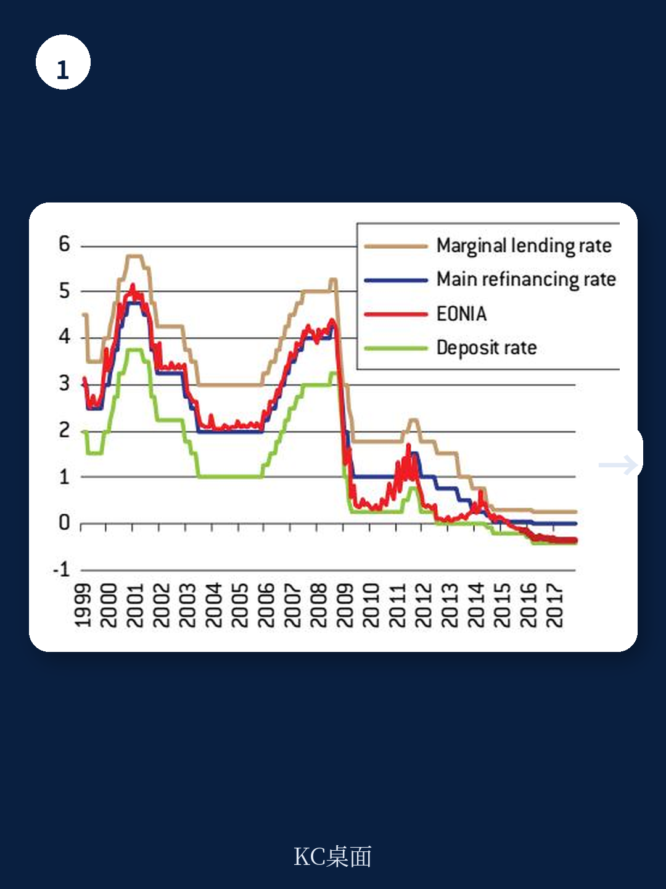
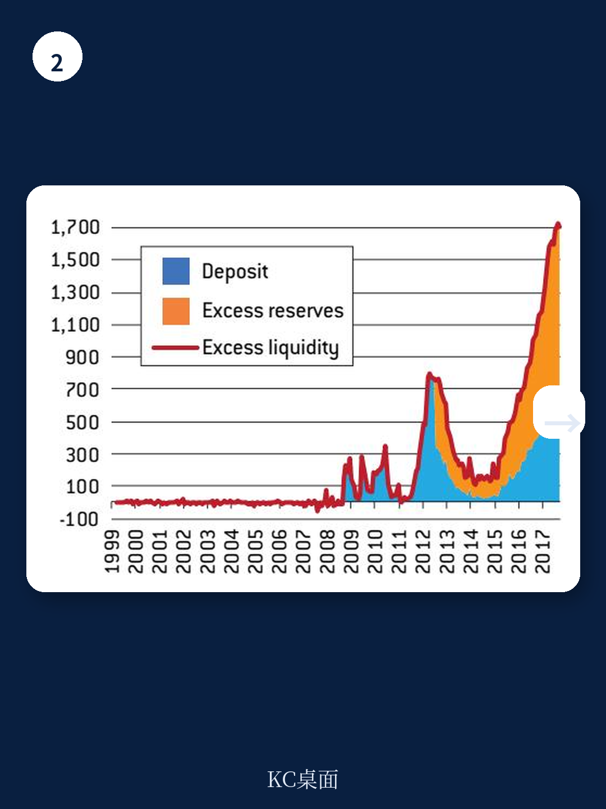

# 布鲁盖尔研究所：行业规则与主题变化观察

2017年11月，布鲁盖尔研究所为欧洲议会宏观环境与货币事务委员会准备了一份政策报告，讨论欧洲央行如何退出扰动期间积累的非常规货币政策。报告写作时，欧元区宏观环境增长已回升，但通胀仍低于目标，欧洲央行资产负债表规模较扰动前翻了四倍。两位作者格列高利·克莱斯和玛丽亚·德梅尔齐斯的核心判断是：所谓“正常化”并非回到2007年之前的操作框架，而是进入一个资产负债表长期偏大、利率工具空间收窄的“新常态”。

这个判断基于两个相互强化的观察。其一，扰动期间积累的资产难以快速缩减，被动持有到期也需要约14年才能让资产负债表占GDP比重回到扰动前水平。其二，中性利率的下降意味着未来调整时降息空间有限，央行将更频繁依赖资产负债表工具而非利率调整来提供宽松。两者叠加，欧洲央行的正常化将是一个缓慢且漫长的过程。

## 1. 美联储的退出顺序提供了可参照的操作路径

报告梳理了美联储的经验。美联储在2013年春季因伯南克意外提及缩减购债而引发“缩减恐慌”，长期利率和美元汇率快速上升，市场反应剧烈。此后美联储调整策略，在2014年9月发布《政策正常化原则与计划》，明确了三步走：先逐步缩减资产购买，再提高政策利率，最后通过停止再研究被动调整资产负债表。

报告认为这一顺序对欧洲央行有参考价值。缩减购债、加息、被动缩表的排序，能够在陌生过程中提供最大程度的可预测性。美联储的经验还表明，正常化需要提前沟通，以减少市场参与者的不确定性。欧洲央行在缩减资产购买方面进展顺利，但尚未清晰说明正常化结束后的货币政策框架和操作框架会是什么样。

> **KC评论：** 2013年“缩减恐慌”的教训在于，央行缩减刺激的意图如果未被市场提前消化，本身就会成为紧缩冲击。报告强调的不是“要不要退出”，而是“如何让退出过程不制造新的波动”。

## 2. 中性利率下降改变了利率工具的有效空间

报告引用了霍尔顿、劳巴赫和威廉姆斯对中性利率的估算，认为中性利率已降至接近零的水平。这意味着即使宏观环境恢复正常增长，政策利率也可能长期低于历史标准，更贴近零下限。未来一旦出现调整，央行通过降息提供的宽松空间将明显小于扰动前。

这一变化直接影响了货币政策工具的组合。报告认为，未来货币政策更可能呈现利率调整与资产负债表措施并用的特征，非常规政策工具的“临时性”将被否定。欧洲央行需要学习在系统中存在大量超额准备金的情况下执行货币政策，包括在资产负债表偏大的同时提高利率、提高准备金要求、使用逆回购操作或发行欧洲央行标的来吸收过剩流动性。

## 3. 资产负债表缩减的节奏受制于宏观环境和市场条件

报告对资产负债表缩减给出了具体测算。即使欧洲央行希望缩减规模，也需要考虑一个漫长的时间窗口：超额流动性将随着流通中货币和准备金要求的机械增长而逐渐被吸收，但被动缩表仍需约14年才能让资产负债表占GDP比重回到扰动前水平，这还依赖于实际增长和通胀的配合。

短期内快速缩表可能对市场造成扰动，因此报告建议以被动方式为主，即持有扰动期间购买的资产至到期。但报告也指出，如果中性利率持续处于低位，缩减资产负债表在长期内可能并不可行——低中性利率减少了未来降息的空间，反而增加了更频繁使用量化宽松的必要性。

> **KC评论：** 14年这个数字值得留意。它意味着即使一切顺利，欧洲央行的资产负债表规模在可预见的未来都将显著高于扰动前。市场对央行“退出”的定价，可能需要从“何时结束”转向“长期维持较大规模意味着什么”。

## 4. 正常化的终点是操作框架的重新设计

报告认为，欧洲央行在正常化过程中面临一个选择：是追求回到2007年前的“精简”资产负债表和原有操作框架，还是接受一个资产负债表长期偏大的现实并重新设计操作框架。前者在短期内可能因快速缩表而具有破坏性，在长期内则受制于低中性利率而难以实现。

如果接受资产负债表不会回到扰动前水平，欧洲央行就需要修订货币政策执行方式和政策立场向实体宏观环境传导的机制。报告指出，在长期内拥有精简的资产负债表可以让欧洲央行回到2007年前的操作框架，并恢复运转良好的银行间市场，但这在短期内并不可取。欧洲央行需要在这两个目标之间找到平衡，同时明确沟通其意图，以减少市场的不确定性。

报告没有给出正常化启动的具体时间表，而是强调“如何”正常化比“何时”正常化更值得关注。对于观察欧洲央行政策路径的人而言，这份报告提供了一个分析框架：关注中性利率的走势、资产负债表缩减的被动节奏，以及操作框架如何适应一个准备金充裕的新环境。
