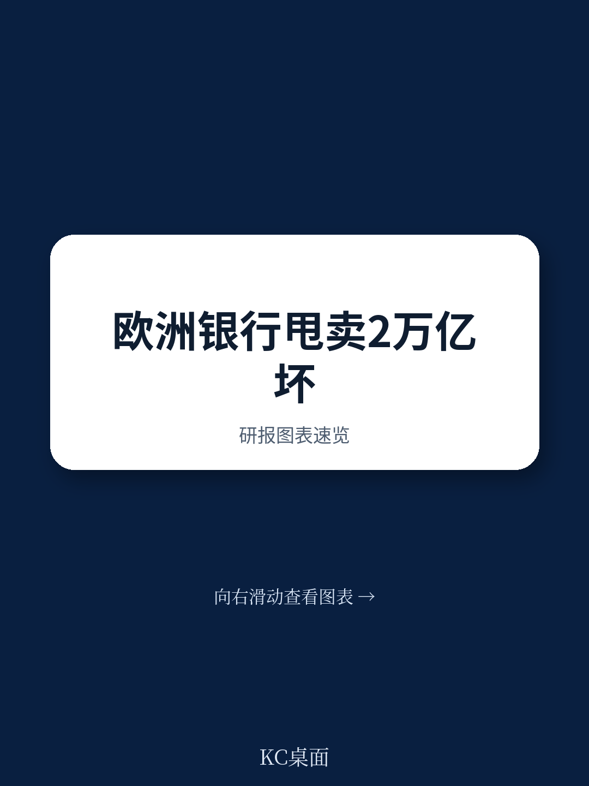
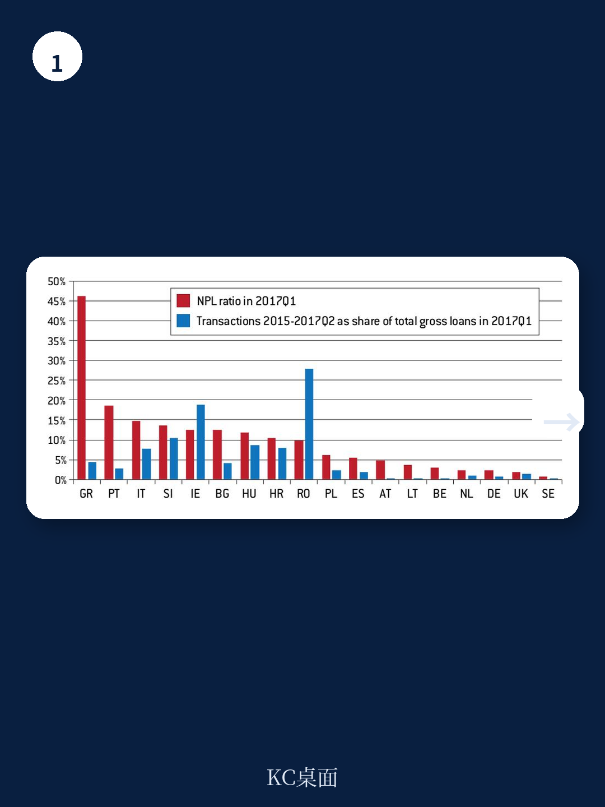
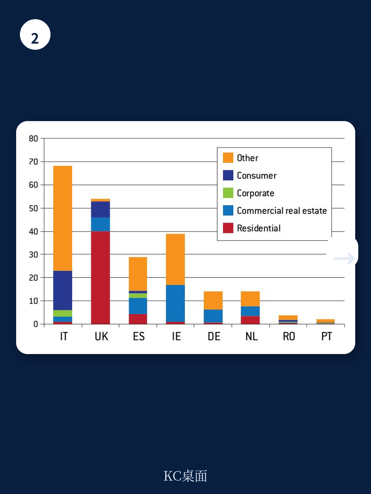

# 布鲁盖尔研究所：研究主题与行业变化观察

欧洲银行业的不良贷款存量约为8700亿欧元，加上银行希望剥离的其他非核心资产，潜在供应规模接近2万亿欧元。但2016年二级市场贷款交易总额仅为1460亿欧元，周转率不足7%。这份布鲁盖尔研究所为欧盟委员会撰写的政策报告指出，不良贷款处置市场若要承担更重要的角色，需要先解决估值分歧、读者集中和透明度不足这三层问题。

报告的核心判断是：欧洲银行体系自身并不具备处理大规模不良贷款的能力。银行擅长通过内部工作组处置临时性债务困境，但面对需要大幅减记和类似股权管理的综合重组，银行缺乏相应的治理结构和技能。这正是监管机构开始将贷款出售视为重要工具的原因——欧洲央行2017年发布的不良贷款管理指引，已经将贷款出售与银行内部处置并列。

## 1. 贷款出售市场存在三类结构性失灵

报告将贷款转让中的市场失灵归纳为三个层面。第一，读者基础集中。特定资产类型的读者需要承担大量沉没成本，只有少数机构有能力在多个欧洲市场反复竞标，这可能形成定价权。第二，信息不对称。发起银行无法完整可信地展示资产质量，读者只能基于对劣质资产的怀疑出价，而银行则倾向于保留高质量资产。第三，读者重组工作的外部性。读者收购贷款后进行维护、重组或止赎，其他债权人也会从中受益，因此读者要求额外回报，这会压低出价。

这三类失灵共同导致了银行要价与读者出价之间的显著差距。报告引用意大利央行的研究指出，读者会在报价中直接扣除整个处置过程中的管理成本，而银行通常不会这样做。

> **KC评论：** 估值差距不只是买卖双方心理价位不同，而是三种机制叠加的结果。理解这一点，才能解释为什么单纯增加交易平台或数据模板，未必能显著提升市场流动性。

## 2. 交易集中在四国且偏向特定资产类型

KPMG 2015年至2017年中的数据显示，英国、意大利、爱尔兰和西班牙四国占欧洲贷款交易总值的80%。约100家活跃读者中，只有五分之一在超过一个市场开展业务，但这些跨市场读者贡献了近一半的交易量。希腊和塞浦路斯的不良贷款率均超过40%，贷款出售规模却仍然极小。

资产类型同样存在错配。欧洲不良贷款存量在大企业、中小企业与家庭部门之间大致均分，但二级市场交易主要集中在商业和住宅房地产的担保信贷，以及部分无担保零售信贷。中小企业和大型企业的不确定性敞口很少在二级市场出售。报告认为，这与读者追求较大交易规模以摊薄尽调成本有关，而小银行的不良贷款率更高、覆盖率更低，恰恰最需要处置渠道。

## 3. 日本和韩国的处置经验提供参照

报告回顾了日本1990年代和韩国1997年资金扰动后的处置路径。日本在扰动高峰期一年内收购了接近三分之一的不良贷款存量，关键在于本地资产管理公司先建立了贷款文档和抵押品权利的质量标准，随后才实现向读者的快速转移。韩国的坏账银行则积极营销不良资产并鼓励外资参与，由此培育了本土读者基础。

这两个案例的共同点是：公共机构先承担了标准化和定价的职能，再引入私人资本。报告据此讨论了欧盟层面的政策选项，包括标准化数据模板、交易平台、统一监管待遇，以及公共资产管理公司或标的化结构中的公共不确定性分担。但报告也指出，公共部门承担部分不确定性可能进一步分散读者基础，削弱读者重组的激励。

## 4. 处置框架改革是估值收敛的前提

报告认为，贷款出售市场中的买卖价差与回收率、预期现金流以及回收过程的不确定性直接相关。国家层面的重组和破产制度改革若能加快这一进程并提高可预测性，估值将趋于收敛。欧盟财长会议2017年7月已通过结论，认可了改善市场功能和加强监管的多项建议，并呼吁制定国家资产管理公司的蓝图。

报告同时提醒，若欧洲银行资产的很大一部分——欧元区潜在供应可达GDP的18%——转移到监管较少的读者手中，关系型银行的部分价值可能流失，贷款服务商的操守将成为监管焦点。市场将继续以国别细分的方式运行，但大型资产管理公司已经可以在单一产品中覆盖多个欧洲司法管辖区的资产组合。

> **KC评论：** 报告对政策组合的排序值得注意：先有处置框架改革，再有估值收敛，最后才是交易放量。跳过第一步直接搭建交易平台，效果可能有限。
