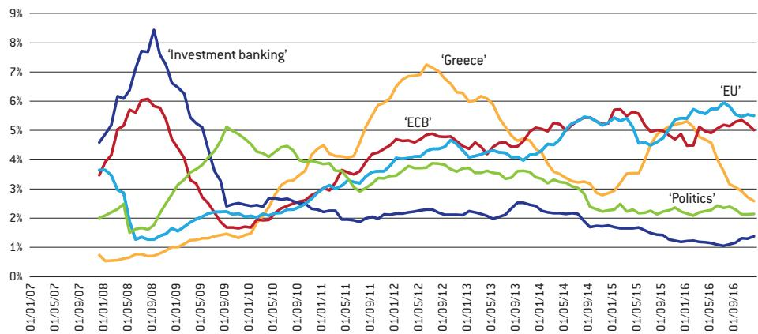
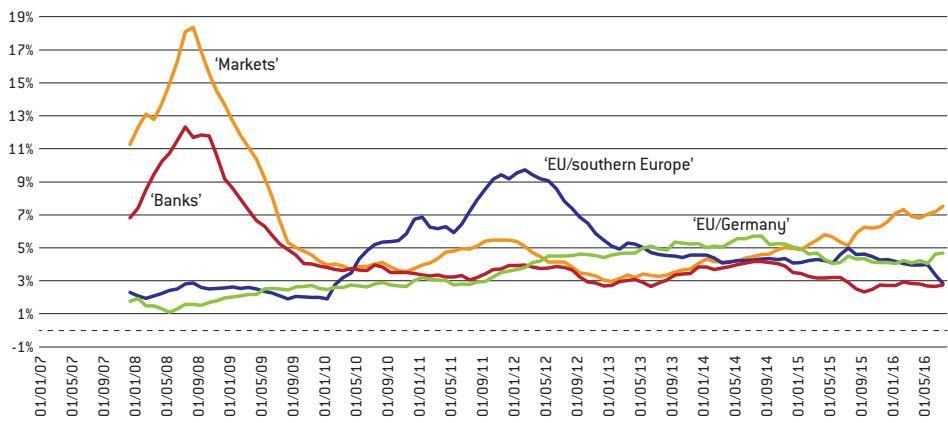
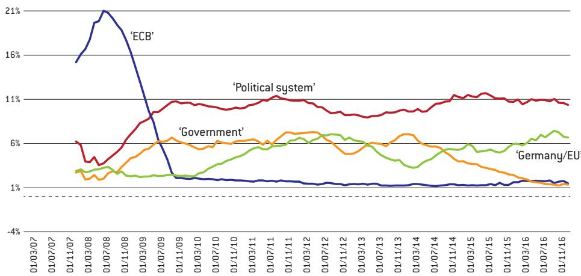
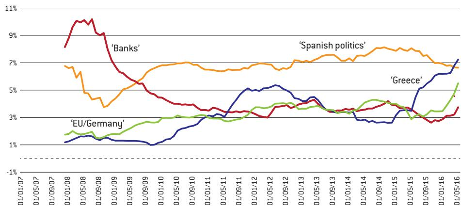
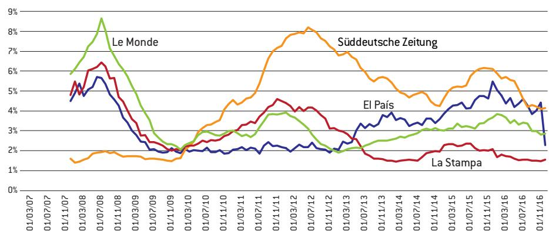

# Tales from a crisis: diverging narratives of the euro area

GERRET VON NORDHEIM (gerret.vonnordheim@tu-dortmund.de) is a researcher at Dortmund University

Henrik Müller, Giuseppe Porcaro and Gerret von Nordheim

## Executive summary

ECONOMIC ANALYSES LARGELY ignore Europe's fragmented public sphere, a feature that distinguishes the euro area from other major currency areas.

THIS POLICY CONTRIBUTION identifies how narratives of the crisis developed since 2007, by identifying the key crisis-related topics in articles from four opinion-forming newspapers in the largest euro-area countries (Germany's Süddeutsche Zeitung, France's Le Monde, Italy's La Stampa and Spain's El País). In particular, the analysis considers where blame for the crisis has been laid with the aim of informing the current debate on euro-area governance reform. Such an exercise can help to understand the difficulties euro-area policymakers face when it comes to formulating solutions that are both appropriate and commonly acceptable.

THE ANALYSIS SHOWED that Süddeutsche Zeitung blames everyone but Germany, the chief suspects being Greece and the European Central Bank; the paper stresses the need to return to a perceived status quo of stability and fairness. Le Monde blames everyone including the French political class, but largely refrains from criticism of European institutions such as the European Commission and the European Central Bank. La Stampa sees Italy as the victim of unfortunate circumstances, including the European Union austerity measures promoted by Germany, and Italy's own politicians. El País primarily blames Spain for misconduct during the boom years preceding the crisis.

THIS PICTURE OF differing narratives shows that each euro-area country faces different pressures from its respective public when discussing how to press ahead with effective euro-area governance reform. The global financial crisis and the subsequent recession had quite different effects in different euro-area countries. Therefore, it is unsurprising that the narratives differ in the four papers. National problems and solutions took centre stage in national discourses leaving systemic euro-area issues largely unmentioned.

## 1 Introduction

The global financial crisis that started in 2008 created considerable stress in the euro area. The common shock triggered different problems in each euro-area country. In Spain, for instance, the bursting of a housing bubble and a banking crisis strained the economy. In France and Italy, structural weaknesses, particularly in labour markets, were exposed. In Germany, an overreliance on exports for economic growth led to a particularly pronounced recession followed by a partial shift of exports to emerging markets, away from other euro-area countries.

Though national circumstances differed, there were common systemic deficiencies (Darvas, 2012). Compared with other major economies, the euro area struggled to deal with the crisis swiftly and, between 2010 and 2012, the currency area fought a sovereign debt crisis that only receded after the European Central Bank stepped in, assuring financial markets it would do “whatever it takes” to keep the euro afloat. Euro-area countries still struggle to answer the fundamental question of what happened and what steps need to be taken to prevent another crisis.

Disagreement about the causes and potential remedies appears to be the major obstacle to creating a more stable and crisis-proof set-up. The on-going debate about augmenting the euro area with new, potentially powerful institutions (see for example Wolff, 2017) is a case in point. The European Commission has pushed for reforms of the common currency area $^{1}$ , while French president Emmanuel Macron has made even more ambitious proposals. Some EU countries have resisted, or even been hostile, to these ideas. Against this backdrop it would be a surprise if the current debate yielded any meaningful institutional enhancements.

This paper focusses on an issue that is largely ignored by economic analyses: Europe's fragmented public sphere, a feature that distinguishes the euro area from other major currency areas. At the national level, public opinion is formed through mass media, which provides a platforms for public discourse (McCombs et al, 2017), but the European Union and the euro area lack a common public sphere (De Beus, 2010) $^{2}$ . In the context of the euro-area crisis, it has been argued that the lack of common European communication channels constitutes a missing link that holds back national discourses from converging on common framings when it comes to economic policy priorities (Müller, 2016).

Our analysis identifies historical trends in narrative building linked to the crisis in order to inform the current debate on euro-area governance reform. We analysed a set of newspaper articles published between 2007 and 2016 in the four biggest euro-area countries – Germany, France, Italy and Spain. We were able to observe the evolution of newspaper coverage of economic policy topics over time and to compare similarities and differences between countries.

Our specific objective is to dig deeper into the question of whether there is scapegoating underway in terms of responsibility for the crisis. More broadly, our analysis can help in understanding the difficulties euro-area policymakers face when it comes to formulating solutions that are both appropriate and commonly acceptable.

## 2 Methodology and data

Narrative-building is complex. It involves public opinion, media and politicians, among others (private sector, civil society, academics, etc). Following Shiller (2017), narratives can

1 European Commission president Jean-Claude Juncker outlined his vision in his 13 September 2017 State of the Union address to the European Parliament. See http:// europa.eu/rapid/press-re- lease\_SPEECH-17-3165\_ en.htm.

2 The implications of the absence of common EU media platforms have been a matter of intensive debate. Some studies come to the conclusion that fundamental problems for further integration may arise (Erikson, 2005); others find a cross-border convergence of discourses because of interaction between national media systems and the agenda-setting abilities of European institutions (eg Latzer and Saurwein, 2006).

be considered as central, though broadly disregarded, factors in forming economic behaviour in a social context. Narratives typically involve a sequence of events over time in which a set of antagonistic players interact, the formulation of a problem, moral judgements and possible solutions (Müller, 2017) $^{3}$ . Because of the highly complex nature of economic systems, the virtue of economic narratives lies in their capacity to reduce this complexity so that underlying developments become fathomable and discussable. Being social phenomena, shared economic narratives enable large groups of individuals to coordinate the processing of information. They can be interpreted as a specific form of social capital in an intangibles-rich economy (Haskel and Westlake, 2017). In a political context, narratives enhance the collective perception of social reality, thereby enabling societies to formulate political priorities. For example, British exceptionalism and the idea of a special relationship with the United States rather than the EU contributed to Brexit.

Discourses typically comprise a set of competing narratives. Over time dominant narratives tend to emerge, influencing the way a society views itself and forms its policy priorities. A discourse can thus be seen as an ensemble of ideas, concepts and categories through which meaning is given to social and physical phenomena, and which is produced and reproduced by means of an identifiable set of practices (Hajer and Versteeg, 2005). The discourse around migrants and refugees in Europe, for example, has translated into varying public attitudes and policy responses, and a general perception among the public that over-estimates the real number of refugees (Batsaikhan et al, 2018).

Therefore the narrative structure of discourses comes at a cost. Two types of problems might arise. First, like formal economic models, economic narratives focus on certain relationships while neglecting parts of the larger picture. If problematic developments occur outside the scope of dominant narratives, they may not be detected, and dealt with, in a timely fashion. Second, if different social groups are linked by common public goods while pursuing distinctly different, or even contradictory, narratives, they might find it hard to effectively manage those public goods. Take the case of net neutrality in the United States. One might think this would be a relatively benign, technocratic issue, but the polarisation of the positions around the topic has led to a sort of tribalisation of the debate around the topic $^{4}$ .

As Ostrom (1990) showed, communication between users of common resources is a key precondition for the development of institutional arrangements to overcome the ‘tragedy of the commons’, or the pursuit by individuals of self-interest. To have a positive effect on the cooperative abilities of groups of individuals, communication has to be based on a set of shared convictions, typically taking the form of economic narratives.

The empirical study of economic narratives is complicated by the fact that they often cannot be observed directly. Articles, TV programmes or speeches seldomly formulate a narrative explicitly but do so implicitly by relying on recipients' shared perceptions. One way to gauge narratives is the analysis of reporting patterns in mass media. Since major newspapers cater to the broader public they can be expected to reflected the prevailing economic narratives. As shown in von Nordheim et al (2018), they also take up dominant narratives from social media, albeit with considerable time-lags. The analysis of traditional newspapers therefore allows a glimpse at these complex communicative relationships. In this context, newspaper coverage is used as a proxy for narratives prevalent in the broader public debate. The analysis does not imply any kind of judgement on the reporting itself – it should not be read as a critique of media bias but rather as a representation of public debates.

Numerous studies have compared national elite newspapers' coverage of the EU (eg Trenz, 2004; Brüggemann and Kleinen-von Königslöw, 2009; Veltri, 2012). For our purposes, we chose one newspaper per major euro-area country: Süddeutsche Zeitung (Germany), Le Monde (France), La Stampa (Italy) and El País (Spain). All are elite newspapers recognised as opinion forming in their respective countries. All four have a centrist or slightly left-of-centre leaning, enabling analysis of different narratives within comparable worldviews. Box 1 details our dataset and approach.

## Box 1: Search parameters

We used search words related to economic crisis to extract the relevant body of articles. Search words used: in German: ‘Eurokrise,’ ‘Finanzkrise,’ ‘Wirtschaftskrise’; in French: ‘crise de l’euro,’ ‘crise financière,’ ‘crise économique’; in Italian: ‘crisi dell’euro,’ ‘Crisi finanziaria,’ ‘crisi economica,’ ‘Crisi dei subprime,’ ‘Grande recessione’; in Spanish: ‘crisis del euro,’ ‘crisis financiera,’ ‘crisis económico,’ ‘grande recessione’.

This resulted in a dataset of 51,714 news articles: 16,486 articles from Süddeutsche Zeitung, 9,566 from Le Monde, 6,416 from La Stampa and 19,246 from El País.

We applied an algorithmic topic modelling approach known as Latent Dirichlet Allocation (LDA; Blei et al, 2003). This methodology, applied to words collected into documents, considers that each document is a mixture of a small number of topics and that each word's creation is attributable to one of the document's topics.

Our utilisation of LDA is meant to reveal reporting patterns in different countries over time. The algorithmic nature of the quantitative analysis allows us to process texts irrespective of language. However, the algorithm merely sorts the content, but doesn't understand it; human researchers remain vital to the analysis.

As a first step we ran an LDA with the parameters set to produce 30 topics for each of the four newspapers. These topics were then labelled by close-reading of representative articles selected by the algorithm. We developed a taxonomy to match related topics in different languages by comparing the semantics of top words as produced by the algorithm. As a result, we were able to identify topics related to the causes of the crisis, the way these topics interlink with each other, and the main players in all four countries. We also found blank spaces representing topics that were missing in some national debates while they were present in others.

To get closer to answering the question of who is blamed for the euro crisis, we took the analysis further by creating a ‘blaming dictionary,’ made up of lists containing 140 words that attribute responsibility to entities, persons, institutions and systems. We then applied these lists to the relevant topics, revealing the extent of scapegoating about the crisis as portrayed in the sample dataset we analysed.

## 3 Findings

Following the notion that narrative building is about the evolution of discourses over time, involving distinct events and players, we focus on a set of comparable topics in all four newspapers. They can be clustered into two categories: institutions and systemic topics.

In terms of institutions, crisis-related topics comprise the following:

\- Greece/southern Europe: overdebtedness as a result of fiscal irresponsibility and general over-leverage;

• Germany/the troika: austerity policies imposed by the institutions (EU, European

Financial Stability Facility/European Stability Mechanism, International Monetary Fund, European Central Bank) on debtor countries, demanded primarily by Germany;

\- Government: the respective newspaper's national government for mishandling the economy before and during the crisis;

\- Banking: banks' and other financial institutions' practices that were at the core of the crisis, the banking-state link in terms solvency being a recurrent issue during the crisis and its aftermath;

\- Markets: exuberant capital markets mispricing risk and frequently undershooting in terms of solvency assessments, leading to vicious spirals;

\- EU: Brussels institutions not being willing or able to put the right remedies in place, be they stricter oversight of national budgets or misguided subsidy schemes;

\- ECB: the European Central Bank for being reluctant to act aggressively, or for being too aggressive.

Note that each topic might be viewed from different perspectives. For instance, Germany and the troika institutions might be criticised by one newspaper article for being too strict, while they are criticised for being too soft in another. Greece's overspending might be attributed to the country's reliance on the willingness of euro-area partners to bail it out, but it might also be highlighted for dragging down less-vulnerable countries as well because of contagion effects. Thus, one entity might be blamed for different, sometimes contradictory, reasons.

One interesting result is the prevalence of what we call systemic topics in all the newspapers analysed. These topics are evidence of the dominant overall framing of the crisis in the respective publication. Systemic topics are typically included in opinion pieces such as commentaries, op-eds, interviews or book reviews. They are at the core of the debate about the broader meaning and consequences of the economic and financial crisis as it spilled over into a wider societal, political and cultural spectrum.

There are several common elements in the groups of articles analysed. In each newspaper there is a clear indication that the economic crisis led to a political crisis and a crisis of values, provoking specific feelings and leading to the naming of scapegoats. Close reading of typical articles within the respective systemic topics reveals a sense of gloom in all the newspapers, though there are notable differences. The Italian, Spanish and, to some extent, French newspapers convey a generalised loss of hope resulting from a downgraded long-term outlook, a fear of the end of European integration and even the death of democracy. The German discourse as represented by the Süddeutsche Zeitung is rather technocratic.

To give some examples, the systemic topics contain typical phrases such as:

\- Pour la première fois depuis 1945, l'idée d'avenir est en crise en Europe (For the first time since 1945, the idea of the future is in crisis in Europe) – Le Monde, 28 May 2011

\- Crisis de confianza (crisis of trust) – El País, 16 June 2011

\- Resa, perdita di futuro, incapacità di reinventarlo (Defeat, loss of future, incapacity of re-invent the future) – La Stampa, 10 May 2014.

\- Die Finanzkrise hat Vertrauen zerstört (The financial crisis has destroyed trust) – Süddeutsche Zeitung 16 July 2009.

The notion of broken social values is common to the narratives in all the newspapers. They all mention democracy as a value that is being severely damaged by the crisis. Le Monde speaks about the “dream of egalitarian emancipation” being broken (17 January 2010). La Stampa detects an overall sense of decadence that could be compared to the Byzantine Empire (7 February 2009). Süddeutsche Zeitung ponders the possibility of violent upheavels but tends to dismiss such a revolutionary scenario, trusting Germany’s institutions to be

able to weather the storm (25 April 2009) $^{4}$ . Overall, the following general narratives can be identified:

Süddeutsche Zeitung considers a departure from the traditional West German social market economy model as a chief underlying cause of the crisis. In line with this view, Süddeutsche Zeitung maintains that the increasing dominance of financial markets and, correspondingly, of shareholders' interests has led to an economy prone to severe slumps and crashes (22 December 2008). During the course of the debate though, and at the time when Germany enjoyed a strong upswing starting in late 2009 that distinguished it from the rest of the euro area, the focus shifted to the issue of inequality of income and wealth. From such a diagnosis follows a call to return to stability and fairness through regulation and redistribution. Financial prudence is of the essence in domestic and European economic policies. As Figure 1 shows, at the outset of the crisis, Süddeutsche Zeitung blamed bankers with particular intensity. Subsequently, much attention was devoted to the quasi-bankrupcy of Greece. Later, the role of EU institutions, particularly the European Commission and the Eurogroup, was questioned. The ECB received considerable attention in terms of blame as the bank's quantitative easing programme was put to work, which drew considerable criticism from Germany. In 2016, the ECB topic contributed close to 12 percent to the crisis-related corpus.

Figure 1: Süddeutsche Zeitung, frequency of selected topics  
  
Source: Bruegel. Note: see box 1 for explanation of 'topic'. Y-axis shows share of selected topic among topics covered by the relevant article set. Figure shows 12-month moving averages of monthly data.

Le Monde: For Le Monde, the crisis seems to confirm the notion of a general French déclinisme, which is not confined to the economy, but also encompasses politics and society. Consequently, in Le Monde, the international dimension of the financial crisis and the great recession faded from the spotlight rather quickly, while domestic non-economic issues linked to racism and nationalism gained importance. Terrorist attacks and related security considerations blended into economic issues, stressing the dividing lines within French society. Figure 2 shows that while the banks and financial markets in general were the prime targets of blame in the first phase of the financial crisis, in later phases the southern European creditor countries and the German-inspired EU stance moved into focus.

Figure 2: Le Monde, frequency of selected topics  
  
Source: Bruegel. Note: see box 1 for explanation of 'topic'. Y-axis shows share of selected topic among topics covered by the relevant article set. Figure shows 12-month moving averages of monthly data.

La Stampa: La Stampa perpetuates the notion that the effects of globalisation and the impact of the crisis have been specifically detrimental to Italy because of the lack of a common identity in a society that grapples with fractures between north and south, citizens and politicians and so on (8 January 2012). The Italian economy is seen primarily as the victim of a series of adverse circumstances – globalisation, followed by the financial crisis and, later, by austerity policies imposed by the EU – with which Italy is deemed too weak to cope. As Figure 3 shows, at the outset of the crisis, the ECB took centre stage for allegedly acting too reluctantly. From the start of the euro debt crisis in 2010, Germany and German-influenced EU programmes remained dominant topics, even though Italy’s political system in general and the national government also received their share of blame. Interestingly, financial markets and banks do not play major roles in Italy’s crisis discourse.

Figure 3: La Stampa, frequency of selected topics  
  
Source: Bruegel. Note: see box 1 for explanation of 'topic'. Y-axis shows share of selected topic among topics covered by the relevant article set. Figure shows 12-month moving averages of monthly data.

El País: The focus is on the course of events in Spain during the boom years. Consistent with this view, El País sees a general crisis of responsibility (crisis de responsabilidad – 20 November 2008) that corresponds with badly managed boom periods (6 February 2010). The result is an overall breakdown of trust. The housing boom and the accompanying build-up of debt are seen as primarily self-inflicted problems for which bankers, business people and politicians must be held responsible. The aftermath of the crisis with high unemployment and declining living standards for many ordinary Spaniards prompted the paper to frequently use the term indignation, clearly referring to the ‘indignados’ grassroots movement developed in

Spain in 2011. In Figure 4, blaming the government and the country's banks dominated the discourse in the early stages of the crisis. Greece was framed as a warning sign for what might happen to Spain without necessary reforms, while outside players such as EU institutions and Germany and the ECB (non-existent as a distinct topic) received only minor attention.

Figure 4: El País, frequency of selected topics  
  
Source: Bruegel. Note: see box 1 for explanation of 'topic'. Y-axis shows share of selected topic among topics covered by the relevant article set. Figure shows 12-month moving averages of monthly data.

Comparing the country-specific patterns reveals two striking differences:

First, we do not find an entire set of equivalent topics in all four newspapers. For instance, the ECB as distinct topic is virtually absent in the blame-related discourses in Le Monde and El País, while it is prominent in Süddeutsche Zeitung and La Stampa, although at different times and for different reasons (section 4). The German, Franch and Spanish newspapers are similar in focusing on banks and financial markets, particularly at the outset of the crisis, while these culprits receive limited attention in La Stampa. The fate of Greece attracts considerable attention in El País, but not in La Stampa.

Second, the newspapers attribute blame to quite different entities. El País, for instance, highlights primarily mistakes made in Spain during the boom years that preceded the crisis. Süddeutsche Zeitung, in contrast, is focussed primarily on the mistakes of others, with Greece and the ECB being the principal culprits. Le Monde and La Stampa appear to embrace a sense of desperation that goes far beyond purely economic considerations but calls into question the entire political system and social fabric.

## 4 The European Central Bank in crisis discourses

The European Central Bank has played a central role in managing the crisis. This has been a matter of considerable controversy, but the ECB is nevertheless one of the few common institutions within the European space. It is thus useful to take a closer look at ECB-related discourses to address our initial question of whether there is scapegoating underway in public discourses around the crisis.

Our methodology does not produce distinct ECB topics from all of the four newspapers analysed, but only for Süddeutsche Zeitung and La Stampa. At the outset of the financial crisis, in 2007 and 2008, the Italian paper contained a host of articles in which the ECB is criticised for acting too timidly. This criticism subsided, though, as the crisis continued and the ECB introduced liquidity-enhancing measures. Süddeutsche Zeitung shows a quite different reporting pattern. After an initial peak, when articles primarily focused on the causes of the crisis, criticism of the ECB came to the fore again after 2009. While in La Stampa, criticism of the ECB was all but absent in this period, in Süddeutsche Zeitung criticism of the ECB grew over time as various asset purchase programmes – which came under fire from national politicians and economists and led two German members of the ECB's governing council to step down in protest – were put in place.

Since our algorithm did not generate specific ECB topics in Le Monde or El País when the ‘blaming dictionary’ was applied, we ran another ‘neutral’ analysis without the dictionary. In this way, all the crisis-related reporting patterns, not just criticisms, in all the four newspapers could be captured. The exercise produced a clear-cut ECB topic in each of the four sets of newspaper articles. Box 2 shows the top 20 characteristic words ranked by probability of occurrence in the respective topic. The lists display various similarities, but also interesting differences. In all the four publications, the majority of top words are similar; ‘money,’ ‘euro,’ or ‘inflation’ are present, as are the ‘ECB’ itself, the ‘IMF’, and the ‘banks’. But there are also significant, and possibly revealing, differences. For instance, the ECB topics in Le Monde and El País refer to the ‘Fed’ and the ‘dollar’ as well, suggesting frequent comparisons between the ECB’s and the Fed’s stances, while these words are missing from the German and the Italian top word lists. What, in turn, sets Süddeutsche Zeitung’s ECB topic apart from its counterparts is its strong references to Greece, with two related words (‘Greece,’ ‘Athens’) among the top 20, pointing to the notion that the German framing of the euro crisis is strongly influenced by the specific circumstances of the Greek sovereign debt crisis.

Box 2: Top words in ECB topics in a ‘neutral’ crisis-related LDA\*

<table><tr><td>El País</td><td>La Stampa</td><td>Le Monde</td><td>Süddeutsche Zeitung</td></tr><tr><td>tipos</td><td>Bce</td><td>Taux</td><td>Griechenland</td></tr><tr><td>Bce</td><td>Draghi</td><td>Monétaire</td><td>Ezb</td></tr><tr><td>inflación</td><td>Mercati</td><td>Bce</td><td>Euro</td></tr><tr><td>monetaria</td><td>Fondo</td><td>Banque</td><td>Zentralbank</td></tr><tr><td>banco</td><td>Ieri</td><td>Fmi</td><td>Eurozone</td></tr><tr><td>interés</td><td>Paesi</td><td>Euro</td><td>Banken</td></tr><tr><td>euro</td><td>Banca</td><td>Banques</td><td>Schulden</td></tr><tr><td>central</td><td>Fmi</td><td>centrale</td><td>Iwf</td></tr><tr><td>reserva</td><td>Europea</td><td>zone</td><td>Spanien</td></tr><tr><td>centrales</td><td>President</td><td>monnaie</td><td>Staatsanleihen</td></tr><tr><td>federal</td><td>Central</td><td>marchés</td><td>Milliarden</td></tr><tr><td>Fed</td><td>Commissione</td><td>fed</td><td>Waehrungsunion</td></tr><tr><td>bancos</td><td>Bruxelles</td><td>dollar</td><td>Staaten</td></tr><tr><td>precios</td><td>Titoli</td><td>dette</td><td>Regierung</td></tr><tr><td>política</td><td>Debito</td><td>dintérêt</td><td>Geld</td></tr><tr><td>dólar</td><td>Finanziaria</td><td>américaine</td><td>Athen</td></tr><tr><td>trichet</td><td>Mario</td><td>prix</td><td>Land</td></tr><tr><td>liquidez</td><td>Ministro</td><td>centrales</td><td>Draghi</td></tr></table>

\* See Box 1.

The frequency analysis of the ‘neutral’ ECB topics (Figure 5) shows a divergence of attention patterns over time. In the first phase of the crisis, in 2007 and 2008, the ECB received plenty of coverage in the papers from France, Italy, and Spain, but not in the Süddeutsche Zeitung from Germany, a country where the central bank’s role has traditionally seldom been questioned. After a brief period of relative calm in 2009, the ECB came back into the spotlight with the outbreak of the sovereign debt crisis in early 2010. The increased focus on the ECB was most pronounced in Süddeutsche Zeitung. During this period, the ECB adopted an increasingly activist stance, including the first bond purchases in 2010 and 2011 (Sovereign Markets Programme, SMP), the start of large-scale liquidity injections (Long-term Repurchasing Operations, LTRO), the assurance in 2012 that the bank would do “whatever it takes” to combat speculation against individual euro-area members (Outright Monetary Transactions, OMT), and the introduction of the quantitative easing programme (Asset Purchase Programme, APP) in 2015, developments that Süddeutsche Zeitung covered more intensively than its three peers.

Figure 5: Frequency of neutral ECB topics (Box 2) in each newspaper  
  
Source: Bruegel. Note: see box 1 for explanation of 'topic'. Y-axis shows share of ECB topics among topics covered by each newspaper's relevant article set. Figure shows 12-month moving averages of monthly data.

Close-reading of articles confirms these differences. While during the first phase of the crisis Le Monde, La Stampa and El País called for rapid accommodative action, Süddeutsche Zeitung was reluctant for the ECB to follow the “panicky” actions of the Fed (5 February 2008). Later the Süddeutsche Zeitung stressed the “dispossession of savers” because of zero interest rates (6 August 2013) and claimed the ECB was “exceeding” its own powers when conducting extensive asset purchases (22 October 2015). El País, referring to the initial reluctance of the ECB to act, emphasised that “the words of [then ECB president] Jean Claude Trichet will be felt in the pockets of those who have to renew their mortgage next month” (“Las palabras de Jean Claude Trichet retumbarán en los bolsillos de los que tengan que renovar su hipoteca el próximo mes”, 24 April 2008), but later warned that “cheap money creates addiction” (5 May 2013). Le Monde demanded that the ECB should play “the role of lender of last resort” for the most indebted euro-area countries (11 November 2011) and called for “large-scale monetary easing” to foster fiscal consolidation and structural reforms (8 January 2015). La Stampa cited criticism of the ECB’s willingness to raise interest rates in 2011, saying “many analysts consider that its reactions to inflation risks are exaggerated” (4 April 2011).

From the beginning of the crisis, the ECB seemed to be operating under conflicting pressures. The results from the analysis suggest that in different national public spheres, the ECB's stance was at the same time considered to be too accommodative and too restrictive; it was warned to follow and not to follow the Fed's example; it was criticised and praised for its asset purchase programmes. These opposing narratives make for an extremely challenging context within which to conduct a uniform monetary policy across different countries.

## 5 Conclusions

We set out to analyse how discourses about the euro crisis differed in four representative newspapers from the four biggest euro-area nations. We found varying crisis narratives in each of the four newspapers. Roughly, the results can be summarised as follows:

\- Süddeutsche Zeitung blames everyone else but Germany, the chief suspects being Greece and the ECB; it stresses the need to get back to a perceived status quo of stability and fairness.

\- Le Monde blames everyone including the French political class, but largely refrains from criticism of European institutions such as the European Commission and the ECB.

\- La Stampa sees Italy as the victim of unfortunate circumstances, including the EU austerity measures promoted by Germany, and Italy's own politicians.

\- El País primarily blames Spain for misconduct during the boom years preceding the crisis.

The global financial crisis and the subsequent recession had quite different effects in different euro-area countries. Therefore, it is unsurprising that we find different reporting patterns in the four papers. National problems and solutions took centre-stage in national discourses leaving systemic euro-area issues largely unmentioned. Where these issues were raised, they were dealt with from a distinctly national point of view. The coverage of the ECB (section 4) is a case in point. A transnational consensus view on the causes and consequences of the euro-area crisis – in other words, a common economic narrative on the risks faced by the euro area – is missing. This impedes the emergence of a common body of public opinion as the basis for a debate around the reform agenda for the euro area as a whole.

Our findings correspond with the countries' economic policies during and after the euro-area crisis. Germany's insistence on fiscal prudence, its tough stance on Greece and its (initial) opposition to accommodating ECB policies are in line with the discourses we found in the data. The resignation in 2011 of Germany's member of the ECB board, for instance, was an example of how such differing narratives have had consequences in policymaking $^{6}$ . The French government's passive role during the euro crisis was mirrored in the self-perception in Le Monde of secular decline and weakness. Italy's reluctance to reform can be associated with the apparent belief in being victimised. Spain, in contrast, drew hard lessons from rigorous self-analysis, which led it to pursue tough structural reforms, such as cleaning up the banking sector and liberalising the labour market (OECD, 2017), while paying little attention to the requirements of, say, EU deficit rules.

The picture of differing public spheres shows that each euro-area country faces different pressures from their respective publics when discussing how to press ahead with sensible and comprehensive institutional euro-area governance reforms.

Still, two caveats seem warranted. First, we chose just one centrist newspaper per country, assuming they would represent a large part of the respective public sphere. Further research needs to include a complete set of right-of-centre and left-of-centre newspapers, though this might produce even more pronounced divergences between countries. Second, we entered uncharted territory as far as the inter-lingual algorithm-based content analysis and the application of a ‘blaming dictionary’ are concerned. Both methods look promising but need further verification and refinement.

## References

Batsaikhan, U., Z. Darvas and I. Goncalves Raposo (2018) People on the move: Migration and mobility in the European Union, Blueprint 28, Bruegel

Blei, D.M., A.Y. Ng and M.I. Jordan (2003) 'Latent Dirichlet Allocation', Journal of Machine Learning Research 3 (4–5): 993–1022

Brüggemann, M. and K. Kleinen-von Königslöw (2009) 'Let's Talk about Europe: Why Europeanization Shows a Different Face in Different Newspapers', European Journal of Communication 24(27): 27-48

Darvas, Z. (2012) 'The euro crisis: ten roots, but fewer solutions', Policy Contribution 2012/17, Bruegel

De Beus, J. (2010) 'The European Union and the Public Sphere: Conceptual Issues, Political Tensions, Moral Concerns, and Empirical Questions', in R. Koopmans and P. Statham (eds) The Making of a European Public Sphere: Media Discourse and Political Contention, Cambridge University Press

Entman, R. M. (1993) 'Framing. Towards a Clarification of a Fractured Paradigm', Journal of Communication 43(4): 51-58

Erikson, E.O. (2005) 'An emerging European public sphere', European Journal of Social Theory 8(3): 341-363

Hajer, M. and W. Versteeg (2005) 'A decade of discourse analysis of environmental politics: achievements, challenges, perspectives', Journal of Environmental Policy & Planning 7(3): 175-184

Haskel, J. and S. Westlake (2017) Capitalism without Capital: The Rise of the Intangible Economy, Princeton University Press

Latzer, M. and F. Saurwein (2006) 'Europäisierung durch Medien: Ansätze und Erkenntnisse der Öffentlichkeitsforschung', in W.R. Langbucher and M. Latzer (eds) Europäische Öffentlichkeit und medialaer Wandel: Eine transdisziplinäre Perspektive, Wiesbaden: VS Verlag für Sozialwissenschaften

McCombs, M.E., E.F. Einsiedel and D.H. Weaver (2017) Contemporary Public Opinion: Issues and the News, London: Routledge

Müller, H. (2016) Fighting Europe's Crisis with Innovative Media: a Modest Proposal, Journal of Business and Economics, September 2016, Volume 7, No. 9, pp. 1399-1409

Müller, H. (2017) 'Funktion und Selbstverständnis des wirtschaftspolitischen Journalismus,' in K. Otto and A. Köhler (eds) Qualität im wirtschaftspolitischen Journalismus, Springer

OECD (2017) Economic Survey of Spain, March

Ostrom, E. (1990) Governing the Commons, Cambridge University Press

Shiller R.J. (2017) 'Narrative Economics', NBER Working Paper 23075, National Bureau of Economic Research

Trenz, H-J. (2004) 'Media Coverage on European Governance. Exploring the European Public Sphere in National Quality Newspapers', European Journal of Communication 19(3): 291–319

Veltri, G.A. (2012) 'Information flows and centrality among elite European newspapers', European Journal of Communication 27(4): 354-375

Von Nordheim, G., K. Boczek, L. Koppers and E. Erdmann (2018) 'Reuniting a Divided Public? Tracing the TTIP Debate on Twitter and in Traditional Media,' International Journal of Communication, 12 (2018): 548–569

Wolff, G.B. (2017) 'Beyond the Juncker and Schäuble visions of euro-area governance', Policy Brief 2017/06, Bruegel