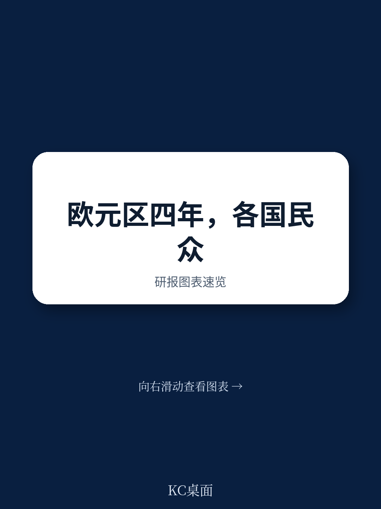
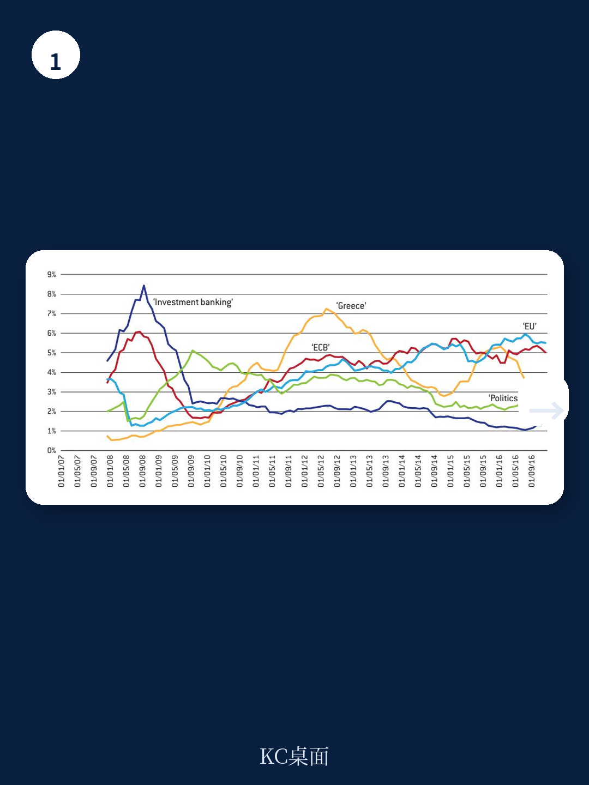
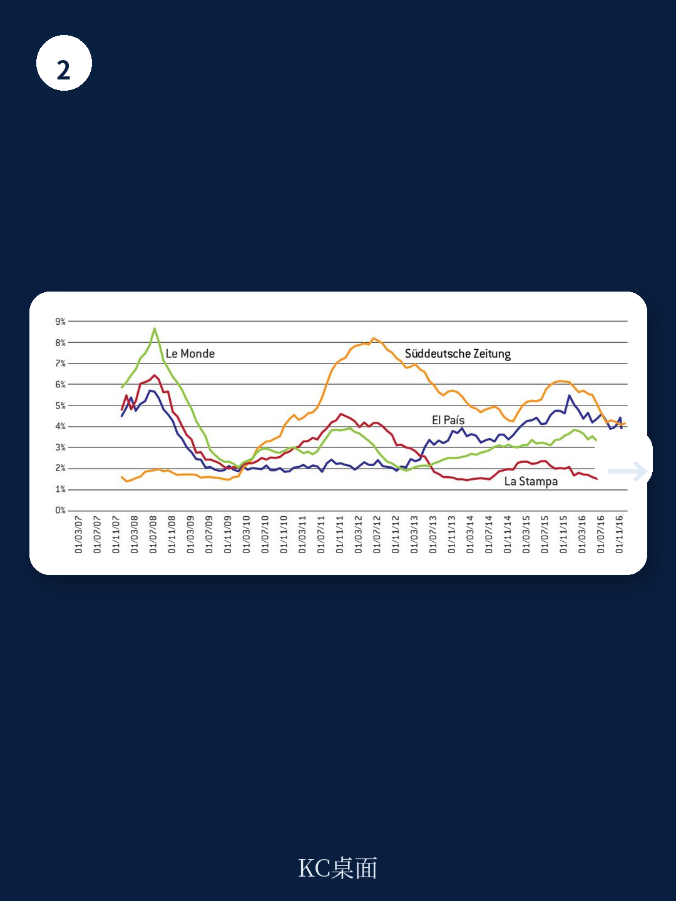

# 布鲁盖尔研究所：研究主题与行业变化观察

欧元区扰动爆发十余年后，关于“扰动为何发生、责任在谁”的公共叙事仍然没有收敛。布鲁盖尔研究所发布的一份政策研究显示，德国、法国、意大利和西班牙四国的主流报纸在归因上各说各话，几乎没有形成跨国的共同理解。这份研究基于2007年至2016年间四国四家代表性报纸的51,714篇宏观环境扰动相关文章，用主题建模方法识别各国报道中的叙事结构，并专门构建了包含140个归因词汇的“归责词典”来追踪各方被指责的程度。

研究选择的样本是德国的《南德意志报》、法国的《世界报》、意大利的《新闻报》和西班牙的《国家报》，四家报纸均属本国精英媒体，政治光谱居中或略偏左。研究的目的不是评判媒体报道是否公允，而是把报纸内容当作观察公共话语的窗口——欧元区缺少统一的公共舆论空间，各国公众对扰动的理解框架不同，这直接影响了区域治理改革的推进难度。

## 1. 四国报纸的归责对象呈现系统性差异

研究最直观的发现是，四家报纸在“谁该为扰动负责”这个问题上给出了几乎不重叠的答案。《南德意志报》的报道几乎不指责德国自身，主要归咎对象是希腊和欧洲央行；《世界报》的批评范围最广，包括法国政治阶层，但对欧盟委员会和欧洲央行等欧洲机构基本保持克制；《新闻报》把意大利描绘成不利环境的受害者，指责对象包括德国推动的欧盟紧缩政策和意大利本国政客；《国家报》则主要把矛头指向西班牙自身在扰动前繁荣期的行为失当。

这些差异并非细枝末节。研究指出，各国报纸在系统性议题上的报道框架——比如对民主价值受损、社会信任崩塌的讨论——虽然都带有悲观色彩，但落脚点完全不同。意大利、西班牙和法国报纸传递出对长期前景的失望、对欧洲一体化终结的担忧甚至对民主死亡的恐惧，而德国报纸的叙事则相对技术化，更倾向于相信本国制度能够渡过难关。

> **KC评论：** 这里容易被忽略的是，研究用的不是问卷调查而是媒体内容分析。报纸的归责模式反映的不是民众态度的直接测量，而是公共话语中被反复强化的解释框架。四国读者长期接触不同的归责叙事，对同一项欧元区改革方案的接受度自然会分化。

## 2. 各国叙事与政策选择之间存在对应关系

研究报告的另一个贡献，是把媒体叙事与各国实际政策行为放在一起对照。德国对财政审慎的坚持、对希腊的强硬立场以及最初对欧洲央行宽松政策的反对，与其报纸呈现的叙事方向一致。法国政府在扰动期间的被动角色，对应《世界报》中关于衰落与软弱的自我认知。意大利对改革的迟疑，与该国媒体中普遍存在的受害者心态相关。西班牙则从严厉的自我审视中得出教训，推动了银行业清理和劳动力市场自由化等结构性改革。

这种对应关系提示了一个更深的机制：媒体叙事不只是对事件的被动反映，它构成了政策制定者面临的舆论约束。当一国公众通过媒体形成了对扰动原因和责任的稳定理解，政府推动改革时就必须考虑这种理解是否与政策方向相容。欧元区层面的改革方案如果与某国的主流叙事冲突，在该国获得政治支持的成本就会显著上升。

## 3. 系统性议题在各国报道中占比有限

研究还发现，四家报纸的报道中，关于欧元区整体制度缺陷的系统性议题占比有限。各国报道更多聚焦本国的问题和解决方案，跨国层面的制度讨论往往从本国视角出发，缺少对区域共同不确定性的审视。欧洲央行的报道是一个典型例子——同一家机构在不同国家报纸中被赋予截然不同的角色和评价。

研究承认其方法存在边界：每个国家只选择了一家报纸，且算法辅助的跨语言内容分析和归责词典的应用仍属探索性方法，需要进一步验证。但即便存在这些限制，研究揭示的基本图景是清楚的：欧元区缺少一种共同的扰动叙事，这不仅是沟通问题，也是治理问题。没有共享的解释框架，区域层面的改革方案就难以获得跨国的民意基础。

这份研究发表于2018年，其观察窗口止于2016年。此后欧元区经历了新的冲击，各国公共话语是否有所趋同，报告中没有覆盖。但研究提出的核心问题——不同国家的公众如何理解同一场扰动、这种理解如何影响政策空间——在今天仍然有观察价值。
