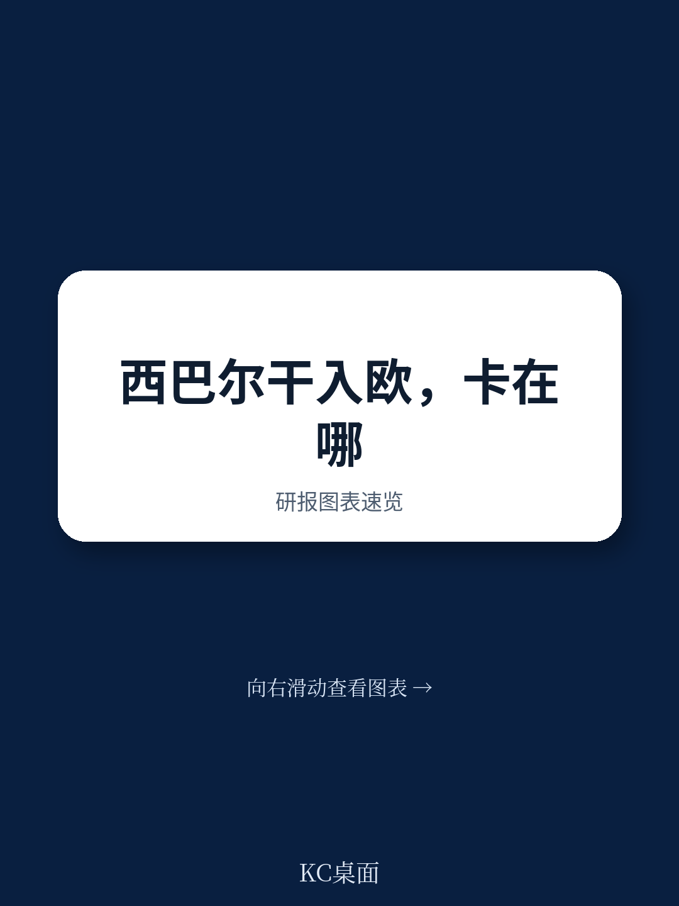
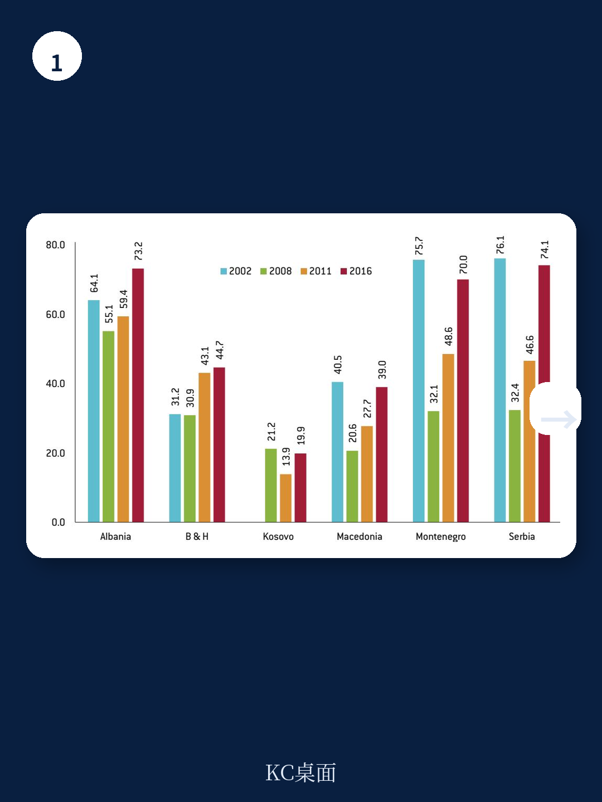
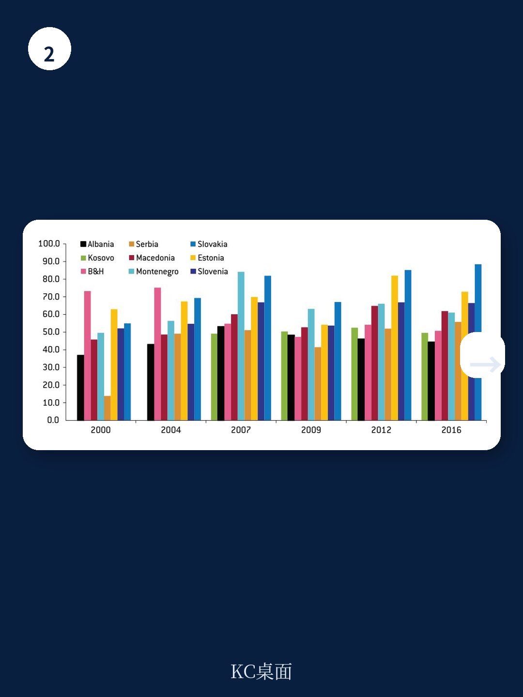

# 布鲁盖尔研究所：西巴尔干入盟进程中的宏观环境与制度落差

2018年2月，欧盟委员会为塞尔维亚和黑山设定了2025年的入盟参考时间表。这份由布鲁盖尔研究所发布的报告，把视线拉回西巴尔干地区过去二十年的宏观环境轨迹：收入在追赶，但速度在节奏变化；失业率在下降，但年轻人仍被排除在劳动力市场之外；制度在靠近欧盟标准，但法治和反腐败的进展远未达到入盟门槛。报告的核心判断是，西巴尔干国家的宏观环境收敛与制度准备之间存在明显落差，而这一落差正在被地缘政治竞争和欧盟内部扩盟疲劳共同放大。

报告选取2000年至2016年的数据，以德国为基准比较购买力平价调整后的人均GDP。结果显示，阿尔巴尼亚是收敛幅度最大的地区，与德国的差距缩小了10.5个百分点，塞尔维亚缩小9.6个百分点，黑山8.3个百分点。但2010年之后，收敛速度明显节奏变化，波黑和塞尔维亚到2016年仍未恢复到2009年的相对收入水平。报告将这一节奏变化归因于全球资金扰动和欧洲债务扰动的溢出效应，同时也指出，政治因素——包括科索沃地位争议、波黑的国家结构、马其顿国名争端——对各国收敛速度的差异有部分解释力。

## 1. 失业率下降但青年就业仍受制度约束

报告对劳动力市场的分析值得细读。科索沃的失业率从2001年的接近60%降至2016年的约30%，北马其顿从32%降至23.4%，但两国的青年失业率仍远高于欧盟平均水平。报告认为，这并非单纯的宏观环境周期问题，而是劳动力市场制度效率低下的表现，其根源可以追溯到前南斯拉夫时期员工自我管理模式遗留的制度惯性。世界银行2017年的研究也指出，2009年之前就业创造不足、多数行业生产率偏低，是收入不平等和失业问题持续的主要原因。

> **KC评论：** 西巴尔干的高失业率不是需求不足的短期现象，而是劳动市场制度与产业结构错配的结果。观察这一地区的宏观环境前景，就业数据比GDP增速更能说明问题。

## 2. 外国直接研究集中于少数行业且未充分转化为就业

报告引用Estrin和Uvalic的研究指出，西巴尔干地区的外国直接研究主要集中在资金、电信和零售等非贸易部门，制造业研究占比偏低。这种研究结构限制了技术溢出和就业创造。报告同时提醒，中国正在通过基础设施项目增加在该地区的存在，俄罗斯则更侧重于地缘政治目标，包括阻止西巴尔干国家加入北约。塞尔维亚是俄罗斯的重点关注对象，但塞尔维亚至今未加入欧盟对俄制裁，这一立场在其入盟谈判中如何被评估，报告没有展开。

## 3. 欧盟扩盟疲劳与地区改革动力形成相互制约

报告指出，2007至2013年的资金扰动及其引发的社会政治紧张、欧洲怀疑主义和英国脱欧，削弱了现有成员国对进一步扩盟的兴趣。这种疲劳感反过来削弱了西巴尔干国家国内改革的激励——如果入盟前景变得遥远，执政者推动艰难改革的动力就会下降。报告以土耳其为例，说明这一机制可能导致的恶性循环：入盟进程停滞，改革倒退，地区冲突不确定性上升。欧盟委员会2018年2月发布的西巴尔干战略，正是试图打破这一循环的举措。

## 4. 克罗地亚的地理位置使其成为扩盟的潜在受益者

报告特别指出，克罗地亚可能是西巴尔干扩盟的最大受益者。该国南部与中部之间唯一的陆路通道——亚得里亚高速公路——需要经过波黑领土，这成为克罗地亚加入申根区的障碍。如果西巴尔干国家最终入盟，克罗地亚的交通和地缘位置价值将显著提升。这一观察提供了一个具体的分析视角：扩盟不仅是布鲁塞尔与候选国之间的谈判，也涉及现有成员国之间的利益重新分配。

## 5. 观察框架：用收敛速度与制度质量的双重坐标评估入盟准备度

报告的数据提供了一个可复用的评估框架：将各国的人均GDP收敛速度与法治、反腐败等制度指标放在同一坐标中观察。阿尔巴尼亚和塞尔维亚在收入追赶上表现较好，但报告对两国的法治进展评价谨慎；黑山和塞尔维亚在入盟谈判进度上领先，但报告指出，两国在法治领域的改革仍需实质性推进。这一框架提醒读者，入盟准备度不能只看谈判章节的开放数量，还要看制度质量的实际变化。

> **KC评论：** 报告对2025年时间表的表述是“可能的入盟时间”，而非承诺。对关注欧洲一体化进程的读者来说，更值得跟踪的指标是各国在法治和反腐败章节上的实际进展，而非政治表态。

报告在结论部分建议，欧盟应在接纳新成员前完成自身的制度性改革，包括投票规则和预算安排，以避免扩盟进一步加剧欧盟内部决策的复杂性。这一建议将问题从西巴尔干国家的准备度，转向欧盟自身的吸收能力——后者可能才是决定扩盟节奏的更关键变量。
