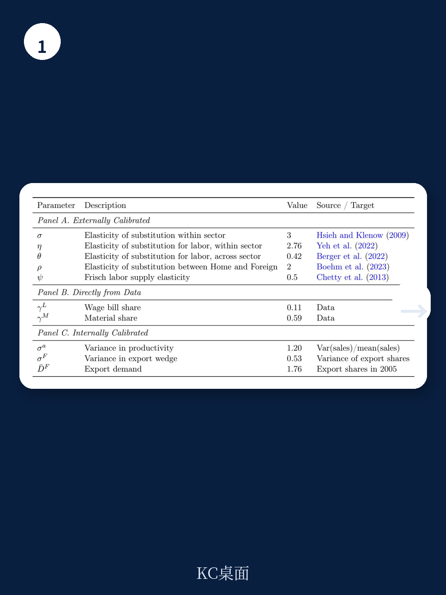
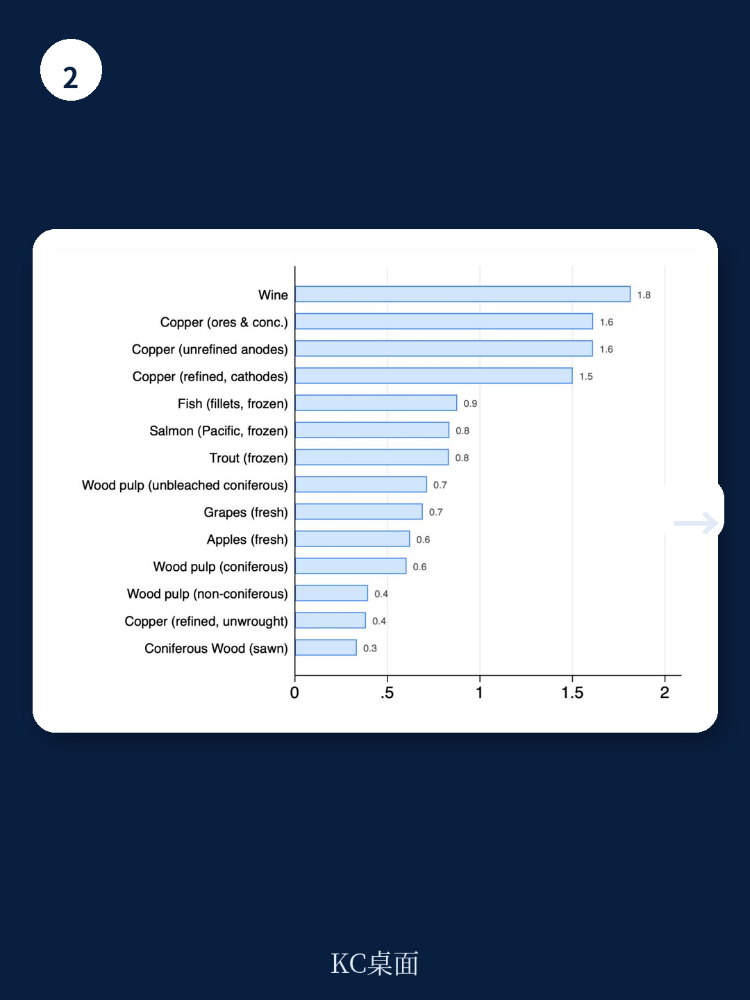

# IMF：大宗商品数据与主题变化观察

中国加入世贸组织后的大宗商品需求，曾给智利带来巨额出口收入。同一时期，该国采矿部门的全要素生产率却下降了约8%。这份由IMF研究人员发布的工作报告，用智利2003至2013年的行政微观数据，把这一矛盾拆解为三个可检验的机制，并指出资源错配可以解释其中约一半的生产率损失。

报告的核心判断是：大宗商品繁荣本身不必然提升生产率。在存在出口扭曲和劳动力市场摩擦的地区中，价格冲击可能把劳动力和中间投入重新配置到生产率较低的企业，反而压低整个部门的产出效率。这一结论对依赖资源出口的发展中地区有直接含义——能源转型带来的关键矿产需求，正在让许多国家重新面对类似智利当年的局面。

## 1. 受冲击更大的出口企业收入上升但生产率没有相应提高

报告利用中国对不同智利商品的需求差异，识别企业层面的价格冲击。结果显示，出口暴露度更高的企业，收入、材料支出和就业均有更大幅度增长，但以收入为基础的全要素生产率（TFPR）和人均销售额没有出现差异化改善。这一零结果在多种生产函数设定下都成立。

由于大宗商品价格上涨会推高企业产出价格，TFPR不变意味着实物生产率（TFPQ）可能下降。报告认为，这或与企业在快速扩张中面临矿石品位下降、投入品质量变化有关。值得注意的是，这些企业没有出现国内销售或资本积累的差异化增长，出口收入主要流向了与出口相关的可变投入，而非生产率提升型研究。

> **KC评论：** 这里容易被忽略的是“无差异化改善”的含义。报告比较的是受冲击程度不同的企业之间的相对表现，而不是企业自身的绝对变化。即便所有企业都在扩张，只要低暴露企业生产率提升更快，相对差距就会拉大。

## 2. 低生产率企业在繁荣期扩张更快并吸纳高生产率企业的工人

第二个机制涉及劳动力配置。在受冲击更大的出口企业中，初始TFPR低于中位数的企业显著扩大了就业，而高TFPR企业没有类似的差异化扩张。这不是选择效应——企业受冲击程度与初始生产率之间的相关性接近于零（-0.027）。

更关键的是劳动力流向。受冲击更大的企业从同行业其他企业招聘工人，其中不成比例的份额来自生产率更高的雇主。结合受冲击企业支付相对更高工资的发现，报告认为大宗商品繁荣让低生产率但享有出口优势的企业，能够从更高效的生产者那里“挖走”工人。这种从高到低生产率企业的劳动力再配置，是资源错配出现变化的直接微观证据。

## 3. 上游国内供应商获得正向生产率溢出

与出口企业形成对比的是，向大宗商品出口商供货但不直接出口大宗商品的国内上游企业，在间接暴露度更高时，销售额、就业、材料支出以及资本研究和生产率均有更大幅度增长。这一正向溢出效应与智利非采矿部门在同期出现的生产率提升一致。

报告据此提出一个更完整的图景：同一轮需求扩张，在拉动下游企业的同时，可能在其中心地带压低生产率——投入品流向低TFPR企业，而需求效应通过供应链向上游传导时，反而带来了生产率改善。这比传统的“荷兰病”叙事更精细，也更能解释智利采矿与非采矿部门之间的生产率分化。

## 4. 模型校准显示错配机制可解释约一半的采矿TFP下降

为解释上述经验模式，报告构建了一个小型开放宏观环境模型，包含两类扭曲：企业特定的出口楔子（反映不同企业进入外国市场的难易差异）和寡头买方垄断的劳动力市场。在这一框架下，统一的大宗商品需求增长对不同企业产生非对称影响：出口楔子更大的企业扩张更多，从生产率更高但出口优势较弱的竞争者那里吸走劳动力和材料。

模型校准利用了智利行政数据中的出口份额、销售离散度和出口强度等矩条件，未针对任何企业层面的回归系数进行目标设定。模拟结果显示，资源向低TFPR企业的重新配置使部门生产率下降3.94%，约为智利国家生产率委员会记录的8%降幅的一半。剩余差距可能来自模型之外的因素，如采矿资本研究的产能约束、矿石品位下降导致的企业内生产率节奏变化等。

报告对出口楔子的度量值得留意。研究者从智利行政数据中识别了四项法定政策工具——出口退税、关税退还、渔业个体可转让配额和养殖特许权——构建了企业层面的净出口楔子，并验证了楔子更有利的企业在冲击到来时出口扩张更多。这一度量是法定参数乘以资格的结果，而非实际收到的补贴或缴纳的税费，且只覆盖显性工具。智利国家铜业公司的国家融资、外国矿商的税收稳定协议等隐性支持未被计入，因此该度量应被视为下界估计。

对正在经历关键矿产需求扩张的国家而言，这份报告提供了一个可复用的观察框架：当资源价格上升时，需要同时追踪三个维度——出口收入是否转化为资本积累和生产率提升，劳动力是否从高生产率企业流向低生产率企业，以及供应链上下游是否存在不对称的溢出效应。三者合在一起，才能判断一轮繁荣是在巩固长期增长基础，还是在为未来的生产率调整积累成本。
