# Convergence from Above: When Global Catch-Up Reflects Falling Back

Patrick A. Imam

WP/26/159

IMF Working Papers describe research in progress by the author(s) and are published to elicit comments and to encourage debate. The views expressed in IMF Working Papers are those of the author(s) and do not necessarily represent the views of the IMF, its Executive Board, or IMF management.

2026
JUL

# IMF Working Paper Institute for Capacity Development

# Convergence from Above: When Global Catch-Up Reflects Falling Back

Prepared by Patrick A. Imam\*

Authorized for distribution by Ali Alichi

July 2026

IMF Working Papers describe research in progress by the author(s) and are published to elicit comments and to encourage debate. The views expressed in IMF Working Papers are those of the author(s) and do not necessarily represent the views of the IMF, its Executive Board, or IMF management.

ABSTRACT: Convergence is usually interpreted as evidence of catch-up: poorer economies grow faster because they are moving toward richer ones. This paper argues that the same empirical pattern can arise from a different source. If country-specific long-run trajectories shift over time, narrowing income gaps may reflect not only upward movement from below, but also adjustment from above. We develop a framework in which economies converge toward evolving rather than fixed steady-state paths, and construct empirical proxies for these paths using cross-country data. Economies above their predicted trajectories subsequently grow more slowly and are more likely to move downward within the world income distribution. Supporting evidence links positive overshooting to selected downside-adjustment episodes, especially banking-sector distress and loss of frontier position. The evidence suggests that observed convergence partly reflects compression from the top, not only catch-up from below.

RECOMMENDED CITATION: Imam, Patrick A. 2026. “Convergence from Above: When Global Catch-Up Reflects Falling Back.” IMF Working Paper No. 26/159, International Monetary Fund, Washington, DC.

JEL Classification Numbers:

O11, O47, O57, F43, E13

Keywords:

Convergence; Relative Decline; Macroeconomic Fragility; Distribution Dynamics; Steady States; Structural Transformation

Author's E-Mail Address:

pimam@imf.org

WORKING PAPERS

# Convergence from Above: When Global Catch-Up Reflects Falling Back

Prepared by Patrick A. Imam

## Contents

I. Introduction......3
II. Motivating Facts: Convergence, Stagnation, and Falling Back......6
III. A Model of Convergence with Moving Steady States......8
IV. Empirical Framework and Results......12
V. Convergence, Fragility, and Distribution Dynamics......24
VI. Conclusion......25
References......26
Appendix A. Dynamic Convergence with Moving Steady States......28
Appendix B: Supplementary Empirical Results and Robustness Analysis......33

## I. Introduction

One of the most influential ideas in economics is that poor countries should grow faster than rich ones. Since Solow (1956), the negative relationship between initial income and subsequent growth has generally been interpreted as evidence of catch-up. Economies below their long-run potential accumulate capital, adopt existing technologies, and gradually narrow income gaps with richer economies. In this interpretation, convergence is more than a statistical regularity. It is often taken as a broad measure of development progress itself.

Yet the historical evidence has never sat entirely comfortably with such a simple interpretation. Growth paths are not smooth escalators. Countries advance, stall, reverse, and sometimes spend decades moving sideways. Pritchett's (1997) phrase “divergence, big time” captured one side of this instability. The recent return of unconditional convergence, emphasized by Kremer, Willis, and You (2021) and Patel, Sandefur, and Subramanian (2021), captures another. But the coexistence of these facts raises a deeper question. If convergence has returned, what kind of convergence is it? A negative relationship between initial income and subsequent growth does not tell us whether poorer economies are rising or richer economies are falling back.

The world economy over the last half century presents two facts that are usually discussed separately. On the one hand, convergence appears alive. Many poorer economies, especially in East and Southeast Asia, have grown rapidly relative to the industrial frontier, and cross-country income gaps have narrowed in important dimensions. On the other hand, several advanced economies have entered prolonged periods of stagnation, relative decline, or repeated downward revision in long-run growth expectations. Japan after the early 1990s, parts of Europe after the euro-area crisis, and more recently economies such as Germany and Finland all point toward a common phenomenon. Economies that previously sustained relatively high-income levels increasingly struggle to maintain earlier growth trajectories. Similar though distinct patterns can also be observed across parts of the middle-income world, particularly in Latin America, where repeated episodes of stalled convergence and recurrent “lost decades” have interrupted earlier expectations of sustained catch-up.

The standard interpretation is that these developments simply offset one another. Poorer economies catch up while richer economies slow naturally near the frontier. But this interpretation misses a more basic ambiguity. It tells us only that initially richer economies grow more slowly. That pattern may reflect successful catch-up from below. It may also reflect something quite different. Economies whose relative income levels appear high compared with those implied by current fundamentals may gradually adjust toward lower long-run paths.

Economists have long focused on how poor countries catch up; much less attention has been paid to the possibility that some rich countries may, quietly and gradually, fall back. This paper develops a framework for analyzing this second mechanism. “Convergence from above” $^{1}$ is not meant to describe ordinary slow growth among rich countries. It refers to a specific dynamic. An economy lies above the income level implied by its current fundamentals, and subsequent growth is weak because the economy is adjusting toward that lower benchmark.

The mechanism studied here is distinct from three related ideas. It is not simply beta-convergence, since two economies with the same initial income may differ in their position relative to the trajectory implied by current fundamentals. It is not primarily a convergence-club argument, since the emphasis is not on assigning countries to fixed long-run regimes, but on allowing country-specific trajectories to move over time. Nor is it merely a boom-bust story. Some episodes of overshooting may indeed reflect temporary booms, favorable

terms-of-trade movements, or credit expansions. But the mechanism of interest is broader: economies may move above their long-run trajectory because the benchmark itself has weakened.

The central idea is simple. Standard growth models describe economies converging toward steady states determined by productivity, demographics, investment, and human capital. But steady states are not fixed objects. Productivity growth weakens, demographic structures deteriorate, industrial composition changes, technologies diffuse unevenly, and economies may become less effective at using existing technologies. When these shifts occur, the level of income consistent with long-run equilibrium can decline. An economy can therefore become “too rich” relative to its fundamentals even if actual income does not rise. In practice, the adjustment often first appears not through crisis, but through repeated downward revisions in expectations about future productivity and long-run growth.

Such dynamics are less historically unusual than the standard convergence narrative sometimes suggests. Macroeconomists routinely reason in this way elsewhere. Housing markets appear expensive because local fundamentals weaken rather than because prices rise. Potential output is revised downward after persistent stagnation. In each case, the observed level remains temporarily high because the benchmark has moved. This paper applies the same logic to cross-country income dynamics.

The argument developed here is therefore narrower than it may first appear. The paper does not suggest that all stagnation reflects convergence from above, nor that slower growth among richer economies explains convergence more generally. Rather, the claim is that observed convergence may reflect two conceptually distinct processes simultaneously: upward mobility from below and downward adjustment from above. The convergence literature has overwhelmingly emphasized the first mechanism, even though the second may also be quantitatively relevant for understanding the evolution of the world income distribution.

The central issue is therefore not whether convergence occurs, but whether convergence itself has been systematically misread. To address this question, the paper develops an extension of the neoclassical growth framework in which steady-state paths evolve over time. Relative to earlier work on asymmetric convergence dynamics, the novelty is not simply that adjustment differs above and below the steady state. It is that economies may systematically enter the above-steady-state region because the steady-state path itself shifts downward.

The framework clarifies why standard convergence regressions may combine conceptually distinct forms of adjustment. The empirical analysis follows directly from these implications. We estimate country-specific steady-state paths as functions of investment, demographics, and human capital; construct an overshooting measure given by the gap between actual income and predicted steady-state income; and examine how this gap predicts subsequent growth and transition probabilities within the world income distribution. The overshooting gap is not interpreted as a direct observation of the true steady state. It is a disciplined empirical proxy for the distance between observed income and the income level implied by a parsimonious set of long-run fundamentals. The empirical question is whether this gap contains information about subsequent growth and relative mobility beyond that contained in initial income alone.

The distributional analysis is central. Following Quah (1993, 1996), convergence is treated as a statement about movements within the full cross-country distribution, not merely the sign of a coefficient in a growth regression. This distinction matters because similar convergence coefficients may arise from very different underlying processes. A world in which poorer economies move upward is economically different from one in which the upper tail of the distribution compresses because previously successful economies fail to sustain earlier trajectories.

The empirical results support the existence of convergence from above. Economies above their predicted long-run trajectories subsequently experience weaker growth, while adjustment from above appears slower and more persistent than convergence from below. In our preferred accounting exercise, compression near the top accounts for a material share of observed convergence, with a point estimate close to one-third over the full 1960–2019 sample.

The paper contributes to the convergence literature associated with Barro and Sala-i-Martin (1992), Mankiw, Romer, and Weil (1992), and Durlauf, Johnson, and Temple (2005) by distinguishing convergence from below and convergence from above. It also relates to Quah's (1993, 1996) distribution-dynamics approach and to work emphasizing instability and discontinuity in long-run growth experience, including Pritchett (1997) and Johnson and Papageorgiou (2020). The paper is also related to work on resource-based overshooting, convergence clubs, and multiple steady states, but differs in its emphasis on evolving country-specific trajectories and on the possibility that upward and downward adjustment coexist within measured convergence itself.

The policy relevance is immediate. Weak growth may reflect temporary cyclical weakness, temporary adjustment after a boom, or movement toward a lower long-run trajectory. Distinguishing between these cases matters for forecasting, debt sustainability analysis, and assessments of medium-term potential. The broader implication is simple. Convergence may reflect progress at the bottom, decline at the top, or both. The purpose of this paper is to distinguish these mechanisms and to show that doing so changes how we interpret global development.

The remainder of the paper proceeds as follows. Section II presents motivating facts on convergence, stagnation, and relative decline. Section III develops a model of convergence with moving steady-state paths. Section IV constructs empirical proxies for long-run trajectories, estimates the dynamics of adjustment, and uses an accounting exercise to distinguish the contributions of catch-up from below and compression from above. Section V discusses implications for convergence, fragility, and global development dynamics. Section VI concludes.

## II. Motivating Facts: Convergence, Stagnation, and Falling Back

The return of convergence has been among the most consequential developments in the modern world economy. After decades in which divergence frequently appeared the more natural description of global development, many poorer economies have grown faster than richer ones since the early 1990s. Kremer, Willis, and You (2021) document a broad revival of unconditional convergence, while Patel, Sandefur, and Subramanian (2021) suggest that the extent of catch-up is historically unusual in both scale and breadth.

Viewed in isolation, these findings appear reassuring. Standard growth theory predicts that economies below the frontier should grow rapidly through capital accumulation, structural transformation, and technology diffusion. Yet the broader macroeconomic landscape of the same period looks considerably less straightforward. The decades that witnessed renewed convergence also produced prolonged stagnation, repeated downward revisions in estimates of potential growth, and persistent productivity slowdowns across parts of the advanced and middle-income world. Japan remains the clearest case. Following one of the most successful convergence episodes in modern economic history, growth slowed sharply after the early 1990s and never returned to earlier rates. Hayashi and Prescott (2002), Summers (2014), and Gordon (2016), among others, increasingly interpreted the slowdown not as a temporary cyclical interruption, but as evidence of deeper structural weakness linked to demographics, productivity, investment, and declining dynamism.

Comparable patterns emerged elsewhere through different channels. Southern Europe experienced prolonged stagnation after the euro-area crisis despite earlier expectations of continued convergence within Europe. In the United Kingdom, weak productivity growth after the global financial crisis became sufficiently persistent that concern gradually shifted away from cyclical recovery toward the possibility that underlying productive capacity itself had weakened. Haldane (2017) described the productivity slowdown as one of the defining macroeconomic puzzles of the post-crisis era. More recently, concerns about Germany and Finland have reflected a similar pattern: not a sudden collapse, but a gradual weakening of the growth model that previously supported high relative income levels.

Nor is the phenomenon confined to advanced economies. Latin America's recurrent “lost decades” revealed how periods of temporarily favorable external conditions could sustain income levels that later proved difficult to maintain. Rodríguez and Sachs (1999), studying resource-rich economies, explicitly describe cases in which economies converge “from above” after overshooting relative to lower steady states. Rodrik (2016) argues that premature deindustrialization may weaken one of the principal historical mechanisms through which economies converged toward the frontier. These episodes differ in their proximate causes. Some involve demographic aging, others commodity dependence, weak diffusion, declining industrial dynamism, institutional rigidities, financial excess, or persistent productivity weakness. What links them is less obvious but potentially more important: in each case, expectations about sustainable long-run performance appear to shift downward over time. The issue is not simply that countries sometimes grow slowly. It is that the benchmark against which their income levels should be assessed may itself have moved.

These examples are illustrative. They show why the mechanism is plausible, but they do not establish it. The formal analysis below therefore uses the full cross-country panel to ask whether economies above estimated long-run trajectories subsequently display weaker growth and whether descriptive distributional evidence is consistent with greater downward mobility within the world income distribution.

This feature is difficult to reconcile with interpretations of convergence that implicitly treat steady states as relatively stable objects. Temporary recessions are entirely consistent with standard growth theory. Repeated downward revisions in estimates of potential growth are conceptually different. Fernald, Inklaar, and Ruzic (2025), for example, argue that the advanced-economy productivity slowdown reflects broad and persistent forces rather than temporary post-crisis weakness. More recent debates on secular stagnation and slowing productivity growth similarly emphasize that medium-term growth expectations and estimates of potential output may shift persistently over time rather than reverting automatically toward earlier trends (Summers 2014; Gordon 2016).

A striking feature of modern development experience is therefore not simply that growth rates differ across countries, but that growth trajectories themselves appear unstable. Economies advance, stall, reverse, and sometimes spend decades adjusting to weaker paths than previously anticipated. Pritchett (1997) emphasized that discontinuity and divergence are central features of modern growth experience rather than peripheral anomalies. Johnson and Papageorgiou (2020) similarly argue that cross-country growth dynamics display substantially greater instability and heterogeneity than conventional convergence narratives often imply.

This instability matters because the determinants of long-run productive capacity are themselves evolving. Productivity growth changes. Demographic structures shift. Industrial composition evolves. Economies differ in their ability to absorb and deploy frontier technologies. Jones (2002) stresses that long-run growth depends fundamentally on idea production and diffusion, both of which may evolve more slowly than standard balanced-growth frameworks often assume. Galor (2011) likewise emphasizes that demographic transition, human capital accumulation, and structural transformation reshape development trajectories over time.

Once this is recognized, a wide range of apparently disconnected phenomena begin to share a common structure. Premature deindustrialization weakens the manufacturing-based convergence process that historically underpinned catch-up. Demographic aging lowers labor-force growth and may weaken innovation and investment dynamics. Commodity booms temporarily sustain income levels that become difficult to maintain once external conditions reverse. Weak productivity growth reduces the long-run trajectory of output even in technologically advanced economies. Slower diffusion limits the gains from access to frontier technologies. In each case, the issue is not merely cyclical weakness. The benchmark consistent with long-run equilibrium may itself shift.

An economy can therefore appear increasingly “above” the income level implied by its evolving fundamentals even if absolute income continues to rise slowly. Relative decline does not require collapse. Economies can gradually grow into weaker futures. This observation matters because standard convergence measures are not designed to distinguish between upward mobility from below and downward adjustment from above. A negative relationship between initial income and subsequent growth can emerge under both interpretations.

Quah's (1993, 1996) critique is relevant here. Convergence is ultimately a statement about movements within an entire distribution rather than the sign of a single regression coefficient. From this perspective, developments near the top of the distribution may matter substantially for aggregate convergence dynamics. If poorer economies continue to grow steadily while some economies near the frontier stagnate, global income dispersion may narrow even when upward mobility from below is only moderate. Convergence may then partly reflect compression at the top.

Part of what makes recent convergence historically unusual is precisely that it coincides with unusually weak growth among several economies near the frontier. Kremer, Willis, and You (2021) explicitly note that post-1990 convergence reflects both faster growth among poorer economies and slower growth at the frontier. Yet standard convergence narratives typically emphasize only the first component. The possibility that the second component reflects a systematic form of adjustment has received much less attention.

The argument developed in this paper is therefore not that catch-up has ceased, nor that all stagnation reflects convergence from above. The rise of large parts of Asia remains one of the defining development successes of the modern era. The point is narrower but potentially more consequential. Observed convergence may combine upward and downward forces simultaneously, and standard convergence metrics are not constructed to distinguish between them. The next section formalizes this idea using a minimal extension of the neoclassical growth framework in which steady-state paths evolve over time.

## III. A Model of Convergence with Moving Steady States

Standard growth theory explains slow growth among richer economies largely as a consequence of proximity to steady state. This paper considers a different possibility. Long-run trajectories themselves may weaken over time. Under such conditions, slow growth need not reflect successful convergence alone. It may also reflect gradual adjustment toward a less favorable long-run path.

The purpose of the model is deliberately limited. It is not intended to provide a new theory of productivity growth, demographic change, structural transformation, or institutional decline. Its role is instead to show why the standard interpretation of convergence becomes incomplete once the steady-state path is allowed to move. The same negative convergence coefficient may then reflect countries below their trajectories catching up, countries above their trajectories adjusting downward, or both.

This idea can be formalized using a minimal extension of the standard neoclassical growth model. The framework preserves the central logic of convergence theory, but introduces one modification: steady-state paths are allowed to evolve over time as the determinants of long-run productive capacity change.

Consider an economy with aggregate production

$$
Y _ {i t} = K _ {i t} ^ {\alpha} (A _ {i t} L _ {i t}) ^ {1 - \alpha}, 0 <   \alpha <   1,
$$

where $K_{it}$ denotes physical capital, $L_{it}$ labor, and $A_{it}$ labor-augmenting efficiency.

Capital accumulates according to

$$
\dot {K} _ {i t} = s _ {i t} Y _ {i t} - \delta K _ {i t},
$$

where $s_{it}$ is the investment rate and $\delta$ the depreciation rate. Labor and productivity evolve as

$$
\frac {\dot {L} _ {i t}}{L _ {i t}} = n _ {i t}, \frac {\dot {A} _ {i t}}{A _ {i t}} = g _ {i t}.
$$

Define capital per effective worker,

$$
k _ {i t} = \frac {K _ {i t}}{A _ {i t} L _ {i t}}.
$$

The law of motion becomes

$$
\dot {k} _ {i t} = s _ {i t} k _ {i t} ^ {\alpha} - (n _ {i t} + g _ {i t} + \delta) k _ {i t}.
$$

where $s_{it}$ denotes the investment rate, $n_{it}$ population growth, $g_{it}$ labor-augmenting technological progress, and $\delta$ the depreciation rate.

Let

$$
\phi_ {i t} \equiv n _ {i t} + g _ {i t} + \delta .
$$

where $\phi_{it}$ represents the effective dilution rate of capital per effective worker arising from population growth, technological progress, and depreciation.

For given $s_{it}$ and $\phi_{it}$ , the steady-state level of capital per effective worker is

$$
k _ {i t} ^ {*} = \left(\frac {s _ {i t}}{\phi_ {i t}}\right) ^ {\frac {1}{1 - \alpha}},
$$

with corresponding steady-state output per worker

$$
y _ {i t} ^ {*} = A _ {i t} \left(\frac {S _ {i t}}{\phi_ {i t}}\right) ^ {\frac {\alpha}{1 - \alpha}}.
$$

The full derivation is presented in Appendix A. The important implication is that the steady-state path is not fixed. It evolves with productivity, investment, demographics, and the broader capacity of the economy to sustain productive activity over time. This is the paper's central departure from the usual interpretation of convergence. Earlier work on asymmetric convergence dynamics, including Mathunjwa and Temple (2006), emphasizes that adjustment may differ above and below steady state. The distinction here is different. Economies may systematically enter the above-steady-state region because the steady-state path itself evolves over time. Such developments alter not merely short-run fluctuations, but the level of income consistent with long-run equilibrium. The model is intentionally reduced-form and does not attempt to endogenize the determinants of changing long-run trajectories themselves. Instead, the objective is to allow steady-state paths to evolve over time as underlying fundamentals change.

This distinction is important for the interpretation of the empirical work below. The model does not claim that every episode of weak growth reflects a declining steady-state path. Nor does it imply that the true steady state can be observed directly. It provides a disciplined way to think about an empirical object: the gap between observed income and the level of income implied by a parsimonious set of evolving fundamentals.

Define the gap between actual income and the steady-state path as

$$
\omega_ {i t} = \ln y _ {i t} - \ln y _ {i t} ^ {*}.
$$

If

$$
\omega_ {i t} <   0,
$$

the economy lies below steady state. If

$$
\omega_ {i t} > 0,
$$

it lies above it.

The familiar case is $\omega_{it} < 0$ . The economy has room to catch up through capital accumulation and technology adoption. The less studied case is $\omega_{it} > 0$ , when current income is high relative to the path implied by prevailing fundamentals. This is convergence from above (see Figure 1A). The distinction between convergence from below and above is shown in Figure 1B.

Note. Stylized log-income paths under MRW dynamics with augmentation, depreciation, and overshooting shocks.

Figure 1A. Convergence from below versus convergence from above  
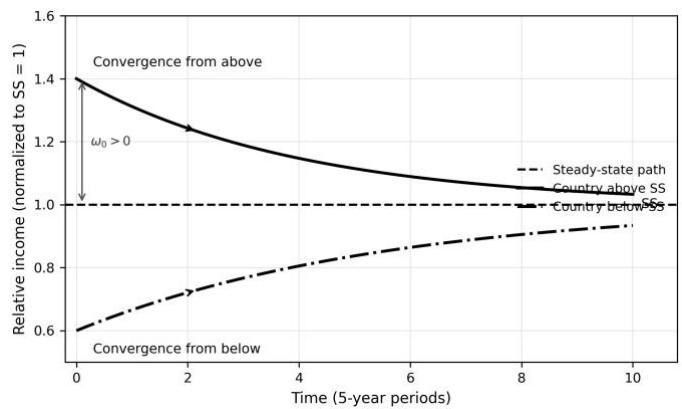  
Figure 1B. Convergence from below vs. convergence from above  
A. Convergence from Below (Faster Catch-up)

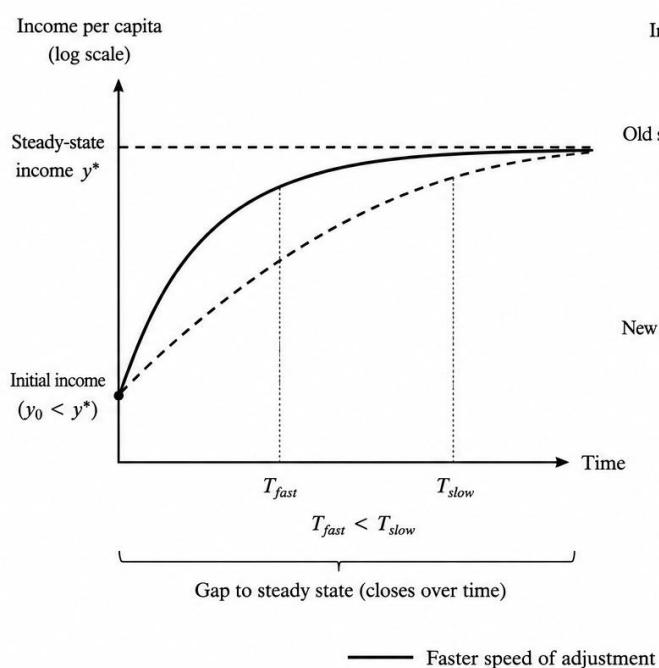  
B. Convergence from Above (Slower Adjustment Downward)

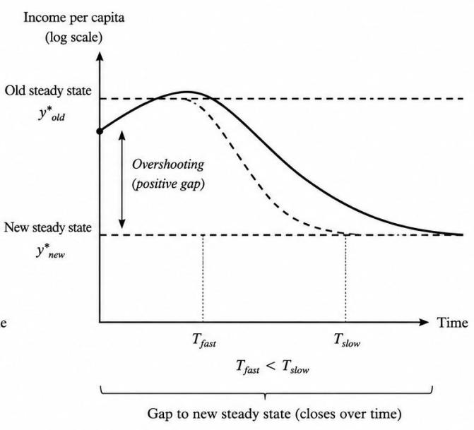  
Source: Author.

Importantly, adjustment from above does not require absolute declines in living standards. Economies may continue to grow in absolute terms while underperforming relative to earlier expectations or relative to the frontier. The mechanism is therefore fundamentally about relative trajectories rather than collapse. The adjustment process is also likely to be gradual. Capital depreciates slowly, productive structures adapt imperfectly, and expectations adjust with delay. Economies may therefore spend long periods growing below earlier expectations while converging toward weaker steady-state paths.

The model further implies asymmetric adjustment dynamics (see Appendix A). From the law of motion,

$$
\frac {\dot {k} _ {i t}}{k _ {i t}} = s _ {i t} k _ {i t} ^ {\alpha - 1} - \phi_ {i t}.
$$

Define

$$
z _ {i t} \equiv \frac {k _ {i t}}{k _ {i t} ^ {*}},
$$

where $z_{it}$ measures the economy's position relative to its steady-state level of capital per effective worker. Using the steady-state condition,

$$
s _ {i t} (k _ {i t} ^ {*}) ^ {\alpha - 1} = \phi_ {i t},
$$

the dynamics can be written as

$$
\frac {\dot {k} _ {i t}}{k _ {i t}} = \phi_ {i t} (z _ {i t} ^ {\alpha - 1} - 1).
$$

Because $0 < \alpha < 1$ , adjustment is asymmetric around the steady state. Economies below steady state ( $z_{it} < 1$ ) experience relatively rapid growth through capital deepening and technology adoption. Economies above steady state ( $z_{it} > 1$ ) instead adjust more gradually. Once capital intensity exceeds the level implied by prevailing fundamentals, subsequent adjustment operates primarily through weaker relative growth rather than abrupt collapse. Appendix A shows formally that, for equal proportional deviations from steady state, adjustment from below is stronger than adjustment from above.

The asymmetry should be understood as a theoretical implication to be taken to the data, not as an assumption imposed on the empirical analysis. In particular, the model suggests that adjustment from above may be slower and less visible than catch-up from below, but the magnitude and persistence of this asymmetry remain empirical questions. The empirical relevance of convergence from above does not require adjustment speeds to differ statistically above and below the trajectory; asymmetric speeds constitute a separate and more demanding prediction. The framework leaves the central logic of convergence theory intact. Economies still converge toward long-run equilibria. What changes is the interpretation of the equilibria themselves. Appendix A develops the model formally and derives the asymmetry conditions.

Once steady-state paths are allowed to evolve over time, observed convergence becomes inherently ambiguous. A negative relationship between initial income and subsequent growth may reflect upward mobility from below, downward adjustment from above, or both simultaneously. As Quah (1993, 1996) emphasized, convergence is ultimately a statement about movements within the full income distribution rather than the sign of a single regression coefficient.

The empirical implication is straightforward. Once steady-state paths move, the sign of a standard convergence coefficient is no longer enough to identify the underlying adjustment mechanism. The analysis below therefore asks whether economies above estimated long-run trajectories subsequently grow more slowly and whether their subsequent movements within the world income distribution are consistent with downward adjustment, while economies below those trajectories exhibit the more familiar pattern of catch-up.

## IV. Empirical Framework and Results

The model implies that observed convergence may combine two distinct mechanisms. The first is conventional catch-up from below. Economies initially below their long-run trajectories subsequently grow rapidly through capital accumulation, structural transformation, and technology diffusion. The second is adjustment from above. Economies whose observed income levels exceed those implied by evolving fundamentals subsequently experience weaker growth as they adjust toward less favorable long-run paths.

The empirical objective of this section is to distinguish between these mechanisms. The analysis proceeds in four steps. First, country-specific long-run trajectories are constructed using observable fundamentals. Second, the paper estimates whether economies above those trajectories subsequently experience systematically weaker growth. Third, it examines whether the same measure predicts movements within the world income distribution. Finally, observed convergence is examined through an accounting exercise that distinguishes convergence from below and compression near the top of the distribution.

## A. Measuring Long-Run Trajectories

The empirical framework follows directly from the steady-state relationship derived in Section III:

$$
y _ {i t} ^ {*} = A _ {i t} \left(\frac {S _ {i t}}{\phi_ {i t}}\right) ^ {\frac {\alpha}{1 - \alpha}},
$$

where $s_{it}$ denotes the investment rate and $\phi_{it}$ captures effective dilution through population growth and depreciation.

Following Mankiw, Romer, and Weil (1992), the long-run trajectory is estimated using observable fundamentals:

$$
\ln y _ {i t} = \beta_ {0} + \beta_ {1} \ln s _ {i t} - \beta_ {2} \ln (n _ {i t} + g + \delta) + \beta_ {3} \ln h _ {i t} + \mu_ {i} + \tau_ {t} + \varepsilon_ {i t},
$$

where $h_{it}$ measures human capital, $\mu_{i}$ are country fixed effects, and $\tau_{t}$ are time effects capturing common global shocks.

The fitted value,

$$
\widehat {\ln y _ {i t} ^ {*}},
$$

is interpreted as the empirical counterpart to the long-run income level implied by contemporaneously observable fundamentals. This interpretation is deliberately modest. The fitted value is not a direct observation of the true steady state, nor is $\phi$ treated as a structural sufficient statistic for long-run potential. It is a disciplined empirical proxy for the distance between observed income and the income level predicted by a parsimonious set of evolving fundamentals. The empirical question is therefore not whether $\omega_{it}$ recovers the true steady state, but whether this estimated gap contains information about subsequent growth and subsequent movements within the relative-income distribution beyond that contained in initial income and standard convergence covariates.

The analysis combines several standard cross-country macroeconomic datasets. The baseline macroeconomic variables, including output per worker, investment shares, population growth, and human-capital measures, are drawn primarily from Penn World Table 11.0. The baseline human-capital measure is the human-capital index reported in Penn World Table 11.0. Barro–Lee educational-attainment data are used only in specifications in which they enter explicitly. Long-run historical income series used in the descriptive figures are obtained from the Maddison Project Database, 2020 vintage (Bolt and van Zanden 2020). Banking-crisis chronologies and the macroeconomic fragility controls used in the hazard specifications are drawn from the

Global Macro Database (Müller, Xu, Lehbib, and Chen 2025). The sample covers both advanced and developing economies over the period 1960–2019, subject to data availability. Following standard practice (see Islam, 1995), the analysis is conducted using non-overlapping five-year intervals in order to reduce the influence of short-run business-cycle fluctuations, temporary external shocks, and measurement error in annual growth rates. Subsequent growth is measured over the five years following the initial observation, while the explanatory variables are measured at the beginning of the interval or using information available before it. Observations with missing data on output, investment, population growth, or human capital are excluded from the baseline specifications. The widest underlying panel contains up to 185 economies and twelve five-year periods. The preferred fully specified growth regressions use 1,305 country–period observations for 137 economies; the precise sample varies with data availability and the specification employed.

Define the overshooting gap as:

$$
\widehat {\omega} _ {i t} = \ln y _ {i t} - \widehat {\ln y _ {i t} ^ {*}}.
$$

Positive values indicate economies whose observed income levels exceed those implied by estimated fundamentals. Negative values correspond to economies below their predicted long-run trajectories. A natural concern is that $\widehat{\omega}_{it}$ may capture mechanical residual mean reversion rather than adjustment toward evolving long-run trajectories. The empirical design evaluates this concern in several ways. The baseline specifications control directly for initial income; the analysis uses non-overlapping five-year periods; the results are compared across alternative trajectory measures; and the robustness exercises below use a leave-one-observation-out construction of the trajectory gap and re-estimate the first and second stages jointly in the bootstrap. These exercises do not make the estimated trajectory a directly observed steady state, and they do not eliminate every source of mechanical mean reversion. They show, however, whether the negative association survives when an observation's own income is excluded from the construction of its fitted trajectory. Appendix B (Table A1) reports summary statistics for the overshooting distribution.

Figure 2 plots the corresponding distribution across decades. The distribution is centered near zero by construction but exhibits substantial dispersion. The standard deviation equals 0.334 log points, with the $10^{th}$ percentile at -0.387 and the $90^{th}$ percentile at 0.378. The dispersion is economically informative only in conjunction with subsequent outcomes. Large deviations from predicted trajectories are not by themselves evidence of convergence from above; they become informative if they systematically predict later growth, distributional movement, and downside adjustment. The distribution nevertheless reveals substantial heterogeneity in the relationship between observed income and underlying fundamentals.

Several episodes discussed earlier appear in the upper tail of the overshooting distribution, including Japan after the late 1980s, parts of Southern Europe before the euro-area crisis, and selected commodity exporters during favorable external conditions. These cases are not used as identification; they provide a useful check that the empirical measure captures economically recognizable episodes of income levels becoming difficult to sustain.

Figure 2. Cross-sectional density of $\omega = \ln (\mathrm{y / y^{*}})$ by decade  
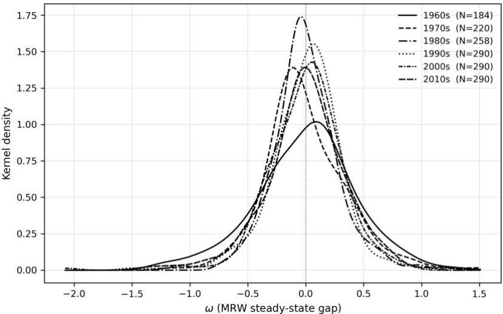  
Note. Five-year panel, 1960s–2010s. MRW steady-state benchmark; y\* denotes the fitted steady-state path.

## B. Baseline Growth Regressions

The central empirical prediction of the model is that economies above their predicted long-run trajectories should subsequently experience weaker growth.

The baseline specification augments the standard convergence regression with the overshooting measure:

$$
\Delta \ln y _ {i, t + T} = \alpha + \beta \ln y _ {i t} + \gamma_ {1} \widehat {\omega} _ {i t} ^ {-} + \gamma_ {2} \widehat {\omega} _ {i t} ^ {+} + X _ {i t} ^ {\prime} \theta + \mu_ {i} + \tau_ {t} + \varepsilon_ {i t},
$$

where

$$
\widehat {\omega} _ {i t} ^ {-} = \min (\widehat {\omega} _ {i t}, 0),
$$

and

$$
\widehat {\omega} _ {i t} ^ {+} = \max (\widehat {\omega} _ {i t}, 0).
$$

The positive- and negative-gap components, and any indicator based on their sign, are left missing whenever the underlying trajectory gap is unavailable. The decomposition allows adjustment dynamics to differ above and below the estimated long-run trajectory. The model predicts

$$
\gamma_ {1} <   0, \gamma_ {2} <   0, | \gamma_ {2} | <   | \gamma_ {1} |.
$$

These are two distinct empirical propositions. A negative coefficient on $\widehat{\omega}^{+}$ establishes adjustment from above, whereas a difference between the coefficients on $\widehat{\omega}^{+}$ and $\widehat{\omega}^{-}$ is required to establish asymmetric adjustment speeds. The first condition implies that economies below their predicted long-run trajectories subsequently grow faster, consistent with conventional convergence dynamics. The second implies that economies above their predicted trajectories also experience slower subsequent growth, although the magnitude and persistence of this asymmetry are empirical questions rather than restrictions imposed on the estimation. The key implication, however, is the asymmetry captured by

## $|\gamma_{2}|<|\gamma_{1}|.$

This condition captures the idea that adjustment from above is more gradual than catch-up from below. Economies below their long-run trajectories can grow rapidly through capital accumulation, structural transformation, and technology adoption. Economies above those trajectories, by contrast, typically adjust more gradually because capital stocks, institutions, and productive structures depreciate slowly. Convergence from above therefore tends to appear not through sudden collapse, but through prolonged periods of weaker relative growth and gradual erosion of earlier expectations about future convergence.

Table I presents the baseline asymmetric mean-reversion regressions. Column (1) reports a conventional beta-convergence specification in which subsequent growth is regressed directly on initial income. As in the standard convergence literature, the coefficient is negative and highly significant, implying that initially richer economies subsequently grow more slowly on average.

Columns (2)-(5) replace the standard specification with the decomposition developed earlier. The overshooting measure is separated into observations below the estimated long-run trajectory $(\omega^{-})$ and above it $(\omega^{+})$ . Column (2) includes only the decomposition terms, while subsequent specifications progressively introduce initial income, standard conditioning variables, and alternative human-capital controls. Across specifications, the coefficients on both $\omega^{-}$ and $\omega^{+}$ remain negative, consistent with adjustment toward estimated long-run trajectories from both below and above. Economies below their predicted trajectories subsequently experience faster growth, while economies above their predicted paths experience weaker subsequent growth.

The coefficient on the positive overshooting term is economically and statistically significant across the baseline specifications. In the preferred five-year specification including initial income, the coefficient on $\omega^{+}$ equals -0.511 with a standard error of 0.184. Quantitatively, a one-standard-deviation increase in positive overshooting predicts approximately 10 log points lower cumulative growth over the subsequent five-year period, equivalent to roughly 2 percentage points lower annual growth. The corresponding coefficient on $\omega^{-}$ equals -0.444 with a standard error of 0.211.

Several implications follow. First, the overshooting measure retains explanatory power even after controlling for standard convergence effects. Initial income alone therefore does not fully characterize subsequent adjustment dynamics. Two economies with similar income levels but different positions relative to their estimated long-run trajectories may subsequently follow different growth paths.

Second, the estimates support mean reversion from both sides of the fitted trajectory, but they do not precisely establish different adjustment speeds above and below it. The formal test does not reject equality of the two coefficients. The main result in Table I is that positive overshooting predicts weaker subsequent growth even after controlling for initial income. The persistence and distributional correlates of this adjustment are examined further below.

Figure 3 provides a visual summary of these dynamics. The horizontal axis measures the overshooting gap, defined as the difference between actual income and the level predicted by the estimated long-run trajectory. Negative values correspond to economies below predicted trajectories, while positive values correspond to economies above them.

Table I. Baseline asymmetric mean-reversion regressions.

<table><tr><td>Variable</td><td>(1) Beta-conv. baseline</td><td>(2) Omega only</td><td>(3) Omega + initial income</td><td>(4) + Init controls</td><td>(5) + ln(h) only</td></tr><tr><td>init_ln_output_pw</td><td>-0.2092***(0.0441)</td><td></td><td>0.3080*(0.1688)</td><td>0.4858(0.4413)</td><td>1.2753**(0.6455)</td></tr><tr><td>omega_negative</td><td></td><td>-0.1336(0.1388)</td><td>-0.4443**(0.2105)</td><td>-0.6126*(0.3590)</td><td>-1.4123**(0.5549)</td></tr><tr><td>omega_positive</td><td></td><td>-0.2060**(0.0821)</td><td>-0.5110***(0.1839)</td><td>-0.6843(0.4681)</td><td>-1.4742**(0.6892)</td></tr><tr><td>init_inv_share</td><td></td><td></td><td></td><td>0.1256(0.1235)</td><td></td></tr><tr><td>init_pop_growth</td><td></td><td></td><td></td><td>-0.8403(1.1214)</td><td></td></tr><tr><td>init_hc</td><td></td><td></td><td></td><td>-0.1337(0.1587)</td><td></td></tr><tr><td>init_ln_hc</td><td></td><td></td><td></td><td></td><td>-0.7197*(0.4338)</td></tr><tr><td>Observations</td><td>1805</td><td>1532</td><td>1532</td><td>1532</td><td>1532</td></tr><tr><td>Countries</td><td>184</td><td>145</td><td>145</td><td>145</td><td>145</td></tr><tr><td>R-squared</td><td>0.103</td><td>0.073</td><td>0.076</td><td>0.084</td><td>0.093</td></tr><tr><td>Country FE</td><td>Yes</td><td>Yes</td><td>Yes</td><td>Yes</td><td>Yes</td></tr><tr><td>Time FE</td><td>Yes</td><td>Yes</td><td>Yes</td><td>Yes</td><td>Yes</td></tr><tr><td>Dep. variable</td><td>growth_5yr_output_pw</td><td>growth_5yr_output_pw</td><td>growth_5yr_output_pw</td><td>growth_5yr_output_pw</td><td>growth_5yr_output_pw</td></tr></table>

Note. Dependent variable: cumulative five-year growth in output per worker. $\omega^{+} = \max(\omega, 0)$ ; $\omega^{-} = \min(\omega, 0)$ . All specifications include country and period fixed effects. Standard errors clustered by country are reported in parentheses. \*, \*\*, \*\*\* denote significance at the 10%, 5%, and 1% levels.

Two features emerge. First, economies below their predicted trajectories subsequently grow more rapidly, consistent with conventional catch-up dynamics. The negative coefficient below the trajectory is consistent with adjustment through capital accumulation, structural transformation, and technology adoption. Second, adjustment above the predicted trajectory is considerably weaker and more gradual. Economies above their estimated long-run paths also experience slower subsequent growth, but the slope is noticeably flatter. Subsequent growth declines monotonically as economies move further above their predicted trajectories, with the strongest slowdown concentrated in the upper tail of the distribution.

The asymmetry is economically intuitive. Economies below long-run trajectories can expand rapidly because gains from adoption and capital deepening are substantial. Economies above those trajectories, by contrast, may adjust more gradually because productive structures, capital stocks, and institutional arrangements depreciate only gradually.

Figure 3. Asymmetric mean reversion in $\omega$  
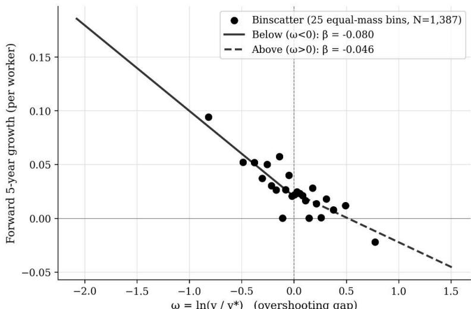  
Note. Subsequent five-year growth as a function of initial overshooting, with separate fits for $\omega > 0$ (above SS) and $\omega < 0$ (below SS).

One concern is that the overshooting measure may partly capture temporary cyclical conditions or short-run external shocks rather than medium-run adjustment dynamics. A country experiencing a temporary boom, favorable terms-of-trade shock, or short-lived credit expansion may appear above its predicted trajectory even if long-run fundamentals remain unchanged. If so, the baseline results could simply reflect short-run mean reversion rather than gradual adjustment toward evolving long-run trajectories. Table II therefore reports forward-growth specifications using longer horizons of subsequent growth. If overshooting primarily captures temporary cyclical fluctuations, its predictive power should dissipate quickly at longer horizons. If, instead, overshooting reflects weaker medium-run trajectories, the relationship should remain visible even when growth is measured over extended forward periods.

Column (1) presents the conventional forward beta-convergence regression, while columns (2)-(4) introduce the overshooting decomposition. The specifications progressively add initial income and standard conditioning variables. Across specifications, the relationship between overshooting and subsequent growth remains negative, although the coefficients become smaller and less precisely estimated at longer horizons.

The longer-horizon specifications preserve the negative sign of the positive-overshooting coefficient, but the estimates are less precise. This pattern is consistent with gradual and heterogeneous adjustment from above, but it also indicates that the strongest evidence comes from the baseline five-year. The forward-growth estimates therefore serve mainly as a check that the baseline result is not confined to very short-run reversals.

Table II. Forward-growth regressions at the ten-year horizon.

<table><tr><td>Variable</td><td>(1) Beta-conv. fwd</td><td>(2) Omega only fwd</td><td>(3) Omega + init inc fwd</td><td>(4) + Init controls fwd</td></tr><tr><td>init_ln_output_pw</td><td>-0.0510***(0.0122)</td><td></td><td>0.0860(0.0843)</td><td>0.1213(0.1424)</td></tr><tr><td>omega_negative</td><td></td><td>-0.0854***(0.0202)</td><td>-0.1722**(0.0875)</td><td>-0.2065(0.1430)</td></tr><tr><td>omega_positive</td><td></td><td>-0.0204(0.0198)</td><td>-0.1054(0.0859)</td><td>-0.1392(0.1388)</td></tr><tr><td>init_inv_share</td><td></td><td></td><td></td><td>0.0077(0.0689)</td></tr><tr><td>init_pop_growth</td><td></td><td></td><td></td><td>0.0295(0.5787)</td></tr><tr><td>init_hc</td><td></td><td></td><td></td><td>-0.0212(0.0379)</td></tr><tr><td>Observations</td><td>1621</td><td>1387</td><td>1387</td><td>1387</td></tr><tr><td>Countries</td><td>184</td><td>145</td><td>145</td><td>145</td></tr><tr><td>R-squared</td><td>0.034</td><td>0.045</td><td>0.046</td><td>0.047</td></tr><tr><td>Country FE</td><td>Yes</td><td>Yes</td><td>Yes</td><td>Yes</td></tr><tr><td>Time FE</td><td>Yes</td><td>Yes</td><td>Yes</td><td>Yes</td></tr><tr><td>Dep. variable</td><td>growth_fwd_output_pw</td><td>growth_fwd_output_pw</td><td>growth_fwd_output_pw</td><td>growth_fwd_output_pw</td></tr></table>

Note. Dependent variable: cumulative log GDP per-capita growth at the indicated horizon. Country and period fixed effects throughout. Standard errors clustered by country in parentheses. \*, \*\*, \*\*\* denote significance at the 10%, 5%, and 1% levels.

## C. Distribution Dynamics and Compression at the Top

The preceding regressions provide evidence that overshooting predicts weaker subsequent growth. This subsection examines whether it also associated with movement within the global income distribution. Following Quah (1993, 1996), countries are assigned to relative-income states based on their position relative to the world frontier. Transition matrices are then estimated separately for economies above and below their predicted trajectories.

Table III turns from growth rates to movements within the world income distribution itself. The table reports five-year transition probabilities across relative-income states. Panel A presents the full-sample transition matrix, while Panels B and C condition separately on economies initially above and below their predicted long-run trajectories. The matrices are descriptive and condition only on the initial relative-income state and the sign of the estimated trajectory gap.

Several features stand out. First, the world income distribution remains highly persistent (see also Imam and Temple, 2025, 2026b). Countries located in the lowest and highest income states exhibit particularly strong persistence over five-year horizons, consistent with earlier findings in the distribution-dynamics literature. Second, mobility dynamics differ systematically depending on whether economies lie above or below their predicted trajectories. Economies below their estimated long-run paths exhibit greater upward mobility within the income distribution. By contrast, economies above predicted trajectories display higher raw probabilities of stagnation and downward transition.

Table III — Panel A. Five-year transition matrix, full sample.

<table><tr><td>State \ State (Full sample)</td><td>Q1 (&lt;20%)</td><td>Q2 (20-40%)</td><td>Q3 (40-60%)</td><td>Q4 (60-80%)</td><td>Q5 (&gt;80%)</td></tr><tr><td>Q1 (&lt;20%)</td><td>0.9339</td><td>0.0647</td><td>0.0014</td><td>0.0</td><td>0.0</td></tr><tr><td>Q2 (20-40%)</td><td>0.079</td><td>0.7793</td><td>0.139</td><td>0.0027</td><td>0.0</td></tr><tr><td>Q3 (40-60%)</td><td>0.0052</td><td>0.1728</td><td>0.6335</td><td>0.1832</td><td>0.0052</td></tr><tr><td>Q4 (60-80%)</td><td>0.0</td><td>0.0066</td><td>0.1325</td><td>0.6026</td><td>0.2583</td></tr><tr><td>Q5 (&gt;80%)</td><td>0.0</td><td>0.005</td><td>0.01</td><td>0.194</td><td>0.791</td></tr></table>

Note. Cells report empirical probabilities of moving from the row relative-income state at t to the column relative-income state at $t + 5$ . Relative-income states are defined by output per worker relative to the contemporaneous frontier. Panels B and C condition on whether $\hat{\omega}_{it} > 0$ or $\hat{\omega}_{it} < 0$ at t.

Table III — Panel B. Five-year transition matrix, initially above the fitted trajectory.

<table><tr><td>State \ State (Above SS)</td><td>Q1 (&lt;20%)</td><td>Q2 (20-40%)</td><td>Q3 (40-60%)</td><td>Q4 (60-80%)</td><td>Q5 (&gt;80%)</td></tr><tr><td>Q1 (&lt;20%)</td><td>0.952</td><td>0.048</td><td>0.0</td><td>0.0</td><td>0.0</td></tr><tr><td>Q2 (20-40%)</td><td>0.1049</td><td>0.7832</td><td>0.1119</td><td>0.0</td><td>0.0</td></tr><tr><td>Q3 (40-60%)</td><td>0.0108</td><td>0.2151</td><td>0.6667</td><td>0.1075</td><td>0.0</td></tr><tr><td>Q4 (60-80%)</td><td>0.0</td><td>0.0</td><td>0.1341</td><td>0.6707</td><td>0.1951</td></tr><tr><td>Q5 (&gt;80%)</td><td>0.0</td><td>0.0086</td><td>0.0</td><td>0.2069</td><td>0.7845</td></tr></table>

Note. Conditional on $\omega > 0$ at $t$ .

Table III — Panel C. Five-year transition matrix, initially below fitted trajectory.

<table><tr><td>State \ State (Below SS)</td><td>Q1 (&lt;20%)</td><td>Q2 (20-40%)</td><td>Q3 (40-60%)</td><td>Q4 (60-80%)</td><td>Q5 (&gt;80%)</td></tr><tr><td>Q1 (&lt;20%)</td><td>0.9371</td><td>0.0629</td><td>0.0</td><td>0.0</td><td>0.0</td></tr><tr><td>Q2 (20-40%)</td><td>0.0533</td><td>0.76</td><td>0.1867</td><td>0.0</td><td>0.0</td></tr><tr><td>Q3 (40-60%)</td><td>0.0</td><td>0.0641</td><td>0.6282</td><td>0.3077</td><td>0.0</td></tr><tr><td>Q4 (60-80%)</td><td>0.0</td><td>0.0</td><td>0.0962</td><td>0.5769</td><td>0.3269</td></tr><tr><td>Q5 (&gt;80%)</td><td>0.0</td><td>0.0</td><td>0.0</td><td>0.0769</td><td>0.9231</td></tr></table>

Note. Conditional on $\omega < 0$ at $t$ .

The contrast is especially pronounced near the top of the distribution. Among economies initially located in the highest relative-income state, countries above their predicted trajectories display a 20.7 percent probability of downward transition into the next income tier, compared with only 7.7 percent among economies below their predicted trajectories. Economies below predicted paths, by contrast, display higher raw probabilities of remaining within the top income state.

The transition matrices therefore suggest that overshooting is associated not only with subsequent growth rates, but also with relative mobility within the evolving world income distribution. Economies above their predicted trajectories appear more vulnerable to downward adjustment, while economies below those trajectories retain stronger upward mobility.

Figure 4 summarizes the same asymmetry visually. Economies below predicted trajectories display higher upward transition probabilities, especially in the middle of the distribution, while economies above predicted trajectories are more likely to remain in place or move downward. The difference is particularly visible near the top, where initially above-trajectory economies are more likely to lose frontier position.

Figure 4. Five-year transition probabilities by overshooting status  
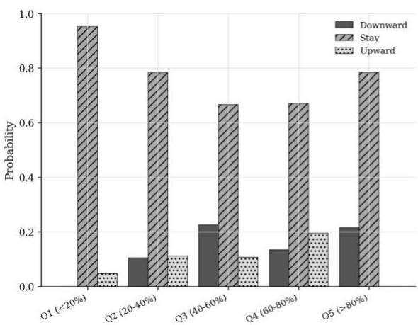

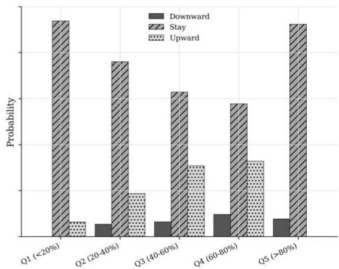  
Note. Five-year transitions between quintiles of the cross-sectional $\omega$ distribution, conditional on the initial sign of $\omega$ .

Consistent with existing evidence, cross-country income dispersion declines over the sample period (see also Imam and Temple, 2026a). Appendix B plots the evolution of dispersion directly. The evidence here suggests, however, that narrowing dispersion alone is not sufficient to identify the underlying source of convergence. The distinction is economically important. A world in which convergence reflects broad upward mobility differs fundamentally from one in which convergence partly reflects prolonged stagnation among economies near the frontier, even if aggregate dispersion narrows in both cases.

Figure 5 decomposes observed convergence into these two components:

$$
\text { Observed   convergence } = \text { Catch - up   from   below } + \text { Compression   from   above. }
$$

The decomposition is an accounting exercise rather than a structural causal decomposition. It allocates the estimated systematic convergence component between the contribution of economies below predicted trajectories and the contribution of economies above predicted trajectories, while reporting the residual separately. The share attributed to compression from above is computed relative to the two systematic convergence components, excluding the residual. It should therefore not be interpreted as the share of the total observed change in cross-country dispersion. The left panel reports the accounting contributions over successive five-year periods, while the right panel plots subsequent growth across deciles of the overshooting distribution.

Again, several features stand out. First, convergence from below remains quantitatively important throughout the sample. Economies substantially below their predicted long-run trajectories subsequently grow more rapidly, contributing to reductions in cross-country dispersion through conventional catch-up dynamics. Second, the point estimates assign a material role to compression from above within the systematic convergence component. Second, compression from above also contributes meaningfully to observed convergence. Economies above their predicted trajectories exhibit persistently weaker subsequent growth, particularly in the upper tail of the overshooting distribution. The right panel illustrates this pattern directly. Mean subsequent growth declines monotonically as economies move from the most below-steady-state deciles toward the most above-steady-state deciles. Economies furthest above their predicted trajectories subsequently experience the weakest growth outcomes.

The left panel shows that these dynamics contribute materially to changes in the overall world income distribution. In this accounting decomposition, compression from above accounts for roughly one-third of the systematic convergence component over the full 1960–2019 sample, although the contribution varies substantially across sub-periods. The role of compression becomes smaller after 1990, as convergence increasingly reflects rapid catch-up among large emerging economies. The decomposition shows why convergence and stagnation can coexist within the same global distribution: dispersion may narrow both because poorer economies rise and because some economies near the top lose relative dynamism.

## Figure 5. Decomposition of observed $\sigma^{2}$ -convergence

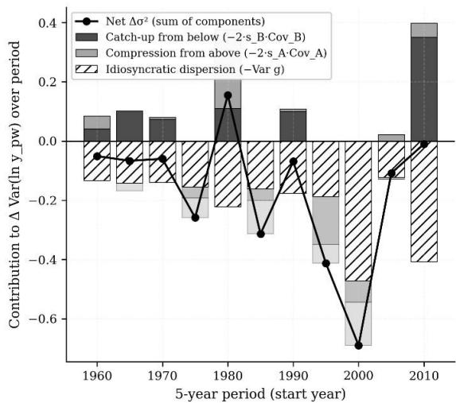

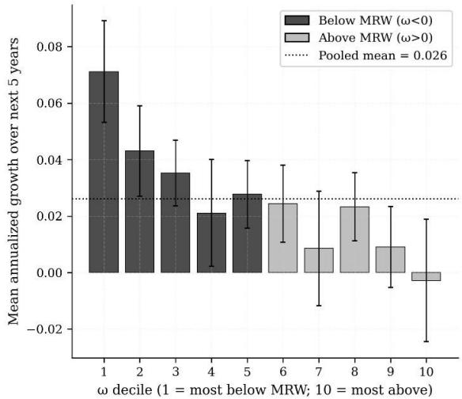  
Note. Decomposition of the change in cross-country variance into compression from above and catch-up from below, 1965–2019.

## D. Fragility, Adjustment, and Downside Risk

The preceding results provide evidence that economies above evolving long-run trajectories subsequently experience weaker growth and greater probability of downward movement within the world income distribution. This subsection provides supporting evidence on downside-adjustment episodes. It is not intended as a crisis-prediction exercise. Instead, it asks whether economies above predicted trajectories are also more likely to experience adverse macroeconomic states associated with downward adjustment.

Table IV reports discrete-time hazard specifications linking positive overshooting to subsequent episodes of stagnation, banking crises, sovereign-debt crises, and loss of frontier position. The specifications progressively introduce initial income and recent growth momentum in order to distinguish the effects of overshooting from conventional convergence dynamics and short-run cyclical conditions.

Table IV. Discrete-time hazard models: positive overshooting and downside-risk episodes.

<table><tr><td>Adverse outcome</td><td>Specification</td><td> $\beta(\omega^{+})$  on log-hazard</td><td>(SE)</td><td>p</td><td>Unconditional event rate</td><td>At-risk observations</td></tr><tr><td>Stagnation</td><td>(1)  $\omega^{+}$  alone</td><td>+0.8750</td><td>(0.3089)</td><td>0.0046</td><td>0.225</td><td>1117</td></tr><tr><td>Stagnation</td><td>(2) + initial income</td><td>+0.4319</td><td>(0.3874)</td><td>0.2649</td><td>0.225</td><td>1117</td></tr><tr><td>Stagnation</td><td>(3) + initial income + growth momentum</td><td>+0.4259</td><td>(0.3853)</td><td>0.2691</td><td>0.225</td><td>1117</td></tr><tr><td>Banking crisis</td><td>(1)  $\omega^{+}$  alone</td><td>+1.5860</td><td>(0.3296)</td><td>0.0000</td><td>0.129</td><td>1110</td></tr><tr><td>Banking crisis</td><td>(2) + initial income</td><td>+1.3807</td><td>(0.4176)</td><td>0.0009</td><td>0.129</td><td>1110</td></tr><tr><td>Banking crisis</td><td>(3) + initial income + growth momentum</td><td>+1.3181</td><td>(0.4343)</td><td>0.0024</td><td>0.129</td><td>1110</td></tr><tr><td>Sovereign-debt crisis</td><td>(1)  $\omega^{+}$  alone</td><td>+0.7417</td><td>(0.5635)</td><td>0.1880</td><td>0.091</td><td>1132</td></tr><tr><td>Sovereign-debt crisis</td><td>(2) + initial income</td><td>+0.8522</td><td>(0.7284)</td><td>0.2420</td><td>0.091</td><td>1132</td></tr><tr><td>Sovereign-debt crisis</td><td>(3) + initial income + growth momentum</td><td>+0.7140</td><td>(0.7916)</td><td>0.3671</td><td>0.091</td><td>1132</td></tr><tr><td>Loss of frontier</td><td>(1)  $\omega^{+}$  alone</td><td>+1.9660</td><td>(0.3673)</td><td>0.0000</td><td>0.345</td><td>1532</td></tr><tr><td>Loss of frontier</td><td>(2) + initial income</td><td>+1.3205</td><td>(0.4261)</td><td>0.0019</td><td>0.345</td><td>1532</td></tr><tr><td>Loss of frontier</td><td>(3) + initial income + growth momentum</td><td>n.c.</td><td>(sep.)</td><td>—</td><td>0.345</td><td>1532</td></tr></table>

Note. Discrete-time complementary-log-log hazard models. Dependent variable is the onset indicator for the indicated episode. All specifications include country and period controls. Standard errors clustered by country in parentheses. \*, \*\*, \*\*\* denote significance at the 10%, 5%, and 1% levels.

Several patterns emerge. The strongest positive associations appear for banking crises and loss-of-frontier episodes. Economies substantially above their predicted long-run trajectories display higher subsequent incidence of banking-sector distress, even after controlling for initial income and prior growth performance. The relationship with loss-of-frontier episodes is similarly strong, indicating that positive overshooting is associated not only with weaker growth, but also with gradual erosion of relative position within the global income distribution.

The results for stagnation are weaker but still informative. Positive overshooting is strongly associated with stagnation in the unconditional specification, although the coefficient becomes less precisely estimated once initial income and recent growth momentum are included. By contrast, the relationship with sovereign-debt crises is not statistically robust across specifications.

Taken together, the hazard results are consistent with the interpretation that positive overshooting is associated with downside-adjustment episodes, especially banking-sector distress and loss of frontier position. The results are weaker for stagnation once controls are added, and they are not robust for sovereign-debt crises. They should therefore be interpreted as supporting evidence, rather than as the central test of the paper.

## E. Robustness and Interpretation

The robustness analysis addresses three concerns. The first is that the overshooting measure may simply capture residual mean reversion. This concern is addressed by controlling directly for initial income, using nonoverlapping five-year periods, and reporting permutation and bootstrap exercises in Appendix B. The second concern is that the results may be driven by special countries or historical episodes. The main findings remain similar when excluding major oil exporters, transition economies, small financial centers, and periods associated with systemic banking crises or large external shocks. The third concern is that the long-run trajectory is generated rather than observed. Bootstrap inference and alternative trajectory specifications help address this issue, although they cannot eliminate it entirely. The out-of-sample exercises should be interpreted as robustness checks on the sign and stability of the relationship, not as evidence that $\omega_{it}$ provides a strong forecasting model.

Several caveats deserve mention. First, the overshooting measure may partly capture omitted fundamentals rather than genuine downward adjustment. Although the empirical specifications control for the principal determinants of long-run productive capacity, some institutional or structural characteristics inevitably remain imperfectly measured. Second, generated-regressor concerns arise because the long-run trajectory is itself estimated rather than directly observed. The bootstrap procedures and alternative specifications help mitigate this issue, though they cannot eliminate it entirely. Third, some episodes of overshooting may reflect temporary commodity booms, financial cycles, demographic surges, or unusually favorable external conditions rather than persistent deterioration in underlying productive capacity. Not all overshooting is economically problematic. In some cases, economies may temporarily exceed underlying trajectories during periods of rapid transitional acceleration before subsequently normalizing. Taken together, these exercises suggest that the baseline results are not driven solely by a narrow set of countries, obvious crisis episodes, or a single construction of the predicted trajectory.

## V. Convergence, Fragility, and Distribution Dynamics

The results point to a more cautious interpretation of convergence. A narrowing world income distribution need not come from a single source. It may reflect catch-up from below, compression near the top, or both. The two mechanisms have different economic meanings: the first reflects rising productive capacity, while the second reflects weakening relative dynamism among economies that previously occupied high positions in the world distribution.

The paper therefore does not reject the traditional convergence literature. Abramovitz (1986) emphasized the importance of “social capability” for catch-up, while Baumol (1986), Barro and Sala-i-Martin (1992), and Mankiw, Romer, and Weil (1992) interpreted the negative relationship between initial income and subsequent growth primarily through transitional dynamics toward steady state. Quah (1993, 1996), Bernard and Durlauf (1996), and Durlauf and Johnson (1995) subsequently showed that convergence is heterogeneous, distributional, and potentially club-specific rather than universal. The results here reinforce that view while adding a further dimension: similar convergence coefficients may arise from different underlying adjustment processes.

This perspective clarifies why sigma convergence alone is insufficient for interpreting development dynamics. Narrowing dispersion may reflect broad-based upward mobility, weakening performance near the frontier, or a combination of the two. The decomposition results in Figure 5 suggest that compression from above accounts for a meaningful share of observed convergence over the full sample period. The important point is not only quantitative. A world in which poorer economies move upward is economically different from one in which dispersion narrows partly because economies near the frontier no longer sustain earlier trajectories of relative advance.

Several mechanisms may contribute to such dynamics. Slower innovation, demographic aging, weaker diffusion, declining industrial dynamism, and premature deindustrialization may each reduce the ability of economies to maintain earlier trajectories of relative growth. Economies may therefore continue growing in absolute terms while losing relative position. Relative decline need not take the form of collapse. It may instead appear as a long sequence of disappointing growth outcomes, weaker relative performance, and downward revisions in estimates of long-run potential.

The policy implication is not that economies above predicted trajectories should accept decline as inevitable. It is that weak growth should be diagnosed differently depending on whether it reflects cyclical slack, temporary adverse shocks, or deterioration in the fundamentals supporting long-run income. This distinction matters for medium-term forecasting, debt sustainability analysis, and the design of structural reforms. Policies suited to temporary demand weakness may do little when the underlying trajectory has shifted; conversely, treating all weak growth as structural decline risks overlooking recoverable slack.

The paper is therefore related to, but distinct from, the literature on convergence clubs and multiple steady states. Durlauf and Johnson (1995), Quah (1996), and Johnson and Papageorgiou (2020, 2024) emphasize that economies may converge toward different long-run equilibria depending on institutions and structural characteristics. The contribution here is different. The paper does not primarily seek to identify convergence clubs or estimate multiple equilibria. Instead, it shows that upward and downward adjustment may coexist within observed convergence itself.

The central implication is conceptual. Standard convergence regressions are usually interpreted as evidence that poorer economies grow faster because they are poor. The results here suggest a more cautious reading. Part of observed convergence may also arise because economies near the frontier fail to sustain earlier trajectories of productivity growth and relative advance. Convergence should therefore be read not simply as evidence of catch-up, but as movement within an evolving world distribution.

## VI. Conclusion

Much of modern growth economics has been organized around a powerful idea: poorer economies can catch up. From postwar Europe to East Asia, the central drama of development has often appeared to be the rise of countries once far from the technological frontier. Yet the world economy has also repeatedly produced another, less comfortable phenomenon. Economies that once seemed securely rich sometimes stop pulling away. Some gradually lose dynamism, some stagnate for decades, and some drift downward within the global income distribution without ever experiencing outright collapse.

This paper argues that these two processes should be studied together. Once long-run trajectories are allowed to evolve over time, observed convergence becomes inherently ambiguous. A negative relationship between initial income and subsequent growth may reflect upward catch-up from below, downward adjustment from above, or both simultaneously. Using cross-country data, the paper constructs empirical proxies for country-specific long-run trajectories and examines whether economies above those trajectories subsequently experience weaker growth and whether their subsequent movements within the world income distribution are consistent with downward adjustment.

Three findings emerge. First, economies above their predicted long-run trajectories subsequently grow more slowly. Second, adjustment from above is slower and more persistent than adjustment from below. Economies rarely become poor suddenly. More often, adjustment appears through prolonged periods of weaker relative growth, declining dynamism, and repeated downward revision in expectations about future convergence. Third, part of measured convergence appears to reflect compression near the top of the world income distribution rather than solely upward mobility among poorer economies. Across the full 1960–2019 sample, the accounting exercise assigns a material role to compression from above within the systematic convergence component, for roughly one-third of observed convergence, although the contribution varies across periods.

The paper does not suggest that catch-up has ceased to matter. The rise of many poorer economies remains one of the defining developments of the modern world economy. Nor does the paper imply that richer economies necessarily experience absolute decline. Economies may continue growing in absolute terms while nevertheless losing relative position within the world distribution.

The contribution is instead interpretive. Standard convergence regressions are usually read as evidence that poorer economies grow faster because they are poor. The results presented here suggest a more cautious interpretation. Some convergence may also arise because economies near the frontier fail to sustain earlier trajectories of productivity growth and relative advance.

More broadly, the paper suggests that convergence should be interpreted less as movement toward fixed equilibria and more as movement within an evolving world distribution. That distinction matters because convergence is not always synonymous with development success. Sometimes it reflects the rise of economies that were once poor. Sometimes it reflects the gradual weakening of economies that were once ahead. The central implication is simple, though somewhat unsettling: a complete account of global development must make room for both.

## References

Abramovitz, Moses. 1986. "Catching Up, Forging Ahead, and Falling Behind." Journal of Economic History 46(2): 385–406.

Barro, Robert J., and Jong-Wha Lee. 2013. "A New Data Set of Educational Attainment in the World, 1950–2010." Journal of Development Economics 104: 184–98.

Barro, Robert J., and Xavier Sala-i-Martin. 1992. "Convergence." Journal of Political Economy 100 (2): 223–51.

Baumol, William J. 1986. "Productivity Growth, Convergence, and Welfare: What the Long-Run Data Show." American Economic Review 76 (5): 1072–85.

Bernard, Andrew B., and Steven N. Durlauf. 1996. “Interpreting Tests of the Convergence Hypothesis.” Journal of Econometrics 71 (1–2): 161–73.

Bolt, Jutta, and Jan Luiten van Zanden. 2020. “Maddison Style Estimates of the Evolution of the World Economy: A New 2020 Update.” Maddison Project Working Paper 15. Groningen: Groningen Growth and Development Centre, University of Groningen.

Durlauf, Steven N., and Paul A. Johnson. 1995. "Multiple Regimes and Cross-Country Growth Behaviour." Journal of Applied Econometrics 10 (4): 365–84.

Durlauf, Steven N., Paul A. Johnson, and Jonathan R. W. Temple. 2005. “Growth Econometrics.” In Handbook of Economic Growth, vol. 1A, edited by Philippe Aghion and Steven N. Durlauf, 555–677. Amsterdam: Elsevier.

Feenstra, Robert C., Robert Inklaar, and Marcel P. Timmer. 2015. "The Next Generation of the Penn World Table." American Economic Review 105 (10): 3150–82.

Fernald, John, Robert Inklaar, and Dimitrije Ruzic. 2025. “The Productivity Slowdown in Advanced Economies: Common Shocks or Common Trends?” Review of Income and Wealth 71 (1): e12690.

Galor, Oded. 2011. Unified Growth Theory. Princeton, NJ: Princeton University Press.

Gordon, Robert J. 2016. The Rise and Fall of American Growth: The U.S. Standard of Living since the Civil War. Princeton, NJ: Princeton University Press.

Haldane, Andrew G. 2017. “Productivity Puzzles.” Speech given at the London School of Economics, March 20. Bank of England.

Hayashi, Fumio, and Edward C. Prescott. 2002. "The 1990s in Japan: A Lost Decade." Review of Economic Dynamics 5 (1): 206–35.

Imam, Patrick A., and Jonathan R. W. Temple. 2025. “Dynamic Development Accounting and Relative Income Traps.” Economic Inquiry 64 (2): 591–613.

Imam, Patrick A., and Jonathan R. W. Temple. 2026a. “At the Threshold: The Increasing Relevance of the Middle-Income Trap”. Scandinavian Journal of Economics https://doi.org/10.1111/sjoe.70036

Imam, Patrick A., and Jonathan R. W. Temple. 2026b. “Growth, Interrupted: How Crises Delay Global Convergence.” Journal of International Money and Finance 163: 103690

Islam, Nazrul. 1995. “Growth Empirics: A Panel Data Approach.” Quarterly Journal of Economics 110 (4): 1127–70.

Johnson, Paul A., and Chris Papageorgiou. 2020. "What Remains of Cross-Country Convergence?" Journal of Economic Literature 58 (1): 129–75.

Johnson, Paul A., Chris Papageorgiou, Maria Grazia Pittau, and Roberto Zelli. 2024. “Lessons from 40 Years of Cross-Country Convergence Empirics.” Prepared for the Oxford Handbook of Income Distribution and Economic Growth.

Jones, Charles I. 2002. “Sources of U.S. Economic Growth in a World of Ideas.” American Economic Review 92 (1): 220–39.

Jones, Charles I., and Paul M. Romer. 2010. “The New Kaldor Facts: Ideas, Institutions, Population, and Human Capital.” American Economic Journal: Macroeconomics 2 (1): 224–45.

Kremer, Michael, Jack Willis, and Yang You. 2021. “Converging to Convergence.” NBER Macroeconomics Annual 36: 337–412.

Mankiw, N. Gregory, David Romer, and David N. Weil. 1992. “A Contribution to the Empirics of Economic Growth.” Quarterly Journal of Economics 107 (2): 407–37.

Mathunjwa, Jochonia S., and Jonathan Temple. 2006. “Convergence Behaviour in Exogenous Growth Models.” Bristol Economics Discussion Papers 06/590. Bristol, UK: School of Economics, University of Bristol.

Müller, Karsten, Chenzi Xu, Mohamed Lehbib, and Ziliang Chen. 2025. “The Global Macro Database: A New International Macroeconomic Dataset.” NBER Working Paper No. 33714. Cambridge, MA: National Bureau of Economic Research.

Patel, Dev, Justin Sandefur, and Arvind Subramanian. 2021. “The New Era of Unconditional Convergence.” Journal of Development Economics 152: 102687.

Pritchett, Lant. 1997. "Divergence, Big Time." Journal of Economic Perspectives 11 (3): 3–17.

Quah, Danny T. 1993. “Galton’s Fallacy and Tests of the Convergence Hypothesis.” Scandinavian Journal of Economics 95 (4): 427–43.

Quah, Danny T. 1996. “Twin Peaks: Growth and Convergence in Models of Distribution Dynamics.” Economic Journal 106 (437): 1045–55.

Rodríguez, Francisco, and Jeffrey D. Sachs. 1999. "Why Do Resource-Abundant Economies Grow More Slowly?" Journal of Economic Growth 4 (3): 277–303.

Rodrik, Dani. 2016. "Premature Deindustrialization." Journal of Economic Growth 21 (1): 1–33.

Solow, Robert M. 1956. "A Contribution to the Theory of Economic Growth." Quarterly Journal of Economics 70(1): 65–94.

Summers, Lawrence H. 2014. “U.S. Economic Prospects: Secular Stagnation, Hysteresis, and the Zero Lower Bound.” Business Economics 49 (2): 65–73.

# Appendix A. Dynamic Convergence with Moving Steady States

This appendix develops a minimal extension of the standard neoclassical growth model in which steady states evolve over time. The framework preserves the familiar mechanics of conditional convergence while introducing a simple but important distinction between two forms of adjustment: convergence from below and convergence from above. The appendix also establishes the link between moving steady states and observed convergence patterns in the cross-country income distribution.

The setup follows the standard neoclassical growth framework, extended to allow time-varying steady states and asymmetric transition dynamics. The central departure from the conventional interpretation is not the existence of convergence itself, but the recognition that economies may enter the above-steady-state region because the steady-state path shifts downward over time.

## A.1 Production, accumulation, and the steady-state path

Consider an economy with aggregate production

$$
Y _ {i t} = K _ {i t} ^ {\alpha} (A _ {i t} L _ {i t}) ^ {1 - \alpha}, 0 <   \alpha <   1,
$$

where $K_{it}$ denotes physical capital, $L_{it}$ labor, and $A_{it}$ labor-augmenting efficiency.

Define capital per effective worker as

$$
k _ {i t} \equiv \frac {K _ {i t}}{A _ {i t} L _ {i t}}.
$$

Output per effective worker is then

$$
\tilde {y} _ {i t} \equiv \frac {Y _ {i t}}{A _ {i t} L _ {i t}} = k _ {i t} ^ {\alpha},
$$

while output per worker is

$$
y _ {i t} \equiv \frac {Y _ {i t}}{L _ {i t}} = A _ {i t} k _ {i t} ^ {\alpha}.
$$

Capital accumulates according to

$$
\dot {K} _ {i t} = s _ {i t} Y _ {i t} - \delta K _ {i t},
$$

where $s_{it}$ is the investment rate and $\delta$ the depreciation rate. Labor and efficiency evolve as

$$
\frac {\dot {L} _ {i t}}{L _ {i t}} = n _ {i t}, \frac {\dot {A} _ {i t}}{A _ {i t}} = g _ {i t}.
$$

The law of motion for capital per effective worker is therefore

$$
\dot {k} _ {i t} = s _ {i t} k _ {i t} ^ {\alpha} - (n _ {i t} + g _ {i t} + \delta) k _ {i t}.
$$

Define the effective dilution term

$$
\phi_ {i t} \equiv n _ {i t} + g _ {i t} + \delta .
$$

Then

$$
\dot {k} _ {i t} = s _ {i t} k _ {i t} ^ {\alpha} - \phi_ {i t} k _ {i t}.
$$

For given $s_{it}$ and $\phi_{it}$ , the steady-state level of capital per effective worker satisfies

$$
s _ {i t} (k _ {i t} ^ {*}) ^ {\alpha} = \phi_ {i t} k _ {i t} ^ {*},
$$

which implies

$$
k _ {i t} ^ {*} = \left(\frac {s _ {i t}}{\phi_ {i t}}\right) ^ {\frac {1}{1 - \alpha}}.
$$

The corresponding balanced-growth level of output per worker is

$$
y _ {i t} ^ {*} = A _ {i t} (k _ {i t} ^ {*}) ^ {\alpha} = A _ {i t} \left(\frac {s _ {i t}}{\phi_ {i t}}\right) ^ {\frac {\alpha}{1 - \alpha}}.
$$

Taking logs,

$$
\ln y _ {i t} ^ {*} = \ln A _ {i t} + \frac {\alpha}{1 - \alpha} \ln s _ {i t} - \frac {\alpha}{1 - \alpha} \ln \phi_ {i t}.
$$

This expression characterizes the conditional steady-state path implied by the model.

## A.2 Moving steady states and overshooting

The standard textbook treatment typically assumes that the determinants of the steady state are constant or evolve smoothly. Here, by contrast, the steady-state path is allowed to vary over time as productivity growth, demographics, investment behavior, or the effectiveness with which economies use existing technologies evolve.

Differentiating the steady-state expression yields

$$
d \ln y _ {i t} ^ {*} = d \ln A _ {i t} + \frac {\alpha}{1 - \alpha} d \ln s _ {i t} - \frac {\alpha}{1 - \alpha} d \ln \phi_ {i t}.
$$

The steady-state path therefore declines whenever

$$
d \ln A _ {i t} + \frac {\alpha}{1 - \alpha} d \ln s _ {i t} <   \frac {\alpha}{1 - \alpha} d \ln \phi_ {i t}.
$$

This condition captures the paper's central mechanism. Long-run potential may fall because productivity growth weakens, investment declines, demographic conditions deteriorate, or the economy becomes less effective at absorbing or diffusing existing technologies.

Define the deviation from the steady-state path as

$$
\omega_ {i t} \equiv \ln y _ {i t} - \ln y _ {i t} ^ {*}.
$$

If

$$
\omega_ {i t} <   0,
$$

the economy lies below its steady-state path. If

$$
\omega_ {i t} > 0,
$$

it lies above it.

The evolution of the overshooting gap satisfies

$$
d \omega_ {i t} = d \ln y _ {i t} - d \ln y _ {i t} ^ {*}.
$$

Hence an economy may enter the above-steady-state region even if actual income remains unchanged:

$$
d \ln y _ {i t} = 0, d \ln y _ {i t} ^ {*} <   0 \Rightarrow d \omega_ {i t} > 0.
$$

This is the first key implication of the model. Economies need not overshoot because they experience exceptional booms. They may overshoot because the benchmark consistent with long-run equilibrium shifts downward. Intuitively, convergence from above is analogous to a gradual downward revision in sustainable income rather than the unwinding of a temporary expansion. The mechanism is therefore distinct from standard boom-bust dynamics.

## A.3 Adjustment dynamics and asymmetry

From the law of motion,

$$
\frac {\dot {k} _ {i t}}{k _ {i t}} = s _ {i t} k _ {i t} ^ {\alpha - 1} - \phi_ {i t}.
$$

Using the steady-state condition

$$
s _ {i t} (k _ {i t} ^ {*}) ^ {\alpha - 1} = \phi_ {i t},
$$

define

$$
z _ {i t} \equiv \frac {k _ {i t}}{k _ {i t} ^ {*}}.
$$

Then the exact adjustment dynamics can be written as

$$
\frac {\dot {k} _ {i t}}{k _ {i t}} = \phi_ {i t} (z _ {i t} ^ {\alpha - 1} - 1).
$$

If $z_{it} < 1$ , then $z_{it}^{\alpha-1} > 1$ , and capital per effective worker grows. If $z_{it} > 1$ , then $z_{it}^{\alpha-1} < 1$ , and capital per effective worker falls relative to its steady-state value.

The model also implies asymmetric adjustment around the steady-state path. Consider equal proportional deviations above and below the steady state, so that $z_{it} = e^{x}$ above and $z_{it} = e^{-x}$ below, with x > 0. Then

$$
\frac {\dot {k} _ {i t}}{k _ {i t}} \vert_ {z _ {i t} = e ^ {- x}} = \phi_ {i t} (e ^ {(1 - \alpha) x} - 1),
$$

while the absolute magnitude of adjustment from above is

$$
- \frac {\dot {k} _ {i t}}{k _ {i t}} | _ {z _ {i t} = e ^ {x}} = \phi_ {i t} (1 - e ^ {- (1 - \alpha) x}).
$$

Since

$$
e ^ {(1 - \alpha) x} - 1 > 1 - e ^ {- (1 - \alpha) x},
$$

adjustment from below is stronger than adjustment from above for equal proportional deviations.

This asymmetry follows directly from diminishing returns. Economies below their steady-state paths benefit from high marginal returns to capital and rapid gains from accumulation and technology adoption. Economies above their steady-state paths adjust more gradually because excess capital depreciates only slowly and resources are reallocated imperfectly over time. The implication is that convergence from above is likely to appear empirically as prolonged stagnation or persistent underperformance rather than abrupt collapse.

## A.4 Convergence regressions and decomposition

A standard convergence regression relates subsequent growth to initial income:

$$
\Delta \ln y _ {i, t + T} = a + b \ln y _ {i t} + \varepsilon_ {i t}.
$$

A negative coefficient $b$ is conventionally interpreted as evidence that poorer economies catch up to richer ones. The model shows why this interpretation is incomplete.

Define

$$
\omega_ {i t} ^ {-} = \min (\omega_ {i t}, 0), \omega_ {i t} ^ {+} = \max (\omega_ {i t}, 0).
$$

The growth process can then be represented as

$$
\Delta \mathrm{ln} y _ {i, t + T} = \beta_ {1} \omega_ {i t} ^ {-} + \beta_ {2} \omega_ {i t} ^ {+} + \varepsilon_ {i t},
$$

with

$$
\beta_ {1} <   0, \beta_ {2} <   0, | \beta_ {1} | > | \beta_ {2} |.
$$

The first term captures convergence from below, while the second captures convergence from above. The observed convergence coefficient in a standard regression therefore combines two distinct forms of adjustment:

$$
b = b ^ {\mathrm{below}} + b ^ {\mathrm{above}}.
$$

This yields the central theoretical implication of the paper.

Convergence from Above vs. Convergence from Below — Conceptual Contrast  
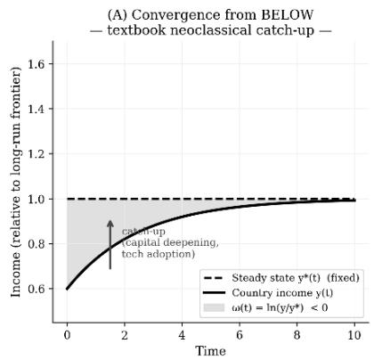

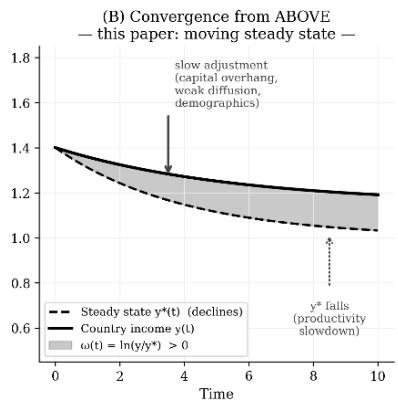

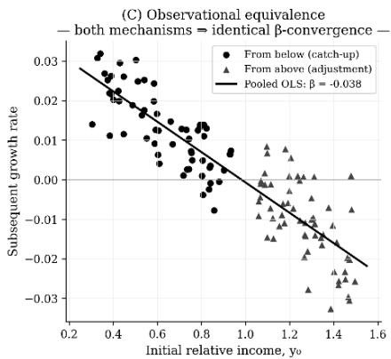

## Proposition

When steady-state paths evolve over time, standard convergence regressions confound two economically distinct mechanisms:

1. upward adjustment toward the steady state from below; and

2. downward adjustment toward the steady state from above.

Observed convergence is therefore not sufficient evidence of broad-based catch-up or development progress.

This distinction is particularly important in periods characterized by declining productivity growth, demographic aging, deindustrialization, or weaker diffusion of existing technologies, all of which may shift steady-state paths downward.

## A.5 Distributional implications

The model also has implications for the evolution of the world income distribution.

Let countries occupy relative-income states

$$
S _ {1}, \dots , S _ {J}.
$$

Transition probabilities depend on the overshooting gap:

$$
P _ {j k} (\omega_ {i t}) = \mathrm{Pr} \big (S _ {i, t + T} = k \mid S _ {i t} = j, \omega_ {i t} \big).
$$

Countries below their steady-state paths should exhibit higher probabilities of upward mobility, while countries above their steady-state paths should display greater probabilities of stagnation or downward transition.

Observed convergence in the cross-country distribution may therefore arise from two distinct sources:

1. upward mobility from below;

2. compression at the top through adjustment from above.

This perspective links the model to the distribution-dynamics literature, which emphasizes the evolution of the full income distribution rather than inference based solely on representative-economy convergence regressions. The key implication is that convergence may coexist with prolonged stagnation among advanced economies. Convergence need not reflect uniformly successful development; it may also reflect downward adjustment among economies whose long-run potential has weakened.

The model yields four empirical predictions.

First, declines in predicted steady-state paths should increase the probability that economies enter the above-steady-state region. Second, countries above their steady-state paths should subsequently experience persistently weaker growth. Third, under the asymmetry conditions derived above, adjustment from above may be slower than adjustment from below. Fourth, observed convergence in the world income distribution may reflect both upward mobility from below and downward adjustment from above. These implications motivate the empirical analysis in the main text.

# Appendix B: Supplementary Empirical Results and Robustness Analysis

Table A1. Summary statistics for the overshooting distribution and core variables.

<table><tr><td>Variable</td><td>N</td><td>Mean</td><td>Std</td><td>P10</td><td>Median</td><td>P90</td></tr><tr><td>Log output per worker (initial)</td><td>1805</td><td>9.957</td><td>1.147</td><td>8.282</td><td>10.086</td><td>11.361</td></tr><tr><td>Annualized five-year log growth in output per worker</td><td>1805</td><td>0.065</td><td>0.246</td><td>-0.168</td><td>0.079</td><td>0.295</td></tr><tr><td>Forward 5-yr growth: output per worker</td><td>1621</td><td>0.027</td><td>0.107</td><td>-0.055</td><td>0.027</td><td>0.123</td></tr><tr><td>Annualized ten-year forward growth in output per worker</td><td>1621</td><td>0.160</td><td>0.386</td><td>-0.238</td><td>0.177</td><td>0.562</td></tr><tr><td>Omega (MRW gap = residual from SS regression)</td><td>1532</td><td>0.000</td><td>0.334</td><td>-0.387</td><td>0.004</td><td>0.378</td></tr><tr><td>Omega+ (above the fitted trajectory component)</td><td>1532</td><td>0.123</td><td>0.196</td><td>0.000</td><td>0.004</td><td>0.378</td></tr><tr><td>Omega- (below the fitted trajectory)</td><td>1532</td><td>-0.123</td><td>0.208</td><td>-0.387</td><td>0.000</td><td>0.000</td></tr><tr><td>Above fitted-trajectory indicator ( $\hat{\omega} > 0$ )</td><td>2220</td><td>0.349</td><td>0.477</td><td>0.000</td><td>0.000</td><td>1.000</td></tr><tr><td>Investment share (initial, period avg)</td><td>1962</td><td>0.214</td><td>0.114</td><td>0.080</td><td>0.201</td><td>0.355</td></tr><tr><td>Population growth rate (initial)</td><td>1960</td><td>0.018</td><td>0.014</td><td>0.001</td><td>0.019</td><td>0.034</td></tr><tr><td>Human capital index (initial)</td><td>1601</td><td>2.076</td><td>0.725</td><td>1.162</td><td>1.982</td><td>3.118</td></tr><tr><td>Relative income: output/wkr vs US</td><td>1805</td><td>0.394</td><td>0.551</td><td>0.044</td><td>0.256</td><td>0.834</td></tr><tr><td>Log gap to US frontier</td><td>1805</td><td>-1.495</td><td>1.112</td><td>-3.135</td><td>-1.363</td><td>-0.182</td></tr><tr><td>Above US indicator</td><td>2220</td><td>0.039</td><td>0.193</td><td>0.000</td><td>0.000</td><td>0.000</td></tr></table>

Note. Pooled five-year panel, 1960–2019. Derived gap indicators and positive- and negative-gap components are left missing whenever the underlying trajectory gap is unavailable. Consequently, their number of observations cannot exceed the number of nonmissing observations for $\hat{\omega}$ .

Table A2. Country-level (and region) analytical coverage and trajectory-gap statistics.

<table><tr><td>Country code</td><td>Country</td><td>First period</td><td>Last period</td><td>Periods (N)</td><td>Mean ω</td><td>SD ω</td><td>Periods ω&gt;0</td><td>Ever ω≥0.5</td></tr><tr><td>ABW</td><td>Aruba</td><td>1960</td><td>2015</td><td>12</td><td>—</td><td>—</td><td>0</td><td>no</td></tr><tr><td>AGO</td><td>Angola</td><td>1960</td><td>2015</td><td>12</td><td>0.0000</td><td>0.3374</td><td>5</td><td>no</td></tr><tr><td>AIA</td><td>Anguilla</td><td>1960</td><td>2015</td><td>12</td><td>—</td><td>—</td><td>0</td><td>no</td></tr><tr><td>ALB</td><td>Albania</td><td>1960</td><td>2015</td><td>12</td><td>0.0000</td><td>0.2673</td><td>4</td><td>no</td></tr><tr><td>ARE</td><td>United Arab Emirates</td><td>1960</td><td>2015</td><td>12</td><td>0.0000</td><td>0.8497</td><td>5</td><td>yes</td></tr><tr><td>ARG</td><td>Argentina</td><td>1960</td><td>2015</td><td>12</td><td>+0.0000</td><td>0.3831</td><td>5</td><td>yes</td></tr><tr><td>ARM</td><td>Armenia</td><td>1960</td><td>2015</td><td>12</td><td>+0.0000</td><td>0.4144</td><td>4</td><td>no</td></tr><tr><td>ATG</td><td>Antigua and Barbuda</td><td>1960</td><td>2015</td><td>12</td><td>—</td><td>—</td><td>0</td><td>no</td></tr><tr><td>AUS</td><td>Australia</td><td>1960</td><td>2015</td><td>12</td><td>+0.0000</td><td>0.0955</td><td>5</td><td>no</td></tr><tr><td>AUT</td><td>Austria</td><td>1960</td><td>2015</td><td>12</td><td>+0.0000</td><td>0.2462</td><td>6</td><td>no</td></tr><tr><td>AZE</td><td>Azerbaijan</td><td>1960</td><td>2015</td><td>12</td><td>—</td><td>—</td><td>0</td><td>no</td></tr><tr><td>BDI</td><td>Burundi</td><td>1960</td><td>2015</td><td>12</td><td>+0.0000</td><td>0.2975</td><td>4</td><td>no</td></tr><tr><td>BEL</td><td>Belgium</td><td>1960</td><td>2015</td><td>12</td><td>-0.0000</td><td>0.1742</td><td>7</td><td>no</td></tr><tr><td>BEN</td><td>Benin</td><td>1960</td><td>2015</td><td>12</td><td>+0.0000</td><td>0.2328</td><td>4</td><td>no</td></tr><tr><td>BFA</td><td>Burkina Faso</td><td>1960</td><td>2015</td><td>12</td><td>+0.0000</td><td>0.1176</td><td>6</td><td>no</td></tr><tr><td>BGD</td><td>Bangladesh</td><td>1960</td><td>2015</td><td>12</td><td>+0.0000</td><td>0.3100</td><td>4</td><td>yes</td></tr><tr><td>BGR</td><td>Bulgaria</td><td>1960</td><td>2015</td><td>12</td><td>+0.0000</td><td>0.2648</td><td>7</td><td>no</td></tr><tr><td>BHR</td><td>Bahrain</td><td>1960</td><td>2015</td><td>12</td><td>-0.0000</td><td>0.3937</td><td>6</td><td>yes</td></tr><tr><td>BHS</td><td>Bahamas</td><td>1960</td><td>2015</td><td>12</td><td>—</td><td>—</td><td>0</td><td>no</td></tr><tr><td>BIH</td><td>Bosnia and Herzegovina</td><td>1960</td><td>2015</td><td>12</td><td>—</td><td>—</td><td>0</td><td>no</td></tr><tr><td>BLR</td><td>Belarus</td><td>1960</td><td>2015</td><td>12</td><td>—</td><td>—</td><td>0</td><td>no</td></tr><tr><td>BLZ</td><td>Belize</td><td>1960</td><td>2015</td><td>12</td><td>+0.0000</td><td>0.2396</td><td>4</td><td>no</td></tr><tr><td>BMU</td><td>Bermuda</td><td>1960</td><td>2015</td><td>12</td><td>—</td><td>—</td><td>0</td><td>no</td></tr><tr><td>BOL</td><td>Bolivia (Plurinational State of)</td><td>1960</td><td>2015</td><td>12</td><td>+0.0000</td><td>0.1316</td><td>7</td><td>no</td></tr><tr><td>BRA</td><td>Brazil</td><td>1960</td><td>2015</td><td>12</td><td>+0.0000</td><td>0.1369</td><td>4</td><td>no</td></tr><tr><td>BRB</td><td>Barbados</td><td>1960</td><td>2015</td><td>12</td><td>+0.0000</td><td>0.3740</td><td>7</td><td>no</td></tr><tr><td>BRN</td><td>Brunei Darussalam</td><td>1960</td><td>2015</td><td>12</td><td>+0.0000</td><td>0.3909</td><td>3</td><td>yes</td></tr><tr><td>BTN</td><td>Bhutan</td><td>1960</td><td>2015</td><td>12</td><td>—</td><td>—</td><td>0</td><td>no</td></tr><tr><td>BWA</td><td>Botswana</td><td>1960</td><td>2015</td><td>12</td><td>-0.0000</td><td>0.8247</td><td>7</td><td>yes</td></tr><tr><td>CAF</td><td>Central African Republic</td><td>1960</td><td>2015</td><td>12</td><td>+0.0000</td><td>0.3252</td><td>4</td><td>no</td></tr><tr><td>CAN</td><td>Canada</td><td>1960</td><td>2015</td><td>12</td><td>-0.0000</td><td>0.0975</td><td>8</td><td>no</td></tr><tr><td>CHE</td><td>Switzerland</td><td>1960</td><td>2015</td><td>12</td><td>+0.0000</td><td>0.0380</td><td>5</td><td>no</td></tr><tr><td>CHL</td><td>Chile</td><td>1960</td><td>2015</td><td>12</td><td>+0.0000</td><td>0.1482</td><td>6</td><td>no</td></tr><tr><td>CHN</td><td>China</td><td>1960</td><td>2015</td><td>12</td><td>+0.0000</td><td>0.7219</td><td>5</td><td>yes</td></tr><tr><td>CIV</td><td>Côte d'Ivoire</td><td>1960</td><td>2015</td><td>12</td><td>-0.0000</td><td>0.2773</td><td>7</td><td>no</td></tr><tr><td>CMR</td><td>Cameroon</td><td>1960</td><td>2015</td><td>12</td><td>+0.0000</td><td>0.1929</td><td>7</td><td>no</td></tr><tr><td>COD</td><td>D.R. of the Congo</td><td>1960</td><td>2015</td><td>12</td><td>-0.0000</td><td>0.8951</td><td>7</td><td>yes</td></tr><tr><td>COG</td><td>Congo</td><td>1960</td><td>2015</td><td>12</td><td>-0.0000</td><td>0.3047</td><td>7</td><td>yes</td></tr><tr><td>COL</td><td>Colombia</td><td>1960</td><td>2015</td><td>12</td><td>-0.0000</td><td>0.1754</td><td>8</td><td>no</td></tr><tr><td>COM</td><td>Comoros</td><td>1960</td><td>2015</td><td>12</td><td>—</td><td>—</td><td>0</td><td>no</td></tr><tr><td>CPV</td><td>Cabo Verde</td><td>1960</td><td>2015</td><td>12</td><td>—</td><td>—</td><td>0</td><td>no</td></tr><tr><td>CRI</td><td>Costa Rica</td><td>1960</td><td>2015</td><td>12</td><td>+0.0000</td><td>0.1746</td><td>5</td><td>no</td></tr><tr><td>CUW</td><td>Curaçao</td><td>1960</td><td>2015</td><td>12</td><td>—</td><td>—</td><td>0</td><td>no</td></tr><tr><td>CYM</td><td>Cayman Islands</td><td>1960</td><td>2015</td><td>12</td><td>—</td><td>—</td><td>0</td><td>no</td></tr><tr><td>CYP</td><td>Cyprus</td><td>1960</td><td>2015</td><td>12</td><td>+0.0000</td><td>0.2607</td><td>7</td><td>no</td></tr><tr><td>CZE</td><td>Czechia</td><td>1960</td><td>2015</td><td>12</td><td>+0.0000</td><td>0.0752</td><td>3</td><td>no</td></tr><tr><td>DEU</td><td>Germany</td><td>1960</td><td>2015</td><td>12</td><td>+0.0000</td><td>0.2402</td><td>6</td><td>no</td></tr><tr><td>DJI</td><td>Djibouti</td><td>1960</td><td>2015</td><td>12</td><td>—</td><td>—</td><td>0</td><td>no</td></tr><tr><td>DMA</td><td>Dominica</td><td>1960</td><td>2015</td><td>12</td><td>—</td><td>—</td><td>0</td><td>no</td></tr><tr><td>DNK</td><td>Denmark</td><td>1960</td><td>2015</td><td>12</td><td>+0.0000</td><td>0.1308</td><td>6</td><td>no</td></tr><tr><td>DOM</td><td>Dominican Republic</td><td>1960</td><td>2015</td><td>12</td><td>-0.0000</td><td>0.1436</td><td>7</td><td>no</td></tr><tr><td>DZA</td><td>Algeria</td><td>1960</td><td>2015</td><td>12</td><td>+0.0000</td><td>0.4760</td><td>6</td><td>yes</td></tr><tr><td>ECU</td><td>Ecuador</td><td>1960</td><td>2015</td><td>12</td><td>-0.0000</td><td>0.5061</td><td>6</td><td>yes</td></tr><tr><td>EGY</td><td>Egypt</td><td>1960</td><td>2015</td><td>12</td><td>+0.0000</td><td>0.3594</td><td>5</td><td>yes</td></tr><tr><td>ESP</td><td>Spain</td><td>1960</td><td>2015</td><td>12</td><td>+0.0000</td><td>0.2454</td><td>8</td><td>no</td></tr><tr><td>EST</td><td>Estonia</td><td>1960</td><td>2015</td><td>12</td><td>+0.0000</td><td>0.1592</td><td>3</td><td>no</td></tr><tr><td>ETH</td><td>Ethiopia</td><td>1960</td><td>2015</td><td>12</td><td>-0.0000</td><td>0.2008</td><td>7</td><td>no</td></tr><tr><td>FIN</td><td>Finland</td><td>1960</td><td>2015</td><td>12</td><td>-0.0000</td><td>0.2615</td><td>6</td><td>no</td></tr><tr><td>FJI</td><td>Fiji</td><td>1960</td><td>2015</td><td>12</td><td>+0.0000</td><td>0.2022</td><td>4</td><td>no</td></tr><tr><td>FRA</td><td>France</td><td>1960</td><td>2015</td><td>12</td><td>-0.0000</td><td>0.1539</td><td>6</td><td>no</td></tr><tr><td>GAB</td><td>Gabon</td><td>1960</td><td>2015</td><td>12</td><td>-0.0000</td><td>0.2392</td><td>6</td><td>no</td></tr><tr><td>GBR</td><td>United Kingdom</td><td>1960</td><td>2015</td><td>12</td><td>0.0000</td><td>0.1836</td><td>4</td><td>no</td></tr><tr><td>GEO</td><td>Georgia</td><td>1960</td><td>2015</td><td>12</td><td>—</td><td>—</td><td>0</td><td>no</td></tr><tr><td>GHA</td><td>Ghana</td><td>1960</td><td>2015</td><td>12</td><td>-0.0000</td><td>0.5058</td><td>4</td><td>yes</td></tr><tr><td>GIN</td><td>Guinea</td><td>1960</td><td>2015</td><td>12</td><td>—</td><td>—</td><td>0</td><td>no</td></tr><tr><td>GMB</td><td>Gambia</td><td>1960</td><td>2015</td><td>12</td><td>+0.0000</td><td>0.2156</td><td>6</td><td>no</td></tr><tr><td>GNB</td><td>Guinea-Bissau</td><td>1960</td><td>2015</td><td>12</td><td>—</td><td>—</td><td>0</td><td>no</td></tr><tr><td>GNQ</td><td>Equatorial Guinea</td><td>1960</td><td>2015</td><td>12</td><td>—</td><td>—</td><td>0</td><td>no</td></tr><tr><td>GRC</td><td>Greece</td><td>1960</td><td>2015</td><td>12</td><td>-0.0000</td><td>0.2671</td><td>7</td><td>no</td></tr><tr><td>GRD</td><td>Grenada</td><td>1960</td><td>2015</td><td>12</td><td>—</td><td>—</td><td>0</td><td>no</td></tr><tr><td>GTM</td><td>Guatemala</td><td>1960</td><td>2015</td><td>12</td><td>-0.0000</td><td>0.0553</td><td>6</td><td>no</td></tr><tr><td>GUY</td><td>Guyana</td><td>1960</td><td>2015</td><td>12</td><td>+0.0000</td><td>0.2626</td><td>4</td><td>no</td></tr><tr><td>HKG</td><td>China, Hong Kong SAR</td><td>1960</td><td>2015</td><td>12</td><td>-0.0000</td><td>0.3638</td><td>6</td><td>yes</td></tr><tr><td>HND</td><td>Honduras</td><td>1960</td><td>2015</td><td>12</td><td>+0.0000</td><td>0.1930</td><td>6</td><td>no</td></tr><tr><td>HRV</td><td>Croatia</td><td>1960</td><td>2015</td><td>12</td><td>-0.0000</td><td>0.0724</td><td>3</td><td>no</td></tr><tr><td>HTI</td><td>Haiti</td><td>1960</td><td>2015</td><td>12</td><td>-0.0000</td><td>0.2035</td><td>5</td><td>no</td></tr><tr><td>HUN</td><td>Hungary</td><td>1960</td><td>2015</td><td>12</td><td>+0.0000</td><td>0.3797</td><td>6</td><td>no</td></tr><tr><td>IDN</td><td>Indonesia</td><td>1960</td><td>2015</td><td>12</td><td>+0.0000</td><td>0.2134</td><td>4</td><td>no</td></tr><tr><td>IND</td><td>India</td><td>1960</td><td>2015</td><td>12</td><td>-0.0000</td><td>0.2635</td><td>7</td><td>yes</td></tr><tr><td>IRL</td><td>Ireland</td><td>1960</td><td>2015</td><td>12</td><td>+0.0000</td><td>0.5122</td><td>6</td><td>yes</td></tr><tr><td>IRN</td><td>Iran (Islamic Republic of)</td><td>1960</td><td>2015</td><td>12</td><td>0.0000</td><td>0.3609</td><td>7</td><td>no</td></tr><tr><td>IRQ</td><td>Iraq</td><td>1960</td><td>2015</td><td>12</td><td>+0.0000</td><td>0.3831</td><td>6</td><td>yes</td></tr><tr><td>ISL</td><td>Iceland</td><td>1960</td><td>2015</td><td>12</td><td>-0.0000</td><td>0.0946</td><td>6</td><td>no</td></tr><tr><td>ISR</td><td>Israel</td><td>1960</td><td>2015</td><td>12</td><td>+0.0000</td><td>0.1507</td><td>6</td><td>no</td></tr><tr><td>ITA</td><td>Italy</td><td>1960</td><td>2015</td><td>12</td><td>+0.0000</td><td>0.2734</td><td>7</td><td>no</td></tr><tr><td>JAM</td><td>Jamaica</td><td>1960</td><td>2015</td><td>12</td><td>-0.0000</td><td>0.3328</td><td>4</td><td>no</td></tr><tr><td>JOR</td><td>Jordan</td><td>1960</td><td>2015</td><td>12</td><td>+0.0000</td><td>0.3896</td><td>6</td><td>yes</td></tr><tr><td>JPN</td><td>Japan</td><td>1960</td><td>2015</td><td>12</td><td>+0.0000</td><td>0.4241</td><td>6</td><td>no</td></tr><tr><td>KAZ</td><td>Kazakhstan</td><td>1960</td><td>2015</td><td>12</td><td>+0.0000</td><td>0.3212</td><td>3</td><td>no</td></tr><tr><td>KEN</td><td>Kenya</td><td>1960</td><td>2015</td><td>12</td><td>-0.0000</td><td>0.2445</td><td>7</td><td>no</td></tr><tr><td>KGZ</td><td>Kyrgyzstan</td><td>1960</td><td>2015</td><td>12</td><td>+0.0000</td><td>0.5535</td><td>2</td><td>yes</td></tr><tr><td>KHM</td><td>Cambodia</td><td>1960</td><td>2015</td><td>12</td><td>-0.0000</td><td>0.2978</td><td>4</td><td>no</td></tr><tr><td>KNA</td><td>Saint Kitts and Nevis</td><td>1960</td><td>2015</td><td>12</td><td>—</td><td>—</td><td>0</td><td>no</td></tr><tr><td>KOR</td><td>Republic of Korea</td><td>1960</td><td>2015</td><td>12</td><td>+0.0000</td><td>0.7046</td><td>6</td><td>yes</td></tr><tr><td>KWT</td><td>Kuwait</td><td>1960</td><td>2015</td><td>12</td><td>-0.0000</td><td>0.7017</td><td>3</td><td>yes</td></tr><tr><td>LAO</td><td>Lao People's DR</td><td>1960</td><td>2015</td><td>12</td><td>+0.0000</td><td>0.3974</td><td>4</td><td>yes</td></tr><tr><td>LBN</td><td>Lebanon</td><td>1960</td><td>2015</td><td>12</td><td>—</td><td>—</td><td>0</td><td>no</td></tr><tr><td>LBR</td><td>Liberia</td><td>1960</td><td>2015</td><td>12</td><td>+0.0000</td><td>0.6674</td><td>4</td><td>yes</td></tr><tr><td>LCA</td><td>Saint Lucia</td><td>1960</td><td>2015</td><td>12</td><td>—</td><td>—</td><td>0</td><td>no</td></tr><tr><td>LKA</td><td>Sri Lanka</td><td>1960</td><td>2015</td><td>12</td><td>+0.0000</td><td>0.2514</td><td>6</td><td>no</td></tr><tr><td>LSO</td><td>Lesotho</td><td>1960</td><td>2015</td><td>12</td><td>0.0000</td><td>0.2122</td><td>4</td><td>no</td></tr><tr><td>LTU</td><td>Lithuania</td><td>1960</td><td>2015</td><td>12</td><td>+0.0000</td><td>0.1368</td><td>4</td><td>no</td></tr><tr><td>LUX</td><td>Luxembourg</td><td>1960</td><td>2015</td><td>12</td><td>-0.0000</td><td>0.1663</td><td>5</td><td>no</td></tr><tr><td>LVA</td><td>Latvia</td><td>1960</td><td>2015</td><td>12</td><td>-0.0000</td><td>0.1200</td><td>2</td><td>no</td></tr><tr><td>MAC</td><td>China, Macao SAR</td><td>1960</td><td>2015</td><td>12</td><td>+0.0000</td><td>0.4198</td><td>5</td><td>yes</td></tr><tr><td>MAR</td><td>Morocco</td><td>1960</td><td>2015</td><td>12</td><td>+0.0000</td><td>0.1709</td><td>7</td><td>no</td></tr><tr><td>MDA</td><td>Republic of Moldova</td><td>1960</td><td>2015</td><td>12</td><td>+0.0000</td><td>0.3169</td><td>3</td><td>no</td></tr><tr><td>MDG</td><td>Madagascar</td><td>1960</td><td>2015</td><td>12</td><td>+0.0000</td><td>0.3934</td><td>7</td><td>yes</td></tr><tr><td>MDV</td><td>Maldives</td><td>1960</td><td>2015</td><td>12</td><td>+0.0000</td><td>0.2988</td><td>4</td><td>no</td></tr><tr><td>MEX</td><td>Mexico</td><td>1960</td><td>2015</td><td>12</td><td>-0.0000</td><td>0.2766</td><td>6</td><td>no</td></tr><tr><td>MKD</td><td>North Macedonia</td><td>1960</td><td>2015</td><td>12</td><td>—</td><td>—</td><td>0</td><td>no</td></tr><tr><td>MLI</td><td>Mali</td><td>1960</td><td>2015</td><td>12</td><td>+0.0000</td><td>0.2506</td><td>7</td><td>no</td></tr><tr><td>MLT</td><td>Malta</td><td>1960</td><td>2015</td><td>12</td><td>-0.0000</td><td>0.5671</td><td>8</td><td>yes</td></tr><tr><td>MMR</td><td>Myanmar</td><td>1960</td><td>2015</td><td>12</td><td>-0.0000</td><td>0.3427</td><td>5</td><td>yes</td></tr><tr><td>MNE</td><td>Montenegro</td><td>1960</td><td>2015</td><td>12</td><td>—</td><td>—</td><td>0</td><td>no</td></tr><tr><td>MNG</td><td>Mongolia</td><td>1960</td><td>2015</td><td>12</td><td>+0.0000</td><td>0.3128</td><td>4</td><td>no</td></tr><tr><td>MOZ</td><td>Mozambique</td><td>1960</td><td>2015</td><td>12</td><td>-0.0000</td><td>0.2726</td><td>6</td><td>no</td></tr><tr><td>MRT</td><td>Mauritania</td><td>1960</td><td>2015</td><td>12</td><td>-0.0000</td><td>0.2119</td><td>4</td><td>no</td></tr><tr><td>MSR</td><td>Montserrat</td><td>1960</td><td>2015</td><td>12</td><td>—</td><td>—</td><td>0</td><td>no</td></tr><tr><td>MUS</td><td>Mauritius</td><td>1960</td><td>2015</td><td>12</td><td>0.0000</td><td>0.1598</td><td>6</td><td>no</td></tr><tr><td>MWI</td><td>Malawi</td><td>1960</td><td>2015</td><td>12</td><td>-0.0000</td><td>0.2479</td><td>6</td><td>no</td></tr><tr><td>MYS</td><td>Malaysia</td><td>1960</td><td>2015</td><td>12</td><td>-0.0000</td><td>0.2127</td><td>5</td><td>no</td></tr><tr><td>NAM</td><td>Namibia</td><td>1960</td><td>2015</td><td>12</td><td>-0.0000</td><td>0.1138</td><td>7</td><td>no</td></tr><tr><td>NER</td><td>Niger</td><td>1960</td><td>2015</td><td>12</td><td>-0.0000</td><td>0.4993</td><td>5</td><td>yes</td></tr><tr><td>NGA</td><td>Nigeria</td><td>1960</td><td>2015</td><td>12</td><td>-0.0000</td><td>0.6749</td><td>9</td><td>yes</td></tr><tr><td>NIC</td><td>Nicaragua</td><td>1960</td><td>2015</td><td>12</td><td>+0.0000</td><td>0.4520</td><td>4</td><td>yes</td></tr><tr><td>NLD</td><td>Netherlands</td><td>1960</td><td>2015</td><td>12</td><td>-0.0000</td><td>0.1215</td><td>6</td><td>no</td></tr><tr><td>NOR</td><td>Norway</td><td>1960</td><td>2015</td><td>12</td><td>-0.0000</td><td>0.3421</td><td>5</td><td>yes</td></tr><tr><td>NPL</td><td>Nepal</td><td>1960</td><td>2015</td><td>12</td><td>+0.0000</td><td>0.1649</td><td>4</td><td>no</td></tr><tr><td>NZL</td><td>New Zealand</td><td>1960</td><td>2015</td><td>12</td><td>+0.0000</td><td>0.1418</td><td>6</td><td>no</td></tr><tr><td>OMN</td><td>Oman</td><td>1960</td><td>2015</td><td>12</td><td>—</td><td>—</td><td>0</td><td>no</td></tr><tr><td>PAK</td><td>Pakistan</td><td>1960</td><td>2015</td><td>12</td><td>-0.0000</td><td>0.1489</td><td>7</td><td>no</td></tr><tr><td>PAN</td><td>Panama</td><td>1960</td><td>2015</td><td>12</td><td>+0.0000</td><td>0.1087</td><td>3</td><td>no</td></tr><tr><td>PER</td><td>Peru</td><td>1960</td><td>2015</td><td>12</td><td>+0.0000</td><td>0.2362</td><td>5</td><td>no</td></tr><tr><td>PHL</td><td>Philippines</td><td>1960</td><td>2015</td><td>12</td><td>-0.0000</td><td>0.1161</td><td>6</td><td>no</td></tr><tr><td>POL</td><td>Poland</td><td>1960</td><td>2015</td><td>12</td><td>+0.0000</td><td>0.3793</td><td>5</td><td>no</td></tr><tr><td>PRT</td><td>Portugal</td><td>1960</td><td>2015</td><td>12</td><td>0.0000</td><td>0.1850</td><td>6</td><td>no</td></tr><tr><td>PRY</td><td>Paraguay</td><td>1960</td><td>2015</td><td>12</td><td>+0.0000</td><td>0.1823</td><td>5</td><td>no</td></tr><tr><td>PSE</td><td>State of Palestine</td><td>1960</td><td>2015</td><td>12</td><td>—</td><td>—</td><td>0</td><td>no</td></tr><tr><td>QAT</td><td>Qatar</td><td>1960</td><td>2015</td><td>12</td><td>-0.0000</td><td>0.5545</td><td>4</td><td>yes</td></tr><tr><td>ROU</td><td>Romania</td><td>1960</td><td>2015</td><td>12</td><td>-0.0000</td><td>0.5251</td><td>8</td><td>yes</td></tr><tr><td>RUS</td><td>Russian Federation</td><td>1960</td><td>2015</td><td>12</td><td>-0.0000</td><td>0.2035</td><td>3</td><td>no</td></tr><tr><td>RWA</td><td>Rwanda</td><td>1960</td><td>2015</td><td>12</td><td>-0.0000</td><td>0.2050</td><td>7</td><td>no</td></tr><tr><td>SAU</td><td>Saudi Arabia</td><td>1960</td><td>2015</td><td>12</td><td>+0.0000</td><td>0.5279</td><td>3</td><td>yes</td></tr><tr><td>SDN</td><td>Sudan</td><td>1960</td><td>2015</td><td>12</td><td>-0.0000</td><td>0.2700</td><td>2</td><td>yes</td></tr><tr><td>SEN</td><td>Senegal</td><td>1960</td><td>2015</td><td>12</td><td>+0.0000</td><td>0.4723</td><td>5</td><td>yes</td></tr><tr><td>SGP</td><td>Singapore</td><td>1960</td><td>2015</td><td>12</td><td>+0.0000</td><td>0.4317</td><td>7</td><td>yes</td></tr><tr><td>SLE</td><td>Sierra Leone</td><td>1960</td><td>2015</td><td>12</td><td>-0.0000</td><td>0.3686</td><td>4</td><td>yes</td></tr><tr><td>SLV</td><td>El Salvador</td><td>1960</td><td>2015</td><td>12</td><td>+0.0000</td><td>0.0716</td><td>4</td><td>no</td></tr><tr><td>SOM</td><td>Somalia</td><td>1960</td><td>2015</td><td>12</td><td>—</td><td>—</td><td>0</td><td>no</td></tr><tr><td>SRB</td><td>Serbia</td><td>1960</td><td>2015</td><td>12</td><td>+0.0000</td><td>0.2525</td><td>4</td><td>no</td></tr><tr><td>SSD</td><td>South Sudan</td><td>1960</td><td>2015</td><td>12</td><td>—</td><td>—</td><td>0</td><td>no</td></tr><tr><td>STP</td><td>Sao Tome and Principe</td><td>1960</td><td>2015</td><td>12</td><td>—</td><td>—</td><td>0</td><td>no</td></tr><tr><td>SUR</td><td>Suriname</td><td>1960</td><td>2015</td><td>12</td><td>—</td><td>—</td><td>0</td><td>no</td></tr><tr><td>SVK</td><td>Slovakia</td><td>1960</td><td>2015</td><td>12</td><td>+0.0000</td><td>0.0479</td><td>3</td><td>no</td></tr><tr><td>SVN</td><td>Slovenia</td><td>1960</td><td>2015</td><td>12</td><td>-0.0000</td><td>0.1061</td><td>3</td><td>no</td></tr><tr><td>SWE</td><td>Sweden</td><td>1960</td><td>2015</td><td>12</td><td>0.0000</td><td>0.1828</td><td>6</td><td>no</td></tr><tr><td>SWZ</td><td>Eswatini</td><td>1960</td><td>2015</td><td>12</td><td>+0.0000</td><td>0.3054</td><td>5</td><td>no</td></tr><tr><td>SXM</td><td>Sint Maarten (Dutch part)</td><td>1960</td><td>2015</td><td>12</td><td>—</td><td>—</td><td>0</td><td>no</td></tr><tr><td>SYC</td><td>Seychelles</td><td>1960</td><td>2015</td><td>12</td><td>—</td><td>—</td><td>0</td><td>no</td></tr><tr><td>SYR</td><td>Syrian Arab Republic</td><td>1960</td><td>2015</td><td>12</td><td>+0.0000</td><td>0.5710</td><td>6</td><td>yes</td></tr><tr><td>TCA</td><td>Turks and Caicos Islands</td><td>1960</td><td>2015</td><td>12</td><td>—</td><td>—</td><td>0</td><td>no</td></tr><tr><td>TCD</td><td>Chad</td><td>1960</td><td>2015</td><td>12</td><td>—</td><td>—</td><td>0</td><td>no</td></tr><tr><td>TGO</td><td>Togo</td><td>1960</td><td>2015</td><td>12</td><td>+0.0000</td><td>0.2826</td><td>3</td><td>yes</td></tr><tr><td>THA</td><td>Thailand</td><td>1960</td><td>2015</td><td>12</td><td>-0.0000</td><td>0.3559</td><td>6</td><td>no</td></tr><tr><td>TJK</td><td>Tajikistan</td><td>1960</td><td>2015</td><td>12</td><td>-0.0000</td><td>0.4659</td><td>2</td><td>yes</td></tr><tr><td>TKM</td><td>Turkmenistan</td><td>1960</td><td>2015</td><td>12</td><td>—</td><td>—</td><td>0</td><td>no</td></tr><tr><td>TTO</td><td>Trinidad and Tobago</td><td>1960</td><td>2015</td><td>12</td><td>-0.0000</td><td>0.2940</td><td>6</td><td>no</td></tr><tr><td>TUN</td><td>Tunisia</td><td>1960</td><td>2015</td><td>12</td><td>+0.0000</td><td>0.2628</td><td>7</td><td>no</td></tr><tr><td>TUR</td><td>Türkiye</td><td>1960</td><td>2015</td><td>12</td><td>+0.0000</td><td>0.1179</td><td>8</td><td>no</td></tr><tr><td>TWN</td><td>Taiwan Province of China</td><td>1960</td><td>2015</td><td>12</td><td>-0.0000</td><td>0.5166</td><td>6</td><td>yes</td></tr><tr><td>TZA</td><td>U.R. of Tanzania: Mainland</td><td>1960</td><td>2015</td><td>12</td><td>-0.0000</td><td>0.2757</td><td>6</td><td>no</td></tr><tr><td>UGA</td><td>Uganda</td><td>1960</td><td>2015</td><td>12</td><td>-0.0000</td><td>0.1729</td><td>8</td><td>no</td></tr><tr><td>UKR</td><td>Ukraine</td><td>1960</td><td>2015</td><td>12</td><td>+0.0000</td><td>0.2699</td><td>2</td><td>no</td></tr><tr><td>URY</td><td>Uruguay</td><td>1960</td><td>2015</td><td>12</td><td>-0.0000</td><td>0.1584</td><td>6</td><td>no</td></tr><tr><td>USA</td><td>United States</td><td>1960</td><td>2015</td><td>12</td><td>+0.0000</td><td>0.0874</td><td>5</td><td>no</td></tr><tr><td>UZB</td><td>Uzbekistan</td><td>1960</td><td>2015</td><td>12</td><td>—</td><td>—</td><td>0</td><td>no</td></tr><tr><td>VCT</td><td>St. Vincent and the Grenadines</td><td>1960</td><td>2015</td><td>12</td><td>—</td><td>—</td><td>0</td><td>no</td></tr><tr><td>VEN</td><td>Venezuela (Bolivarian Republic of)</td><td>1960</td><td>2015</td><td>12</td><td>-0.0000</td><td>0.5480</td><td>6</td><td>yes</td></tr><tr><td>VGB</td><td>British Virgin Islands</td><td>1960</td><td>2015</td><td>12</td><td>—</td><td>—</td><td>0</td><td>no</td></tr><tr><td>VNM</td><td>Viet Nam</td><td>1960</td><td>2015</td><td>12</td><td>+0.0000</td><td>0.3527</td><td>5</td><td>yes</td></tr><tr><td>YEM</td><td>Yemen</td><td>1960</td><td>2015</td><td>12</td><td>-0.0000</td><td>0.5202</td><td>2</td><td>yes</td></tr><tr><td>ZAF</td><td>South Africa</td><td>1960</td><td>2015</td><td>12</td><td>-0.0000</td><td>0.1072</td><td>6</td><td>no</td></tr><tr><td>ZMB</td><td>Zambia</td><td>1960</td><td>2015</td><td>12</td><td>-0.0000</td><td>0.4223</td><td>6</td><td>yes</td></tr><tr><td>ZWE</td><td>Zimbabwe</td><td>1960</td><td>2015</td><td>12</td><td>+0.0000</td><td>0.8267</td><td>9</td><td>yes</td></tr></table>

Note. Coverage is based on country-(regional) period observations with a no missing fitted trajectory gap. First and last periods refer to actual usable observations rather than the endpoints of the global panel grid. Countries with no valid trajectory-gap observations are excluded.

Table A3. Variable definitions and data sources.

<table><tr><td>Variable</td><td>Category</td><td>Definition</td><td>Source</td></tr><tr><td>growth_5yr_output_pw</td><td>Outcome</td><td>Annualized growth in output per worker over the 5-year period</td><td>PWT 11.0 (rgdpo / emp)</td></tr><tr><td>growth_fwd_output_pw</td><td>Outcome</td><td>Annualized five-year log growth in output per worker, calculated as [ln(yi,t+5) - ln(yit)]/5.</td><td>PWT 11.0</td></tr><tr><td>growth_10yr_output_pw</td><td>Outcome</td><td>Annualized growth in output per worker over the next 10 years</td><td>PWT 11.0</td></tr><tr><td>avg_inv_share</td><td>MRW input</td><td>Mean investment-to-GDP ratio over period (csh_i)</td><td>PWT 11.0</td></tr><tr><td>avg_pop_growth</td><td>MRW input</td><td>Mean population growth rate over period</td><td>PWT 11.0 (pop)</td></tr><tr><td>avg_hc</td><td>MRW input</td><td>Mean Penn World Table human-capital index over the period</td><td>PWT 11.0 (hc)</td></tr><tr><td>init_ln_output_pw</td><td>MRW input</td><td>Initial-period log output per worker</td><td>PWT 11.0</td></tr><tr><td>omega</td><td>ω measure</td><td>ω = ln(y_observed / y_predicted_MRW); deviation from MRW steady-state</td><td>Constructed (script 04)</td></tr><tr><td>omega_positive</td><td>ω measure</td><td>max(ω, 0): above-steady-state component</td><td>Constructed</td></tr><tr><td>omega_negative</td><td>ω measure</td><td>min(ω, 0): below-steady-state component</td><td>Constructed</td></tr><tr><td>above_ss</td><td>ω measure</td><td>Indicator: 1 if ω &gt;0</td><td>Constructed</td></tr><tr><td>rel_income_us</td><td>Frontier</td><td>Output per worker relative to US contemporaneous level</td><td>PWT 11.0</td></tr><tr><td>ln_rel_income_us</td><td>Frontier</td><td>Log of rel_income_us</td><td>PWT 11.0</td></tr><tr><td>rel_income_top5</td><td>Frontier</td><td>Output per worker relative to mean of top-5-OECD frontier</td><td>PWT 11.0</td></tr><tr><td>ln_rel_income_top5</td><td>Frontier</td><td>Log of rel_income_top5</td><td>PWT 11.0</td></tr><tr><td>g_rtfpna</td><td>Channel</td><td>Annualized TFP growth over period</td><td>PWT 11.0 (rtfpna)</td></tr><tr><td>g_rnna</td><td>Channel</td><td>Annualized capital-stock growth over period</td><td>PWT 11.0 (rnna)</td></tr><tr><td>init_labsh</td><td>Channel</td><td>Initial period labor share of GDP</td><td>PWT 11.0 (labsh)</td></tr><tr><td>govdebt_gdp</td><td>Vulnerability</td><td>Government debt-to-GDP ratio</td><td>Global Macro Database</td></tr><tr><td>CA_GDP</td><td>Vulnerability</td><td>Current account balance as share of GDP</td><td>Global Macro Database</td></tr><tr><td>REER</td><td>Vulnerability</td><td>Real effective exchange rate (index)</td><td>Global Macro Database</td></tr><tr><td>M2</td><td>Vulnerability</td><td>M2 money stock (used for credit-boom proxy via Δ log M2)</td><td>Global Macro Database</td></tr><tr><td>infl</td><td>Vulnerability</td><td>Annual CPI inflation rate</td><td>Global Macro Database</td></tr><tr><td>banking_crisis</td><td>Crisis</td><td>Indicator: 1 if a systemic banking crisis began in the period</td><td>GMD (Laeven-Valencia)</td></tr><tr><td>currency_crisis</td><td>Crisis</td><td>Indicator: 1 if a currency crisis began in the period</td><td>GMD</td></tr><tr><td>sovdebt_crisis</td><td>Crisis</td><td>Indicator: 1 if a sovereign-debt crisis began in the period</td><td>GMD</td></tr></table>

Note. Sources: Penn World Tables 11.0; Barro–Lee educational attainment; Global Macro Database.

Table A4. First-stage regression for the fundamentals-implied trajectory

<table><tr><td>Variable</td><td>(1) MRW+HCg+d=0.05</td><td>(2) MRW w/o HC</td><td>(3) MRW+HCg+d=0.04</td><td>(4) MRW+HCg+d=0.06</td><td>(5) MRW init-yr controls</td></tr><tr><td>ln_s</td><td>0.0580(0.0612)</td><td>0.0580(0.0544)</td><td>0.0583(0.0613)</td><td>0.0577(0.0612)</td><td></td></tr><tr><td>ln_ngd</td><td>0.0763(0.2197)</td><td>0.0813(0.1935)</td><td></td><td></td><td></td></tr><tr><td>ln_hc</td><td>0.5597(0.4063)</td><td></td><td>0.5552(0.4065)</td><td>0.5633(0.4060)</td><td></td></tr><tr><td>ln_ngd_g04</td><td></td><td></td><td>0.0527(0.1840)</td><td></td><td></td></tr><tr><td>ln_ngd_g06</td><td></td><td></td><td></td><td>0.1010(0.2543)</td><td></td></tr><tr><td>ln_s_init</td><td></td><td></td><td></td><td></td><td>0.0930*(0.0534)</td></tr><tr><td>ln_ngd_init</td><td></td><td></td><td></td><td></td><td>0.0702(0.1549)</td></tr><tr><td>ln_hc_init</td><td></td><td></td><td></td><td></td><td>0.5878(0.4037)</td></tr><tr><td>Observations</td><td>1532</td><td>1804</td><td>1532</td><td>1532</td><td>1532</td></tr><tr><td>Countries</td><td>145</td><td>184</td><td>145</td><td>145</td><td>145</td></tr><tr><td>R-squared</td><td>0.016</td><td>0.004</td><td>0.016</td><td>0.016</td><td>0.025</td></tr><tr><td>Country FE</td><td>Yes</td><td>Yes</td><td>Yes</td><td>Yes</td><td>Yes</td></tr><tr><td>Time FE</td><td>Yes</td><td>Yes</td><td>Yes</td><td>Yes</td><td>Yes</td></tr><tr><td>Dep. variable</td><td>init_ln_output_pw</td><td>init_ln_output_pw</td><td>init_ln_output_pw</td><td>init_ln_output_pw</td><td>init_ln_output_pw</td></tr></table>

Note. Cross-sectional and panel estimates of the textbook MRW equation. Fitted values from the preferred column define $\hat{y}^{*}$ , the steady-state path used to construct $\omega$ .

Table A5. Accounting contributions to the systematic convergence component

<table><tr><td>Sub-period</td><td>5-yr periods (k)</td><td>Σ Compressio n from above</td><td>Σ Catch-up from below</td><td>Σ Idiosync ratic</td><td>Σ Net Δσ2</td><td>Net convergence?</td><td>Share from compression -above</td><td>Share from catch-up-below</td></tr><tr><td>Full sample 1960-2019</td><td>11</td><td>-0.0201</td><td>+0.4600</td><td>-2.3246</td><td>-1.8846</td><td>yes</td><td>33.7%</td><td>66.3%</td></tr><tr><td>Pre-1990 (1960-1985)</td><td>6</td><td>+0.1134</td><td>+0.2488</td><td>-0.9567</td><td>-0.5946</td><td>yes</td><td>49.5%</td><td>50.5%</td></tr><tr><td>Post-1990 (1990-2019)</td><td>5</td><td>-0.1335</td><td>+0.2113</td><td>-1.3678</td><td>-1.2900</td><td>yes</td><td>14.5%</td><td>85.5%</td></tr><tr><td>1990s (1990-1995)</td><td>2</td><td>-0.0560</td><td>-0.0603</td><td>-0.3653</td><td>-0.4816</td><td>yes</td><td>7.4%</td><td>92.6%</td></tr><tr><td>2000s (2000-2005)</td><td>2</td><td>-0.1247</td><td>-0.0787</td><td>-0.5953</td><td>-0.7987</td><td>yes</td><td>100.0%</td><td>0.0%</td></tr><tr><td>2010s (2010-2019)</td><td>1</td><td>+0.0473</td><td>+0.3503</td><td>-0.4073</td><td>-0.0097</td><td>yes</td><td>11.9%</td><td>88.1%</td></tr></table>

Note. The decomposition separates changes in cross-country income dispersion into contributions from economies below predicted trajectories, economies above predicted trajectories, and an idiosyncratic residual. Shares are computed over the two systematic convergence components and are reported in absolute contribution terms; the idiosyncratic residual is excluded from the share calculation.

Table A6. Crisis-episode counts by decade.

<table><tr><td>Decade</td><td>At-risk country-periods</td><td>Banking crises onsets</td><td>Currency crises onsets</td><td>Sovereign-debt crises onsets</td><td>Stagnation episodes (g&lt;0)</td></tr><tr><td>1960s</td><td>370</td><td>1</td><td>40</td><td>13</td><td>21</td></tr><tr><td>1970s</td><td>370</td><td>6</td><td>26</td><td>7</td><td>57</td></tr><tr><td>1980s</td><td>370</td><td>49</td><td>73</td><td>47</td><td>126</td></tr><tr><td>1990s</td><td>370</td><td>86</td><td>88</td><td>46</td><td>141</td></tr><tr><td>2000s</td><td>370</td><td>33</td><td>28</td><td>14</td><td>95</td></tr><tr><td>2010s</td><td>370</td><td>6</td><td>28</td><td>11</td><td>83</td></tr></table>

Note. Banking-crisis and downside-risk episode counts. Source: Global Macro Database crisis chronologies. Counts refer to event onsets. Country-periods already within the relevant event are excluded from the event-specific risk set. The number of at-risk observations may therefore differ across outcomes.

Table A7. Descriptive dynamic response profile around the initial trajectory gap

<table><tr><td>h (years)</td><td> $\beta^{+} (\omega_{\text{pos}})$ </td><td>(SE)</td><td> $\beta^{-} (\omega_{\text{neg}})$ </td><td>(SE neg)</td><td>N</td></tr><tr><td>-3</td><td>+0.8450***</td><td>(0.0374)</td><td>+0.7039***</td><td>(0.0527)</td><td>7417</td></tr><tr><td>-2</td><td>+0.6168***</td><td>(0.0209)</td><td>+0.5439***</td><td>(0.0310)</td><td>7495</td></tr><tr><td>-1</td><td>+0.3470***</td><td>(0.0168)</td><td>+0.3248***</td><td>(0.0129)</td><td>7573</td></tr><tr><td>1</td><td>-0.0998***</td><td>(0.0259)</td><td>-0.1037***</td><td>(0.0183)</td><td>7648</td></tr><tr><td>2</td><td>-0.2030***</td><td>(0.0505)</td><td>-0.1875***</td><td>(0.0303)</td><td>7648</td></tr><tr><td>3</td><td>-0.2810***</td><td>(0.0723)</td><td>-0.2641***</td><td>(0.0470)</td><td>7648</td></tr><tr><td>5</td><td>-0.3670***</td><td>(0.0884)</td><td>-0.3244***</td><td>(0.0673)</td><td>7503</td></tr><tr><td>7</td><td>-0.4079***</td><td>(0.0796)</td><td>-0.3466***</td><td>(0.0877)</td><td>7213</td></tr><tr><td>10</td><td>-0.3783***</td><td>(0.1210)</td><td>-0.3041***</td><td>(0.1032)</td><td>6778</td></tr><tr><td>15</td><td>-0.2742**</td><td>(0.1084)</td><td>-0.2060**</td><td>(0.1036)</td><td>6053</td></tr></table>

Note. Local-projection coefficients at horizons $h = 1 \ldots 5$ . Country and period fixed effects; Driscoll-Kraay standard errors.

Table A8. Whole-pipeline country-bootstrap inference.

<table><tr><td>Coefficient</td><td>Point estimate</td><td>Bootstrap SE</td><td>95% CI lo</td><td>95% CI hi</td><td>p (boot, two-sided)</td><td>N</td></tr><tr><td> $\beta(\omega < 0)$  catch-up slope</td><td>-0.0760</td><td>0.0201</td><td>-0.1180</td><td>-0.0393</td><td>0.0000</td><td>1387</td></tr><tr><td> $\beta(\omega \geq 0)$  adjustment-from-above slope</td><td>-0.0419</td><td>0.0187</td><td>-0.0772</td><td>-0.0071</td><td>0.0133</td><td>1387</td></tr><tr><td>Asymmetry:  $\beta(\omega \geq 0) - \beta(\omega < 0)$ </td><td>+0.0340</td><td>0.0304</td><td>-0.0226</td><td>+0.0914</td><td>0.2667</td><td>1387</td></tr></table>

Note. Complete countries are resampled with replacement. Within each replication, the first-stage trajectory equation is re-estimated, the trajectory gap and its positive and negative components are reconstructed, and the second-stage growth regression is re-estimated.

Table A9. Robustness — quantile regressions for $\omega^{+}$ and $\omega^{-}$ .

<table><tr><td>Quantile τ</td><td>β(ω&lt;0)</td><td>(SE)</td><td>β(ω≥0)</td><td>(SE)_pos</td><td>Asymmetry Δβ</td><td>N</td></tr><tr><td>0.25</td><td>-0.0429</td><td>(0.0111)</td><td>-0.0638</td><td>(0.0116)</td><td>-0.0209</td><td>1387</td></tr><tr><td>0.50</td><td>-0.0643</td><td>(0.0101)</td><td>-0.0103</td><td>(0.0106)</td><td>+0.0539</td><td>1387</td></tr><tr><td>0.75</td><td>-0.1069</td><td>(0.0127)</td><td>+0.0129</td><td>(0.0135)</td><td>+0.1198</td><td>1387</td></tr></table>

Note. Quantile regressions at $\tau\in\{0.25,0.50,0.75\}$ of the conditional forward-growth distribution.

Table A10. Romano–Wolf adjusted p-values for the preferred downside-risk specifications

<table><tr><td>Adverse outcome</td><td>|t| on ω+</td><td>Naive p</td><td>Romano-Wolf adjusted p</td><td>Survives α=0.05 FWE</td><td>Survives α=0.10 FWE</td></tr><tr><td>Stagnation (g&lt;0 next 5y)</td><td>5.022</td><td>0.0000</td><td>0.0000</td><td>yes</td><td>yes</td></tr><tr><td>Large decline (g&lt;-5% next 5y)</td><td>4.260</td><td>0.0000</td><td>0.0000</td><td>yes</td><td>yes</td></tr><tr><td>Decline next 10y</td><td>9.766</td><td>0.0000</td><td>0.0000</td><td>yes</td><td>yes</td></tr><tr><td>Loss of frontier proximity</td><td>5.339</td><td>0.0000</td><td>0.0000</td><td>yes</td><td>yes</td></tr><tr><td>Banking crisis next 5y</td><td>3.987</td><td>0.0001</td><td>0.0000</td><td>yes</td><td>yes</td></tr><tr><td>Currency crisis next 5y</td><td>1.150</td><td>0.2502</td><td>0.4375</td><td>no</td><td>no</td></tr><tr><td>Sovereign-debt crisis next 5y</td><td>1.234</td><td>0.2170</td><td>0.4375</td><td>no</td><td>no</td></tr></table>

Note. Step-down correction with 1000 bootstrap replications.

Table A11. Within-country permutation test for $\omega^{+}$ .

<table><tr><td>Adverse outcome</td><td>Observed  $\beta(\omega^{+})$ </td><td>Permutation mean β</td><td>Permutation on SD</td><td>Permutation p (one-sided)</td><td>Permutation 95th pct</td><td>N obs</td><td>B (valid perms)</td></tr><tr><td>Stagnation</td><td>+0.4319</td><td>-0.1877</td><td>0.3517</td><td>0.0300</td><td>+0.3900</td><td>1117</td><td>500</td></tr><tr><td>Banking crisis</td><td>+1.3807</td><td>+0.1666</td><td>0.4321</td><td>0.0020</td><td>+0.8111</td><td>1110</td><td>500</td></tr><tr><td>Sovereign-debt crisis</td><td>+0.8522</td><td>+0.1144</td><td>0.4914</td><td>0.0520</td><td>+0.8576</td><td>1132</td><td>500</td></tr><tr><td>Loss of frontier</td><td>+1.3205</td><td>+0.0128</td><td>0.3398</td><td>0.0000</td><td>+0.5606</td><td>1532</td><td>500</td></tr></table>

Note. Randomization inference under the null that the positive trajectory gap has no association with the specified subsequent adverse outcome..

# PUBLICATIONS