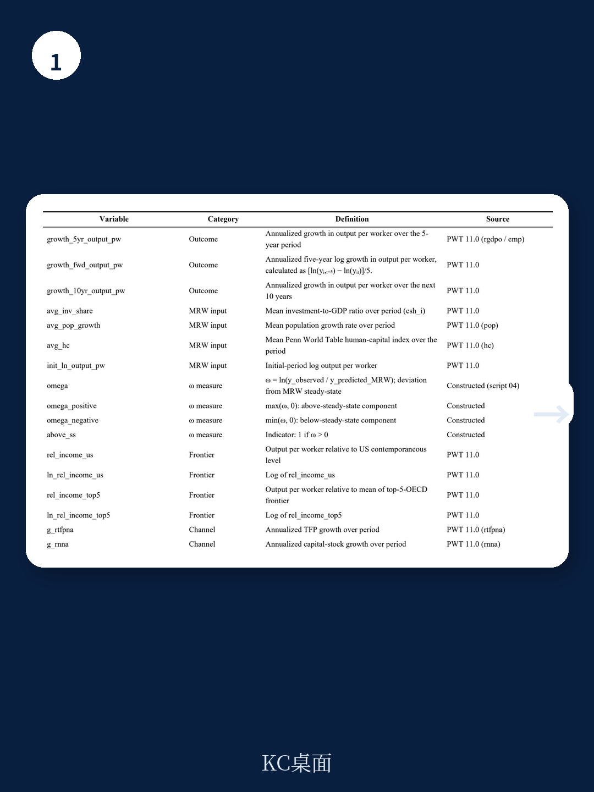
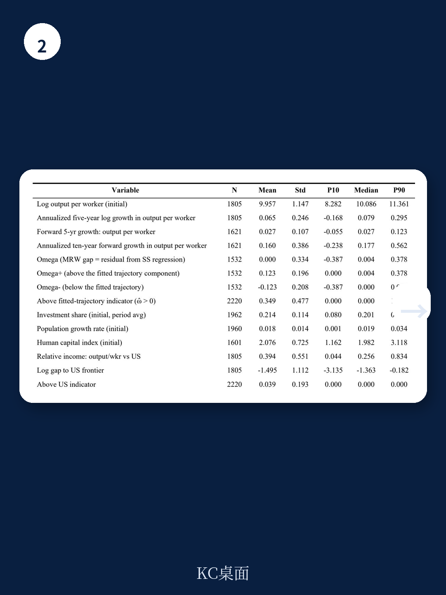

# IMF：研究主题与行业变化观察

过去三十年，跨国收入差距收窄被普遍视为后发地区追赶成功的证据。IMF 宏观环境学家 Patrick A. Imam 在 2026 年 7 月的工作论文中提出一个容易被忽略的补充解释：同样的统计规律，也可能来自另一条路径——部分原本收入较高的地区，因为长期增长基准下移而逐渐回落。论文将这种现象称为“从上方趋同”（convergence from above），并给出一个量化判断：在 1960 至 2019 年的样本中，顶端压缩可能解释了观察到的趋同中约三分之一的份额。

这个判断的意义在于，它改变了“趋同”一词的解读方向。传统增长理论认为，穷国增长快于富国，是因为资本积累、技术扩散和结构转型推动后发优势兑现。但论文指出，稳态本身并非固定不变。生产率增速节奏变化、人口结构出现变化、产业构成变化，都会使一个地区长期均衡对应的收入水平下移。此时，即便实际收入没有明显下降，地区也可能已经“高于”自身基本面所支撑的水平，后续增长仍在调整正是向更低基准调整的过程。

## 1. 日本与南欧案例显示增长基准本身可能下移

论文列举的典型场景包括日本 1990 年代后的长期停滞、欧元区扰动后南欧的持续仍在调整，以及近期德国和芬兰的增长动能减弱。这些案例的共同点不是突然的明显波动，而是此前支撑高收入水平的增长模式逐渐弱化，市场对潜在产出的估计被反复下调。报告引用 Fernald、Inklaar 和 Ruzic（2025）的研究指出，发达地区生产率节奏变化反映的是广泛而持久的力量，而非扰动后的暂时仍在调整。

拉丁美洲的“失去的十年”提供了另一类证据。资源型地区在外部条件有利时收入水平暂时高企，随后难以维持。Rodríguez 和 Sachs（1999）在研究资源富集地区时，明确描述了这种“从上方趋同”的情形。Rodrik（2016）则警告过早去工业化可能削弱地区向前沿收敛的传统机制。这些案例的触发因素各不相同，但都指向同一个现象：对可持续长期表现的预期随时间下移，而不仅仅是增长偶尔节奏变化。

## 2. 高于预测轨迹的地区后续增长更慢且调整更持久

论文的核心实证策略是，先以研究、人口结构和人力资本等长期基本面变量估计各国稳态路径，再构造“轨迹缺口”——实际收入与预测稳态收入之间的差距。随后检验这一缺口对后续增长和收入分布内流动性的预测能力。

结果显示，高于预测轨迹的地区后续增长显著更弱。局部投影系数显示，正向轨迹缺口的调整斜率约为负 0.042，而负向缺口的追赶斜率约为负 0.076。这意味着从上方调整的速度慢于从下方追赶的速度，且调整过程更持久。分布动态分析进一步表明，趋同系数相同的情况下，底层向上流动与顶端压缩对应的宏观环境含义截然不同。

> **KC评论：** 这里容易被忽略的是“不对称性”。追赶可以较快完成，但从上方回落往往拖得更久。对观察者而言，这意味着一个地区增长节奏变化时，不能默认它只是暂时低于趋势，也可能是在向一个更低的新基准靠拢。

## 3. 正向轨迹缺口与银行扰动及前沿地位丧失存在关联

论文进一步检验了正向轨迹缺口与各类节奏变化不确定性事件的关系。使用 Romano-Wolf 多重检验校正后，正向缺口对以下事件具有显著预测力：未来五年负增长、未来五年大幅下滑（增长率低于负 5%）、未来十年下滑、丧失前沿邻近地位，以及未来五年发生银行扰动。货币扰动和主权债务扰动的关联则不显著。

银行扰动的显著关联值得注意。报告认为，部分“过度上冲”可能反映暂时的繁荣、有利的贸易条件或信贷扩张，但更广泛的机制是：地区可能因为基准本身弱化而高于长期轨迹，这种错位最终通过资金部门不确定性显现。论文使用全球宏观数据库的扰动年表，事件计数按起始年份统计，并排除了已处于事件中的国家-时期样本。

## 4. 观察框架：区分三种增长节奏变化的含义

对政策制定者和市场参与者而言，这份报告提供了一个可复用的判断框架。当某个地区增长节奏变化时，至少存在三种可能：暂时性周期波动、繁荣后的正常调整、向更低长期轨迹的移动。三者的政策含义完全不同——前者可能需要需求管理，中间情形只需等待出清，后者则涉及潜在产出下修、债务可持续性重估和中期增长预期调整。

论文的贡献不在于否认追赶机制的存在，而在于指出趋同可能同时包含两种方向相反的过程。底层向上流动与顶端向下压缩在回归中可能呈现相似的系数，但对应的宏观环境图景截然不同。报告也明确承认，轨迹缺口只是对真实稳态距离的“纪律化代理变量”，并非直接观测。

对于长期跟踪跨国增长的研究者，这篇论文的增量信息在于：趋同的回归系数本身不足以判断全球收入分布的演化方向，需要结合分布动态和轨迹缺口的细分才能区分底层追赶与顶端回落各自的贡献。
