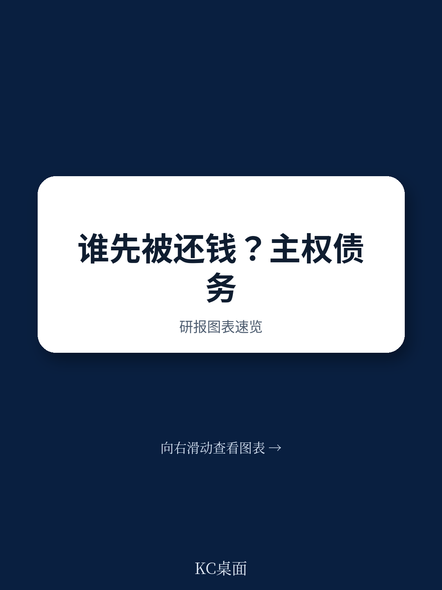
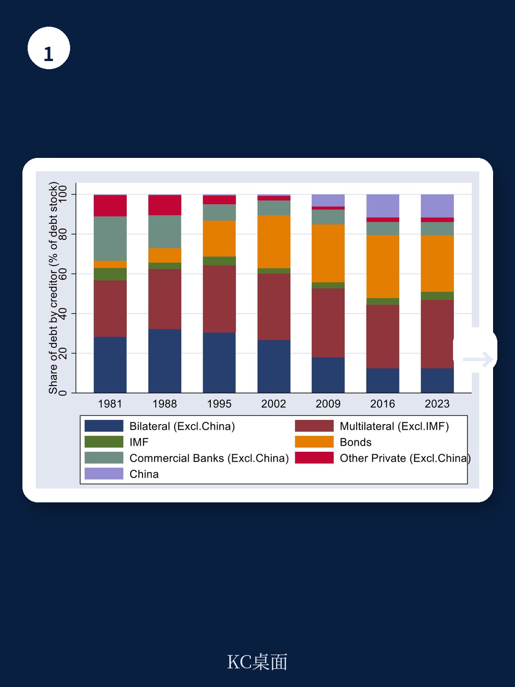
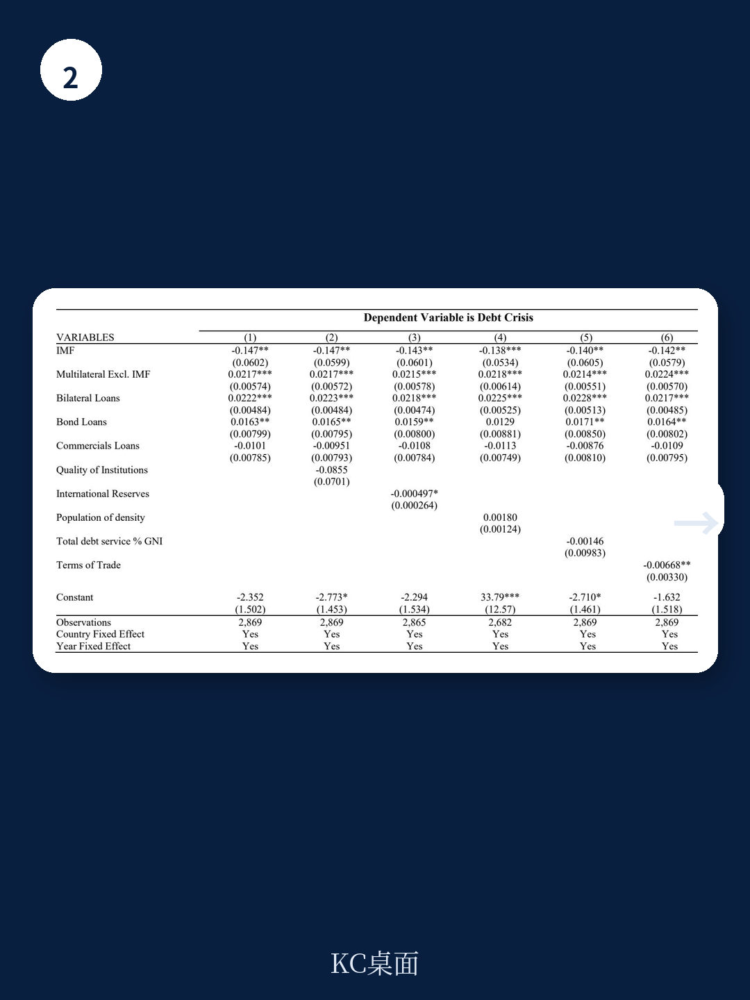

# IMF：资金结构与相关数据观察

IMF在2026年7月发布的工作论文（WP/26/161）利用1980至2022年间119个新兴市场和发展中地区的分项债务数据，重新检验了主权债务的事实优先层级。核心发现是：IMF和世界银行在偿还顺序中处于最优先位置，官方双边债权人次之，债券持有人和商业银行相对居后，其中商业银行的受偿优先级最低。这一层级结构并非仅具法律意义，它直接关联债务扰动发生概率与国际资本市场融资成本。

论文对既有认知的一个重要修正是关于双边债权人的位置。2019年Schlegl等人的研究曾发现，双边官方贷款在事实上的受偿顺序低于债券持有人，与巴黎俱乐部的“可比待遇原则”相悖。这份新报告基于BoC-BoE主权违约数据库重新计算相对逾期比例指标，结论指向相反方向：面临偿债困难的主权国家更倾向于对私人债权违约，而非对官方双边债权人违约。双边债权人的优先级与巴黎俱乐部原则、G20共同框架的惯例保持一致。

> **KC评论：** 债权人层级不是抽象的法律概念，它直接决定扰动谈判桌上谁先被偿还。这份报告用四十年跨国数据把“事实上的优先级”量化了，对理解新兴市场债务重组谈判的博弈结构有直接参考价值。

## 1. IMF贷款占GNI比重与债务扰动概率呈负相关

在控制了GDP增速、人均收入、VIX、短期债务占比、既往重组经历等变量后，IMF信贷余额占国民总收入（GNI）的比重与债务扰动发生概率之间存在稳健的负相关关系。这一稳定效应在债务存量超过GNI 100%的国家中依然显著，但随债务存量上升而逐步减弱。相比之下，其他债权人群体（双边、多边非IMF、债券持有人、商业银行）的债务占比与扰动概率之间呈现正的条件相关。

论文使用工具变量策略处理潜在的选择偏差。IMF贷款并非随机分配，接受贷款的国家往往已处于脆弱状态。工具变量估计结果支持基准回归的结论，但论文同时指出，对其他多边机构和商业债权人的估计受选择偏差影响更复杂，处理难度更大，留待后续研究。

## 2. 债权人构成与主权债券利差存在系统性关联

论文使用J.P. Morgan EMBIG指数衡量主权借款成本，发现IMF贷款占比与债券利差呈负相关，而优先级较低的私人债权人（债券持有人和商业银行）债务占比上升则与利差扩大相关。描述性统计显示，双边债务与利差的负相关关系比IMF更明显，多边非IMF债务与利差几乎不相关，私人债务则与利差正相关。

这些模式与论文关于债权人层级影响市场不确定性感知的核心论点一致。论文谨慎指出，这些相关性不应被解读为因果关系，因为债务构成本身可能受宏观宏观环境条件和市场准入状况影响。利差回归同样面临选择偏差问题——国家特征可能同时影响其市场准入和债务构成。

## 3. 四十年间债权人结构变化与优先级排序的稳定性

1980年以来，主权外部债务的债权人分布经历了显著变化。1990年代布雷迪计划后，债券占比相对于银行贷款和商业信贷明显上升。双边债权人和IMF的份额在1990年代后略有下降，但包括其他多边机构在内的官方贷款总体份额保持稳定。中国等新兴债权人的角色也在增强。

论文的贡献在于确认了优先级排序在结构变化中的稳定性：IMF和世界银行始终处于最优先位置，商业银行垫底。这一排序与IMF和世界银行对逾期贷款的政策安排一致——多边信贷通常被排除在重组范围之外，两机构也制定了针对欠款国家的贷款政策。论文同时提示，随着新债权人崛起和系统性冲击（2008年资金扰动、新冠疫情）的发生，这一排序并非不可改变。

> **KC评论：** 对研究新兴市场债务的读者来说，图2展示的债权人结构变化值得细看——债券占比上升意味着扰动谈判的参与者更多元、协调成本更高。而IMF贷款与利差的负相关，为“催化融资”假说提供了新的跨国证据，但论文自己也承认选择偏差并未完全消除。

## 4. 一个可复用的观察框架：从债权人构成判断主权不确定性

对政策制定者和市场参与者而言，这份报告提供了一个相对简洁的分析框架：先看一国债务中IMF和世界银行的占比，再看官方双边与私人债权的比例，最后关注债务总量与GNI的相对位置。IMF占比高且债务总量可控，通常对应较低的扰动概率和较窄的利差；私人债权人占比高，则不确定性溢价相应上升。

需要留意的是，论文的样本覆盖1980至2022年，包含多次全球性冲击，但债务数据来自世界银行国际债务统计，违约定义来自BoC-BoE数据库，不同数据源对“违约”的界定存在差异。论文在方法部分对此有明确交代，使用这些结论时也应保留这一限定条件。

For informational purposes only. Portions may be generated,translated,summarized,or edited with AI assistance based on source materials and may contain omissions or errors. Please verify independently. This is not investment,legal,tax,accounting,or other professional advice.

