# Dominant Currency Pricing and Currency Risk Premia

Prepared by Husnu C. Dalgic and Galip Kemal Ozhan

WP/26/158

IMF Working Papers describe research in progress by the author(s) and are published to elicit comments and to encourage debate. The views expressed in IMF Working Papers are those of the author(s) and do not necessarily represent the views of the IMF, its Executive Board, or IMF management.

2026
JUL

# IMF Working Paper Research Department

# Dominant Currency Pricing and Currency Risk Premia Prepared by Husnu C. Dalgic and Galip Kemal Ozhan\*

Authorized for distribution by Deniz Igan
July 2026

IMF Working Papers describe research in progress by the author(s) and are published to elicit comments and to encourage debate. The views expressed in IMF Working Papers are those of the author(s) and do not necessarily represent the views of the IMF, its Executive Board, or IMF management.

ABSTRACT: This paper studies how dominant-currency pricing affects currency risk premia. Empirically, we extract common risk factors from excess currency returns using principal components and relate countries' factor exposures to observable macroeconomic characteristics, with export dollar invoicing emerging as a predictor of carry trade exposure. A small open-economy model with dominant-currency pricing and dollar-denominated liabilities explains why. Dollar export invoicing weakens the exchange rate's stabilizing effect on external demand, while dollar debt makes depreciation costly for leveraged intermediaries. When the two frictions interact, depreciations occur in bad states, local-currency assets become risky, the currency premium rises, and the risk-adjusted neutral rate increases. Under a standard Taylor rule, this mechanism generates persistently higher inflation.

<table><tr><td>JEL Classification Numbers:</td><td>E44, E32, F41, G15, G21</td></tr><tr><td>Keywords:</td><td>Currency returns; dominant currency pricing; uncovered interest parity; inflation; dollar debt</td></tr><tr><td>Authors&#x27; email addresses:</td><td>gozhan@IMF.orgdalgic@uni-mannheim.de</td></tr></table>

WORKING PAPERS

# Dominant Currency Pricing and Currency Risk Premia

Prepared by Husnu C. Dalgic and Galip Kemal Ozhan\*

# Dominant Currency Pricing and Currency Risk Premia\*

Husnu C. Dalgic $^{†}$ University of Mannheim

Galip Kemal Ozhan $^{\dagger}$ International Monetary Fund
and NBER

July 23, 2026

## Abstract

This paper studies how dominant-currency pricing affects currency risk premia. Empirically, we extract common risk factors from excess currency returns using principal components and relate countries' factor exposures to observable macroeconomic characteristics, with export dollar invoicing emerging as a predictor of carry-trade exposure. A small open-economy model with dominant-currency pricing and dollar-denominated liabilities explains why. Dollar export invoicing weakens the exchange rate's stabilizing effect on external demand, while dollar debt makes depreciation costly for leveraged intermediaries. When the two frictions interact, depreciations occur in bad states, local-currency assets become risky, the currency premium rises, and the risk-adjusted neutral rate increases. Under a standard Taylor rule, this mechanism generates persistently higher inflation.

JEL Classification: E44, F32, F41, G15, G21.

Keywords: Currency returns; dominant currency pricing; uncovered interest parity; inflation; dollar debt.

## 1 Introduction

One of the salient features of the international monetary system is the asymmetric use of currencies in global trade and finance (see, for example, Gopinath and Stein (2021)). The U.S. dollar is the dominant vehicle currency in international trade, as documented by Goldberg and Tille (2008) and Gopinath, Boz, Casas, Díez, Gourinchas and Plagborg-Møller (2020). The dollar is also central to global financial intermediation and to the denomination of cross-border liabilities. These two forms of dollar dominance are typically studied separately. Trade invoicing affects pass-through and expenditure switching, while liability dollarization affects balance sheets and financial fragility. This paper's hypothesis is that their interaction is central to the risk properties of exchange rates.

The cross section of currency returns provides a natural testing ground for this hypothesis. If the international price system and global balance sheets are disproportionately dollar denominated, then exchange rates need not be merely relative prices; but they also affect the state-contingent payoff of nominal assets, the tightness of financial constraints, and the severity of downturns. We therefore ask whether dominant-currency pricing and liability dollarization shape currencies' exposure to global risk, the cross section of currency risk premia, and the transmission of monetary policy in small open economies.

In particular, the paper asks three questions. First, do dollar export invoicing and dollar-denominated liabilities help explain why some currencies are more exposed to global currency risk than others? Second, through what mechanism do these structural features make local-currency assets pay off poorly in bad states and thereby raise currency risk premia? Third, what are the implications for inflation and monetary policy in small open economies?

We begin empirically. We construct monthly excess currency returns for 25 countries from 2003:02 to 2018:11 using FX4Casts and IMF IFS data, together with the invoicing measures in Gopinath, Boz, Casas, Díez, Gourinchas and Plagborg-Møller (2020). Following Lustig, Roussanov and Verdelhan (2011), we extract common factors from currency excess returns. The first factor is a broad dollar factor that comoves with global equity returns, while the second is a carry-trade factor associated with global risk aversion. We then relate each currency's exposure to these factors to country characteristics, focusing on export dollar invoicing, foreign-currency liabilities in the banking system,

and net foreign asset positions.

The main empirical result is that countries' exposure to currency risk is systematically shaped by their trade and financial structures. Greater dollar invoicing of exports is strongly associated with higher exposure to the carry-trade risk factor, and this relationship remains robust after controlling for additional country characteristics, including country size, reserves, trade-network centrality, and NFA-to-GFP. Banking-sector foreign liability exposure and net debtor positions also help explain cross-country differences in factor loadings. These exposures are priced in currency markets: currencies with higher loadings on global risk factors earn higher average excess returns, and the same exposures are associated with higher average inflation. Taken together, the evidence points to a macro-financial risk channel. In economies with dollarized trade and balance sheets, local-currency assets tend to lose value in adverse global states, leading investors to demand compensation for holding them.

Figure 1 summarizes this empirical pattern. Panel (a) shows that export dollar invoicing is a strong predictor of carry-trade exposure. Panel (b) shows that currencies with greater carry-trade exposure earn higher average excess returns. Panel (c) shows that these exposures are also associated with higher average inflation. Together, the panels motivate the paper's central mechanism by showing that the same structural features that make a currency risky for investors also shape monetary transmission.

To interpret the empirical evidence, we develop a small open-economy model with dominant-currency pricing, dollar-denominated bank liabilities, and segmented international asset markets. The model builds on the literature on open-economy financial intermediation with foreign-currency liabilities, including Aoki, Benigno and Kiyotaki (2020), Ozhan (2020), and Benhima, Blengini and Merrouche (2025). In the model, exporters set prices in dollars, imported goods are priced in dollars, domestic intermediaries borrow partly in dollars, and foreign investors require compensation for holding local-currency assets when exchange-rate risk rises.

The analytical results show that the premium on local-currency assets rises through a covariance channel created by the interaction of dollar liabilities and sticky dollar export prices. Dollar liabilities determine the direct balance-sheet exposure to depreciation. When the domestic currency depreciates, the local-currency value of banks' dollar debt rises, bank net worth falls, and the marginal value of bank capital increases. Sticky dollar export prices determine how much stabilization the exchange rate provides on the real side of the economy. When export prices are slow to adjust in dollars, a depreciation

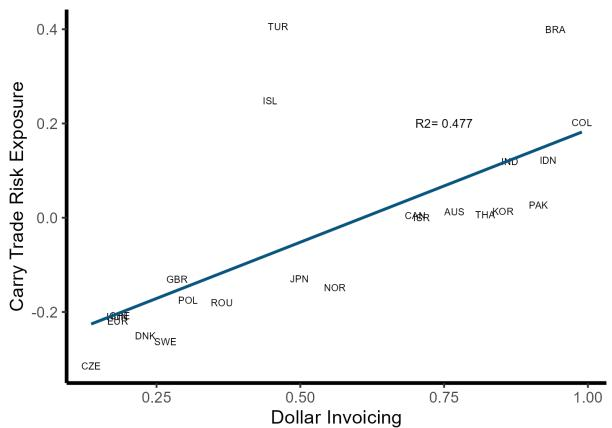  
(a) Carry-trade exposure and dollar invoicing

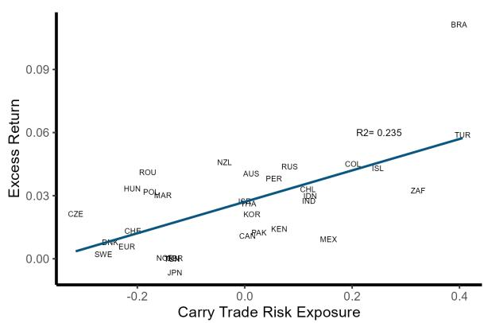  
(b) Carry-trade exposure and excess returns

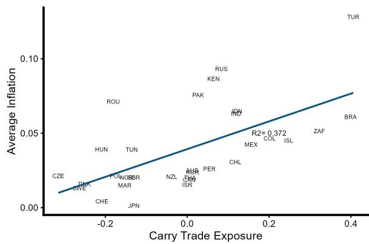  
(c) Carry-trade exposure and inflation  
Figure 1: Carry-trade risk, currency returns, and inflation

Notes: Carry-trade exposure is the loading on the second principal component of currency excess returns, following Lustig, Roussanov and Verdelhan (2011). Currency returns cover 25 countries from 2003:02 to 2018:11. Data sources are FX4Casts, IMF IFS, and Gopinath, Boz, Casas, Díez, Gourinchas and Plagborg-Møller (2020).

does not quickly lower the price faced by foreign buyers, so export demand responds only gradually. The exchange rate therefore has weaker shock-absorbing properties. Instead of rapidly supporting external demand, the depreciation immediately raises import prices and dollar-debt burdens while the export response is delayed. This timing makes depreciation coincide with lower consumption, weaker investment, lower bank net worth, and a higher continuation value of intermediary wealth. Local-currency assets are risky in this environment because their payoff is low when the pricing kernel is high. Investors therefore require a higher expected return to hold them. The premium is largest when both frictions are present because each friction strengthens a different part of the same pricing mechanism. Dollar liabilities make a depreciation reduce bank net worth directly by increasing the local-currency value of banks' dollar debt. Sticky dollar export prices make the depreciation less useful for stabilizing the real economy because foreign buyers do not quickly see lower dollar prices, so exports do not immediately offset the rise in import costs and the fall in domestic spending. The depreciation therefore comes with weaker consumption, lower investment, tighter credit, and a higher value of bank capital. Since local-currency assets lose value in exactly these states, investors require a higher expected return to hold them.

We then quantify the mechanism. We calibrate the model to a small open emerging-market economy and study a foreign interest-rate shock across economies that differ in two dimensions: the degree of dollar export invoicing and the share of dollar liabilities. The largest UIP deviation arises when both frictions are present. High dollar debt without high dollar invoicing generates a sizable premium, but a smaller one, because the exchange rate can still work more effectively through export prices. High invoicing without high dollar debt generates only a modest premium, because depreciation does not impose large valuation losses on intermediary balance sheets. The interaction is therefore the central quantitative force because dollar liabilities make depreciation financially costly, while sticky dollar export prices prevent depreciation from delivering sufficient real stabilization.

The impulse responses also clarify the role of the exchange rate. In economies with limited dollar invoicing of exports and low financial-sector dollar debt, depreciation acts more like a shock absorber. It improves external competitiveness without generating large balance-sheet losses. In vulnerable economies, where a large share of exports is invoiced in dollars and the financial sector carries substantial dollar debt, depreciation instead becomes a macro-financial state variable. It raises the domestic price of imports, increases the local-currency burden of dollar liabilities, tightens financial constraints, and raises the premium investors require to hold local-currency assets. Although exports may rise after the shock, this expansion does not reflect the frictionless expenditure-switching mechanism of the textbook model. It is achieved through a larger depreciation, a higher UIP premium, and a sharper compression of domestic absorption.

The stochastic steady-state results show that this mechanism also has long-run implications for inflation and monetary policy. Following Benigno, Benigno and Nisticò (2012) and Ghironi and Ozhan (2025), we solve the model using a higher-order approximation and find that greater export-price stickiness raises exchange-rate volatility in the stochastic steady state. As a result, local-currency assets become riskier, and the UIP premium remains elevated even in the long run. This premium acts like an increase in the risk-adjusted neutral interest rate. Under a conventional Taylor rule with a fixed intercept, the policy rate is too low relative to the return required by investors, causing average inflation to rise above target. A rule that responds more robustly to movements in the neutral rate, in the spirit of Orphanides and Williams (2006), can stabilize inflation, but only by sustaining higher interest-rate spreads.

The paper contributes to three related literatures. First, it contributes to the literature on trade invoicing, which studies how vehicle-currency use and nominal rigidities shape exchange-rate pass-through and monetary transmission (Obstfeld and Rogoff, 1995; Betts and Devereux, 2000; Devereux and Engel, 2003; Goldberg and Tille, 2008; Gopinath, Boz, Casas, Díez, Gourinchas and Plagborg-Møller, 2020; Mukhin, 2022; Amiti, Itskhoki and Konings, 2022; Egorov and Mukhin, 2023). The paper connects this literature to currency asset pricing by showing that the currency in which exports are priced affects the payoff of local-currency assets in global bad states. Second, it contributes to the literature on the determinants of currency risk premia and the UIP puzzle, which links currency excess returns to global risk factors, country characteristics, trade networks, financial intermediation, external positions, and limits to international risk sharing (Hassan, 2013; Della Corte, Riddiough and Sarno, 2016; Ready, Roussanov and Ward, 2017a,b; Richmond, 2019; Wiriadinata, 2021; Jiang, 2021, 2022; Hassan and Zhang, 2021; Kalemli-Özcan and Varela, 2021; Goldberg and Krogstrup, 2023; Liao and Zhang, 2025; Bocola and Lorenzoni, 2020; Dao, Gourinchas and Itskhoki, 2025). Relative to this work, the paper identifies dollar export invoicing and foreign-currency liabilities as observable structural sources of exposure to global currency risk. Third, it contributes to work on exchange rate volatility and monetary policy by showing how dollar liabilities and dollar export invoicing jointly determine inflation dynamics (Benigno, Benigno and Nisticò, 2012; Kalemli-Özcan, 2019; Aoki, Benigno and Kiyotaki, 2020; Auclert, Rognlie, Souchier and Straub, 2021; Bacchetta, Benhima and Berthold, 2023a; Bacchetta, Cordonier and Merrouche, 2023b; Kalemli-Özcan and Unsal, 2023). The central contribution is to connect these literatures through a single macro-financial mechanism in which the currency risk premium is determined by the interaction between the currency denomination of liabilities and the currency denomination of export prices.

The rest of the paper is organized as follows. Section 2 describes the data and presents the empirical analysis. Section 3 presents the small open-economy model. Section 4 analytically derives the expressions for the model's key mechanism. Section 5 takes the analytical mechanism to the quantitative model and studies the transmission of foreign monetary shocks. Section 6 concludes.

## 2 Empirical Analysis

We identify two principal sources of currency market risk—the Dollar Risk Factor, tied to global asset prices, and the Carry Trade Risk Factor, linked to global risk aversion (Section 2.1). Both represent priced risks that command higher average excess returns (Table 1). The underlying macroeconomic channel for this risk is the co-movement between GDP and the exchange rate (Section 2.4); currencies that depreciate during recessions are inherently riskier to hold.

Crucially, we link these cyclical co-movements and risk exposures directly to observable structural frictions (Sections 2.3 and 2.5). High dollar invoicing, significant banking-sector foreign liabilities (FL/FA), and a net debtor position (low NFA/GDP) jointly exacerbate this risky GDP-ER correlation and determine a country's exposure to both global factors. Furthermore, professional forecast data confirms that investors ex-ante price the higher returns associated with these structural vulnerabilities (Section 2.6). Ultimately, the empirical finding that dollar debt and trade invoicing jointly shape a currency's risk profile directly motivates our theoretical framework.

## 2.1 Currency Returns

Our primary dataset consists of monthly data for 25 countries from 02/2003 to 11/2018, sourced from FX4casts. $^{1}$ We define the realized excess currency return $(RX_{t+1})$ for a USD based investor as:

$$
R X _ {t + 1} \equiv R _ {t} ^ {L} \frac {S _ {t}}{S _ {t + 1}} - R _ {t} ^ {U S}\tag{1}
$$

where $S_{t}$ is the spot exchange rate (LCU per USD), and $R_{t}^{L}$ and $R_{t}^{US}$ are the respective local and US gross short-term interest rates from t to $t + 1$ . This formula represents the ex-post profit from borrowing in USD, investing in the local currency, and converting the proceeds back to USD one period later.

From a macroeconomic perspective, our primary object of interest is the unconditional average of these returns, which forms the currency risk premium:

$$
\mathbb {E} [ R X _ {t + 1} ] \equiv \mathbb {E} \left[ R _ {t} ^ {L} \frac {S _ {t}}{S _ {t + 1}} - R _ {t} ^ {U S} \right]
$$

We aim to understand the cross-sectional determinants of this premium. To expand our sample for the cross-sectional analysis, we augment this dataset with data for an additional 7 countries using forward returns. $^{2}$ The derivation of currency returns using forward contracts is detailed in Appendix Section C.

## 2.2 Global Risk Factors

Following Lustig, Roussanov and Verdelhan (2011), we use principal component analysis to extract the common factors from our panel of currency returns. We identify two key components, which we label the "Dollar Risk Factor" (Component 1) and the "Carry Trade Risk Factor" (Component 2), in line with the literature.

Table 1 presents the cross-sectional results, testing whether these risk exposures are priced. The results confirm they are. In the full specification (Column 3), both the Dollar Risk Exposure (0.136\*\*) and the Carry Trade Risk Exposure (0.076\*\*\* ) show a positive and statistically significant relationship with average excess returns. This confirms that both factors represent priced risks in the currency market.

<table><tr><td rowspan="3"></td><td colspan="3">Dependent variable:</td></tr><tr><td colspan="3">Excess Returns</td></tr><tr><td>(1)</td><td>(2)</td><td>(3)</td></tr><tr><td>Dollar Risk Exposure</td><td>0.133***(0.051)</td><td></td><td>0.136***(0.037)</td></tr><tr><td>Carry trade Risk Exposure</td><td></td><td>0.075***(0.023)</td><td>0.076***(0.021)</td></tr><tr><td>Constant</td><td>0.003(0.008)</td><td>0.027***(0.003)</td><td>0.003(0.006)</td></tr><tr><td>Observations</td><td>32</td><td>32</td><td>32</td></tr><tr><td> $R^2$ </td><td>0.176</td><td>0.400</td><td>0.585</td></tr><tr><td>Adjusted  $R^2$ </td><td>0.149</td><td>0.380</td><td>0.556</td></tr><tr><td>Residual Std. Error</td><td>0.021 (df = 30)</td><td>0.018 (df = 30)</td><td>0.015 (df = 29)</td></tr><tr><td>Note:</td><td colspan="3">*p&lt;0.1; **p&lt;0.05; ***p&lt;0.01</td></tr></table>

Table 1: Average excess returns vs component loadings  
Data source: FX4Casts, Datastream. Left hand variable is the average monthly currency returns of 32 countries between 02/2003 - 11/2018. Right hand variables are the coefficients of each country for the two principal component of currency returns. Both components are scaled such that a positive coefficient means positive covariance with the returns.

Table 2 demonstrates the time-series explanatory power of these factors for a selection of five countries. The high $R^{2}$ values for Turkey (0.599), Chile (0.460), Mexico (0.553), and the Euro Area (0.876) indicate that these two common factors drive a significant portion of currency return variation. The notable exception is Japan ( $R^{2} = 0.097$ ), whose currency is well-known to follow distinct safe-haven dynamics.

Finally, Table 3 provides a clear economic interpretation for these abstract factors. We regress the Dollar Risk Factor (Component 1) and the Carry Trade Risk Factor (Component 2) on standard macro-financial variables. The results show that the Dollar Risk Factor (Col 1) is strongly and positively correlated with S&P 500 returns (1.533 $^{***}$ ) and is not significantly related to changes in the VIX. His identifies it as a global equity factor. The Carry Trade Risk Factor (Col 2), in contrast, is not correlated with the S&P 500 but is significantly and negatively correlated with changes in the VIX ( $-0.085^{**}$ ). This identifies the second factor as global risk aversion.

<table><tr><td rowspan="2"></td><td colspan="5">Dependent variable:</td></tr><tr><td>Turkey(1)</td><td>Chile(2)</td><td>Mexico(3)</td><td>Euro Area(4)</td><td>Japan(5)</td></tr><tr><td>Dollar Risk Exposure</td><td>0.258***(0.025)</td><td>0.167***(0.016)</td><td>0.167***(0.014)</td><td>0.191***(0.005)</td><td>0.035(0.028)</td></tr><tr><td>Carry trade Risk Exposure</td><td>0.406***(0.093)</td><td>0.118***(0.028)</td><td>0.156***(0.041)</td><td>-0.219***(0.029)</td><td>-0.130**(0.051)</td></tr><tr><td>Constant</td><td>0.005**(0.002)</td><td>0.003***(0.001)</td><td>0.001(0.001)</td><td>0.0005(0.001)</td><td>-0.001(0.002)</td></tr><tr><td>Observations</td><td>190</td><td>190</td><td>190</td><td>190</td><td>190</td></tr><tr><td> $R^2$ </td><td>0.599</td><td>0.460</td><td>0.553</td><td>0.876</td><td>0.097</td></tr><tr><td>Adjusted  $R^2$ </td><td>0.595</td><td>0.454</td><td>0.548</td><td>0.874</td><td>0.087</td></tr><tr><td>Residual Std. Error (df = 187)</td><td>0.033</td><td>0.024</td><td>0.021</td><td>0.010</td><td>0.027</td></tr><tr><td colspan="6">Note:*p&lt;0.1; **p&lt;0.05; ***p&lt;0.01</td></tr></table>

Table 2: Excess returns vs Risk Factors  
Data source: FX4Casts. Left hand variable is the returns of selected currencies between 02/2003 - 11/2018. Right hand variables are the two principal component of currency returns. Both components are scaled such that a positive coefficient means positive covariance with the returns.

## 2.3 Determinants of Component Exposures

In this Section, we aim to understand what determines a currency's exposure to these global risk factors. We consider several variables established in the literature as key determinants of excess currency returns and regress our estimated risk exposures on them (Table 4). $^{3}$

The regression results presented in Table 4 demonstrate that both risk factors are jointly determined by the economy's underlying financial and trade frictions.

Examining the Dollar Risk Factor (Columns 1 and 2), exposure is driven by a combination of financial leverage and trade invoicing practices. The ratio of foreign liabilities to foreign assets (FL/FA) in the banking system serves as a positive and significant predictor (0.043\*\* in the full specification). This indicates that economies relying more heavily on foreign-currency funding exhibit greater vulnerability to the global financial cycle. Conversely, when controlling for these financial vulnerabilities, a higher share of dollar invoicing correlates with lower exposure to this specific risk factor, as evidenced by the

<table><tr><td rowspan="2"></td><td colspan="2">Dependent variable:</td></tr><tr><td>Component 1(1)</td><td>Component 2(2)</td></tr><tr><td>S&amp;P 500 Returns</td><td>1.533***(0.341)</td><td>-0.080(0.110)</td></tr><tr><td>Δlog(VIX)</td><td>-0.070(0.053)</td><td>-0.085***(0.032)</td></tr><tr><td>ΔGFC</td><td>-0.013(0.009)</td><td>0.001(0.004)</td></tr><tr><td>Observations</td><td>190</td><td>190</td></tr><tr><td> $R^2$ </td><td>0.306</td><td>0.045</td></tr><tr><td>Adjusted  $R^2$ </td><td>0.299</td><td>0.035</td></tr><tr><td>Residual Std. Error (df = 187)</td><td>0.105</td><td>0.058</td></tr><tr><td>Note:</td><td colspan="2">*p&lt;0.1; **p&lt;0.05; ***p&lt;0.01</td></tr></table>

Table 3: Risk Factors  
Data source: FX4Casts, Ken French dataset, CBOE. Right hand variables are the two principal components of currency returns of 25 countries between 02/2003 - 11/2018. Left hand variables are the returns of S&P500 and log change in VIX index.

significant negative coefficient ( $-0.095^{**}$ ).

The dynamics differ when evaluating the Carry Trade Risk Factor (Columns 3 and 4), though exposure remains anchored by both trade and financial variables. In this case, the dollar invoicing share emerges as the strongest predictor, yielding a positive and highly significant coefficient (0.457 $^{***}$ ). This implies that the currencies of high-invoicing countries are notably more exposed to global risk-off shocks, a pattern consistent with carry trade dynamics. Furthermore, financial structure continues to play a role: net debtor countries, indicated by a lower Net Foreign Assets to GDP ratio, show significantly higher exposure to the Carry Trade factor in the baseline specification ( $-0.190^{***}$ ).

Ultimately, these estimates confirm that observable frictions—specifically dollar-denominated debt and dollar invoicing—jointly shape an economy's vulnerability to global shocks. This observation directly motivates the frictions we integrate into our theoretical model.

## 2.4 Comovement between GDP and Exchange Rate

We measure the cyclical co-movement between the economy and the exchange rate by calculating, for each country, the correlation between log real GDP growth and log real exchange rate changes. The real exchange rate (RER) is defined as the nominal dollar

<table><tr><td rowspan="3"></td><td colspan="4">Dependent variable:</td></tr><tr><td colspan="2">Dollar Risk Exposure</td><td colspan="2">Carry Risk Exposure</td></tr><tr><td>(1)</td><td>(2)</td><td>(3)</td><td>(4)</td></tr><tr><td rowspan="2">FL/FA</td><td>0.035*</td><td>0.043**</td><td>0.016</td><td>0.037</td></tr><tr><td>(0.018)</td><td>(0.019)</td><td>(0.030)</td><td>(0.059)</td></tr><tr><td rowspan="2">Net Foreign Assets/GDP</td><td>-0.029</td><td>-0.049</td><td>-0.190***</td><td>-0.090</td></tr><tr><td>(0.029)</td><td>(0.032)</td><td>(0.071)</td><td>(0.060)</td></tr><tr><td rowspan="2">Reserves/GDP</td><td>-0.079</td><td>-0.161</td><td>-0.157</td><td>-0.384</td></tr><tr><td>(0.219)</td><td>(0.138)</td><td>(0.330)</td><td>(0.360)</td></tr><tr><td rowspan="2">Dollar Invoicing</td><td>-0.098**</td><td>-0.095**</td><td>0.490***</td><td>0.457***</td></tr><tr><td>(0.043)</td><td>(0.040)</td><td>(0.086)</td><td>(0.075)</td></tr><tr><td rowspan="2">GDP(Nominal USD)</td><td>0.006</td><td></td><td>0.018</td><td></td></tr><tr><td>(0.018)</td><td></td><td>(0.026)</td><td></td></tr><tr><td rowspan="2">Average Centrality</td><td></td><td>-6.345</td><td></td><td>-7.729</td></tr><tr><td></td><td>(10.384)</td><td></td><td>(14.102)</td></tr><tr><td rowspan="2">Constant</td><td>0.213***</td><td>0.228***</td><td>-0.285***</td><td>-0.280**</td></tr><tr><td>(0.053)</td><td>(0.076)</td><td>(0.088)</td><td>(0.119)</td></tr><tr><td>Observations</td><td>20</td><td>14</td><td>20</td><td>14</td></tr><tr><td>R2</td><td>0.496</td><td>0.743</td><td>0.615</td><td>0.533</td></tr><tr><td>Adjusted R2</td><td>0.316</td><td>0.582</td><td>0.477</td><td>0.242</td></tr><tr><td>Residual Std. Error</td><td>0.063 (df = 14)</td><td>0.047 (df = 8)</td><td>0.154 (df = 14)</td><td>0.167 (df = 8)</td></tr></table>

Note:  
\*p<0.1; \*\*p<0.05; \*\*\*p<0.01  
Data source: IFS, Datastream, FX4Casts, Gopinath, Boz, Casas, Díez, Gourinchas and Plagborg-Møller (2020), Richmond (2019), Ken French dataset. Risk factors are the two principal components of currency returns of 25 countries between 02/2003 - 11/2018. FL/FA denotes the ratio of foreign liabilities to foreign assets in the banking system.

Table 4: Determinants of Exposures

exchange rate divided by CPI $(S_{t}/P_{t})$ . This correlation, $\rho$ , is estimated via the following regression of standardized variables:

$$
\frac {\Delta \log (G D P _ {t})}{\sigma_ {\Delta \log (G D P)}} = \alpha + \rho \frac {\Delta \log (S _ {t} / P _ {t})}{\sigma_ {\Delta \log (S / P)}} + \epsilon_ {t}
$$

The estimate $\hat{\rho}$ corresponds to the correlation coefficient. This approach is well-suited for our dataset, as countries have widely different volatilities in GDP growth and exchange rates, and the correlation coefficient suitably scales the variables by their respective standard deviations. Another benefit is that the correlation is direction-invariant, meaning which variable is used as the left-hand-side variable does not change the estimate. We do not claim any causality here; the correlation coefficient is simply our appropriate measure for co-movement.

A negative correlation $(\rho < 0)$ is the core of our risk mechanism. It indicates that the currency depreciates (loses value) precisely when the economy is in recession (when income is low). This makes the local currency a poor hedge and thus "risky" from the perspective of local residents. In these economies, dollar assets provide better insurance against business cycle fluctuations, lowering the relative demand for local currency assets. Consequently, local residents demand a risk premium—in the form of higher expected returns—to hold local currency assets (Christiano, Dalgic and Nurbekyan (2021); Dalgic (2024)).

Figure 2 tests this hypothesis directly. The plot of average excess returns against the GDP-ER correlation reveals a strong, negative relationship ( $R^{2} = 0.172$ ). This visually confirms our mechanism: countries with a more negative correlation (e.g., Brazil, Turkey, Chile, Peru) are precisely those with riskier currencies, and investors are, on average, compensated with significantly higher excess returns. Conversely, countries with a positive correlation (e.g., Japan, Switzerland, Denmark), where the currency acts as a hedge, have near-zero or negative excess returns.

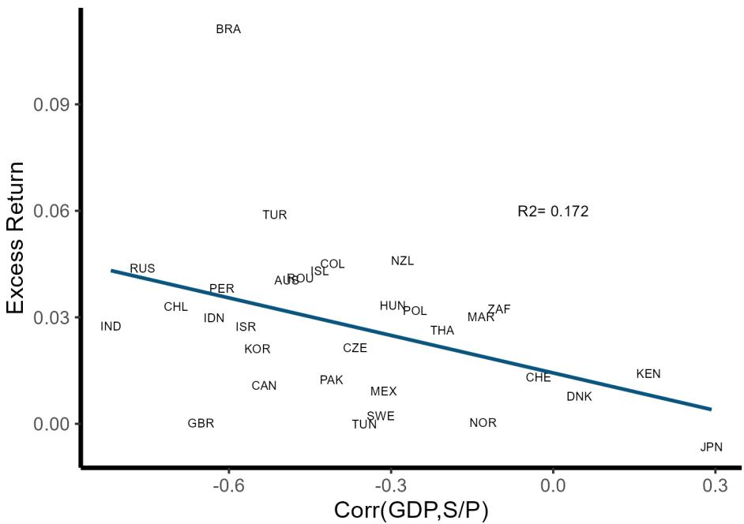  
Figure 2: GDP-ER Comovement and excess returns  
Data source: FX4Casts, IMF IFS. Y-axis variable is the average currency return of 25 countries between 02/2003 - 11/2018. X-axis variable is comovement between GDP and Exchange Rate

## 2.5 Macroeconomic Transmission Channel

This section explores the mechanism through which dollar frictions shape a country's risk profile. A key determinant of currency risk is the cyclical co-movement between GDP and the exchange rate (Dalgic (2024)). When this co-movement is negative—meaning the currency depreciates during domestic recessions—the currency loses value when income is lowest, making it a poor hedge and "risky" for an investor.

We test the drivers of this co-movement in Table 5. The regression results show that our proposed dollar frictions are significant determinants of this relationship. Dollar Invoicing has a negative and highly significant coefficient ( $-0.396^{***}$ ), confirming that a higher share of dollar invoicing is strongly associated with a more countercyclical exchange rate (a more negative correlation). Similarly, net foreign assets/GDP has a significant positive coefficient ( $0.203^{**}$ ). This indicates that being a net debtor (having a low or negative NFA/GDP) is associated with a significantly more negative GDP-ER correlation.

<table><tr><td rowspan="2"></td><td>Dependent variable:</td></tr><tr><td>GDP-ER Correlation</td></tr><tr><td rowspan="2">Dollar Invoicing</td><td>-0.396***</td></tr><tr><td>(0.138)</td></tr><tr><td rowspan="2">FL/FA</td><td>-0.033</td></tr><tr><td>(0.030)</td></tr><tr><td rowspan="2">Net Foreign Assets/GDP</td><td>0.203**</td></tr><tr><td>(0.093)</td></tr><tr><td rowspan="2">Constant</td><td>-0.023</td></tr><tr><td>(0.149)</td></tr><tr><td>Observations</td><td>19</td></tr><tr><td>R2</td><td>0.430</td></tr><tr><td>Adjusted R2</td><td>0.316</td></tr><tr><td>Residual Std. Error</td><td>0.194 (df = 15)</td></tr><tr><td>Note:</td><td>*p&lt;0.1; **p&lt;0.05; ***p&lt;0.01</td></tr></table>

Table 5: The Role of Dollar Frictions in GDP-Exchange Rate Co-movement Data source: IFS, Datastream, FX4Casts, Gopinath, Boz, Casas, Díez, Gourinchas and Plagborg-Møller (2020)

Thus, the evidence shows that both high dollar invoicing and a net debtor position make the exchange rate fundamentally riskier.

## 2.6 Currency Return Expectations

In this section, we construct a measure of expected returns using quarterly exchange rate expectations from FX4Casts. Our sample spans the period 2003Q1-2018Q4. This dataset has been used by Ince and Molodtsova (2017) to evaluate forecast accuracy and by Kalemli-Özcan and Varela (2021) to construct UIP premium series.

We define the expected excess currency return $(\mathbb{E}_{t}UIP_{t})$ as:

$$
\mathbb {E} _ {t} U I P _ {t} = R _ {t} ^ {L} \frac {S _ {t}}{\mathbb {E} _ {t} (S _ {t + 1})} - R _ {t} ^ {U S}\tag{2}
$$

where $E_{t}S_{t+1}$ is the one-quarter-ahead professional forecast for the spot rate.

Similar to our analysis of realized returns, we apply principal component analysis (PCA) to the panel of expected currency returns to extract common factors. We then test if these factors price the cross-section of expected returns.

Table 6 presents the results from regressing average expected excess returns on the loadings for the first two factors. Column (3) shows that while the "Dollar Risk Factor" loading is not statistically significant, the "Carry Trade Risk Factor" loading is. The coefficient is positive and highly significant (+0.031\*\*). This finding indicates that, according to these professional forecasts, currencies with a higher exposure to the carry trade risk factor are associated with higher average expected returns, consistent with investors demanding a premium for bearing this risk.

## 3 Model

The empirical evidence points to a joint role for trade invoicing and balance-sheet structure in shaping currency risk. Countries with high dollar invoicing tend to have currencies that are more exposed to global risk factors and more countercyclical with respect to output. These same economies also tend to display persistently higher inflation. To rationalize these patterns, we use a small open-economy New Keynesian model with dominant-currency pricing in trade, foreign-currency borrowing by financial intermediaries, and segmented international asset markets.

Two mechanisms are central. First, export prices are set in dollars. The parameter $\theta_{x}$ denotes the Calvo probability that an export-price setter cannot adjust its dollar price in a given period. When $\theta_{x}$ is high, export dollar prices are sticky, so a depreciation does not quickly lower the dollar price paid by foreign buyers. The usual expenditure-switching channel is therefore weak. $^{4}$ Second, the domestic banking system borrows in both local currency and dollars. The variable $\phi_{t}$ denotes the share of bank liabilities denominated in dollars, and $\bar{\phi}$ is the target dollar-liability share. When $\phi_{t}$ is high, a depreciation raises the local-currency value of dollar liabilities, reduces intermediary net worth, and tightens credit.

Table 6: Average forecasted excess returns vs component loadings

<table><tr><td rowspan="3"></td><td colspan="3">Dependent variable:</td></tr><tr><td colspan="3">Forecasted Excess Returns</td></tr><tr><td>(1)</td><td>(2)</td><td>(3)</td></tr><tr><td>Dollar Risk Factor</td><td>0.008(0.011)</td><td></td><td>-0.007(0.008)</td></tr><tr><td>Carry Trade Risk Factor</td><td></td><td>0.028***(0.005)</td><td>0.031***(0.005)</td></tr><tr><td>Constant</td><td>0.009***(0.002)</td><td>0.005***(0.001)</td><td>0.004**(0.002)</td></tr><tr><td>Observations</td><td>26</td><td>26</td><td>26</td></tr><tr><td> $R^2$ </td><td>0.028</td><td>0.467</td><td>0.484</td></tr><tr><td>Adjusted  $R^2$ </td><td>-0.012</td><td>0.445</td><td>0.439</td></tr><tr><td>Residual Std. Error</td><td>0.007 (df = 24)</td><td>0.006 (df = 24)</td><td>0.006 (df = 23)</td></tr><tr><td>Note:</td><td colspan="3">*p&lt;0.1; **p&lt;0.05; ***p&lt;0.01</td></tr></table>

Data source: FX4Casts, Ken French dataset, CBOE. Left hand variables are the two principal components of currency returns of 26 countries between 02/2003 - 11/2018. Right hand variable is the average forecasted excess returns.

The interaction of these two frictions determines whether a depreciation is stabilizing or contractionary. With flexible export prices and little dollar debt, a depreciation can support exports and absorb foreign shocks. With sticky dollar export prices and high dollar debt, the depreciation fails to generate a quick export response while simultaneously weakening bank balance sheets. In that case, local-currency assets pay off badly in bad states, and investors require an endogenous risk premium to hold them. We now turn to the model that formalizes this mechanism.

## 3.1 Households

A representative household consumes $C_{t}$ , supplies labor $l_{t}$ , and saves in one-period local-currency and dollar deposits. The nominal exchange rate is $S_{t}$ , measured as local currency per dollar, so an increase in $S_{t}$ is a depreciation. The gross local-currency interest rate is $R_{t}$ , and the gross dollar interest rate is $R_{t}^{*}$ . Household preferences are

$$
\mathbb {E} _ {0} \sum_ {t = 0} ^ {\infty} \beta^ {t} \left[ u (C _ {t}) - \xi \frac {l _ {t} ^ {1 + \varphi_ {l}}}{1 + \varphi_ {l}} - \frac {\gamma_ {\Theta}}{2} (\Theta_ {t} - \Upsilon_ {t}) ^ {2} \right].\tag{3}
$$

The parameter $\beta$ is the discount factor, $\varphi_{l}$ is the inverse Frisch elasticity, and $\xi$ governs the disutility of labor. As it will be clearer, the utility from consumption is in CRRA form with relative risk aversion, $\sigma$ . The variable $\Theta_{t}$ is the household dollar-asset share, while $\Upsilon_{t}$ is its preferred or target dollar-asset share. The last term captures a preferred-habitat motive: households can change their currency exposure, but it is costly to move far away from the target.

The household budget constraint is

$$
D _ {t} + S _ {t} D _ {t} ^ {*} + P _ {t} ^ {c} C _ {t} = R _ {t - 1} D _ {t - 1} + S _ {t} R _ {t - 1} ^ {*} D _ {t - 1} ^ {*} + W _ {t} l _ {t} + T _ {t}.\tag{4}
$$

Here $D_{t}$ is local-currency deposits, $D_{t}^{*}$ is dollar deposits, $P_{t}^{c}$ is the consumer price index, $W_{t}$ is the nominal wage, and $T_{t}$ denotes transfers and profits rebated to the household.

Let CPI inflation be $\Pi_{t+1}^{c} \equiv P_{t+1}^{c}/P_{t}^{c}$ . The real stochastic discount factor is

$$
m _ {t + 1} \equiv \beta \frac {u _ {C} (C _ {t + 1})}{u _ {C} (C _ {t})} \frac {1}{\Pi_ {t + 1} ^ {c}}.\tag{5}
$$

Household optimality implies the pure local-currency and pure dollar Euler equations

$$
1 = R _ {t} \mathbb {E} _ {t} [ m _ {t + 1} ],\tag{6}
$$

$$
1 = R _ {t} ^ {*} \mathbb {E} _ {t} \left[ m _ {t + 1} \frac {S _ {t + 1}}{S _ {t}} \right].\tag{7}
$$

The first equation prices a one-period local-currency payoff. The second prices a one-period dollar payoff after converting next period's dollar repayment back into local currency. Because $S_{t+1} / S_t$ is high when the domestic currency depreciates, dollar assets are valuable insurance when depreciations occur in bad states.

The intratemporal labor condition is

$$
\frac {W _ {t}}{P _ {t} ^ {c}} = \frac {\xi l _ {t} ^ {\varphi_ {l}}}{u _ {C} (C _ {t})}.\tag{8}
$$

The real wage equals the marginal rate of substitution between labor and consumption. Higher marginal utility of consumption raises the value of income and therefore raises desired labor supply for a given real wage.

If total real household savings are denoted by $A_{t}$ , and $s_{t+1} \equiv S_{t+1}/S_{t}$ is the gross depreciation rate, the household portfolio-share condition can be written as

$$
\gamma_ {\Theta} (\Theta_ {t} - \Upsilon_ {t}) = \beta A _ {t} \mathbb {E} _ {t} \left[ \frac {u _ {C} (C _ {t + 1})}{\Pi_ {t + 1} ^ {c}} (R _ {t} - s _ {t + 1} R _ {t} ^ {*}) \right].\tag{9}
$$

The left-hand side is the marginal cost of moving the portfolio away from the target dollar share. The right-hand side is the expected marginal value of changing the currency composition of savings. When dollar assets hedge bad states, the term involving $s_{t+1}R_{t}^{*}$ becomes attractive and households tilt toward dollar assets.

## 3.2 Domestic Production and Price Setting

The domestic homogeneous good $Y_{t}$ is produced by a competitive aggregator using differentiated intermediate varieties $Y_{i,t}$ :

$$
Y _ {t} = \left[ \int_ {0} ^ {1} Y _ {i, t} ^ {\frac {\varepsilon - 1}{\varepsilon}} i \right] ^ {\frac {\varepsilon}{\varepsilon - 1}}, \qquad \varepsilon > 1.\tag{10}
$$

The elasticity of substitution across varieties is $\varepsilon$ . Cost minimization gives

$$
Y _ {i, t} = Y _ {t} \left(\frac {P _ {i , t}}{P _ {t}}\right) ^ {- \varepsilon},\tag{11}
$$

$$
P _ {t} = \left[ \int_ {0} ^ {1} P _ {i, t} ^ {1 - \varepsilon} i \right] ^ {\frac {1}{1 - \varepsilon}},\tag{12}
$$

where $P_{t}$ is the domestic-good price index. A firm that charges a higher relative price sells less, and the elasticity $\varepsilon$ determines how sensitive demand is to relative prices.

The domestic homogeneous good is used as an input in final consumption, investment,

and export production. Its market-clearing condition is

$$
Y _ {t} = C _ {t} ^ {d} + I _ {t} ^ {d} + X _ {t} ^ {d},\tag{13}
$$

where $C_{t}^{d}$ , $I_{t}^{d}$ , and $X_{t}^{d}$ are the domestic inputs used in consumption, investment, and exports.

Intermediate firms produce with capital and labor according to

$$
Y _ {i, t} = K _ {i, t - 1} ^ {\alpha} (A _ {t} l _ {i, t}) ^ {1 - \alpha},\tag{14}
$$

where $K_{i,t-1}$ is predetermined capital, $A_t$ is technology, and $\alpha$ is capital's share. Let $mc_t$ denote real marginal cost in units of the domestic good. Domestic intermediate firms face Calvo price stickiness: with probability $1 - \theta_p$ a firm can reset its price, and with probability $\theta_p$ it keeps its previous price.

The optimal reset price is summarized by

$$
\widetilde {p} _ {t} \equiv \frac {\widetilde {P} _ {t}}{P _ {t}} = \frac {\mathcal {K} _ {t} ^ {p}}{\mathcal {F} _ {t} ^ {p}},\tag{15}
$$

where $\widetilde{P}_{t}$ is the newly chosen nominal price, and the two pricing sums satisfy

$$
\mathcal {K} _ {t} ^ {p} = \frac {u _ {C} (C _ {t})}{P _ {t} ^ {c}} Y _ {t} \frac {\varepsilon}{\varepsilon - 1} m c _ {t} + \beta \theta_ {p} \mathbb {E} _ {t} \left[ (\Pi_ {t + 1}) ^ {\varepsilon} \mathcal {K} _ {t + 1} ^ {p} \right],\tag{16}
$$

$$
\mathcal {F} _ {t} ^ {p} = \frac {u _ {C} (C _ {t})}{P _ {t} ^ {c}} Y _ {t} + \beta \theta_ {p} \mathbb {E} _ {t} \left[ (\Pi_ {t + 1}) ^ {\varepsilon - 1} \mathcal {F} _ {t + 1} ^ {p} \right],\tag{17}
$$

with $\Pi_{t + 1}\equiv P_{t + 1} / P_t$ . The numerator $\mathcal{K}_t^p$ is the discounted value of expected marginal costs, adjusted for the desired markup $\varepsilon /( \varepsilon - 1)$ . The denominator $\mathcal{F}_t^p$ is the discounted value of expected demand. A firm chooses a price that balances today's markup against the possibility that the same price remains in place in future periods.

## 3.3 Final Consumption and Investment Goods

Final consumption combines domestic goods and imported goods:

$$
C _ {t} = \left[ (1 - \omega_ {c}) ^ {1 / \eta_ {c}} (C _ {t} ^ {d}) ^ {\frac {\eta_ {c} - 1}{\eta_ {c}}} + \omega_ {c} ^ {1 / \eta_ {c}} (C _ {t} ^ {m}) ^ {\frac {\eta_ {c} - 1}{\eta_ {c}}} \right] ^ {\frac {\eta_ {c}}{\eta_ {c} - 1}}.\tag{18}
$$

The parameter $\omega_{c}$ is the import share in consumption, while $\eta_{c}$ is the elasticity of substitution between domestic and imported consumption goods. The associated CPI is

$$
P _ {t} ^ {c} = \left[ (1 - \omega_ {c}) P _ {t} ^ {1 - \eta_ {c}} + \omega_ {c} (P _ {t} ^ {m}) ^ {1 - \eta_ {c}} \right] ^ {\frac {1}{1 - \eta_ {c}}}, \qquad P _ {t} ^ {m} = S _ {t} P _ {t} ^ {f}.\tag{19}
$$

Imported goods are priced in dollars at $P_{t}^{f}$ , so their local-currency price is $P_{t}^{m} = S_{t}P_{t}^{f}$ . Thus, a depreciation directly raises the local-currency price of imports. When $\eta_{c}$ is low, households cannot easily substitute away from imported goods, so the depreciation sharply raises the CPI and reduces real purchasing power.

The implied input demands are

$$
C _ {t} ^ {d} = (1 - \omega_ {c}) \left(\frac {P _ {t}}{P _ {t} ^ {c}}\right) ^ {- \eta_ {c}} C _ {t},\tag{20}
$$

$$
C _ {t} ^ {m} = \omega_ {c} \left(\frac {P _ {t} ^ {m}}{P _ {t} ^ {c}}\right) ^ {- \eta_ {c}} C _ {t}.\tag{21}
$$

These equations show that expenditure shifts toward the input whose relative price falls, with the strength of substitution governed by $\eta_{c}$ .

Final investment is produced analogously from domestic and imported investment inputs:

$$
I _ {t} = \left[ \gamma_ {I} ^ {1 / \nu_ {I}} (I _ {t} ^ {d}) ^ {\frac {\nu_ {I} - 1}{\nu_ {I}}} + (1 - \gamma_ {I}) ^ {1 / \nu_ {I}} (I _ {t} ^ {m}) ^ {\frac {\nu_ {I} - 1}{\nu_ {I}}} \right] ^ {\frac {\nu_ {I}}{\nu_ {I} - 1}}.\tag{22}
$$

Here $\gamma_{I}$ is the domestic share in investment and $\nu_{I}$ is the substitution elasticity between domestic and imported investment inputs. Capital evolves according to

$$
K _ {t} = (1 - \delta) K _ {t - 1} + \left[ 1 - \mathcal {S} \left(\frac {I _ {t}}{I _ {t - 1}}\right) \right] I _ {t},\tag{23}
$$

where $\delta$ is depreciation and $S(\cdot)$ is an investment adjustment-cost function. Because investment uses imported inputs, exchange-rate movements affect the cost of building capital. Adjustment costs then make the investment response gradual rather than instantaneous.

## 3.4 Exports and Dominant-Currency Pricing

Final exports combine a domestic export input $X_{t}^{d}$ and an imported input $X_{t}^{m}$ :

$$
X _ {t} = \left[ \gamma_ {x} ^ {1 / \eta_ {x}} (X _ {t} ^ {d}) ^ {\frac {\eta_ {x} - 1}{\eta_ {x}}} + (1 - \gamma_ {x}) ^ {1 / \eta_ {x}} (X _ {t} ^ {m}) ^ {\frac {\eta_ {x} - 1}{\eta_ {x}}} \right] ^ {\frac {\eta_ {x}}{\eta_ {x} - 1}}.\tag{24}
$$

The parameter $\gamma_{x}$ is the domestic-input share in exports, and $\eta_{x}$ is the substitution elasticity between domestic and imported export inputs. Foreign demand for the final export good is

$$
X _ {t} = \left(\frac {P _ {t} ^ {x}}{P _ {t} ^ {f}}\right) ^ {- \eta_ {f}} Y _ {t} ^ {*},\tag{25}
$$

where $P_{t}^{x}$ is the dollar price of the final export good, $P_{t}^{f}$ is the dollar price of foreign goods, $Y_{t}^{*}$ is foreign demand, and $\eta_{f}$ is the foreign demand elasticity.

The domestic export input is assembled from differentiated export varieties:

$$
X _ {t} ^ {d} = \left[ \int_ {0} ^ {1} X _ {i, t} ^ {\frac {\varepsilon_ {x} - 1}{\varepsilon_ {x}}} i \right] ^ {\frac {\varepsilon_ {x}}{\varepsilon_ {x} - 1}},\tag{26}
$$

$$
X _ {i, t} = X _ {t} ^ {d} \left(\frac {P _ {i , t} ^ {d , x}}{P _ {t} ^ {d , x}}\right) ^ {- \varepsilon_ {x}},\tag{27}
$$

$$
P _ {t} ^ {d, x} = \left[ \int_ {0} ^ {1} (P _ {i, t} ^ {d, x}) ^ {1 - \varepsilon_ {x}} i \right] ^ {\frac {1}{1 - \varepsilon_ {x}}}.\tag{28}
$$

The key feature is that $P_{i,t}^{d,x}$ is set in dollars. Export-input producers face Calvo stickiness in dollar prices: with probability $1 - \theta_{x}$ a firm resets its dollar price, and with probability $\theta_{x}$ it keeps the previous dollar price.

A resetting exporter chooses the relative dollar price

$$
\widetilde {p} _ {t} ^ {d, x} \equiv \frac {\widetilde {P} _ {t} ^ {d , x}}{P _ {t} ^ {d , x}} = \frac {\mathcal {K} _ {t} ^ {x}}{\mathcal {F} _ {t} ^ {x}},\tag{29}
$$

where $K_{t}^{x}$ and $F_{t}^{x}$ are the export-sector analogues of the domestic Calvo pricing sums. The export price index evolves as

$$
(P _ {t} ^ {d, x}) ^ {1 - \varepsilon_ {x}} = (1 - \theta_ {x}) (\widetilde {P} _ {t} ^ {d, x}) ^ {1 - \varepsilon_ {x}} + \theta_ {x} (P _ {t - 1} ^ {d, x}) ^ {1 - \varepsilon_ {x}}.\tag{30}
$$

This block is where dominant-currency pricing enters the model. If $\theta_{x}=0$ , firms reset their dollar prices every period. A depreciation then lowers the dollar price implied by domestic costs and supports export demand. If $\theta_{x}$ is high, export dollar prices barely move on impact. The depreciation improves competitiveness only slowly, so the trade balance cannot adjust through a rapid expansion of exports.

## 3.5 Bankers and Financial Intermediation

Banks intermediate between savers and firms. They borrow from households and foreign financiers in local currency and dollars, purchase claims on capital, and earn the gross return $R_{t+1}^{k}$ . Let $N_{j,t}$ be bank j's net worth, $Q_{t}$ the price of capital, and $A_{j,t}$ the quantity of capital claims held by the bank. End-of-period net worth is

$$
N _ {j, t + 1} = R _ {t + 1} ^ {k} Q _ {t} \mathcal {A} _ {j, t} - R _ {t} B _ {j, t} ^ {L C} - R _ {t} ^ {*} \frac {S _ {t + 1}}{S _ {t}} B _ {j, t} ^ {F C}.\tag{31}
$$

The term $B_{j,t}^{LC}$ is local-currency borrowing and $B_{j,t}^{FC}$ is dollar borrowing, measured in local-currency units at time t. A depreciation raises $S_{t+1}/S_{t}$ , increasing the local-currency burden of dollar debt and reducing bank net worth.

The bank's dollar-liability share is $\phi_{j,t}$ . Leverage is allowed to differ by funding currency:

$$
B _ {j, t} ^ {F C} = (L _ {j, t} ^ {F C} - 1) \phi_ {j, t} N _ {j, t},\tag{32}
$$

$$
B _ {j, t} ^ {L C} = (L _ {j, t} ^ {L C} - 1) (1 - \phi_ {j, t}) N _ {j, t}.\tag{33}
$$

Using these definitions, the growth rate of bank net worth can be written as

$$
\begin{array}{r l} & {\frac {N _ {j , t + 1}}{N _ {j , t}} = L _ {j, t} ^ {L C} (1 - \phi_ {j, t}) (R _ {t + 1} ^ {k} - R _ {t}) + L _ {j, t} ^ {F C} \phi_ {j, t} \left(R _ {t + 1} ^ {k} - R _ {t} ^ {*} \frac {S _ {t + 1}}{S _ {t}}\right)} \\ & {\qquad + (1 - \phi_ {j, t}) R _ {t} + \phi_ {j, t} R _ {t} ^ {*} \frac {S _ {t + 1}}{S _ {t}}.} \end{array}\tag{34}
$$

This expression isolates the balance-sheet channel. Local-currency borrowing exposes the bank to the spread between the capital return and the local funding rate. Dollar borrowing adds exchange-rate risk because the funding cost is multiplied by $S_{t+1}/S_{t}$ .

Bankers survive with probability $\theta_{b}$ . Their value is

$$
V _ {j, t} = \mathbb {E} _ {t} \sum_ {i = 0} ^ {\infty} (1 - \theta_ {b}) \theta_ {b} ^ {i} \beta^ {i + 1} \Lambda_ {t, t + i + 1} N _ {j, t + i + 1},\tag{35}
$$

where $\Lambda_{t,t+i+1}$ is the household discount factor between dates t and $t+i+1$ . Recursively,

$$
V _ {j, t} = \mathbb {E} _ {t} \left[ \beta (1 - \theta_ {b}) N _ {j, t + 1} + \beta \theta_ {b} \Lambda_ {t, t + 1} V _ {j, t + 1} \right].\tag{36}
$$

Banks are subject to an incentive constraint. If a banker can divert a fraction $\lambda_{b}$ of assets, lenders provide funds only if the continuation value of banking is large enough. For funding currency $k \in \{LC, FC\}$ , define the value per unit of allocated net worth as $\psi_{t}^{k} \equiv V_{t}^{k}/N_{t}^{k}$ . When the incentive constraint binds,

$$
\psi_ {t} ^ {k} = \lambda_ {b} L _ {t} ^ {k}.\tag{37}
$$

Solving the banker problem gives leverage as

$$
L _ {t} ^ {F C} = \frac {\nu_ {t} ^ {F C}}{\lambda_ {b} - \eta_ {t} ^ {F C}},\tag{38}
$$

$$
L _ {t} ^ {L C} = \frac {\nu_ {t} ^ {L C}}{\lambda_ {b} - \eta_ {t} ^ {L C}}.\tag{39}
$$

The objects $\eta_{t}^{k}$ and $\nu_{t}^{k}$ are discounted continuation-value terms. The first captures the value of levered excess returns, while the second captures the value of the unlevered funding return. A higher continuation value relaxes the effective leverage constraint, whereas greater exchange-rate risk in dollar funding makes foreign-currency leverage more fragile.

The bank also chooses the currency composition of liabilities. Its dollar share solves

$$
\max _ {\phi_ {t}} (1 - \phi_ {t}) \psi_ {t} ^ {L C} + \phi_ {t} \psi_ {t} ^ {F C} - \frac {\chi_ {\phi}}{2} (\phi_ {t} - \bar {\phi}) ^ {2},\tag{40}
$$

where $\chi_{\phi}$ is the cost of deviating from the target dollar-liability share $\bar{\phi}$ . The first-order condition is

$$
\psi_ {t} ^ {F C} - \psi_ {t} ^ {L C} = \chi_ {\phi} (\phi_ {t} - \bar {\phi}).\tag{41}
$$

Using $\psi_t^k = \lambda_b L_t^k$ , this becomes

$$
\phi_ {t} - \bar {\phi} = \frac {\lambda_ {b}}{\chi_ {\phi}} (L _ {t} ^ {F C} - L _ {t} ^ {L C}).\tag{42}
$$

Thus banks shift toward dollar liabilities when the value of foreign-currency funding rises relative to local-currency funding. The quadratic term prevents the currency composition from jumping costlessly to a corner.

In many small open economies, banks are not allowed by regulation to hold currency mismatch on their balance sheets Christiano, Dalgic and Nurbekyan (2021). In the model, we are following Gertler and Karadi (2011) to assume banks are residual claimants to firms so $\phi$ should be interpreted as combine financial & non-financial currency mismatch.

## 3.6 Foreign Financiers and Financial Market Clearing

Foreign financiers borrow in dollars and lend to the domestic economy in local currency. Let $B_{t}^{*}$ be the dollar amount they invest in local-currency assets, and let $B_{t}^{F} \equiv S_{t}B_{t}^{*}$ denote its local-currency value. Following the segmented-market logic, their supply of local-currency lending is upward sloping in expected excess returns and downward sloping in exchange-rate risk:

$$
B _ {t} ^ {*} - \bar {B} ^ {*} = \frac {\mathbb {E} _ {t} ^ {j} \left(R _ {t} \frac {S _ {t}}{S _ {t + 1}}\right) - R _ {t} ^ {*}}{\lambda_ {f} \left(\mathrm{Var} _ {t} (s _ {t + 1})\right)}.\tag{43}
$$

Here $\lambda_{f}(\mathrm{Var}_{t}(s_{t+1}))$ is increasing in exchange-rate risk. Foreigners require a larger expected return to hold more local-currency assets, especially when the exchange rate is volatile.

Local-currency and dollar financial markets clear according to

$$
B _ {t} ^ {F} + D _ {t} = B _ {t} ^ {L C},\tag{44}
$$

$$
B _ {t} ^ {F, *} + D _ {t} ^ {*} = B _ {t} ^ {F C}.\tag{45}
$$

The first condition says that bank local-currency borrowing is funded by household local-currency deposits and foreign local-currency lending. The second says that bank dollar borrowing is funded by domestic and foreign dollar positions.

## 3.7 Balance of Payments

The home economy's net foreign asset position is

$$
N F A _ {t} = - \left(B _ {t} ^ {F} + B _ {t} ^ {F, *}\right).\tag{46}
$$

Net exports must equal the change in this position after interest payments:

$$
X _ {t} - M _ {t} = - \left(B _ {t} ^ {F, *} - R _ {t - 1} ^ {*} \frac {S _ {t}}{S _ {t - 1}} B _ {t - 1} ^ {F, *}\right) - \left(B _ {t} ^ {F} - R _ {t - 1} B _ {t - 1} ^ {F}\right).\tag{47}
$$

This identity is central to the model. If the economy loses external financing or must repay more because dollar liabilities become expensive, the external adjustment must occur through higher exports, lower imports, a larger depreciation, or some combination of all three. Dominant-currency pricing makes the export margin slow, so adjustment is pushed toward import compression and a sharper depreciation.

## 3.8 Monetary Policy and Shocks

The central bank follows an inertial Taylor rule:

$$
\log \left(\frac {R _ {t}}{\bar {R}}\right) = \rho_ {R} \log \left(\frac {R _ {t - 1}}{\bar {R}}\right) + r _ {\pi} \log \left(\frac {\pi_ {t}}{\bar {\pi}}\right) + r _ {y} \log \left(\frac {y _ {t}}{\bar {y}}\right) + \varepsilon_ {R, t}.\tag{48}
$$

The coefficients $r_{\pi}$ and $r_{y}$ govern the response to inflation and output, and $\rho_{R}$ captures interest-rate smoothing. The target is domestic-good inflation rather than CPI inflation. Holding this rule fixed across calibrations isolates how changes in invoicing and balance-sheet structure alter equilibrium inflation and spreads.

The foreign interest rate follows

$$
R _ {t} ^ {*} = (1 - \rho_ {R ^ {*}}) \bar {R} ^ {*} + \rho_ {R ^ {*}} R _ {t - 1} ^ {*} + \sigma_ {R ^ {*}} \varepsilon_ {R ^ {*}, t}.\tag{49}
$$

Foreign monetary conditions also affect export demand:

$$
Y _ {t} ^ {*} = (1 - \rho_ {Y ^ {*}}) \bar {Y} ^ {*} + \rho_ {Y ^ {*}} Y _ {t - 1} ^ {*} + \gamma_ {R} (R _ {t} ^ {*} - \bar {R} ^ {*}) + \sigma_ {Y ^ {*}} \varepsilon_ {Y ^ {*}, t}.\tag{50}
$$

Thus a foreign tightening works through both financial and trade channels: it raises dollar funding costs and can reduce external demand.

## 4 Dollar Liabilities, Export-Price Stickiness, and Deviations from UIP

This section derives the model's core pricing mechanism. The object of interest is the unconditional premium required to hold local-currency assets. This premium is distinct from the conditional funding wedge that enters the bank's currency-choice problem. The conditional wedge measures the relative value of local- and foreign-currency funding to intermediaries. The unconditional premium instead depends on the covariance between depreciation and the pricing kernel relevant for valuing currency payoffs.

The mechanism has two components. Dollar liabilities determine how strongly bank net worth falls when the domestic currency depreciates. Sticky dollar export prices determine how much stabilization the exchange rate provides on the real side of the economy. When export prices adjust slowly in dollars, a depreciation does not quickly lower the price faced by foreign buyers, so the export response is delayed. The exchange rate must then move more, and domestic absorption must adjust more, to satisfy external balance. In the presence of dollar liabilities, this larger depreciation also raises the local-currency value of bank debt, reduces net worth, and raises the continuation value of intermediary wealth. The unconditional premium rises because local-currency assets pay poorly relative to dollar assets in precisely the states in which the banker-weighted stochastic discount factor is high.

Let

$$
s _ {t + 1} \equiv \frac {S _ {t + 1}}{S _ {t}}\tag{51}
$$

denote gross depreciation of the domestic currency. A higher value of $s_{t+1}$ corresponds to a weaker domestic currency. The simple local-currency premium, in domestic-return units, is

$$
p _ {t} ^ {L C} \equiv R _ {t} - R _ {t} ^ {*} \mathbb {E} _ {t} s _ {t + 1}.\tag{52}
$$

This is the expected excess return on a local-currency payoff relative to a dollar payoff, abstracting from the stochastic discounting of payoffs across states.

Banks value payoffs using a banker-weighted stochastic discount factor. For funding currency $k \in \{LC, FC\}$ , define

$$
\mathcal {M} _ {t + 1} ^ {k} \equiv \beta \Lambda_ {t, t + 1} \Omega_ {t + 1} ^ {k},\tag{53}
$$

where $\beta\Lambda_{t,t+1}$ is the household stochastic discount factor and $\Omega_{t+1}^{k}$ is the continuation-value component of bank net worth under funding currency k. The continuation value is high when intermediary net worth is scarce and the incentive constraint is tight. Hence $M_{t+1}^{k}$ gives high weight to states in which households value resources highly and banks are financially constrained.

The bank-valued funding wedge is

$$
\mathcal {U} _ {t} ^ {B} \equiv \nu_ {t} ^ {L C} - \nu_ {t} ^ {F C} = \mathbb {E} _ {t} \left[ \mathcal {M} _ {t + 1} ^ {L C} R _ {t} \right] - \mathbb {E} _ {t} \left[ \mathcal {M} _ {t + 1} ^ {F C} R _ {t} ^ {*} s _ {t + 1} \right].\tag{54}
$$

This object is the stochastic-discount-factor-weighted value of local-currency funding relative to dollar funding. It is the wedge that enters the bank's currency-composition decision.

Banks choose the dollar share of liabilities, $\phi_{t}$ , subject to a quadratic cost of deviating from a reference dollar-liability share $\bar{\phi}$ . The currency-choice condition is

$$
\psi_ {t} ^ {F C} - \psi_ {t} ^ {L C} = \chi_ {\phi} (\phi_ {t} - \bar {\phi}),\tag{55}
$$

where $\psi_{t}^{k}$ is the value of funding in currency k, and $\chi_{\phi} > 0$ governs the cost of changing the currency composition of liabilities. When the incentive constraint binds,

$$
\psi_ {t} ^ {k} = \lambda_ {b} L _ {t} ^ {k}, \qquad k \in \{L C, F C \}.\tag{56}
$$

Combining (55) and (56) gives

$$
L _ {t} ^ {F C} - L _ {t} ^ {L C} = \frac {\chi_ {\phi}}{\lambda_ {b}} (\phi_ {t} - \bar {\phi}).\tag{57}
$$

Thus, deviations of $\phi_t$ from $\bar{\phi}$ summarize the bank's revealed leverage advantage from dollar funding.

The leverage associated with funding currency k is

$$
L _ {t} ^ {k} = \frac {\nu_ {t} ^ {k}}{\lambda_ {b} - \eta_ {t} ^ {k}}, \qquad k \in \{L C, F C \},\tag{58}
$$

where $\nu_{t}^{k}$ is the value of the unlevered funding return and $\eta_{t}^{k}$ is the continuation-value component associated with levered excess returns. Around a symmetric reference point with common leverage L, return component $\nu$ , and continuation component $\eta$ , the lever-

age spread satisfies

$$
L _ {t} ^ {F C} - L _ {t} ^ {L C} \approx \frac {L - 1}{\lambda_ {b} - \eta} \mathcal {U} _ {t} ^ {B}.\tag{59}
$$

The intuition is that a bank-weighted currency-return wedge changes the relative value of borrowing in the two currencies. Because banks are leveraged, this difference is amplified into a larger difference in balance-sheet capacity. The amplification is stronger when leverage is high and the intermediary constraint is close to binding.

Combining (57) and (59) yields the conditional bank-side wedge

$$
\mathcal {U} _ {t} ^ {B} = \frac {\chi_ {\phi} (\lambda_ {b} - \eta)}{\lambda_ {b} (L - 1)} (\phi_ {t} - \bar {\phi}).\tag{60}
$$

This expression describes the conditional bank funding margin. Holding the stochastic environment fixed, deviations of the endogenous dollar-liability share from its reference level move the bank-weighted funding wedge.

Export-price stickiness does not enter the bank's currency-choice condition directly. Instead, it changes the general-equilibrium environment in which dollar balance-sheet exposure is priced. A higher $\theta_{x}$ means that export prices set in dollars adjust less frequently. A depreciation then lowers the price faced by foreign buyers only gradually, so the exchange rate provides less immediate support to external demand. This weakens the shock-absorbing role of the exchange rate. When banks also carry dollar liabilities, the larger and more persistent depreciation raises the local-currency value of those liabilities, lowers bank net worth, reduces capital returns, and increases the continuation value of bank capital.

For this reason, the steady-state objects in (60) should be understood as functions of both export-price stickiness and the reference dollar-liability share:

$$
\eta = \eta (\theta_ {x}, \bar {\phi}), \qquad \nu = \nu (\theta_ {x}, \bar {\phi}), \qquad L (\theta_ {x}, \bar {\phi}) = \frac {\nu (\theta_ {x} , \bar {\phi})}{\lambda_ {b} - \eta (\theta_ {x} , \bar {\phi})}.\tag{61}
$$

Substituting these objects into (60) gives

$$
\mathcal {U} _ {t} ^ {B} = \Gamma (\theta_ {x}, \bar {\phi}) (\phi_ {t} - \bar {\phi}),\tag{62}
$$

where

$$
\Gamma (\theta_ {x}, \bar {\phi}) \equiv \frac {\chi_ {\phi} [ \lambda_ {b} - \eta (\theta_ {x} , \bar {\phi}) ]}{\lambda_ {b} [ L (\theta_ {x} , \bar {\phi}) - 1 ]} = \frac {\chi_ {\phi} [ \lambda_ {b} - \eta (\theta_ {x} , \bar {\phi}) ] ^ {2}}{\lambda_ {b} [ \nu (\theta_ {x} , \bar {\phi}) - \lambda_ {b} + \eta (\theta_ {x} , \bar {\phi}) ]}.\tag{63}
$$

Equation (62) separates the conditional mechanisms. Dollar liabilities move the bank-weighted funding wedge through the currency-choice margin. Export-price stickiness changes the slope of this relationship by changing the macro-financial consequences of depreciation.

The unconditional premium contains an additional asset-pricing term. Starting from (54), add and subtract $R_{t}^{*}\mathbb{E}_{t}[\mathcal{M}_{t+1}^{FC}]\mathbb{E}_{t}[s_{t+1}]$ . This gives

$$
\begin{array}{r l} \mathcal {U} _ {t} ^ {B} = & \mathbb {E} _ {t} [ \mathcal {M} _ {t + 1} ^ {L C} ] \left(R _ {t} - R _ {t} ^ {*} \mathbb {E} _ {t} s _ {t + 1}\right) \\ & + R _ {t} ^ {*} \mathbb {E} _ {t} s _ {t + 1} \left(\mathbb {E} _ {t} [ \mathcal {M} _ {t + 1} ^ {L C} ] - \mathbb {E} _ {t} [ \mathcal {M} _ {t + 1} ^ {F C} ]\right) \\ & - R _ {t} ^ {*} \operatorname{Cov} _ {t} \left(\mathcal {M} _ {t + 1} ^ {F C}, s _ {t + 1}\right). \end{array}\tag{64}
$$

Solving for $p_{t}^{LC}$ yields

$$
\begin{array}{l} p _ {t} ^ {L C} = \frac {\mathcal {U} _ {t} ^ {B}}{\mathbb {E} _ {t} [ \mathcal {M} _ {t + 1} ^ {L C} ]} \\ \quad + R _ {t} ^ {*} \mathbb {E} _ {t} s _ {t + 1} \frac {\mathbb {E} _ {t} [ \mathcal {M} _ {t + 1} ^ {F C} ] - \mathbb {E} _ {t} [ \mathcal {M} _ {t + 1} ^ {L C} ]}{\mathbb {E} _ {t} [ \mathcal {M} _ {t + 1} ^ {L C} ]} \\ \quad + \frac {R _ {t} ^ {*}}{\mathbb {E} _ {t} [ \mathcal {M} _ {t + 1} ^ {L C} ]} \operatorname{Cov} _ {t} \left(\mathcal {M} _ {t + 1} ^ {F C}, s _ {t + 1}\right). \end{array}\tag{65}
$$

The first term is the conditional bank funding wedge. The second term captures differences in the average valuation of local- and foreign-currency funding positions. The third term is the risk-premium component. Local-currency assets require a premium when the domestic currency depreciates in states in which the banker-weighted stochastic discount factor is high.

The covariance term is the key mechanism. Since

$$
\mathcal {M} _ {t + 1} ^ {F C} = \beta \Lambda_ {t, t + 1} \Omega_ {t + 1} ^ {F C},
$$

the premium is high when depreciation is associated with high household marginal utility, high continuation value of bank net worth, or both. Using log deviations around the stochastic steady state, the covariance can be approximated by

$$
\begin{array}{r l} \frac {\mathrm{Cov} _ {t} (\mathcal {M} _ {t + 1} ^ {F C} , s _ {t + 1})}{\mathbb {E} _ {t} [ \mathcal {M} _ {t + 1} ^ {F C} ] \mathbb {E} _ {t} [ s _ {t + 1} ]} & \approx \mathrm{Cov} _ {t} (\widehat {\Lambda} _ {t, t + 1}, \widehat {s} _ {t + 1}) \\ & + \mathrm{Cov} _ {t} (\widehat {\Omega} _ {t + 1} ^ {F C}, \widehat {s} _ {t + 1}) \\ & + \mathcal {T} _ {t} (\theta_ {x}, \bar {\phi}), \end{array}\tag{66}
$$

where hats denote log deviations and $\mathcal{T}_{t}(\theta_{x},\bar{\phi})$ collects higher-order interaction terms between household marginal utility, bank continuation values, and depreciation. These interaction terms are retained in the third-order quantitative solution.

The role of dollar liabilities is easiest to see from bank net worth. Aggregate bank net worth evolves according to

$$
N _ {t + 1} = R _ {t + 1} ^ {k} Q _ {t} \mathcal {A} _ {t} - R _ {t} B _ {t} ^ {L C} - R _ {t} ^ {*} s _ {t + 1} B _ {t} ^ {F C},\tag{67}
$$

with

$$
B _ {t} ^ {F C} = (L _ {t} ^ {F C} - 1) \phi_ {t} N _ {t}.\tag{68}
$$

Holding predetermined balance-sheet positions fixed, the direct effect of depreciation on net-worth growth is

$$
\frac {\partial}{\partial s _ {t + 1}} \left(\frac {N _ {t + 1}}{N _ {t}}\right) \bigg | _ {\mathrm{direct}} = - R _ {t} ^ {*} (L _ {t} ^ {F C} - 1) \phi_ {t}.\tag{69}
$$

Thus, a depreciation lowers bank net worth whenever banks have foreign-currency liabilities and $L_{t}^{FC} > 1$ . Evaluated at the stochastic steady state, where $\phi_{t} = \bar{\phi}$ , the direct log-linear loading of net worth on depreciation is

$$
\left. \frac {\partial \widehat {N} _ {t + 1}}{\partial \widehat {s} _ {t + 1}} \right| _ {s s, \mathrm{direct}} = - \zeta_ {N} (\theta_ {x}, \bar {\phi}), \qquad \zeta_ {N} (\theta_ {x}, \bar {\phi}) \equiv \frac {\bar {R} ^ {*} \bar {s} [ \bar {L} ^ {F C} (\theta_ {x} , \bar {\phi}) - 1 ] \bar {\phi}}{\bar {g} _ {N} (\theta_ {x} , \bar {\phi})}.\tag{70}
$$

Here $\bar{g}_{N}$ is steady-state net-worth growth. Equation (70) is the direct balance-sheet scaling result. The exposure of bank net worth to depreciation is locally proportional to the level of dollar liabilities, $\bar{\phi}$ , and is amplified by leverage. Indirect effects through $\bar{L}^{FC}$ and $\bar{g}_{N}$ are part of the full general-equilibrium scaling.

This direct exposure implies

$$
- \operatorname{Cov} _ {t} \left(\widehat {N} _ {t + 1}, \widehat {s} _ {t + 1}\right) = \zeta_ {N} (\theta_ {x}, \bar {\phi}) \mathcal {V} _ {s, t} (\theta_ {x}, \bar {\phi}) + \mathcal {B} _ {N, t} (\theta_ {x}, \bar {\phi}),\tag{71}
$$

where

$$
\mathcal {V} _ {s, t} (\theta_ {x}, \bar {\phi}) \equiv \mathrm{Var} _ {t} (\widehat {s} _ {t + 1})
$$

and $\mathcal{B}_{N,t}(\theta_{x},\bar{\phi})$ collects the general-equilibrium component of net-worth losses through output, investment, capital returns, and domestic absorption. The first term in (71) is the mechanical revaluation effect of dollar liabilities. The second term is the endogenous macro-financial feedback.

The continuation value of bank wealth transforms this net-worth covariance into a pricing covariance. When bank net worth is scarce, the marginal value of an additional unit of bank wealth is high. Locally,

$$
\widehat {\Omega} _ {t + 1} ^ {F C} \approx - \kappa_ {N} \widehat {N} _ {t + 1} + \widehat {\mathcal {R}} _ {t + 1} ^ {F C}, \quad \kappa_ {N} > 0,\tag{72}
$$

where $\widehat{R}_{t+1}^{FC}$ collects expected-return components of the continuation value. Combining (71) and (72) gives

$$
\begin{array}{r l} & {\mathrm{Cov} _ {t} \left(\widehat {\Omega} _ {t + 1} ^ {F C}, \widehat {s} _ {t + 1}\right) \approx \kappa_ {N} \left[ \zeta_ {N} (\theta_ {x}, \bar {\phi}) \mathcal {V} _ {s, t} (\theta_ {x}, \bar {\phi}) + \mathcal {B} _ {N, t} (\theta_ {x}, \bar {\phi}) \right]} \\ & {\qquad + \mathcal {R} _ {\Omega , t} (\theta_ {x}, \bar {\phi}),} \end{array}\tag{73}
$$

where

$$
\mathcal {R} _ {\Omega , t} (\theta_ {x}, \bar {\phi}) \equiv \operatorname{Cov} _ {t} \left(\widehat {\mathcal {R}} _ {t + 1} ^ {F C}, \widehat {s} _ {t + 1}\right).
$$

A depreciation is therefore priced not only because it lowers bank net worth, but because it lowers net worth in states in which the continuation value of intermediary wealth is high.

Export-price stickiness affects the household-SDF component and the general-equilibrium bank component. With standard preferences,

$$
\widehat {\Lambda} _ {t, t + 1} \approx - \sigma (\widehat {C} _ {t + 1} - \widehat {C} _ {t}) - \widehat {\Pi} _ {t + 1} ^ {c}.\tag{74}
$$

Define

$$
\chi_ {C} (\theta_ {x}, \bar {\phi}) \equiv - \frac {\mathrm{Cov} \left(\widehat {C} _ {t + 1} - \widehat {C} _ {t} , \widehat {s} _ {t + 1}\right)}{\mathrm{Var} (\widehat {s} _ {t + 1})}, \qquad \chi_ {\pi} (\theta_ {x}, \bar {\phi}) \equiv \frac {\mathrm{Cov} \left(\widehat {\Pi} _ {t + 1} ^ {c} , \widehat {s} _ {t + 1}\right)}{\mathrm{Var} (\widehat {s} _ {t + 1})}.\tag{75}
$$

Then

$$
\operatorname{Cov} \left(\widehat {\Lambda} _ {t, t + 1}, \widehat {s} _ {t + 1}\right) = \left[ \sigma \chi_ {C} (\theta_ {x}, \bar {\phi}) - \chi_ {\pi} (\theta_ {x}, \bar {\phi}) \right] \mathcal {V} _ {s} (\theta_ {x}, \bar {\phi}).\tag{76}
$$

When the real-income and output effects of depreciation dominate the inflation denominator in the real stochastic discount factor, depreciation raises the household component of the pricing kernel. A higher $\theta_{x}$ strengthens this channel in the calibrated economy because sticky dollar export prices weaken the shock-absorbing role of the exchange rate. Depreciation provides less immediate support to export demand, while import prices and the local-currency value of dollar liabilities adjust immediately.

Taking unconditional means in (65), and using the covariance approximations above, gives the model's local representation of the unconditional currency premium. The second term in (65), which captures average LC–FC valuation differences, is denoted by

$$
\bar {\mathcal {A}} _ {M} (\theta_ {x}, \bar {\phi}) \equiv \mathbb {E} \left[ R _ {t} ^ {*} \mathbb {E} _ {t} s _ {t + 1} \frac {\mathbb {E} _ {t} [ \mathcal {M} _ {t + 1} ^ {F C} ] - \mathbb {E} _ {t} [ \mathcal {M} _ {t + 1} ^ {L C} ]}{\mathbb {E} _ {t} [ \mathcal {M} _ {t + 1} ^ {L C} ]} \right].\tag{77}
$$

Around the symmetric reference point this term is small; more generally, it is grouped with the valuation terms that do not operate through the direct net-worth covariance. The unconditional premium can be written as

$$
\begin{array}{l} \bar {p} ^ {L C} \equiv \mathbb {E} \left[ p _ {t} ^ {L C} \right] \\ \approx \underbrace {\frac {\mathbb {E} \left[ \Gamma (\theta_ {x} , \bar {\phi}) (\phi_ {t} - \bar {\phi}) \right]}{\bar {\mathcal {M}} ^ {L C}}} _ {\text {conditional bank funding margin}} \\ + \underbrace {\bar {R} ^ {*} \bar {s} \left[ \sigma \chi_ {C} (\theta_ {x} , \bar {\phi}) - \chi_ {\pi} (\theta_ {x} , \bar {\phi}) \right] \mathcal {V} _ {s} (\theta_ {x} , \bar {\phi})} _ {\text {household - SDF channel}} \\ + \underbrace {\bar {R} ^ {*} \bar {s} \kappa_ {N} \left[ \zeta_ {N} (\theta_ {x} , \bar {\phi}) \mathcal {V} _ {s} (\theta_ {x} , \bar {\phi}) + \mathcal {B} _ {N} (\theta_ {x} , \bar {\phi}) \right]} _ {\text {bank - net - worth and continuation - value channel}} \\ + \underbrace {\bar {\mathcal {A}} _ {M} (\theta_ {x} , \bar {\phi}) + \bar {R} ^ {*} \bar {s} \left[ \mathcal {R} _ {\Omega} (\theta_ {x} , \bar {\phi}) + \mathcal {T} (\theta_ {x} , \bar {\phi}) \right]} _ {\text {average - kernel and higher - order valuation terms}}. \end{array}\tag{78}
$$

Equation (78) links the analytical block to the quantitative results. The level of dollar liabilities, $\bar{\phi}$ , scales the direct covariance between depreciation and bank net worth through $\zeta_{N}(\theta_{x},\bar{\phi})$ . Export-price stickiness, $\theta_{x}$ , affects the premium by changing how much stabilization the exchange rate provides after a depreciation. When dollar export prices adjust slowly, depreciation produces less immediate support for export demand. The economy therefore relies more on exchange-rate movements, import compression, and lower domestic absorption to restore external balance. In the presence of dollar liabilities, this same depreciation also reduces bank net worth and raises the continuation value of intermediary wealth. The premium rises because depreciation is associated with a high banker-weighted stochastic discount factor.

The direct comparative statics are transparent. Ignoring the indirect steady-state effects of $\bar{\phi}$ on leverage and net-worth growth, the balance-sheet loading satisfies

$$
\frac {\partial \zeta_ {N} (\theta_ {x} , \bar {\phi})}{\partial \bar {\phi}} \approx \frac {\bar {R} ^ {*} \bar {s} [ \bar {L} ^ {F C} (\theta_ {x} , \bar {\phi}) - 1 ]}{\bar {g} _ {N} (\theta_ {x} , \bar {\phi})} > 0.\tag{79}
$$

Hence the direct effect of dollar liabilities on the unconditional premium is

$$
\left. \frac {\partial \bar {p} ^ {L C}}{\partial \bar {\phi}} \right| _ {\mathrm{direct}} \approx \bar {R} ^ {*} \bar {s} \kappa_ {N} \frac {\partial \zeta_ {N} (\theta_ {x} , \bar {\phi})}{\partial \bar {\phi}} \mathcal {V} _ {s} (\theta_ {x}, \bar {\phi}) > 0.\tag{80}
$$

The interaction with export-price stickiness is

$$
\frac {\partial^ {2} \bar {p} ^ {L C}}{\partial \bar {\phi} \partial \theta_ {x}} \approx \bar {R} ^ {*} \bar {s} \kappa_ {N} \left[ \frac {\partial \zeta_ {N} (\theta_ {x} , \bar {\phi})}{\partial \bar {\phi}} \frac {\partial \mathcal {V} _ {s} (\theta_ {x} , \bar {\phi})}{\partial \theta_ {x}} + \frac {\partial^ {2} \mathcal {B} _ {N} (\theta_ {x} , \bar {\phi})}{\partial \bar {\phi} \partial \theta_ {x}} \right]\tag{81}
$$

\+ household-SDF, average-kernel, and higher-order interaction terms.

In the calibrated region of the model, this derivative is positive. The first term says that dollar debt is more costly when export-price stickiness raises exchange-rate volatility. The second term says that the same dollar-debt exposure produces a larger decline in output, investment, capital returns, and bank net worth when sticky dollar export prices weaken the shock-absorbing role of the exchange rate.

Equations (62) and (78) describe complementary margins. The conditional bank wedge depends on deviations of the endogenous dollar share from its target. The unconditional premium depends on the level of dollar liabilities because $\bar{\phi}$ determines the direct revaluation loss when the currency depreciates. Export-price stickiness affects the premium by weakening the shock-absorbing role of the exchange rate. It raises exchange-rate volatility and makes depreciation more closely associated with weak output, lower

investment, and scarce bank net worth.

The expression also clarifies why dominant-currency pricing alone is not sufficient to generate a large premium. Export-price stickiness can make depreciation less stabilizing, but the direct bank-net-worth exposure to depreciation is proportional to the steady-state dollar-liability share. When that share is low, the revaluation of bank liabilities is small, the covariance between depreciation and bank net worth is weak, and the continuation- value component of the pricing kernel moves little. Dominant-currency pricing therefore amplifies the premium mainly by increasing the price of a dollar balance-sheet exposure that is already present.

This is the mechanism quantified in the next section. In the impulse responses, the largest UIP spread appears when high dollar liabilities are combined with high dollar export invoicing. In the stochastic steady state, raising $\theta_{x}$ increases exchange-rate volatility, makes depreciation more countercyclical, and raises the unconditional UIP premium. Appendix simulations that vary $\bar{\phi}$ show the same mechanism from the balance-sheet side. A higher steady-state dollar-liability share raises exchange-rate volatility, the UIP premium, and average inflation. These quantitative patterns reflect a single covariance channel. When the currency depreciates, dollar liabilities reduce bank net worth and make bank capital more valuable. The banker-weighted stochastic discount factor rises in the same states in which local-currency assets pay off poorly relative to dollar assets, so investors require a higher premium to hold them.

## 5 Model Calibration and Simulations

This section takes the analytical mechanism to the quantitative model. The exercise is not intended as a full structural estimation. Instead, the calibration disciplines the main trade, financial, and policy margins of a small open emerging-market economy and then asks how the economy behaves when dollar pricing and dollar liabilities interact. We proceed in three steps. First, we describe the baseline calibration. Second, we compare impulse responses to a foreign monetary tightening in a vulnerable economy and in a benchmark economy without the key frictions. Third, we vary export-price stickiness and study how the stochastic steady state changes with currency risk.

## 5.1 Calibration

The baseline calibration represents a small open economy exposed to foreign monetary conditions, imported inputs, and balance-sheet dollarization. Parameters governing preferences, production, and capital accumulation, including $\beta$ , $\alpha$ , and $\delta$ , are assigned conventional business-cycle values. Parameters governing international transmission—trade elasticities, nominal rigidities, and financial frictions—are chosen to generate plausible emerging-market responses to foreign monetary tightening. The structural estimates in Camara, Christiano and Dalgic (2024) provide a benchmark for the response of an average emerging-market economy to U.S. monetary policy shocks.

Three aspects of the calibration are central for the quantitative mechanism. First, the economy is highly exposed to foreign prices and foreign demand. The investment home-bias parameter is set to a low value, $\gamma_{I}=0.290$ , and the domestic-input share in exports is set to $\gamma_{x}=0.500$ . The elasticity of substitution between domestic and imported consumption goods is $\eta_{c}=0.410$ . Since $\eta_{c}<1$ , domestic and imported goods are complements rather than close substitutes. A depreciation therefore raises the cost of imported consumption goods and inputs without generating a large substitution response. This real-income channel amplifies the contractionary effect of depreciations, as in Auclert, Rognlie, Souchier and Straub (2021).

Second, foreign monetary tightening affects the home economy through both financial conditions and export demand. The export-demand shifter is set to $\gamma_{R} = -20$ , so an increase in the foreign interest rate is associated with weaker external demand for home exports. This parameterization captures the idea that U.S. monetary tightening is not only a funding shock for emerging markets, but also a global-demand shock. Export-price stickiness is set to $\theta_{x} = 0.800$ in the baseline, implying that dollar export prices adjust slowly after the exchange rate moves.

Third, the calibration builds in the balance-sheet exposure that is central to the model. The banker incentive parameter is set to $\lambda_{b}=0.300$ , implying steady-state leverage of approximately eight. The steady-state foreign-currency liability share is $\bar{\phi}=0.250$ . This corresponds to a moderate but quantitatively meaningful degree of liability dollarization. Taken together, the trade and financial blocks make the exchange rate a double-edged adjustment margin: depreciation helps only slowly through exports, while immediately raising import costs and the local-currency value of dollar liabilities. Table 7 summarizes the full baseline calibration.

<table><tr><td>Variable</td><td>Description</td><td>Value</td></tr><tr><td> $\beta$ </td><td>Discount Factor</td><td>0.995</td></tr><tr><td> $\alpha$ </td><td>Capital Share</td><td>0.340</td></tr><tr><td> $\delta$ </td><td>Depreciation</td><td>0.020</td></tr><tr><td> $\varphi$ </td><td>Inverse Frisch</td><td>1.000</td></tr><tr><td> $\sigma$ </td><td>Relativve risk aversion</td><td>2.000</td></tr><tr><td> $r_{\pi}$ </td><td>Taylor Inflation Coefficient</td><td>1.500</td></tr><tr><td> $r_{y}$ </td><td>Taylor Output Coefficient</td><td>0.100</td></tr><tr><td> $r_{S}$ </td><td>Taylor Exchange Rate Coefficient</td><td>0.020</td></tr><tr><td> $\epsilon$ </td><td>Elasticity of Substitution, intermediate goods</td><td>6.000</td></tr><tr><td> $\theta$ </td><td>Calvo Parameter, intermediate goods</td><td>0.750</td></tr><tr><td> $\epsilon^{x}$ </td><td>Elasticity of Substitution, export goods</td><td>6.000</td></tr><tr><td> $\gamma$ </td><td>Target Portfolio Cost (UIP Friction)</td><td>2.560</td></tr><tr><td> $\theta^{x}$ </td><td>Export Calvo Stickiness</td><td>0.800</td></tr><tr><td> $\kappa$ </td><td>Investment Adjustment Cost</td><td>5.850</td></tr><tr><td> $\eta_{c}$ </td><td>C, Elasticity of Substitution</td><td>0.410</td></tr><tr><td> $1 - \omega_{c}$ </td><td>Home Bias, C</td><td>0.830</td></tr><tr><td> $\omega_{i}$ </td><td>Home Bias, I</td><td>0.290</td></tr><tr><td> $\gamma_{x}$ </td><td>Home Bias, X</td><td>0.500</td></tr><tr><td> $\eta^{f}$ </td><td>Elasticity of Demand, Exports</td><td>1.530</td></tr><tr><td> $\eta_{i}$ </td><td>I, Elasticity of Substitution</td><td>0.910</td></tr><tr><td> $\eta_{x}$ </td><td>X, Elasticity of Substitution</td><td>0.700</td></tr><tr><td> $\rho_{R}$ </td><td>MP Persistence</td><td>0.900</td></tr><tr><td> $\phi$ </td><td>Target Credit Dollarization</td><td>0.250</td></tr><tr><td> $\Upsilon$ </td><td>Target Deposit Dollarization</td><td>0.200</td></tr><tr><td> $\frac{d^{*}}{Y}$ </td><td>Dollar Deposit/GDP</td><td>0.500</td></tr><tr><td> $\gamma_{R}$ </td><td>Export Demand Shifter</td><td>-20.000</td></tr><tr><td> $\theta_{b}$ </td><td>Banker survival</td><td>0.972</td></tr><tr><td> $W_{b}$ </td><td>Banker startup</td><td>0.030</td></tr><tr><td> $\lambda$ </td><td>Banker constraint</td><td>0.300</td></tr><tr><td> $\lambda^{f}$ </td><td>Financier Constraint</td><td>1.000</td></tr></table>

Table 7: Parameter Values

## 5.2 Response to a Foreign Interest Rate Shock

Figure 3 compares the response to a foreign monetary tightening across four economies obtained by varying two structural features: the degree of dollar export invoicing and the share of bank liabilities denominated in dollars. The monetary policy rule and the foreign interest rate shock are held fixed across all economies. Differences in domestic interest rates, exchange rates, output, and UIP spreads are therefore equilibrium outcomes, not the result of changing the policy rule.

The figure provides the quantitative counterpart to the analytical result derived above. The largest UIP deviation arises when the economy combines high dollar export invoicing with high dollar liabilities. Dollar liabilities are the direct source of balance-sheet exposure: a depreciation raises the local-currency value of intermediaries' dollar debt and lowers bank net worth. Dollar export invoicing changes the real payoff to that balance-sheet exposure. When export prices are sticky in dollars, the depreciation does not translate quickly into lower dollar prices for foreign buyers. The exchange rate therefore becomes less effective at stabilizing external demand precisely when it is most damaging for domestic balance sheets.

This interaction is visible in the UIP-spread panel. The economy with both high dollar invoicing and high dollar debt displays the largest currency-risk premium. The economy with high dollar debt but low dollar invoicing also generates a sizable spread, but the spread is smaller. By contrast, the two low-debt economies generate only small UIP deviations. The result is consistent with the analytical decomposition: dollar debt moves the UIP wedge directly, while dollar export invoicing raises the marginal riskiness of a given dollar-liability position by weakening expenditure switching.

The real effects mirror this pricing result. In the high-invoicing, high-debt economy, the foreign tightening produces the largest depreciation, the sharpest decline in consumption, and the most severe initial contraction in investment and output. The depreciation raises the domestic price of imported consumption goods and imported investment inputs, reducing real purchasing power and the effective return to capital accumulation. At the same time, it revalues dollar liabilities, weakens intermediary net worth, and tightens credit. Local-currency assets therefore pay off poorly in states in which domestic absorption and intermediary balance sheets are already under pressure. Investors require a larger premium to hold those assets, and the UIP spread rises.

The export response should be interpreted carefully. Exports rise on impact in the high-debt economies, including the high-invoicing case. But this is not the benign expenditure-switching mechanism of the textbook small open economy. It is a costly external adjustment generated by a much larger depreciation and a sharp movement in the external accounts. The right panel of Figure 5 shows that low-invoicing economies obtain a larger immediate decline in dollar export prices. High-invoicing economies adjust dollar export prices more sluggishly. Thus, for a given exchange-rate movement, dollar invoicing weakens the improvement in export competitiveness. The observed export expansion in the vulnerable economy occurs only because the exchange rate and the risk premium move much more.

The benchmark low-debt economies behave differently. When dollar liabilities are limited, depreciation does not impose large valuation losses on intermediary balance sheets. When export invoicing is low, the exchange rate also works more effectively through relative prices. The exchange rate is then closer to a shock absorber: it supports external adjustment without simultaneously generating a large deterioration in domestic financial conditions. Output and investment fall less, and the UIP wedge remains small.

The same interaction creates a monetary-policy trade-off. CPI inflation rises because depreciation passes through into import prices, while output and investment contract because of balance-sheet losses and the costly external adjustment. Under the common Taylor rule, the central bank cannot remove the structural source of the UIP premium. A stronger anti-inflation response would tighten domestic financial conditions further, while a more accommodative response would validate part of the depreciation. The policy problem is therefore endogenous to the economy's trade and financial structure: the exchange rate no longer simply absorbs the foreign shock, but prices the risk created by the joint presence of dollar liabilities and sticky dollar export prices.

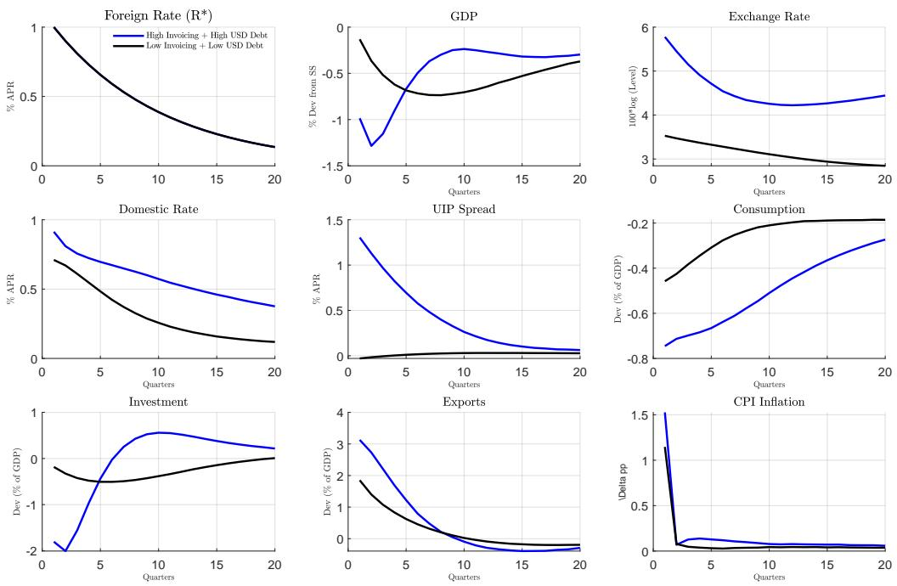  
Figure 3: Impulse responses to a foreign interest-rate shock  
Notes: High invoicing denotes a higher degree of dollar export invoicing, whereas low invoicing denotes producer-currency pricing. High USD debt denotes a higher share of bank liabilities denominated in dollars, whereas low USD debt denotes a lower dollar-liability share.

## 5.3 Mechanism

The impulse responses isolate why the interaction between dollar liabilities and dollar export invoicing is a key determinant of the UIP deviation. A foreign interest rate shock raises dollar funding costs and puts downward pressure on the domestic currency. When intermediaries have dollar liabilities, the depreciation immediately increases the local-currency value of their debt. This valuation loss reduces bank net worth, raises leverage, and tightens credit. Dollar debt therefore makes the exchange rate financially fragile.

Dollar export invoicing determines whether the economy can absorb this financial loss through the trade account. Under producer-currency pricing or flexible dollar export prices, depreciation lowers the foreign-currency price of exports and stimulates foreign demand. The trade account can then help offset the balance-sheet loss. Under sticky dollar export pricing, this relative-price channel is weaker. Dollar export prices adjust only gradually, so the same depreciation produces less immediate improvement in export competitiveness. External adjustment must then occur through a more costly combination of larger depreciation, import compression, and lower domestic absorption.

Figure 4 shows this adjustment in the external accounts. In the high-invoicing (i.e., significant amount of exports are invoiced in USD), high USD debt economy, the current account deteriorates sharply on impact and then reverses into surplus. The initial deterioration reflects the financial pressure created by the depreciation and the higher burden of dollar liabilities. The subsequent surplus reflects the economy's forced external adjustment. The trade balance improves strongly at first, but this improvement is not a sign of a frictionless expenditure-switching channel. It is achieved in an economy experiencing a large depreciation, a high UIP premium, and a sharp contraction in domestic demand.

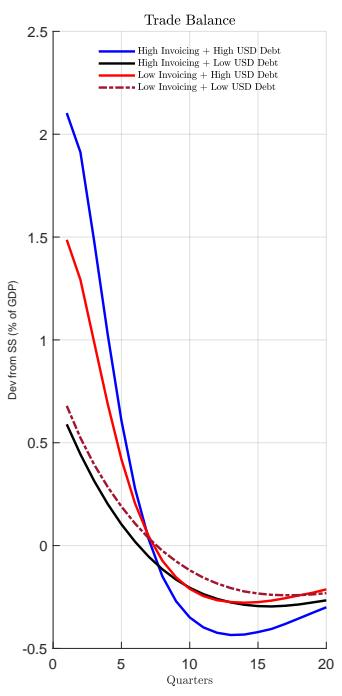

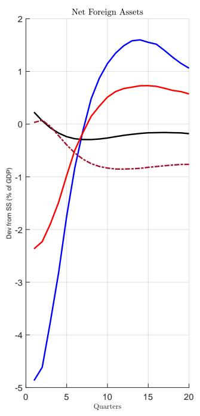

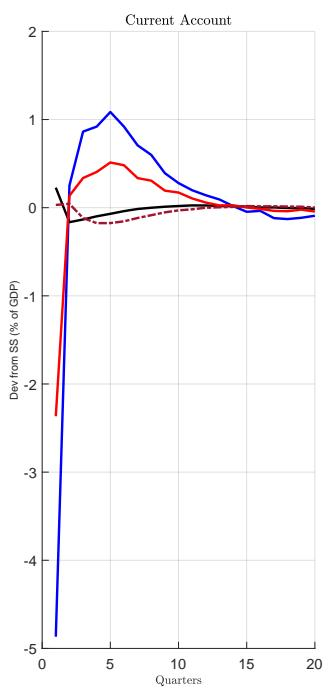  
Figure 4: Current Account Dynamics following a foreign interest rate shock

Figure 5 presents the same mechanism from the perspective of currency returns. The left panel shows that the UIP spread is largest when high dollar debt is combined with high dollar export invoicing. High dollar debt alone generates a substantial spread, but the spread is amplified when exports are also invoiced in dollars. High invoicing without high dollar debt generates only a small UIP deviation. This pattern is exactly the interaction emphasized by the analytical section: the dollar-liability share is the direct balance-sheet exposure, while export-price stickiness changes the riskiness of that exposure.

The right panel explains why. Low-invoicing economies experience a larger initial decline in dollar export prices, so the depreciation works more directly through export competitiveness. High-invoicing economies exhibit a more muted and delayed dollar-price adjustment. The exchange rate therefore has to do more work to restore external balance. In the high-debt economy, this larger exchange-rate movement simultaneously worsens intermediary balance sheets. The financial channel and the trade-pricing channel reinforce each other: dollar liabilities make depreciation costly, and sticky dollar export prices make depreciation less effective as a stabilizer.

The central implication is that the exchange rate changes role. In the low-debt or low-invoicing economies, it remains closer to a relative price that reallocates demand and absorbs foreign shocks. In the high-invoicing, high-debt economy, it becomes a macro-financial state variable. It raises import costs, revalues dollar liabilities, tightens intermediary balance sheets, and increases the compensation investors require for holding local-currency assets. This is why the joint presence of dollar liabilities and dollar export invoicing generates the largest UIP deviation and why these two margins are central to the economy's shock-absorption capacity.

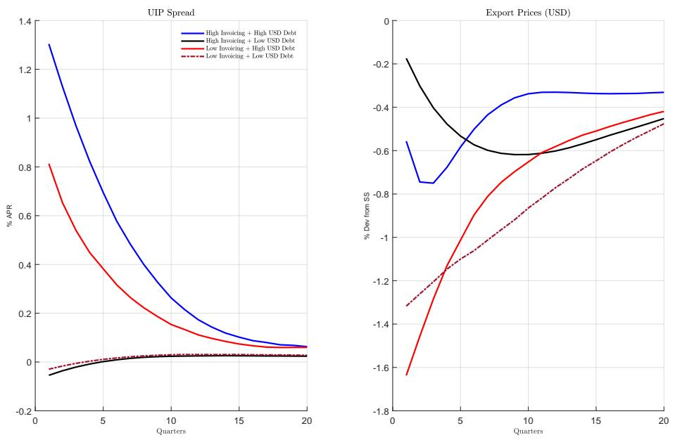  
Figure 5: UIP Spread and Export Prices

## UIP Premium

In Section 4 we show that UIP spread in the model is related to the co-movement between marginal utility and the exchange rate. Figure 6 shows the dynamic pattern of the covariance term. It rises following foreign interest rate shocks in economies with high financial dollarization.

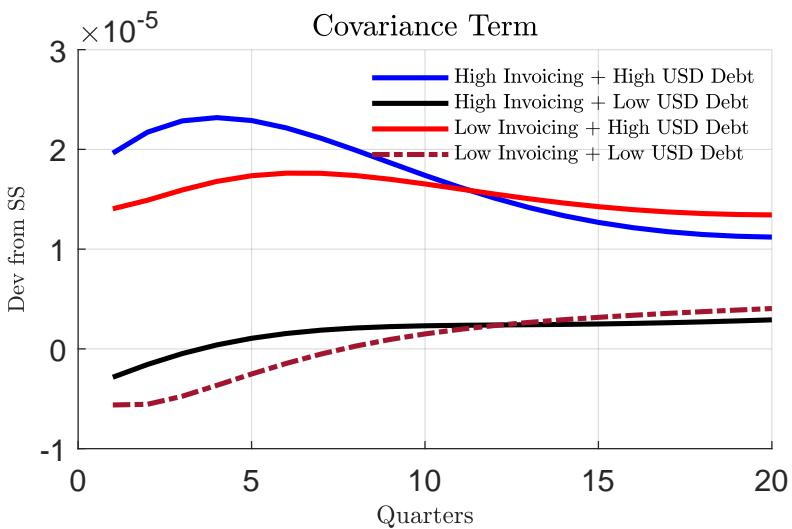  
Figure 6: Marginal Utility Exchange Rate comovement

When balance sheets are damaged, further shocks have more destabilizing effects so that aggregate volatility goes up. Against which, agents would like to hold dollar assets and banks (which use the same SDF as households) would like to borrow in local currency (avoid dollar borrowing). Equilibrium is reached at higher local interest rates.

## Financial Flows

Figure 7 shows financial flows following foreign interest rate shocks in four economies. In the presence of dollar debt, balance sheets are damaged so that bank leverage goes up to repair them. Dollar invoicing heavily amplifies the increase in leverage, which is responsible for rising macro volatility and co-movement between marginal utility and the exchange rate.

Households decrease both local deposits and foreign assets. They use foreign assets as a buffer against the shock but they mostly liquidate their local currency deposits because they do not want to hold local assets. Rising UIP premium disincentivezs banks to borrow in local currency and they end up borrowing in dollars. Rising dollar debt in the presence of declining dollar assets means that the economy accumulates higher dollar debt.

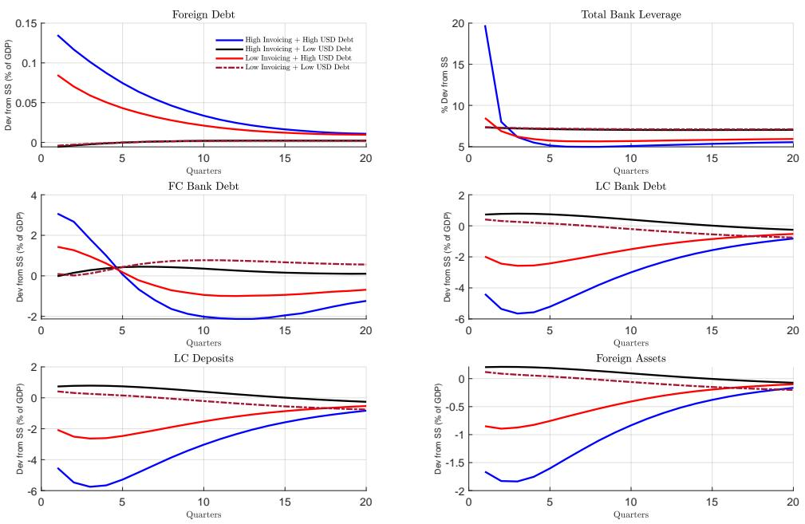  
Figure 7: Financial Flows

## 5.4 Stochastic Steady-State Results

The impulse responses describe the transmission of a single shock. We now ask how the economy's stochastic steady state changes as export-price stickiness, $\theta_{x}$ , increases. The model is solved using a third-order approximation around the non-stochastic steady state, which allows risk to affect simulation averages.

The main result is that greater export-price stickiness makes the currency both more volatile and more countercyclical. When dollar export prices adjust slowly, external shocks require larger exchange-rate movements to satisfy the balance-of-payments constraint. Those depreciations occur precisely when output is weak, because dollar liabilities reduce intermediary net worth and import prices compress domestic absorption. As a result, the exchange rate is structurally a poor hedge for domestic activity.

## Volatility, Cyclicality, and the UIP Premium

Figure 8 shows that increasing $\theta_{x}$ raises exchange-rate volatility and strengthens the negative comovement between output and the exchange rate. The economic logic follows directly from the mechanism above. Stickier dollar export prices make expenditure switching weaker. The exchange rate must therefore move more to induce the same external adjustment. With dollarized balance sheets, these larger depreciations worsen financial conditions and make output fall at the same time that the currency depreciates.

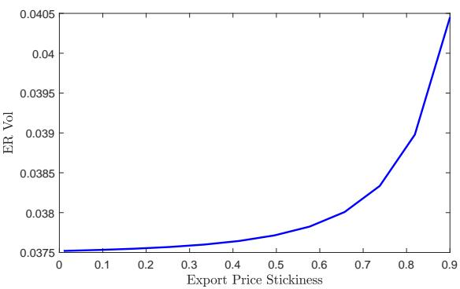  
(a) Exchange rate volatility ( $\theta_{x}$ )

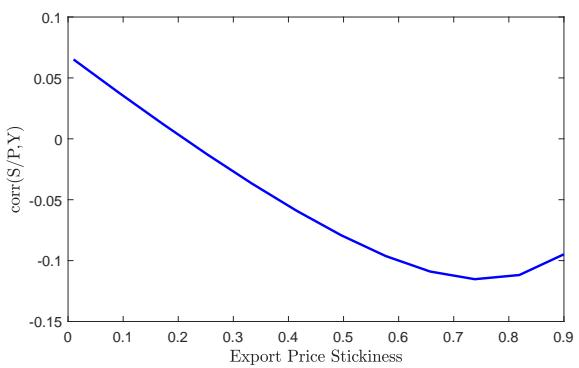  
(b) Output and exchange rate comovement ( $\theta_{x}$ )  
Figure 8: Stochastic Steady-State Volatility and Export-Price Stickiness

This change in cyclicality has an asset-pricing implication. Dollar assets appreciate in domestic downturns and therefore provide insurance to domestic agents, as emphasized by Christiano, Dalgic and Nurbekyan (2021). Local-currency assets do the opposite: they lose value in states in which domestic income is already low. Households therefore demand compensation to hold local-currency exposure. Foreign financiers also require a larger expected excess return when exchange-rate volatility rises, as in Equation 43. Figure 9 shows that the stochastic steady-state UIP premium rises with export-price stickiness. Dollar debt creates the direct exposure, while dominant-currency pricing raises the price of that exposure by making the exchange rate less stabilizing.

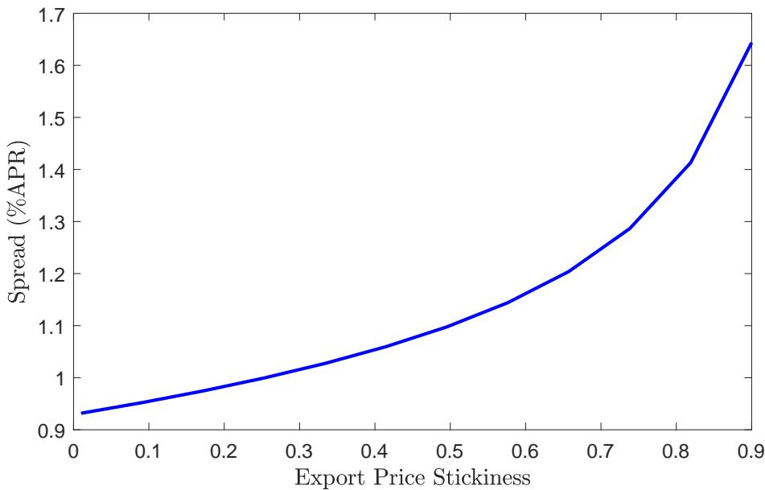  
Figure 9: UIP Premium and Export Dollar Price Stickiness ( $\theta_{x}$ )

## Inflation and Policy Trade-offs

The rise in the UIP premium also has a monetary implication. In an open economy with segmented international asset markets, the domestic nominal interest rate must compensate investors for currency risk. When the premium rises, the risk-adjusted neutral interest rate rises with it. A conventional Taylor rule with a fixed intercept, such as Equation 48, does not automatically internalize this shift. At the inflation target, the policy rate is then too low relative to the return required to clear currency markets. In equilibrium, inflation rises above target so that the Taylor rule generates a higher nominal and real interest rate. Figure 10 shows that steady-state inflation therefore increases with export-price stickiness.

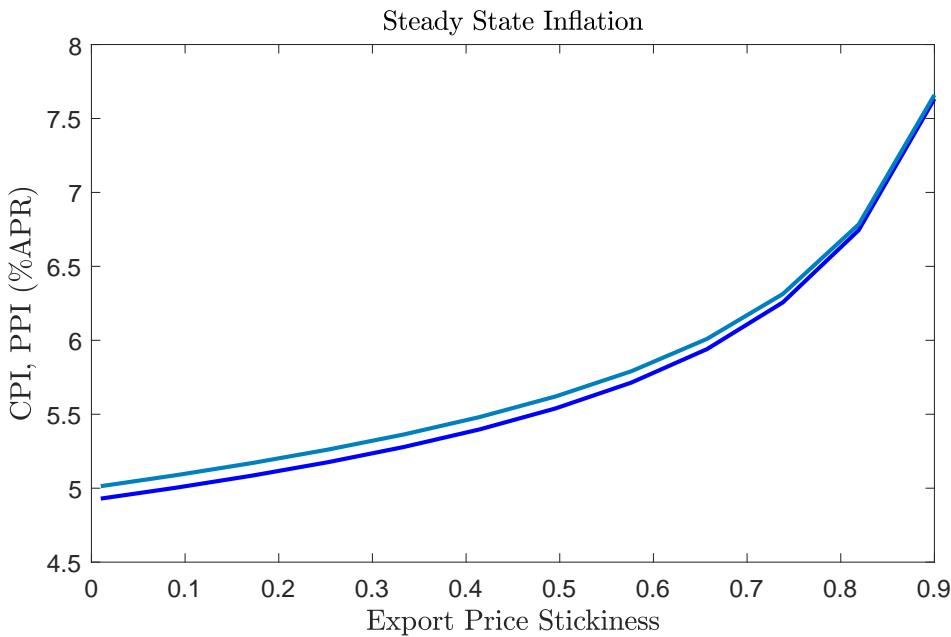  
Figure 10: Steady State Inflation and Export Price Stickiness

To illustrate the policy trade-off, we also consider a rule that responds to inflation in interest-rate changes rather than in levels, following the logic of policy rules that are robust to changes in the neutral rate in Orphanides and Williams (2006):

$$
R _ {t} - R _ {t - 1} = r ^ {\pi} \log \left(\frac {\pi_ {t}}{\bar {\pi}}\right).\tag{82}
$$

This rule allows the long-run level of the nominal interest rate to adjust to the risk premium while still anchoring inflation around its target.

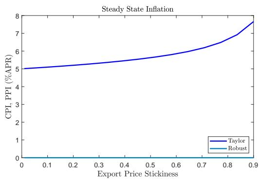  
(a) Steady State Inflation

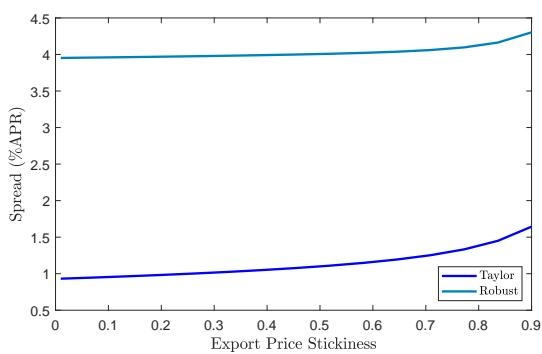  
(b) Steady State Interest Rate Spread  
Figure 11: Inflation and Risk Premium under Different Monetary Policy Rules

Figure 11a shows that the robust rule stabilizes inflation across values of $\theta_{x}$ . Figure 11b shows the cost of doing so: the domestic economy must sustain a higher interest-rate spread when the currency risk premium is high. The policy conclusion is therefore not that a different rule eliminates the underlying friction. Rather, the rule changes the form in which the friction appears. Under the standard rule, the premium shows up partly as higher average inflation. Under the robust rule, inflation is anchored, but the economy absorbs the premium through higher real rates and tighter financial conditions. The trade-off is structural: as long as dollar pricing and dollar liabilities make the exchange rate risky, monetary policy must either accommodate part of the premium or impose the real-rate adjustment required to offset it.

## 6 Conclusion

This paper develops a mechanism through which trade invoicing and financial structure jointly determine currency risk. The core argument is that dominant-currency pricing and foreign-currency liabilities are mutually reinforcing frictions. Dollar export pricing weakens the expenditure-switching benefit of depreciation. Dollar liabilities make depreciation costly for financial intermediaries. When the two frictions operate together, the exchange rate no longer behaves as a stabilizing relative price. Depreciations occur in bad states, tighten balance sheets, compress domestic absorption, and make local-currency assets risky.

The model formalizes this mechanism in a small open economy with sticky dollar export prices, dollar borrowing by intermediaries, and segmented international asset markets. The analytical results show that the UIP wedge is directly linked to the dollar-borrowing share of intermediaries, while export-price stickiness changes the equilibrium price of that exposure. The quantitative results show the same mechanism at work. Following a foreign monetary tightening, the vulnerable economy experiences a larger depreciation, a sharper decline in consumption and investment, and a higher UIP spread than a benchmark economy without dominant-currency pricing and dollar debt. The reason is not any single friction in isolation, but their interaction: the depreciation fails to stimulate exports quickly while immediately worsening balance sheets.

The stochastic steady-state results extend this logic from impulse responses to risk premia and inflation. As export-price stickiness rises, exchange-rate volatility increases and depreciations become more strongly associated with downturns. Dollar assets become better insurance, local-currency assets become riskier, and the UIP premium rises. Because this premium raises the risk-adjusted neutral interest rate, a conventional Taylor rule with a fixed intercept generates higher average inflation. A rule that accommodates movements in the neutral rate can stabilize inflation, but only by sustaining higher real rates and interest-rate spreads.

The policy implication is that monetary policy alone cannot undo the structural source of currency risk. Central banks in economies with dollar pricing and dollar liabilities face a genuine trade-off between inflation stabilization and financial tightening. Macroprudential policies that limit unhedged foreign-currency borrowing can reduce the balance-sheet amplification of depreciations. Policies that encourage more flexible or local-currency export pricing can restore part of the expenditure-switching role of the exchange rate. More generally, the framework suggests that the riskiness of a currency is not an exogenous country characteristic. It is an equilibrium outcome shaped by how goods are priced, how liabilities are denominated, and how international investors absorb currency exposure.

Future work could investigate whether exchange-rate risk also depends on the domestic allocation of credit, beyond the foreign-currency denomination of liabilities and the currency invoicing of trade. In economies where nontradable sectors are especially dependent on bank credit, depreciation-induced balance-sheet stress may tighten credit supply, compress domestic demand, and amplify exchange-rate volatility through an additional feedback mechanism.

## References

Amiti, Mary, Oleg Itskhoki, and Jozef Konings, “Dominant currencies: How firms choose currency invoicing and why it matters,” The Quarterly Journal of Economics, 2022, 137 (3), 1435–1493.

Aoki, Kosuke, Gianluca Benigno, and Nobuhiro Kiyotaki, “Monetary and Financial Policies in Emerging Markets,” 2020.

Auclert, Adrien, Matthew Rognlie, Martin Souchier, and Ludwig Straub, “Exchange Rates and Monetary Policy with Heterogeneous Agents: Sizing up the Real Income Channel,” NBER Working Papers, May 2021, (28872).

Bacchetta, Philippe, Kenza Benhima, and Brendan Berthold, “Foreign exchange intervention with UIP and CIP deviations: The case of small safe haven economies,” Swiss Finance Institute Research Paper, 2023, (23-71).

\_, Rachel Cordonier, and Ouarda Merrouche, "The rise in foreign currency bonds: The role of US monetary policy and capital controls," Journal of International Economics, 2023, 140, 103709.

Benhima, Kenza, Isabella Blengini, and Ouarda Merrouche, “Foreign Currency Debt and Disagreement,” The Economic Journal, August 2025, p. ueaf076.

Benigno, Gianluca, Pierpaolo Benigno, and Salvatore Nisticò, “Risk, Monetary Policy, and the Exchange Rate,” NBER Macroeconomics Annual, January 2012, 26 (1), 247–309.

Betts, Caroline and Michael B. Devereux, “Exchange Rate Dynamics in a Model of Pricing-to-Market,” Journal of International Economics, 2000, 50 (1), 215–244.

Bocola, Luigi and Guido Lorenzoni, “Financial Crises, Dollarization, and Lending of Last Resort in Open Economies,” American Economic Review, August 2020, 110 (8), 2524–57.

Camara, Santiago, Lawrence Christiano, and Hüsnü Dalgic, “The International Monetary Transmission Mechanism,” in “NBER Macroeconomics Annual 2024, Volume 39,” University of Chicago Press, July 2024.

Christiano, Lawrence, Husnu Dalgic, and Armen Nurbekyan, "Financial Dollarization in Emerging Markets: Efficient Risk Sharing or Prescription for Disaster?," CRC TR 224 Discussion Paper Series, August 2021, (crctr224\_2021\_306).

Corte, Pasquale Della, Steven J. Riddiough, and Lucio Sarno, "Currency Premia and Global Imbalances," Review of Financial Studies, 2016, 29 (8), 2161–2193.

Dalgic, Husnu C., “Financial Dollarization in Emerging Markets: An Insurance Arrangement,” International Economic Review, 2024, 65 (3), 1189–1219.

Dao, Mai C., Pierre-Olivier Gourinchas, and Oleg Itskhoki, “Breaking Parity: Equilibrium Exchange Rates and Currency Premia,” NBER Working Paper 34443, National Bureau of Economic Research 2025.

Devereux, Michael B. and Charles Engel, “Monetary Policy in the Open Economy Revisited: Price Setting and Exchange-Rate Flexibility,” The Review of Economic Studies, 2003, 70 (4), 765–783.

Egorov, Konstantin and Dmitry Mukhin, "Optimal Policy under Dollar Pricing," American Economic Review, 2023, 113 (7), 1783–1824.

Gertler, Mark and Peter Karadi, "A Model of Unconventional Monetary Policy," Journal of Monetary Economics, 2011, 58 (1), 17–34.

Ghironi, Fabio and Galip Kemal Ozhan, “Interest Rate Uncertainty as a Policy Tool?,” Journal of International Economics, December 2025, 158, 104180.

Goldberg, Linda S. and Cédric Tille, “Vehicle Currency Use in International Trade,” Journal of International Economics, December 2008, 76 (2), 177–192.

\_ and Signe Krogstrup, "International Capital Flow Pressures and Global Factors," Journal of International Economics, 2023, 146, 103749.

Gopinath, Gita and Jeremy C. Stein, “Banking, Trade, and the Making of a Dominant Currency,” The Quarterly Journal of Economics, 2021, 136 (2), 783–830.

— , Emine Boz, Camila Casas, Federico J. Díez, Pierre-Olivier Gourinchas, and Mikkel Plagborg-Møller, “Dominant Currency Paradigm,” American Economic Review, March 2020, 110 (3), 677–719.

Hassan, Tarek A., “Country Size, Currency Unions, and International Asset Returns,” The Journal of Finance, 2013, 68 (6), 2269–2308.

\_ and Tony Zhang, "The Economics of Currency Risk," Annual Review of Economics, August 2021, 13 (1), 281–307.

Ince, Onur and Tanya Molodtsova, “Rationality and Forecasting Accuracy of Exchange Rate Expectations: Evidence from Survey-Based Forecasts,” Journal of International Financial Markets, Institutions and Money, March 2017, 47, 131–151.

Jiang, Zhengyang, "US Fiscal Cycle and the Dollar," Journal of Monetary Economics, 2021, 124, 91–106.

\_, "Fiscal Cyclicality and Currency Risk Premia," The Review of Financial Studies, 2022, 35 (3), 1527–1552. Published online May 2021.

Kalemli-Özcan, Şebnem, “US monetary policy and international risk spillovers,” Technical Report, National Bureau of Economic Research 2019.

\_ and Filiz Unsal, "Global transmission of FED Hikes: The role of policy credibility and balance sheets," Brookings Papers on Economic Activity, 2023, 2023 (2), 169–225.

\_ and Liliana Varela, "Five facts about the uip premium," Technical Report, National Bureau of Economic Research 2021.

Liao, Gordon Y. and Tony Zhang, "The Hedging Channel of Exchange Rate Determination," The Review of Financial Studies, 2025, 38 (1), 1–38.

Lustig, Hanno, Nikolai Roussanov, and Adrien Verdelhan, “Common Risk Factors in Currency Markets,” Review of Financial Studies, 2011, 24 (11), 3731–3777.

Maggiori, Matteo, “Financial Intermediation, International Risk Sharing, and Reserve Currencies,” American Economic Review, October 2017, 107 (10), 3038–3071.

McLeay, Michael and Silvana Tenreyro, “Dollar Dominance and the Transmission of Monetary Policy,” The Quarterly Journal of Economics, September 2025, p. qjaf043.

Mukhin, Dmitry, “An Equilibrium Model of the International Price System,” American Economic Review, 2022, 112 (2), 650–688.

Obstfeld, Maurice and Kenneth Rogoff, “Exchange Rate Dynamics Redux,” Journal of Political Economy, 1995, 103 (3), 624–660.

Orphanides, Athanasios and John C. Williams, “Monetary Policy with Imperfect Knowledge,” Journal of the European Economic Association, May 2006, 4 (2-3), 366–375.

Ozhan, Galip Kemal, "Financial Intermediation, Resource Allocation, and Macroeconomic Interdependence," Journal of Monetary Economics, November 2020, 115, 265–278.

Ready, Robert, Nikolai Roussanov, and Colin Ward, “After the Tide: Commodity Currencies and Global Trade,” Journal of Monetary Economics, 2017, 85, 69–86.

\_,\_, and \_,"Commodity Trade and the Carry Trade: A Tale of Two Countries," The Journal of Finance, 2017, 72 (6), 2629–2684.

Richmond, Robert J., "Trade Network Centrality and Currency Risk Premia," Journal of Finance, 2019, 74 (3), 1315–1361.

Verdelhan, Adrien, “The Share of Systematic Variation in Bilateral Exchange Rates,” Journal of Finance, 2018, 73 (1), 375–418.

Wiriadinata, Ursula, “External Debt, Currency Risk, and International Monetary Policy Transmission,” 2021. Working paper.

Yeyati, Eduardo Levy, “Financial Dollarization: Evaluating the Consequences,” Economic Policy, 2006, 21 (45), 61–118.

## A Determinants of Currency Returns

In this section, we look at determinants of excess currency returns discussed in the literature. We consider external balance (Della Corte, Riddiough and Sarno (2016)), foreign assets in the banking system (Yeyati (2006); Christiano, Dalgic and Nurbekyan (2021)), Dollar invoicing (Gopinath, Boz, Casas, Díez, Gourinchas and Plagborg-Møller (2020)), country size (Hassan (2013)) and trade network centrality (Richmond (2019)). Across currencies, foreign liabilities (external debt, NFA) and export dollar invoicing emerge as the robustly significant determinants of currency returns. Below, we look at each of these variables in isolation. Table 8 runs a regression of average returns on the variables discussed. Similar to Hassan and Zhang (2021), including GDP to the regression makes trade centrality insignificant, this is in line with Richmond (2019) which argues that either size or connectedness makes an economy central to international trade. Data on dollar invoicing, especially for EMEs, do not exist for many countries so in order to increase the number of countries, we added seven more countries using Forward returns.

<table><tr><td rowspan="3"></td><td colspan="4">Dependent variable:</td></tr><tr><td colspan="4">Average Return</td></tr><tr><td>(1)</td><td>(2)</td><td>(3)</td><td>(4)</td></tr><tr><td>FL/FA</td><td>0.010***(0.004)</td><td></td><td>0.009**(0.004)</td><td>0.008**(0.004)</td></tr><tr><td>Net Foreign Assets/GDP</td><td>-0.031***(0.009)</td><td></td><td>-0.027***(0.003)</td><td>-0.028***(0.005)</td></tr><tr><td>GDP(Share of US)</td><td>0.006(0.005)</td><td></td><td></td><td>0.003(0.007)</td></tr><tr><td>Reserves/GDP</td><td>0.060(0.048)</td><td>0.003(0.026)</td><td>0.015(0.025)</td><td>0.033(0.042)</td></tr><tr><td>Export USD Invoicing</td><td>0.036*(0.019)</td><td>0.018**(0.008)</td><td>0.017***(0.006)</td><td>0.019**(0.009)</td></tr><tr><td>Trade Centrality</td><td></td><td>-4.304**(2.011)</td><td>-0.983(1.088)</td><td>-2.774(4.387)</td></tr><tr><td>Constant</td><td>-0.004(0.011)</td><td>0.029*(0.016)</td><td>-0.003(0.011)</td><td>0.013(0.035)</td></tr><tr><td>Observations</td><td>20</td><td>17</td><td>14</td><td>14</td></tr><tr><td> $R^2$ </td><td>0.560</td><td>0.335</td><td>0.805</td><td>0.810</td></tr><tr><td>Adjusted  $R^2$ </td><td>0.402</td><td>0.182</td><td>0.683</td><td>0.648</td></tr><tr><td>Residual Std. Error</td><td>0.020 (df = 14)</td><td>0.016 (df = 13)</td><td>0.010 (df = 8)</td><td>0.011 (df = 7)</td></tr><tr><td colspan="3">Note:</td><td colspan="2">*p&lt;0.1; **p&lt;0.05; ***p&lt;0.01</td></tr></table>

Table 8: Determinants of Returns  
Data source: IFS, Datastream, FX4Casts, Gopinath, Boz, Casas, Díez, Gourinchas and Plagborg-Møller (2020), Richmond (2019)

## A.1 Foreign Assets and Liabilities of the Banking System

First variable we consider is the ratio of foreign liabilities over foreign assets in the banking system (FL/FA). FL/FA is found to be a good predictor of banking crises (Yeyati (2006); Christiano, Dalgic and Nurbekyan (2021)). High foreign liabilities can make the banking system susceptible to panics and roll-over problems, which will be accompanied by currency depreciation and low returns for investors; against which the investors will ask for higher returns(Bocola and Lorenzoni (2020)). In Figure 12, we plot average excess returns against average FL/FA. In economies where the banking system carries high foreign debt, we see higher expected currency returns.

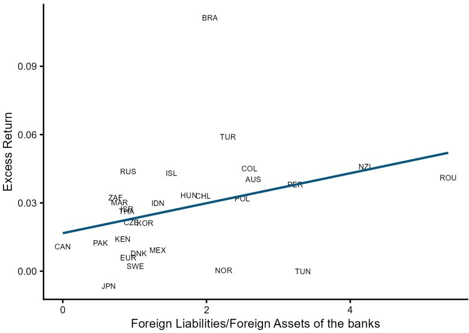  
Figure 12: FL/FA and excess returns

Data source: FX4Casts, IMF IFS. Y-axis variable is the average currency return of 25 countries between 02/2003 - 11/2018. X-axis variable is the ratio of foreign liabilities to foreign assets in the banking system

## A.2 Reserves

Against foreign borrowing, central banks can hold reserves, which should reduce the risk of rollover crises. However, we do not see a significant relationship between reserves and average excess returns. In figure 13, we plot average excess returns against reserves as a share of GDP.

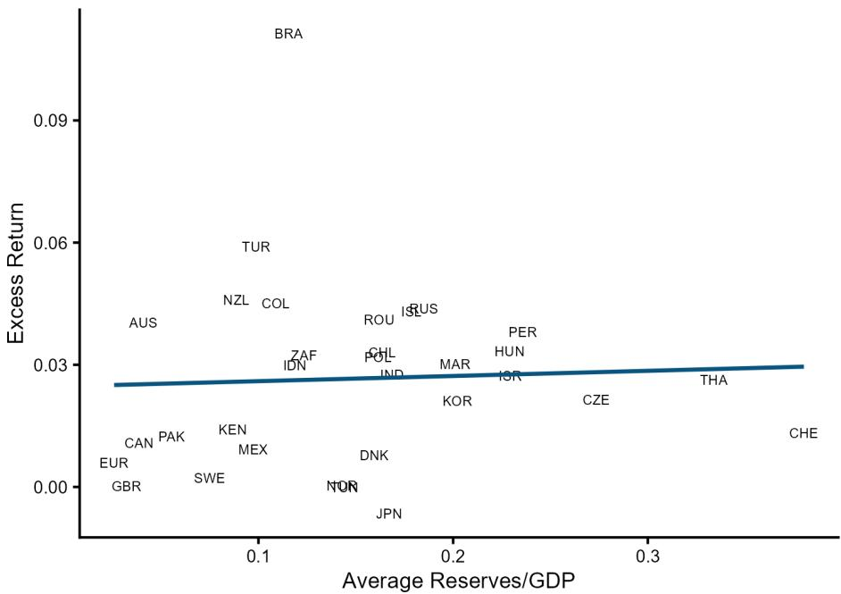  
Figure 13: Reserves and excess returns  
Data source: FX4Casts, IMF IFS. Y-axis variable is the average currency return of 25 countries between 02/2003 - 11/2018. X-axis variable is the reserves as a share of GDP

## A.3 External Balance

The third variable we consider is external balance as a share of GDP, which is a proxy for net investment position of a country which is found to be an important determinant of currency returns (Della Corte, Riddiough and Sarno (2016)). The clear negative relationship can be seen in the figure below.

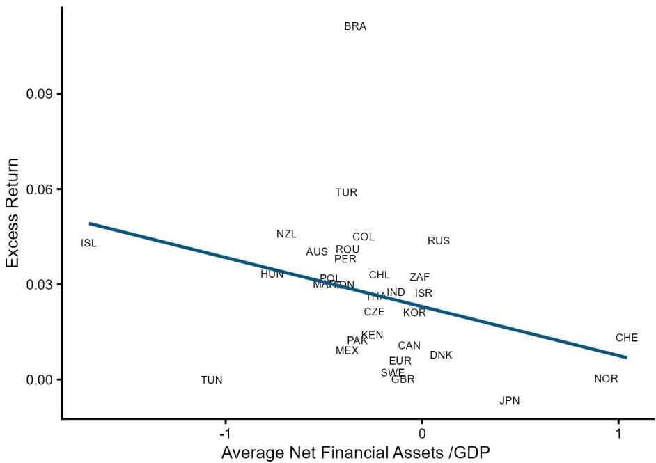  
Figure 14: NFA and excess returns  
Data source: FX4Casts, IMF IFS. Y-axis variable is the average currency return of 25 countries between 02/2003 - 11/2018. X-axis variable is the average net external balance as a share of GDP,

## A.4 Size and Trade Centrality

Country size (Hassan (2013)) and trade network centrality (Richmond (2019)) is found to be significant determinants of excess currency returns. Shocks to larger and/or to more central economies affect smaller economies but shocks to smaller economies do not spill over to larger economies. Then, assets of larger or more central economies provide insurance not only against country specific shocks, but also against global shocks. Thus, local currency assets of larger and/or more central economies should provide lower returns since there is high demand for them (see Figure 15).

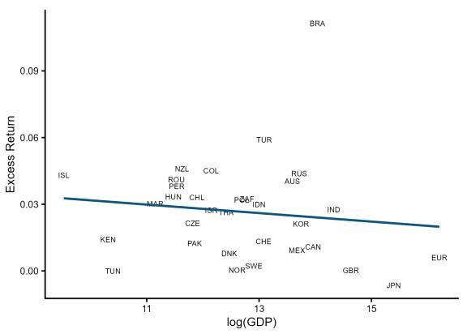

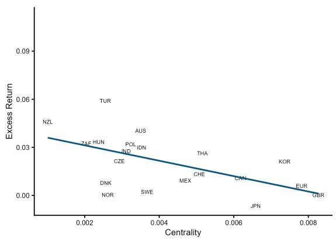  
Figure 15: Size, centrality and excess returns  
Data source: FX4Casts, IMF IFS, Richmond (2019). Y-axis variable is the average currency return of 25 countries between 02/2003 - 11/2018. X-axis variables is the average log nominal GDP and average trade network centrality

## A.5 Financial Depth and Currency Returns

Figure 16 plots total foreign assets and liabilities as a share of GDP, a proxy for financial depth, against excess returns. Maggiori (2017) argues that countries whose financial system is deep can intermediate large amounts of flows and carry a safety premium. Net external balance and financial depth highly correlate.

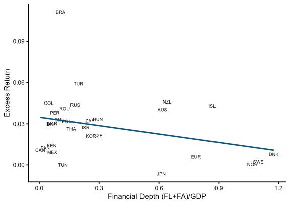  
Figure 16: Excess returns vs Financial Depth  
Data source: FX4Casts. Y-axis variable is the average currency return of 25 countries between 02/2003 - 11/2018. X-axis variables is the sum of foreign assets and liabilities of the banking system as a share of GDP, proxy for financial depth.

## A.6 Dollar Invoicing and Currency Returns

Figure 17a provides a clear visual illustration of this two-part mechanism. Panel (a) plots the strong, negative relationship between Dollar Invoicing and the GDP-ER correlation ( $R^{2} = 0.198$ ). This visually confirms our first finding: as invoicing increases, the exchange rate becomes more countercyclical. Panel (b) completes the story by showing that this risk is priced. It plots average Excess Returns against Export Invoicing, revealing a positive relationship ( $R^{2} = 0.143$ ).

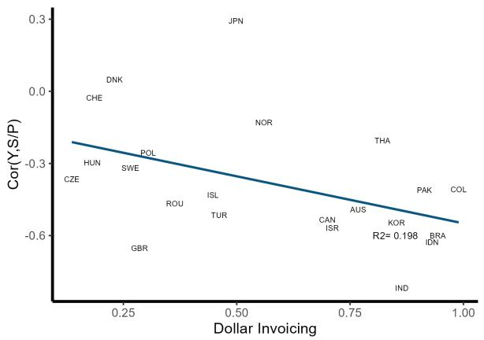  
(a) Correlation of the exchange rate with GDP

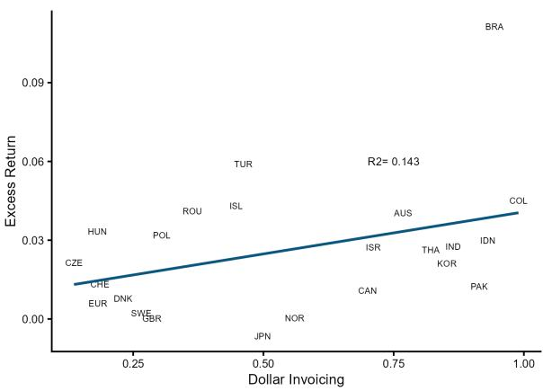  
(b) Average excess returns  
Figure 17: Currency Cyclicality and Returns, and Dollar Invoicing  
Data source: IMF, FX4Casts, Gopinath, Boz, Casas, Díez, Gourinchas and Plagborg-Møller (2020). Y-axis variables the comovement between GDP-ER and the average currency return of 25 countries between 02/2003 - 11/2018. X-axis variable is the average dollar invoicing share of exports.

## B Inflation and GDP-ER Co-movement

In countries where the exports are mostly invoiced in USD, expenditure switching channel is muted. In these economies, the monetary policy faces a dilemma following external shocks. Economies with flexible export prices can respond to external shocks that cause exchange rate depreciations (capital flight, foreign interest rate shock etc.) by increasing exports which stimulates the economy. On the other hand, in countries with sticky export prices, external shocks are more contractionary because of weak response of exports.

Figure 18 plots average inflation against GDP-ER correlation. In countries with high inflation we tend to see countercyclical exchange rate

Figure 19 plots average inflation against average excess returns. In countries with high average inflation, demand for local currency assets is low, which drives up local currency interest rates.

Figure 20 plots export dollar invoicing against average inflation. In line with our theory, in countries with high dollar invoicing, monetary policy cannot react sharply against external shocks because exchange rate shocks are recessionary. In these economies, we see high average inflation.

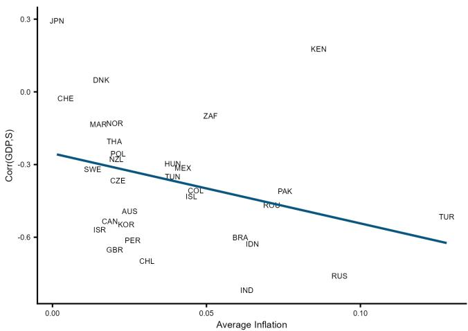  
Figure 18: Average Inflation vs GDP-ER Correlation

Data source: FX4Casts, IMF IFS. S is the Dollar exchange rate and P is the CPI.

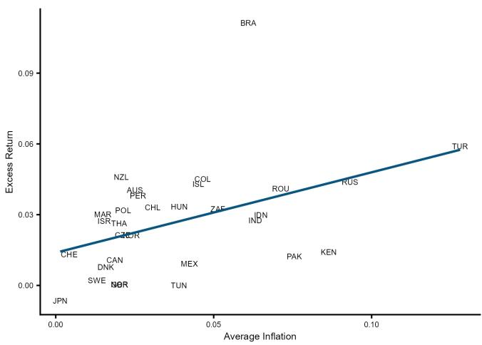  
Figure 19: Average Inflation vs Average Excess Returns

Data source: FX4Casts, IMF IFS. Y-axis variable is the average currency return of 25 countries between 02/2003 - 11/2018. X-axis variables are $\Delta \log$ GDP and $\Delta \log \frac{S}{P}$ . S is the Dollar exchange rate and P is the CPI.

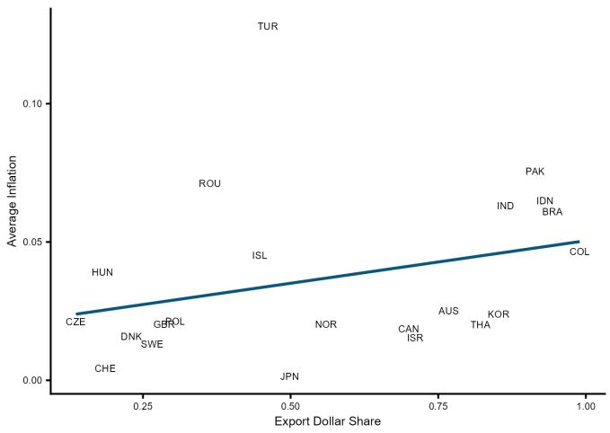  
Figure 20: Average Inflation vs Dollar invoicing in exports  
Data source: IMF, IFS, Gopinath, Boz, Casas, Díez, Gourinchas and Plagborg-Møller (2020). Y-axis variables are $\Delta$ logGDP and $\Delta$ log $\frac{S}{P}$ . S is the Dollar exchange rate and P is the CPI. X-axis variable is the average dollar invoicing share of imports.

In addition to average inflation, we also look at price level volatility $^{5}$ . The results are virtually the same.

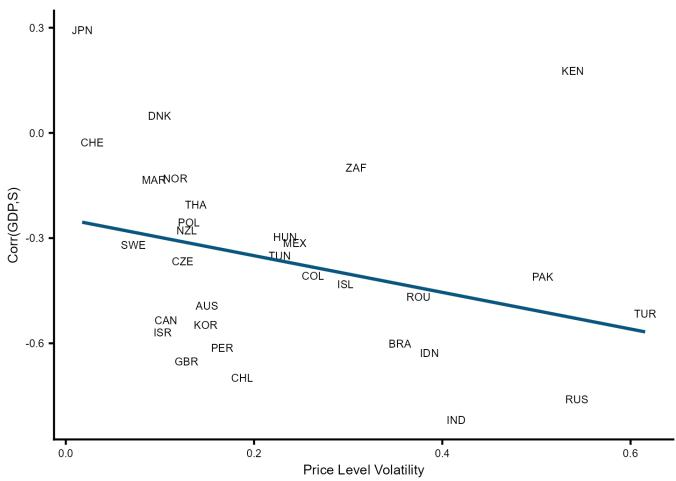  
Figure 21: Price Level Volatility vs GDP-ER Correlation  
Data source: FX4Casts, IMF IFS. S is the Dollar exchange rate and P is the CPI.  
$^{5}$ We estimate price level volatility as the standard deviation of $\log(P_{t})$ , where $P_{t}$ is the CPI index.

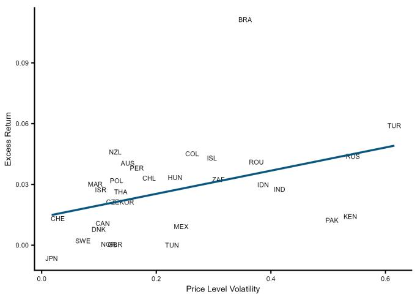  
Figure 22: Price Level Volatility vs Average Excess Returns  
Data source: FX4Casts, IMF IFS. Y-axis variable is the average currency return of 26 countries between 02/2003 - 11/2018. S is the Dollar exchange rate and P is the CPI.

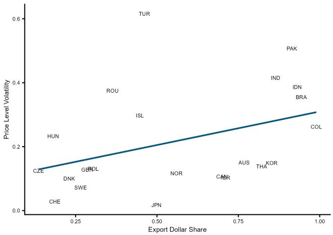  
Figure 23: Price Level Volatility vs Dollar invoicing in exports  
Data source: IMF, IFS, Gopinath, Boz, Casas, Díez, Gourinchas and Plagborg-Møller (2020). Y-axis variables are $\Delta$ logGDP and $\Delta$ log $\frac{S}{P}$ . S is the Dollar exchange rate and P is the CPI. X-axis variable is the average dollar invoicing share of imports.

## C Forward Returns

Covered interest rate parity gives us an alternative measure for currency returns. Denote $F_{t}$ as the price of a forward contract. No arbitrage condition requires that the return to a hedged currency position financed by USD should be equal to the return to USD returns.

$$
\frac {S _ {t}}{F _ {t}} R _ {t} ^ {L} = R _ {t} ^ {U S}\tag{83}
$$

We can replace $R_{t}^{L}$ inside the equation 1 using the equation 83,

$$
R _ {t} ^ {U S} \left(\frac {F _ {t}}{S _ {t + 1}} - 1\right)\tag{84}
$$

Equation 84 allows us to overcome the problem of finding compatible interest rates across countries as well as accounting for trading costs using different ask/bid prices. One big potential issue with the forward returns is there are documented large CIP deviations. Verdelhan (2018) notes that in CIP holds most of the time in the monthly data. Still, buying forward contracts is the most straightforward strategy to invest in other currencies. Forward returns are by themselves valid returns, irrespective of whether they are a good proxy for actually borrowing in USD and investing in local currency interest rates.

## D Details of the Model

## D.1 Household First-Order Conditions

Work with the real budget constraint

$$
d _ {t} + d _ {t} ^ {*} + p _ {t} ^ {c} C _ {t} = R _ {t - 1} d _ {t - 1} + s _ {t} R _ {t - 1} ^ {*} d _ {t - 1} ^ {*} + w _ {t} l _ {t} + T _ {t}, \qquad s _ {t} \equiv \frac {S _ {t}}{S _ {t - 1}}.\tag{85}
$$

Let $\mu_{t}$ be the multiplier on (85). The FOC for consumption is

$$
u _ {C} (C _ {t}) - \mu_ {t} p _ {t} ^ {c} = 0, \quad \mu_ {t} = \frac {u _ {C} (C _ {t})}{p _ {t} ^ {c}}.\tag{86}
$$

The FOC for labor is

$$
- \xi l _ {t} ^ {\varphi_ {l}} + \mu_ {t} w _ {t} = 0.\tag{87}
$$

Substituting (86) into (87) gives

$$
\frac {w _ {t}}{p _ {t} ^ {c}} = \frac {\xi l _ {t} ^ {\varphi_ {l}}}{u _ {C} (C _ {t})}.\tag{88}
$$

Define total real savings $A_{t} = d_{t} + d_{t}^{*}$ and dollar share $\Theta_{t} = d_{t}^{*}/A_{t}$ . The portfolio return chosen at time t is

$$
(1 - \Theta_ {t}) R _ {t} + \Theta_ {t} s _ {t + 1} R _ {t} ^ {*}.\tag{89}
$$

The FOC for total savings is

$$
u _ {C} (C _ {t}) = \beta_ {t} \left[ \frac {u _ {C} (C _ {t + 1})}{\Pi_ {t + 1} ^ {c}} \left((1 - \Theta_ {t}) R _ {t} + \Theta_ {t} s _ {t + 1} R _ {t} ^ {*}\right) \right].\tag{90}
$$

For a pure local-currency asset this reduces to

$$
1 = R _ {t t} [ m _ {t + 1} ],\tag{91}
$$

and for a pure dollar asset it reduces to

$$
1 = R _ {t t} ^ {*} \left[ m _ {t + 1} \frac {S _ {t + 1}}{S _ {t}} \right].\tag{92}
$$

The FOC for the dollar share is

$$
- \gamma_ {\Theta} (\Theta_ {t} - \Upsilon_ {t}) + \beta A _ {t t} \left[ \frac {u _ {C} (C _ {t + 1})}{\Pi_ {t + 1} ^ {c}} (s _ {t + 1} R _ {t} ^ {*} - R _ {t}) \right] = 0.\tag{93}
$$

Rearranging gives

$$
\gamma_ {\Theta} (\Theta_ {t} - \Upsilon_ {t}) = \beta A _ {t t} \left[ \frac {u _ {C} (C _ {t + 1})}{\Pi_ {t + 1} ^ {c}} (R _ {t} - s _ {t + 1} R _ {t} ^ {*}) \right].\tag{94}
$$

## D.2 CES Demand Systems

For a generic two-input CES aggregator

$$
Q = \left[ a ^ {1 / \eta} q _ {1} ^ {\frac {\eta - 1}{\eta}} + (1 - a) ^ {1 / \eta} q _ {2} ^ {\frac {\eta - 1}{\eta}} \right] ^ {\frac {\eta}{\eta - 1}},\tag{95}
$$

a competitive producer solves

$$
\min _ {q _ {1}, q _ {2}} P _ {1} q _ {1} + P _ {2} q _ {2}\tag{96}
$$

subject to (95). The FOCs imply

$$
\frac {P _ {1}}{P _ {2}} = \left(\frac {a}{1 - a}\right) ^ {1 / \eta} \left(\frac {q _ {2}}{q _ {1}}\right) ^ {1 / \eta}.\tag{97}
$$

Raising both sides to the power $\eta$ and rearranging gives

$$
\frac {q _ {1}}{q _ {2}} = \frac {a}{1 - a} \left(\frac {P _ {1}}{P _ {2}}\right) ^ {- \eta}.\tag{98}
$$

The demand functions and price index are therefore

$$
q _ {1} = a \left(\frac {P _ {1}}{P _ {Q}}\right) ^ {- \eta} Q,\tag{99}
$$

$$
q _ {2} = (1 - a) \left(\frac {P _ {2}}{P _ {Q}}\right) ^ {- \eta} Q,\tag{100}
$$

$$
P _ {Q} = \left[ a P _ {1} ^ {1 - \eta} + (1 - a) P _ {2} ^ {1 - \eta} \right] ^ {\frac {1}{1 - \eta}}.\tag{101}
$$

The consumption, investment, and export demand systems in the main text follow by assigning Q to $C_{t}$ , $I_{t}$ , or $X_{t}$ and choosing the appropriate share parameter and elasticity.

For the continuum CES aggregator

$$
Y _ {t} = \left[ \int_ {0} ^ {1} Y _ {i, t} ^ {\frac {\varepsilon - 1}{\varepsilon}} i \right] ^ {\frac {\varepsilon}{\varepsilon - 1}},\tag{102}
$$

cost minimization gives

$$
Y _ {i, t} = Y _ {t} \left(\frac {P _ {i , t}}{P _ {t}}\right) ^ {- \varepsilon}, \qquad P _ {t} = \left[ \int_ {0} ^ {1} P _ {i, t} ^ {1 - \varepsilon} i \right] ^ {\frac {1}{1 - \varepsilon}}.\tag{103}
$$

## D.3 Domestic Calvo Pricing

A domestic intermediate firm that can reset its price at time t chooses $\tilde{P}_{t}$ to maximize

$$
{ } _ { t } \sum _ { j = 0 } ^ { \infty } ( \beta \theta _ { p } ) ^ { j } \frac { u _ { C } ( C _ { t + j } ) } { P _ { t + j } ^ { c } } \left( \widetilde { P } _ { t } - P _ { t + j } m c _ { t + j } \right) Y _ { t + j } \left( \frac { \widetilde { P } _ { t } } { P _ { t + j } } \right) ^ { - \varepsilon } .\tag{104}
$$

Differentiating with respect to $\widetilde{P}_{t}$ gives

$$
\sum_ {t = 0} ^ {\infty} (\beta \theta_ {p}) ^ {j} \frac {u _ {C} (C _ {t + j})}{P _ {t + j} ^ {c}} P _ {t + j} ^ {\varepsilon} Y _ {t + j} \left[ \frac {\widetilde {P} _ {t}}{P _ {t + j}} - \frac {\varepsilon}{\varepsilon - 1} m c _ {t + j} \right] = 0.\tag{105}
$$

Collecting the terms that multiply the reset price and the terms involving marginal cost yields

$$
\widetilde {p} _ {t} = \frac {\mathcal {K} _ {t} ^ {p}}{\mathcal {F} _ {t} ^ {p}},\tag{106}
$$

with the recursive sums reported in (16) and (17). The aggregate price index satisfies

$$
P _ {t} ^ {1 - \varepsilon} = (1 - \theta_ {p}) \widetilde {P} _ {t} ^ {1 - \varepsilon} + \theta_ {p} P _ {t - 1} ^ {1 - \varepsilon}.\tag{107}
$$

## D.4 Export Pricing in Dollars

The export-input aggregator implies the demand curve

$$
X _ {i, t} = X _ {t} ^ {d} \left(\frac {P _ {i , t} ^ {d , x}}{P _ {t} ^ {d , x}}\right) ^ {- \varepsilon_ {x}}.\tag{108}
$$

A resetting export producer chooses a dollar price $\widetilde{P}_{t}^{d,x}$ to maximize the discounted value of local-currency profits:

$$
\sum_ {t = 0} ^ {\infty} (\beta \theta_ {x}) ^ {j} \frac {u _ {C} (C _ {t + j})}{P _ {t + j} ^ {c}} \left[ S _ {t + j} \widetilde {P} _ {t} ^ {d, x} - P _ {t + j} \right] X _ {t + j} ^ {d} \left(\frac {\widetilde {P} _ {t} ^ {d , x}}{P _ {t + j} ^ {d , x}}\right) ^ {- \varepsilon_ {x}}.\tag{109}
$$

The term $S_{t+j}\widetilde{P}_{t}^{d,x}$ is local-currency revenue from a dollar price, while $P_{t+j}$ is the local-currency marginal cost of the domestic input. Differentiating gives the export-sector reset-price condition

$$
\widetilde {p} _ {t} ^ {d, x} = \frac {\mathcal {K} _ {t} ^ {x}}{\mathcal {F} _ {t} ^ {x}},\tag{110}
$$

where the numerator contains discounted marginal costs and the denominator contains discounted demand. The export dollar-price index evolves according to

$$
(P _ {t} ^ {d, x}) ^ {1 - \varepsilon_ {x}} = (1 - \theta_ {x}) (\widetilde {P} _ {t} ^ {d, x}) ^ {1 - \varepsilon_ {x}} + \theta_ {x} (P _ {t - 1} ^ {d, x}) ^ {1 - \varepsilon_ {x}}.\tag{111}
$$

Dividing by $(P_t^{d,x})^{1 - \varepsilon_x}$ gives

$$
1 = (1 - \theta_ {x}) (\widetilde {p} _ {t} ^ {d, x}) ^ {1 - \varepsilon_ {x}} + \theta_ {x} (\Pi_ {t} ^ {d, x}) ^ {\varepsilon_ {x} - 1},\tag{112}
$$

where $\Pi_{t}^{d,x}\equiv P_{t}^{d,x}/P_{t-1}^{d,x}$ . This equation links reset prices to export dollar-price inflation and makes clear that $\theta_{x}$ governs the degree of dominant-currency pricing.

## D.5 Banker Leverage and Currency Choice

The banker value function is

$$
V _ {j, t} = E _ {t} \left[ \beta (1 - \theta_ {b}) N _ {j, t + 1} + \beta \theta_ {b} \Lambda_ {t, t + 1} V _ {j, t + 1} \right].\tag{113}
$$

Using the scaled net-worth law, the value per unit of net worth for foreign-currency borrowing can be written as

$$
\psi_ {t} ^ {F C} = \max _ {L _ {t} ^ {F C}} t \left[ \beta \Lambda_ {t, t + 1} \Omega_ {t + 1} ^ {F C} \left(L _ {t} ^ {F C} \left(R _ {t + 1} ^ {k} - R _ {t} ^ {*} \frac {S _ {t + 1}}{S _ {t}}\right) + R _ {t} ^ {*} \frac {S _ {t + 1}}{S _ {t}}\right) \right],\tag{114}
$$

where

$$
\Omega_ {t + 1} ^ {F C} = (1 - \theta_ {b}) + \theta_ {b} \psi_ {t + 1} ^ {F C}.\tag{115}
$$

Define

$$
\eta_ {t} ^ {F C} \equiv E _ {t} \left[ \beta \Lambda_ {t, t + 1} \Omega_ {t + 1} ^ {F C} \left(R _ {t + 1} ^ {k} - R _ {t} ^ {*} \frac {S _ {t + 1}}{S _ {t}}\right) \right],\tag{116}
$$

$$
\nu_ {t} ^ {F C} \equiv E _ {t} \left[ \beta \Lambda_ {t, t + 1} \Omega_ {t + 1} ^ {F C} R _ {t} ^ {*} \frac {S _ {t + 1}}{S _ {t}} \right].\tag{117}
$$

Then

$$
\psi_ {t} ^ {F C} = \eta_ {t} ^ {F C} L _ {t} ^ {F C} + \nu_ {t} ^ {F C}.\tag{118}
$$

Under the binding incentive constraint $\psi_{t}^{FC} = \lambda_{b} L_{t}^{FC}$ ,

$$
\lambda_ {b} L _ {t} ^ {F C} = \eta_ {t} ^ {F C} L _ {t} ^ {F C} + \nu_ {t} ^ {F C}, \qquad L _ {t} ^ {F C} = \frac {\nu_ {t} ^ {F C}}{\lambda_ {b} - \eta_ {t} ^ {F C}}.\tag{119}
$$

The local-currency formulas are analogous:

$$
L _ {t} ^ {L C} = \frac {\nu_ {t} ^ {L C}}{\lambda_ {b} - \eta_ {t} ^ {L C}},\tag{120}
$$

$$
\eta_ {t} ^ {L C} = E _ {t} \left[ \beta \Lambda_ {t, t + 1} \Omega_ {t + 1} ^ {L C} (R _ {t + 1} ^ {k} - R _ {t}) \right],\tag{121}
$$

$$
\nu_ {t} ^ {L C} = E _ {t} \left[ \beta \Lambda_ {t, t + 1} \Omega_ {t + 1} ^ {L C} R _ {t} \right].\tag{122}
$$

The bank chooses its dollar-liability share by solving

$$
\max _ {\phi_ {t}} (1 - \phi_ {t}) \psi_ {t} ^ {L C} + \phi_ {t} \psi_ {t} ^ {F C} - \frac {\chi_ {\phi}}{2} (\phi_ {t} - \bar {\phi}) ^ {2}.\tag{123}
$$

The FOC is

$$
- \psi_ {t} ^ {L C} + \psi_ {t} ^ {F C} - \chi_ {\phi} (\phi_ {t} - \bar {\phi}) = 0,\tag{124}
$$

or

$$
\psi_ {t} ^ {F C} - \psi_ {t} ^ {L C} = \chi_ {\phi} (\phi_ {t} - \bar {\phi}).\tag{125}
$$

Using $\psi_t^k = \lambda_bL_t^k$ gives

$$
\phi_ {t} - \bar {\phi} = \frac {\lambda_ {b}}{\chi_ {\phi}} (L _ {t} ^ {F C} - L _ {t} ^ {L C}).\tag{126}
$$

## E From Dollar Liabilities and Export Pricing to the Un- conditional UIP Premium

This appendix provides the derivation behind Section 4. The goal is to connect the bank's conditional funding wedge to the unconditional currency risk premium that appears in the quantitative exercises. The derivation proceeds in five steps. First, we derive the conditional bank-weighted UIP wedge from the bank's currency-choice problem. Second, we map that conditional wedge into the simple local-currency premium using a covariance decomposition. Third, we show how the level of dollar liabilities, $\bar{\phi}$ , scales the covariance between depreciation and bank net worth. Fourth, we map bank net worth into the continuation-value component of the banker stochastic discount factor. Fifth, we combine these objects into a local expression for the unconditional premium.

## E.1 The bank-weighted funding wedge

Let

$$
s _ {t + 1} \equiv \frac {S _ {t + 1}}{S _ {t}}
$$

denote gross depreciation. The bank valuation kernel for funding currency $k \in \{LC, FC\}$ is

$$
\mathcal {M} _ {t + 1} ^ {k} = \beta \Lambda_ {t, t + 1} \Omega_ {t + 1} ^ {k},\tag{127}
$$

where $\Lambda_{t,t+1}$ is the household stochastic discount factor and $\Omega_{t+1}^{k}$ is the continuation-value component of bank net worth.

The local-currency and foreign-currency funding terms are

$$
\nu_ {t} ^ {L C} = \mathbb {E} _ {t} \left[ \mathcal {M} _ {t + 1} ^ {L C} R _ {t} \right],\tag{128}
$$

and

$$
\nu_ {t} ^ {F C} = \mathbb {E} _ {t} \left[ \mathcal {M} _ {t + 1} ^ {F C} R _ {t} ^ {*} s _ {t + 1} \right].\tag{129}
$$

Define the bank-weighted funding wedge as

$$
\mathcal {U} _ {t} ^ {B} \equiv \nu_ {t} ^ {L C} - \nu_ {t} ^ {F C}.\tag{130}
$$

This is the bank-valued excess return on local-currency funding relative to dollar funding.

The bank's value per unit of net worth in funding currency $k$ can be written as

$$
\psi_ {t} ^ {k} = \eta_ {t} ^ {k} L _ {t} ^ {k} + \nu_ {t} ^ {k}, \qquad k \in \{L C, F C \}.\tag{131}
$$

Under the binding incentive constraint,

$$
\psi_ {t} ^ {k} = \lambda_ {b} L _ {t} ^ {k}.\tag{132}
$$

Combining (131) and (132) gives

$$
L _ {t} ^ {k} = \frac {\nu_ {t} ^ {k}}{\lambda_ {b} - \eta_ {t} ^ {k}}.\tag{133}
$$

Linearize (133) around a symmetric reference point with

$$
L _ {t} ^ {L C} \simeq L _ {t} ^ {F C} \simeq L, \qquad \eta_ {t} ^ {L C} \simeq \eta_ {t} ^ {F C} \simeq \eta , \qquad \nu_ {t} ^ {L C} \simeq \nu_ {t} ^ {F C} \simeq \nu .
$$

A first-order expansion gives

$$
L _ {t} ^ {F C} - L _ {t} ^ {L C} \approx \frac {1}{\lambda_ {b} - \eta} \left[ \left(\nu_ {t} ^ {F C} - \nu_ {t} ^ {L C}\right) + L \left(\eta_ {t} ^ {F C} - \eta_ {t} ^ {L C}\right) \right].\tag{134}
$$

The funding wedge raises the value of levered foreign-currency excess returns and lowers the value of the unlevered foreign-currency funding return relative to local currency. Locally,

$$
\nu_ {t} ^ {L C} - \nu_ {t} ^ {F C} \approx \mathcal {U} _ {t} ^ {B}, \qquad \eta_ {t} ^ {L C} - \eta_ {t} ^ {F C} \approx - \mathcal {U} _ {t} ^ {B}.\tag{135}
$$

Substituting (135) into (134) yields

$$
L _ {t} ^ {F C} - L _ {t} ^ {L C} \approx \frac {L - 1}{\lambda_ {b} - \eta} \mathcal {U} _ {t} ^ {B}.\tag{136}
$$

The bank chooses its dollar-liability share by solving

$$
\max _ {\phi_ {t}} (1 - \phi_ {t}) \psi_ {t} ^ {L C} + \phi_ {t} \psi_ {t} ^ {F C} - \frac {\chi_ {\phi}}{2} (\phi_ {t} - \bar {\phi}) ^ {2}.\tag{137}
$$

The first-order condition is

$$
\psi_ {t} ^ {F C} - \psi_ {t} ^ {L C} = \chi_ {\phi} (\phi_ {t} - \bar {\phi}).\tag{138}
$$

Using $\psi_t^k = \lambda_b L_t^k$ , this becomes

$$
L _ {t} ^ {F C} - L _ {t} ^ {L C} = \frac {\chi_ {\phi}}{\lambda_ {b}} (\phi_ {t} - \bar {\phi}).\tag{139}
$$

Combining (136) and (139) gives

$$
\mathcal {U} _ {t} ^ {B} = \frac {\chi_ {\phi} (\lambda_ {b} - \eta)}{\lambda_ {b} (L - 1)} (\phi_ {t} - \bar {\phi}).\tag{140}
$$

The terms L, $\eta$ , and $\nu$ are equilibrium objects. Since export-price stickiness changes

output, capital returns, exchange-rate volatility, and bank net worth, we write

$$
\eta = \eta (\theta_ {x}, \bar {\phi}), \qquad \nu = \nu (\theta_ {x}, \bar {\phi}), \qquad L (\theta_ {x}, \bar {\phi}) = \frac {\nu (\theta_ {x} , \bar {\phi})}{\lambda_ {b} - \eta (\theta_ {x} , \bar {\phi})}.\tag{141}
$$

Thus

$$
\mathcal {U} _ {t} ^ {B} = \Gamma (\theta_ {x}, \bar {\phi}) (\phi_ {t} - \bar {\phi}),\tag{142}
$$

where

$$
\Gamma (\theta_ {x}, \bar {\phi}) = \frac {\chi_ {\phi} [ \lambda_ {b} - \eta (\theta_ {x} , \bar {\phi}) ]}{\lambda_ {b} [ L (\theta_ {x} , \bar {\phi}) - 1 ]} = \frac {\chi_ {\phi} [ \lambda_ {b} - \eta (\theta_ {x} , \bar {\phi}) ] ^ {2}}{\lambda_ {b} [ \nu (\theta_ {x} , \bar {\phi}) - \lambda_ {b} + \eta (\theta_ {x} , \bar {\phi}) ]}.\tag{143}
$$

This is the conditional bank-side mapping. It should not be confused with the unconditional currency risk premium. The latter depends on the covariance between depreciation and the pricing kernel.

## E.2 From the bank-weighted wedge to the simple currency premium

The simple local-currency premium is

$$
p _ {t} ^ {L C} \equiv R _ {t} - R _ {t} ^ {*} \mathbb {E} _ {t} s _ {t + 1}.\tag{144}
$$

Using (130),

$$
\mathcal {U} _ {t} ^ {B} = \mathbb {E} _ {t} [ \mathcal {M} _ {t + 1} ^ {L C} ] R _ {t} - R _ {t} ^ {*} \mathbb {E} _ {t} [ \mathcal {M} _ {t + 1} ^ {F C} s _ {t + 1} ].\tag{145}
$$

Now use

$$
\mathbb {E} _ {t} [ \mathcal {M} _ {t + 1} ^ {F C} s _ {t + 1} ] = \mathbb {E} _ {t} [ \mathcal {M} _ {t + 1} ^ {F C} ] \mathbb {E} _ {t} [ s _ {t + 1} ] + \mathrm{Cov} _ {t} (\mathcal {M} _ {t + 1} ^ {F C}, s _ {t + 1}).\tag{146}
$$

Substituting (146) into (145) and solving for $p_{t}^{LC}$ gives the exact decomposition

$$
\begin{array}{l} p _ {t} ^ {L C} = \frac {\mathcal {U} _ {t} ^ {B}}{\mathbb {E} _ {t} [ \mathcal {M} _ {t + 1} ^ {L C} ]} \\ \quad + R _ {t} ^ {*} \mathbb {E} _ {t} s _ {t + 1} \frac {\mathbb {E} _ {t} [ \mathcal {M} _ {t + 1} ^ {F C} ] - \mathbb {E} _ {t} [ \mathcal {M} _ {t + 1} ^ {L C} ]}{\mathbb {E} _ {t} [ \mathcal {M} _ {t + 1} ^ {L C} ]} \\ \quad + \frac {R _ {t} ^ {*}}{\mathbb {E} _ {t} [ \mathcal {M} _ {t + 1} ^ {L C} ]} \operatorname{Cov} _ {t} \left(\mathcal {M} _ {t + 1} ^ {F C}, s _ {t + 1}\right). \end{array}\tag{147}
$$

The first term is the conditional bank wedge. The second term captures differences between average LC and FC valuation kernels. The third term is the covariance-based risk premium. Around a symmetric reference point with $M_{t+1}^{LC} \simeq M_{t+1}^{FC} \equiv M_{t+1}^{B}$ , (147)

reduces to

$$
p _ {t} ^ {L C} \approx \frac {\mathcal {U} _ {t} ^ {B}}{\mathbb {E} _ {t} [ \mathcal {M} _ {t + 1} ^ {B} ]} + \frac {R _ {t} ^ {*}}{\mathbb {E} _ {t} [ \mathcal {M} _ {t + 1} ^ {B} ]} \operatorname{Cov} _ {t} (\mathcal {M} _ {t + 1} ^ {B}, s _ {t + 1}).\tag{148}
$$

## E.3 Dollar liabilities and the covariance of bank net worth with depreciation

The bank net-worth law of motion can be written as

$$
N _ {t + 1} = R _ {t + 1} ^ {k} Q _ {t} \mathcal {A} _ {t} - R _ {t} B _ {t} ^ {L C} - R _ {t} ^ {*} s _ {t + 1} B _ {t} ^ {F C}.\tag{149}
$$

The foreign-currency liability position is

$$
B _ {t} ^ {F C} = (L _ {t} ^ {F C} - 1) \phi_ {t} N _ {t}.\tag{150}
$$

Therefore

$$
\frac {N _ {t + 1}}{N _ {t}} = \frac {R _ {t + 1} ^ {k} Q _ {t} \mathcal {A} _ {t} - R _ {t} B _ {t} ^ {L C}}{N _ {t}} - R _ {t} ^ {*} s _ {t + 1} (L _ {t} ^ {F C} - 1) \phi_ {t}.\tag{151}
$$

Holding predetermined positions fixed, the direct derivative of net-worth growth with respect to depreciation is

$$
\frac {\partial}{\partial s _ {t + 1}} \left(\frac {N _ {t + 1}}{N _ {t}}\right) \bigg | _ {\mathrm{direct}} = - R _ {t} ^ {*} (L _ {t} ^ {F C} - 1) \phi_ {t}.\tag{152}
$$

At the stochastic steady state, $\phi_{t} = \bar{\phi}$ . Let

$$
\bar {g} _ {N} (\theta_ {x}, \bar {\phi}) \equiv \overline {{N _ {t + 1} / N _ {t}}}.
$$

The direct log-linear loading of net worth on depreciation is

$$
\left. \frac {\partial \widehat {N} _ {t + 1}}{\partial \widehat {s} _ {t + 1}} \right| _ {s s, \mathrm{direct}} = - \zeta_ {N} (\theta_ {x}, \bar {\phi}),\tag{153}
$$

where

$$
\zeta_ {N} (\theta_ {x}, \bar {\phi}) \equiv \frac {\bar {R} ^ {*} \bar {s} [ \bar {L} ^ {F C} (\theta_ {x} , \bar {\phi}) - 1 ] \bar {\phi}}{\bar {g} _ {N} (\theta_ {x} , \bar {\phi})}.\tag{154}
$$

This is the main scaling result for the level of dollar liabilities. Conditional on leverage and steady-state net-worth growth, the direct exposure of bank net worth to depreciation is linear in $\bar{\phi}$ . In the full model, $\bar{L}^{FC}$ and $\bar{g}_{N}$ may also move with $\theta_{x}$ and $\bar{\phi}$ ; those effects are part of the general-equilibrium component below.

Let $\widehat{N}_{t+1}^{GE}$ denote the part of bank net worth driven by capital returns, output, investment, and other equilibrium objects, after removing the direct foreign-currency liability revaluation term. Then the log-linear representation is

$$
\widehat {N} _ {t + 1} = \widehat {N} _ {t + 1} ^ {G E} - \zeta_ {N} (\theta_ {x}, \bar {\phi}) \widehat {s} _ {t + 1}.\tag{155}
$$

Taking the covariance with $\widehat{s}_{t+1}$ gives

$$
\begin{array}{c} - \operatorname{Cov} _ {t} \left(\widehat {N} _ {t + 1}, \widehat {s} _ {t + 1}\right) = \zeta_ {N} (\theta_ {x}, \bar {\phi}) \operatorname{Var} _ {t} (\widehat {s} _ {t + 1}) - \operatorname{Cov} _ {t} \left(\widehat {N} _ {t + 1} ^ {G E}, \widehat {s} _ {t + 1}\right) \\ \equiv \zeta_ {N} (\theta_ {x}, \bar {\phi}) \mathcal {V} _ {s, t} (\theta_ {x}, \bar {\phi}) + \mathcal {B} _ {N, t} (\theta_ {x}, \bar {\phi}). \end{array}\tag{156}
$$

The first term is the direct balance-sheet effect. The second term is the general-equilibrium amplification through output, investment, capital returns, and domestic absorption. In the quantitative model, $B_{N,t}$ becomes larger when $\theta_{x}$ is high because sticky dollar export prices weaken the stabilizing effect of depreciation on external demand.

## E.4 Continuation value and the banker stochastic discount factor

The continuation-value component of the banker SDF is high when net worth is scarce. Locally, write

$$
\widehat {\Omega} _ {t + 1} ^ {F C} = - \kappa_ {N} \widehat {N} _ {t + 1} + \widehat {\mathcal {R}} _ {t + 1} ^ {F C}, \qquad \kappa_ {N} > 0,\tag{157}
$$

where $\widehat{R}_{t+1}^{FC}$ collects the continuation-value effects of expected returns and leverage that are not summarized by contemporaneous net worth. Combining (157) with (156) yields

$$
\begin{array}{r l} & {\mathrm{Cov} _ {t} \left(\widehat {\Omega} _ {t + 1} ^ {F C}, \widehat {s} _ {t + 1}\right) = \kappa_ {N} \left[ \zeta_ {N} (\theta_ {x}, \bar {\phi}) \mathcal {V} _ {s, t} (\theta_ {x}, \bar {\phi}) + \mathcal {B} _ {N, t} (\theta_ {x}, \bar {\phi}) \right]} \\ & {\qquad + \mathcal {R} _ {\Omega , t} (\theta_ {x}, \bar {\phi}),} \end{array}\tag{158}
$$

where

$$
\mathcal {R} _ {\Omega , t} (\theta_ {x}, \bar {\phi}) \equiv \operatorname{Cov} _ {t} \left(\widehat {\mathcal {R}} _ {t + 1} ^ {F C}, \widehat {s} _ {t + 1}\right).\tag{159}
$$

Thus, depreciation is priced because it lowers bank net worth in precisely the states in which the marginal continuation value of intermediary wealth is high.

## E.5 The household SDF component

The household stochastic discount factor satisfies, up to constants,

$$
\widehat {\Lambda} _ {t, t + 1} \approx - \sigma (\widehat {C} _ {t + 1} - \widehat {C} _ {t}) - \widehat {\Pi} _ {t + 1} ^ {c}.\tag{160}
$$

Therefore

$$
\begin{array}{c} \operatorname{Cov} _ {t} \left(\widehat {\Lambda} _ {t, t + 1}, \widehat {s} _ {t + 1}\right) = - \sigma \operatorname{Cov} _ {t} \left(\widehat {C} _ {t + 1} - \widehat {C} _ {t}, \widehat {s} _ {t + 1}\right) \\ - \operatorname{Cov} _ {t} \left(\widehat {\Pi} _ {t + 1} ^ {c}, \widehat {s} _ {t + 1}\right). \end{array}\tag{161}
$$

Define

$$
\chi_ {C} (\theta_ {x}, \bar {\phi}) \equiv - \frac {\mathrm{Cov} \left(\widehat {C} _ {t + 1} - \widehat {C} _ {t} , \widehat {s} _ {t + 1}\right)}{\mathrm{Var} (\widehat {s} _ {t + 1})},\tag{162}
$$

and

$$
\chi_ {\pi} (\theta_ {x}, \bar {\phi}) \equiv \frac {\mathrm{Cov} \left(\widehat {\Pi} _ {t + 1} ^ {c} , \widehat {s} _ {t + 1}\right)}{\mathrm{Var} (\widehat {s} _ {t + 1})}.\tag{163}
$$

Then

$$
\operatorname{Cov} \left(\widehat {\Lambda} _ {t, t + 1}, \widehat {s} _ {t + 1}\right) = \left[ \sigma \chi_ {C} (\theta_ {x}, \bar {\phi}) - \chi_ {\pi} (\theta_ {x}, \bar {\phi}) \right] \mathcal {V} _ {s} (\theta_ {x}, \bar {\phi}).\tag{164}
$$

A higher $\theta_{x}$ raises this covariance when sticky dollar export prices make depreciation more contractionary for consumption and output. In that case, depreciation occurs in states of high household marginal utility.

## E.6 Putting the covariance terms together

Using

$$
\mathcal {M} _ {t + 1} ^ {F C} = \beta \Lambda_ {t, t + 1} \Omega_ {t + 1} ^ {F C},
$$

a local product expansion gives

$$
\begin{array}{r l} \frac {\mathrm{Cov} _ {t} (\mathcal {M} _ {t + 1} ^ {F C} , s _ {t + 1})}{\mathbb {E} _ {t} [ \mathcal {M} _ {t + 1} ^ {F C} ] \mathbb {E} _ {t} [ s _ {t + 1} ]} \approx & \mathrm{Cov} _ {t} (\widehat {\Lambda} _ {t, t + 1}, \widehat {s} _ {t + 1}) \\ & + \mathrm{Cov} _ {t} (\widehat {\Omega} _ {t + 1} ^ {F C}, \widehat {s} _ {t + 1}) \\ & + \mathcal {T} _ {t} (\theta_ {x}, \bar {\phi}), \end{array}\tag{165}
$$

where $\mathcal{T}_{t}(\theta_{x},\bar{\phi})$ collects higher-order interaction terms, including the covariance between depreciation and the product of the household-SDF and continuation-value components. These terms are relevant in the third-order solution used for the stochastic steady state.

Substituting (158) and (164) into (165) gives

$$
\begin{array}{r l} \frac {\mathrm{Cov} _ {t} (\mathcal {M} _ {t + 1} ^ {F C} , s _ {t + 1})}{\mathbb {E} _ {t} [ \mathcal {M} _ {t + 1} ^ {F C} ] \mathbb {E} _ {t} [ s _ {t + 1} ]} \approx & \left[ \sigma \chi_ {C} (\theta_ {x}, \bar {\phi}) - \chi_ {\pi} (\theta_ {x}, \bar {\phi}) \right] \mathcal {V} _ {s, t} (\theta_ {x}, \bar {\phi}) \\ & + \kappa_ {N} \left[ \zeta_ {N} (\theta_ {x}, \bar {\phi}) \mathcal {V} _ {s, t} (\theta_ {x}, \bar {\phi}) + \mathcal {B} _ {N, t} (\theta_ {x}, \bar {\phi}) \right] \\ & + \mathcal {R} _ {\Omega , t} (\theta_ {x}, \bar {\phi}) + \mathcal {T} _ {t} (\theta_ {x}, \bar {\phi}). \end{array}\tag{166}
$$

Combining (142), (148), and (166), and taking unconditional means, gives

$$
\begin{array}{r l} & {\bar {p} ^ {L C} \equiv \mathbb {E} [ p _ {t} ^ {L C} ]} \\ & {\quad \approx \frac {\mathbb {E} \left[ \Gamma (\theta_ {x} , \bar {\phi}) (\phi_ {t} - \bar {\phi}) \right]}{\bar {\mathcal {M}} ^ {L C}}} \\ & {\qquad + \bar {R} ^ {*} \bar {s} \left[ \sigma \chi_ {C} (\theta_ {x}, \bar {\phi}) - \chi_ {\pi} (\theta_ {x}, \bar {\phi}) \right] \mathcal {V} _ {s} (\theta_ {x}, \bar {\phi})} \\ & {\qquad + \bar {R} ^ {*} \bar {s} \kappa_ {N} \left[ \zeta_ {N} (\theta_ {x}, \bar {\phi}) \mathcal {V} _ {s} (\theta_ {x}, \bar {\phi}) + \mathcal {B} _ {N} (\theta_ {x}, \bar {\phi}) \right]} \\ & {\qquad + \bar {R} ^ {*} \bar {s} \left[ \mathcal {R} _ {\Omega} (\theta_ {x}, \bar {\phi}) + \mathcal {T} (\theta_ {x}, \bar {\phi}) \right].} \end{array}\tag{167}
$$

Equation (167) is the analytical counterpart of the quantitative results. The first line is the conditional bank funding margin. The remaining lines are the unconditional risk-premium components. The level of dollar liabilities enters through

$$
\zeta_ {N} (\theta_ {x}, \bar {\phi}) = \frac {\bar {R} ^ {*} \bar {s} [ \bar {L} ^ {F C} (\theta_ {x} , \bar {\phi}) - 1 ] \bar {\phi}}{\bar {g} _ {N} (\theta_ {x} , \bar {\phi})}.
$$

This term is the direct exposure of bank net worth to depreciation. Export-price stickiness enters through $V_{s}$ , $\chi_{C}$ , $B_{N}$ , and the higher-order terms. When $\theta_{x}$ rises, depreciation becomes less stabilizing, exchange-rate volatility rises, and depreciation states become states with lower consumption, lower output, lower investment, and scarcer bank net worth.

The direct comparative statics are

$$
\left. \frac {\partial \bar {p} ^ {L C}}{\partial \bar {\phi}} \right| _ {\mathrm{direct}} \approx \bar {R} ^ {*} \bar {s} \kappa_ {N} \frac {\partial \zeta_ {N} (\theta_ {x} , \bar {\phi})}{\partial \bar {\phi}} \mathcal {V} _ {s} (\theta_ {x}, \bar {\phi}) > 0,\tag{168}
$$

with

$$
\frac {\partial \zeta_ {N} (\theta_ {x} , \bar {\phi})}{\partial \bar {\phi}} \approx \frac {\bar {R} ^ {*} \bar {s} [ \bar {L} ^ {F C} (\theta_ {x} , \bar {\phi}) - 1 ]}{\bar {g} _ {N} (\theta_ {x} , \bar {\phi})} > 0\tag{169}
$$

when indirect steady-state effects on leverage and net-worth growth are held fixed. The interaction between dollar liabilities and export-price stickiness is

$$
\begin{array}{l} \frac {\partial^ {2} \bar {p} ^ {L C}}{\partial \bar {\phi}   \partial \theta_ {x}} \approx \bar {R} ^ {*} \bar {s} \kappa_ {N} \left[ \frac {\partial \zeta_ {N} (\theta_ {x} , \bar {\phi})}{\partial \bar {\phi}} \frac {\partial \mathcal {V} _ {s} (\theta_ {x} , \bar {\phi})}{\partial \theta_ {x}} + \frac {\partial^ {2} \mathcal {B} _ {N} (\theta_ {x} , \bar {\phi})}{\partial \bar {\phi}   \partial \theta_ {x}} \right] \\ + \textbf {t e r m s f r o m} \chi_ {C},   \chi_ {\pi},   \mathcal {R} _ {\Omega},   \mathcal {T}. \end{array}\tag{170}
$$

This derivative is positive in the calibrated economy. A higher $\bar{\phi}$ increases the quantity of dollar balance-sheet exposure. A higher $\theta_{x}$ raises the price of that exposure by increasing exchange-rate volatility and by making depreciation more contractionary. Therefore, the unconditional UIP premium is largest when the economy has both high dollar liabilities and sticky dollar export prices.

This derivation explains the quantitative exercises. The impulse responses show that the largest UIP spread occurs when high dollar liabilities are combined with high dollar export invoicing. The stochastic steady-state exercises that vary $\theta_{x}$ show that export-price stickiness raises exchange-rate volatility, makes depreciation more countercyclical, and increases the unconditional UIP premium. The appendix exercises that vary $\bar{\phi}$ show that the level of dollar liabilities raises the same premium by strengthening the negative covariance between depreciation and bank net worth. All three results are the same mechanism viewed from different margins of (167).

## F Additional Quantitative Results

## F.1 Response to Foreign Interest Rate Shocks

Figure 24 decomposes the transmission mechanism by simulating the foreign interest rate shock across four distinct economy profiles, varying both the level of dollar-denominated debt and the degree of dollar invoicing.

The key observation: the amplification effect of trade frictions is highly contingent on the presence of financial frictions. When foreign currency debt is low, the choice of invoicing currency has a negligible impact on real macroeconomic outcomes; the output and investment trajectories remain largely insulated regardless of the invoicing regime.

Conversely, when the economy has high foreign currency debt, dollar invoicing severely amplifies the shock. In this highly dollarized economy, high dollar invoicing drastically exacerbates the downturn, roughly doubling the peak declines in both investment and GDP compared to an identical low dollar debt economy with low dollar invoicing.

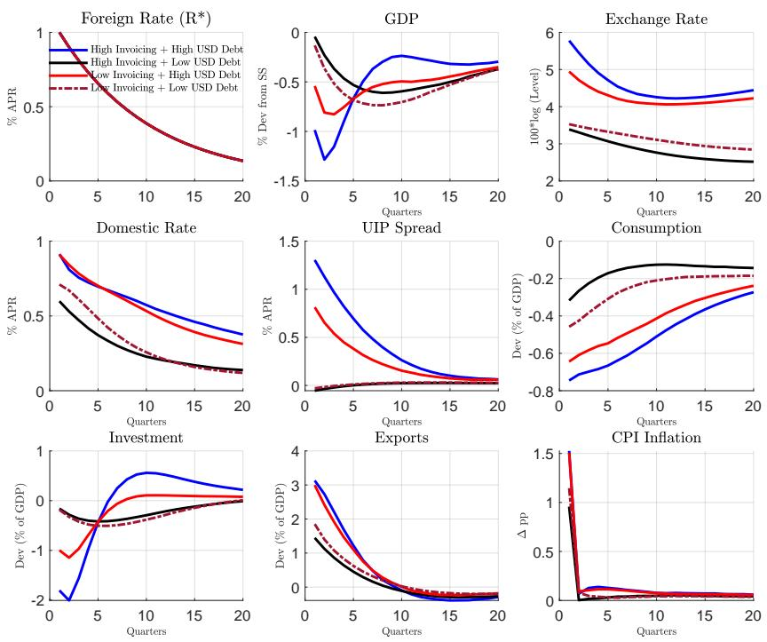  
Figure 24: Response to Foreign Interest Rate Shock

Figure 25 shows how financial system moves following foreign interest rate shock. Under high dollar debt, leverage goes up to rebuild balance sheets that have been deteriorated. Local residents decrease savings because they want to smooth consumption so the economy needs to attract foreign capital both in local currency (panel 1,1) and foreign currency (panel 2,1)

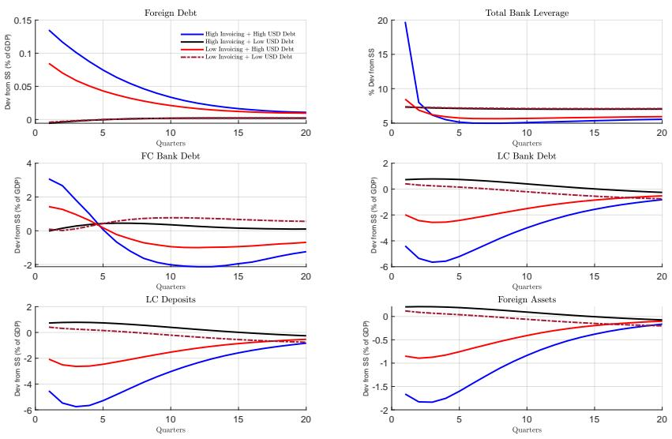  
Figure 25: Financial Flows

## F.2 Varying Dollar Debt in the Steady State

In this Section, we replicate results in Section 5.4 by varying dollar debt in the steady state by changing target portfolio of bankers $\bar{\phi}$ . Figure 26 plots the increase in ER volatility, and rising UIP premium and inflation following increasing target dollar ratio.

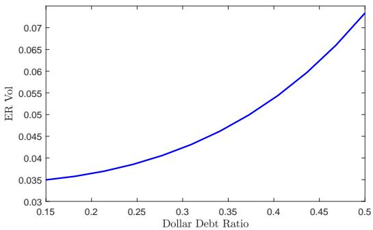  
(a) Exchange rate volatility ( $\phi$ )

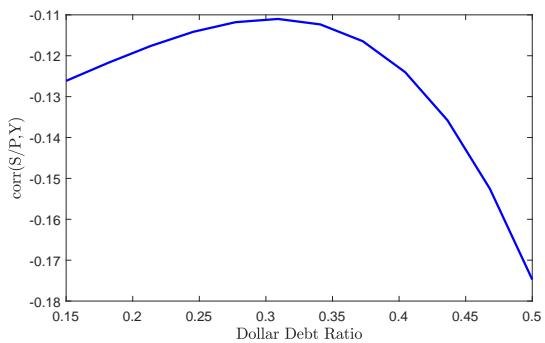  
(b) Output and exchange rate comovement ( $\phi$ )

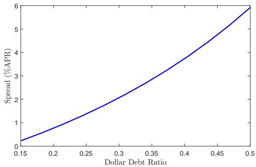  
(c) UIP premium ( $\phi$ )

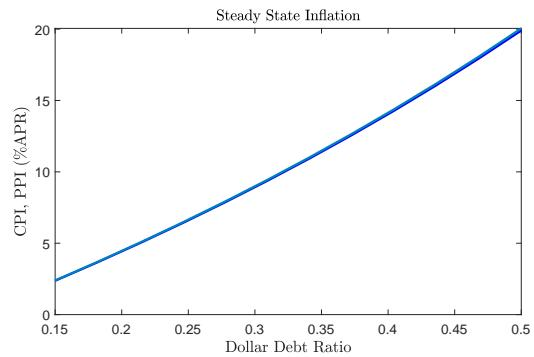  
(d) Steady state inflation  
Figure 26: Steady State with respect to Dollar Debt ( $\phi$ )

## F.3 Inflation and GDP-ER Co-movement

In this section, we use above simulations to generate the relationship between GDP-ER comovement and inflation. Figure 27 is able to capture the negative relationship between average inflation and the comovement between output and the exchange rate along both dollar debt and dollar invoicing. In countries with negative comovement between GDP and ER, exchange rate is not able to insulate the economy against external shocks; which makes inflation and output more volatile. As a response, both local and foreign investors demand risk premium and if the central bank does not address this premium, inflation increases.

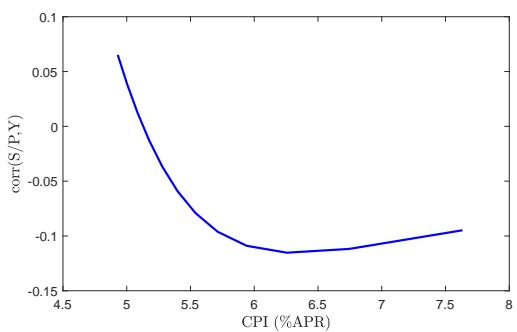  
(a) Along export prices stickiness ( $\theta^{x}$ )

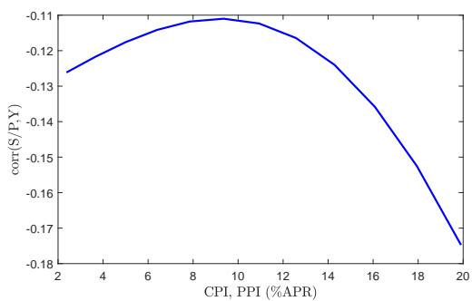  
(b) Along Dollar Debt ( $\bar{\phi}$ )  
Figure 27: Inflation and GDP-ER Co-movement

## F.3.1 Equity Premium

In this section, we look at what happens to equity premium as the macro risk increases with higher dollar invoicing. Equity premium,

$$
\mathbb {E} _ {t} (R _ {t + 1} ^ {k}) - R _ {t}
$$

where return to capital is defined as marginal product of capital $(r_{t}^{k})$ and undepreciated capital priced at current price of capital $((1-\delta)P_{t}^{k})$ divided by price of capital previous period $(P_{t-1}^{k})$

$$
R ^ {k} = \frac {r _ {t} ^ {k} + (1 - \delta) P _ {t} ^ {k}}{P _ {t - 1} ^ {k}}
$$

We define equity premium as the difference between return to capital and local interest rates. This is slightly misleading because actual cost of capital is defined as the weighted average of funding sources, which also include dollar financing.

Figure 28a plots what happens to equity premium as dollar invoicing and dollar debt increase. Equity premium falls. This is because both $R_{t}^{k}$ and $R_{t}$ increase but $R_{t}$ increases more. Capital gains part of return to capital provides cushion against global shocks because, as real assets, their value increases with pass through inflation generated by exchange rate depreciations. On the other hand, local interest rates become unattractive investment because they lose value following adverse global shocks, which makes investors require premium to invest.

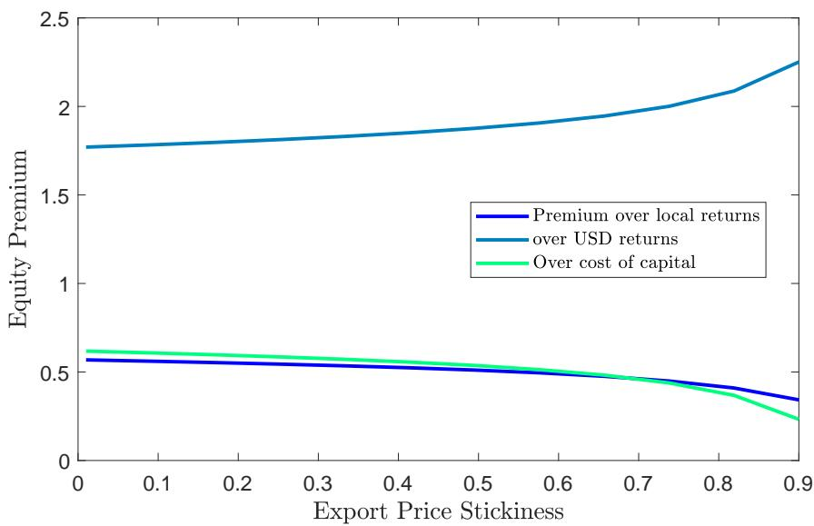  
(a) Equity Premium and export dollar price stickiness ( $\theta^{x}$ )  
Figure 28: Steady State Equity Premium

## PUBLICATIONS