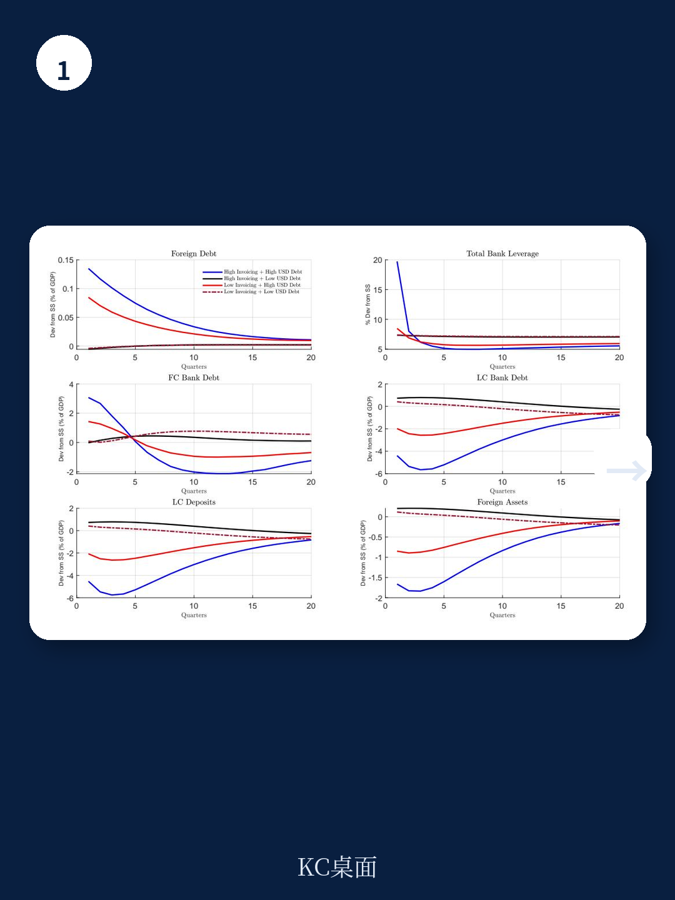
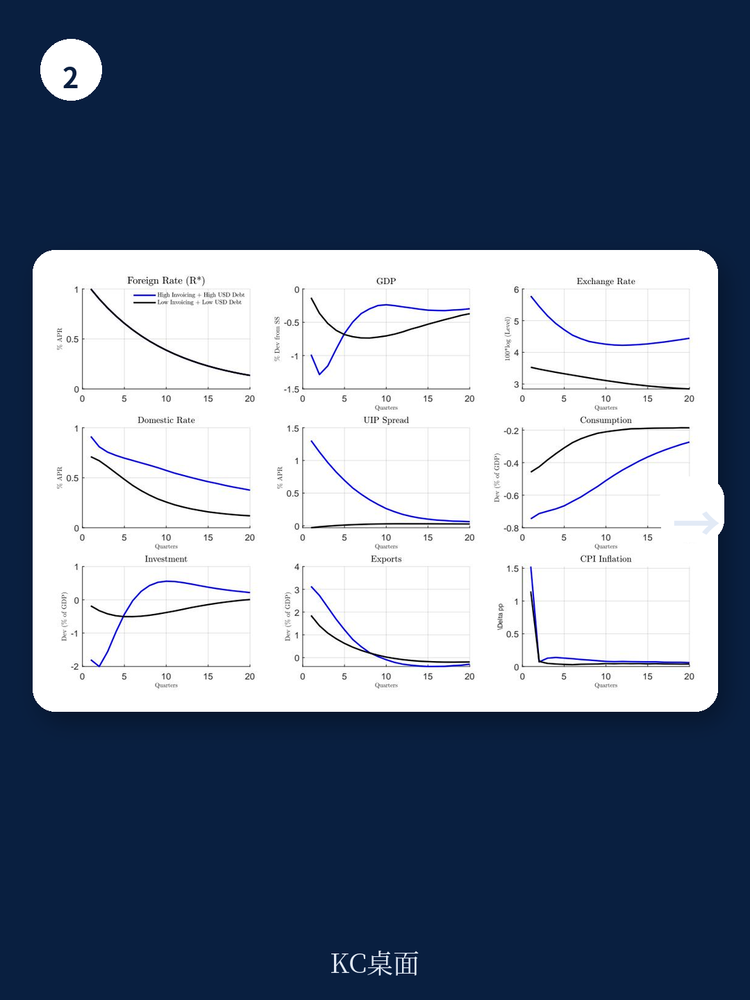

# IMF：货币定价框架与相关指标观察

美元在国际贸易计价和全球资金负债中的双重主导地位，通常被分开研究。贸易计价影响汇率传导与支出转换，负债美元化影响资产负债表与资金脆弱性。这份IMF工作论文提出的核心判断是：两者的交互作用，才是决定汇率不确定性属性、货币不确定性溢价乃至小型开放地区通胀动态的关键机制。

论文由Husnu C. Dalgic和Galip Kemal Ozhan撰写，使用2003年2月至2018年11月25个国家的月度货币超额回报数据，提取两个共同不确定性因子：与全球公司回报相关的美元因子，以及与全球不确定性厌恶相关的利差交易因子。研究发现，出口美元计价比例是利差交易不确定性暴露的显著预测变量，银行部门外币负债和净外部头寸同样解释国别差异。更重要的是，这些不确定性暴露在货币市场中被定价：不确定性因子载荷更高的货币，平均获得更高的超额回报，同时伴随更高的平均通胀。

## 1. 出口美元计价与利差交易暴露呈现稳定正相关

实证部分最直接的发现是，出口美元计价比例越高的国家，其货币对利差交易不确定性因子的暴露越大。这一关系在控制国家规模、外汇储备、贸易网络中心性和净外国资产头寸后依然成立。银行部门的外币负债暴露和净债务国地位，同样有助于解释因子载荷的跨国差异。

> **KC评论：** 这里的关键不是“美元计价好需要继续观察”，而是它把一国货币的回报特征与全球不确定性周期绑定。图1的三联图把这条逻辑串了起来：出口美元计价预测利差交易暴露，利差交易暴露预测超额回报，同时也预测平均通胀。读者可以留意第三张图——不确定性暴露与通胀的正相关，是后面货币政策讨论的伏笔。

## 2. 美元负债与粘性美元出口价格共同抬高本币资产不确定性

理论模型部分给出了机制解释。当出口商以美元定价且调整缓慢时，汇率贬值对出口需求的刺激是渐进的；与此同时，银行部门的美元负债在贬值时本币价值上升，直接压缩净值和放贷能力。两个摩擦叠加的结果是：贬值发生在消费走弱、研究调整、银行净值下降的“坏状态”中，本币资产在定价核最高的时刻支付最低的回报，读者因此要求更高的预期回报。

量化模拟显示，两个摩擦同时存在时，无抛补利率平价偏离最大。仅有高美元负债而出口计价美元比例不高，溢价仍然可观但较小，因为汇率仍能通过出口价格发挥一定的稳定作用；仅有高出口美元计价而美元负债有限，溢价则相当温和，因为贬值不带来显著的资产负债表损失。交互效应是核心数量力量。

## 3. 不确定性溢价上升推高不确定性调整后的中性利率与平均通胀

论文进一步求解随机稳态，发现出口价格粘性提高汇率波动率，使贬值更具逆周期性，并推高无条件货币不确定性溢价。这一溢价在长期持续存在，其作用相当于提高了不确定性调整后的中性利率。在标准泰勒规则下，政策利率相对读者要求的回报偏低，平均通胀因此持续高于目标。

模拟还显示，在高度美元化的地区中，高出口美元计价使外国利率冲击导致的研究和GDP峰值降幅，大约是低美元负债、低美元计价地区的两倍。贬值不再是教科书式的“冲击吸收器”，而成为宏观资金状态变量：它抬高进口价格、加重美元负债负担、收紧资金约束，同时出口扩张需要更大的贬值幅度和更高的溢价才能实现。

> **KC评论：** 对新兴市场央行而言，这篇论文的提醒是：通胀目标制本身不自动解决美元化结构带来的溢价问题。如果中性利率因货币不确定性溢价而系统性上升，固定截距的泰勒规则会让平均通胀持续偏高。论文建议的应对方向是让政策利率对中性利率的变动做出更灵敏的反应，但这意味着长期维持更高的利率息差。

## 4. 一个可复用的观察框架：从计价货币与负债币种看货币不确定性

对于关注新兴市场货币的读者，这篇论文提供了一个简洁的分析起点：先看一国出口的美元计价比例，再看银行部门外币负债占总资产的比例，两者共同决定货币对全球不确定性因子的暴露方向与程度。净外国资产头寸提供补充信息，但论文的证据显示，贸易计价和负债币种是更具解释力的结构性变量。

论文使用的样本截至2018年11月，数据频率为月度，覆盖25个国家。样本期内全球贸易和资金的美元化程度是否发生结构性变化，以及疫情后的通胀环境是否改变这些关系的强度，论文没有完全展开，需要后续研究验证。
