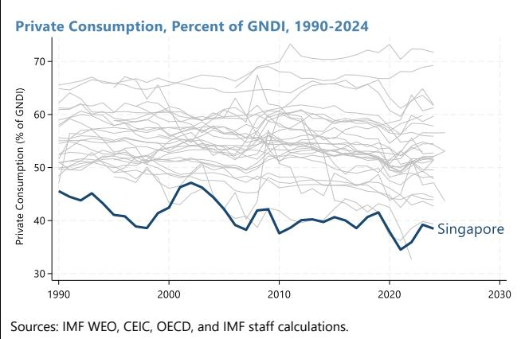
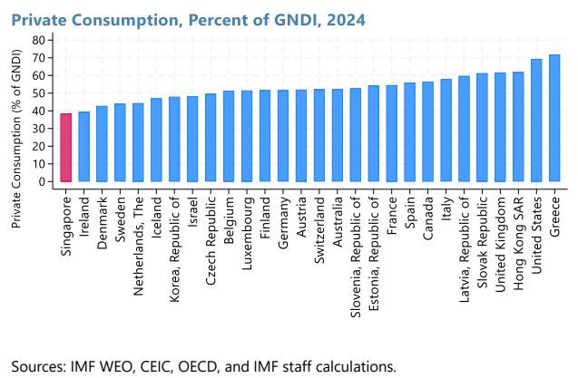
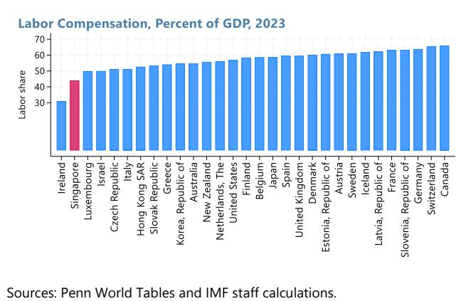
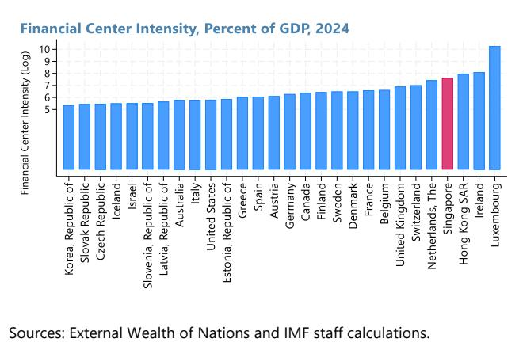
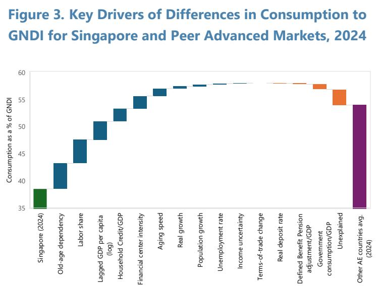
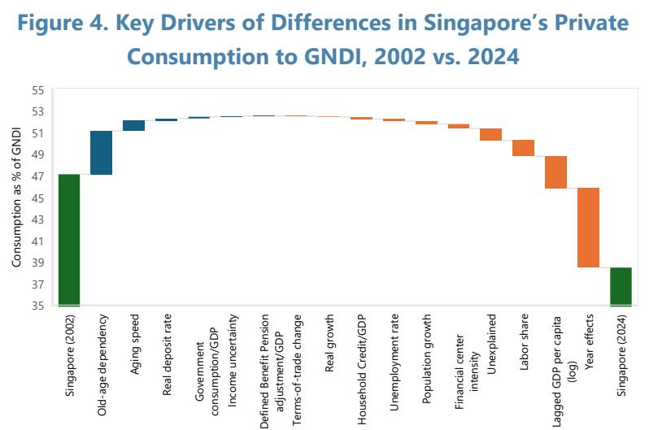
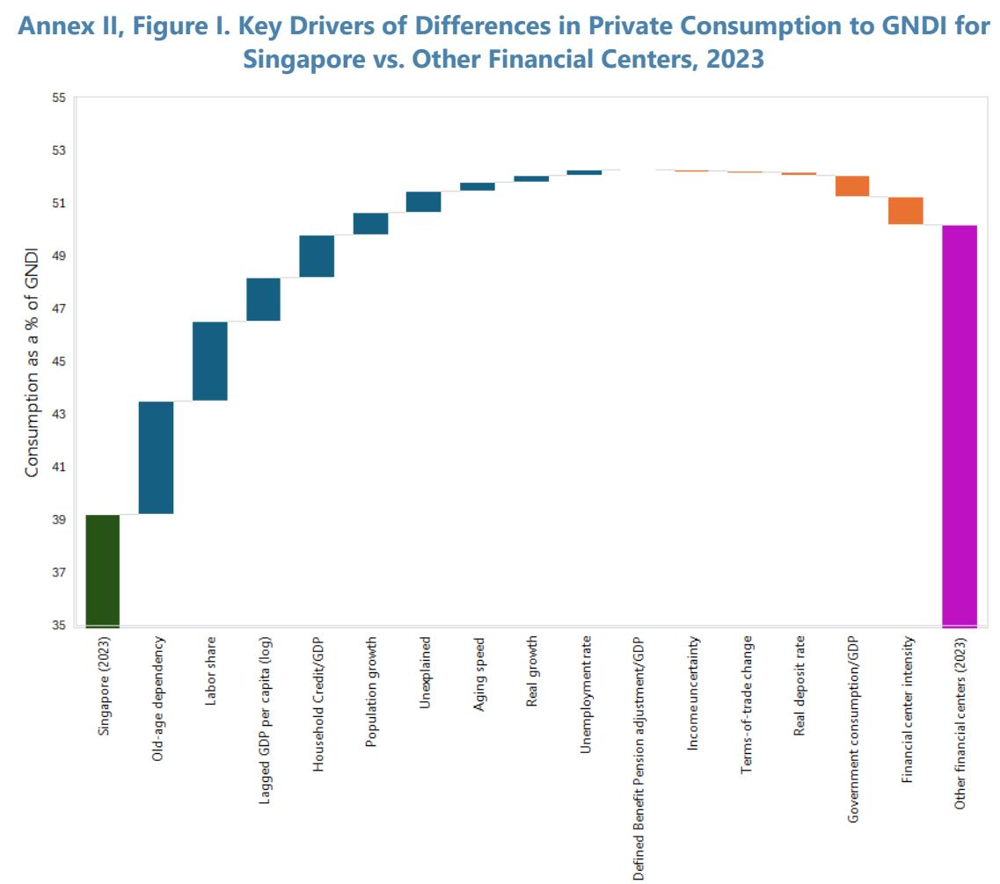

# Drivers of Private Consumption in Singapore

Sandile Hlatshwayo

SIP/2026/075

IMF Selected Issues Papers are prepared by IMF staff as background documentation for periodic consultations with member countries. It is based on the information available at the time it was completed on June 29, 2026. This paper is also published separately as IMF Country Report No 26/186.

2026
JUL

# IMF Selected Issues Paper Asia Pacific Department Drivers of Private Consumption in Singapore Prepared by Sandile Hlatshwayo

Authorized for distribution by Masahiro Nozaki
July 2026

IMF Selected Issues Papers are prepared by IMF staff as background documentation for periodic consultations with member countries. It is based on the information available at the time it was completed on June 29, 2026. This paper is also published separately as IMF Country Report No 26/186.

ABSTRACT: Private consumption ratios differ markedly across advanced economies, with Singapore recording one of the lowest of its peer group. Using a sample of 31 advanced economies and a rich set of potential drivers, the analysis finds that slow-moving structural factors like demographics, economic structure, and development levels are important correlates of these differences, while cyclical factors appear to play a more limited role. Relative to other advanced markets, Singapore's lower old age dependency ratio, lower labor share, high real GDP per capita, and role as a financial hub all weigh on its consumption ratio.

RECOMMENDED CITATION: Hlatshwayo, S. (2026). Drivers of private consumption in Singapore (IMF Selected Issues No. 26/075). International Monetary Fund.

<table><tr><td>JEL Classification Numbers:</td><td>E21, D12, O53</td></tr><tr><td>Keywords:</td><td>Private consumption, household saving, Singapore, external balances</td></tr><tr><td>Author&#x27;s E-Mail Address:</td><td>SHlatshwayo@imf.org</td></tr></table>

SELECTED ISSUES PAPERS

# Drivers of Private Consumption in Singapore

Singapore

Prepared by Sandile Hlatshwayo $^{1}$

## SINGAPORE

SELECTED ISSUES

June 29, 2026

Approved By
Asia Pacific
Department

Prepared By Sandile Hlatshwayo (APD)

## CONTENTS

DRIVERS OF PRIVATE CONSUMPTION IN SINGAPORE 2
A. Introduction 2
B. Methodology 3
C. Findings 4
D. Conclusion 7

## TABLE

1. Drivers of Private Consumption (Percent of GNDI) \_\_\_\_ 8

## ANNEXES

I. Data Definitions and Sources 9

II. Key Drivers of Differences in Private Consumption to GNDI for Singapore and

References 11

## DRIVERS OF PRIVATE CONSUMPTION IN SINGAPORE $^{1}$

Private consumption ratios differ markedly across advanced economies, with Singapore recording one of the lowest of its peer group. Using a sample of 31 advanced economies and a rich set of potential drivers, the analysis finds that slow-moving structural factors like demographics, economic structure, and development levels are important correlates of these differences, while cyclical factors appear to play a more limited role. Relative to other advanced markets, Singapore's lower old age dependency ratio, lower labor share, high real GDP per capita, and role as a financial hub all weigh on its consumption ratio.

## A. Introduction

1. Singapore's private consumption ratio is low and has fallen over time relative to other advanced economies (see Figure 1). In 2024, Singapore's private consumption as a share of gross national disposable income (GNDI) was 38 percent, down from 46 percent in 1990. Across a sample of advanced economies, its share is the lowest but comparable to economies like Ireland and Denmark. Prior analysis has shown that Singapore's high level of development, rapidly aging population, and low labor share contribute to its low consumption ratio (Qureshi, 2016; Yoo, 2021).

Figure 1. Private Consumption Trends Across Advanced Economies  

  
Sources: IMF WEO, CEIC, OECD, and IMF staff calculations.

2. To understand the fundamental determinants of Singapore's consumption ratio, this analysis builds on prior research and introduces three novel contributions to the literature. The analysis includes a rich variety of drivers like uncertainty, demographics, development levels, structural features, and cyclical factors, drawing on prior literature. It also adds three novel contributions to the subset of the literature that focuses on Singapore's private consumption rate. First, it introduces a time-varying control for financial center intensity, measured using gross external assets and liabilities relative to GDP to account for the role of large cross-border balance sheets in shaping saving and consumption behavior in highly integrated financial hubs like Singapore. This improves on prior approaches that relied on ad hoc dummy indicators for financial hubs. Second, it explores how being a financial hub interacts with an economy's small geographic size, under the

hypothesis that geographically smaller financial hub countries have higher savings rates given limited domestic investment opportunities. Third, it includes a time-varying control to help account for the role of pension systems.

## B. Methodology

3. To examine the drivers of variation in private consumption rates across countries, we use two-way fixed effects regressions. The sample includes 31 advanced economies over the period from 1990 to 2024. $^{2}$ The baseline estimating equations take the following form:

$$
\begin{array}{r l} c _ {i, t} = \alpha + \beta_ {1} ^ {\prime} D e m o g r a p h i c s _ {i, t} + \beta_ {2} L a b o r I n c o m e S h a r e + \beta_ {3} R e a l G D P p e r C a p i t a _ {i, t - 1} \\ & + \beta_ {4} ^ {\prime} C y c l i c a l F a c t o r s + \beta_ {5} G o v e r n m e n t C o n s u m p t i o n _ {i, t} + \beta_ {6} P e n s i o n S y s t e m s _ {i, t} \\ & + \beta_ {7} F i n a n c i a l C e n t e r I n t e n s i t y _ {i, t} + \delta_ {i} + \theta_ {t} + \varepsilon_ {i, t} \end{array}
$$

Where $c_{i,t}$ denotes private consumption as a share of GNDI in country i and year t; demographics is a vector of controls including the population growth rate, old age dependency ratio, and aging speed (measured as the difference between the old-age dependency ratio 20 years ahead and the ratio in year t); cyclical factors include real growth, household credit/GDP, interest rates, changes in terms of trade, and the unemployment rate; a measure of net contributions made to pension schemes as a share of GDP; financial center intensity is the log of gross assets and liabilities/GDP; $\delta_{i}$ denotes country fixed effects that absorb time-invariant cross-country heterogeneity; $\theta_{t}$ denotes year fixed effects that absorb common global shocks in year t; and $\varepsilon_{i,t}$ is the error term. See Annex I for more detail on data definitions and sources. The estimated standard errors are robust to heteroskedasticity.

4. The empirical results should be interpreted with several caveats. First, in order to compile a broad and consistently available panel, the dependent variable uses GNDI as the denominator rather than household personal disposable income. Household personal disposable income is the household resource concept most relevant for consumption decisions but it is not available for the full sample in earlier years. While GNDI is preferable to GDP as a denominator because it better captures income available to residents, it remains an imperfect proxy. Second, several explanatory variables, including income uncertainty and financial center intensity are constructed proxies and may be measured with error. Third, the pension indicator captures variation in net contributions as a share of GDP for pension programs where there are transfers between current contributors and current beneficiaries, as in defined benefit schemes. However, for defined contribution schemes where no such redistributive transfers occur, the indicator is set to zero and does not capture varying levels of intensity in defined contribution schemes that can drive consumption lower in some economies. As a complement, staff also conducts an analysis using pension parameters to explain variation in saving behavior across markets, drawing on the IMF's 2026 External Balance Assessment pension tool. Finally, the empirical approach identifies partial

correlations rather than general equilibrium causal effects, and some coefficients may still reflect omitted factors not fully captured by the controls.

## C. Findings

5. Structural characteristics like demographics, economic structure, and income levels play important roles in driving private consumption patterns across advanced economies. Table 1 shows the results of the analysis. The analysis finds that, amongst advanced economies, structural factors like a more elderly population and higher labor income shares are associated with higher consumption ratios, while higher GDP per capita levels, greater financial center intensity, and faster population growth are associated with lower consumption ratios. Cyclical factors, including stronger output growth and higher returns on savings, also drive down consumption but are less important. In particular:

\- The coefficient on the old-age dependency ratio is positive and is statistically significant across most specifications. In the preferred specification shown under Column 8 of Table 1, a one percentage point (ppt) increase in the old-age dependency ratio is associated with a 0.41 ppt increase in the consumption ratio. This result is in line with findings in the literature that demographics are an important driver of consumption dynamics (Modigliani and Brumberg, 1954). Population growth, by contrast, is negative and significant in most specifications, with a 1 ppt increase associated with a roughly 0.23 ppt lower consumption ratio. Aging speed has an unexpectedly positive sign and is not statistically significant across the specifications. This finding contrasts with prior literature that found that faster aging tends to lower consumption. One factor that may be attenuating the results is a statistical convergence in the projected variation across countries' aging patterns of UN population forecasts relative to prior forecast vintages. However, broadly speaking, the demographic patterns are consistent with the life-cycle model of consumption and savings: a larger elderly population tends to be associated with higher dissaving and consumption, while economies with fast-growing populations and associated labor force dynamics have lower consumption ratios.

\- For labor share, a one ppt increase in the share of labor compensation in national income is significantly associated with a 0.44 ppt higher consumption-to-GNDI ratio. This is consistent with Yoo (2021) and highlights that economies with large corporate sectors and a large share of foreign-owned multinationals have a smaller portion of resources that accrue to domestic households (Figure 2). $^{3}$

\- Higher-income economies have lower consumption ratios. In the preferred specification, a one log unit increase in lagged real GDP per capita is significantly associated with a 4.4 ppt lower consumption ratio, which squares with findings that higher-income economies and the higher-income households within them have a lower marginal propensity to consume, including

because of higher bequest and precautionary saving motives (Agarwal and Qian, 2014; De Nardi, 2004; De Nardi et al., 2010; Jappelli and Pistaferri, 2014).

\- For cyclical and policy-related factors, a one ppt increase in real GDP growth is significantly associated with a 0.15 ppt lower consumption ratio in the preferred specification, broadly in line with prior findings (Masson et al., 1998), while a one ppt increase in household credit-to-GDP is associated with about a 0.04 ppt higher consumption ratio (Mian et al., 2017). A one ppt increase in the real short-term deposit rate is significantly associated with a 0.17 ppt lower consumption ratio; a higher real return on deposits strengthens incentives to save and defer consumption and may also be related to the composition of households' balance sheets (Cloyne et al., 2020). Improvements in terms-of-trade lower consumption, which could reflect that the positive income shocks from terms-of-trade increases largely accrue to corporates and not households. Higher income uncertainty tends to reduce consumption, consistent with real options 'wait-and-see' effects (Baker et al., 2016) but the size of the effect becomes statistically insignificant and much smaller once a broader set of controls is included. Year fixed effects that absorb major global shocks may also capture income uncertainty. The unemployment rate and government consumption/GDP are not statistically significant.

\- For pensions, the control is a rough proxy for pension-induced household saving. A one ppt increase in net contributions associated with defined benefit or pay-as-you-go systems is associated with about a 1.1 ppt lower consumption-to-GNDI ratio. As previously noted, however, the pension control does not capture the behavioral dimension of defined contribution pension systems, where mandatory contribution rates, fund generosity, and the extent of consumption-smoothing facilitated by such schemes vary considerably and can influence household saving and consumption outcomes. A separate analysis using the pension toolkit from the 2026 External Balance Assessment methodology shows that Singapore's defined contribution pension system can help explain up to 1.6 percent of GDP of its current account surplus.

\- The effect of increases in financial center intensity is large and negative: a one log unit increase in the log financial-center measure is significantly associated with about a 1.9 ppt lower consumption ratio. Despite the difference in construction of the measures, this is close to results from studies that use dummy indicators for financial centers. Namely, relative to non-financial centers, Qureshi (2016) finds that financial centers are associated with a higher private saving rate of around 2 percent of GDP and IMF (2017) external balance estimates show that financial centers are associated with a higher current account balance of about 3 percent of GDP.

\- Finally, small geographic size does not appear to drive higher saving conditional on being a financial hub. The interaction term between a small state dummy indicator and the financial center intensity measure is positive, significant, and fully offsets the negative base effect of the financial center measure, suggesting that large financial hubs that are also small geographically have higher consumption rates relative to physically larger financial hubs. To assess the robustness of this finding, the shares of global population and output were used as alternative measures for small economies. The interaction effect for financial center intensity with output shares is insignificant, but the interaction term for population shares produces a net positive

Sources: External Wealth of Nations and IMF staff calculations.

result that lends some credence to the idea that countries with smaller populations have lower consumption and higher savings, conditional on being financial centers. $^{4}$ Neither of the population share nor the output share indicators are statistically significant on their own.

Figure 2. Labor Share and Financial Center Intensity Across Advanced Economies

  
Sources: Penn World Tables and IMF staff calculations.

6. For Singapore, its demographics, low labor share, high level of development, low household credit, and financial center status reduce its 2024 consumption relative to peers. Using the preferred specification, Figure 3 shows the decomposition of the key drivers comparing

Singapore's lower consumption rate to that of the average for other advanced economies in 2024. The most important driver is Singapore's old age dependency ratio, which is lower than in other advanced economies at present despite its rapidly aging population. Singapore's labor share ranks second in importance and is amongst the lowest in the sample at 10 ppts below the average for the rest of the sample. Other important factors are Singapore's higher level of real GDP per capita, financial center status, and lower household credit to GDP. See Annex II for a comparison of

  
Note: Middle bars show coefficients' estimated contribution of various drivers for Singapore's 2024 consumption rate relative to other advanced economies' average 2024 consumption rate based on a panel fixed effects regression for 31 advanced economies over the period from 1990 to 2024.

Singapore's private consumption rate to other financial centers. The drivers are similar to those shown in Figure 3, except for the financial center intensity indicator given that Singapore's financial center intensity is lower than the average of other financial centers.

7. Over the past two decades, the decline in Singapore's consumption ratio was driven by similar factors. Figure 4 shows that the decline in Singapore's consumption ratio between 2002 (a

peak year) and 2024 includes a higher level of development, falling labor share $^{5}$ , and growing prominence as a financial hub, as well as global shocks captured by the year fixed effects contribution. The impacts of the year fixed effects are particularly significant and negative around the time of the Covid-19 pandemic when health-related policy interventions and associated preventative behavior lowered household consumption. At the same time, Singapore's old age dependency ratio has increased, partially offsetting the pull factors.

  
Note: Middle bars show coefficients' estimated contribution for various drivers of Singapore's 2002 consumption rate relative to Singapore's 2024 consumption rate based on a panel fixed effects regression for 31 advanced economies over the period from 1990 to 2024. Years selected based on peak consumption in 2002 and the most recent year in the sample.

## D. Conclusion

8. The analysis suggests that Singapore's low private consumption-to-GNDI ratio is primarily a structural phenomenon. Relative to other advanced economies, Singapore's demographics, lower labor share, high level of development, and financial center characteristics all weigh on its consumption, while cyclical factors appear to be less important. These same forces also help explain the decline in Singapore's consumption ratio over time. The structural, slow-moving nature of the drivers of private consumption highlights the role of medium-term structural policies to help reduce Singapore's external surpluses over the medium and long term.

9. Future work could deepen analysis of saving and investment in Singapore along several dimensions. A microeconomic lens using household-level data would help better identify saving and consumption behavior across demographic groups. The pension system and broader social protection are also likely to be important determinants of saving behavior and can be examined more closely. Aside from households, a more precise understanding of precautionary motives associated with Singapore's financial center status and the role of multinational enterprises in shaping external imbalances would be useful.

Table 1. Selected Economies: Drivers of Private Consumption (Percent of GNDI)

<table><tr><td></td><td>(1)</td><td>(2)</td><td>(3)</td><td>(4)</td><td>(5)</td><td>(6)</td><td>(7)</td><td>(8)</td><td>(9)</td></tr><tr><td>Income uncertainty</td><td>-0.133*(0.070)</td><td></td><td>-0.087*(0.047)</td><td>-0.139***(0.040)</td><td>-0.114**(0.052)</td><td>-0.080(0.057)</td><td>-0.053(0.055)</td><td>-0.036(0.055)</td><td>-0.030(0.055)</td></tr><tr><td>Population growth rate</td><td></td><td>-0.761**(0.345)</td><td>-0.745**(0.313)</td><td>-0.629**(0.269)</td><td>-0.500*(0.249)</td><td>-0.447*(0.235)</td><td>-0.221*(0.126)</td><td>-0.233(0.137)</td><td>-0.114(0.129)</td></tr><tr><td>Old-age dependency ratio</td><td></td><td>0.273**(0.118)</td><td>0.179(0.110)</td><td>0.195**(0.096)</td><td>0.222**(0.102)</td><td>0.319**(0.119)</td><td>0.395***(0.114)</td><td>0.414***(0.108)</td><td>0.441***(0.087)</td></tr><tr><td>Population aging speed</td><td></td><td>0.044(0.087)</td><td>0.056(0.079)</td><td>0.084(0.075)</td><td>0.057(0.074)</td><td>0.076(0.083)</td><td>0.108(0.074)</td><td>0.107(0.077)</td><td>0.085(0.057)</td></tr><tr><td>Labor income share</td><td></td><td></td><td>0.440***(0.123)</td><td>0.399***(0.080)</td><td>0.428***(0.098)</td><td>0.481***(0.121)</td><td>0.448***(0.106)</td><td>0.437***(0.100)</td><td>0.375***(0.096)</td></tr><tr><td>Lag Real GDP per capita (Log)</td><td></td><td></td><td></td><td>-5.121**(2.248)</td><td>-5.640***(1.996)</td><td>-5.254**(2.209)</td><td>-4.443**(1.987)</td><td>-4.361**(2.009)</td><td>-6.220***(2.154)</td></tr><tr><td>Real GDP growth</td><td></td><td></td><td></td><td>-0.099(0.062)</td><td>-0.126**(0.045)</td><td>-0.169***(0.045)</td><td>-0.141***(0.040)</td><td>-0.151***(0.037)</td><td>-0.163***(0.040)</td></tr><tr><td>Household credit/GDP</td><td></td><td></td><td></td><td></td><td>0.016(0.020)</td><td>0.027(0.019)</td><td>0.042**(0.017)</td><td>0.044**(0.016)</td><td>0.052***(0.016)</td></tr><tr><td>Real deposit interest rate</td><td></td><td></td><td></td><td></td><td>0.045(0.089)</td><td>0.004(0.088)</td><td>-0.164*(0.091)</td><td>-0.173*(0.091)</td><td>-0.215**(0.088)</td></tr><tr><td>Change in terms of trade</td><td></td><td></td><td></td><td></td><td></td><td>-0.040***(0.014)</td><td>-0.033**(0.014)</td><td>-0.037**(0.014)</td><td>-0.039***(0.013)</td></tr><tr><td>Unemployment rate</td><td></td><td></td><td></td><td></td><td></td><td>0.091(0.103)</td><td>0.117(0.097)</td><td>0.131(0.097)</td><td>0.099(0.098)</td></tr><tr><td>Government Consumption/GDP</td><td></td><td></td><td></td><td></td><td></td><td>-0.342(0.216)</td><td>-0.159(0.203)</td><td>-0.137(0.189)</td><td>-0.105(0.168)</td></tr><tr><td>Defined Benefit Pension Adj./GDP</td><td></td><td></td><td></td><td></td><td></td><td></td><td>-1.261**(0.470)</td><td>-1.125**(0.407)</td><td>-0.875***(0.304)</td></tr><tr><td>Financial Center Intensity</td><td></td><td></td><td></td><td></td><td></td><td></td><td></td><td>-1.865**(0.891)</td><td>-2.464***(0.845)</td></tr><tr><td>Financial Center Intensity x Small Geographic Size</td><td></td><td></td><td></td><td></td><td></td><td></td><td></td><td></td><td>2.978**(1.305)</td></tr><tr><td>Observations</td><td>998</td><td>1,022</td><td>994</td><td>986</td><td>810</td><td>788</td><td>707</td><td>707</td><td>707</td></tr><tr><td>Countries</td><td>31</td><td>31</td><td>31</td><td>31</td><td>26</td><td>26</td><td>24</td><td>24</td><td>24</td></tr><tr><td>R-squared</td><td>0.239</td><td>0.296</td><td>0.455</td><td>0.490</td><td>0.538</td><td>0.556</td><td>0.623</td><td>0.637</td><td>0.656</td></tr><tr><td>Country FE</td><td>Yes</td><td>Yes</td><td>Yes</td><td>Yes</td><td>Yes</td><td>Yes</td><td>Yes</td><td>Yes</td><td>Yes</td></tr><tr><td>Year FE</td><td>Yes</td><td>Yes</td><td>Yes</td><td>Yes</td><td>Yes</td><td>Yes</td><td>Yes</td><td>Yes</td><td>Yes</td></tr><tr><td colspan="10">Robust standard errors in parentheses; R-squared is within R-squared; constant, country, and time fixed effects not shown; *p&lt; 0.10, **p&lt; 0.05, ***p&lt; 0.01</td></tr></table>

## Annex I. Data Definitions and Sources

<table><tr><td>Variables</td><td>Source / Notes</td></tr><tr><td>Private consumption as a share of gross national disposable income (GNDI)</td><td>IMF WEO, CEIC, OECD</td></tr><tr><td>World Uncertainty Index (in logs)</td><td>World Uncertainty Index</td></tr><tr><td>Income uncertainty</td><td>Author&#x27;s calculations using real GDP per capita data from IMF WEO. Preferred measure is the conditional standard deviation of annual real GDP per capita growth from country-specific GARCH(1,1) models following IMF 2021; if GARCH fails, ARCH(1); if both fail, used 5-year rolling variance</td></tr><tr><td>Old-age dependency ratio</td><td>UN population data</td></tr><tr><td>Population aging speed</td><td>UN population data; author&#x27;s calculations; difference between the old-age dependency ratio 20 years ahead and its current value</td></tr><tr><td>Population growth rate</td><td>IMF WEO</td></tr><tr><td>Population share (% of world population)</td><td>World Bank</td></tr><tr><td>Output share (% of world GDP)</td><td>World Bank</td></tr><tr><td>Labor income share</td><td>Penn World Table; share of labor compensation in GDP at current national prices; for 2024, the 2023 estimates are used</td></tr><tr><td>Log real GDP per capita</td><td>IMF WEO; GDP per capita at constant PPP prices</td></tr><tr><td>Growth of real GDP per capita</td><td>IMF WEO</td></tr><tr><td>Real GDP growth</td><td>IMF WEO</td></tr><tr><td>Household credit to GDP</td><td>BIS; credit to the non-financial sector, Households &amp; NPISHs</td></tr><tr><td>Real deposit interest rate</td><td>IMF WEO</td></tr><tr><td>Annual change in the terms of trade</td><td>IMF WEO</td></tr><tr><td>Unemployment rate</td><td>IMF WEO</td></tr><tr><td>General government consumption expenditure as a share of GDP</td><td>World Bank</td></tr><tr><td>Pension adjustment as a share of GDP for defined benefit systems</td><td>OECD; IMF; author&#x27;s calculations. In line with the 2008 System of National Accounts, the adjustment for the change in pension entitlements is defined as the total value of the actual and imputed social contributions payable into pension schemes, plus the total value of contribution supplements payable out of the property income attributed to pension fund beneficiaries, minus the value of the associated service charges, minus the total value of the pensions paid out as social insurance benefits by pension schemes. The data on the pension adjustments are sourced from the OECD and are divided by nominal GDP. The indicator is set to zero for countries whose core mandatory pension pillar is funded defined contribution</td></tr><tr><td>Financial center intensity (in logs)</td><td>External Wealth of Nations Dataset; author&#x27;s calculations; gross external assets plus gross liabilities relative to GDP</td></tr><tr><td>Small geographic size dummy</td><td>Author&#x27;s classification using geographic size for smallest three economies in the sample; equals one for Singapore, Hong Kong SAR, and Luxembourg.</td></tr></table>

Annex II. Key Drivers of Differences in Private Consumption to GNDI for Singapore and Other Financial Centers, 2023  
  
Note: Middle bars show coefficients' estimated contribution for various drivers of Singapore's 2023 consumption rate relative to the 2023 average consumption rate of other financial centers. The comparison group of financial center economies includes Hong Kong SAR, Ireland, Luxembourg, the Netherlands, and Switzerland. This figure uses 2023 instead of 2024 to allow for more data coverage of the financial centers across the various indicators.

## References

Agarwal, S., & Qian, W. (2014). Consumption and debt response to unanticipated income shocks: Evidence from a natural experiment in Singapore. American Economic Review, 104(12), 4205-4230.

Autor, D., Dorn, D., Katz, L. F., Patterson, C., & Van Reenen, J. (2020). The fall of the labor share and the rise of superstar firms. The Quarterly Journal of Economics, 135(2), 645-709.

Baker, S. R., Bloom, N., & Davis, S. J. (2016). Measuring economic policy uncertainty. The Quarterly Journal of Economics, 131(4), 1593-1636.

Cloyne, J., Ferreira, C., & Surico, P. (2020). Monetary policy when households have debt: new evidence on the transmission mechanism. The Review of Economic Studies, 87(1), 102-129.

De Nardi, M. (2004). Wealth inequality and intergenerational links. The Review of Economic Studies, 71(3), 743-768.

De Nardi, M., French, E., & Jones, J. B. (2010). Why do the elderly save? The role of medical expenses. Journal of Political Economy, 118(1), 39-75.

IMF. (2017). 2015 Refinements to the External Balance Assessment Methodology. Retrieved on March 27, 2026.

Jappelli, T., & Pistaferri, L. (2014). Fiscal policy and MPC heterogeneity. American Economic Journal: Macroeconomics, 6(4), 107-136.

Masson, P. R., Bayoumi, T., & Samiei, H. (1998). International evidence on the determinants of private saving. The World Bank Economic Review, 12(3), 483-501.

Mian, A., Sufi, A., & Verner, E. (2017). Household debt and business cycles worldwide. The Quarterly Journal of Economics, 132(4), 1755-1817.

Qureshi, M. (2016). Singapore's 2016 Article IV Selected Issues paper. What drives private savings in Singapore.

Yoo, J. (2021). Singapore's 2021 Article IV Selected Issues paper. Household consumption dynamics around shocks.