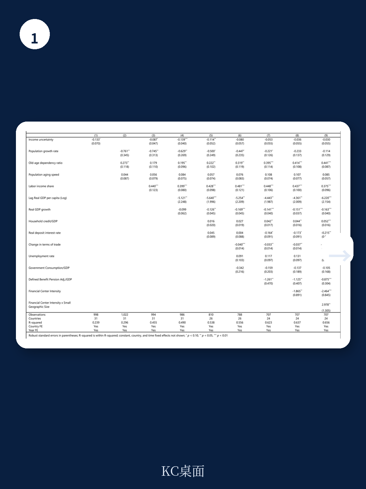
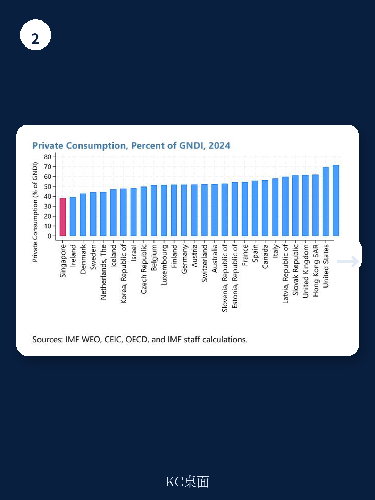

# IMF：研究主题与行业变化观察

2024年新加坡私人消费占国民可支配总收入（GNDI）的比重为38%，低于1990年的46%，在31个发达地区中处于最低水平。IMF在2026年7月发布的国别报告中，用跨国面板回归拆解了这一现象背后的驱动因素，结论指向一个核心判断：新加坡的低消费率主要是结构性特征，而非周期性波动所致。

报告基于1990至2024年31个发达地区的数据，考察了人口结构、劳动收入份额、发展水平、资金中心强度、周期因素等多组变量。结果显示，老年抚养比、劳动收入份额、人均实际GDP和资金中心强度四个结构性变量，对各国消费率差异的解释力最强。周期因素如产出增长、实际存款利率虽有影响，但作用有限。

## 1. 老年抚养比与劳动收入份额对消费率影响显著

在基准设定中，老年抚养比每上升1个百分点，消费率上升约0.41个百分点。这与生命周期消费理论一致：老年人口比例越高，动用储蓄进行消费的规模越大。人口增长率则相反，每上升1个百分点，消费率下降约0.23个百分点。

劳动收入份额的解释力排在第二位。劳动报酬占国民收入比重每提高1个百分点，消费率上升约0.44个百分点。新加坡的劳动收入份额比样本平均值低约10个百分点，在31个地区中处于末位。报告认为，这与新加坡拥有大量外资跨国企业和规模较大的企业部门有关——这些企业的利润留存并未流向国内家庭部门。

> **KC评论：** 劳动收入份额这个变量值得关注。它说明新加坡低消费率并非居民“不愿花钱”，而是国民收入分配中流向家庭的份额本身偏低。观察新加坡消费趋势时，工资增速与GDP增速的差距比消费者信心指数更有信息量。

## 2. 资金中心强度与人均收入水平拉低消费占比

资金中心强度是报告引入的新变量，用总外部资产与负债之和占GDP比重衡量，替代了以往研究中简单的虚拟变量。回归结果显示，该指标每上升一个对数单位，消费率下降约1.9个百分点。这一量级与此前用虚拟变量估计的结果接近——资金中心的私人储蓄率约高出其他地区2个百分点。

人均实际GDP每上升一个对数单位，消费率下降4.4个百分点。高收入地区消费倾向偏低，与遗赠动机和预防性储蓄有关。新加坡人均GDP在样本中位居前列，这一因素对其消费率的影响仅次于老年抚养比。

报告还检验了地理面积与资金中心的交互效应。结果显示，小规模资金中心（新加坡、中国香港、卢森堡）的消费率反而高于地理面积较大的资金中心，与“小国缺乏研究机会因而储蓄率更高”的假设相反。用人口份额替代地理面积后，结果依然稳健。

## 3. 新加坡消费率下降的分解：发展水平与劳动份额是主因

报告将新加坡2024年消费率与2002年峰值年份做了对比分解。2002至2024年间，消费率下降的主要贡献来自发展水平提高、劳动收入份额下降和资金中心地位上升。全球性冲击（年份固定效应）在疫情期间显著拉低消费，与防疫措施和预防性行为有关。同期老年抚养比上升则部分抵消了上述下拉力量。

养老金制度方面，现收现付制下净缴费占GDP比重每上升1个百分点，消费率下降约1.1个百分点。报告同时指出，这一指标未覆盖强制缴费型个人账户制度的强度差异。作为补充，IMF用2026年外部平衡评估的养老金工具测算，新加坡的公积金制度可解释其经常账户盈余中约1.6%GDP的规模。

> **KC评论：** 报告对养老金变量的处理方式值得留意。新加坡的中央公积金属于强制储蓄型个人账户，与欧美现收现付制不同，传统指标容易低估其压低消费的效应。IMF用养老金参数单独测算后，公积金制度对经常账户盈余的贡献约为GDP的1.6个百分点，这个数字比回归系数更贴近新加坡的实际情况。

## 4. 观察消费率变化可用的分析框架

报告提供的分解框架可以迁移到其他地区的消费研究。核心步骤包括：先确定消费率的分母口径（GNDI优于GDP，但不如家庭可支配收入精确）；再区分结构性变量（人口、劳动份额、发展水平、资金开放度）与周期变量（增长、信贷、利率、贸易条件）；最后用固定效应模型剥离全球共同冲击。

报告也承认若干局限。因样本时间跨度限制，分母采用GNDI而非家庭可支配收入；收入不确定性和资金中心强度均为构造代理变量，可能存在测量误差；回归识别的是偏相关关系而非一般均衡因果效应。这些限定条件意味着，具体系数不宜直接外推为政策弹性。

对新加坡而言，低消费率短期内难以通过需求侧政策扭转。老年抚养比正在上升，这一因素未来会推高消费率；但劳动收入份额和资金中心地位的变化方向，取决于产业结构调整和全球资本流动格局。两者之间的拉锯，将决定新加坡消费率在未来十年的走向。

For informational purposes only. Portions may be generated,translated,summarized,or edited with AI assistance based on source materials and may contain omissions or errors. Please verify independently. This is not investment,legal,tax,accounting,or other professional advice.

