# Financial Shocks in Currency Markets:

Evidence from UIP Premia

Prepared by Ece Özge Emeksiz, Andrés Fernández, Nikhil Patel, Ivan Petrella, and Tatjana Schulze

WP/26/162

IMF Working Papers describe research in progress by the author(s) and are published to elicit comments and to encourage debate. The views expressed in IMF Working Papers are those of the author(s) and do not necessarily represent the views of the IMF, its Executive Board, or IMF management.

2026
JUL

# IMF Working Paper Research Department Financial Shocks in Currency Markets: Evidence from UIP Premia Prepared by Ece Özge Emeksiz, Andrés Fernández, Nikhil Patel, Ivan Petrella, and Tatjana Schulze\*

Authorized for distribution by Emine Boz
July 2026

IMF Working Papers describe research in progress by the author(s) and are published to elicit comments and to encourage debate. The views expressed in IMF Working Papers are those of the author(s) and do not necessarily represent the views of the IMF, its Executive Board, or IMF management.

ABSTRACT: This paper proposes a sign-narrative VAR approach to identifying financial shocks in currency markets. The approach imposes minimal sign restrictions shared across canonical exchange rate models, leveraging their key insights while remaining robust to misspecification relative to structural models typically used in the literature. To sharpen the identification, sign restrictions are complemented with narrative restrictions anchored on episodes of well documented FX market dysfunction. Focusing on two emerging economies (Brazil and Chile), our estimates suggest that financial shocks account for about one third of UIP fluctuations, and contribute less than 10% to the variance of macro variables including output and inflation. While infrequent, when they do materialize, financial shocks trigger sharp declines in output, suggesting economically meaningful spillovers from frictions in currency markets to the real economy.

RECOMMENDED CITATION: Emeksiz, Ece Özge, Andrés Fernández, Nikhil Patel, Ivan Petrella, and Tatjana Schulze. 2026. “Financial Shocks in Currency Markets: Evidence from UIP Premia” IMF Working Paper, WP/26/162, Washington, D.C.

<table><tr><td>JEL Classification Numbers:</td><td>F32, F41</td></tr><tr><td>Keywords:</td><td>Exchange rates; financial shocks; uncovered interest parity; narrative VARs</td></tr><tr><td>Author&#x27;s E-Mail Address:</td><td>eemeksiz@imf.org; afernandez3@imf.org; npatel@imf.org; ivan.petrella@carloalberto.org; tschulze@imf.org;</td></tr></table>

# Financial Shocks in Currency Markets: Evidence from UIP Premia \*

Ece Özge Emeksiz $^{*}$ , Andrés Fernández $^{*}$ , Nikhil Patel $^{*}$ , Ivan Petrella $^{**}$ , and Tatjana Schulze $^{*}$

\* International Monetary Fund

\*\* Collegio Carlo Alberto, University of Turin and CEPR

July 16, 2026

## Abstract

This paper proposes a sign-narrative VAR approach to identifying financial shocks in currency markets. The approach imposes minimal sign restrictions shared across canonical exchange rate models, leveraging their key insights while remaining robust to misspecification relative to structural models typically used in the literature. To sharpen the identification, sign restrictions are complemented with narrative restrictions anchored on episodes of well documented FX market dysfunction. Focusing on two emerging economies (Brazil and Chile), our estimates suggest that financial shocks account for about one third of UIP fluctuations, and contribute less than 10% to the variance of macro variables including output and inflation. While infrequent, when they do materialize, financial shocks trigger sharp declines in output, suggesting economically meaningful spillovers from frictions in currency markets to the real economy.

JEL No. F32, F41

Key words: Exchange rates; financial shocks; uncovered interest parity; narrative VARs

## 1 Introduction

A central question in open-economy macroeconomics is how much of exchange-rate variation reflects shifts in macroeconomic fundamentals versus movements in financial conditions that are orthogonal to fundamentals and alter currency risk premia and market functioning. The answer is pivotal for both positive and normative reasons. Positively, it bears directly on the interpretation of the ubiquitous failure of uncovered interest parity (UIP) and the forward-premium anomaly (Fama, 1984). Normatively, it delineates appropriate targets of policy—including when foreign exchange intervention (FXI), liquidity operations, or macro-financial tools are warranted to address price wedges such as currency premia, as opposed to fundamental imbalances.

As recent theoretical work emphasizes, exchange-rate premia (UIP deviations) are key sufficient statistics for the optimal design of FXI when intermediaries face balance-sheet constraints or risk-bearing limits. $^{1}$ At the same time, a sizable component of measured UIP deviations may reflect macroeconomic fundamentals, for example sovereign risk, time-varying disaster risk, or trade-related rebalancing forces (e.g. Bodenstein et al., 2024). Empirically, however, distinguishing fundamental from financial forces has proven challenging. $^{2}$

This paper develops and implements a structural Vector Autoregression (SVAR) with narrative sign restrictions, building on the methodology of Antolin-Diaz and Rubio-Ramirez (2018) that isolates financial (non-fundamental, frictional) shocks in the foreign-exchange market and quantifies their importance for UIP deviations, exchange rates, and macro aggregates. By financial shocks, we mean disturbances that tighten intermediation capacity, impair price discovery, or generate wedge-like currency premia, as distinct from fundamental drivers such as productivity, demand, monetary policy, or trade shocks. An example of such a shock is when exchange-rate overreaction is driven by liquidity strains in FX markets and rapid portfolio shifts as investors rush to unwind positions, motivated by beliefs about what others will do rather than by changes in underlying fundamentals—consistent with self-reinforcing market dysfunction.

Our identification strategy has two pillars. First, we impose a minimal set of impact sign restrictions on the components of the UIP deviation—the interest rate differential and expected depreciation—that is shared across canonical models with intermediary constraints. Financial shocks in these models generate a negative co-movement between these components, so that larger differentials forecast appreciation, simultaneously raising the UIP deviation and depreciating the currency. Fundamental shocks generally imply the opposite co-movement. Second, to overcome the "shock masquerading" problem of pure sign-restricted SVARs, we refine identification with narrative sign restrictions. Such restrictions are grounded in episodes of market dysfunction for which well documented narratives from central banks and market participants exist and point to the presence of financial shocks unrelated to market fundamentals.

Our approach of using narrative information to identify financial shocks is deliberately broad and multi-layered. We begin with a detailed case study of Chile's 2019 social unrest. The episode is particularly informative since official Central Bank reports and market analysts documented exchange-rate decoupling from usual fundamentals, liquidity strains, and broader market dysfunction, offering a clear narrative anchor for our identification of a financial shock. We then extend the narrative analysis systematically to Chile and Brazil over the past two decades—a period that combines inflation-targeting frameworks with deep FX markets in both economies as well as episodes of large and volatile UIP premia. In this broader exercise, we combine quantitative screening—such as the statistical identification of sharp and rapid exchange-rate depreciation episodes—with a two-step narrative pipeline. First, we rely on large language models (LLMs) to triage a large corpus of central bank and market based reports related to these episodes, and extract candidate passages that meet minimal relevance criteria (using targeted keywords and guiding questions). Second, we subject the LLM-filtered excerpts to expert review and human scoring by the research team, which determines whether each episode contains narrative evidence consistent with non-fundamental, frictional disturbances in currency markets related to the exchange-rate depreciation episodes. This design scales coverage while preserving a transparent, human-coded final classification, and yields narrative anchors that are both comprehensive and tailored to each countrys institutional context.

We estimate the SVAR with narrative-sign restrictions at a monthly frequency for Chile and Brazil. The observable vector includes the UIP premium and its components (interest differentials, expected depreciation), nominal depreciation, output and inflation, policy rates, net capital flows, FX bid-ask spreads, and measures of CIP deviations. Including CIP premia and bid-ask spreads allows us to cross-validate episodes of intermediation stress and differentiate financial from fundamental drivers in a disciplined yet parsimonious way.

Empirically decomposing exchange-rate movements and UIP premia into fundamental and financial drivers is central to several active debates. Recent structural and semi-structural work reaches divergent conclusions: some models imply that financial forces account for a large share of exchange-rate variation, while other contributions attribute large roles to trade rebalancing or demand shocks, with financial shocks appearing more important only at high frequency. On the empirical side, agnostic/max-share approaches have uncovered non-trivial roles for productivity or hard-to-classify financial shocks in real exchange-rate dynamics. In parallel, a growing body of evidence documents the behavior of UIP premia across advanced and emerging economies and their links to local and global risk, policy, and institutional features. $^{3}$ This paper contributes to this debate by delivering a conceptually tight and empirically robust identification of the financial component of nominal exchange-rate movements through the lens of UIP premia, while remaining agnostic about whether the underlying stress is local or global. Methodologically, we combine minimal theoretical structure (shared sign implications across models) with curated narrative anchors. Our use of narrative sign restrictions, systematically extracted from policy documents and market intelligence using a combination of quantitative, manual, and LLM-based methods, sharpens identification in macro-finance VARs relative to purely sign-restricted approaches.

Three findings stand out from our analysis. First, the identified financial shock explains roughly one-third of the variance of the UIP premium and about one-half of the variance of monthly nominal exchange-rate depreciation in Chile. By comparison, the shock accounts for less than 10 percent of the variance of output and inflation. In Brazil, the same ordering holds, although the contrast is somewhat less stark. These magnitudes are economically large for FX variables yet modest for macro aggregates, consistent with the exchange-rate disconnect emphasized in theory, but smaller than the large shares implied by some canonical models. $^{4}$

Second, the tightening in financial conditions that raises currency premia induces a statistically and economically significant short-run contraction in economic activity. The pass-through to prices and policy responses differs across countries: in Chile, prices rise on impact and the policy rate tightens, whereas in Brazil near-term price pressure is weaker and the policy rate eases. Indicators of market functioning corroborate the mechanism: FX bid–ask spreads widen strongly in Chile, whereas CIP deviations respond more sharply in Brazil. We discuss how this is consistent with evidence of institutional microstructure differences.

Third, narrative anchors markedly sharpen the results relative to sign-only identification. They eliminate rotations that understate the role of financial stress during well-documented episodes of market dysfunction, strengthening the estimated output response and raising the contributions to UIP and exchange-rate variation without mechanically increasing macro responses.

Our estimates occupy a middle ground relative to the literature discussed above. They imply a larger role for frictional forces than studies that ascribe most exchange-rate variation to fundamentals such as trade rebalancing or demand shocks, yet smaller shares than those implied by structural frameworks in which intermediary constraints almost entirely dominate exchange-rate dynamics. This pattern fits a synthesis view: financial shocks are episodically dominant for FX variables, especially during stress and intervention windows, but fundamentals remain the primary drivers of macro aggregates. Our historical decompositions make this episodic nature explicit.

There are three advantages to our identification strategy that relies on a disciplined, model-consistent set of sign restrictions with narrative anchors. First, it is robust to misspecification: we do not hard-wire a single equilibrium mapping from shocks to observables or rely on tight parametric priors over key elasticities and adjustment cost parameters that are hard to identify from macro data. Second, it is portable and transparent: the same minimal sign logic applies across countries and is easy to audit, while the narrative events are documented by policymakers and market participants. Third, it is designed for the object of interest: by focusing on the UIP premium and its components (and, in extensions, CIP premia and bid-ask spreads), we directly target the friction that policy would plausibly seek to offset.

Our approach is intentionally scoped. First, it delivers shock-level counterfactuals but not a full general-equilibrium welfare mapping and hence does not by itself pin down optimal policy rules. Second, since it relies on the availability and quality of narrative classification as well as human validation, it is more resource-intensive to scale to a large set of countries. Third, while narrative restrictions mitigate the shock-masquerading risk inherent in sign-only SVARs, identification remains set-valued by construction, and the approach retains the usual VAR sensitivity to specification choices, including variable selection, horizon, and lag length. Finally, because we use monthly data to integrate macro aggregates with financial indicators, we cannot examine dynamics at higher-than-monthly frequency (e.g., daily or weekly), and such movements are necessarily averaged out in our framework.

While we do not conduct welfare analysis or evaluate specific policy rules, our results speak to a growing theoretical literature in which financial shocks orthogonal to fundamentals drive wedges in currency markets, providing a rationale for FXI (Adrian et al., 2021; Basu et al., 2025). In such environments, interventions that target liquidity and risk-bearing constraints—FX swaps, sterilized spot operations, and funding backstops—can be welfare enhancing precisely because they compress inefficient premia. Our framework thus provides an empirically disciplined way to identify and quantify the non-fundamental financial shocks that can give rise to such inefficiencies. In this sense, our work expands the empirical toolkit available for assessing when and through which channels FX and related financial policies may be appropriate.

The remainder of the paper is organized as follows. This section concludes with a brief overview of the related literature. Section 2 describes the methodology in detail, introducing the theoretical sign logic for distinguishing financial from fundamental shocks, and motivating and describing the full set of narrative restrictions used in the analysis. Section 3 describes the data and estimation procedure. Section 4 presents the main results—impulse responses, variance decompositions, and historical decompositions—and quantifies the contribution of financial shocks to UIP premia and exchange rates, benchmarking against the literature. Section 5 concludes with a summary of the main messages.

## Related literature.

Exchange rate theory. This paper complements the growing theoretical literature that highlights the role of frictions faced by intermediaries in currency markets in driving exchange rates away from macroeconomic fundamentals (Gabaix & Maggiori, 2015; Itskhoki & Mukhin, 2021). These models provide a unifying theory for the well-documented failure of the UIP condition to hold (Backus et al., 2001; Engel, 2016; Fama, 1984; Meese & Rogoff, 1983). They also delineate avenues for optimal exchange rate policy that render the UIP premium—a barometer of inefficiencies in FX markets—a key object of interest in the rationale for foreign exchange intervention (FXI) (Adrian et al., 2021; Basu et al., 2025) and targeted policies that help relax domestic financing constraints (Acosta-Henao et al., 2025). However, while UIP premia may signal limits to the risk-bearing capacity of financial intermediaries, they may also capture shifts in fundamentals (Bocola & Lorenzoni, 2020; Verdelhan, 2010), including sovereign risk, and other risks such as rare disasters (Farhi & Gabaix, 2016). In fact, Bodenstein et al. (2024) attribute 50% of exchange rate fluctuations to trade rebalancing, while only 20% of fluctuations stem from exogenous changes in UIP premia that can be linked to financial frictions. Kekre and Lenel (2024) in turn find a significant role for demand shocks, operating through interest rate differentials, in accounting for 75% of the variation in G10 currency pairs, while financial shocks matter only at higher frequency. We add to this debate by offering a novel approach to tease out fundamental from non-fundamental—or “frictional”—shocks to exchange rates through the lens of UIP premia, focusing on two EMs.

Methodology. A related body of work then empirically explores origins of exchange rate movements through (semi-)structural approaches. Miyamoto et al. (2023) and Chahrour et al. (2025) use max-share identification—an agnostic statistical approach imposing little structure—to uncover the dominant drivers of exchange rates. They find a significant role of productivity shocks (Chahrour et al., 2025) and financial shocks that are unexplained by the usual business cycle drivers (Miyamoto et al., 2023) in explaining real exchange rate movements. By contrast, we deploy an approach that relies on more economic structure allowing us to more explicitly uncover the frictional driver of nominal exchange rate movements, guided by economic theory. Specifically, we employ a structural framework based on sign restrictions augmented with narrative restrictions (Antolin-Diaz & Rubio-Ramirez, 2018; Romer & Romer, 1989). To the best of our knowledge, this paper is the first to augment sign restrictions with a set of identifying narrative restrictions (Antolin-Diaz & Rubio-Ramirez, 2018; Romer & Romer, 1989) motivated by carefully selected episodes of large exchange rate depreciations and intermediation frictions, to disentangle the drivers behind exchange rates.

To help identify narrative episodes, our approach builds on a growing literature using machine learning and LLMs to extract economic information from text. For example, Aruoba and Drechsel (2024) show that LLMs applied to internal FOMC documents can recover monetary policy shocks from the Federal Reserves information set. More broadly, recent work uses LLMs to classify policy-relevant events and economic narratives, including geoeconomic pressures, firm communication, and industrial policy (Clayton et al., 2025; Fang et al., 2025; Ottonello et al., 2024). Methodologically, Korinek (2025) highlights how generative AI reshapes the research pipeline from extraction to validation, while Dell (2025) surveys applications of deep learning in economics.

Empirical literature on exchange rate premia A nascent literature empirically explores the link between UIP premia and global and local risk factors. EMs not least stand out as greater sources of fundamental and non-fundamental volatility relative to advanced economies as their UIP premia are found to be substantially higher, more volatile and persistently positive (Kalemli-Özcan & Varela, 2025). Accordingly, UIP premia systematically vary with local risk factors that correlate more strongly with the interest rate differential than the expected exchange rate component. These local risk factors can be linked to country-specific policy shocks (Kalemli-Özcan & Varela, 2025) and sovereign risk (Della Corte et al., 2022). Risk premia related to global uncertainty events are also found to drive UIP premia in AEs while the evidence in EMs is muted by policy intervention (Albagli et al., 2024). Preemptive capital flow management measures (CFMs) may also play a role in reducing fluctuations in UIP premia during non-fundamental shock episodes (Das et al., 2022; De Leo et al., 2024). We contribute to this literature by dissecting movements in UIP premia driven by fundamental vs. financial shocks, while remaining agnostic about the global vs. local source of these shocks. We leverage narrative events for identification irrespective of their global vs. local nature and instead focus on the presence of a frictional component during these events—the relevant target of optimal exchange rate policy.

UIP premia represent one but not the only barometer of frictions in currency markets. A recent strand of literature identifies covered interest rate parity (CIP) premia as highly correlated with exchange rate fluctuations (Dao & Gourinchas, 2025; Du & Schreger, 2022), equally indicative of financial intermediaries' balance sheet constraints that may lead to persistent deviations from CIP. Dao et al. (2025) offer a unifying framework that relates UIP to CIP premia. $^{5}$ We factor potential comovement between UIP and CIP premia into our identification by including CIP premia as well as FX bid-ask spreads in the SVAR.

## 2 Methodology

## 2.1 VAR with Narrative Sign Restrictions: A Primer

This paper employs the methodology of narrative sign restrictions for the identification of structural shocks in vector autoregressions (SVARs), following Antolin-Diaz and Rubio-Ramirez (2018). The approach extends conventional sign-restriction methods by incorporating historical narrative information, thereby sharpening identification and enhancing the interpretability of structural shocks.

We consider the structural vector autoregressive (SVAR) model, written compactly as

$$
\mathbf {y} _ {t} ^ {\prime} \mathbf {A} _ {0} = \mathbf {d} + \sum_ {\ell = 1} ^ {p} \mathbf {y} _ {t - \ell} ^ {\prime} \mathbf {A} _ {\ell} + \boldsymbol {\varepsilon} _ {t} ^ {\prime},\tag{2.1}
$$

for $1 \leq t \leq T$ , where $y_{t}$ is an $n \times 1$ vector of observables, $\varepsilon_{t}$ is an $n \times 1$ vector of orthogonal structural shocks, $A_{\ell}$ are $n \times n$ coefficient matrices for $0 \leq \ell \leq p$ with $A_{0}$ invertible, and d is a $1 \times n$ vector of constants. The structural shocks are assumed to follow a standard normal distribution, $\varepsilon_{t} \sim \mathcal{N}(\mathbf{0}_{n \times 1}, \mathbf{I}_{n})$ .

The reduced-form representation implied by this system is $y_{t}^{\prime} = x_{t}^{\prime}B + u_{t}^{\prime}$ , where $x_{t}^{\prime} = [y_{t-1}^{\prime}, \ldots, y_{t-p}^{\prime}, 1]$ . The reduced-form parameters are defined by $B = A_{+}A_{0}^{-1}$ , with $A_{+}^{\prime} = [A_{1}^{\prime} \cdots A_{p}^{\prime} d^{\prime}]$ . The variance of the reduced-form innovations is $\mathbb{E}[u_{t}u_{t}^{\prime}] = \Sigma = (A_{0}A_{0}^{\prime})^{-1}$ . Accordingly, the mapping between the reduced-form innovations and the structural shocks is $\varepsilon_{t}^{\prime} = u_{t}^{\prime}A_{0}$ .

Hence, B and $\Sigma$ represent the reduced-form parameters, while $A_{0}$ and $A_{+}$ are the structural parameters. Identification of $A_{0}$ and, by implication, of $A_{+}$ is achieved by imposing economically motivated restrictions on the structural shocks or on the corresponding impulse response functions (IRFs).

Identification through sign restrictions relies on constraining the signs of selected elements of the IRFs over a given horizon to reflect theoretical priors. However, sign restrictions alone may not uniquely determine the mapping between reduced-form and structural parameters, leaving the model only partially identified. Narrative sign restrictions complement sign restrictions with qualitative historical information, narrowing the admissible set of structural parameterizations.

Let $\varepsilon_{t^{*}}$ denote the vector of structural shocks at a specific historical date $t^{*}$ . A narrative sign restriction imposes that a particular shock $\varepsilon_{j,t^{*}}$ takes a known sign based on historical evidence, for example,

$$
\varepsilon_ {j, t ^ {*}} > 0,\tag{2.2}
$$

if historical accounts indicate that a contractionary monetary policy shock occurred at that time. More generally, narrative restrictions can be expressed in terms of the historical

decomposition implied by the SVAR:

$$
\mathbf {y} _ {t ^ {*}} = \sum_ {h = 0} ^ {\infty} \boldsymbol {\Psi} _ {h} \mathbf {A} _ {0} ^ {- 1} \pmb {\varepsilon} _ {t ^ {*} - h},\tag{2.3}
$$

where $\Psi_{h}$ denotes the sequence of impulse response matrices. A narrative restriction may then require that a specific structural shock explains a substantial portion of the observed variation in a particular variable at $t^{*}$ .

By combining traditional sign restrictions with narrative information, this methodology introduces additional structure that sharpens inference and strengthens the economic interpretation of the estimated shocks. Even a single narrative restriction can considerably reduce the set of admissible orthogonal rotations, leading to more precise and credible identification (Antolin-Diaz & Rubio-Ramirez, 2018).

## 2.2 Motivating Minimal Sign Restrictions from Canonical Structural Models

The first pillar in our identification strategy relies on a minimal yet theoretically grounded set of sign restrictions. These restrictions are designed to distinguish between fundamental shocks—such as productivity and monetary policy shocks—and financial shocks that reflect non-fundamental movements in exchange rates, often associated with market frictions or investor sentiment.

Our approach draws on insights from a range of theoretical models, including Itskhoki and Mukhin (2021), Bodenstein et al. (2024), Kekre and Lenel (2024), and Adrian et al. (2021), among others. These models share a common structure in which UIP deviations arise from both fundamental sources (e.g., changes in productivity or monetary policy) and financial frictions (e.g., intermediation constraints, risk premia, or noise trading). While the precise mechanisms differ, they imply qualitatively similar responses of the main FX market financial variables to different types of shocks. In the log linearized version of these models, the UIP premium can be approximated as follows:

$$
\underbrace {U I P _ {t}} _ {\mathrm{UIPPremium}} \equiv \underbrace {r _ {t} - r _ {t} ^ {*}} _ {\mathrm{InterestDifferential}} - \underbrace {E _ {t} (e _ {t + 1} - e _ {t})} _ {\mathrm{ExpectedDepreciation}}\tag{2.4}
$$

In particular, the UIP premium of the excess return on holding domestic vs foreign currency assets can be broken down into two components—an interest rate differential and expected depreciation, or the part of the interest rate differential that is expected to be washed away by exchange rate movements. In perfectly frictionless markets, arbitrage forces imply that any excess return on account of interest rate differentials is perfectly offset by an expected depreciation of the currency. When frictions prevent arbitrage, a non-zero UIP premium arises.

The key distinguishing feature of the financial shock across all these models is the relative comovement between the two components of the UIP premium, namely the rate differentials and the forward premium (expected nominal depreciation).

Conditional on a financial shock, larger interest rate differentials forecast an appreciation of the home currency, generating a negative comovement between the interest rate differential and expected depreciation, a UIP deviation consistent with the forward-premium anomaly (Fama, 1984). The mechanism operates through a portfolio shift toward foreign-currency debt that, in equilibrium, implies a positive expected excess return on home-currency bonds. This occurs due to the shock triggering an increase in demand for foreign-currency bonds, as investors retrench in a risk-off episode and reallocate toward safer and more liquid assets (a flight-to-quality/flight-to-liquidity), which must result in an equilibrium positive expected return on home-currency bonds. By contrast, fundamental shocks like productivity and monetary policy do not reproduce this empirical regularity, instead implying a positive correlation between expected depreciation and the interest rate differential as exchange rates act as shock absorbers and work towards closing the gap in interest rate differentials.

Figure 1 illustrates this contrast using simulated impulse responses to three shocks in the model of Itskhoki and Mukhin (2021). The top panel (Financial Shock) shows the negative comovement between the interest rate differential and expected depreciation. The two therefore reinforce rather than offset each other, giving rise to large UIP deviations. The bottom two panels (productivity and monetary shock) show that the opposite is true for fundamental shocks that are the main drivers of macro variables in the model. $^{6}$

Table 1 summarizes the qualitative sign patterns in the impulse responses in Figure 1. It shows how the opposite sign patterns for the interest rate differential and expected depreciation can be used to distinguish a financial shock from a fundamental one. While Figure 1 is based on the model of Itskhoki and Mukhin (2021), this particular set of sign patterns is common across a range of theoretical models, including for instance Bodenstein et al. (2024) and Kekre and Lenel (2024). $^{7}$ We emphasize that the estimation identifies a single structural shock: only the sign restrictions associated with the financial shock—the first row of Table 1—are imposed on the SVAR. The productivity and monetary rows are not imposed as identifying restrictions on additional shocks; they report the model-implied sign patterns of fundamental disturbances, and their role is to show that the comovement pattern imposed on the financial shock is not one that fundamental shocks can replicate. The remaining shocks in the VAR are accordingly left unidentified and are not given a structural interpretation.

To remain agnostic across models while ensuring empirical tractability, we impose this minimal set of sign restrictions on the impact responses of a small number of observables—namely, the UIP premium, interest rate differentials, expected depreciation, capital inflows, and the nominal exchange rate. These restrictions are sufficient to distinguish financial shocks, which typically generate a rise in the UIP premium and a depreciation of the exchange rate alongside capital outflows, from fundamental shocks, which exhibit different comovement patterns.

## Figure 1 - Impulse Responses to Different Shocks

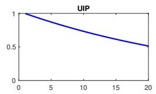

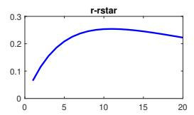

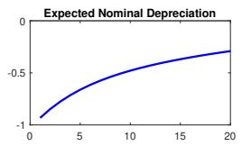

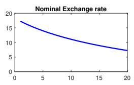

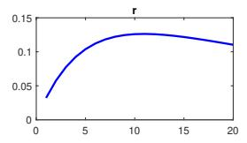

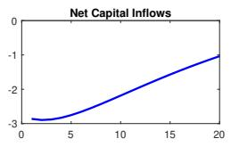  
(a) Impulse Response: Financial Shock

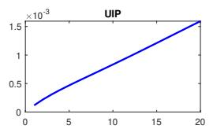

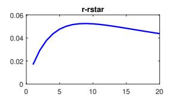

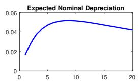

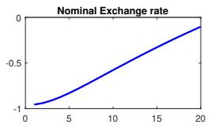

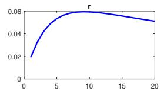

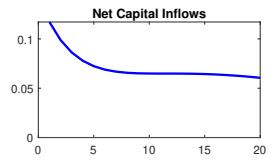  
(b) Impulse Response: Productivity Shock

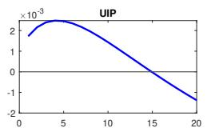

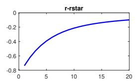

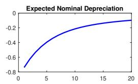

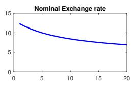

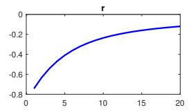

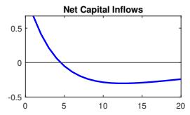  
(c) Impulse Response: Monetary Shock

Notes: Each panel shows the model-implied impulse response to a one-standard-deviation shock of the indicated type. Responses are expressed in percentage deviations from steady state, and based on the baseline calibration in Itskhoki and Mukhin (2021).

Table 1 - Sign Restrictions to Identify Financial Shock

<table><tr><td></td><td>Net Capital Inflows</td><td>UIP</td><td> $\underbrace{r_t - r_t^*}_{Interest\ Differential}$ </td><td> $\underbrace{E_t(e_{t+1} - e_t)}_{Expected\ Depreciation}$ </td><td> $\underbrace{(e_t - e_{t-1})}_{Depreciation}$ </td></tr><tr><td>Financial Shock</td><td>↓</td><td>↑</td><td>↑</td><td>↓</td><td>↑</td></tr><tr><td>Fundamental Shocks</td><td></td><td></td><td></td><td></td><td></td></tr><tr><td>Productivity Shock</td><td>↑</td><td>↑</td><td>↑</td><td>↑</td><td>↓</td></tr><tr><td>Monetary Shock</td><td>↓</td><td>↓</td><td>↑</td><td>↑</td><td>↓</td></tr></table>

Notes: Sign restrictions imposed to identify a positive (adverse) financial shock based on Itskhoki and Mukhin (2021).

This parsimonious identification strategy allows us to remain consistent with a broad class of theoretical frameworks while retaining enough flexibility to accommodate country-specific dynamics and narrative episodes. It also facilitates the integration of narrative sign restrictions, which further sharpen identification in empirically relevant contexts. We turn to these restrictions next.

## 2.3 Narrative Restrictions

While sign restrictions provide a flexible and theoretically grounded approach to structural identification in VARs, they generally deliver set identification rather than point identification. In practice, this implies that the identified set of admissible structural impulse responses can be large, and the mapping between structural shocks and reduced-form innovations remains only partially determined.

As emphasized by Wolf (2022), this feature gives rise to the so-called “shock masquerading problem”, whereby linear combinations of other shocks satisfy the imposed sign restrictions and thus masquerade as the shock of interest. Consequently, even if the theoretical model suggests that sign restrictions should uniquely characterize the structural shock, empirical implementations often leave substantial ambiguity regarding its true nature. In our case, while Table 1 shows that the sign restrictions can uniquely isolate and pin down the financial shock, since no other shock by itself has the same sign pattern, it does not rule out the possibility that linear combinations of the other shocks can have sign patterns similar to the financial shock, thereby “masquerading” as the latter.

To address this issue and tighten identification, Wolf (2022) advocates incorporating additional information beyond the baseline sign restrictions. One approach is to impose further restrictions on the dynamic responses of key variables, thereby reducing the dimensionality of the identified set. We do so by not only imposing restrictions on the components of UIP, but the full row of restrictions corresponding to the financial shock in Table 1, including on variables like nominal depreciation and net capital inflows.

Another, particularly powerful, strategy that has been documented in the literature is to exploit narrative restrictions, which leverage historical episodes where the sign of a given structural shock is known with high confidence (Antolin-Diaz & Rubio-Ramirez, 2018). These narrative constraints act as anchors that substantially mitigate the masquerading problem and enhance the credibility of the identification scheme.

Motivated by this insight, the next section turns to the construction of our narrative restrictions, drawing on well-documented historical episodes and the associated narratives that inform the sign of the shocks under consideration.

## 2.3.1 Narrative Restrictions: The Case Study of Chile's 2019 Social Uprising

The narrative restrictions approach gains practical traction when shocks can be anchored using contemporaneous accounts provided by credible institutions. Central bank reports are especially valuable in this regard, as they document how policymakers interpreted unfolding events. Additional insights can also be gained from regular reports from well-known market analysts, which we use as third-party evidence on contemporaneous investor perceptions and market conditions, not as statements of central-bank objectives or motivations. This subsection illustrates the use of narrative restrictions in the identification of financial shocks. It starts with a case study: Chile's social uprising in late 2019.

Two distinctive features emerge from our analysis. First, the episode triggered a sharp and rapid depreciation of the peso. The December 2019 Monetary Policy Report described how “the movements in the peso were essentially idiosyncratic” (Central Bank of Chile, 2019, p. 22). The Report also documented “a substantial decoupling since the start of the crisis” between the observed exchange rate and an empirical model based on usual fundamentals, noting that “[t]his decoupling is not explained, in principle, by changes in the usual determinants” (Central Bank of Chile, 2019, p. 25). $^{8}$ Second, the episode generated conditions that posed a tangible threat to financial stability. Taken together, these elements provide a clean narrative characterization of the shock and motivate the more systematic use of narrative restrictions developed in the following subsection.

For context, we begin with a brief overview of Chile's monetary policy framework before turning to the economic impact of the 2019 unrest, as conveyed in the Central Bank's nearly real-time assessments.

Chile's monetary policy (MP) framework is firmly anchored in an inflation-targeting regime with a floating exchange rate, and has long been regarded as one of the most credible among emerging markets (Medel, 2018; Robitaille et al., 2024). The framework is implemented in practice by setting the monetary policy rate (MPR) such that inflation forecasts are assessed to converge to 3 percent within the policy horizon. Following a period of transition in the 1990s, inflation targeting was officially adopted in 2001 and, since then, inflation has displayed a historical average of $3.8\%$ , with expectations remaining well anchored.

The ability of the peso to be freely determined by market supply and demand without requiring FX market intervention is a cornerstone of the central bank's monetary policy framework. It enhances the economies capacity to adjust to real shocks and, together with the framework's credibility, has kept inflation expectations firmly anchored even during large external disturbances. $^{9}$ The monetary policy framework, however, recognizes that under a floating exchange rate regime the Central Bank may intervene in the foreign exchange market under exceptional circumstances, when exchange-rate overreactions could jeopardize price stability or the sound functioning of payments, while not targeting a specific exchange-rate level. $^{10}$

The Social Uprising: Context. Localized and peaceful student-led protests began when a modest subway-fare hike of 3 percent took effect on October 6, 2019. They were confined mainly to a few stations in Santiago metro system. The situation, however, dramatically escalated on October 18, when nationwide riots erupted. The Santiago metro infrastructure was extensively damaged, and violence spread across cities. The unrest persisted into November, peaking in intensity during the second week, with reports of military facilities being attacked, before culminating in a broad political agreement on November 15 to initiate a process to draft a new constitution.

In a detailed account of the uprising, Joignant and Garrido-Vergara (2025) trace its roots in structural inequality, the diverse groups involved, and the role of social media. They show how the mobilizations—driven by discontent over education, pensions, health, and wages—ultimately catalyzed Chiles constitutional reform process.

As emphasized by Aruoba et al., 2024, the Social Uprising had three defining characteristics. First, it was fully unexpected but relatively short-lived: Google searches for protestas surged almost one hundredfold between October 17 and 19, before subsiding by mid-November (Aruoba et al., 2024). Second, the unrest was nationwide, though its intensity varied markedly across municipalities. Third, it generated a sharp rise in uncertainty, evident in both survey-based expectations and market indicators.

Notably, even after official reports of violent disorders eased in the second half of November following the political agreement to draft a new constitution, FX market volatility remained elevated, rising sharply in the days following the agreement and reaching a peak near CLP 830 per US dollar on November 28 prompting the central bank to announce an exceptional FX intervention program later that day, which began on December 2. This sequence of events was captured almost in real time in the December Monetary Policy Report, released in the morning of December 5, which also coincided with a regularly scheduled policy meeting. By documenting exchange-rate decoupling from usual fundamentals, deteriorating liquidity conditions, and broader financial-market stress, the report provides the type of narrative anchor that underpins our identification strategy.

The Narrative Account of a Financial Shock. We now turn to a detailed analysis of how the Central Bank interpreted and communicated this episode, drawing on its narrative accounts in the December/2019 Monetary Policy Report. $^{11}$

The Central Bank's own analysis of the CLP/USD exchange rate behavior underscored three key characteristics of this episode. Figure 2 reproduces three diagnostic charts presented in the MP report. Panel a) documents the sharp depreciation of bilateral and multilateral measures of exchange rates beginning in mid-October—amounting to about 15 percent by the end of November relative to the previous month. Panel b) compares these dynamics with those of other Latin American currencies and other commodity exporters, showing that the peso's depreciation was idiosyncratic to Chile and unrelated to external drivers common across emerging markets. Finally, Panel c) contrasts the observed peso exchange rate with the predicted path from the Central Bank's econometric model, which incorporates fundamentals such as copper prices, sovereign spreads, and interest rate differentials, among others. Crucially, the widening gap between the observed and model-implied exchange rate after October 18 provides quantitative support for the Bank's assessment that the peso had decoupled from usual fundamentals and that the depreciation was largely idiosyncratic rather than driven by common external factors. $^{12}$

From the perspective of the central bank, a central concern was the impact on financial conditions amid the sharp depreciation of the peso and what the December 2019 Monetary Policy Report described as “excessive volatility or sudden movements in the exchange rate”. The following excerpt depicts how the deterioration in financial conditions played a central role in the propagation of the shock:

"The national financial market has been affected by the significant change in the economic scenario due to the ongoing social crisis that erupted in Chile on 18 October. In particular, the increase in uncertainty regarding the country's short-and medium-term evolution has caused a deterioration in a set of financial indicators: the stock market fell, the peso depreciated significantly, and fixed-income rates generally increased, as did money market interest rates, in both pesos and dollars. These movements have been highly volatile, and in some cases they have exceeded what would be expected from the increase in country risk perception—the EMBI and the CDS spread have risen, but mildly. The domestic credit market, has also been affected by the heightened local uncertainty. While credit interest rates remain low from a historical perspective, several qualitative information sources show a tightening of financial conditions. Moreover, debt placements have been less dynamic since October, especially in the consumer segment." (Central Bank of Chile, 2019, p. 19)

A particular concern was the deterioration of liquidity in both dollars and pesos:

“During the first days of the crisis, the financial markets did not experience any major changes (). However, from the second week of November on, the heightened

## Figure 2 - Exchange Rate Dynamics

(a) Nominal Exchange Rate

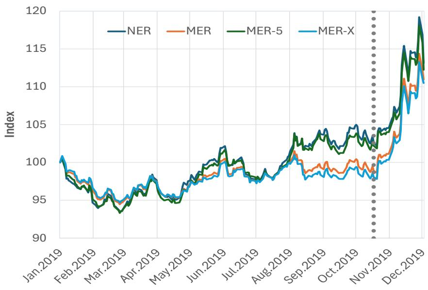

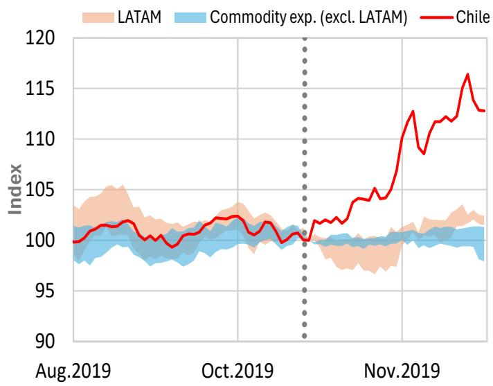  
(b) Chile vs. Other Countries

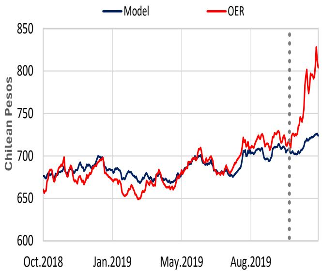  
(c) Observed vs. Model

Note. Panel a: Nominal bilateral and multilateral exchange rates; observed exchange rates are taken at the end of each day. Panel b: LATAM includes Brazil, Colombia, Mexico, and Peru. Commodity exp (excl. LATAM) includes Canada, Australia, New Zealand, and Norway. The model in panel (c.) uses data from July 15th - December 3rd, 2019. Estimation considers long-term equilibrium relationships between nominal exchange rates, copper prices, oil prices, the domestic price level, U.S. price levels, CDS spreads on Chilean sovereign bonds, and the one-year interest rate differential between Chile and the United States. Vertical dotted lines mark the 18th of October, 2019. Source: Central Bank of Chile.

uncertainty resulted in an increase in preferences for liquidity and foreign assets, causing a deterioration in liquidity conditions in dollars and in pesos, reflected in an increase in the onshore spread, reflecting banks' funding costs in USD, and the deposit-swap rate spread reflecting banks' funding costs in pesos (net of MPR expectations), () mainly driven by an intensification of portfolio movements"13 (Central Bank of Chile, 2019, p. 20)

Figures 15a and 15b reproduce the two charts presented in the MP report that depicted the deterioration in the onshore and time deposit-swap spreads.

The Central Bank's assessment of the deterioration in financial conditions also touched upon the spike in bond yields and term spreads, the widening of corporate bond spreads across credit-risk categories, and the changes in portfolio positions. This highlighted residents' unwindings of local fixed-income positions, as illustrated in Fig. 6, reproduced from the MP Report. In particular, the CBCh noted:

“An additional effect was the increase in fixed-income rates, which was strongly related to an increase in the term spread. Corporate rates also rose, in line with the growth of the credit risk spread component. Specifically, the evolution of sovereign and corporate rates is largely explained by the change in local fixed-income positions by the pension funds and mutual funds, respectively.” (Central Bank of Chile, 2019, p. 20)

In light of these developments, the Central Bank reacted with targeted liquidity provision to ease volatility in key financial prices. On November 13-14, it announced measures to provide liquidity in dollars and pesos to the financial system. These included a 30- and 90-day FX swap program aimed at containing the rise in dollar funding spreads; a peso repo facility through a collateralized window at a floating rate linked to the MPR (traditionally the MPR plus 25 bp) with fairly long maturities; and the authorization of repo operations backed by securities that were not previously eligible. Two weeks later, amid renewed FX volatility, the Bank announced on November 28 an intervention program in the foreign exchange market to reduce excessive exchange rate volatility. The program consisted of spot dollar sales via auctions and forward operations, each for up to USD 10 billion, scheduled between December 2019 and May 2020—an amount equivalent to roughly half of the stock of FX reserves at the time. As in prior interventions in 2008 and 2011, the monetary effects of these operations were sterilized. $^{14}$

(a) On-Shore Spread  
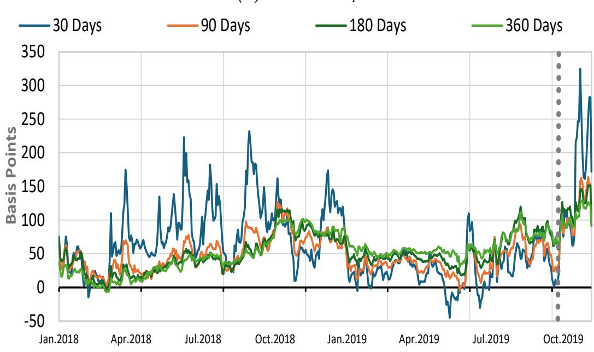

(b) Time deposit-swap spread  
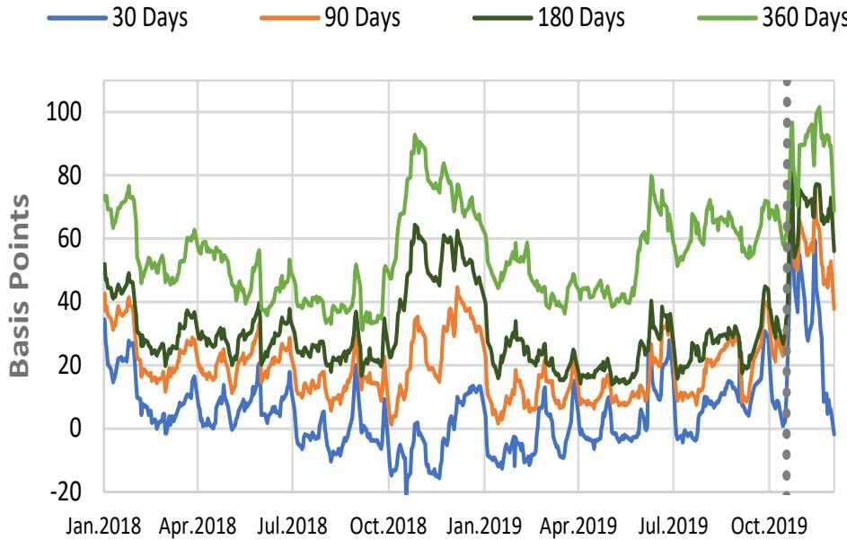

The on-shore spread reflects banks' funding costs in USD, it is computed as the spread over the LIBOR implied in forward prices, based on the marginal prime deposit rate and the secondary market deposit rate. The time deposit-swap spread reflects banks' funding costs in pesos (net of MPR expectations), it is computed as the spread between time deposit rates in the secondary market and the average interbank swap rate. Vertical dotted lines mark the 18th of October, 2019. Source: Central Bank of Chile.

Taken together, this narrative provides a clear identification of the episode of October–November 2019 as a financial shock. The peso’s sharp depreciation, its decoupling from usual fundamentals, the spike in funding spreads, and the deterioration of liquidity conditions are consistent with the type of market dysfunction that our framework classifies as an adverse financial shock. This interpretation is further supported by the BCCh’s subsequent description of the November 2019 FX intervention as responding to “what was perceived as an excessive degree of exchange rate volatility that could hinder price formation and spending and production decisions by individuals and firms, as well as affect the healthy adjustment of the economy and create concern in markets” (Central Bank of Chile, 2020a, p. 29). Accordingly, we impose a narrative restriction that the financial shock in October and November 2019 is positive, grounding identification in contemporaneous policy assessments of market conditions.

## 2.3.2 Extending the Narrative Approach across Time and Countries

Extending the approach across time. We now build on the previous case study to systematically extend the narrative-restriction approach across Chile's entire historical experience since 2000. We begin by identifying periods of sharp and rapid exchange rate depreciation. These are defined as months in which the change in the nominal exchange rate exceeds its average monthly change by more than 1.5 standard deviations. $^{15}$ Table 4 in the Appendix lists all identified episodes. Focusing on the period from 2000 to 2023, we identify 12 episodes for Chile.

We focus the narrative search on depreciation episodes for two reasons. First, this is where the documentary record is informative: episodes of market dysfunction in emerging economies typically materialize as risk-off events, and central bank and market reports document liquidity strains, disorderly trading, and overshooting during sharp depreciations, whereas comparably explicit documentation of non-fundamental appreciation episodes is scarce. Second, anchoring the narrative restrictions to depreciation episodes does not restrict the sign of the shock. The SVAR is linear, so the restrictions serve to identify the direction of the financial shock in the space of innovations; the same identified shock takes negative values, generating appreciations and compressing premia, whenever financial conditions move in the opposite direction. The depreciation anchors thus determine where we look for identifying information, not the sign of the shock realizations, which the estimation leaves free in every period.

Next, from the Central Bank of Chile's website we collected Monetary Policy Reports, Monetary Policy Meeting Minutes, Inflation Reports, and Financial Stability Reports published during or soon after the identified episodes, and supplemented them with reports from private market analysts to enrich the analysis and capture real-time investors' perceptions and reactions. The latter is particularly useful to corroborate and/or provide alternate perspectives to the central bank's narratives, to the extent that official communication could be

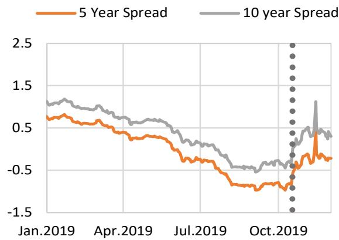

(a) Yields and Term Spreads in CB Securities  
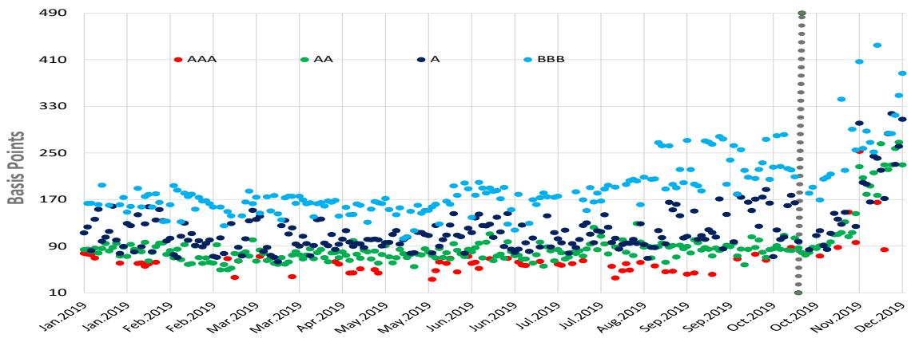  
(b) Non-Financial Corporate Spreads

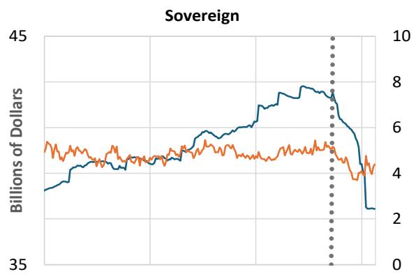

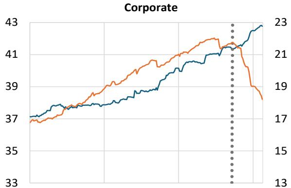  
(c) Stocks of Fixed Income Assets in Pesos held by Pension and Mutual Funds

Note. BCU-2, 5, and 10 relate to CB securities of 2, 5 and 10 year maturities. The methodology for computing term spreads is based on Beyzaga & Ceballos (2017). Panel (b) depicts the spread over the UF sovereign bond rate. Each dot is the daily average weighted by the amount of each instrument in the category. Lastly, Corporate in Panel (c) includes bonds from financial and nonfinancial entities; blue denotes pension funds and orange denotes mutual funds. Vertical dotted lines mark the 18th of October, 2019. Source: Central Bank of Chile.

perceived as biased, cautious or strategically selective. $^{16}$

To identify relevant excerpts from the documents, we employ a two-stage procedure combining keyword-based filtering with large language model (LLM) classification. In a first step, we manually review a subsample of documents to identify paragraphs that are most informative for our research question. Based on this exercise, we construct a set of keywords and guiding questions designed to capture exchange rate dynamics, including depreciation episodes, underlying drivers, and imbalances in foreign exchange (FX) markets. The keyword filtering serves as a pre-selection step to reduce noise and focus the analysis on potentially relevant content. The final keyword set includes: exchange rate, peso, depreciation, currency, devaluation, FX, forward, spot, and swap. We adopt a conservative approach to keyword expansion, as broader terms tend to produce excessive and redundant paragraphs unrelated to exchange rate dynamics. $^{17}$

To further refine the analysis, we apply a zero-shot classification approach based on a pre-trained transformer model (BART large MNLI), which is trained on natural language inference tasks. The model evaluates whether each paragraph entails a set of predefined hypotheses formulated as natural-language questions. This approach allows us to identify semantically relevant content without requiring task-specific training data.

To operationalize this, each paragraph is evaluated against the following guiding questions:

1. Does the paragraph discuss a change in the exchange rate?

2. Does it explain the reasons behind exchange rate movements?

3. Does it assess economic fundamentals?

4. Does it explore global and local drivers of currency fluctuations?

5. Does it highlight FX market imbalances?

6. Does it examine interest rate differentials?

7. Does it consider divergence in monetary policies?

8. Does it explain the reasons behind exchange rate depreciation?

The model assigns a relevance score to each paragraph question pair, based on entailment probabilities. A paragraph is classified as relevant if the associated score exceeds a threshold of 0.75 for at least one of the guiding questions.

The selection procedure is refined iteratively by adjusting both the keyword set and the guiding questions, based on comparisons with manually identified excerpts. This iterative process ensures that the automated classification closely aligns with economically meaningful narrative content while limiting false positives.

Each of the selected excerpts was then manually and independently evaluated by all four co-authors based on the following two criteria:

\- Criterion 1: The excerpt discusses the relevant episode and indicates a large and rapid exchange rate depreciation.

\- Criterion 2: The excerpt provides evidence consistent with a financial shock driven by non-fundamental drivers (i.e., it does not reject the non-fundamental nature of the drivers).

Finally, excerpts were scored using a binary system, with a score of one indicating the presence of the criterion and zero indicating its absence. An episode was classified as a financial shock if all evaluators assigned a score of one to Criterion 1 and the majority assigned a score of one to Criterion 2. This procedure identified five financial shock episodes for Chile—including the 2019 Social Uprising—as summarized in Table 2, left column.

Table 2 - Financial Shock Episodes by Country

<table><tr><td>Chile</td><td>Brazil</td></tr><tr><td>1. June-Aug 2001Argentina default spillovers</td><td>1. May-Jun 2002Lula election uncertainty</td></tr><tr><td>2. Sep-Nov 2008Global Financial Crisis</td><td>2. Sep-Nov 2008Global Financial Crisis</td></tr><tr><td>3. Oct-Nov. 2019Social Uprising</td><td>3. Feb-Mar 2020COVID pandemic</td></tr><tr><td>4. Feb 2020-Aug 2020COVID pandemic</td><td>—</td></tr><tr><td>5. Jun-Aug 2022FX volatility episode</td><td>—</td></tr></table>

The episodes identified with financial shocks recover some well-known periods in the post-2000 macroeconomic history of Chile. In addition to the Social Uprising episode, we identify the mid-2001 Argentinian default with important spillovers to Chile, the Lehman demise that triggered the Global Financial Crisis, the onset of COVID and the episode of large volatility in markets in mid-2022 which marked the next intervention in the FX market following that in 2019. We now present some of the main excerpts from each episode. An Appendix presents the full extent of narratives identified.

Chile episode No. 1: Argentina's crisis, June–August 2001. A noteworthy aspect of this episode is that the peso depreciation reflected a combination of adverse external fundamentals and financial-market stress. The September 2001 Monetary Policy Report attributed the depreciation to regional instability and weaker terms of trade:

“During the present year, the peso has depreciated substantially against the dollar. Thus, from December 2000 to mid-August, the observed exchange rate depreciated by 20%. This was mainly due to economic instability in the region’s countries (Argentina and, to a lesser degree, Brazil) and the drop in the terms of trade, particularly the depressed price for copper. Thus, the nominal exchange rate has been the main adjustment variable in dealing with recent turbulence abroad, which is exactly what is to be expected when using a free floating exchange rate regime such as the one operating in Chile since 1999" (Central Bank of Chile, 2001, p. 26).

At the same time, the Report emphasized that the speed and succession of exchange-rate movements disturbed financial markets despite Chile's strong domestic fundamentals:

"The substantial weakening of the peso during this period disturbed financial markets. The speed and quick succession of movements that led to a decline in conditions abroad exacerbated peso volatility and depreciation, despite the strength of Chile's economy and the coherence of its macroeconomic policies" (Central Bank of Chile, 2001, p. 26).

Chile episode No. 2: Lehman's Collapse, September–November 2008. The narrative evidence underscores the peso's sharp overreaction and dysfunction in FX markets, amid a financial shock that compelled the central bank to inject liquidity into the system.

"The differential between Libor and domestic interest rates in dollars, referred to as onshore spread, over the past year has remained abnormally high. This is due to international financial uncertainty, the lack of liquidity in those markets and a perceived higher bank risk on a global level. These factors have made the spread more volatile and volatility has been heightened by changes in supply and demand for hedge and a greater dollar spot requirement on the part of institutions. Lack of liquidity has meant that, in this context, the forward exchange market does not adequately reflect expectations regarding the exchange rate." (Central Bank of Chile, 2008b, p. 22)

“... onshore dollar rates showed a significant increase, drifting farther apart from the short-term Libor. Coinciding with the startup of the Central Bank’s dollar swap programs, peso liquidity provision programs.” (Central Bank of Chile, 2008a, p. 9)

Chile episode No. 3: Social Uprising, October–November 2019. While the social uprising episode was documented extensively above through central-bank narratives, it is also informative to consider how market participants interpreted the episode in real time. The following excerpt is used as third-party market commentary on contemporaneous investor perceptions and market conditions, not as a statement of the BCChs objectives, motivations, or Board intentions.

“Uncertainty weighed heavily on asset prices as violent social protests in Chile extended for another week. The protests are having an increasingly pronounced impact on financial markets, particularly the exchange rate. The peso plunged by around 6% against the USD over the week. The BCCh, a central bank averse to discretionary intervention in the FX market, intervened verbally first and later announced a preemptive FX swap program to provide liquidity to the market. The monetary authority pointed out that in a context of great uncertainty it makes sense to see heightened volatility in the FX market. Yet, this must be contrasted with the fundamentals of the economy: a solvent financial system, limited currency exposure of economic agents, a solid fiscal position (low public debt), adequate international reserves and sovereign wealth funds, and anchored inflation expectations." (J.P. Morgan, 2019, p. 1)

Chile episode No. 4: COVID, February 2020–August 2020. A key theme that emerged from the analysis of this period was the pronounced volatility in the exchange rate and the heightened stress in financial markets that prompted the provision of dollar and peso liquidity.

“In recent months, the emerging economies have been hit with a variety of shocks. In addition to the direct effects of the pandemic, whose consequences will depend on idiosyncratic factors, there has been a reduction in commodity prices, an increase in risk aversion, and the outlook of a global recession. In this context, the majority of emerging long-term sovereign rates increased significantly” (Central Bank of Chile, 2020b, p. 16). “The stress in the financial markets affected corporate and bank bond spreads, which increased over 75 bp in March and 40 bp in the year. Although spreads could compress, given the bond purchase program, the higher long-term funding cost for banks could limit the flow of credit operations at those maturities, such as home financing loans. With regard to short-term funding, the deposit-swap rate spread has increased recently, which suggests that the liquidity conditions of bank deposits have decreased” (Central Bank of Chile, 2020b, p. 51).

Chile episode No. 5: FX Market Volatility, June–July 2022. Official BCCh communication and contemporaneous market commentary both emphasized heightened exchange-rate volatility, divergence from external fundamentals, and dysfunction in FX market conditions. The first excerpt below reports the BCChs stated rationale for the July 2022 intervention, while the second reflects Goldman Sachs contemporaneous interpretation of the same episode from a market-analyst perspective.

“By mid-July, the depreciation process was accompanied by a sharp increase in exchange rate volatility at a time when agents were finding it difficult to determine the equilibrium price. The abrupt instability in the FX market did not occur in other countries in the region, suggesting that local market tensions were of idiosyncratic nature. This behavior, and the risks it posed to the performance of other markets, such as fixed income, motivated the decision to announce an intervention and liquidity provision program on 14 July.” (Central Bank of Chile, 2022, p. 25)

"The sheer magnitude of the CLP depreciation in recent weeks and rapidly rising risk that distressed FX market price dynamics could destabilize the broader financial system (beyond adding more fuel to an already very hot inflation backdrop) led the central bank to overcome the initial reluctance and move to intervene in the FX market. This is a welcome development, particularly if coupled with a decisive conventional monetary policy strategy." (Goldman Sachs, 2022, p. 14)

Extending the approach to Brazil. We apply the same analysis to Brazil, another country with a well-established inflation targeting regime. Focusing on the period from 2000 to 2023, we first identify 11 episodes that meet the statistical criterion for exchange rate depreciation. Next, we collect from the Central Bank of Brazil's website Monetary Policy Reports, Monetary Policy Meeting Minutes, Inflation Reports, and Financial Stability Reports published during or soon after the identified episodes, and we supplement these sources with reports from private market analysts to enrich the analysis and capture real-time investors' perceptions and reactions.

When we apply the criteria described above to these narratives, we identify three financial shock episodes, listed in the right column of Table 2. Two episodes are common with Chile: the Lehman collapse that triggered the Global Financial Crisis, and the onset of COVID. The third is mid-2002, in the run-up to the presidential election that brought President Lula to his first term in office amid stress in financial markets. We now present illustrative excerpts from each episode. An Appendix presents all narratives identified.

Brazil Episode No. 1: Political Uncertainty, May–June 2002. The narratives by central bank and market observers in the financial shock of May/June 2002 underscored the sharp depreciation of the real and heightened market volatility—driven by political uncertainty and deteriorating investors' sentiment.

“Over the last two weeks, Brazilian financial markets sold off strongly. The turbulence was caused in part by a rise in political risk, with local financial institutions growing increasingly uncomfortable about holding domestic public debt maturing after January 2003, when the new administration takes office. Investors worry about fiscal sustainability and the lack of specific economic policy proposals from the presidential candidates for permanently resolving this problem. The turbulence was also due to financial and regulatory developments that altered the balance in local financial markets, a balance shaken by higher political risk and a complex domestic public debt structure.” (Goldman Sachs, 2002, p. 1)

“In the second half of 2002, the Brazilian economy faced a crisis of confidence in the domestic and international scenarios of relevant magnitude. Internally, the uncertainties about the evolution of the electoral process and the future of the economic policy contaminated the financial markets and the capital flows. The deterioration in the perception of credit risk and the increase in prices volatility had affected public securities and the exchange rate, promoting stress.” (Banco Central do Brasil, 2003, p. 9)

Brazil Episode No. 2: Liquidity and Solvency Problems amid Lehman Collapse, September 2008–November 2008. A prominent aspect that the narratives underscored when analyzing this episode was how the financial shock had adversely impacted multiple economies, regardless of their fundamentals, causing liquidity and solvency problems.

"The prospects for the monetary policy in emerging countries became even more complex in the last weeks, when several currencies, not only from commodity-exporting countries, significantly depreciated in relation to the US\$, in the midst of an increase of volatility and risk aversion indicators in international financial markets." (Banco Central do Brasil, 2008a, p. 142)

"After Lehman Brothers declared insolvent, instability increased in the international financial markets, once risk aversion and lack of liquidity affected more decisively real economy funding, mainly in the US. The financial crisis assumed a more generalized aspect worldwide, spreading geographically. Credit channels were obstructed by uncertainty and liquidity and solvency problems that emerged subsequently." (Banco Central do Brasil, 2008b, p. 163)

Brazil Episode No. 3: Financial Instability and Dysfunctional FX Mkt during COVID, February–March 2020. A key insight from the narratives of this episode was the emergence of financial stability concerns alongside FX market dysfunction highlighted in market commentaries.

“Overall, given the Copom cautious posture, already accommodative Selic level, pressure on the BRL and rising risk-premia, our call is for the Copom to cut, but significantly less than FOMC cumulative easing up to the March 18 meeting date. Extraordinary high uncertainty, dysfunctional FX market pricing dynamics in recent years, and broken markets in general, make it particularly difficult to make decisions with a high degree of confidence.” (Goldman Sachs, 2020, p. 3)

We turn next to the estimation of the models, using the narrative information highlighted in this section.

## 3 Data and Estimation

This section documents the data construction, sample, and econometric procedure used to estimate the SVAR described in Section 2. We work at a monthly frequency and estimate country-specific models for Chile and Brazil.

Given that our research question lies at the intersection of international macroeconomics and finance, the empirical design requires a balanced set of variables that capture both macroeconomic fundamentals and financial frictions. This dual focus also motivates our choice of monthly frequency: quarterly data would obscure the high-frequency dynamics of financial shocks, while daily data, though rich for financial variables, would preclude the inclusion of key macro aggregates. A monthly frequency strikes a pragmatic balance, allowing us to incorporate both dimensions in a coherent structural VAR framework. $^{18}$

## 3.1 Variables and Transformations

The vector of observables used in the SVAR, $y_{t}$ , stacks ten macro-financial variables as follows:

1. UIP Premium $(i_{t}-i_{t}^{*}-(E_{t}(S_{t+1})-S_{t}))$

2. Interest rate differential $(i_{t} - i_{t}^{*})$

3. Inflation (\% change in CPI)

4. Nominal Depreciation (\% change (m-o-m) in bilateral nominal exchange rate vs USD, increase means depreciation of peso)

5. Output (year on year change in monthly output index, seasonally adjusted)

6. CIP deviation (\%) $(i_t - i_t^* - (F_t(S_{t+1}) - S_t))$

7. Net capital inflows (nominal, USD)

8. FX bid-ask spread (spot, %)

9. Foreign exchange intervention (FXI): net purchase of foreign currency (Nominal, USD)

10. Policy rate (%)

where $i_{t}$ and $i_{t}^{*}$ are the monthly short rates in domestic currency and in U.S. dollars, respectively, $S_{t}$ is the monthly bilateral exchange rate to the U.S. dollar, $E_{t}(S_{t+1})$ is the expected exchange rate, and $F_{t}$ is the forward rate. We use the 3-month ahead Consensus Economics survey expectation covering the full sample of Consensus survey respondents for Chile and Brazil. $^{19}$ Analogously, we construct CIP premia based on the 3-month forward rate. The sample is monthly and runs from January 1998 to June 2024. $^{20}$ We include 12 lags to allow for sufficient flexibility in dynamic relationships captured by the VAR system. The Appendix (Table 3) provides a full list of data sources.

The uncovered interest parity (UIP) premium is the central object of interest in our analysis, as it encapsulates deviations from frictionless arbitrage in currency markets. $^{21}$ Its decomposition into the interest rate differential and expected depreciation is equally critical to include in the VAR since it helps identify the financial shock via sign restrictions, as shown in the previous section. In addition, nominal depreciation and net capital inflows are also included since they provide complementary information to help identify the shock and mitigate the shock masquerading problem (Table 1).

To assess the real effects of financial shocks, we include measures of economic activity and prices. At monthly frequency, output is proxied by the IMACEC non-mining index (for Chile) and its Brazilian counterpart, while inflation is captured by the CPI. Other aggregates such as consumption or investment are unavailable at this frequency, making these two variables the most informative indicators of macroeconomic conditions.

Covered interest parity (CIP) deviations and FX bid–ask spreads serve as additional barometers of market functioning. Their inclusion helps distinguish genuine financial shocks from shifts in fundamentals, as episodes of market dysfunction typically manifest in these indicators. Another key advantage is that while we use monthly averages, both are available at daily frequency, potentially facilitating timely inference about liquidity conditions and arbitrage constraints.

Finally, to capture systematic policy responses, we include the short-term policy rate and foreign exchange intervention. These variables allow us to control for and highlight the endogenous reactions of monetary and FX policy to financial disturbances.

## 3.2 Estimation and the Role of Priors

The model is estimated using Bayesian methods, following Rubio-Ramírez et al. (2010) and Antolin-Diaz and Rubio-Ramirez (2018). We place a conjugate Minnesota-type normal-inverse-Wishart prior on the reduced-form parameters, implemented through dummy observations, together with the conventional uniform (Haar) prior over the orthogonal rotation matrices that map reduced-form innovations into structural shocks (Rubio-Ramírez et al., 2010; Uhlig, 2005). Draws from the resulting uniform-normal-inverse-Wishart posterior are retained when they satisfy the sign restrictions of Table 1, and the narrative restrictions are imposed by reweighting admissible draws with the importance weights of Antolin-Diaz and Rubio-Ramirez (2018). Unbalanced series are handled with a data-augmentation step, and inference is based on 2,000 retained draws. Appendix A details the algorithm, the prior hyperparameters, and the treatment of missing data.

Because sign and narrative restrictions only set-identify the model, it is worth being explicit about the role the prior plays in identification. Baumeister and Hamilton (2015) show that, conditional on the reduced-form parameters, the prior over the rotation matrix is not updated by the data—even asymptotically—and that the Haar prior, despite its agnostic appearance, implies non-uniform prior distributions over individual objects of interest, such as the response of a single variable at a single horizon. At the same time, Arias et al. (2025) show that the uniform prior over rotations is necessary and sufficient for the joint prior—and hence the joint posterior—over the identified set for the vector of impulse responses, and for functions of it such as variance decompositions, to be uniform. It is thus the unique rotation prior under which only the identifying restrictions separate observationally equivalent models, and no additional shape information is imparted to the objects we report, which are precisely

such joint functions. $^{22}$

Two features of our identification scheme further limit the influence of the rotation prior. First, the mechanism behind the no-updating result—a likelihood that is flat in the rotation conditional on the reduced-form parameters—does not carry over to narrative restrictions: whether a rotation is admissible, and the importance weight it receives, depend on the realized structural shocks in the documented episodes, so the data do discriminate among rotations within the sign-admissible set. Consistent with this, adding the narrative restrictions to the sign restrictions materially shifts the posterior (Figures 7 and 9), which could not occur if posterior inference merely reproduced the prior over rotations. Second, the restrictions also involve a comparison of impact magnitudes: the financial shock must raise the UIP premium by more than the interest-rate differential on impact, implementing, via the UIP identity, the expected-appreciation restriction. An alternative route, advocated by Baumeister and Hamilton (2015), is to replace the rotation prior altogether with informative priors over structural parameters such as elasticities. That approach is attractive when a mature empirical literature exists from which to calibrate such priors; for the intermediation elasticities relevant to emerging-market currency markets no comparable consensus estimates are available, and we therefore prefer to introduce identifying information through documented, auditable narrative episodes.

## 4 Results

## 4.1 Baseline Estimation for Chile

As a starting point, we estimate the VAR imposing only the baseline sign restrictions for Chile but not adding any narrative information (Figure 5). The impulse responses of a one standard deviation financial shock behave largely as designed based on the sign restrictions in Table 1—the UIP premium, the interest rate differential, and nominal depreciation move in the expected directions following a financial shock. However, the responses of other macro and financial variables such as output, inflation, and FX bid-ask spread are muted and largely indistinguishable from zero. This pattern could reflect either (i) a true zero effect in the population or (ii) a shock masquerading problem, where the identified shock is a mixture of structural disturbances (Wolf, 2022). To sharpen identification and address this ambiguity, we next begin to incorporate narrative sign restrictions motivated earlier that are anchored on well-documented episodes discussed in the previous section and detailed in the appendix.

As a first step toward incorporating narrative restrictions, we augment the sign-only specification by imposing a single narrative sign restriction tied to the October/November 2019 social uprising episode (Figure 6). This adjustment leaves the core responses of the UIP premium, interest rate differential, and nominal depreciation broadly consistent with the baseline identification, but meaningfully alters the inference for real activity: output now exhibits a clear and sizable decline, in contrast to the near-zero effect under sign-only restrictions. This sharpening is exactly the mechanism emphasized by Antolin-Diaz and Rubio-Ramirez (2018), who show that pinning down the sign of the relevant shock at even a handful (and as little as a single) historically salient dates eliminates rotations that combine other shocks and thereby masquerade the identification of the true shock of interest. This sets the stage for the full set of narrative restrictions to be incorporated.

Figure 5 - IRF following a Financial Shock - Chile: VAR with Sign Restrictions Only  
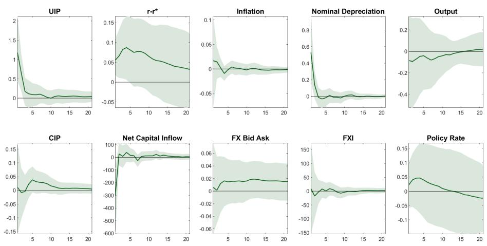  
Notes: Based on a 10 variable monthly VAR with 12 lags. Lines denote medians and shaded regions denote 16-84th percentile range. Financial shock is perturbed by one standard deviation.

Next, we add the full set of narrative restrictions from Table 2, covering the Chile episodes in 2001, 2008, 2019, and 2022. Notably, the negative effect on output remains robust, confirming that real activity declines strongly even when identification is sharpened by incorporating further narrative restrictions (Figure 7). The FX bid–ask spread increases in response to the shock, consistent with a tightening in liquidity conditions and the presence of frictions in financial intermediation in the FX market. This pattern of depreciation triggering a decline in output is consistent with the extensive literature emphasizing the financial channel of exchange rates, where tightening financial constraints of intermediaries, often exacerbated by currency mismatches, lead to a sharp decline in credit conditions which translates into a fall in economic activity (see for instance Akinci and Queralto, 2024 and Hofmann et al., 2022).

The shock also entails a rise in inflation and the policy rate, consistent with stronger exchange rate pass-through, and an active monetary policy response, potentially to contain second round effects. The response of FXI suggests that this second policy lever is also used to lean against the shock by selling foreign exchange reserves and reducing the extent of the depreciation, consistent with optimal policy responses in a variety of models with intermediation based frictions (Basu et al., 2025 and Itskhoki and Mukhin, 2023). $^{23}$

Notes: Based on a 10 variable monthly VAR with 12 lags. Lines denote medians and shaded regions denote 16-84th percentile range. Financial shock is perturbed by one standard deviation.

Figure 6 - IRF following a Financial Shock -Chile: Adding Narrative Restriction for Social Unrest Episode (October-November 2019)

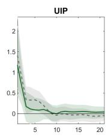

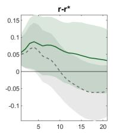

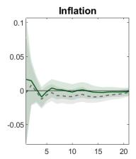

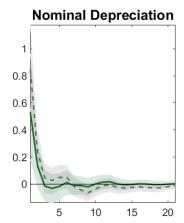

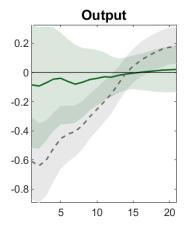

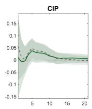

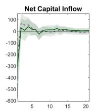

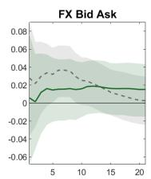

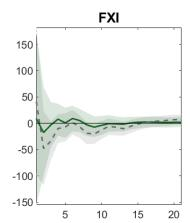  
Sign Only ---- Sign plus narrative (Social Unrest)

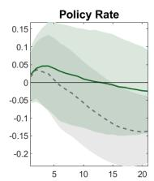

Figure 7 - IRF following a Financial Shock -Chile: Adding Full Set of Narrative Restrictions

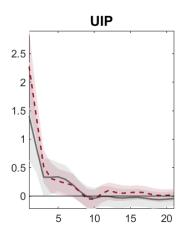

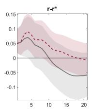

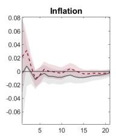

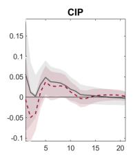

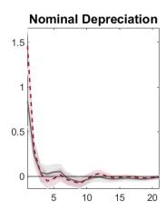

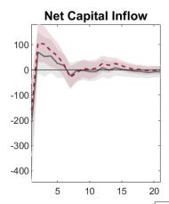

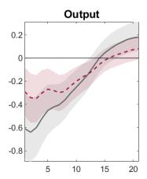

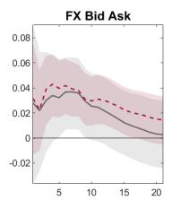

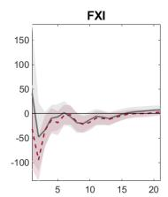  
Sign plus narrative (Social Unrest) ---- Sign plus all narratives

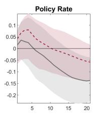

Notes: Based on a 10 variable monthly VAR with 12 lags. Lines denote medians and shaded regions denote 16-84th percentile range. Financial shock is perturbed by one standard deviation.

We conclude the discussion on the transmission mechanism of the identified financial shock by zooming in on the financial block of the model, focusing on its four key components: the UIP premium, interest rate differential, expected depreciation, and nominal depreciation (Figure 8). Following the shock, the exchange rate depreciates sharply, which in turn generates a positive UIP premium. This premium reflects the increased compensation required for holding domestic currency assets. Simultaneously, the interest rate differential widens, signaling tighter domestic financial conditions relative to foreign markets. These movements jointly shape expectations of further depreciation, as captured in the third panel.

The underlying mechanism behind our result relies on the greater demand for foreign-currency bonds relative to domestic bonds in response to the shock, driving up the price of the former, implying an equilibrium condition where home-currency bonds must offer a positive expected return. This is achieved in part via a positive interest differential, and in part via an expected appreciation of the home currency. As explained in Itskhoki and Mukhin (2021), this is a unique distinguishing characteristic of financial shocks relative to fundamental (e.g. productivity) shocks, where interest rate differentials and expected depreciation act to offset one another to limit excess returns via UIP arbitrage.

Figure 8 - IRF following a Financial Shock -Chile: Adding Full Set of Narrative Restrictions

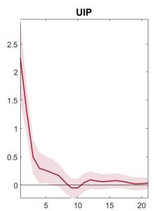

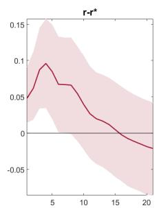

  
Notes: Based on a 10 variable monthly VAR with 12 lags. Lines denote medians and shaded regions denote 16-84th percentile range. Financial shock is perturbed by one standard deviation.

Overall, the pattern of impulse responses maps closely to canonical intermediary-constraint models. In Gabaix and Maggiori (2015), limited risk-bearing capacity of FX intermediaries raises the shadow cost of supplying currency risk, which manifests as a higher excess return on local-currency assets (the UIP premium). In Itskhoki and Mukhin (2021) a financial shock tightens balance sheet constraints and induces a portfolio rebalancing toward foreign-currency debt. Equilibrium then requires a negative co-movement between the two components of UIP—larger interest differentials forecast local-currency appreciation (i.e., a lower expected depreciation), so the interest rate and expected depreciation terms reinforce rather than offset each other.

We now examine the importance of the identified financial shocks in accounting for fluctuations in each variable over the sample using the forecast error variance decomposition (FEVD). Specifically, for horizon h months, the FEVD reports the share of the h-step-ahead forecast error variance of a given variable that is attributable to a particular structural shock. This provides a scale-free measure of the shocks quantitative relevance beyond impulse–response magnitudes.

Figure 9 compares the FEVD for two specifications for Chile, with and without narrative restrictions. In the preferred specification with narrative restrictions (denoted with red triangles in the figure) the non-fundamental shock accounts for approximately one third of the variance of the UIP premium, and about one half of nominal exchange rate (depreciation) fluctuations. In contrast, it accounts for less than ten percent for macroeconomic aggregates such as output and inflation.

These findings are qualitatively consistent with the view that financial disturbances dominate exchange rate dynamics while having limited influence on macroeconomic aggregates, as emphasized by Itskhoki and Mukhin (2021) in what they call the “exchange rate disconnect”. That said, quantitatively, the contrast we uncover is less stark than in their work, where the financial component explains over 90 percent of the exchange rate. This suggests that the contrast between the drivers of the exchange rate, on the one hand, and macroeconomic fundamentals, on the other, while evident, is not as stark as in fully structural yet stylized models like that in Itskhoki and Mukhin (2021), particularly for an emerging economy where the exchange rate and financial frictions are likely to have a stronger influence on real economic activity and prices.

While the FEVD results provide a quantification of the average contribution of each structural shock over the entire sample, it is also informative to examine the time-varying importance of the non-fundamental financial shock. A historical decomposition allows us to attribute, period by period, the observed fluctuations in a given variable to the identified shocks. Figure 10 illustrates this for the UIP premium and output in Chile under our preferred specification (sign plus full narrative restrictions). The decomposition highlights that the financial shock is not a constant driver but instead exhibits episodic dominance, with large positive contributions during well-documented stress episodes—such as the 2008/9 Global Financial Crisis, the 2019 social uprising, and the 2022 volatility spike, and near-zero or even negative contributions in tranquil periods.

This pattern reinforces the interpretation that the identified shock captures disorderly market dynamics rather than systematic fundamentals, consistent with the narrative evidence and the sign restrictions imposed. By complementing the sample–average FEVD with this time series perspective, we underscore the episodic nature of financial shocks and their alignment with historically recognized events. $^{24}$

A related question is whether these financial shocks are domestic in origin or instead reflect global forces transmitted to Chile. Our identification is agnostic on this point: the sign and narrative restrictions isolate exchange-rate pressure associated with financial frictions and market dysfunction, whether that pressure is generated at home or imported through the global financial cycle. Appendix G examines this dimension in two steps. The identified shock comoves positively but only moderately with standard drivers of the global financial cycle—the VIX, the Miranda-Agrippino–Rey global factor, and the dollar (no correlation exceeds 0.5)—while being essentially uncorrelated with identified U.S. monetary-policy and policy-uncertainty shocks; and conditioning the identification directly on these global factors, by adding them as exogenous regressors in the VAR, leaves the impulse responses and variance

Figure 9 - Comparing the Importance of the Shock Across Specifications: Chile  
Contribution of Non-Fundamental Shock to FEVD horizon 1  
  
Notes: Based on a 10 variable monthly VAR with 12 lags. Lines denote medians and shaded regions denote 16-84th percentile range.

Figure 10 - Chile: Historical Decomposition of Variables decompositions essentially unchanged. The shock thus reflects financial-market disruption from either source, and its role in driving exchange-rate premia is not an artifact of the global financial cycle or of U.S. monetary policy.

Historical Decomposition of UIP

  
(a) UIP decomposition

Historical Decomposition of Output  
  
(b) Output Decomposition

Notes: Historical decomposition based on a 10-variable monthly VAR with 12 lags. Bars show the posterior-median contribution of the financial shock (blue) and of the sum of the remaining shocks (red); the green line denotes their sum, which equals the variable in deviation from its deterministic component, that is, from the path implied by initial conditions in the absence of shocks. No credible bands are shown. The first twelve months of the sample serve as initial conditions and are excluded.

Lastly, to shed more light on why the results differ so markedly when narrative restrictions are introduced, we focus on a concrete case: the November 2019 social unrest episode in Chile. This episode is particularly informative because, as argued before, it is well documented in official reports as a period of severe market stress and exchange-rate overshooting disconnected from fundamentals, and leads to a marked change in inference regarding the propagation of the shock to output. Figure 11, panel a, illustrates the posterior distribution of the financial shock for this episode under two identification schemes: sign-only and sign + narrative restrictions. Under the sign-only identification, the set of admissible rotations is broad: many models consistent with the sign restrictions assign a shock realization close to zero or even of the opposite sign, producing a diffuse posterior centered near zero. In other words, the sign-only approach does not rule out configurations in which the financial shock played little or no role during a historically significant stress event.

By contrast, when we incorporate the narrative sign restriction—which encodes the historical record that financial conditions tightened sharply and the peso depreciated beyond fundamentals—the posterior shifts decisively. Models that imply a negligible or wrong-signed shock are ruled out, and the distribution becomes sharply concentrated in the direction consistent with the narrative. This narrowing of the admissible model set echoes the claim by Antolin-Diaz and Rubio-Ramirez (2018) that narrative restrictions—even if few—can sharply improve identification. Indeed such restrictions explain the differences observed in impulse responses and FEVDs: narrative restrictions eliminate rotations that understate the role of financial shocks, thereby producing clearer and more economically plausible estimates of their contribution to UIP and exchange-rate dynamics. This is evident in the comparison in the bottom panel of Figure 11.

## 4.2 Extending the analysis to Brazil

We now turn to Brazil to illustrate how our methodology can be extended to other countries. Figure 12 reports impulse responses to the identified financial shock by one standard deviation under sign-only and sign + narrative identification. As in Chile, imposing the narrative restrictions sharpens the inference, delivering a more pronounced short-run decline in output relative to the sign-only specification, although the difference across specifications is less stark than in Chile.

A closer comparison of the impulse responses under our preferred specification—sign restrictions combined with the full set of narrative restrictions—reveals important similarities and differences between Chile and Brazil (Figure 13). Both economies exhibit comparable magnitudes of UIP premium increases, nominal depreciation, and short-run declines in output following a financial shock. The output response, in particular, is negative and persistent in both cases, underscoring the real effects of financial disturbances, even when fundamentals are not the primary driver of exchange rate movements.

The key differences emerge in the inflation and policy rate responses. In Chile, the shock is inflationary on impact, consistent with exchange rate pass-through, and the policy rate rises promptly, reflecting a tightening stance to contain price pressures. In contrast, Brazil displays a mildly deflationary response alongside the output decline, and the policy rate correspondingly eases, suggesting that financial tightening and the associated decline in aggregate demand dominate the exchange rate channel in shaping near-term price dynamics.

Differences also appear in financial stress indicators: in Chile, the FX bid-ask spread widens sharply, signaling liquidity strains in spot markets, whereas in Brazil the most pronounced reaction is in CIP deviations, pointing to stress in cross-currency funding markets. The lack of movement in the spot bid-ask spread in Brazil may also be due to the unique configuration in the Brazilian FX market, where price discovery takes place largely in the futures market rather than in the NDF or spot market-see for instance Garcia et al. (2014)

Figure 11 - Sharpening from Narrative Restrictions: the November 2019 Episode  
  
(a) Shock Histogram for a Narrative Episode (November 2019)

  
(b) FEVD of Nominal Depreciation: with and without narrative restrictions

Notes: Histograms across retained posterior draws. Panel (a): the structural financial shock in November 2019; panel (b): the share of the forecast error variance of nominal depreciation attributable to the financial shock, under sign-only and sign-plus-narrative identification.

Figure 12 - Brazil: Impulse Responses with and without Narrative Restrictions  
  
Notes: Based on a 10 variable monthly VAR with 12 lags. Lines denote medians and shaded regions denote 16-84th percentile range. Financial shock is perturbed by one standard deviation.

and Patel and Xia (2019). These contrasts highlight how institutional structures and market depth shape the transmission of financial shocks, even when the underlying identification strategy is harmonized across countries.

A comparison of the forecast error variance decomposition (FEVD) at the one-month horizon reveals notable differences in how the identified financial shock accounts for fluctuations in the variables included in the VAR (Figure 14). $^{25}$ In both economies, the overarching pattern holds: the shock explains a substantially larger share of the variance of the UIP premium and the nominal exchange rate than of macro aggregates such as output and inflation.

However, the contrast is sharper in Chile. Under our preferred specification (sign restrictions plus the full set of narrative restrictions), Chile exhibits a pronounced wedge between the financial variables (UIP and the exchange rate), where the shocks contribution is large, and the macro variables, where the contribution remains small. In Brazil, in contrast, while the same ordering is evident—financial variables loading more heavily on the financial shock than macro aggregates—the gap is less pronounced, indicating a comparatively more diffuse propagation of disturbances across shocks and/or a stronger role for other drivers in short-run Brazilian dynamics. We obtain a similar pattern when we consider a longer horizon of 20 months instead of one month for the variance decomposition (Appendix Figure 19).

## 5 Conclusion

This paper proposes a novel empirical approach to identify financial shocks in foreign exchange markets by developing a Structural Vector Autoregression (SVAR) framework with narrative sign restrictions. By leveraging both minimal theoretical sign restrictions and systematically curated narrative anchors, it provides a robust methodology for distinguishing financial (non-fundamental, frictional) shocks from macroeconomic fundamentals in the context of uncovered interest parity (UIP) deviations. Applying this approach to monthly data for Chile and Brazil—two emerging economies with credible inflation-targeting regimes and deep FX markets—we find that financial shocks account for a substantial share of UIP fluctuations and nominal exchange rate movements, while their impact on macroeconomic aggregates such as output and inflation is more modest overall, but can be large in certain episodes.

Figure 13 - Impulse Responses with and without Narrative Restrictions: Comparing Chile and Brazil  
  
Notes: Based on a 10 variable monthly VAR with 12 lags. Lines denote medians and shaded regions denote 16-84th percentile range. Financial shock is perturbed by one standard deviation.

Our results indicate that the identified financial shock explains roughly one-third of the variance of the UIP premium and about one-half of the variance of monthly nominal exchange rate depreciation in Chile, with similar but somewhat less pronounced effects in Brazil. These magnitudes are economically significant for FX variables, yet modest for broader macro aggregates, consistent with the exchange rate disconnect highlighted in recent theory. Importantly, tightening financial conditions that raise currency premia induce a statistically and economically meaningful short-run contraction in economic activity, with country-specific differences in the pass-through to prices and policy rates. The use of narrative sign restrictions—anchored in well-documented episodes of market dysfunction and policy intervention—markedly sharpens identification relative to sign-only approaches, eliminating rotations that understate the role of financial stress during salient episodes and strengthening the output response.

Our empirical estimates fall in between those found in the more structural literature: they imply a larger role for frictional forces than studies attributing most exchange rate variation to fundamentals, but a smaller share than canonical models where intermediary constraints dominate FX dynamics. This synthesis view suggests that financial shocks are episodically dominant for FX variables, especially during stress and intervention windows, while fundamentals remain the primary drivers of macro aggregates. Our historical decompositions make this episodic nature explicit, underscoring the importance of context-specific narrative anchors for credible identification.

Figure 14 - Comparing the Importance of the Shock Across Specifications: Brazil vs Chile  
Contribution of Non-Fundamental Shock to FEVD horizon 1  
  
Notes: Based on a 10 variable monthly VAR with 12 lags. Lines denote medians and shaded regions denote 16-84th percentile range.

Nevertheless, several caveats merit emphasis. First, while our approach is robust to model misspecification and portable across countries, it trades the deep structure of DSGE models for disciplined sign restrictions and narrative anchors. As such, it delivers shock-level counterfactuals but not a full general-equilibrium welfare mapping, and cannot by itself speak to optimal policy rules beyond the sign and magnitude of premia. Yet, it provides a first step towards identifying movements in exchange rate premia that are potential targets for policy interventions. Second, identification remains set-valued by construction, and the approach inherits the usual sensitivity of VARs to variable selection, horizon, and lag length. Third, the quality of narrative classification is crucial and can be a practical limitation when scaling up our methodology to additional countries. While our hybrid strategy combines quantitative, manual, and LLM-based methods, further refinements and validation of narrative indicators in a more systematic way is an important area for future work. Finally, our SVAR is linear with time-invariant coefficients, given that the identification sign restrictions that we use from models that don't distinguish them by regime. As such, while we can trace the effect of a financial shock on market shallowness via the responses of variables like the bid-ask spread, to the extent that it exists, we cannot separately identify a "pure shallowness" shock orthogonal to the financial shock, nor can we accommodate state-dependent amplification—the possibility that the same shock is more contractionary, or that a given FXI is more effective, when markets are already thin.

Our findings highlight several avenues for future research that are promising. First, leveraging more on the continued development of narrative extraction techniques, including more sophisticated natural language processing and machine learning tools, will likely enhance the credibility and precision of empirical identification in macro-finance VARs. This may also help to extend the methodology to a broader set of countries and institutional contexts, thereby assessing to what extent our findings remain valid and what role other market structures play in the transmission of financial shocks. Second, integrating higher-frequency financial data and exploring alternative identification schemes—such as max-share or agnostic approaches—could further sharpen inference on the real effects of financial shocks. Lastly, linking the identified financial shocks to welfare-relevant policy interventions, such as FX swaps or liquidity backstops, could provide more normative implications of our approach.

## Appendix

## A Details on Estimation

This section describes the algorithm used for the estimation and identification of the model. We consider the SVAR model, written compactly as

$$
\mathbf {y} _ {t} ^ {\prime} \mathbf {A} _ {0} = \mathbf {x} _ {t} ^ {\prime} \mathbf {A} _ {+} + \boldsymbol {\varepsilon} _ {t} ^ {\prime} \mathrm{for} 1 \leq t \leq T,\tag{A.1}
$$

with $A_{+}^{\prime}=\left[A_{1}^{\prime}\cdots A_{p}^{\prime}\mathbf{d}^{\prime}\right]$ , $x_{t}^{\prime}=\left[y_{t-1}^{\prime},\ldots,y_{t-p}^{\prime},1\right]$ , where $y_{t}$ is an $n\times1$ vector of observables, $\varepsilon_{t}$ is an $n\times1$ vector of structural shocks, $A_{\ell}$ is an $n\times n$ matrix of parameters for $0\leq\ell\leq p$ with $A_{0}$ invertible, d is a $1\times n$ vector of parameters, p denotes the lag length, and T is the sample size. The vector of shocks $\varepsilon_{t}$ , conditional on past information and the initial conditions $y_{0},\ldots,y_{1-p}$ , is distributed as $\mathcal{N}\left(\mathbf{0}_{n\times1},\mathbf{I}_{n}\right)$ , where $0_{n\times1}$ is an $n\times1$ matrix of zeros and $I_{n}$ is an $n\times n$ identity matrix. The reduced-form representation implied by Equation (A.1) is

$$
\mathbf {y} _ {t} ^ {\prime} = \mathbf {x} _ {t} ^ {\prime} \mathbf {B} + \mathbf {u} _ {t} ^ {\prime} \mathrm{for} 1 \leq t \leq T,\tag{A.2}
$$

where $B = A_{+}A_{0}^{-1}$ , $u_{t}^{\prime} = \varepsilon_{t}^{\prime}A_{0}^{-1}$ , and $\mathbb{E}\left[u_{t}u_{t}^{\prime}\right] = \Sigma = (A_{0}A_{0}^{\prime})^{-1}$ . The matrices B and $\Sigma$ are the reduced-form parameters, while $A_{0}$ and $A_{+}$ are the structural parameters. Similarly, $u_{t}^{\prime}$ are the reduced-form innovations. While the shocks are orthogonal and have an economic interpretation, the innovations may be correlated and lack direct interpretation.

As is well known, the model defined in Equation (A.1) suffers from an identification problem. As described in Rubio-Ramírez et al. (2010), one can reparameterize this model in terms of B and $\Sigma$ together with an $n \times n$ orthogonal rotation matrix Q, such that for given B and $\Sigma$ , a particular choice of Q implies an observationally equivalent set of structural parameters. To solve the identification problem, one typically imposes restrictions on either the structural parameters or on some function thereof—such as the impulse response functions (IRFs)—thereby selecting a specific Q (point identification) or restricting the admissible set of Q matrices (set identification).

Let $y_{t}$ denote the vector of data, which may be unbalanced, for instance including series that start at different points in the sample. Following Uhlig (2005) and Rubio-Ramírez et al. (2010), we draw from a conjugate uniform-normal-inverse-Wishart posterior over the orthogonal reduced-form parameterization $(\mathbf{B}, \mathbf{\Sigma}, \mathbf{Q})$ and transform the draws into the structural parameterization $(\mathbf{A}_{0}, \mathbf{A}_{+})$ . We retain draws of $(\mathbf{A}_{0}, \mathbf{A}_{+})$ only if they satisfy the s sign restrictions, $\mathbf{F}(\mathbf{A}_{0}, \mathbf{A}_{+}) > \mathbf{0}_{s \times 1}$ , and also satisfy a set of m narrative restrictions, $\mathbf{G}(\mathbf{A}_{0}, \mathbf{A}_{+}, \mathbf{y}_{t}) > \mathbf{0}_{m \times 1}$ . Arias et al. (2018) show that this transformation induces a normal-generalized-normal posterior over the structural parameterization and highlight the useful properties of employing conjugate prior distributions (see also Arias et al., 2025). The algorithm closely follows the procedure described in Antolin-Diaz and Rubio-Ramirez (2018), with the main modification being the data augmentation step to address the presence of unbalanced data.

Algorithm Initialize the matrices B and $\Sigma$ .

1. Conditioning on B, $\Sigma$ , and $y_{t}$ , draw a balanced sample of data, $\tilde{y}_{t}$ , using the precision sampler (see, e.g., Antolin-Diaz et al., 2024).

2. Conditioning on $\widetilde{y}_{t}$ , draw $(\mathbf{B}^{(i)},\mathbf{\Sigma}^{(i)})$ from the posterior distribution of the reduced-form parameters (see, e.g., Uhlig, 2005).

3. Draw $\mathbf{Q}^{(i)}$ independently from the uniform distribution over the set of orthogonal matrices (see, e.g., Rubio-Ramírez et al., 2010).

4. Retain $(\mathbf{B}^{(i)}, \mathbf{\Sigma}^{(i)}, \mathbf{Q}^{(i)})$ if $\mathbf{F}(f_{h}^{-1}(\mathbf{B}^{(i)}, \mathbf{\Sigma}^{(i)}, \mathbf{Q}^{(i)})) > \mathbf{0}_{s \times 1}$ and $\mathbf{G}(\mathbf{A}_{0}, \mathbf{A}_{+}, \mathbf{y}_{t}) > \mathbf{0}_{m \times 1}$ ; otherwise, return to Step 2.

5. Repeat Steps 2–4 to obtain multiple draws of the triplet $(\mathbf{B}, \Sigma, \mathbf{Q})$ , which are then reweighted using importance weights as described in Antolin-Diaz and Rubio-Ramirez (2018). Finally, a random draw from the reweighted triplets $(\mathbf{B}, \Sigma, \mathbf{Q})$ is selected.

6. Return to Step 1 until the required number of draws has been obtained.

The natural initialization of B and $\Sigma$ can be performed at the posterior mean of the model estimated on a complete subset of the original data. Steps 2 and 3 draw from the posterior uniform-normal-inverse-Wishart distribution over the orthogonal reduced-form parameterization conditional on $y_{t}$ . Step 4 verifies the sign and narrative restrictions.

Clearly, Steps 2–4 constitute an accept–reject algorithm to draw from the posterior of $(\mathbf{A}_{0}^{(i)}, \mathbf{A}_{+}^{(i)})$ conditional on the identification restrictions, as in Rubio-Ramírez et al. (2010) and Antolin-Diaz and Rubio-Ramirez (2018). The algorithm requires an importance-sampling step to draw from the posterior of $(\mathbf{A}_{0}, \mathbf{A}_{+})$ . This approach is known as Gibbs sampling by sampling–importance–resampling, as described in Koch (2007).

When the model is identified solely through sign restrictions, Step 5 of the algorithm becomes redundant, and the procedure reduces to a standard Gibbs sampler with an accept-reject step for sign restrictions, following the approach of Rubio-Ramírez et al. (2010).

## A.1 Computational Details

Prior. The prior specification for B follows a Minnesota-type structure, with hyperparameters calibrated as follows. The overall tightness of the Minnesota prior is set to $\lambda = 0.20$ , which controls the degree of shrinkage toward the prior mean. The decay parameter, $\alpha = 2$ , determines how the prior variance decreases with increasing lag length. To incorporate information from the initial observations, the tightness of the dummy-initial-observation priors is set to $\theta = 0.01$ . Finally, the prior on the sum of coefficients, which enforces the no-cointegration restriction, is assigned a tightness parameter of $\mu = 1$ . These choices reflect a balance between flexibility and parsimony, ensuring that the model remains well regularized while allowing for meaningful dynamics. All variables except those that are in levels (bid ask spread, net capital flows and policy rate) are assigned IID priors instead of random walk.

The prior for the variance–covariance matrix $\Sigma$ is specified as an Inverse-Wishart distribution, constructed through dummy observations consistent with a conjugate Minnesota framework. The scale matrix is set to $S_{0} = v_{0} \cdot \Psi$ , where $\Psi$ is a diagonal matrix of AR(1) residual variances for each variable, and the degrees of freedom are $v_{0} = n + 2$ , with n denoting the number of endogenous variables. This choice centers the prior on a diagonal covariance structure informed by the data while maintaining flexibility. Additional dummy observations enforce long-run restrictions and persistence, with hyperparameters calibrated as follows: the tightness of the dummy-initial-observation prior is $\theta = 0.01$ , and the tightness of the sum-of-coefficients prior is $\mu = 1$ . These settings ensure that the prior for $\Sigma$ reflects both empirical variability and theoretical considerations, providing regularization without imposing excessive shrinkage.

Table 3 - Data Definitions and Sources

<table><tr><td>Variable</td><td>Definition/Description</td><td>Source</td></tr><tr><td> $i_t^*$ </td><td>US 3 month deposit interest rate, %</td><td>Refinitiv</td></tr><tr><td> $i_t$ </td><td>Local 3 month deposit rate for Chile and Brazil, %</td><td>Refinitiv</td></tr><tr><td> $S_t$ </td><td>Spot rate (Peso/Real vs USD)</td><td>Refinitiv</td></tr><tr><td> $F_t(S_{t+1})$ </td><td>Forward rate (3 month ahead)</td><td>Refinitiv</td></tr><tr><td> $E_t(S_{t+1})$ </td><td>Expected spot rate (3 month ahead)</td><td>Consensus Forecast</td></tr><tr><td>FX bid-ask spread</td><td>% difference in bid and ask spot prices</td><td>Refinitiv</td></tr><tr><td>Output</td><td>Seasonally adjusted IMACEC production index* (% change, yoy)</td><td>Haver, Central bank of Chile</td></tr><tr><td>Inflation</td><td>Log change in CPI</td><td>Haver</td></tr><tr><td>Net capital flows</td><td>(Gross liabilities-Gross assets), USD,</td><td>Central bank of Chile and Brazil</td></tr><tr><td>FXI</td><td>Net purchase of foreign currency, USD</td><td>Central bank of Chile and Brazil</td></tr><tr><td>Policy Rate</td><td>Monetary policy related interest rate, %</td><td>IFS, Haver</td></tr></table>

\*For Chile, the non-mining version is used.

Posterior Computation. Credible sets for impulse responses and forecast error variance decompositions are constructed from the retained draws, targeting a total of 2,000 draws. The results are robust when the number of retained draws is increased to 10,000 or more.

Inference and Reporting. We report posterior medians and 68 percent credible intervals for impulse responses, and medians for forecast error variance decompositions and historical decompositions. All computations are performed at the country level, with no cross-country pooling.

## B Data Definitions and Sources

## C Large and Rapid Depreciation Episodes

Table 4 - Large and Rapid Depreciation Episodes by Country

<table><tr><td>Chile</td><td>Brazil</td></tr><tr><td>June–August 2001</td><td>May–November 2002</td></tr><tr><td>April –June 2004</td><td>April–July 2004</td></tr><tr><td>May –July 2008</td><td>September–November 2008</td></tr><tr><td>September–November 2008</td><td>August–October 2011</td></tr><tr><td>January–March 2010</td><td>April –July 2012</td></tr><tr><td>September -October 2011</td><td>May –July 2013</td></tr><tr><td>May –July 2013</td><td>February –April 2015</td></tr><tr><td>July –September 2015</td><td>July –October 2015</td></tr><tr><td>October–December 2019</td><td>March –July 2018</td></tr><tr><td>December 2019-May 2020</td><td>July –October 2019</td></tr><tr><td>June–August 2022</td><td>February –May 2020</td></tr><tr><td>July–November 2023</td><td>—</td></tr></table>

## D Availability and Frequency of Central Bank Reports

Table 5 – Availability and Frequency of Central Bank Reports by Country

<table><tr><td>Country</td><td>Document Type</td><td>Available Since</td></tr><tr><td>Chile</td><td>Quarterly Monetary Policy Reports</td><td>2000</td></tr><tr><td>Chile</td><td>Monetary Policy Meeting Minutes (8 or 12 times a year)</td><td>2014</td></tr><tr><td>Chile</td><td>Biannual Financial Stability Reports</td><td>2004</td></tr><tr><td>Brazil</td><td>Monetary Policy Minutes (8 times a year)</td><td>2000</td></tr><tr><td>Brazil</td><td>Quarterly Inflation Report26</td><td>1999</td></tr><tr><td>Brazil</td><td>Biannual Financial Stability Report</td><td>2003</td></tr></table>

## E Additional Figures and Robustness Check

(a) On-Shore Spread  

(b) Time deposit-swap spread  

The on-shore spread reflects banks' funding costs in USD, it is computed as the spread over the LIBOR implied in forward prices, based on the marginal prime deposit rate and the secondary market deposit rate. The time deposit-swap spread reflects banks' funding costs in pesos (net of MPR expectations), it is computed as the spread between time deposit rates in the secondary market and the average interbank swap rate. Vertical dotted lines mark the 18th of October, 2019. Source: Central Bank of Chile.

Figure 16 - Financial Market Impact of Social Unrest Episode in Chile in October-November 2019  
(a) Yields and Term Spreads in CB Securities  

  
(b) Non-Financial Corporate Spreads

  
(c) Stocks of Fixed Income Assets in Pesos held by Pension and Mutual Funds

  
Note. BCU-2, 5, and 10 relate to CB securities of 2, 5 and 10 year maturities. The methodology for computing term spreads is based on Beyzaga & Ceballos (2017). Panel (b) depicts the spread over the UF sovereign bond rate. Each dot is the daily average weighted by the amount of each instrument in the category. Lastly, Corporate in Panel (c) includes bonds from financial and nonfinancial entities; blue denotes pension funds and orange denotes mutual funds. Vertical dotted lines mark the 18th of October, 2019. Source: Central Bank of Chile.

  
Figure 17 - Comparing Financial Shock Sign Restrictions in Itskhoki and Mukhin (2021) vs. QIPF (Adrian et al., 2021)  
Notes: This figure compares the impulse response functions under alternative sign restrictions for financial shocks as proposed by Itskhoki and Mukhin (2021) and QIPF (Adrian et al., 2021).  
Figure 18 - Brazil: Comparing the Importance of the Shock Across Specifications

Contribution of Non-Fundamental Shock to FEVD horizon 1  
  
Notes: Based on a 10 variable monthly VAR with 12 lags. Bars denote the posterior-mean share of the one-month-ahead forecast error variance attributable to the financial shock under sign-only identification; triangles denote the specification with narrative restrictions.

Figure 19 - Comparing the Importance of the Shock Across Specifications: Brazil vs Chile (20-Month Horizon)  
  
Notes: Based on a 10 variable monthly VAR with 12 lags. Bars denote the posterior-mean share of the 20-month-ahead forecast error variance attributable to the financial shock in Chile; triangles denote Brazil.

## F Is the Identified Financial Shock a Copper (Terms-of-Trade) Shock in Disguise?

Copper is Chile's dominant export and a leading source of fundamental terms-of-trade shocks: global copper-price swings move Chilean export revenue, the external balance, and financing conditions, and account for a significant share of GDP and fiscal revenue. A natural concern is therefore that the financial shock we identify in Section 4 is partly picking up copper-price movements by construction, so that what we label a “financial” shock is really a commodity (terms-of-trade) shock in disguise. This appendix assesses the extent to which the footprint of the identified financial shock overlaps with copper prices. We report two complementary exercises, and neither supports the commodity-shock interpretation: the financial shock’s contribution to the UIP premium is robust both to conditioning on the episodes where copper could most plausibly be driving UIP and to controlling for copper directly inside the VAR. Throughout, we measure copper by the global monthly price of copper (USD per metric ton); $\Delta_{m}p_{t}^{\mathrm{Cu}}$ denotes its monthly log change and $z_{t}$ its standardized log level.

## F.1 Does copper account for the financial shock's contribution to UIP?

Suppose, contrary to our interpretation, that the identified financial shock were really a copper / terms-of-trade shock relabeled. Then its contribution to the UIP premium would have to come from copper, and it should be largest precisely in the months where copper moves in the direction that a terms-of-trade story says should drive the premium. Consider the months in which the UIP premium rises — our sign convention for a positive financial shock — while copper prices decline. A fall in the copper price is an adverse terms-of-trade shock for Chile that, through tighter external financing, pushes the premium up; these are therefore exactly the months in which a genuine copper shock could account for the observed rise in the premium, and in which a copper-driven financial shock would contribute most to UIP. The symmetric case is months in which the premium falls while copper rises (a favorable terms-of-trade shock that compresses the premium). If our financial shock were a copper shock in disguise, its measured share of UIP movements would have to be larger on these copper-consistent windows than on the full sample. It is not: the share is essentially unchanged.

Construction. We align the identified-shock series with the monthly copper price over 1999m2–2024m6 (n = 305 months) and isolate two subsamples:

\- (a) UIP up & copper down: months in which the UIP premium rose $(\Delta \mathrm{UIP}_t > 0)$ while the copper price fell $(\Delta_m p_t^{\mathrm{Cu}} < 0)$ ;

• (b) UIP down & copper up: months in which the premium fell while copper rose.

In both, the copper move is precisely the terms-of-trade shock a commodity story would invoke to explain the premium movement (copper falling as the premium rises; copper rising as it falls), so these are the subsamples on which a copper confound, if present, should be most visible. We then ask what share of UIP fluctuations the financial shock accounts for — on the full sample and on each subsample — using the historical decomposition (HD) of the UIP premium.

We report two share statistics, each anchored to a forecast-error-variance-decomposition (FEVD) benchmark from the main text. Let $HD_{UIP,t,j}$ denote the cumulative contribution of structural shock j to the UIP premium at month t (today's shock through its impact response, last month's through the one-period-ahead response, and so on), and let $Imp_{UIP,t,j}$ denote its impact (contemporaneous) component alone. Over a set of months S, the cumulative and impact-only shares of the financial shock (indexed j = fin) are

$$
s _ {\mathrm{fin}} ^ {\mathrm{cum}} (\mathcal {S}) = \frac {\sum_ {t \in \mathcal {S}} \left(\mathrm{HD} _ {\mathrm{UIP} , t , \mathrm{fin}}\right) ^ {2}}{\sum_ {t \in \mathcal {S}} \sum_ {j} \left(\mathrm{HD} _ {\mathrm{UIP} , t , j}\right) ^ {2}}, \qquad s _ {\mathrm{fin}} ^ {\mathrm{imp}} (\mathcal {S}) = \frac {\sum_ {t \in \mathcal {S}} \left(\mathrm{Imp} _ {\mathrm{UIP} , t , \mathrm{fin}}\right) ^ {2}}{\sum_ {t \in \mathcal {S}} \sum_ {j} \left(\mathrm{Imp} _ {\mathrm{UIP} , t , j}\right) ^ {2}}.\tag{F.1}
$$

Because the structural shocks are orthonormal, the full-sample expectation of $s_{fin}^{cum}$ equals the long-horizon FEVD of UIP from the financial shock, while $s_{fin}^{imp}$ corresponds to the FEVD at horizon h=1 — the headline impact share reported in Section 4. The two statistics thus bracket the FEVD benchmarks and let us read the same comparison both at impact and over the whole history.

The full-sample empirical shares line up with their FEVD anchors: 0.280 versus 0.283 at impact, and 0.193 versus 0.215 cumulatively, in each case well inside the posterior band. The key result is in the conditional rows. On both copper-consistent subsamples — the months

Table 6 – Share of UIP movements attributed to the financial shock, on the full sample and on the two copper-consistent subsamples (months in which copper moves in the direction a terms-of-trade story would need to explain the premium; defined in the text). Posterior median across draws with the 16%/84% percentile band in brackets. The top panel reproduces the model-implied FEVD of UIP from the financial shock reported in Section 4 (Figure 9); the middle panel is the empirical impact-only share $s_{fin}^{imp}$ from (F.1), the sample analog of the FEVD at h=1; the bottom panel is the empirical cumulative share $s_{fin}^{cum}$ , the analog of the long-horizon FEVD. Subsamples (a) and (b) are defined in the text.

<table><tr><td></td><td>n months</td><td>Posterior median [16%, 84%]</td></tr><tr><td colspan="3">Model-implied FEVD, UIP from financial shock (Section 4)</td></tr><tr><td>h=1 (headline impact share)</td><td>—</td><td>0.283 [0.146, 0.446]</td></tr><tr><td>h=12</td><td>—</td><td>0.236 [0.128, 0.370]</td></tr><tr><td>h=60 (≈∞, long horizon)</td><td>—</td><td>0.215 [0.118, 0.328]</td></tr><tr><td colspan="3">Empirical impact-only share  $s_{fin}^{imp}$ (anchored to FEVD h=1)</td></tr><tr><td>Full sample, 1999m2–2024m6</td><td>305</td><td>0.280 [0.130, 0.453]</td></tr><tr><td>(a) UIP up &amp; Copper down</td><td>80</td><td>0.292 [0.129, 0.499]</td></tr><tr><td>(b) UIP down &amp; Copper up</td><td>99</td><td>0.288 [0.134, 0.473]</td></tr><tr><td colspan="3">Empirical cumulative share  $s_{fin}^{cum}$ (anchored to FEVD h=∞)</td></tr><tr><td>Full sample, 1999m2–2024m6</td><td>305</td><td>0.193 [0.106, 0.305]</td></tr><tr><td>(a) UIP up &amp; Copper down</td><td>80</td><td>0.196 [0.096, 0.337]</td></tr><tr><td>(b) UIP down &amp; Copper up</td><td>99</td><td>0.189 [0.101, 0.303]</td></tr></table>

in which copper moves in exactly the direction a terms-of-trade story needs to explain the premium — the financial shock's share is essentially identical to the full sample (0.292 and 0.288 at impact, 0.196 and 0.189 cumulatively), with heavily overlapping bands. A copper-shock explanation predicts the opposite: the share should be markedly elevated precisely on these windows, where copper could most plausibly be driving UIP. It is not — the conditional shares exceed the full sample only trivially, a fraction of a posterior band, rather than the pronounced increase a genuine copper confound would produce.

## F.2 Robustness: including copper directly in the VAR

As an additional and more stringent check, we re-estimate the VAR with the (standardized log) copper price included as an exogenous regressor in every equation,

$$
y _ {i, t} = c _ {i} + \gamma_ {i} z _ {t} + \sum_ {l = 1} ^ {p} \left[ \Phi_ {l} \right] _ {i, \cdot} y _ {t - l} + u _ {i, t}, \quad z _ {t} \equiv \frac {\log p _ {t} ^ {\mathrm{Cu}} - \overline {{\log p ^ {\mathrm{Cu}}}}}{\sigma_ {\log p ^ {\mathrm{Cu}}}},\tag{F.2}
$$

keeping the sign and narrative restrictions, lag length, and priors identical to the baseline specification. By construction, the identified financial shock is now orthogonal to contemporaneous copper-price movements: any contemporaneous comovement of the endogenous variables with copper is absorbed by $\gamma_{i}z_{t}$ rather than attributed to a structural shock. If the financial shock were substantially a copper shock, conditioning on $z_{t}$ would shrink its impulse responses and FEVD shares toward zero; if the shock is genuinely distinct from copper, they should be essentially unchanged.

Figures 20 and 21 report the comparison, and the results are unchanged. The impulse responses to the financial shock lie on top of each other across all variables and horizons, with essentially indistinguishable posterior bands. The FEVD share of UIP at h=1 moves only from 0.283 to 0.267 — a 1.6 percentage-point change, well inside the posterior 16/84 band — while the shares for nominal depreciation and output are virtually identical. The identified financial shock therefore picks up variation that is not driven by copper prices; it is not a relabeled commodity shock.

Figure 20 - Financial-Shock Impulse Responses: Baseline vs. Copper-Augmented VAR

  
Notes: Impulse responses to a one-standard-deviation financial shock, 1–21 months, in original units. Solid grey lines: baseline specification. Dashed red lines: copper-augmented specification (the same VAR with the contemporaneous standardized log copper price added as an exogenous regressor in each equation). Shaded bands denote the 16–84th posterior percentile range.

Summary. Both exercises point the same way. Restricting to the episodes where copper could most plausibly be driving the premium leaves the financial shock's share of UIP movements essentially unchanged (Section F.1), and placing copper directly inside the VAR leaves its impulse responses and variance shares essentially unchanged (Section F.2). The identified financial shock overlaps only modestly with copper-price fluctuations and is not, mechanically, a terms-of-trade shock in disguise.

Figure 21 - Financial-Shock FEVD at $h = 1$ : Baseline vs. Copper-Augmented VAR  
  
Notes: Forecast-error-variance-decomposition share of each variable explained by the financial shock at horizon h=1. Grey bars: baseline specification. Red triangles: copper-augmented specification (copper added as an exogenous regressor in each equation).

## G Identifying Financial Shocks in Chile: The Role of Global Factors

The restrictions used to identify the financial shock in Section 4 — impact and relative sign restrictions together with narrative restrictions on episodes of acute exchange-market stress — do not distinguish disturbances of domestic origin from those transmitted from abroad. The identified shock captures exchange-rate pressure associated with financial frictions and market dysfunction whether that pressure is generated domestically or imported through the global financial cycle. This appendix characterizes the identified shock along two dimensions. We first quantify its comovement with observable drivers of the global financial cycle — global risk aversion, the U.S. dollar, credit-market conditions, the level of U.S. interest rates, and high-frequency measures of U.S. monetary-policy and monetary-policy-uncertainty surprises. We then ask whether conditioning the identification on these drivers, by including them as exogenous regressors in the VAR, alters the impulse responses and variance decompositions reported in Section 4.

## G.1 Comovement with global financial conditions and U.S. monetary policy

We extract the posterior-median structural financial shock from the baseline Chile specification (sign restrictions together with five narrative restrictions) over the period 1999m1–2024m6. A positive realization is contractionary: it raises the UIP premium, depreciates the currency, and coincides with net capital outflows. We compute its contemporaneous correlation with twenty-two monthly series spanning four families — global risk and credit, the dollar, U.S. interest rates, and identified U.S. monetary-policy and uncertainty shocks. Each series is signed so that higher values correspond to a tightening of U.S. or global financial conditions; were the identified shock merely a reflection of the global cycle, all of these correlations would be positive. Series that are themselves innovations or stationary premia (the monetary-policy surprises and the credit-market measures) enter in levels, whereas persistent prices, rates, and indices enter in monthly changes, with the dollar expressed in percent. Table 7 reports Pearson and Spearman correlations.

The estimates support two conclusions. First, the financial shock comoves positively and significantly with broad indicators of the global financial cycle — the VIX, the Miranda-Agrippino–Rey global factor, and the dollar — but the association is moderate: the correlations are around 0.28–0.31 with the VIX, the global factor, and the DXY, and 0.47 with the broad dollar, with none exceeding 0.5. The global financial cycle thus comoves with the identified shock without dominating it. Second, the shock is essentially uncorrelated with directly identified U.S. monetary-policy and policy-uncertainty surprises: across ten high-frequency monetary-policy measures and two uncertainty measures, every correlation is smaller than 0.08 in absolute value and statistically indistinguishable from zero. The change in the federal funds rate enters with a small negative coefficient, in line with U.S. policy accommodation during episodes of emerging-market financial stress rather than tightening into them. The identified shock is thus related to global financial conditions without being a manifestation of U.S. monetary policy.

Table 7 – Correlation of the Chile financial shock with global and U.S. financial conditions

<table><tr><td>Measure</td><td>n</td><td>Pearson</td><td>Spearman</td></tr><tr><td colspan="4">Global risk and credit</td></tr><tr><td>VIX (Δ)</td><td>306</td><td>0.313***</td><td>0.270***</td></tr><tr><td>Global factor, Miranda-Agrippino-Rey (Δ)</td><td>306</td><td>0.277***</td><td>0.237***</td></tr><tr><td>Excess bond premium</td><td>306</td><td>0.108*</td><td>0.072</td></tr><tr><td>Gilchrist-Zakrajšek credit spread</td><td>306</td><td>0.083</td><td>0.072</td></tr><tr><td colspan="4">U.S. dollar</td></tr><tr><td>Dollar index, DXY (%Δ)</td><td>306</td><td>0.280***</td><td>0.243***</td></tr><tr><td>Broad nominal dollar (%Δ)</td><td>221</td><td>0.467***</td><td>0.420***</td></tr><tr><td colspan="4">U.S. interest rates (Δ)</td></tr><tr><td>Federal funds rate</td><td>306</td><td>-0.202***</td><td>-0.096*</td></tr><tr><td>2-year Treasury yield</td><td>306</td><td>-0.079</td><td>-0.051</td></tr><tr><td>10-year Treasury yield</td><td>306</td><td>-0.072</td><td>-0.052</td></tr><tr><td>Wu-Xia shadow rate</td><td>294</td><td>0.002</td><td>0.044</td></tr><tr><td colspan="4">Identified U.S. monetary-policy shocks</td></tr><tr><td>Policy surprise, 6-month</td><td>305</td><td>0.045</td><td>0.064</td></tr><tr><td>Policy surprise, 24-month</td><td>305</td><td>0.007</td><td>0.011</td></tr><tr><td>Target factor (Gürkaynak-Sack-Swanson)</td><td>305</td><td>0.037</td><td>0.043</td></tr><tr><td>Path factor (Gürkaynak-Sack-Swanson)</td><td>305</td><td>-0.031</td><td>0.028</td></tr><tr><td>Policy-news shock (Nakamura-Steinsson)</td><td>305</td><td>0.001</td><td>0.023</td></tr><tr><td>First principal component, surprises</td><td>306</td><td>-0.039</td><td>0.029</td></tr><tr><td>Pure policy shock (Jarocinski-Karadi)</td><td>306</td><td>-0.008</td><td>0.018</td></tr><tr><td>Information shock (Jarocinski-Karadi)</td><td>306</td><td>-0.075</td><td>0.054</td></tr><tr><td>Federal-funds factor (Swanson)</td><td>246</td><td>0.001</td><td>0.066</td></tr><tr><td>Forward-guidance factor (Swanson)</td><td>246</td><td>-0.033</td><td>0.003</td></tr><tr><td colspan="4">U.S. monetary-policy uncertainty</td></tr><tr><td>Policy-uncertainty shock</td><td>305</td><td>-0.000</td><td>0.015</td></tr><tr><td>Policy-uncertainty index (Husted et al., Δln)</td><td>306</td><td>-0.011</td><td>0.030</td></tr></table>

Notes: Contemporaneous monthly correlations, 1999m1–2024m6, between the median identified financial shock from the Chile VAR (sign plus five narrative restrictions) and each measure of U.S. or global financial conditions. A positive financial shock is contractionary; each regressor is oriented so that a higher value denotes tighter U.S. or global financial conditions. Stationary shocks and premia enter in levels; persistent prices, rates, and indices enter as monthly changes (the dollar in percent). Monetary-policy surprises are defined on FOMC months. Stars denote two-sided significance: \* 10%, \*\* 5%, \*\*\* 1%.

## G.2 Robustness: conditioning on global factors within the VAR

The correlations reported above are computed after estimation. A more stringent test conditions on the global financial cycle and U.S. monetary policy within the identification itself. We summarize the conditioning information in two principal components — the first extracted from the global financial-conditions block (the VIX, the global factor, credit spreads, the dollar, and U.S. interest rates) and the first from the monetary-policy block (the high-frequency surprise and uncertainty measures) — and re-estimate the VAR with both components included as contemporaneous exogenous regressors, under the same sign and narrative restrictions. Each equation then takes the form

$$
\begin{array}{c} y _ {i, t} = c _ {i} + \Gamma_ {i} ^ {\prime} z _ {t} + \sum_ {l = 1} ^ {p} \left[ \Phi_ {l} \right] _ {i,:} y _ {t - l} + u _ {i, t}, \\ z _ {t} \equiv (\text { financial - conditions   factor }, \text { monetary - policy   factor }) _ {t}, \end{array}\tag{G.1}
$$

so that the structural innovations are orthogonal to the contemporaneous global factors. Were the identified financial shock largely a manifestation of the global financial cycle, conditioning on $z_{t}$ would attenuate its impulse responses and variance contributions.

Conditioning on the global financial variables leaves the identified shock essentially unchanged. Figure 22 shows that its impulse responses are nearly identical with and without these variables in the VAR, and Figure 23 establishes the same for the impact variance decomposition: the share of the UIP premium's forecast-error variance attributed to the financial shock declines only from 0.28 to 0.26, and the share of nominal depreciation from 0.49 to 0.47. The remaining responses and variance shares are likewise stable. The results reported in Section 4 are therefore robust to controlling for the global financial cycle and U.S. monetary policy.

Figure 22 - Financial-Shock Impulse Responses: Baseline vs. Global-Factor-Augmented VAR  
  
Notes: Impulse responses to a one-standard-deviation financial shock, 1–21 months, in original units. Solid grey lines: baseline specification. Dashed red lines: the same VAR with the two global-financial-variable factors added as contemporaneous exogenous regressors in each equation. Shaded bands denote the 16–84th posterior percentile range.

Figure 23 - Financial-Shock FEVD at $h = 1$ : Baseline vs. Global-Factor-Augmented VAR  
  
Notes: Forecast-error-variance-decomposition share of each variable explained by the financial shock at horizon h=1. Grey bars: baseline specification. Red triangles: the specification augmented with the two global-financial-variable factors as exogenous regressors.

## References

Acosta-Henao, M., Fernández, A., Gomez-Gonzalez, P., & Kalemli-Özcan,. (2025). Firm financing during sudden stops: Can governments substitute markets? (Working Paper No. 2025/072). International Monetary Fund. https://doi.org/10.5089/9798229005128.001

Adrian, M. T., Erceg, C. J., Kolasa, M., Lindé, J., & Zabczyk, P. (2021). A quantitative microfounded model for the integrated policy framework. International Monetary Fund.

Akinci, Ö., & Queralto, A. (2024). Exchange rate dynamics and monetary spillovers with imperfect financial markets. The Review of Financial Studies, 37(2), 309–355.

Albagli, E., et al. (2024). Uip deviations: Insights from event studies. Journal of International Economics, 146, 103908.

Antolin-Diaz, J., Drechsel, T., & Petrella, I. (2024). Advances in nowcasting economic activity: The role of heterogeneous dynamics and fat tails. Journal of Econometrics, 238(2), None.

Antolin-Diaz, J., & Rubio-Ramirez, J. F. (2018). Narrative sign restrictions for svars. American Economic Review, 108(10), 2802–29.

Arenas, J., & Griffith-Jones, S. (2023). Effectiveness of foreign exchange interventions: Evidence and lessons from chile (Working Paper No. 983). Central Bank of Chile.

Arias, J. E., Rubio-Ramírez, J. F., & Waggoner, D. F. (2018). Inference based on structural vector autoregressions identified with sign and zero restrictions: Theory and applications. Econometrica, 86(2), 685-720.

Arias, J. E., Rubio-Ramírez, J. F., & Waggoner, D. F. (2025). Uniform priors for impulse responses. Econometrica, 93(2), 695–718.

Aruoba, S. B., & Drechsel, T. (2024). Identifying monetary policy shocks: A natural language approach (tech. rep.). National Bureau of Economic Research.

Aruoba, S. B., Fernández, A., Guzmán, D., Pastén, E., & Saffie, F. (2024). Pricing under distress (NBER Working Paper No. 32538). National Bureau of Economic Research. https://doi.org/10.3386/w32538

Bacchetta, P., Benhima, K., & Berthold, B. (2023). Foreign exchange intervention with uip and cip deviations: The case of small safe haven economies (Discussion Paper No. DP18469). Centre for Economic Policy Research (CEPR).

Backus, D. K., Foresi, S., & Telmer, C. I. (2001). Affine term structure models and the forward premium anomaly. Journal of Finance, 56(1), 279–304. https://doi.org/10.1111/0022-1082.00325

Banco Central do Brasil. (2003, May). Financial stability report (No. 1). Banco Central do Brasil. Brasília.

Banco Central do Brasil. (2008a, September). Inflation report (No. 3). Banco Central do Brasil. Brasília.

Banco Central do Brasil. (2008b, December). Inflation report (No. 4). Banco Central do Brasil. Brasília.

Basu, S., Boz, E., Gopinath, G., Ünsal, F., & Adrian, T. (2025). Integrated monetary and financial policies for small open economies. Econometrica.

Baumeister, C., & Hamilton, J. D. (2015). Sign restrictions, structural vector autoregressions, and useful prior information. Econometrica, 83(5), 1963-1999.

Bocola, L., & Lorenzoni, G. (2020). Financial crises, dollarization, and lending of last resort in open economies. American Economic Review, 110(8), 2524–2557. https://doi.org/10.1257/aer.20180830

Bodenstein, M., Cuba-Borda, P., Gornemann, N., & Presno, I. (2024). Exchange rate disconnect and the trade balance. International Finance Discussion Paper, (1391).

Central Bank of Chile. (2001, September). Monetary policy report. Central Bank of Chile. Santiago.

Central Bank of Chile. (2008a). Financial stability report (Second Half 2008). Central Bank of Chile. Santiago.

Central Bank of Chile. (2008b, September). Monetary policy report. Central Bank of Chile. Santiago.

Central Bank of Chile. (2019, December). Monetary policy report. Central Bank of Chile. Santiago.

Central Bank of Chile. (2020a, January). Chile's monetary policy within an inflation-targeting framework. Central Bank of Chile. Santiago.

Central Bank of Chile. (2020b). Financial stability report (First Half 2020). Central Bank of Chile. Santiago.

Central Bank of Chile. (2022, September). Monetary policy report. Central Bank of Chile. Santiago.

Chahrour, R., Cormun, V., De Leo, P., Guerrón-Quintana, P. A., & Valchev, R. (2025). Exchange rate disconnect revisited (Working Paper No. w32596) (Previously circulated as Exchange Rate Disconnect Redux). National Bureau of Economic Research. https://doi.org/10.3386/w32596

Clayton, C., Coppola, A., Maggiori, M., & Schreger, J. (2025). \*Geoeconomic pressure\* (tech. rep.). National Bureau of Economic Research.

Dao, M., & Gourinchas, P.-O. (2025). Covered interest parity in emerging markets: Measurement and drivers (Working Paper No. 2025/057). International Monetary Fund. https://doi.org/10.5089/9798229003995.001

Dao, M., Gourinchas, P.-O., & Itskhoki, O. (2025). Breaking parity: Equilibrium exchange rates and currency premia (Working Paper No. 2025/153) (IMF Working Paper Series). International Monetary Fund. https://doi.org/10.5089/9798229015615.001

Das, M., Gopinath, G., & Kalemli-Özcan,. (2022). Preemptive policies and risk-off shocks in emerging markets (tech. rep. No. 2022/003). International Monetary Fund. https://doi.org/10.5089/9781616358341.001

De Leo, P., Keller, L., & Zou, D. (2024). Speculation, forward exchange demand, and cip deviations in emerging economies (Research Paper) (Posted October 11, 2024; revised March 11, 2025). The Wharton School, University of Pennsylvania. https://doi.org/10.2139/ssrn.4949594

Dell, M. (2025). Deep learning for economists. Journal of Economic Literature, 63(1), 5–58.

Della Corte, P., Sarno, L., Schmeling, M., & Wagner, C. (2022). Exchange rates and sovereign risk [Published online October 1, 2021]. Management Science, 68(8), 5591–5617. https://doi.org/10.1287/mnsc.2021.4115

Du, W., & Schreger, J. (2022). Cip deviations, the dollar, and frictions in international capital markets. In G. Gopinath, E. Helpman, & K. Rogoff (Eds.), Handbook of international economics: International macroeconomics, volume 6 (pp. 147–197). Elsevier. https://doi.org/10.1016/bs.hesint.2022.03.001

Engel, C. (2016). Exchange rates, interest rates, and the risk premium. American Economic Review, 106(2), 436–474. https://doi.org/10.1257/aer.20121365

Fama, E. F. (1984). Forward and spot exchange rates. Journal of monetary economics, 14(3), 319–338.

Fanelli, S., & Straub, L. (2021). A theory of foreign exchange interventions. The Review of Economic Studies, 88(6), 2857-2885.

Fang, H., Li, M., & Lu, G. (2025). Decoding china's industrial policies (tech. rep.). National Bureau of Economic Research.

Farhi, E., & Gabaix, X. (2016). Rare disasters and exchange rates. Quarterly Journal of Economics, 131(1), 1–52. https://doi.org/10.1093/qje/qjv040

Gabaix, X., & Maggiori, M. (2015). International liquidity and exchange rate dynamics. Quarterly Journal of Economics, 130(3), 1369–1420. https://doi.org/10.1093/qje/qjv016

Garcia, M., Medeiros, M., & Santos, F. (2014). Price discovery in brazilian fx markets (tech. rep.). Texto para discussão.

Goldman Sachs. (2002, June 14). Brazil: A few ideas to stabilize local financial markets (Latin America Economic Analyst No. 02/12). Goldman Sachs Global Investment Research.

Goldman Sachs. (2020, March 18). Brazil: Copom: Restarting easing with a 50bp selic cut (LATAM Today). Goldman Sachs Global Investment Research.

Goldman Sachs. (2022, July 15). Chile: A taxing tax reform and a new constitution that pleases neither left nor right (Latin America Economics Analyst). Goldman Sachs Global Investment Research.

Greenwood, R., Hanson, S., Stein, J. C., & Sunderam, A. (2023). A quantity-driven theory of term premia and exchange rates. Quarterly Journal of Economics, 138(4), 2327–2389. https://doi.org/10.1093/qje/qjad024

Hofmann, B., Patel, N., & Wu, S. P. Y. (2022). Original sin redux: A model-based evaluation. Bank for International Settlements, Monetary; Economic Department.

Inoue, A., & Kilian, L. (2020). The role of the prior in estimating VAR models with sign restrictions (Working Paper No. 2030). Federal Reserve Bank of Dallas.

Itskhoki, O., & Mukhin, D. (2021). Exchange rate disconnect in general equilibrium. Journal of Political Economy, 129(8), 2183-2232.

Itskhoki, O., & Mukhin, D. (2023). Optimal exchange rate policy (tech. rep.). National Bureau of Economic Research.

Jara, A., & Piña, M. (2022). Exchange rate volatility and the effectiveness of fx interventions: The case of chile (Working Paper No. 962). Central Bank of Chile.

Joignant, A., & Garrido-Vergara, L. (2025). Revisiting the chilean social uprising: Explanations, interpretations, and over-interpretations. Latin American Research Review, 1–12.

J.P. Morgan. (2019, November 15). Chile and ecuador (Economic Research, Global Data Watch). J.P. Morgan Securities LLC.

Kalemli-Özcan,, & Varela, L. (2025). Five facts about the uip premium (Working Paper No. No. 28923) (Revised January 2025). National Bureau of Economic Research.

Kekre, R., & Lenel, M. (2024). Exchange rates, natural rates, and the price of risk. University of Chicago, Becker Friedman Institute for Economics Working Paper, (2024-114).

Koch, K. (2007). Gibbs sampler by sampling-importance-resampling. Journal of Geodesy, 81(9), 581–591.

Korinek, A. (2025). Generative ai for economic research: Use cases and implications [Forthcoming]. Journal of Economic Literature.

Medel, C. (2018). Econometric analysis on survey-data-based anchoring of inflation expectations in chile (Working Paper No. 825). Central Bank of Chile.

Meese, R. A., & Rogoff, K. S. (1983). Empirical exchange rate models of the seventies: Do they fit out of sample? Journal of International Economics, 14(1), 3–24. https://doi.org/10.1016/0022-1996(83)90017-X

Miyamoto, W., Nguyen, T. L., & Oh, H. (2023). In search of dominant drivers of the real exchange rate. Review of Economics and Statistics, 105(4), 1–14. https://doi.org/10.1162/rest\_a\_01342

Ottonello, P., Song, W., & Sotelo, S. (2024). An anatomy of firms political speech (tech. rep.). National Bureau of Economic Research.

Patel, N., & Xia, F. D. (2019). Offshore markets drive trading of emerging market currencies. BIS Quarterly Review, December.

Robitaille, P., Zhang, T., & Weisberg, B. (2024, December). How well-anchored are long-term inflation expectations in latin america (FEDS Notes). Board of Governors of the Federal Reserve System.

Romer, C. D., & Romer, D. H. (1989). Does monetary policy matter? a new test in the spirit of friedman and schwartz. In O. J. Blanchard & S. Fischer (Eds.), Nber macroeconomics annual (pp. 121-184, Vol. 4). MIT Press.

Rubio-Ramírez, J. F., Waggoner, D. F., & Zha, T. (2010). Structural vector autoregressions: Theory of identification and algorithms for inference. The Review of Economic Studies, 77(2), 665–696.

Stavrakeva, V., & Tang, J. (2024). A fundamental connection: Exchange rates and macroeconomic expectations. Review of Economics and Statistics, 106(4), 1–49. https://doi.org/10.1162/rest\_a\_01520

Uhlig, H. (2005). What are the effects of monetary policy on output? results from an agnostic identification procedure. Journal of Monetary Economics, 52(2), 381–419.

Verdelhan, A. (2010). A habit-based explanation of the exchange rate risk premium. Journal of Finance, 65(1), 123–145. https://doi.org/10.1111/j.1540-6261.2009.01525.x

Wolf, C. K. (2022). What can we learn from sign-restricted vars? AEA papers and proceedings, 112, 471–475.

## PUBLICATIONS