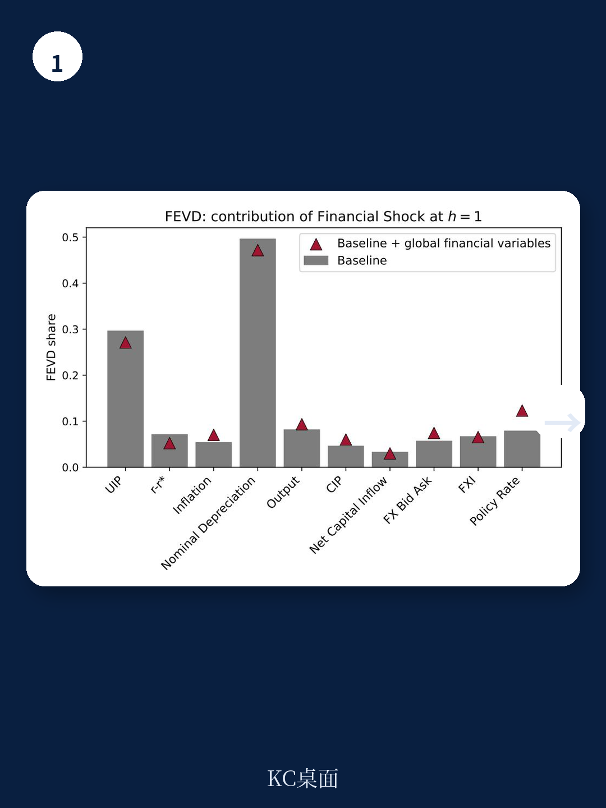
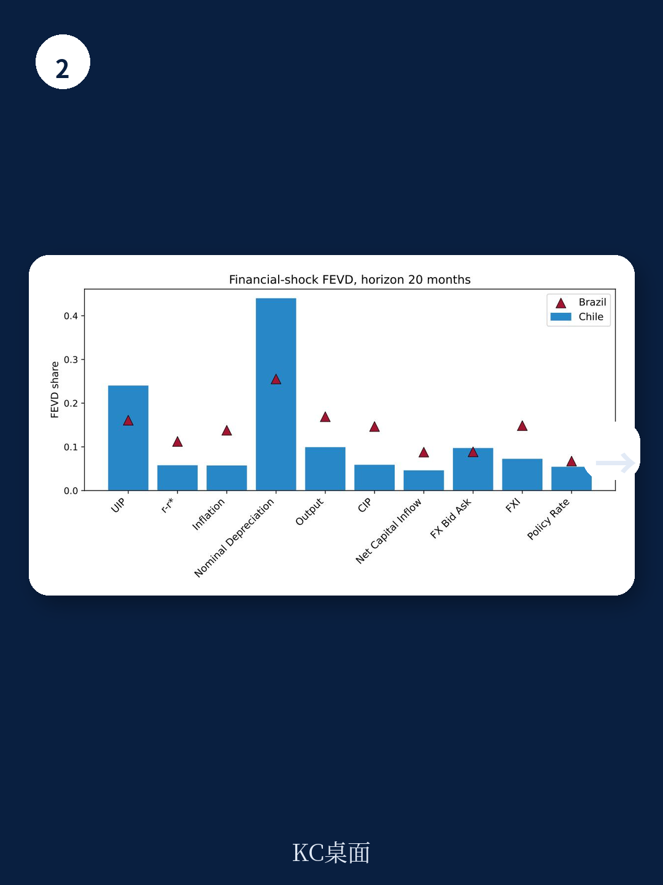

# IMF：货币市场与相关指标观察

汇率变动究竟在多大程度上反映宏观环境基本面，又在多大程度上源于与基本面无关的资金摩擦？这个问题长期困扰开放宏观宏观环境学。IMF在2026年7月发布的工作论文中，提出了一种结合符号约束与叙事约束的识别方法，试图从利率平价偏离中分离出纯粹的资金冲击。基于巴西和智利两国近二十年的月度数据，研究得出一个位置明确的判断：资金冲击解释了UIP波动约三分之一，但对产出和通胀等宏观变量的方差贡献不足10%。

这一结果处在文献争论的中间地带。它高于将大部分汇率波动归因于贸易再平衡或需求冲击的研究，又低于那些认为资金中介约束几乎完全主导汇率动态的结构模型。报告认为，资金冲击对汇率变量的影响是间歇性的、事件驱动的，而基本面仍是宏观总量的主要驱动力量。

## 1. 符号与叙事双重约束识别资金冲击

识别策略的核心在于UIP偏离的两个组成部分——利率差与预期贬值——在资金冲击下的负向共动关系。当资金中介的资产负债表约束收紧时，利率差扩大与预期升值同时出现，推高UIP偏离并伴随本币贬值。基本面冲击通常意味着相反的共动方向。这一符号逻辑在多个经典汇率模型中共享，因此对模型误设具有稳健性。

纯符号约束VAR存在“冲击伪装”问题，即不同冲击组合可能产生相同的观测结果。为缓解这一缺陷，研究引入了叙事约束：以2019年智利社会动荡期间央行报告和市场分析师记录的市场功能失调为锚点，再通过定量筛选与人工复核相结合的方式，系统梳理两国过去二十年中汇率快速贬值事件。识别过程使用大语言模型对央行与市场报告进行初筛，再由研究团队人工评分确认每个事件是否包含非基本面摩擦的证据。

> **KC评论：** 用叙事事件锚定冲击识别，等于给统计方法装上了“历史坐标”。智利2019年案例的价值在于，央行报告明确记录了汇率与基本面脱钩、流动性紧张和市场功能紊乱，这为区分资金冲击与基本面冲击提供了难得的自然实验。

## 2. 资金冲击对汇率影响显著但对宏观影响有限

方差分解结果显示，在智利，识别出的资金冲击解释了UIP溢价方差的约三分之一，以及月度名义汇率贬值方差的约一半。在巴西，排序相同但对比略弱。无论哪个国家，资金冲击对产出和通胀方差的贡献都低于10%。这一模式与理论中强调的“汇率脱节”现象一致——汇率与宏观基本面之间的弱关联，部分源于资金摩擦的独立作用。

历史分解进一步显示，资金冲击的贡献集中在少数高不确定性事件窗口。这意味着，在正常时期，汇率波动仍主要由基本面驱动；但在市场功能受损的时期，资金冲击会短暂主导汇率走势。报告强调，这一“间歇性主导”特征，正是纯符号约束方法容易低估资金冲击作用的原因。

## 3. 资金冲击引发产出调整但传导渠道存在国别差异

尽管资金冲击对宏观方差的贡献有限，一旦发生，其实际影响并不温和。脉冲响应显示，推高货币溢价的条件收紧会引发统计和宏观环境意义上显著的短期产出调整。价格传导和政策响应在两国呈现分化：智利在冲击后价格立即上升、政策利率收紧；巴西则短期价格不确定性较弱、政策利率反而放松。

市场微观结构指标印证了这一分化。智利的FX买卖价差在冲击后显著扩大，表明流动性紧张是主要传导渠道；巴西的CIP偏离反应更为剧烈，指向离岸与在岸市场之间的套利摩擦。报告认为，这与两国机构微观结构的差异一致——智利外汇市场以本地银行为主导，而巴西市场存在更活跃的离岸交易。

## 4. 叙事约束显著增强识别精度

将叙事约束与符号约束结合，效果并非边际改善。报告显示，叙事锚点消除了纯符号识别下低估资金不确定性的旋转问题，强化了产出响应估计，并提高了资金冲击对UIP和汇率变动的贡献度，同时没有机械地放大宏观响应。这说明，叙事信息不仅提供了历史背景，还实质性地收窄了识别集合。

方法论上，这一策略有三个优势：不依赖单一均衡映射或难以识别的参数先验，因此对模型误设稳健；相同的符号逻辑可跨国家移植，审计透明；直接针对UIP溢价及其组成部分，恰好是政策制定者试图通过外汇干预抵消的摩擦对象。报告也承认，识别仍是集合值而非点估计，且月度频率无法捕捉日度或周度的高频动态。

> **KC评论：** 报告最值得注意的贡献不是“资金冲击重要”这个结论本身，而是给出了一个可复用的识别框架：用模型共享的符号逻辑缩小范围，再用历史事件锚定方向。对于研究新兴市场汇率的研究者，这套“符号加叙事”的组合拳比单纯依赖统计约束更接近政策讨论的实际语境。

报告的估计结果处于文献的中间位置，这一位置本身就有信息量。它支持一种综合视角：资金冲击在不确定性期对汇率变量具有支配性影响，但基本面仍是宏观总量的主要驱动因素。对于外汇干预政策的讨论，这一区分提供了实证基础——干预应针对压缩无效率溢价，而非对抗基本面调整。
