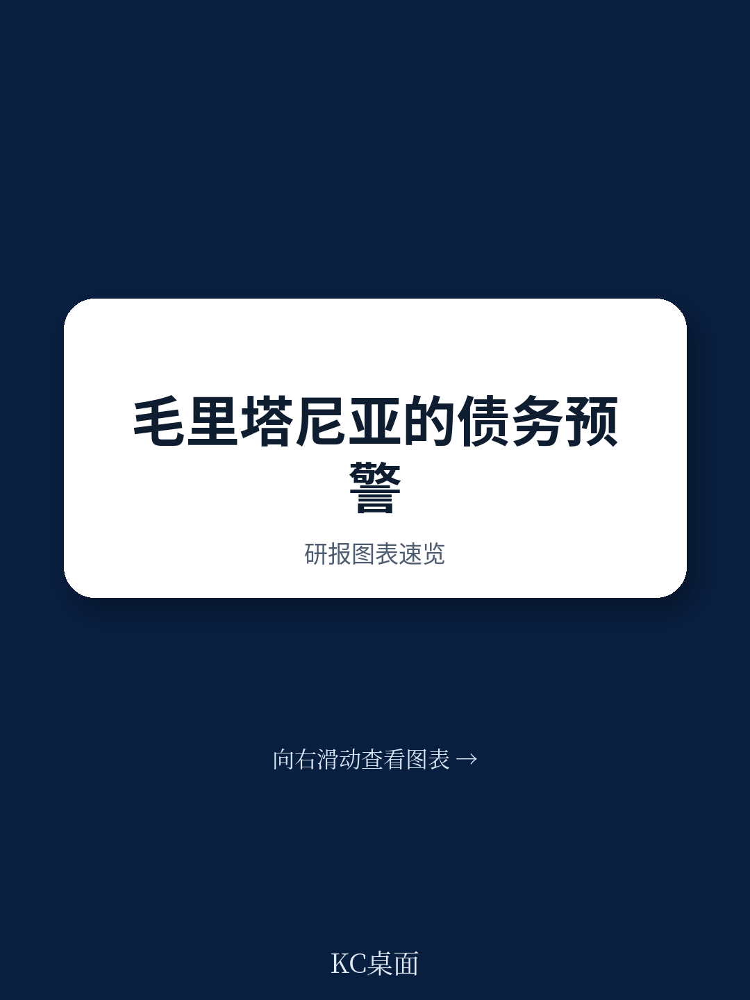
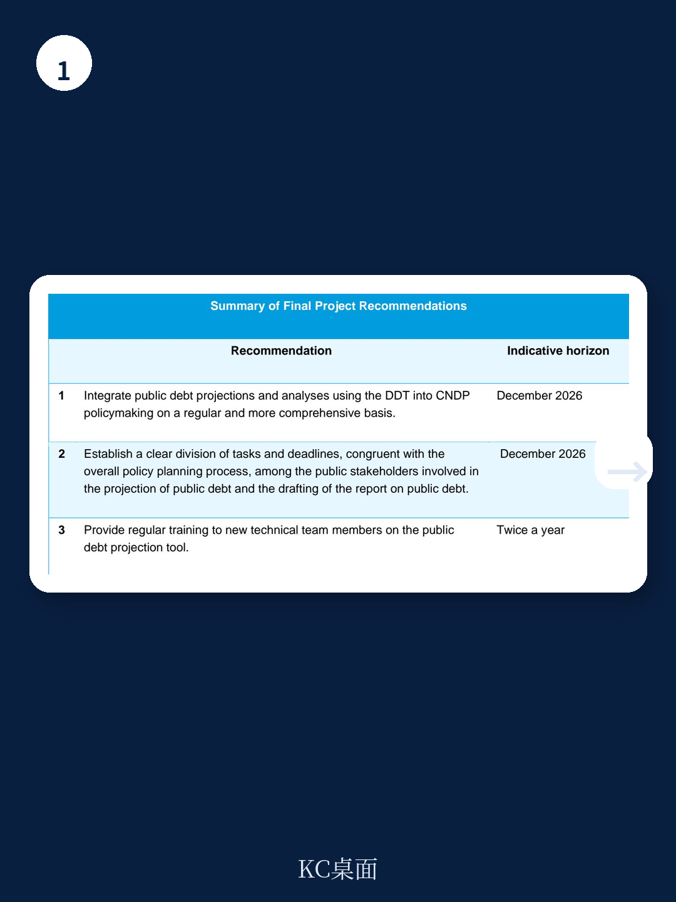
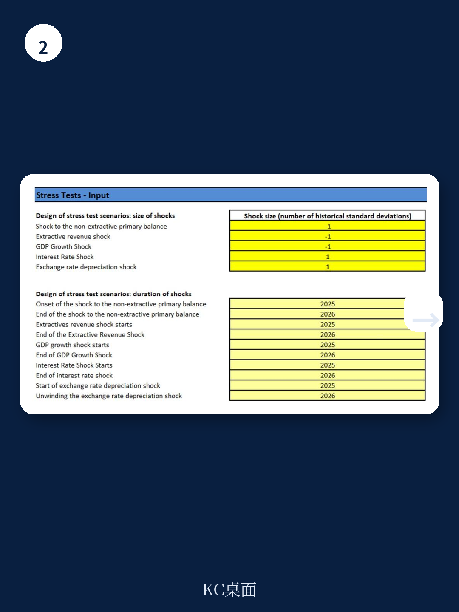

# IMF：资金结构与相关数据观察

2026年5月发布的这份技术援助报告，记录了IMF能力发展学院（ICD）与毛里塔尼亚财政部之间为期两年的合作项目。项目始于2024年1月，核心目标不是开发一套全新的债务模型，而是让该国国家公共债务委员会（CNDP）真正具备独立完成债务预测与可持续性分析的能力。报告显示，这一目标已实现：CNDP核心团队不仅掌握了公共债务动态工具（DDT）的操作，还完成了针对资源丰富国家的定制化版本（DDT RRC），并将自然灾害模块（ND DDT）纳入常规分析框架。

毛里塔尼亚的债务管理面临双重约束。一方面，该国财政高度依赖铁矿石、天然气和黄金等采掘业收入，全球大宗商品价格波动直接传导至财政平衡；另一方面，干旱和洪水等自然灾害反复冲击宏观环境稳定。2022年俄乌冲突引发的粮食和能源价格飙升，叠加铁矿石价格节奏变化，曾导致贸易逆差扩大、外汇储备下降。IMF在2022年2月批准了总额8690万美元的ECF和EFF安排，2023年12月又提供了2.5821亿美元的韧性与可持续性安排（RSF）资金，用于气候适应研究。这套工具组合的引入，正是在这一财政脆弱性背景下展开的。

## 1. 债务动态工具按资源依赖特征完成本地化改造

标准DDT框架在毛里塔尼亚的应用遇到一个结构性问题：该国财政政策操作的主要工具是非采掘初级余额，而非一般意义上的初级财政余额。若直接套用标准模型，债务可持续性分析将无法反映资源收入波动对财政路径的真实影响。

项目团队在第二次技术援助任务（2024年8月26日至9月4日）期间完成了DDT RRC的定制开发。该版本将非采掘初级余额作为核心财政变量纳入债务动态方程，使CNDP能够区分资源收入变化与财政政策调整各自对债务轨迹的贡献。报告附录中的用户手册显示，这一调整并非简单的变量替换，而是涉及对债务创造流量的重新分解——在商品价格冲击情景下，模型能够分离出初级赤字出现变化与实际GDP增长节奏变化各自对债务率上升的贡献。

> **KC评论：** 对资源依赖型地区而言，债务可持续性分析的关键不在于预测资源价格，而在于区分“资源运气”与“政策效果”。DDT RRC的价值正在于此：它让政策制定者看到，在剔除采掘收入波动后，财政路径本身是否可持续。

## 2. 自然灾害模块将气候冲击转化为可量化的债务情景

毛里塔尼亚对气候冲击的暴露程度并非抽象概念。报告引用了1969年干旱事件的历史数据，通过计量方法估计干旱对宏观宏观环境结果的影响，再将这些影响校准为债务动态模型中的冲击变量。ND DDT工具允许用户输入国家特征和灾害参数，生成三年期内的宏观影响路径，并最终转化为债务率偏离基线的幅度。

这一方法论的实质，是将原本难以纳入财政规划的气候不确定性，转化为可比较、可检验的债务情景。CNDP团队在2024年9月4日前完成了包含气候相关不确定性的不确定性矩阵构建，这一里程碑的完成时间早于原定计划。报告显示，核心团队已能够独立使用ND DDT模拟干旱和洪水冲击对债务可持续性的影响，并据此设计财政调整路径。

## 3. 商品价格冲击情景显示初级赤字是债务上升主因

报告提供了一个具体的不确定性测试案例：在铁矿石等大宗商品出口价格下跌5%的冲击下，定制化情景与基线情景的债务率差异在2025年达到GDP的1.5个百分点。分解结果显示，这一差异主要来自初级赤字出现变化，而非实际GDP增长节奏变化。到2026年，初级赤字的持续出现变化将再推高债务率0.5个百分点。

这一分解结果对政策制定有直接含义：商品价格冲击对债务的影响，很大程度上取决于财政如何应对。如果冲击发生后不调整非采掘初级余额，债务率将持续偏离可持续路径；反之，若能在冲击初期实施财政调整，债务上升幅度可以得到控制。这正是DDT RRC作为政策分析工具的核心用途——不是预测冲击何时发生，而是评估冲击发生后不同财政应对方案的效果。

## 4. 制度化安排与培训机制保障工具持续使用

技术援助的最终成效，取决于工具能否在外部专家撤离后继续运转。报告提出了三项具体建议：将DDT纳入CNDP政策制定的常规流程，时间节点为2026年12月；在参与债务预测的各公共机构间明确任务分工和时间表；每半年为技术团队新成员提供一次培训。

项目框架评估显示，所有成果指标均被评为“完全实现”。核心团队在2024年12月31日完成了首份使用DDT的公共债务报告草案，比原定时间晚了四个月，但报告质量获得认可。用户手册的编制覆盖了DDT RRC和ND DDT的完整操作流程，包括冲击校准方法、情景设计步骤和结果解读指南，为知识留存提供了制度载体。

毛里塔尼亚案例的参考价值在于：它展示了技术援助如何从“提供工具”转向“建立能力”。DDT本身并非新模型，IMF通过公开课程DDTx提供标准版本；项目的增量贡献在于本地化定制、跨机构协调机制和持续培训安排。对于同样面临资源依赖和气候脆弱性的国家，这一路径具有可复制性——前提是受援国具备一个类似CNDP的跨机构协调平台，并且核心团队有足够的政策分析基础来吸收和运用这些工具。

For informational purposes only. Portions may be generated,translated,summarized,or edited with AI assistance based on source materials and may contain omissions or errors. Please verify independently. This is not investment,legal,tax,accounting,or other professional advice.

