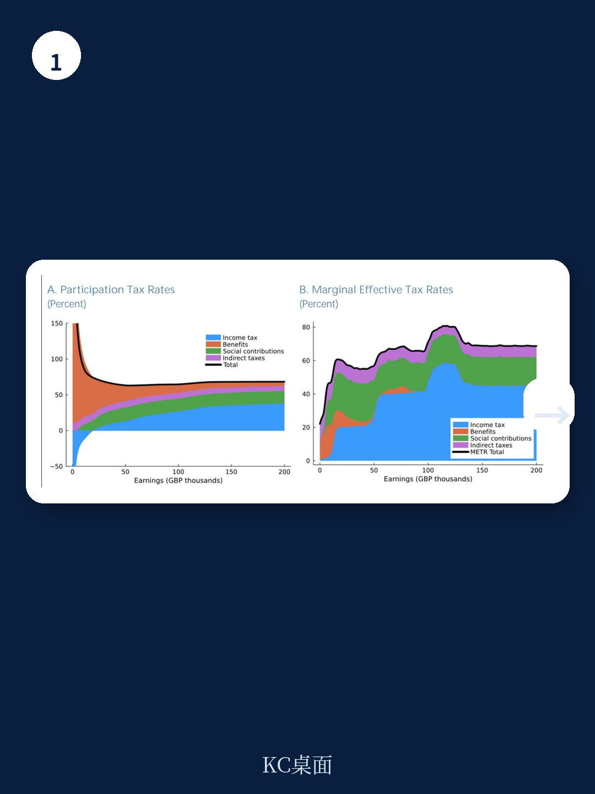
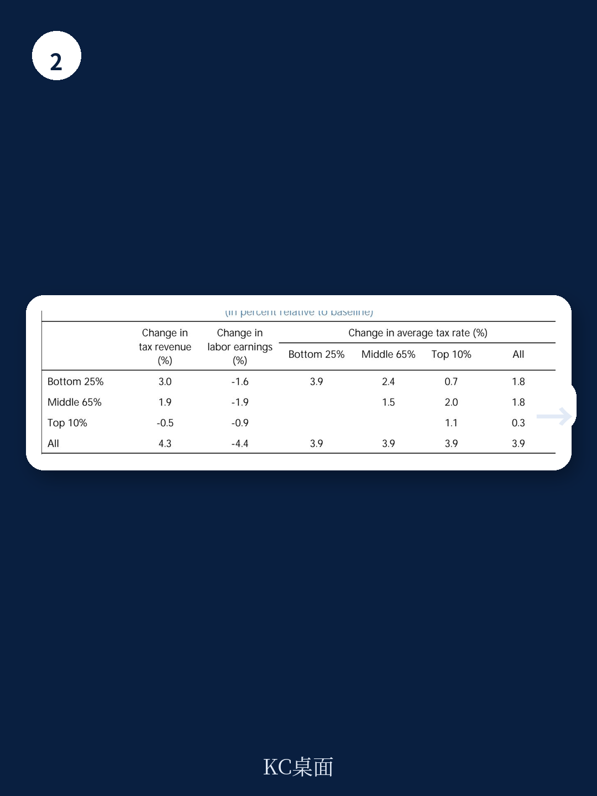

# IMF：行业规则与相关数据观察

英国劳动税收入占全部税收近一半，约相当于GDP的16%。IMF在2026年7月发布的国别报告中，用微观模拟模型评估了三种劳动税改革路径的增收潜力、劳动供给效应与分配后果。核心判断是：在现行税制结构下，通过统一提高劳动税率来大规模增收的空间有限；把增税瞄准收入分布底端，效率损失更小但涉及公平取舍；而按照最优税制逻辑重新设计税负结构，则可能在改善工作激励的同时获得更高收入。

这份报告的特殊之处在于，它把讨论从“要不要加税”推进到了“在哪个位置加税”。英国近年劳动税收入已上升约4个百分点的GDP，现行财政计划下到本十年末还将再增加2个百分点。税基冻结带来的“隐性增税”正在发生，而报告试图回答的是：在既有扭曲之上继续加码，还有多少余地。

## 1. 英国边际有效税率呈现明显的断崖结构

报告用边际有效税率（METR）刻画税收与福利退坡的联合效应。低收入的Universal Credit退坡显著抬高了进入劳动市场的参与税率；高收入端则面临多重阈值叠加——个人所得税高税率、儿童福利在6万英镑以上开始退坡、个人免税额在10万英镑以上逐步取消。这些“税崖”导致边际有效税率随收入上升出现剧烈跳跃，并在阈值下方形成纳税人聚集。

报告指出，英国平均税负低于OECD和G7均值，但高收入者的边际税率明显高于其他G7国家。这意味着英国税制的高度累进性主要集中体现在收入分布上端，而底端的参与激励和上端的边际税率问题同时存在。

> **KC评论：** 边际有效税率和平均税率是两回事。平均税率低不代表边际激励合理，英国的问题恰恰在于阈值处的边际税率跳升过于陡峭，这直接影响的是“多工作一小时值不值”的决策。

## 2. 统一提高劳动税率的增收空间有限

基准模拟显示，如果对全部分布的边际有效税率统一上调，虽然能增加一定收入，但劳动供给损失显著。原因在于统一加税会同时加剧底端参与激励不足和上端边际税率过高这两类既有扭曲。报告估计，在统一加税情景下，每增加1个百分点的GDP收入，劳动供给的下降幅度明显大于其他改革路径。

这一结论的政策含义直接：在现行结构上做“全面加税”，宏观环境成本会随着税率上升而加速放大。报告特别强调，英国劳动税收入在未来几年仍将因免税额冻结而自动上升，这本身就相当于一次渐进式的统一加税，进一步压缩了主动加税的空间。

## 3. 底端定向增税更有效率但涉及公平取舍

第二个情景是只对收入分布底端提高边际税率。模拟结果显示，这类定向增税能筹集更多收入，效率损失更低，原因是底端税基规模大且行为反应相对有限。但代价是公平维度的出现变化——低收入群体的税负上升，而高收入者不受影响。

报告用参与弹性数据说明了这一取舍的规模：最低收入五分之一群体的参与弹性为0.49，最高收入五分之一群体仅为0.08。这意味着底端增税虽然效率损失小，但直接作用于最脆弱的劳动群体，其公平代价需要与效率收益放在同一框架内权衡。

## 4. 最优税制设计指向“底端强化激励、顶端平滑税率”

第三个情景不再做参数式调整，而是用最优税收框架求解整个边际税率曲线。结果显示，在满足相同收入目标的前提下，非线性最优税制能够在提高总收入的同时改善劳动供给表现。具体方向是：在收入分布底端通过更慷慨的在职转移强化工作激励，同时降低顶端过高的边际有效税率，平滑儿童福利退坡和个人免税额取消造成的断崖。

报告对参数的敏感性做了检验。当劳动供给弹性提高25%或50%时，增收潜力下降，但“通过税制再设计改善效率与公平取舍”的定性结论不变。报告同时提示，不同弹性假设下最优税率的形状差异很大，尤其是收入分布顶端的结果对参数高度敏感，量化结论需要谨慎解读。

> **KC评论：** 报告反复出现的“效率-公平权衡”不是抽象概念。底端增税效率高但公平代价大，顶端降税率公平代价小但效率收益集中，真正难的是在两者之间找到一条连续的边际税率曲线，而不是在几个阈值点上做零敲碎打的调整。

## 5. 观察框架：用边际有效税率替代名义税率作为分析起点

报告提供了一个可复用的分析框架：评估税制改革时，不应只看名义税率变化，而应追踪边际有效税率——即税收增加与福利退坡的联合效应。英国税制中大量阈值效应意味着，名义税率不变的情况下，福利退坡节奏的改变同样会改变工作激励。

对关注英国财政走向的观察者而言，这份报告提示了一个容易被忽略的维度：未来几年劳动税收入的自动增长本身就是一种政策选择。免税额冻结的延续与否，其对劳动供给的影响不亚于任何一次公开的税率调整。而围绕税制再设计的讨论，核心将不是“加不加税”，而是“在哪个收入位置加税、以什么方式加税”。

IMF的模型基于2023-24年英国家庭资源调查数据，模拟的是当前税制结构下的改革路径。报告没有展开的是政治可行性问题——任何触及儿童福利退坡或个人免税额取消的调整，都会直接改变特定收入群体的实际税负，这类改革的分配后果远比统一加税更集中，也更难在公共讨论中达成共识。

For informational purposes only. Portions may be generated,translated,summarized,or edited with AI assistance based on source materials and may contain omissions or errors. Please verify independently. This is not investment,legal,tax,accounting,or other professional advice.

