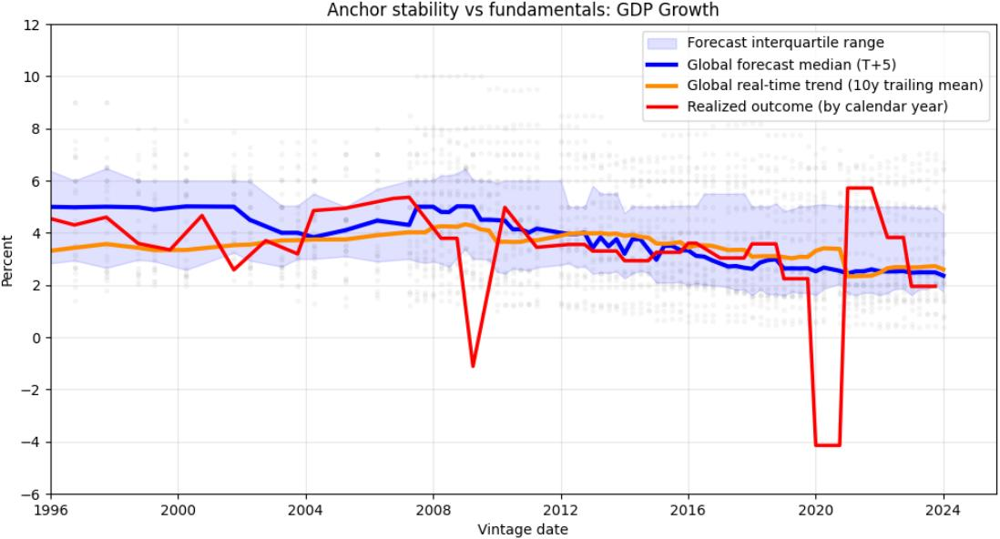
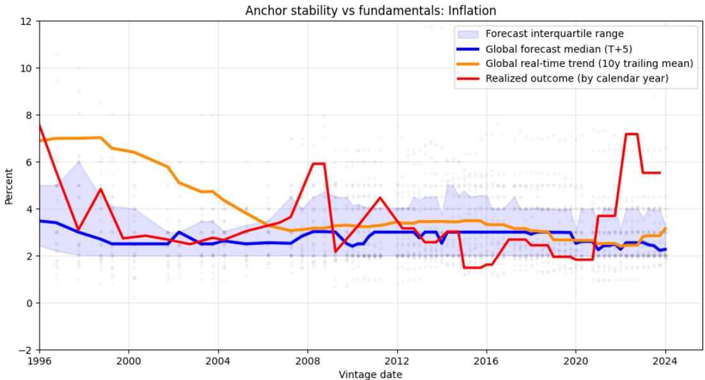
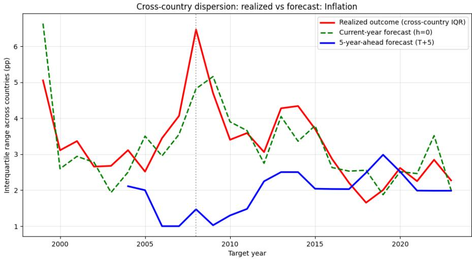
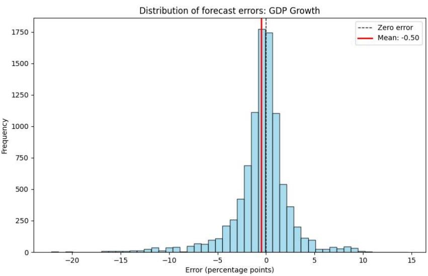
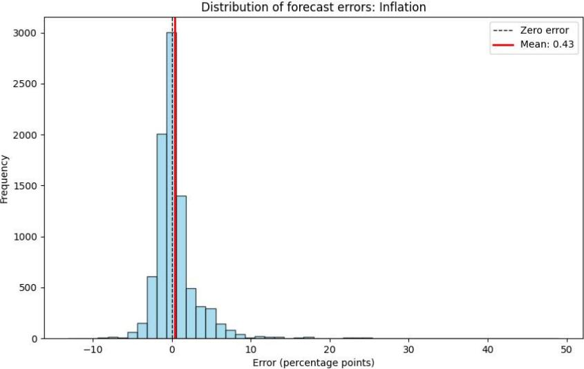
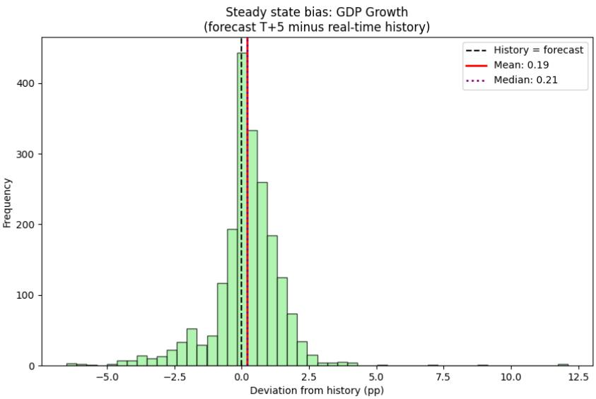
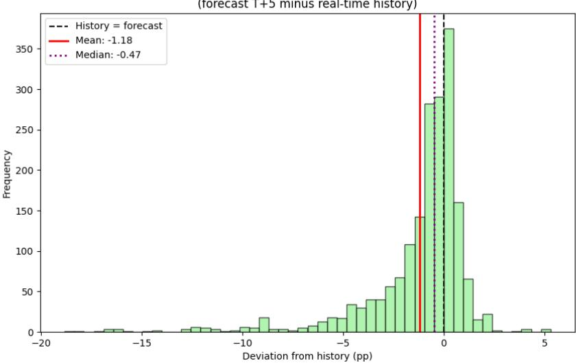

# Looking for Underlying Structure in WEO Forecasts

Yurii Sholomytskyi

WP/26/164

IMF Working Papers describe research in progress by the author(s) and are published to elicit comments and to encourage debate. The views expressed in IMF Working Papers are those of the author(s) and do not necessarily represent the views of the IMF, its Executive Board, or IMF management.

2026
JUL

# IMF Working Paper Institute for Capacity Development

# Looking for Underlying Structure in WEO Forecasts

Prepared by Yurii Sholomytskyi

Authorized for distribution by Ali Alichi
July 2026

IMF Working Papers describe research in progress by the author(s) and are published to elicit comments and to encourage debate. The views expressed in IMF Working Papers are those of the author(s) and do not necessarily represent the views of the IMF, its Executive Board, or IMF management. The views expressed herein are those of the author and should not be attributed to the IMF, its Executive Board, or its management.

ABSTRACT: This paper examines the statistical properties of the IMF's World Economic Outlook (WEO) projections over 1999–2023 for 29 economies. The optimism of WEO growth forecasts is well established; we confirm it and look behind it at two features of how the forecasts are built. First, the growth of the systemic economies (the United States and China) appears to be underutilized in the projections: forecasts embed less of the cross-country growth comovement present in the data, a gap we term forecast fragmentation that did not narrow over the sample. Second, the conditional growth-inflation link present in the historical data is weakly represented in the projections. These patterns suggest that structural models, in which such cross-country and real-nominal linkages can be verified through estimation, could be a useful complement to expert judgment, serving as a baseline check for medium-term anchors.

RECOMMENDED CITATION: Sholomytskyi, Y. (2026). “Looking for Underlying Structure in WEO Forecasts.” IMF Working Paper WP/26/164, International Monetary Fund.

<table><tr><td>JEL Classification Numbers:</td><td>C53, E37, F33, F47</td></tr><tr><td>Keywords:</td><td>IMF; World Economic Outlook; Forecast error; Optimism bias; Forecast fragmentation</td></tr><tr><td>Author&#x27;s E-Mail Address:</td><td>ysholomytskyi@imf.org</td></tr></table>

WORKING PAPERS

# Looking for Underlying Structure in WEO Forecasts

Prepared by Yurii Sholomytskyi

## Contents

Glossary 2   
I. Introduction 3   
II. Literature review 4   
III. Empirical strategy 5   
A. Data construction and horizon selection 5   
B. Testing for inertia and optimism 6   
C. Testing for spillovers and synchronization 8   
D. Testing for model coherence 8   
IV. Empirical results 9   
A. Structural optimism vs. historical inertia 9   
B. Long-run steady state bias 10   
C. The anatomy of optimism: level versus timing 11   
D. Spillovers and forecast fragmentation 12   
E. Model coherence and information use 13   
F. Evolution of forecast performance over time 15   
V. Conclusion 16   
References 18   
A Detailed statistical results 19   
A.I Structural optimism . . . . . . . . . . . . . . . . . . . . . . . . . . . . . . . . . . . . . . . . . . . . . . . . . . . . . . . . . . . . . . . . . . . . . . . . . . . . . . . . . A.II Spillovers and synchronization 20   
A.III Inflation-GDP coupling 23   
A.IV Error decomposition 24   
A.V The reality check 24   
A.VI Counterfactual benchmark 24   
A.VII Forecast bias statistics 25   
A.VIII Evolution of forecast performance 27   
A.IX Robustness checks 29   
B Data and sample 31   
B.I Variable definitions 31   
B.II Sample composition 31

## Glossary

BVAR Bayesian Vector Autoregression
DSGE Dynamic Stochastic General Equilibrium
GDP Gross Domestic Product
GPM Global Projection Model
HP Hodrick–Prescott filter
IMF International Monetary Fund
MG Mean Group (estimator)
MONA Monitoring of Fund Arrangements (database)
OECD Organisation for Economic Cooperation and Development
PCA Principal Component Analysis
PCPI Consumer Price Index
RMSE Root Mean Square Error
VAR Vector Autoregression
WEO World Economic Outlook

## I. Introduction

Governments, markets, and the IMF itself rely on the Fund's macroeconomic projections to inform policy and to frame the global outlook. Because of the Fund's role in surveillance and stabilization, the precision of these projections bears directly on debt sustainability analysis and fiscal planning across its membership.

That WEO projections deviate systematically from subsequent outcomes, most visibly through a tendency to over-predict growth, is well documented; their causes are less settled. Do forecast errors reflect institutional memory, with projections anchored to historical averages? Do they reflect a structural optimism that persists independently of the business cycle? And how far are they shaped by a top-down global narrative, as opposed to factors specific to individual country desks?

This paper takes up these questions with WEO vintages from 1999 to 2023, decomposing forecast errors into components tied to historical trends and global factors. The optimism of WEO growth forecasts is by now well documented; we confirm it and locate its source, and take it as the point of departure for our two main results, which concern features the accuracy-focused literature has left largely unexamined: how forecasts propagate global spillovers, and whether they preserve the structural link between growth and inflation.

We confirm that growth forecasts are persistently optimistic and, beyond the known bias, show that the optimism is a level bias rather than a by-product of the forecast's deviation from recent history. In a panel that controls for country-specific effects, forecasts exceed realized growth by about half a percentage point on average. The bias is unconditional: it holds whether the initial forecast stance was optimistic or pessimistic relative to the country's recent history, and the size of a forecast's departure from that history carries no predictive power for the eventual error. Forecasters do lean on recent history in setting the medium-term level, but that anchoring does not generate the optimism, which is present across the cyclical positions a country may occupy relative to its own past.

First, the projections carry the growth spillovers from the systemic economies only partially – a gap we term forecast fragmentation. Our primary evidence is a direct comparison of loadings: the average country's growth moves with US growth by 0.84 point-for-point in the data but only 0.34 in the forecasts, so the projections embed under half of the US spillover, and the China loading is understated too; both shortfalls are statistically significant. The US shortfall does not narrow over the sample – the forecasts captured about two-thirds of the US spillover before 2010 and well under half after, even as the Fund adopted more global models; the larger post-2010 shortfall is amplified by the pandemic spike in realized comovement, but the under-capture is present in the calm pre-pandemic 2010s too, where the forecasts embed almost none of it. Two further measures point the same way: a single global factor explains about 61 percent of the cross-country variance in realized growth against about 45 percent in the forecasts, and forecast errors remain correlated with realized US growth—the latter on the verge of conventional significance despite the few year-level clusters. Both corroborate

the spillover-loading result.

Second, the paper examines the structural consistency of the projections. A forecast is a conditional mean, so the unpredictable supply shocks that flatten the realized growth-inflation correlation are mostly absent from it, leaving the predictable demand-side comovement; an internally consistent forecast should therefore reproduce the positive conditional relationship in the data. The conditional growth-inflation slope within the forecasts is instead essentially flat, in contrast to the positive structural link present in the data, pointing to a disconnection between the real and nominal sides of the projections.

The remainder of the paper is organized as follows. Section II reviews the relevant literature on forecast evaluation and behavioral patterns; Section III details the data construction and econometric framework; Section IV presents the empirical results; and Section V concludes with policy implications.

## II. Literature review

The evaluation of multilateral forecasts has produced a large literature on systematic biases. Timmermann (2007) provides a foundational analysis of the WEO, noting that forecasts meet basic quality standards yet systematically overpredict real GDP growth. He also observes that countries with the largest output gaps are overpredicted most, pointing to flaws in the estimation of potential output and long-run trends.

Celasun, Lee, Mrkaic, and Timmermann (2021) update the evaluation for 2004–2017. Short-term WEO forecasts are accurate and largely unbiased, while two- to five-year-ahead projections remain upward-biased and often underperform a naïve historical average. They also document that country-level errors are correlated with errors in projecting external factors, such as the terms of trade and growth in the United States and China, suggesting scope to incorporate global information more fully across country projections.

Other work isolates the mechanisms behind these biases. Hellwig (2018) studies overfitting, showing that longer-term forecasts revert to the mean too slowly, a tendency to read short-term upswings as structural improvements. Carriere-Swallow and Marzluf (2023) trace forecast errors, especially in IMF-supported programs, to excessive optimism about the effects of policy adjustment, arguing that an incomplete account of macro-financial feedback overstates the gains from stabilization.

Tsuchiya (2023) examines World Bank growth forecasts for 130 countries between 1999 and 2019. Performance improved after the 2008–09 crisis and current-year forecasts are mostly unbiased, but next-year forecasts shifted from conservative to optimistic after the crisis. The degree of optimism is not closely tied to region or income level, which suggests the bias is built into the modeling process itself.

Comparisons of the IMF and the OECD show closely synchronized forecasts. Lewis and Pain (2014) find that OECD and IMF errors are highly correlated during global shocks such as the Great Financial Crisis, so both institutions miss cyclical turning points together. Eicher et al. (2019) evaluate

IMF forecasts in crises using the MONA database: the forecasts outperform naive approaches and add information, yet about two-thirds of the variables they examine fail standard tests of forecast efficiency, with the biases in growth, investment, and government expenditure most pronounced in low-income countries.

At the European Central Bank, Kontogeorgos and Lambrias (2019) find that staff projections outperform naive models but show persistent errors during recoveries, echoing the inertia found in WEO evaluations, where forecasters stay anchored to pre-shock trajectories even after a structural break.

This paper extends that literature beyond point-forecast accuracy to the structure and internal coherence of multilateral projections, in four ways. First, we measure how far forecasts carry US and China spillovers to other countries, and summarize the resulting cross-country comovement with a principal-component synchronization gap. Second, we decompose the optimism bias to separate errors in the speed of cyclical recovery from errors in long-term trends. Third, using a Bayesian VAR benchmark, we show that the forecasts anchor the real and nominal sides (GDP and inflation) independently, in contrast to the equilibrium relationship in the historical data. Fourth, by extending the evaluation to 2023, we cover the post-pandemic inflation surge and the shift in inflation-forecasting behavior that came with it.

## III. Empirical strategy

The empirical approach exploits the panel structure of WEO vintages to decompose forecast errors along three dimensions: the nature of the bias, the structure of the error (temporal and spatial), and the coherence of the model. We test three hypotheses:

1. Nature of bias: whether errors are driven by inertia (anchoring to historical averages) or by an unconditional positive bias (optimism).

2. Anatomy of error: Whether the source of this bias is temporal (misjudging trends vs. cycles) or spatial (synchronized global errors vs. idiosyncratic errors).

3. Structural coherence: Whether forecasts exhibit internal consistency between real and nominal variables (inflation-growth coupling) compared to mechanical benchmarks.

## A. Data construction and horizon selection

We construct a database of World Economic Outlook (WEO) vintages spanning 1999 to 2023. For each country i and vintage v, we extract the forecasted path for real GDP growth $y^{F}$ and inflation $\pi^{F}$ over the projection horizon $h = 0, \ldots, 5$ (the current-year nowcast through the five-years-ahead terminal that the WEO reports). The accuracy and synchronization metrics use the sub-windows defined below, while the medium-term anchor of Section IV.B uses the terminal five-years-ahead forecast $v + 5$ .

We compare results across two forecast horizons to separate the effects of recent global shocks from long-term institutional trends:

\- The 3-year horizon ( $h \leq 2$ ): This recovery-inclusive sample lets us include the most recent vintages (2021–2023). Because the realized data end in 2023, these vintages can only be evaluated over shorter windows. The sample captures the post-COVID recovery and the 2022 energy shock, which weigh heavily on the synchronization measures.

\- The 5-year horizon ( $h \leq 4$ ): This is the institutional medium-term standard. A five-year evaluation needs realized data through 2028, so the sample is restricted to vintages released before 2019. It serves as a benchmark for normal cyclical fluctuations, excluding the unusual synchronization of the early 2020s.

To match the information set available to forecasters, we separate historical data visible at vintage v from forecast data. Realized outcomes $(y^{A})$ are defined using the January 2024 vintage, providing a consistent benchmark that incorporates subsequent data revisions. Because actuals are drawn from a single recent vintage, measured forecast errors embed subsequent data revisions as well as genuine forecast misses; this is standard in the WEO-evaluation literature, but it implies that errors at longer horizons partly reflect revision noise.

## B. Testing for inertia and optimism

To determine whether forecast errors reflect a reluctance to deviate from historical trends (inertia) or an unconditional bias (optimism), we estimate the following panel fixed-effects model:

$$
E _ {i, v} = \alpha + \gamma_ {i} + \beta D _ {i, v} + \varepsilon_ {i, v}\tag{1}
$$

where $E_{i,v} = y_{i,v}^{A} - y_{i,v}^{F}$ represents the forecast error (with a negative value indicating over-prediction) $\alpha$ is the common intercept, and $\gamma_i$ are country fixed effects. The key explanatory variable, $D_{i,v}$ , measures the deviation of the forecast from the country's recent history. Specifically, $D_{i,v} = \bar{y}_{i,v}^{F} - \bar{y}_{i,v}^{H}$ , where $\bar{y}^F$ is the average forecasted growth over the projection horizon and $\bar{y}^H$ is the average realized growth over the preceding five years.

Country fixed effects ( $\gamma_{i}$ ) isolate within-country variation, so the estimates are not confounded by permanent cross-country differences in potential growth (for example, emerging versus advanced economies). This is the advantage of the panel over a pooled regression. As a robustness check against common global shocks, we also report a specification that augments Equation (1) with year effects, and one that splits the sample by income group (Appendix Table 13).

Figure 1 aggregates the implied medium-term anchors (the forecast five years beyond the current year, $v + 5$ , the longest horizon the WEO reports) across all countries in our sample and sets them against a trailing average of recent realized history and the eventual realized outcome.

The figure shows two features. First, the global median anchor (solid blue) tracks the real-time trailing mean of recent inflation and growth (orange) closely: the institution's implied long-run view is, in effect, recent realized history extended forward. Second, that anchor moves little relative to the realized outcome (red), which swings through the 2009 and 2020 recessions and the post-2020 inflation surge; the forecasts neither lead nor match these turns. We return to this long-run level below, where the growth optimism turns out to sit in the level of the projected recovery, not in its year-to-year shape.

Anchor stability vs fundamentals: GDP Growth  

  
Figure 1: Stability of medium-term anchors over time. The grey dots are individual country medium-term forecasts (five years ahead, $v+5$ ) and the shaded band their interquartile range; the solid blue line is the global median anchor; the orange line is the global real-time trend (a 10-year trailing mean of realized history); the red line is the realized outcome, plotted at its target calendar year.

The interpretation of the regression coefficients is as follows:

\- If forecast errors are driven by inertia, we would expect $\beta > 0$ . This would imply that when forecasters predict growth above the historical trend ( $D > 0$ ), they are still under-reacting to a structural improvement, leading to a positive forecast error (reality exceeds the forecast).

\- If forecast errors reflect conditional optimism, we expect $\beta < 0$ . This would imply that deviations from history are generally unfounded, leading to larger negative errors when forecasts are optimistic.

\- If the bias is structural, we expect a significant common intercept $\alpha < 0$ (indicating a persistent over-prediction across all countries) combined with an insignificant $\beta$ , suggesting the bias exists regardless of the cyclical position relative to history.

## C. Testing for spillovers and synchronization

We measure forecast synchronization and its drivers in two steps. First, we compute the share of variance explained by the first principal component of growth levels, separately for realized outcomes and for forecasts; a lower share for forecasts indicates that projections move together less than outcomes, which we term forecast fragmentation. Second, to see what lies behind any gap, for each country we regress GDP growth on US and China growth, in the data and in the forecasts, and compare the average slopes; a smaller forecast slope means the spillover is underweighted. We also regress forecast errors on realized US and China growth, since an efficient forecast should leave no such predictability.

Principal components do not identify specific structural shocks (demand versus supply), but they give a model-agnostic measure of comovement, which lets us compare the degree of synchronization in reality and in the forecasts without imposing assumptions about transmission mechanisms.

## D. Testing for model coherence

Finally, we evaluate whether forecasters use information coherently by checking the structural linkages in their projections. We compute the correlation between forecasted GDP growth and forecasted inflation $(corr(y^{F},\pi^{F}))$ and compare it against a counterfactual benchmark: a Bayesian Vector Autoregression (BVAR) with a Minnesota prior estimated on the same historical data. The prior applies light shrinkage to a one-lag VAR, pulling each variable's own coefficient toward a small positive value and damping noise in the short sample. This keeps the BVAR a disciplined, data-driven benchmark against which to gauge the expert forecasts. This comparison reveals whether expert judgment preserves or breaks the structural relationships (namely, the Phillips curve) present in the data.

## IV. Empirical results

The projection horizons enter the analysis in two distinct roles. All but one of the subsections below examine the forecast path over the medium-term window $h \leq 4$ (the current year through $v + 4$ ): its bias and cyclical shape against realized outcomes, and its cross-country comovement and growth–inflation coherence against the same structures in the realized data. Section IV.B instead takes the terminal five-years-ahead forecast $(v + 5)$ , the furthest horizon the WEO reports, as the implied medium-term anchor and compares it with country fundamentals. No horizon is dropped: the path through $v + 4$ is the forecast under evaluation, and $v + 5$ is the steady state it converges toward.

## A. Structural optimism vs. historical inertia

We begin by asking whether the optimism reflects inertia – forecasts anchored to a country's recent growth history – or an unconditional bias, using the panel fixed-effects model in Equation (1). The results are reported in Table 1.

Under the inertia hypothesis, forecasts that depart from recent history should produce predictable errors, implying a positive coefficient $\beta$ on the deviation term. The estimate is small and statistically insignificant, with a confidence interval that includes zero (Table 1); the deviation from recent history does not predict the direction or magnitude of forecast errors.

Forecasts do, however, partially anchor their medium-term level to recent history: a direct regression on the preceding realized average shows the baseline absorbs roughly a quarter of a country's recent growth (Appendix Table 13). That anchoring does not generate the optimism. A Coibion and Gorodnichenko (2015) regression of the error on the forecast revision shows no significant underreaction, and adding year effects or splitting by income group leaves the deviation term insignificant throughout. Forecasters lean on recent history in setting the level, but the errors that follow are not systematically tied to how far the baseline departs from it.

The optimism is instead unconditional. With country effects absorbing permanent level differences, the constant carries the bias: forecasts exceed realized growth by about half a percentage point, while the deviation term explains almost none of the within-country variation (Table 1). The over-prediction holds whatever the cyclical stance relative to history, a baseline feature of the WEO present across the cyclical positions a country may occupy.

For inflation, the deviation coefficient is statistically significant but economically negligible: a one-point departure from history moves the error by only a few thousandths of a point (Table 1). As with growth, departures from recent history carry no meaningful predictive content, and the mean inflation error is a slight under-prediction (Table 10). The target-anchoring tendency in inflation does not appear here as a within-country inertia coefficient; it surfaces instead in the level comparison of Section IV.B, where the medium-term forecast is set below recent history for countries that have experienced high inflation.

## B. Long-run steady state bias

To assess whether the WEO anchors its medium-term expectations to country fundamentals or departs from them systematically, we compare the medium-term forecast (a proxy for the implied steady state) with the country's preceding 10-year historical average. This medium-term forecast is the WEO's longest projection, five years beyond the current-year forecast $(\nu + 5)$ , and is the anchor Figure 1 plots.

For GDP growth, the forecasts exhibit a mild but persistent positive bias (median of 0.21 pp; Figure 5). The distribution is centered slightly to the right of zero, indicating that forecasters tend to assume that future structural growth will exceed recent historical performance. This is consistent with the structural-optimism hypothesis: WEO baselines frequently appear to price in the success of structural reforms, or a return to pre-crisis trends, that exceeds the realized potential of the recent past.

By contrast, inflation forecasts sit modestly below recent history at the center, with a long left tail (median of -0.47 pp, mean of -1.18 pp; Figure 5). For most countries the medium-term forecast is close to the preceding decade's average, but for those with a recent history of high inflation it is set well below it, producing the left-skew. This is consistent with a target-anchoring or stabilization orientation: projections converge toward low and stable inflation over the medium term, most visibly where recent inflation has been high. While this is consistent with the Fund's mandate to promote stability, it implies that baseline scenarios lean toward a normalization of policy conditions and may understate the persistence of inflation relative to recent experience.

This anchoring also shows up across countries, not only within them. Figure 2 plots the interquartile range of inflation across the 29 economies by target year, separately for realized outcomes, current-year forecasts, and medium-term forecasts. The current-year forecast spread tracks the realized spread closely: forecasters see how dispersed inflation is at the moment. The medium-term spread sits well below both. Over 2011–2019 the realized cross-country interquartile range averaged 3.1 percentage points, but the medium-term forecast range averaged 2.3, about 27 percent narrower; the same gap for GDP growth is far smaller, at 7 percent. At long horizons the projections compress every country toward a common low-inflation anchor, well inside the dispersion that actually materializes. The convergence is largely assumed rather than observed: the medium-term normalization assumption pulls each country's terminal inflation toward target regardless of its starting point, so the forecast cross-section narrows even when realized inflation does not. The same compression that keeps long-horizon inflation forecasts stable and accurate in calm periods is what left them exposed to the uneven post-2020 surge.

  
Figure 2: Cross-country dispersion of inflation: realized versus forecast. Each line is the interquartile range of inflation across the 29 economies by target year, for the realized outcome, the current-year forecast (h = 0), and the medium-term forecast (five years ahead, v + 5). The current-year forecast spread tracks realized dispersion; the medium-term spread is markedly narrower, reflecting convergence toward a common medium-term anchor that is imposed by assumption and not seen in the realized data. The vertical line marks 2008.

## C. The anatomy of optimism: level versus timing

Having established the presence of optimism, a natural question is where it resides: in the level of the projected path, or in its year-to-year shape?

Each forecast projects growth several years ahead, so a forecast path has both an average level and a year-to-year profile, and the optimism could lie in either. We split each path's error into the two. The level error is the difference between the path's average projected growth and its average realized growth over the horizon, capturing whether the path was too optimistic on average. The shape error is the deviation of each year's forecast from that path average, capturing how well the forecast anticipated the cyclical timing of growth, the years in which it would accelerate or slow. The optimism is entirely a level error: average projected growth exceeds average realized growth by about half a percentage point (Table 7), the counterpart of the average optimism reported earlier (Table 10). Shape errors are larger in absolute terms than level errors, but over-prediction in one year offsets under-prediction in another, so they cancel within the path and leave the average undisturbed. Forecasters err more in the timing of growth than in its average, and only the average error produces systematic optimism.

This level bias does not depend on the state of the cycle. Forecasts begun with the economy above trend over-predict by 0.53 pp on average, and those begun below trend by 0.48 pp. A resilience bias would concentrate over-prediction in downturns, where forecasters might bet on a fast rebound. Instead it is present everywhere: regressing the path's mean error on a real-time HP output gap leaves only a small tilt (-0.08, t = -6.2), negligible beside the half-point optimism common to both states.

The optimism is therefore a level phenomenon that holds whatever the cyclical starting point, reinforcing the unconditional bias of Section IV.A and the steady-state over-statement of Section IV.B.

## D. Spillovers and forecast fragmentation

We ask whether the projections carry the cross-country growth spillovers that run through the two systemic economies. In the data, comovement runs largely through the United States and China, whose cycles spill over to the rest of the world. For each country we regress GDP growth on US and China growth, once in the realized data and once in the forecasts, and average the slopes across the 27 economies other than the two (Table 3). In the data, a one-percentage-point increase in US growth accompanies about a 0.84-point increase in the average country's growth; in the forecasts, only 0.34, under half. The forecast loading on China is understated too, though by less. The US shortfall is statistically significant. These slopes measure comovement with the systemic economies, not identified bilateral transmission, since US growth in particular proxies the broader global cycle; the comparison across the two sides is what matters.

A summary measure of cross-country comovement points the same way. Using the share of variance explained by the first principal component of growth levels, computed the same way for outcomes and for forecasts, a single global factor explains about 61 percent of the variance in realized growth but about 45 percent in the forecasts, a gap of roughly 16 percentage points (Table 2). Projections move together less than the outcomes they describe. Because this principal-component gap has a wide bootstrap interval, we read it as corroboration of the spillover-loading result rather than as primary evidence. It moves with the spillover result: recovering the common factor and regressing it on US and China growth confirms the two economies are its substance in both data and forecasts, while the forecast factor loads less on the US than the realized one does (Appendix Table 14, Panel A).

The gap has not closed over time. Splitting the sample at 2010, around when the Fund increasingly brought more global, structural models into its projection work, the forecasts captured about two-thirds of the US spillover before and well under half after (Table 4). Much of the post-2010 widening reflects the pandemic: realized cross-country comovement spiked in 2020–2022 (the realized US loading reaches about 2.5 over 2020–2023, against roughly 0.5 over 2010–2019), and forecasts made before the shock could not embed it. But the under-capture is not merely a COVID artifact – over the calm 2010–2019 window the forecast US loading is near zero, so in proportional terms the fragmentation is most severe precisely when the global cycle was quiet. These period-level slopes rest on short windows and are best read as indicative; the direction is the same across sub-periods, with forecast loadings lagging realized synchronization throughout the sample.

Three further checks support the reading. First, the gap is broad, not a feature of the US and China alone: it remains, and is if anything larger, when the two economies are excluded (Table 2). Second, it is a medium-term phenomenon, widest one to two years ahead and absent at the nowcast horizon, where current-year forecasts rest on already-realized information. Third, forecast errors remain correlated with realized US growth, a corroborating pattern we read cautiously: the US regressor is common to all countries within a year and the year-clusters are few, so on a conservative bootstrap the US slope sits on the verge of conventional significance (Table 3). The direction is the expected one: when the US grows faster than assumed, the average country is under-predicted, and it matches the pattern Celasun, Lee, Mrkaic, and Timmermann (2021) report, that WEO country errors correlate with errors in projecting external conditions. The same holds when a trade-weighted external-demand measure replaces the US/China factor (Appendix Table 14, Panel C).

## E. Model coherence and information use

Finally, we examine whether forecasters link macroeconomic variables in a coherent manner. The existing literature establishes that expert forecasters are generally able to maintain consistency with structural macroeconomic identities. Ball et al. (2015) provide a key assessment of this property: drawing on Consensus Economics data for nine advanced economies since 1989, they show that forecasts of real GDP growth and changes in unemployment are negatively correlated, consistent with theory. They further find that the implicit Okun coefficient in forecasts closely matches the data, and that revisions to unemployment forecasts respond dynamically to GDP revisions. This suggests that, at least within the real economy, forecasters internalize structural constraints.

Turning to the WEO's projections, our analysis finds only weak evidence that this structure is present. A forecast is a conditional mean, so it nets out the contemporaneous supply shocks that a forecaster cannot anticipate and that tend to drive growth and inflation apart. A baseline therefore retains mostly the predictable, demand-side comovement, and a forecast that encoded the structural relationship would be expected to show a positive growth-inflation correlation, close to the conditional slope in the data. This premise holds only on average: some demand shifts are themselves unforecastable, and some supply developments are predictable and belong in a baseline. What the argument requires is only that, on average, the supply component pushing growth and inflation apart is less forecastable than the demand-side comovement that moves them together, so that conditioning shrinks the former more than the latter. To limit the role of this assumption, we re-estimate on credible inflation targeters, where monetary policy neutralizes demand shocks and the growth-inflation link is more cleanly identified (McLeay and Tenreyro, 2020); the result is broadly unchanged (Appendix Table 14). Within the projections, the average correlation between projected growth and projected inflation is weakly negative and the conditional slope is essentially flat (Table 6), with a majority of forecast paths showing a mildly negative correlation (Table 5). This is consistent with the medium-term normalization assumption, under which output recovers toward potential as inflation converges to target. The two results together also clarify the mechanism. The flat growth-inflation link is not a by-product of forecasts mechanically extrapolating recent history: Section IV.A shows the deviation from history carries little predictive content for the errors. It follows instead from how the medium-term path is set. One reading, consistent with the anchoring patterns documented in Section IV.B, is that growth projections are anchored to a consensus-like trend while inflation projections are set to converge to target, whether that objective is explicit or implicit. Complementary evidence in Alichi et al. (forthcoming) points the same way: revisions to public consumption and public investment do not translate proportionately into revisions to projected GDP, mirroring the independent anchoring of the real and nominal sides documented here; taken together, the two findings suggest a projection workflow in which medium-term aggregates converge to their own anchors independently of revisions in other blocks of the forecast. With the anchors set this way, the joint growth-inflation relationship is never imposed and does not appear in the projections. The two anchors move in opposite directions over the medium term, as output recovers toward potential while inflation converges to target, which is why the projected correlation comes out mildly negative. The correlation observed in the realized data is itself near zero (Table 8), but for a different reason: there the positive demand-side comovement and the negative supply-side comovement offset one another, so a forecast that reproduced it would be matching cancelling noise instead of structure. Because the conditional forecast already nets out that supply noise, the near-absence of a positive conditional slope is informative, and points to only a weak imprint of the structural growth-inflation relationship in the projections.

A panel Bayesian VAR (BVAR) on the data recovers this structure. Conditioning out the contemporaneous supply noise, it gives a positive lagged-growth-to-inflation slope, $\beta_{GDP\rightarrow\pi}=0.13$ pooled. To avoid overstating it through pooling, a Mean Group estimator (Pesaran and Smith, 1995) reestimates the relationship country by country and averages the results; even in this heterogeneous form the slope stays positive at 0.07. We then run the same regression on the forecasts themselves. Pooling the projection paths and regressing projected inflation on lagged projected growth, with country effects, gives a slope of essentially zero (-0.016; Table 6). Where the data carry a positive structural link of 0.07 to 0.13, the forecasts carry none. This holds against the flattest credible benchmark: even the heterogeneous 0.07 exceeds the forecast's -0.016, so the near-zero forecast slope cannot be explained as a rational reading of a genuinely weak growth–inflation link.

The strength of any growth-inflation link has, admittedly, weakened in recent decades. Blanchard (2016) documents a pronounced flattening of the Phillips curve in advanced economies, with the slope falling to about 0.05 in the post-2000 period. Forbes (2019) shows that the link between domestic slack and inflation has weakened relative to global factors, echoing Ciccarelli and Mojon (2010), who find that global factors account for up to 70 percent of the variance in inflation. McLeay and Tenreyro (2020), in turn, argue that successful monetary policy masks the Phillips curve in aggregate data even as the underlying mechanism persists. Reassuringly, the slope we recover (0.07 to 0.13) sits squarely within the range these studies report, so the benchmark is neither implausibly steep nor spurious. We do not, however, equate it with a structural slack-based Phillips slope: our object is a reduced-form growth-to-inflation VAR coefficient, and the comparison that matters is internal, the same coefficient being positive in the data and absent in the forecasts.

A coherence gap of this kind bears directly on accuracy. Because the conditional growth-inflation link is a predictable signal, discarding it should reduce accuracy, most visibly at the medium-term horizons where the signal is strongest. This is broadly what the accuracy comparison for GDP growth suggests. Over the three-year, recovery-inclusive window the expert forecasts reduce the root-mean-square error relative to a mechanical two-variable BVAR by about 15 percent (Appendix Table 9). The narrowness of that margin is notable. The WEO process draws on a far richer information set than the benchmark (high-frequency news, detailed country knowledge, and expert judgment), yet the simple model comes close to it, so the marginal return to that much larger information set, while positive, appears modest. Against a naïve moving average of recent growth the expert margin is somewhat wider, but the BVAR on its own closes most of that gap, suggesting that a simple structural model captures much of what expert judgment adds over the naive benchmark. The edge over the BVAR is of a similar order at the five-year medium-term horizon (about 12 percent), though that comparison rests on a different, pre-pandemic sample and should not be read as a clean horizon effect. On balance, while subjective judgment appears well suited to processing near-term volatility, removing the anchor of a structural model may leave forecasters more exposed to prolonged regime shifts. Preserving the common conditional dynamics of the panel, even those of a flattened Phillips curve, thus seems to retain stabilizing value as the horizon extends into the medium term.

## F. Evolution of forecast performance over time

We next ask whether performance improves over time, as the institution learns and adopts more advanced methods. Over the sample period, the IMF has substantially expanded its analytical toolkit, integrating more rigorous quantitative frameworks, such as the Global Projection Model (GPM) and increasingly sophisticated DSGE models, into its surveillance work. Over the same period, the depth of staff expertise has continued to grow. To assess whether these investments in human and technical capital have translated into greater predictive accuracy, we split the sample into three sub-periods: 1999–2010, 2011–2019, and 2020–2023 (Table 11).

Table 11 reports the sub-period decomposition. For GDP growth, the optimism bias widened from -0.25 pp in the early period to -0.60 pp over 2011–2019, before largely dissipating in the post-2020 vintages. Inflation shows a larger swing across the sub-periods, tracking the prevailing regime with a lag. During the low-inflation period of 2011–2019, the bias is a modest over-prediction (-0.44 pp at the 3-year horizon). The WEO baseline, anchored by a stabilization assumption that inflation reverts to central bank targets, ran somewhat above realized inflation while actual price growth stayed low. The post-2020 period then reversed sharply to a large under-prediction (+1.79 pp), reflecting the difficulty of anticipating the global inflation surge of 2021–2022. The early period is likewise an under-prediction (+0.67 pp), so the over-prediction is specific to the low-inflation decade. This pattern, consistent with forecasts that extend the recent level forward, reflects a forecasting workflow in which the real and nominal sides are anchored independently. By anchoring to a steady state without conditioning on the real economy, the baseline adapts slowly to prolonged regime shifts in either direction, an aggregate stickiness in the projected level. These sub-period figures are descriptive averages; with 29 economies and short sub-samples, they are not accompanied by formal inference. They are also not directly comparable across regimes, since error magnitudes scale with the volatility of the variable being forecast. A scale-free comparison (Theil's U, Appendix Table 12) shows the forecasts' skill relative to a naive no-change benchmark did not improve in the low-inflation 2010s,

despite their smaller raw errors.

## V. Conclusion

This paper evaluates the statistical properties of WEO projections. The findings are consistent with, and extend, existing analyses of forecast accuracy at multilateral institutions, while offering additional decompositions that illuminate the interaction between expert judgment and historical data.

First, we followed up on the optimism bias documented in prior evaluations, and our analysis confirms it: growth forecasts show a persistent tendency to over-predict, with the average projection sitting about half a percentage point above realized growth. This is by now a well-established property of the projections, and we take it as the point of departure for the two less-examined features that are the focus of this paper.

Second, the projections understate how much countries move together. Growth in the average country tracks US growth at well under half the strength seen in the data, so the forecasts carry a weaker common component than the outcomes do. We term this forecast fragmentation. The gap is broad: it survives even when the United States and China are excluded. It also did not narrow over the sample, before or after 2010, even as the Fund adopted more global models. The pandemic widened it, as realized comovement surged after 2020, but the under-capture is present in the calm pre-pandemic years too, when the forecasts embed almost none of the spillover. One plausible reading is that the WEO is built bottom-up, country by country, with each desk leaning on local information, so common global linkages receive less weight. This fits the evidence but is not directly tested.

Third, the projections link the real and nominal sides more loosely than the data do. A forecast already nets out the supply shocks that flatten the realized correlation, so it should show the positive conditional growth-inflation slope present in the data; instead that slope is essentially absent from the projections. Expert forecasters bring more information to bear than a mechanical model, and in principle they can separate demand from supply and impose such structural relationships. In practice that advantage is genuine but modest: the WEO beats a simple structural BVAR by about 12 percent in root-mean-square error at the medium-term horizons, but the BVAR on its own recovers most of the gain over a naive rule, so the richer process adds little beyond what a disciplined structural model already captures. The loose real-nominal link fits this picture: the extra information that could tighten the growth-inflation structure is, in the projections, not translated into it.

Taken together, the results point to a practical role for expanding the forecasting toolkit with structural models. Their appeal here is that key properties, such as a country's comovement with the systemic economies or the medium-term link between growth and inflation, can be estimated directly, probed through pseudo-out-of-sample forecasts, and traced through variance decompositions. Used alongside expert judgment, this makes it easier to see where a projection under- or over-utilizes a given channel, as with the systemic-economy spillovers and the growth-inflation link examined here, and to update the medium-term anchors accordingly. Structural models embed well-established relationships, such as the Phillips-curve link between growth and inflation examined here, and make them explicit and estimable, so their medium-term properties can be tested directly instead of assumed. This empowers expert judgment. It keeps its edge in assimilating high-frequency news and country-specific detail at every horizon, now resting on a disciplined, testable medium-term anchor that can be re-estimated as more data accumulate. Such an anchor guards against the prolonged regime shifts where judgment adapts slowly, as in the inflation projections that mildly over-predicted in the low-inflation 2010s and then under-predicted the post-2020 surge. In practice this could mean using such a model as a routine baseline check for medium-term anchors (years 3–5), while leaving expert judgment to lead on near-term developments.

Several of the mechanisms suggested by this analysis remain interpretive hypotheses, consistent with the reduced-form evidence rather than established channels: why medium-term baselines tend to sit above recent outturns, why country projections move less closely with the systemic economies than the data do, and why the real and nominal sides are only loosely linked. Distinguishing among them would require more granular information than we use here, including comparisons across country groups, analysis of desk-level heterogeneity, and before-and-after studies of the adoption of specific modeling frameworks. These extensions are left to future work.

## References

Alichi, Ali et al. (forthcoming). Is It Mostly Fiscal? An Inconvenient Finding About Forecasters' Fiscal Multipliers. IMF Working Paper. International Monetary Fund.

Ball, Laurence, João Tovar Jalles, and Prakash Loungani (2015). “Do forecasters believe in Okun’s Law? An assessment of unemployment and output forecasts”. In: International Journal of Forecasting 31.1, pp. 176–184.

Blanchard, Olivier (2016). “The Phillips curve: Back to the ’60s?” In: American Economic Review 106.5, pp. 31–34.

Carrière-Swallow, Yan and José Marzluf (2023). “Macrofinancial causes of optimism in growth forecasts”. In: IMF Economic Review 71.2, pp. 509–537.

Celasun, Oya et al. (2021). An Evaluation of World Economic Outlook Growth Forecasts, 2004–17. IMF Working Paper WP/21/216. International Monetary Fund.

Ciccarelli, Matteo and Benoît Mojon (2010). “Global inflation”. In: The Review of Economics and Statistics 92.3, pp. 524–535.

Coibion, Olivier and Yuriy Gorodnichenko (2015). “Information rigidity and the expectations formation process: A simple framework and new facts”. In: American Economic Review 105.8, pp. 2644–2678.

Eicher, Theo S et al. (2019). “Forecasts in times of crises”. In: International Journal of Forecasting 35.3, pp. 1143–1159.

Forbes, Kristin J (2019). “Inflation dynamics: Dead, dormant, or determined abroad?” In: Brookings Papers on Economic Activity 2019.2, pp. 257–338.

Hellwig, Klaus-Peter (2018). Overfitting in judgment-based economic forecasts: The case of IMF growth projections. International Monetary Fund.

Kontogeorgos, Georgios and Kyriacos Lambrias (2019). An analysis of the Eurosystem/ECB projections. ECB Working Paper 2291. European Central Bank.

Lewis, Christine and Nigel Pain (2014). “Lessons from OECD forecasts during and after the financial crisis”. In: OECD Journal: Economic Studies 2014.1, pp. 9–39.

McLeay, Michael and Silvana Tenreyro (2020). “Optimal inflation and the identification of the Phillips curve”. In: NBER Macroeconomics Annual 34.1, pp. 199–255.

Pesaran, M Hashem and Ron Smith (1995). “Estimating long-run relationships from dynamic heterogeneous panels”. In: Journal of Econometrics 68.1, pp. 79–113.

Timmermann, Allan (2007). “An evaluation of the World Economic Outlook forecasts”. In: IMF Staff Papers 54.1, pp. 1–33.

Tsuchiya, Yoichi (2023). “Assessing the World Bank’s growth forecasts”. In: Economic Analysis and Policy.

## A Detailed statistical results

## A.I Structural optimism

Table 1 presents the final parameter estimates from the panel with fixed effects. The insignificant $\beta$ coefficient confirms that forecast errors are independent of the departure from historical averages, rejecting the inertia hypothesis.

Table 1: Detailed panel regression results

<table><tr><td>Variable</td><td>Coef.</td><td>Robust SE</td><td>t-stat</td><td>P-value</td><td>CI (95%)</td></tr><tr><td colspan="6">Panel (a): GDP Growth</td></tr><tr><td>Constant ( $\alpha$ )</td><td>-0.5050</td><td>0.1388</td><td>-3.64</td><td>0.000</td><td>[-0.78, -0.23]</td></tr><tr><td>Deviation ( $\beta$ )</td><td>0.1477</td><td>0.0931</td><td>1.59</td><td>0.113</td><td>[-0.04, 0.33]</td></tr><tr><td colspan="6">Observations: 1,885 | Entities: 29 |  $R^{2}$  (Within): 0.024</td></tr><tr><td colspan="6">Panel (b): Inflation</td></tr><tr><td>Constant ( $\alpha$ )</td><td>0.4865</td><td>0.2595</td><td>1.87</td><td>0.061</td><td>[-0.02, 1.00]</td></tr><tr><td>Deviation ( $\beta$ )</td><td>0.0041</td><td>0.0007</td><td>5.51</td><td>0.000</td><td>[0.00, 0.01]</td></tr><tr><td colspan="6">Observations: 1,740 | Entities: 29 |  $R^{2}$  (Within): 0.004</td></tr></table>

Note: Driscoll-Kraay standard errors with Bartlett kernel. The constant approximately equals the sample-mean forecast error, since the country (entity) effects are mean-zero by construction.

## A.II Spillovers and synchronization

Table 2: Cross-country synchronization: forecasts vs. reality (PCA, GDP growth)

<table><tr><td>Series (1stPC, levels)</td><td>Explained variance</td><td>Gap vs. reality</td></tr><tr><td>Realized growth (Reality, 1999–2023)</td><td>61.31%</td><td>—</td></tr><tr><td>Forecasts (mean over h ≤ 4)</td><td>45.29%</td><td>16.02 pp</td></tr><tr><td colspan="3">Excluding the US and China</td></tr><tr><td>Realized growth</td><td>62.14%</td><td>—</td></tr><tr><td>Forecasts</td><td>46.19%</td><td>15.96 pp</td></tr><tr><td colspan="3">Forecasts by fixed horizon (target-year basis)</td></tr><tr><td>h = 0 (nowcast)</td><td>66.12%</td><td>-4.81 pp</td></tr><tr><td>h = 1</td><td>32.29%</td><td>29.02 pp</td></tr><tr><td>h = 2</td><td>46.27%</td><td>15.03 pp</td></tr><tr><td>h = 3</td><td>48.85%</td><td>12.46 pp</td></tr><tr><td>h = 4</td><td>47.38%</td><td>13.93 pp</td></tr></table>

Note: Synchronization is the share of cross-country variance explained by the first principal component of growth levels. Reality is realized growth for 29 countries by target year; the headline forecast share is computed the same way – one observation per target year and country, averaging the medium-term horizon $h \leq 4$ across the vintages that project each year – so the two sides are dimensioned identically. Excluding the two largest economies leaves the gap intact. The bottom panel reports forecasts at each fixed horizon on the same target-year basis. The per-horizon shares in the bottom panel are correspondingly noisy and need not vary monotonically with the horizon (the low one-year-ahead share is a case in point); only the overall reality-versus-forecast contrast should be read from them. The principal-component gap has a wide bootstrap interval, so the strongest evidence for fragmentation is the spillover slopes of Table 3.

Table 3: US and China spillovers: data vs. forecasts (GDP growth)

<table><tr><td></td><td>US slope</td><td>China slope</td></tr><tr><td>Data: realizedi on realized US, China</td><td>0.837(0.101)</td><td>0.327(0.047)</td></tr><tr><td>Forecast: forecastion forecast US, China</td><td>0.337(0.078)</td><td>0.209(0.052)</td></tr><tr><td>forecast – data (within country)</td><td>-0.500(0.070)</td><td>-0.118(0.047)</td></tr><tr><td>Efficiency: errorion realized US, China</td><td>0.895(0.139)</td><td>0.202(0.124)(R2=0.35; SEs clustered by year)</td></tr></table>

Note: The data and forecast rows report the mean of per-country OLS slopes across the 27 economies other than the US and China, with Mean-Group standard errors in parentheses; each side uses one observation per country and year (realized growth, and the mean medium-term forecast). The third row is the mean within-country difference between the forecast and data slopes. The efficiency row is a pooled regression of the forecast error on realized US and China growth (8,799 observations clustered on 25 target years; analytic clustered standard errors shown). Because the regressor is common to all countries within a year and the clusters are few, we treat this row as corroborative: a wild-cluster bootstrap gives the US slope a p-value of 0.14.

Table 4: Persistence of the external-spillover gap: pre- vs. post-2010 (GDP growth)

<table><tr><td>Period</td><td>US slope: data</td><td>US slope: forecast</td><td>Gap (t)</td><td>Captured</td></tr><tr><td>Pre-2010 (1999–2009)</td><td>0.640</td><td>0.422</td><td>-0.217 (-2.9)</td><td>66%</td></tr><tr><td>Post-2010 (2010–2023)</td><td>1.142</td><td>0.432</td><td>-0.709 (-5.6)</td><td>38%</td></tr><tr><td>2010–2019 (ex-COVID)</td><td>0.516</td><td>0.048</td><td>-0.468 (-2.4)</td><td>9%</td></tr><tr><td>2020–2023 (COVID) $^{\dagger}$ </td><td>2.466</td><td>0.851</td><td>-1.615 (-7.2)</td><td>35%</td></tr><tr><td>Pooled (1999–2023)</td><td>0.837</td><td>0.337</td><td>-0.500 (-7.1)</td><td>40%</td></tr></table>

Note: Mean-Group US spillover slopes (per-country OLS of GDP growth on US and China growth, averaged across the 27 economies other than the US and China), in the realized data and in the forecasts, by sub-period. “Gap” is the mean within-country forecast-minus-data difference in the US slope, with its t-statistic; “Captured” is the forecast slope as a share of the data slope. The split at 2010 reflects the Fund’s increasing adoption of more global, structurally richer projection models from around that time. The post-2010 window is split further into the calm pre-pandemic decade and the COVID window. The gap does not narrow after 2010, and in relative terms is widest in the calm 2010s: the realized US loading over 2010–2019 is no higher than before 2010, yet the forecast loading falls to near zero (9 percent captured). The sharp rise in the pooled post-2010 realized loading is largely a pandemic effect – only over 2020–2023 does realized comovement spike, and forecasts made before the shock embed part of it (35 percent) – so COVID amplifies the post-2010 magnitude, but the under-capture is present, and proportionally most severe, even excluding it. †The 2020–2023 slope should be read as directional only: each country’s regression fits three parameters (intercept, US, and China loadings) on just four target years, leaving one residual degree of freedom, so the slope is barely identified and is dominated by the 2020 collapse and 2021 rebound; it illustrates the pandemic amplification but is not a reliable point estimate. The pooled full-sample forecast slope (0.34) sits below both the pre-2010 and post-2010 forecast slopes (0.42 and 0.43) because each row is an independent set of per-country regressions: the full-sample slope also absorbs the between-period shift in levels and is not a weighted average. Period-level slopes rest on roughly ten to fifteen target years (four for the COVID window) and are read as indicative.

## A.III Inflation-GDP coupling

Table 5: Implied macroeconomic correlations in forecasts

<table><tr><td>Within-forecast growth-inflation correlation</td><td>Count</td><td>Share</td></tr><tr><td>Positive co-movement (r&gt;0.3)</td><td>744</td><td>37.7%</td></tr><tr><td>Negative co-movement (r&lt;-0.3)</td><td>994</td><td>50.4%</td></tr><tr><td>Weak or no co-movement (-0.3≤r≤0.3)</td><td>234</td><td>11.9%</td></tr><tr><td>Average correlation</td><td></td><td>-0.116</td></tr></table>

Note: Each forecast path (one per country and vintage, over horizons $h \leq 4$ ) is classified by the correlation between projected growth and projected inflation. The near-zero average masks a majority of negatively co-moving paths: in a baseline that projects output recovering toward potential while inflation converges to target, the two variables move in opposite directions by construction, so the negative co-movement reflects the medium-term normalization assumption rather than identified supply disturbances. The 1,972 paths exceed the 1,885 observations of the optimism panel (Table 1) because that panel additionally requires five years of preceding history to form the deviation term.

Table 6: Structural coherence: Phillips curve from BVAR

<table><tr><td>Model</td><td> $\beta_{GDP\rightarrow\pi}$ </td><td>Structural Resid. Corr.</td><td>Trough IRF</td></tr><tr><td>Local GDP and inflation</td><td>0.1348</td><td>-0.0578</td><td>-0.3138</td></tr><tr><td>Local and global GDP and inflation</td><td>0.0741</td><td>-0.0522</td><td>-0.3202</td></tr><tr><td>Mean Group (MG) estimator</td><td>0.0714</td><td>-0.0534</td><td>—</td></tr><tr><td>Within forecasts (conditional)</td><td>-0.0164</td><td>-0.1099</td><td>—</td></tr></table>

Note: The last row estimates the same conditional relationship inside the forecasts (projected inflation on lagged projected growth, country effects). The data carry a positive slope; the forecasts do not.

## A.IV Error decomposition

Table 7: Anatomy of optimism: level vs. shape

<table><tr><td>Statistic</td><td>Value (pp)</td></tr><tr><td>Level (trend) error, mean absolute</td><td>1.054</td></tr><tr><td>Shape (cycle) error, mean absolute</td><td>1.700</td></tr><tr><td>Signed level bias (the optimism)</td><td>-0.56</td></tr><tr><td>Signed shape bias (zero by construction)</td><td>0.00</td></tr><tr><td colspan="2">Over-prediction by cyclical starting point</td></tr><tr><td>economy above trend (boom)</td><td>-0.53</td></tr><tr><td>economy below trend (downturn)</td><td>-0.48</td></tr><tr><td>slope on real-time HP gap</td><td>-0.08***</td></tr></table>

Note: The signed optimism is entirely in the level; the shape component sums to zero by construction. Over-prediction is about the same from booms and slumps, rejecting a resilience/recovery bias (the HP-gap slope, though significant at t = -6.2, is economically small). \*\*\* p < 0.01.

## A.V The reality check

Table 8: Historical correlation check (1951–2023)

<table><tr><td>Metric</td><td>Value</td></tr><tr><td>Observations</td><td>1,730</td></tr><tr><td>Average Correlation (GDP, Inflation)</td><td>-0.102</td></tr></table>

Note: Unlike the rest of the paper, which covers 1999–2023, this check uses the full realized history available in the January 2024 vintage (1951–2023), to estimate the long-run growth-inflation correlation on as much data as possible.

## A.VI Counterfactual benchmark

Table 9 evaluates predictive accuracy across horizons and structural coherence against both the Panel VAR and a naïve moving-average benchmark.

Table 9: Forecast accuracy: WEO vs. BVAR vs. naïve benchmark (GDP growth RMSE)

<table><tr><td>Horizon</td><td>WEO</td><td>BVAR</td><td>Naïve MA</td><td>WEO vs. BVAR</td><td>WEO vs. MA</td></tr><tr><td>3-Year (Recovery Included)</td><td>2.469</td><td>2.922</td><td>2.921</td><td>15.5%</td><td>15.5%</td></tr><tr><td>5-Year (Historical Standard)</td><td>2.456</td><td>2.791</td><td>2.746</td><td>12.0%</td><td>10.5%</td></tr><tr><td colspan="6">Structural extraction (Latest Vintage History):</td></tr><tr><td>Phillips Curve Beta ( $\beta_{GDP\rightarrow\pi}$ )</td><td></td><td></td><td></td><td>0.1348</td><td></td></tr><tr><td>Structural Residual Corr.</td><td></td><td></td><td></td><td>-0.0578</td><td></td></tr><tr><td>Trough IRF (Inflation to Shock)</td><td></td><td></td><td></td><td>-0.3138</td><td></td></tr></table>

Note: RMSE for GDP growth. Naïve MA is a flat 5-year moving average of the realized history available at each vintage. The last two columns give the percentage RMSE reduction of the WEO forecast relative to each benchmark.

## A.VII Forecast bias statistics

Figures 3–4 plot the distribution of forecast errors, defined as the realized outcome minus the forecast, pooled across all countries, vintages, and horizons through five years ahead. These are ex post errors: they measure whether the projections matched what the economy actually did. Mass to the left of zero is optimism (the forecast exceeded the outcome); mass to the right is the reverse. The mean of each distribution is the average bias reported in Table 10.

  
Figure 3: Distribution of GDP growth forecast errors (realized minus forecast, in percentage points). The mass to the left of zero is the optimism bias; the long left tail reflects large negative shocks (recessions) that were under-predicted.

  
Figure 4: Distribution of inflation forecast errors.

Table 10: Aggregate forecast error bias metrics

<table><tr><td>Statistic</td><td>GDP growth</td><td>Inflation</td></tr><tr><td>Mean Error (Bias)</td><td>-0.504 pp</td><td>+0.426 pp</td></tr></table>

Figure 5 turns from accuracy to construction. Unlike the error distributions above, it does not compare forecasts to outcomes at all. It compares the medium-term projection (five years ahead, $v + 5$ ) to the country's own preceding 10-year average of realized growth or inflation, using only the history available in that vintage. It therefore measures where forecasters anchor the medium-term path relative to recent experience, not whether that anchor later proved correct: a positive value means the long-run forecast sits above recent history, a negative value below it. (Whether the anchor was right is the separate question answered by the error distributions and by the realized line in Figure 1.)

Steady state bias: Inflation (forecast T+5 minus real-time history)  

  
Figure 5: Long-run steady state bias: medium-term forecast (five years ahead, $v+5$ ) minus 10-year historical average. GDP growth forecasts exhibit a mild positive bias (median 0.21 pp), while inflation forecasts sit modestly below recent history at the center with a long left tail (median -0.47 pp, mean  
-1.18 pp), consistent with target anchoring for high-inflation countries. The left tail (deviations below -10 pp, about 3 percent of observations) reflects projected disinflation in economies emerging from high-inflation episodes, such as the Dominican Republic, Peru, and Chile in the 1990s, where forecasts assume convergence from roughly 20 percent inflation toward target.

## A.VIII Evolution of forecast performance

Table 11 compares forecast bias across three sub-periods, variables, and evaluation horizons.

Table 11: Evolution of forecast bias (early vs. late periods)

<table><tr><td>Metric</td><td>Early (1999–2010)</td><td>Pre-COVID (2011–19)</td><td>Post-COVID (2020–23)</td></tr><tr><td>GDP Bias (3Y)</td><td>-0.249 pp</td><td>-0.597 pp</td><td>+0.044 pp</td></tr><tr><td>GDP Bias (5Y)</td><td>-0.388 pp</td><td>-0.681 pp</td><td>-0.051 pp</td></tr><tr><td>Inflation Bias (3Y)</td><td>+0.670 pp</td><td>-0.441 pp</td><td>+1.785 pp</td></tr><tr><td>Inflation Bias (5Y)</td><td>+0.862 pp</td><td>-0.178 pp</td><td>+1.917 pp</td></tr></table>

Note on stability: The three-period decomposition shows that inflation forecasting tracks the prevailing regime with a lag. In the low-inflation decade of 2011–2019, the bias is a modest over-prediction (-0.44 pp at the 3-year horizon): the WEO baseline, anchored to a stabilization assumption that inflation reverts toward central bank targets, ran somewhat above realized inflation when actual price growth stayed low. The post-2020 period then reversed sharply to a large under-prediction (+1.79 pp), reflecting the difficulty of anticipating the global inflation surge of 2021–2022. The early and late periods are both under-predictions (+0.67 and +1.79 pp), so the over-prediction is specific to the low-inflation interval. This pattern is consistent with forecasts that extend the recent level forward: they sit above realized inflation when it is falling or low, and well below it when it jumps. By anchoring to a steady state without conditioning on the real economy, the framework adapts slowly to prolonged regime shifts in either direction.

These magnitudes are in percentage points and do not compare cleanly across regimes, because a forecast error scales with the volatility of what is being forecast. Inflation is the clearest case (Table 12). The near-zero 2011–2019 bias (−0.18 pp pooled over $h \leq 4$ ) and that decade's low RMSE (2.33 pp, against 2.91 in 1999–2010) look like an improvement, but they largely reflect a calmer environment and owe little to sharper forecasting. Scaling the RMSE by a naive no-change benchmark (Theil's U, with U < 1 indicating the forecast beats the benchmark) reverses the reading: U rises from 0.63 in 1999–2010 to 0.73 in 2011–2019 and 0.83 after 2020, so the forecasts' skill relative to a random walk eroded even as the raw errors shrank. The low absolute inflation errors of the 2010s are therefore a property of the low-inflation regime, not evidence of better forecasting, and the same anchoring that kept errors small in calm years produced the largest miss in the sample once the regime turned.

Table 12: Scaled forecast performance by sub-period (5-year window, $h \leq 4$ )

<table><tr><td>Variable</td><td>Period</td><td>Bias</td><td>RMSE</td><td>Realized SD</td><td>Theil&#x27;s U</td></tr><tr><td rowspan="3">GDP growth</td><td>1999–2010</td><td>-0.39</td><td>2.79</td><td>3.54</td><td>0.66</td></tr><tr><td>2011–2019</td><td>-0.68</td><td>3.25</td><td>3.58</td><td>0.93</td></tr><tr><td>2020–2023</td><td>-0.05</td><td>2.72</td><td>3.80</td><td>0.38</td></tr><tr><td rowspan="3">Inflation</td><td>1999–2010</td><td>+0.86</td><td>2.91</td><td>3.83</td><td>0.63</td></tr><tr><td>2011–2019</td><td>-0.18</td><td>2.33</td><td>3.25</td><td>0.73</td></tr><tr><td>2020–2023</td><td>+1.92</td><td>3.85</td><td>4.47</td><td>0.83</td></tr></table>

Note: Bias, RMSE, and realized SD are in percentage points; Theil's U is unitless. Theil's U is the forecast RMSE divided by the RMSE of a naive no-change forecast that carries the last observed outcome forward, so U < 1 means the forecast beats the naive benchmark. Realized SD is the standard deviation of realized outcomes in the sub-period. Errors are pooled over the 5-year evaluation window ( $h \leq 4$ ); periods are dated by vintage year. Because Theil's U requires a prior realized outcome to form the no-change benchmark, the earliest vintages drop out, so the 1999–2010 bias here differs slightly from Table 11, which imposes no such requirement.

## A.IX Robustness checks

This subsection collects robustness analyses requested in review. They bear on three results: the nature of the optimism bias (Section IV.A), the structural content of the synchronization gap (Section IV.D), and the independent anchoring of growth and inflation (Section IV.E).

Inertia and forecast efficiency. Table 13 asks whether forecasts anchor to, or under-react to, recent history. Growth and inflation baselines both load moderately on the preceding realized average – forecasters carry roughly a quarter of a country’s recent growth into its medium-term path – but that anchoring does not translate into predictable errors. A Coibion and Gorodnichenko (2015) regression of the realized error on the forecast revision, which is immune to the mechanical attenuation of the deviation test because the regressor is a revision rather than a level, finds no significant under-reaction for either variable. Concretely, for each country and target year we order the successive WEO vintages that project it, and regress the eventual error on that vintage’s revision, pooling across countries with country fixed effects and clustering standard errors by target year; a positive slope would signal under-reaction, which we do not find. Adding year effects leaves the deviation coefficient small and statistically weak for both variables, and an income-group split shows the optimism is larger for emerging and developing economies while the deviation coefficient stays small throughout – the one exception being the inflation deviation coefficient for advanced economies, which jumps from near zero in the full sample to 0.65 in this 11-country split, an instability we do not over-interpret given the short sub-samples and the few entities. In sum, forecasts partially anchor their level to recent history, but the deviation from that history carries little predictive content for the errors, and there is no significant under-reaction.

Table 13: Inertia and Forecast-Efficiency Robustness

<table><tr><td>Specification / test</td><td>GDP growth</td><td>Inflation</td></tr><tr><td>Baseline deviation β (Table 1)</td><td>+0.148 (1.59)</td><td>+0.004 (5.51)</td></tr><tr><td>+ year (time) effects</td><td>+0.120 (1.79)</td><td>+0.034 (0.81)</td></tr><tr><td>advanced economies only</td><td>+0.107 (1.03)</td><td>+0.651 (2.73)</td></tr><tr><td>emerging/developing only</td><td>+0.162 (1.70)</td><td>+0.055 (1.17)</td></tr><tr><td>Direct anchoring:  $\bar{y}^{F}$  on  $\bar{y}^{H}$  (slope)</td><td>0.262 (5.26)</td><td>0.172 (4.54)</td></tr><tr><td>Coibion–Gorodnichenko: error on revision</td><td>-0.098 (-1.53)</td><td>+0.052 (0.58)</td></tr></table>

Note: t-statistics in parentheses. The first block re-estimates the deviation coefficient $\beta$ of Equation (1) under year effects and by income group (country effects, Driscoll–Kraay standard errors). The second block reports two tests that avoid the attenuation of the baseline: a country-demeaned regression of the mean forecast on the preceding 5-year realized mean, and a Coibion and Gorodnichenko (2015) regression of the realized error on the forecast revision across consecutive vintages of the same target year (country-demeaned, standard errors clustered by target year). A positive slope would indicate under-reaction; the growth slope is negative and the inflation slope is small and statistically insignificant.

Structural content of the common factor. Principal components are model-agnostic, so to confirm the two systemic economies are the substance of the common growth factor, we recover the first principal-component score series and regress it on US and China growth. They explain about 80 percent of the factor's variation in the realized data but only about 50 percent in the forecasts, and the forecast factor's loading on US growth is under a third of the realized one (1.21 against 4.98), the same pattern the country-level slopes show (Table 14, Panel A). We also replace the US/China factor with each country's own trade-weighted partner growth (export-share weights from IMF bilateral trade). This measure explains more of a country's growth than the US factor alone (54 versus 40 percent in the data), and the forecasts carry less of this genuine trade channel too (44 versus 54 percent), so the synchronization gap does not stem from summarizing the common cycle by the US and China (Panel C).

Coherence under cleaner identification. Following McLeay and Tenreyro (2020), we restrict the coherence test to credible inflation targeters, where monetary policy offsets demand shocks and the growth-inflation link is more cleanly identified. The contrast is unchanged: the data slope stays near 0.13 and the within-forecast slope near zero (Table 14).

Table 14: Spillover Content and Coherence Robustness

<table><tr><td colspan="3">Panel A: first principal component regressed on US and China growth</td></tr><tr><td></td><td>Realized</td><td>Forecast</td></tr><tr><td> $R^2$  (US, China explain the factor)</td><td>0.80</td><td>0.50</td></tr><tr><td>Loading on US growth</td><td>4.98</td><td>1.21</td></tr><tr><td>Loading on China growth</td><td>1.93</td><td>1.75</td></tr></table>

Panel B: coherence test, inflation-targeting subsample (n = 14)

<table><tr><td></td><td>IT sample</td><td>Full sample</td></tr><tr><td>Data BVAR slope  $\beta_{GDP\rightarrow\pi}$ </td><td>0.126</td><td>0.135</td></tr><tr><td>Within-forecast conditional slope</td><td>0.009</td><td>-0.016</td></tr></table>

Panel C: mean variance share explained (US factor vs. trade-weighted partners)

<table><tr><td></td><td>Realized</td><td>Forecast</td></tr><tr><td>Mean  $R^{2}$  from US growth</td><td>0.40</td><td>0.24</td></tr><tr><td>Mean  $R^{2}$  from trade-weighted partner growth</td><td>0.54</td><td>0.44</td></tr></table>

Note: Panel A regresses the first principal-component score of growth levels (target year × country, $h \leq 4$ for forecasts) on US and China growth. Panel B re-estimates the data BVAR slope and the within-forecast conditional slope of Section IV.E on the 14 credible inflation-targeting economies in the sample (Australia, Brazil, Canada, Chile, the United Kingdom, Indonesia, India, Mexico, New Zealand, Peru, the Philippines, Sweden, the United States, and South Africa). Panel C reports the mean (across the 28 non-US economies) $R^{2}$ from regressing each country's growth on US growth, and separately on its own trade-weighted partner growth (export-share weights from IMF IMTS bilateral trade, averaged 2000–2019 over the 29-economy set); higher for trade-weighted partners in both the data and the forecasts, and lower in the forecasts for both regressors.

## B Data and sample

## B.I Variable definitions

\- GDP Growth (NGDP\_R): Gross domestic product, constant prices (Percent change). Sourced from WEO Database variable NGDP\_R.

\- Inflation (PCPI): Inflation, average consumer prices (Percent change). Sourced from WEO Database variable PCPI.

\- WEO Vintages: All semi-annual (Spring/Fall) and available quarterly updates from 1999 to 2023.

## B.II Sample composition

The sample covers 29 economies selected to ensure broad geographic and income-level coverage, spanning advanced, emerging, and developing countries across all major regions. These economies

are among the most intensively covered in the WEO process, typically benefiting from dedicated country teams with substantial analytical resources. The findings therefore represent a conservative assessment: if systematic biases persist in forecasts for these well-resourced cases, they are likely at least as pronounced for the broader membership.

<table><tr><td>ISO Code</td><td>Country Name</td><td>Region</td></tr><tr><td>ARM</td><td>Armenia</td><td>Middle East &amp; Central Asia</td></tr><tr><td>AUS</td><td>Australia</td><td>Advanced Economies</td></tr><tr><td>BRA</td><td>Brazil</td><td>Latin America &amp; Caribbean</td></tr><tr><td>CAN</td><td>Canada</td><td>Advanced Economies</td></tr><tr><td>CHL</td><td>Chile</td><td>Latin America &amp; Caribbean</td></tr><tr><td>CHN</td><td>China</td><td>Emerging &amp; Developing Asia</td></tr><tr><td>DEU</td><td>Germany</td><td>Advanced Economies</td></tr><tr><td>DOM</td><td>Dominican Republic</td><td>Latin America &amp; Caribbean</td></tr><tr><td>EGY</td><td>Egypt</td><td>Middle East &amp; Central Asia</td></tr><tr><td>FRA</td><td>France</td><td>Advanced Economies</td></tr><tr><td>GBR</td><td>United Kingdom</td><td>Advanced Economies</td></tr><tr><td>HND</td><td>Honduras</td><td>Latin America &amp; Caribbean</td></tr><tr><td>IDN</td><td>Indonesia</td><td>Emerging &amp; Developing Asia</td></tr><tr><td>IND</td><td>India</td><td>Emerging &amp; Developing Asia</td></tr><tr><td>ITA</td><td>Italy</td><td>Advanced Economies</td></tr><tr><td>JPN</td><td>Japan</td><td>Advanced Economies</td></tr><tr><td>MEX</td><td>Mexico</td><td>Latin America &amp; Caribbean</td></tr><tr><td>MYS</td><td>Malaysia</td><td>Emerging &amp; Developing Asia</td></tr><tr><td>NZL</td><td>New Zealand</td><td>Advanced Economies</td></tr><tr><td>OMN</td><td>Oman</td><td>Middle East &amp; Central Asia</td></tr><tr><td>PAK</td><td>Pakistan</td><td>Middle East &amp; Central Asia</td></tr><tr><td>PER</td><td>Peru</td><td>Latin America &amp; Caribbean</td></tr><tr><td>PHL</td><td>Philippines</td><td>Emerging &amp; Developing Asia</td></tr><tr><td>SGP</td><td>Singapore</td><td>Advanced Economies</td></tr><tr><td>SWE</td><td>Sweden</td><td>Advanced Economies</td></tr><tr><td>TZA</td><td>Tanzania</td><td>Sub-Saharan Africa</td></tr><tr><td>USA</td><td>United States</td><td>Advanced Economies</td></tr><tr><td>VNM</td><td>Vietnam</td><td>Emerging &amp; Developing Asia</td></tr><tr><td>ZAF</td><td>South Africa</td><td>Sub-Saharan Africa</td></tr></table>

# PUBLICATIONS