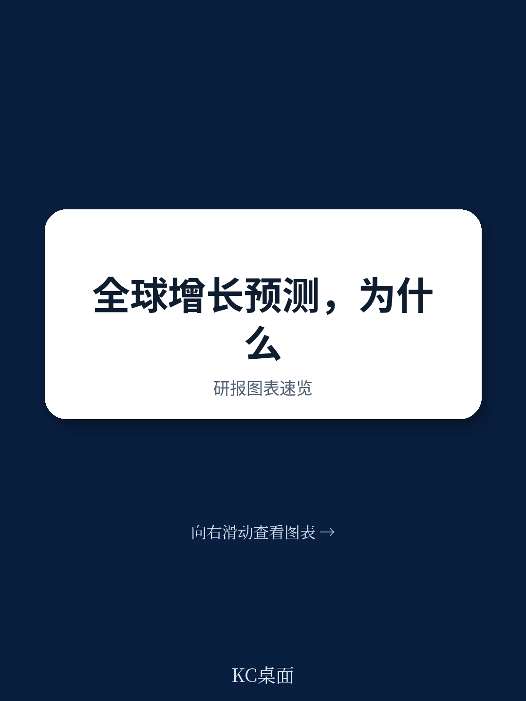
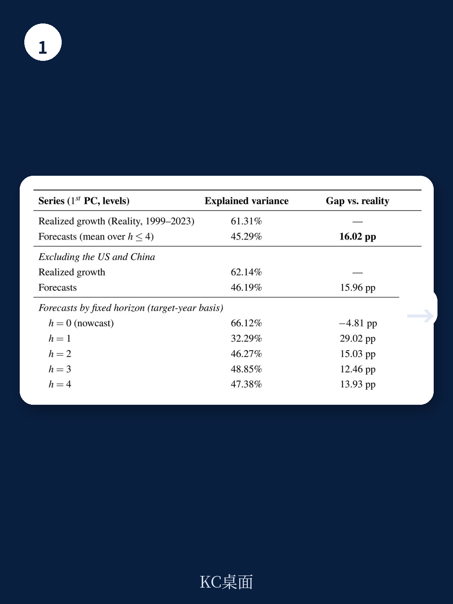
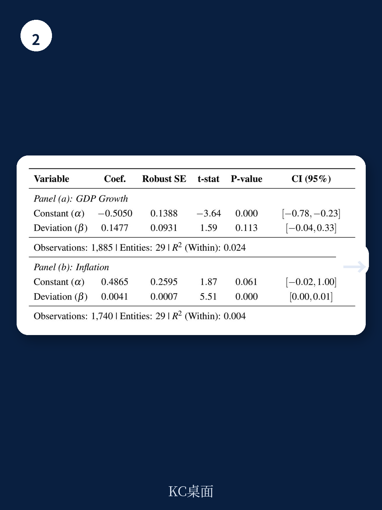

# IMF：WEO业务与近期数据观察

IMF工作人员近期发布的工作论文（WP/26/164）对1999至2023年间《全球宏观环境展望》（WEO）中29个地区的预测数据进行了系统性检验。论文确认了增长预测长期偏乐观这一已知现象，并进一步定位了偏差来源：预测的乐观属于水平层面的系统性高估，而非对近期历史趋势反应不足的结果。在控制国家固定效应后，预测值平均超出实际增长约0.5个百分点，且这一偏差不随预测相对历史轨迹的偏离程度而变化。

更值得关注的发现集中在预测的结构特征上。论文提出两个此前文献较少触及的问题：预测在多大程度上传递了系统性地区的增长溢出，以及预测是否保留了实际数据中增长与通胀之间的结构性关联。两个问题的答案都不乐观。

## 1. 美国与中国增长溢出在预测中被显著低估

论文的核心证据来自直接比较实际数据与预测中的因子载荷。平均而言，样本内其他地区的增长对美国增长的同步弹性在现实数据中为0.84，而预测中仅为0.34，意味着预测只嵌入了不到一半的实际溢出强度。中国增长的载荷同样被低估。这一缺口在样本期内并未收窄：2010年前预测捕捉了约三分之二的美国溢出，2010年后这一比例降至一半以下。

论文将这一现象称为“预测碎片化”（forecast fragmentation）。两个辅助指标指向同一结论：单一全球因子能解释实际增长跨国方差的约61%，但在预测中仅解释约45%；预测误差与实现的美国增长之间仍保持相关性。即便在疫情前的平稳十年中，预测对美国溢出的嵌入也几乎为零。

> **KC评论：** 这里的含义超出预测精度本身。如果多边机构的核心预测系统性地低估了系统性地区对其他国家的传导，那么基于这些预测做出的债务可持续性分析和财政规划，在全球同步波动时会系统性地偏乐观。论文用“碎片化”这个词，点出的不是某个国家预测不准，而是预测体系在结构上切断了跨国联动。

## 2. 增长与通胀的条件关联在预测中近乎消失

论文的第二个主要发现涉及预测的内部一致性。实际数据中，增长与通胀之间存在正向的条件关联，这反映的是可预测的需求侧共同变动。预测作为条件均值，理应保留这一关联——不可预测的供给冲击在预测中大多不存在，留下的应是可预测的需求联动。

但检验结果显示，预测内部的增长-通胀条件斜率基本平坦，与实际数据中约0.13的正向斜率形成鲜明对比。论文使用贝叶斯VAR作为机械基准，并进一步将样本限制在14个可信通胀目标制地区以更干净地识别需求冲击，结论不变：数据斜率保持在0.126附近，预测内斜率接近零。

这一发现表明，预测的实体面与名义面在构建过程中相对独立，缺乏一个可验证的均衡关系作为锚。论文据此提出，结构模型可以作为专家判断的补充，为中期预测提供基准校验。

## 3. 预测锚定近期历史，但乐观偏差独立于周期位置

论文还分解了乐观偏差的来源。图1显示，各国五年期预测的中位数锚点与实时计算的十年历史均值高度吻合，说明预测的中期水平本质上就是近期历史的外推。但这一锚定行为并不产生乐观偏差——无论预测相对本国近期历史是偏乐观还是偏悲观，偏差的大小都不随偏离程度变化。

这意味着乐观偏差不是对趋势变化的反应不足，而是一个无条件存在的水平偏差。论文将这一结果与“预测惯性”假说区分开来：预测确实锚定历史，但乐观来自别处，可能嵌入在预测过程的制度性设定中。

## 4. 预测表现的时序变化与可复用的观察框架

论文比较了3年与5年两个预测窗口。5年窗口（2019年前发布的预测）作为正常周期波动的基准，排除了2020年代初的异常同步；3年窗口则纳入疫情后复苏与2022年能源冲击。结果显示，溢出缺口在两种窗口下都存在，但疫情后的高同步放大了这一缺口的可见度。

对于关注多边预测质量的读者，论文提供了一个可复用的检验框架：先比较实际数据与预测中的跨国因子载荷，再检验预测内部的增长-通胀条件斜率，最后用主成分分析概括同步化缺口。这套方法不依赖特定模型设定，可以直接用于评估其他机构或后续年份的预测。

论文也承认其局限：实际值取自2024年1月单一版本，较长预测期限的误差中混入了数据修订噪声；样本限于29个资源充足的地区，对更广泛成员国的偏差可能被低估。这些限制不改变核心结论的方向，但提示在解读具体数字时保留余地。

For informational purposes only. Portions may be generated,translated,summarized,or edited with AI assistance based on source materials and may contain omissions or errors. Please verify independently. This is not investment,legal,tax,accounting,or other professional advice.

