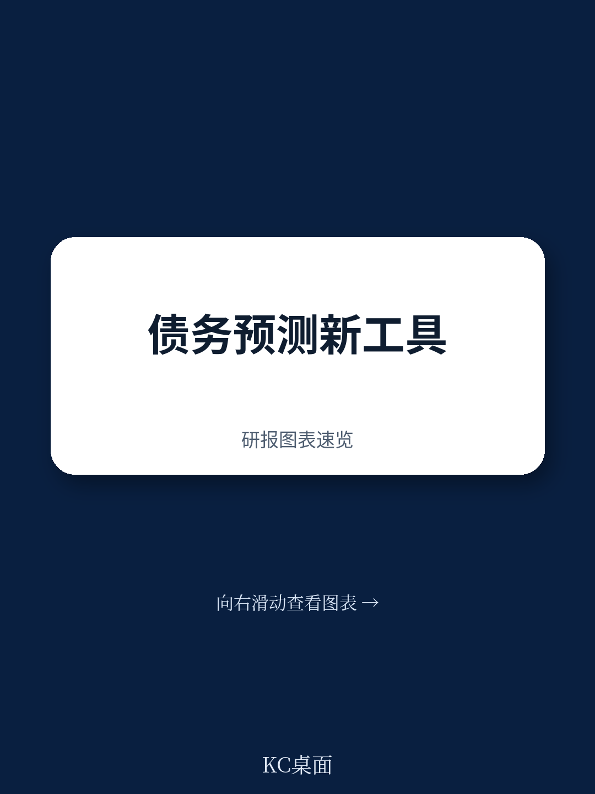

# IMF：资金结构与相关数据观察

2026年7月发布的IMF能力发展研究所技术援助报告显示，毛里塔尼亚公共债务委员会已具备独立编制债务预测与情景分析的能力。这项为期一年的项目由日本政府资助，于2024年1月至2025年1月间执行，核心成果是将IMF的公共债务动态工具（DDT）本地化，并针对该国资源依赖型宏观环境结构做了专门调整。

毛里塔尼亚的财政脆弱性来自三个叠加因素：铁矿石、黄金和天然气出口收入波动大，干旱和洪水频发，以及对外部融资的高度依赖。这使得基线预测与不确定性情景测试同样重要——单一基准情景无法支撑债务政策的讨论。报告认为，经过三轮实地任务和持续远程协作，技术团队已能独立完成包含基线预测、财政调整情景和冲击模拟的全面公共债务报告，并向主持债务委员会的总司长们做了汇报。

## 1. 债务工具按资源国结构拆分收支科目

DDT的定制化是本次援助的技术核心。标准工具被拆分为采掘业和非采掘业两个主要收支科目，以反映大宗商品收入的高波动性，这一调整与IMF项目中的结构性基准保持一致。同时，自然灾害模块被用于评估气候冲击和商品价格冲击的财政影响。

对于依赖资源出口的国家，商品价格假设直接决定债务路径的斜率。毛里塔尼亚的出口收入集中在少数大宗商品上，价格预测的偏差会迅速传导为债务预测的系统性误差。将采掘业收支单列，至少让假设错误变得可见、可追溯。

## 2. 数据责任分工写入年度债务预测流程

报告明确了三个机构间的数据流：实际部门历史数据由ANSADE和国库提供，宏观宏观环境与财政预测假设由宏观预算预测与指导股（CPPMB）依据预算文件提供，债务存量与利息支付数据由公共债务局汇编并协调跨机构输入。这套分工已被纳入年度债务预测周期的正式流程。

此前债务预测的瓶颈往往不在模型本身，而在数据供给的稳定性和责任归属。现在每个数据节点都有明确的责任机构，且与预算周期绑定，预测工作的可重复性显著提高。这对人员流动频繁的政府部门尤为重要——制度化的流程比个人经验更可持续。

> **KC评论：** 数据责任分工表比模型参数更值得关注。它界定了谁在什么时间点提供什么数据，这决定了债务预测能否在人员更替后继续运转。报告没有回避这一点：用户手册和每年至少两次的内部培训计划，都是针对知识留存的具体安排。

## 3. 债务分析纳入政策决策的时间表已确定

债务局和CPPMB承诺建立正式机制，将DDT分析定期纳入债务委员会的决策过程。具体包括：与预算周期挂钩的债务可持续性分析预排时间表、标准化数据输入、明确的机构职责，以及将DDT输出整合进债务委员会向财政部长建议的工作流程。项目期间已联合制定了一份指示性时间表。

这一安排的实际含义是，债务预测从技术练习转变为政策工具。分析结果有了固定的提交路径和决策节点，而非停留在技术团队的内部报告。对于债务管理能力尚在建设阶段的国家，这种制度锚定比工具本身更能保证分析的持续使用。

## 4. 观察框架：从工具部署看能力建设的可持续条件

毛里塔尼亚案例提供了一个可复用的分析框架，用于评估类似技术援助的长期效果。三个条件缺一不可：工具是否适应当地宏观环境结构（资源国版本和自然灾害模块的定制）；数据供给是否有制度化的责任分工（而非依赖个别人员）；分析结果是否有固定的政策决策路径（而非止步于技术报告）。

这三个条件分别对应技术适配、组织流程和制度接口。多数能力建设项目失败，并非工具需要继续观察，而是后两个条件缺失。毛里塔尼亚项目在这三方面都有明确安排，但报告也指出，这些安排尚处于承诺阶段，实际执行效果仍需后续观察。项目建议中提到的每年两次内部培训，是检验知识留存的一个可验证指标。

For informational purposes only. Portions may be generated,translated,summarized,or edited with AI assistance based on source materials and may contain omissions or errors. Please verify independently. This is not investment,legal,tax,accounting,or other professional advice.

