# The Coming Great Repression?

# New Measures and a Century of Evidence

Marijn A. Bolhuis, Jakree Koosakul, Neil Shenai, and Jie Yang

WP/26/160

IMF Working Papers describe research in progress by the author(s) and are published to elicit comments and to encourage debate. The views expressed in IMF Working Papers are those of the author(s) and do not necessarily represent the views of the IMF, its Executive Board, or IMF management.

2026
JUL


# IMF Working Paper Strategy, Policy & Review

The Coming Great Repression? New Measures and a Century of Evidence Prepared by Marijn A. Bolhuis, Jakree Koosakul, Neil Shenai, and Jie Yang\*

Authorized for distribution by Martin Kaufman
July 2026

IMF Working Papers describe research in progress by the author(s) and are published to elicit comments and to encourage debate. The views expressed in IMF Working Papers are those of the author(s) and do not necessarily represent the views of the IMF, its Executive Board, or IMF management.

ABSTRACT: Governments have historically used financial repression to reduce debt and fiscal pressures, yet few systematic measures of repression exist. To fill this gap, we introduce two quantity-based repression indicators grounded in a structural portfolio-choice model, exploiting the gap in government-bond demand between captive and non-captive investors. A narrow fiscal indicator captures pressure on banks to hold government bonds. A consolidated measure adds the perimeter of central bank liabilities. Applying our measures to a novel dataset of 17 advanced economies since 1920, we find that financial repression has been a persistent feature of modern history, peaking after World War II, receding during the capital account liberalization era, and rising again after the Global Financial Crisis. Our measures correlate with conditions typically associated with repression—such as high debt burdens and restricted capital mobility—along with crowding out of private investment and credit. Using a debt decomposition framework, we show that repression was a major driver of debt reduction after World War II, generating larger fiscal savings than traditional seigniorage, and has again generated fiscal savings since the Global Financial Crisis. With the conditions historically associated with elevated repression present today, our evidence suggests that financial repression may see increased use going forward.

RECOMMENDED CITATION: Bolhuis, Marijn A., Jakree Koosakul, Neil Shenai, and Jie Yang (2026), “The Coming Great Repression? New Measures and a Century of Evidence.” IMF Working Paper 26/160.

<table><tr><td>JEL Classification Numbers:</td><td>E63; E58; H63; N10; N20</td></tr><tr><td>Keywords:</td><td>financial repression; sovereign debt dynamics; captive markets; banks&#x27; sovereign holdings</td></tr><tr><td>Author&#x27;s E-Mail Address:</td><td>mbolhuis@imf.org, jkoosakul@imf.org, nshenai@imf.org, jyang5@imf.org</td></tr></table>

WORKING PAPERS

# The Coming Great Repression? New Measures and a Century of Evidence

Prepared by Marijn A. Bolhuis, Jakree Koosakul, Neil Shenai, and Jie Yang

## Contents

Glossary of Acronyms 2   
1. Introduction 3   
2. Concepts, Data, and Stylized Facts 9   
3. Theoretical Framework 21   
4. Estimates and Correlates of Financial Repression 26   
5. Financial Repression in Sovereign Debt Dynamics 32   
6. Conclusions 46   
Annex 51   
References 63

## Glossary of Acronyms

AE Advanced Economy

AR(n) Auto-regressive by order n

BIS Bank for International Settlements

CBDC Central Bank Digital Currency

FR Financial Repression

GFC Global Financial Crisis (2007–2009)

GDP Gross Domestic Product

GMD Global Macro Database (Müller-Plantenberg et al., 2024)

JST Jordà–Schularick–Taylor Macrohistory Database (Jordà et al., 2017)

LCR Liquidity Coverage Ratio

PFIMH Public Finances in Modern History (Mauro et al., 2013)

QE Quantitative Easing

UIP Uncovered Interest Rate Parity

WID World Inequality Database

WWI World War I (1914–1918)

WWII World War II (1939–1945)

## 1. Introduction

Fiscal outlooks in many advanced economies have become increasingly challenging, with public debt at high peacetime levels. $^{1}$ Standard approaches to restoring fiscal space, such as fiscal consolidation and growth-enhancing reforms, remain central to countries' debt-reduction strategies, yet they can be slow to deliver results and politically difficult to sustain. Fiscal consolidation can have limited effects on debt ratios if not well-timed (International Monetary Fund, 2023a), while polarization can hamper the formation of enabling coalitions that support fiscal adjustment (Alesina et al., 1998; Cottarelli et al., 2017). Structural reforms face related constraints, as they can impose near-term costs on concentrated interests while generating diffuse benefits over time horizons beyond typical political cycles (Campos et al., 2025; Furceri et al., 2024).

Historically, advanced economies have resorted to less orthodox channels to reduce debt burdens. One such channel is surprise inflation, which reduces the real value of nominal claims on the government when inflation exceeds what was originally priced into nominal securities at issuance (Eichengreen and Esteves, 2022; Hilscher et al., 2021). $^{2}$ A second channel operates through debt monetization, which involves central bank financing of government deficits through the issuance of non-interest-bearing liabilities, such as currency or bank reserves, thereby relaxing the government's intertemporal budget constraint (Feldberg and Lawson, 2020). $^{3}$ A third channel is financial repression, which refers to regulatory policies that compress sovereign borrowing costs by inducing financial institutions to absorb government debt as captive buyers. By limiting alternative investments and ensuring steady demand for public debt, financial repression reduces debt servicing costs and acts as an implicit tax on domestic savers. $^{4}$

While the literatures on surprise inflation and debt monetization are relatively well developed, systematic historical evidence on the use and impact of financial repression remains limited. $^{5}$ This reflects two distinct challenges. First, measuring financial repression requires detailed historical data on the composition and cost of government debt not readily available in standard sources, especially in the decades following World War II, when such policies were widespread in advanced economies (Reinhart and Sbrancia, 2015). Second, estimating the impact of financial repression requires constructing a credible counterfactual for government bond yields absent repression, which is an inherently unobservable variable (Acalin and Ball, 2024). Existing studies of repression hence tend to rely on simplifying assumptions about the counterfactual interest rates or focus on individual country episodes or specific instruments. This makes it difficult to quantify the magnitude and persistence of financial repression in a systematic and comparable way across countries and time.

We address these challenges by developing new theory, data, and evidence of financial repression. In so doing, we contribute to the literature in three ways:

First, we develop a theoretically-grounded framework for measuring financial repression based on sectoral holdings of public sector liabilities. Our identification exploits the fact that financial repression operates through regulatory pressure targeting domestic financial institutions, disproportionately shifting their demand toward public liabilities relative to other investor groups. We formalize this differential response in a portfolio-demand model in which repression enters as a demand shifter for regulated institutions—hereafter “banks”—making them willing to hold more public liabilities at a given yield than market incentives alone would imply. Because households face no such regulatory pressure, their portfolio behavior provides a clean benchmark for return-driven allocation. The gap between bank and household holdings, after controlling for relative returns, identifies the intensity of financial repression. We propose two complementary indicators differing in the perimeter of public sector liabilities considered: a narrow fiscal measure based on government bond holdings, as well as a consolidated measure which includes repression operating through requirements to hold commercial bank reserves. This distinction allows us to separate repression that forces banks to own government debt from repression that compels them to own central bank liabilities. $^{6}$

Second, we construct a new historical dataset consolidating multiple sources on general government debt, central bank liabilities, and the sectoral composition of their holdings. We then apply our theoretical measures to this dataset covering 17 advanced economies since 1920. Cross-country averages of the repression measures suggest that repression has been a persistent feature of modern financial systems, with its use peaking around World War II and remaining elevated through the Bretton Woods era. While its use gradually declined during most of the post-1971 capital account liberalization era, repression has risen again since the Global Financial Crisis (GFC).

We also find significant association between our repression measures and conditions typically conducive to repression: repression is most pervasive when government debt and interest expenditures are high, and is also associated with higher primary balances, consistent with governments historically turning to repression when room for adjustment through traditional fiscal tools is more limited. Repression also tends to coincide with low short- and long-term interest rates and depressed government bond yields relative to private asset returns. It correlates with lower private credit growth, lower loan-to-deposit ratios, and reduced investment, which are consistent with the notion that repression leads to crowding out private capital. Finally, using newly collected post-WWII data on reserve and portfolio requirements, we show that our indicators line up systematically with these de jure policy instruments, such as reserve requirements and portfolio requirements. These results provide additional validation that our measures capture the policy environment associated with financial repression.

Third, our model allows us to derive counterfactual sovereign borrowing costs absent financial repression and then to quantify the contribution of repression to debt dynamics during historical episodes. We do so by solving for the counterfactual interest rate on government debt that clears the bond market absent repression and then embedding the implied yield wedge in a unified debt-decomposition framework alongside primary balances, interest-growth differentials, inflation surprises, central bank purchases, and debt restructuring. Applying this framework to our country sample with a focus on the United Kingdom and United States, we find that repression has historically generated sizable fiscal savings. In the United Kingdom, it was the single largest deleveraging channel in the postwar decade, accounting for more of the observed debt reduction than either surprise inflation or fiscal consolidation. In the United States, fiscal consolidation played the largest role in postwar debt reduction, but repression was also a major contributor. Across the full panel, median annual fiscal savings from financial repression averaged around 0.57 percent per year, peaking sharply in the mid-1940s. Dispersion across countries is particularly pronounced in the 1940s and early 1950s, with another widening in the 1980s, pointing to sizable heterogeneity in the fiscal gains from repression. Median fiscal savings rise again after the GFC, from about 0.08 percent in 2008 to about 0.51 percent in 2020.

Related Literature. Our paper contributes to three related strands of literature: the measurement and historical correlates of financial repression, studies of debt monetization and monetary financing, and the decomposition of public debt dynamics.

The literature on financial repression dates back to McKinnon (1970) and Shaw (1973), who define financial repression as policies that constrain financial intermediation and implicitly tax savings. Subsequent work often adopts a narrower usage, focusing on policies that lower the effective cost of domestic funding to governments. Measurement remains challenging because the relevant counterfactual interest rate absent repression is unobserved. Giovannini and de Melo (1990) address this challenge by exploiting the wedge between the government's external borrowing cost (less directly shaped by domestic repression) and its domestic cost of funds to infer the implicit revenue from repression. This approach is less useful when external borrowing is limited or when cross-border markets are segmented (for example, due to capital controls or heterogeneous investor bases). A seminal contribution by Reinhart and Sbrancia (2015) quantifies the fiscal savings from repression by comparing the ex-post real return on government debt to fixed counterfactual real interest rates (one to three percentage points lower than realized), showing that this channel could account for a substantial share of postwar debt reduction across advanced economies. In addition, single-country studies leverage richer institutional detail to construct tighter interest rate counterfactuals, including Acalin and Ball (2024) for the postwar United States and Lehner et al. (2025), who construct tax- and option-adjusted corporate-Treasury yield spreads for the United States since 1860 to provide a consistent historical estimate of the government's funding advantage. We contribute to this literature by developing quantity-based indicators that exploit differential sectoral absorption of government liabilities and map these quantity shifts into an explicit repression wedge, enabling systematic comparisons across countries and time. $^{7}$

Our work also relates to the literature on debt monetization and monetary financing. In this literature, “monetization” is typically understood as relaxing the government resource constraint through the issuance of currency or other non-interest-bearing central bank liabilities, rather than simply central bank purchases of government bonds (Feldberg and Lawson, 2020). This perspective connects to classic arguments about the fiscal constraints on monetary outcomes and the seigniorage implications of central bank balance sheets (Sargent and Wallace, 1981; Reis, 2016). That literature focuses primarily on the fiscal dividend from issuing non-interest-bearing liabilities; our monetary repression indicator captures a related but distinct mechanism, namely the below-market remuneration of interest-bearing government liabilities, which generates an implicit fiscal transfer that typical seigniorage accounting does not capture (Reis, 2025; Payne and Szöke, 2025).

Finally, we contribute to the broader literature on sovereign debt reduction and the decomposition of public debt dynamics. This literature studies the multiple channels underpinning debt reductions, including inflation and its historical role in consolidations (Eichengreen and Esteves, 2022), interest-growth dynamics and the associated “debt revenue” from issuing safe/liquid public debt (Reis, 2022), the conditions under which fiscal consolidations durably reduce debt ratios (International Monetary Fund, 2023a), financial repression through persistently low or negative real returns (Reinhart and Sbrancia, 2015; Acalin and Ball, 2024), and debt monetization (Feldberg and Lawson, 2020). More synthetic historical accounts stress that high-debt episodes can be long-lived and that countries draw on a menu of orthodox and heterodox tools depending on institutions and debt composition (Reinhart et al., 2012; Kose et al., 2022). We add to this literature by embedding our repression measures in debt-decomposition frameworks that quantify the contribution of financial repression alongside fiscal adjustment and inflation-related channels. $^{8}$

The rest of this paper proceeds as follows. Section 2. defines fiscal and monetary repression, describes the data used in the paper, and provides stylized facts to motivate the paper's theoretical framework. Section 3. introduces the paper's theoretical model and describes how we measure fiscal and monetary repression. Section 4. presents the paper's results and shows both the use of financial repression over time and the correlates of financial repression at the country level. Section 5. explains the role of financial repression in sovereign debt dynamics, computes the market-free interest rate absent repression, and quantifies the contribution of repression to debt dynamics. Section 6. concludes.

## 2. Concepts, Data, and Stylized Facts

This section motivates our measurement framework in three steps. We first distinguish between fiscal and monetary forms of financial repression and relate this taxonomy to the indicators developed below. We then describe the historical dataset used to construct these measures across 17 advanced economies. Finally, we use these data to document a set of stylized facts that motivate the theoretical framework developed in the next section.

## 2.1. Varieties of Financial Repression

Financial repression describes a suite of policies that share a common balance-sheet mechanism: they induce financial intermediaries to hold government liabilities at administered or below-market returns, thereby transferring resources from the private sector to the state. We organize the concept around the two implementation channels that map directly into the empirical indicators developed below. $^{9}$ The organizing distinction is the perimeter of the public sector liability being placed onto regulated intermediaries. In some episodes, repression operates primarily through the fiscal authority's liabilities, by compelling financial institutions to absorb sovereign debt on favorable terms for the state. In other episodes, repression operates through the monetary authority's liabilities, by expanding and/or mandating holdings of central bank liabilities at returns below market alternatives. Table 1 summarizes how this taxonomy maps into our narrow and broad indicators, as introduced in Section 3.

We use the term fiscal repression to refer to policy interventions in which regulated intermediaries absorb a share of government bonds relative to other investors, compressing the sovereign's borrowing costs. Historically, this channel has often been implemented through combinations of portfolio and liquidity requirements, regulatory advantages to use bonds as collateral, restrictions on private credit growth, and interest rate ceilings, making government bonds the dominant “safe” or required asset on banks’ balance sheets. Several instruments can be used for fiscal repression:

\- Liquidity regulation can effectively compel banks to hold large quantities of high-quality liquid assets, which in practice are often government securities (Bonner, 2016). $^{10}$

\- Capital regulation can tilt portfolios toward domestic sovereign exposures through preferential treatment of sovereign securities from a regulatory capital perspective, such as favorable risk weights (Becker and Ivashina, 2018). $^{11}$

\- Collateral eligibility rules confer liquidity premia on sovereign bonds by restricting which assets qualify in central bank operations or secured funding markets (Krishnamurthy and Vissing-Jorgensen, 2012). $^{12}$

These instruments differ in legal form and stated rationale, but they share a common balance-sheet implication: by increasing regulated intermediaries' relative demand for government bonds, they compress sovereign borrowing costs and generate an implicit fiscal transfer from savers to the state.

We use the term monetary repression to refer to policies that induce investors to hold central bank liabilities, normally commercial bank reserves, at administered remuneration below the return on close market substitutes. This channel matters because standard discussions of financial repression focus on the impact of repression on government bond yields, while a substantial share of the public sector's favorable financing can occur through the remuneration policy and regulatory treatment of central bank liabilities. $^{13}$ Several instruments can be used for monetary repression:

\- Seigniorage on currency arises from the state's monopoly on cash issuance: legal tender laws require private agents to hold a zero-interest liability as a means of payment, extracting a real transfer equal to the inflation tax on monetary holdings (Reis, 2025).

\- Reserve requirements are the traditional instrument of monetary repression applied to commercial banks. When banks are required to hold non-remunerated or below-market reserves, the wedge between the administered remuneration rate and the free-market rate acts as an implicit tax on financial intermediation, with the central bank's monopoly over interbank settlement ensuring structural demand for these liabilities (Humphrey and Keleher, 1982).

\- Quantitative easing (QE): A natural question regarding monetary repression is whether QE should be classified as financial repression. QE has been implemented as a tool with macroeconomic stabilization an explicit goal, rather than as a device for debt liquidation, and under QE commercial banks act as sellers exchanging government bonds for reserves rather than as captive buyers meeting a regulatory mandate. Our framework therefore does not classify QE as repression by construction. If QE results only in a swap of one government liability for another, these cancel out and the share of banks' assets allocated to government liabilities does not change.

However, consistent with our outcome-based approach that looks at the impact on policies rather than their stated intent (see below), we seek to isolate the implicit transfer that arises when the increase in the resulting reserves from a QE transaction is more than the decline in government bonds held by the banks. Whether a given QE episode is repressive in this sense is thus an empirical question about the resulting change in the claims of banks on the government, rather than a classification we impose at the outset.

Across all of these instruments, the balance-sheet logic is the same: when regulations force or induce banks to hold a larger share of assets as claims on the public sector, this generates an implicit transfer to the state that market-based portfolio allocation would not produce. And in practice, fiscal and monetary repression often do not occur in isolation. Governments facing elevated debt burdens and limited political room for consolidation have historically drawn on both arms of the state simultaneously, combining bond-holding mandates on commercial banks with reserve requirements and below-market remuneration on central bank liabilities. The postwar Bretton Woods era exemplifies this pattern, as governments across advanced economies deployed liquidity and portfolio requirements alongside administered reserve remuneration within a framework of restricted capital mobility that made both channels binding simultaneously (Reinhart and Sbrancia, 2015).

A final methodological point concerns the distinction between the intent of a policy and its repressive outcome. Many instruments associated with repression are adopted on prudential, operational, or monetary-policy grounds. For example, liquidity regulation is motivated by improving financial institutions' resilience to runs and funding stress; reserve requirements have historically served monetary policy implementation objectives; and quantitative easing was implemented as a tool of macroeconomic stabilization. We do not equate these stated motivations with deliberate attempts to generate debt liquidation. $^{14}$ What matters for debt dynamics, however, is the outcome: whether the prevailing policy environment induces regulated intermediaries to absorb public liabilities on terms that would not arise under market-based portfolio choice. This observation motivates our outcome-based approach. Rather than coding individual regulations or inferring intent, our empirical measures focus on balance-sheet quantities—how much of the public sector's liabilities are absorbed by regulated intermediaries relative to other investors—and on how these quantity shifts map into an implied wedge in effective borrowing costs, as developed in Section 3.

Table 1: Varieties of Financial Repression

<table><tr><td></td><td>Fiscal Repression</td><td>Monetary Repression</td><td>Fiscal + Monetary Repression (Consolidated)</td></tr><tr><td>Public sector perimeter</td><td>General government</td><td>Central bank</td><td>General government + central bank</td></tr><tr><td>Relevant liability</td><td>Government bonds held by commercial banks</td><td>Commercial bank reserves</td><td>Government bonds and commercial bank reserves</td></tr><tr><td>Policy instruments</td><td>Liquidity requirements; capital requirements; portfolio requirements; collateral eligibility rules</td><td>Reserve requirements; remuneration policies; legal tender laws; combined with QE</td><td>All of the above combined.</td></tr><tr><td>Quantitative repression indicator</td><td>Government bonds as share of commercial bank assets</td><td>Commercial bank reserves created through central bank purchases of government bonds</td><td>Government bonds held directly and indirectly as share of commercial bank assets</td></tr></table>

## 2.2. Data

Our financial repression indicators are based on the portfolio shares of government liabilities held by domestic financial institutions relative to non-captive investors. Constructing these shares requires building balance-sheet aggregates for commercial banks, households, and the consolidated public sector. We combine several data sources to assemble these inputs for a panel of 17 advanced economies over more than a century.

The primary challenge is constructing for each country and year consistent measures of the sectoral composition of government debt holdings alongside the balance sheet aggregates needed to compute portfolio shares. The former tells us who holds government debt, be they commercial banks, the central bank, households, or nonresidents, while the latter tells us how large each sector's total asset base is, so that holdings can be expressed as portfolio shares rather than raw nominal quantities. Both are required to construct our repression indicators, yet they are drawn from sources that were designed independently, cover different country samples and time spans, and apply different accounting conventions, making harmonization across countries and over a century the central data challenge of the paper.

Two further requirements shape our dataset construction. First, our variables must date back to the wartime episodes in which financial repression was likely to be most pronounced based on previous studies. Second, our identification strategy exploits cross-country as well as time-series variation, so measurement error that varies systematically across countries would contaminate our estimates. The harmonized dataset described below is designed to meet both requirements.

We restrict our analysis to 17 advanced economies covered by the Jordà–Schularick–Taylor (JST) database (Jordà et al., 2017), spanning 1870 to 2020: Australia, Canada, Denmark, Finland, France, Germany, Ireland, Italy, Japan, Netherlands, Norway, Portugal, Spain, Sweden, Switzerland, United Kingdom, and United States. $^{15}$ The JST database provides short- and long-term interest rates, returns on risky assets including equities and housing, and commercial bank balance sheet aggregates, all measured and defined consistently across countries and years—making it the natural backbone of our dataset. We supplement JST with the Public Finances in Modern History (PFIMH) series (Mauro et al., 2013), which together provide annual observations on government expenditures, revenues, the nominal stock of public debt, and nominal and real GDP dating back to 1880. Data on the sectoral composition of government debt holdings—the share held by commercial banks, the central bank, households, and nonresidents—come from Abbas et al. (2011) and Arslanalp and Tsuda (2014), extended to 2020. Data on central bank assets are drawn from the Bank for International Settlements, and data on currency in circulation are from Finaeon. Wherever macro-fiscal aggregates are missing from JST or PFIMH, we draw on the Global Macro Database (Müller-Plantenberg et al., 2024) to fill gaps.

Data on national wealth used to construct household total asset holdings come from the World Inequality Database (WID) (Piketty and Zucman, 2014), which provides long-run estimates of household net wealth as a share of national income across countries. The historical wealth-to-output series is taken directly from WID through 1979 where available, while later observations are harmonized as net market-value national wealth divided by average GDP, and the combined series is then mapped to JST country codes before merging into the master panel.

Data on sovereign debt restructurings and haircuts are drawn from Graf von Luckner et al. (2024). These data provide episode-level estimates of the nominal haircut imposed on creditors in each restructuring event, which we use to construct the $h_{t}$ term in the debt decomposition of Section 5. It covers 329 distressed restructuring events with external private creditors worldwide over 1823–2024. We assign the NPV haircut, face-value haircut, and nominal amount of debt restructured to the restructuring year, and compute the annual haircut term as the NPV haircut times debt restructured, converted into local currency and scaled by GDP.

Finally, our analysis requires estimates of expected returns on government bonds and private assets to control for return-driven portfolio rebalancing. Expected returns on government bonds are constructed from nominal bond yields from JST combined with expected inflation, estimated using a country-specific autoregressive model. $^{16}$ Expected returns on private assets are proxied by dividend yields for equities and rental yields for housing, both from JST. Full details on balance sheet construction and return estimation are provided in Subsection A.2. A summary of the underlying data sources used in constructing our composite dataset is provided in Table 2.

## 2.3. Stylized Facts

This section documents three sets of stylized facts that motivate the theoretical framework developed in Section 3. We report these facts using binned scatterplots that control for country and year fixed effects. Taken together, the facts establish that investors are not compensated for higher sovereign debt burdens, that commercial banks absorb disproportionately large shares of government debt precisely when market incentives would not predict such behavior, and that this absorption comes at the expense of private sector investment. This pattern is consistent with regulatory-driven rather than market-driven portfolio choice.

Table 2: Data Sources Used to Construct Composite Dataset

<table><tr><td>Dataset</td><td>Data Drawn</td><td>Coverage</td></tr><tr><td>Abbas et al. (2011)</td><td>Sectoral shares of government debt: commercial banks, central bank, households, nonresidents</td><td>18 AEs, 1880–2011</td></tr><tr><td>Arslanalp and Tsuda (2014)</td><td>Sectoral shares of government debt, extended to 2020</td><td>24 AEs, 2004–2020</td></tr><tr><td>Bank for International Settlements</td><td>Central bank total assets</td><td>18 AEs, 1950–2020</td></tr><tr><td>Finaeon</td><td>Currency in circulation</td><td>18 AEs, 1920–2020</td></tr><tr><td>Müller-Plantenberg et al. (2024)</td><td>Gap-filling macro-fiscal aggregates</td><td>170+ countries, 1800–2020</td></tr><tr><td>Graf von Luckner et al. (2024)</td><td>Sovereign debt restructuring episodes; NPV and face-value haircuts</td><td>Worldwide, 1823–2024</td></tr><tr><td>Jordà et al. (2017)</td><td>Interest rates; equity and housing returns; bank balance sheets; nominal GDP</td><td>18 AEs, 1870–2020</td></tr><tr><td>Mauro et al. (2013)</td><td>Government expenditures, revenues, public debt stock, GDP</td><td>17 AEs, 1880–2011</td></tr><tr><td>Piketty and Zucman (2014)</td><td>National wealth; household net wealth as share of national income</td><td>18 AEs, 1900–2020</td></tr></table>

Notes: AEs = Advanced Economies. Coverage dates are approximate for BIS and Finaeon. The paper's analytical sample is restricted to 17 advanced economies over 1920–2020.

Stylized Fact 1. Higher sovereign debt burdens are associated with lower, not higher, relative returns on government bonds.

Across countries and over time, higher public debt burdens are associated with lower relative returns on government bonds—the opposite of what standard risk premium models would predict (Figure 1a). The relationship is not merely flat: the full-sample binscatter reveals a clearly negative slope, with relative returns compressing precisely as debt burdens rise. The country panels make the pattern concrete. In the United Kingdom, relative yields on government bonds fell sharply negative—reaching approximately -4 percent per annum—at the exact moment public debt peaked near 250 percent of GDP in the late 1940s (Figure 1b). A similar dynamic played out in the United States, where relative yields dropped to around -3 percent at the postwar debt peak (Figure 1c). Japan provides a modern analogue: as public debt has risen toward 250 percent of GDP since the 1990s, relative returns on government bonds have again collapsed into deeply negative territory (Figure 1d). The consistency of this pattern across episodes and countries is difficult to reconcile with market-driven portfolio allocation alone, and is instead consistent with a mechanism that systematically compresses sovereign borrowing costs relative to private asset returns precisely when fiscal pressures are greatest.

Figure 1: Government Bond Yields Relative to Private Assets and Public Debt Burdens  
(a) Full sample  
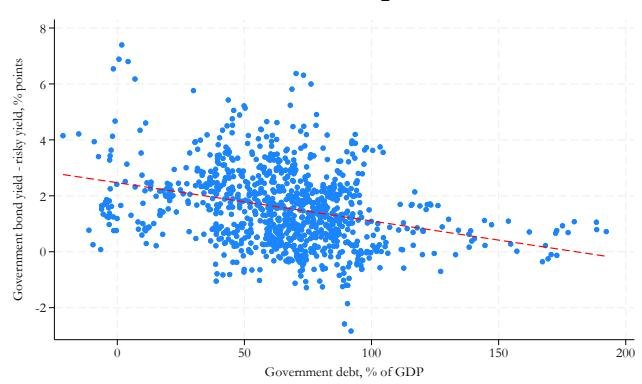

(b) United Kingdom  
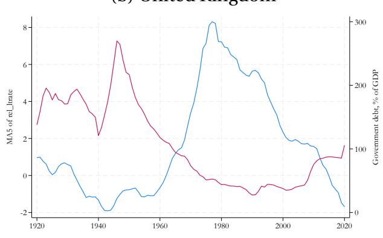

(c) United States  
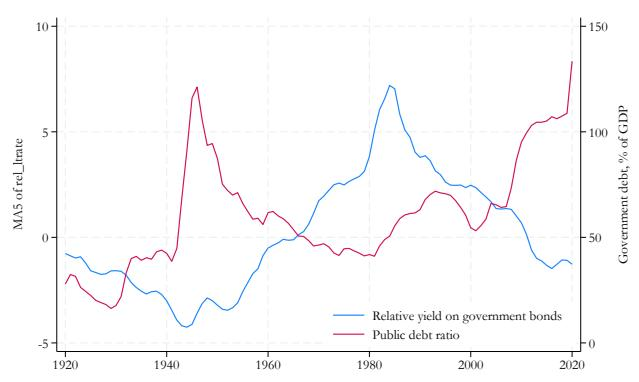

(d) Japan  
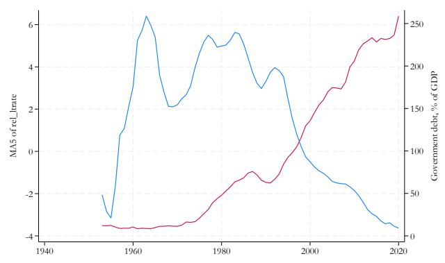

Notes: Panel (a) shows a binned scatterplot of the relative return on government bonds against the government debt-to-GDP ratio, controlling for country and year fixed effects, across all 17 advanced economies from 1920 to 2020. The relative return is defined as the government bond yield minus an equally-weighted average of equity dividend yields and housing rental yields. All return series are drawn from the JST database (Jordà et al., 2017). The dashed line in panel (a) shows the fitted regression. Panels (b)–(d) show time series for the United Kingdom, United States, and Japan respectively. The blue line (left axis) plots the relative return on government bonds in percent per annum; the red line (right axis) plots the government debt-to-GDP ratio.

Stylized Fact 2. Commercial banks hold a disproportionately large share of government debt precisely when returns on sovereign bonds are lowest and debt burdens are highest.

This fact concerns the composition of buyers of government debt. Panel (a) of Figure 2 shows that the share of government debt held by commercial banks is systematically higher when relative returns on government bonds are lower—the opposite of what voluntary, return-maximizing portfolio allocation would imply. In a frictionless market, rational investors would shift away from government bonds toward higher-yielding private assets as the relative return on sovereign debt falls; the fact that banks do the opposite suggests their demand may be shaped by regulatory constraints rather than purely by price signals. Panel (b) reinforces this: bank holdings shares are also higher when government debt burdens are elevated, suggesting that banks absorb a disproportionate share of sovereign financing precisely when the government's need for captive demand is greatest. Taken together, the two panels document a pattern inconsistent with market-driven portfolio choice: banks load up on government debt when it offers the worst relative returns and when fiscal pressures are most acute, providing prima facie evidence that regulatory pressure is compelling intermediaries to act as captive buyers of sovereign debt.

Figure 2: Commercial Bank Holdings of Government Debt  
(a) vs. relative returns on government bonds  
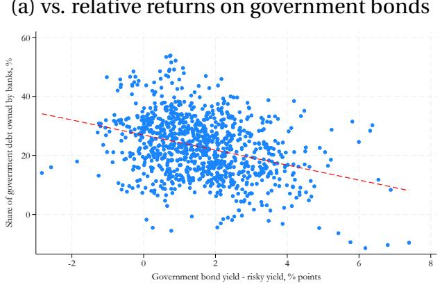

(b) vs. government debt burden  
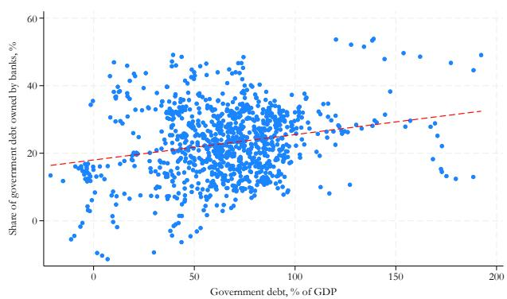  
Notes: Both panels show binned scatterplots controlling for country and year fixed effects across all 17 advanced economies from 1920 to 2020. The y-axis in both panels is the share of total government debt held by commercial banks, in percent. In panel (a), the x-axis is the relative return on government bonds, defined as the government bond yield minus an equally-weighted average of equity dividend yields and housing rental yields. In panel (b), the x-axis is the government debt-to-GDP ratio. Dashed lines show fitted regressions. All series are drawn from the JST database (Jordà et al., 2017) and Abbas et al. (2011).

Stylized Fact 3. Government securities account for a larger share of commercial bank assets when debt burdens are higher and sovereign bond returns are lower relative to private assets.

This fact focuses on the portfolio choice of banks. Panel (a) of Figure 3 shows a negative relationship between the share of government securities in bank assets and the relative return on government bonds: as sovereign debt becomes less attractive relative to private assets, banks nonetheless allocate a larger share of their portfolios toward it. Panel (b) shows the mirror image on the fiscal side: the government debt share of bank assets rises steeply with the overall debt burden, with the slope among the steepest of the three stylized facts. Crucially, this shift in portfolio composition does not reflect balance sheet expansion: banks are not simply growing their assets to accommodate more government debt. Rather, they expand their sovereign exposure at the expense of lending to the private sector. This substitution from private to public assets is the balance-sheet signature of financial repression and provides the core empirical motivation for the quantity-based measurement framework developed in Section 3.

Figure 3: Government Securities as a Share of Commercial Bank Assets  
(a) vs. relative returns on government bonds  
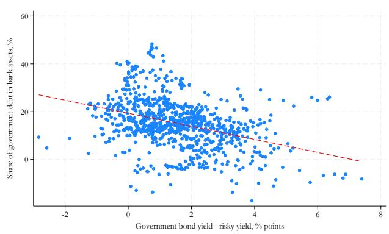

(b) vs. government debt burden  
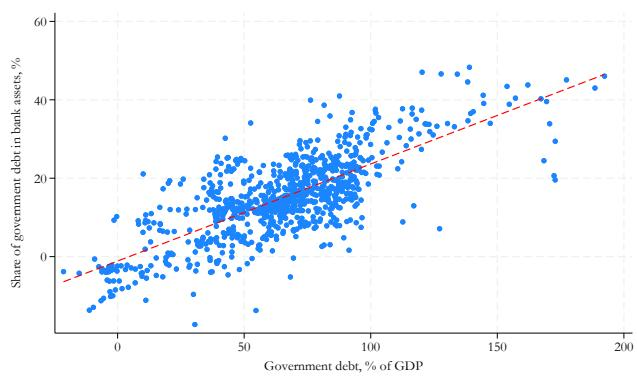  
Notes: Both panels show binned scatterplots controlling for country and year fixed effects across all 17 advanced economies from 1920 to 2020. The y-axis in both panels is the share of government securities in total commercial bank assets, in percent. In panel (a), the x-axis is the relative return on government bonds, defined as the government bond yield minus an equally-weighted average of equity dividend yields and housing rental yields. In panel (b), the x-axis is the government debt-to-GDP ratio. Dashed lines show fitted regressions. All series are drawn from the JST database (Jordà et al., 2017) and Abbas et al. (2011).

In sum, sovereign debt burdens are associated with compressed rather than elevated relative returns (stylized fact 1); commercial banks absorb disproportionately large shares of government debt precisely when those returns are lowest (stylized fact 2); and this absorption comes at the direct expense of private sector lending (stylized fact 3). Taken together, these findings point toward regulatory pressure that systematically changes financial intermediaries' demand for public liabilities away from what market incentives alone would imply. Quantifying this distortion and tracing its contribution to debt dynamics across countries and time requires a structural framework that can distinguish regulation-induced demand shifts from return-driven portfolio rebalancing. We develop such a framework in the next section.

## 3. Theoretical Framework

This section develops the theoretical framework that underpins our measures of financial repression. We proceed in three steps. Section 3.1. presents a portfolio demand model in which banks and households choose between government bonds and private assets subject to Fréchet-distributed taste shocks. Financial repression enters as a policy-induced demand shifter for banks, making them willing to hold more public liabilities at a given yield than market incentives alone would imply. Section 3.2. uses the model's log-odds representation to derive two complementary repression indicators that differ in the perimeter of public sector liabilities considered: a narrow fiscal measure based on government bond holdings, and a consolidated measure that adds a monetary measure based on central bank reserves, combining both arms of the state. Finally, the model's market-clearing condition also allows us to back out the counterfactual interest rate absent repression. We then embed the resulting yield wedge in a debt-decomposition framework (see Section 5.).

## 3.1. Modeling Financial Repression

Setup. There are four types of agents: households $(h)$ , banks $(b)$ , non-financial corporations $(c)$ , and the government $(g)$ . The government finances its expenditures by issuing nominal bonds B, which are held by banks $(B^{b})$ and households $(B^{h})$ . Household assets include deposits D in banks, government bonds $B^{h}$ , and claims on corporations' private assets $I^{h}$ . Bank assets include loans to corporations $L^{c}$ and government bonds $B^{b}$ ; bank liabilities are deposits D. For simplicity, we abstract from central bank reserves in the baseline model, returning to this channel in Section 3.2. Corporations' assets are physical capital K, and their liabilities consist of bank loans and household equity claims.

Demand. Banks and households choose between government bonds and private corporate assets. There is no default risk, so portfolio choices depend on gross expected returns $R_{j}^{e} = 1 + r_{j}^{e}$ and non-pecuniary taste. A continuum of agents of type $i \in \{b, h\}$ (indexed by $\omega$ ) have idiosyncratic taste shifters given by

$$
\zeta_ {j} ^ {i} (\omega) = \tilde {\zeta} _ {j} ^ {i} (\omega) \cdot \bar {T} _ {j} ^ {i} \cdot (\tilde {T} _ {j} ^ {i}) ^ {1 / \theta^ {i}},\tag{1}
$$

where $\tilde{\zeta}_{j}^{i}(\omega)$ is drawn from a Fréchet distribution with shape parameter $\theta^{i}>0$ and unit scale. The parameter $\theta^{i}$ governs the elasticity of substitution between government bonds and private assets for investor type i. $\bar{T}_{j}^{i}$ is a time-invariant shifter capturing structural differences in demand for asset j by type i. $\tilde{T}_{j}^{i}$ is a time-varying shifter driven by government regulation, and it is this term that we associate with financial repression. We normalize $\tilde{T}_{j}^{i}=1$ for j=c, so that repression operates only on demand for government bonds. Crucially, we allow $\tilde{T}_{g}^{b}\geq1$ for banks while imposing $\tilde{T}_{g}^{h}=1$ for households, reflecting the fact that regulatory pressure operates through financial intermediaries rather than through households directly. It is this asymmetry between captive and non-captive investors that identifies financial repression in the data.

Portfolio shares. Under the Fréchet specification, the demand for government bonds from investor type i takes the logistic form

$$
s _ {g} ^ {i} = \frac {\tilde {T} _ {g} ^ {i} (\bar {T} _ {g} ^ {i} \cdot R _ {g} ^ {e}) ^ {\theta^ {i}}}{\tilde {T} _ {g} ^ {i} (\bar {T} _ {g} ^ {i} \cdot R _ {g} ^ {e}) ^ {\theta^ {i}} + (\bar {T} _ {c} ^ {i} \cdot R _ {c} ^ {e}) ^ {\theta^ {i}}}\tag{2}
$$

where $s_{g}^{i} \in (0,1)$ is the share of government bonds in total assets of investor i, with the private asset share given by $s_{c}^{i} = 1 - s_{g}^{i}$ . Portfolio shares are increasing in relative expected returns and in the demand shifters $\bar{T}_{g}^{i}$ and $\tilde{T}_{g}^{i}$ . The key implication for our purposes is that an increase in the regulatory demand shifter $\tilde{T}_{g}^{b}$ —reflecting financial repression—raises banks' portfolio share $s_{g}^{b}$ holding returns and household behavior fixed. Conversely, household portfolio shares $s_{g}^{h}$ are unaffected by regulation and thus provide a return-driven benchmark against which banks' excess demand for government bonds can be measured. As shown in the next section, it is the gap between $s_{g}^{b}$ and $s_{g}^{h}$ , after controlling for differences in returns and structural preferences, that identifies the repression term $\tilde{T}_{g}^{b}$ .

## 3.2. Measuring Financial Repression

The portfolio share expression in (2) is nonlinear in returns and demand shifters, which makes it difficult to isolate the repression component directly. A natural linearization is the log-odds transformation, which maps portfolio shares to the real line and yields an expression that is linear in the structural parameters. Define the relative demand for government bonds as

$$
\ln \tilde {s} _ {g} ^ {i} \equiv \ln \frac {s _ {g} ^ {i}}{1 - s _ {g} ^ {i}}.\tag{3}
$$

Substituting the portfolio share expression (2) into (3), which is linear in relative returns and policy-induced taste shifters under the discrete-choice portfolio problem, changes in financial repression between two periods can be written as (see Annex A.41. for derivation details)

$$
\Delta \ln \tilde {T} _ {g} ^ {b} = \Delta \ln \tilde {s} _ {g} ^ {b} - \Delta \ln \tilde {s} _ {g} ^ {h} - (\theta^ {b} - \theta^ {h}) (\Delta r _ {g} ^ {e} - \Delta r _ {c} ^ {e}).\tag{4}
$$

The three terms have a clean economic interpretation. The first two terms, $\Delta \ln \tilde{s}_g^b - \Delta \ln \tilde{s}_g^h$ , capture changes in the log-odds of banks' government bond holdings relative to households'—the raw quantity signal of repression. The third term, $(\theta^b - \theta^h)(\Delta r_g^e - \Delta r_c^e)$ , removes the component of this gap attributable to return-driven portfolio rebalancing, adjusting for any difference in substitution elasticities across investor types. Financial repression is therefore identified as the residual shift in banks' relative demand for government bonds that cannot be explained by changes in relative returns or by household behavior. When elasticities are common across investor types $(\theta^{b} = \theta^{h})$ , the return-adjustment term drops out and changes in repression are directly reflected in changes in the relative holdings of government bonds by banks and households. $^{17}$

Before proceeding, we emphasize a few points on our measure. First, because it exploits relative portfolio allocations to identify repression, the level of repression is only identified up to scale. In practice, this means that the estimates are pinned down relative to a normalization rather than in absolute terms. Our preferred normalization is to set $\ln \tilde{s}_g^b = 0$ for each country's lowest value as observed in our data.

Second, our identification strategy assumes that households face no regulatory pressure in the model, so that their portfolio behavior provides a benchmark for return-driven allocation. In practice, however, households may also face non-regulatory pressures—for example, moral suasion to purchase government debt. To the extent that such forces raise household demand for public liabilities, the gap between household and bank holdings will be compressed, implying that our estimates likely understate the true extent of repression and should therefore be interpreted as lower bounds.

Third, our measure could also capture time-varying forces that tilt banks, more than households, toward government securities even absent repression, such as safe-asset demand, asset-liability management and internal risk-management considerations, and a limited supply of attractive domestic alternatives. To provide additional reassurance that our measures capture meaningful variation in financial repression, we examine in Section

4 the correlations of our measures with conditions typically associated with repression, as well as with de jure measures of repression-related policies.

Fourth, these quantity-based indicators connect to the interest-rate channel through which repression impacts debt dynamics. The indicators developed here measure repression as a quantity-based object: banks absorbing a larger share of public liabilities than relative returns and household behavior would justify. That same distortion is what compresses sovereign borrowing costs. In Section 5., we make this link explicit by introducing a bond market equilibrium condition to our portfolio-demand model, translating the observed quantity shift into the interest-rate wedge that would be required to clear the market absent regulatory pressure. The quantity indicators of this section and the interest-rate wedge of the decomposition are therefore two representations of the same underlying object, and it is the rate wedge that ultimately enters the debt decomposition as the contribution of financial repression.

## 3.2.1. Constructing the Financial Repression Indicators

Fiscal repression. The fiscal repression indicator measures the share of government bonds in commercial bank assets relative to the household benchmark. Formally, let $s_{g}^{b,F} = B^{b}/A^{b}$ denote the share of government bonds in bank assets and $s_{g}^{h} = B^{h}/A^{h}$ denote the corresponding household share. The fiscal repression indicator is

$$
F R ^ {F} = \ln \tilde {s} _ {g} ^ {b, F} - \ln \tilde {s} _ {g} ^ {h},\tag{7}
$$

expressed in log form relative to the household benchmark and normalized to zero for each country's lowest value. A higher value of $FR^F$ indicates that banks hold a disproportionately large share of government bonds relative to what household portfolio behavior would predict, consistent with regulatory pressure on the fiscal authority's liabilities.

Fiscal and monetary repression. The monetary repression indicator extends the perimeter of public sector claims to include commercial bank reserves held at the central bank. Let $s_{g}^{b,M} = B^{CB}/A^{b}$ denote the share of central bank reserves in bank assets created through central bank purchases of government bonds, where $B^{CB}$ are government bonds held by the central bank. The consolidated indicator combines both channels. Let $s_{g}^{b,FM} = (B^{b} + B^{CB}) / (A^{b})$ denote the share of government bonds held directly or indirectly as a share of commercial bank assets. The consolidated repression indicator is

$$
F R ^ {F M} = \ln \tilde {s} _ {g} ^ {b, F M} - \ln \tilde {s} _ {g} ^ {h},\tag{8}
$$

again expressed relative to the household benchmark and the country's lowest value.

## 4. Estimates and Correlates of Financial Repression

This section presents our estimates of the new financial repression indicators and relates them to macroeconomic and financial indicators across countries and time. To aid comparisons over time and across countries, after normalizing the financial repression indicators relative to the lowest value of each country, we also standardize the indicators for the regression exercises such that the coefficients are interpreted in standard deviations.

## 4.1. The Use of Financial Repression Over Time

Our financial repression indicators exhibit clear temporal patterns since 1920 (Figures 4a and b). Cross-country averages of both the fiscal and consolidated measures suggest that repression has been a persistent feature of modern financial systems. Its use increased markedly during the interwar period, peaking around World War II, consistent with wartime financing needs and heightened state intervention. Repression remained widespread through the postwar decades until the 1980s. Although its prevalence declined thereafter amid financial liberalization, the indicators point to significant heterogeneity across countries during the transition period. Furthermore, the indicators suggest that there has been a renewed increase following the GFC, rising sharply in its aftermath. While the broad historical patterns are consistent across the two measures, the consolidated measure has risen more sharply than the fiscal measure in recent years, suggesting increased use of monetary repression in the current period. $^{18}$

Averaging repression indicators across relevant historical periods reveals a clear association between financial repression and the degree of capital mobility in the international monetary system. Repression was more prevalent under regimes characterized by restricted capital flows, including the Bretton Woods system and periods when capital mobility was broadly suspended, such as during World War II. By contrast, repression was less pronounced during episodes of greater financial openness, including the Interwar Gold Standard (1920–1929) and the post-Bretton Woods era following 1971. These cross-period differences are illustrated in Figure 4c.

Taken together, these series show that financial repression has been a recurring feature of AE public finance over the past century. Across our panel of 17 economies, both the narrow fiscal indicator ( $FR^{F}$ ) and the consolidated fiscal-and-monetary indicator ( $FR^{FM}$ ) trace a U-shape. Repression was most intense in the early postwar decades, when administered deposit and lending rates, captive institutional buyers, and closed capital accounts were pervasive across the sample, and it receded steadily through the financial liberalization era of the 1980s and 1990s as interest-rate controls, directed-lending requirements, and capital controls were dismantled. Since the GFC, both indicators have turned up again, reversing much of the liberalization-era decline. The post-crisis increase is visible in the narrow fiscal indicator and consolidated indicator. The trajectory is broad-based across the panel rather than the product of a few large economies, and because our measures capture only the component of below-market returns attributable to the regulatory environment, the levels should be read as lower bounds on the true extent of repression. These patterns motivate the question we turn to next: what economic and institutional conditions are systematically associated with the use of repression?

Figure 4: The Use of Financial Repression Over Time  
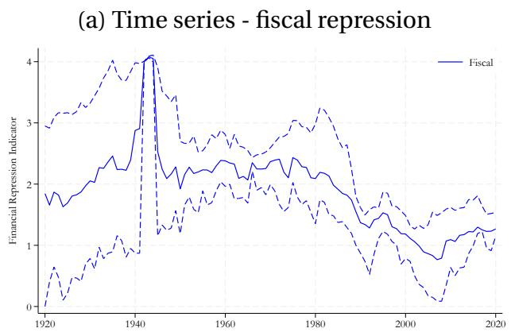

(b) Time series - fiscal and monetary repression  
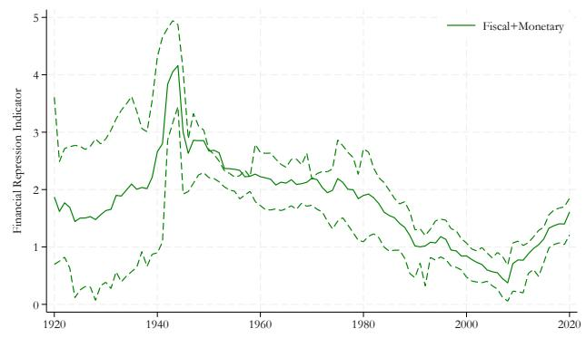

(c) By era  
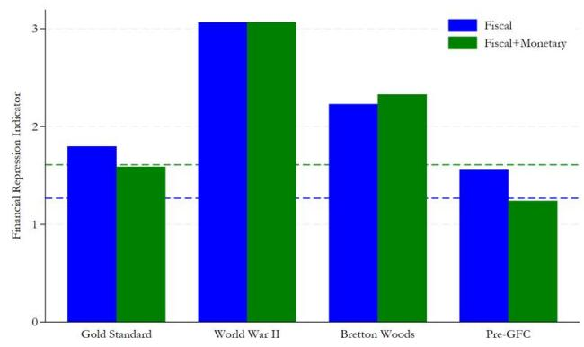

Notes: Measures are normalized relative to the minimum value for each country. In panels (a) and (b), solid lines denote the mean across countries and dashed lines the 25th and 75th percentiles. In panel (c), bars denote period averages across countries, and the horizontal dashed lines denote end-2020 values for the fiscal (blue) and consolidated fiscal-and-monetary (green) indicators. Eras are defined as: Gold Standard, 1920-1929; World War II, 1939-1945; Bretton Woods, 1946-1970; Pre-GFC, 1971-2007. The years following the collapse of the Gold Standard before WWII (1930 to 1938) are not shown.

## 4.2. Correlates of Financial Repression

We test what macroeconomic characteristics are associated with our repression measures. To this end, we consider the following regression:

$$
F R _ {i, t} = \beta X _ {i, t} + \alpha_ {i} + \alpha_ {t} + \epsilon_ {i, t}\tag{9}
$$

where $X_{i,t}$ are different macroeconomic variables, and $\alpha_{i}$ and $\alpha_{t}$ are country and year fixed effects. We express $FR_{i,t}$ , as well as most right hand side variables, in standard deviations. We cluster standard errors by year. $^{19}$ The complete set of regression outputs are available in Subsection A.3.

Debt pressures. We first relate the financial repression indicators to variables that reflect fiscal sustainability pressures. The estimated coefficients $\beta$ are plotted in Figure 5. Financial repression is most pervasive when government debt burdens are high and when interest expenses are elevated. A one standard deviation greater government debt to GDP ratio or interest expenditures to GDP ratio is associated with 0.2 to 0.4 standard deviations higher indicators of financial repression. Countries where the primary balance is higher also score significantly higher on the financial repression indicators, suggesting financial repression is used as a policy tool when fiscal effort is already high and room for further adjustment may be limited.

Interest rates and asset returns. Low interest rates, both on short and long term bonds, predict significantly greater use of financial repression. Government bond yields are lower relative to yields on private assets (equity and housing) in countries that engage in more financial repression. The effective interest rate on government debt is also decreasing in the use of financial repression.

Crowding out of private investment. Our estimates suggest financial repression correlates with symptoms of crowding out of private capital. In countries with one standard deviation slower nominal or real private credit growth, the financial repression indicators are 0.1 to 0.2 standard deviations higher. Financial repression is also significantly higher in countries with lower loan-to-deposit ratios, suggesting bank deposits are used to a greater extent to fund government liabilities relative to loans to the private sector. At the same time, bank capital ratios do not predict financial repression, indicating that banks do not use more leverage when our financial repression indicators are higher.

Investment as a share of GDP is also significantly lower when the use of financial repression is higher. A one standard deviation lower investment to GDP ratio is associated with a 0.1 to 0.2 standard deviations higher financial repression indicators.

Figure 5: Associations with financial repression indicators

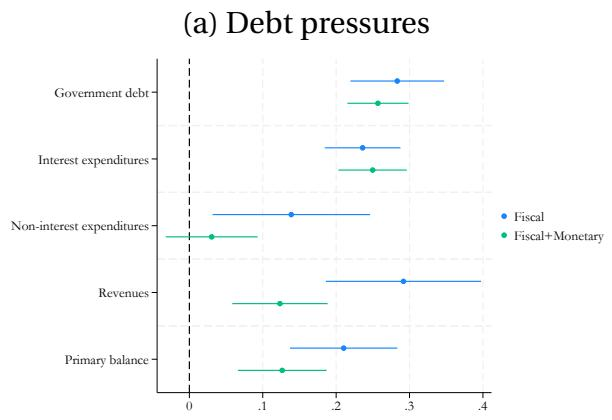

(b) Interest rates and asset returns  
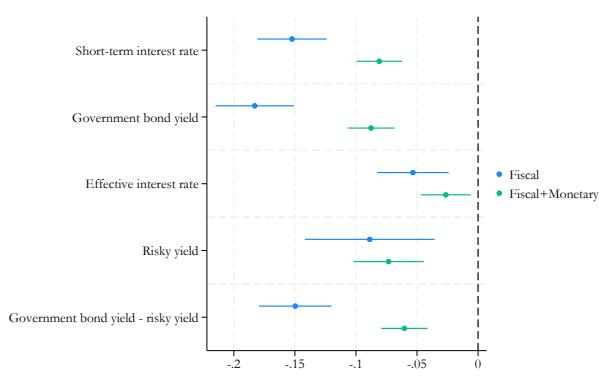

(c) Crowding out  
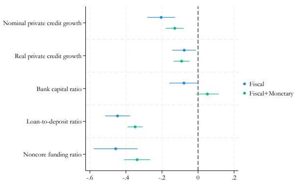

(d) Investment and saving balances  
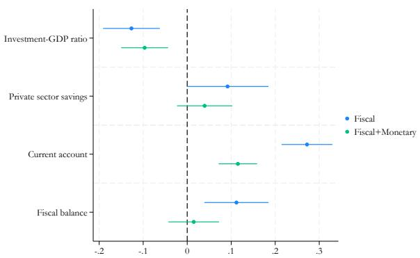  
Notes: Figure plots estimated coefficients $\beta$ from Equation 9 with 90 percent confidence intervals, with robust standard errors clustered at the annual level.

Relation to de jure policies. To assess to what extent our financial repression indicators reflect financial repression policies, we collect historical data on the use of reserve requirements (i.e. hold a minimum share of assets in cash reserves at the central bank) and portfolio requirements (i.e. hold a minimum share of assets in government bonds) for commercial banks. Our series cover France, Germany, Japan, and the United States for the post-World War II period.

We plot the relationships between the financial repression indicators and policies in Figure 6. Our indicator of monetary repression is higher in countries with larger reserve requirements. A 10 percentage point higher reserve requirement is associated with an almost one standard deviation higher score for the monetary repression indicator. In addition, the total share of assets required to be held as public sector liabilities (i.e. the sum of the reserve requirement and the portfolio requirement) is strongly correlated with our fiscal-monetary repression indicator. Countries where the total asset requirement is 10 percentage point higher score about 0.7 standard deviations higher on the fiscal-monetary repression indicator. These findings suggest that our indicators, though constructed from data on holdings of government liabilities, capture meaningful variation in the de jure policies that drive financial repression.

Figure 6: Associations with financial repression policies  
(a) Reserve requirements and monetary repres- (b) Total asset requirements and fiscal- sion monetary repression  
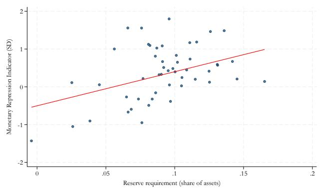

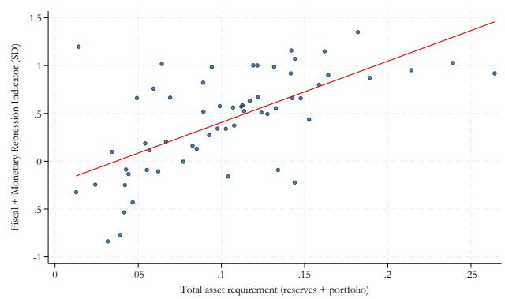  
Notes: Sample restricted to the post-World War II period before the introduction of Basel requirements (1945-2007) for France, Germany, Japan, and the United States. The relationships are conditional on country fixed effects.

## 5. Financial Repression in Sovereign Debt Dynamics

Having measured financial repression across 17 advanced economies since 1920, we now turn to its role in debt dynamics. The central question is how much repression contributed to observed changes in sovereign debt ratios, relative to other channels through which governments reduce debt burdens. $^{20}$

We address this question using a debt decomposition framework. At the core of our analysis is the government's law of motion of debt, which is an identity linking the change in the debt-to-GDP ratio to the interest-growth differential, the primary balance, inflation surprises, central bank purchases, and residual stock-flow adjustments. By construction, these channels sum to the observed change in the debt ratio. We emphasize that the decomposition is an accounting attribution: each channel, including central bank purchases, measures a mechanical contribution to the change in the debt ratio and does not imply a behavioral claim or a policy motive, including on the part of the central bank. We extend the standard framework by embedding our model-implied repression wedge as a distinct channel of debt dynamics, replacing the observed sovereign interest rate with the counterfactual free-market rate recovered from the portfolio-demand model in Section 3. Financial repression can therefore be isolated as a separate contributor to debt dynamics rather than absorbed into the interest-growth differential as is done in traditional decompositions.

## 5.1. Debt Decomposition Framework

Publicly-held government debt is defined as total sovereign debt net of central bank holdings, $B_{t}^{pub} = B_{t} - B_{t}^{cb}$ . Tracking this measure rather than gross debt is important because central bank purchases of government bonds represent an intra-state transaction: they shift debt from the publicly-held to the central bank balance sheet without changing the consolidated obligation of the state to private creditors. The decomposition below therefore attributes central bank purchases as a distinct channel, leaving the publicly-held debt stock as the relevant object for measuring the burden borne by private investors.

We start by presenting estimates of the contribution of financial repression to changes in the government debt to GDP ratio. Define expected inflation as $\pi_{t}^{e} \equiv E_{t-1}\pi_{t}$ and $r_{t}^{B,free} \equiv i_{t}^{B,free} - \pi_{t}^{e}$ as the real interest rate that would prevail absent financial repression. The change in the government debt to GDP ratio $\Delta d_{t}$ can be written as

$$
\Delta d _ {t} = \frac {1}{1 + g _ {t} ^ {Y}} \Big [ (r _ {t} ^ {B, f r e e} - g _ {t}) - (\pi_ {t} - \pi_ {t} ^ {e}) + (r _ {t} ^ {B} - r _ {t} ^ {B, f r e e}) \Big ] d _ {t - 1} ^ {p u b} - p b _ {t} - c b _ {t} - h _ {t} + s f _ {t}.\tag{10}
$$

The first bracketed term $\frac{(r_{t}^{B,free}-g_{t})d_{t-1}^{pub}}{1+g_{t}^{Y}}$ captures the real interest–growth differential without financial repression, the second term $\frac{(\pi_{t}-\pi_{t}^{e})d_{t-1}^{pub}}{1+g_{t}^{Y}}$ captures surprise inflation, and the third term $\frac{(r_{t}^{B}-r_{t}^{B,free})d_{t-1}^{pub}}{1+g_{t}^{Y}}$ captures financial repression. The remaining terms capture the contributions of the primary balance $pb_{t}$ , haircuts from restructurings $h_{t}$ , and the stock-flow adjustment $sf_{t}$ to changes in the debt ratio.

The key innovation relative to standard debt decompositions is the treatment of the interest rate. In conventional frameworks, the observed sovereign borrowing cost enters the interest-growth differential directly, leaving any repression-induced compression of yields invisible. Here, the interest-growth differential is computed at the counterfactual free-market rate $r_{t}^{B,free}$ , and the gap between the observed and counterfactual rates enters as a separate repression term. Financial repression reduces the debt ratio when $r_{t}^{B} < r_{t}^{B,free}$ , that is, when regulatory pressure has compressed sovereign borrowing costs below what market-based portfolio allocation would imply. Summing equation (10) over a sequence of years gives the cumulative contribution of each channel to the change in the debt ratio over an episode, as derived in Annex A.42.

## 5.2. Measuring the Financial Repression Wedge

A key input to the debt-decomposition exercise is the counterfactual free-market real interest rate $r_{t}^{B,free}$ , which is the rate that would have prevailed in the absence of financial repression. The economic logic connecting this rate to our quantity-based measures is as follows. Repression appears in the data as banks holding more government debt than relative returns alone would warrant. To translate that quantity distortion into a borrowing-cost saving, we ask a counterfactual question: if the regulatory pressure on banks' demand were removed, by how much would the expected return on government bonds have to rise for voluntary demand to absorb the same supply of bonds? That required increase in the return is the repression wedge, and adding it to the observed rate recovers the free-market rate $r_{t}^{B,free}$ . The wedge thus converts the quantity signal measured in Section 3. into the interest-rate distortion that enters the debt decomposition. As described in detail below, we recover this rate from the portfolio-demand model in Section 3. Specifically, we solve for the increase in expected relative returns on government bonds required to clear the excess supply that would emerge once the policy-induced shift in banks' demand is removed, holding aggregate asset supplies relative to GDP fixed.

Formally, let $\bar{A}^{b}$ and $\bar{A}^{h}$ denote total assets of banks and households relative to GDP. Market clearing in the government bond market requires that the change in aggregate excess demand equals zero:

$$
\Delta D ^ {b} \equiv \Delta s _ {g} ^ {b} \bar {A} ^ {b} + \Delta s _ {g} ^ {h} \bar {A} ^ {h} = 0\tag{11}
$$

where $\Delta s_{g}^{b}$ and $\Delta s_{g}^{h}$ are the changes in government bond portfolio shares in the counterfactual equilibrium relative to the observed allocation. We recover the counterfactual equilibrium interest rate by solving for the increase in expected relative returns on government bonds that clears the market once the repression-induced demand shift is removed, holding the supply of government bonds fixed. The implied increase in returns induces portfolio reallocation by both banks and households sufficient to absorb the outstanding supply.

We implement this calculation numerically using the iterative procedure summarized in Annex A.5. A key parameter for the exercise is the elasticity of substitution, which we calibrate based on the existing literature. In particular, the elasticity for banks estimated by Eren et al. (2023) is around 33 in their baseline specification. Because their elasticities are defined within debt securities, while our model expresses portfolio shares relative to total assets, we use a lower value (20) to reflect that this broader denominator mechanically attenuates the effective response. We further make a simplifying assumption that elasticities are equal across banks and households. We examine the sensitivity of our results to alternative values of $\theta$ in subsequent robustness exercises.

Intuition. Figure 7 illustrates the market equilibrium and the role of financial repression. The vertical supply curves $S_1$ and $S_2$ represent two levels of government bond issuance, with $S_2$ reflecting a higher debt burden. In the absence of repression, the market clears at the intersection of $S_1$ and $D_1^{\text{free}}$ , yielding the equilibrium return $E(R)_1^{\text{free}}$ at quantity $Q_1$ . When the government increases issuance to $Q_2$ , the counterfactual free-market equilibrium would require a higher return $E(R)_2^{\text{free}}$ to attract sufficient voluntary demand. Financial repression disrupts this adjustment: an increase in the regulatory demand shifter $\tilde{T}_g^b$ compels banks to absorb sovereign debt at below-market terms, rotating the effective demand curve downward to $D_2^{\text{repress}}$ , so that the market clears at the lower return $E(R)_2^{\text{repress}}$ . The wedge between $E(R)_2^{\text{free}}$ and $E(R)_2^{\text{repress}}$ is the repression subsidy—the implicit transfer from captive investors to the sovereign that our measure is designed to quantify and that enters the debt decomposition in Section 5.. Figure 8 illustrates the fiscal dimension of this wedge: the gray shaded area represents the annual interest savings accruing to the government from repression, equal to the stock of publicly-held debt multiplied by the difference between the counterfactual and observed borrowing costs, $d^{pub} \cdot (r^{B,free} - r^B)$ . Figure 9 illustrates an alternative scenario in which repression is calibrated not to push the rate below the original level but simply to accommodate a larger supply of bonds at the same borrowing cost, yielding a narrower but still positive fiscal saving.

Figure 7: Financial Repression in the Government Bond Market  
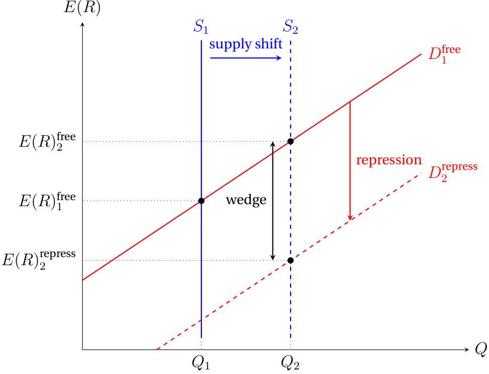  
Notes: The diagram illustrates equilibrium in the government bond market. Vertical lines $S_{1}$ and $S_{2}$ represent two levels of bond supply, with $S_{2}$ reflecting a higher debt burden. $D_{1}^{free}$ is the free-market demand curve. When supply expands from $S_{1}$ to $S_{2}$ , the counterfactual free-market equilibrium would require a higher return $E(R)_{2}^{free}$ to attract sufficient voluntary demand. Financial repression disrupts this adjustment by compelling banks to absorb sovereign debt at below-market terms, shifting effective demand downward to $D_{2}^{repress}$ and yielding the lower observed return $E(R)_{2}^{repress}$ . The wedge between $E(R)_{2}^{free}$ and $E(R)_{2}^{repress}$ is the repression subsidy quantified in Section 3.2.

Figure 8: Fiscal Savings from Financial Repression  
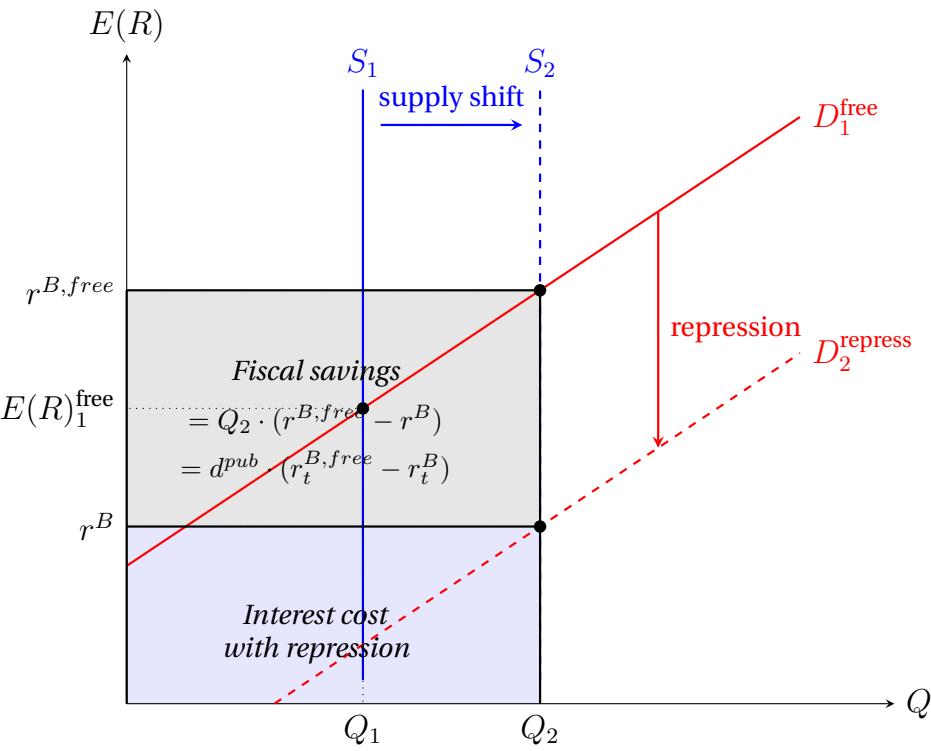  
Notes: The diagram extends Figure 7 to illustrate the fiscal savings from financial repression. When the government increases bond supply from $S_{1}$ to $S_{2}$ and deploys repression to shift effective demand downward to $D_{2}^{\mathrm{repress}}$ , the market clears at the lower return $r^{B}$ rather than the counterfactual free-market return $r^{B,free}$ . The dark shaded (gray) rectangle represents the annual fiscal savings from repression, equal to the stock of publicly-held debt $Q_{2}$ multiplied by the repression wedge $(r^{B,free} - r^{B})$ . In the debt decomposition framework of Section 5., this corresponds to the term $d_{t-1}^{pub} \cdot (r_t^{B,free} - r_t^B)$ . The light shaded (blue) rectangle represents the residual interest cost the government still bears under repression. Together the two rectangles sum to the total counterfactual interest expense $Q_{2} \cdot r^{B,free}$ that would have prevailed in the absence of repression.

Figure 10 presents the distribution of the estimated repression wedges for the fiscal and consolidated measures across countries and over time. Their estimated magnitude is substantial, with a median of 0.96 percentage points for the fiscal wedge and an even larger value for the consolidated (fiscal + monetary) wedge, implying that financial repression has historically lowered sovereign borrowing costs by economically meaningful amounts. These estimates should, however, be interpreted as lower bounds. In our framework, repression is identified only up to scale and normalization: for each country, the period with the lowest observed value of the repression indicator is normalized to define the zero-repression benchmark, and all other observations are measured relative to it. Any residual repression in that baseline period is therefore absorbed by the normalization, mechanically biasing the estimated wedges downward.

Figure 9: Fiscal Savings: Accommodating Higher Bond Supply at the Original Interest Rate  
$E(R)$  
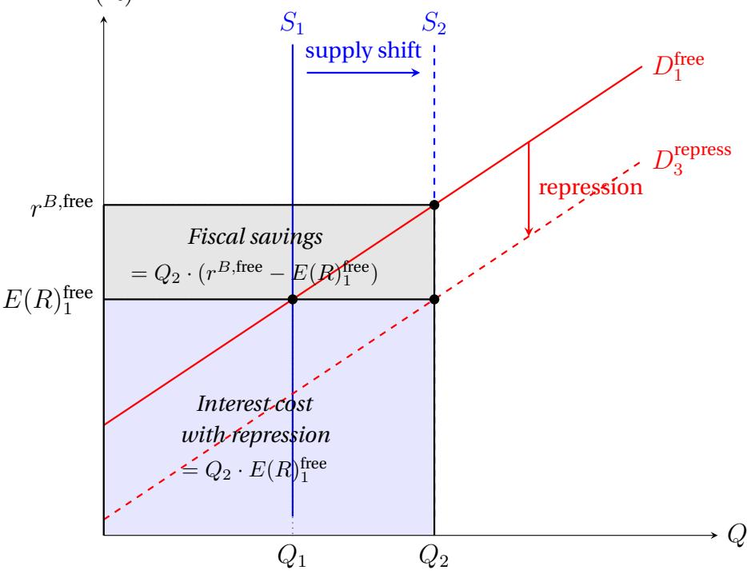  
Notes: This figure illustrates an alternative fiscal savings scenario in which financial repression is calibrated to hold the sovereign interest rate constant at its original free-market level $E(R)_{1}^{\text{free}}$ despite a higher volume of bond issuance. When supply expands from $S_{1}$ to $S_{2}$ , the free-market equilibrium without repression would require a higher return $r^{B,free}$ to attract voluntary demand. Repression instead shifts effective demand downward to $D_{3}^{repress}$ , so the market clears at $Q_{2}$ at the original rate $E(R)_{1}^{\text{free}}$ . The gray shaded rectangle represents the fiscal savings, equal to the additional bond supply multiplied by the difference between the counterfactual and maintained rates, $Q_{2} \cdot (r^{B,\text{free}} - E(R)_{1}^{\text{free}})$ . The blue shaded rectangle is the interest cost the government still bears. Compare to Figure 8, where repression pushes the rate below the original level; here, repression is exactly sufficient to accommodate larger supply without any increase in borrowing costs.

Figure 10: Distribution of Financial Repression Wedges  
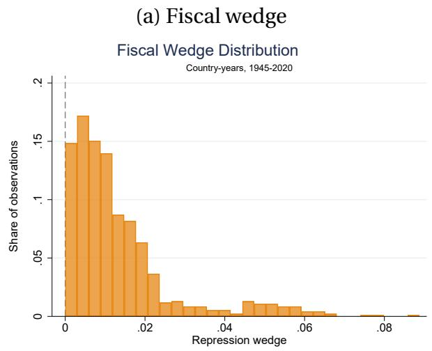

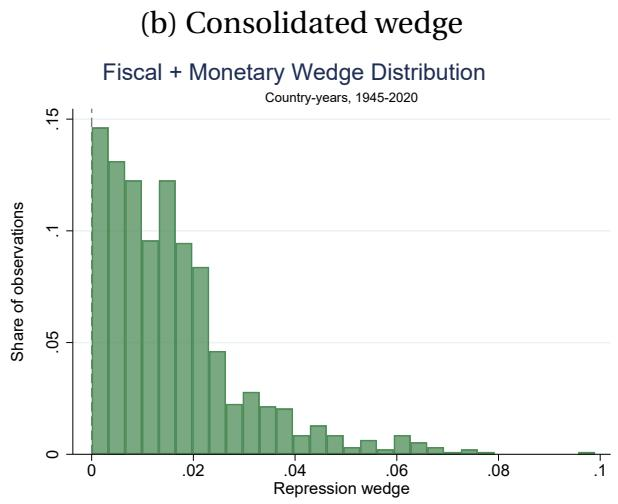  
Notes: Histograms show the distribution of model-implied repression wedges across country-year observations from 1945 to 2020.

Comparison to other wedge approaches. Our model-implied wedge is time-varying and identified from observed sectoral portfolio allocations, delivering a country-by-country, year-by-year measure of the interest-rate distortion consistent with market clearing. This contrasts with Reinhart and Sbrancia (2015), who quantify the liquidation effect by comparing the ex-post real contractual interest rate to fixed counterfactual real rates (1, 2, and 3 percent) over 1945–1980. By tying the wedge directly to observed changes in the intensity of repression (through banks' induced demand shifts) and allowing equilibrium returns to adjust endogenously, our approach avoids imposing a common counterfactual rate across countries or episodes and instead produces wedges that vary with country-specific balance sheets and portfolio responses. Relatedly, Acalin and Ball (2024) also recover interest-rate distortions through counterfactual exercises that remove policy-induced and inflation-surprise components of borrowing costs; our contribution is to discipline the counterfactual using a portfolio-demand model that maps repression-induced demand shifts into the return adjustment required to restore market clearing.

## 5.3. Results

## 5.3.1. Debt Decompositions: United Kingdom and United States

Figures 11 and 12 present the debt decompositions for the United Kingdom and the United States, respectively. Each figure shows cumulative five-year contributions from each channel, with the black line tracking the actual change in the publicly-held debt-to-GDP ratio. The right-hand panels show the corresponding consolidated liability decomposition, which includes seigniorage and monetary operations as additional channels. Overall, financial repression proved to be a significant factor in improving debt dynamics in both countries.

United Kingdom The postwar United Kingdom provides the starkest illustration of financial repression as a debt reduction channel. In the decade following World War II, publicly-held debt fell by roughly 75 percentage points of GDP. Financial repression accounts for approximately 91 percentage points of this decline, making it the single largest contributor to debt reduction in the immediate postwar window, ahead of both surprise inflation and fiscal consolidation. The repression contribution was particularly concentrated in the 1945-1950 and 1950-1955 windows, coinciding with the Bretton Woods era of administered interest rates, liquidity requirements, and restricted capital mobility. The consolidated balance sheet decomposition shows an even larger total contribution once seigniorage and reserve-based channels are included, consistent with the UK deploying both fiscal and monetary arms of the state simultaneously during this period. In the post-2008 period, the repression contribution remains positive but is smaller in magnitude, with fiscal deterioration the dominant driver of rising debt. Looking at both indicators, the post-2008 contribution works mainly through the monetary arm: reserves expanded under quantitative easing and were remunerated below the model-implied counterfactual rate, while post-crisis liquidity regulation sustained captive institutional demand for gilts. The consolidated decomposition therefore assigns a larger contribution than the narrow fiscal measure, though the fiscal measure also turns positive after the crisis, so the resurgence does not hinge on how quantitative easing is classified. Because the wedge captures only the regulatory component of below-market returns, these figures are best read as a lower bound on the contemporary contribution.

Figure 11: Debt Decomposition: United Kingdom

(a) Publicly-held debt (1945–2020)
Fiscal Repression

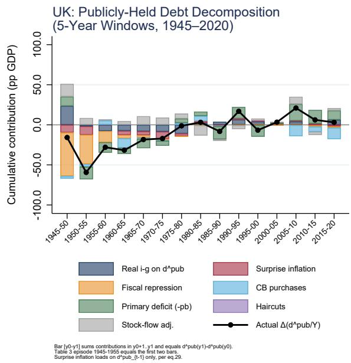  
(b) Publicly-held debt (1945–2020) Fiscal and Monetary Repression

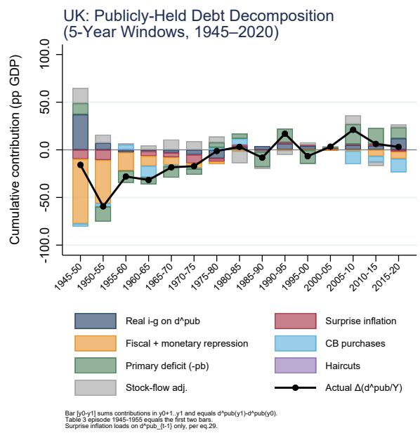  
Notes: Each bar shows the cumulative sum of annual contributions within non-overlapping five-year windows. The black line tracks the actual change in the publicly-held debt-to-GDP ratio. Financial repression is measured as $d_{t-1}^{pub} \cdot (r_t^{B,free} - r_t^B)$ , where $r_t^{B,free}$ is the model-implied counterfactual free-market rate.

United States Financial repression also contributed to postwar debt reduction in the United States, though with smaller magnitude than in the United Kingdom. In the first postwar decade, repression accounted for approximately 18 percentage points of the 46 percentage points of GDP observed debt reduction, with fiscal consolidation the dominant channel in the earliest windows. The contribution of repression diminished progressively through the 1950s and 1960s as capital mobility increased and the Bretton Woods constraints loosened. In the post-2008 period, debt has risen substantially, driven primarily by rising primary deficits; financial repression contributes a modest offset, consistent with the post-QE expansion of reserve holdings at below-market remuneration. As in the United Kingdom, the contemporary contribution of repression operates indirectly, through reserve remuneration and post-crisis liquidity rules that raise structural demand for Treasuries, rather than the explicit administered-rate regime of the Bretton Woods era. The narrow fiscal indicator also turns up after the crisis, so the post-2008 contribution does not rest on the reserve channel alone, and the estimate is again best read as a lower bound.

Figure 12: Debt Decomposition: United States

(a) Publicly-held debt (1945–2020)
Fiscal Repression

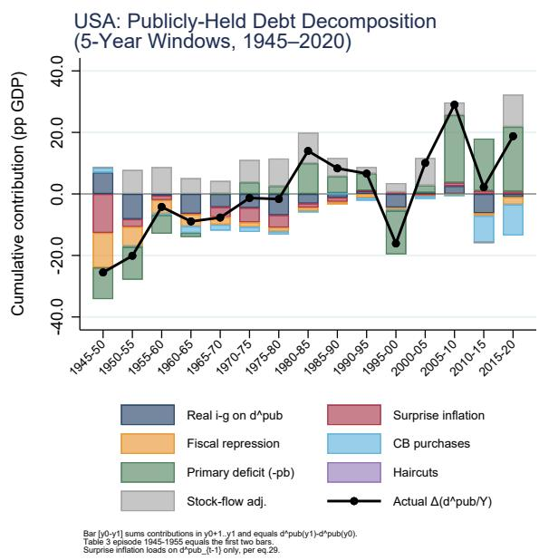  
Notes: See notes to Figure 11.  
(b) Publicly-held debt (1945–2020) Fiscal and Monetary Repression

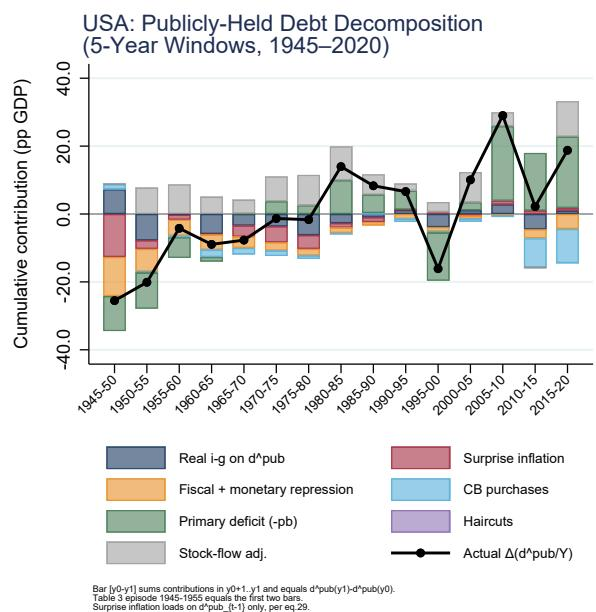

## 5.3.2. Fiscal Savings in Historical Episodes

The annual fiscal saving from financial repression is the product of the repression wedge and the stock of publicly held debt, $d_{t-1}^{pub} \cdot (r_t^{B,\text{free}} - r_t^B)$ , as illustrated in Figure 8. Cumulated over an episode, this yields the total fiscal saving as a share of GDP. Table 3 reports these estimates for selected historical episodes alongside the contributions of surprise inflation and primary balances, as well as the Reinhart-Sbrancia liquidation effect and two measures of seigniorage. The table reports results both for the two case-study countries and for the average advanced economy in our sample.

Figure 13 shows the full cross-country distribution of annual fiscal savings over time, rather than restricting attention to individual cases. The cross-country median rises sharply around World War II, peaking in the mid-1940s, recedes through the liberalization era, and turns up again after the GFC, echoing the U-shape in the repression indicators themselves. The interquartile range widens considerably during the postwar decades, indicating that while repression generated sizable fiscal savings on average, its intensity varied substantially across countries. The median fiscal savings also ticks up following the global financial crisis, consistent with the findings in Section 4.

To benchmark these estimates against more conventional monetary revenue channels, we construct two measures of seigniorage that can be calculated directly from data on central bank liabilities, short-term interest rates, and reserve requirements. The first measure, $S_{i,t}^{1}$ , captures traditional seigniorage on cash:

$$
S _ {i, t} ^ {1} = i _ {i, t} \cdot c _ {i, t}\tag{12}
$$

where $i_{i,t}$ is the short-term interest rate and $c_{i,t}$ is cash in circulation as a percent of GDP.

The second measure $S_{i,t}^{2}$ is seigniorage on unremunerated commercial bank reserves:

$$
S _ {i, t} ^ {2} = i _ {i, t} \cdot \eta_ {i, t} \cdot A _ {i, t} ^ {b}\tag{13}
$$

where $\eta_{i,t}$ is the reserve requirement for unremunerated reserves and $A_{i,t}^{b}$ is commercial bank assets as a percent of GDP.

Table 3: Cumulative Debt Dynamics: Selected Episodes

<table><tr><td rowspan="2"></td><td>United Kingdom</td><td>United States</td><td colspan="2">AE average</td></tr><tr><td>1945–1955</td><td>1945–1955</td><td>1945–1955</td><td>2008–2020</td></tr><tr><td colspan="5">Debt decomposition contributions (pp GDP)</td></tr><tr><td>Financial repression</td><td>90.7</td><td>17.5</td><td>14.8</td><td>9.8</td></tr><tr><td>Surprise inflation</td><td>20.3</td><td>15.2</td><td>6.7</td><td>-9.7</td></tr><tr><td>Primary balance</td><td>3.9</td><td>20.9</td><td>1.3</td><td>-10.7</td></tr><tr><td colspan="5">Benchmarks and comparisons (pp GDP)</td></tr><tr><td>Reinhart-Sbrancia benchmark</td><td>60.6</td><td>21.9</td><td>22.0</td><td>12.9</td></tr><tr><td>Seigniorage on cash ( $S^{1}$ )</td><td>1.5</td><td>1.8</td><td>2.1</td><td>0.2</td></tr><tr><td>Seigniorage on reserves ( $S^{2}$ )</td><td>NA</td><td>2.4</td><td>0.3</td><td>0.0</td></tr></table>

Notes: All entries represent cumulative contributions over the episode, expressed in percentage points of GDP and reported as debt-reducing contributions. Thus, a positive value indicates a reduction in public debt. Financial repression is computed as the cumulative sum of $d_{t-1}^{pub} \cdot (r_t^{B,\text{free}} - r_t^B)$ , where $r_t^{B,\text{free}}$ is the model-implied counterfactual free-market rate. Surprise inflation is computed as the cumulative sum of $(\pi_t - \pi_t^e) \cdot d_{t-1}^{pub}/(1 + g_t^Y)$ . The primary balance contribution is computed as the cumulative sum of $pb_t$ . The Reinhart–Sbrancia benchmark assumes a fixed counterfactual real interest rate of 2 percent throughout each episode. Seigniorage on cash is defined as $S^1 = i_t \cdot c_t$ , while seigniorage on unremunerated reserves is defined as $S^2 = i_t \cdot \eta_t \cdot A_t^b$ , where $\eta_t$ denotes the reserve requirement applicable to unremunerated reserves.

Figure 13: Fiscal Savings from Financial Repression, IQR  
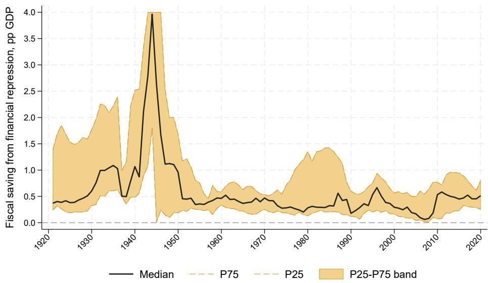  
Notes: The figure shows the cross-country distribution of fiscal savings from financial repression, in percentage points of GDP. The solid line denotes the cross-country median and the shaded area the interquartile (P25–P75) range. The 75th percentile is truncated at 4 pp of GDP; the actual peak is 8.1 pp of GDP in 1945.

Table 3 shows that the contribution of financial repression is significant relative to the other debt dynamics channels, though the magnitude varies across countries and episodes. In the postwar United Kingdom, financial repression was the dominant channel, contributing more than four times as much as surprise inflation and far exceeding the contribution of primary balances. In the United States over the same period, repression and surprise inflation were broadly comparable in magnitude, while primary surpluses remained somewhat larger. By contrast, in the post-2008 advanced-economy average, surprise inflation was negative on net and primary balances worked in the opposite direction, reflecting persistent deficits, while financial repression remained positive and acted as a partial offset to debt accumulation. These comparisons underscore that financial repression, surprise inflation, and fiscal adjustment are distinct channels that need not move together, and that the post-GFC rise in repression occurred in an environment in which the inflation channel was largely unavailable.

Table 3 also shows that estimated fiscal savings from financial repression are substantially larger than seigniorage revenues from either channel in every episode. Seigniorage on cash $(S^{1})$ and unremunerated reserves $(S^{2})$ together account for at most a few percentage points of GDP, compared with double-digit cumulative magnitudes for financial repression in the postwar cases. The contrast is particularly stark in the United Kingdom, where financial repression generated more than 90 percentage points of GDP in cumulative fiscal savings. This suggests that the implicit tax operating through below-market returns on captive public-sector liabilities was quantitatively far more important than the inflation tax on monetary holdings.

Our model-implied wedge produces estimates of fiscal savings that are broadly consistent with, but more tightly identified than, the Reinhart-Sbrancia approach, which imposes a fixed counterfactual real rate rather than recovering a time-varying wedge from observed portfolio behavior.

Finally, since the value of the elasticity parameter, $\theta$ , is central to the estimation of the model-implied wedge, we re-estimate the fiscal savings under alternative values of $\theta$ (continuing to assume the same value for banks and households). In addition to the baseline value of 20, we consider values of 30—roughly in line with the estimate reported by Eren, Schrimpf, and Xia (2023)—and 15, equal to half that benchmark. Table 9 in Annex A.6 (p. 62) reports the results. We find that, although the magnitude varies, the main conclusions remain economically unchanged: repression continues to make a sizable contribution to debt reduction in the episodes we examine. The contribution is larger when $\theta$ is lower, consistent with the idea that less elastic demand requires a larger increase in relative returns to induce investors to absorb the additional supply of government debt in the counterfactual.

## 6. Conclusions

Governments have historically used financial repression to reduce debt and fiscal pressures, yet few systematic measures of repression and its contribution to macroeconomic dynamics exist. This reflects distinct challenges arising from both limited data availability and the difficulty of computing counterfactual borrowing costs absent repression. Against this backdrop, this paper makes three contributions to the literature. First, we develop a structural portfolio choice model that exploits differences in the portfolio behavior of banks and households to identify two complementary repression indicators that span the fiscal, monetary, and consolidated perimeters of the state. Second, we construct a new historical dataset covering 17 advanced economies since 1920 and document that repression has increased to the highest levels in decades during the post-GFC period. Third, we embed a model-implied repression wedge in a unified debt-decomposition framework and show that financial repression was a quantitatively significant contributor to postwar debt reduction, with both fiscal and monetary channels re-emerging since 2008.

What does our analysis imply for fiscal dynamics in advanced economies going forward? Debt levels today are again elevated. In principle, the standard toolkit for debt reduction remains available: fiscal consolidation, growth-enhancing structural reforms, and debt restructuring. In practice, however, each channel faces important constraints. Fiscal consolidation requires strong political cohesion and social support, both of which are increasingly scarce in fragmented advanced-economy political systems. Structural reforms impose near-term costs on concentrated interests while generating benefits only gradually, often over horizons that extend beyond typical political cycles. Debt restructuring carries substantial reputational and economic costs for sovereign borrowers, including prolonged exclusion from capital markets and contractionary balance-sheet effects on domestic financial institutions holding public debt (Reinhart and Rogoff, 2009; Boren-sztein and Panizza, 2009). $^{21}$

In the absence of sufficient political support for these orthodox channels, governments may increasingly rely on less conventional ways of reducing fiscal pressures, including financial repression. Our results suggest that a drift toward repression may already be underway, whether or not this reflects explicit policy intent. The fiscal repression channel is latent because prudential requirements already create structural demand for government bonds, so incremental repression can arise through the existing regulatory perimeter without any explicit decision to repress. The monetary channel is similarly latent at scale: post-QE reserve accumulation has greatly expanded the consolidated public sector's claim on the financial system, so that remuneration policy on those reserves could become a margin along which repression operates, again without a deliberate liquidation strategy. $^{22}$ Historically, financial repression intensified under macro-financial conditions that resemble several aspects of the current environment. In particular, our correlates analysis shows that the repression indicators rise systematically with the level of public debt and with low or negative real returns on government debt, the same configuration that prevailed in the postwar decades when measured repression peaked. $^{23}$

The forward-looking reading of our results should, however, be tempered by how much today's environment differs from the historical, especially postwar, periods. While the demand-side configuration under which repression has historically recurred is once again largely in place, it is important to distinguish these demand-side triggers from the enabling conditions that historically made repression effective. In the postwar decades, captive domestic institutions, closed capital accounts, and a limited menu of substitute assets allowed governments to channel savings into public debt at administered terms. $^{24}$ Today's conditions are different. Financial markets are globally integrated, capital accounts are substantially more open, and investors have access to a far wider range of substitute assets. As a result, policies designed to create captive domestic demand for government debt may be less effective than they once were, since financial activity and savings can migrate toward alternative institutions and instruments, including nonbank financial intermediaries. The migration of intermediation outside the traditional banking system following the post-GFC regulatory tightening illustrates this dynamic. The implication is not that repression cannot recur, since our indicators suggest it already is, but that its reach may be more limited and its incidence more uneven than the postwar experience would suggest, barring major changes to financial intermediation and capital account openness.

The rise of novel financial technologies adds a further layer of complexity. Central bank digital currencies could create a new fiscal-monetary instrument that could extend the captive creditor base beyond the banking system, while stablecoins and decentralized finance may offer savers alternative stores of value outside the regulated banking system, potentially weakening traditional repression mechanisms (Reis, 2025). Provisioning rules for high-quality liquid assets backing stablecoins may be a source of additional demand for public liabilities and another pool of captive capital for states. On the capital-account dimension, repression is more effective when outflows are restricted using controls. Historical experience shows that governments have at times gone further by limiting alternative stores of value outright, as when the United States prohibited private gold ownership during the Great Depression, thereby eliminating a key exit option for savers seeking to avoid the inflation tax (Dalio, 2025). In this respect, restrictions on crypto assets or stablecoins may be viewed as a modern analogue.

We emphasize that the analysis presented in our paper is descriptive rather than prescriptive. Our aim is to measure the historical incidence and fiscal consequences of financial repression, not to endorse it as a strategy for debt reduction. $^{25}$ The broader literature emphasizes the distortionary nature of financial repression, with costs for financial development and growth (see, for example, (Jafarov et al., 2019; International Monetary Fund, 2023c)), while our analysis shows that it is associated with crowding out of private credit and investment (Section 4.). In light of these costs, measuring repression is important because it allows policymakers to identify and guard against a drift toward it—a drift that would carry precisely the efficiency and growth costs that conventional fiscal adjustment seeks to avoid.

The paper opens several directions for future research. To map our theoretical measures to the data, our empirical strategy abstracts from several complexities and adopts a set of simplifying assumptions, including about the elasticity of substitution and the composition of the non-captive investor base, given limited data on non-bank financial intermediaries. Future work could revisit these assumptions as well as country-specific normalization choices and assess how they affect the estimated magnitude of repression. Extending the framework to emerging markets, where repression has historically been an important and often explicit policy instrument, would be a natural and high-value next step. A systematic treatment of the distributional and welfare consequences of repression, and of how its incidence compares with that of fiscal adjustment, surprise inflation, and monetization, would also be valuable, since these channels fall on different constituencies. The correlates analysis documents strong associations but does not establish causality. Future work exploiting quasi-experimental variation in regulatory changes—such as the introduction of Basel III liquidity requirements or shifts in reserve remuneration policy—could sharpen identification of the repression mechanism. The interaction between financial repression and the emerging digital financial architecture—including CBDCs, stablecoins, and tokenized sovereign debt—remains largely unexplored both theoretically and empirically, and is likely to become an important area for future research in sovereign finance. Furthermore, future work can extend the paper’s sample through end-2025 to assess the evolution of repression during the post-COVID inflation surge and globally synchronized monetary policy tightening cycle. Future studies could also examine the effectiveness rather than merely the incidence of repression. Our era-based results suggest repression was more pronounced under restricted capital mobility, but we do not directly estimate how the fiscal savings from repression scale with the degree of capital-account openness. Future work could test this relationship directly. Finally, the link between financial repression and capital controls hints at a connection between repression and external imbalances that future work could formalize, connecting the measurement framework developed here to a broader and currently very active policy debate (International Monetary Fund, 2026).

## Annex

## A.1 Glossary of Algebraic Notation

```txt
Symbol Definition
Agents and investor types
i ∈ {b, h} Investor type: b = commercial banks, h = households
j ∈ {g, c} Asset type: g = government bonds, c = private corporate assets
ω Index for individual agents within a type
Asset holdings and balance sheet stocks
Bt Total (gross) nominal government debt
Btb Government bonds held by commercial banks
Bth Government bonds held by households
BCB Government bonds held by the central bank
Bpub Government debt held outside the state: Bt - Btb
Rt Interest-bearing central bank reserves
Ct Currency in circulation
Lt Consolidated nominal liabilities: Btpub + Ct + Rt
Ltc Bank loans to non-financial corporations
Dt Bank deposits
Ith Household equity claims on corporations
Kt Corporate physical capital
Wt National wealth
Ab Total commercial bank assets: Ltc + Btb + Rt
Ah Total household assets: Wt + Bh
Acb Total central bank assets
Portfolio shares and repression indicators
si Share of government bonds in total assets of investor i
sc i Share of private assets in total assets of investor i: 1 - si
sg Household benchmark portfolio share: Bh/Ah
```

Symbol Definition $s_{g}^{b,F}$ Bank government bond share (fiscal): $B^{b}/A^{b}$ $s_{g}^{b,M}$ Bank reserve share (monetary): $B^{CB}/A^{b}$ $s_{g}^{b,FM}$ Consolidated bank public sector share: $(B^{b}+B^{CB})/(A^{b})$ $\ln \tilde{s}_{g}^{i}$ Log-odds of government bond portfolio share: $\ln[s_{g}^{i}/(1-s_{g}^{i})]$ $FR^{F}$ Fiscal repression indicator: $\ln s_{g}^{b,F}-\ln s_{g}^{h}$ $FR^{M}$ Monetary repression indicator: $\ln s_{g}^{b,M}-\ln s_{g}^{h}$ $FR^{FM}$ Consolidated repression indicator: $\ln s_{g}^{b,FM}-\ln s_{g}^{h}$ Demand shifters and portfolio choice parameters $\zeta_{j}^{i}(\omega)$ Total taste shifter for investor $\omega$ of type $i$ toward asset $j$ $\tilde{\zeta}_{j}^{i}(\omega)$ Idiosyncratic taste shock: Fréchet( $\theta^{i}$ , 1) distributed $\bar{T}_{j}^{i}$ Time-invariant structural demand shifter for asset $j$ by type $i$ $\tilde{T}_{j}^{i}$ Time-varying regulatory demand shifter (financial repression term) $\theta^{i}$ Fréchet shape parameter; governs elasticity of substitution for type $i$ Returns and interest rates $R_{j}^{e}$ Gross expected return on asset $j$ : $1+r_{j}^{e}$ $r_{g}^{e}$ Net expected return on government bonds $r_{c}^{e}$ Net expected return on private corporate assets $r_{t}^{B}$ Ex-ante real rate on government debt: $i_{t}^{B}-\pi_{t}^{e}$ $r_{t}^{B,free}$ Counterfactual real rate on government debt absent repression $r_{t}^{C}$ Return on corporate assets $r_{t}^{D}$ Deposit rate $i_{t}^{B}$ Nominal interest rate on publicly-held government debt $i_{t}^{R}$ Nominal interest rate on central bank reserves

Macroeconomic aggregates and debt decomposition $Y_{t}$ Nominal GDP $g_{t}$ Real GDP growth rate $g_{t}^{Y}$ Nominal GDP growth rate: $(1+g_{t})(1+\pi_{t})-1$ $\pi_{t}$ Inflation rate (GDP deflator) $\pi_{t}^{e}$ Expected inflation formed at $t-1$ : $E_{t-1}\pi_{t}$

<table><tr><td>Symbol</td><td>Definition</td></tr><tr><td> $d_{t}^{pub}$ </td><td>Publicly-held government debt ratio:  $B_{t}^{pub}/Y_{t}$ </td></tr><tr><td> $\ell_{t}$ </td><td>Consolidated liability ratio:  $L_{t}/Y_{t}$ </td></tr><tr><td> $\varrho_{t}$ </td><td>Reserve ratio:  $R_{t}/Y_{t}$ </td></tr><tr><td> $c_{t}$ </td><td>Currency ratio:  $C_{t}/Y_{t}$ </td></tr><tr><td> $pb_{t}$ </td><td>Primary balance (surplus &gt; 0), scaled by  $Y_{t}$ </td></tr><tr><td> $cb_{t}$ </td><td>Net central bank purchases of government debt, scaled by  $Y_{t}$ </td></tr><tr><td> $h_{t}$ </td><td>Haircuts from debt restructuring, scaled by  $Y_{t}$ </td></tr><tr><td> $sf_{t}$ </td><td>Stock-flow adjustment, scaled by  $Y_{t}$ </td></tr><tr><td> $no_{t}$ </td><td>Net central bank operations, scaled by  $Y_{t}$ </td></tr><tr><td> $FR_{t}$ </td><td>Financial repression contribution:  $(r_{t}^{B}-r_{t}^{B,free})d_{t-1}^{pub}$ </td></tr><tr><td> $z^{i}$ </td><td>Share of government debt held by creditor i (data source)</td></tr></table>

## A.2 Data Construction

## A.21. Constructing the Balance Sheets

Government debt holdings. Total nominal holdings of government debt $B^{i}$ for commercial banks (i = b) and the central bank (i = cb) are constructed as

$$
B ^ {i} = z ^ {i} \cdot d \cdot Y,\tag{A.1}
$$

where $z^{i}$ is the share of government debt held by creditor i from Abbas et al. (2011), d is the government debt-to-GDP ratio from JST, and Y is nominal GDP from JST. Household nominal holdings of government debt are constructed residually as

$$
B ^ {h} = d \cdot Y - B ^ {b} - B ^ {c b}.\tag{A.2}
$$

Commercial bank reserves. Commercial bank reserves R are approximated as the difference between central bank assets $A^{cb}$ from the Bank for International Settlements and currency in circulation C from Finaeon:

$$
R = A ^ {c b} - C.\tag{A.3}
$$

Total commercial bank assets. Total commercial bank assets are approximated as

$$
A ^ {b} = L ^ {c} + B ^ {b} + R,\tag{A.4}
$$

where $L^{c}$ denotes total loans to the non-financial private sector from JST.

Household assets. Household assets are constructed as the sum of national wealth W from the World Inequality Database (Piketty and Zucman, 2014) and household holdings of government bonds:

$$
A ^ {h} = W + B ^ {h}.\tag{A.5}
$$

Standard errors in parentheses

## A.3 Empirical Results

Table 5: Correlates of Financial Repression - Debt Pressures

<table><tr><td></td><td>(1)Fiscal Repression</td><td>(2)Fiscal+Monetary Repression</td><td>(3)Fiscal Repression</td><td>(4)Fiscal+Monetary Repression</td><td>(5)Fiscal Repression</td><td>(6)Fiscal+Monetary Repression</td><td>(7)Fiscal Repression</td><td>(8)Fiscal+Monetary Repression</td><td>(9)Fiscal Repression</td><td>(10)Fiscal+Monetary Repression</td></tr><tr><td>Government debt</td><td>0.283***(0.0384)</td><td>0.257***(0.0251)</td><td></td><td></td><td></td><td></td><td></td><td></td><td></td><td></td></tr><tr><td>Interest expenditures</td><td></td><td></td><td>0.236***(0.0311)</td><td>0.250***(0.0281)</td><td></td><td></td><td></td><td></td><td></td><td></td></tr><tr><td>Non-interest expenditures</td><td></td><td></td><td></td><td></td><td>0.139**(0.0646)</td><td>0.0304(0.0377)</td><td></td><td></td><td></td><td></td></tr><tr><td>Revenues</td><td></td><td></td><td></td><td></td><td></td><td></td><td>0.292***(0.0636)</td><td>0.123***(0.0391)</td><td></td><td></td></tr><tr><td>Primary balance</td><td></td><td></td><td></td><td></td><td></td><td></td><td></td><td></td><td>0.210***(0.0441)</td><td>0.127***(0.0364)</td></tr><tr><td>Country FE</td><td>Yes</td><td>Yes</td><td>Yes</td><td>Yes</td><td>Yes</td><td>Yes</td><td>Yes</td><td>Yes</td><td>Yes</td><td>Yes</td></tr><tr><td>Year FE</td><td>Yes</td><td>Yes</td><td>Yes</td><td>Yes</td><td>Yes</td><td>Yes</td><td>Yes</td><td>Yes</td><td>Yes</td><td>Yes</td></tr><tr><td>Observations</td><td>1024</td><td>1024</td><td>1021</td><td>1021</td><td>1021</td><td>1021</td><td>1024</td><td>1024</td><td>1021</td><td>1021</td></tr><tr><td> $R^2$ </td><td>0.573</td><td>0.762</td><td>0.552</td><td>0.751</td><td>0.537</td><td>0.730</td><td>0.547</td><td>0.732</td><td>0.548</td><td>0.735</td></tr></table>

Standard errors in parentheses  
\* $p < {0.1}, *  * p < {0.05}, *  *  * p < {0.01}$

Table 6: Correlates of Financial Repression - Interest Rates and Asset Returns

<table><tr><td></td><td>(1)Fiscal Repression</td><td>(2)Monetary Repression</td><td>(3)Fiscal+Monetary Repression</td><td>(4)Fiscal Repression</td><td>(5)Monetary Repression</td><td>(6)Fiscal+Monetary Repression</td><td>(7)Fiscal Repression</td><td>(8)Monetary Repression</td><td>(9)Fiscal+Monetary Repression</td><td>(10)Fiscal Repression</td><td>(11)Monetary Repression</td><td>(12)Fiscal+Monetary Repression</td><td>(13)Fiscal Repression</td><td>(14)Monetary Repression</td><td>(15)Fiscal+Monetary Repression</td></tr><tr><td>Short-term interest rate</td><td>-0.152***(0.0171)</td><td>0.0308***(0.00946)</td><td>-0.0009***(0.0113)</td><td></td><td></td><td></td><td></td><td></td><td></td><td></td><td></td><td></td><td></td><td></td><td></td></tr><tr><td>Government bond yield</td><td></td><td></td><td></td><td>-0.183***(0.0194)</td><td>0.0619***(0.0127)</td><td>-0.0876***(0.0115)</td><td></td><td></td><td></td><td></td><td></td><td></td><td></td><td></td><td></td></tr><tr><td>Effective interest rate</td><td></td><td></td><td></td><td></td><td></td><td></td><td>-0.0533***(0.0176)</td><td>0.0200**(0.00936)</td><td>-0.0263**(0.0123)</td><td></td><td></td><td></td><td></td><td></td><td></td></tr><tr><td>Risky yield</td><td></td><td></td><td></td><td></td><td></td><td></td><td></td><td></td><td></td><td>-0.0887***(0.0320)</td><td>-0.0249(0.0233)</td><td>-0.0732***(0.0173)</td><td></td><td></td><td></td></tr><tr><td>Government bond yield - risky yield</td><td></td><td></td><td></td><td></td><td></td><td></td><td></td><td></td><td></td><td></td><td></td><td></td><td>-0.150***(0.0179)</td><td>0.0640***(0.0116)</td><td>-0.0604***(0.0114)</td></tr><tr><td>Country FE</td><td>Yes</td><td>Yes</td><td>Yes</td><td>Yes</td><td>Yes</td><td>Yes</td><td>Yes</td><td>Yes</td><td>Yes</td><td>Yes</td><td>Yes</td><td>Yes</td><td>Yes</td><td>Yes</td><td>Yes</td></tr><tr><td>Year FE</td><td>Yes</td><td>Yes</td><td>Yes</td><td>Yes</td><td>Yes</td><td>Yes</td><td>Yes</td><td>Yes</td><td>Yes</td><td>Yes</td><td>Yes</td><td>Yes</td><td>Yes</td><td>Yes</td><td>Yes</td></tr><tr><td>Observations</td><td>1024</td><td>965</td><td>1024</td><td>1024</td><td>965</td><td>1024</td><td>1019</td><td>960</td><td>1019</td><td>908</td><td>851</td><td>908</td><td>908</td><td>851</td><td>908</td></tr><tr><td> $R^2$ </td><td>0.592</td><td>0.743</td><td>0.746</td><td>0.595</td><td>0.748</td><td>0.744</td><td>0.544</td><td>0.745</td><td>0.730</td><td>0.538</td><td>0.764</td><td>0.734</td><td>0.580</td><td>0.773</td><td>0.738</td></tr></table>

Standard errors in parentheses  
\* $p < {0.1}$ ,\*\* $p < {0.05}$ ,\*\*\* $p < {0.01}$

Table 7: Correlates of Financial Repression - Credit and Bank Balance Sheet Indicators

<table><tr><td></td><td>(1)Fiscal Repression</td><td>(2)Monetary Repression</td><td>(3)Fiscal+Monetary Repression</td><td>(4)Fiscal Repression</td><td>(5)Monetary Repression</td><td>(6)Fiscal+Monetary Repression</td><td>(7)Fiscal Repression</td><td>(8)Monetary Repression</td><td>(9)Fiscal+Monetary Repression</td><td>(10)Fiscal Repression</td><td>(11)Monetary Repression</td><td>(12)Fiscal+Monetary Repression</td><td>(13)Fiscal Repression</td><td>(14)Monetary Repression</td><td>(15)Fiscal+Monetary Repression</td></tr><tr><td>Nominal private credit growth</td><td>-0.204***(0.0464)</td><td>-0.0177(0.0312)</td><td>-0.129***(0.0298)</td><td></td><td></td><td></td><td></td><td></td><td></td><td></td><td></td><td></td><td></td><td></td><td></td></tr><tr><td>Real private credit growth</td><td></td><td></td><td></td><td>-0.0767*(0.0398)</td><td>-0.0704**(0.0272)</td><td>-0.0913***(0.0266)</td><td></td><td></td><td></td><td></td><td></td><td></td><td></td><td></td><td></td></tr><tr><td>Bank capital ratio</td><td></td><td></td><td></td><td></td><td></td><td></td><td>-0.0782(0.0486)</td><td>0.233***(0.0250)</td><td>0.0519(0.0380)</td><td></td><td></td><td></td><td></td><td></td><td></td></tr><tr><td>Loan-to-deposit ratio</td><td></td><td></td><td></td><td></td><td></td><td></td><td></td><td></td><td></td><td>-0.446***(0.0416)</td><td>0.0800***(0.0268)</td><td>-0.349***(0.0255)</td><td></td><td></td><td></td></tr><tr><td>Noncore funding ratio</td><td></td><td></td><td></td><td></td><td></td><td></td><td></td><td></td><td></td><td></td><td></td><td></td><td>-0.457***(0.0733)</td><td>0.0442(0.0361)</td><td>-0.338***(0.0438)</td></tr><tr><td>Country FE</td><td>Yes</td><td>Yes</td><td>Yes</td><td>Yes</td><td>Yes</td><td>Yes</td><td>Yes</td><td>Yes</td><td>Yes</td><td>Yes</td><td>Yes</td><td>Yes</td><td>Yes</td><td>Yes</td><td>Yes</td></tr><tr><td>Year FE</td><td>Yes</td><td>Yes</td><td>Yes</td><td>Yes</td><td>Yes</td><td>Yes</td><td>Yes</td><td>Yes</td><td>Yes</td><td>Yes</td><td>Yes</td><td>Yes</td><td>Yes</td><td>Yes</td><td>Yes</td></tr><tr><td>Observations</td><td>1020</td><td>961</td><td>1020</td><td>1020</td><td>961</td><td>1020</td><td>983</td><td>926</td><td>983</td><td>980</td><td>923</td><td>980</td><td>951</td><td>894</td><td>951</td></tr><tr><td> $R^2$ </td><td>0.551</td><td>0.742</td><td>0.736</td><td>0.539</td><td>0.744</td><td>0.734</td><td>0.523</td><td>0.775</td><td>0.726</td><td>0.596</td><td>0.762</td><td>0.770</td><td>0.565</td><td>0.760</td><td>0.751</td></tr></table>

\*p<0.1, \*\*p<0.05, \*\*\*p<0.01

Table 8: Correlates of Financial Repression - Investment and Saving Balances

<table><tr><td></td><td>(1)Fiscal Repression</td><td>(2)Fiscal+Monetary Repression</td><td>(3)Fiscal Repression</td><td>(4)Fiscal+Monetary Repression</td><td>(5)Fiscal Repression</td><td>(6)Fiscal+Monetary Repression</td><td>(7)Fiscal Repression</td><td>(8)Fiscal+Monetary Repression</td></tr><tr><td>Investment-GDP ratio</td><td>-0.127***(0.0389)</td><td>-0.0967***(0.0321)</td><td></td><td></td><td></td><td></td><td></td><td></td></tr><tr><td>Private sector savings</td><td></td><td></td><td>0.0917(0.0559)</td><td>0.0396(0.0378)</td><td></td><td></td><td></td><td></td></tr><tr><td>Current account</td><td></td><td></td><td></td><td></td><td>0.272***(0.0348)</td><td>0.115***(0.0264)</td><td></td><td></td></tr><tr><td>Fiscal balance</td><td></td><td></td><td></td><td></td><td></td><td></td><td>0.112**(0.0439)</td><td>0.0148(0.0346)</td></tr><tr><td>Country FE</td><td>Yes</td><td>Yes</td><td>Yes</td><td>Yes</td><td>Yes</td><td>Yes</td><td>Yes</td><td>Yes</td></tr><tr><td>Year FE</td><td>Yes</td><td>Yes</td><td>Yes</td><td>Yes</td><td>Yes</td><td>Yes</td><td>Yes</td><td>Yes</td></tr><tr><td>Observations</td><td>1022</td><td>1022</td><td>1020</td><td>1020</td><td>1022</td><td>1022</td><td>1024</td><td>1024</td></tr><tr><td> $R^2$ </td><td>0.538</td><td>0.732</td><td>0.537</td><td>0.730</td><td>0.566</td><td>0.735</td><td>0.537</td><td>0.730</td></tr></table>

Standard errors in parentheses  
\* $p < {0.1}, *  * p < {0.05}, *  *  * p < {0.01}$

## A.4 Derivations

## A.41. Derivation of the Financial Repression Measure

Starting from the portfolio share expression for investor type $i \in \{b, h\}$ :

$$
s _ {g} ^ {i} = \frac {\tilde {T} _ {g} ^ {i} (\bar {T} _ {g} ^ {i} \cdot R _ {g} ^ {e}) ^ {\theta^ {i}}}{\tilde {T} _ {g} ^ {i} (\bar {T} _ {g} ^ {i} \cdot R _ {g} ^ {e}) ^ {\theta^ {i}} + (\bar {T} _ {c} ^ {i} \cdot R _ {c} ^ {e}) ^ {\theta^ {i}}}\tag{A.6}
$$

Define the log-odds (relative demand) as

$$
\ln \tilde {s} _ {g} ^ {i} \equiv \ln \left(\frac {s _ {g} ^ {i}}{1 - s _ {g} ^ {i}}\right).\tag{A.7}
$$

Using (A.6), we obtain

$$
\ln \tilde {s} _ {g} ^ {i} = \ln \tilde {T} _ {g} ^ {i} + \theta^ {i} \left[ \ln \bar {T} _ {g} ^ {i} - \ln \bar {T} _ {c} ^ {i} + \ln R _ {g} ^ {e} - \ln R _ {c} ^ {e} \right].\tag{A.8}
$$

Taking first differences over time eliminates investor-specific constants:

$$
\Delta \ln \tilde {s} _ {g} ^ {i} = \Delta \ln \tilde {T} _ {g} ^ {i} + \theta^ {i} \left(\Delta \ln R _ {g} ^ {e} - \Delta \ln R _ {c} ^ {e}\right).\tag{A.9}
$$

Using the approximation $\Delta\ln R_{j}^{e}\approx\Delta r_{j}^{e}$ for small changes in returns, we can solve (A.9) for the change in the taste shifter:

$$
\Delta \ln \tilde {T} _ {g} ^ {i} = \Delta \ln \tilde {s} _ {g} ^ {i} - \theta^ {i} (\Delta r _ {g} ^ {e} - \Delta r _ {c} ^ {e}).\tag{A.10}
$$

Since households are not subject to financial repression, we assume

$$
\Delta \ln \tilde {T} _ {g} ^ {h} = 0.\tag{A.11}
$$

Subtracting the household expression from the bank expression in (A.10), and using (A.11), yields

$$
\Delta \ln \tilde {T} _ {g} ^ {b} = \Delta \ln \tilde {s} _ {g} ^ {b} - \Delta \ln \tilde {s} _ {g} ^ {h} - (\theta^ {b} - \theta^ {h}) (\Delta r _ {g} ^ {e} - \Delta r _ {c} ^ {e}).\tag{A.12}
$$

This expression provides the change in the policy-induced demand shifter for banks (financial repression), netting out changes in relative bond holdings, differences in substitution elasticities, and changes in relative returns.

## A.42. Debt Decomposition (Publicly-Held Government Debt)

## Step 1: Define public holdings.

We distinguish total government debt $B_{t}$ from debt held by the public $B_{t}^{pub}$ . Central bank holdings $B_{t}^{cb}$ are tracked separately because they represent monetization:

$$
B _ {t} ^ {p u b} = B _ {t} - B _ {t} ^ {c b}.\tag{A.13}
$$

## Step 2: Nominal debt accumulation.

Public debt evolves based on interest payments on previous debt and rollovers, minus the primary balance $PB_{t}$ , net central bank purchases $CB_{t}$ , and haircuts $H_{t}$ :

$$
B _ {t} ^ {p u b} = \left(1 + i _ {t} ^ {B}\right) B _ {t - 1} ^ {p u b} - P B _ {t} - C B _ {t} - H _ {t} + S F _ {t},\tag{A.14}
$$

where net central bank purchases are defined as the change in government debt held by the central bank net of interest payments: $CB_{t} \equiv \Delta B_{t}^{CB} - i_{t}^{B} B_{t-1}^{CB}$ .

## Step 3: Divide by GDP and adjust for growth and inflation.

Nominal GDP evolves as

$$
Y _ {t} = Y _ {t - 1} (1 + g _ {t}) (1 + \pi_ {t}) = Y _ {t - 1} (1 + g _ {t} ^ {Y}).\tag{A.15}
$$

Dividing (A.14) by $Y_{t}$ and subtracting $d_{t-1}^{pub}$ :

$$
\Delta d _ {t} ^ {p u b} = \frac {i _ {t} ^ {B} - g _ {t} ^ {Y}}{1 + g _ {t} ^ {Y}} d _ {t - 1} ^ {p u b} - p b _ {t} - c b _ {t} - h _ {t} + s f _ {t}.\tag{A.16}
$$

## Step 4: Define surprise inflation and financial repression.

Define $\pi_{t}^{e}\equiv E_{t-1}\pi_{t}$ and $r_{t}^{B,free}\equiv i_{t}^{B,free}-\pi_{t}^{e}$ as the real interest rate that would obtain

absent financial repression. Adding and subtracting these terms yields

$$
\Delta d _ {t} ^ {p u b} = \frac {1}{1 + g _ {t} ^ {Y}} \Big [ (r _ {t} ^ {B, f r e e} - g _ {t}) - (\pi_ {t} - \pi_ {t} ^ {e}) + (r _ {t} ^ {B} - r _ {t} ^ {B, f r e e}) \Big ] d _ {t - 1} ^ {p u b} - p b _ {t} - c b _ {t} - h _ {t} + s f _ {t},\tag{A.17}
$$

where the first bracketed term captures the real interest–growth differential, the second captures surprise inflation, and the third captures financial repression.

## Step 5: Cumulative change over T periods.

Summing over a sequence of years gives the cumulative contribution of each channel:

$$
\begin{array}{r l} {d _ {T} ^ {p u b} - d _ {0} ^ {p u b}} & {\approx \underbrace {\sum_ {t = 1} ^ {T} \frac {(r _ {t} ^ {B , f r e e} - g _ {t}) d _ {t - 1} ^ {p u b}}{1 + g _ {t} ^ {Y}}} _ {\mathrm{Realinterest-growtheffect}}} \\ & {- \underbrace {\sum_ {t = 1} ^ {T} \frac {(\pi_ {t} - \pi_ {t} ^ {e}) d _ {t - 1} ^ {p u b}}{1 + g _ {t} ^ {Y}}} _ {\mathrm{Surpriseinflation}}} \\ & {+ \underbrace {\sum_ {t = 1} ^ {T} \frac {(r _ {t} ^ {B} - r _ {t} ^ {B , f r e e}) d _ {t - 1} ^ {p u b}}{1 + g _ {t} ^ {Y}}} _ {\mathrm{Financialrepression}}} \\ & {- \underbrace {\sum_ {t = 1} ^ {T} p b _ {t}} _ {\mathrm{Fiscalconsolidation}} - \underbrace {\sum_ {t = 1} ^ {T} c b _ {t}} _ {\mathrm{Centralbankpurchases}} - \underbrace {\sum_ {t = 1} ^ {T} h _ {t}} _ {\mathrm{Haircuts}} + \underbrace {\sum_ {t = 1} ^ {T} s f _ {t}} _ {\mathrm{Stock-flowadjustments}}.} \end{array}\tag{A.18}
$$

(A.19)

(A.20)

(A.21)

## A.5 Numerical Procedure for Solving for Counterfactual Interest Rates

We solve for the counterfactual interest rates through the following iterative procedure.

1. Undo the repression shock. Reverse the policy-induced preference shifter for banks:

$$
- \Delta \ln \tilde {T} _ {g} ^ {b} = \chi , \qquad \Delta \ln \tilde {T} _ {g} ^ {h} = 0.
$$

2. Initialize the return adjustment. Start from no change in relative returns:

$$
\Delta (r _ {g} ^ {e} - r _ {c} ^ {e}) = 0.
$$

3. Update portfolio log-odds. For each investor $i \in \{b, h\}$ , compute the change in log-odds of holding government bonds:

$$
\Delta \ln \tilde {s} _ {g} ^ {i} = \Delta \ln T _ {g} ^ {i} + \theta^ {i} \Delta (r _ {g} ^ {e} - r _ {c} ^ {e}),
$$

combining the policy shock (banks only) with the price response.

4. Update portfolio shares. Construct new log-odds levels,

$$
\ln \tilde {s} _ {g} ^ {i \prime} = \ln \tilde {s} _ {g} ^ {i} + \Delta \ln \tilde {s} _ {g} ^ {i},
$$

and map them to portfolio shares using the logistic function:

$$
s _ {g} ^ {i \prime} = \frac {\exp (\ln \tilde {s} _ {g} ^ {i \prime})}{1 + \exp (\ln \tilde {s} _ {g} ^ {i \prime})}, \qquad \Delta s _ {g} ^ {i} = s _ {g} ^ {i \prime} - s _ {g} ^ {i}.
$$

5. Compute excess demand. Evaluate the market-clearing residual:

$$
\Delta D ^ {b} = \Delta s _ {g} ^ {b} \bar {A} ^ {b} + \Delta s _ {g} ^ {h} \bar {A} ^ {h}.
$$

6. Check convergence. If $|\Delta D^{b}| < \epsilon$ , the equilibrium relative return has been found.

7. Update returns and iterate. If $\Delta D^{b} < 0$ , increase $\Delta(r_{g}^{e} - r_{c}^{e})$ by $\delta$ ; if $\Delta D^{b} > 0$ , decrease it by $\delta$ . Return to step 3 and repeat until convergence.

The repression wedge for period t is then defined as the value of $\Delta(r_{g}^{e}-r_{c}^{e})$ at convergence, which gives the increase in the sovereign borrowing cost required to clear the market absent regulatory pressure on banks' portfolio allocation.

## A.6 Robustness Checks

Table 9: Robustness Checks: Financial Repression and Related Mechanisms

<table><tr><td rowspan="2"></td><td colspan="2">1945–1955</td><td colspan="2">AE Average</td></tr><tr><td>United Kingdom</td><td>United States</td><td>1945–1955</td><td>2008–2020</td></tr><tr><td colspan="5">Financial repression</td></tr><tr><td>Baseline</td><td>90.7</td><td>17.5</td><td>14.8</td><td>9.8</td></tr><tr><td>θ = 30</td><td>60.4</td><td>11.7</td><td>9.9</td><td>6.5</td></tr><tr><td>θ = 15</td><td>120.9</td><td>23.3</td><td>19.7</td><td>13.1</td></tr><tr><td>Surprise inflation</td><td>20.3</td><td>15.2</td><td>6.7</td><td>-9.7</td></tr><tr><td>Primary balance</td><td>3.9</td><td>20.9</td><td>1.3</td><td>-10.7</td></tr><tr><td>Reinhart–Sbrancia benchmark(2% real-rate counterfactual)</td><td>60.6</td><td>21.9</td><td>22.0</td><td>12.9</td></tr><tr><td>Seigniorage on cash</td><td>1.5</td><td>1.8</td><td>2.1</td><td>0.2</td></tr><tr><td>Seigniorage on reserves</td><td>NA</td><td>2.4</td><td>0.3</td><td>0.0</td></tr></table>

Notes: All entries represent cumulative contributions over the episode, expressed in percentage points of GDP and reported as debt-reducing contributions. Thus, a positive value indicates a reduction in public debt. Financial repression is computed as the cumulative sum of $d_{t-1}^{pub} \cdot (r_t^{B,\text{free}} - r_t^B)$ , where $r_t^{B,\text{free}}$ is the model-implied counterfactual free-market rate. Surprise inflation is computed as the cumulative sum of $(\pi_t - \pi_t^e) \cdot d_{t-1}^{pub}/(1 + g_t^Y)$ . The primary balance contribution is computed as the cumulative sum of $pb_t$ . The Reinhart–Sbrancia benchmark assumes a fixed counterfactual real interest rate of 2 percent throughout each episode. Seigniorage on cash is defined as $S^1 = i_t \cdot c_t$ , while seigniorage on unremunerated reserves is defined as $S^2 = i_t \cdot \eta_t \cdot A_t^b$ , where $\eta_t$ denotes the reserve requirement applicable to unremunerated reserves. The baseline financial repression estimates are based on the $\theta$ value of 20. The Reinhart–Sbrancia benchmark uses a 2 percent real-rate counterfactual. “AE” refers to the advanced economies in the sample. NA indicates that the series is not available for the relevant country-period.

## References

ABBAS, S. M. A., BELHOCINE, N., EL-GANAINY, A. and HORTON, M. (2011). A Historical Public Debt Database. IMF Economic Review, 59 (4), 717–742.

ACALIN, J. and BALL, L. (2024). Did the U.S. Really Grow Out of Its World War II Debt? Tech. Rep. WP/24/005, International Monetary Fund.

ALESINA, A., PEROTTI, R. and TAVARES, J. (1998). The political economy of fiscal adjustments. Brookings Papers on Economic Activity, 1998 (1), 197–266.

ARSLANALP, S. and TSUDA, T. (2014). Tracking global demand for advanced economy sovereign debt. IMF Economic Review, 62 (3), 430–464.

BASEL COMMITTEE ON BANKING SUPERVISION (2010). Basel III: A Global Regulatory Framework for More Resilient Banks and Banking Systems. Tech. rep., Bank for International Settlements.

BASEL COMMITTEE ON BANKING SUPERVISION (2013). Basel III: The Liquidity Coverage Ratio and Liquidity Risk Monitoring Tools. Tech. rep., Bank for International Settlements.

BASSETTO, M. and SARGENT, T. J. (2020). Shotgun wedding: Fiscal and monetary policy. Annual Review of Economics, 12, 659–690.

BECKER, B. and IVASHINA, V. (2018). Financial repression in the European sovereign debt crisis. Review of Finance, 22 (1), 83–115.

BONNER, C. (2016). Preferential regulatory treatment and banks' demand for government bonds. Journal of Money, Credit and Banking, 48 (6), 1195–1221.

BORENSZTEIN, E. and PANIZZA, U. (2009). The costs of sovereign default. IMF Staff Papers, 56 (4), 683–741.

CAMPOS, N. F., GRAUWE, P. D. and JI, Y. (2025). Structural reforms and economic performance: The experience of advanced economies. Journal of Economic Literature, 63 (1), 111–163.

CHARI, V. V., DOVIS, A. and KEHOE, P. J. (2020). On the optimality of financial repression. Journal of Political Economy, 128 (2), 710–739.

COTTARELLI, C. et al. (2017). Fiscal politics. In Fiscal Politics, 1, International Monetary Fund.

DALIO, R. (2025). How Countries Go Broke: The Big Cycle. Avid Reader Press / Simon & Schuster, first edition edn.

EICHENGREEN, B. and ESTEVES, R. (2022). Up and away? Inflation and debt consolidation in historical perspective. Oxford Open Economics, 1, odac008.

EREN, E., SCHRIMPF, A. and XIA, F. D. (2023). The Demand for Government Debt. BIS Working Papers 1105, Bank for International Settlements, revised December 2025.

FELDBERG, G. and LAWSON, T. (2020). Monetization of fiscal deficits and covid-19: A primer. Journal of Financial Crises, 2 (4), 1–35.

FURCERI, D., OSTRY, J. D., PAPAGEORGIOU, C. and QUINN, D. P. (2024). Navigating the Treacherous Political Economy of Structural Reform. Tech. rep., Bruegel.

GASPAR, V. (2024). Solving the global fiscal policy trilemma. Foreign Policy.

GIOVANNINI, A. and DE MELO, M. (1990). Government Revenue from Financial Repression. Tech. Rep. WPS 533, World Bank.

GOPINATH, G. (2024). Navigating fragmentation, conflict, and large shocks. Speech at the NBU-NBP Annual Research Conference, First Deputy Managing Director, IMF.

GRAF VON LUCKNER, C., MEYER, J., REINHART, C. M. and TREBESCH, C. (2024). Sovereign haircuts: 200 years of creditor losses. IMF Economic Review, 73, 150–195.

HALL, G. J. and SARGENT, T. J. (2011). Interest rate risk and other determinants of post-WWII U.S. government debt/GDP dynamics. American Economic Journal: Macroeconomics, 3 (3), 192–214.

HILSCHER, J., RAVIV, A. and REIS, R. (2021). Inflating away the public debt? An empirical assessment. Review of Financial Studies, 35 (3), 1553–1595.

HUMPHREY, T. M. and KELEHER, R. E. (1982). The Monetary Approach to the Balance of Payments, Exchange Rates, and World Inflation. New York: Praeger.

INTERNATIONAL MONETARY FUND (2023a). Coming down to earth: How to tackle soaring public debt. In World Economic Outlook: A Rocky Recovery, 3, Washington, DC: International Monetary Fund.

INTERNATIONAL MONETARY FUND (2023b). Fiscal Monitor: Climate Crossroads—Fiscal Policies in a Warming World. Washington, DC: International Monetary Fund.

INTERNATIONAL MONETARY FUND (2023c). Inflation and Disinflation: What Role for Fiscal Policy? Fiscal monitor: On the path to policy normalization, chapter 2, International Monetary Fund, Washington, DC.

INTERNATIONAL MONETARY FUND (2026). Understanding Global Imbalances. IMF Policy Paper PPEA/2026/006, International Monetary Fund, Washington, D.C., discussed by the IMF Executive Board on April 1, 2026.

JAFAROV, E., MAINO, R. and PANI, M. (2019). Financial Repression Is Knocking at the Door, Again: Should We Be Concerned? IMF Working Paper WP/19/211, International Monetary Fund, Washington, DC.

JEANNE, O. (2025). From Fiscal Deadlock to Financial Repression: Anatomy of a Fall. Working Paper 33395, National Bureau of Economic Research.

JORDÀ, O., SCHULARICK, M. and TAYLOR, A. M. (2017). Macrofinancial history and the new business cycle facts. NBER Macroeconomics Annual, 31, 213–263.

KOSE, M. A., OHNSORGE, F. L., REINHART, C. M. and ROGOFF, K. S. (2022). The aftermath of debt surges. Annual Review of Economics, 14 (1), 637–663.

KRISHNAMURTHY, A. and VISSING-JORGENSEN, A. (2012). The aggregate demand for treasury debt. Journal of Political Economy, 120 (2), 233–267.

LEEPER, E. M. (1991). Equilibria under ‘Active’ and ‘Passive’ monetary and fiscal policies. Journal of Monetary Economics, 27 (1), 129–147.

LEHNER, C., PAYNE, J., SHURTLEFF, J. and SZÖKE, B. (2025). The U.S. treasury funding advantage since 1860, manuscript; revise and resubmit at the Journal of Political Economy.

MAURO, P., ROMEU, R., BINDER, A. and ZAMAN, A. (2013). A Modern History of Fiscal Prudence and Profligacy. IMF Working Paper WP/13/5, International Monetary Fund.

MCKINNON, R. I. (1970). Money and Capital in Economic Development. Washington, DC: Brookings Institution.

MÜLLER-PLANTENBERG, N. et al. (2024). The Global Macro Database. Tech. rep., Global Macro Database Project.

ONGENA, S., POPOV, A. and VAN HOREN, N. (2019). The invisible hand of the government: Moral suasion during the european sovereign debt crisis. American Economic Journal: Macroeconomics, 11 (4), 346–379.

PAYNE, J. and SZÖKE, B. (2025). Inflation and regulation of government debt: Us historical evidence. Annual Review of Financial Economics, 17, 151–172, review Article, Open Access.

PIKETTY, T. and ZUCMAN, G. (2014). Capital is back: Wealth-income ratios in rich countries, 1700–2010. Quarterly Journal of Economics, 129 (3), 1255–1310.

REINHART, C. M., REINHART, V. R. and ROGOFF, K. S. (2012). Debt overhangs: Past and present. Tech. rep., National Bureau of Economic Research.

— and ROGOFF, K. S. (2009). This Time Is Different: Eight Centuries of Financial Folly. Princeton, NJ: Princeton University Press.

— and SBRANCIA, M. B. (2015). The Liquidation of Government Debt. Tech. Rep. WP/15/7, International Monetary Fund.

REIS, R. (2016). Can the Central Bank Alleviate Fiscal Burdens? NBER Working Paper 23014, National Bureau of Economic Research.

— (2022). Debt revenue and the sustainability of public debt. Journal of Economic Perspectives, 36 (4), 103–124.

— (2025). Financial repression in the XXIst century, mundell-Fleming Lecture, IMF XXVIth Jacques Polak Annual Research Conference, November 2025.

SARGENT, T. J. and WALLACE, N. (1981). Some unpleasant monetarist arithmetic. Federal Reserve Bank of Minneapolis Quarterly Review, 5 (3).

SHAW, E. S. (1973). Financial Deepening in Economic Development. New York.


## PUBLICATIONS